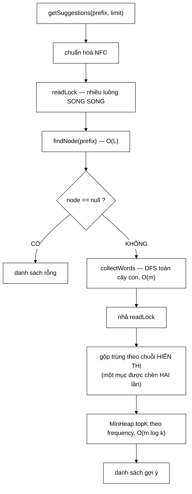

# Trie — tách khoá tra cứu khỏi chuỗi hiển thị, để gõ không dấu vẫn ra gợi ý có dấu

**File nguồn:** `search-engine/src/main/java/com/vnsearch/datastructure/Trie.java` (253 dòng)
**Gói:** `com.vnsearch.datastructure` · **Loại:** lớp thường, **an toàn đa luồng** bằng `ReentrantReadWriteLock` — và ở đây `readLock` là **thật**
**Vị trí trong luồng:** gợi ý từ khoá (autocomplete) — `/api/suggest` đọc, `SearchEngineFacade.search()` ghi
**Đọc kèm:** [`LRUCache.md`](./LRUCache.md) · [`../service/SuggestionService.md`](../service/SuggestionService.md) · [`MinHeap.md`](./MinHeap.md)

---

## 📌 Hiểu trong 30 giây

Cây tiền tố cho autocomplete. Ba điểm đáng chú ý, và điểm đầu là một giải pháp
rất gọn cho một vấn đề rất thật của tiếng Việt:

```
   ① Khoá tra cứu ≠ chuỗi hiển thị
      → gõ "cong" (không dấu) vẫn ra gợi ý "công nghệ" (có dấu)

   ② readLock THẬT SỰ song song
      → khác hẳn LRUCache, nơi get() phải dùng writeLock

   ③ Chuẩn hoá Unicode NFC
      → gõ tổ hợp hay dựng sẵn đều về cùng một nhánh cây
```



---

## 1. Vấn đề tiếng Việt: gõ không dấu, muốn gợi ý có dấu

Javadoc dòng 106–113:

> *"Người Việt thường gõ **không dấu** trên bàn phím quốc tế, nên prefix `cong`
> phải tìm ra được gợi ý `công nghệ` có dấu. Mà Trie khớp tiền tố theo **TỪNG KÝ
> TỰ chính xác**, nên `cong` **không bao giờ** đi tới được nhánh của `công nghệ`.
> Giải pháp: chèn **cùng một mục hai lần** — một lần dưới khoá có dấu, một lần
> dưới khoá không dấu — nhưng **cả hai node đều ghi nhớ cùng một chuỗi hiển thị có
> dấu**."*

```
   VÌ SAO TRIE KHÔNG TỰ GIẢI QUYẾT ĐƯỢC

   Trie đi từng ký tự một:
     'c' → 'ô' → 'n' → 'g'      ← nhánh của "công nghệ"
     'c' → 'o' → ...             ← 'o' và 'ô' là HAI ký tự khác nhau

   ⇒ Gõ "cong" đi vào nhánh 'c'→'o', KHÔNG BAO GIỜ tới 'ô'
   ⇒ Đây là bản chất của cây tiền tố, không sửa được
     bằng cách chỉnh thuật toán duyệt
```

```
   GIẢI PHÁP: CHÈN HAI LẦN, HIỂN THỊ MỘT

   trie.insert("công nghệ",  "công nghệ", 42);   ← khoá CÓ dấu
   trie.insert("cong nghe",  "công nghệ", 42);   ← khoá KHÔNG dấu
                └── khoá ──┘  └ hiển thị ┘

   Cây sau khi chèn:

        root
        ├── c─ô─n─g─␣─n─g─h─ệ   [display = "công nghệ"]
        └── c─o─n─g─␣─n─g─h─e   [display = "công nghệ"]

   Gõ "cong"  → đi nhánh dưới → hiển thị "công nghệ"  ✓
   Gõ "công"  → đi nhánh trên → hiển thị "công nghệ"  ✓

   ⇒ Người dùng LUÔN thấy bản có dấu đúng chính tả,
     bất kể họ gõ kiểu nào.
```

```java
private static class TrieNode {
    final Map<Character, TrieNode> children = new HashMap<>();
    boolean isEndOfWord = false;
    int frequency = 0;
    /** Chuỗi sẽ được HIỂN THỊ, có thể khác với khoá tra cứu dẫn tới node này.
        Null nghĩa là hiển thị đúng bằng khoá. */
    String display = null;
}
```

```
   ⭐ MỘT TRƯỜNG, VÀ NÓ GIẢI QUYẾT TRỌN VẸN VẤN ĐỀ.

   Giải pháp thay thế mà nhiều người chọn:
     - dựng chỉ mục phụ "không dấu → có dấu"  ⇒ hai cấu trúc phải đồng bộ
     - duyệt cây theo kiểu "mờ" (fuzzy)        ⇒ O(m) thay vì O(L), chậm hơn nhiều
     - chuẩn hoá TẤT CẢ về không dấu           ⇒ mất khả năng phân biệt,
                                                  đúng lỗi mà QuerySyllables đã sửa

   ⇒ Cách ở đây: giữ nguyên O(L), không thêm cấu trúc,
     đổi lại tốn gấp đôi bộ nhớ cây.
```

### 1.1 Cái giá: gợi ý bị lặp, và cách khử

```java
Map<String, Integer> bestFrequency = new LinkedHashMap<>();
for (WordFrequency wf : candidates) {
    bestFrequency.merge(wf.word, wf.frequency, Math::max);
}
```

Bình luận dòng 206–208:

> *"Gộp các mục trùng chuỗi hiển thị: cùng một gợi ý được chèn hai lần (khoá có
> dấu và khoá không dấu) nên một tiền tố ngắn có thể chạm tới **cả hai** node và
> làm gợi ý bị lặp."*

```
   KHI NÀO XẢY RA

   Tiền tố "c" chạm tới CẢ HAI nhánh:
     c─ô─n─g─...  → "công nghệ"
     c─o─n─g─...  → "công nghệ"     ← TRÙNG

   ⇒ collectWords thu được HAI mục cùng chuỗi hiển thị
   ⇒ Không khử ⇒ danh sách gợi ý có "công nghệ" hai lần
   ⇒ Với limit = 5, người dùng chỉ thấy 2–3 gợi ý KHÁC NHAU
```

```
   BA CHI TIẾT ĐÚNG TRONG PHÉP KHỬ

   ① Khoá gộp là CHUỖI HIỂN THỊ, không phải khoá tra cứu
     ⇒ đúng — hai khoá khác nhau nhưng cùng một gợi ý

   ② Math::max, không phải Integer::sum
     ⇒ hai node lưu CÙNG một tần suất (cùng một mục)
     ⇒ cộng lại sẽ NHÂN ĐÔI tần suất ⇒ xếp hạng sai
     ⇒ max cho đúng giá trị thật

   ③ LinkedHashMap, không phải HashMap
     ⇒ giữ thứ tự DFS ⇒ kết quả TẤT ĐỊNH
     ⇒ với các mục cùng tần suất, thứ tự gợi ý không
       nhảy lung tung giữa các lần chạy
```

---

## 2. `readLock` **thật sự** — đối lập với `LRUCache`

Javadoc dòng 47–51:

> *"Khác với `LRUCache` — nơi `get()` thực chất là thao tác **GHI** vì nó cập nhật
> thứ tự recency nên buộc phải dùng write lock — ở đây `getSuggestions` là đọc
> **THUẦN TUÝ** (không sửa node nào), nên nó dùng read lock thật sự và nhiều
> thread đọc được phép chạy **song song**. Chỉ `insert` và `clear` mới cần write
> lock."*

```
   ⭐ HAI LỚP CẠNH NHAU DẠY MỘT NGUYÊN TẮC

   LRUCache.get        → sửa 6 con trỏ  → writeLock
   Trie.getSuggestions → không sửa gì   → readLock

   ⇒ Chọn khoá theo HÀNH VI THẬT, không theo TÊN phương thức.
   ⇒ Và Javadoc của cả hai lớp đều trỏ sang lớp kia.
     Người đọc một lớp sẽ hiểu cả hai.
```

Javadoc dòng 39–45 nói rõ vì sao đây **không** phải cầu thị thừa:

> *"`SearchEngineFacade.search()` gọi `insert` **mỗi lần** người dùng tìm kiếm (để
> học từ chính truy vấn thật), trong khi `/api/suggest` gọi `getSuggestions` — cả
> hai chạy trên các thread HTTP **KHÁC NHAU, đồng thời**. `HashMap` vừa đọc vừa
> ghi có thể làm hỏng cấu trúc bucket (từng là lỗi nổi tiếng gây **vòng lặp vô
> hạn** ở HashMap Java 7)."*

```
   KỊCH BẢN TRANH CHẤP CÓ THẬT

   Luồng HTTP #1: POST /api/search "máy tính"
                  → SearchEngineFacade.search()
                  → trie.insert("máy tính")      ← GHI

   Luồng HTTP #2: GET /api/suggest?q=má
                  → trie.getSuggestions("má", 5) ← ĐỌC

   CÙNG LÚC, trên CÙNG một HashMap children.

   ⇒ HashMap không đồng bộ: khi resize, một luồng đang duyệt
     bucket có thể đi vào danh sách liên kết bị đảo ngược
   ⇒ VÒNG LẶP VÔ HẠN — luồng HTTP treo, chiếm 100 % một core
   ⇒ Lỗi nổi tiếng của HashMap Java 7 (Java 8 giảm nhẹ
     bằng cây đỏ-đen nhưng KHÔNG sửa triệt để)
```

### 2.1 Phần tính top-K nằm **ngoài** khoá

```java
lock.readLock().lock();
try {
    TrieNode prefixNode = findNode(normalizedPrefix);
    if (prefixNode == null) return result;
    collectWords(prefixNode, new StringBuilder(normalizedPrefix), candidates);
} finally {
    lock.readLock().unlock();
}
// ← khoá ĐÃ NHẢ. Phần dưới chỉ làm việc trên bản sao cục bộ.
```

Bình luận dòng 191–193: *"Toàn bộ phần đọc cây nằm trong khoá; phần tính top-K
sau đó chỉ làm việc trên **bản sao cục bộ**."*

```
   VÌ SAO ĐÚNG VÀ QUAN TRỌNG

   candidates là List<WordFrequency> LOCAL — các đối tượng
   WordFrequency được TẠO MỚI trong collectWords, không tham
   chiếu tới TrieNode nào.

   ⇒ Sau khi nhả khoá, dữ liệu đã "chụp ảnh" xong
   ⇒ insert() có thể chạy ngay, không phải chờ
     phần gộp trùng + top-K (là phần TỐN THỜI GIAN nhất)

   ⇒ Giữ khoá càng NGẮN càng tốt. Đây là nguyên tắc cơ bản
     nhưng rất hay bị vi phạm — vì gói cả hàm trong khoá
     thì "an toàn hơn" và dễ viết hơn.
```

```
   ⚠️ ĐÁNH ĐỔI: KẾT QUẢ CÓ THỂ HƠI CŨ

   Giữa lúc nhả khoá và lúc trả kết quả, một insert() khác
   có thể đã thêm gợi ý mới.
   ⇒ Người dùng không thấy nó ở lần này.

   Với autocomplete, đây là đánh đổi HOÀN TOÀN chấp nhận được:
   gợi ý là tính năng "tốt nhất có thể", không phải giao dịch.
```

---

## 3. Chuẩn hoá Unicode NFC

```java
private static String normalize(String s) {
    return Normalizer.normalize(s, Normalizer.Form.NFC);
}
```

Javadoc dòng 21–23: *"Chuỗi đầu vào được chuẩn hoá Unicode NFC trước khi xử lý để
đảm bảo tiếng Việt có dấu (dù gõ bằng **tổ hợp** hay **dựng sẵn**) đều trở về cùng
một chuỗi ký tự, tránh tạo **2 nhánh khác nhau** cho cùng một từ."*

```
   VẤN ĐỀ: MỘT CHỮ, HAI CÁCH MÃ HOÁ

   Chữ "ế" có thể được mã hoá:

   NFC (dựng sẵn — Composed):
     U+1EBF                          → MỘT ký tự
     "công nghệ".length() = 9

   NFD (tổ hợp — Decomposed):
     U+0065 (e) + U+0302 (◌̂) + U+0301 (◌́)  → BA ký tự
     "công nghệ".length() = 12

   ⇒ Cùng một từ, hiển thị GIỐNG HỆT trên màn hình,
     nhưng là hai chuỗi KHÁC NHAU với Java.
   ⇒ Trie tạo HAI nhánh riêng biệt.
```

```
   AI SINH RA NFD?

   - macOS: hệ thống tệp dùng NFD
   - Một số bộ gõ tiếng Việt trên iOS
   - Dữ liệu chép từ một số nguồn web

   ⇒ Không phải trường hợp hiếm. Người dùng macOS gõ "ế"
     có thể cho ra NFD mà không hề biết.

   ⇒ Không chuẩn hoá: gõ "cô" từ máy Mac không ra gợi ý
     mà máy Windows đã học được. Lỗi KHÔNG tái hiện được
     trên máy người phát triển.
```

```
   VÌ SAO CHỌN NFC CHỨ KHÔNG NFD

   NFC gộp về dạng NGẮN NHẤT ⇒ ít ký tự hơn
   ⇒ cây nông hơn ⇒ ít node hơn ⇒ nhanh hơn

   "công nghệ": NFC 9 ký tự → 9 tầng
                NFD 12 ký tự → 12 tầng

   ⇒ NFC tiết kiệm 25 % chiều sâu cây cho tiếng Việt.
```

Test `nfcAndNfdInputsOfSameWordAreTreatedAsEqual` canh giữ đúng điều này.

---

## 4. `getSuggestions` — dùng `MinHeap.topK` thay vì sắp xếp

```java
List<WordFrequency> top = MinHeap.topK(
        deduplicated, limit, Comparator.comparingInt(wf -> wf.frequency));
```

```
   VÌ SAO KHÔNG sort

   Tiền tố ngắn ("c") có thể có m = hàng nghìn từ trong cây con.
   Người dùng chỉ xem limit = 5–10 gợi ý.

   sort  : O(m log m) = 5.000 × 12 = 60.000
   topK  : O(m log k) = 5.000 × 3  = 15.000

   ⇒ Nhanh hơn 4 lần, và bộ nhớ O(k) thay vì O(m).

   ⇒ Cùng lý do với ../ranking/ResultRanker.md mục 4:
     khi k ≪ m, đừng sắp xếp cái không cần thứ tự.
```

```
   ⚠️ NHƯNG collectWords VẪN LÀ O(m) — VÀ ĐÓ MỚI LÀ ĐIỂM NGHẼN

   Trước khi topK chạy, DFS đã duyệt TOÀN BỘ cây con
   và tạo m đối tượng WordFrequency.

   Tiền tố "c" trên từ điển tiếng Việt:
     m ≈ hàng chục nghìn từ
     ⇒ hàng chục nghìn đối tượng WordFrequency + StringBuilder
     ⇒ VÀ toàn bộ phần này nằm TRONG readLock

   ⇒ Tối ưu topK chỉ cắt được phần SAU khoá.
   ⇒ Phần đắt nhất — DFS — vẫn nguyên. Xem đề xuất 1.
```

### 4.1 `collectWords` — `StringBuilder` dùng lại đúng cách

```java
private void collectWords(TrieNode node, StringBuilder prefix, List<WordFrequency> out) {
    if (node.isEndOfWord) {
        out.add(new WordFrequency(
                node.display != null ? node.display : prefix.toString(), node.frequency));
    }
    for (Map.Entry<Character, TrieNode> entry : node.children.entrySet()) {
        prefix.append(entry.getKey());
        collectWords(entry.getValue(), prefix, out);
        prefix.deleteCharAt(prefix.length() - 1);   // ← HOÀN TÁC
    }
}
```

```
   MẪU "QUAY LUI" (backtracking) KINH ĐIỂN

   append trước khi đệ quy, deleteCharAt sau khi quay về.

   ⇒ MỘT StringBuilder dùng cho TOÀN BỘ cây con
   ⇒ Không tạo chuỗi mới ở mỗi tầng

   NẾU truyền prefix + c (nối chuỗi):
     mỗi node tạo một String mới
     ⇒ O(m × L) ký tự được sao chép
     ⇒ với m = 5.000 và L = 20: 100.000 ký tự rác

   ⇒ deleteCharAt là O(1) khi xoá ký tự CUỐI.
```

```
   ⚠️ ĐỆ QUY KHÔNG CÓ GIỚI HẠN ĐỘ SÂU

   Độ sâu = độ dài chuỗi dài nhất trong cây.
   Với truy vấn người dùng (được insert tự động!), một chuỗi
   rất dài sẽ tạo cây rất sâu ⇒ StackOverflowError.

   insert() không giới hạn độ dài key.
   ⇒ Một truy vấn 10.000 ký tự ⇒ cây sâu 10.000 tầng
   ⇒ getSuggestions("") sẽ đổ ngăn xếp.

   Đây là đường tấn công có thật, vì insert được gọi
   từ mọi truy vấn tìm kiếm của người dùng.
```

---

## 5. `clear()` — $O(1)$ nhờ bộ gom rác

```java
public void clear() {
    lock.writeLock().lock();
    try {
        root = new TrieNode();
    } finally {
        lock.writeLock().unlock();
    }
}
```

Javadoc dòng 82–83: *"Chỉ cần bỏ tham chiếu tới gốc cũ là toàn bộ cây con trở
thành rác và được bộ gom rác thu hồi — không cần duyệt để giải phóng từng node."*

```
   ⇒ Đây là lợi thế của ngôn ngữ có GC, và Javadoc nói rõ.

   Trong C++: phải duyệt cây, delete từng node ⇒ O(số node)
   Trong Java: một phép gán ⇒ O(1)

   ⇒ Và vì `root` KHÔNG final (khác head/tail của LRUCache),
     phép gán này thực hiện được.

   ⇒ Lưu ý: root là trường DUY NHẤT không final trong lớp,
     và đó là lý do.
```

```
   ⚠️ clear() ĐƯỢC GỌI KHI NÀO?

   Javadoc dòng 80: "dùng khi dựng lại gợi ý sau mỗi lần reindex"

   ⇒ Đúng ý định. Nhưng LRUCache — cache kết quả tìm kiếm —
     lại KHÔNG có clear() (xem LRUCache.md đề xuất 2).

   ⇒ Hai lớp cùng cần vô hiệu hoá khi reindex, một lớp có,
     một lớp không. Không nhất quán.
```

---

## 6. Hướng dẫn thực hành

### 6.1 Chạy demo cho báo cáo

```powershell
cd search-engine
.\mvnw.cmd -q compile exec:java "-Dexec.mainClass=com.vnsearch.datastructure.Trie"
```

```
   search("may bay") = true
   search("may") = false                    ← tiền tố KHÔNG phải là từ
   suggestions("may", 2) = [may tinh, ...]  ← "may tinh" chèn 2 lần ⇒ freq cao nhất
   suggestions("trinh", 5) = [trinh duyet, trinh duyet web]

   ⇒ Dòng thứ hai minh hoạ đúng bản chất Trie: đi tới được
     node "may" không có nghĩa node đó là một từ hoàn chỉnh.
```

### 6.2 Dùng — hai dạng `insert`

```java
Trie trie = new Trie();

// Dang don gian: khoa = hien thi
trie.insert("máy tính");

// Dang day du: go khong dau van ra goi y co dau
trie.insert("công nghệ",  "công nghệ", 42);   // khoa CO dau
trie.insert("cong nghe",  "công nghệ", 42);   // khoa KHONG dau

trie.getSuggestions("cong", 5);   // → ["công nghệ"]
trie.getSuggestions("công", 5);   // → ["công nghệ"]
```

### 6.3 Cạm bẫy

```
   ① PHẢI tự chèn hai lần (có dấu + không dấu).
     Trie KHÔNG tự làm. Quên một lần ⇒ mất một kiểu gõ.
     Trách nhiệm này thuộc về SuggestionService.

   ② Dùng Integer::sum thay Math::max khi gộp trùng
     ⇒ tần suất bị NHÂN ĐÔI ⇒ xếp hạng sai.

   ③ insert(key, display, freq) GHI ĐÈ display cũ:
     node.display = normalizedDisplay;   ← gán, không merge
     ⇒ chèn lại cùng khoá với display khác ⇒ display cuối thắng.

   ④ frequency CỘNG DỒN (+=) nhưng display GHI ĐÈ (=).
     Hai trường, hai ngữ nghĩa khác nhau, không được ghi rõ.

   ⑤ getSuggestions("") duyệt TOÀN BỘ cây.
     Tiền tố rỗng ⇒ m = tất cả từ ⇒ rất đắt, trong readLock.

   ⑥ Đệ quy collectWords không giới hạn độ sâu
     ⇒ StackOverflowError với khoá rất dài.
     Và insert được gọi từ MỌI truy vấn người dùng.

   ⑦ insert bỏ qua IM LẶNG khi key rỗng hoặc frequency <= 0.
     Không ném, không log ⇒ khó chẩn đoán khi gợi ý thiếu.
```

---

## 7. Độ phức tạp & chi phí

Ký hiệu: $L$ = độ dài chuỗi, $m$ = số từ trong cây con của tiền tố, $k$ = `limit`.

| Thao tác | Thời gian | Khoá |
|---|---|---|
| `insert` | $O(L)$ | write |
| `search` | $O(L)$ | read |
| `startsWith` | $O(L)$ | read |
| `getSuggestions` | $O(L + m)$ trong khoá $+ O(m \log k)$ ngoài khoá | **read** |
| `clear` | $O(1)$ | write |
| Bộ nhớ | $O(\text{tổng ký tự})$, tốt hơn khi nhiều từ chung tiền tố | |

```
   BỘ NHỚ MỖI NODE — ĐẮT HƠN VẺ NGOÀI

   TrieNode:
     header                16 B
     HashMap children      48 B (rỗng) → tăng theo số con
     boolean isEndOfWord    1 B (căn lề 8)
     int frequency          4 B
     String display         8 B (tham chiếu)
   ────────────────────────────────────
     ≈ 88 B mỗi node, CHƯA kể nội dung HashMap

   Từ điển 100.000 từ tiếng Việt, trung bình 10 ký tự,
   chèn HAI lần (có dấu + không dấu):
     ước tính ~800.000 node × 88 B ≈ 70 MB

   ⇒ HashMap ở mỗi node là phần đắt nhất.
   ⇒ Với bảng chữ cái tiếng Việt (~90 ký tự có dấu),
     phần lớn node chỉ có 1–2 con ⇒ HashMap 48 B
     cho 1 phần tử là rất lãng phí.
```

---

## 8. Kiểm thử liên quan

| Test | Bảo vệ điều gì |
|---|---|
| `test/java/com/vnsearch/datastructure/TrieTest.java` | 12 ca |

| Ca test | Tính chất được canh giữ |
|---|---|
| `searchOnEmptyTrieReturnsFalse` | Cây rỗng |
| `insertAndSearchSingleWord` | Đường đi cơ bản |
| **`prefixOfAnInsertedWordIsNotItselfAWord`** | **`isEndOfWord` — bản chất của Trie** |
| `duplicateInsertsIncreaseFrequencyAndRankHigher` | `frequency +=` và ảnh hưởng xếp hạng |
| `vietnameseUnicodeDiacritics` | Ký tự tiếng Việt |
| **`nfcAndNfdInputsOfSameWordAreTreatedAsEqual`** | **Chuẩn hoá NFC (mục 3)** |
| `getSuggestionsRespectsLimit` | `limit` |
| `nonExistentPrefixReturnsEmptyList` | `findNode` trả `null` |
| `clearRemovesAllWords` | `clear()` |
| **`lookupKeyCanDifferFromDisplayString`** | **Khoá ≠ hiển thị (mục 1)** |
| **`duplicateDisplayStringsAreMergedInSuggestions`** | **Khử trùng bằng `Math::max` (mục 1.1)** |
| `frequencyArgumentDrivesRanking` | Tham số `frequency` |

```
   ⭐ BỘ TEST NÀY PHỦ ĐÚNG BA QUYẾT ĐỊNH THIẾT KẾ CHÍNH:

     mục 1   (khoá ≠ hiển thị)  → lookupKeyCanDifferFromDisplayString
     mục 1.1 (khử trùng)        → duplicateDisplayStringsAreMergedInSuggestions
     mục 3   (chuẩn hoá NFC)    → nfcAndNfdInputsOfSameWordAreTreatedAsEqual

   ⇒ Mỗi phần Javadoc giải thích dài đều có một test tương ứng.
   ⇒ Đây là dấu hiệu tài liệu và test được viết CÙNG NHAU,
     không phải test viết sau cho đủ.
```

**Còn thiếu:**

```
   ✗ ĐA LUỒNG — insert và getSuggestions chạy song song.
     Đây là lý do CHÍNH khiến lớp có ReentrantReadWriteLock,
     mà LRUCache CÓ ca concurrentAccessDoesNotCorruptState
     còn Trie thì KHÔNG.

   ✗ getSuggestions("") — duyệt toàn bộ cây
   ✗ insert bỏ qua key rỗng / frequency <= 0
   ✗ insert cùng khoá với display KHÁC nhau (cạm bẫy ③)
   ✗ Khoá rất dài ⇒ đệ quy sâu (cạm bẫy ⑥)
```

```powershell
cd search-engine
.\mvnw.cmd -q -Dtest='TrieTest' test
```

---

## 9. Liên kết

- Lớp dùng `writeLock` cho `get()` — nên đọc kèm để thấy sự đối lập: [`LRUCache.md`](./LRUCache.md)
- Người gọi, và nơi chịu trách nhiệm chèn hai lần: [`../service/SuggestionService.md`](../service/SuggestionService.md) · [`../controller/SuggestController.md`](../controller/SuggestController.md)
- Nơi `insert` được gọi từ mọi truy vấn người dùng: [`../service/SearchEngineFacade.md`](../service/SearchEngineFacade.md)
- Cấu trúc top-K được dùng lại: [`MinHeap.md`](./MinHeap.md)
- Nguồn `stripDiacritics` cho đề xuất 3: [`../index/VietnameseTokenizer.md`](../index/VietnameseTokenizer.md)
- Cùng kỹ thuật điểm bất động: [`../ranking/QuerySyllables.md`](../ranking/QuerySyllables.md) mục 2
- Biến thể chuyên cho tiếng Việt trong cùng gói: [`SyllableTrie.md`](./SyllableTrie.md)
