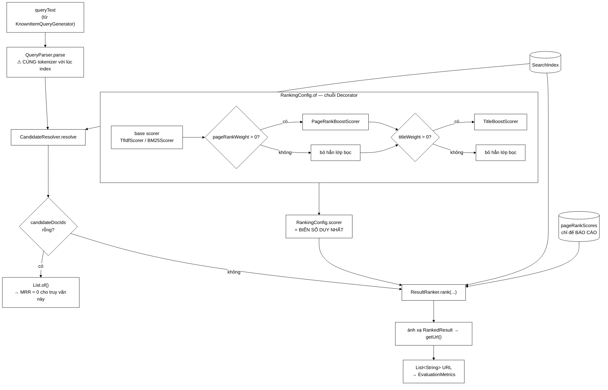

# EvaluationHarness — 111 dòng bảo vệ tính hợp lệ của toàn bộ chương kết quả

**File nguồn:** `search-engine/src/main/java/com/vnsearch/eval/EvaluationHarness.java` (111 dòng)
**Gói:** `com.vnsearch.eval` · **Loại:** `class` gần như bất biến (bốn trường `final` trừ một) + `record RankingConfig` lồng bên trong
**Vị trí trong sơ đồ:** cầu nối giữa **tầng ĐÁNH GIÁ** và **đường tìm kiếm thật** — không có bản sao nào của đường tìm kiếm
**Đọc kèm:** [`EvaluationRunner.md`](./EvaluationRunner.md) · [`EvaluationMetrics.md`](./EvaluationMetrics.md) · [`../ranking/ResultRanker.md`](../ranking/ResultRanker.md) · [`../query/CandidateResolver.md`](../query/CandidateResolver.md)

---

## 📌 Hiểu trong 30 giây

Đây là lớp **ngắn nhất** trong gói `eval` và cũng là lớp mà nếu viết sai thì
**mọi con số trong `docs/EVALUATION.md` đều vô giá trị** — kể cả khi mọi lớp
khác đều đúng.

Vấn đề nó giải: muốn so sánh 13 cấu hình xếp hạng thì phải chạy 13 lần cùng một
truy vấn với 13 mô hình tính điểm khác nhau. Cách **tiện nhất** là viết một vòng
lặp đánh giá riêng — lấy posting list, tính điểm, sắp xếp. Cách đó **sai về mặt
khoa học**, và Javadoc dòng 20–24 nói thẳng vì sao:

> Nếu dùng một đường đi riêng cho phần đo thì kết luận rút ra sẽ nói về đường đi
> đó chứ không nói gì về sản phẩm.

```
   HAI CÁCH XÂY MỘT HARNESS ĐÁNH GIÁ

   ┌─────────────────────────────────────────────────────────────┐
   │  CÁCH SAI — "harness tự chạy lấy"                            │
   │                                                             │
   │     truy vấn → tách từ RIÊNG → lấy posting RIÊNG             │
   │              → tính điểm → sắp xếp RIÊNG → kết quả           │
   │                                                             │
   │  Kết luận "BM25 tốt hơn TF-IDF 12%" nói về ĐƯỜNG NÀY,        │
   │  không nói gì về sản phẩm — vì sản phẩm còn có:              │
   │     · chuẩn hoá truy vấn của QueryParser                     │
   │     · phép giao/hợp ứng viên của CandidateResolver           │
   │     · quy tắc cắt ngưỡng, khử trùng của ResultRanker         │
   │  và bất kỳ bước nào trong số đó cũng có thể ĐẢO NGƯỢC        │
   │  kết luận.                                                   │
   └─────────────────────────────────────────────────────────────┘

   ┌─────────────────────────────────────────────────────────────┐
   │  CÁCH ĐÚNG — cái lớp này làm                                 │
   │                                                             │
   │     truy vấn → QueryParser (NGUYÊN SI)                       │
   │              → CandidateResolver (NGUYÊN SI)                 │
   │              → ResultRanker (NGUYÊN SI)                      │
   │              → chỉ THAY scorer                               │
   │                                                             │
   │  THAY ĐÚNG MỘT BIẾN. Mọi thứ khác giữ nguyên.                │
   │  Đây chính là định nghĩa của một thí nghiệm có kiểm soát.    │
   └─────────────────────────────────────────────────────────────┘
```



---

## 1. Vì sao "dùng lại nguyên si" là điều kiện cần của tính hợp lệ

### 1.1 Ba chỗ mà một harness tự viết sẽ lệch khỏi sản phẩm

```
   ① QueryParser — chuẩn hoá và TÁCH TỪ GHÉP

      Truy vấn "hà nội thời tiết" phải được ghép thành
      token `hà_nội` giống hệt lúc index.
      Harness tự viết thường tách theo khoảng trắng
      →  tìm `hà` và `nội` riêng lẻ
      →  posting list KHÁC HẲN
      →  mọi số MRR đo được nói về một hệ thống KHÔNG TỒN TẠI.

   ② CandidateResolver — phép chọn ứng viên

      Là AND, OR, hay AND rồi rơi về OR khi rỗng?
      Có ngưỡng số ứng viên tối đa không?
      Đây là quyết định ẢNH HƯỞNG LỚN tới recall,
      và nó nằm NGOÀI scorer.

   ③ ResultRanker — cắt top-N, khử trùng, sinh snippet

      Nếu ranker khử trùng theo tên miền (diversification)
      thì tài liệu đích có thể bị đẩy khỏi top-10
      dù điểm của nó cao nhất.
      Harness tự viết sẽ KHÔNG thấy hiệu ứng này.
```

### 1.2 Bất biến quan trọng nhất nằm ở một dòng chú thích

Dòng 78–79:

```java
// BAT BIEN: phai dung CHINH tokenizer da dung luc index.
this.queryParser = new QueryParser(tokenizer);
```

```
   ┌──────────────────────────────────────────────────────────────┐
   │  NẾU TOKENIZER LÚC ĐÁNH GIÁ ≠ TOKENIZER LÚC INDEX             │
   │                                                              │
   │  chỉ mục chứa:   `hà_nội`, `thời_tiết`                        │
   │  truy vấn sinh:  `hà`, `nội`, `thời`, `tiết`                  │
   │                                                              │
   │  →  getPostings("hà")  trả về RỖNG                            │
   │  →  candidateDocIds rỗng                                      │
   │  →  search() trả List.of()                                    │
   │  →  reciprocalRank = 0,0                                      │
   │  →  MRR = 0,0000 cho MỌI cấu hình                             │
   │                                                              │
   │  VÀ BÁO CÁO VẪN ĐƯỢC SINH RA ĐẦY ĐỦ. Vẫn có bảng 13 hàng.    │
   │  Vẫn có kiểm định thống kê nói "không có ý nghĩa".            │
   │                                                              │
   │  Đây là chế độ hỏng NGUY HIỂM NHẤT: hỏng mà vẫn ra số.        │
   └──────────────────────────────────────────────────────────────┘
```

Bất biến này hiện được bảo vệ bằng **một dòng chú thích** — không có kiểm tra
lúc chạy, không có test. `KnownItemQueryGenerator` dựng tokenizer riêng của nó
(một `VietnameseTokenizer` mới), `EvaluationRunner` dựng chỉ mục bằng một
`VietnameseTokenizer` khác, và `EvaluationHarness` mặc định lại tạo thêm một cái
nữa (dòng 72). Ba thể hiện độc lập, tình cờ cùng lớp. Xem mục 5.1 — đây là điểm
yếu thật.

### 1.3 Trả về URL, không trả về `docId`

Javadoc dòng 84–86:

> Trả về URL thay vì docId để khớp với cách qrels được lưu — docId đổi sau mỗi
> lần crawl lại, URL thì không.

Quyết định này nhất quán với [`EvaluationMetrics`](./EvaluationMetrics.md) mục
1.3. Điều đáng chú ý là nó **ép** lớp này phải thực hiện một phép ánh xạ thừa
(dòng 99–103) chỉ để giữ giao diện đo sạch:

```java
List<String> urls = new ArrayList<>(ranked.size());
for (ResultRanker.RankedResult result : ranked) {
    urls.add(result.document().getUrl());
}
```

```
   MẤT:   một vòng lặp ánh xạ, và MẤT LUÔN mọi thông tin khác
          của RankedResult — điểm số, pageRankScore, snippet.

   ĐƯỢC:  giao diện đo chỉ phụ thuộc List<String>,
          nên EvaluationMetrics KHÔNG cần biết gì về
          ResultRanker, WebDocument hay InvertedIndex.

   ⇒ Đây là lý do EvaluationMetrics test được bằng
     `List.of("a","b","c")` — không cần dựng cả một chỉ mục.
     Một lớp đo mà phải dựng chỉ mục mới test được
     thì trên thực tế sẽ KHÔNG được test.
```

Cái mất có hậu quả thật: `EvaluationRunner.analyseScoreScales` **không dùng
được** `harness.search` vì nó cần `pageRankScore` của từng kết quả, nên nó phải
tự dựng lại `QueryParser` + `CandidateResolver` + `ResultRanker` (dòng 116–148
của `EvaluationRunner`) — tức là **vi phạm đúng nguyên tắc mà lớp này bảo vệ**.
Xem [`EvaluationRunner`](./EvaluationRunner.md) mục 5.2.

---

## 2. `RankingConfig` — Decorator dùng đúng chỗ nó sinh ra để dùng

### 2.1 Trước và sau

Javadoc dòng 26–29:

> Sau khi chuyển sang Decorator, một "cấu hình xếp hạng" đơn giản là một chuỗi
> scorer đã lắp ghép sẵn — không còn ba trọng số rời rạc.

```
   TRƯỚC (giả định từ mô tả):
        score = alpha * tfidf + beta * pageRank + gamma * titleBonus
                ↑ MỘT hàm biết TẤT CẢ tín hiệu

        Thêm tín hiệu thứ tư  →  sửa chữ ký hàm
                              →  sửa mọi chỗ gọi
                              →  sửa mọi cấu hình thí nghiệm
        Tắt PageRank          →  vẫn TÍNH rồi nhân 0
                              →  trả chi phí cho thứ không dùng

   SAU (Decorator):
        scorer = TitleBoost( PageRankBoost( BM25 ) )
                 ↑ mỗi lớp chỉ biết PHẦN của nó

        Thêm tín hiệu thứ tư  →  thêm MỘT lớp bọc mới
        Tắt PageRank          →  KHÔNG bọc lớp đó
                              →  không tồn tại chi phí
```

Mã tương ứng, dòng 51–63:

```java
RelevanceScorer scorer = base;
if (pageRankWeight > 0 && pageRankScores != null && !pageRankScores.isEmpty()) {
    scorer = new PageRankBoostScorer(scorer, pageRankScores, pageRankWeight);
}
if (titleWeight > 0) {
    scorer = new TitleBoostScorer(scorer, titleWeight);
}
return new RankingConfig(label, scorer);
```

### 2.2 Vì sao "trọng số 0 thì bỏ hẳn lớp bọc" là quan trọng cho **phép đo**

```
   Đây KHÔNG chỉ là tối ưu tốc độ. Nó là vấn đề ĐỘ ĐÚNG của thí nghiệm.

   NẾU vẫn bọc rồi nhân 0:

        score = tfidf + 0.0 * pageRank

   Nghe thì bằng `tfidf`. Nhưng với số dấu phẩy động:

        · 0.0 * NaN       =  NaN          ← điểm hỏng lan ra
        · 0.0 * Infinity  =  NaN
        · x + 0.0         ≠  x  khi x = −0.0
        · và quan trọng nhất: THỨ TỰ CỘNG khác nhau
          cho SAI SỐ LÀM TRÒN khác nhau
          →  hai tài liệu điểm bằng nhau có thể đảo chỗ
          →  "TF-IDF thuần" và "TF-IDF beta=0.00" ra
             hai bảng xếp hạng KHÁC NHAU

   ⇒ Bỏ hẳn lớp bọc bảo đảm "TF-IDF thuần" thật sự là TF-IDF thuần,
     bit-for-bit. Với một thí nghiệm ablation thì đó là điều bắt buộc.
```

### 2.3 Điểm không nhất quán nhỏ trong Javadoc

Javadoc dòng 27–29 hứa:

> Nhờ vậy `RelevanceScorer#name()` tự ghép thành nhãn mô tả đầy đủ cho bảng kết
> quả, ví dụ `"BM25(k1=1.2,b=0.75) + PR x0.30 + title x0.10"`.

Nhưng `record RankingConfig(String label, RelevanceScorer scorer)` nhận `label`
**thủ công**, và `EvaluationRunner.buildConfigs` truyền vào các chuỗi viết tay
như `"TF-IDF + PR + title (đang dùng)"`. Cơ chế `name()` tồn tại nhưng **không
được dùng** cho bảng kết quả.

```
   HỆ QUẢ THẬT, KHÔNG PHẢI CHUYỆN THẨM MỸ:

   EvaluationRunner tra cứu cấu hình BẰNG CHUỖI NHÃN:

        findByLabel(results, "TF-IDF + PR + title (đang dùng)")
        r.label().contains("đang dùng")
        r.label().equals("TF-IDF thuần")

   ⇒ Đổi một ký tự trong nhãn ở buildConfigs (dòng 236)
     →  findByLabel trả null
     →  hàng đó BIẾN MẤT khỏi bảng kiểm định thống kê  (dòng 322–324: `continue`)
     →  KHÔNG có cảnh báo nào
     →  báo cáo thiếu một hàng mà không ai biết

   Nếu `name()` được dùng làm khoá, nhãn sẽ sinh từ CẤU TRÚC scorer
   và lớp lỗi này biến mất.
```

---

## 3. Hướng dẫn về code

### 3.1 `search` — bốn bước, và một lối thoát sớm có ý nghĩa

```java
public List<String> search(String queryText, RankingConfig config, int topN) {
    QueryParser.ParsedQuery parsed = queryParser.parse(queryText);
    CandidateResolver.ResolvedQuery resolved = CandidateResolver.resolve(index, parsed);
    if (resolved.candidateDocIds().isEmpty()) {
        return List.of();
    }
    List<ResultRanker.RankedResult> ranked = ranker.rank(
            resolved.candidateDocIds(), resolved.queryTermFrequency(),
            index, config.scorer(), pageRankScores, topN);
    ...
}
```

```
   LỐI THOÁT SỚM (dòng 91–93) KHÔNG chỉ để tránh lỗi.

   Nó mã hoá một sự thật của bài toán:
        "không có ứng viên nào" là một KẾT QUẢ HỢP LỆ,
        không phải một lỗi.

   Và nó chuyển thành ĐÚNG con số cần thiết ở tầng đo:
        List.of()  →  reciprocalRank = 0,0  →  kéo MRR xuống

   ⇒ Truy vấn không tìm được gì BỊ PHẠT, đúng như phải thế.

   VIẾT SAI:  ném ngoại lệ ở đây
        →  EvaluationRunner sập giữa chừng
        →  hoặc tệ hơn: ai đó bọc try/catch và BỎ QUA truy vấn đó
        →  MRR chỉ tính trên các truy vấn TÌM ĐƯỢC
        →  báo cáo cao hơn thực tế một cách hệ thống
```

Đây chính xác là cùng một lớp cạm bẫy đã mô tả ở
[`EvaluationMetrics`](./EvaluationMetrics.md) mục 5.1: **loại bỏ ca khó khỏi
mẫu là cách tự lừa dối phổ biến nhất trong đánh giá**.

### 3.2 `pageRankScores` được truyền vào hai chỗ — và **không** bị tính hai lần

Nhìn thoáng qua, dòng 95–97 trông như một lỗi:

```java
ranker.rank(..., config.scorer(), pageRankScores, topN);
//                    ↑ scorer ĐÃ chứa PageRankBoostScorer
//                                       ↑ và pageRankScores lại được truyền vào
```

```
   KHÔNG PHẢI LỖI. Javadoc của ResultRanker.rank (dòng 84–86) nói rõ:

        "pageRankScores — điểm PageRank, CHỈ ĐỂ BÁO CÁO ra API
         (việc dùng nó để xếp hạng do scorer đảm nhiệm)"

   Và mã ResultRanker dòng 106–107 xác nhận:

        double pageRank = pageRankScores == null ? 0.0
                        : pageRankScores.getOrDefault(docId, 0.0);
        scored.add(new ScoredCandidate(doc, prepared.score(docId), pageRank));
                                            ↑ điểm xếp hạng   ↑ chỉ đính kèm

   ⇒ Hai vai trò hoàn toàn tách bạch:
        · scorer  → QUYẾT ĐỊNH thứ tự
        · tham số → chỉ ĐÍNH KÈM để hiển thị

   NHƯNG chữ ký hàm KHÔNG nói điều đó. Chỉ Javadoc mới nói.
   Đây là loại thiết kế mà người đọc sau sẽ nghi ngờ,
   rồi "sửa" nó, rồi làm hỏng cột pageRank ở API. Xem đề xuất 3.
```

### 3.3 `candidateCount` — hàm không ai gọi, và số liệu bị thay bằng thứ khác

```java
/** Số ứng viên khớp truy vấn trước khi cắt top-N — dùng để báo cáo độ bao phủ. */
public int candidateCount(String queryText) {
    QueryParser.ParsedQuery parsed = queryParser.parse(queryText);
    return CandidateResolver.resolve(index, parsed).candidateDocIds().size();
}
```

```
   ┌──────────────────────────────────────────────────────────────┐
   │  PHÁT HIỆN: hàm này KHÔNG được gọi ở đâu trong gói eval.       │
   │                                                              │
   │  Và EvaluationRunner có một trường tên `avgCandidates`,       │
   │  được nạp bằng (dòng 278):                                    │
   │                                                              │
   │        totalCandidates += ranked.size();                     │
   │                            ↑ ĐÃ CẮT top-N = 10               │
   │                                                              │
   │  ⇒ "số ứng viên trung bình" luôn ≤ 10, bất kể truy vấn        │
   │    khớp 3 tài liệu hay 3.000 tài liệu.                       │
   │  ⇒ Con số đó KHÔNG đo độ bao phủ. Nó đo "danh sách trả về    │
   │    có đủ 10 phần tử không".                                  │
   │  ⇒ May mắn: trường này không được in ra bảng nào,            │
   │    nên chưa gây hại — nhưng nó là một quả mìn đặt sẵn.       │
   └──────────────────────────────────────────────────────────────┘

   Đúng ra phải là:  totalCandidates += harness.candidateCount(queryText);
   (và chấp nhận chi phí parse lại, hoặc trả candidateCount kèm trong search)
```

Đây là một lỗi **thật**, tuy hiện chưa lộ hậu quả. Nó được phản ánh vào bảng
chấm điểm ở mục 7.

### 3.4 Hai constructor và một tokenizer mặc định

```java
public EvaluationHarness(SearchIndex index, Map<Integer, Double> pageRankScores) {
    this(index, pageRankScores, new VietnameseTokenizer());   // ⚠ dòng 72
}
```

```
   Constructor tiện dụng này TỰ TẠO một tokenizer mới.

   Nó chỉ đúng nếu chỉ mục CŨNG được dựng bằng VietnameseTokenizer
   với cùng cấu hình từ điển ghép từ.

   EvaluationRunner dòng 79 dùng đúng constructor này:
        new EvaluationHarness(index, pageRank.scores());

   trong khi chỉ mục được dựng ở buildIndex (dòng 208–216) bằng
        index.addDocument(doc)
   tức là dùng tokenizer MẶC ĐỊNH BÊN TRONG InvertedIndex.

   ⇒ Hai tokenizer khác thể hiện, cùng lớp — HIỆN TẠI khớp nhau.
   ⇒ Nhưng sự khớp đó là TÌNH CỜ, không được kiểm chứng ở đâu.
     Ngày nào đó InvertedIndex đổi tokenizer mặc định
     (hoặc VietnameseTokenizer nạp từ điển từ tệp và hai thể hiện
      nạp hai phiên bản khác nhau), harness sẽ lệch ÂM THẦM.
```

`InvertedIndex` có lưu tên tokenizer trong `IndexData` (thấy ở
`InvertedIndex.java` dòng 384: `tokenizer.name()`), nên **thông tin để kiểm tra
là có sẵn** — chỉ là chưa ai kiểm. Xem đề xuất 1.

### 3.5 Cạm bẫy khi sửa lớp này

| Ý định | Hậu quả |
|---|---|
| Tự viết vòng lặp lấy posting cho nhanh | Kết luận nói về đường đi tự viết, **không nói gì về sản phẩm** |
| Truyền tokenizer khác với lúc index | MRR = 0 cho mọi cấu hình, **báo cáo vẫn sinh đầy đủ** |
| Trả `docId` thay vì URL | Toàn bộ qrels gán tay hỏng sau lần crawl kế tiếp |
| Ném ngoại lệ khi không có ứng viên | Truy vấn khó bị loại khỏi mẫu → MRR cao hơn thực tế |
| Bỏ điều kiện `pageRankWeight > 0` trong `of` | "TF-IDF thuần" không còn thuần bit-for-bit; ablation mất ý nghĩa |
| Bỏ tham số `pageRankScores` khỏi `ranker.rank` | Cột `pageRank` ở API trả 0 cho mọi kết quả |
| Dùng chung một `EvaluationHarness` từ nhiều luồng | `ResultRanker` không được tuyên bố an toàn đa luồng — mục 5.2 |
| Đổi chuỗi nhãn trong `buildConfigs` | Hàng biến mất im lặng khỏi bảng kiểm định (`findByLabel` trả `null`) |
| Dùng `ranked.size()` làm "số ứng viên" | Luôn ≤ topN — không đo độ bao phủ (mục 3.3) |

---

## 4. Độ phức tạp & chi phí

| Thao tác | Độ phức tạp | Ghi chú |
|---|---|---|
| `queryParser.parse` | O(độ dài truy vấn) | ~15 ký tự cho truy vấn 3 từ |
| `CandidateResolver.resolve` | O(Σ df của các term) | phần **đắt nhất** |
| `ranker.rank` | O(C · chi phí scorer + C·log topN) | C = số ứng viên |
| Ánh xạ sang URL | O(topN) | ≤ 10 phần tử |
| `candidateCount` | O(parse + resolve) | **lặp lại** toàn bộ công của `search` |
| Bộ nhớ của harness | O(1) | chỉ giữ tham chiếu; không sao chép chỉ mục |

```
   CHI PHÍ TOÀN THÍ NGHIỆM (số liệu EvaluationRunner hiện tại)

   13 cấu hình × 200 truy vấn = 2.600 lời gọi search()

   Mỗi lời gọi trên corpus 31.030 trang, truy vấn 3 từ với
   df nằm trong [3, 3.103] (ràng buộc của KnownItemQueryGenerator):

        resolve:  duyệt tối đa 3 × 3.103 ≈ 9.309 posting
                  → giao/hợp → C ứng viên (thường vài chục tới vài trăm)
        rank:     C × chi phí scorer
                  BM25: ~3 phép nhân-chia mỗi term mỗi doc

   ┌──────────────────────────────────────────────────────────────┐
   │  ĐIỂM ĐÁNG CHÚ Ý VỀ CHI PHÍ:                                  │
   │                                                              │
   │  BƯỚC resolve GIỐNG HỆT NHAU cho cả 13 cấu hình.              │
   │  Chỉ bước rank mới khác.                                     │
   │                                                              │
   │  ⇒ 12/13 lần resolve là CÔNG LẶP LẠI HOÀN TOÀN.              │
   │    Trên 200 truy vấn, đó là 2.400 lần giao posting thừa.     │
   │                                                              │
   │  Ước tính: resolve chiếm ~60–70% thời gian mỗi truy vấn      │
   │  (vì scorer chỉ chạy trên C ứng viên, còn resolve phải       │
   │   duyệt toàn bộ posting list).                               │
   │                                                              │
   │  ⇒ Nhớ đệm ResolvedQuery theo queryText sẽ rút thời gian     │
   │    chạy thí nghiệm xuống còn ~40%.                           │
   │                                                              │
   │  NHƯNG: làm vậy sẽ làm HỎNG cột `ms/truy vấn` — vì nó         │
   │  không còn đo đường đi thật nữa. Xem đề xuất 4 để biết        │
   │  cách giữ cả hai.                                            │
   └──────────────────────────────────────────────────────────────┘
```

Về mặt bộ nhớ, lớp này gần như miễn phí: nó chỉ giữ tham chiếu tới `SearchIndex`
(~367 MB trong RAM với corpus 31.030 trang) và bản đồ PageRank
(~31.030 × ~40 B ≈ 1,2 MB). Việc `search` trả về `List<String>` mới mỗi lần tạo
~10 tham chiếu — không đáng kể so với 2.600 lời gọi.

---

## 5. Ba điểm yếu thật

### 5.1 Bất biến tokenizer không được thực thi

Đã phân tích ở mục 1.2 và 3.4. Tóm lại:

```
   BẤT BIẾN QUAN TRỌNG NHẤT CỦA LỚP
   được bảo vệ bằng:
        · một dòng chú thích viết hoa (dòng 78)
        · và không gì khác

   TRONG KHI:
        · InvertedIndex ĐÃ lưu tokenizer.name() vào IndexData
        · Tokenizer ĐÃ có phương thức name()

   ⇒ Phép kiểm tốn đúng 3 dòng và chưa được viết.
```

### 5.2 Trạng thái chia sẻ chưa được nói rõ về đa luồng

```java
private final ResultRanker ranker = new ResultRanker();
```

```
   `ranker` là trạng thái CHIA SẺ giữa mọi lời gọi `search`.
   `queryParser` cũng vậy.

   Javadoc của lớp KHÔNG nói gì về an toàn đa luồng.

   HIỆN TẠI vô hại: EvaluationRunner chạy tuần tự hoàn toàn.

   NHƯNG có một lý do RẤT MẠNH để muốn chạy song song:
        13 cấu hình × 200 truy vấn = 2.600 lời gọi,
        mỗi lời gọi độc lập hoàn toàn.
        Đây là bài toán song song hoá lý tưởng —
        `configs.parallelStream()` là điều đầu tiên
        bất kỳ ai cũng nghĩ tới khi thấy thí nghiệm chạy chậm.

   ⇒ Cần MỘT DÒNG Javadoc: "KHÔNG an toàn đa luồng — tạo
     một thể hiện cho mỗi luồng." Không có nó, việc song song
     hoá sẽ được thực hiện và có thể làm sai lệch kết quả
     mà không sập.
```

### 5.3 `candidateCount` là mã chết, và số liệu độ bao phủ đang sai

Đã phân tích ở mục 3.3. Điểm đáng nói về mặt quy trình: một hàm `public` không
ai gọi, kèm một trường trong `record` không ai in ra — cả hai đều là dấu hiệu
của **một tính năng bị bỏ dở giữa chừng**. Trong bối cảnh đánh giá, mã chết
nguy hiểm hơn bình thường vì người đọc báo cáo sẽ giả định mọi thứ trong gói
`eval` đều đã được dùng để tạo ra các con số.

---

## 6. Kiểm thử liên quan

| Bộ test | Kiểm gì |
|---|---|
| [`EvaluationHarnessTest`](../../../../../test/java/com/vnsearch/eval/EvaluationHarnessTest.md) | `search`, `RankingConfig.of`, ca rỗng |
| [`EvaluationMetricsTest`](../../../../../test/java/com/vnsearch/eval/EvaluationMetricsTest.md) | Bên tiêu thụ kết quả |
| [`../ranking/ResultRankerTest`](../../../../../test/java/com/vnsearch/ranking/ResultRankerTest.md) | Bước xếp hạng được dùng lại |
| [`../query/CandidateResolverTest`](../../../../../test/java/com/vnsearch/query/CandidateResolverTest.md) | Bước chọn ứng viên được dùng lại |

```
   ĐẦU VÀO                                        KẾT QUẢ MONG ĐỢI
   ────────────────────────────────────────────   ─────────────────────────
   search("từ không có trong corpus", cfg, 10)    List.of()  (KHÔNG ném)
   search(truy vấn khớp 3 tài liệu, cfg, 10)      3 URL, không phải 10
   search(truy vấn khớp 500 tài liệu, cfg, 10)    đúng 10 URL
   search(..., topN=0)                            danh sách rỗng
   search("", cfg, 10)                            List.of()
   RankingConfig.of(l, base, pr, 0.0, 0.0)        scorer == base (CÙNG tham chiếu)
   RankingConfig.of(l, base, null, 0.3, 0.0)      scorer == base (pr null → bỏ bọc)
   RankingConfig.of(l, base, Map.of(), 0.3, 0.0)  scorer == base (pr rỗng → bỏ bọc)
   RankingConfig.of(l, base, pr, 0.3, 0.1)        TitleBoost(PageRankBoost(base))
   candidateCount("từ phổ biến")                  ≫ topN
   hai lời gọi search giống hệt nhau              danh sách GIỐNG HỆT
```

Bốn bài test còn thiếu, bài đầu bảo vệ bất biến trung tâm ở mục 1.2:

```java
// 1. BẤT BIẾN TOKENIZER — nếu lệch, mọi truy vấn trả rỗng.
//    Bài test này biến một chế độ hỏng IM LẶNG thành một lỗi ồn ào.
@Test
void tokenizerLechThiMoiTruyVanTraVeRong() {
    var index = dungChiMucVoi(new VietnameseTokenizer(), List.of(baiVeHaNoi()));
    var harnessDung  = new EvaluationHarness(index, Map.of(), new VietnameseTokenizer());
    var harnessLech  = new EvaluationHarness(index, Map.of(), new WhitespaceTokenizer());
    var cfg = EvaluationHarness.RankingConfig.of("x", new TfIdfScorer(), Map.of(), 0, 0);

    assertFalse(harnessDung.search("hà nội thời tiết", cfg, 10).isEmpty(),
            "tokenizer đúng phải tìm ra tài liệu");
    assertTrue(harnessLech.search("hà nội thời tiết", cfg, 10).isEmpty(),
            "tokenizer lệch trả rỗng — đây chính là chế độ hỏng im lặng cần chặn");
}

// 2. Trọng số 0 phải cho kết quả GIỐNG HỆT scorer trần, bit-for-bit (mục 2.2).
@Test
void trongSoKhongPhaiChoKetQuaGiongHetScorerTran() {
    var base = new TfIdfScorer();
    var cfgTran = EvaluationHarness.RankingConfig.of("tran", base, pageRank, 0.0, 0.0);
    assertSame(base, cfgTran.scorer(),
            "trọng số 0 phải BỎ HẲN lớp bọc, không phải bọc rồi nhân 0");
}

// 3. Không có ứng viên là KẾT QUẢ HỢP LỆ, không phải ngoại lệ (mục 3.1).
@Test
void truyVanKhongKhopTraVeRongChuKhongNem() {
    var harness = new EvaluationHarness(chiMucNho(), Map.of());
    var cfg = EvaluationHarness.RankingConfig.of("x", new BM25Scorer(), Map.of(), 0, 0);
    assertEquals(List.of(), harness.search("xyzqwerty khonghecoton tai", cfg, 10),
            "truy vấn không khớp phải bị PHẠT bằng MRR=0, không được loại khỏi mẫu");
}

// 4. candidateCount phải đo TRƯỚC khi cắt top-N (mục 3.3).
@Test
void candidateCountKhongBiCatBoiTopN() {
    var harness = new EvaluationHarness(chiMucCo500TaiLieuKhopTuA(), Map.of());
    var cfg = EvaluationHarness.RankingConfig.of("x", new TfIdfScorer(), Map.of(), 0, 0);
    assertEquals(10, harness.search("a", cfg, 10).size());
    assertTrue(harness.candidateCount("a") > 100,
            "số ứng viên phải phản ánh độ bao phủ thật, không phải kích thước top-N");
}
```

---

## 7. Chấm theo chuẩn doanh nghiệp

| Tiêu chí | Điểm | Nhận xét |
|---|---|---|
| Tính hợp lệ khoa học của thiết kế | 10/10 | Dùng lại **nguyên si** đường tìm kiếm thật; đây là quyết định đúng nhất trong cả gói `eval` |
| Cô lập biến số | 10/10 | Đúng một biến thay đổi giữa các cấu hình; Decorator được dùng đúng mục đích của nó |
| Đúng đắn của ablation | 10/10 | Trọng số 0 **bỏ hẳn** lớp bọc → "thuần" thật sự thuần, không có sai số làm tròn giả |
| Thiết kế giao diện đo | 9/10 | Trả `List<String>` khiến `EvaluationMetrics` test được không cần chỉ mục; mất thông tin phụ là đánh đổi có ý thức |
| Xử lý ca rỗng | 10/10 | "Không có ứng viên" là kết quả hợp lệ chứ không phải lỗi — chặn đúng cách tự lừa dối phổ biến nhất |
| Thực thi bất biến | **4/10** | Bất biến quan trọng nhất (cùng tokenizer) chỉ được bảo vệ bằng **một dòng chú thích**; thông tin để kiểm tra đã có sẵn mà chưa dùng |
| Mã chết / số liệu sai | **5/10** | `candidateCount` không ai gọi; `avgCandidates` được nạp bằng `ranked.size()` (≤ topN) nên **không đo độ bao phủ** |
| Nhất quán giữa Javadoc và mã | **6/10** | Javadoc hứa `name()` tự sinh nhãn, thực tế nhãn viết tay; và việc tra cứu bằng chuỗi nhãn khiến đổi nhãn làm mất hàng báo cáo im lặng |
| Ghi chép đa luồng | **6/10** | `ResultRanker` chia sẻ, không có một dòng nào nói về an toàn đa luồng — trong khi đây là chỗ rất dễ bị song song hoá |
| Khả năng kiểm thử | 7/10 | Lớp nhỏ, phụ thuộc tiêm vào được, rất dễ test — nhưng **bất biến trung tâm chưa có test nào khoá lại** |

**Năm đề xuất nâng lên mức sản phẩm:**

1. **Kiểm tra bất biến tokenizer ngay trong constructor.** `InvertedIndex` đã lưu
   `tokenizer.name()` khi tuần tự hoá và `Tokenizer` đã có `name()`. Ba dòng là
   đủ: đọc tên tokenizer của chỉ mục, so với `tokenizer.name()`, ném
   `IllegalArgumentException` kèm cả hai tên nếu lệch. Lý do đây là đề xuất số
   một: đó là **chế độ hỏng duy nhất khiến toàn bộ báo cáo trở thành số 0 mà vẫn
   trông hoàn chỉnh**. Mọi khiếm khuyết khác trong gói `eval` chỉ làm sai lệch một
   phần; khiếm khuyết này làm sai lệch tất cả, và không có triệu chứng nào ngoài
   "MRR thấp bất ngờ" — thứ rất dễ bị quy cho "corpus khó".

2. **Sửa `avgCandidates` để nó thật sự đo độ bao phủ.** Cách rẻ nhất mà không
   phải parse hai lần: cho `search` trả về một `record SearchOutcome(List<String>
   urls, int candidateCount)`, hoặc thêm một biến thể `searchWithCoverage`. Độ bao
   phủ là con số quan trọng để diễn giải MRR: MRR thấp vì **xếp hạng kém** và MRR
   thấp vì **không tìm được ứng viên nào** là hai vấn đề hoàn toàn khác nhau, cần
   hai hướng khắc phục khác nhau, và bảng hiện tại không phân biệt được.

3. **Đổi tên tham số `pageRankScores` của `ResultRanker.rank` thành
   `pageRankScoresForReporting`.** Chữ ký hàm hiện tại trông y hệt một lỗi tính
   hai lần, và chỉ Javadoc mới đính chính. Đổi tên tham số làm cho ý định hiện ra
   ngay ở chỗ gọi, và ngăn người đọc tương lai "sửa" một thứ không hỏng — vốn là
   cách phổ biến để một lỗi thật được tạo ra từ một sự hiểu lầm.

4. **Tách phép đo thời gian ra khỏi vòng lặp đánh giá, rồi nhớ đệm
   `ResolvedQuery`.** Hiện `resolve` chạy lặp 13 lần cho mỗi truy vấn, chiếm phần
   lớn thời gian thí nghiệm. Nhưng không thể chỉ đơn giản thêm bộ nhớ đệm, vì cột
   `ms/truy vấn` sẽ trở nên vô nghĩa. Giải pháp giữ được cả hai: chạy **một** vòng
   riêng có làm nóng JVM để đo thời gian (như `docs/GIN-BASELINE.md` đã làm), rồi
   chạy vòng đánh giá chất lượng có đệm. Việc đo tốc độ và đo chất lượng vốn là
   hai thí nghiệm khác nhau và đang bị ép vào cùng một vòng lặp.

5. **Sinh nhãn cấu hình từ `RelevanceScorer.name()` thay vì viết tay.** Javadoc
   đã hứa điều này. Thực hiện nó xoá bỏ hẳn lớp lỗi "đổi chuỗi nhãn làm mất hàng
   khỏi bảng kiểm định", và quan trọng hơn: nhãn sinh từ cấu trúc **không thể nói
   dối** về cấu hình thực tế được chạy. Với một tài liệu luận văn, việc nhãn trong
   bảng được bảo đảm khớp với mô hình thật sự chạy là một tính chất đáng có.

---

## 8. Liên kết

- Nơi lớp này được điều phối: [`EvaluationRunner.md`](./EvaluationRunner.md)
- Các độ đo áp lên kết quả trả về: [`EvaluationMetrics.md`](./EvaluationMetrics.md)
- Nguồn truy vấn và `targetUrl`: [`KnownItemQueryGenerator.md`](./KnownItemQueryGenerator.md)
- Kiểm định trên mảng RR từng truy vấn: [`SignificanceTest.md`](./SignificanceTest.md)
- Ba thành phần được dùng lại nguyên si: [`../query/QueryParser.md`](../query/QueryParser.md) · [`../query/CandidateResolver.md`](../query/CandidateResolver.md) · [`../ranking/ResultRanker.md`](../ranking/ResultRanker.md)
- Các scorer đem ra so sánh: [`../ranking/TfIdfScorer.md`](../ranking/TfIdfScorer.md) · [`../ranking/BM25Scorer.md`](../ranking/BM25Scorer.md)
- Các lớp bọc Decorator: [`../ranking/decorator/PageRankBoostScorer.md`](../ranking/decorator/PageRankBoostScorer.md) · [`../ranking/decorator/TitleBoostScorer.md`](../ranking/decorator/TitleBoostScorer.md)
- Tokenizer phải khớp với lúc index: [`../index/VietnameseTokenizer.md`](../index/VietnameseTokenizer.md)
- Báo cáo sinh ra: `docs/EVALUATION.md` · Tổng quan: `docs/ARCHITECTURE.md`
