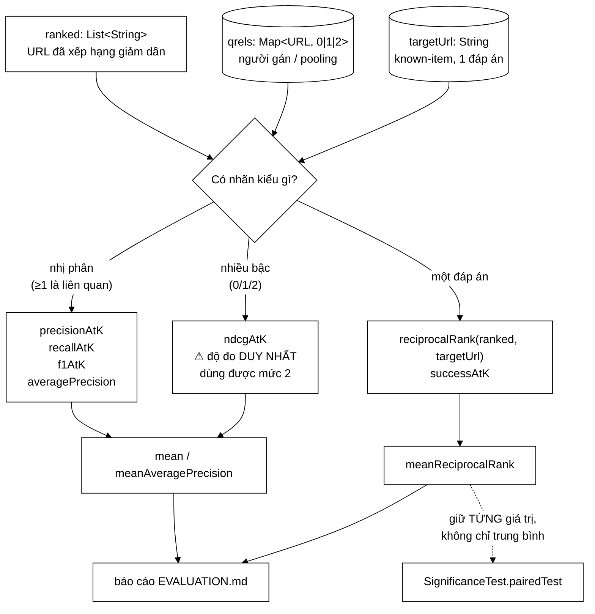

# EvaluationMetrics — sáu độ đo nói thật về chất lượng, và một cái nói dối có hệ thống

**File nguồn:** `search-engine/src/main/java/com/vnsearch/eval/EvaluationMetrics.java` (225 dòng)
**Gói:** `com.vnsearch.eval` · **Loại:** `final class`, **thuần hàm tĩnh, không trạng thái** (constructor riêng tư)
**Vị trí trong sơ đồ:** tầng **ĐO** — nằm sau `EvaluationHarness`, trước `EvaluationRunner`/`QrelsEvaluationRunner`
**Đọc kèm:** [`EvaluationHarness.md`](./EvaluationHarness.md) · [`EvaluationRunner.md`](./EvaluationRunner.md) · [`SignificanceTest.md`](./SignificanceTest.md) · [`PoolBuilder.md`](./PoolBuilder.md)

---

## 📌 Hiểu trong 30 giây

Máy tìm kiếm rất dễ **tự lừa dối**. Hệ thống có thể trả lời trong 3 ms, cache hit
94%, chỉ mục nén còn 40 MB — và xếp hạng **sai bét**. Mọi số đo hiệu năng đều
nói về *tốc độ*, không nói gì về *độ đúng*. Lớp này tồn tại để trả lời câu hỏi
duy nhất mà mọi số hiệu năng không trả lời được:

> **Thứ người dùng cần có nằm ở gần đầu danh sách không?**

Câu hỏi đó không đo được bằng "độ chính xác" theo nghĩa phân loại (đúng/sai),
vì tìm kiếm **không phải bài toán phân loại — nó là bài toán XẾP HẠNG**. Một hệ
thống trả về đúng 10 tài liệu liên quan nhưng đặt chúng ở hạng 91–100 sẽ có
"độ chính xác" giống hệt hệ thống đặt chúng ở hạng 1–10, trong khi trải nghiệm
người dùng khác nhau một trời một vực.

```
   VÌ SAO KHÔNG DÙNG "ĐỘ CHÍNH XÁC THÔ"

   Truy vấn: "bóng đá Việt Nam"      Corpus: 31.030 trang
   Số trang thật sự liên quan: 12

   Hệ thống RÁC: trả về 31.018 trang "không liên quan" cho đúng,
                 và 12 trang liên quan cũng bảo "không liên quan".
        accuracy = 31.018 / 31.030  =  99,96 %   ← ĐẸP MÀ VÔ DỤNG

   ⇒ Với dữ liệu MẤT CÂN BẰNG cực đoan (12 trên 31.030), accuracy
     luôn ~100% và KHÔNG PHÂN BIỆT nổi hệ thống tốt với hệ thống chết.

   ⇒ Ngành IR bỏ accuracy từ những năm 1960. Thay bằng bộ độ đo
     chỉ nhìn PHẦN ĐẦU danh sách và có TÍNH ĐẾN VỊ TRÍ.
```



---

## 1. Vì sao phải có qrels, và vì sao qrels là chỗ dễ tự lừa dối nhất

### 1.1 Không có qrels thì không có gì để đo

```
   ┌──────────────────────────────────────────────────────────────┐
   │  MỌI ĐỘ ĐO Ở ĐÂY ĐỀU CÓ DẠNG:                                 │
   │                                                              │
   │        f( danh sách hệ thống trả về ,  ĐÁP ÁN ĐÚNG )          │
   │                                        ↑                     │
   │                                   qrels / targetUrl          │
   │                                                              │
   │  Không có vế phải ⇒ không tồn tại phép đo chất lượng.         │
   │  Chỉ còn lại các số HIỆU NĂNG, vốn không nói gì về độ đúng.   │
   └──────────────────────────────────────────────────────────────┘
```

Đây là lý do gói `eval` có tới **hai** đường sinh đáp án đúng:

| Đường | Sinh đáp án thế nào | Độ đo dùng được | Chi phí |
|---|---|---|---|
| [`KnownItemQueryGenerator`](./KnownItemQueryGenerator.md) | Lật ngược: chọn tài liệu trước, sinh truy vấn từ nó | **MRR, Success@k** | 0 công người |
| [`PoolBuilder`](./PoolBuilder.md) + người gán | Gộp top-k của nhiều hệ thống rồi gán tay 0/1/2 | **nDCG, MAP, P@k, R@k** | Rất tốn |

Lớp `EvaluationMetrics` phục vụ **cả hai** — đó là lý do nó có hai biến thể
`reciprocalRank` (một nhận `qrels`, một nhận `targetUrl`).

### 1.2 Giả định "chưa gán nhãn tức là không liên quan"

Javadoc dòng 20–23 nói thẳng:

> URL không có trong map được coi là mức 0 (giả định "chưa gán nhãn tức là
> không liên quan" — đúng chuẩn TREC khi dùng phương pháp pooling).

```
   ĐÂY LÀ GIẢ ĐỊNH NGUY HIỂM NHẤT TRONG CẢ GÓI eval.

   Nó ĐÚNG khi:  qrels được xây bằng POOLING —
                 gộp top-k của MỌI hệ thống đem so, rồi gán nhãn toàn bộ pool.
                 Tài liệu ngoài pool là tài liệu KHÔNG hệ thống nào đưa lên đầu,
                 nên coi nó mức 0 gần như vô hại.

   Nó SAI khi:   qrels được gán từ top-k của MỘT hệ thống duy nhất.
                 Khi đó hệ thống MỚI (chưa góp mặt lúc pooling) tìm ra
                 tài liệu tốt mà pool không có → bị chấm 0 → BỊ PHẠT VÌ GIỎI.

   ⇒ Đây là cách kinh điển để một báo cáo đánh giá "chứng minh" rằng
     hệ thống hiện tại là tốt nhất: chỉ cần xây qrels từ chính nó.
```

`PoolBuilder` tồn tại chính là để tránh cái bẫy này. Nhưng `EvaluationMetrics`
**không có cách nào biết** qrels được xây thế nào — nó chỉ nhận một `Map`. Sự
tách bạch đó đúng về thiết kế, nhưng có nghĩa là **trách nhiệm về tính hợp lệ
nằm hoàn toàn ở phía gọi**, và không có gì trong mã cảnh báo khi phía gọi làm
sai.

### 1.3 Vì sao khoá là URL chứ không phải docId

Javadoc dòng 16–19:

> Dùng URL làm định danh thay vì `docId` vì docId được gán lại mỗi lần crawl —
> nhãn liên quan gán tay sẽ hỏng hết sau lần crawl kế tiếp, còn URL thì ổn định.

```
   docId trong InvertedIndex là số thứ tự NẠP, không phải danh tính.

   Crawl lần 1:  docId 4712  →  https://vnexpress.net/bai-a
   Crawl lần 2:  docId 4712  →  https://tuoitre.vn/bai-hoan-toan-khac
                                 ↑ vì thứ tự nạp đổi

   NẾU qrels khoá theo docId:
        → sau một lần crawl lại, TOÀN BỘ công gán nhãn thành rác
        → và tệ hơn: nó KHÔNG BÁO LỖI. Nó vẫn chạy, vẫn ra số,
          chỉ có điều số đó vô nghĩa.

   Đây là loại lỗi im lặng đắt nhất trong đánh giá:
   thứ hỏng vẫn tiếp tục cho ra con số trông hợp lý.
```

Đánh đổi: so khớp chuỗi URL đắt hơn so khớp `int`, và **nhạy cảm với chuẩn hoá
URL** — xem mục 5.2, đây là điểm yếu thật của lớp này.

---

## 2. Sáu độ đo, sáu câu hỏi khác nhau

| Độ đo | Trả lời câu hỏi | Nhìn vị trí? | Cần bao nhiêu đáp án đúng | Dùng ở đâu |
|---|---|---|---|---|
| `precisionAtK` | Trong 10 kết quả đầu, bao nhiêu phần dùng được? | ✘ | ≥ 1 | qrels |
| `recallAtK` | Bắt được bao nhiêu phần trong số đáp án đã biết? | ✘ | ≥ 1 | qrels |
| `f1AtK` | Cân bằng hai cái trên | ✘ | ≥ 1 | qrels |
| `averagePrecision` → MAP | Cả hai, **có tính vị trí** | ✔ | nhiều | qrels |
| `ndcgAtK` | Có tính vị trí **và** mức độ liên quan | ✔✔ | nhiều, nhiều bậc | qrels 0/1/2 |
| `reciprocalRank` → MRR | Đáp án duy nhất nằm ở hạng mấy? | ✔ | đúng 1 | known-item |
| `successAtK` | Đáp án có lọt top-k không? | ngưỡng | đúng 1 | known-item |

```
   MINH HOẠ VÌ SAO P@10 KHÔNG ĐỦ

   Đáp án đúng:  {A, B, C}          k = 10

   Hệ thống X:  A B C - - - - - - -     P@10 = 0,3
   Hệ thống Y:  - - - - - - - A B C     P@10 = 0,3   ← BẰNG NHAU!

   Người dùng thấy khác nhau HOÀN TOÀN.

   AP(X)  = (1/1 + 2/2 + 3/3) / 3        = 1,000
   AP(Y)  = (1/8 + 2/9 + 3/10) / 3       = 0,216   ← PHÂN BIỆT ĐƯỢC

   nDCG@10(X) = 1,000
   nDCG@10(Y) ≈ 0,459

   ⇒ AP và nDCG là các độ đo NHẠY VỚI THỨ TỰ.
     Đó là lý do báo cáo IR nghiêm túc luôn dùng chúng
     thay vì chỉ P@k.
```

---

## 3. Ba quyết định cài đặt có lập luận — và đều đúng

### 3.1 `precisionAtK` chia cho `k`, không phải `min(k, ranked.size())`

Javadoc dòng 48–52 là một trong những đoạn đắt giá nhất file:

> Một hệ thống trả về 3 kết quả đúng cả 3 KHÔNG nên được chấm P@10 = 1,0 ngang
> với hệ thống trả đủ 10 kết quả đúng cả 10 — việc trả về quá ít kết quả tự nó
> đã là một khiếm khuyết và phải bị phạt.

```java
int limit = Math.min(k, ranked.size());   // duyệt tới đâu
for (int i = 0; i < limit; i++) { ... }
return (double) hits / k;                 // ⚠ mẫu số vẫn là k
```

```
   HAI CON SỐ, HAI VAI TRÒ, DỄ NHẦM:

        limit  = min(k, size)   →  DUYỆT tới đâu  (tránh IndexOutOfBounds)
        mẫu số = k              →  CHẤM theo đâu  (chuẩn TREC)

   VIẾT SAI:  return (double) hits / limit;

   HẬU QUẢ:   hệ thống trả 1 kết quả, đúng, → P@10 = 1,0
              hệ thống trả 10 kết quả, đúng cả 10 → P@10 = 1,0
              ⇒ độ đo KHUYẾN KHÍCH việc trả về ít kết quả
              ⇒ tối ưu theo nó sẽ dẫn tới một hệ thống chỉ dám
                trả một kết quả — thảm hoạ sản phẩm.
```

Đây là ví dụ mẫu của nguyên tắc **"độ đo là hàm mục tiêu ngầm"**: người ta
sẽ tối ưu theo cái được đo, nên độ đo sai sẽ kéo cả hệ thống đi sai.

### 3.2 `averagePrecision` chia cho **tổng** số liên quan, không phải số tìm được

Dòng 102–116:

```java
double sumPrecision = 0.0;
int hits = 0;
for (int i = 0; i < ranked.size(); i++) {
    if (isRelevant(qrels, ranked.get(i))) {
        hits++;
        sumPrecision += (double) hits / (i + 1);
    }
}
return sumPrecision / totalRelevant;   // ⚠ TỔNG, không phải hits
```

```
   Đáp án đúng: {A, B, C, D, E}   (totalRelevant = 5)
   Hệ thống trả: A B - - - - - - - -   (chỉ tìm được 2)

   NẾU chia cho hits (=2):   (1/1 + 2/2) / 2 = 1,000   ← "hoàn hảo"!!
   Chia cho totalRelevant(=5): (1/1 + 2/2) / 5 = 0,400   ← đúng

   ⇒ Chia cho hits biến AP thành "precision của phần đã tìm được",
     và hệ thống BỎ SÓT 3/5 đáp án lại được điểm tuyệt đối.

   AP có tính RECALL bên trong nó chính là nhờ mẫu số này.
```

### 3.3 `ndcgAtK` dùng độ lợi **hàm mũ** `2^rel − 1`

Dòng 132–137 và hàm `gain` dòng 160–162.

```
   THANG NHÃN:  0 = không liên quan
                1 = liên quan
                2 = rất liên quan

   ĐỘ LỢI TUYẾN TÍNH (rel):        0 : 1 : 2      → tỷ lệ 2:1
   ĐỘ LỢI HÀM MŨ (2^rel − 1):      0 : 1 : 3      → tỷ lệ 3:1

   VÌ SAO HÀM MŨ ĐÚNG HƠN:
        Người dùng KHÔNG coi hai kết quả "tạm được" bằng một kết
        quả "xuất sắc". Họ bỏ hẳn trang kết quả nếu chỉ toàn "tạm được".
        Ưu tiên phi tuyến với chất lượng cao là hành vi có thật.

   VÀ NÓ CÓ HỆ QUẢ THUẬT TOÁN:
        Với độ lợi hàm mũ, việc ĐẨY một tài liệu mức 2 lên hạng 1
        đáng giá hơn nhiều so với đẩy ba tài liệu mức 1 lên.
        ⇒ mô hình học xếp hạng tối ưu nDCG sẽ ưu tiên ĐỘ CHẮC CHẮN CAO
          thay vì rải đều — đúng hướng sản phẩm.
```

Và hệ số chiết khấu (dòng 164–167) có một chú thích rất đáng khen vì nó chặn
đúng chỗ hay sai:

```java
/** Hệ số chiết khấu theo vị trí (i tính từ 0): log2(i + 2) = log2(hạng + 1). */
private static double discount(int zeroBasedIndex) {
    return Math.log(zeroBasedIndex + 2) / Math.log(2);
}
```

```
   Công thức sách vở:   log2(i + 1)   với i tính từ 1
   Mã Java:             i tính từ 0

   ⇒ phải là log2(i + 2), KHÔNG phải log2(i + 1).

   VIẾT SAI (log2(i+1) với i từ 0):
        i = 0  →  log2(1) = 0  →  CHIA CHO 0  →  Infinity
        ⇒ nDCG = NaN hoặc 1,0 giả tạo. Và nó KHÔNG ném ngoại lệ.

   Chú thích một dòng ở đây đáng giá hơn cả một bài test.
```

**Chuẩn hoá bằng IDCG** (dòng 149–155) là thứ khiến nDCG so sánh được **giữa
các truy vấn**: truy vấn có 20 tài liệu liên quan và truy vấn có 2 tài liệu
liên quan đều cho giá trị trong `[0, 1]`. Không có bước này thì DCG thô của
truy vấn "giàu" luôn lớn hơn, và trung bình trên bộ truy vấn sẽ bị các truy vấn
giàu chi phối.

---

## 4. Hướng dẫn về code

### 4.1 `gradeOf` và `isRelevant` — hai hàm ba dòng gánh cả ngữ nghĩa

```java
private static int gradeOf(Map<String, Integer> qrels, String url) {
    Integer grade = qrels.get(url);
    return grade == null ? 0 : grade;
}
```

```
   Ba việc trong ba dòng:

   ① Hiện thực hoá giả định "chưa gán nhãn = mức 0"  (mục 1.2)
   ② Chặn NullPointerException khi tự động unbox Integer → int
        Viết `return qrels.get(url);` là NPE ngay khi URL lạ xuất hiện,
        mà URL lạ là TRƯỜNG HỢP PHỔ BIẾN NHẤT chứ không phải biên.
   ③ Đặt giả định vào MỘT chỗ, nên đổi chính sách (ví dụ sang
     "bỏ qua tài liệu chưa gán nhãn") chỉ phải sửa một hàm.
```

`RELEVANT_THRESHOLD = 1` được để `public` (dòng 34) là quyết định đúng: nó là
một phần của **hợp đồng đọc kết quả**. Người đọc báo cáo cần biết "mức 1 trở
lên được tính là liên quan", và hằng số công khai làm cho điều đó kiểm chứng
được từ mã gọi.

### 4.2 Hai biến thể `reciprocalRank` — cùng tên, hai thế giới

```java
// (a) known-item: đúng một đáp án
public static double reciprocalRank(List<String> ranked, String targetUrl) {
    int rank = ranked.indexOf(targetUrl);
    return rank < 0 ? 0.0 : 1.0 / (rank + 1);
}

// (b) qrels: đáp án đầu tiên bất kỳ trong tập liên quan
public static double reciprocalRank(List<String> ranked, Map<String, Integer> qrels) { ... }
```

```
   HAI HÀM CÙNG TÊN, KHÁC KIỂU THAM SỐ THỨ HAI.

   ĐIỂM MẠNH:  đọc lên tự nhiên, đúng ngữ nghĩa "RR" ở cả hai ca.
   ĐIỂM YẾU:   `String` và `Map` không lẫn nhau được ở Java,
               nên trình biên dịch bảo vệ được — MAY.

   NHƯNG nếu ai đó sau này thêm biến thể
        reciprocalRank(List<String>, List<String> targetUrls)
   thì `List<String>` sẽ đụng với tham số thứ NHẤT trong đầu người đọc
   và tạo ra một chỗ cực dễ gọi nhầm mà vẫn biên dịch được.

   ⇒ Đặt tên riêng (reciprocalRankOfTarget / reciprocalRankAny)
     an toàn hơn về lâu dài. Xem đề xuất 4.
```

### 4.3 `mean` — nơi một số 0 giả có thể lọt vào

```java
public static double mean(Collection<Double> values) {
    if (values == null || values.isEmpty()) return 0.0;
    ...
}
```

Trả 0 cho tập rỗng là hợp lý ở đây (không có gì để trung bình). Vấn đề **không
nằm ở `mean`**, mà nằm ở việc **cái gì được nạp vào nó** — xem mục 5.1.

### 4.4 Cạm bẫy khi sửa lớp này

| Ý định | Hậu quả |
|---|---|
| Đổi mẫu số `precisionAtK` thành `limit` | Độ đo thưởng cho hệ thống trả về ít kết quả — hỏng cả hàm mục tiêu |
| Đổi mẫu số `averagePrecision` thành `hits` | Hệ thống bỏ sót 3/5 đáp án vẫn được AP = 1,0 |
| Đổi `discount` thành `log2(i+1)` | Chia cho 0 ở hạng 1 → `Infinity`/`NaN`, **không ném ngoại lệ** |
| Đổi `gain` sang tuyến tính `rel` | nDCG không còn phạt đúng việc bỏ sót tài liệu "rất liên quan" |
| Bỏ chuẩn hoá IDCG | Truy vấn có nhiều tài liệu liên quan chi phối trung bình |
| Cho `gradeOf` trả `qrels.get(url)` trực tiếp | NPE ngay ở URL đầu tiên chưa gán nhãn |
| Đổi khoá qrels sang `docId` | Toàn bộ nhãn hỏng âm thầm sau lần crawl kế tiếp |
| Hạ `RELEVANT_THRESHOLD` xuống 0 | Mọi tài liệu đều "liên quan", mọi độ đo nhị phân → 1,0 |
| Gọi `recallAtK` khi qrels rỗng rồi đưa vào `mean` | Kéo trung bình xuống bằng một số 0 **giả** — mục 5.1 |

---

## 5. Ba điểm yếu thật — nói thẳng

### 5.1 `recallAtK` trả 0 cho ca **không xác định** — và đó là số 0 nói dối

Dòng 73–86:

```java
long totalRelevant = countRelevant(qrels);
if (totalRelevant == 0 || k <= 0) {
    return 0.0;      // ⚠ "không xác định" bị mã hoá thành "tệ nhất"
}
```

```
   ┌──────────────────────────────────────────────────────────────┐
   │  BA TÌNH HUỐNG, MỘT GIÁ TRỊ TRẢ VỀ                            │
   │                                                              │
   │  ① Truy vấn có 5 đáp án, hệ thống không tìm được cái nào      │
   │        →  recall = 0,0   ĐÚNG, đây là điểm tệ thật            │
   │                                                              │
   │  ② Truy vấn CHƯA ĐƯỢC GÁN NHÃN (qrels rỗng)                   │
   │        →  recall = 0,0   SAI, đây là "không đo được"          │
   │                                                              │
   │  ③ k <= 0 (lỗi gọi hàm)                                       │
   │        →  recall = 0,0   SAI, đây là lỗi lập trình            │
   │                                                              │
   │  Ba thứ hoàn toàn khác nhau bị nén vào cùng một giá trị.      │
   └──────────────────────────────────────────────────────────────┘

   HẬU QUẢ ĐỊNH LƯỢNG:
        Bộ 200 truy vấn, 40 truy vấn chưa gán nhãn.
        Recall thật trên 160 truy vấn đo được:  0,72
        Recall báo cáo:  0,72 × 160/200  =  0,576

        ⇒ BÁO CÁO THẤP HƠN THỰC TẾ 20%, và không có gì
          trong hệ thống chỉ ra điều đó.

   VÀ CHIỀU NGƯỢC LẠI CÒN NGUY HIỂM HƠN:
        Nếu ai đó "sửa" bằng cách trả 1,0 cho ca ②,
        báo cáo sẽ CAO HƠN thực tế — và trông rất thuyết phục.
```

`averagePrecision` (dòng 103–105) mắc **đúng cùng lỗi**. Cách xử lý đúng là trả
`Double.NaN` cho ca không xác định và để `mean` bỏ qua `NaN`, hoặc — sạch hơn —
để phía gọi lọc trước. Xem đề xuất 1.

Điều đáng lo là lớp này **không có cách nào để phía gọi phân biệt** hai ca đó,
vì kiểu trả về là `double` trần.

### 5.2 So khớp URL bằng `equals` — không chuẩn hoá, và hỏng im lặng

`ranked.indexOf(targetUrl)` (dòng 188, 203) và `qrels.get(url)` đều dùng so
khớp chuỗi **chính xác tuyệt đối**.

```
   HAI URL DƯỚI ĐÂY LÀ CÙNG MỘT TRANG VỚI NGƯỜI, KHÁC NHAU VỚI equals():

        https://vnexpress.net/bai-a
        https://vnexpress.net/bai-a/          ← dấu / cuối
        http://vnexpress.net/bai-a            ← giao thức
        https://VnExpress.net/bai-a           ← hoa/thường tên miền
        https://vnexpress.net/bai-a?utm_source=fb   ← tham số theo dõi

   KỊCH BẢN HỎNG THẬT:
        crawler chuẩn hoá URL khi lưu (bỏ / cuối),
        qrels gán tay chép từ trình duyệt (còn / cuối)
        →  indexOf trả −1 cho MỌI truy vấn
        →  MRR = 0,0000 trên toàn bộ 200 truy vấn
        →  và báo cáo vẫn được sinh, vẫn đủ bảng, vẫn có
           kiểm định thống kê nói "chênh lệch không có ý nghĩa"

   Đây là lỗi TỆ NHẤT trong đánh giá: nó KHÔNG SỤP ĐỔ.
   Nó cho ra một báo cáo hoàn chỉnh chứa toàn số vô nghĩa.
```

Với đường known-item thì rủi ro thấp (URL đến từ cùng một `WebDocument`), nhưng
với đường qrels gán tay thì đây là **rủi ro hạng nhất**. Không có hàm chuẩn hoá
nào trong lớp, và không có phép kiểm "cảnh báo nếu tỷ lệ khớp bằng 0".

### 5.3 `f1AtK` là một phép trung bình điều hoà của hai đại lượng lệch thang

```java
public static double f1AtK(List<String> ranked, Map<String, Integer> qrels, int k) {
    double p = precisionAtK(ranked, qrels, k);
    double r = recallAtK(ranked, qrels, k);
    return (p + r) == 0.0 ? 0.0 : 2 * p * r / (p + r);
}
```

```
   VỚI KNOWN-ITEM (đúng 1 đáp án), k = 10:

        precision@10 tối đa  =  1/10  =  0,1     ← BỊ CHẶN TRÊN
        recall@10    tối đa  =  1/1   =  1,0

        F1 tối đa = 2 × 0,1 × 1,0 / 1,1  =  0,182

   ⇒ F1 = 0,182 là ĐIỂM HOÀN HẢO, nhưng trông như điểm liệt.

   ⇒ Ai đọc bảng mà không biết điều này sẽ kết luận sai hoàn toàn.
     Và không có gì trong Javadoc của f1AtK cảnh báo.
```

`f1AtK` chỉ có nghĩa khi số tài liệu liên quan xấp xỉ `k`. Ngoài khoảng đó nó
là một con số **đúng về mặt số học nhưng vô nghĩa về mặt diễn giải** — đúng loại
số dễ bị chép vào luận văn kèm một câu bình luận sai.

### 5.4 Hai điểm nhỏ hơn

```
   ① countRelevant duyệt lại toàn bộ qrels ở MỌI lời gọi
      recallAtK / averagePrecision / f1AtK.
      f1AtK gọi cả precision lẫn recall → duyệt qrels 1 lần thừa.
      Không đáng kể ở quy mô 200 truy vấn × 30 URL,
      nhưng thành O(|Q| × |qrels|) nếu mở rộng lên nghìn truy vấn.

   ② KHÔNG hàm nào kiểm `ranked == null` → NPE.
      Và KHÔNG hàm nào khử trùng lặp trong `ranked`:
      nếu tầng xếp hạng lỡ trả cùng một URL hai lần,
      precisionAtK đếm nó HAI LẦN và cho điểm cao giả tạo.
      Một `assert` hoặc một phép kiểm ở EvaluationHarness là đủ.
```

---

## 6. Độ phức tạp & chi phí

| Hàm | Độ phức tạp | Ghi chú |
|---|---|---|
| `precisionAtK` | O(min(k, n)) | tra `HashMap` O(1) mỗi phần tử |
| `recallAtK` | O(\|qrels\| + min(k, n)) | `countRelevant` duyệt toàn bộ qrels |
| `averagePrecision` | O(\|qrels\| + n) | duyệt **toàn bộ** `ranked`, không cắt ở k |
| `ndcgAtK` | O(min(k,n) + \|qrels\|·log\|qrels\|) | sắp xếp để dựng IDCG |
| `reciprocalRank(target)` | O(n) | `List.indexOf` tuyến tính |
| `successAtK` | O(n) | cũng `indexOf` |
| `f1AtK` | O(\|qrels\| + min(k,n)) | ×2 vì gọi cả hai hàm con |
| `mean` | O(m) | m = số truy vấn |

```
   CHI PHÍ THỰC TẾ TRÊN THÍ NGHIỆM HIỆN TẠI

   EvaluationRunner:  13 cấu hình × 200 truy vấn × TOP_N = 10
                      = 2.600 lời gọi reciprocalRank + 7.800 successAtK

        mỗi lời gọi:  indexOf trên List 10 phần tử, so chuỗi
                      ≈ 10 × ~60 ký tự = 600 phép so ký tự
        tổng:         ~6,2 triệu phép so ký tự  ≈  vài mili-giây

   ┌──────────────────────────────────────────────────────────────┐
   │  CHI PHÍ ĐO LÀ SỐ KHÔNG SO VỚI CHI PHÍ CHẠY TRUY VẤN.         │
   │                                                              │
   │  2.600 truy vấn thật × ~2 ms = ~5,2 giây                      │
   │  toàn bộ phép đo                ≈ 0,005 giây                  │
   │                                                              │
   │  ⇒ TỐI ƯU LỚP NÀY LÀ VÔ NGHĨA.                                │
   │    Mọi công sức nên đổ vào ĐỘ ĐÚNG và ĐỘ RÕ RÀNG,            │
   │    không phải tốc độ. Mã hiện tại chọn đúng ưu tiên đó.      │
   └──────────────────────────────────────────────────────────────┘

   NGOẠI LỆ DUY NHẤT: SignificanceTest chạy 100.000 lần hoán vị.
   Nhưng nó hoán vị trên MẢNG double đã tính sẵn, không gọi lại
   các hàm ở đây. Thiết kế "trả về double, phía gọi giữ mảng"
   chính là thứ làm cho điều đó khả thi — xem EvaluationRunner mục 4.
```

Với corpus 31.030 trang, nếu chuyển sang đường qrels thật (`PoolBuilder`), số
truy vấn khoảng 30–50 và mỗi qrels ~100 URL — vẫn dưới một mili-giây.

---

## 7. Kiểm thử liên quan

| Bộ test | Kiểm gì |
|---|---|
| [`EvaluationMetricsTest`](../../../../../test/java/com/vnsearch/eval/EvaluationMetricsTest.md) | Toàn bộ các độ đo, ca biên |
| [`SignificanceTestTest`](../../../../../test/java/com/vnsearch/eval/SignificanceTestTest.md) | Bên tiêu thụ chính của mảng RR |
| [`KnownItemQueryGeneratorTest`](../../../../../test/java/com/vnsearch/eval/KnownItemQueryGeneratorTest.md) | Bên sinh `targetUrl` |

```
   ĐẦU VÀO                                        KẾT QUẢ MONG ĐỢI
   ────────────────────────────────────────────   ─────────────────────────
   precisionAtK([A,B,C], {A:1,B:1}, k=10)         0,2   (2/10, KHÔNG phải 2/3)
   precisionAtK(bất kỳ, bất kỳ, k=0)              0,0
   precisionAtK([], qrels đầy, k=10)              0,0
   recallAtK([A], {A:1,B:1,C:1}, k=10)            1/3
   recallAtK([A], qrels RỖNG, k=10)               0,0  ⚠ nhập nhằng, mục 5.1
   averagePrecision([A,x,B], {A:1,B:1})           (1/1 + 2/3)/2 = 0,833
   averagePrecision([x,x,A], {A:1,B:1})           (1/3)/2 = 0,167
   ndcgAtK(thứ tự lý tưởng, qrels, k)             1,0 CHÍNH XÁC
   ndcgAtK([], qrels, k)                          0,0
   ndcgAtK(ranked, qrels toàn mức 0, k)           0,0   (idcg == 0)
   gain(0) / gain(1) / gain(2)                    0 / 1 / 3
   discount(0) / discount(1)                      1,0 / log2(3)≈1,585
   reciprocalRank([A,B,C], "B")                   0,5
   reciprocalRank([A,B,C], "Z")                   0,0
   successAtK([A,B,C], "C", k=2)                  0,0
   successAtK([A,B,C], "C", k=3)                  1,0
   f1AtK với 1 đáp án, k=10                       ≤ 0,182  ⚠ mục 5.3
   mean(rỗng) / mean(null)                        0,0
```

Bốn bài test còn thiếu — hai bài đầu bảo vệ đúng hai lập luận trung tâm:

```java
// 1. nDCG phải nhạy với MỨC ĐỘ, không chỉ với việc có/không liên quan.
//    Đây là tính chất DUY NHẤT phân biệt nDCG với MAP. Nếu ai đó đổi
//    gain() sang tuyến tính, bài test này là thứ duy nhất bắt được.
@Test
void ndcgUuTienTaiLieuMucHaiHonHaiTaiLieuMucMot() {
    var qrels = Map.of("rat", 2, "vua1", 1, "vua2", 1);
    double datRatLenDau  = EvaluationMetrics.ndcgAtK(List.of("rat", "vua1", "vua2"), qrels, 3);
    double datVuaLenDau  = EvaluationMetrics.ndcgAtK(List.of("vua1", "vua2", "rat"), qrels, 3);
    assertTrue(datRatLenDau > datVuaLenDau,
            "độ lợi hàm mũ phải khiến tài liệu mức 2 đáng giá hơn hai tài liệu mức 1");
    assertEquals(1.0, datRatLenDau, 1e-9,
            "thứ tự lý tưởng phải cho đúng nDCG = 1,0");
}

// 2. Mẫu số của precision phải là k — chống lại "đơn giản hoá" ở mục 3.1.
@Test
void precisionPhatHeThongTraVeQuaItKetQua() {
    var qrels = Map.of("a", 1, "b", 1, "c", 1);
    double traBaDungCaBa  = EvaluationMetrics.precisionAtK(List.of("a", "b", "c"), qrels, 10);
    assertEquals(0.3, traBaDungCaBa, 1e-9,
            "trả 3 kết quả đúng cả 3 vẫn chỉ được P@10 = 0,3, không phải 1,0");
}

// 3. AP phải phạt việc bỏ sót — chống lại việc đổi mẫu số sang hits.
@Test
void averagePrecisionPhatViecBoSot() {
    var qrels = Map.of("a", 1, "b", 1, "c", 1, "d", 1, "e", 1);
    assertEquals(0.4, EvaluationMetrics.averagePrecision(List.of("a", "b"), qrels), 1e-9,
            "tìm được 2 trên 5 đáp án không thể cho AP = 1,0");
}

// 4. Ca "không xác định" hiện đang bị nén thành 0 — bài test này GHI NHẬN
//    hành vi hiện tại để việc sửa theo đề xuất 1 là một thay đổi CÓ Ý THỨC.
@Test
void recallVoiQrelsRongDangTraVeKhongChuKhongPhaiNaN() {
    assertEquals(0.0, EvaluationMetrics.recallAtK(List.of("a"), Map.of(), 10), 1e-9,
            "hành vi hiện tại: 'không đo được' bị mã hoá thành 'tệ nhất' — xem mục 5.1");
}
```

---

## 8. Chấm theo chuẩn doanh nghiệp

| Tiêu chí | Điểm | Nhận xét |
|---|---|---|
| Chọn đúng bộ độ đo | 10/10 | Sáu độ đo phủ đủ cả nhị phân, nhiều bậc và known-item; đúng chuẩn ngành |
| Đúng đắn công thức | 10/10 | Mẫu số `k`, mẫu số `totalRelevant`, `log2(i+2)`, `2^rel − 1` — cả bốn chỗ dễ sai đều đúng |
| Chất lượng lập luận trong Javadoc | 10/10 | Giải thích **vì sao** chứ không **là gì**; đoạn về mẫu số `k` đáng đưa vào giáo trình |
| Chọn khoá định danh | 10/10 | URL thay `docId`, kèm lý do đúng về vòng đời crawl |
| Thiết kế không trạng thái | 9/10 | Hàm tĩnh thuần, dễ test, dễ song song; constructor riêng tư chặn khởi tạo nhầm |
| Xử lý ca không xác định | **4/10** | `recallAtK`/`averagePrecision` nén "không đo được" thành 0,0 → **báo cáo thấp hơn thực tế một cách hệ thống**, không có cách phát hiện |
| Chống nhập sai / phòng thủ | **5/10** | Không chuẩn hoá URL, không kiểm `ranked == null`, không khử trùng lặp trong `ranked` |
| Khả năng diễn giải kết quả | **6/10** | `f1AtK` cho giá trị trần 0,182 ở ca known-item mà không cảnh báo — số đúng nhưng dễ đọc sai |
| Hiệu năng | 9/10 | Thừa vài lượt duyệt `qrels`, hoàn toàn không đáng kể ở quy mô hiện tại |
| Khả năng kiểm thử | 7/10 | Hàm thuần nên rất dễ test, nhưng **các tính chất trung tâm chưa được test khoá lại** |

**Năm đề xuất nâng lên mức sản phẩm:**

1. **Tách "không đo được" khỏi "điểm 0" bằng `OptionalDouble` hoặc `Double.NaN`.**
   Đây là khiếm khuyết nghiêm trọng nhất của lớp. Hiện tại một bộ qrels gán nhãn
   dở dang sẽ kéo mọi số trung bình xuống theo tỷ lệ đúng bằng phần chưa gán, và
   **không có dấu hiệu nào** trong báo cáo cho biết điều đó. Với luận văn, đây là
   loại lỗi khiến toàn bộ chương kết quả mất giá trị nếu người phản biện phát
   hiện. Cách sửa rẻ nhất: trả `Double.NaN` từ nhánh `totalRelevant == 0`, cho
   `mean` bỏ qua `NaN` và **báo kèm số truy vấn thực sự được tính**. Chỉ khoảng
   15 dòng, và nó biến một con số nói dối thành một con số kèm cỡ mẫu.

2. **Thêm `normalizeUrl` và một phép kiểm "tỷ lệ khớp bằng 0".** Chuẩn hoá tối
   thiểu: hạ tên miền về chữ thường, bỏ dấu `/` cuối, bỏ tham số theo dõi
   (`utm_*`, `fbclid`). Quan trọng hơn cả việc chuẩn hoá là **phép kiểm**: nếu
   trên toàn bộ bộ truy vấn không có URL nào trong `ranked` khớp bất kỳ khoá
   `qrels` nào, gần như chắc chắn hai bên đang dùng hai dạng URL khác nhau — hãy
   ném ngoại lệ hoặc in cảnh báo đỏ thay vì lặng lẽ sinh một báo cáo toàn số 0.
   Đây chính là kiểu "phép kiểm tính đúng chạy trong sản phẩm" mà
   [`ImageStore`](../crawler/modular/ImageStore.md) mục 4.7 áp dụng cho bộ đếm
   `rejected`.

3. **Ghi rõ trần lý thuyết của `f1AtK` vào Javadoc, hoặc bỏ hẳn hàm này.** Hiện
   `EvaluationRunner` không dùng `f1AtK`, nên nó là mã chờ người khác dùng sai.
   Nếu giữ, Javadoc phải nói: *"F1@k chỉ có nghĩa khi số tài liệu liên quan xấp
   xỉ k; với known-item search (một đáp án) thì trần của F1@10 là 0,182 và con số
   này không so sánh được với F1 của bài toán phân loại"*. Một dòng cảnh báo ở
   đây rẻ hơn nhiều so với một đoạn diễn giải sai trong luận văn.

4. **Đặt tên riêng cho hai biến thể `reciprocalRank`.** `reciprocalRankOfTarget`
   và `reciprocalRankAnyRelevant` nói đúng điều chúng làm. Nạp chồng theo kiểu
   tham số hiện đang an toàn nhờ trình biên dịch, nhưng nó che mất một khác biệt
   **ngữ nghĩa** chứ không chỉ kiểu: một hàm hỏi "đáp án duy nhất ở đâu", hàm kia
   hỏi "đáp án đầu tiên bất kỳ ở đâu". Hai câu hỏi khác nhau nên có hai cái tên.

5. **Thêm `ndcgAtK` biến thể chỉ tính IDCG trên các nhãn ≥ 1.** Hiện IDCG được
   dựng từ toàn bộ `qrels.values()`, kể cả các nhãn 0. Về mặt số học điều này
   vô hại (`gain(0) = 0`), nhưng nó khiến `idealLimit = min(k, idealGrades.size())`
   phụ thuộc vào **số tài liệu được gán nhãn 0** — một đại lượng không mang thông
   tin. Với pool lớn, `idealGrades` có thể dài hàng trăm phần tử trong khi chỉ
   3 phần tử đầu khác 0; việc sắp xếp cả danh sách là lãng phí và, quan trọng
   hơn, làm mã khó đọc hơn ý định thật. Lọc `>= 1` trước khi sắp xếp vừa nhanh
   hơn vừa nói đúng ý.

---

## 9. Liên kết

- Nơi các độ đo này được gọi và tổng hợp: [`EvaluationRunner.md`](./EvaluationRunner.md)
- Đường chạy truy vấn cho ra danh sách `ranked`: [`EvaluationHarness.md`](./EvaluationHarness.md)
- Nguồn `targetUrl` cho đường known-item: [`KnownItemQueryGenerator.md`](./KnownItemQueryGenerator.md)
- Nguồn `qrels` cho đường nhiều bậc: [`PoolBuilder.md`](./PoolBuilder.md) · [`QrelsEvaluationRunner.md`](./QrelsEvaluationRunner.md)
- Bên tiêu thụ mảng RR từng truy vấn: [`SignificanceTest.md`](./SignificanceTest.md)
- Mô hình tính điểm được đem ra đo: [`../ranking/BM25Scorer.md`](../ranking/BM25Scorer.md) · [`../ranking/TfIdfScorer.md`](../ranking/TfIdfScorer.md)
- Cấu trúc dữ liệu bên dưới: [`../index/InvertedIndex.md`](../index/InvertedIndex.md)
- Đo bộ nhớ (số hiệu năng, đối lập với số chất lượng ở đây): [`MemoryBreakdown.md`](./MemoryBreakdown.md)
- Báo cáo sinh ra: `docs/EVALUATION.md`
- Tổng quan: `docs/ARCHITECTURE.md`
