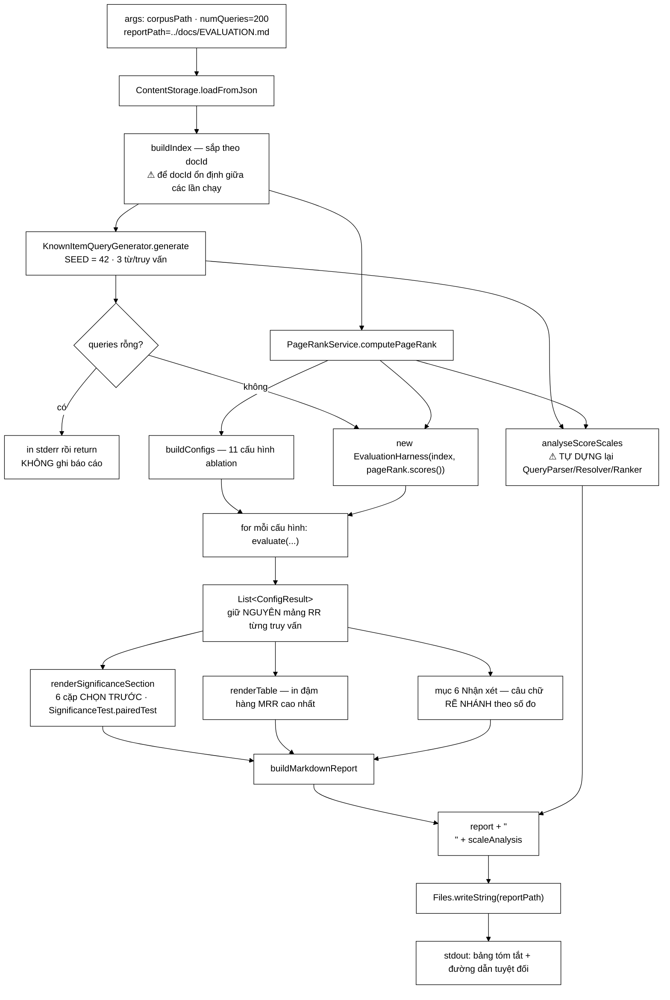

# EvaluationRunner — một chương luận văn tự viết lấy chính nó, và ba chỗ nó nói sai về mình

**File nguồn:** `search-engine/src/main/java/com/vnsearch/eval/EvaluationRunner.java` (675 dòng)
**Gói:** `com.vnsearch.eval` · **Loại:** `class` chỉ có `main` + 9 hàm tĩnh riêng tư + 1 `record` lồng + 6 hằng chuỗi văn bản — một **điểm vào chạy tay**, không phải thành phần thời gian chạy
**Vị trí trong sơ đồ:** khối **Evaluation** — trình điều phối nhánh *known-item tự sinh*, đối xứng với `QrelsEvaluationRunner` ở nhánh *nhãn người gán*
**Đọc kèm:** [`KnownItemQueryGenerator.md`](./KnownItemQueryGenerator.md) · [`EvaluationHarness.md`](./EvaluationHarness.md) · [`EvaluationMetrics.md`](./EvaluationMetrics.md) · [`SignificanceTest.md`](./SignificanceTest.md) · [`QrelsEvaluationRunner.md`](./QrelsEvaluationRunner.md)

---

## 📌 Hiểu trong 30 giây

Lớp này **không phải là một lớp**. Nó là một **chương luận văn được viết bằng
Java**: 675 dòng, trong đó khoảng 260 dòng là văn bản tiếng Việt giảng giải
phương pháp luận, và phần còn lại là mã chạy thí nghiệm rồi nhét số đo vào giữa
những đoạn văn đó.

Quyết định trung tâm nằm ở chú thích dòng 528–534:

> Giữ ở đây (thay vì sửa tay file Markdown) để `docs/EVALUATION.md` vẫn được sinh
> tự động hoàn toàn — nếu sửa tay file `.md` thì lần chạy lại kế tiếp sẽ xoá mất,
> và câu "mọi con số đều tái lập được" thành sai.

Đó là một lập luận **đúng và hiếm gặp**. Nhưng cái giá của nó là toàn bộ phần
diễn giải học thuật bị đóng băng thành hằng số chuỗi, và **không có gì kiểm tra
được rằng phần diễn giải còn khớp với phần mã**. Ba chỗ đã lệch — xem mục 4.

```
   HAI CÁCH LÀM RA MỘT CHƯƠNG "KẾT QUẢ THỰC NGHIỆM"

   ┌───────────────────────────────────────────────────────────────┐
   │  CÁCH THÔNG THƯỜNG — chạy chương trình, chép số vào Word       │
   │                                                               │
   │     mã ──► stdout ──► người ĐỌC ──► gõ lại vào tài liệu        │
   │                                                               │
   │  · Chép sai một chữ số: không ai phát hiện                    │
   │  · Sửa mã rồi quên chạy lại: số cũ nằm im trong luận văn      │
   │  · Hội đồng hỏi "chạy lại ra đúng thế này chứ?" → không dám   │
   │    trả lời chắc                                               │
   └───────────────────────────────────────────────────────────────┘

   ┌───────────────────────────────────────────────────────────────┐
   │  CÁCH LỚP NÀY LÀM — chương trình TỰ VIẾT chương kết quả        │
   │                                                               │
   │     mã ──► buildMarkdownReport() ──► docs/EVALUATION.md        │
   │                     ▲                                         │
   │            văn giảng giải cũng nằm TRONG mã                    │
   │                                                               │
   │  · Số và chữ luôn ra cùng một lần chạy                        │
   │  · SEED = 42 cố định → chạy lại ra ĐÚNG con số cũ             │
   │  · Tài liệu tự dán cả câu lệnh tái lập vào đầu file            │
   │                                                               │
   │  CÁI GIÁ: phần văn bị đóng băng, KHÔNG ai kiểm nó còn          │
   │  khớp với mã hay không. Và nó đã lệch (mục 4).                 │
   └───────────────────────────────────────────────────────────────┘
```



---

## Mục lục

- [1. Vì sao một chương luận văn lại nằm trong mã nguồn](#1-vì-sao-một-chương-luận-văn-lại-nằm-trong-mã-nguồn)
- [2. Thiết kế thí nghiệm: 11 cấu hình không hề chọn tuỳ ý](#2-thiết-kế-thí-nghiệm-11-cấu-hình-không-hề-chọn-tuỳ-ý)
- [3. Phát hiện quan trọng nhất: bộ trọng số không có nghĩa như tên gọi](#3-phát-hiện-quan-trọng-nhất-bộ-trọng-số-không-có-nghĩa-như-tên-gọi)
- [4. Ba chỗ báo cáo nói sai về chính nó](#4-ba-chỗ-báo-cáo-nói-sai-về-chính-nó)
- [5. Kiểm định thống kê: sáu cặp chọn trước, và lý do](#5-kiểm-định-thống-kê-sáu-cặp-chọn-trước-và-lý-do)
- [6. Hướng dẫn về code](#6-hướng-dẫn-về-code)
- [7. Độ phức tạp & chi phí](#7-độ-phức-tạp--chi-phí)
- [8. Kiểm thử liên quan](#8-kiểm-thử-liên-quan)
- [9. Liên kết](#9-liên-kết)

---

## 1. Vì sao một chương luận văn lại nằm trong mã nguồn

### 1.1 Bài toán thật: tài liệu và số liệu trôi dạt khỏi nhau

Trong mọi đồ án có phần thực nghiệm, có đúng một loại lỗi luôn xảy ra và gần như
không bao giờ bị phát hiện: **số trong tài liệu không còn là số mà mã hiện tại
sinh ra**. Nguyên nhân thì tầm thường — sửa một tham số, quên chạy lại, hoặc chạy
lại nhưng chỉ chép một nửa bảng.

```
   VÒNG ĐỜI CỦA MỘT CON SỐ TRONG LUẬN VÂN THÔNG THƯỜNG

   ngày 1   chạy thí nghiệm       MRR = 0,8412
   ngày 1   chép vào tài liệu     MRR = 0,8412   ✓ khớp
   ngày 12  sửa BM25 k1 1.2→1.5
   ngày 12  chạy lại              MRR = 0,8630
   ngày 12  QUÊN chép             tài liệu vẫn 0,8412   ✗ lệch
   ngày 40  bảo vệ                hội đồng đọc 0,8412
                                  mã sinh 0,8630
                                  → không ai biết, kể cả tác giả

   Lỗi này KHÔNG có triệu chứng. Không có test nào bắt được nó.
   Cách duy nhất chặn được: KHÔNG BAO GIỜ để con người là khâu chép.
```

Lớp này chặn bằng cách xoá hẳn khâu con người: hàm `buildMarkdownReport` sinh ra
**toàn bộ** file `docs/EVALUATION.md`, kể cả tiêu đề, kể cả lời cảnh báo đừng sửa
tay, kể cả câu lệnh để tái lập:

```java
sb.append("> Tài liệu này được **sinh tự động** bởi `com.vnsearch.eval.EvaluationRunner`.\n");
sb.append("> Mọi con số đều tái lập được: chạy lại lệnh dưới đây sẽ ra đúng kết quả này.\n");
sb.append("> **Đừng sửa tay file này** — hãy sửa phần sinh báo cáo trong\n");
sb.append("> `eval/EvaluationRunner.java` rồi chạy lại.\n\n");
sb.append("```bash\ncd search-engine\n");
sb.append("./mvnw.cmd exec:java -Dexec.mainClass=com.vnsearch.eval.EvaluationRunner \\\n");
sb.append("     -Dexec.args=\"data/crawled-multi.json ").append(queries.size()).append("\"\n```\n\n");
```

Chi tiết đáng khen nhất trong đoạn trên là `queries.size()` chứ không phải
`numQueries`. Nếu corpus chỉ sinh được 187 truy vấn trong khi người dùng xin 200,
câu lệnh in ra sẽ là `187` — tức là **câu lệnh tái lập luôn tái lập được đúng
thứ vừa chạy**, chứ không phải thứ vừa được yêu cầu. Xem mục 6.1 để hiểu vì sao
hai con số này khác nhau.

### 1.2 Ba trụ cột của tính tái lập

```
   ① SEED CỐ ĐỊNH  (dòng 46)
        private static final long SEED = 42L;

        KnownItemQueryGenerator xáo trộn danh sách docId bằng
        Random(seed). Cùng seed + cùng corpus = cùng bộ truy vấn,
        vĩnh viễn.

   ② SẮP XẾP TRƯỚC KHI DỰNG CHỈ MỤC  (dòng 208–216)
        sorted.sort(Comparator.comparingInt(WebDocument::getDocId));

        Đây là dòng dễ bị coi là thừa nhất trong cả lớp.
        Nó KHÔNG thừa: ContentStorage trả tài liệu theo thứ tự
        trong tệp JSON; nếu thứ tự đó đổi (crawler ghi lại,
        merge hai tệp), thì thứ tự addDocument đổi theo,
        →  averageDocLength tính dần có thể lệch bit cuối
        →  thứ tự duyệt posting list đổi
        →  hai tài liệu ĐIỂM BẰNG NHAU đảo chỗ
        →  MRR nhảy, mà không có gì thay đổi về bản chất.

   ③ VĂN BẢN GIẢNG GIẢI NẰM TRONG MÃ  (dòng 536–674)
        READING_GUIDE, METHOD_WHY, METHOD_DETAILS,
        HOW_TO_READ_TABLE, LIMITATIONS, SCALE_LESSON

        Nếu để trong file .md thì lần ghi đè kế tiếp xoá mất.
        Đây là hệ quả TẤT YẾU của quyết định "ghi đè toàn bộ file",
        không phải một lựa chọn thẩm mỹ.
```

### 1.3 Cái giá: văn bản đóng băng không có ai canh

Trụ cột ③ có một mặt trái mà chính lớp này minh hoạ rất rõ. Khi phần văn nằm
trong `String` hằng, trình biên dịch không kiểm tra gì cả — nó chỉ là ký tự.
Trong khi phần mã thì tiến hoá: thêm cấu hình, đổi số mục, đổi corpus.

```
   ┌───────────────────────────────────────────────────────────────┐
   │  LỚP LỖI ĐẶC TRƯNG CỦA "TÀI LIỆU NẰM TRONG MÃ"                │
   │                                                               │
   │  Mã và văn ở CÙNG một file, được commit CÙNG lúc,             │
   │  nên ai cũng tưởng chúng luôn khớp.                           │
   │                                                               │
   │  Thực tế: trình biên dịch canh phần mã,                       │
   │           KHÔNG AI canh phần văn.                             │
   │                                                               │
   │  →  Thêm 2 cấu hình vào buildConfigs: biên dịch vẫn qua        │
   │  →  Câu "11 cấu hình" trong HOW_TO_READ_TABLE: vẫn nguyên      │
   │  →  Chèn thêm một mục vào báo cáo: số mục trong                │
   │     READING_GUIDE lệch hết, biên dịch vẫn qua                  │
   │                                                               │
   │  Ba lỗi loại này ĐANG TỒN TẠI trong file. Xem mục 4.           │
   └───────────────────────────────────────────────────────────────┘
```

---

## 2. Thiết kế thí nghiệm: 11 cấu hình không hề chọn tuỳ ý

### 2.1 Nguyên tắc ablation — đổi đúng một biến

Javadoc của `buildConfigs` (dòng 218–222) nói rõ ý đồ:

> Cố ý thiết kế theo kiểu **ablation**: mỗi cấu hình chỉ khác cấu hình nền đúng
> một yếu tố, để chênh lệch quan sát được quy được về đúng yếu tố đó.

```java
// Nhóm 1: so sánh mô hình tính điểm, tắt hết PageRank và title bonus.
configs.add(RankingConfig.of("TF-IDF thuần", tfidf, pageRankScores, 0.0, 0.0));
configs.add(RankingConfig.of("BM25 thuần",   bm25,  pageRankScores, 0.0, 0.0));

// Nhóm 2: thêm từng thành phần một vào TF-IDF để tách biệt đóng góp.
configs.add(RankingConfig.of("TF-IDF + title",     tfidf, pageRankScores, 0.0, 0.1));
configs.add(RankingConfig.of("TF-IDF + PageRank",  tfidf, pageRankScores, 0.3, 0.0));
configs.add(RankingConfig.of("TF-IDF + PR + title (đang dùng)", tfidf, pageRankScores, 0.3, 0.1));

// Nhóm 3: quét trọng số PageRank để tìm điểm tối ưu thực nghiệm.
for (double beta : new double[]{0.05, 0.10, 0.20, 0.50, 0.80}) { ... }

// Nhóm 4: BM25 với cùng bộ trọng số đang dùng, xem có cộng hưởng không.
configs.add(RankingConfig.of("BM25 + PR + title", bm25, pageRankScores, 0.3, 0.1));
```

```
   BỐN NHÓM, BỐN CÂU HỎI TÁCH BẠCH

   ┌─ Nhóm 1 (2 cấu hình) ─────────────────────────────────────┐
   │  Mô hình tính điểm nào tốt hơn KHI TẮT HẾT tín hiệu khác? │
   │  TF-IDF thuần   ●───────────────────────●   BM25 thuần     │
   │  Biến thay đổi: DUY NHẤT lớp scorer nền                    │
   └───────────────────────────────────────────────────────────┘

   ┌─ Nhóm 2 (3 cấu hình) ─────────────────────────────────────┐
   │  Từng tín hiệu bổ sung đóng góp bao nhiêu?                │
   │                                                            │
   │      TF-IDF thuần  (nền)                                   │
   │           │                                                │
   │           ├──► + title      →  đo đóng góp của title       │
   │           ├──► + PageRank   →  đo đóng góp của PageRank    │
   │           └──► + cả hai     →  đo có cộng hưởng không      │
   │                                                            │
   │  đóng góp(title)    = MRR(+title)    − MRR(thuần)          │
   │  đóng góp(PageRank) = MRR(+PageRank) − MRR(thuần)          │
   └───────────────────────────────────────────────────────────┘

   ┌─ Nhóm 3 (5 cấu hình) ─────────────────────────────────────┐
   │  beta = 0.05 · 0.10 · 0.20 · 0.50 · 0.80                  │
   │  ⚠ ĐÂY KHÔNG PHẢI ABLATION THUẦN KHIẾT — xem 2.2           │
   └───────────────────────────────────────────────────────────┘

   ┌─ Nhóm 4 (1 cấu hình) ─────────────────────────────────────┐
   │  Ưu thế của BM25 có CỘNG HƯỞNG với các tín hiệu khác?      │
   │  So chéo: BM25+PR+title  vs  TF-IDF+PR+title              │
   └───────────────────────────────────────────────────────────┘

   TỔNG: 2 + 3 + 5 + 1 = 11 cấu hình
```

### 2.2 Nhóm 3 tự phá vỡ nguyên tắc của chính nó — và báo cáo có thừa nhận

Đây là chỗ đáng khen nhất về mặt trung thực học thuật. `HOW_TO_READ_TABLE` tự
đặt một khung cảnh báo về chính phép quét mà `buildConfigs` vừa dựng lên:

> **Cảnh báo quan trọng khi đọc nhóm 3.** Phép quét beta bị ràng buộc
> `alpha = 0.9 − beta` (gamma giữ nguyên 0.1). Nghĩa là khi beta tăng thì alpha
> **giảm theo**, nên mỗi hàng thay đổi **hai** biến số cùng lúc, không phải một.

```
   VÌ SAO alpha KHÔNG PHẢI LÀ THAM SỐ RIÊNG

   RankingConfig.of(label, base, prScores, pageRankWeight, titleWeight)
                                            ↑ beta        ↑ gamma
                                            KHÔNG có alpha

   alpha là thứ CÒN LẠI sau khi trừ hai cái kia:
        alpha = 1 − beta − gamma

   với gamma = 0.1 cố định:
        alpha = 0.9 − beta

   ┌─────────┬────────┬────────┬─────────────────────────────┐
   │  beta   │ alpha  │ gamma  │  tỷ lệ TF-IDF : title       │
   ├─────────┼────────┼────────┼─────────────────────────────┤
   │  0.05   │  0.85  │  0.1   │        8,5 : 1              │
   │  0.10   │  0.80  │  0.1   │        8,0 : 1              │
   │  0.20   │  0.70  │  0.1   │        7,0 : 1              │
   │  0.30   │  0.60  │  0.1   │        6,0 : 1              │
   │  0.50   │  0.40  │  0.1   │        4,0 : 1              │
   │  0.80   │  0.10  │  0.1   │        1,0 : 1   ◄ ĐẢO LỘN  │
   └─────────┴────────┴────────┴─────────────────────────────┘

   Khi beta chạy từ 0.05 lên 0.80, tỷ lệ TF-IDF:title
   sụt từ 8,5:1 xuống 1:1 — tức là title bonus đi từ
   "gia vị" thành "ngang hàng với toàn bộ khớp nội dung".

   ⇒ Chênh lệch MRR quan sát được ở nhóm 3
     KHÔNG nói gì về PageRank.
     Nó nói về tỷ lệ TF-IDF : title.
```

Đây là **loại lỗi thiết kế mà chỉ có phân tích thang đo ở mục 8 mới lộ ra**, và
lớp này đã tự phát hiện rồi tự viết ra. Trong bối cảnh đồ án tốt nghiệp, một báo
cáo tự chỉ ra khuyết điểm phương pháp của chính nó có giá trị cao hơn một báo cáo
toàn số đẹp.

---

## 3. Phát hiện quan trọng nhất: bộ trọng số không có nghĩa như tên gọi

### 3.1 Giả định ngầm của mọi phép kết hợp tuyến tính

Hàm `analyseScoreScales` (dòng 112–197) tồn tại để kiểm tra **một giả định mà
không ai viết ra bao giờ**:

```
   score = alpha·tfidf + beta·pageRank + gamma·titleBonus

   Công thức này CHỈ CÓ NGHĨA nếu ba đại lượng
   nằm trên CÙNG MỘT THANG ĐO.

   Nếu không:

        alpha = 0.6, beta = 0.3
        →  ai cũng đọc thành "TF-IDF góp 60%, PageRank góp 30%"
        →  SAI HOÀN TOÀN nếu tfidf ~ 0,15 còn pageRank ~ 0,000032
```

Thực đo trên corpus 31.030 tài liệu:

```
   ĐỘ LỚN THẬT CỦA HAI THÀNH PHẦN

   TF-IDF cosine   ── nằm trong [0, 1], giá trị điển hình ~0,1–0,3
                      vì đã chuẩn hoá bằng độ dài vector

   PageRank        ── là PHÂN PHỐI XÁC SUẤT, tổng bằng 1
                      trên toàn bộ 31.030 tài liệu
                      →  giá trị điển hình ≈ 1/31.030 ≈ 0,0000322

   ┌──────────────────────────────────────────────────────────────┐
   │  Sau khi nhân trọng số:                                       │
   │                                                              │
   │     0.6 × 0,15      = 0,09                                    │
   │     0.3 × 0,0000322 = 0,00000966                              │
   │                                                              │
   │     tỷ lệ ≈ 9.300 : 1                                         │
   │                                                              │
   │  ⇒ PageRank chỉ có thể phân định thứ hạng                     │
   │    giữa hai tài liệu có TF-IDF chênh nhau                     │
   │    DƯỚI 0,00001 — tức là gần như KHÔNG BAO GIỜ.               │
   │                                                              │
   │  ⇒ "beta = 0.3" trên thực tế là "beta ≈ 0".                   │
   └──────────────────────────────────────────────────────────────┘
```

### 3.2 Một lỗi đo lường đã được sửa, và vết sửa được giữ lại làm bằng chứng

Chú thích dòng 119–124 là phần đáng đọc nhất trong cả file:

```java
// Thang đo phải đo trên scorer TRẦN. Trước đây mục này đọc
// `result.tfidfScore()` của kết quả đã xếp hạng — mà giá trị đó là điểm
// TỔNG đã bọc đủ PageRank lẫn title, không phải thành phần TF-IDF. Tức
// là bảng "so sánh thang đo giữa hai thành phần" đang so một thành phần
// với chính cái tổng chứa nó. Chấm điểm lại bằng một TfIdfScorer trần
// mới trả lời đúng câu hỏi mục này đặt ra.
TfIdfScorer bareTfIdf = new TfIdfScorer();
```

```
   LỖI CŨ, VẼ RA CHO DỄ THẤY

   RankedResult.tfidfScore()  ──►  thực chất là TỔNG:
        tfidf + beta·pageRank + gamma·titleBonus
        └──┬──┘
           thành phần cần đo NẰM BÊN TRONG cái tổng

   Bảng "so sánh thang đo" khi đó so:
        (tfidf + pr + title)   với   pr
        └────────┬─────────┘
        đã chứa pr rồi

   →  Tỷ lệ tính ra vẫn "hợp lý" về mặt thị giác
   →  Kết luận "TF-IDF lớn hơn PageRank N lần" vẫn ĐÚNG HƯỚNG
   →  nhưng CON SỐ N thì sai, và không có cách nào biết sai bao nhiêu

   Đây là dạng lỗi đo lường tệ nhất:
   nó cho ra số HỢP LÝ, nên không ai nghi ngờ.
```

Cách sửa cũng đáng chú ý về mặt phương pháp — nó **tách hai việc vốn bị lẫn**:

```java
// Vẫn xếp hạng bằng cấu hình ĐẦY ĐỦ để lấy đúng tập top-N mà người
// dùng thật sẽ thấy; chỉ khâu ĐO thành phần mới dùng scorer trần.
for (var result : ranker.rank(resolved.candidateDocIds(), resolved.queryTermFrequency(),
        index, config.scorer(), pageRankScores, TOP_N)) {
    double tfidf = bareTfIdf.score(resolved.queryTermFrequency(),
            result.document().getDocId(), index);
```

```
   HAI CÂU HỎI KHÁC NHAU, HAI SCORER KHÁC NHAU

   "Người dùng thật sẽ thấy tài liệu nào?"
        →  phải xếp hạng bằng CẤU HÌNH ĐẦY ĐỦ
        →  config.scorer()  (đã bọc PageRank + title)

   "Thành phần TF-IDF của những tài liệu đó lớn cỡ nào?"
        →  phải chấm lại bằng SCORER TRẦN
        →  bareTfIdf.score(...)

   Trộn hai câu hỏi = đo một thứ rồi gán nhãn thứ khác.
   Tách ra = tốn thêm một lượt chấm điểm cho 10 tài liệu mỗi truy vấn.
   Đánh đổi này RẺ và ĐÚNG.
```

### 3.3 Kết luận được rút ra — và nó lật ngược mục 3 của báo cáo

Phần `sb.append` từ dòng 184 trở đi viết thẳng:

> **Hệ quả quan trọng đối với việc diễn giải kết quả:** con số `beta = 0.3` KHÔNG
> có nghĩa là "PageRank đóng góp 30% vào điểm cuối". […] chênh lệch quan sát được
> trong phép quét beta ở mục 3 thực chất phản ánh việc **alpha bị thay đổi theo**.

Và `SCALE_LESSON` nâng lên thành nguyên tắc chung:

> Một trọng số lớn không có nghĩa là ảnh hưởng lớn. Đây là loại lỗi mà bảng kết
> quả không bao giờ tự tố giác: mọi con số MRR ở mục 3 đều đúng, chỉ có cách
> *giải thích* chúng là sai nếu bỏ qua phép kiểm tra này.

```
   ĐỀ XUẤT KHẮC PHỤC MÀ MÃ TỰ ĐƯA RA (dòng 191–194)

   ① chia cho PageRank lớn nhất trong corpus
        pr' = pr / maxPr                 →  đưa về [0, 1]
        ưu:  rẻ, tính một lần
        nhược: một trang siêu uy tín kéo mọi trang khác về gần 0

   ② min-max trên TẬP ỨNG VIÊN của từng truy vấn
        pr' = (pr − minPr_q) / (maxPr_q − minPr_q)
        ưu:  luôn trải đủ [0, 1] trong mỗi truy vấn
        nhược: điểm của một tài liệu PHỤ THUỘC vào các tài liệu
               khác cùng truy vấn → không so được giữa hai truy vấn
               → và với truy vấn chỉ có 1 ứng viên thì mẫu số = 0

   ③ (không nêu trong mã, nhưng là cách ngành hay dùng)
        pr' = log(pr) chuẩn hoá
        ưu:  PageRank có phân phối đuôi dài kiểu luỹ thừa,
             log đưa nó về gần chuẩn, nên tuyến tính hoá đúng bản chất
        nhược: cần xử lý pr = 0
```

---

## 4. Ba chỗ báo cáo nói sai về chính nó

Đây là hệ quả trực tiếp của quyết định "văn bản đóng băng trong hằng chuỗi" (mục
1.3). Cả ba đều **biên dịch được, chạy được, và sinh ra báo cáo trông hoàn
chỉnh**.

### 4.1 Số mục trong bảng "Cách đọc tài liệu này" lệch một bậc

```
   READING_GUIDE (dòng 536–552) HỨA         BÁO CÁO THẬT SỰ SINH RA
   ────────────────────────────────────    ─────────────────────────────────
   1. Phương pháp                          ## 1. Phương pháp            ✓
   2. Corpus                               ## 2. Corpus                 ✓
   3. Kết quả                              ## 3. Kết quả                ✓
   4. Cách đọc bảng                        ## 4. Cách đọc bảng          ✓
   5. Nhận xét                             ## 5. Kiểm định thống kê     ✗
   6. Hạn chế                              ## 6. Nhận xét               ✗
   7. Thang đo                             ## 7. Hạn chế                ✗
   (không có)                              ## 8. Phân tích thang đo     ✗

   Mục "Kiểm định ý nghĩa thống kê" — phần công phu nhất của cả báo cáo,
   có t-test lẫn randomization test — KHÔNG XUẤT HIỆN trong bảng mục lục.
```

Hậu quả lan tiếp sang các tham chiếu chéo, và tất cả đều trỏ nhầm chỗ:

| Câu trong mã | Ý muốn trỏ tới | Thực tế trỏ tới |
|---|---|---|
| `"hãy đọc mục 4 và mục 7"` (READING_GUIDE) | Cách đọc bảng + Thang đo | Cách đọc bảng + **Hạn chế** |
| `"dẫn tới phát hiện ở mục 7"` (HOW_TO_READ_TABLE) | Phân tích thang đo | **Hạn chế** |
| `"mục 7 giải thích vì sao điều đó làm mọi kết luận về beta vô nghĩa"` | Phân tích thang đo | **Hạn chế** |
| `"Xem mục 5."` (nhánh PageRank làm giảm chất lượng) | Phân tích thang đo (?) | **Kiểm định thống kê** |

```
   ┌───────────────────────────────────────────────────────────────┐
   │  NGUYÊN NHÂN GỐC: SỐ MỤC ĐƯỢC VIẾT TAY Ở BỐN NƠI RỜI RẠC       │
   │                                                               │
   │   · "## 5. Kiểm định..."  trong renderSignificanceSection      │
   │   · "## 6. Nhận xét"      trong buildMarkdownReport            │
   │   · "## 7. Hạn chế..."    trong LIMITATIONS                    │
   │   · "## 8. Phân tích..."  trong analyseScoreScales             │
   │   · và bảng mục lục       trong READING_GUIDE                  │
   │                                                               │
   │  Chèn mục "Kiểm định" vào giữa → phải sửa 5 chỗ bằng tay.      │
   │  Ai đó sửa 4 chỗ, bỏ sót bảng mục lục. Không có gì báo lỗi.    │
   └───────────────────────────────────────────────────────────────┘
```

### 4.2 "13 cấu hình cho 78 cặp" — trong khi thực tế là 11 cấu hình

Javadoc của `renderSignificanceSection` (dòng 294–302):

> Chạy 13 cấu hình cho 78 cặp, và ở mức α = 0,05 thì trung bình có **~4 cặp** đạt
> "có ý nghĩa" thuần tuý do ngẫu nhiên.

```
   ĐẾM LẠI buildConfigs:

        nhóm 1:  TF-IDF thuần, BM25 thuần                 →  2
        nhóm 2:  +title, +PageRank, +PR+title             →  3
        nhóm 3:  beta ∈ {0.05, 0.10, 0.20, 0.50, 0.80}    →  5
        nhóm 4:  BM25 + PR + title                        →  1
                                                     ─────────
                                                            11

   Số cặp thật:  C(11, 2) = 11 × 10 / 2 = 55   (không phải 78)
   Kỳ vọng dương giả ở α = 0,05:  55 × 0,05 ≈ 2,75  (không phải ~4)

   C(13, 2) = 78 → con số 78 đúng cho 13 cấu hình.
   ⇒ Javadoc được viết khi buildConfigs còn 13 cấu hình,
     rồi ai đó bỏ bớt 2 cấu hình mà không sửa Javadoc.
```

Lỗi này **không làm sai kết luận** — lập luận về so sánh bội vẫn đúng nguyên vẹn,
chỉ con số minh hoạ là cũ. Nhưng trong một tài liệu mà điểm bán hàng chính là
"mọi con số đều tái lập được", một con số viết tay đã lỗi thời là chỗ tổn thương
đúng vào điểm mạnh nhất.

### 4.3 "5.011 tài liệu" trong khi corpus là 31.030

`METHOD_WHY` (dòng 554–574) mở đầu bằng lập luận về chi phí gán nhãn:

> Gán nhãn 5.011 tài liệu cho 30 truy vấn là 150.000 lượt đánh giá.

```
   CON SỐ NÀY ĐƯỢC VIẾT CỨNG, TRONG KHI docCount CÓ SẴN LÀM THAM SỐ

   buildMarkdownReport(int docCount, ...)
                           ↑ có đây rồi

   Mục 2 của báo cáo in:  | Số tài liệu | 31030 |
   Mục 1 của báo cáo nói: "Gán nhãn 5.011 tài liệu..."

   Hai con số nằm CÁCH NHAU 20 DÒNG trong cùng một file
   và mâu thuẫn nhau công khai.

   Với corpus thật:  31.030 × 30 = 930.618 lượt đánh giá
   → lập luận "không thể gán tay" còn MẠNH HƠN gấp 6 lần
   → tức là con số cũ đang làm YẾU chính luận điểm của nó
```

Sửa rẻ: đổi `METHOD_WHY` từ hằng `String` thành hàm nhận `docCount`, hoặc dùng
`String.format` với `%,d`. Xem đề xuất 2 ở mục 9.

---

## 5. Kiểm định thống kê: sáu cặp chọn trước, và lý do

### 5.1 Vì sao không kiểm định tất cả các cặp

```
   BÀI TOÁN SO SÁNH BỘI (multiple comparisons)

   Mỗi kiểm định ở mức α = 0,05 có 5% khả năng
   báo "có ý nghĩa" trong khi thực ra KHÔNG có gì.

   Chạy 1 kiểm định:    P(ít nhất 1 dương giả) = 5,0%
   Chạy 6 kiểm định:    1 − 0,95^6  ≈ 26,5%
   Chạy 55 kiểm định:   1 − 0,95^55 ≈ 94,0%   ◄ gần như CHẮC CHẮN

   ┌──────────────────────────────────────────────────────────────┐
   │  Nếu kiểm định cả 55 cặp rồi CHỌN RA cặp nào p nhỏ để kể,     │
   │  đó là p-hacking — và nó cho ra kết luận "có ý nghĩa"         │
   │  ngay cả khi mọi cấu hình đều giống hệt nhau.                 │
   └──────────────────────────────────────────────────────────────┘

   BA CÁCH PHÒNG VỆ, XẾP THEO CHI PHÍ:

   ① Chọn trước một số ít cặp   ◄ lớp này dùng
        rẻ nhất, trung thực nhất, không mất độ mạnh thống kê
        điều kiện: phải chọn TRƯỚC khi nhìn số

   ② Hiệu chỉnh Bonferroni:  α' = α / số kiểm định
        an toàn nhưng RẤT bảo thủ: 0,05/55 ≈ 0,0009
        → gần như không cặp nào qua được với chỉ 200 truy vấn

   ③ Kiểm soát FDR (Benjamini–Hochberg)
        cân bằng hơn ②, nhưng cần thêm cài đặt
```

Sáu cặp được chọn (dòng 309–315) ánh xạ **một–một** với ba câu hỏi trong Javadoc
đầu lớp:

```
   ┌──────────────────────────────────────┬──────────────────────────────┐
   │  CẶP KIỂM ĐỊNH                        │  TRẢ LỜI CÂU HỎI              │
   ├──────────────────────────────────────┼──────────────────────────────┤
   │  BM25 thuần    vs  TF-IDF thuần      │  ① BM25 có tốt hơn không?    │
   │  TF-IDF+title  vs  TF-IDF thuần      │  title đóng góp bao nhiêu?   │
   │  TF-IDF+PR     vs  TF-IDF thuần      │  ② PageRank có ích không?    │
   │  đang dùng     vs  TF-IDF thuần      │  ③ bộ 0.6/0.3/0.1 có tốt?    │
   │  đang dùng     vs  BM25 thuần        │  ③ so với đối thủ mạnh nhất  │
   │  đang dùng     vs  TF-IDF+title      │  PageRank có THÊM gì không?  │
   └──────────────────────────────────────┴──────────────────────────────┘

   Cặp cuối là cặp TINH TẾ NHẤT: nó cô lập PageRank
   trên nền ĐÃ CÓ title, chứ không phải trên nền trần.
   Một tín hiệu có thể có ích khi đứng một mình
   mà vô dụng khi đã có tín hiệu khác mạnh hơn.
```

### 5.2 Vì sao phải giữ mảng RR từng truy vấn

`record ConfigResult` có một trường trông thừa nếu chỉ nhìn bảng kết quả:

```java
/**
 * @param reciprocalRanks reciprocal rank của TỪNG truy vấn, giữ nguyên thứ
 *                        tự truy vấn. Bắt buộc phải giữ lại để chạy kiểm
 *                        định THEO CẶP — chỉ có MRR trung bình thì không
 *                        ghép cặp được, và kiểm định không theo cặp mất
 *                        phần lớn độ mạnh thống kê.
 */
private record ConfigResult(String label, double mrr, double success1, double success5,
                             double success10, double avgQueryMs, double avgCandidates,
                             double[] reciprocalRanks) { }
```

```
   VÌ SAO GHÉP CẶP LẠI MẠNH HƠN NHIỀU

   Nguồn biến thiên lớn nhất trong dữ liệu KHÔNG phải là
   "cấu hình nào tốt hơn" — mà là "truy vấn nào dễ hơn".

        q₁ "biển đông tranh chấp"     → mọi cấu hình đều RR = 1,00
        q₂ "thứ tư ngày công bố"      → mọi cấu hình đều RR = 0,05

   KHÔNG ghép cặp: so trung bình A với trung bình B,
        độ lệch chuẩn bị THỔI PHỒNG bởi khoảng cách q₁–q₂
        → sai số chuẩn lớn → p-value lớn → không kết luận được

   CÓ ghép cặp: xét hiệu d_i = RR_A(q_i) − RR_B(q_i)
        q₁ →  d = 1,00 − 1,00 = 0
        q₂ →  d = 0,05 − 0,05 = 0
        độ khó của truy vấn TRIỆT TIÊU HOÀN TOÀN
        → chỉ còn lại đúng thứ cần đo

   ⇒ Muốn ghép cặp thì phải giữ MẢNG, không được chỉ giữ
     trung bình. Trung bình là phép chiếu MẤT THÔNG TIN
     và không khôi phục lại được.
```

### 5.3 Hai kiểm định, và quy tắc xử lý khi chúng bất đồng

```java
String verdict;
if (test.testsDisagree()) {
    verdict = "⚠️ hai kiểm định **không đồng ý**";
} else if (test.isSignificant()) {
    verdict = "✅ **có ý nghĩa**";
} else {
    verdict = "❌ **chưa kết luận được**";
}
```

```
   VÌ SAO CHẠY HAI KIỂM ĐỊNH THAY VÌ MỘT

   Paired t-test
      giả định: hiệu d_i xấp xỉ PHÂN PHỐI CHUẨN
      thực tế:  reciprocal rank chỉ nhận giá trị
                {1, 1/2, 1/3, ..., 1/10, 0}
                → rời rạc, dồn cục ở 1,0 và 0
                → hiệu d_i càng lệch hơn nữa
      ⇒ giả định ĐÁNG HOÀI NGHI, không phải sai hẳn

   Randomization / permutation test
      giả định:  KHÔNG GÌ CẢ
      cách làm:  đảo ngẫu nhiên dấu của d_i 100.000 lần,
                 đếm xem bao nhiêu lần |trung bình| vượt giá trị quan sát
      ⇒ được ngành truy hồi thông tin khuyến dùng
        (Smucker, Allan & Carterette, CIKM 2007)

   ┌──────────────────────────────────────────────────────────────┐
   │  QUY TẮC ĐỌC:                                                 │
   │                                                              │
   │   hai kiểm định ĐỒNG Ý   →  kết luận VỮNG                     │
   │   hai kiểm định LỆCH     →  đó là PHÁT HIỆN đáng nói,         │
   │                             không phải thứ để giấu.           │
   │                             Nó có nghĩa: kết luận nhạy cảm    │
   │                             với giả định phân phối, tức là    │
   │                             hiệu ứng NẰM SÁT ranh giới.       │
   └──────────────────────────────────────────────────────────────┘
```

### 5.4 `formatPValue` — sự trung thực về giới hạn phân giải

```java
/** p-value rất nhỏ thì báo dạng ngưỡng — báo "0,0000" là nói quá điều đo được. */
private static String formatPValue(double p) {
    if (p < 1e-4) {
        return "< 0,0001";
    }
    return String.format(Locale.US, "%.4f", p).replace('.', ',');
}
```

```
   VỚI 100.000 LẦN HOÁN VỊ:

   p nhỏ nhất có thể đo được  =  1 / (100.000 + 1)  ≈  0,00001

   Viết "p = 0,0000" ngụ ý p < 0,00005 — mà phép đo
   KHÔNG có đủ độ phân giải để khẳng định điều đó.

   Viết "< 0,0001" nói đúng cái đã đo được: nhỏ hơn ngưỡng,
   không biết nhỏ hơn bao nhiêu.

   ┌──────────────────────────────────────────────────────────────┐
   │  NHƯNG: dòng `.replace('.', ',')` chỉ áp cho p-value.         │
   │                                                              │
   │  Cùng bảng đó, ΔMRR và khoảng tin cậy in bằng                 │
   │        String.format(Locale.US, "| %s ... %+.4f ...")         │
   │  →  dùng dấu CHẤM thập phân                                   │
   │                                                              │
   │  Kết quả trong MỘT hàng bảng:                                 │
   │        | ... | +0.0231 | [+0.0104, +0.0358] | 0,0037 | ...   │
   │                 ↑ chấm     ↑ chấm              ↑ phẩy         │
   │                                                              │
   │  Không sai về số, nhưng là chi tiết trình bày mà hội đồng     │
   │  luận văn NHÌN THẤY NGAY. Xem đề xuất 4.                      │
   └──────────────────────────────────────────────────────────────┘
```

---

## 6. Hướng dẫn về code

### 6.1 Muốn đổi số truy vấn đánh giá

Sửa tham số dòng lệnh, **không** sửa mã:

```bash
cd search-engine
./mvnw.cmd exec:java -Dexec.mainClass=com.vnsearch.eval.EvaluationRunner \
     -Dexec.args="data/crawled-multi.json 500 ../docs/EVALUATION.md"
#                 └─ corpus ────────────┘ └─┘ └─ đường dẫn báo cáo ──┘
#                                     numQueries
```

```
   NHƯNG numQueries LÀ "MONG MUỐN", KHÔNG PHẢI "BẢO ĐẢM"

   KnownItemQueryGenerator bỏ qua tài liệu khi:
        · doc == null hoặc doc.getUrl() == null
        · không tìm đủ 3 term có df ∈ [3, 3.103]
        · truy vấn sinh ra TRÙNG với truy vấn đã có

   ⇒ xin 500 có thể chỉ nhận về 431.
   ⇒ Mã in ra con số THẬT:
        System.out.println("  sinh duoc " + queries.size() + " truy van");
   ⇒ và câu lệnh tái lập trong báo cáo cũng dùng queries.size().

   Nhưng KHÔNG có cảnh báo nào khi chênh lệch lớn.
   Xin 500 mà nhận 120 thì corpus có vấn đề — đáng lẽ phải báo.
```

### 6.2 Muốn thêm một cấu hình xếp hạng vào bảng so sánh

Sửa `buildConfigs` (dòng 223–247). Ví dụ thêm BM25 với `k1` khác:

```java
// Nhóm 5: quét tham số bão hoà tần suất của BM25.
for (double k1 : new double[]{0.9, 1.2, 1.6, 2.0}) {
    configs.add(EvaluationHarness.RankingConfig.of(
            String.format(Locale.US, "BM25 k1=%.1f", k1),
            new BM25Scorer(k1, 0.75), pageRankScores, 0.0, 0.0));
}
```

```
   NHỚ SỬA KÈM BA CHỖ, NẾU KHÔNG BÁO CÁO SẼ NÓI SAI:

   ① HOW_TO_READ_TABLE — bảng "Nhóm / Cấu hình / Câu hỏi"
      hiện ghi cứng 4 nhóm và câu "11 cấu hình trên"

   ② Javadoc renderSignificanceSection — "13 cấu hình cho 78 cặp"
      (đã sai sẵn, xem mục 4.2)

   ③ pairs trong renderSignificanceSection — nếu muốn cấu hình mới
      được kiểm định, phải THÊM CẶP thủ công. Không thêm thì nó
      chỉ xuất hiện ở bảng MRR mà không có p-value.
```

### 6.3 Muốn đổi bộ trọng số mặc định của sản phẩm

Bảng kết quả **không** tự áp dụng gì cả. Mã chỉ **đề xuất**:

```java
if (!best.label().equals(current.label())) {
    sb.append(String.format(Locale.US,
            "Cấu hình này tốt hơn cấu hình đang dùng %.1f%% về MRR, nên **đề xuất đổi "
                    + "sang bộ trọng số đó** trong `application.properties`.\n\n",
            current.mrr() == 0 ? 0 : (best.mrr() - current.mrr()) / current.mrr() * 100));
}
```

```
   ĐƯỜNG DÂY TỪ THÍ NGHIỆM TỚI SẢN PHẨM LÀ THỦ CÔNG

   EvaluationRunner  ──(văn bản)──►  người đọc
                                        │
                                        ▼ gõ tay
                              application.properties
                                        │
                                        ▼
                                 ScorerFactory

   ĐÁNG KHEN: không tự động sửa cấu hình sản phẩm dựa trên
   MỘT lần chạy trên MỘT bộ 200 truy vấn tự sinh. Tự động
   hoá chỗ này là cách nhanh nhất để overfit vào bộ đánh giá.

   ĐÁNG LO: "tốt hơn %.1f%%" được viết ra mà KHÔNG kèm p-value.
   best có thể tốt hơn current 0,3% với p = 0,71 — tức là
   không phân biệt được với nhiễu — mà câu văn vẫn nói
   "đề xuất đổi sang bộ trọng số đó".
   ⇒ Mục 5 có kiểm định, mục 6 lại quên dùng nó. Xem đề xuất 3.
```

### 6.4 Muốn đo thêm một độ đo (ví dụ Success@3)

Ba chỗ phải sửa đồng bộ:

```java
// 1. record ConfigResult — thêm trường
private record ConfigResult(String label, double mrr, double success1, double success3,
                             double success5, double success10, ...) { }

// 2. evaluate() — đếm thêm
int hit3 = 0;
hit3 += (int) EvaluationMetrics.successAtK(ranked, query.targetUrl(), 3);

// 3. renderTable() — thêm cột vào CẢ header lẫn dòng dữ liệu
sb.append("| Cấu hình | MRR | S@1 | S@3 | S@5 | S@10 | ms/truy vấn |\n");
sb.append("|---|---|---|---|---|---|---|\n");
```

```
   CẠM BẪY: header và dòng dữ liệu là HAI chuỗi RỜI NHAU.

   Thêm cột vào dòng dữ liệu mà quên header
   →  Markdown vẫn render, chỉ là cột cuối bị NUỐT MẤT
   →  không có lỗi, không có cảnh báo, chỉ mất số liệu.
```

### 6.5 Cạm bẫy khi sửa lớp này

| Ý định | Hậu quả |
|---|---|
| Sửa tay `docs/EVALUATION.md` cho đẹp | Lần chạy kế tiếp **ghi đè toàn bộ** — công sức mất sạch, không có cảnh báo |
| Đổi `SEED = 42L` | Bộ truy vấn đổi hoàn toàn → **mọi số trong luận văn phải chạy lại**, và số cũ không tái lập được nữa |
| Bỏ `sorted.sort(...)` trong `buildIndex` | docId gán theo thứ tự tệp → đổi thứ tự JSON là đổi kết quả, mà không ai hiểu vì sao |
| Đổi một ký tự trong chuỗi nhãn ở `buildConfigs` | `findByLabel` trả `null` → hàng **biến mất im lặng** khỏi bảng kiểm định (dòng 322–324 `continue`) |
| Đổi nhãn `"TF-IDF + PR + title (đang dùng)"` | `r.label().contains("đang dùng")` hỏng → `current` rơi về `best` → mục 6 luôn nói "cấu hình đang dùng đã là tốt nhất" |
| Chạy `configs.parallelStream()` cho nhanh | `EvaluationHarness` chia sẻ `ResultRanker`, chưa tuyên bố an toàn đa luồng; và cột `ms/truy vấn` mất hết ý nghĩa |
| Thêm bộ nhớ đệm cho `ResolvedQuery` | Nhanh hơn ~60%, nhưng cột `ms/truy vấn` không còn đo đường đi thật |
| Bỏ nhánh `if (queries.isEmpty()) return;` | Ghi ra báo cáo với MRR = 0 cho mọi hàng, trông như hệ thống hỏng chứ không phải corpus hỏng |
| Dùng `avgCandidates` làm chỉ số độ bao phủ | Nó được nạp bằng `ranked.size()` (≤ TOP_N = 10) — **không đo độ bao phủ**, xem `EvaluationHarness` mục 3.3 |
| Đổi `reportPath` mặc định `../docs/EVALUATION.md` | Đường dẫn **tương đối theo thư mục làm việc**; chạy từ gốc repo sẽ ghi ra ngoài repo |
| Bỏ `analyseScoreScales` vì "nó chỉ là phụ lục" | Mất đúng phát hiện quan trọng nhất của cả báo cáo (mục 3) |

### 6.6 Chỗ mã tự vi phạm nguyên tắc của chính gói `eval`

```java
com.vnsearch.query.QueryParser parser = new com.vnsearch.query.QueryParser();
com.vnsearch.ranking.ResultRanker ranker = new com.vnsearch.ranking.ResultRanker();
...
var parsed = parser.parse(query.queryText());
var resolved = com.vnsearch.query.CandidateResolver.resolve(index, parsed);
```

```
   ┌──────────────────────────────────────────────────────────────┐
   │  analyseScoreScales TỰ DỰNG LẠI đường tìm kiếm,               │
   │  thay vì dùng EvaluationHarness.search.                       │
   │                                                              │
   │  Đó chính xác là điều mà EvaluationHarness sinh ra để CẤM.    │
   │                                                              │
   │  LÝ DO CHÍNH ĐÁNG: harness.search trả List<String> URL,       │
   │  mà mục này cần result.pageRankScore() của TỪNG kết quả.      │
   │  Giao diện đo sạch đã ĐÓNG cửa thông tin đó.                  │
   │                                                              │
   │  HẬU QUẢ THẬT — không phải chuyện nguyên tắc suông:           │
   │                                                              │
   │   · `new QueryParser()` dùng tokenizer MẶC ĐỊNH của nó,       │
   │     không phải tokenizer của harness, cũng không phải         │
   │     tokenizer của chỉ mục.                                    │
   │     →  THỂ HIỆN THỨ TƯ của VietnameseTokenizer trong          │
   │        cùng một lần chạy (index, generator, harness, đây).    │
   │     →  Bốn thể hiện khớp nhau HOÀN TOÀN TÌNH CỜ.              │
   │                                                              │
   │   · Nếu ngày nào đó chúng lệch, mục 8 sẽ báo                  │
   │     "samples == 0" → trả "" → mục 8 BIẾN MẤT khỏi báo cáo     │
   │     → mà READING_GUIDE vẫn hứa có mục đó.                     │
   │                                                              │
   │  CÁCH SỬA ĐÚNG: mở rộng harness để trả                        │
   │  record SearchOutcome(List<String> urls, List<Double> prs)    │
   │  thay vì để lớp gọi tự dựng đường đi riêng.                   │
   └──────────────────────────────────────────────────────────────┘
```

Ngoài ra, hai hằng `0.6` và `0.3` trong `analyseScoreScales` được **viết cứng**:

```java
double weightedTfidf = 0.6 * meanTfidf;
double weightedPageRank = 0.3 * meanPageRank;
```

trong khi cấu hình dựng ngay phía trên dùng `of("phân tích thang đo", ..., 0.3, 0.1)`.
Nếu bộ trọng số sản phẩm đổi sang 0.7/0.2/0.1, bảng thang đo vẫn tính theo
0.6/0.3 và **không có gì báo lỗi** — nó chỉ lặng lẽ mô tả một cấu hình không còn
tồn tại.

---

## 7. Độ phức tạp & chi phí

| Giai đoạn | Độ phức tạp | Ước lượng thật (31.030 tài liệu) |
|---|---|---|
| `ContentStorage.loadFromJson` | O(kích thước tệp) | ~1,5 GB JSON, ~40–90 giây |
| `buildIndex` — sắp xếp | O(N log N) | 31.030 · log ≈ 465.000 phép so, không đáng kể |
| `buildIndex` — `addDocument` | O(Σ token) | ~31.030 × 520 token ≈ 16 triệu token, ~60–120 giây |
| `computePageRank` | O(vòng lặp × cạnh) | ~30–60 vòng × ~450.000 liên kết, ~5–15 giây |
| `generate` (sinh truy vấn) | O(số doc duyệt × độ dài body) | duyệt tới khi đủ 200 truy vấn, xem `KnownItemQueryGenerator` mục 6 |
| `evaluate` × 11 cấu hình | O(11 × Q × (resolve + rank)) | 11 × 200 = **2.200 lời gọi** `search` |
| `analyseScoreScales` | O(Q × (resolve + rank + 10 lần chấm lại)) | thêm **200 lời gọi** + 2.000 lượt chấm TF-IDF |
| `SignificanceTest.pairedTest` × 6 | O(6 × 100.000 × Q) | 6 × 100.000 × 200 = **120 triệu** phép cộng |
| `Files.writeString` | O(kích thước báo cáo) | ~25–35 KB, tức thời |

```
   PHÂN RÃ THỜI GIAN CHẠY TOÀN THÍ NGHIỆM

   ┌────────────────────────────────────────────────────────────────┐
   │  nạp corpus + dựng chỉ mục     ████████████████████   ~150 s   │
   │  PageRank                      ██                      ~10 s   │
   │  sinh 200 truy vấn             ███                     ~15 s   │
   │  11 × 200 lời gọi search       ██████                  ~30 s   │
   │  6 × randomization test        ████                    ~20 s   │
   │  analyseScoreScales            █                        ~4 s   │
   │  ghi báo cáo                   ·                       <0,1 s  │
   │                                                    ──────────  │
   │                                              tổng ≈  230 giây  │
   └────────────────────────────────────────────────────────────────┘

   NHẬN XÉT QUAN TRỌNG: phần "thí nghiệm" thật sự chỉ chiếm ~25%.
   75% là chi phí NẠP LẠI VÀ DỰNG LẠI mọi thứ từ đầu.

   ⇒ Muốn lặp nhanh khi tinh chỉnh cấu hình, cần lưu chỉ mục
     và PageRank ra đĩa (IndexPersistence đã có sẵn) rồi nạp lại.
     Thời gian mỗi vòng lặp thử nghiệm rớt từ ~230 s xuống ~70 s.
```

```
   CÔNG BỊ LẶP MÀ CÓ THỂ BỎ

   Bước resolve GIỐNG HỆT NHAU cho cả 11 cấu hình —
   chỉ bước rank mới khác.

        200 truy vấn × 11 cấu hình = 2.200 lần resolve
        chỉ cần                      200 lần
        →  2.000 lần giao posting list LÀ CÔNG THỪA HOÀN TOÀN

   Mỗi resolve trên truy vấn 3 từ với df ∈ [3, 3.103]:
        duyệt tối đa 3 × 3.103 ≈ 9.309 posting

        2.000 × 9.309 ≈ 18,6 TRIỆU posting duyệt thừa

   ⇒ Đệm ResolvedQuery theo queryText: tiết kiệm ~60% thời gian
     giai đoạn đánh giá.

   ⇒ NHƯNG cột `ms/truy vấn` sẽ thành vô nghĩa. Mà cột đó
     VỐN ĐÃ vô nghĩa: HOW_TO_READ_TABLE tự thừa nhận
     "không có vòng làm nóng JVM riêng cho từng cấu hình,
      nên cấu hình chạy trước gánh phần lớn chi phí JIT".

   ⇒ Kết luận: nên BỎ HẲN cột đó khỏi bảng chất lượng,
     rồi đệm thoải mái. Đo tốc độ là một thí nghiệm KHÁC,
     cần thiết kế khác, và đã có docs/GIN-BASELINE.md làm đúng.
```

Về bộ nhớ: đỉnh điểm là khi `docs` (danh sách `WebDocument` đầy đủ), `index`
(~367 MB) và `sorted` (bản sao danh sách tham chiếu, ~250 KB) cùng sống. `docs`
**không được giải phóng** sau `buildIndex` vì còn dùng cho `docs.size()` ở
`buildMarkdownReport` — giữ nguyên vài trăm MB chỉ để lấy một con số nguyên. Gán
`int docCount = docs.size(); docs = null;` sẽ trả lại đáng kể bộ nhớ trước giai
đoạn tốn RAM nhất là PageRank.

---

## 8. Kiểm thử liên quan

| Bộ test | Kiểm gì | Liên quan tới lớp này thế nào |
|---|---|---|
| [`RankingQualityTest`](../../../../../test/java/com/vnsearch/eval/RankingQualityTest.md) | Chất lượng xếp hạng đầu-cuối trên corpus nhỏ | Bản thu nhỏ chạy được trong CI của chính thí nghiệm này |
| [`SignificanceTestTest`](../../../../../test/java/com/vnsearch/eval/SignificanceTestTest.md) | `pairedTest`, ca suy biến | Bảo vệ mục 5 của báo cáo |
| [`EvaluationMetricsTest`](../../../../../test/java/com/vnsearch/eval/EvaluationMetricsTest.md) | `reciprocalRank`, `successAtK` | Hai độ đo duy nhất mà `evaluate` dùng |
| [`EvaluationHarnessTest`](../../../../../test/java/com/vnsearch/eval/EvaluationHarnessTest.md) | `search`, `RankingConfig.of` | Đường tìm kiếm mà `evaluate` gọi 2.200 lần |

**Bản thân `EvaluationRunner` hiện không có test nào.** Điều đó dễ hiểu — nó là
`main` đọc tệp và ghi tệp. Nhưng phần lớn logic của nó **thuần tuý và tách được**:
`buildConfigs`, `renderTable`, `formatPValue`, `findByLabel` không đụng tới I/O.

```
   ĐẦU VÀO                                       KẾT QUẢ MONG ĐỢI
   ───────────────────────────────────────────   ──────────────────────────────
   buildConfigs(Map.of())                        11 phần tử, nhãn KHÔNG trùng
   buildConfigs(Map.of())                        đúng 1 nhãn chứa "đang dùng"
   findByLabel(results, "TF-IDF thuần")          không null
   findByLabel(results, "TF-IDF Thuan")          null  (phân biệt hoa/thường)
   formatPValue(0.00003)                         "< 0,0001"
   formatPValue(0.0001)                          "0,0001"   (không phải "< ...")
   formatPValue(0.5)                             "0,5000"   (dấu PHẨY)
   renderTable(1 cấu hình)                       header + 1 dòng, nhãn in ĐẬM
   renderTable(2 cấu hình MRR bằng nhau)         in đậm cấu hình ĐẦU TIÊN
   renderTable(List.of())                        chỉ header, KHÔNG ném
   evaluate(harness, cfg, List.of())             chia 0 → NaN  ⚠ chưa được chặn
   main với corpus rỗng                          in stderr, KHÔNG ghi báo cáo
   6 cặp trong renderSignificanceSection         mọi nhãn đều tra được (không cặp nào bị bỏ)
```

Ba bài test nên có, mỗi bài khoá một khiếm khuyết đã nêu ở trên:

```java
// 1. Sáu cặp kiểm định phải tra được BẰNG HẾT trong bộ nhãn của buildConfigs.
//    Bài test này biến "đổi nhãn làm mất hàng im lặng" (mục 6.5)
//    thành một lỗi ồn ào ngay lúc build.
@Test
void moiCapKiemDinhDeuTraDuocNhanTrongBuildConfigs() {
    var nhan = buildConfigs(Map.of()).stream()
            .map(EvaluationHarness.RankingConfig::label).collect(Collectors.toSet());
    List<String[]> pairs = capKiemDinhDaChon();   // trích ra thành hằng dùng chung
    for (String[] cap : pairs) {
        assertTrue(nhan.contains(cap[0]),
                "nhãn '" + cap[0] + "' không còn trong buildConfigs — "
                + "hàng này sẽ BIẾN MẤT im lặng khỏi bảng kiểm định thống kê");
        assertTrue(nhan.contains(cap[1]),
                "nhãn '" + cap[1] + "' không còn trong buildConfigs — "
                + "renderSignificanceSection sẽ continue mà không cảnh báo");
    }
}

// 2. Đúng MỘT cấu hình được đánh dấu "đang dùng".
//    Không có nó thì `current` âm thầm rơi về `best`, và mục 6 của báo cáo
//    sẽ luôn kết luận "cấu hình đang dùng đã là tốt nhất" — một câu SAI
//    mà nghe rất thuyết phục.
@Test
void chiCoDungMotCauHinhDuocDanhDauDangDung() {
    long dem = buildConfigs(Map.of()).stream()
            .filter(c -> c.label().contains("đang dùng")).count();
    assertEquals(1, dem,
            "0 nhãn → mục 6 so cấu hình sản phẩm với chính nó; "
            + ">1 nhãn → findFirst chọn bừa, kết luận phụ thuộc thứ tự khai báo");
}

// 3. p-value phải báo dạng ngưỡng khi vượt quá độ phân giải của phép hoán vị.
@Test
void pValueDuoiNguongPhanGiaiPhaiBaoDangNguong() {
    assertEquals("< 0,0001", formatPValue(1e-9),
            "randomization test 100.000 lần chỉ phân giải tới ~1e-5; "
            + "in '0,0000' là khẳng định quá điều đo được");
    assertEquals("0,0001", formatPValue(1e-4),
            "đúng tại ngưỡng thì vẫn in số, vì điều kiện là < 1e-4 chứ không phải <=");
    assertTrue(formatPValue(0.5).contains(","),
            "p-value dùng dấu phẩy thập phân theo quy ước tiếng Việt");
}
```

---

## 9. Liên kết

- Nguồn truy vấn và `targetUrl`: [`KnownItemQueryGenerator.md`](./KnownItemQueryGenerator.md)
- Đường tìm kiếm được dùng lại nguyên si: [`EvaluationHarness.md`](./EvaluationHarness.md)
- Hai độ đo được dùng (`reciprocalRank`, `successAtK`): [`EvaluationMetrics.md`](./EvaluationMetrics.md)
- Kiểm định trên mảng RR từng truy vấn: [`SignificanceTest.md`](./SignificanceTest.md)
- Nhánh đánh giá song song bằng nhãn người gán: [`PoolBuilder.md`](./PoolBuilder.md) · [`QrelsEvaluationRunner.md`](./QrelsEvaluationRunner.md)
- Hai scorer đem ra so sánh: [`../ranking/TfIdfScorer.md`](../ranking/TfIdfScorer.md) · [`../ranking/BM25Scorer.md`](../ranking/BM25Scorer.md)
- Tín hiệu độc lập truy vấn được đánh giá: [`../ranking/PageRankService.md`](../ranking/PageRankService.md)
- Ba thành phần bị `analyseScoreScales` dựng lại: [`../query/QueryParser.md`](../query/QueryParser.md) · [`../query/CandidateResolver.md`](../query/CandidateResolver.md) · [`../ranking/ResultRanker.md`](../ranking/ResultRanker.md)
- Chỉ mục và tokenizer: [`../index/InvertedIndex.md`](../index/InvertedIndex.md) · [`../index/VietnameseTokenizer.md`](../index/VietnameseTokenizer.md)
- Nơi bộ trọng số sản phẩm thật sự được đọc: [`../ranking/ScorerFactory.md`](../ranking/ScorerFactory.md)
- Báo cáo sinh ra: `docs/EVALUATION.md` · Phép đo tốc độ làm đúng cách: `docs/GIN-BASELINE.md` · Tổng quan: `docs/ARCHITECTURE.md`
