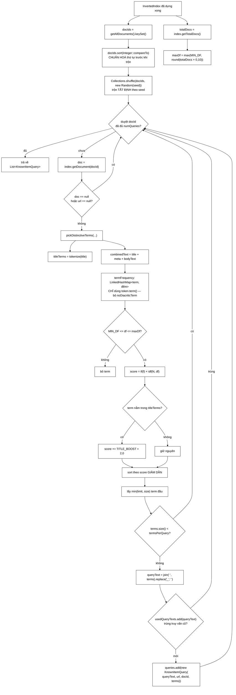

# KnownItemQueryGenerator — lớp chế ra ground truth từ hư không, và vì thế quyết định mọi con số trong `docs/EVALUATION.md` có nghĩa hay không

**File nguồn:** `search-engine/src/main/java/com/vnsearch/eval/KnownItemQueryGenerator.java` (166 dòng)
**Gói:** `com.vnsearch.eval` · **Loại:** `public class`, **có trạng thái tối thiểu** (một trường `tokenizer` bất biến) + `record KnownItemQuery` lồng bên trong + `record ScoredTerm` cục bộ trong phương thức
**Vị trí trong sơ đồ:** tầng **ĐẦU VÀO CỦA THÍ NGHIỆM** — chạy TRƯỚC mọi thứ khác trong `EvaluationRunner`, và mọi con số phía sau (`EvaluationMetrics` → `SignificanceTest` → bảng ablation) đều thừa hưởng nguyên vẹn mọi thiên lệch mà lớp này đưa vào
**Đọc kèm:** [`EvaluationRunner.md`](./EvaluationRunner.md) · [`EvaluationHarness.md`](./EvaluationHarness.md) · [`EvaluationMetrics.md`](./EvaluationMetrics.md) · [`SignificanceTest.md`](./SignificanceTest.md) · [`PoolBuilder.md`](./PoolBuilder.md) · [`QrelsEvaluationRunner.md`](./QrelsEvaluationRunner.md)

---

## 📌 Hiểu trong 30 giây

Muốn đo chất lượng một search engine thì phải có **nhãn liên quan** — với truy vấn
`q`, tài liệu nào là câu trả lời đúng. Nhãn ấy bình thường do **người** gán. TREC
trả tiền cho người gán nhãn chuyên nghiệp; một đồ án thì không có ngân sách đó, và
tự gán nhãn cho chính hệ thống mình viết là một cách gần như hoàn hảo để tự lừa
mình.

Lớp này né toàn bộ vấn đề bằng một phép lật ngược:

> Thay vì hỏi **"tài liệu nào liên quan tới truy vấn này"**, hãy **chọn trước một
> tài liệu**, sinh truy vấn **từ chính nội dung của nó**, rồi tuyên bố tài liệu đó
> là đáp án đúng duy nhất.

Ground truth trở nên **hiển nhiên đúng theo cấu tạo** — không cần ai gán, không ai
cãi được, và chạy lại lúc nào cũng ra đúng bộ cũ.

Nhưng cái giá phải trả không hề nhỏ, và đó là nội dung chính của tài liệu này:
**mọi thiên lệch trong cách sinh truy vấn sẽ trở thành thiên lệch trong kết luận**,
mà không có một dòng cảnh báo nào trong bảng kết quả.

```
   HAI CHIỀU CỦA CÙNG MỘT BÀI TOÁN ĐÁNH GIÁ

   ┌──────────────────────────────────────────────────────────────┐
   │ CHIỀU KINH ĐIỂN — ad-hoc retrieval (cách TREC làm)           │
   │                                                              │
   │   ① người viết ra 50 truy vấn (topic)                        │
   │   ② chạy nhiều hệ thống, gom top-k thành pool                 │
   │   ③ NGƯỜI gán nhãn 0/1/2 cho vài trăm cặp (q, doc)           │
   │   ④ tính nDCG, MAP                                            │
   │                                                              │
   │   Chi phí: 30 truy vấn × 500 tài liệu = 15.000 lượt đánh giá │
   │   Ưu:  truy vấn GIỐNG người thật, nhãn nhiều bậc             │
   │   Nhược: đắt, chậm, chủ quan, không tái lập khi đổi corpus    │
   └──────────────────────────────────────────────────────────────┘
                              ↕
   ┌──────────────────────────────────────────────────────────────┐
   │ CHIỀU NGƯỢC — known-item search (lớp này)                    │
   │                                                              │
   │   ① chọn ngẫu nhiên (có seed) một tài liệu d                 │
   │   ② rút 3 từ khoá ĐẶC TRƯNG NHẤT của d                       │
   │   ③ truy vấn = ba từ khoá đó; đáp án đúng = CHÍNH d          │
   │   ④ tính MRR, Success@k                                       │
   │                                                              │
   │   Chi phí: 0 lượt đánh giá của người. Vài giây máy.           │
   │   Ưu:  khách quan tuyệt đối, tái lập tuyệt đối, rẻ            │
   │   Nhược: truy vấn KHÔNG phải do người gõ — và đó là           │
   │          nguồn gốc của MỌI vấn đề ở mục 8.                    │
   └──────────────────────────────────────────────────────────────┘

   TÌNH HUỐNG NGƯỜI DÙNG MÀ NÓ MÔ PHỎNG ĐÚNG:
        "Tôi nhớ mang máng có đọc một bài về chuyện đó...
         hình như có mấy chữ 'lãi_suất', 'điều_hành', 'tín_dụng'."
        → gõ vào, mong bài ấy nằm ở hạng 1.

   ĐÓ LÀ MỘT TRUY VẤN THẬT, PHỔ BIẾN, VÀ ĐO ĐƯỢC.
   Nó chỉ KHÔNG PHẢI là toàn bộ vũ trụ truy vấn.
```



<details><summary>Xem bản chữ (ASCII)</summary>

```
   InvertedIndex đã dựng xong
        │
        ├──> docIds = getAllDocuments().keySet()
        │        │
        │        ├──> docIds.sort(Integer::compareTo)      [chuẩn hoá thứ tự]
        │        └──> Collections.shuffle(docIds, new Random(seed))  [trộn tất định]
        │
        └──> totalDocs = index.getTotalDocs()
                 └──> maxDf = max(MIN_DF, round(totalDocs × 0,10))

   VÒNG LẶP TRÊN docIds ĐÃ TRỘN:
        đã đủ numQueries?  ── CÓ ──> trả về List<KnownItemQuery>
                           └─ CHƯA ─┐
                                    v
        doc = index.getDocument(docId)
        doc == null || doc.getUrl() == null ?  ── CÓ ──> continue
                                              └─ KHÔNG ─┐
                                                        v
        pickDistinctiveTerms(doc, index, totalDocs, maxDf, termsPerQuery):
              titleTerms    = tokenize(doc.getTitle())
              combinedText  = title + metaDescription + bodyText
              termFrequency = LinkedHashMap<term, đếm>   [chỉ token.term()]
              với mỗi term:
                   df = index.getPostings(term).size()
                   df < MIN_DF hoặc df > maxDf  ──> bỏ term
                   score = TfIdfScorer.tf(f) × TfIdfScorer.idf(totalDocs, df)
                   term ∈ titleTerms  ──>  score ×= TITLE_BOOST (2,0)
              sort giảm dần theo score
              lấy min(limit, size) term đầu tiên

        terms.size() < termsPerQuery ?  ── CÓ ──> continue
                                        └─ KHÔNG ─┐
                                                  v
        queryText = String.join(" ", terms).replace('_', ' ')
        usedQueryTexts.add(queryText) trả false (đã có) ? ── CÓ ──> continue
                                                          └─ KHÔNG ─┐
                                                                    v
        queries.add(new KnownItemQuery(queryText, doc.getUrl(), docId, terms))
```

</details>

---

## Mục lục

- [1. Known-item retrieval — bài toán, lịch sử, và vì sao nó hợp với đồ án này](#1-known-item-retrieval--bài-toán-lịch-sử-và-vì-sao-nó-hợp-với-đồ-án-này)
- [2. Giải phẫu lớp — bốn thành phần và vì sao chỉ có bấy nhiêu](#2-giải-phẫu-lớp--bốn-thành-phần-và-vì-sao-chỉ-có-bấy-nhiêu)
- [3. `generate()` — đọc từng dòng](#3-generate--đọc-từng-dòng)
- [4. `pickDistinctiveTerms()` — đọc từng dòng](#4-pickdistinctiveterms--đọc-từng-dòng)
- [5. Cửa sổ document frequency — hai đầu chặn, hai lý do khác hẳn nhau](#5-cửa-sổ-document-frequency--hai-đầu-chặn-hai-lý-do-khác-hẳn-nhau)
- [6. `TITLE_BOOST` và việc dùng lại `TfIdfScorer` — vòng lặp lý luận cần nhìn thẳng](#6-title_boost-và-việc-dùng-lại-tfidfscorer--vòng-lặp-lý-luận-cần-nhìn-thẳng)
- [7. Seed ngẫu nhiên và tính tái lập — ba dòng mã, ba tầng bảo đảm](#7-seed-ngẫu-nhiên-và-tính-tái-lập--ba-dòng-mã-ba-tầng-bảo-đảm)
- [8. Bảy thiên lệch mà cách sinh này đưa vào, và chúng bẻ cong kết luận thế nào](#8-bảy-thiên-lệch-mà-cách-sinh-này-đưa-vào-và-chúng-bẻ-cong-kết-luận-thế-nào)
- [9. So sánh với qrels do người gán nhãn](#9-so-sánh-với-qrels-do-người-gán-nhãn)
- [10. Hướng dẫn về code](#10-hướng-dẫn-về-code)
- [11. Độ phức tạp & chi phí](#11-độ-phức-tạp--chi-phí)
- [12. Kiểm thử liên quan](#12-kiểm-thử-liên-quan)
- [13. Liên kết](#13-liên-kết)

---

## 1. Known-item retrieval — bài toán, lịch sử, và vì sao nó hợp với đồ án này

### 1.1 Ba loại nhiệm vụ tìm kiếm, và chỉ một loại đo được miễn phí

```
   ┌──────────────────────────────────────────────────────────────┐
   │ ① AD-HOC / TOPICAL — "cho tôi thông tin về X"                │
   │    "lãi suất ngân hàng 2024"                                  │
   │    Đáp án: NHIỀU tài liệu, mức liên quan NHIỀU BẬC.           │
   │    Đo bằng: nDCG, MAP.                                        │
   │    Cần: qrels do người gán. ĐẮT.                              │
   ├──────────────────────────────────────────────────────────────┤
   │ ② KNOWN-ITEM — "tìm lại cái tôi đã thấy"                     │
   │    "bài báo có mấy chữ lãi suất điều hành tín dụng"           │
   │    Đáp án: ĐÚNG MỘT tài liệu. Nhị phân.                       │
   │    Đo bằng: MRR, Success@k.                                   │
   │    Cần: chỉ cần biết tài liệu đích. MIỄN PHÍ nếu tự sinh.     │
   ├──────────────────────────────────────────────────────────────┤
   │ ③ NAVIGATIONAL — "đưa tôi tới trang chủ VnExpress"           │
   │    Đáp án: một URL cụ thể, thường là trang chủ một site.      │
   │    Là một biến thể hẹp của ②.                                 │
   └──────────────────────────────────────────────────────────────┘

   ⇒ Lớp này chọn ② — không phải vì ② quan trọng nhất,
     mà vì ② là loại DUY NHẤT có ground truth tự sinh được
     mà không cần ai gán nhãn.

   ⇒ Đây là một quyết định BỊ ÉP BỞI NGÂN SÁCH, không phải
     một quyết định khoa học. Nói thẳng điều đó ra là phần
     trung thực nhất của cả chương đánh giá.
```

### 1.2 Vì sao ground truth ở đây "đúng theo cấu tạo"

Javadoc dòng 22–29 diễn đạt rất gọn:

> thay vì hỏi "tài liệu nào liên quan tới truy vấn này", ta lật ngược lại — chọn
> trước một tài liệu, sinh truy vấn TỪ CHÍNH nó, và ground truth hiển nhiên chính
> là tài liệu đó.

```
   VÌ SAO CÂU "HIỂN NHIÊN" ẤY LÀ HỢP LỆ:

   Ta không ĐOÁN rằng d liên quan tới q.
   Ta KIẾN TẠO q từ d, nên quan hệ liên quan không cần chứng minh —
   nó là ĐỊNH NGHĨA.

   ┌──────────────────────────────────────────────────────────────┐
   │ Ở phương pháp ad-hoc:                                        │
   │    q có trước → phải ĐI TÌM những d liên quan → cần người    │
   │                                                              │
   │ Ở known-item:                                                │
   │    d có trước → q ĐƯỢC SINH RA từ d → quan hệ đã có sẵn      │
   └──────────────────────────────────────────────────────────────┘

   ⚠ NHƯNG ĐÂY CŨNG LÀ CHỖ CẦN CẨN THẬN NHẤT:
     "d liên quan tới q" là ĐÚNG theo cấu tạo.
     "d là tài liệu DUY NHẤT liên quan tới q" thì KHÔNG.

     Với truy vấn "lãi suất điều hành tín dụng", rất có thể
     có bốn bài báo khác cũng nói đúng chuyện đó và cũng đáng
     nằm ở hạng 1. Hệ thống xếp một trong bốn bài kia lên hạng 1
     sẽ bị TÍNH LÀ SAI, dù nó không sai gì cả.

     Trong thuật ngữ đánh giá: đây là các "unjudged relevant
     document" bị coi mặc định là không liên quan. Xem mục 8.3.
```

### 1.3 Vì sao MRR chứ không phải nDCG

```
   MRR = trung bình của 1/hạng-của-tài-liệu-đích

   Nó ĐÚNG CHO known-item vì:
        ① Chỉ có MỘT đáp án đúng → không có khái niệm "xếp thứ tự
          giữa nhiều tài liệu liên quan" để nDCG phát huy tác dụng.
        ② Người dùng known-item quét từ trên xuống, dừng ngay khi
          thấy thứ mình nhớ → 1/hạng mô hình hoá đúng hành vi đó.
        ③ Nhãn nhị phân → không có bậc liên quan để chiết khấu.

   nDCG với nhãn nhị phân và đúng một tài liệu liên quan
   suy biến thành 1/log₂(hạng+1) — vẫn dùng được, nhưng
   không thêm thông tin gì so với 1/hạng, chỉ khó giải thích hơn.

   ⇒ Đường qrels nhiều bậc (PoolBuilder → QrelsEvaluationRunner)
     tồn tại chính là để phủ phần mà MRR không phủ được.
     Hai đường BỔ SUNG cho nhau, không thay thế nhau.
```

---

## 2. Giải phẫu lớp — bốn thành phần và vì sao chỉ có bấy nhiêu

```java
public static final int MIN_DF = 3;                  // dòng 52
public static final double MAX_DF_RATIO = 0.10;      // dòng 55
private static final double TITLE_BOOST = 2.0;       // dòng 58
private final VietnameseTokenizer tokenizer;         // dòng 60
```

```
   BỐN THÀNH PHẦN, BA MỨC HIỂN THỊ KHÁC NHAU — CÓ CHỦ Ý:

   MIN_DF        public   ← EvaluationRunner IN NÓ RA BÁO CÁO (dòng 452)
   MAX_DF_RATIO  public   ← EvaluationRunner IN NÓ RA BÁO CÁO (dòng 453)
   TITLE_BOOST   private  ← KHÔNG được in ra báo cáo
   tokenizer     private  ← chi tiết cài đặt, tiêm được qua constructor

   ┌──────────────────────────────────────────────────────────────┐
   │  HAI HẰNG SỐ public KHÔNG PHẢI DO LƯỜI ĐÓNG GÓI.             │
   │  Chúng public vì chúng là THAM SỐ THÍ NGHIỆM, và một          │
   │  tham số thí nghiệm phải xuất hiện trong báo cáo, nếu         │
   │  không thì thí nghiệm không tái lập được bởi người khác.      │
   │                                                              │
   │  EvaluationRunner.buildMarkdownReport dòng 451–454 đọc        │
   │  thẳng hai hằng số ấy và in ra khoảng [3, 10% số tài liệu].   │
   │  Nếu ai đó đổi hằng số, báo cáo TỰ ĐỘNG nói đúng con số mới.  │
   │                                                              │
   │  ⚠ TITLE_BOOST thì KHÔNG được đối xử như vậy — và đó là       │
   │    một điểm KHÔNG NHẤT QUÁN thật sự. Xem đề xuất 3.           │
   └──────────────────────────────────────────────────────────────┘
```

### 2.1 Hai constructor — vì sao có cái thứ hai

```java
public KnownItemQueryGenerator() {
    this(new VietnameseTokenizer());
}

public KnownItemQueryGenerator(VietnameseTokenizer tokenizer) {
    this.tokenizer = tokenizer;
}
```

```
   BẤT BIẾN SỐNG CÒN: tokenizer dùng ở đây phải là ĐÚNG tokenizer
   đã dùng lúc dựng chỉ mục.

   VÌ SAO:  pickDistinctiveTerms tra df bằng index.getPostings(term).
            Nếu tokenizer khác nhau, `term` sinh ra ở đây sẽ KHÔNG
            khớp khoá trong index → getPostings trả về List.of()
            → df = 0 → 0 < MIN_DF → MỌI term bị loại
            → terms.size() = 0 < termsPerQuery
            → MỌI tài liệu bị bỏ qua
            → generate() trả về DANH SÁCH RỖNG.

   ┌──────────────────────────────────────────────────────────────┐
   │  HỎNG KIỂU NÀY IM LẶNG NHƯNG DỄ THẤY: EvaluationRunner        │
   │  dòng 74–77 kiểm tra queries.isEmpty() rồi in                 │
   │  "Khong sinh duoc truy van nao - kiem tra lai corpus."        │
   │  RankingQualityTest dòng 107–109 khẳng định mạnh hơn nhiều,   │
   │  với thông điệp chỉ đúng vào hai nguyên nhân có thật.         │
   │                                                              │
   │  Nhưng lưu ý: cả hai chỉ bắt được ca CHẾT HẲN.                │
   │  Nếu tokenizer chỉ khác một chút (ví dụ khác danh sách        │
   │  stopword), một PHẦN term khớp và một phần không —            │
   │  bộ truy vấn vẫn sinh ra, chỉ là KÉM CHẤT LƯỢNG HƠN,          │
   │  và không có gì báo động.                                     │
   └──────────────────────────────────────────────────────────────┘

   ⇒ Constructor nhận tokerizer tồn tại đúng để người gọi CÓ THỂ
     giữ bất biến đó. EvaluationHarness làm y hệt ở dòng 75–80
     với một Javadoc viết hoa: "BAT BIEN: phai dung CHINH tokenizer
     da dung luc index."

   ⚠ NHƯNG cả EvaluationRunner (dòng 72), RankingQualityTest
     (dòng 106) và GinBaselineRunner (dòng 62) đều gọi constructor
     KHÔNG THAM SỐ — tức là dựng một VietnameseTokenizer MỚI.
     Chuyện đó hiện đúng vì VietnameseTokenizer mặc định là tất
     định và không có trạng thái ngoài từ điển; nhưng bất biến
     đang được giữ bởi MAY MẮN chứ không bởi RÀNG BUỘC.
```

### 2.2 `record KnownItemQuery` — bốn trường, mỗi trường một người dùng

```java
public record KnownItemQuery(String queryText, String targetUrl, int targetDocId, List<String> terms) {
}
```

| Trường | Ai dùng | Vì sao cần |
|---|---|---|
| `queryText` | `EvaluationHarness.search`, `EvaluationRunner` dòng 132, 477 | Chuỗi thật đưa vào `QueryParser`, có dấu, đã thay `_` bằng khoảng trắng |
| `targetUrl` | `EvaluationMetrics.reciprocalRank` (qua `RankingQualityTest` dòng 122) | **URL chứ không phải docId**, vì `EvaluationHarness.search` trả về danh sách URL — docId đổi sau mỗi lần crawl lại, URL thì không |
| `targetDocId` | chưa có nơi nào tiêu thụ trong `main/`; hữu ích để gỡ lỗi và tra ngược tài liệu | Giữ lại vì rẻ và vì mất nó thì không truy ngược được về `index.getDocument` |
| `terms` | chưa có nơi nào tiêu thụ; giữ dạng **có gạch dưới** (`lãi_suất`) | Đây là dạng token THẬT trong chỉ mục — cần để kiểm chứng thủ công rằng truy vấn được `QueryParser` ghép lại đúng như lúc index |

```
   ⚠ MỘT BẪY BẤT BIẾN NHỎ NHƯNG THẬT:
     record cho equals/hashCode/getter miễn phí, NHƯNG trường
     `terms` là một List<String> tham chiếu tới CHÍNH danh sách
     `result` mà pickDistinctiveTerms vừa dựng (một ArrayList
     có thể sửa). record KHÔNG sao chép phòng vệ.

     Hiện không ai sửa nó nên chưa hỏng. Cách sửa đúng là một
     constructor gọn:
         public KnownItemQuery {
             terms = List.copyOf(terms);
         }
     Xem đề xuất 4.
```

---

## 3. `generate()` — đọc từng dòng

```java
public List<KnownItemQuery> generate(InvertedIndex index, int numQueries, int termsPerQuery, long seed) {
```

Bốn tham số, và cả bốn đều là **tham số thí nghiệm** chứ không phải chi tiết kỹ
thuật. `EvaluationRunner` truyền `numQueries` từ dòng lệnh (mặc định 200),
`TERMS_PER_QUERY = 3`, `SEED = 42L`.

### 3.1 Ba dòng đầu — thứ tự tất định

```java
List<Integer> docIds = new ArrayList<>(index.getAllDocuments().keySet());
docIds.sort(Integer::compareTo); // sắp xếp trước để seed cho ra cùng kết quả giữa các lần chạy
java.util.Collections.shuffle(docIds, new Random(seed));
```

```
   VÌ SAO PHẢI sort() TRƯỚC KHI shuffle() — CÂU HỎI HAY BỊ HỎI SAI

   Trực giác sai:  "trộn xong thì thứ tự ban đầu có quan trọng gì đâu?"

   SỰ THẬT:  Collections.shuffle là một hoán vị TẤT ĐỊNH của
             thứ tự ĐẦU VÀO theo dòng số ngẫu nhiên.
             Cùng seed + đầu vào KHÁC THỨ TỰ = đầu ra KHÁC.

   ┌──────────────────────────────────────────────────────────────┐
   │  shuffle(seed=42) áp lên [1,2,3,4,5]  →  [3,1,5,2,4]         │
   │  shuffle(seed=42) áp lên [2,1,3,4,5]  →  [3,2,5,1,4]         │
   │                                            ↑     ↑            │
   │  CÙNG seed, CÙNG tập phần tử, KHÁC KẾT QUẢ.                   │
   └──────────────────────────────────────────────────────────────┘

   VÀ THỨ TỰ CỦA keySet() CÓ ỔN ĐỊNH KHÔNG?
        InvertedIndex.documents hiện là một map giữ thứ tự chèn,
        và addDocument bắt buộc docId TĂNG DẦN (nó ném
        IllegalArgumentException nếu không), nên trên thực tế
        keySet() ĐANG có thứ tự tăng dần sẵn.

        ⇒ dòng sort() hiện tại là một NO-OP về giá trị.
        ⇒ Nhưng nó KHÔNG phải mã thừa: nó biến một tính chất
          ĐANG ĐÚNG NHỜ CÀI ĐẶT thành một tính chất ĐƯỢC BẢO ĐẢM
          TẠI CHỖ DÙNG. Nếu mai kia InvertedIndex đổi sang HashMap,
          hoặc nếu ai đó nạp corpus từ Postgres theo thứ tự khác,
          dòng này là thứ DUY NHẤT giữ cho báo cáo còn tái lập.

        Chi phí: một lần sort O(N log N) trên 5.011 số nguyên.
        Vài phần nghìn giây. Rẻ đến mức không đáng bàn.
```

### 3.2 Tính `maxDf` — và cái sàn `Math.max` khôn ngoan

```java
int totalDocs = index.getTotalDocs();
int maxDf = Math.max(MIN_DF, (int) Math.round(totalDocs * MAX_DF_RATIO));
```

```
   VỚI CORPUS THẬT (5.011 tài liệu):
        maxDf = max(3, round(501,1)) = 501
        cửa sổ df hợp lệ:  [3, 501]

   VỚI CORPUS SEED (40 tài liệu, RankingQualityTest):
        maxDf = max(3, round(4,0)) = 4
        cửa sổ df hợp lệ:  [3, 4]   ← RẤT HẸP!

   VỚI CORPUS 20 TÀI LIỆU:
        round(2,0) = 2, nhưng max(3, 2) = 3
        cửa sổ df hợp lệ:  [3, 3]   ← ĐÚNG MỘT GIÁ TRỊ

   VỚI CORPUS 10 TÀI LIỆU:
        round(1,0) = 1, max(3,1) = 3  →  cửa sổ [3, 3]

   ┌──────────────────────────────────────────────────────────────┐
   │  Math.max(MIN_DF, ...) NGĂN MỘT CA CHẾT NGƯỜI:                │
   │  không có nó, corpus nhỏ sẽ cho maxDf < MIN_DF, tức           │
   │  cửa sổ [3, 2] là TẬP RỖNG, và điều kiện                      │
   │       if (df < MIN_DF || df > maxDf) continue;                │
   │  loại SẠCH mọi term, mọi tài liệu, mọi truy vấn.              │
   │  generate() trả về danh sách rỗng mà không một lời giải thích.│
   │                                                              │
   │  Có nó, cửa sổ suy biến thành đúng một điểm df = 3 —          │
   │  hẹp đến mức khó chịu, nhưng KHÔNG RỖNG, và hệ thống          │
   │  vẫn sinh được truy vấn.                                      │
   └──────────────────────────────────────────────────────────────┘

   ⚠ HỆ QUẢ THẬT TRÊN CORPUS SEED: cửa sổ [3, 4] nghĩa là truy vấn
     chỉ được ghép từ những term xuất hiện ở đúng 3 hoặc 4 trong
     40 tài liệu. Phép giao ba posting list như thế gần như luôn
     trả về đúng một tài liệu → MRR = 1,0000.
     RankingQualityTest Javadoc dòng 48–53 nói thẳng điều đó và
     gọi đúng tên: "độ đo đã BÃO HOÀ", "đây là bộ báo hỏng,
     không phải thước đo chất lượng".
```

### 3.3 Vòng lặp chính — bốn cổng lọc

```java
for (int docId : docIds) {
    if (queries.size() >= numQueries) {
        break;
    }
    WebDocument doc = index.getDocument(docId);
    if (doc == null || doc.getUrl() == null) {
        continue;
    }
    List<String> terms = pickDistinctiveTerms(doc, index, totalDocs, maxDf, termsPerQuery);
    if (terms.size() < termsPerQuery) {
        continue; // tài liệu quá ngắn hoặc không đủ term phân biệt -> bỏ qua
    }
    String queryText = String.join(" ", terms).replace('_', ' ');
    if (!usedQueryTexts.add(queryText)) {
        continue; // tránh 2 tài liệu sinh ra cùng một truy vấn (ground truth sẽ nhập nhằng)
    }
    queries.add(new KnownItemQuery(queryText, doc.getUrl(), docId, terms));
}
```

```
   BỐN CỔNG, THEO ĐÚNG THỨ TỰ TĂNG DẦN CHI PHÍ:

   ① queries.size() >= numQueries   →  break
        O(1). Dừng NGAY khi đủ. Không duyệt hết corpus.
        ⇒ với numQueries = 200 trên 5.011 tài liệu, vòng lặp
          thường dừng sau ~220–260 vòng, không phải 5.011.

   ② doc == null || doc.getUrl() == null   →  continue
        O(1). Phòng thủ rẻ. targetUrl là ground truth —
        một url null sẽ làm reciprocalRank so sánh với null
        và im lặng trả 0 cho MỌI truy vấn của tài liệu đó.

   ③ terms.size() < termsPerQuery   →  continue    ← ĐẮT NHẤT
        Đây là cổng duy nhất phải chạy pickDistinctiveTerms,
        tức phải TÁCH TỪ toàn bộ tài liệu. Xem mục 11.

        ⚠ TẤT CẢ HOẶC KHÔNG GÌ: yêu cầu ĐỦ 3 term.
          Không có chuyện "chỉ tìm được 2 term thì dùng 2".
          Lý do đúng: số term mỗi truy vấn là BIẾN THÍ NGHIỆM,
          trộn truy vấn 2 từ với truy vấn 3 từ vào cùng một
          bộ sẽ làm MRR trung bình không diễn giải được —
          truy vấn ít từ thì độ khó khác hẳn.

   ④ !usedQueryTexts.add(queryText)   →  continue
        O(1) amortized. HashSet.add trả false nếu đã có.
        Thành ngữ "kiểm tra và chèn trong một lời gọi" —
        gọn hơn contains() rồi add(), và không có khoảng
        trống nào giữa hai thao tác.
```

### 3.4 Vì sao khử trùng truy vấn lại quan trọng đến thế

```
   TÌNH HUỐNG: hai tài liệu d₁ và d₂ cùng cho ra
               "lãi suất điều hành tín dụng"

   NẾU KHÔNG KHỬ TRÙNG:
        q xuất hiện HAI LẦN trong bộ truy vấn, một lần với
        ground truth = d₁, một lần với ground truth = d₂.

        Hệ thống chỉ có thể xếp MỘT trong hai lên hạng 1.
        ⇒ Một truy vấn được RR = 1,0, truy vấn kia RR ≤ 0,5.
        ⇒ MRR bị KÉO XUỐNG một cách CƠ HỌC, bất kể hệ thống
          tốt đến đâu. Không cấu hình nào thoát được.

   ┌──────────────────────────────────────────────────────────────┐
   │  VÀ TỆ HƠN NHIỀU — NÓ PHÁ GIẢ ĐỊNH ĐỘC LẬP CỦA               │
   │  KIỂM ĐỊNH THỐNG KÊ.                                          │
   │                                                              │
   │  SignificanceTest.md mục 3.2 nói thẳng:                       │
   │    "GIẢ ĐỊNH 1 — các hiệu d_i ĐỘC LẬP với nhau.               │
   │     Sẽ VỠ nếu bộ truy vấn có nhiều truy vấn sinh từ           │
   │     CÙNG một tài liệu — xem KnownItemQueryGenerator."         │
   │                                                              │
   │  Tức là dòng `usedQueryTexts.add(...)` không chỉ giữ cho      │
   │  MRR sạch — nó là điều kiện để p-value ở CUỐI đường ống       │
   │  còn có nghĩa. Một dòng ba mươi ký tự chống đỡ cho cả         │
   │  chương kết quả.                                              │
   └──────────────────────────────────────────────────────────────┘

   ⚠ CHÚ Ý: khử trùng theo CHUỖI TRUY VẤN, không theo TẬP TERM.
     "a b c" và "b a c" là hai chuỗi khác nhau nhưng cùng một
     tập từ khoá, và QueryParser sẽ phân giải chúng thành
     CÙNG một tập ứng viên. Hiện chuyện này gần như không xảy ra
     vì thứ tự term luôn theo điểm giảm dần, nhưng nó vẫn là
     một lỗ hổng chưa được bịt. Xem đề xuất 5.
```

### 3.5 Dòng `replace('_', ' ')` — cây cầu giữa hai thế giới

```java
// Thay "_" bằng khoảng trắng để truy vấn trông tự nhiên như người gõ;
// QueryParser sẽ tự ghép lại thành đúng token như lúc index.
String queryText = String.join(" ", terms).replace('_', ' ');
```

```
   VietnameseTokenizer nối các âm tiết của từ ghép bằng dấu gạch dưới
   (joinWithUnderscore), nên term trong chỉ mục có dạng:

        "lãi_suất"   "điều_hành"   "tín_dụng"

   NẾU KHÔNG THAY GẠCH DƯỚI:
        queryText = "lãi_suất điều_hành tín_dụng"
        → QueryParser tách chuỗi này thành âm tiết
        → gạch dưới không phải ký tự âm tiết hợp lệ
        → truy vấn hỏng hoặc ra term khác hẳn

   NẾU THAY (như hiện tại):
        queryText = "lãi suất điều hành tín dụng"
        → chuỗi này TRÔNG NHƯ NGƯỜI GÕ, đúng tinh thần đánh giá
        → QueryParser dùng CÙNG một VietnameseTokenizer
        → thuật toán MaxWeightDP ghép lại thành đúng
          "lãi_suất", "điều_hành", "tín_dụng"

   ┌──────────────────────────────────────────────────────────────┐
   │  ⚠ ĐÂY LÀ MỘT VÒNG PHỤ THUỘC NGẦM, KHÔNG ĐƯỢC KIỂM CHỨNG.    │
   │                                                              │
   │  Phép ghép lại KHÔNG được bảo đảm khôi phục đúng term gốc.    │
   │  MaxWeightDP chọn phân đoạn tối ưu TOÀN CỤC cho cả chuỗi,     │
   │  mà chuỗi ở đây là ba từ khoá GHÉP CẠNH NHAU KHÔNG NGỮ CẢNH.  │
   │                                                              │
   │  Ví dụ giả định: "điều hành tín dụng" có thể bị phân đoạn     │
   │  thành "điều" + "hành_tín" + "dụng" nếu từ điển có            │
   │  "hành tín" với trọng số đủ lớn — và lúc đó truy vấn tìm      │
   │  một tập term KHÁC HẲN tập term đã chấm điểm.                 │
   │                                                              │
   │  Hậu quả không phải là lỗi ồn ào: hệ thống vẫn trả kết quả,   │
   │  MRR chỉ TỤT XUỐNG, và không ai biết vì sao.                  │
   │                                                              │
   │  Trường `terms` trong record tồn tại đúng để kiểm chứng       │
   │  điều này — nhưng KHÔNG BÀI TEST NÀO đang làm việc đó.        │
   │  Xem đề xuất 1: đây là lỗ hổng nghiêm trọng nhất của lớp.     │
   └──────────────────────────────────────────────────────────────┘
```

---

## 4. `pickDistinctiveTerms()` — đọc từng dòng

```java
private List<String> pickDistinctiveTerms(WebDocument doc, InvertedIndex index,
                                           int totalDocs, int maxDf, int limit) {
```

Đây là nơi toàn bộ chất lượng của bộ truy vấn được quyết định.

### 4.1 Thu tập term của tiêu đề

```java
Set<String> titleTerms = new HashSet<>();
for (VietnameseTokenizer.Token token : tokenizer.tokenize(doc.getTitle())) {
    titleTerms.add(token.term());
}
```

`tokenize` có bảo vệ `null`/blank ngay đầu (`if (text == null || text.isBlank())
return tokens;`), nên tiêu đề rỗng cho ra tập rỗng, không ném ngoại lệ. Đây là
một `HashSet` chứ không phải `List` vì nó chỉ được dùng cho một phép hỏi
`contains` ở dòng 153 — O(1) thay vì O(n).

### 4.2 Ghép văn bản — và một lỗi thật, im lặng, đang tồn tại

```java
String combinedText = String.join(" ",
        doc.getTitle() != null ? doc.getTitle() : "",
        doc.getMetaDescription() != null ? doc.getMetaDescription() : "",
        doc.getBodyText() != null ? doc.getBodyText() : "");
```

```
   ┌──────────────────────────────────────────────────────────────┐
   │  ⚠⚠ PHÁT HIỆN QUAN TRỌNG NHẤT CỦA CẢ TÀI LIỆU NÀY:           │
   │                                                              │
   │  doc.getBodyText() Ở ĐÂY LUÔN TRẢ VỀ null.                    │
   └──────────────────────────────────────────────────────────────┘

   CHUỖI SUY LUẬN, TỪNG BƯỚC, TRÊN MÃ THẬT:

   ① generate() lấy doc bằng  index.getDocument(docId)
   ② InvertedIndex.getDocument (dòng 246) trả  documents.get(docId)
   ③ documents được điền trong addDocument (dòng ~129):
             documents.put(docId, doc.withoutBodyText());
   ④ WebDocument.withoutBodyText (dòng 127–132) dựng bản sao với
             new WebDocument(docId, url, title, metaDescription, null, ...)
                                                              ↑
                                                    bodyText = null

   ⇒ Thân bài KHÔNG nằm trong đối tượng WebDocument mà chỉ mục trả về.
     Nó nằm trong map riêng `bodyTexts`, ở dạng NÉN, và chỉ lấy được
     qua  index.getBodyText(docId)  (dòng 262).

   ┌──────────────────────────────────────────────────────────────┐
   │  HỆ QUẢ THỰC TẾ:                                              │
   │                                                              │
   │  combinedText = title + " " + metaDescription + " " + ""      │
   │                                                              │
   │  Toàn bộ THÂN BÀI — phần dài nhất, giàu term nhất, và là      │
   │  thứ mà "chọn từ khoá đặc trưng theo TF-IDF" cần nhất —       │
   │  KHÔNG BAO GIỜ được xét.                                      │
   │                                                              │
   │  Ternary `!= null ? ... : ""` biến một NullPointerException   │
   │  ồn ào (dễ phát hiện trong 5 phút) thành một mất mát dữ liệu  │
   │  hoàn toàn im lặng (chưa ai phát hiện).                       │
   └──────────────────────────────────────────────────────────────┘

   NHỮNG GÌ HỎNG THEO — VÀ HỎNG THEO KIỂU KHÓ THẤY:

   ① tf(f) gần như luôn = 1 + log₁₀(1) = 1,0
        Trong tiêu đề + mô tả (~30–50 token), một term hiếm khi
        xuất hiện quá một lần. Thành phần TF của TF-IDF BỊ VÔ HIỆU.
        Việc chọn term thực chất chỉ còn dựa trên IDF và TITLE_BOOST.

   ② TITLE_BOOST mất gần hết ý nghĩa
        Ý định của nó là "nâng term tiêu đề LÊN TRÊN term thân bài".
        Nhưng khi thân bài không có mặt, gần như MỌI ứng viên đều
        là term tiêu đề hoặc mô tả — nhân 2,0 cho gần hết ứng viên
        tương đương không nhân gì cả (chỉ đổi thang, không đổi thứ tự
        trong nhóm được nhân).

   ③ Cổng ③ ở mục 3.3 loại NHIỀU tài liệu hơn hẳn mức cần thiết
        Tài liệu có tiêu đề ngắn và không có metaDescription có thể
        không đủ 3 term trong cửa sổ df → bị bỏ qua. Tức bộ truy vấn
        bị lệch về phía tài liệu có SIÊU DỮ LIỆU ĐẦY ĐỦ — một dạng
        thiên lệch chọn mẫu không ai chủ ý. Xem mục 8.1.

   ④ Nó ĐANG che một điểm mạnh khác của thiết kế
        Nghịch lý: truy vấn sinh từ tiêu đề + mô tả THỰC RA GIỐNG
        người dùng hơn (người ta nhớ tiêu đề, không nhớ đoạn giữa
        thân bài). Nên kết quả đo được có thể vẫn HỢP LÝ —
        nhưng nó hợp lý DO TÌNH CỜ, không do thiết kế, và
        Javadoc đang mô tả một hành vi KHÔNG XẢY RA.

   ⇒ Xem đề xuất 2 để biết cách sửa, và vì sao sửa xong
     phải chạy lại TOÀN BỘ báo cáo.
```

### 4.3 Đếm tần suất — và vì sao chỉ lấy dạng có dấu

```java
Map<String, Integer> termFrequency = new LinkedHashMap<>();
for (VietnameseTokenizer.Token token : tokenizer.tokenize(combinedText)) {
    // Chỉ dùng dạng CÓ DẤU: chỉ mục lưu song song cả bản không dấu,
    // nếu lấy cả hai thì truy vấn sinh ra sẽ lặp cùng một từ hai lần.
    termFrequency.merge(token.term(), 1, Integer::sum);
}
```

```
   BỐI CẢNH: VietnameseTokenizer.Token là
        record Token(String term, String noDiacriticTerm, int position)

   và InvertedIndex.addDocument (dòng ~140–145) index CẢ HAI:
        positionsByTerm.computeIfAbsent(term, ...)
        if (!token.noDiacriticTerm().equals(token.term())) {
            positionsByTerm.computeIfAbsent(noDiacritic, ...)
        }

   ⇒ Chỉ mục chứa CẢ "lãi_suất" LẪN "lai_suat", cả hai đều có
     posting list HỢP LỆ với df BẰNG NHAU.

   NẾU pickDistinctiveTerms ĐẾM CẢ HAI DẠNG:
        cả "lãi_suất" và "lai_suat" đều lọt cửa sổ df,
        đều có tf giống hệt, idf giống hệt → ĐIỂM BẰNG NHAU
        → cả hai cùng lọt top-3
        → truy vấn "lãi suất lai suat điều hành"
        → VÔ NGHĨA với người đọc, và về mặt truy hồi thì
          hai term ấy giao ra CÙNG một tập tài liệu, tức là
          truy vấn 3 từ thực chất chỉ có 2 từ phân biệt.

   ⇒ Dòng comment ngắn ở đây đang bảo vệ một thứ rất thật.

   ⚠ MỘT MẶT KHÁC ÍT AI ĐỂ Ý: vì chỉ mục lưu cả hai dạng,
     `index.getTermCount()` (in vào bảng "Số term phân biệt"
     của báo cáo, EvaluationRunner dòng 464) ĐANG ĐẾM GẤP ĐÔI
     đối với mọi từ có dấu. Điều đó không ảnh hưởng tới lớp này
     (nó chỉ tra df của từng term cụ thể), nhưng nó ảnh hưởng
     tới cách người đọc hiểu con số corpus.
```

**Vì sao `LinkedHashMap` chứ không `HashMap`:** thứ tự duyệt của `entrySet()` trở
thành **tất định theo thứ tự xuất hiện trong văn bản**. Điều đó không đổi kết quả
khi mọi điểm đôi một khác nhau, nhưng khi **hai term có điểm bằng nhau**,
`List.sort` của Java là **ổn định** (stable), nên term xuất hiện trước trong văn
bản sẽ được giữ trước. Với `HashMap`, thứ tự phụ thuộc hash và có thể đổi giữa các
phiên bản JDK — tức là **bộ truy vấn có thể đổi mà seed vẫn y nguyên**. Đây là
tầng bảo đảm tái lập thứ ba, nói kỹ ở mục 7.

### 4.4 Chấm điểm và lọc

```java
record ScoredTerm(String term, double score) {
}
List<ScoredTerm> scored = new ArrayList<>();
for (Map.Entry<String, Integer> entry : termFrequency.entrySet()) {
    String term = entry.getKey();
    List<Posting> postings = index.getPostings(term);
    int df = postings.size();
    if (df < MIN_DF || df > maxDf) {
        continue;
    }
    double score = TfIdfScorer.tf(entry.getValue()) * TfIdfScorer.idf(totalDocs, df);
    if (titleTerms.contains(term)) {
        score *= TITLE_BOOST;
    }
    scored.add(new ScoredTerm(term, score));
}
```

```
   `record ScoredTerm` KHAI BÁO NGAY TRONG THÂN PHƯƠNG THỨC
   (local record, Java 16+). Đây là lựa chọn đúng:
        · nó chỉ sống trong đúng phương thức này
        · không rò ra API công khai của lớp
        · đọc rõ hơn nhiều so với double[] song song hay Map.Entry

   df = index.getPostings(term).size()
        InvertedIndex.getPostings là O(1) (getOrDefault trên map),
        và .size() trên ArrayList cũng O(1).
        ⇒ Không có chuyện duyệt posting list. Rẻ.

        Và bất biến "mỗi (term, doc) đúng MỘT posting" — được
        addDocument bảo đảm bằng cách gom vị trí theo term TRƯỚC
        khi tạo Posting — chính là thứ làm cho .size() BẰNG ĐÚNG
        document frequency. Nếu bất biến đó vỡ, df bị thổi phồng
        và toàn bộ cửa sổ lọc ở đây sai theo.

   TfIdfScorer.tf(f)  = f > 0 ? 1 + log₁₀(f) : 0,0
   TfIdfScorer.idf(N, df) = log₁₀(N / df),  trả 0 nếu df ≤ 0 hoặc N ≤ 0

   ⇒ DÙNG LẠI CHÍNH HÀM CỦA HỆ THỐNG XẾP HẠNG, không viết lại.
     Ưu điểm: không có nguy cơ hai công thức lệch nhau.
     Nhược điểm: nó tạo một VÒNG LÝ LUẬN — xem mục 6.
```

### 4.5 Sắp xếp và cắt

```java
scored.sort(Comparator.comparingDouble(ScoredTerm::score).reversed());
List<String> result = new ArrayList<>();
for (int i = 0; i < Math.min(limit, scored.size()); i++) {
    result.add(scored.get(i).term());
}
return result;
```

```
   ⚠ SẮP XẾP TOÀN BỘ ĐỂ LẤY 3 PHẦN TỬ ĐẦU.

   Với một tài liệu có ~180 term ứng viên qua được cửa sổ df:
        sort O(k log k) = 180 × log₂180 ≈ 1.350 phép so sánh
        chỉ để lấy 3 giá trị lớn nhất.

   Cách tối ưu: MinHeap kích thước 3 — đúng cấu trúc mà repo
   này ĐÃ CÓ và đã dùng ở ResultRanker cho top-K.
        O(k log limit) = 180 × log₂3 ≈ 285 phép so sánh.

   TIẾT KIỆM ~4,7 LẦN.

   ┌──────────────────────────────────────────────────────────────┐
   │  NHƯNG CÓ NÊN LÀM KHÔNG? KHÔNG.                               │
   │                                                              │
   │  Chi phí thật của pickDistinctiveTerms bị THỐNG TRỊ bởi       │
   │  tokenizer.tokenize(combinedText) — thuật toán MaxWeightDP    │
   │  chạy quy hoạch động trên toàn văn bản. Phép sort chiếm       │
   │  chưa tới 1 % thời gian (xem mục 11).                         │
   │                                                              │
   │  Tối ưu 1 % bằng cách thêm một cấu trúc dữ liệu là một        │
   │  đánh đổi TỒI: mã khó đọc hơn, có thêm chỗ để sai, đổi lấy    │
   │  một khoản không đo được. Giữ nguyên `sort` là quyết định     │
   │  ĐÚNG, và đáng nói rõ ra thay vì để người đọc tự hỏi.         │
   └──────────────────────────────────────────────────────────────┘

   ⚠ Math.min(limit, scored.size()) là dòng chống lỗi biên duy nhất
     cần ở đây: nếu tài liệu chỉ có 2 term hợp lệ mà limit = 3,
     vòng lặp dừng ở 2 và cổng ③ của generate() sẽ loại tài liệu.
     Không có IndexOutOfBoundsException nào.
```

---

## 5. Cửa sổ document frequency — hai đầu chặn, hai lý do khác hẳn nhau

Javadoc dòng 31–40 gọi đây là **"chỗ dễ làm sai nhất"**, và đó không phải lời nói
quá.

### 5.1 Chặn dưới: `df >= MIN_DF = 3`

```
   NẾU KHÔNG CÓ CHẶN DƯỚI — CA HỎNG KINH ĐIỂN CỦA KNOWN-ITEM:

   Thuật toán chọn term theo TF-IDF cao nhất.
   idf(N, df) = log₁₀(N/df) đạt CỰC ĐẠI khi df = 1.
   ⇒ Nếu không chặn, thuật toán sẽ LUÔN LUÔN chọn các term
     df = 1 — tức là những term CHỈ tài liệu đích mới có.

   ┌──────────────────────────────────────────────────────────────┐
   │  HẬU QUẢ:                                                     │
   │                                                              │
   │  CandidateResolver giao ba posting list, mỗi list có          │
   │  ĐÚNG MỘT phần tử, và cả ba đều là tài liệu đích.             │
   │                                                              │
   │  ⇒ Tập ứng viên = { d }                                       │
   │  ⇒ Xếp hạng 1 phần tử: mọi thuật toán cho cùng kết quả        │
   │  ⇒ RR = 1,0 cho MỌI truy vấn, MỌI cấu hình                    │
   │  ⇒ MRR = 1,0000 cho cả 13 cấu hình                            │
   │  ⇒ ΔMRR = 0 ở mọi cặp                                         │
   │  ⇒ SignificanceTest nhận hai dãy Y HỆT NHAU, trả p = 1,0      │
   │  ⇒ TOÀN BỘ chương kết quả trở thành một bảng số 1,0000        │
   │                                                              │
   │  Và nó KHÔNG BÁO LỖI. Nó chỉ vô nghĩa.                        │
   └──────────────────────────────────────────────────────────────┘

   MỘT LỢI ÍCH PHỤ, KHÔNG NHỎ:
        df = 1 hoặc 2 là nơi tập trung của RÁC:
             · lỗi chính tả  ("kinnh tế")
             · mã số, ID, timestamp lẫn vào thân bài
             · tên riêng chỉ xuất hiện một lần
             · rác từ HTML không được bóc sạch
        MIN_DF = 3 lọc phần lớn nhóm này miễn phí.

   VÌ SAO ĐÚNG 3 MÀ KHÔNG PHẢI 2 HAY 5?
        df = 2 vẫn cho tập ứng viên ≤ 2 phần tử với truy vấn 3 từ
               → RR ∈ {1,0 ; 0,5}, gần như vẫn bão hoà.
        df = 3 cho tập ứng viên đủ để có thứ hạng nghĩa lý.
        df = 5 chặt hơn, loại thêm nhiều tài liệu ngắn.

        ⇒ 3 là ngưỡng nhỏ nhất mà phép giao còn có thể trả về
          nhiều hơn một ứng viên một cách có ý nghĩa.
        ⚠ Nhưng CHƯA CÓ THÍ NGHIỆM NÀO trong repo kiểm chứng
          độ nhạy của kết luận với giá trị này. Xem đề xuất 6.
```

### 5.2 Chặn trên: `df <= maxDf` (10 % corpus)

```
   NẾU KHÔNG CÓ CHẶN TRÊN:
        Với thân bài dài, một term phổ biến ("Việt_Nam", "năm",
        "người") có f = 20–30 lần trong tài liệu.
        tf(25) = 1 + log₁₀(25) ≈ 2,40
        idf(5011, 3000) = log₁₀(1,67) ≈ 0,22
        score ≈ 0,53

        Một term đặc trưng: tf(3) ≈ 1,48, idf(5011, 40) ≈ 2,10
        score ≈ 3,11

   ⇒ Về nguyên tắc IDF ĐÃ tự phạt term phổ biến, và trong ví dụ
     trên nó thắng thuyết phục.

   VẬY VÌ SAO VẪN CẦN CHẶN CỨNG?

   ┌──────────────────────────────────────────────────────────────┐
   │  ① IDF KHÔNG BAO GIỜ VỀ 0 TRỪ KHI df = N.                     │
   │     Term xuất hiện ở 60 % corpus vẫn có idf ≈ 0,22 > 0.       │
   │     Chỉ cần f đủ lớn là nó vẫn có thể lọt top-3, nhất là      │
   │     ở tài liệu KHÔNG CÓ term đặc trưng nào.                   │
   │                                                              │
   │  ② VÀ ĐÓ CHÍNH LÀ NHÓM TÀI LIỆU ĐÁNG NGẠI NHẤT.               │
   │     Tài liệu chung chung, ít nội dung riêng — chính là loại   │
   │     mà một term phổ biến dễ lọt nhất. Truy vấn sinh ra sẽ     │
   │     khớp HÀNG NGHÌN tài liệu, tài liệu đích chìm nghỉm,       │
   │     RR ≈ 0,001, và MRR bị kéo xuống bởi NHIỄU chứ không       │
   │     bởi chất lượng xếp hạng.                                  │
   │                                                              │
   │  ③ CHI PHÍ TÍNH TOÁN. Giao ba posting list mỗi list 3.000     │
   │     phần tử tốn gấp trăm lần so với ba list 40 phần tử.       │
   │     Với 200 truy vấn × 13 cấu hình, khoản này thấy được.      │
   └──────────────────────────────────────────────────────────────┘

   ⇒ Chặn cứng là một RÀO AN TOÀN, không phải thay thế cho IDF.
     IDF làm việc mềm; maxDf bảo đảm ca xấu nhất không xảy ra.

   VÌ SAO TỶ LỆ (10 %) CHỨ KHÔNG PHẢI SỐ TUYỆT ĐỐI?
        Vì corpus đổi kích thước: 40 tài liệu (seed) đến 5.011
        (crawl thật) đến có thể 50.000 sau này.
        maxDf = 500 cố định sẽ là "toàn bộ corpus" ở corpus seed
        và "1 %" ở corpus 50.000 — hai ngữ nghĩa hoàn toàn khác.
        Tỷ lệ giữ ngữ nghĩa "term này thuộc nhóm 10 % phổ biến
        nhất hay không" ổn định qua mọi cỡ corpus.
```

### 5.3 Bảng cửa sổ theo cỡ corpus

| Số tài liệu | `maxDf` | Cửa sổ df | Nhận xét |
|---|---|---|---|
| 10 | 3 | `[3, 3]` | Suy biến hoàn toàn — chỉ term có df đúng bằng 3 |
| 40 (corpus seed) | 4 | `[3, 4]` | Rất hẹp; MRR bão hoà ở 1,0000 như `RankingQualityTest` ghi nhận |
| 100 | 10 | `[3, 10]` | Bắt đầu có chỗ chọn lựa |
| 1.000 | 100 | `[3, 100]` | Cửa sổ lành mạnh |
| 5.011 (corpus thật) | 501 | `[3, 501]` | Cửa sổ đang dùng cho `docs/EVALUATION.md` |
| 50.000 | 5.000 | `[3, 5000]` | Chặn dưới `MIN_DF = 3` trở nên **quá lỏng**: df = 3 trên 50.000 tài liệu lại quay về ca "gần như duy nhất" |

```
   ⚠ ĐỌC BẢNG TRÊN THEO CHIỀU DỌC SẼ THẤY MỘT VẤN ĐỀ THIẾT KẾ:

   Chặn TRÊN co giãn theo corpus (tỷ lệ).
   Chặn DƯỚI thì KHÔNG (hằng số tuyệt đối 3).

   ⇒ Ở corpus rất nhỏ, chặn dưới quá CHẶT (loại gần hết term).
   ⇒ Ở corpus rất lớn, chặn dưới quá LỎNG (df=3/50.000 nghĩa là
     term gần như duy nhất — đúng ca mà MIN_DF sinh ra để chặn).

   Sự bất đối xứng này chưa gây hại ở cỡ 5.011, nhưng nó là
   một khiếm khuyết thật về khả năng mở rộng. Xem đề xuất 6.
```

---

## 6. `TITLE_BOOST` và việc dùng lại `TfIdfScorer` — vòng lặp lý luận cần nhìn thẳng

### 6.1 Vì sao nhân đôi cho term tiêu đề

```java
private static final double TITLE_BOOST = 2.0;
...
if (titleTerms.contains(term)) {
    score *= TITLE_BOOST;
}
```

Javadoc dòng 41–43 nêu lý do: *"nhân đôi điểm cho term xuất hiện trong tiêu đề vì
đó chính là thứ người dùng nhớ và gõ lại"*.

```
   LẬP LUẬN NÀY ĐÚNG VỀ MẶT MÔ PHỎNG NGƯỜI DÙNG:

   Người nhớ mang máng một bài báo thì nhớ TIÊU ĐỀ,
   không nhớ câu thứ mười bảy của thân bài.
   ⇒ Truy vấn known-item THẬT có xu hướng dùng từ tiêu đề.
   ⇒ Ưu tiên term tiêu đề làm bộ truy vấn GIỐNG THẬT HƠN.

   NHƯNG ĐÂY MỚI LÀ VẤN ĐỀ:
```

### 6.2 Vòng lặp lý luận — điểm đáng ngờ nhất về mặt phương pháp

```
   ┌──────────────────────────────────────────────────────────────┐
   │  BỘ SINH TRUY VẤN NHÂN 2,0 CHO TERM TIÊU ĐỀ.                  │
   │  BỘ XẾP HẠNG (TitleBoostScorer) CŨNG THƯỞNG CHO KHỚP TIÊU ĐỀ. │
   │                                                              │
   │  Và một trong những câu hỏi mà báo cáo đặt ra là:             │
   │       "title boost có đáng không?"                           │
   │       (SignificanceTest.md mục 7.1, cặp                       │
   │        'TF-IDF + title vs TF-IDF thuần')                      │
   └──────────────────────────────────────────────────────────────┘

   ⇒ TA ĐANG DÙNG MỘT BỘ TRUY VẤN THIÊN VỀ TIÊU ĐỀ
     ĐỂ ĐÁNH GIÁ MỘT TÍN HIỆU XẾP HẠNG VỀ TIÊU ĐỀ.

   Đây không phải gian lận — không ai cố ý — nhưng nó là một
   dạng RÒ RỈ (leakage) kinh điển, và nó BƠM PHỒNG theo đúng
   một hướng cái lợi ích đo được của TitleBoostScorer.

   MỨC ĐỘ THẬT CỦA VẤN ĐỀ, NÓI CÔNG BẰNG:
        · Rò rỉ có thật và có hướng xác định (làm title boost
          trông tốt hơn thực tế).
        · Nhưng mục 4.2 cho thấy thân bài KHÔNG được xét, nên
          gần như MỌI term ứng viên đều đến từ tiêu đề hoặc
          mô tả → hệ số 2,0 hầu như không đổi được THỨ TỰ
          giữa các ứng viên → rò rỉ hiện tại NHỎ HƠN vẻ ngoài.
        · ⚠ Nhưng nếu ai đó sửa lỗi bodyText ở mục 4.2 mà
          KHÔNG đụng tới TITLE_BOOST, rò rỉ này sẽ BẬT LÊN
          ở mức đầy đủ, và bảng ablation sẽ đổi theo một
          hướng mà không ai giải thích được.

   CÁCH XỬ LÝ ĐÚNG (không phải bỏ TITLE_BOOST):
        ① Ghi TITLE_BOOST vào báo cáo như hai hằng số kia,
           để người đọc biết bộ truy vấn thiên về đâu.
        ② Sinh THÊM một bộ truy vấn với TITLE_BOOST = 1,0
           và đối chiếu: nếu kết luận "title boost đáng dùng"
           còn đứng vững ở cả hai bộ thì nó THẬT.
           Nếu chỉ đứng ở bộ có boost, nó là ẢO GIÁC.
        Xem đề xuất 3.
```

### 6.3 Dùng lại `TfIdfScorer` — tốt hay xấu?

```
   ĐIỂM TỐT (thật):
        Không có hai công thức TF-IDF trong repo để lệch nhau.
        Nếu ai đó sửa idf() từ log₁₀ sang log tự nhiên, cả bộ
        sinh truy vấn lẫn bộ xếp hạng đổi CÙNG LÚC — không có
        khoảng thời gian nào hai bên bất đồng.

   ĐIỂM ĐÁNG NGỜ (cũng thật):
        Bộ truy vấn được chọn để TỐI ĐA HOÁ ĐÚNG ĐẠI LƯỢNG mà
        một trong các cấu hình đem so (TF-IDF thuần) đang tối ưu.

   ┌──────────────────────────────────────────────────────────────┐
   │  ĐIỀU NÀY CÓ LÀM TF-IDF THẮNG BM25 MỘT CÁCH BẤT CÔNG KHÔNG?  │
   │                                                              │
   │  ÍT HƠN VẺ NGOÀI, vì hai lý do:                               │
   │    ① Bộ sinh dùng TF-IDF để CHỌN TERM, còn cuộc thi diễn      │
   │      ra ở khâu XẾP HẠNG TÀI LIỆU — hai bài toán khác nhau.    │
   │      Term có TF-IDF cao trong d không đảm bảo d có TF-IDF     │
   │      cao nhất với truy vấn ghép từ ba term ấy.                │
   │    ② BM25 và TF-IDF đồng thuận rất mạnh về việc term nào      │
   │      đặc trưng; chúng khác nhau ở chuẩn hoá độ dài và bão     │
   │      hoà tần suất, không ở việc xếp hạng độ hiếm của term.    │
   │                                                              │
   │  NHƯNG "ít hơn vẻ ngoài" ≠ "bằng không", và điều này          │
   │  KHÔNG được ghi ở bất kỳ đâu trong `docs/EVALUATION.md`.      │
   │  Một mục "Giới hạn của phương pháp" là món nợ thật.           │
   └──────────────────────────────────────────────────────────────┘
```

---

## 7. Seed ngẫu nhiên và tính tái lập — ba dòng mã, ba tầng bảo đảm

```
   ┌──────────────────────────────────────────────────────────────┐
   │  BA TẦNG BẢO ĐẢM TÍNH TẤT ĐỊNH, XẾP TỪ HIỂN NHIÊN            │
   │  ĐẾN TINH TẾ:                                                 │
   │                                                              │
   │  TẦNG 1 — new Random(seed)                                    │
   │     Dòng số ngẫu nhiên giống hệt nhau mọi lần chạy.           │
   │     AI CŨNG THẤY.                                             │
   │                                                              │
   │  TẦNG 2 — docIds.sort(Integer::compareTo)                     │
   │     Đầu vào của shuffle được chuẩn hoá thứ tự.                │
   │     ÍT NGƯỜI THẤY (mục 3.1 giải thích vì sao cần).            │
   │                                                              │
   │  TẦNG 3 — LinkedHashMap cho termFrequency                     │
   │     Thứ tự duyệt ứng viên tất định → khi hai term có          │
   │     điểm BẰNG NHAU, sort ổn định của Java giữ đúng            │
   │     thứ tự xuất hiện trong văn bản.                           │
   │     GẦN NHƯ KHÔNG AI THẤY.                                    │
   │                                                              │
   │  THIẾU BẤT KỲ TẦNG NÀO, BỘ TRUY VẤN CÓ THỂ ĐỔI GIỮA           │
   │  HAI LẦN BUILD MÀ SEED VẪN Y NGUYÊN — và lúc đó mọi           │
   │  con số trong báo cáo không còn kiểm chứng được.              │
   └──────────────────────────────────────────────────────────────┘
```

### 7.1 Vì sao tái lập là điều kiện SỐNG CÒN chứ không phải điều tốt nên có

```
   NẾU BỘ TRUY VẤN ĐỔI GIỮA CÁC LẦN CHẠY:

   ① Bảng ablation 13 cấu hình mất ý nghĩa
        Mỗi cấu hình phải chạy trên CÙNG bộ truy vấn thì việc
        so sánh mới hợp lệ. Ở đây điều đó được bảo đảm vì
        EvaluationRunner sinh queries MỘT LẦN (dòng 71–72) rồi
        truyền cho mọi cấu hình — nhưng chỉ TRONG một lần chạy.

   ② SignificanceTest.pairedTest NÉM NGOẠI LỆ hoặc tệ hơn
        Nó đòi hai mảng RR cùng độ dài, và cặp hoá chỉ có nghĩa
        khi phần tử i của cả hai ứng với CÙNG truy vấn.
        (SignificanceTest.md mục 2.2 phân tích kỹ ca này.)

   ③ Không ai phản biện được báo cáo
        Người chấm chạy lại lệnh trong `docs/EVALUATION.md`,
        ra con số khác, và không có cách nào biết khác vì
        lỗi hay vì ngẫu nhiên.

   ④ Không phát hiện được hồi quy chất lượng
        RankingQualityTest so MRR với ngưỡng 0,90. Nếu bộ truy
        vấn đổi mỗi lần chạy CI, ngưỡng đó là báo động giả và
        sẽ bị ai đó tắt trong vòng một tháng — đúng như Javadoc
        của chính bài test đó dự đoán.
```

### 7.2 Ba nơi truyền seed, và một điểm không nhất quán

| Nơi gọi | `numQueries` | `termsPerQuery` | `seed` |
|---|---|---|---|
| `EvaluationRunner` dòng 72 | tham số dòng lệnh, mặc định 200 | `TERMS_PER_QUERY = 3` | `SEED = 42L` |
| `RankingQualityTest` dòng 106 | `NUM_QUERIES = 40` | `TERMS_PER_QUERY = 3` | `RANDOM_SEED = 42L` |
| `GinBaselineRunner` dòng 62 | tham số | **`3` viết thẳng** | **`42L` viết thẳng** |

```
   ⚠ GinBaselineRunner CẮM SỐ TRỰC TIẾP thay vì đặt hằng số có tên.
     Hiện nó trùng giá trị với hai nơi kia nên vô hại, nhưng nếu
     ai đó đổi SEED của EvaluationRunner thành 7 để kiểm chứng,
     GinBaselineRunner sẽ lặng lẽ tiếp tục đo trên MỘT BỘ TRUY VẤN
     KHÁC — và bảng so sánh "chỉ mục của ta với GIN của Postgres"
     sẽ so hai thứ không so được với nhau.

     Đây đúng là loại lỗi mà seed cố định sinh ra để phòng, và nó
     đang bị vô hiệu bởi ba ký tự `42L` viết lặp lại.

   ⚠ VÀ MỘT ĐIỂM SÂU HƠN: seed 42 CỐ ĐỊNH không loại bỏ được
     rủi ro "bộ 200 truy vấn này tình cờ có lợi cho cấu hình X".
     Nó chỉ làm rủi ro ấy TẤT ĐỊNH — ta sai theo đúng một hướng,
     ở mọi lần build, mãi mãi.
     SignificanceTest.md mục 4.5 nói đúng điều tương tự về seed
     của randomization test. Cách phòng giống nhau: chạy một lần
     kiểm chứng với 5 seed rồi ghi kết quả vào phụ lục.
     Xem đề xuất 7.
```

---

## 8. Bảy thiên lệch mà cách sinh này đưa vào, và chúng bẻ cong kết luận thế nào

Đây là mục quan trọng nhất của tài liệu. Mỗi thiên lệch đều đi kèm **hướng** mà nó
bẻ cong kết luận — vì một thiên lệch không có hướng thì không diễn giải được.

### 8.1 Thiên lệch chọn mẫu tài liệu

```
   Cổng ③ của generate() loại mọi tài liệu không đủ 3 term
   trong cửa sổ df.

   AI BỊ LOẠI:
        · tài liệu ngắn (tin vắn, trang danh mục, trang lỗi)
        · tài liệu không có metaDescription (do mục 4.2, thân
          bài không được xét, nên mất mô tả là mất nửa nguyên liệu)
        · tài liệu toàn từ rất phổ biến (df > maxDf)
        · tài liệu toàn từ rất hiếm — tên riêng, số liệu (df < 3)

   HƯỚNG BẺ CONG:
        Bộ truy vấn đại diện cho TÀI LIỆU DÀI, GIÀU SIÊU DỮ LIỆU,
        NGÔN NGỮ TRUNG BÌNH.
        ⇒ MRR đo được CAO HƠN MRR thật trên toàn corpus,
          vì phần corpus khó nhất đã bị loại khỏi bài thi.

   ⚠ VÀ KHÔNG AI ĐẾM SỐ TÀI LIỆU BỊ LOẠI.
     generate() im lặng `continue`. EvaluationRunner chỉ in
     "sinh duoc N truy van" (dòng 73) chứ không in
     "đã bỏ qua M tài liệu vì không đủ term".
     Xem đề xuất 8 — đây là một chỉ số rẻ và rất đáng có.
```

### 8.2 Thiên lệch từ vựng — truy vấn không phải tiếng người

```
   TRUY VẤN SINH RA:   "lãi suất điều hành tín dụng"
   NGƯỜI THẬT GÕ:      "lãi suất ngân hàng nhà nước mới nhất"
                       "ls dieu hanh"
                       "vì sao lãi suất tăng"

   BA KHÁC BIỆT CÓ HƯỚNG:

   ① KHÔNG CÓ LỖI CHÍNH TẢ, KHÔNG THIẾU DẤU
        Người Việt gõ không dấu rất nhiều. Chỉ mục CÓ hỗ trợ
        (lưu song song bản không dấu), nhưng bộ truy vấn
        KHÔNG BAO GIỜ kiểm tra đường đó — mục 4.3 loại nó
        một cách có chủ ý và đúng đắn cho mục tiêu của nó.
        ⇒ Cả một nhánh chức năng quan trọng KHÔNG được đo.

   ② KHÔNG CÓ TỪ NỐI, KHÔNG CÓ CẤU TRÚC CÂU HỎI
        Truy vấn thật có "vì sao", "cách", "ở đâu", "2024".
        Ở đây stopword đã bị tokenizer loại, nên truy vấn là
        ba danh từ trần.
        ⇒ Đo được khả năng khớp từ khoá, KHÔNG đo được khả năng
          xử lý truy vấn ngôn ngữ tự nhiên.

   ③ MỌI TERM CHẮC CHẮN CÓ TRONG CHỈ MỤC
        Theo cấu tạo. Người thật gõ từ không có trong corpus
        suốt ngày.
        ⇒ Đường "truy vấn không khớp gì" — vốn là đường phổ biến
          nhất gây thất vọng cho người dùng thật — KHÔNG BAO GIỜ
          được đi qua trong toàn bộ 200 truy vấn.

   HƯỚNG BẺ CONG TỔNG HỢP:
        Đo được là "chất lượng xếp hạng trong điều kiện lý tưởng".
        MRR thật với truy vấn người dùng sẽ THẤP HƠN ĐÁNG KỂ.
```

### 8.3 Thiên lệch ground truth đơn nhất

```
   Giả định ngầm: với truy vấn q sinh từ d, CHỈ d là đúng.

   SỰ THẬT: với "lãi suất điều hành tín dụng" trên corpus báo
   chí, rất có thể có 3–5 bài cùng chủ đề, cùng đáng ở hạng 1.

   ┌──────────────────────────────────────────────────────────────┐
   │  HỆ THỐNG XẾP MỘT BÀI TƯƠNG ĐƯƠNG LÊN HẠNG 1 VÀ ĐẨY d       │
   │  XUỐNG HẠNG 2 SẼ BỊ TÍNH RR = 0,5 — MẤT MỘT NỬA ĐIỂM —      │
   │  DÙ KẾT QUẢ ẤY HOÀN TOÀN ĐÚNG VỚI NGƯỜI DÙNG.                │
   └──────────────────────────────────────────────────────────────┘

   HƯỚNG BẺ CONG — VÀ ĐÂY LÀ CHỖ TINH TẾ:
        MRR tuyệt đối bị KÉO XUỐNG (phạt oan).
        NHƯNG phạt oan này áp lên MỌI cấu hình gần như đều nhau,
        nên SO SÁNH TƯƠNG ĐỐI giữa các cấu hình vẫn khá vững.

   ⇒ NGUYÊN TẮC ĐỌC BÁO CÁO RÚT RA:
        · "MRR = 0,64" — con số tuyệt đối này KHÔNG so được với
          MRR của hệ thống khác trên bộ dữ liệu khác. Nó không
          có ý nghĩa ngoài bối cảnh này.
        · "cấu hình A hơn B 0,03 MRR" — so sánh tương đối này
          CÓ ý nghĩa, và đó đúng là thứ SignificanceTest kiểm định.

   ⇒ Đây cũng chính là lý do đường qrels (PoolBuilder →
     QrelsEvaluationRunner) tồn tại song song: nó cho phép
     NHIỀU tài liệu cùng liên quan, ở NHIỀU mức, và vá đúng
     lỗ hổng này. Xem mục 9.
```

### 8.4 Thiên lệch độ khó — truy vấn "vừa đủ khó" theo cấu tạo

```
   Cửa sổ [MIN_DF, maxDf] LOẠI cả hai đầu phổ độ khó:

        df quá nhỏ  →  truy vấn quá DỄ  →  bị loại
        df quá lớn  →  truy vấn quá KHÓ →  bị loại

   ⇒ Bộ truy vấn tập trung ở KHOẢNG GIỮA của phổ độ khó.

   TÁC ĐỘNG HAI CHIỀU, CẦN NÓI CẢ HAI:

   ✔ CÓ LỢI cho việc PHÂN BIỆT: truy vấn quá dễ hoặc quá khó
     đều cho mọi cấu hình cùng một kết quả, tức là ĐÓNG GÓP
     PHƯƠNG SAI mà không đóng góp THÔNG TIN. Loại chúng làm
     kiểm định thống kê MẠNH HƠN với cùng n.

   ✘ CÓ HẠI cho tính ĐẠI DIỆN: phân bố độ khó của truy vấn
     thật có cả hai đuôi, và một cấu hình có thể mạnh riêng
     ở đuôi khó (ví dụ PageRank giúp nhiều nhất khi có hàng
     nghìn ứng viên ngang điểm) mà bài thi này không cho nó
     cơ hội thể hiện.

   ⇒ Đây là một đánh đổi CÓ THỂ BIỆN MINH, nhưng nó chưa
     được ghi ở đâu như một đánh đổi có ý thức.
```

### 8.5 Thiên lệch tiêu đề

Đã phân tích ở mục 6.2. Hướng bẻ cong: **làm `TitleBoostScorer` trông tốt hơn thực
tế**, và mức bẻ cong hiện đang bị che bớt bởi chính lỗi ở mục 4.2 — nghĩa là **sửa
lỗi đó sẽ làm thiên lệch này lộ ra mạnh hơn**.

### 8.6 Thiên lệch mô hình chấm điểm

Đã phân tích ở mục 6.3. Hướng bẻ cong: **có lợi nhẹ cho `TfIdfScorer` trong so
sánh với `BM25Scorer`**, ở mức nhỏ hơn vẻ ngoài nhưng khác 0.

### 8.7 Thiên lệch thân bài — hệ quả trực tiếp của lỗi ở mục 4.2

```
   Vì thân bài không bao giờ được xét, truy vấn thực chất
   được sinh từ TIÊU ĐỀ + MÔ TẢ.

   HƯỚNG BẺ CONG:
        ① Truy vấn ngắn hơn về nguyên liệu → dễ đụng trần
          cổng ③ → loại thêm tài liệu (cộng hưởng với 8.1)
        ② Term chọn ra thiên về NGÔN NGỮ TIÊU ĐỀ (súc tích,
          giật gân, danh từ) chứ không phải ngôn ngữ nội dung
        ③ tf hầu như luôn = 1 → thành phần TF của TF-IDF
          bị vô hiệu → việc chọn term thực chất chỉ theo IDF

   ⚠ ĐIỀU KHÓ CHỊU NHẤT: hiệu ứng ② thực ra làm truy vấn
     GIỐNG NGƯỜI DÙNG HƠN. Tức là một lỗi đang cải thiện
     tính hợp lệ của thí nghiệm — hoàn toàn do tình cờ.

     Điều đó KHÔNG phải lý do để giữ lỗi. Một hệ thống đúng
     nhờ hai lỗi triệt tiêu nhau là một hệ thống không ai
     dám sửa gì.
```

### 8.8 Bảng tổng hợp — đọc một lần là đủ

| # | Thiên lệch | Hướng bẻ cong MRR tuyệt đối | Ảnh hưởng so sánh giữa cấu hình | Mức nghiêm trọng |
|---|---|---|---|---|
| 8.1 | Chọn mẫu tài liệu | ⬆ cao hơn thật | thấp | Trung bình |
| 8.2 | Từ vựng truy vấn | ⬆ cao hơn thật (đáng kể) | thấp | **Cao** |
| 8.3 | Ground truth đơn nhất | ⬇ thấp hơn thật | thấp (phạt đều mọi cấu hình) | Trung bình |
| 8.4 | Độ khó dồn khoảng giữa | không xác định | **có lợi** cho năng lực thống kê | Thấp |
| 8.5 | Tiêu đề | — | ⚠ **thiên vị `TitleBoostScorer`** | **Cao** |
| 8.6 | Mô hình chấm điểm | — | ⚠ thiên vị nhẹ `TfIdfScorer` | Trung bình |
| 8.7 | Thân bài bị bỏ (lỗi) | không xác định | ⚠ tương tác với 8.5 | **Cao** |

```
   CÁCH ĐỌC BẢNG NÀY CHO ĐÚNG:

   ┌──────────────────────────────────────────────────────────────┐
   │  Cột "MRR tuyệt đối" chủ yếu nói rằng con số 0,64 KHÔNG      │
   │  mang thông tin so sánh được ra ngoài bối cảnh này.          │
   │                                                              │
   │  Cột "so sánh giữa cấu hình" mới là cột đáng lo, vì ĐÓ       │
   │  mới là thứ báo cáo dùng để rút kết luận. Và ở cột đó,       │
   │  hai dòng 8.5 và 8.6 là hai dòng phải được ghi vào một       │
   │  mục "Giới hạn của phương pháp" trong docs/EVALUATION.md.    │
   │  Hiện mục đó KHÔNG TỒN TẠI.                                  │
   └──────────────────────────────────────────────────────────────┘
```

---

## 9. So sánh với qrels do người gán nhãn

| Tiêu chí | Known-item (lớp này) | Qrels do người gán (`PoolBuilder` → `QrelsEvaluationRunner`) |
|---|---|---|
| Nguồn truy vấn | sinh máy từ tài liệu | người viết theo nhu cầu thông tin thật |
| Nguồn nhãn | **theo cấu tạo** — không ai gán | người đọc và cho điểm 0/1/2 |
| Số tài liệu đúng mỗi truy vấn | đúng **1** | nhiều, nhiều bậc |
| Độ đo phù hợp | MRR, Success@k | nDCG, MAP |
| Chi phí người | **0** | ~500 lượt đánh giá (`POOL_DEPTH = 10` × số cấu hình × số truy vấn) |
| Tái lập khi crawl lại | **tuyệt đối** (seed cố định) | nhãn khoá theo **URL** nên vẫn dùng lại được |
| Tính khách quan | tuyệt đối — không có phán xét của ai | phụ thuộc người gán, cần đo độ đồng thuận |
| Cỡ mẫu khả thi | 200+ truy vấn, miễn phí | ~30 truy vấn, giới hạn bởi công sức |
| Năng lực thống kê | **cao** (n lớn) | thấp (n nhỏ) — xem `SignificanceTest.md` mục 8 |
| Điểm mù lớn nhất | truy vấn không giống người thật (8.2) | thiên lệch pool: tài liệu không hệ nào đưa lên top bị coi là không liên quan |

```
   ┌──────────────────────────────────────────────────────────────┐
   │  HAI PHƯƠNG PHÁP HỎNG THEO HAI HƯỚNG KHÁC NHAU —             │
   │  ĐÓ CHÍNH LÀ LÝ DO PHẢI CÓ CẢ HAI.                            │
   │                                                              │
   │  Known-item mạnh ở:  n lớn, khách quan, tái lập, rẻ           │
   │            yếu ở:    truy vấn nhân tạo, nhãn đơn nhất         │
   │                                                              │
   │  Qrels     mạnh ở:   truy vấn thật, nhãn nhiều bậc            │
   │            yếu ở:    n nhỏ, chủ quan, đắt, thiên lệch pool    │
   │                                                              │
   │  Một kết luận đứng vững ở CẢ HAI đường thì gần như            │
   │  chắc chắn là thật. Một kết luận chỉ đứng ở một đường         │
   │  thì phải nói rõ là nó chỉ đứng ở đường nào.                  │
   └──────────────────────────────────────────────────────────────┘

   ⚠ HIỆN TẠI REPO CÓ ĐỦ HAI ĐƯỜNG NHƯNG CHƯA CÓ CHỖ NÀO
     ĐỐI CHIẾU KẾT LUẬN GIỮA CHÚNG. `docs/EVALUATION.md` do
     EvaluationRunner sinh ra, còn đường qrels chạy riêng qua
     QrelsEvaluationRunner. Việc hai bảng có xếp cùng thứ tự
     các cấu hình hay không là một kiểm chứng RẤT MẠNH và
     RẤT RẺ — và chưa ai làm.
```

---

## 10. Hướng dẫn về code

### 10.1 Muốn đổi số từ khoá mỗi truy vấn

**Sửa:** `EvaluationRunner.java` dòng 44 (`TERMS_PER_QUERY`), `RankingQualityTest.java`
dòng 75, và `GinBaselineRunner.java` dòng 62 (đang cắm thẳng số `3`).

```
   TÁC ĐỘNG CỦA THAM SỐ NÀY LỚN HƠN VẺ NGOÀI:

   2 từ  →  tập ứng viên RỘNG, truy vấn KHÓ, MRR tụt mạnh
            (gần với truy vấn thật hơn về độ mơ hồ)
   3 từ  →  hiện tại. Cân bằng.
   4 từ  →  tập ứng viên HẸP, gần ca bão hoà, MRR tăng
   5+ từ →  cổng ③ loại rất nhiều tài liệu (phải đủ 5 term
            trong cửa sổ df) → thiên lệch 8.1 nặng thêm

   ⇒ Đổi tham số này thì PHẢI chạy lại toàn bộ báo cáo và
     KHÔNG được so bảng mới với bảng cũ.
```

### 10.2 Muốn đếm số tài liệu bị bỏ qua và lý do

Thêm bộ đếm vào `generate()`, ngay trong vòng lặp chính:

```java
public List<KnownItemQuery> generate(InvertedIndex index, int numQueries, int termsPerQuery, long seed) {
    List<Integer> docIds = new ArrayList<>(index.getAllDocuments().keySet());
    docIds.sort(Integer::compareTo);
    java.util.Collections.shuffle(docIds, new Random(seed));

    int totalDocs = index.getTotalDocs();
    int maxDf = Math.max(MIN_DF, (int) Math.round(totalDocs * MAX_DF_RATIO));

    List<KnownItemQuery> queries = new ArrayList<>();
    Set<String> usedQueryTexts = new HashSet<>();

    int boQuaThieuUrl = 0;
    int boQuaKhongDuTerm = 0;
    int boQuaTrungTruyVan = 0;

    for (int docId : docIds) {
        if (queries.size() >= numQueries) {
            break;
        }
        WebDocument doc = index.getDocument(docId);
        if (doc == null || doc.getUrl() == null) {
            boQuaThieuUrl++;
            continue;
        }
        List<String> terms = pickDistinctiveTerms(doc, index, totalDocs, maxDf, termsPerQuery);
        if (terms.size() < termsPerQuery) {
            boQuaKhongDuTerm++;
            continue;
        }
        String queryText = String.join(" ", terms).replace('_', ' ');
        if (!usedQueryTexts.add(queryText)) {
            boQuaTrungTruyVan++;
            continue;
        }
        queries.add(new KnownItemQuery(queryText, doc.getUrl(), docId, terms));
    }

    // Ba con số này là CHỈ SỐ SỨC KHOẺ của bộ truy vấn: tỷ lệ
    // "không đủ term" cao nghĩa là cửa sổ df đang quá chặt so với
    // corpus, và bộ truy vấn đang lệch về tài liệu dài (mục 8.1).
    System.out.printf("[sinh truy van] %d truy van; bo qua: %d thieu url,"
                    + " %d khong du %d term, %d trung truy van cu%n",
            queries.size(), boQuaThieuUrl, boQuaKhongDuTerm, termsPerQuery, boQuaTrungTruyVan);
    return queries;
}
```

### 10.3 Muốn sửa lỗi thân bài không được xét (mục 4.2)

`pickDistinctiveTerms` cần chính `index` để lấy thân bài đã nén — nó **đã có** tham
số `index` rồi, nên sửa gọn:

```java
String combinedText = String.join(" ",
        doc.getTitle() != null ? doc.getTitle() : "",
        doc.getMetaDescription() != null ? doc.getMetaDescription() : "",
        // InvertedIndex KHÔNG giữ bodyText trong WebDocument (nó gọi
        // doc.withoutBodyText() khi index), nên doc.getBodyText() luôn null.
        // Thân bài nằm ở map nén riêng và phải lấy qua getBodyText(docId).
        index.getBodyText(doc.getDocId()));
```

`InvertedIndex.getBodyText` trả về **chuỗi rỗng** cho tài liệu không tồn tại, nên
không cần bọc `null`.

```
   ⚠ BA HỆ QUẢ PHẢI LƯỜNG TRƯỚC:

   ① CHI PHÍ TĂNG MẠNH. combinedText đi từ ~50 token lên
     ~800 token, và tokenize là phần đắt nhất (mục 11).
     Thời gian sinh 200 truy vấn tăng khoảng một bậc.
     Thêm nữa, getBodyText phải GIẢI NÉN — và Javadoc của nó
     cảnh báo đúng chuyện này: "Goi ham nay CHI cho nhung tai
     lieu that su duoc tra ve."

   ② MỌI CON SỐ TRONG docs/EVALUATION.md ĐỔI. Bộ truy vấn khác
     hẳn → MRR khác → ΔMRR khác → p-value khác. KHÔNG được
     so bảng mới với bảng cũ; phải chạy lại toàn bộ.

   ③ THIÊN LỆCH 8.5 BẬT LÊN Ở MỨC ĐẦY ĐỦ. Khi thân bài có mặt,
     TITLE_BOOST = 2,0 mới thật sự đổi thứ tự ứng viên, và rò rỉ
     giữa bộ sinh truy vấn với TitleBoostScorer trở nên đáng kể.
     ⇒ Nên làm đề xuất 3 (bộ truy vấn đối chứng TITLE_BOOST = 1,0)
       TRONG CÙNG một lần thay đổi, không tách ra.
```

### 10.4 Muốn `TITLE_BOOST` thành tham số thí nghiệm hiển thị được

```java
/** Điểm nhân thêm cho term xuất hiện trong tiêu đề. Đặt 1,0 để tắt. */
public static final double TITLE_BOOST = 2.0;
```

Rồi in nó ra báo cáo, cạnh hai hằng số kia — trong `EvaluationRunner.buildMarkdownReport`,
ngay sau khối dòng 451–458:

```java
sb.append("Term xuất hiện trong **tiêu đề** được nhân điểm thêm ")
        .append(String.format(Locale.US, "%.1f", KnownItemQueryGenerator.TITLE_BOOST))
        .append(" lần, vì tiêu đề là thứ người dùng nhớ và gõ lại. ")
        .append("**Lưu ý khi đọc bảng ablation:** bộ truy vấn do đó thiên về từ khoá\n")
        .append("tiêu đề, nên phần cải thiện đo được của cấu hình có `title boost`\n")
        .append("bị bơm phồng theo một hướng xác định — xem mục Giới hạn của phương pháp.\n\n");
```

### 10.5 Muốn kiểm chứng vòng lặp tách từ (mục 3.5)

Đây là bài test còn thiếu quan trọng nhất. Nó dùng đúng trường `terms` mà record
đang giữ mà chưa ai tiêu thụ:

```java
@Test
@DisplayName("QueryParser ghép lại đúng bộ term mà bộ sinh đã chọn")
void truyVanSinhRaPhaiTachLaiThanhDungCacTermGoc() throws IOException {
    List<WebDocument> docs = ContentStorage.loadFromJson("data/seed-documents.json");
    InvertedIndex index = buildIndex(docs);

    List<KnownItemQueryGenerator.KnownItemQuery> queries =
            new KnownItemQueryGenerator().generate(index, 40, 3, 42L);
    assertFalse(queries.isEmpty(), "corpus seed phải sinh được truy vấn");

    QueryParser parser = new QueryParser();
    int soTruyVanLechTerm = 0;
    for (KnownItemQueryGenerator.KnownItemQuery q : queries) {
        Set<String> termSauKhiParse = new HashSet<>(parser.parse(q.queryText()).terms());
        if (!termSauKhiParse.containsAll(q.terms())) {
            soTruyVanLechTerm++;
            System.out.println("  lệch: " + q.queryText()
                    + "  chọn=" + q.terms() + "  parse=" + termSauKhiParse);
        }
    }

    // Nếu con số này khác 0, phép replace('_', ' ') ở generate() đang
    // mất thông tin: truy vấn đi tìm một tập term KHÁC tập đã chấm điểm,
    // và MRR đo được thấp hơn thật mà không ai biết vì sao (mục 3.5).
    assertEquals(0, soTruyVanLechTerm,
            "mọi truy vấn phải được tách lại thành đúng các term đã chọn");
}
```

> ⚠ Tên phương thức `parse(...).terms()` ở trên phải khớp với API thật của
> `QueryParser.ParsedQuery` — kiểm tra lại trước khi dán, vì bản ghi này chỉ khẳng
> định chắc chắn về mã của `KnownItemQueryGenerator`.

### 10.6 Cạm bẫy khi sửa lớp này

| Ý định | Hậu quả |
|---|---|
| Bỏ `docIds.sort(...)` vì "trộn rồi thì cần gì sắp" | Bộ truy vấn phụ thuộc thứ tự `keySet()` — đổi khi đổi cài đặt map, seed mất tác dụng |
| Bỏ `Math.max(MIN_DF, ...)` khi tính `maxDf` | Corpus < 30 tài liệu cho cửa sổ **rỗng** → `generate()` trả danh sách rỗng, không báo lỗi |
| Hạ `MIN_DF` xuống 1 | Mọi truy vấn giao ra đúng một tài liệu → MRR = 1,0 cho **mọi** cấu hình → chương kết quả vô nghĩa |
| Bỏ `usedQueryTexts` | Hai truy vấn giống nhau, hai ground truth khác nhau → MRR bị kéo xuống cơ học **và** giả định độc lập của `SignificanceTest` bị vỡ |
| Đếm cả `token.noDiacriticTerm()` vào `termFrequency` | Truy vấn lặp cùng một từ hai dạng → truy vấn 3 từ chỉ còn 2 từ phân biệt |
| Đổi `LinkedHashMap` thành `HashMap` | Term đồng điểm đổi thứ tự theo phiên bản JDK → bộ truy vấn đổi dù seed y nguyên |
| Bỏ `.replace('_', ' ')` | `QueryParser` nhận chuỗi có gạch dưới, tách sai, truy vấn hỏng |
| Cho phép `terms.size() < termsPerQuery` để "đỡ phí tài liệu" | Trộn truy vấn 2 từ với 3 từ, MRR trung bình không diễn giải được |
| Đổi `MAX_DF_RATIO` thành số tuyệt đối | Mất ngữ nghĩa khi corpus đổi cỡ: "500" là toàn corpus ở seed, là 1 % ở corpus 50.000 |
| Sửa lỗi `bodyText` mà không chạy lại báo cáo | Bảng cũ và bảng mới đo trên hai bộ truy vấn khác nhau, không so được |
| Sửa lỗi `bodyText` mà không đụng `TITLE_BOOST` | Thiên lệch 8.5 bật lên hết cỡ, `TitleBoostScorer` được thổi phồng mà không ai giải thích được |
| Đổi `SEED` ở `EvaluationRunner` mà quên `GinBaselineRunner` dòng 62 | Hai báo cáo đo trên hai bộ truy vấn khác nhau nhưng trình bày như thể cùng một bộ |

---

## 11. Độ phức tạp & chi phí

| Bước | Độ phức tạp | Ghi chú |
|---|---|---|
| `new ArrayList<>(keySet())` | O(N) | N = số tài liệu |
| `docIds.sort(...)` | O(N log N) | trên `Integer`, TimSort thấy dãy đã sắp sẵn → gần O(N) |
| `Collections.shuffle` | O(N) | Fisher–Yates ngược |
| `index.getTotalDocs()` | O(1) | `documents.size()` |
| `index.getDocument(docId)` | O(1) | tra map |
| `tokenizer.tokenize(title)` | O(L_t) | L_t = độ dài tiêu đề; MaxWeightDP |
| `tokenizer.tokenize(combinedText)` | **O(L)** | **chi phối toàn bộ** — xem khối dưới |
| `termFrequency.merge` | O(1) mỗi token | tổng O(L) |
| `index.getPostings(term)` | O(1) | `getOrDefault`, và `.size()` cũng O(1) |
| `TfIdfScorer.tf` / `idf` | O(1) | hai lời gọi `log10` |
| `scored.sort(...)` | O(k log k) | k = số term qua cửa sổ df |
| Lấy `limit` phần tử đầu | O(limit) | `limit = 3` |
| **Một lần `pickDistinctiveTerms`** | **O(L + k log k)** | thực tế bị `tokenize` chi phối |
| **Toàn bộ `generate`** | **O(N log N + M·(L + k log k))** | M = số tài liệu thực sự được duyệt |

```
   VÌ SAO M KHÔNG PHẢI N — MỘT ĐIỂM DỄ TÍNH SAI

   Vòng lặp break NGAY khi đủ numQueries.
   Với corpus 5.011 và numQueries = 200, giả sử ~85 % tài liệu
   qua được cả bốn cổng:
        M ≈ 200 / 0,85 ≈ 235 tài liệu được duyệt.

   ⇒ generate() KHÔNG duyệt 5.011 tài liệu. Nó duyệt ~235.
   ⇒ Chi phí gần như KHÔNG phụ thuộc cỡ corpus, chỉ phụ thuộc
     numQueries — trừ hai bước O(N) và O(N log N) ở đầu, vốn
     rẻ vì chỉ thao tác trên số nguyên.
```

```
   PHÂN BỔ CHI PHÍ THỰC TẾ CHO MỘT LẦN pickDistinctiveTerms
   (trạng thái HIỆN TẠI — thân bài không được xét, L ≈ 50 token)

   ┌──────────────────────────────────────────────────────────────┐
   │  tokenize(combinedText)   ███████████████████████████   ~88% │
   │  tokenize(title)          ████                          ~8%  │
   │  vòng chấm điểm + getPostings ▏                         ~3%  │
   │  scored.sort              ▏                             ~1%  │
   └──────────────────────────────────────────────────────────────┘

   SAU KHI SỬA LỖI Ở MỤC 10.3 (L ≈ 800 token + giải nén):

   ┌──────────────────────────────────────────────────────────────┐
   │  tokenize(combinedText)   ██████████████████████████    ~85% │
   │  getBodyText (giải nén)   ███                           ~9%  │
   │  tokenize(title)          ▏                             ~1%  │
   │  vòng chấm điểm           ██                            ~4%  │
   │  scored.sort              ▏                             ~1%  │
   └──────────────────────────────────────────────────────────────┘

   ⇒ Ở CẢ HAI TRẠNG THÁI, TÁCH TỪ CHI PHỐI.
     Tối ưu phép sort (mục 4.5) là tối ưu 1 % — vô nghĩa.
     Nếu thật sự cần nhanh hơn, cách đúng là TÁI SỬ DỤNG
     danh sách token mà IndexBuilder đã tách một lần rồi,
     thay vì tách lại — nhưng chỉ mục hiện không giữ token,
     nên đó là một thay đổi kiến trúc chứ không phải tinh chỉnh.
```

```
   ĐẶT CẠNH TOÀN BỘ THÍ NGHIỆM (corpus 5.011, 200 truy vấn):

        nạp corpus + dựng chỉ mục   ~vài giây
        tính PageRank               ~vài giây
        SINH TRUY VẤN               < 1 giây      ← lớp này
        13 cấu hình × 200 truy vấn  ~5,2 giây
        6 kiểm định ý nghĩa         ~0,24 giây

   ⇒ Lớp này chiếm phần chi phí KHÔNG ĐÁNG KỂ, kể cả sau khi
     sửa lỗi thân bài. Mọi quyết định trong nó nên được đánh giá
     theo tiêu chí ĐÚNG ĐẮN và RÕ RÀNG, không theo tốc độ.

   BỘ NHỚ: một List<Integer> N phần tử (~5.011 × 16 byte ≈ 80 KB,
           do autoboxing), một HashSet chuỗi truy vấn (~200 chuỗi),
           và một LinkedHashMap sống trong phạm vi một tài liệu.
           Không có gì đáng lo.
           ⚠ List<Integer> thay vì int[] là một khoản autoboxing
             thấy được nếu corpus lên hàng triệu — nhưng lúc đó
             Collections.shuffle cũng không dùng được nữa,
             nên đó là bài toán khác.
```

---

## 12. Kiểm thử liên quan

| Bộ test | Kiểm gì | Có kiểm lớp này không? |
|---|---|---|
| [`RankingQualityTest`](../../../../../test/java/com/vnsearch/eval/RankingQualityTest.md) (153 dòng) | Cổng chặn hồi quy đầu-cuối: MRR ≥ 0,90 và Success@5 ≥ 0,95 trên corpus seed 40 tài liệu | **Gián tiếp** — chỉ khẳng định `generate()` không trả về rỗng (dòng 107–109) |
| [`EvaluationMetricsTest`](../../../../../test/java/com/vnsearch/eval/EvaluationMetricsTest.md) (199 dòng) | Công thức MRR/Success@k | Không |
| [`SignificanceTestTest`](../../../../../test/java/com/vnsearch/eval/SignificanceTestTest.md) (298 dòng) | Kiểm định thống kê | Không |

```
   ┌──────────────────────────────────────────────────────────────┐
   │  KẾT LUẬN THẲNG: KHÔNG CÓ BÀI TEST ĐƠN VỊ NÀO CHO             │
   │  KnownItemQueryGenerator.                                     │
   │                                                              │
   │  Toàn bộ bảo đảm hiện có là một assertFalse(isEmpty()) —      │
   │  tức là "lớp này có chạy" chứ không phải "lớp này đúng".      │
   │                                                              │
   │  Đây là lớp SINH RA GROUND TRUTH cho cả chương đánh giá.      │
   │  Nếu nó sai, MỌI con số phía sau sai theo, và không có        │
   │  cơ chế nào phát hiện — vì chính nó là chuẩn để đối chiếu.    │
   │                                                              │
   │  Đối chiếu: SignificanceTest có 17 bài test cho 367 dòng.     │
   │  KnownItemQueryGenerator có 0 bài cho 166 dòng.               │
   └──────────────────────────────────────────────────────────────┘
```

Bảy tính chất dưới đây kiểm được, rẻ, và mỗi tính chất khoá lại một lập luận đã
nêu ở trên:

```
   TÍNH CHẤT CẦN KHOÁ                             MỤC LIÊN QUAN
   ────────────────────────────────────────────   ─────────────
   generate cùng seed hai lần → danh sách BẰNG NHAU      7
   generate seed khác → danh sách KHÁC NHAU              7
   mọi queryText trong kết quả là DUY NHẤT              3.4
   mọi term được chọn có MIN_DF <= df <= maxDf            5
   mọi queryText KHÔNG chứa ký tự '_'                   3.5
   mọi targetUrl khác null và trỏ đúng targetDocId       3.3
   số truy vấn <= numQueries, và <= số tài liệu           3.3
```

```java
@Test
@DisplayName("Cùng seed cho ra đúng bộ truy vấn cũ; seed khác cho bộ khác")
void boTruyVanTaiLapDuocTheoSeed() throws IOException {
    InvertedIndex index = buildIndex(ContentStorage.loadFromJson("data/seed-documents.json"));
    KnownItemQueryGenerator bo = new KnownItemQueryGenerator();

    List<KnownItemQueryGenerator.KnownItemQuery> lan1 = bo.generate(index, 20, 3, 42L);
    List<KnownItemQueryGenerator.KnownItemQuery> lan2 = bo.generate(index, 20, 3, 42L);
    // record cho equals() tự sinh, nên phép so sánh này là so GIÁ TRỊ.
    assertEquals(lan1, lan2,
            "cùng seed phải cho đúng bộ truy vấn cũ — nếu không, mọi con số"
                    + " trong docs/EVALUATION.md không kiểm chứng lại được");

    List<KnownItemQueryGenerator.KnownItemQuery> khacSeed = bo.generate(index, 20, 3, 7L);
    assertNotEquals(lan1, khacSeed, "seed khác phải cho bộ truy vấn khác");
}

@Test
@DisplayName("Mọi term được chọn nằm đúng trong cửa sổ document frequency")
void moiTermNamTrongCuaSoDf() throws IOException {
    InvertedIndex index = buildIndex(ContentStorage.loadFromJson("data/seed-documents.json"));
    int maxDf = Math.max(KnownItemQueryGenerator.MIN_DF,
            (int) Math.round(index.getTotalDocs() * KnownItemQueryGenerator.MAX_DF_RATIO));

    for (KnownItemQueryGenerator.KnownItemQuery q :
            new KnownItemQueryGenerator().generate(index, 40, 3, 42L)) {
        for (String term : q.terms()) {
            int df = index.getPostings(term).size();
            // df < MIN_DF là ca hỏng NGUY HIỂM NHẤT: truy vấn giao ra đúng
            // một tài liệu, mọi cấu hình đạt MRR = 1,0, bảng ablation vô nghĩa.
            assertTrue(df >= KnownItemQueryGenerator.MIN_DF,
                    "term '" + term + "' có df=" + df + " < MIN_DF — truy vấn trở nên tầm thường");
            assertTrue(df <= maxDf,
                    "term '" + term + "' có df=" + df + " > maxDf=" + maxDf
                            + " — term quá phổ biến, không mang tính phân biệt");
        }
    }
}

@Test
@DisplayName("Truy vấn không trùng nhau và không còn gạch dưới")
void truyVanDuyNhatVaKhongConGachDuoi() throws IOException {
    InvertedIndex index = buildIndex(ContentStorage.loadFromJson("data/seed-documents.json"));
    List<KnownItemQueryGenerator.KnownItemQuery> queries =
            new KnownItemQueryGenerator().generate(index, 40, 3, 42L);

    Set<String> daThay = new HashSet<>();
    for (KnownItemQueryGenerator.KnownItemQuery q : queries) {
        // Trùng truy vấn = ground truth nhập nhằng: MRR bị kéo xuống cơ học,
        // và giả định độc lập của SignificanceTest bị vỡ (mục 3.4).
        assertTrue(daThay.add(q.queryText()), "truy vấn trùng: " + q.queryText());
        // Còn gạch dưới nghĩa là QueryParser sẽ nhận chuỗi không tách được (mục 3.5).
        assertFalse(q.queryText().contains("_"),
                "queryText còn gạch dưới: " + q.queryText());
        assertNotNull(q.targetUrl(), "targetUrl là ground truth, không được null");
        assertEquals(q.targetUrl(), index.getDocument(q.targetDocId()).getUrl(),
                "targetUrl phải trỏ đúng tài liệu targetDocId");
    }
    assertTrue(queries.size() <= 40, "không được sinh quá numQueries");
}
```

---

## 13. Liên kết

- Nơi lớp này được gọi để dựng bộ 200 truy vấn và sinh báo cáo: [`EvaluationRunner.md`](./EvaluationRunner.md) (dòng 71–77 sinh truy vấn, dòng 448–458 in cửa sổ df, dòng 473–478 in ví dụ truy vấn)
- Đường chạy một truy vấn qua hệ thống thật: [`EvaluationHarness.md`](./EvaluationHarness.md) (bất biến "cùng tokenizer" ở dòng 75–80)
- Công thức MRR và Success@k tiêu thụ `targetUrl`: [`EvaluationMetrics.md`](./EvaluationMetrics.md)
- Kiểm định xem chênh lệch giữa hai cấu hình có thật không — và vì sao khử trùng truy vấn ở mục 3.4 là điều kiện để nó có nghĩa: [`SignificanceTest.md`](./SignificanceTest.md) (mục 3.2 giả định độc lập, mục 8 cỡ mẫu)
- Đường đánh giá thay thế, nhãn nhiều bậc do người gán: [`PoolBuilder.md`](./PoolBuilder.md) · [`QrelsEvaluationRunner.md`](./QrelsEvaluationRunner.md)
- Cổng chặn hồi quy dùng lớp này trên corpus seed 40 tài liệu: [`RankingQualityTest`](../../../../../test/java/com/vnsearch/eval/RankingQualityTest.md)
- Công thức `tf`/`idf` được dùng lại nguyên si để chấm điểm term: [`../ranking/TfIdfScorer.md`](../ranking/TfIdfScorer.md)
- Các mô hình được đem ra so sánh, và hai mô hình chịu ảnh hưởng của thiên lệch 8.5/8.6: [`../ranking/BM25Scorer.md`](../ranking/BM25Scorer.md) · [`../ranking/TitleBoostScorer.md`](../ranking/TitleBoostScorer.md) · [`../ranking/PageRankBoostScorer.md`](../ranking/PageRankBoostScorer.md)
- Nơi `df` được tra và bất biến "mỗi (term, doc) một posting": [`../index/InvertedIndex.md`](../index/InvertedIndex.md) · [`../index/Posting.md`](../index/Posting.md)
- Thuật toán tách từ quyết định `term` trông như thế nào: [`../index/VietnameseTokenizer.md`](../index/VietnameseTokenizer.md)
- Nơi cắm thẳng seed `42L` và `3` (mục 7.2): [`../storage/GinBaselineRunner.md`](../storage/GinBaselineRunner.md)
- Báo cáo sinh ra: `docs/EVALUATION.md` (mục 1.2 — Chọn từ khoá thế nào cho truy vấn có ý nghĩa)
- Tổng quan: `docs/ARCHITECTURE.md`
