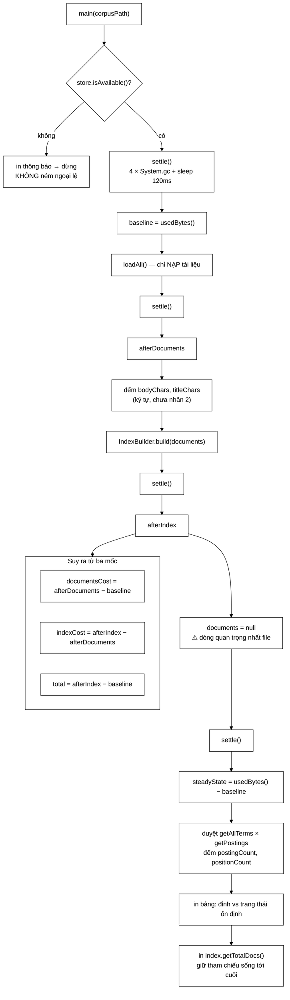

# MemoryBreakdown — 174 dòng biến một ước lượng sai gần sáu lần thành một con số đo được

**File nguồn:** `search-engine/src/main/java/com/vnsearch/eval/MemoryBreakdown.java` (174 dòng)
**Gói:** `com.vnsearch.eval` · **Loại:** `final class` tiện ích, constructor `private`, không trạng thái — toàn bộ là `static` và một `main`
**Vị trí trong sơ đồ:** công cụ **đo ngoại tuyến**, không nằm trên đường phục vụ truy vấn; nó là **dụng cụ đo** chứ không phải bộ phận của máy
**Đọc kèm:** [`TokenizerBenchmark.md`](./TokenizerBenchmark.md) · [`../index/Posting.md`](../index/Posting.md) · [`../index/InvertedIndex.md`](../index/InvertedIndex.md) · [`../storage/JsonDocumentStore.md`](../storage/JsonDocumentStore.md) · [`../service/IndexBuilder.md`](../service/IndexBuilder.md)

---

## 📌 Hiểu trong 30 giây

Lớp này tồn tại vì một câu đã được viết ra trong một bản rà soát kiến trúc:

> Bỏ `bodyText` khỏi chỉ mục sẽ giảm **60–70%** bộ nhớ.

Câu đó nghe rất hợp lý. Nó có lập luận đi kèm (chuỗi Java là UTF-16 nên corpus
367 MB trên đĩa nở gấp đôi trong RAM). Nó có nguyên nhân cụ thể được chỉ đích
danh (`InvertedIndex.documents` giữ nguyên `WebDocument` kèm cả thân bài). Và
nó **sai gần sáu lần**: `bodyText` thật ra chiếm **11,5%**, còn thủ phạm thật
là danh sách vị trí kiểu `List<Integer>` bên trong `Posting`.

Không có 174 dòng này, cả một tuần công sẽ được đổ vào việc nén `bodyText` để
thu về 11,5%, trong khi đổi một dòng khai báo `List<Integer>` → `int[]` thu về
45%.

```
   HAI CÁCH BẮT ĐẦU MỘT VIỆC TỐI ƯU BỘ NHỚ

   ┌──────────────────────────────────────────────────────────────────┐
   │  CÁCH THÔNG THƯỜNG — "nhìn mã rồi suy ra"                        │
   │                                                                  │
   │     đọc mã  →  thấy WebDocument giữ bodyText đầy đủ              │
   │             →  biết chuỗi Java là UTF-16                        │
   │             →  KẾT LUẬN: bodyText là thủ phạm, ~60-70%          │
   │             →  bắt tay vào nén văn bản                          │
   │                                                                  │
   │  Chuỗi suy luận này KHÔNG có bước nào sai về logic.              │
   │  Nó chỉ thiếu bước quan trọng nhất: SO SÁNH VỚI PHẦN CÒN LẠI.   │
   │  bodyText đúng là to. Nhưng chỉ mục đảo còn to hơn NHIỀU.       │
   └──────────────────────────────────────────────────────────────────┘

   ┌──────────────────────────────────────────────────────────────────┐
   │  CÁCH LỚP NÀY LÀM — "đo trước, tin sau"                          │
   │                                                                  │
   │     đo mốc 0        →  baseline                                  │
   │     nạp tài liệu    →  đo  ⇒  chi phí của WebDocument            │
   │     dựng chỉ mục    →  đo  ⇒  chi phí của InvertedIndex          │
   │     buông corpus    →  đo  ⇒  TRẠNG THÁI ỔN ĐỊNH                 │
   │     đếm posting/vị trí (KHÔNG ước lượng)                         │
   │                                                                  │
   │  Kết quả trên corpus 2.518 trang:                                │
   │     tài liệu   58,6 MB (19,7%)   trong đó bodyText 34,2 MB       │
   │     chỉ mục   237,8 MB (80,3%)   riêng vị trí     87,5 MB        │
   │                                  ↑ thủ phạm THẬT                 │
   └──────────────────────────────────────────────────────────────────┘
```



---

## Mục lục

- [1. Vì sao một công cụ đo lại đáng nằm trong repo](#1-vì-sao-một-công-cụ-đo-lại-đáng-nằm-trong-repo)
- [2. Vì sao đo bộ nhớ trong JVM là việc KHÓ](#2-vì-sao-đo-bộ-nhớ-trong-jvm-là-việc-khó)
- [3. Ba mốc đo, và vì sao mốc thứ tư mới là mốc thật](#3-ba-mốc-đo-và-vì-sao-mốc-thứ-tư-mới-là-mốc-thật)
- [4. Quy trách nhiệm bằng ĐẾM, không bằng đoán](#4-quy-trách-nhiệm-bằng-đếm-không-bằng-đoán)
- [5. Ý nghĩa đối chứng: 136,5 MB so với 15,9 MB của GIN](#5-ý-nghĩa-đối-chứng-1365-mb-so-với-159-mb-của-gin)
- [6. Hướng dẫn về code](#6-hướng-dẫn-về-code)
- [7. Độ phức tạp & chi phí](#7-độ-phức-tạp--chi-phí)
- [8. Kiểm thử liên quan](#8-kiểm-thử-liên-quan)
- [9. Liên kết](#9-liên-kết)

---

## 1. Vì sao một công cụ đo lại đáng nằm trong repo

### 1.1 Ước lượng chưa đo là cách nhanh nhất để tối ưu nhầm chỗ

Javadoc dòng 15–19 nói thẳng lý do tồn tại, và cách nói của nó đáng chú ý — nó
không nói "để biết hệ thống tốn bao nhiêu RAM", mà nói **để không đổ công vào
chỗ không đau**:

```java
/**
 * <p><b>Vi sao can cong cu nay.</b> Ban ra soat truoc uoc luong rang bo
 * {@code bodyText} khoi chi muc se giam 60-70% bo nho. Con so do la <b>ngoai
 * suy, chua do</b>. Ma quyet dinh toi uu dua tren con so chua do la cach nhanh
 * nhat de bo cong vao dung cho khong đau: neu phan lon bo nho nam o posting
 * list chu khong o van ban, thi go bodyText di van khong doi duoc gi nhieu.
 */
```

```
   ┌──────────────────────────────────────────────────────────────────┐
   │  ĐIỀU LÀM CHO SAI SỐ NÀY NGUY HIỂM                                │
   │                                                                  │
   │  Ước lượng 60-70% KHÔNG bịa — nó đúng về HƯỚNG: bodyText thật sự │
   │  được giữ nguyên văn, chuỗi Java thật sự là UTF-16, gỡ nó đi     │
   │  thật sự tiết kiệm được. Chỉ ĐỘ LỚN là sai, mà độ lớn mới quyết  │
   │  định nên làm việc gì TRƯỚC.                                     │
   │                                                                  │
   │  Ước lượng sai hướng thì bị bác bỏ ngay. Ước lượng đúng hướng    │
   │  mà sai độ lớn thì sống sót qua mọi vòng rà soát — vì ai đọc     │
   │  cũng gật đầu.                                                   │
   └──────────────────────────────────────────────────────────────────┘
```

Kết quả thật, in ra từ chính lớp này trên corpus 2.518 trang (35 MB JSON,
998 token/trang, 56.041 term phân biệt):

```
   1. Tài liệu (WebDocument)  :  58,6 MB   19,7%
      trong đó bodyText       :  34,2 MB   11,5%   ← "thủ phạm" bị nghi
      trong đó title          :   0,3 MB
   2. Chỉ mục đảo             : 237,8 MB   80,3%
      1.594.938 posting, 3.821.061 vị trí
      riêng phần vị trí       :  87,5 MB   29,5%   ← thủ phạm THẬT
      ─────────────────────────────────────────────
      ĐỈNH lúc dựng chỉ mục   : 296,4 MB
```

Ba thay đổi sau đó, mỗi thay đổi đo lại bằng đúng công cụ này:

| # | Thay đổi | Trạng thái ổn định | Mỗi trang |
|---|---|---:|---:|
| — | *(trước khi sửa)* | 296,4 MB | 120,6 KB |
| 1 | `Posting.positions` → `int[]` | 163,1 MB | 66,3 KB |
| 2 | Facade thôi giữ `lastCrawledDocuments` | *(điều kiện của #3)* | — |
| 3 | `bodyText` lưu nén, tách khỏi `WebDocument` | **136,5 MB** | **55,5 KB** |

Giảm **54%**. Và thứ tự làm việc bị **đảo ngược hoàn toàn** so với kế hoạch ban
đầu: việc được ước lượng là quan trọng nhất (nén `bodyText`) hoá ra đứng thứ ba,
sau một thay đổi chỉ sửa **một dòng khai báo**.

### 1.2 Một công cụ đo chỉ có giá trị khi nó được chạy lại

Bảng ba dòng ở trên tồn tại **được là nhờ** lớp này nằm trong `src/main/java`
chứ không phải một script dùng một lần: nó biên dịch cùng dự án nên mọi thay đổi
làm hỏng nó sẽ làm **hỏng build**, và chạy lại chỉ tốn một dòng lệnh. Ba con số
đó là ba lần chạy **cùng một công cụ**, không phải ba ước lượng bằng ba cách.

---

## 2. Vì sao đo bộ nhớ trong JVM là việc KHÓ

Đây là phần đáng đọc nhất của tài liệu này. Trong ngôn ngữ quản lý bộ nhớ thủ
công, "chương trình này dùng bao nhiêu RAM" là một câu hỏi có đáp án. Trên JVM,
nó **không có đáp án chính xác** — chỉ có các xấp xỉ với sai số khác nhau.

### 2.1 `Runtime.totalMemory() − freeMemory()` thật ra đo cái gì

```java
private static long usedBytes() {
    Runtime runtime = Runtime.getRuntime();
    return runtime.totalMemory() - runtime.freeMemory();
}
```

```
   BA MỨC "BỘ NHỚ", VÀ CHÚNG KHÔNG BẰNG NHAU

   ┌────────────────────────────────────────────────────────────────┐
   │  maxMemory()    = trần -Xmx. JVM sẽ KHÔNG vượt.                │
   │       ▼                                                        │
   │  totalMemory()  = heap JVM ĐÃ XIN được từ hệ điều hành.        │
   │                   Co giãn theo thời gian. GC có thể TRẢ LẠI.   │
   │       ▼                                                        │
   │  totalMemory − freeMemory                                      │
   │                 = phần heap đang bị CHIẾM.                     │
   │                   ⚠ gồm CẢ đối tượng còn sống                  │
   │                     LẪN rác chưa được dọn.                     │
   └────────────────────────────────────────────────────────────────┘

   Chú thích dòng 40 viết "Bo nho dang thuc su bi giu" — câu đó chỉ đúng
   NẾU rác đã dọn sạch, và đó là lý do mọi usedBytes() đều đi SAU settle().

   VÀ NÓ VẪN KHÔNG ĐO: Metaspace, ByteBuffer trực tiếp, mmap,
   ngăn xếp luồng, bộ đệm mã JIT, phần heap đã xin mà chưa dùng.
```

Vì sao chọn cách xấp xỉ này thay vì `Instrumentation` hay JOL?
`Instrumentation.getObjectSize` chỉ đo **nông** (một đối tượng, không tính đối
tượng nó trỏ tới), muốn đo sâu phải tự duyệt đồ thị tham chiếu và tự khử trùng —
tức viết lại một nửa của JOL. Còn dùng agent thì đòi thêm cờ `-javaagent`, một
thứ rất dễ quên và sẽ làm chương trình **im lặng báo sai** thay vì báo lỗi.

### 2.2 `System.gc()` chỉ là một lời đề nghị — vì sao phải gọi 4 lần

```java
private static void settle() {
    for (int i = 0; i < 4; i++) {
        System.gc();
        try {
            Thread.sleep(120);
        } catch (InterruptedException e) {
            Thread.currentThread().interrupt();
            return;
        }
    }
}
```

Đặc tả Java nói về `System.gc()` bằng đúng một chữ: *suggests*. Không có gì bảo
đảm nó chạy, và với `-XX:+DisableExplicitGC` thì nó thành lệnh rỗng.

```
   VÌ SAO MỘT LẦN GỌI LÀ KHÔNG ĐỦ — BỐN LÝ DO ĐỘC LẬP

   ① GC THEO THẾ HỆ dọn từng vùng
     Một lần "full GC" của G1 có thể chỉ dọn young generation.
     Đối tượng trung gian đã kịp thăng cấp lên old gen thì
     phải chờ chu kỳ sau.

   ② FINALIZER / CLEANER CẦN HAI CHU KỲ
     Chu kỳ 1 phát hiện không còn tham chiếu → xếp vào hàng đợi;
     chu kỳ 2 chạy xong dọn dẹp → mới THẬT SỰ giải phóng.
     Một lần gọi ⇒ đối tượng đó vẫn tính là "đang dùng".

   ③ GC CHẠY BẤT ĐỒNG BỘ
     System.gc() trả về không nghĩa là đã dọn xong; G1 và ZGC làm
     phần lớn việc ở luồng nền ⇒ đọc usedBytes() ngay sau đó là đọc
     giữa chừng. Đó là việc của Thread.sleep(120).

   ④ THAM CHIẾU MỀM/YẾU
     SoftReference chỉ bị thu khi JVM thấy "sắp thiếu bộ nhớ", nên
     có thể sống sót qua vài lần gọi.

   ⇒ Bốn vòng × 120 ms = 480 ms cho mỗi mốc đo. Đắt về thời gian, rẻ
     về mọi thứ khác — với công cụ ngoại tuyến, không cần nghĩ.
```

Chi tiết nhỏ nhưng đúng chuẩn: nhánh `catch (InterruptedException)` **khôi phục
cờ ngắt** rồi mới `return`. Nuốt `InterruptedException` mà không đặt lại cờ làm
mất tín hiệu dừng của luồng gọi. Ở đây hậu quả gần như bằng không, nhưng viết
đúng ở chỗ không quan trọng chính là cách để viết đúng ở chỗ quan trọng.

### 2.3 Chi phí ẩn: những byte không ai khai báo

Đây là phần giải thích **vì sao ước lượng bằng tay luôn thấp hơn thực tế**.
Người viết mã đếm dữ liệu; JVM còn tính thêm bốn khoản không ai viết ra.

```
   BỐN KHOẢN PHỤ THU CỦA MỖI ĐỐI TƯỢNG (HotSpot 64-bit, nén con trỏ)

   ┌───────────────────────────────────────────────────────────────────┐
   │ ① OBJECT HEADER — 16 byte cho MỌI đối tượng                       │
   │    mark word 8 (mã băm, cờ khoá, tuổi GC) + klass ptr 4 (đã nén)  │
   │    + căn lề 4. Mảng cộng thêm 4 byte nữa để chứa `length`.        │
   │                                                                   │
   │ ② PADDING — làm tròn LÊN bội số của 8 byte                        │
   │    Đối tượng "dùng" 17 byte thì chiếm 24. Trung bình mất ~4 byte  │
   │    mỗi đối tượng, KHÔNG BAO GIỜ hiện ra trong phép nhẩm nào.      │
   │                                                                   │
   │ ③ BOXING — `Integer` KHÔNG phải `int`                             │
   │    int     : 4 byte, nằm thẳng trong mảng                         │
   │    Integer : 16 byte + 4 byte ô tham chiếu trong Object[]         │
   │              ≈ 20..24 byte cho MỘT số 4 byte                      │
   │    Bộ đệm `Integer.valueOf` chỉ áp cho −128..127; vị trí token    │
   │    gần như luôn vượt ngưỡng đó.                                   │
   │                                                                   │
   │ ④ HASHMAP ENTRY — ~48 byte mỗi cặp khoá/giá trị                   │
   │    Node: header 16 + hash 4 + key 4 + value 4 + next 4 = 32 sau   │
   │    căn lề; cộng 4 byte một ô bảng Node[]; hệ số tải 0,75 ⇒ bảng   │
   │    luôn thừa ~33% ô trống. ≈ 40..48 byte MỖI MỤC, TRƯỚC khi tính  │
   │    đến khoá và giá trị.                                           │
   └───────────────────────────────────────────────────────────────────┘
```

Áp bốn khoản này vào chỉ mục thật thì con số 87,5 MB ở mục 1.1 lập tức hết bí ẩn:

```
   3.821.061 vị trí, 1.594.938 posting  (corpus 2.518 trang)

   BẢN CŨ — List<Integer>                BẢN MỚI — int[]
     Integer     3.821.061×16 = 61,1       int  3.821.061×4  = 14,6
     ô tham chiếu        ×4  = 15,3        hdr  1.594.938×20 = 30,4
     ArrayList   1.594.938×40 = 63,8       ───────────────────────────
     Object[] hdr        ×16 = 25,5                          45,0 MB
     ──────────────────────────────
                            165,7 MB

   Mỗi posting chứa trung bình 2,4 vị trí = 9,6 byte dữ liệu thật, nhưng
   bản cũ trả ~104 byte để chứa nó. Tỷ lệ phụ thu ~10:1.

   ⇒ Cùng một dữ liệu, khác ở CÁCH GÓI chứ không ở nội dung. Và không
     phép nhẩm nào ở trên hiện ra khi ĐỌC MÃ — chỉ phép ĐO mới hiện ra.
```

### 2.4 Vì sao sai số vẫn chấp nhận được — và câu hỏi thật cần trả lời

Javadoc dòng 21–26 xử lý điểm yếu này một cách trung thực, không giấu:

```java
/**
 * <p>Phep do nay <b>khong chinh xac tuyet doi</b> — {@code System.gc()} chi la
 * mot loi de nghi, va bo nho con chua ca rac chua don. Nhung sai so do la
 * ngau nhien va nho so voi khoang cach giua cac thanh phan, nen no du de tra
 * loi cau hoi that su can tra loi: <i>phan nao chiem nhieu nhat?</i>
 */
```

```
   ĐỘ CHÍNH XÁC CẦN CÓ PHỤ THUỘC VÀO CÂU HỎI ĐANG HỎI

   Câu hỏi SAI:  "Chỉ mục chiếm đúng bao nhiêu byte?"
                 → cần JOL, heap dump, khử trùng đồ thị tham chiếu

   Câu hỏi ĐÚNG: "Nên tối ưu bodyText hay posting list TRƯỚC?"
                 → 34,2 MB so với 237,8 MB — chênh gấp 7 lần
                 → sai số vài MB không thể đảo ngược kết luận này

   ┌───────────────────────────────────────────────────────────────┐
   │  QUY TẮC: sai số của phép đo chỉ cần NHỎ HƠN khoảng cách      │
   │  giữa các phương án đang so sánh. Ở đây khoảng cách là 7 lần, │
   │  sai số của System.gc() thường vài phần trăm — dư an toàn.    │
   │                                                              │
   │  ⚠ NHƯNG: khi khoảng cách thu hẹp — ví dụ so hai cách nén     │
   │  bodyText chênh nhau 5% — thì công cụ này KHÔNG còn đủ.       │
   │  Ranh giới đó không được ghi ở đâu trong mã.                 │
   │  Xem đề xuất 2.                                              │
   └───────────────────────────────────────────────────────────────┘
```

---

## 3. Ba mốc đo, và vì sao mốc thứ tư mới là mốc thật

### 3.1 Bố cục phép đo

```java
settle();
long baseline = usedBytes();

List<WebDocument> documents = store.loadAll();
settle();
long afterDocuments = usedBytes();
// ...
InvertedIndex index = new IndexBuilder(new VietnameseTokenizer()).build(documents);
settle();
long afterIndex = usedBytes();
```

```
   MỖI MỐC TRỪ MỐC TRƯỚC = CHI PHÍ CỦA ĐÚNG MỘT BƯỚC

   baseline ──────────► JVM, lớp đã nạp, Jackson, không có dữ liệu
       │ loadAll()
       ▼
   afterDocuments ────► + toàn bộ WebDocument
       │                documentsCost = afterDocuments − baseline
       │ build(documents)
       ▼
   afterIndex ────────► + chỉ mục đảo (corpus VẪN CÒN SỐNG)
                        indexCost = afterIndex − afterDocuments
                        total     = afterIndex − baseline
                        ↑ ĐÂY LÀ "ĐỈNH", không phải trạng thái thật

   Phép trừ hợp lệ vì settle() ở giữa mỗi cặp mốc dọn hết rác trung gian,
   nên chênh lệch chỉ còn là đối tượng CÒN SỐNG do bước vừa rồi tạo ra.
```

### 3.2 `documents = null` — dòng quan trọng nhất của cả file

```java
// --- Buoc 3: BUONG corpus goc ---
documents = null;
settle();
long steadyState = usedBytes() - baseline;
```

Biến `documents` **cố tình không** khai báo `final` — chú thích dòng 82 nói rõ
điều đó là có chủ đích. Ở đây một dòng gán `null` mang toàn bộ tính hợp lệ của
phép đo:

```
   ┌──────────────────────────────────────────────────────────────────┐
   │  NẾU BỎ DÒNG `documents = null`                                  │
   │                                                                  │
   │  Số báo cáo = 296,4 MB (corpus + chỉ mục cùng sống)              │
   │  Số thật    = 136,5 MB (chỉ chỉ mục)  ⇒ chênh 2,2 lần            │
   │                                                                  │
   │  296,4 MB mô tả một trạng thái CHỈ TỒN TẠI VÀI GIÂY. Ứng dụng    │
   │  thật KHÔNG giữ danh sách tài liệu gốc: SearchEngineFacade dựng  │
   │  chỉ mục xong là buông, còn reindex() thì đọc lại từ đĩa.        │
   │                                                                  │
   │  ⇒ Đo ở mốc afterIndex là đo một hệ thống KHÔNG TỒN TẠI.         │
   └──────────────────────────────────────────────────────────────────┘
```

Điểm đáng học ở đây vượt xa chuyện bộ nhớ: **phép đo phải khớp với trạng thái
mà hệ thống thật sự sống trong đó**. Một benchmark đo trạng thái tạm thời sẽ cho
số chính xác về một thứ không ai quan tâm.

Cũng vì thế, mục 3.6 của `docs/DSA-REPORT.md` ghi nhận rằng bước tối ưu số 2
(bỏ trường `lastCrawledDocuments` trong `SearchEngineFacade`) **suýt bị bỏ sót**,
và nếu sót thì bước 3 vô nghĩa: nén văn bản trong chỉ mục mà bản nguyên văn vẫn
sống ở một trường khác thì không tiết kiệm được một byte nào. Đúng cạm bẫy mà
`documents = null` mô phỏng lại trong phép đo.

### 3.3 Đỉnh và trạng thái ổn định — hai con số phải in riêng

```java
System.out.printf("   DINH luc dung chi muc  : %s%n", mb(total));
// ...
System.out.println("=== TRANG THAI ON DINH (thu ung dung THAT SU giu) ===");
System.out.printf("Chi muc, sau khi buong corpus goc : %s%n", mb(steadyState));
System.out.printf("Bo nho moi trang                  : %,.1f KB%n",
        steadyState / 1024.0 / docCount);
```

```
   HAI CON SỐ, HAI CÂU HỎI KHÁC HẲN NHAU

   ĐỈNH (171,1 MB ở bản đã tối ưu)
        → "-Xmx phải đặt bao nhiêu để không OOM lúc khởi động?"
        → tồn tại vài giây; KHÔNG dùng để so sánh giữa các phiên bản
          (phụ thuộc cả thứ tự nạp lẫn thời điểm GC)

   TRẠNG THÁI ỔN ĐỊNH (136,5 MB)
        → "máy chủ này cần bao nhiêu RAM để chạy?"
        → tồn tại suốt vòng đời ứng dụng
        → ĐÂY mới là con số so sánh giữa các phiên bản

   Ba dòng cuối chương trình nói đúng điều đó ngay trong đầu ra, để
   người đọc kết quả không phải đọc mã mới hiểu mình đang nhìn gì.
```

Con số dẫn xuất `steadyState / 1024.0 / docCount` (55,5 KB mỗi trang) là con số
duy nhất **ngoại suy được**: nhân với 1 triệu trang ra ~53 GB, và đó chính là
cách `docs/DSA-REPORT.md` mục 3.6 kết luận rằng kiến trúc giữ toàn bộ chỉ mục
trong RAM có một trần thật, không phải chuyện tinh chỉnh.

### 3.4 Dòng cuối cùng, và vì sao nó không thừa

```java
// Giu tham chieu toi luc nay de bo toi uu hoa cua JIT khong thu gom som.
System.out.printf("%n(kiem tra: chi muc con %d tai lieu)%n", index.getTotalDocs());
```

```
   PHÂN TÍCH SỐNG SÓT (liveness analysis) CỦA JIT

   JIT biết chính xác lần dùng CUỐI CÙNG của mỗi biến cục bộ. Sau điểm
   đó, ô ngăn xếp được coi là chết và GC ĐƯỢC PHÉP thu hồi đối tượng —
   dù biến vẫn còn trong phạm vi từ vựng.

   NẾU dòng cuối không tồn tại: lần dùng cuối của `index` là ở vòng lặp
   đếm posting → settle() cuối CÓ THỂ dọn luôn cả chỉ mục → steadyState
   đo ra ~0 MB → và không có gì sập, không có cảnh báo nào.

   Cùng họ với "dead code elimination" ở [TokenizerBenchmark] mục 2.4:
   trình tối ưu được phép xoá mọi thứ không quan sát được, và một phép
   ĐO chính là thứ nó không coi là quan sát.

   ⚠ Một lời gọi System.out.printf là rào cản đủ mạnh TRONG THỰC TẾ
     (I/O có tác dụng phụ, không nội tuyến được), nhưng KHÔNG phải bảo
     đảm của đặc tả — thứ duy nhất cho bảo đảm đó là
     `Reference.reachabilityFence` (Java 9+). Xem đề xuất 4.
```

---

## 4. Quy trách nhiệm bằng ĐẾM, không bằng đoán

### 4.1 `bodyChars * 2` — vì sao nhân 2 chứ không nhân 1

```java
int docCount = documents.size();
long bodyChars = 0;
long titleChars = 0;
for (WebDocument doc : documents) {
    if (doc.getBodyText() != null) {
        bodyChars += doc.getBodyText().length();
    }
    if (doc.getTitle() != null) {
        titleChars += doc.getTitle().length();
    }
}
// ...
long bodyTextBytes = bodyChars * 2L; // UTF-16
```

Chú thích dòng 87–89 giải thích một chi tiết mà rất nhiều người tưởng ngược lại:

```
   COMPACT STRINGS (JEP 254, Java 9+) — VÌ SAO KHÔNG CỨU ĐƯỢC TIẾNG VIỆT

   Từ Java 9, String lưu byte[] kèm cờ `coder`: LATIN1 = 1 byte/ký tự,
   UTF16 = 2 byte/ký tự. LATIN1 chỉ được dùng khi MỌI ký tự của chuỗi
   nằm trong U+0000..U+00FF.

   ┌────────────────────────────────────────────────────────────┐
   │  "Hello world"  → toàn Latin-1        → 1 byte/ký tự   ✓   │
   │  "Hà Nội"       → 'à' = U+00E0 ✓ , 'ộ' = U+1ED9 ✗          │
   │                 → MỘT ký tự đủ ép CẢ chuỗi sang UTF-16     │
   └────────────────────────────────────────────────────────────┘

   Tiếng Việt có 134 ký tự có dấu, phần lớn ở khối Latin Extended
   Additional (U+1EA0–U+1EF9) — NGOÀI Latin-1. Một bài báo vài nghìn
   ký tự chắc chắn chứa ít nhất một ký tự như vậy.

   ⇒ Compact Strings gần như KHÔNG có tác dụng với corpus này.
     Nhân 2 là đúng, không phải ước lượng bi quan.
```

Đây cũng là lý do vì sao lập luận "corpus 367 MB trên đĩa nở gấp đôi trong RAM"
ở bản rà soát ban đầu là **đúng** — chỉ có kết luận rút ra từ nó là sai, vì nó
so `bodyText` với chính nó chứ không so với chỉ mục.

Cần nói rõ giới hạn: `bodyChars * 2` là **cận dưới**, không phải con số đầy đủ.
Nó bỏ qua 16 byte header của mỗi `String`, 16 byte header của `byte[]` bên trong,
và ô tham chiếu. Với 2.518 tài liệu thì phần bỏ sót cỡ 100 KB — không đáng kể so
với 34,2 MB. Với một corpus gồm hàng triệu chuỗi ngắn thì tỷ lệ sẽ đảo ngược.

### 4.2 Duyệt toàn bộ chỉ mục để ĐẾM

```java
long postingCount = 0;
long positionCount = 0;
for (String term : index.getAllTerms()) {
    for (com.vnsearch.index.Posting posting : index.getPostings(term)) {
        postingCount++;
        positionCount += posting.positionCount();
    }
}
long boxedCost = positionCount * 24L;   // Integer + o tham chieu
long rawIntCost = positionCount * 4L;   // neu dung int[]
```

```
   ĐÂY LÀ BƯỚC BIẾN "ĐO" THÀNH "GIẢI THÍCH"

   Phép trừ ba mốc chỉ nói CHỈ MỤC tốn 237,8 MB. Nhưng chỉ mục gồm:
        · HashMap<String, List<Posting>>  ← ~48 byte/mục × 56.041 term
        · khoá term (đã Flyweight hoá qua TermDictionary)
        · 1.594.938 đối tượng Posting  ·  3.821.061 vị trí

   Phép trừ KHÔNG tách được các khoản này; phép ĐẾM thì tách được,
   vì mỗi khoản có công thức riêng nhân với một số đếm CHÍNH XÁC.

   ┌──────────────────────────────────────────────────────────────┐
   │  boxedCost = positionCount × 24                              │
   │    24 = 16 (Integer, đã căn lề) + 4..8 (ô tham chiếu Object[])│
   │                                                              │
   │  KHÔNG gồm 40 byte ArrayList và 16 byte header Object[] —    │
   │  hai khoản tính theo SỐ POSTING chứ không theo số vị trí.    │
   │                                                              │
   │  ⇒ boxedCost là CẬN DƯỚI: thật ~165,7 MB so với 87,5 MB in   │
   │    ra. Kết luận không đổi (vẫn là khoản lớn nhất), nhưng con │
   │    số khiêm tốn hơn thực tế. Xem đề xuất 3.                  │
   └──────────────────────────────────────────────────────────────┘
```

Điều tinh tế: vòng lặp này **cũng là thứ giữ cho chỉ mục sống** qua `settle()`
cuối. Nó vừa đếm vừa vô tình đóng vai trò của một rào cản tối ưu — nhưng vì
`steadyState` được đo **trước** vòng lặp này, vai trò đó không đủ, và dòng
`printf` cuối cùng ở mục 3.4 mới là thứ thật sự cần thiết.

### 4.3 Đưa ra ngay phương án thay thế, kèm số tiết kiệm

```java
System.out.printf("   vi tri dang Integer    : %s   %5.1f%%  <- thu phan lon%n",
        mb(boxedCost), 100.0 * boxedCost / total);
System.out.printf("   neu doi sang int[]     : %s   (tiet kiem %s)%n",
        mb(rawIntCost), mb(boxedCost - rawIntCost));
```

```
   Một công cụ chỉ in "CÁI GÌ TO NHẤT" thì người đọc vẫn phải tự nghĩ
   ra việc phải làm. Công cụ này in luôn "NẾU ĐỔI THÌ ĐƯỢC BAO NHIÊU":

        vị trí dạng Integer  :  87,5 MB   29,5%
        nếu đổi sang int[]   :  14,6 MB   (tiết kiệm 72,9 MB)

   ⇒ Dòng thứ hai biến một quan sát thành ĐỀ XUẤT CÓ ĐỊNH LƯỢNG, và là
     lý do trực tiếp khiến khai báo trong Posting được đổi:
          List<Integer> positions   →   int[] positions
     Một dòng khai báo. 45% bộ nhớ. Quyết định bởi hai dòng printf.
```

---

## 5. Ý nghĩa đối chứng: 136,5 MB so với 15,9 MB của GIN

Đây là chỗ con số của lớp này rời khỏi phạm vi "tối ưu nội bộ" và trở thành
**bằng chứng trong một cuộc so sánh với hệ thống công nghiệp**.

```
   BA CON SỐ ĐO ĐƯỢC, ĐẶT CẠNH NHAU

   ┌──────────────────────────────────────────────────────────────────┐
   │  Chỉ mục đảo tự cài, trạng thái ổn định   : 136,5 MB  (RAM)      │
   │  Bảng `documents` của PostgreSQL, kèm chỉ mục :  79,6 MB  (đĩa)  │
   │  Chỉ mục GIN của PostgreSQL                :  15,9 MB  (đĩa)     │
   └──────────────────────────────────────────────────────────────────┘

   Chênh gần 9 lần so với GIN — một kết quả TRUNG THỰC, không phải
   thất bại cần giấu, miễn là nói rõ ba khác biệt:

   ① GIN KHÔNG LƯU ĐỦ VỊ TRÍ TOKEN
        `tsvector` nén vị trí rất chặt và CẮT ở 16.383 vị trí mỗi tài
        liệu. Chỉ mục ở đây lưu ĐỦ mọi vị trí, không cắt, để phục vụ
        tìm cụm từ chính xác. 3,8 triệu vị trí là cái giá của khả năng đó.

   ② GIN NẰM TRÊN ĐĨA, CHỈ MỤC NÀY NẰM TRONG RAM
        So 136,5 MB RAM với 15,9 MB đĩa là so hai loại tài nguyên có
        đơn giá chênh vài chục lần. Đổi lại, chỉ mục trong RAM không
        phải trả một lần đọc đĩa nào khi truy vấn.

   ③ GIN ĐÃ ĐƯỢC NÉN NHIỀU TẦNG
        varbyte cho docId, delta encoding, posting list nén.
        `CompressedPostings` và `VByteCodec` đi cùng hướng đó — nhưng
        chưa được bật cho chỉ mục đang phục vụ.

   ⇒ Không có con số 136,5 MB thì câu "chỉ mục tự cài tốn nhiều bộ nhớ
     hơn GIN" chỉ là cảm giác. Có nó thì đó là một phát biểu kiểm chứng
     được, kèm ba lý do định lượng được.
```

Về mặt luận văn, đây là điều làm cho chương kết quả khác một chương quảng cáo:
hệ thống tự cài **thắng ở một số chỗ và thua ở một số chỗ khác**, và cả hai loại
kết quả đều được đo bằng cùng một công cụ. Xem `docs/GIN-BASELINE.md` cho phía
tốc độ và chất lượng của cùng cuộc đối chứng này.

---

## 6. Hướng dẫn về code

### 6.1 Chạy công cụ

```bash
# Corpus nhỏ (mặc định) — chạy nhanh, dùng để kiểm tra công cụ còn hoạt động
./mvnw.cmd -q compile exec:java \
  -Dexec.mainClass=com.vnsearch.eval.MemoryBreakdown

# Corpus thật — BẮT BUỘC nâng -Xmx, nếu không sẽ OOM ở bước dựng chỉ mục
MAVEN_OPTS=-Xmx4g ./mvnw -q compile exec:java \
  -Dexec.mainClass=com.vnsearch.eval.MemoryBreakdown \
  -Dexec.args="data/crawled-documents.json"
```

```
   BA CỜ JVM NÊN THÊM KHI MUỐN SỐ ỔN ĐỊNH HƠN

   -Xms4g -Xmx4g     heap CỐ ĐỊNH. Heap co giãn ⇒ totalMemory() đổi
                     giữa các mốc, phép trừ mất phần nào ý nghĩa.

   -XX:+UseSerialGC  GC đơn luồng, dừng-thế-giới hoàn toàn.
                     System.gc() với SerialGC là ĐỒNG BỘ và dọn toàn
                     bộ heap ⇒ sai số nhỏ hơn hẳn so với G1 mặc định.

   -XX:-UseCompressedOops   ⚠ ĐỪNG bật. Tắt nén con trỏ làm mọi ô tham
                     chiếu thành 8 byte, con số 24 trong boxedCost sai.
```

### 6.2 Đọc bảng kết quả theo đúng thứ tự

```
   ĐỌC TỪ DƯỚI LÊN, KHÔNG PHẢI TỪ TRÊN XUỐNG

   ① "Bo nho moi trang"       → ngoại suy được lên quy mô mục tiêu
   ② "TRANG THAI ON DINH"     → số để so sánh giữa các phiên bản
   ③ "vi tri dang Integer"    → khoản lớn nhất, và đã có phương án
   ④ "DINH luc dung chi muc"  → chỉ dùng để chọn -Xmx
   ⑤ "trong do bodyText"      → thường KHÔNG phải chỗ cần sửa trước

   Người đọc lần đầu hầu như luôn đọc ngược thứ tự này, vì bảng in
   theo trình tự thời gian của phép đo chứ không theo tầm quan trọng.
   Đó là một khiếm khuyết trình bày thật — xem đề xuất 5.
```

### 6.3 Thêm một thành phần mới vào phép đo

Mẫu để dán, giữ đúng bất biến "settle trước mỗi mốc":

```java
// --- Buoc 4: do rieng bo nho cua PageRank ---
long beforePageRank = usedBytes();
Map<Integer, Double> pageRank = new PageRankCalculator().compute(index);
settle();
long pageRankCost = usedBytes() - beforePageRank;

System.out.printf("3. PageRank (Map<Integer,Double>) : %s   %5.1f%%%n",
        mb(pageRankCost), 100.0 * pageRankCost / total);

// Đếm để giải thích, không chỉ đo:
//   mỗi mục HashMap ~48 byte + Integer 16 + Double 16 ≈ 80 byte/mục
System.out.printf("   uoc tinh theo cong thuc        : %s (%,d muc x 80 B)%n",
        mb(pageRank.size() * 80L), pageRank.size());

// BẮT BUỘC: giữ tham chiếu sống qua settle() cuối cùng.
System.out.printf("(kiem tra: pageRank co %d muc)%n", pageRank.size());
```

### 6.4 Cạm bẫy khi sửa lớp này

| Ý định | Hậu quả |
|---|---|
| Bỏ `documents = null` cho "gọn" | Báo cáo 296,4 MB thay vì 136,5 MB — đo một trạng thái chỉ sống vài giây |
| Khai báo `documents` là `final` | Không biên dịch được; và nếu lách bằng biến khác thì mất luôn phép đo trạng thái ổn định |
| Gọi `System.gc()` **một** lần thay vì bốn | Rác chưa dọn hết bị tính là "đang dùng"; sai số nhảy lên hàng chục MB |
| Bỏ `Thread.sleep(120)` | G1/ZGC dọn ở luồng nền chưa xong; đọc `usedBytes()` giữa chừng |
| Xoá dòng `printf` cuối | JIT được phép coi `index` là chết → `steadyState` có thể ra ~0 MB, **không có cảnh báo** |
| Đo bằng `afterIndex` để so sánh phiên bản | So hai đỉnh — phụ thuộc thứ tự nạp và thời điểm GC, không tái lập được |
| Nhân `bodyChars * 1` vì tin Compact Strings | Sai một nửa: tiếng Việt có ký tự ngoài Latin-1 nên chuỗi luôn ở UTF-16 |
| Dùng công cụ này để so hai phương án chênh nhau < 5% | Sai số của `System.gc()` cùng bậc với hiệu số — kết luận không tin được |
| Chạy trên corpus nhỏ rồi ngoại suy tuyến tính | Số term phân biệt tăng theo luật Heaps (dưới tuyến tính), chi phí `HashMap` không tăng tuyến tính |
| Chạy đồng thời với ứng dụng khác trên cùng JVM | Mọi phép trừ hỏng — phép đo giả định JVM này chỉ làm đúng một việc |

---

## 7. Độ phức tạp & chi phí

| Thao tác | Độ phức tạp | Ghi chú trên corpus 31.030 tài liệu |
|---|---|---|
| `store.loadAll()` | O(kích thước tệp) | ~402 MB JSON, phần lớn thời gian ở Jackson |
| `settle()` | O(kích thước heap) × 4 | 4 × 120 ms ngủ + 4 lần GC; **~2–6 giây** mỗi mốc trên heap 4 GB |
| Vòng đếm `bodyChars` | O(số tài liệu) | 31.030 lần gọi `length()` — O(1) mỗi lần |
| `IndexBuilder.build` | O(tổng số token) | ~31 triệu token; phần lớn thời gian ở tách từ |
| Duyệt đếm posting | O(số term + số posting) | 138.507 term, ~19,6 triệu posting |
| `usedBytes()` | O(1) | hai lời gọi native |
| Bộ nhớ của **chính công cụ** | O(1) | vài biến `long` — không làm nhiễu phép đo nó thực hiện |

```
   ┌──────────────────────────────────────────────────────────────────┐
   │  CHI PHÍ THỜI GIAN THẬT SỰ NẰM Ở ĐÂU                             │
   │                                                                  │
   │  Bốn lần settle() × 4 × 120 ms  =  1,92 giây chỉ để NGỦ.         │
   │  Trên heap 4 GB với G1, mỗi full GC mất ~0,5–1,5 giây            │
   │       ⇒ bốn mốc × bốn vòng ≈ 8–24 giây chỉ để dọn rác.           │
   │  Cộng nạp JSON (~40 s) và dựng chỉ mục (~58 s):                  │
   │       một lần chạy trên corpus 31.030 trang ≈ 2 phút.            │
   │                                                                  │
   │  ⇒ Chi phí này ĐÚNG CHỖ. Rút ngắn settle() là đánh đổi thứ       │
   │    duy nhất công cụ có (độ tin cậy) lấy thứ nó không cần.        │
   └──────────────────────────────────────────────────────────────────┘
```

Bảng ngoại suy từ 55,5 KB mỗi trang (đo trên 2.518 trang, bản đã tối ưu):

| Quy mô corpus | Trạng thái ổn định ước tính | `-Xmx` tối thiểu cần đặt |
|---:|---:|---:|
| 2.518 trang | 136,5 MB *(đo thật)* | 512 MB |
| 31.030 trang | ~1,7 GB | 4 GB |
| 100.000 trang | ~5,4 GB | 12 GB |
| 1.000.000 trang | ~53 GB | — *(vượt trần kiến trúc)* |

Cột cuối tính theo tỷ lệ đỉnh/ổn định ≈ 1,25 quan sát được, cộng thêm biên an
toàn cho phần nạp JSON trung gian. Hàng cuối chính là câu trả lời cho câu hỏi
"kiến trúc giữ toàn bộ chỉ mục trong RAM đi được tới đâu": tới khoảng vài trăm
nghìn trang, sau đó bắt buộc phải chuyển sang chỉ mục trên đĩa có phân đoạn.

---

## 8. Kiểm thử liên quan

Hiện tại **không có bộ test nào** cho lớp này — nó là `main`, không trả về gì,
và mọi kết quả đều đi ra `System.out`. Đó vừa là lý do dễ hiểu, vừa là điểm yếu:
các bất biến ở mục 3.2 và 3.4 hoàn toàn không được khoá lại.

| Bộ test | Kiểm gì | Liên quan thế nào |
|---|---|---|
| [`../index/InvertedIndexTest`](../../../../../test/java/com/vnsearch/index/InvertedIndexTest.md) | `getAllTerms`, `getPostings`, bất biến docId tăng dần | Nguồn số liệu mà công cụ này đếm |
| [`../index/CompressedTextTest`](../../../../../test/java/com/vnsearch/index/CompressedTextTest.md) | Nén/giải nén `bodyText` không mất dữ liệu | Bước tối ưu #3 ở mục 1.1 |
| [`../index/CompressedPostingsTest`](../../../../../test/java/com/vnsearch/index/CompressedPostingsTest.md) | Vòng nén/giải nén posting | Hướng tối ưu tiếp theo |
| `MemoryBreakdownTest` | **chưa tồn tại** | Xem ba bài đề xuất bên dưới |

```
   ĐẦU VÀO                                          KẾT QUẢ MONG ĐỢI
   ──────────────────────────────────────────────   ───────────────────────────
   corpusPath trỏ tới tệp không tồn tại             in "Khong tim thay corpus"
                                                    và THOÁT — không ném
   args rỗng                                        dùng data/seed-documents.json
   corpus 0 tài liệu                                ⚠ chia cho 0 ở dòng 165
                                                    → in "Infinity" hoặc "NaN"
   corpus 3 tài liệu, mỗi tài liệu 1 term           postingCount == 3
   một tài liệu có bodyText == null                 không NPE, bodyChars bỏ qua
   một tài liệu có title == null                    không NPE, titleChars bỏ qua
   settle() bị luồng khác ngắt                      khôi phục cờ ngắt, return sớm
   mb(0)                                            "       0,0 MB"
   mb(1_048_576)                                    "       1,0 MB"
   steadyState sau khi documents = null             < total (đỉnh) — LUÔN LUÔN
   chạy hai lần liên tiếp cùng corpus               chênh lệch < 5%
```

Ba bài test đáng viết, mỗi bài khoá một bất biến khác nhau:

```java
// 1. BẤT BIẾN TRUNG TÂM: trạng thái ổn định PHẢI nhỏ hơn đỉnh.
//    Nếu ai đó xoá dòng `documents = null`, hai con số sẽ bằng nhau
//    và bài test này biến một sai lệch IM LẶNG thành một lỗi ồn ào.
@Test
void trangThaiOnDinhPhaiNhoHonDinhLucDungChiMuc() {
    var ketQua = MemoryBreakdown.measure(corpusNhoBaTramTaiLieu());

    assertTrue(ketQua.steadyState() < ketQua.peak(),
            "buông corpus gốc phải giải phóng bộ nhớ; nếu hai số bằng nhau "
            + "thì dòng `documents = null` đã bị xoá và mọi con số báo cáo "
            + "đang mô tả một trạng thái chỉ tồn tại vài giây");
    assertTrue(ketQua.steadyState() > 0,
            "trạng thái ổn định bằng 0 nghĩa là chỉ mục đã bị GC thu hồi "
            + "trước khi đo — thiếu rào cản giữ tham chiếu sống");
}

// 2. PHÉP ĐẾM phải khớp với dữ liệu đưa vào, không phụ thuộc GC.
//    Đây là phần DUY NHẤT của công cụ có đáp án chính xác tuyệt đối,
//    nên nó phải được kiểm bằng số học chứ không bằng ngưỡng.
@Test
void demViTriVaPostingPhaiChinhXacTuyetDoi() {
    // ba tài liệu, mỗi tài liệu đúng một term xuất hiện đúng hai lần
    var chiMuc = dungChiMucVoi(taiLieu("mèo mèo"), taiLieu("chó chó"), taiLieu("cá cá"));

    var dem = MemoryBreakdown.countPostings(chiMuc);

    assertEquals(3, dem.postingCount(),
            "ba tài liệu, ba term phân biệt ⇒ đúng ba cặp (term, doc)");
    assertEquals(6, dem.positionCount(),
            "mỗi term xuất hiện hai lần ⇒ sáu vị trí; con số này nhân với 24 "
            + "để suy ra chi phí boxing nên sai một đơn vị là sai cả kết luận");
}

// 3. CA BIÊN: corpus rỗng KHÔNG được làm chương trình chia cho 0.
//    Dòng 165 chia cho docCount mà không kiểm tra.
@Test
void corpusRongKhongDuocChiaChoKhong() {
    var ketQua = MemoryBreakdown.measure(corpusRong());

    assertEquals(0, ketQua.docCount(),
            "corpus rỗng phải được nhận ra là rỗng");
    assertFalse(Double.isNaN(ketQua.bytesPerPage())
                    || Double.isInfinite(ketQua.bytesPerPage()),
            "bộ nhớ mỗi trang phải là 0 chứ không phải NaN/Infinity — "
            + "một báo cáo in ra 'Infinity KB' là báo cáo không dùng được");
}
```

Cả ba bài đều đòi một thay đổi cấu trúc: tách phần đo ra thành một phương thức
trả về `record`, và để `main` chỉ còn nhiệm vụ in. Đó chính là đề xuất 1.

---

## 9. Liên kết

- Công cụ đo song hành, cho phần tốc độ: [`TokenizerBenchmark.md`](./TokenizerBenchmark.md)
- Cấu trúc mà phép đo này khiến phải đổi: [`../index/Posting.md`](../index/Posting.md)
- Đối tượng được đo: [`../index/InvertedIndex.md`](../index/InvertedIndex.md) · [`../index/TermDictionary.md`](../index/TermDictionary.md)
- Bước dựng chỉ mục trong phép đo: [`../service/IndexBuilder.md`](../service/IndexBuilder.md)
- Nguồn corpus: [`../storage/JsonDocumentStore.md`](../storage/JsonDocumentStore.md) · [`../storage/DocumentStore.md`](../storage/DocumentStore.md)
- Hướng tối ưu tiếp theo: [`../index/CompressedPostings.md`](../index/CompressedPostings.md) · [`../index/CompressedText.md`](../index/CompressedText.md) · [`../index/VByteCodec.md`](../index/VByteCodec.md)
- Nơi bộ nhớ được giải phóng ở tầng ứng dụng: [`../service/SearchEngineFacade.md`](../service/SearchEngineFacade.md)
- Đối chứng với PostgreSQL: [`../storage/PostgresDocumentStore.md`](../storage/PostgresDocumentStore.md) · `docs/GIN-BASELINE.md`
- Câu chuyện đầy đủ của phép chẩn đoán sai gần sáu lần: `docs/DSA-REPORT.md` mục 3.6 và 4.2b
- Tổng quan kiến trúc: `docs/ARCHITECTURE.md`
