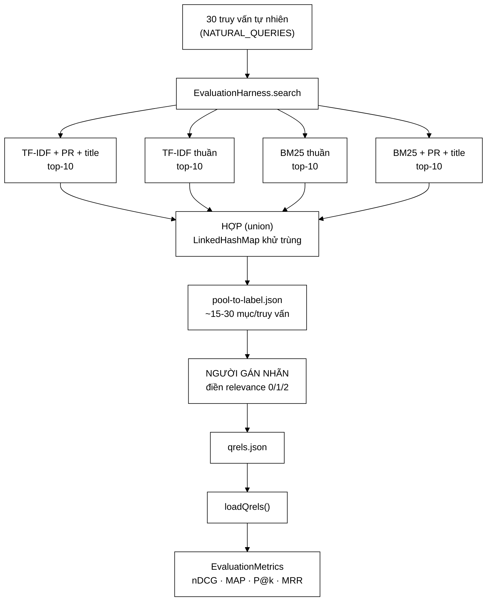

# PoolBuilder — cách gán nhãn 300 tài liệu thay vì 150.000, và cái giá phải trả

**File nguồn:** `search-engine/src/main/java/com/vnsearch/eval/PoolBuilder.java` (174 dòng)
**Gói:** `com.vnsearch.eval` · **Loại:** `class` có trạng thái (giữ `InvertedIndex` + `EvaluationHarness`), kèm 2 lớp lồng thuần dữ liệu và 3 hàm tĩnh
**Vị trí trong sơ đồ:** khối **Evaluation** — nhánh *nhãn do người gán*, nằm song song với nhánh *known-item tự sinh*
**Đọc kèm:** [`QrelsEvaluationRunner.md`](./QrelsEvaluationRunner.md) · [`EvaluationMetrics.md`](./EvaluationMetrics.md) · [`EvaluationHarness.md`](./EvaluationHarness.md) · [`KnownItemQueryGenerator.md`](./KnownItemQueryGenerator.md)

---

## 📌 Hiểu trong 30 giây

Muốn tính nDCG hay MAP thì phải có **nhãn liên quan nhiều bậc** — tức là với mỗi
truy vấn, mỗi tài liệu trong corpus phải được một con người chấm "không liên
quan / liên quan / rất liên quan". Corpus của dự án có **31.030 trang**; bộ đánh
giá dùng 30 truy vấn tự nhiên. Nhân lên: **hơn 930.000 lượt chấm**. Với tốc độ
rất lạc quan là 10 giây một lượt, đó là **2.583 giờ** — hơn một năm làm việc toàn
thời gian, cho một bảng số liệu trong đồ án.

Bài toán này không mới. TREC (Text REtrieval Conference, NIST, từ 1992) gặp nó
ngay ở kỳ đầu tiên và trả lời bằng **pooling**: đừng chấm cả corpus, chỉ chấm
phần *hợp* của top-k kết quả do nhiều hệ thống khác nhau trả về. Mọi tài liệu
ngoài pool mặc định coi là **không liên quan**. `PoolBuilder` là bản cài đặt
đúng phương pháp đó, thu gọn cho quy mô một đồ án.

Đây là lớp **học thuật nhất** trong gói `eval`, và cũng là lớp có **thiên lệch
nguy hiểm nhất** — mục 4 và mục 5 phân tích kỹ, vì thiên lệch pooling là thứ
người phản biện sẽ hỏi đầu tiên.



```
   VÌ SAO POOLING HỢP LỆ — GIẢ ĐỊNH NỀN TẢNG

   ┌──────────────────────────────────────────────────────────────────┐
   │  "Một tài liệu THỰC SỰ liên quan gần như chắc chắn sẽ được       │
   │   ÍT NHẤT MỘT trong các hệ thống đưa lên top-k."                 │
   │                                                                  │
   │  Nếu giả định đúng ⇒ tài liệu ngoài pool ≈ không liên quan       │
   │                    ⇒ coi chúng là 0 không làm sai thứ hạng       │
   │                                                                  │
   │  Nếu giả định SAI  ⇒ có tài liệu liên quan bị bỏ sót lặng lẽ     │
   │                    ⇒ recall tính ra CAO GIẢ TẠO cho mọi hệ       │
   │                    ⇒ và hệ thống MỚI (không góp vào pool) bị     │
   │                      phạt oan — mục 4                            │
   └──────────────────────────────────────────────────────────────────┘

   TREC làm giả định này đúng bằng cách: 50-100 hệ thống ĐỘC LẬP,
   từ hàng chục nhóm nghiên cứu khác nhau, pool depth 100.

   Dự án này:  4 cấu hình, cùng một chỉ mục, pool depth 10.
               ⇒ giả định YẾU HƠN HẲN. Mục 4 đo mức độ yếu.
```

---

## 1. Vì sao không thể chấm nhãn toàn corpus — con số cụ thể

Javadoc dòng 23–25 nói "hơn 150.000 lượt đánh giá" cho 30 truy vấn trên 5.011
tài liệu. Con số đó ứng với corpus nhỏ dùng khi viết lớp. Với corpus thật hiện
tại thì tình hình còn tệ hơn nhiều:

```
   KHỐI LƯỢNG GÁN NHÃN THEO KIỂU VÉT CẠN

   corpus  5.011 trang × 30 truy vấn =    150.330 lượt   ≈   417 giờ
   corpus 31.030 trang × 30 truy vấn =    930.900 lượt   ≈ 2.586 giờ

   (giả định 10 giây/lượt — thực tế 20-30 giây nếu đọc kỹ bài báo)

   2.586 giờ = 323 ngày công 8 tiếng = 1,3 năm-người.

   ┌────────────────────────────────────────────────────────────┐
   │  VÀ ĐÓ MỚI LÀ MỘT LẦN.                                     │
   │  Crawl lại corpus  →  làm lại từ đầu.                      │
   │  Thêm 5 truy vấn   →  thêm 155.150 lượt.                   │
   │  Muốn 2 người gán để đo độ đồng thuận  →  nhân đôi.        │
   └────────────────────────────────────────────────────────────┘
```

So sánh với pooling ở cấu hình hiện tại:

| Cách làm | Số lượt chấm | Thời gian ước tính | Khả thi? |
|---|---|---|---|
| Vét cạn corpus 31.030 | 930.900 | ~2.586 giờ | Không |
| Vét cạn top-1000 của 1 hệ | 30.000 | ~83 giờ | Không, cho đồ án |
| **Pooling 4 cấu hình × top-10** | **~450–1.200** | **1,5–4 giờ** | **Có** |
| Pooling 4 cấu hình × top-100 | ~4.500–12.000 | 12–33 giờ | Biên |

Con số "~450–1.200" đến từ đâu: 30 truy vấn × 4 cấu hình × 10 kết quả = 1.200
lượt trả về **trước khi khử trùng**. Bốn cấu hình này rất giống nhau (cùng chỉ
mục, cùng bộ tách từ, chỉ khác hàm chấm điểm và trọng số), nên chồng lấn rất
cao — thực tế mỗi truy vấn thường còn **12–20 mục phân biệt**, tức tổng
**360–600**. Chính con số chồng lấn cao này vừa là tin tốt (ít việc) vừa là tin
xấu (pool nghèo — mục 4).

`summarise()` (dòng 157–173) tồn tại chính để in ra con số thật đó **trước khi**
người gán bắt tay vào việc:

```java
return String.format(
        "Pool: %d truy van, %d muc can gan nhan (trung binh %.1f/truy van, nhieu nhat %d), "
                + "%d URL phan biet.", ...);
```

Đây là một chi tiết thiết kế đúng: cho người dùng biết **khối lượng công việc
trước khi cam kết**, chứ không để họ mở file JSON ra rồi phát hiện có 4.000 mục.

---

## 2. Pooling giải quyết gì — và tại sao nó vẫn cho kết quả đúng

Điểm phản trực giác của pooling: **bỏ sót nhãn nhưng vẫn xếp hạng đúng các hệ
thống**. Lý do nằm ở chỗ ta hầu như không bao giờ cần giá trị *tuyệt đối* của
nDCG; ta cần biết **A hay B tốt hơn**.

```
   BA MỨC CÂU HỎI, BA MỨC YÊU CẦU VỀ NHÃN

   ① "nDCG@10 của hệ A là bao nhiêu, chính xác?"
        → cần nhãn ĐẦY ĐỦ ở top-10 của A          → pooling ĐỦ ✔
          (mọi tài liệu A đưa lên top-10 đều nằm trong pool, theo định nghĩa)

   ② "Recall@10 của hệ A là bao nhiêu?"
        → cần biết TỔNG số tài liệu liên quan trong corpus
        → pooling KHÔNG ĐỦ ✘  (mẫu số không đo được)
        → đây chính là lời cảnh báo QrelsEvaluationRunner in ở cuối báo cáo

   ③ "A có tốt hơn B không?"
        → cần nhãn đầy đủ ở top-10 của CẢ A và B  → pooling ĐỦ ✔
          MIỄN LÀ cả A và B đều đã góp vào pool
```

Mấu chốt là ô ③ cùng điều kiện *"miễn là cả A và B đều đã góp vào pool"*. Đây là
lý do `QrelsEvaluationRunner` cố ý dùng **đúng cùng một danh sách `configs`** cho
cả bước dựng pool lẫn bước đánh giá (xem tài liệu lớp đó, hàm `poolConfigs`).
Nếu ai đó thêm một cấu hình thứ năm vào bảng đánh giá mà quên dựng lại pool, con
số của cấu hình mới sẽ **thấp giả tạo** — và không có gì trong mã cảnh báo điều
đó. Xem "Cạm bẫy khi sửa lớp này" ở mục 6.4.

### 2.1 Vì sao "nhiều hệ thống" chứ không phải một

Nếu chỉ pool từ **một** hệ thống, ta gặp một vòng luẩn quẩn hoàn hảo:

```
   pool = top-10 của hệ A
     ⇒ mọi tài liệu ngoài top-10 của A đều bị dán nhãn 0
     ⇒ P@10 của A = tỷ lệ mục được gán 1 hoặc 2 trong pool của chính nó
     ⇒ nhưng hệ B, nếu tìm ra 3 tài liệu tốt mà A bỏ sót,
       sẽ nhận điểm 0 cho cả 3 — vì chúng không có trong pool
     ⇒ KẾT LUẬN: A luôn ≥ B. Bất kể B tốt đến đâu.

   ┌─────────────────────────────────────────────────────────────┐
   │  Pool từ một hệ thống = một cỗ máy chứng minh rằng          │
   │  hệ thống đó là tốt nhất. Nó luôn cho ra câu trả lời         │
   │  bạn muốn nghe — và vì thế nó vô giá trị.                   │
   └─────────────────────────────────────────────────────────────┘
```

Javadoc dòng 35–37 nói đúng chỗ này:

> Ở đây "nhiều hệ thống" chính là các cấu hình xếp hạng khác nhau (TF-IDF,
> BM25, có/không PageRank), nên pool phản ánh được sự khác biệt giữa đúng những
> phương án ta muốn so sánh.

Câu này vừa là điểm mạnh vừa là điểm yếu — nó thừa nhận rằng pool chỉ "công
bằng" **trong phạm vi những phương án đã biết trước**.

---

## 3. Kiến trúc dữ liệu — vì sao khoá theo URL, không theo docId

Dòng 47–48 của Javadoc là một quyết định nhỏ nhưng cứu được hàng giờ công:

> Nhãn được khoá theo URL chứ không theo docId, nên vẫn dùng lại được sau khi
> crawl lại corpus.

```
   NẾU KHOÁ THEO docId (int, do InvertedIndex cấp phát tuần tự):

     Phiên crawl 1:  docId 4271 = "vnexpress.net/vang-hom-nay-abc"
                     người gán chấm 4271 → relevance = 2
     Crawl lại:      thứ tự trang đổi (frontier là hàng đợi ưu tiên,
                     mạng chậm/nhanh khác nhau, một số trang 404)
                     docId 4271 = "tuoitre.vn/thoi-tiet-xyz"

     ⇒ nhãn "rất liên quan" cho truy vấn "giá vàng hôm nay"
       giờ chỉ vào một bài dự báo thời tiết
     ⇒ TOÀN BỘ số liệu nDCG sai, KHÔNG có exception, KHÔNG có log
     ⇒ và sai theo hướng ngẫu nhiên nên nhìn bảng cũng không thấy bất thường

   VỚI KHOÁ URL:
     Crawl lại → URL cũ còn thì nhãn còn dùng được;
                 URL biến mất thì mục đó đơn giản không khớp ai
                 → tính như tài liệu không xuất hiện, vô hại.
```

Đây là ví dụ của nguyên tắc **"khoá phải mang ý nghĩa bên ngoài hệ thống"**:
`docId` là chi tiết cài đặt nội bộ, URL là danh tính thật của tài liệu trên đời.

### 3.1 Hai lớp dữ liệu trần trụi — có chủ ý hay là cẩu thả?

```java
public static class PoolEntry {
    public String url;
    public String title;
    public String snippet;
    public Integer relevance;
    public List<String> foundBy = new ArrayList<>();
}
```

Trường công khai, không getter/setter, không `final`, không constructor. Với
99% lớp trong dự án thì đây là mã tồi. Ở đây thì **có lý do**, và lý do đó nên
được nói ra khi bảo vệ:

| Đặc điểm | Vì sao chấp nhận được ở đây |
|---|---|
| Trường `public` | Jackson đọc/ghi trực tiếp không cần annotation nào; và file JSON sinh ra là **giao diện dành cho con người sửa tay** — càng phẳng càng dễ đọc |
| Không `final` | Người gán nhãn *phải* sửa `relevance` — bất biến sẽ phản tác dụng |
| `Integer` chứ không `int` | `null` = "chưa gán", `0` = "đã gán, không liên quan". Với `int` thì hai trạng thái này **không phân biệt được** — xem mục 5.2, đây là chi tiết quan trọng nhất của cả lớp |
| `snippet` lưu trong file | Người gán không phải mở 20 tab trình duyệt; đọc ngay trong file. Đổi lại file phình ~200 byte/mục |

Điểm trừ thật: **không có kiểm tra miền giá trị**. Người gán gõ nhầm `5` thay vì
`2` thì không ai chặn — và hậu quả không nhỏ chút nào, xem mục 6.2.

---

## 4. Thiên lệch pooling — phần phải nói thẳng

Đây là mục quan trọng nhất của tài liệu này. Pooling **không miễn phí**; nó đổi
công sức lấy một loại sai lệch có tên riêng trong ngành: **pool bias**.

### 4.1 Ba dạng thiên lệch, xếp theo mức nguy hiểm ở dự án này

```
   ① THIÊN LỆCH VỚI HỆ THỐNG MỚI  ← NGUY HIỂM NHẤT
      Hệ thống không góp vào pool bị phạt oan mọi tài liệu tốt nó tìm
      ra mà 4 cấu hình cũ bỏ sót. Với dự án này, "hệ thống mới" là
      chính bản nâng cấp tương lai: thêm truy vấn mở rộng, thêm mô
      hình ngữ nghĩa, đổi bộ tách từ. Mọi cải tiến thật đều bị bảng
      số liệu chấm THẤP HƠN thực tế.

   ② POOL QUÁ NÔNG (POOL_DEPTH = 10)
      TREC dùng 100. Ở độ sâu 10, một tài liệu rất liên quan nhưng bị
      cả 4 cấu hình xếp hạng 11 sẽ vĩnh viễn mang nhãn 0.
      Vì cả 4 cấu hình đều dựa trên cùng thống kê từ vựng, xác suất
      "cả 4 cùng xếp nó hạng 11+" cao hơn nhiều so với 4 hệ ĐỘC LẬP.

   ③ POOL QUÁ HẸP (4 CẤU HÌNH, KHÔNG ĐỘC LẬP)
      TF-IDF và BM25 là họ hàng gần: cùng dùng tf và idf, chỉ khác
      cách bão hoà tf và chuẩn hoá độ dài. Thêm PageRank chỉ xáo lại
      THỨ TỰ trong cùng một tập ứng viên, hầu như không đưa tài liệu
      mới vào top-10.
      ⇒ 4 cấu hình cho ra pool gần bằng pool của MỘT cấu hình.
      ⇒ nguy cơ rơi vào vòng luẩn quẩn ở mục 2.1.
```

### 4.2 Đo mức độ hẹp của pool — một chỉ số nên có mà chưa có

Có một con số duy nhất nói lên pool "giàu" hay "nghèo": **tỷ lệ chồng lấn**.

```
   TỔNG LƯỢT TRẢ VỀ         =  30 truy vấn × 4 cấu hình × 10  =  1.200
   SỐ MỤC PHÂN BIỆT         =  total (summarise trả về)

   ĐỘ GIÀU POOL  =  total / 1.200

     = 1,00  → 4 cấu hình không trùng nhau MỘT kết quả nào
               (pool lý tưởng, nhưng nghĩa là 4 hệ khác nhau hoàn toàn)
     = 0,25  → 4 cấu hình cho kết quả Y HỆT NHAU
               (pool = pool của một hệ ⇒ vòng luẩn quẩn mục 2.1)

   Với 4 cấu hình cùng chỉ mục, giá trị thực tế thường rơi vào
   0,30 – 0,50. Đó là NGHÈO — gần với một hệ hơn là với bốn hệ.
```

`summarise()` đã có sẵn `total` và `pools.size()`, nên tính thêm chỉ số này chỉ
tốn một dòng. Việc nó **chưa có** là một khoảng trống thật: báo cáo hiện in ra
"bao nhiêu việc phải làm" mà không in ra "pool này có đáng tin không". Đề xuất
số 1 ở mục 8 nói kỹ hơn.

### 4.3 Cách ngành giải quyết — và mức độ áp dụng được ở đây

| Kỹ thuật | Ý tưởng | Dùng được ở đây? |
|---|---|---|
| **bpref** (Buckley & Voorhees 2004) | Chỉ tính trên tài liệu **đã được chấm**, bỏ qua tài liệu chưa chấm thay vì coi là 0 | Được — nhưng đòi phân biệt "chưa chấm" với "chấm 0", mà `loadQrels` đang xoá mất sự phân biệt đó (mục 5.2) |
| **Condensed list** (Sakai 2007) | Xoá tài liệu chưa chấm khỏi danh sách xếp hạng rồi tính nDCG như thường | Được, rẻ nhất, chỉ cần lọc trước khi gọi `EvaluationMetrics` |
| **infAP / statAP** | Lấy mẫu ngẫu nhiên tài liệu ngoài pool để ước lượng không chệch | Quá nặng cho đồ án |
| **Tăng độ sâu pool** | `POOL_DEPTH` 10 → 30 | Được, nhân 3 công gán nhãn |
| **Thêm hệ thống thật khác họ** | Ví dụ một baseline chỉ khớp chuỗi con, hoặc kết quả từ một công cụ ngoài | Rẻ và hiệu quả nhất về mặt chất lượng pool |

---

## 5. Hướng dẫn về code

### 5.1 `buildPools` — vì sao `LinkedHashMap` chứ không `HashMap`

```java
Map<String, PoolEntry> entries = new LinkedHashMap<>();
for (EvaluationHarness.RankingConfig config : configs) {
    for (String url : harness.search(query, config, POOL_DEPTH)) {
        PoolEntry entry = entries.computeIfAbsent(url, u -> { ... });
        entry.foundBy.add(config.label());
    }
}
```

Chú thích dòng 96–98 giải thích lựa chọn:

> `LinkedHashSet` giữ thứ tự xuất hiện, nên tài liệu được cấu hình đầu tiên xếp
> cao sẽ nằm đầu danh sách cần gán nhãn — người gán gặp các ứng viên khả năng
> liên quan cao nhất trước.

Nghe hợp lý, và về mặt trải nghiệm thì đúng. **Nhưng về mặt phương pháp đánh giá
thì đây là một lỗi thật**, và nó nghiêm trọng hơn vẻ ngoài:

```
   THỨ TỰ TRONG FILE = THỨ HẠNG CỦA CẤU HÌNH ĐẦU TIÊN
   Cấu hình đầu tiên trong poolConfigs() là:
        "TF-IDF + PR + title (đang dùng)"
   tức chính cấu hình mà cả báo cáo sinh ra để BÊNH VỰC.

   Hiệu ứng mồi (priming) của người gán nhãn là có thật và đo được:
     - mục nằm đầu danh sách được chấm hào phóng hơn
     - người gán mệt dần → mục cuối danh sách bị chấm khắt khe hơn
     - và mục cuối danh sách phần lớn là những tài liệu CHỈ có
       BM25 hoặc TF-IDF thuần tìm ra

   ⇒ nhãn bị lệch theo hướng CÓ LỢI CHO CẤU HÌNH ĐANG DÙNG
   ⇒ và lệch một cách hoàn toàn vô hình trong bảng kết quả cuối
```

Chuẩn mực của TREC là ngược lại hẳn: pool được trình cho người gán theo **thứ tự
ngẫu nhiên** (hoặc theo docId), và người gán **không được biết** hệ thống nào
tìm ra tài liệu nào. Ở đây thì trường `foundBy` in thẳng nhãn cấu hình vào file
— dòng 62 gọi nó là "chỉ để tham khảo", nhưng người gán vẫn đọc được nó.

```
   ┌─────────────────────────────────────────────────────────────────┐
   │  KẾT LUẬN THẲNG THẮN                                            │
   │                                                                 │
   │  Sắp xếp theo thứ hạng + hiện foundBy = gán nhãn KHÔNG MÙ.      │
   │  Đây là điểm yếu phương pháp luận nặng nhất của cả gói eval,    │
   │  và nó không đắt để sửa: xáo trộn `pool.documents` bằng một      │
   │  `Random(seed)` trước khi ghi file, và bỏ `foundBy` khỏi bản      │
   │  dành cho người gán (giữ lại ở một file phụ để truy vết).        │
   └─────────────────────────────────────────────────────────────────┘
```

### 5.2 `loadQrels` — nơi thông tin bị xoá mất

```java
for (PoolEntry entry : pool.documents) {
    judgments.put(entry.url, entry.relevance == null ? 0 : entry.relevance);
}
```

Dòng 149 làm đúng quy ước TREC như Javadoc nói (dòng 139–140), nhưng nó **thu
hai trạng thái khác nhau về một**:

```
   TRƯỚC loadQrels          SAU loadQrels
   ────────────────────     ─────────────────────
   relevance = null    ──┐
   (chưa ai chấm)        ├──▶   0   (không liên quan)
   relevance = 0       ──┘
   (đã chấm: không liên quan)

   ⇒ Sau bước này KHÔNG THỂ tính bpref nữa — bpref cần biết
     tài liệu nào "chưa chấm" để BỎ QUA nó.
   ⇒ Cũng không kiểm tra được người gán đã làm xong chưa:
     một file bỏ trống hoàn toàn và một file chấm 0 hết
     cho ra CÙNG một kết quả (mọi chỉ số = 0), không cảnh báo.
```

Ca thứ hai đáng sợ hơn: nếu ai đó chạy `eval` khi mới sinh pool mà **chưa gán
nhãn**, chương trình chạy trót lọt và in ra một bảng toàn `0.0000` — trông giống
"hệ thống tệ" chứ không giống "chưa có dữ liệu". Một dòng kiểm tra ở đây sẽ đổi
hẳn trải nghiệm gỡ lỗi. Đề xuất 3 ở mục 8.

### 5.3 `shorten` — chi tiết nhỏ, đúng cho tiếng Việt

```java
String trimmed = text.trim().replaceAll("\\s+", " ");
return trimmed.length() <= 200 ? trimmed : trimmed.substring(0, 200) + "...";
```

Hai điểm:

**① `replaceAll("\\s+", " ")` là bắt buộc, không phải làm đẹp.** Văn bản bóc từ
HTML mang theo hàng loạt xuống dòng và thụt lề của mã nguồn trang. Không gộp
khoảng trắng thì `snippet` 200 ký tự có thể chỉ chứa 6 chữ thật — và người gán
nhãn phải mở trình duyệt, tức là mất đúng lợi ích của việc nhúng snippet.

**② `substring(0, 200)` có thể cắt giữa cặp thay thế (surrogate pair).** Với văn
bản tiếng Việt NFC thì mọi ký tự đều nằm trong BMP nên an toàn; nhưng emoji
trong tiêu đề bài báo (khá phổ biến trên trang tin) là ký tự bổ sung, và cắt
giữa cặp sẽ sinh ra một `char` mồ côi. Jackson vẫn ghi được (thành `?` hoặc chuỗi
thoát), nên đây là lỗi thẩm mỹ chứ không phải lỗi chạy — nhưng nó là loại chi
tiết đáng nêu khi bảo vệ vì nó cho thấy có nghĩ tới Unicode. Cách sửa đúng:
`trimmed.substring(0, trimmed.offsetByCodePoints(0, Math.min(200, trimmed.codePointCount(0, trimmed.length()))))`.

### 5.4 `writePools` — một dòng đáng khen

```java
if (filePath.getParent() != null) {
    Files.createDirectories(filePath.getParent());
}
```

Kiểm `getParent() != null` là cần: nếu ai truyền `"pool.json"` (không có thư
mục), `getParent()` trả `null` và `createDirectories(null)` ném `NPE`. Rất nhiều
mã thật quên nhánh này. Nhưng lưu ý một bất đối xứng: `writePools` nhận `String
path` rồi tự chuyển sang `Path`, trong khi `loadQrels` cũng nhận `String` — cả
hai nên nhận `Path` để trình biên dịch chặn việc truyền nhầm URL hay nhãn vào.

### 5.5 Cạm bẫy khi sửa lớp này

| Ý định | Hậu quả |
|---|---|
| Đổi `Integer relevance` thành `int` | Mất phân biệt "chưa chấm" / "chấm 0"; Jackson gán mặc định 0 cho mọi mục ⇒ file pool mới sinh trông như đã gán nhãn xong hết |
| Tăng `POOL_DEPTH` mà không sinh lại pool | Bảng đánh giá dùng qrels cũ (nông) nhưng `TOP_N` mới ⇒ mọi kết quả hạng 11–30 bị chấm 0 ⇒ mọi cấu hình tụt điểm đồng loạt, và trông như "hệ thống xấu đi" |
| Thêm cấu hình thứ 5 vào bảng đánh giá mà không thêm vào `poolConfigs` | Cấu hình mới bị phạt oan — mục 2. Không có cảnh báo nào |
| Sắp xếp `pool.documents` theo URL cho "gọn" | Vô tình sửa được lỗi mồi ở 5.1, nhưng nếu sắp theo URL thì các trang cùng site dồn cụm ⇒ sinh hiệu ứng mồi kiểu khác. Phải **xáo ngẫu nhiên có seed** |
| Bỏ `foundBy` để file nhẹ hơn | Mất khả năng truy vết "cấu hình nào đóng góp bao nhiêu vào pool" — số liệu cần cho mục 4.2 |
| Khoá qrels theo `docId` cho nhanh | Mọi nhãn hỏng sau lần crawl tiếp theo — mục 3 |
| Cho phép nhãn 3, 4, 5 để "mịn hơn" | `gain = 2^g − 1` ⇒ nhãn 5 nặng bằng 31 lần nhãn 1; một lần gõ nhầm phím làm hỏng cả nDCG của truy vấn đó |

---

## 6. Độ phức tạp & chi phí

| Thao tác | Độ phức tạp | Ghi chú |
|---|---|---|
| Dựng `byUrl` | O(D) | D = 31.030 tài liệu, một lần cho mọi truy vấn — đúng chỗ, ngoài vòng lặp |
| `buildPools` | O(D + Q·C·(S + k)) | Q=30 truy vấn, C=4 cấu hình, S = chi phí một lần tìm kiếm |
| Chi phí chi phối | **Q·C = 120 lần tìm kiếm** | Toàn bộ phần còn lại không đáng kể |
| `computeIfAbsent` | O(1) trung bình | `LinkedHashMap` giữ thêm 2 con trỏ/mục |
| `shorten` | O(n) | Regex `\\s+` biên dịch lại mỗi lần gọi — xem dưới |
| `loadQrels` | O(P) | P = tổng số mục trong pool, vài trăm |
| `summarise` | O(P) | `LinkedHashSet` giữ mọi URL phân biệt |

```
   BỘ NHỚ VÀ THỜI GIAN THẬT

   byUrl: LinkedHashMap 31.030 mục
        khoá  = String URL (~80 byte trung bình)
        giá trị = THAM CHIẾU tới WebDocument đã nạp  ← không sao chép
        ⇒ chi phí thêm ≈ 31.030 × (80 + 48) ≈ 4,0 MB
        ⇒ so với ~367 MB corpus trong RAM: 1,1%. Chấp nhận được.

   120 lần search × ~5-20 ms = 0,6 - 2,4 giây
   ⇒ TOÀN BỘ PoolBuilder chạy dưới 3 giây.

   ┌──────────────────────────────────────────────────────────────┐
   │  Nút thắt thật KHÔNG nằm trong lớp này.                      │
   │                                                              │
   │    nạp corpus 87 MB JSON        ~15-40 giây                  │
   │    dựng InvertedIndex           ~20-60 giây                  │
   │    tính PageRank                ~5-30 giây                   │
   │    PoolBuilder.buildPools       ~2 giây      ◀── 2% tổng     │
   │    NGƯỜI GÁN NHÃN               ~2-4 GIỜ     ◀── 99,98%      │
   │                                                              │
   │  ⇒ Mọi tối ưu mã ở lớp này đều VÔ NGHĨA.                     │
   │    Tối ưu duy nhất đáng làm: giảm SỐ MỤC người phải chấm,     │
   │    hoặc làm mỗi lượt chấm nhanh hơn (snippet tốt hơn).       │
   └──────────────────────────────────────────────────────────────┘
```

Một chi tiết vi mô đáng sửa: `shorten` gọi `text.trim().replaceAll("\\s+", " ")`
— `String.replaceAll` **biên dịch lại `Pattern` ở mỗi lời gọi**. Với vài trăm
mục thì không thấy gì, nhưng cùng lỗi đó trong `TokenizerBenchmark`
(`splitIntoSyllables`) chạy trên hàng triệu âm tiết thì đắt thật. Nâng lên
`private static final Pattern WS = Pattern.compile("\\s+")` là thói quen đúng.

---

## 7. Kiểm thử liên quan

| Bộ test | Kiểm gì |
|---|---|
| [`EvaluationMetricsTest`](../../../../../test/java/com/vnsearch/eval/EvaluationMetricsTest.md) | nDCG/MAP/P@k trên qrels dựng tay — bên tiêu thụ đầu ra của `loadQrels` |
| [`RankingQualityTest`](../../../../../test/java/com/vnsearch/eval/RankingQualityTest.md) | Chất lượng xếp hạng đầu–cuối; cùng `EvaluationHarness` mà `PoolBuilder` dùng |
| [`SignificanceTestTest`](../../../../../test/java/com/vnsearch/eval/SignificanceTestTest.md) | Kiểm định đi kèm mọi so sánh sinh từ pool |

**`PoolBuilder` hiện KHÔNG có bộ test riêng.** Với một lớp quyết định tính hợp
lệ của toàn bộ số liệu đánh giá, đó là khoảng trống đáng kể.

```
   ĐẦU VÀO                                     KẾT QUẢ MONG ĐỢI
   ─────────────────────────────────────       ──────────────────────────
   2 cấu hình trả CÙNG top-10                  pool đúng 10 mục, mỗi mục
                                               foundBy có ĐỦ 2 nhãn
   2 cấu hình trả top-10 rời nhau hoàn toàn    pool đúng 20 mục
   URL không có trong byUrl                    title="" , snippet="" ,
                                               KHÔNG ném NPE
   bodyText = null                             snippet = ""
   bodyText 500 ký tự                          snippet dài 203 ("..." kèm)
   relevance = null trong file                 loadQrels trả 0
   danh sách truy vấn rỗng                     pools rỗng, summarise không
                                               chia cho 0
   file pool 0 mục                             summarise in "0 truy van", ok
```

Bốn bài test còn thiếu, viết được ngay:

```java
// 1. Bất biến cốt lõi của pooling: pool là HỢP, không phải giao, không sót
@Test
void poolLaHopCuaMoiCauHinh() {
    var pools = builder.buildPools(List.of("thể thao"), List.of(cauHinhA, cauHinhB));
    var urlTrongPool = pools.get(0).documents.stream().map(e -> e.url).collect(toSet());
    urlTrongPool.containsAll(harness.search("thể thao", cauHinhA, PoolBuilder.POOL_DEPTH));
    assertTrue(urlTrongPool.containsAll(harness.search("thể thao", cauHinhB, POOL_DEPTH)),
            "mọi kết quả top-k của MỌI cấu hình phải nằm trong pool, nếu không thì "
                    + "chính cấu hình đó sẽ bị chấm oan khi đánh giá");
}

// 2. foundBy phải ghi đủ cấu hình — số liệu cho chỉ số độ giàu pool ở mục 4.2
@Test
void foundByGhiDuMoiCauHinhTimRa() {
    var pools = builder.buildPools(List.of("kinh tế"), List.of(cauHinhA, cauHinhA2));
    var chung = pools.get(0).documents.stream()
            .filter(e -> e.foundBy.size() == 2).count();
    assertTrue(chung > 0, "hai cấu hình gần giống nhau phải có mục chung, "
            + "nếu bằng 0 thì hoặc harness sai hoặc khử trùng sai");
}

// 3. Chưa gán nhãn KHÔNG được lặng lẽ thành 0 mà không ai biết
@Test
void chuaGanNhanPhanBietVoiChamKhongLienQuan() throws Exception {
    // Bài test này HIỆN SẼ THẤT BẠI — nó mô tả hành vi MONG MUỐN.
    var qrels = PoolBuilder.loadQrels(fileCoMotMucNull());
    assertEquals(0, qrels.get("thể thao").get(URL_CHUA_CHAM),
            "quy ước TREC: chưa chấm tính là 0 khi tính nDCG");
    assertTrue(PoolBuilder.tyLeDaGanNhan(fileCoMotMucNull()) < 1.0,
            "phải có cách biết pool chưa gán xong, nếu không thì bảng toàn 0.0000 "
                    + "sẽ bị đọc nhầm là 'hệ thống tệ'");
}

// 4. Nhãn ngoài miền cho phép phải bị chặn ngay khi nạp
@Test
void nhanNgoaiMienGiaTriBiChan() {
    var loi = assertThrows(IllegalArgumentException.class,
            () -> PoolBuilder.loadQrels(fileCoNhan(7)));
    assertTrue(loi.getMessage().contains("0..2"),
            "gain = 2^g − 1 nên nhãn 7 nặng gấp 127 lần nhãn 1: một lần gõ nhầm "
                    + "phím làm hỏng toàn bộ nDCG của truy vấn đó");
}
```

---

## 8. Chấm theo chuẩn doanh nghiệp

| Tiêu chí | Điểm | Nhận xét |
|---|---|---|
| Chọn đúng phương pháp | 10/10 | Pooling là câu trả lời chuẩn của ngành cho đúng bài toán này; Javadoc dẫn giải giả định nền tảng rõ ràng |
| Chất lượng tài liệu trong mã | 10/10 | Javadoc nêu bài toán, cách giải, quy trình 3 bước, và lý do khoá theo URL — hiếm gặp ở mã sinh viên |
| Bền vững qua các lần crawl | 10/10 | Khoá theo URL loại hẳn một lớp lỗi âm thầm; quyết định nhỏ, giá trị lớn |
| Hiệu năng | 9/10 | Chiếm ~2% thời gian chạy; chỉ vướng `replaceAll` biên dịch lại `Pattern` |
| An toàn khi thiếu dữ liệu | 8/10 | `doc != null` được kiểm; `getParent() != null` được kiểm; nhưng `summarise` với `pools` rỗng dựa vào một phép ba ngôi hơi khó đọc |
| **Chống thiên lệch pool** | **5/10** | 4 cấu hình **không độc lập** + `POOL_DEPTH = 10` (TREC dùng 100) ⇒ pool nghèo. Không có chỉ số nào báo mức nghèo đó cho người đọc báo cáo |
| **Quy trình gán nhãn** | **4/10** | Gán nhãn **không mù**: thứ tự file = thứ hạng của cấu hình đang bảo vệ, và `foundBy` in thẳng tên cấu hình. Đây là lỗi phương pháp luận nặng nhất — mục 5.1 |
| **Kiểm tra tính hợp lệ đầu vào** | **4/10** | Không kiểm miền `relevance ∈ {0,1,2}`; không kiểm tỷ lệ đã gán; file gán nhãn dở dang cho ra bảng toàn `0.0000` không cảnh báo |
| **Khả năng kiểm thử** | **3/10** | Không có `PoolBuilderTest`. Lớp quyết định tính hợp lệ của mọi con số đánh giá mà không có một bài test nào |
| Đo độ đồng thuận | 0/10 | Một người gán, không có Cohen's κ, không có mục nào chấm chéo. Không biết nhãn có ổn định không |

**Năm đề xuất nâng lên mức sản phẩm:**

1. **Xáo trộn pool có seed và giấu `foundBy` khỏi bản dành cho người gán.** Đây
   là đề xuất quan trọng nhất và cũng rẻ nhất — khoảng 5 dòng mã. Hiện tại thứ
   tự trình bày trùng với thứ hạng của đúng cấu hình mà báo cáo muốn chứng minh
   là tốt nhất, nên mọi hiệu ứng mồi và mệt mỏi của người gán đều đẩy nhãn về
   phía có lợi cho nó. Cách sửa: ghi hai file — `pool-to-label.json` đã xáo trộn
   bằng `new Random(POOL_SEED)` và **không** có trường `foundBy`, cùng
   `pool-provenance.json` giữ đầy đủ để truy vết sau. Seed cố định để pool tái
   lập được y hệt, đúng tinh thần `SEED = 42L` trong
   [`SignificanceTest`](./SignificanceTest.md).

2. **Thêm chỉ số độ giàu pool vào `summarise()`.** Người đọc báo cáo cần biết
   pool này đáng tin đến đâu, chứ không chỉ biết nó tốn bao nhiêu công. Công
   thức đã có sẵn dữ liệu: `total / (Q × C × POOL_DEPTH)`, cộng thêm phân bố số
   cấu hình tìm ra mỗi tài liệu ("bao nhiêu mục chỉ 1 cấu hình tìm ra"). Nếu chỉ
   số này dưới 0,35 thì nên in cảnh báo thẳng: pool gần như của một hệ thống, và
   mọi so sánh sinh ra từ nó phải được đọc dè dặt.

3. **Phân biệt "chưa chấm" với "chấm 0" xuyên suốt, và kiểm tra tính đầy đủ khi
   nạp.** Sửa `loadQrels` trả về thêm một `Set<String>` các URL chưa chấm (hoặc
   một bản ghi `Qrels(judgments, unjudged, coverage)`), rồi để
   `QrelsEvaluationRunner` in `coverage` ngay đầu báo cáo và **từ chối chạy** nếu
   dưới một ngưỡng (ví dụ 90%). Việc này mở đường cho bpref và condensed list ở
   đề xuất 4, đồng thời loại hẳn ca "bảng toàn 0.0000 vì quên gán nhãn" — một lỗi
   sẽ rất tốn thời gian nếu gặp lần đầu vào đêm trước hạn nộp.

4. **Bổ sung `bpref` hoặc condensed-list nDCG bên cạnh nDCG thường.** Với pool
   nông và hẹp như hiện tại, nDCG thường phạt nặng bất kỳ hệ thống nào tìm ra
   tài liệu tốt nằm ngoài pool — tức là phạt đúng những cải tiến tương lai. bpref
   được thiết kế riêng cho tình huống nhãn không đầy đủ và **ổn định hơn hẳn khi
   pool thưa**. Trình bày cả hai cột trong báo cáo, kèm một câu giải thích, sẽ
   biến điểm yếu phương pháp luận thành một mục phân tích có chiều sâu — thứ
   người phản biện đánh giá cao hơn nhiều so với việc giấu nó đi.

5. **Kiểm tra miền giá trị `relevance` và thêm chấm chéo trên một mẫu nhỏ.**
   Chặn nhãn ngoài `{0,1,2}` ngay trong `loadQrels` là một dòng `if`, nhưng nó
   ngăn một lỗi âm thầm rất đắt: `gain = 2^g − 1` khiến nhãn `5` nặng bằng 31
   nhãn `1`, đủ để lật ngược thứ hạng của một truy vấn. Song song, lấy ~10% mục
   cho người thứ hai chấm độc lập rồi tính Cohen's κ. Chỉ cần một con số κ trong
   báo cáo là toàn bộ phần đánh giá bằng nhãn người gán chuyển từ "chủ quan" sang
   "chủ quan nhưng đã đo được mức chủ quan" — khác biệt rất lớn khi bảo vệ.

---

## 9. Liên kết

- Bên gọi lớp này, cả hai chế độ: [`QrelsEvaluationRunner.md`](./QrelsEvaluationRunner.md)
- Nơi nhãn được biến thành số: [`EvaluationMetrics.md`](./EvaluationMetrics.md)
- Định nghĩa `RankingConfig` và hàm `search` dựng pool: [`EvaluationHarness.md`](./EvaluationHarness.md)
- Nhánh đánh giá đối lập (ground truth tự sinh): [`KnownItemQueryGenerator.md`](./KnownItemQueryGenerator.md)
- Báo cáo known-item và bảng ablation: [`EvaluationRunner.md`](./EvaluationRunner.md)
- Kiểm định để so sánh sinh ra từ pool có ý nghĩa: [`SignificanceTest.md`](./SignificanceTest.md)
- Nguồn `title`/`bodyText` đưa vào snippet: [`../model/WebDocument.md`](../model/WebDocument.md)
- Nơi corpus được nạp lên: [`../crawler/ContentStorage.md`](../crawler/ContentStorage.md)
- Chỉ mục cấp `getAllDocuments()`: [`../index/InvertedIndex.md`](../index/InvertedIndex.md)
- Tổng quan phương pháp đánh giá: `docs/EVALUATION.md`
