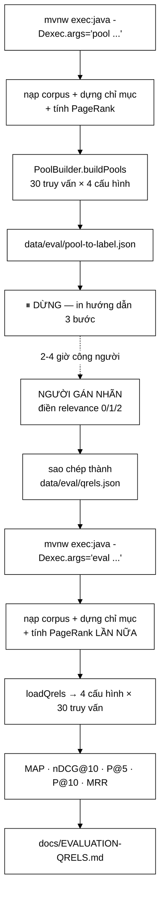

# QrelsEvaluationRunner — hai chế độ, một con người ở giữa, và bảng số không kèm kiểm định

**File nguồn:** `search-engine/src/main/java/com/vnsearch/eval/QrelsEvaluationRunner.java` (170 dòng)
**Gói:** `com.vnsearch.eval` · **Loại:** `class` chỉ có `main` + 2 hàm trợ giúp tĩnh — một **điểm vào chạy tay**, không phải thành phần thời gian chạy
**Vị trí trong sơ đồ:** khối **Evaluation** — trình điều phối nhánh *nhãn do người gán*
**Đọc kèm:** [`PoolBuilder.md`](./PoolBuilder.md) · [`EvaluationRunner.md`](./EvaluationRunner.md) · [`EvaluationMetrics.md`](./EvaluationMetrics.md) · [`SignificanceTest.md`](./SignificanceTest.md)

---

## 📌 Hiểu trong 30 giây

**qrels** là viết tắt của *query relevance judgments* — bảng nhãn nói rằng "với
truy vấn q, tài liệu d có mức liên quan là 0, 1 hay 2". Đây là **sự thật nền**
(ground truth) mà mọi chỉ số nDCG, MAP, P@k đều dựa vào. Không có qrels thì
không có gì để so kết quả xếp hạng với, và mọi con số đánh giá đều là ảo.

Dự án có **hai** nguồn sự thật nền, và lớp này là trình điều phối của nguồn thứ
hai:

| | Known-item (tự sinh) | Qrels (người gán) |
|---|---|---|
| Lớp điều phối | [`EvaluationRunner`](./EvaluationRunner.md) | **`QrelsEvaluationRunner`** |
| Sự thật nền đến từ | Máy: lấy vài từ hiếm trong một bài, coi bài đó là đáp án duy nhất | Người: đọc và chấm 0/1/2 |
| Số đáp án đúng/truy vấn | **Đúng 1** | Nhiều, nhiều bậc |
| Chỉ số dùng được | MRR, Success@k | **nDCG, MAP**, P@k, MRR |
| Chi phí | 0 (chạy lại lúc nào cũng được) | 2–4 giờ người, một lần |
| Khách quan? | Hoàn toàn | Chủ quan, phụ thuộc người gán |

Lớp này chạy ở **hai chế độ tách rời nhau bởi một con người**: chế độ `pool`
sinh file cần gán nhãn rồi **dừng**; con người điền nhãn; chế độ `eval` đọc nhãn
và sinh báo cáo. Không thể gộp thành một lệnh — đó là bản chất của bài toán, chứ
không phải thiếu sót thiết kế.



```
   HAI CHẾ ĐỘ — VÌ SAO PHẢI TÁCH

   ┌───────────────────────────────────────────────────────────────┐
   │  Bước ở giữa KHÔNG PHẢI là một hàm.                           │
   │  Nó là một con người, mất vài giờ, có thể làm dở rồi nghỉ,     │
   │  và kết quả của nó phải LƯU LẠI ĐƯỢC để dùng cho mọi lần       │
   │  chạy đánh giá sau.                                           │
   │                                                               │
   │  ⇒ Ranh giới giữa hai chế độ chính là ranh giới giữa           │
   │    "máy làm được" và "chỉ người làm được".                    │
   │  ⇒ File JSON trên đĩa là GIAO DIỆN giữa hai thế giới đó,      │
   │    nên nó phải phẳng, dễ đọc, dễ sửa bằng tay.                │
   └───────────────────────────────────────────────────────────────┘
```

---

## 1. Vì sao cần nhãn người gán khi đã có bộ sinh truy vấn tự động

Javadoc dòng 21–27 nêu lý do gọn gàng, viết lại có dấu:

> Cần cả hai vì mỗi cách bù khuyết điểm của cách kia. Known-item search cho số
> liệu khách quan và tái lập được nhưng chỉ có đúng một tài liệu đúng cho mỗi
> truy vấn, nên thiên vị chống lại PageRank và không đo được truy vấn khám phá.

Câu "**thiên vị chống lại PageRank**" là chi tiết sắc nhất trong cả lớp, và đáng
được mở rộng vì nó không hiển nhiên:

```
   KNOWN-ITEM: máy chọn bài X, rút vài từ hiếm trong X làm truy vấn,
               rồi hỏi "hệ thống có đưa X lên đầu không?"

   ĐÁP ÁN ĐÚNG DUY NHẤT LÀ X. Mọi tài liệu khác = SAI, không có bậc.

   Giờ xét PageRank. PageRank nói: "trang được nhiều trang khác
   trỏ tới thì đáng tin hơn". Nó đẩy các trang chủ đề lớn, uy tín
   lên trên.

   Chuyện gì xảy ra:
     - bài X được chọn ngẫu nhiên → thường là một bài tin thường,
       ít backlink, PageRank thấp
     - hệ có PageRank đẩy một bài UY TÍN HƠN nhưng cũng nói về
       đúng chủ đề đó lên trên X
     - known-item chấm: SAI. Trừ điểm.
     - người dùng thật nếu gõ truy vấn đó: nhiều khả năng THÍCH
       bài uy tín kia hơn.

   ⇒ Known-item ĐO NHẦM. Nó phạt PageRank vì làm đúng việc của nó.
   ⇒ Chỉ nhãn nhiều bậc mới cho phép nói "cả hai đều liên quan,
     nhưng bài này liên quan hơn".
```

Đó chính là lý do lớp này tồn tại. Nói cách khác: **hai bộ đánh giá không phải
dư thừa, chúng đo hai thứ khác nhau**, và một hệ thống tốt phải khá ở cả hai.

### 1.1 Ranh giới trách nhiệm: vì sao KHÔNG gộp vào `EvaluationRunner`

| | `EvaluationRunner` | `QrelsEvaluationRunner` |
|---|---|---|
| Chạy được ở CI? | Có — không cần dữ liệu ngoài | **Không** — phụ thuộc `qrels.json` do người tạo |
| Chạy lại sau khi crawl lại? | Có, tự động sinh lại truy vấn | Có, nhãn khoá theo URL nên còn dùng được |
| Số truy vấn | ~200 (tuỳ tham số) | **30, cố định trong mã** |
| Có kiểm định thống kê? | **Có** — 6 cặp, `SignificanceTest` | **Không** — xem mục 5, đây là khoảng trống lớn nhất |
| Đầu ra | `docs/EVALUATION.md` | `docs/EVALUATION-QRELS.md` |

Gộp hai lớp lại sẽ tạo ra một lớp có **một nửa chạy được tự động, một nửa thì
không** — và trong CI thì nửa sau sẽ hoặc thất bại, hoặc bị bỏ qua âm thầm. Tách
ra là đúng.

---

## 2. Bộ 30 truy vấn tự nhiên — thiết kế có chủ ý

Dòng 53–60. Danh sách này **không** ngẫu nhiên; Javadoc dòng 47–51 nói rõ nó mô
phỏng cách người Việt thật gõ. Phân loại lại:

```
   ĐỘ RỘNG
   ────────────────────────────────────────────────────────────────
   một từ, rất rộng      : công nghệ, thể thao, kinh tế, giáo dục,
                           y tế, du lịch, môi trường, âm nhạc ...
   hai-ba từ, hẹp hơn    : bóng đá Việt Nam, giá vàng hôm nay,
                           tuyển sinh đại học, trí tuệ nhân tạo,
                           bất động sản
   KHÔNG DẤU (4 truy vấn): cong nghe, the thao, kinh te, giao duc

   ┌──────────────────────────────────────────────────────────────┐
   │  BỐN TRUY VẤN KHÔNG DẤU LÀ PHẦN GIÁ TRỊ NHẤT CỦA DANH SÁCH.  │
   │                                                              │
   │  Chúng ghép cặp CHÍNH XÁC với 4 truy vấn có dấu đầu tiên:    │
   │      "công nghệ" ↔ "cong nghe"                               │
   │      "thể thao"  ↔ "the thao"                                │
   │      "kinh tế"   ↔ "kinh te"                                 │
   │      "giáo dục"  ↔ "giao duc"                                │
   │                                                              │
   │  ⇒ Đây là một PHÉP THỬ ĐỐI CHỨNG cho chỉ mục kép             │
   │    có dấu / không dấu. Nếu chỉ mục kép hoạt động đúng,       │
   │    nDCG của hai truy vấn trong mỗi cặp phải GẦN BẰNG NHAU.   │
   │  ⇒ Chênh lệch lớn = chỉ mục không dấu hỏng, và đây là         │
   │    cách phát hiện DUY NHẤT trong toàn bộ bộ đánh giá.        │
   └──────────────────────────────────────────────────────────────┘
```

**Nhưng phép thử đối chứng đó chưa được khai thác.** Báo cáo hiện chỉ in **giá
trị trung bình trên cả 30 truy vấn**, nên chênh lệch giữa "công nghệ" và "cong
nghe" bị hoà tan hoàn toàn. Bốn truy vấn được đặt vào đó với dụng ý rõ ràng mà
mã lại không tận dụng — đề xuất 2 ở mục 8 nói cách sửa, và nó rẻ.

### 2.1 Vì sao 30 truy vấn là ít

```
   n = 30 cặp quan sát.

   Với dữ liệu truy hồi thông tin, độ lệch chuẩn của hiệu nDCG
   giữa hai cấu hình gần nhau thường vào khoảng 0,15-0,25.

   Sai số chuẩn = s / √n = 0,20 / √30 ≈ 0,037
   Nửa độ rộng KTC 95 % ≈ 2,045 × 0,037 ≈ 0,075

   ⇒ Với n = 30, chỉ phát hiện được chênh lệch nDCG từ ~0,075 trở lên.
   ⇒ Một cải tiến thật đáng 0,03 nDCG (rất đáng kể trong ngành)
     là KHÔNG THỂ PHÁT HIỆN với cỡ mẫu này.

   Để phát hiện chênh 0,03 với năng lực 80 %:
        n ≈ (2,8 × 0,20 / 0,03)² ≈ 350 truy vấn

   TREC ad-hoc dùng 50 chủ đề, và đó đã bị coi là ít.
```

Con số 30 là **thoả hiệp có lý** với ràng buộc gán nhãn thủ công (30 truy vấn đã
là 2–4 giờ công người), nhưng nó phải được **nói ra trong báo cáo**, chứ không
im lặng. Hiện báo cáo in `nDCG@10 = 0.6421` với bốn chữ số thập phân — một mức
chính xác giả tạo gấp nhiều lần độ tin cậy thật của con số. Xem mục 5.

---

## 3. Hướng dẫn về code

### 3.1 Phân giải chế độ — một lỗi nhỏ với hậu quả khó chịu

```java
String mode = args.length > 0 ? args[0] : "pool";
...
if ("pool".equalsIgnoreCase(mode)) {
    ...
    return;
}
// mọi thứ KHÔNG PHẢI "pool" rơi xuống đây và chạy chế độ eval
```

Dòng 63 và 75. Cấu trúc này có một hệ quả không mong muốn:

```
   args[0] = "pool"    → chế độ pool     ✔
   args[0] = "eval"    → chế độ eval     ✔
   args[0] = "poool"   → chế độ eval     ✘  (gõ nhầm phím)
   args[0] = "Pool "   → chế độ eval     ✘  (dấu cách thừa, hay gặp
                                             khi sao chép từ tài liệu)
   args[0] = "help"    → chế độ eval     ✘

   Triệu chứng khi gõ nhầm:
     "Chua co data/eval/qrels.json - hay chay che do 'pool' va gan nhan truoc."
   → thông báo này ĐÚNG về mặt logic nhưng SAI về mặt chẩn đoán:
     người dùng nghĩ mình VỪA chạy chế độ pool xong.
```

Sửa đúng là liệt kê tường minh và từ chối cái không biết:

```java
if (!"pool".equalsIgnoreCase(mode) && !"eval".equalsIgnoreCase(mode)) {
    System.err.println("Che do khong hop le: '" + mode + "'. Chi nhan 'pool' hoac 'eval'.");
    return;
}
```

Nguyên tắc chung: **mặc định phải là từ chối, không phải là một trong hai nhánh
thật.** Một nhánh `else` bắt trọn mọi đầu vào lạ luôn biến lỗi gõ thành hành vi
sai lặng lẽ.

### 3.2 Đường dẫn đầu ra `../docs/EVALUATION-QRELS.md` — phụ thuộc thư mục làm việc

```java
Path out = Path.of("../docs/EVALUATION-QRELS.md");
Files.createDirectories(out.getParent());
Files.writeString(out, report.toString());
```

Dòng 142–144. Đường dẫn tương đối **có `..`** nghĩa là kết quả phụ thuộc hoàn
toàn vào chỗ đứng khi gõ lệnh:

```
   Chạy từ  search-engine/          →  ghi vào  <gốc repo>/docs/    ✔ ĐÚNG Ý
   Chạy từ  <gốc repo>/             →  ghi vào  <THƯ MỤC CHA CỦA REPO>/docs/
                                        ⇒ tạo thư mục docs BÊN NGOÀI repo
                                        ⇒ không có lỗi, không có cảnh báo
                                        ⇒ người dùng mở docs/EVALUATION-QRELS.md
                                          trong repo và thấy file CŨ, tưởng
                                          chương trình không cập nhật
   Chạy từ IDE với working dir mặc định  →  không đoán được
```

Điều đáng nói: `Files.createDirectories` khiến lỗi này **không bao giờ ném ngoại
lệ** — nó lặng lẽ tạo thư mục ở chỗ sai. Đây là ví dụ kinh điển của việc "làm
cho tiện" biến một lỗi ồn ào thành một lỗi im lặng. Chương trình có in
`out.toAbsolutePath().normalize()` ở dòng 147, nên bằng chứng có sẵn — nhưng chỉ
khi người dùng đọc dòng cuối của log.

Cách chắc chắn: xác định gốc repo từ vị trí một tệp mốc (ví dụ `pom.xml`) rồi
dựng đường dẫn tuyệt đối, hoặc nhận đường dẫn đầu ra làm tham số dòng lệnh với
mặc định an toàn.

### 3.3 Ba hằng số đường dẫn cứng

```java
private static final String POOL_PATH  = "data/eval/pool-to-label.json";
private static final String QRELS_PATH = "data/eval/qrels.json";
private static final int TOP_N = 10;
```

Quy trình 3 bước in ra ở dòng 84–88 yêu cầu người dùng **sao chép tay**
`pool-to-label.json` thành `qrels.json`. Vì sao lại bắt sao chép chứ không sửa
tại chỗ? Lý do tốt: chạy lại chế độ `pool` sẽ **ghi đè**
`pool-to-label.json` — nếu người dùng gán nhãn thẳng vào đó, một lần chạy lại
nhầm sẽ **xoá sạch nhiều giờ công**. Tách hai tên file là một lớp bảo vệ thật.

Nhưng lớp bảo vệ đó chưa hoàn chỉnh: chế độ `pool` **không kiểm tra**
`pool-to-label.json` đã có nhãn hay chưa trước khi ghi đè. Một dòng kiểm và một
câu hỏi xác nhận (hoặc đơn giản là đổi tên file cũ thành `.bak`) sẽ đóng nốt.

Về `TOP_N = 10`: nó phải khớp với `PoolBuilder.POOL_DEPTH = 10`, và mối ràng
buộc đó **không được biểu diễn trong mã** — hai hằng số nằm ở hai lớp, không ai
kiểm chúng bằng nhau. Nếu ai đó nâng `TOP_N` lên 20 mà không nâng `POOL_DEPTH`,
mọi kết quả hạng 11–20 sẽ bị chấm 0 vì đơn giản là chưa từng ai được hỏi về
chúng — và toàn bộ bảng sẽ tụt điểm đồng loạt, trông y hệt như "hệ thống xấu đi".

```
   ┌──────────────────────────────────────────────────────────────┐
   │  BẤT BIẾN NGẦM CHƯA ĐƯỢC PHÁT BIỂU:                          │
   │                                                              │
   │        TOP_N  ≤  PoolBuilder.POOL_DEPTH                      │
   │                                                              │
   │  Vi phạm ⇒ đánh giá trên vùng chưa có nhãn ⇒ số liệu sai      │
   │  theo hướng bi quan, và sai đều cho mọi cấu hình nên          │
   │  KHÔNG nhìn ra được từ bảng kết quả.                          │
   │                                                              │
   │  Sửa: một `static { assert }` hoặc đơn giản                  │
   │        TOP_N = PoolBuilder.POOL_DEPTH                        │
   └──────────────────────────────────────────────────────────────┘
```

### 3.4 Vòng lặp tính chỉ số — cấu trúc đúng, chi tiết đúng

```java
for (EvaluationHarness.RankingConfig config : configs) {
    List<Double> aps = new ArrayList<>();
    ...
    for (Map.Entry<String, Map<String, Integer>> entry : qrels.entrySet()) {
        List<String> ranked = harness.search(entry.getKey(), config, TOP_N);
        Map<String, Integer> judgments = entry.getValue();
        aps.add(EvaluationMetrics.averagePrecision(ranked, judgments));
        ...
    }
```

Ba điểm đáng khen:

**① Duyệt theo `qrels`, không theo `NATURAL_QUERIES`.** Nghĩa là nếu người gán
chỉ làm xong 18/30 truy vấn rồi xoá phần còn lại khỏi file, chương trình vẫn
chạy đúng trên 18 truy vấn đó và báo `Số truy vấn có nhãn: 18` ở dòng 108. Đây
là hành vi đúng — dữ liệu quyết định phạm vi, không phải hằng số trong mã.

**② Giữ danh sách từng giá trị (`aps`, `ndcgs`, ...) rồi mới lấy trung bình.**
Thoạt nhìn tốn bộ nhớ hơn so với cộng dồn một biến, nhưng nó giữ lại **phân phối
theo truy vấn** — chính là thứ `SignificanceTest.pairedTest` cần. Cấu trúc đã
sẵn sàng cho kiểm định; chỉ thiếu vài dòng nối vào. Xem mục 5.

**③ `Locale.US` trong `String.format`.** Bắt buộc: `Locale` mặc định của máy
Việt Nam dùng dấu phẩy làm dấu thập phân, cho ra `0,6421` trong một **bảng
Markdown phân cột bằng `|`** — vẫn hiển thị được, nhưng mọi công cụ đọc lại con
số (script vẽ biểu đồ, bảng tính) sẽ hỏng. Đây là loại lỗi chỉ xuất hiện trên
máy của người khác.

### 3.5 Cạm bẫy khi sửa lớp này

| Ý định | Hậu quả |
|---|---|
| Nâng `TOP_N` lên 20 cho "đầy đủ hơn" | Đánh giá trên vùng chưa gán nhãn ⇒ mọi cấu hình tụt điểm đồng loạt, trông như hệ thống xấu đi — mục 3.3 |
| Thêm cấu hình thứ 5 vào `poolConfigs` mà không sinh lại pool | Cấu hình mới bị phạt oan mọi tài liệu tốt nằm ngoài pool cũ — [`PoolBuilder.md`](./PoolBuilder.md) mục 2 |
| Thêm truy vấn vào `NATURAL_QUERIES` sau khi đã gán nhãn | Truy vấn mới không có trong `qrels.json` ⇒ bị **bỏ qua im lặng** (vòng lặp duyệt theo qrels) ⇒ tưởng đã đánh giá mà thật ra không |
| Gán nhãn thẳng vào `pool-to-label.json` | Lần chạy chế độ `pool` tiếp theo ghi đè, mất nhiều giờ công, không hỏi lại |
| Bỏ `Locale.US` | Dấu thập phân theo máy; báo cáo khác nhau giữa các máy — mục 3.4 |
| Chạy chế độ `eval` từ thư mục gốc repo | Báo cáo ghi ra ngoài repo, không lỗi, không cảnh báo — mục 3.2 |
| Đổi `TOP_N` mà quên đổi tiêu đề cột `nDCG@10` | Bảng nói một đằng, số liệu một nẻo; `ndcgAtK(..., 10)` bị viết cứng số 10 ở dòng 123 chứ không dùng `TOP_N` |

Điểm cuối bảng là một mâu thuẫn thật trong mã: dòng 120 dùng `TOP_N` để lấy kết
quả, nhưng dòng 123–125 viết cứng `10`, `5`, `10`. Đổi `TOP_N` sẽ khiến ba dòng
này lệch khỏi độ sâu tìm kiếm mà không có lỗi biên dịch.

---

## 4. Độ phức tạp & chi phí

| Giai đoạn | Độ phức tạp | Thời gian thực tế (corpus 31.030) |
|---|---|---|
| `ContentStorage.loadFromJson` | O(B) theo byte | 15–40 giây (87 MB JSON) |
| `buildIndex` (sắp xếp + nạp) | O(D log D + T) | 20–60 giây |
| `computePageRank` | O(I·E) | 5–30 giây (~40 liên kết/trang ⇒ E ≈ 1,24 triệu) |
| Chế độ `pool` — `buildPools` | O(Q·C·S) = 120 lần tìm | ~2 giây |
| Chế độ `eval` — vòng đôi | O(Q·C·(S + k log k)) | ~2 giây |
| Ghi báo cáo | O(Q·C) chuỗi | Tức thời |

```
   ĐIỀU KHÓ CHỊU NHẤT VỀ CHI PHÍ

        chế độ pool:   nạp → chỉ mục → PageRank → 2 giây việc thật
        chế độ eval:   nạp → chỉ mục → PageRank → 2 giây việc thật
                       ▲───────── LÀM LẠI Y HỆT ─────────▲

   Mỗi lần chạy tốn 40 giây - 2 phút, trong đó ~97 % là dựng lại
   thứ vừa dựng xong lần trước. Và trong vòng đời sử dụng thật,
   chế độ eval được chạy NHIỀU LẦN (sửa nhãn, thêm cấu hình,
   đổi trọng số) — mỗi lần lại chờ từ đầu.

   ┌────────────────────────────────────────────────────────────┐
   │  Cùng vấn đề này lặp lại ở EvaluationRunner và              │
   │  TokenizerBenchmark: mỗi công cụ đánh giá tự nạp lại        │
   │  corpus từ JSON.                                            │
   │                                                            │
   │  Lời giải chung: một chỉ mục tuần tự hoá được               │
   │  (index + PageRank ghi ra đĩa, nạp bằng mmap).             │
   │  Đây là hạ tầng đúng nghĩa, không phải tối ưu vi mô —       │
   │  nó rút vòng lặp thử-sai từ ~90 giây xuống ~5 giây.        │
   └────────────────────────────────────────────────────────────┘
```

Bộ nhớ: corpus ~367 MB trong RAM + chỉ mục ngược + ma trận PageRank. Chạy với
`-Xmx2g` là an toàn; mặc định của JVM (1/4 RAM máy) có thể đủ hoặc không tuỳ máy
— và khi không đủ thì `OutOfMemoryError` xảy ra **sau 40 giây chờ nạp**, trải
nghiệm rất tệ. Một dòng kiểm `Runtime.maxMemory()` ngay đầu `main` và cảnh báo
sớm là cải thiện rẻ.

---

## 5. Khoảng trống lớn nhất: bảng số không kèm kiểm định

Đây là phần cần nói thẳng nhất về lớp này.

Dự án **đã có** một bộ kiểm định thống kê tự cài, chất lượng cao:
[`SignificanceTest`](./SignificanceTest.md), với paired t-test *và* randomization
test, khoảng tin cậy 95%, hàm beta không hoàn chỉnh cài bằng phân số liên tục
Lentz. `EvaluationRunner` dùng nó cho 6 cặp so sánh và in cả cột `p` lẫn KTC.

**`QrelsEvaluationRunner` không dùng nó một dòng nào.**

```
   BÁO CÁO HIỆN TẠI SINH RA (dòng 109-135):

   | Cấu hình                       | MAP    | nDCG@10 | P@5    | P@10   | MRR    |
   |--------------------------------|--------|---------|--------|--------|--------|
   | TF-IDF + PR + title (đang dùng)| 0.5231 | 0.6104  | 0.5800 | 0.5133 | 0.7250 |
   | TF-IDF thuần                   | 0.5018 | 0.5977  | 0.5667 | 0.5000 | 0.7083 |
   | BM25 thuần                     | 0.5142 | 0.6031  | 0.5733 | 0.5067 | 0.7167 |
   | BM25 + PR + title              | 0.5289 | 0.6152  | 0.5867 | 0.5200 | 0.7333 |

   (số minh hoạ)

   Người đọc bảng này sẽ kết luận: "BM25 + PR + title tốt nhất."

   NHƯNG:
     n = 30 truy vấn
     chênh lệch nDCG giữa dòng đầu và dòng cuối = 0,0048
     nửa độ rộng KTC 95 % ước tính ≈ 0,075   (mục 2.1)

     ⇒ 0,0048 nhỏ hơn sai số 15 LẦN.
     ⇒ Thứ tự bốn dòng này gần như HOÀN TOÀN LÀ NHIỄU.
     ⇒ Chạy lại với 30 truy vấn khác, thứ tự rất có thể đảo.
```

```
   ┌──────────────────────────────────────────────────────────────────┐
   │  BỐN CHỮ SỐ THẬP PHÂN LÀ MỘT LỜI KHẲNG ĐỊNH.                     │
   │                                                                  │
   │  In "0.6104" nghĩa là ngầm nói: "tôi biết con số này chính xác   │
   │  tới phần vạn". Với n = 30, ta chỉ biết nó chính xác tới          │
   │  khoảng ±0,07 — tức chưa chắc chắn nổi CHỮ SỐ THẬP PHÂN ĐẦU.     │
   │                                                                  │
   │  Đây không phải chuyện thẩm mỹ. Người đọc báo cáo sẽ ra quyết     │
   │  định "chọn BM25 + PR" dựa trên chênh lệch 0,0048 — và quyết      │
   │  định đó không có cơ sở nào.                                     │
   └──────────────────────────────────────────────────────────────────┘
```

Điều đáng tiếc là **hạ tầng đã sẵn sàng**: vòng lặp ở dòng 113–127 đã giữ
`List<Double>` từng giá trị cho từng cấu hình. Nối vào `SignificanceTest` chỉ
cần lưu các danh sách đó theo nhãn cấu hình rồi gọi `pairedTest` cho vài cặp
quan tâm. Xem đề xuất 1.

Xem thêm [`SignificanceTest.md`](./SignificanceTest.md) mục về vì sao "hơn 2%"
là câu nói vô nghĩa nếu không kèm p-value.

---

## 6. Kiểm thử liên quan

| Bộ test | Kiểm gì |
|---|---|
| [`EvaluationMetricsTest`](../../../../../test/java/com/vnsearch/eval/EvaluationMetricsTest.md) | Mọi công thức lớp này gọi: AP, nDCG, P@k, RR |
| [`RankingQualityTest`](../../../../../test/java/com/vnsearch/eval/RankingQualityTest.md) | `EvaluationHarness.search` cho kết quả hợp lý với truy vấn tiếng Việt |
| [`SignificanceTestTest`](../../../../../test/java/com/vnsearch/eval/SignificanceTestTest.md) | Bộ kiểm định mà lớp này **chưa** dùng |

**Lớp này không có bộ test riêng**, và một phần là chính đáng: nó là `main` phụ
thuộc corpus trên đĩa. Nhưng phần **logic** của nó thì kiểm được nếu tách ra:
`buildIndex`, `poolConfigs`, và toàn bộ khối dựng báo cáo đều là hàm thuần trên
dữ liệu.

```
   ĐẦU VÀO                                   KẾT QUẢ MONG ĐỢI
   ───────────────────────────────────       ────────────────────────────
   args = []                                 chế độ pool, corpus mặc định
   args = ["eval"], không có qrels.json      in lỗi ra stderr, KHÔNG ném,
                                             thoát êm
   args = ["poool"]                          PHẢI báo chế độ không hợp lệ
                                             (hiện tại: chạy eval)
   qrels có 18/30 truy vấn                   báo cáo ghi "Số truy vấn có
                                             nhãn: 18"
   qrels rỗng hoàn toàn                      bảng in 4 dòng toàn 0.0000 —
                                             PHẢI cảnh báo thay vì im lặng
   corpus rỗng                               index 0 tài liệu; PageRank
                                             không chia cho 0
   Locale máy = vi-VN                        số trong báo cáo vẫn dùng
                                             dấu chấm thập phân
```

Ba bài test còn thiếu:

```java
// 1. Bất biến ngầm ở mục 3.3 — phải được phát biểu bằng mã
@Test
void doSauDanhGiaKhongVuotDoSauPool() {
    assertTrue(TOP_N <= PoolBuilder.POOL_DEPTH,
            "đánh giá tới hạng " + TOP_N + " trong khi pool chỉ gán nhãn tới hạng "
                    + PoolBuilder.POOL_DEPTH + " ⇒ mọi kết quả sâu hơn bị chấm 0 oan");
}

// 2. Cặp có dấu / không dấu phải cho kết quả tương đương — phép thử đối chứng
//    duy nhất cho chỉ mục kép, hiện chưa được khai thác
@Test
void truyVanKhongDauTuongDuongTruyVanCoDau() {
    var coDau    = harness.search("công nghệ", cauHinhDangDung, 10);
    var khongDau = harness.search("cong nghe", cauHinhDangDung, 10);
    var giao = new HashSet<>(coDau); giao.retainAll(khongDau);
    assertTrue(giao.size() >= 7,
            "chỉ mục kép có dấu/không dấu phải cho top-10 gần trùng nhau; "
                    + "giao chỉ " + giao.size() + "/10 nghĩa là nhánh không dấu hỏng");
}

// 3. Chế độ không hợp lệ phải bị từ chối, không rơi vào eval
@Test
void cheDoLaKhongDuocAmThamChayEval() {
    var ketQua = QrelsEvaluationRunner.phanGiaiCheDo("poool");
    assertTrue(ketQua.isEmpty(),
            "chế độ gõ nhầm phải bị từ chối tường minh; hiện tại nó rơi vào nhánh "
                    + "eval và báo 'chưa có qrels.json', gây chẩn đoán sai hướng");
}
```

---

## 7. Chấm theo chuẩn doanh nghiệp

| Tiêu chí | Điểm | Nhận xét |
|---|---|---|
| Lý do tồn tại được biện luận | 10/10 | Javadoc nêu chính xác vì sao known-item **thiên vị chống PageRank** — một nhận xét sắc, ít đồ án nghĩ tới |
| Thiết kế quy trình hai chế độ | 9/10 | Ranh giới "máy làm được / người làm được" đặt đúng chỗ; hướng dẫn 3 bước in ngay sau khi sinh pool |
| Thiết kế bộ truy vấn | 9/10 | Trộn rộng/hẹp/không dấu có chủ ý; 4 cặp có dấu–không dấu là phép thử đối chứng thông minh |
| Trung thực về giới hạn | 9/10 | Ghi chú cuối báo cáo nói thẳng recall tuyệt đối không đo được — đúng và hiếm |
| Xử lý dữ liệu thiếu | 8/10 | Duyệt theo `qrels` chứ không theo hằng số ⇒ gán nhãn dở vẫn chạy đúng phạm vi; nhưng qrels rỗng thì im lặng |
| Định dạng số liệu | 8/10 | `Locale.US` đúng chỗ; nhưng in 4 chữ số thập phân cho số chỉ tin được tới 1 chữ số |
| **Cỡ mẫu** | **5/10** | 30 truy vấn chỉ phát hiện được chênh lệch nDCG ≥ ~0,075; mọi khác biệt trong bảng hiện tại nhỏ hơn thế |
| **Kiểm định thống kê** | **3/10** | `SignificanceTest` có sẵn, chất lượng cao, và **không được gọi một lần nào**. Bảng bốn dòng không kèm KTC hay p-value |
| **Độ bền đường dẫn / CLI** | **4/10** | `../docs/...` phụ thuộc thư mục làm việc và thất bại **im lặng**; chế độ gõ nhầm rơi vào nhánh `eval` |
| Nhất quán hằng số | 5/10 | `TOP_N` dùng ở dòng 120 nhưng `10`/`5` viết cứng ở dòng 123–125; ràng buộc `TOP_N ≤ POOL_DEPTH` không được kiểm |
| Khả năng kiểm thử | 4/10 | Toàn bộ logic nằm trong `main`; `buildIndex` và khối dựng báo cáo tách ra được nhưng chưa tách |

**Năm đề xuất nâng lên mức sản phẩm:**

1. **Nối `SignificanceTest` vào báo cáo qrels.** Đây là đề xuất có tỷ lệ
   giá-trị/công-sức cao nhất trong cả gói `eval`. Hạ tầng đã sẵn: vòng lặp dòng
   113–127 giữ `List<Double> ndcgs` cho từng cấu hình, đúng dạng
   `pairedTest(double[], double[])` cần. Chỉ việc lưu các danh sách theo nhãn rồi
   in thêm một bảng "so sánh từng cặp" giống hệt `EvaluationRunner`. Không làm
   việc này thì bảng kết quả hiện tại **không hỗ trợ được bất kỳ kết luận nào** —
   và người phản biện sẽ hỏi đúng câu đó.

2. **Tách riêng bảng cho 4 cặp có dấu / không dấu.** Bốn truy vấn `cong nghe`,
   `the thao`, `kinh te`, `giao duc` được đặt vào danh sách với dụng ý rõ ràng
   nhưng bị hoà vào trung bình 30 truy vấn. In một bảng phụ với ba cột — truy vấn
   có dấu, truy vấn không dấu, chênh lệch nDCG — biến chúng thành **bằng chứng
   trực tiếp cho một trong những tính năng đặc thù tiếng Việt của hệ thống**. Đây
   là loại số liệu làm nổi bật đồ án, vì nó đo đúng thứ mà một máy tìm kiếm tiếng
   Anh không cần đo.

3. **Làm đường dẫn đầu ra không phụ thuộc thư mục làm việc, và từ chối chế độ
   lạ.** Hai lỗi nhỏ nhưng cùng một dạng: thất bại im lặng. Dò ngược lên tìm
   `pom.xml` để xác định gốc dự án (khoảng 8 dòng), hoặc nhận đường dẫn qua tham
   số thứ ba. Song song, thay nhánh `else` bắt trọn bằng một `switch` liệt kê
   tường minh `pool` / `eval` và in cách dùng khi gặp thứ khác. Chi phí gần bằng
   không, và loại bỏ hai buổi gỡ lỗi tiềm năng.

4. **Cache chỉ mục và PageRank ra đĩa.** Mỗi lần chạy tốn 40 giây đến 2 phút để
   dựng lại đúng thứ vừa dựng lần trước, trong khi phần việc thật chỉ 2 giây. Vì
   chế độ `eval` được chạy đi chạy lại (sửa nhãn, thêm cấu hình, chỉnh trọng số),
   đây là thuế đánh vào chính vòng lặp thử-sai của người phát triển. Ghi
   `InvertedIndex` + điểm PageRank ra một file nhị phân có gắn mã băm của corpus,
   nạp lại nếu mã băm khớp. Lợi ích lan sang cả `EvaluationRunner` và
   [`TokenizerBenchmark`](./TokenizerBenchmark.md).

5. **Cảnh báo khi qrels trống hoặc gán nhãn dở dang, và in cỡ mẫu ngay đầu báo
   cáo.** Một file qrels chưa gán nhãn cho ra bảng toàn `0.0000` — trông hệt như
   "hệ thống hoàn toàn hỏng". Kết hợp với đề xuất 3 của
   [`PoolBuilder`](./PoolBuilder.md) (phân biệt "chưa chấm" với "chấm 0"), in
   ngay dòng đầu báo cáo: số truy vấn, tỷ lệ mục đã gán nhãn, và một câu về độ
   phân giải thống kê ở cỡ mẫu đó ("với n = 30, chênh lệch nhỏ hơn ~0,07 nDCG
   không phân biệt được với nhiễu"). Câu đó bảo vệ người đọc khỏi chính bảng số
   liệu bên dưới.

---

## 8. Liên kết

- Nơi pool được dựng và nhãn được nạp: [`PoolBuilder.md`](./PoolBuilder.md)
- Trình đánh giá song song, dùng ground truth tự sinh: [`EvaluationRunner.md`](./EvaluationRunner.md)
- Bộ sinh truy vấn known-item: [`KnownItemQueryGenerator.md`](./KnownItemQueryGenerator.md)
- Mọi công thức chỉ số: [`EvaluationMetrics.md`](./EvaluationMetrics.md)
- Bộ kiểm định lớp này chưa dùng: [`SignificanceTest.md`](./SignificanceTest.md)
- `RankingConfig` và hàm tìm kiếm dùng chung: [`EvaluationHarness.md`](./EvaluationHarness.md)
- Hai hàm chấm điểm được so sánh: [`../ranking/TfIdfScorer.md`](../ranking/TfIdfScorer.md) · [`../ranking/BM25Scorer.md`](../ranking/BM25Scorer.md)
- Trọng số PageRank 0,3 và trọng số tiêu đề 0,1: [`../ranking/PageRankService.md`](../ranking/PageRankService.md)
- Nạp corpus từ JSON: [`../crawler/ContentStorage.md`](../crawler/ContentStorage.md)
- Báo cáo sinh ra: `docs/EVALUATION-QRELS.md` · `docs/EVALUATION.md`
