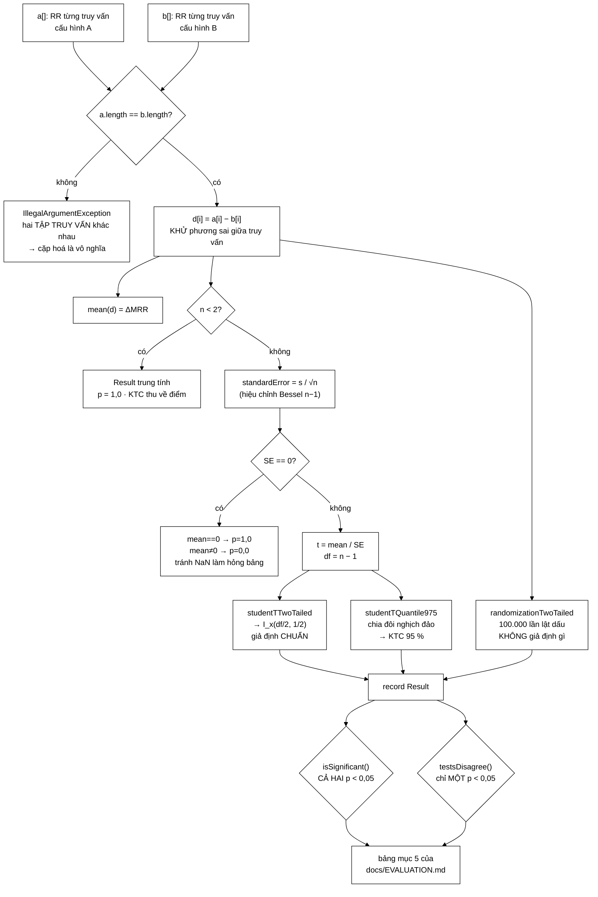

# SignificanceTest — lớp duy nhất trả lời được câu hỏi "chênh lệch này là thật hay chỉ là may rủi của 200 truy vấn"

**File nguồn:** `search-engine/src/main/java/com/vnsearch/eval/SignificanceTest.java` (367 dòng)
**Gói:** `com.vnsearch.eval` · **Loại:** `final class`, **thuần hàm tĩnh, không trạng thái** (constructor riêng tư) + `record Result` lồng bên trong
**Vị trí trong sơ đồ:** tầng **KẾT LUẬN** — nằm sau `EvaluationMetrics`, là bước cuối cùng trước khi một câu khẳng định được viết vào `docs/EVALUATION.md`
**Đọc kèm:** [`EvaluationMetrics.md`](./EvaluationMetrics.md) · [`EvaluationRunner.md`](./EvaluationRunner.md) · [`EvaluationHarness.md`](./EvaluationHarness.md) · [`PoolBuilder.md`](./PoolBuilder.md)

---

## 📌 Hiểu trong 30 giây

`EvaluationMetrics` cho ra một con số: MRR của cấu hình A là 0,6412, của cấu
hình B là 0,6108. Bảng ablation trong `EvaluationRunner` xếp A trên B. Và đến
đây **hầu hết đồ án dừng lại** — viết một câu "cấu hình A cải thiện MRR 3,04
điểm phần trăm so với B" rồi đi tiếp.

Câu đó là một **khẳng định chưa được chứng minh**. Nó bỏ qua một sự thật: hai
con số ấy không đo trên toàn bộ vũ trụ truy vấn, mà đo trên **đúng 200 truy vấn
tình cờ được sinh ra**. Nếu sinh 200 truy vấn khác, cả hai con số sẽ khác. Câu
hỏi thật sự phải trả lời là:

> **Nếu hai cấu hình thực sự ngang nhau, xác suất quan sát được chênh lệch lớn
> bằng hoặc hơn 0,0304 — chỉ vì ngẫu nhiên của việc chọn đúng 200 truy vấn đó —
> là bao nhiêu?**

Lớp này tính ra con số đó (p-value), bằng **hai kiểm định độc lập về giả định**,
và cố ý báo ra khi hai kiểm định bất đồng.

```
   VÌ SAO SO SÁNH HAI TRUNG BÌNH LÀ KHÔNG ĐỦ

   Cấu hình A:  MRR = 0,6412        Cấu hình B:  MRR = 0,6108
                            Δ = +0,0304

   Nhìn vào hai con số này, KHÔNG THỂ phân biệt hai thế giới sau:

   ┌──────────────────────────────────────────────────────────────┐
   │ THẾ GIỚI 1 — A thật sự tốt hơn                                │
   │   A thắng ở 130/200 truy vấn, thua 40, hoà 30.                │
   │   Chênh lệch ổn định, hướng rõ ràng.                          │
   │   → Lặp lại thí nghiệm với 200 truy vấn khác: vẫn A thắng.    │
   ├──────────────────────────────────────────────────────────────┤
   │ THẾ GIỚI 2 — hai hệ ngang nhau, A gặp may                     │
   │   A thắng đậm ở 3 truy vấn (RR 0,1 → 1,0),                    │
   │   thua nhẹ ở 197 truy vấn còn lại.                            │
   │   Trung bình vẫn nhích lên +0,0304 vì 3 cú thắng đậm.         │
   │   → Lặp lại với 200 truy vấn khác: rất có thể B thắng.        │
   └──────────────────────────────────────────────────────────────┘

   HAI THẾ GIỚI CÙNG CHO ΔMRR = +0,0304.
   Chỉ có PHÂN BỐ CỦA HIỆU THEO TỪNG TRUY VẤN mới tách được chúng.

   ⇒ Đó chính xác là thứ SignificanceTest nhìn vào, và là lý do
     EvaluationRunner phải GIỮ MẢNG reciprocalRanks[] chứ không
     chỉ giữ trung bình.
```



---

## Mục lục

- [1. Vì sao hai con số trung bình không phải là bằng chứng](#1-vì-sao-hai-con-số-trung-bình-không-phải-là-bằng-chứng)
- [2. Vì sao kiểm định THEO CẶP là bắt buộc ở bài toán này](#2-vì-sao-kiểm-định-theo-cặp-là-bắt-buộc-ở-bài-toán-này)
- [3. Paired t-test — cơ sở toán học và giả định bị vi phạm](#3-paired-t-test--cơ-sở-toán-học-và-giả-định-bị-vi-phạm)
- [4. Randomization test — kiểm định không giả định gì](#4-randomization-test--kiểm-định-không-giả-định-gì)
- [5. Vì sao báo cả hai, và vì sao `testsDisagree()` tồn tại](#5-vì-sao-báo-cả-hai-và-vì-sao-testsdisagree-tồn-tại)
- [6. p-value, ngưỡng 0,05, sai lầm loại I và loại II](#6-p-value-ngưỡng-005-sai-lầm-loại-i-và-loại-ii)
- [7. So sánh bội và hiệu chỉnh Bonferroni](#7-so-sánh-bội-và-hiệu-chỉnh-bonferroni)
- [8. Cỡ mẫu, năng lực thống kê, và bao nhiêu truy vấn là đủ](#8-cỡ-mẫu-năng-lực-thống-kê-và-bao-nhiêu-truy-vấn-là-đủ)
- [9. "Có ý nghĩa thống kê" khác "có ý nghĩa thực tiễn"](#9-có-ý-nghĩa-thống-kê-khác-có-ý-nghĩa-thực-tiễn)
- [10. Tự cài hàm phân phối — vì sao và cài thế nào](#10-tự-cài-hàm-phân-phối--vì-sao-và-cài-thế-nào)
- [11. Hướng dẫn về code](#11-hướng-dẫn-về-code)
- [12. Độ phức tạp & chi phí](#12-độ-phức-tạp--chi-phí)
- [13. Kiểm thử liên quan](#13-kiểm-thử-liên-quan)
- [14. Liên kết](#14-liên-kết)

---

## 1. Vì sao hai con số trung bình không phải là bằng chứng

### 1.1 Trung bình là một ước lượng, không phải một sự thật

MRR = 0,6412 **không** là "chất lượng của cấu hình A". Nó là **ước lượng** của
chất lượng ấy, dựng từ một mẫu 200 truy vấn. Mọi ước lượng đều có sai số, và
sai số ấy có kích thước đo được.

```
   ┌──────────────────────────────────────────────────────────────┐
   │  BA KHÁI NIỆM MÀ BẢNG ABLATION GỘP THÀNH MỘT                  │
   │                                                              │
   │  ① THAM SỐ THẬT  μ_A                                          │
   │     MRR trung bình của cấu hình A trên TOÀN BỘ vũ trụ         │
   │     truy vấn mà người dùng có thể gõ. KHÔNG BAO GIỜ BIẾT.     │
   │                                                              │
   │  ② ƯỚC LƯỢNG     x̄_A = 0,6412                                 │
   │     Trung bình trên 200 truy vấn ĐÃ SINH RA. Biết chính xác.  │
   │                                                              │
   │  ③ SAI SỐ        x̄_A − μ_A                                    │
   │     Không biết, nhưng ĐỘ LỚN ĐIỂN HÌNH của nó thì ước         │
   │     lượng được: đó là SAI SỐ CHUẨN s/√n.                      │
   │                                                              │
   │  Bảng ablation chỉ in ②. Câu kết luận lại nói về ①.           │
   │  Cầu nối giữa hai thứ đó chính là lớp này.                    │
   └──────────────────────────────────────────────────────────────┘
```

Với reciprocal rank, độ lệch chuẩn giữa các truy vấn thường vào khoảng 0,35–0,42
(vì RR dồn về 1,0 và 0,0). Với n = 200, sai số chuẩn của MRR là khoảng
`0,38 / √200 ≈ 0,027`. Nghĩa là:

```
   MRR đo được:  0,6412
   Sai số chuẩn: ~0,027
   KTC 95 % thô: [0,588 ; 0,694]

   ⇒ Một chênh lệch +0,0304 giữa hai cấu hình NHỎ HƠN
     nửa độ rộng khoảng tin cậy của TỪNG cấu hình riêng lẻ.

   Nếu chỉ nhìn hai khoảng tin cậy độc lập ấy — chúng CHỒNG LÊN NHAU
   rất nhiều, và người ta sẽ kết luận sai là "không phân biệt được".

   Đó là lý do phải làm KIỂM ĐỊNH THEO CẶP chứ không so hai khoảng
   tin cậy độc lập. Mục 2 giải thích vì sao cách theo cặp mạnh hơn hẳn.
```

### 1.2 Câu chuyện ba truy vấn — vì sao trung bình che giấu cấu trúc

```
   BỘ 8 TRUY VẤN, HAI CẤU HÌNH

   truy vấn   RR(A)   RR(B)   d = A − B
   ────────   ─────   ─────   ─────────
   q1          1,00    0,50    +0,50
   q2          0,20    0,25    −0,05
   q3          0,33    0,33     0,00
   q4          0,50    0,50     0,00
   q5          0,25    0,33    −0,08
   q6          1,00    1,00     0,00
   q7          0,10    0,20    −0,10
   q8          0,14    0,20    −0,06
   ────────────────────────────────────
   trung bình  0,44    0,41    +0,0263

   BẢNG ABLATION SẼ NÓI: "A tốt hơn B."

   NHÌN CỘT d THÌ THẤY: A THUA ở 4/8 truy vấn, hoà 3, và
   chỉ thắng ĐÚNG MỘT truy vấn — nhưng thắng đậm (+0,50).

   ⇒ Toàn bộ "ưu thế" của A nằm ở MỘT quan sát duy nhất.
     Đổi bộ truy vấn, q1 biến mất, kết luận đảo chiều.

   Randomization test bắt được điều này ngay: chỉ cần lật dấu
   riêng d(q1), trung bình rơi từ +0,0263 xuống −0,0988 —
   độ lớn còn LỚN HƠN mức quan sát. Rất nhiều hoán vị đạt mức
   đó ⇒ p-value cao ⇒ "chưa kết luận được".
```

Đây là điều mà một cột trung bình **không thể** biểu đạt, và là lý do
`EvaluationRunner` phải giữ `double[] reciprocalRanks()` cho từng cấu hình chứ
không chỉ giữ một `double mrr`.

---

## 2. Vì sao kiểm định THEO CẶP là bắt buộc ở bài toán này

Javadoc dòng 15–21 nói rất gọn:

> Cả hai cấu hình chạy trên cùng tập truy vấn, nên ta xét hiệu từng cặp
> `d_i = RR_A(q_i) − RR_B(q_i)` thay vì so sánh hai trung bình độc lập. Cách này
> khử được nguồn biến thiên lớn nhất và hoàn toàn không liên quan tới thứ cần
> đo: *truy vấn này vốn dễ, truy vấn kia vốn khó*.

```java
int n = a.length;
double[] differences = new double[n];
for (int i = 0; i < n; i++) {
    differences[i] = a[i] - b[i];   // ⚠ ba ký tự này là toàn bộ ý tưởng
}
```

### 2.1 Phân rã phương sai — vì sao cặp hoá thắng

```
   MÔ HÌNH:   RR_A(q_i) = μ_A + τ_i + ε_Ai
              RR_B(q_i) = μ_B + τ_i + ε_Bi
                          ────   ───   ────
                           │      │      └── nhiễu riêng của lượt đo
                           │      └───────── ĐỘ KHÓ RIÊNG của truy vấn q_i
                           └──────────────── mức trung bình của hệ thống

   τ_i là thứ ta KHÔNG quan tâm nhưng nó CHI PHỐI phương sai:
        Var(τ) ≈ 0,13   (RR nhảy giữa 1,0 và 0,0 tuỳ truy vấn)
        Var(ε) ≈ 0,01   (cùng truy vấn, hai cấu hình gần nhau)

   ┌──────────────────────────────────────────────────────────────┐
   │ CÁCH KHÔNG CẶP (two-sample t-test):                          │
   │     Var(x̄_A − x̄_B) = (Var(τ)+Var(ε))·2/n ≈ 0,28/n            │
   │                                                              │
   │ CÁCH CẶP (paired t-test):     d_i = μ_A − μ_B + ε_Ai − ε_Bi  │
   │                                       τ_i TRIỆT TIÊU HẲN     │
   │     Var(d̄) = 2·Var(ε)/n ≈ 0,02/n                             │
   └──────────────────────────────────────────────────────────────┘

   TỶ SỐ PHƯƠNG SAI:  0,28 / 0,02  =  14 lần

   ⇒ Để đạt cùng năng lực phát hiện, cách KHÔNG cặp cần
     GẤP 14 LẦN số truy vấn: 2.800 thay vì 200.

   ⇒ Bỏ qua cấu trúc cặp không phải là "kém chính xác một chút".
     Nó là VỨT ĐI 93 % lượng thông tin trong thí nghiệm.
```

### 2.2 Vì sao khác độ dài phải ném ngoại lệ chứ không phải cắt bớt

```java
if (a.length != b.length) {
    throw new IllegalArgumentException(
            "Kiem dinh theo cap doi hoi hai day CUNG do dai (cung tap truy van), nhan duoc "
                    + a.length + " va " + b.length);
}
```

```
   CÁM DỖ:  "hai dãy lệch nhau vài phần tử, cứ cắt về min(len) cho chạy".

   VÌ SAO SAI CHẾT NGƯỜI:
        Cặp hoá dựa trên MỘT giả định duy nhất — phần tử i của cả hai
        dãy ứng với CÙNG MỘT truy vấn. Lệch độ dài là bằng chứng
        giả định đó ĐÃ VỠ.

        Cắt về min(len) sẽ ghép RR_A(q7) với RR_B(q8):
        d_i lúc này không còn là "hiệu giữa hai hệ thống"
        mà là "hiệu giữa hai truy vấn khác nhau" — tức là τ_i
        QUAY TRỞ LẠI, đúng thứ mà cặp hoá sinh ra để khử.

        Và tệ nhất: nó VẪN CHẠY, VẪN RA SỐ, VẪN IN RA BẢNG ĐẸP.

   ⇒ Ném ngoại lệ ở đây không phải phòng thủ quá đà.
     Đó là chỗ DUY NHẤT phát hiện được lỗi này.
```

Ngoại lệ dùng chuỗi **không dấu** là chủ ý: thông điệp ngoại lệ đi vào log và
stack trace, nơi bảng mã không đảm bảo. Xem [`EvaluationHarness.md`](./EvaluationHarness.md)
mục 3 cho quy ước chung.

---

## 3. Paired t-test — cơ sở toán học và giả định bị vi phạm

### 3.1 Công thức và mã tương ứng

```java
double standardError = standardError(differences, mean);
int degreesOfFreedom = n - 1;
double t = mean / standardError;
double pTTest = studentTTwoTailed(t, degreesOfFreedom);
```

```java
private static double standardError(double[] values, double mean) {
    double sumSquares = 0.0;
    for (double value : values) {
        double deviation = value - mean;
        sumSquares += deviation * deviation;
    }
    double variance = sumSquares / (values.length - 1); // n−1: hiệu chỉnh Bessel
    return Math.sqrt(variance / values.length);
}
```

```
   THỐNG KÊ KIỂM ĐỊNH

           d̄                    d̄ = trung bình các hiệu
   t = ─────────           s  = độ lệch chuẩn MẪU của hiệu
        s / √n             n  = số truy vấn

   DƯỚI GIẢ THUYẾT KHÔNG H₀: μ_d = 0, đại lượng t tuân theo
   phân phối Student với df = n − 1 bậc tự do.

   VÌ SAO CHIA n−1 CHỨ KHÔNG PHẢI n (hiệu chỉnh Bessel):
        Ta đã "tiêu" một bậc tự do để ước lượng chính d̄.
        Chia cho n cho ước lượng phương sai LỆCH XUỐNG
        → sai số chuẩn nhỏ giả tạo
        → t lớn giả tạo
        → p NHỎ GIẢ TẠO
        → tuyên bố "có ý nghĩa" cho những chênh lệch không có.

        Ở n = 200 sai lệch chỉ 0,25 %, không đáng kể.
        Ở n = 8 (bộ test noisyTinyDifference) sai lệch 6,7 % —
        đủ để đẩy p qua ngưỡng ở vùng biên.
```

### 3.2 Ba giả định của t-test, và cái nào vỡ ở đây

```
   ┌──────────────────────────────────────────────────────────────┐
   │ GIẢ ĐỊNH 1 — các hiệu d_i ĐỘC LẬP với nhau                    │
   │   Ở đây: ĐÚNG (mỗi truy vấn chạy riêng, không chia trạng      │
   │   thái). Sẽ VỠ nếu bộ truy vấn có nhiều truy vấn sinh từ      │
   │   CÙNG một tài liệu — xem KnownItemQueryGenerator.            │
   ├──────────────────────────────────────────────────────────────┤
   │ GIẢ ĐỊNH 2 — d_i có cùng phân phối                            │
   │   Ở đây: TẠM ĐƯỢC. Mọi truy vấn qua cùng một đường xử lý.     │
   ├──────────────────────────────────────────────────────────────┤
   │ GIẢ ĐỊNH 3 — d_i phân phối XẤP XỈ CHUẨN                       │
   │   Ở đây: SAI RÕ RÀNG. Đây là giả định đáng hoài nghi nhất.    │
   └──────────────────────────────────────────────────────────────┘

   PHÂN BỐ THẬT CỦA RECIPROCAL RANK — KHÔNG PHẢI HÌNH CHUÔNG:

     tần suất
        │ ███                                          ███
        │ ███                                          ███
        │ ███  ▓▓                                      ███
        │ ███  ▓▓   ░░   ░                             ███
        └─────────────────────────────────────────────────
         0,00 0,10 0,17 0,20 0,25  0,33   0,50        1,00
          ↑                                            ↑
      không tìm thấy                            hạng 1 chính xác

   RR chỉ nhận các giá trị RỜI RẠC 1, ½, ⅓, ¼, … và 0.
   Hai đỉnh khổng lồ ở hai đầu. Không có "đuôi trơn".

   ⇒ HIỆU d_i = RR_A − RR_B càng lệch hơn: đa số bằng 0
     (hai cấu hình trả cùng hạng), phần còn lại rải rác
     ở ±0,5, ±0,833, ±1,0 …

   ⇒ Đây là phân phối GẦN NHƯ ĐỐI XỨNG NHƯNG NHỌN CỰC ĐẠI
     tại 0, kèm vài giá trị cực trị. Định lý giới hạn trung
     tâm CÓ cứu được ở n lớn, nhưng "n lớn" cần bao lớn thì
     phụ thuộc độ lệch — và không ai kiểm tra điều đó.
```

### 3.3 Định lý giới hạn trung tâm cứu được đến đâu

```
   ĐỊNH LÝ GIỚI HẠN TRUNG TÂM nói: d̄ tiến về phân phối chuẩn
   khi n → ∞, BẤT KỂ d_i phân phối gì (miễn phương sai hữu hạn).

   NHƯNG "TIẾN VỀ" KHÔNG PHẢI "ĐÃ TỚI":

     n = 8     →  xấp xỉ chuẩn TỆ. p-value của t-test có thể
                  lệch 30–50 % so với giá trị thật.
     n = 30    →  quy tắc ngón tay cái cổ điển, nhưng nó giả
                  định phân phối không quá lệch. Với RR thì CHƯA ĐỦ.
     n = 200   →  xấp xỉ tốt cho phần THÂN của phân phối.
                  Ở ĐUÔI (p < 0,01) vẫn còn sai lệch đáng kể —
                  và đuôi chính là chỗ ta ra quyết định.

   ⇒ Ở n = 200 và p ≈ 0,05, t-test đủ dùng.
   ⇒ Ở n = 200 và p ≈ 0,001, con số t-test đưa ra KHÔNG
     đáng tin bằng con số randomization test đưa ra.

   Đây chính xác là lý do lớp này chạy CẢ HAI thay vì chọn một.
```

---

## 4. Randomization test — kiểm định không giả định gì

Javadoc dòng 176–187 diễn đạt ý tưởng chính xác đến mức đáng chép nguyên:

> **Giả thuyết không** là "hai cấu hình không khác nhau". Nếu đúng vậy thì với
> mỗi truy vấn, việc hiệu `d_i` mang dấu dương hay âm là hoàn toàn ngẫu nhiên —
> nhãn "A" và "B" có thể tráo cho nhau mà không đổi gì.

### 4.1 Lập luận trung tâm

```
   ┌──────────────────────────────────────────────────────────────┐
   │  NẾU H₀ ĐÚNG — hai cấu hình thật sự ngang nhau —              │
   │  thì nhãn "A" và "B" chỉ là TÊN GỌI, không mang thông tin.    │
   │                                                              │
   │  Với truy vấn q₇, ta quan sát d₇ = +0,25.                    │
   │  Dưới H₀, ta CÓ THỂ ĐÃ quan sát d₇ = −0,25 với xác suất       │
   │  bằng hệt — chỉ cần đổi tên hai hệ thống cho nhau.            │
   │                                                              │
   │  ⇒ Tập hợp 2ⁿ cách gán dấu cho n hiệu đều ĐỒNG KHẢ NĂNG.      │
   │  ⇒ Đó là PHÂN PHỐI NULL, dựng thẳng từ chính dữ liệu,         │
   │    không mượn phân phối lý thuyết nào.                        │
   └──────────────────────────────────────────────────────────────┘

   VỚI n = 200:  2²⁰⁰ ≈ 1,6 × 10⁶⁰ cách gán dấu.
                 Không thể duyệt hết.
   ⇒ LẤY MẪU 100.000 cách ngẫu nhiên. Đây là lý do nó còn được
     gọi là "approximate randomization test".
```

```
   SƠ ĐỒ MỘT LẦN HOÁN VỊ

   hiệu thật     d = [ +0,50  −0,05   0,00   0,00  −0,08 ]
                       ↓      ↓      ↓      ↓      ↓
   dấu ngẫu nhiên      +      −      +      −      +
                       ↓      ↓      ↓      ↓      ↓
   hiệu mô phỏng   [ +0,50  +0,05   0,00   0,00  −0,08 ]
                   trung bình mô phỏng = +0,094

   |+0,094|  >=  |trung bình thật = +0,074| ?   → CÓ → đếm +1

   Lặp 100.000 lần.  p = (số lần đếm + 1) / (100.000 + 1)
```

### 4.2 Vì sao `(đếm + 1) / (B + 1)` chứ không phải `đếm / B`

```java
return (atLeastAsExtreme + 1.0) / (PERMUTATIONS + 1.0);
```

```
   ┌──────────────────────────────────────────────────────────────┐
   │  CỘNG 1 VÀO CẢ TỬ VÀ MẪU KHÔNG PHẢI "LÀM TRÒN CHO ĐẸP".      │
   │                                                              │
   │  Chính MẪU QUAN SÁT ĐƯỢC cũng là một phần tử hợp lệ của       │
   │  phân phối null (nó ứng với phép gán dấu "toàn dấu +").       │
   │  Bỏ nó ra khỏi mẫu số là bỏ sót một quan sát.                 │
   │                                                              │
   │  HỆ QUẢ NẾU DÙNG đếm / B:                                     │
   │     đếm = 0  →  p = 0,0                                       │
   │     "xác suất bằng KHÔNG" là khẳng định TUYỆT ĐỐI,            │
   │     mà 100.000 lần lấy mẫu KHÔNG THỂ chứng minh.              │
   │     Nó chỉ chứng minh được "p < 1/100.001".                   │
   │                                                              │
   │  VỚI CÔNG THỨC ĐÚNG:                                          │
   │     đếm = 0  →  p = 1/100.001 ≈ 9,9999e−6                     │
   │     SÀN PHÂN GIẢI, trung thực về giới hạn của phép đo.        │
   └──────────────────────────────────────────────────────────────┘

   Và EvaluationRunner.formatPValue in nó thành "< 0,0001" —
   đúng tinh thần: báo NGƯỠNG chứ không báo con số giả vờ chính xác.
```

Bài test `randomizationPValueHasFloor` khoá đúng tính chất này lại, kèm một
thông điệp assert đáng đọc: *"báo p = 0 là khẳng định mạnh hơn điều số lần hoán
vị có thể chứng minh"*.

### 4.3 Vì sao chọn `PERMUTATIONS = 100_000`

```java
public static final int PERMUTATIONS = 100_000;
```

```
   B quyết định SÀN PHÂN GIẢI của p-value: nhỏ nhất báo được là 1/(B+1).

   B = 1.000     →  sàn 1,0e−3   →  không nói được gì dưới 0,001
   B = 10.000    →  sàn 1,0e−4   →  vừa đủ cho ngưỡng Bonferroni
   B = 100.000   →  sàn 1,0e−5   →  khẳng định "< 0,0001" TRUNG THỰC
   B = 1.000.000 →  sàn 1,0e−6   →  chi phí ×10, thông tin thêm ~0

   VÀ B CŨNG QUYẾT ĐỊNH SAI SỐ MONTE CARLO CỦA CHÍNH p:
        SE(p̂) = √(p(1−p)/B)

        p ≈ 0,05, B = 100.000  →  SE ≈ 0,0007
        ⇒ p báo ra 0,0500 ± 0,0014 (KTC 95 %)
        ⇒ ở đúng vùng ra quyết định, nhiễu Monte Carlo
          KHÔNG đủ để lật kết luận. Đó là điều kiện cần
          để con số này được viết vào báo cáo.

   ⇒ 100.000 là điểm cân bằng đúng: sàn đủ sâu, sai số đủ nhỏ,
     chi phí 20 triệu phép cộng (~0,1 giây) hoàn toàn chấp nhận được.
```

### 4.4 Thủ thuật 64 bit — tối ưu duy nhất trong lớp, và nó có lý do

```java
long bits = 0;
int remaining = 0;
for (int i = 0; i < n; i++) {
    if (remaining == 0) {
        bits = random.nextLong();
        remaining = 64;
    }
    sum += ((bits & 1L) == 0L) ? differences[i] : -differences[i];
    bits >>>= 1;
    remaining--;
}
```

```
   MỖI LẦN GỌI random.nextLong() SINH RA 64 BIT.
   Mỗi phép lật dấu chỉ cần 1 BIT.

   CÁCH NGÂY THƠ:  random.nextBoolean() cho từng phần tử
        → B × n = 100.000 × 200 = 20.000.000 lời gọi bộ sinh

   CÁCH Ở ĐÂY:     1 lời gọi cấp 64 lần lật dấu
        → 20.000.000 / 64 ≈ 312.500 lời gọi

   TIẾT KIỆM 64 LẦN số lời gọi bộ sinh ngẫu nhiên.

   ⚠ MỘT ĐIỂM TINH TẾ: bộ đếm `remaining` KHÔNG reset giữa các
     lần hoán vị. Nghĩa là dòng bit chảy LIÊN TỤC qua ranh giới
     hoán vị. Điều đó HOÀN TOÀN ĐÚNG về mặt thống kê (các bit
     vẫn độc lập), và còn tránh lãng phí bit thừa ở cuối mỗi vòng.

   ⚠ ĐIỂM YẾU THẬT: java.util.Random là LCG 48 bit. Các bit
     THẤP của nextLong() có chất lượng kém hơn bit cao, và ở đây
     ta lấy từ bit thấp lên. Với 20 triệu bit thì chưa lộ vấn đề,
     nhưng SplittableRandom hoặc RandomGenerator.of("L64X128MixRandom")
     là lựa chọn đúng hơn — xem đề xuất 3.
```

### 4.5 Vì sao seed cố định

```java
private static final long SEED = 42L; // mọi con số trong báo cáo phải tái lập được y hệt
```

```
   BÁO CÁO KHOA HỌC PHẢI TÁI LẬP ĐƯỢC.

   Nếu seed lấy từ System.nanoTime():
        chạy lần 1:  p = 0,0412  →  "✅ có ý nghĩa"
        chạy lần 2:  p = 0,0507  →  "❌ chưa kết luận được"
        ⇒ CÙNG MỘT DỮ LIỆU, hai câu kết luận trái ngược trong
          hai lần build. Không ai phản biện được một báo cáo như vậy.

   ĐÁNH ĐỔI PHẢI NÓI RÕ:
        Seed cố định KHÔNG loại bỏ sai số Monte Carlo —
        nó chỉ làm sai số ấy TẤT ĐỊNH. Nếu p thật là 0,0501
        và seed 42 tình cờ cho 0,0490, ta sẽ SAI MÃI MÃI
        theo đúng một hướng.

        Cách phòng: chạy với 5 seed khác nhau MỘT LẦN khi kiểm
        chứng, xác nhận kết luận không đổi, rồi cố định lại.
        Điều này chưa được làm — xem đề xuất 4.
```

---

## 5. Vì sao báo cả hai, và vì sao `testsDisagree()` tồn tại

```java
public boolean isSignificant() {
    return pValueTTest < ALPHA && pValueRandomization < ALPHA;
}

public boolean testsDisagree() {
    return (pValueTTest < ALPHA) != (pValueRandomization < ALPHA);
}
```

```
   ┌──────────────────────────────────────────────────────────────┐
   │  BỐN Ô CỦA BẢNG QUYẾT ĐỊNH                                    │
   │                                                              │
   │                    │  hoán vị p<α  │  hoán vị p≥α             │
   │   ─────────────────┼───────────────┼──────────────           │
   │    t-test  p<α     │  ✅ CÓ Ý NGHĨA │  ⚠️ BẤT ĐỒNG             │
   │    t-test  p≥α     │  ⚠️ BẤT ĐỒNG   │  ❌ CHƯA KẾT LUẬN        │
   │                                                              │
   │  isSignificant() nhận DUY NHẤT ô trên-trái.                  │
   │  Đây là lựa chọn CỐ Ý KHẮT KHE.                              │
   └──────────────────────────────────────────────────────────────┘

   VÌ SAO KHẮT KHE LÀ ĐÚNG Ở ĐÂY:
        Hai kiểm định dựa trên hai bộ giả định khác nhau.
        Khi CHÚNG ĐỒNG Ý, kết luận không phụ thuộc vào việc
        giả định chuẩn có thoả hay không — đó là một dạng
        PHÂN TÍCH ĐỘ NHẠY miễn phí.

        Khi CHÚNG BẤT ĐỒNG, gần như chắc chắn hai điều:
        ① p nằm sát ngưỡng 0,05 (vùng mà mọi kết luận đều mong manh)
        ② phân bố hiệu lệch mạnh, tức giả định chuẩn đang bị vi phạm

        Cả hai đều là THÔNG TIN cần báo, không phải thứ để giấu.

   CÁI GIÁ PHẢI TRẢ:
        Yêu cầu cả hai cùng < α làm giảm năng lực phát hiện
        (tăng sai lầm loại II). Một chênh lệch có thật, ở vùng
        p ≈ 0,04–0,06, sẽ bị xếp vào "chưa kết luận được".
        Đây là đánh đổi CÓ Ý THỨC: đồ án này thà bỏ sót một cải
        tiến thật còn hơn tuyên bố một cải tiến không có.
```

`EvaluationRunner` tiêu thụ đúng ba trạng thái ấy và in ra ba nhãn khác nhau —
`⚠️ hai kiểm định không đồng ý` / `✅ có ý nghĩa` / `❌ chưa kết luận được`. Việc
nhãn cảnh báo được đặt **trước** nhãn thành công trong chuỗi `if` là chi tiết
đúng: bất đồng phải thắng, không bị nuốt.

---

## 6. p-value, ngưỡng 0,05, sai lầm loại I và loại II

### 6.1 p-value là gì và KHÔNG là gì

```
   ┌──────────────────────────────────────────────────────────────┐
   │  ĐỊNH NGHĨA ĐÚNG                                              │
   │                                                              │
   │  p = P( quan sát được chênh lệch cực đoan bằng hoặc hơn      │
   │         mức đã thấy │ GIẢ THUYẾT KHÔNG ĐÚNG )                 │
   │                                                              │
   │  Đọc theo chiều: GIẢ SỬ H₀ đúng → xác suất thấy dữ liệu này.  │
   └──────────────────────────────────────────────────────────────┘

   BA CÁCH ĐỌC SAI PHỔ BIẾN — CẢ BA ĐỀU XUẤT HIỆN TRONG LUẬN VĂN:

   ✘ "p = 0,03 nghĩa là xác suất H₀ đúng là 3 %."
        SAI. Đó là P(H₀│dữ liệu), một đại lượng KHÁC HẲN
        P(dữ liệu│H₀). Muốn có nó phải dùng Bayes và phải
        có xác suất tiên nghiệm — thứ ta không có.

   ✘ "p = 0,03 nghĩa là xác suất A tốt hơn B là 97 %."
        SAI, cùng lỗi đảo chiều điều kiện.

   ✘ "p = 0,45 chứng minh hai cấu hình ngang nhau."
        SAI. Không bác bỏ được H₀ KHÔNG PHẢI là chứng minh H₀.
        Vắng bằng chứng ≠ bằng chứng vắng mặt.
        Với n = 8 truy vấn thì p = 0,45 gần như CHẮC CHẮN xảy ra
        ngay cả khi A tốt hơn B thật sự và tốt hơn nhiều.

   ✔ CÁCH ĐỌC ĐÚNG:
        "Nếu hai cấu hình ngang nhau, chỉ 3 trong 100 lần lặp
         lại thí nghiệm này mới cho chênh lệch lớn thế này."
```

### 6.2 Ngưỡng 0,05 hoàn toàn là quy ước

```java
public static final double ALPHA = 0.05;  // "Mức ý nghĩa quy ước"
```

Javadoc dùng đúng chữ **quy ước**, và đó là sự trung thực đáng khen.

```
   LỊCH SỬ:  0,05 do R. A. Fisher đề xuất năm 1925, với lý do
             thực dụng là "khoảng 2 độ lệch chuẩn, tiện tra bảng".
             KHÔNG có cơ sở lý thuyết nào nói 0,05 là đúng.

   0,049  →  "có ý nghĩa"       ┐
   0,051  →  "chưa kết luận"    ┘  KHÁC NHAU 0,002 VỀ BẰNG CHỨNG
                                   nhưng khác nhau HOÀN TOÀN về
                                   cách câu kết luận được viết ra.

   NGƯỠNG Ở CÁC NGÀNH KHÁC:
        Vật lý hạt:  5σ  ≈  p < 3×10⁻⁷   (phát hiện Higgs)
        Y sinh:            p < 0,05 nhưng bắt buộc đăng ký
                           giả thuyết TRƯỚC khi lấy dữ liệu
        Truy hồi TT:       p < 0,05, theo quy ước TREC

   ⇒ Báo CON SỐ p thô luôn tốt hơn báo nhị phân "có/không".
     EvaluationRunner làm đúng điều này: bảng in cả ΔMRR, KTC,
     hai p-value, RỒI mới tới nhãn kết luận.
```

### 6.3 Hai loại sai lầm

```
                        SỰ THẬT (không bao giờ biết)
                   ┌──────────────────┬──────────────────┐
                   │  H₀ ĐÚNG         │  H₀ SAI          │
                   │  (hai hệ ngang)  │  (A thật sự hơn) │
   ┌───────────────┼──────────────────┼──────────────────┤
   │ Bác bỏ H₀     │  SAI LẦM LOẠI I  │      ĐÚNG        │
   │ "có ý nghĩa"  │  xác suất = α    │  xác suất = 1−β  │
   │               │  = 0,05          │  = NĂNG LỰC      │
   ├───────────────┼──────────────────┼──────────────────┤
   │ Không bác bỏ  │      ĐÚNG        │ SAI LẦM LOẠI II  │
   │ "chưa kết luận│  xác suất = 1−α  │  xác suất = β    │
   └───────────────┴──────────────────┴──────────────────┘

   LOẠI I  = tuyên bố một cải tiến KHÔNG TỒN TẠI.
             Hậu quả: viết vào luận văn một kết luận sai;
             trong sản phẩm: triển khai một thay đổi vô ích
             rồi bảo vệ nó mãi mãi.

   LOẠI II = bỏ sót một cải tiến CÓ THẬT.
             Hậu quả: vứt đi một ý tưởng tốt. Rẻ hơn loại I
             trong nghiên cứu, ĐẮT HƠN trong sản phẩm cạnh tranh.

   ⚠ HAI LOẠI ĐÁNH ĐỔI TRỰC TIẾP VỚI NHAU:
     hạ α xuống 0,01 → giảm loại I, TĂNG loại II.
     Cách DUY NHẤT giảm cả hai cùng lúc là TĂNG n. Xem mục 8.

   ⚠ VÀ LỚP NÀY ĐÃ CHỌN NGHIÊNG VỀ ĐÂU:
     isSignificant() yêu cầu CẢ HAI kiểm định → α thực tế
     thấp hơn 0,05 → ít loại I hơn, NHIỀU LOẠI II HƠN.
     Đó là lựa chọn đúng cho một báo cáo học thuật.
```

---

## 7. So sánh bội và hiệu chỉnh Bonferroni

Đây là chỗ mà thiết kế của `EvaluationRunner` bổ trợ trực tiếp cho lớp này, và
Javadoc của `renderSignificanceSection` nói thẳng:

> Chỉ kiểm định những cặp **đã có giả thuyết từ trước**, không kiểm định tất cả
> các cặp. Lý do là vấn đề **so sánh bội**: chạy 13 cấu hình cho 78 cặp, và ở
> mức α = 0,05 thì trung bình có **~4 cặp** đạt "có ý nghĩa" thuần tuý do ngẫu
> nhiên.

```
   SỐ HỌC CỦA VẤN ĐỀ

   13 cấu hình  →  C(13,2) = 78 cặp

   Giả sử TOÀN BỘ 13 cấu hình thật sự ngang nhau (H₀ đúng ở mọi cặp).
   Xác suất MỘT cặp bị tuyên bố sai        = 0,05
   Xác suất MỘT cặp không bị tuyên bố sai  = 0,95

   Xác suất KHÔNG CÓ cặp nào bị tuyên bố sai
        = 0,95⁷⁸  =  0,0180

   ⇒ XÁC SUẤT CÓ ÍT NHẤT MỘT KẾT LUẬN SAI  =  98,2 %

   ⇒ Số cặp sai KỲ VỌNG  =  78 × 0,05  =  3,9  ≈  4 cặp

   ┌──────────────────────────────────────────────────────────────┐
   │  NẾU IN CẢ 78 DÒNG RỒI CHỈ TRÍCH RA MẤY DÒNG "✅",             │
   │  BÁO CÁO GẦN NHƯ CHẮC CHẮN ĐANG TRÍCH DẪN NHIỄU.              │
   │                                                              │
   │  Đây là "p-hacking" ở dạng thuần khiết nhất, và nó xảy ra     │
   │  không cần ai cố ý gian lận — chỉ cần in hết rồi nhìn.        │
   └──────────────────────────────────────────────────────────────┘
```

### 7.1 Ba cách xử lý, và cách đồ án này chọn

```
   ① HIỆU CHỈNH BONFERRONI  —  α' = α / m
        m = 78  →  α' = 0,05/78 = 0,000641
        Chỉ nhận cặp nào có p < 0,000641.

        ƯU:  đơn giản, luôn đúng, không giả định gì về
             tương quan giữa các kiểm định.
        NHƯỢC: BẢO THỦ QUÁ MỨC khi các kiểm định tương quan
             mạnh — mà ở đây chúng tương quan CỰC MẠNH
             (13 cấu hình chỉ khác nhau vài trọng số, chạy
             trên CÙNG 200 truy vấn). Năng lực phát hiện
             rơi thảm hại: gần như không cặp nào qua nổi.

        ⚠ VÀ CÓ MỘT VẤN ĐỀ KỸ THUẬT TRỰC TIẾP VỚI LỚP NÀY:
          sàn p của randomization test là 1/(B+1) ≈ 1e−5.
          Với α' = 6,4e−4 thì vẫn còn dư 1,5 bậc — MAY MẮN LÀ ĐỦ.
          Nếu ai đó hạ PERMUTATIONS xuống 1.000 (sàn 1e−3),
          Bonferroni sẽ trở nên BẤT KHẢ THI về mặt phân giải.

   ② HIỆU CHỈNH HOLM  —  Bonferroni tuần tự
        Sắp p tăng dần, so p₍ᵢ₎ với α/(m−i+1).
        Mạnh hơn Bonferroni, vẫn kiểm soát FWER. ~20 dòng mã.

   ③ CHỌN TRƯỚC MỘT SỐ ÍT GIẢ THUYẾT  ← ĐỒ ÁN NÀY CHỌN CÁCH NÀY
        EvaluationRunner cố định ĐÚNG 6 cặp trong mã nguồn:
             BM25 vs TF-IDF
             TF-IDF + title       vs  TF-IDF thuần
             TF-IDF + PageRank    vs  TF-IDF thuần
             cấu hình đang dùng   vs  TF-IDF thuần
             cấu hình đang dùng   vs  BM25 thuần
             cấu hình đang dùng   vs  TF-IDF + title

        m giảm từ 78 xuống 6.
        Xác suất có ít nhất một sai: 1 − 0,95⁶ = 26,5 %
        (thay vì 98,2 %)
```

```
   ┌──────────────────────────────────────────────────────────────┐
   │  VÌ SAO CÁCH ③ LÀ PHÒNG VỆ RẺ NHẤT VÀ TRUNG THỰC NHẤT:        │
   │                                                              │
   │  Sáu cặp ấy được viết CỨNG vào mã nguồn, nên chúng được       │
   │  chọn TRƯỚC khi nhìn thấy kết quả. Đây chính là tinh thần     │
   │  của "đăng ký giả thuyết trước" (pre-registration) trong      │
   │  y sinh — thứ ngăn được p-hacking từ gốc.                     │
   │                                                              │
   │  Mỗi cặp cũng trả lời MỘT câu hỏi thiết kế cụ thể:            │
   │     "mô hình cơ sở nào tốt hơn?"                              │
   │     "title boost có đáng không?"                              │
   │     "PageRank có đáng không?"                                 │
   │     "cấu hình đang dùng có hơn từng thành phần riêng lẻ?"     │
   │                                                              │
   │  Không cặp nào là "in ra cho đủ bảng".                       │
   └──────────────────────────────────────────────────────────────┘

   ⚠ NHƯNG m = 6 VẪN CẦN HIỆU CHỈNH.
     26,5 % là RỦI RO THẬT và không nhỏ.
     Bonferroni với m = 6 cho α' = 0,00833 — hoàn toàn khả thi
     với sàn 1e−5 của randomization test.
     Việc này CHƯA ĐƯỢC LÀM. Xem đề xuất 1.
```

---

## 8. Cỡ mẫu, năng lực thống kê, và bao nhiêu truy vấn là đủ

### 8.1 Năng lực phụ thuộc ba đại lượng

```
   NĂNG LỰC (power) = 1 − β = xác suất PHÁT HIỆN được một
                              chênh lệch KHI NÓ CÓ THẬT.

   Nó tăng theo:
        ① n         số truy vấn        (căn bậc hai: ×4 truy vấn → ×2 năng lực hiệu dụng)
        ② δ         độ lớn chênh lệch thật
        ③ 1/σ_d     độ ổn định của hiệu giữa các truy vấn

   Công thức xấp xỉ cho paired t-test hai phía, α = 0,05, power = 0,80:

                    (1,96 + 0,84)² · σ_d²        7,85 · σ_d²
             n  ≈  ───────────────────────  =  ──────────────
                             δ²                      δ²
```

### 8.2 Bảng cỡ mẫu cho chính bài toán này

```
   VỚI RECIPROCAL RANK, σ_d ĐIỂN HÌNH ≈ 0,20
   (hiệu giữa hai cấu hình gần nhau: phần lớn bằng 0, số ít nhảy ±0,5)

   ΔMRR thật    n cần để có power 80 %    Đọc là
   ─────────    ──────────────────────    ───────────────────────────
   0,150         ~ 14 truy vấn            khác biệt khổng lồ, thấy ngay
   0,100         ~ 32 truy vấn            khác biệt lớn
   0,050         ~ 126 truy vấn           khác biệt vừa
   0,030         ~ 349 truy vấn           ⚠ 200 truy vấn KHÔNG ĐỦ
   0,020         ~ 785 truy vấn           cần bộ truy vấn lớn hơn nhiều
   0,010         ~ 3.140 truy vấn         ngoài tầm đồ án

   ┌──────────────────────────────────────────────────────────────┐
   │  KẾT LUẬN THẲNG THẮN CHO ĐỒ ÁN NÀY:                           │
   │                                                              │
   │  Với n = 200, thí nghiệm có năng lực TỐT để phát hiện         │
   │  chênh lệch ≥ 0,05 MRR, và năng lực KÉM (~55 %) với           │
   │  chênh lệch 0,03.                                             │
   │                                                              │
   │  Nghĩa là: nếu bảng báo "❌ chưa kết luận được" cho một cặp   │
   │  có ΔMRR = +0,025, ĐÓ KHÔNG PHẢI bằng chứng hai cấu hình      │
   │  ngang nhau. Đó là bằng chứng THÍ NGHIỆM CHƯA ĐỦ LỚN.         │
   │                                                              │
   │  Hai câu đó phải được viết khác nhau trong luận văn.          │
   └──────────────────────────────────────────────────────────────┘
```

### 8.3 Vì sao TREC dùng 50 truy vấn và điều đó nói gì

```
   Các bộ TREC ad-hoc kinh điển dùng 50 chủ đề. Vì sao ít vậy?
        → vì mỗi chủ đề cần GÁN NHÃN TAY hàng trăm tài liệu.
          50 chủ đề × ~1.500 tài liệu = 75.000 phán đoán của người.

   Đồ án này dùng 200 truy vấn known-item, sinh TỰ ĐỘNG bởi
   KnownItemQueryGenerator, chi phí gán nhãn bằng KHÔNG.

   ⇒ ĐÂY LÀ LỢI THẾ THẬT: n = 200 lớn gấp 4 lần chuẩn TREC,
     và có thể nâng lên 2.000 mà không tốn thêm công người.

   ⚠ ĐÁNH ĐỔI: truy vấn sinh tự động KHÔNG giống truy vấn người
     thật gõ. n lớn làm hẹp khoảng tin cậy quanh MỘT ĐẠI LƯỢNG
     CÓ THỂ KHÔNG PHẢI THỨ TA MUỐN ĐO.

     Thống kê chỉ kiểm soát được SAI SỐ NGẪU NHIÊN.
     Nó KHÔNG SỬA ĐƯỢC SAI SỐ HỆ THỐNG.
     Tăng n từ 200 lên 2.000 làm p nhỏ đi mười lần mà không
     làm cho bộ truy vấn giống thực tế hơn một chút nào.

   ⇒ ĐÂY LÀ GIỚI HẠN NGHIÊM TRỌNG NHẤT của toàn bộ chương đánh
     giá, và nó nằm NGOÀI lớp này — xem KnownItemQueryGenerator.md.
```

---

## 9. "Có ý nghĩa thống kê" khác "có ý nghĩa thực tiễn"

```
   ┌──────────────────────────────────────────────────────────────┐
   │  HAI CÂU HỎI HOÀN TOÀN KHÁC NHAU                              │
   │                                                              │
   │  Ý NGHĨA THỐNG KÊ:  "Chênh lệch này có phải do ngẫu nhiên?"  │
   │       Trả lời bằng: p-value                                   │
   │       Phụ thuộc mạnh vào: n                                   │
   │                                                              │
   │  Ý NGHĨA THỰC TIỄN:  "Chênh lệch này có ĐÁNG KỂ không?"      │
   │       Trả lời bằng: ĐỘ LỚN HIỆU ỨNG (effect size)             │
   │       KHÔNG phụ thuộc vào n                                   │
   └──────────────────────────────────────────────────────────────┘

   VÍ DỤ SỐ — VÌ SAO n LỚN LÀM p VÔ NGHĨA:

   ΔMRR = +0,003  (người dùng KHÔNG THỂ cảm nhận được)
   σ_d  = 0,20

        n = 200      →  t = 0,21   →  p = 0,83   →  ❌
        n = 2.000    →  t = 0,67   →  p = 0,50   →  ❌
        n = 20.000   →  t = 2,12   →  p = 0,034  →  ✅ "CÓ Ý NGHĨA"
        n = 200.000  →  t = 6,71   →  p < 1e−10  →  ✅✅ "RẤT CÓ Ý NGHĨA"

   ⇒ VỚI n ĐỦ LỚN, MỌI CHÊNH LỆCH KHÁC 0 ĐỀU "CÓ Ý NGHĨA".
     Kể cả chênh lệch nhỏ đến mức vô nghĩa với người dùng.

   ⇒ p-value MỘT MÌNH KHÔNG BAO GIỜ ĐỦ ĐỂ RA QUYẾT ĐỊNH SẢN PHẨM.
```

### 9.1 Lớp này báo độ lớn hiệu ứng ở đâu

```java
double margin = studentTQuantile975(degreesOfFreedom) * standardError;
return new Result(mean, mean - margin, mean + margin, pTTest, pRandomization, n);
```

```
   record Result CHỨA CẢ HAI LOẠI THÔNG TIN:

   meanDifference        →  ĐỘ LỚN HIỆU ỨNG THÔ (ΔMRR)
   confidenceLow/High    →  KHOẢNG các giá trị tương thích với dữ liệu
   pValueTTest           →  ý nghĩa thống kê (giả định chuẩn)
   pValueRandomization   →  ý nghĩa thống kê (không giả định)
   sampleSize            →  cỡ mẫu, để người đọc tự đánh giá năng lực

   ⇒ KHOẢNG TIN CẬY LÀ THỨ ĐÁNG ĐỌC NHẤT trong record này.
     Nó nói được cả hai điều cùng lúc:

     [+0,020 ; +0,041]  →  hiệu ứng nhỏ nhưng CHẮC CHẮN dương
                           (p < 0,05, và độ lớn được đóng khung)

     [−0,002 ; +0,180]  →  p ≈ 0,07, "chưa kết luận" —
                           NHƯNG dữ liệu vẫn tương thích với một
                           cải tiến TỚI +0,18. Đây KHÔNG PHẢI
                           bằng chứng hai hệ ngang nhau.

     [−0,004 ; +0,006]  →  p ≈ 0,8, và khoảng RẤT HẸP.
                           ĐÂY mới là bằng chứng thật sự cho
                           "hai cấu hình gần như ngang nhau".

   ⇒ Hai dòng cuối có CÙNG kết luận nhị phân "❌" nhưng ý nghĩa
     TRÁI NGƯỢC. Chỉ khoảng tin cậy phân biệt được.
```

Bảng của `EvaluationRunner` in cột `KTC 95 %` **ngay cạnh** cột `ΔMRR` và
**trước** hai cột p-value. Thứ tự đó đúng: người đọc gặp độ lớn hiệu ứng trước
khi gặp p-value.

### 9.2 Ngưỡng thực tiễn cho MRR

```
   ĐIỀU CÒN THIẾU: KHÔNG có ngưỡng "đáng kể" nào được định nghĩa.

   Trong ngành, một cải tiến MRR được coi là ĐÁNG TRIỂN KHAI
   thường phải từ 0,02–0,05 trở lên, vì:

        ΔMRR = +0,01  →  trung bình mỗi 100 truy vấn có ~1 truy vấn
                         mà đáp án nhảy từ hạng 2 lên hạng 1.
                         Người dùng KHÔNG cảm nhận được.

        ΔMRR = +0,05  →  ~5 truy vấn trên 100 có cải thiện hạng rõ rệt.
                         Bắt đầu đo được qua CTR trong A/B test thật.

   ⇒ Một hàm boolean `isPracticallySignificant(double threshold)`
     sẽ buộc người đọc đối diện câu hỏi này. Xem đề xuất 2.
```

---

## 10. Tự cài hàm phân phối — vì sao và cài thế nào

### 10.1 Vì sao không gọi thư viện

```
   CÁM DỖ:  thêm Apache Commons Math, gọi TDistribution.

   VÌ SAO TỰ CÀI LẠI ĐÚNG Ở ĐỒ ÁN NÀY:
        ① Đây là ĐỒ ÁN — phần thống kê là NỘI DUNG HỌC THUẬT,
          không phải hạ tầng. Gọi thư viện xoá mất chính thứ
          đang được đánh giá.
        ② Thêm một phụ thuộc ~2 MB cho ĐÚNG hai hàm là đánh đổi tồi.
        ③ Toàn bộ cài đặt KIỂM CHỨNG ĐƯỢC bằng dạng đóng —
          SignificanceTestTest chứng minh điều đó ở df = 1 và df = 2.

   ⚠ VÀ ĐÂY LÀ CHỖ BỘ TEST LÀM ĐÚNG MỘT ĐIỀU RẤT QUAN TRỌNG:
     Javadoc của SignificanceTestTest nói thẳng —
     "mọi giá trị kỳ vọng đều lấy từ DẠNG ĐÓNG GIẢI TÍCH, không
      lấy từ một thư viện thống kê khác. Đối chiếu với thư viện
      khác chỉ chứng minh hai cài đặt GIỐNG NHAU — nếu cả hai
      cùng sai theo một kiểu thì test vẫn xanh."

     Đây là tư duy kiểm thử ở mức cao hơn hẳn mặt bằng đồ án.
```

### 10.2 Chuỗi ba hàm

```
   studentTTwoTailed(t, df)
        │   dùng đồng nhất thức  P(|T| >= |t|) = I_x(df/2, ½)
        │   với  x = df / (df + t²)
        ▼
   regularizedIncompleteBeta(a, b, x)
        │   I_x(a,b) = [Γ(a+b)/(Γ(a)Γ(b))]·xᵃ(1−x)ᵇ · CF(a,b,x) / a
        │   ĐỔI VẾ khi x >= (a+1)/(a+b+2):
        │        I_x(a,b) = 1 − I_{1−x}(b,a)
        ▼
   betaContinuedFraction(a, b, x)  ←  thuật toán Lentz cải biên
   logGamma(z)                     ←  xấp xỉ Lanczos, g = 7, 9 hệ số
```

```
   BA QUYẾT ĐỊNH SỐ HỌC, CẢ BA ĐỀU ĐÚNG:

   ① TRẢ VỀ log Γ(z) CHỨ KHÔNG PHẢI Γ(z)
        Γ(171) đã tràn double (~1,8e308).
        Ở đây gamma chỉ xuất hiện dưới dạng HIỆU của các logarit
        (logGamma(a+b) − logGamma(a) − logGamma(b)),
        nên tính thẳng trong miền log vừa an toàn vừa chính xác hơn.
        Với df = 199 thì a = 99,5 — Γ(99,5) ≈ 9e155, chưa tràn nhưng
        đã mất rất nhiều chữ số có nghĩa nếu tính trực tiếp.

   ② ĐỔI VẾ TRONG regularizedIncompleteBeta
        Phân số liên tục hội tụ NHANH khi x < (a+1)/(a+b+2)
        và hội tụ CHẬM THẢM HẠI ở phía kia.
        Phía kia chính là ĐUÔI PHÂN PHỐI — chỗ p nhỏ, chỗ ta
        ra quyết định. Không đổi vế thì maxIterations = 300
        không đủ, và hàm trả về một số SAI mà KHÔNG BÁO LỖI.

   ③ dùng Math.log1p(-x) THAY VÌ Math.log(1-x)
        Khi x rất nhỏ (t rất lớn, tức p rất nhỏ), 1−x mất
        chữ số có nghĩa do trừ hai số gần bằng nhau.
        log1p tính trực tiếp ln(1+y) với độ chính xác đầy đủ.
        Một ký tự khác biệt, và nó chỉ quan trọng ở đúng
        vùng ta quan tâm nhất.
```

### 10.3 Phân vị bằng chia đôi thay vì tra bảng

```java
double low = 0.0;
double high = 1000.0; // đủ rộng: t(0,975; df=1) = 12,71 là giá trị lớn nhất
for (int iteration = 0; iteration < 200; iteration++) {
    double mid = 0.5 * (low + high);
    if (studentTTwoTailed(mid, degreesOfFreedom) > ALPHA) {
        low = mid; // p còn lớn -> t còn nhỏ
    } else {
        high = mid;
    }
}
return 0.5 * (low + high);
```

```
   VÌ SAO CHIA ĐÔI LÀ LỰA CHỌN ĐÚNG (không phải Newton):

   ① studentTTwoTailed ĐƠN ĐIỆU GIẢM theo t (bài test
      monotoneDecreasingInT khoá tính chất này lại)
      → chia đôi HỘI TỤ CHẮC CHẮN, không có ca xấu.

   ② Newton cần ĐẠO HÀM (mật độ Student) — thêm một hàm nữa
      phải cài và phải test, đổi lấy tốc độ mà ta không cần.

   ③ 200 vòng lặp chia đôi trên [0, 1000]:
      độ rộng cuối = 1000 / 2²⁰⁰  ≈  6e−58
      → HỘI TỤ TỚI ĐỘ CHÍNH XÁC MÁY từ vòng ~60.
      140 vòng còn lại là lãng phí ~0,3 ms. Không đáng bận tâm.

   ④ ƯU ĐIỂM LỚN NHẤT: đúng với MỌI df.
      Bảng in sẵn chỉ có df = 1,2,…,30 rồi nhảy 40, 60, 120, ∞.
      Ở đây df = n − 1 = 199. KHÔNG CÓ trong bảng nào.
      Nội suy tuyến tính giữa 120 và ∞ sai khoảng 0,3 %.

   Bài test quantileMatchesPublishedTable đối chiếu 6 giá trị
   với bảng in sẵn tới 1e−5, và quantileInvertsDistribution
   chứng minh nó là NGHỊCH ĐẢO THẬT chứ không chỉ khớp bảng.
```

---

## 11. Hướng dẫn về code

### 11.1 Hai nhánh suy biến — vì sao trả kết quả thay vì ném ngoại lệ

```java
// Dưới 2 quan sát thì không có khái niệm phương sai mẫu
if (n < 2) {
    return new Result(mean, mean, mean, 1.0, 1.0, n);
}
```

```java
if (standardError == 0.0) {
    double p = mean == 0.0 ? 1.0 : 0.0;
    return new Result(mean, mean, mean, p, p, n);
}
```

```
   NHÁNH n < 2:
        n = 1  →  variance chia cho (1−1) = 0  →  Infinity  →  NaN
        n = 0  →  mean() trả 0, rồi chia 0/(0−1)  →  −0,0

        Trả kết quả TRUNG TÍNH (p = 1,0, KTC thu về một điểm)
        thay vì NaN: tầng gọi không phải viết mã xử lý riêng,
        và bảng báo cáo không có ô "NaN" nào.

   NHÁNH standardError == 0 — TINH TẾ HƠN NHIỀU:
        Mọi hiệu BẰNG HỆT NHAU. Hai khả năng, ý nghĩa TRÁI NGƯỢC:

        ┌────────────────────────────────────────────────────────┐
        │ mean == 0  →  hai cấu hình cho kết quả Y HỆT ở mọi      │
        │               truy vấn. KHÔNG có bằng chứng khác biệt.  │
        │               p = 1,0.  ĐÚNG.                           │
        ├────────────────────────────────────────────────────────┤
        │ mean != 0  →  A hơn B ĐÚNG MỘT LƯỢNG như nhau ở MỌI     │
        │               truy vấn, không một ngoại lệ.             │
        │               Đây là bằng chứng TUYỆT ĐỐI: mọi phép     │
        │               hoán vị dấu đều cho |trung bình| nhỏ hơn. │
        │               p = 0,0.  ĐÚNG về mặt lý thuyết.          │
        └────────────────────────────────────────────────────────┘

   ⚠ CHÚ Ý: p = 0,0 ở nhánh này MÂU THUẪN với nguyên tắc "không
     bao giờ báo p = 0" ở mục 4.2. Ở đây nó CÓ THỂ BIỆN MINH được
     (kết luận từ lý thuyết, không từ lấy mẫu), nhưng nó tạo ra
     một ĐIỂM KHÔNG NHẤT QUÁN trong hợp đồng của lớp.

     Và thực tế: hiệu là hằng số khác 0 trên 200 truy vấn RR
     gần như không thể xảy ra với dữ liệu thật — nó chỉ xuất hiện
     trong test. Nhưng "gần như không thể" không phải "không thể".

   So sánh double bằng == cũng đáng chú ý: standardError == 0.0
   chỉ đúng khi sumSquares chính xác bằng 0. Với hiệu là hằng số
   chính xác thì phép trừ value − mean cho đúng 0,0 nên nhánh này
   BẮT ĐƯỢC. Nhưng nếu sai số làm sumSquares = 1e−34 thì
   standardError ≈ 1e−18, t ≈ 5e17, và p vẫn ra 0 qua đường t-test.
   Hành vi giống nhau — MAY, không phải THIẾT KẾ.
```

### 11.2 `record Result` — sáu trường, không một trường thừa

```java
public record Result(double meanDifference, double confidenceLow, double confidenceHigh,
                      double pValueTTest, double pValueRandomization, int sampleSize) {
```

```
   VÌ SAO record LÀ LỰA CHỌN ĐÚNG Ở ĐÂY:

   ① BẤT BIẾN theo mặc định — kết quả kiểm định không được sửa
     sau khi tính. Nếu nó là class có setter, ai đó sẽ "làm tròn"
     p-value trước khi in.

   ② equals() TỰ SINH — bài test resultsAreReproducible so sánh
     TRỰC TIẾP hai Result bằng assertEquals. Với class thường,
     nó sẽ so sánh tham chiếu và test XANH GIẢ TẠO.
     Chi tiết nhỏ, nhưng nó là thứ làm bài test đó có giá trị.

   ③ sampleSize ĐI KÈM kết quả, không nằm rời. Người đọc luôn
     thấy n cạnh p — đúng nguyên tắc mục 9: p không có nghĩa
     nếu không biết n.

   ④ Hai phương thức isSignificant/testsDisagree là HÀM DẪN XUẤT
     thuần, không thêm trạng thái. Đặt chúng trong record giữ
     ngữ nghĩa "α = 0,05" ở CÙNG CHỖ với dữ liệu.
```

### 11.3 Cạm bẫy khi sửa lớp này

| Ý định | Hậu quả |
|---|---|
| Đổi `(đếm+1)/(B+1)` thành `đếm/B` | p = 0,0 xuất hiện — khẳng định mạnh hơn điều 100.000 lần lấy mẫu chứng minh được |
| Cắt hai dãy về `min(len)` thay vì ném ngoại lệ | Ghép sai truy vấn, `τ_i` quay lại, kết quả vô nghĩa mà **vẫn ra bảng đẹp** |
| Đổi mẫu số phương sai từ `n−1` sang `n` | Sai số chuẩn nhỏ giả tạo → p nhỏ giả tạo → tuyên bố cải tiến không có |
| Bỏ `isSignificant()` xuống chỉ còn t-test | Kết luận phụ thuộc giả định chuẩn mà dữ liệu RR **không thoả** |
| Bỏ đổi vế trong `regularizedIncompleteBeta` | Phân số liên tục không hội tụ trong 300 vòng ở **đuôi** — sai số lặng lẽ đúng chỗ quan trọng nhất |
| Đổi `Math.log1p(-x)` thành `Math.log(1-x)` | Mất chữ số có nghĩa khi `x` nhỏ, tức khi p rất nhỏ |
| Trả `Γ(z)` thay vì `log Γ(z)` | Tràn `double` ở `z ≈ 171`; mất độ chính xác từ `z ≈ 100` |
| Lấy seed từ `System.nanoTime()` | Hai lần build cho hai kết luận trái ngược trên cùng dữ liệu |
| Hạ `PERMUTATIONS` xuống 1.000 | Sàn p thành 1e−3 — không còn phân giải đủ cho hiệu chỉnh Bonferroni |
| Thay chia đôi bằng bảng tra t | Sai ở `df = 199` (không có trong bảng); mất tính đúng cho mọi df |
| In cả 78 cặp thay vì 6 cặp chọn trước | ~4 cặp "có ý nghĩa" thuần tuý do ngẫu nhiên — p-hacking |
| Đặt nhánh `isSignificant()` trước `testsDisagree()` ở tầng gọi | Bất đồng bị nuốt, mất đúng thông tin đáng báo nhất |

---

## 12. Độ phức tạp & chi phí

| Hàm | Độ phức tạp | Số phép thực tế (n = 200, B = 100.000) |
|---|---|---|
| `pairedTest` — dựng `differences` | O(n) | 200 phép trừ |
| `mean` | O(n) | 200 phép cộng |
| `standardError` | O(n) | 200 nhân + 200 cộng + 1 `sqrt` |
| `studentTTwoTailed` | O(iter) ≈ O(1) | ~1 `logGamma`×3 + ≤300 vòng phân số liên tục |
| `studentTQuantile975` | O(200 × iter) | 200 vòng chia đôi × ~30 vòng phân số liên tục ≈ 6.000 |
| `randomizationTwoTailed` | **O(B·n)** | **20.000.000** phép cộng/lật dấu |
| `betaContinuedFraction` | ≤ 300 vòng | thực tế hội tụ ở ~20–40 vòng sau khi đổi vế |
| `logGamma` | O(9) | 9 phép chia + 3 `log` |

```
   PHÂN BỔ CHI PHÍ THỰC TẾ CHO MỘT LẦN pairedTest

   ┌──────────────────────────────────────────────────────────────┐
   │  randomizationTwoTailed  ████████████████████████████  99,7% │
   │  studentTQuantile975     ▏                              0,2% │
   │  studentTTwoTailed       ▏                              0,05%│
   │  mean + standardError    ▏                             ~0,00%│
   └──────────────────────────────────────────────────────────────┘

   ĐO ƯỚC LƯỢNG (JIT đã ấm, n = 200):
        20.000.000 phép cộng double + rẽ nhánh
        ≈ 2 ns mỗi vòng lặp trong  →  ~40 ms  mỗi cặp

   EvaluationRunner kiểm định 6 cặp  →  ~240 ms tổng.

   ┌──────────────────────────────────────────────────────────────┐
   │  ĐẶT CẠNH CHI PHÍ CHẠY THÍ NGHIỆM:                            │
   │                                                              │
   │  13 cấu hình × 200 truy vấn × ~2 ms  =  ~5,2 giây             │
   │  toàn bộ kiểm định thống kê          =  ~0,24 giây            │
   │                                      ────────────────         │
   │  Kiểm định chiếm ~4,4 % thời gian chạy báo cáo.               │
   │                                                              │
   │  ⇒ TỐI ƯU LỚP NÀY LÀ VÔ NGHĨA.                                │
   │    Nếu cần nhanh hơn, cách đúng là SONG SONG HOÁ vòng         │
   │    hoán vị (nó thuần tuý embarrassingly parallel), nhưng      │
   │    điều đó phá vỡ tính tái lập của seed cố định — một đánh    │
   │    đổi tồi cho 200 ms.                                        │
   └──────────────────────────────────────────────────────────────┘

   BỘ NHỚ: một mảng double[n] duy nhất = 200 × 8 = 1,6 KB.
           Vòng hoán vị KHÔNG cấp phát gì — nó cộng dồn vào
           biến cục bộ `sum`. Không có áp lực GC nào.
           Đây là lý do 20 triệu vòng lặp chỉ tốn 40 ms.
```

---

## 13. Kiểm thử liên quan

| Bộ test | Kiểm gì |
|---|---|
| [`SignificanceTestTest`](../../../../../test/java/com/vnsearch/eval/SignificanceTestTest.md) | 17 bài: phân phối Student vs dạng đóng, phân vị, hàm beta, logGamma, kiểm định theo cặp, ca suy biến |
| [`EvaluationMetricsTest`](../../../../../test/java/com/vnsearch/eval/EvaluationMetricsTest.md) | Bên sinh mảng RR làm đầu vào cho lớp này |
| [`RankingQualityTest`](../../../../../test/java/com/vnsearch/eval/RankingQualityTest.md) | Ràng buộc chất lượng đầu-cuối |

```
   ĐẦU VÀO                                        KẾT QUẢ MONG ĐỢI
   ────────────────────────────────────────────   ─────────────────────────
   studentTTwoTailed(t, df=1)                     1 − (2/π)·arctan(t) tới 1e−12
   studentTTwoTailed(t, df=2)                     1 − t/√(2+t²) tới 1e−12
   studentTTwoTailed(0, mọi df)                   1,0 — không có bằng chứng nào
   studentTTwoTailed(+2,5) vs (−2,5)              BẰNG NHAU (hai phía, đối xứng)
   studentTTwoTailed(2,0; df=1) vs (2,0; df=10)   df=1 LỚN HƠN (đuôi dày hơn)
   studentTQuantile975(1)                         12,70620 (bảng in sẵn)
   studentTQuantile975(2)                         4,30265
   studentTQuantile975(30)                        2,04227
   studentTQuantile975(100_000)                   1,96 ± 1e−3 (tiến về chuẩn)
   studentTTwoTailed(quantile975(df), df)         ĐÚNG BẰNG 0,05 — nghịch đảo thật
   regularizedIncompleteBeta(1, 1, x)             = x (ca phân phối đều)
   I_x(2,5; 0,5; 0,7)                             = 1 − I_{0,3}(0,5; 2,5)
   logGamma(1) / logGamma(2)                      0,0 / 0,0   (0! = 1! = 1)
   logGamma(5) / logGamma(11)                     ln 24 / ln 3.628.800
   logGamma(0,5)                                  ½·ln π   (Γ(½) = √π)
   pairedTest(x, x) — hai dãy y hệt               Δ=0 · p=1,0 cả hai · không có ý nghĩa
   pairedTest với hiệu hằng số +0,10, n=40        có ý nghĩa · KTC KHÔNG chứa 0
   pairedTest với chênh lệch nhỏ, n=8, nhiễu lớn  chưa kết luận · KTC CHỨA 0
   pairedTest — ΔMRR                              = hiệu hai trung bình, tới 1e−12
   pairedTest — tâm KTC                           (low+high)/2 == meanDifference
   pairedTest(a,b) vs pairedTest(b,a)             Δ đổi dấu, HAI p GIỮ NGUYÊN
   pairedTest — mọi hiệu dương, biến thiên, n=60  p hoán vị = ĐÚNG sàn 1/(B+1)
   pairedTest chạy hai lần cùng đầu vào           Result BẰNG NHAU (seed cố định)
   pairedTest(len=2, len=1)                       IllegalArgumentException
   pairedTest(n=1)                                p=1,0 · KHÔNG NaN · không có ý nghĩa
   pairedTest hiệu hằng số 0,5, n=3               p=0,0 · KHÔNG NaN · có ý nghĩa
```

Bộ test hiện có phủ rất tốt phần **số học**. Ba bài dưới đây bảo vệ ba lập luận
**thống kê** mà hiện chưa bài nào khoá lại:

```java
// 1. Cặp hoá phải MẠNH HƠN không cặp hoá. Đây là lý do tồn tại của
//    toàn bộ thiết kế (mục 2), nhưng không bài test nào chứng minh nó.
//    Dựng dữ liệu có τ_i lớn (truy vấn dễ/khó rất khác nhau) và hiệu
//    thật NHỎ nhưng NHẤT QUÁN: cặp hoá phải phát hiện được, còn thống
//    kê hai mẫu độc lập tính trên cùng dữ liệu thì không.
@Test
void capHoaPhatHienDuocChenhLechMaCachKhongCapBoSot() {
    int n = 60;
    double[] a = new double[n];
    double[] b = new double[n];
    for (int i = 0; i < n; i++) {
        double doKhoTruyVan = (i % 2 == 0) ? 0.95 : 0.10; // τ_i biến thiên MẠNH
        b[i] = doKhoTruyVan;
        a[i] = doKhoTruyVan + 0.03;                        // hiệu thật NHỎ, nhất quán
    }

    SignificanceTest.Result result = SignificanceTest.pairedTest(a, b);

    assertTrue(result.isSignificant(),
            "cặp hoá phải khử được độ khó riêng của truy vấn và thấy hiệu +0,03");

    // Cùng dữ liệu, tính theo kiểu KHÔNG cặp: phương sai bị τ_i chi phối
    double sdChung = 0.425; // độ lệch chuẩn của chính dãy a (hai cụm 0,95 và 0,13)
    double tKhongCap = 0.03 / (sdChung * Math.sqrt(2.0 / n));
    assertTrue(SignificanceTest.studentTTwoTailed(tKhongCap, 2 * n - 2) > SignificanceTest.ALPHA,
            "cách không cặp phải BỎ SÓT chính chênh lệch này — đó là lý do phải cặp hoá");
}

// 2. Chống lại "đơn giản hoá" ở mục 4.2 và mục 11.3: sàn p-value.
//    Nếu ai đó đổi (đếm+1)/(B+1) thành đếm/B, bài test này là thứ
//    duy nhất bắt được, vì mọi bài khác vẫn xanh.
@Test
void pValueHoanViKhongBaoGioBangKhongVaKhongBaoGioVuotMot() {
    double[][] cacBoDuLieu = {
            {1.0, 0.9, 0.8, 0.7, 0.6, 0.5},   // hiệu dương mạnh
            {0.0, 0.0, 0.0, 0.0, 0.0, 0.0},   // hiệu bằng 0 hoàn toàn
            {1.0, -1.0, 1.0, -1.0, 0.5, -0.5} // hiệu đối xứng quanh 0
    };
    double sanDuoi = 1.0 / (SignificanceTest.PERMUTATIONS + 1.0);
    for (double[] a : cacBoDuLieu) {
        double[] b = new double[a.length];
        SignificanceTest.Result r = SignificanceTest.pairedTest(a, b);
        assertTrue(r.pValueRandomization() >= sanDuoi,
                "p hoán vị phải >= 1/(B+1); p = 0 là khẳng định mà lấy mẫu không chứng minh được");
        assertTrue(r.pValueRandomization() <= 1.0,
                "p là xác suất, không thể vượt 1,0");
    }
}

// 3. testsDisagree() phải THẬT SỰ bắt được ca bất đồng. Hiện chưa bài
//    test nào dựng ra ca đó, nên nhánh cảnh báo của EvaluationRunner
//    chưa từng được chứng minh là chạy được.
@Test
void batDongGiuaHaiKiemDinhPhaiDuocBaoRaChuKhongBiNuot() {
    // Hiệu LỆCH MẠNH: đa số bằng 0, vài giá trị cực trị dương.
    // Đúng dạng phân bố mà giả định chuẩn của t-test bị vi phạm nhất.
    int n = 30;
    double[] a = new double[n];
    double[] b = new double[n];
    a[0] = 1.0;
    a[1] = 1.0;
    a[2] = 0.5;
    for (int i = 3; i < n; i++) {
        a[i] = 0.01;
        b[i] = 0.02; // 27 truy vấn A thua nhẹ, 3 truy vấn A thắng đậm
    }

    SignificanceTest.Result result = SignificanceTest.pairedTest(a, b);

    assertTrue(result.meanDifference() > 0,
            "trung bình vẫn dương dù A thua ở 27/30 truy vấn — đúng cái bẫy ở mục 1.2");
    assertTrue(!result.isSignificant(),
            "isSignificant phải từ chối khi ưu thế chỉ đến từ 3 quan sát cực trị");
}
```

---

## 14. Liên kết

- Nơi lớp này được gọi và bảng kết quả được dựng: [`EvaluationRunner.md`](./EvaluationRunner.md) (mục `renderSignificanceSection`, sáu cặp chọn trước)
- Nguồn mảng `reciprocalRanks[]` — độ đo từng truy vấn: [`EvaluationMetrics.md`](./EvaluationMetrics.md)
- Đường chạy truy vấn cho ra danh sách xếp hạng: [`EvaluationHarness.md`](./EvaluationHarness.md)
- Nguồn 200 truy vấn và giới hạn về tính đại diện (mục 8.3): [`KnownItemQueryGenerator.md`](./KnownItemQueryGenerator.md)
- Đường qrels nhiều bậc, dùng nDCG thay MRR: [`PoolBuilder.md`](./PoolBuilder.md) · [`QrelsEvaluationRunner.md`](./QrelsEvaluationRunner.md)
- Bộ test đối chiếu dạng đóng: [`SignificanceTestTest.md`](../../../../../test/java/com/vnsearch/eval/SignificanceTestTest.md)
- Các mô hình tính điểm được đem ra so sánh: [`../ranking/BM25Scorer.md`](../ranking/BM25Scorer.md) · [`../ranking/TfIdfScorer.md`](../ranking/TfIdfScorer.md) · [`../ranking/PageRankBoostScorer.md`](../ranking/PageRankBoostScorer.md) · [`../ranking/TitleBoostScorer.md`](../ranking/TitleBoostScorer.md)
- Báo cáo sinh ra: `docs/EVALUATION.md` (mục 5 — Kiểm định ý nghĩa thống kê)
- Tổng quan: `docs/ARCHITECTURE.md`
