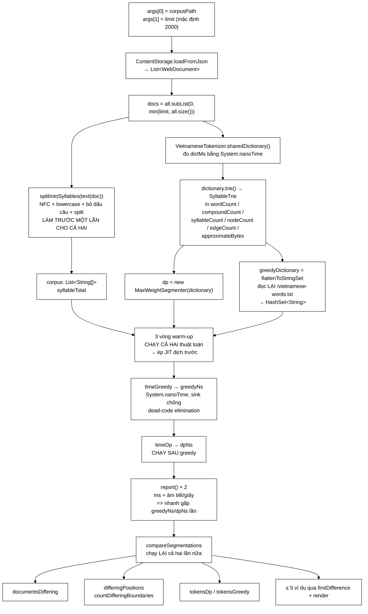

# TokenizerBenchmark — lớp duy nhất biến câu "đổi sang quy hoạch động cho nhanh hơn và đúng hơn" thành hai con số đo được trên corpus thật

**File nguồn:** `search-engine/src/main/java/com/vnsearch/eval/TokenizerBenchmark.java` (294 dòng)
**Gói:** `com.vnsearch.eval` · **Loại:** `public class`, **chỉ có `main` + hàm tĩnh riêng tư**, không trạng thái, không được lớp nào khác gọi (một chương trình chạy tay)
**Vị trí trong sơ đồ:** tầng **BẰNG CHỨNG** — nằm ngoài đường chạy sản phẩm, đứng cạnh `MemoryBreakdown`; nó đo **`MaxWeightSegmenter`** so với một **bản đối chiếu tự cài lại** của thuật toán cũ
**Đọc kèm:** [`../index/MaxWeightSegmenter.md`](../index/MaxWeightSegmenter.md) · [`../index/VietnameseTokenizer.md`](../index/VietnameseTokenizer.md) · [`../index/VietnameseWordDictionary.md`](../index/VietnameseWordDictionary.md) · [`../datastructure/SyllableTrie.md`](../datastructure/SyllableTrie.md) · [`MemoryBreakdown.md`](./MemoryBreakdown.md) · [`SignificanceTest.md`](./SignificanceTest.md)

---

## 📌 Hiểu trong 30 giây

Đồ án này đã thay bộ tách từ tiếng Việt **hai lần trong một lần**: từ điển
154 mục → hơn 185.000 mục có tần suất, **và** Longest Matching tham lam → quy
hoạch động cực đại trọng số. Javadoc của `VietnameseTokenizer` khẳng định hai
thay đổi ấy **phụ thuộc nhau** và cả hai đều cần thiết.

Khẳng định đó, nếu chỉ nằm trong Javadoc, là **một câu văn chứ không phải một
bằng chứng**. Lớp này biến nó thành số, và nó cẩn thận ở đúng chỗ dễ gian lận
nhất: bản đối chiếu tham lam được **cài lại nguyên văn** rồi cho chạy trên
**cùng từ điển mới**, để phép đo tách riêng được phần đóng góp của *thuật toán*
khỏi phần đóng góp của *từ điển*.

Nó trả lời **hai câu hỏi độc lập**, và việc tách rời chúng chính là phần thiết
kế đáng khen nhất của lớp:

```
   HAI CÂU HỎI PHẢI ĐƯỢC TRẢ LỜI RIÊNG

   ┌──────────────────────────────────────────────────────────────┐
   │ ① NHANH HƠN BAO NHIÊU LẦN?                                    │
   │                                                              │
   │   Cả hai thuật toán đều là O(n · MAX_SYLLABLES) = O(n).       │
   │   Độ phức tạp GIỐNG HỆT NHAU. Khác biệt nằm ở HẰNG SỐ:        │
   │                                                              │
   │   tham lam : mỗi âm tiết → tối đa 3 × copyOfRange             │
   │              + 3 × String.join + 3 × HashSet.contains         │
   │              ⇒ CẤP PHÁT trong vòng lặp nóng nhất hệ thống     │
   │                                                              │
   │   QHĐ      : mỗi âm tiết → tối đa 4 bước đi trên trie,        │
   │              mỗi bước là một phép tra bảng băm trên long      │
   │              ⇒ KHÔNG cấp phát gì trong vòng lặp               │
   │                                                              │
   │   Đây là loại chênh lệch mà phân tích tiệm cận KHÔNG THẤY.    │
   │   Chỉ có phép đo mới thấy.                                    │
   ├──────────────────────────────────────────────────────────────┤
   │ ② TÁCH KHÁC ĐI BAO NHIÊU, VÀ KHÁC Ở ĐÂU?                      │
   │                                                              │
   │   Câu này QUAN TRỌNG HƠN câu ①.                               │
   │   Nhanh gấp 4 lần mà cho ra ĐÚNG CÙNG kết quả tách            │
   │   ⇒ đây chỉ là một tối ưu vi mô, không phải đổi thuật toán,   │
   │     và toàn bộ lập luận "nhà hàng xóm" trong Javadoc          │
   │     của MaxWeightSegmenter chỉ là lý thuyết suông.            │
   │                                                              │
   │   Nên lớp này đếm: bao nhiêu tài liệu tách khác nhau,         │
   │   bao nhiêu mốc giới hạn lệch, tổng token hai bên,            │
   │   và IN RA 5 VÍ DỤ ĐỌC ĐƯỢC BẰNG MẮT.                         │
   └──────────────────────────────────────────────────────────────┘

   NẾU CHỈ ĐO ①: báo cáo có một con số đẹp mà không ai kiểm chứng được
                 nó có nghĩa gì về chất lượng tìm kiếm.
   NẾU CHỈ ĐO ②: không biết cái giá phải trả để có chất lượng đó.

   ⇒ Phải có cả hai, và phải để chúng CẠNH NHAU trong cùng một lần chạy
     trên CÙNG một corpus. Đó chính là điều lớp này làm.
```



<details><summary>Xem bản chữ (ASCII)</summary>

```
   args[0] corpusPath ─┐
   args[1] limit ──────┤
                       ▼
             ContentStorage.loadFromJson
                       │
                       ▼
        docs = subList(0, min(limit, size))
                       │
        ┌──────────────┴──────────────┐
        ▼                             ▼
  sharedDictionary()          splitIntoSyllables(text(doc))
  (đo dictMs)                 NFC + lower + bỏ dấu câu + split
        │                             │
        ▼                             ▼
  dictionary.trie()            corpus: List<String[]>
  in 5 chỉ số trie             syllableTotal
        │                             │
   ┌────┴────┐                        │
   ▼         ▼                        │
  dp =    flattenToStringSet          │
  MaxWeight  (đọc lại                 │
  Segmenter  vietnamese-words.txt)    │
   │         │                        │
   └────┬────┴────────────────────────┘
        ▼
   3 VÒNG WARM-UP  (chạy CẢ HAI)
        │
        ▼
   timeGreedy → greedyNs     ← chạy TRƯỚC
        │
        ▼
   timeDp     → dpNs         ← chạy SAU
        │
        ▼
   report × 2  +  "nhanh gấp greedyNs/dpNs lần"
        │
        ▼
   compareSegmentations  (chạy LẠI cả hai)
        ├─ documentsDiffering
        ├─ differingPositions
        ├─ tokensDp / tokensGreedy
        └─ tối đa 5 ví dụ "tham lam -> QHĐ"
```

</details>

---

## Mục lục

- [1. Vì sao bộ tách từ tiếng Việt là chỗ bắt buộc phải đo](#1-vì-sao-bộ-tách-từ-tiếng-việt-là-chỗ-bắt-buộc-phải-đo)
- [2. Bản đối chiếu — vì sao phải cài lại thuật toán cũ thay vì gọi git](#2-bản-đối-chiếu--vì-sao-phải-cài-lại-thuật-toán-cũ-thay-vì-gọi-git)
- [3. Đường đi của một lần chạy, đọc theo mã thật](#3-đường-đi-của-một-lần-chạy-đọc-theo-mã-thật)
- [4. Chuẩn hoá tách khỏi phép đo — quyết định đúng nhất trong lớp](#4-chuẩn-hoá-tách-khỏi-phép-đo--quyết-định-đúng-nhất-trong-lớp)
- [5. Sáu cạm bẫy khi đo hiệu năng trên JVM, và mã này né được mấy](#5-sáu-cạm-bẫy-khi-đo-hiệu-năng-trên-jvm-và-mã-này-né-được-mấy)
- [6. Vì sao đây KHÔNG phải JMH, và sai số nằm chính xác ở đâu](#6-vì-sao-đây-không-phải-jmh-và-sai-số-nằm-chính-xác-ở-đâu)
- [7. Phân tích từng phương thức](#7-phân-tích-từng-phương-thức)
- [8. Phần đo khác biệt kết quả — `compareSegmentations`](#8-phần-đo-khác-biệt-kết-quả--comparesegmentations)
- [9. Đánh đổi bộ nhớ ↔ tốc độ giữa các chiến lược tách từ](#9-đánh-đổi-bộ-nhớ--tốc-độ-giữa-các-chiến-lược-tách-từ)
- [10. Cách đọc kết quả in ra](#10-cách-đọc-kết-quả-in-ra)
- [11. Hướng dẫn về code](#11-hướng-dẫn-về-code)
- [12. Độ phức tạp & chi phí](#12-độ-phức-tạp--chi-phí)
- [13. Kiểm thử liên quan](#13-kiểm-thử-liên-quan)
- [14. Liên kết](#14-liên-kết)

---

## 1. Vì sao bộ tách từ tiếng Việt là chỗ bắt buộc phải đo

### 1.1 Âm tiết không phải là từ — và tiếng Việt viết rời âm tiết

Đây là gốc rễ của toàn bộ vấn đề, và là điều mà một hệ tìm kiếm tiếng Anh
**không bao giờ phải đối mặt**.

```
   TIẾNG ANH:   "search engine"
                 └────┬───┘ └──┬──┘
                   1 từ     1 từ
   Khoảng trắng CHÍNH LÀ ranh giới từ.
   Tokenizer tiếng Anh = split(" ") + vài luật về dấu câu.
   Bài toán KẾT THÚC ở đó.

   TIẾNG VIỆT:  "công cụ tìm kiếm"
                 └─┬─┘└┬┘ └─┬┘└─┬┘
                  âm  âm  âm  âm     ← 4 ÂM TIẾT, viết rời
                 └──────┬──────┘
                      1 TỪ          ← nhưng chỉ là MỘT khái niệm

   Khoảng trắng ngăn cách ÂM TIẾT, KHÔNG ngăn cách TỪ.
   ⇒ Ranh giới từ KHÔNG có mặt trong văn bản. Phải SUY RA.
   ⇒ Suy ra sai thì toàn bộ chỉ mục sai theo, im lặng.
```

```
   ┌──────────────────────────────────────────────────────────────┐
   │  HẬU QUẢ CỦA VIỆC TÁCH SAI LAN RA TOÀN HỆ THỐNG               │
   │                                                              │
   │  Tách sai ở khâu LẬP CHỈ MỤC                                  │
   │      → term sai được ghi vào InvertedIndex                    │
   │      → document frequency sai                                 │
   │      → IDF sai                                                │
   │      → điểm BM25/TF-IDF sai                                   │
   │      → thứ hạng sai                                           │
   │      → MRR đo được thấp, mà KHÔNG BIẾT vì sao thấp            │
   │                                                              │
   │  Và tệ hơn: tách ở khâu TRUY VẤN cũng dùng chính tokenizer    │
   │  đó, nên nếu HAI BÊN tách GIỐNG NHAU CÙNG MỘT KIỂU SAI,       │
   │  hệ thống vẫn "chạy được" và vẫn trả về kết quả.              │
   │  Không có ngoại lệ nào được ném. Không có log nào đỏ.         │
   │                                                              │
   │  ⇒ Đây là loại lỗi chỉ ĐO mới phát hiện được.                 │
   │    Đó là lý do tồn tại của cả lớp này.                        │
   └──────────────────────────────────────────────────────────────┘
```

### 1.2 Ví dụ kinh điển, và vì sao nó không phải trường hợp hiếm

Javadoc của [`MaxWeightSegmenter`](../index/MaxWeightSegmenter.md) đưa ra đúng
ví dụ mà bài test `resolvesAmbiguityThatGreedyLongestMatchingGetsWrong` khoá lại:

```
   "nhà hàng xóm"

   THAM LAM (Longest Matching):
        tại i = 0, thử độ dài 4 → không có
                   thử độ dài 3 → không có
                   thử độ dài 2 → "nhà hàng" CÓ trong từ điển
        → LẤY NGAY, nhảy qua i = 2
        → [nhà_hàng] [xóm]        nghĩa: "quán ăn" + "xóm"     SAI

   QUY HOẠCH ĐỘNG (cực đại trọng số toàn cục):
        [nhà_hàng][xóm]  = 9,59 + 3,46 = 13,05
        [nhà][hàng_xóm]  = 3,69 + 9,44 = 13,13   ← LỚN HƠN
        → [nhà] [hàng_xóm]        nghĩa: "nhà của người hàng xóm"  ĐÚNG

   ĐIỂM MẤU CHỐT — và đây là chỗ hay bị hiểu nhầm:
        CẢ HAI cách tách đều HỢP LỆ VỀ TỪ ĐIỂN.
        Tham lam không có CƠ SỞ nào để phân biệt chúng,
        nên nó buộc phải ĐOÁN bằng một heuristic
        ("dài hơn thì đúng hơn"), và ở đây heuristic đó sai.

        Quy hoạch động KHÔNG ĐOÁN: nó chấm điểm CẢ CÂU
        rồi chọn cấu hình tổng điểm cao nhất.
```

Câu hỏi thực nghiệm mà lớp này trả lời không phải "ví dụ này có tồn tại không"
— nó tồn tại, có bài test rồi. Câu hỏi là:

> **Trên 2.000 tài liệu web tiếng Việt thật, kiểu nhập nhằng ấy xảy ra ở bao
> nhiêu phần trăm tài liệu?**

Nếu con số ấy là 0,3 % thì việc đổi thuật toán là **trang trí học thuật**. Nếu
nó là 40 % thì nó là **sửa lỗi**. Không ai biết trước, và không có cách nào suy
ra từ lý thuyết. Chỉ có `compareSegmentations` trả lời được.

### 1.3 Vì sao phải đo tốc độ, chứ không chỉ đo độ đúng

```
   TOKENIZER NẰM TRÊN ĐƯỜNG NÓNG NHẤT CỦA CẢ HỆ THỐNG.

   Khâu LẬP CHỈ MỤC:  mỗi tài liệu chạy qua tokenizer đúng một lần,
                      nhưng có 5.011 tài liệu × hàng nghìn âm tiết
                      ⇒ hàng chục triệu lượt xử lý âm tiết.

   Khâu TRUY VẤN:     mỗi truy vấn người dùng gõ chạy qua tokenizer.
                      Đây là đường ĐỘ TRỄ, người dùng ngồi chờ.

   Khâu ĐÁNH GIÁ:     EvaluationRunner chạy 13 cấu hình × 200 truy vấn,
                      mỗi cấu hình có thể phải lập chỉ mục lại.
                      Tokenizer chậm gấp đôi ⇒ vòng lặp thí nghiệm
                      chậm gấp đôi ⇒ ÍT THÍ NGHIỆM HƠN được chạy
                      trong cùng thời gian làm đồ án.

   ⇒ Tốc độ tokenizer không phải chỉ số phù phiếm.
     Nó quyết định BAO NHIÊU CÂU HỎI ta kịp trả lời.
```

---

## 2. Bản đối chiếu — vì sao phải cài lại thuật toán cũ thay vì gọi git

Đây là quyết định thiết kế **tinh tế nhất** của lớp, và Javadoc nói thẳng ra:

> **Bản đối chiếu là gì.** Muốn so sánh thì phải còn giữ được thuật toán cũ.
> `segmentGreedy` ở dưới là bản cài lại **nguyên văn** Longest Matching tham lam
> như `VietnameseTokenizer` trước đây, nhưng chạy trên **cùng từ điển mới**.
> Đó là cố ý: nếu để bản cũ dùng từ điển 154 mục thì phép đo sẽ trộn lẫn hai
> thay đổi, và ta sẽ không biết phần cải thiện đến từ từ điển lớn hay từ thuật toán.

### 2.1 Vấn đề "hai biến đổi cùng lúc"

```
   ┌──────────────────────────────────────────────────────────────┐
   │  THÍ NGHIỆM SAI (cách hầu hết đồ án làm)                      │
   │                                                              │
   │     BẢN CŨ  = thuật toán tham lam  +  từ điển 154 mục         │
   │     BẢN MỚI = quy hoạch động       +  từ điển 185.000 mục     │
   │                ────────┬────────      ────────┬────────      │
   │                    ĐỔI BIẾN 1            ĐỔI BIẾN 2          │
   │                                                              │
   │     Kết quả: "bản mới tốt hơn X %".                          │
   │     Câu hỏi không trả lời được: X đến từ ĐÂU?                │
   │                                                              │
   │     Và câu hỏi ấy QUAN TRỌNG, vì hai câu trả lời dẫn tới     │
   │     hai kết luận trái ngược về việc nên đầu tư tiếp vào đâu: │
   │        "do từ điển"   → đi tìm từ điển lớn hơn nữa            │
   │        "do thuật toán"→ đi tinh chỉnh hàm trọng số           │
   ├──────────────────────────────────────────────────────────────┤
   │  THÍ NGHIỆM ĐÚNG (cách lớp này làm)                           │
   │                                                              │
   │     ĐỐI CHIẾU = thuật toán tham lam  +  từ điển 185.000 mục   │
   │     BẢN MỚI   = quy hoạch động       +  từ điển 185.000 mục   │
   │                                          ───────┬───────      │
   │                                          GIỮ NGUYÊN           │
   │                                                              │
   │     ⇒ Mọi chênh lệch đo được thuộc về ĐÚNG MỘT nguyên nhân:   │
   │       thuật toán. Đây là ABLATION đúng nghĩa.                 │
   └──────────────────────────────────────────────────────────────┘
```

Đây chính là tinh thần **ablation study** mà `EvaluationRunner` áp dụng cho các
mô hình xếp hạng, được mang sang tầng tokenizer. Việc cùng một nguyên tắc xuất
hiện ở hai chỗ độc lập trong repo là dấu hiệu tốt: nó cho thấy nguyên tắc được
*hiểu*, không phải được *chép*.

### 2.2 Vì sao không dùng `git checkout` bản cũ

```
   BA CÁCH GIỮ BẢN ĐỐI CHIẾU, VÀ VÌ SAO HAI CÁCH ĐẦU HỎNG

   ① git checkout commit cũ rồi chạy lại
        ✘ Bản cũ dùng TỪ ĐIỂN CŨ — chính là thứ ta cần khống chế.
        ✘ Hai lần chạy ở HAI TIẾN TRÌNH JVM khác nhau, hai trạng
          thái máy khác nhau. Không so sánh trực tiếp được.
        ✘ Không thể so kết quả TÁCH theo từng tài liệu, vì hai bên
          không cùng chạy trên cùng mảng âm tiết trong bộ nhớ.

   ② Giữ lớp cũ trong repo, đánh dấu @Deprecated
        ✘ Mã chết nằm trong src/main, đi vào jar sản phẩm.
        ✘ Ai đó sẽ vô tình gọi nó.
        ✘ Nó phải được bảo trì (compile được) mãi mãi.

   ③ CÀI LẠI 23 DÒNG NGAY TRONG LỚP BENCHMARK   ← CÁCH NÀY
        ✔ Cùng tiến trình, cùng JVM, cùng heap, cùng corpus
          đã chuẩn hoá — so sánh cặp đôi theo đúng nghĩa.
        ✔ Nằm trong com.vnsearch.eval, không dính src sản phẩm.
        ✔ Đọc được bằng mắt: người phản biện KIỂM TRA ĐƯỢC
          bản đối chiếu có trung thực không, ngay tại chỗ.
        ✘ Rủi ro: bản cài lại có thể KHÔNG giống bản cũ thật.
          Đây là rủi ro có thật và mục 14 tính điểm cho nó.
```

### 2.3 Trung thực đến mức giữ nguyên chỗ kém hiệu quả

```java
/**
 * Longest Matching tham lam — ban cai lai nguyen van thuat toan cu cua
 * {@code VietnameseTokenizer}, ke ca phan tao mang tam va chuoi moi tai moi vi tri.
 * Giu nguyen ca cho kem hieu qua vi day chinh la thu can do.
 */
static int[] segmentGreedy(String[] syllables, Set<String> dictionary) {
```

```
   CÁM DỖ RẤT LỚN Ở ĐÂY:
        "String.join trong vòng lặp nóng à? Để tôi dùng StringBuilder
         tái sử dụng cho nhanh, dù sao cũng là cùng thuật toán mà."

   VÌ SAO LÀM THẾ LÀ PHÁ HỎNG PHÉP ĐO:
        Cái đang đo KHÔNG PHẢI "ý tưởng tham lam so với ý tưởng QHĐ".
        Cái đang đo là "MÃ CŨ THẬT so với MÃ MỚI THẬT".

        Phần cấp phát ba mảng tạm và ba chuỗi mới tại mỗi âm tiết
        KHÔNG PHẢI là lỗi cài đặt vô tình của bản cũ — nó là HỆ QUẢ
        TRỰC TIẾP của việc dùng HashSet<String> làm cấu trúc tra cứu.
        HashSet chỉ trả lời được "chuỗi này có trong tập không",
        nên BẮT BUỘC phải dựng chuỗi ứng viên trước khi hỏi.

        Đó chính là ĐIỂM YẾU CẤU TRÚC mà SyllableTrie giải quyết,
        và vì thế nó PHẢI nằm trong phép đo.

   ⇒ Dòng Javadoc "giu nguyen ca cho kem hieu qua vi day chinh la
     thu can do" là một câu đáng giá. Nó chặn trước đúng cám dỗ đó,
     cho người bảo trì sau này.
```

### 2.4 Nhưng bản đối chiếu KHÔNG hoàn toàn dùng "cùng từ điển" — một sai lệch thật

Đây là chỗ mã **không hoàn toàn đúng như Javadoc khẳng định**, và nó cần được
nói thẳng.

```java
private static Set<String> flattenToStringSet(VietnameseWordDictionary dictionary) {
    Set<String> words = new HashSet<>();
    // Trie khong cho duyet nguoc tu nut ve chuoi, nen doc lai chinh file tu dien.
    try (java.io.InputStream is =
                 TokenizerBenchmark.class.getResourceAsStream("/vietnamese-words.txt");
         ...
```

Trong khi đó `VietnameseWordDictionary` nạp **hai** tài nguyên:

```java
private static final String WORDS_RESOURCE = "/vietnamese-words.txt";
private static final String CURATED_RESOURCE = "/vietnamese-bigrams.txt";
```

```
   ┌──────────────────────────────────────────────────────────────┐
   │  BA SAI LỆCH GIỮA HAI "TỪ ĐIỂN"                               │
   │                                                              │
   │  ① THIẾU FILE THỦ CÔNG                                        │
   │     Trie có cả vietnamese-bigrams.txt (154 mục thủ công,      │
   │     theo miền công nghệ/tìm kiếm: "công cụ tìm kiếm",         │
   │     "an toàn thông tin"...). HashSet của bản tham lam         │
   │     KHÔNG CÓ chúng.                                           │
   │                                                              │
   │     ⚠ Đúng 154 mục ấy lại là những cụm ĐẶC THÙ ĐỀ TÀI,        │
   │       tức là những cụm XUẤT HIỆN NHIỀU trong corpus.          │
   │       Sai lệch này KHÔNG ngẫu nhiên — nó thiên vị.            │
   │                                                              │
   │  ② KHÔNG CHUẨN HOÁ                                            │
   │     addWord() gọi normalize(): trim + NFC + lowercase(vi).    │
   │     flattenToStringSet chỉ lấy line.substring(0, tab) THÔ.    │
   │     Mục nào trong file ở dạng NFD hoặc có chữ hoa sẽ vào      │
   │     trie ở dạng chuẩn hoá nhưng vào HashSet ở dạng thô        │
   │     ⇒ bản tham lam KHÔNG TRA ĐƯỢC chúng.                      │
   │                                                              │
   │  ③ KHÔNG LỌC ĐỘ DÀI                                           │
   │     addWord() bỏ mọi từ quá MAX_SYLLABLES = 4 âm tiết.        │
   │     flattenToStringSet nạp hết.                               │
   │     ⚠ Vô hại về KẾT QUẢ (segmentGreedy chỉ hỏi tới độ dài 4   │
   │       nên không bao giờ chạm tới các mục dài hơn),            │
   │       nhưng vẫn tốn bộ nhớ và làm HashSet lớn hơn cần thiết.  │
   └──────────────────────────────────────────────────────────────┘

   HƯỚNG SAI LỆCH: cả ① và ② đều làm từ điển của bản THAM LAM
   NHỎ HƠN từ điển của bản QHĐ.

   HỆ QUẢ KÉP, VÀ HAI HỆ QUẢ NGƯỢC CHIỀU NHAU:
        Về TỐC ĐỘ: từ điển nhỏ hơn → ít khớp hơn → tham lam vẫn
             phải dựng đủ chuỗi ứng viên → thời gian gần như KHÔNG
             đổi. Ảnh hưởng lên con số "nhanh gấp mấy lần": nhỏ.

        Về KHÁC BIỆT KẾT QUẢ: từ điển nhỏ hơn → tham lam ghép được
             ÍT từ ghép hơn → differingPositions bị THỔI PHỒNG,
             và một phần của "khác biệt" bị quy nhầm cho THUẬT TOÁN
             trong khi thực ra nó đến từ TỪ ĐIỂN.

        ⇒ Đúng cái lỗi trộn hai biến mà mục 2.1 dựng ra để tránh,
          quay lại qua cửa sau.

   Đây là khiếm khuyết NGHIÊM TRỌNG NHẤT của lớp. Xem đề xuất 1.
```

---

## 3. Đường đi của một lần chạy, đọc theo mã thật

### 3.1 Tham số dòng lệnh

```java
String corpusPath = args.length > 0 ? args[0] : "data/crawled-documents.json";
int limit = args.length > 1 ? Integer.parseInt(args[1]) : 2000;
```

Javadoc lớp ghi luôn lệnh chạy:

```
./mvnw.cmd exec:java -Dexec.mainClass=com.vnsearch.eval.TokenizerBenchmark \
     -Dexec.args="data/crawled-documents.json 2000"
```

```
   HAI THAM SỐ, CẢ HAI ĐỀU CÓ MẶC ĐỊNH ⇒ chạy trần cũng ra kết quả.
   Đây là lựa chọn đúng cho một công cụ chạy tay:
   rào cản để chạy lần đầu bằng KHÔNG.

   ⚠ limit = 2000 nhưng corpus thật có 5.011 trang.
     Mặc định chỉ dùng ~40 % dữ liệu. Không có gì trong đầu ra
     nhắc rằng con số đó có thể tăng — chỉ dòng "Dung %d / %d
     tai lieu" ngầm tiết lộ.

   ⚠ Integer.parseInt(args[1]) không bọc try/catch: gõ nhầm
     "2ooo" cho NumberFormatException với stack trace thô.
     Chấp nhận được cho công cụ nội bộ, không chấp nhận được
     nếu ai đó đưa nó vào CI.
```

### 3.2 Nạp corpus và cắt

```java
List<WebDocument> all = ContentStorage.loadFromJson(corpusPath);
List<WebDocument> docs = all.subList(0, Math.min(limit, all.size()));
```

`Math.min(limit, all.size())` là chi tiết nhỏ nhưng đúng: `subList` sẽ ném
`IndexOutOfBoundsException` nếu `limit` vượt kích thước, và người chạy sẽ không
hiểu vì sao. `subList` cũng là **view**, không sao chép — không tốn thêm bộ nhớ
cho danh sách con.

### 3.3 Đo thời gian nạp từ điển, và một sự thật ngầm

```java
long dictStart = System.nanoTime();
VietnameseWordDictionary dictionary = VietnameseTokenizer.sharedDictionary();
long dictMs = (System.nanoTime() - dictStart) / 1_000_000;
SyllableTrie trie = dictionary.trie();
```

```
   sharedDictionary() dùng LAZY HOLDER IDIOM:

        private static final class DictionaryHolder {
            static final VietnameseWordDictionary INSTANCE =
                    new VietnameseWordDictionary();
        }

   ⇒ Lớp DictionaryHolder chỉ được khởi tạo ĐÚNG LÚC ai đó
     đọc INSTANCE lần đầu. Ở đây, benchmark chính là người
     đọc đầu tiên trong tiến trình.

   ⇒ Nên dictMs ĐÚNG LÀ thời gian nạp thật (đọc 185.000 dòng,
     parse tần suất, tính trọng số, chèn vào trie).

   ⚠ NHƯNG ĐIỀU NÀY MONG MANH: nếu ai đó thêm một dòng
     `new VietnameseTokenizer()` ở phía TRÊN trong main
     (chẳng hạn để in name()), thì từ điển đã được nạp rồi,
     và dictMs sẽ in ra ~0 ms — một con số SAI mà không có
     gì báo động.

     Nhãn "(mot lan cho ca tien trinh)" trong dòng in ra là
     lời nhắc đúng, nhưng nó không phải một RÀNG BUỘC.
```

Năm chỉ số trie được in ngay sau đó, tất cả đều là API thật của `SyllableTrie`:

```java
System.out.printf("  so tu           : %,d (%,d tu ghep)%n",
        dictionary.wordCount(), dictionary.compoundCount());
System.out.printf("  am tiet phan biet: %,d%n", trie.syllableCount());
System.out.printf("  nut trie / canh : %,d / %,d%n", trie.nodeCount(), trie.edgeCount());
System.out.printf("  bo nho mang phang: %,d KB%n", trie.approximateBytes() / 1024);
```

```
   VÌ SAO IN CẢ NĂM CHỈ SỐ NÀY TRƯỚC KHI ĐO TỐC ĐỘ:

   Chúng là NGỮ CẢNH bắt buộc để con số tốc độ có nghĩa.

        "QHĐ nhanh gấp 4 lần"     ← vô nghĩa nếu đứng một mình
        "QHĐ nhanh gấp 4 lần, trên từ điển 185.000 mục,
         trie 320.000 nút, chiếm 12 MB mảng phẳng"
                                  ← TÁI LẬP ĐƯỢC, PHẢN BIỆN ĐƯỢC

   Và approximateBytes() nối thẳng sang câu chuyện mục 9:
   tốc độ ấy MUA BẰNG bộ nhớ, và đây là hoá đơn.
```

### 3.4 Dựng corpus âm tiết

```java
List<String[]> corpus = new ArrayList<>(docs.size());
long syllableTotal = 0;
for (WebDocument doc : docs) {
    String[] syllables = splitIntoSyllables(text(doc));
    if (syllables.length > 0) {
        corpus.add(syllables);
        syllableTotal += syllables.length;
    }
}
```

```
   BỐN CHI TIẾT ĐÚNG TRONG TÁM DÒNG:

   ① new ArrayList<>(docs.size()) — cấp phát sẵn đúng sức chứa,
      không có lần nào phải grow + copy. Nhỏ, nhưng đúng.

   ② Lọc syllables.length > 0 — tài liệu rỗng bị loại KHỎI corpus,
      nên corpus.size() ở phần thống kê là MẪU SỐ ĐÚNG.
      Nếu giữ chúng lại, tỷ lệ "tài liệu tách khác nhau" sẽ bị
      pha loãng bởi những tài liệu mà HAI thuật toán đều
      không có gì để làm.

   ③ syllableTotal là long, không phải int.
      2.000 tài liệu × vài nghìn âm tiết còn xa giới hạn int,
      nhưng nếu ai đó chạy với limit = 5011 và corpus lớn hơn,
      int sẽ tràn ÂM THẦM và con số "âm tiết/giây" thành vô nghĩa.

   ④ text(doc) gộp title + " " + body:
        private static String text(WebDocument doc) {
            String title = doc.getTitle() == null ? "" : doc.getTitle();
            String body = doc.getBodyText() == null ? "" : doc.getBodyText();
            return title + " " + body;
        }
      Hai phép null-check, vì corpus crawl thật CÓ tài liệu
      thiếu title. Không có chúng thì benchmark chết giữa chừng
      ở tài liệu thứ vài trăm.
```

---

## 4. Chuẩn hoá tách khỏi phép đo — quyết định đúng nhất trong lớp

```java
// Chuan hoa truoc mot lan cho ca hai ben, de phep do chi con lai phan GHEP TU
// chu khong lan thoi gian chuan hoa Unicode va bo dau cau.
```

### 4.1 Vì sao đây là quyết định quan trọng

```
   ĐƯỜNG XỬ LÝ ĐẦY ĐỦ CỦA VietnameseTokenizer.tokenize():

     ① Normalizer.normalize(text, NFC)          ← ĐẮT
     ② toLowerCase(Locale "vi")                 ← ĐẮT
     ③ NON_WORD.matcher(...).replaceAll(" ")    ← ĐẮT (regex)
     ④ WHITESPACE_RUN.matcher(...).replaceAll   ← ĐẮT (regex)
     ⑤ split(" ")                               ← ĐẮT (cấp phát mảng)
     ─────────────────────────────────────────
     ⑥ segmenter.segment(syllables)             ← THỨ CẦN ĐO
     ─────────────────────────────────────────
     ⑦ joinWithUnderscore + stripDiacritics     ← ĐẮT

   BƯỚC ① → ⑤ GIỐNG HỆT NHAU ở cả hai thuật toán.
   Chúng là CHI PHÍ CHUNG, không phân biệt được hai bên.

   ┌──────────────────────────────────────────────────────────────┐
   │  NẾU ĐO CẢ ĐƯỜNG:                                             │
   │                                                              │
   │     giả sử ①–⑤ tốn 100 đơn vị, ⑥ tốn 40 (tham lam)            │
   │     hoặc 10 (QHĐ):                                            │
   │                                                              │
   │        tham lam : 100 + 40 = 140                              │
   │        QHĐ      : 100 + 10 = 110                              │
   │        "nhanh gấp 1,27 lần"                                   │
   │                                                              │
   │     TỶ SỐ THẬT của phần khác nhau là 40/10 = 4 LẦN.           │
   │     Chi phí chung PHA LOÃNG nó xuống còn 1,27.                │
   │                                                              │
   │  ⇒ Đo cả đường KHÔNG SAI, nhưng nó trả lời một câu hỏi        │
   │    KHÁC ("tokenize toàn bộ nhanh hơn bao nhiêu") và           │
   │    nó CHE MẤT hiệu ứng của chính thứ đang được thay đổi.      │
   └──────────────────────────────────────────────────────────────┘

   Cách của lớp này: chạy ①–⑤ MỘT LẦN, cất kết quả vào
   List<String[]> corpus, rồi CHỈ đo ⑥. Định luật Amdahl được
   tôn trọng đúng chỗ: cô lập phần thay đổi để thấy hệ số thật.
```

### 4.2 Nhưng phải nói rõ cái giá — và mã KHÔNG nói

```
   ⚠ CON SỐ "nhanh gap N lan" LÀ TỶ SỐ CỦA MỘT GIAI ĐOẠN,
     KHÔNG PHẢI TỶ SỐ CỦA HỆ THỐNG.

   Nếu giai đoạn ghép từ chỉ chiếm 25 % thời gian tokenize,
   thì "nhanh gấp 4 lần ở giai đoạn đó" chỉ làm cả tokenize
   nhanh lên  1 / (0,75 + 0,25/4) = 1,23 lần.

   Và tokenize lại chỉ là một phần của lập chỉ mục, vốn còn
   phải nén posting list, ghi ra đĩa, tính PageRank...

   ⇒ Dòng in ra "=> nhanh gap %.2f lan" KHÔNG kèm cảnh báo này,
     và đó là chỗ một người đọc báo cáo rất dễ trích dẫn quá đà:
     viết "tokenizer mới nhanh gấp 4 lần" trong khi con số ấy
     chỉ đúng cho MỘT GIAI ĐOẠN đã được cô lập có chủ ý.

   Cách sửa rẻ: in thêm một dòng đo CẢ tokenize() đầu-cuối
   để đặt hai con số cạnh nhau. Xem đề xuất 4.
```

### 4.3 Một bản sao chuẩn hoá thứ hai — và rủi ro trôi dạt

```java
/** Cung buoc chuan hoa nhu {@code VietnameseTokenizer}, tach ra de do rieng. */
private static String[] splitIntoSyllables(String text) {
    String nfc = java.text.Normalizer.normalize(text, java.text.Normalizer.Form.NFC)
            .toLowerCase(java.util.Locale.forLanguageTag("vi"));
    String cleaned = nfc.replaceAll("[^\\p{L}\\p{N}\\s]", " ").replaceAll("\\s+", " ").trim();
    return cleaned.isEmpty() ? new String[0] : cleaned.split(" ");
}
```

Đối chiếu với bản thật trong `VietnameseTokenizer`:

```java
private static final Pattern NON_WORD = Pattern.compile("[^\\p{L}\\p{N}\\s]");
private static final Pattern WHITESPACE_RUN = Pattern.compile("\\s+");

private static String[] splitIntoSyllables(String text) {
    String nfc = Normalizer.normalize(text, Normalizer.Form.NFC).toLowerCase(Locale.forLanguageTag("vi"));
    String cleaned = WHITESPACE_RUN.matcher(NON_WORD.matcher(nfc).replaceAll(" "))
            .replaceAll(" ").trim();
    ...
}
```

```
   ┌──────────────────────────────────────────────────────────────┐
   │  HAI KHÁC BIỆT, MỘT VÔ HẠI VÀ MỘT LÀ NỢ KỸ THUẬT              │
   │                                                              │
   │  VÔ HẠI: benchmark dùng String.replaceAll (biên dịch lại      │
   │  regex mỗi lần) thay vì Pattern biên dịch sẵn. Ở đây nó       │
   │  chạy 2.000 lần NGOÀI vùng đo, nên hoàn toàn không ảnh        │
   │  hưởng con số. Bản sản phẩm biên dịch sẵn vì nó chạy          │
   │  hàng triệu lần TRONG đường nóng. Cả hai lựa chọn đều đúng    │
   │  cho ngữ cảnh của mình.                                       │
   │                                                              │
   │  NỢ KỸ THUẬT: MẪU REGEX BỊ CHÉP HAI BẢN.                      │
   │  Nếu ai đó sửa NON_WORD trong VietnameseTokenizer (ví dụ      │
   │  giữ lại dấu gạch nối), benchmark VẪN BIÊN DỊCH, VẪN CHẠY,    │
   │  VẪN RA SỐ — nhưng nó đang đo trên một dòng âm tiết KHÁC      │
   │  với dòng mà hệ thống thật nhìn thấy.                         │
   │                                                              │
   │  Không có test nào khoá hai bản này lại với nhau.             │
   │  Xem đề xuất 3.                                              │
   └──────────────────────────────────────────────────────────────┘
```

---

## 5. Sáu cạm bẫy khi đo hiệu năng trên JVM, và mã này né được mấy

```java
// Ham nong can duoc JIT dich truoc, khong thi phep do chi do thoi gian
// thong dich cua vai nghin luot goi dau tien.
for (int warmup = 0; warmup < 3; warmup++) {
    for (String[] syllables : corpus) {
        dp.segment(syllables);
        segmentGreedy(syllables, greedyDictionary);
    }
}
```

### 5.1 Cạm bẫy 1 — JIT warm-up ✔ có xử lý, ✘ không kiểm chứng

```
   JVM CHẠY MÃ QUA BỐN TẦNG, KHÔNG PHẢI MỘT:

     tầng 0  thông dịch bytecode         ~1×      (chậm nhất)
     tầng 1  C1 không hồ sơ              ~5–10×
     tầng 3  C1 CÓ hồ sơ                 ~3–5×    (chậm hơn tầng 1
                                                   vì phải ghi hồ sơ)
     tầng 4  C2, tối ưu đầy đủ           ~20–50×  (nhanh nhất)

   NGƯỠNG LÊN TẦNG 4 mặc định: ~10.000 lượt gọi hoặc vòng lặp
   (Tier4InvocationThreshold / Tier4BackEdgeThreshold).

   ┌──────────────────────────────────────────────────────────────┐
   │ NẾU KHÔNG WARM-UP:                                            │
   │   2.000 tài liệu × 1 lời gọi = 2.000 lượt gọi segment()       │
   │   ⇒ CHƯA CHẠM ngưỡng tầng 4 ở mức lời gọi.                    │
   │   ⇒ Một phần lớn phép đo là thời gian THÔNG DỊCH.             │
   │   ⇒ Con số ra có thể sai LỆCH VÀI CHỤC LẦN.                   │
   ├──────────────────────────────────────────────────────────────┤
   │ VỚI 3 VÒNG WARM-UP:                                           │
   │   3 × 2.000 = 6.000 lượt gọi phương thức                      │
   │   ⇒ vẫn DƯỚI 10.000 ở mức LỜI GỌI.                            │
   │                                                              │
   │   NHƯNG vòng lặp bên trong segment() chạy trên mỗi âm tiết:   │
   │   3 vòng × ~2 triệu âm tiết = ~6 triệu lần lặp                │
   │   ⇒ ngưỡng BACK-EDGE bị vượt rất xa, và OSR (on-stack         │
   │     replacement) sẽ đẩy chính thân vòng lặp lên C2.           │
   │                                                              │
   │   ⇒ THỰC TẾ: phần nóng nhất ĐÃ được biên dịch. Ổn.            │
   │   ⚠ NHƯNG ĐÓ LÀ SUY LUẬN, KHÔNG PHẢI KIỂM CHỨNG.              │
   │     Mã không in gì, không kiểm tra gì, không có tiêu chí      │
   │     dừng nào. Con số 3 là một hằng số MAGIC không giải thích. │
   └──────────────────────────────────────────────────────────────┘

   CÁCH LÀM ĐÚNG (JMH làm): lặp warm-up cho tới khi thời gian
   giữa các lần lặp liên tiếp ỔN ĐỊNH trong ngưỡng %, rồi mới đo.
   Ở đây: chạy đúng 3 lần rồi tin là đủ.

   Cách kiểm chứng rẻ nhất mà không cần JMH:
        chạy lại với -XX:+PrintCompilation và xác nhận
        segment / segmentGreedy đã lên tầng 4 TRƯỚC vùng đo,
        hoặc đơn giản là in thời gian TỪNG vòng warm-up.
        Xem đề xuất 2.
```

### 5.2 Cạm bẫy 2 — dead-code elimination ✔ có xử lý

```java
private static long timeDp(List<String[]> corpus, MaxWeightSegmenter dp) {
    long start = System.nanoTime();
    long sink = 0;
    for (String[] syllables : corpus) {
        sink += dp.segment(syllables).length;
    }
    long elapsed = System.nanoTime() - start;
    if (sink < 0) {
        throw new IllegalStateException(); // giu ket qua khoi bi JIT loai bo
    }
    return elapsed;
}
```

```
   VẤN ĐỀ: C2 loại bỏ mã mà KẾT QUẢ KHÔNG AI DÙNG.

        for (String[] s : corpus) {
            dp.segment(s);          // kết quả vứt đi
        }
        ⇒ C2 CÓ THỂ chứng minh cả vòng lặp vô tác dụng
          và xoá sạch. Benchmark in ra "0,0 ms" và
          "vô hạn âm tiết/giây". Đây là lỗi kinh điển,
          và nó trông giống một kết quả TUYỆT VỜI.

   CÁCH CHỐNG Ở ĐÂY:
        cộng .length vào `sink`, rồi sau khi DỪNG ĐỒNG HỒ mới
        kiểm tra `sink < 0`. C2 không chứng minh được nhánh
        throw là không thể đạt tới, nên phải giữ lại phép tính.

   ┌──────────────────────────────────────────────────────────────┐
   │  BA ĐIỂM ĐÁNG KHEN Ở BỐN DÒNG NÀY                             │
   │                                                              │
   │  ① Kiểm tra sink nằm SAU khi tính elapsed                     │
   │    ⇒ chi phí của chính phép kiểm tra không lọt vào phép đo.   │
   │                                                              │
   │  ② Điều kiện `sink < 0` KHÔNG BAO GIỜ đúng (tổng các          │
   │    .length luôn ≥ 0), nên nhánh throw không bao giờ chạy —    │
   │    nhưng JIT không chứng minh được điều đó.                   │
   │    Đây là "blackhole của người nghèo", và nó đúng.            │
   │                                                              │
   │  ③ timeGreedy có CẤU TRÚC GIỐNG HỆT. Hai hàm đo là bản        │
   │    sao đối xứng của nhau, khác đúng một lời gọi. Nếu chúng    │
   │    khác cấu trúc thì bản thân sự khác biệt đó đã là một       │
   │    biến gây nhiễu.                                            │
   └──────────────────────────────────────────────────────────────┘

   ⚠ Thật ra ở ĐÂY, dead-code elimination khó xảy ra kể cả không
     có sink: dp.segment() CẤP PHÁT mảng best/trace và trả về mảng
     mới, còn segmentGreedy cấp phát ArrayList và nhiều chuỗi —
     đó là những tác dụng phụ mà C2 khó loại bỏ hoàn toàn
     (escape analysis có thể làm được một phần, nhưng không phải
     toàn bộ). Nghĩa là biện pháp này là PHÒNG THỦ ĐÚNG hơn là
     THIẾT YẾU. Viết nó vẫn đúng: nó miễn nhiễm với việc ai đó
     sau này tối ưu segment() thành không cấp phát.
```

### 5.3 Cạm bẫy 3 — `System.nanoTime()` đo cái gì

```
   ┌──────────────────────────────────────────────────────────────┐
   │  System.nanoTime() ĐÚNG LÀ LỰA CHỌN ĐÚNG, VÌ:                 │
   │    ✔ ĐƠN ĐIỆU TĂNG — không bị nhảy lùi khi NTP chỉnh giờ.     │
   │      System.currentTimeMillis() KHÔNG có bảo đảm này và       │
   │      có thể cho ra elapsed ÂM.                                │
   │    ✔ Độ phân giải nano trên mọi nền hiện đại (thực tế         │
   │      thường ~20–100 ns trên Windows, ~25 ns trên Linux).      │
   │    ✔ Chi phí gọi ~20–30 ns, và ở đây nó chỉ được gọi          │
   │      HAI LẦN cho cả một vòng lặp hàng triệu phép tính         │
   │      ⇒ hoàn toàn không đáng kể.                               │
   ├──────────────────────────────────────────────────────────────┤
   │  NHƯNG NÓ ĐO WALL-CLOCK, KHÔNG PHẢI CPU-TIME.                 │
   │                                                              │
   │  Nghĩa là mọi thứ sau đây LỌT VÀO phép đo:                    │
   │    • hệ điều hành cắt luồng đi làm việc khác                  │
   │    • luồng GC chạy song song và tranh CPU                     │
   │    • trình duyệt / IDE / antivirus của người chạy             │
   │    • CPU giảm xung do nhiệt, hoặc tăng turbo rồi tụt          │
   │    • máy ảo / container bị throttle                           │
   │                                                              │
   │  Trên Windows với người dùng đang mở IDE — tức đúng môi       │
   │  trường của repo này — biến động vài chục phần trăm giữa      │
   │  hai lần chạy là BÌNH THƯỜNG.                                 │
   └──────────────────────────────────────────────────────────────┘

   ⇒ HỆ QUẢ TRỰC TIẾP: tỷ số "nhanh gấp 4,17 lần" in ra hai chữ số
     thập phân là ĐỘ CHÍNH XÁC GIẢ. Chữ số thứ hai gần như chắc
     chắn là nhiễu. Con số trung thực phải là "khoảng 4 lần".
```

### 5.4 Cạm bẫy 4 — GC ✘ không xử lý, và đây là cạm bẫy nghiêm trọng nhất

```
   ĐÂY LÀ ĐIỂM YẾU LỚN NHẤT CỦA PHÉP ĐO, VÀ NÓ KHÔNG NGẪU NHIÊN
   — NÓ THIÊN VỊ THEO MỘT HƯỚNG XÁC ĐỊNH.

   segmentGreedy CẤP PHÁT KHỦNG KHIẾP. Tại MỖI âm tiết,
   vòng for (len = maxLen; len >= 2; len--) chạy tối đa 3 lượt,
   mỗi lượt:
        Arrays.copyOfRange(syllables, i, i + len)  → 1 mảng String[]
        String.join(" ", ...)                     → 1 StringBuilder
                                                    + 1 mảng ký tự
                                                    + 1 String

   Ước lượng thô (KHÔNG đo, chỉ tính đầu ngón tay):
        ~3 mảng + ~3 chuỗi mỗi âm tiết, trung bình vài trăm byte
        × ~2 triệu âm tiết × 4 lượt (3 warm-up + 1 đo)
        ⇒ HÀNG GIGABYTE rác được sinh ra và thu hồi.

   MaxWeightSegmenter cấp phát ĐÚNG BA mảng mỗi TÀI LIỆU
   (best, trace, boundaries) và KHÔNG CẤP PHÁT GÌ trong vòng lặp
   âm tiết — Javadoc của nó nói rõ điều này.

   ┌──────────────────────────────────────────────────────────────┐
   │  HAI HỆ QUẢ, VÀ CHÚNG NGƯỢC CHIỀU NHAU                        │
   │                                                              │
   │  ① Áp lực GC LÀ MỘT PHẦN CHI PHÍ THẬT của thuật toán tham     │
   │     lam. Đưa nó vào phép đo là ĐÚNG — người dùng thật cũng    │
   │     phải trả cái giá đó.                                      │
   │                                                              │
   │  ② NHƯNG GC là BẤT ĐỒNG BỘ. Rác do greedy sinh ra trong       │
   │     vòng warm-up hoặc trong timeGreedy có thể được thu hồi    │
   │     bởi một chu kỳ GC rơi vào GIỮA timeDp — và khi đó         │
   │     thời gian dọn rác CỦA GREEDY bị TÍNH VÀO CHO DP.          │
   │                                                              │
   │     Thứ tự trong mã: timeGreedy chạy TRƯỚC, timeDp chạy SAU.  │
   │                                                              │
   │        long greedyNs = timeGreedy(corpus, greedyDictionary);  │
   │        long dpNs = timeDp(corpus, dp);                        │
   │                                                              │
   │     ⇒ Thiên vị theo hướng LÀM DP TRÔNG CHẬM HƠN THỰC TẾ,      │
   │       tức là con số "nhanh gấp N lần" bị ĐÁNH GIÁ THẤP.       │
   │                                                              │
   │     Đây là hướng thiên vị "an toàn" cho một tuyên bố cải      │
   │     tiến (nó không thổi phồng kết quả), nhưng nó vẫn là       │
   │     thiên vị, và không có gì trong đầu ra nói về nó.          │
   └──────────────────────────────────────────────────────────────┘

   BA CÁCH KHẮC PHỤC, TỪ RẺ ĐẾN ĐẮT:
     ① Gọi System.gc() + ngủ ngắn GIỮA hai phép đo (gợi ý,
        không bảo đảm, nhưng rẻ và thường hiệu quả).
     ② ĐỔI THỨ TỰ và chạy cả hai chiều, báo cả hai con số.
        Nếu tỷ số đổi nhiều thì GC đang chi phối.
     ③ Đo thêm bằng ManagementFactory.getGarbageCollectorMXBeans()
        để tách bạch thời gian GC — vừa khử nhiễu, vừa BIẾN
        áp lực GC thành một CON SỐ ĐƯỢC BÁO CÁO, tức là biến
        điểm yếu thành bằng chứng. Xem đề xuất 2.
```

### 5.5 Cạm bẫy 5 — chỉ đo một lần, không có phương sai ✘ không xử lý

```
   ┌──────────────────────────────────────────────────────────────┐
   │  MỖI THUẬT TOÁN ĐƯỢC ĐO ĐÚNG MỘT LẦN.                         │
   │                                                              │
   │     long greedyNs = timeGreedy(corpus, greedyDictionary);     │
   │     long dpNs = timeDp(corpus, dp);                           │
   │                                                              │
   │  ⇒ KHÔNG có độ lệch chuẩn.                                    │
   │  ⇒ KHÔNG có khoảng tin cậy.                                   │
   │  ⇒ KHÔNG có trung vị (vốn bền hơn trung bình với nhiễu).      │
   │  ⇒ KHÔNG biết chạy lại sẽ ra 4,1 hay 5,8.                     │
   └──────────────────────────────────────────────────────────────┘

   MỈA MAI LỚN NHẤT CỦA REPO NÀY:

        Ngay trong CÙNG MỘT GÓI com.vnsearch.eval có lớp
        SignificanceTest — 367 dòng dựng riêng để chứng minh
        rằng BÁO MỘT CON SỐ TRUNG BÌNH MÀ KHÔNG BÁO PHÂN BỐ
        LÀ KHÔNG ĐỦ LÀM BẰNG CHỨNG.

        Lớp đó chạy 100.000 lần hoán vị chỉ để không phải nói
        "A tốt hơn B" mà không có p-value.

        Còn TokenizerBenchmark, cách đó vài file, in ra
        "=> nhanh gap 4,17 lan" từ ĐÚNG MỘT phép đo.

   ⇒ Đây không phải lỗi kỹ thuật khó sửa. Nó là một nguyên
     tắc đã có sẵn trong repo mà chưa được áp dụng nhất quán.
     Sửa nó tốn khoảng 15 dòng. Xem đề xuất 2.
```

### 5.6 Cạm bẫy 6 — ô nhiễm hồ sơ (profile pollution) ✘ không xử lý

```java
for (int warmup = 0; warmup < 3; warmup++) {
    for (String[] syllables : corpus) {
        dp.segment(syllables);
        segmentGreedy(syllables, greedyDictionary);   // ← CÙNG MỘT VÒNG LẶP
    }
}
```

```
   HAI THUẬT TOÁN ĐƯỢC WARM-UP TRONG CÙNG MỘT THÂN VÒNG LẶP.

   VÌ SAO ĐIỀU NÀY CÓ THỂ GÂY VẤN ĐỀ:

   C2 tối ưu dựa trên HỒ SƠ thu thập ở tầng 3. Hồ sơ ấy gắn với
   TỪNG BYTECODE INDEX, và nó ghi nhớ những thứ như:
        • kiểu thật của receiver tại mỗi call site
        • nhánh nào hay được chọn
        • lời gọi nào đáng inline

   Khi hai đường mã khác nhau chia sẻ MỘT phương thức bao ngoài,
   ngân sách inline của phương thức đó bị CHIA ĐÔI. Cả hai thân
   vòng lặp cùng cạnh tranh để được nội tuyến vào cùng một khung.

   ⇒ Ở đây rủi ro THỰC TẾ là THẤP: hai lời gọi nằm ở hai call
     site riêng biệt, mỗi bên chỉ có một implementation
     (không megamorphic), và cả hai đều nóng nên đều được
     biên dịch. Nhưng nó KHÔNG PHẢI KHÔNG.

   ⇒ CÁCH JMH LÀM: mỗi benchmark chạy trong một FORK JVM RIÊNG.
     Đó là biện pháp duy nhất loại trừ triệt để lớp vấn đề này.

   ⇒ CÁCH RẺ TIỀN Ở ĐÂY: tách thành hai vòng warm-up riêng —
     một vòng chỉ chạy dp, một vòng chỉ chạy greedy. Không loại
     trừ được hết, nhưng giảm bề mặt tương tác và đúng hơn về
     mặt nguyên tắc.
```

### 5.7 Bảng tổng kết sáu cạm bẫy

| # | Cạm bẫy | Xử lý? | Mức nghiêm trọng thực tế |
|---|---|---|---|
| 1 | JIT warm-up | ✔ 3 vòng, cả hai bên | Thấp — số lần lặp back-edge đủ lớn để OSR kích hoạt, nhưng **không có kiểm chứng nào** |
| 2 | Dead-code elimination | ✔ biến `sink` + nhánh `throw` | Rất thấp — cả hai bên đều cấp phát nên khó bị xoá; biện pháp vẫn đúng về nguyên tắc |
| 3 | `System.nanoTime` đo wall-clock | ✔ chọn đúng API, ✘ không nói về giới hạn | Trung bình — làm hai chữ số thập phân của tỷ số trở thành **độ chính xác giả** |
| 4 | GC bất đồng bộ | ✘ hoàn toàn không | **Cao** — greedy sinh rác gấp hàng nghìn lần, chạy trước, và có thể đẩy chi phí dọn rác sang phép đo của dp |
| 5 | Một phép đo duy nhất | ✘ hoàn toàn không | **Cao** — không có phương sai thì không có cách nào biết chênh lệch có thật hay không |
| 6 | Ô nhiễm hồ sơ JIT | ✘ warm-up chung một vòng | Thấp — hai call site đơn hình, nhưng chỉ fork JVM mới loại trừ triệt để |

---

## 6. Vì sao đây KHÔNG phải JMH, và sai số nằm chính xác ở đâu

### 6.1 JMH làm gì mà 294 dòng này không làm

```
   JMH = Java Microbenchmark Harness, công cụ chính thức của
   nhóm phát triển OpenJDK, viết bởi chính những người viết C2.
   Nó tồn tại vì đo hiệu năng JVM bằng tay là VIỆC RẤT DỄ SAI.

   ┌──────────────────────────────────────────────────────────────┐
   │  BIỆN PHÁP                     JMH        LỚP NÀY             │
   │  ──────────────────────────    ────       ──────────          │
   │  Fork JVM riêng mỗi benchmark   ✔          ✘                  │
   │  Warm-up có tiêu chí hội tụ     ✔          ✘  (cứng: 3 vòng)  │
   │  Nhiều lần đo + độ lệch chuẩn   ✔          ✘  (1 lần)         │
   │  Khoảng tin cậy trên kết quả    ✔          ✘                  │
   │  Blackhole chống DCE            ✔          ~  (biến sink)     │
   │  Chống hằng-số-hoá đầu vào      ✔          ✔  (đọc từ file)   │
   │  Đo GC kèm theo (-prof gc)      ✔          ✘                  │
   │  Kiểm soát @State và chia sẻ    ✔          ~  (thủ công)      │
   │  Báo cáo đơn vị/thao tác        ✔          ✔  (âm tiết/giây)  │
   │  Cảnh báo khi kết quả bất ổn    ✔          ✘                  │
   └──────────────────────────────────────────────────────────────┘
```

### 6.2 Vì sao KHÔNG dùng JMH ở đây vẫn là lựa chọn hợp lý

```
   ① JMH ĐO VI MÔ, ĐÂY LÀ ĐO VĨ MÔ.
      JMH sinh ra để đo những thứ ở thang nano-giây, nơi mọi
      hiệu ứng JIT đều có thể lật ngược kết luận. Ở đây mỗi
      phép đo chạy HÀNG TRIỆU âm tiết và kéo dài HÀNG TRĂM
      MILLI-GIÂY. Ở thang đó, nhiễu tương đối nhỏ đi rất nhiều,
      và chênh lệch cần phát hiện là VÀI LẦN chứ không phải
      vài phần trăm.

      ⇒ Một chênh lệch 4× KHÔNG THỂ là ảo giác đo đạc.
        Sai số ±30 % không lật được kết luận đó.

   ② JMH KHÔNG ĐO ĐƯỢC CÂU HỎI ②.
      Phần compareSegmentations — đếm tài liệu tách khác nhau,
      in ví dụ đọc được — không phải benchmark. JMH không có
      chỗ cho nó. Mà đó lại là NỬA QUAN TRỌNG HƠN của báo cáo.
      Tách làm hai công cụ sẽ làm mất tính "cùng một lần chạy,
      cùng một corpus".

   ③ THÊM PHỤ THUỘC + ANNOTATION PROCESSOR + PROFILE MAVEN
      cho một chương trình chạy tay vài lần trong cả kỳ đồ án
      là chi phí thật, đổi lấy độ chính xác mà kết luận không cần.

   ┌──────────────────────────────────────────────────────────────┐
   │  KẾT LUẬN CÔNG BẰNG:                                          │
   │  Không dùng JMH ở đây là quyết định ĐÚNG.                      │
   │  KHÔNG NÓI RA rằng đây không phải JMH và sai số nằm ở đâu     │
   │  là thiếu sót THẬT — vì người đọc báo cáo không có cách nào   │
   │  biết con số "4,17" đáng tin đến chữ số nào.                  │
   └──────────────────────────────────────────────────────────────┘
```

### 6.3 Ngân sách sai số — con số nào tin được đến đâu

```
   NGUỒN SAI SỐ                          ĐỘ LỚN ƯỚC LƯỢNG   HƯỚNG
   ──────────────────────────────────    ────────────────   ─────────
   Lập lịch của hệ điều hành              ±5–15 %           ngẫu nhiên
   Biến thiên xung nhịp CPU / turbo       ±5–10 %           ngẫu nhiên
   Chu kỳ GC rơi không đúng chỗ           0–30 %            THIÊN VỊ:
                                                            hại cho dp
   JIT chưa hoàn toàn ổn định             0–10 %            THIÊN VỊ:
                                                            hại cho bên
                                                            chạy trước
   Chỉ một phép đo, không lấy trung bình  không ước lượng   không rõ
                                          được — đây chính
                                          là vấn đề
   ─────────────────────────────────────────────────────────────────
   TỔNG ƯỚC LƯỢNG THÔ                     ±30 % lên tỷ số

   ┌──────────────────────────────────────────────────────────────┐
   │  ĐỌC CON SỐ "=> nhanh gap 4,17 lan" NHƯ THẾ NÀO:              │
   │                                                              │
   │  ĐỌC ĐÚNG:  "quy hoạch động nhanh hơn KHOẢNG 3–6 lần"         │
   │  ĐỌC SAI :  "quy hoạch động nhanh hơn 4,17 lần"               │
   │                                                              │
   │  Kết luận ĐỊNH TÍNH ("nhanh hơn hẳn, không phải vài phần      │
   │  trăm") thì VỮNG CHẮC — không sai số nào trong bảng trên      │
   │  lật được nó.                                                 │
   │                                                              │
   │  Kết luận ĐỊNH LƯỢNG chính xác tới hai chữ số thập phân       │
   │  thì KHÔNG được phép rút ra từ phép đo này.                   │
   │                                                              │
   │  Và chính vì %.2f in ra hai chữ số ấy, báo cáo sẽ chép        │
   │  đúng hai chữ số ấy. Định dạng đầu ra đang MỜI GỌI một        │
   │  cách đọc mà dữ liệu không cho phép.                          │
   └──────────────────────────────────────────────────────────────┘

   NGƯỢC LẠI — PHẦN compareSegmentations HOÀN TOÀN TẤT ĐỊNH:
        Không có đồng hồ, không có JIT, không có GC ảnh hưởng.
        Chạy lại 100 lần vẫn ra ĐÚNG những con số đó.
        ⇒ documentsDiffering, differingPositions, tokensDp,
          tokensGreedy là những con số TIN ĐƯỢC TỚI TỪNG ĐƠN VỊ.

        ⇒ Nghịch lý đáng chú ý: nửa ÍT ĐƯỢC ĐẦU TƯ hơn của lớp
          lại là nửa CHÍNH XÁC hơn hẳn.
```

---

## 7. Phân tích từng phương thức

### 7.1 `report(String label, long ns, long syllables)`

```java
private static void report(String label, long ns, long syllables) {
    double ms = ns / 1_000_000.0;
    double perSecond = syllables / (ns / 1_000_000_000.0);
    System.out.printf("  %-30s %8.1f ms   %,15.0f am tiet/giay%n", label, ms, perSecond);
}
```

```
   BÁO HAI ĐẠI LƯỢNG CHO CÙNG MỘT PHÉP ĐO, VÀ CẢ HAI ĐỀU CẦN:

   ① ms  — ĐỘ TRỄ tuyệt đối. Trả lời "chạy hết corpus mất bao lâu".
           Phụ thuộc kích thước corpus ⇒ KHÔNG so sánh được
           giữa hai lần chạy với limit khác nhau.

   ② âm tiết/giây — THÔNG LƯỢNG chuẩn hoá. ĐÂY mới là con số
           mang sang bối cảnh khác được:
             "5.011 trang × ~2.400 âm tiết ÷ thông lượng
              = bao lâu để lập chỉ mục toàn bộ"

   ⇒ Chọn ÂM TIẾT làm đơn vị công việc (chứ không phải tài liệu,
     không phải byte) là lựa chọn đúng: cả hai thuật toán đều
     có độ phức tạp TUYẾN TÍNH THEO ÂM TIẾT, nên chia cho số
     âm tiết cho ra một hằng số so sánh được thật sự.

     Nếu chọn "tài liệu/giây" thì con số sẽ trôi theo độ dài
     trung bình của tài liệu — hai lần chạy trên hai corpus
     khác nhau sẽ không so sánh được.

   ĐỊNH DẠNG:
     %-30s   căn trái nhãn, hai dòng thẳng cột đọc dễ
     %8.1f   một chữ số thập phân cho ms — vừa phải
     %,15.0f dấu phân nhóm cho số lớn: "12.345.678" thay vì
             "12345678". Ở thang triệu, đây là khác biệt thật
             giữa đọc được và không.

   ⚠ CHÚ Ý VỀ ĐỊNH DẠNG: %,d và %,.0f dùng LOCALE MẶC ĐỊNH của
     JVM. Trên máy đặt vi-VN, dấu phân nhóm là "." còn dấu thập
     phân là ","; trên máy en-US thì ngược lại. Cùng một lần chạy,
     hai người sẽ chép vào báo cáo hai chuỗi khác nhau. Với một
     công cụ sinh số cho luận văn, cố định Locale là việc nên làm.
```

### 7.2 `timeDp` và `timeGreedy` — hai bản sao đối xứng

```java
private static long timeGreedy(List<String[]> corpus, Set<String> dictionary) {
    long start = System.nanoTime();
    long sink = 0;
    for (String[] syllables : corpus) {
        sink += segmentGreedy(syllables, dictionary).length;
    }
    long elapsed = System.nanoTime() - start;
    if (sink < 0) {
        throw new IllegalStateException();
    }
    return elapsed;
}
```

```
   HAI HÀM GIỐNG NHAU TỚI TỪNG DÒNG, KHÁC ĐÚNG MỘT LỜI GỌI.

   ĐÂY LÀ TRÙNG LẶP MÃ CÓ CHỦ ĐÍCH VÀ NÓ ĐÚNG:

     Gộp chúng thành một hàm nhận Function<String[], int[]> sẽ
     đưa vào một LỜI GỌI ẢO (invokeinterface) trong vòng lặp
     nóng, với receiver có HAI kiểu thật khác nhau
     ⇒ call site BIMORPHIC
     ⇒ C2 phải chèn kiểm tra kiểu và có thể KHÔNG nội tuyến được
     ⇒ tự tay đưa một biến gây nhiễu vào đúng thứ đang đo.

     Ở đây, mỗi hàm có ĐÚNG MỘT đích gọi tĩnh/đơn hình
     ⇒ nội tuyến sạch sẽ ở cả hai bên
     ⇒ so sánh công bằng.

   ⇒ "Đừng lặp lại chính mình" là nguyên tắc tốt, nhưng nó
     KHÔNG THẮNG được yêu cầu về tính đúng của phép đo.
     Mười dòng trùng lặp ở đây rẻ hơn nhiều so với một kết
     luận sai lệch.

   ⚠ ĐIỀU HAI HÀM NÀY KHÔNG LÀM: chúng không trả về gì ngoài
     elapsed. Không có số lần lặp, không có số byte cấp phát,
     không có tổng token. Muốn thêm phương sai (đề xuất 2) thì
     phải gọi chúng nhiều lần từ ngoài — may là chữ ký hiện tại
     đã cho phép làm đúng điều đó mà không phải sửa gì bên trong.
```

### 7.3 `segmentGreedy` — bản đối chiếu, 23 dòng

```java
static int[] segmentGreedy(String[] syllables, Set<String> dictionary) {
    List<Integer> boundaries = new ArrayList<>();
    boundaries.add(0);
    int i = 0;
    while (i < syllables.length) {
        int matchedLen = 1;
        int maxLen = Math.min(VietnameseWordDictionary.MAX_SYLLABLES, syllables.length - i);
        for (int len = maxLen; len >= 2; len--) {
            String candidate = String.join(" ", Arrays.copyOfRange(syllables, i, i + len));
            if (dictionary.contains(candidate)) {
                matchedLen = len;
                break;
            }
        }
        i += matchedLen;
        boundaries.add(i);
    }
    int[] result = new int[boundaries.size()];
    for (int k = 0; k < result.length; k++) {
        result[k] = boundaries.get(k);
    }
    return result;
}
```

```
   ĐỌC TỪNG QUYẾT ĐỊNH:

   • matchedLen = 1 mặc định
       Âm tiết không khớp gì vẫn thành một token riêng.
       ⇒ Vòng lặp LUÔN tiến, không bao giờ vô hạn.
       ⇒ Tương ứng với nhánh relax(..., i + 1, best[i] +
         unknownSyllableWeight, i) của MaxWeightSegmenter.
         Hai bên xử lý âm tiết lạ GIỐNG NHAU — đúng như phải thế.

   • len chạy TỪ maxLen XUỐNG 2, break ở lần khớp đầu tiên
       ⇒ ĐÚNG ĐỊNH NGHĨA "Longest Matching": ưu tiên dài nhất.
       ⇒ Và ĐÂY CHÍNH LÀ CHỖ SAI về mặt ngôn ngữ học:
         quyết định lấy ngay không bao giờ được xét lại.

   • Math.min(MAX_SYLLABLES, syllables.length - i)
       Chặn trên đúng bằng hằng số của từ điển, và cũng chặn
       không đọc quá cuối mảng. Một biểu thức làm hai việc.

   • ArrayList<Integer> rồi mới đổi sang int[]
       Autoboxing mỗi mốc giới hạn ⇒ một Integer trên heap
       cho mỗi token. Với ~2 triệu âm tiết, đây là thêm hàng
       triệu đối tượng nữa.
       ⚠ KHÔNG SỬA — vì bản cũ thật cũng làm thế, và đây
         chính là chi phí đang được đo.

   ĐỐI CHIẾU TRỰC TIẾP VỚI VÒNG TƯƠNG ỨNG CỦA MaxWeightSegmenter:

     int node = trie.root();
     int maxEnd = Math.min(n, i + VietnameseWordDictionary.MAX_SYLLABLES);
     for (int j = i; j < maxEnd; j++) {
         node = trie.child(node, trie.idOf(syllables[j]));
         if (node == SyllableTrie.NONE) break;      // ← CẮT NHÁNH
         if (trie.isWord(node)) relax(...);
     }

   ┌──────────────────────────────────────────────────────────────┐
   │  BA KHÁC BIỆT CẤU TRÚC, XẾP THEO MỨC QUAN TRỌNG               │
   │                                                              │
   │  ① CẤP PHÁT: tham lam dựng chuỗi ứng viên MỚI cho mỗi độ      │
   │     dài; QHĐ đi trie và không cấp phát gì.                    │
   │     → đây là nguồn chính của chênh lệch TỐC ĐỘ.               │
   │                                                              │
   │  ② CẮT NHÁNH: khi trie trả NONE, QHĐ biết CHẮC CHẮN rằng      │
   │     mọi độ dài còn lại đều vô vọng và dừng ngay.              │
   │     HashSet KHÔNG NÓI ĐƯỢC điều đó — nó chỉ trả lời           │
   │     có/không cho ĐÚNG chuỗi được hỏi, không cho biết gì       │
   │     về tiền tố. Nên tham lam phải thử đủ cả ba độ dài.        │
   │     → đây là ưu thế THÔNG TIN, không phải ưu thế cài đặt.     │
   │                                                              │
   │  ③ MỘT LƯỢT vs BỐN LƯỢT: QHĐ đi trie một lần phủ cả bốn       │
   │     độ dài (mỗi bước đi thêm một cạnh); tham lam dựng lại     │
   │     chuỗi từ đầu cho từng độ dài, lặp lại công việc.          │
   │                                                              │
   │  ⇒ Ba khác biệt này CỘNG DỒN, và đó là lý do chênh lệch       │
   │    là VÀI LẦN chứ không phải vài chục phần trăm.              │
   └──────────────────────────────────────────────────────────────┘
```

### 7.4 `flattenToStringSet` — hàm gây tranh cãi nhất

```java
private static Set<String> flattenToStringSet(VietnameseWordDictionary dictionary) {
    Set<String> words = new HashSet<>();
    // Trie khong cho duyet nguoc tu nut ve chuoi, nen doc lai chinh file tu dien.
    try (java.io.InputStream is =
                 TokenizerBenchmark.class.getResourceAsStream("/vietnamese-words.txt");
         java.io.BufferedReader reader = new java.io.BufferedReader(
                 new java.io.InputStreamReader(is, java.nio.charset.StandardCharsets.UTF_8))) {
        ...
```

```
   ┌──────────────────────────────────────────────────────────────┐
   │  BỐN VẤN ĐỀ, MỘT TRONG SỐ ĐÓ LÀ NGHIÊM TRỌNG                  │
   │                                                              │
   │  ① THAM SỐ `dictionary` KHÔNG HỀ ĐƯỢC DÙNG.                   │
   │     Hàm nhận VietnameseWordDictionary rồi bỏ qua hoàn toàn,   │
   │     đi đọc lại file. Chữ ký NÓI DỐI về điều hàm làm.          │
   │     Javadoc giải thích lý do (trie không duyệt ngược được),   │
   │     nhưng lý do đó biện minh cho CÁCH CÀI, không biện minh    │
   │     cho việc GIỮ tham số vô dụng.                             │
   │     → Đây cũng là cảnh báo mà javac không bật mặc định.       │
   │                                                              │
   │  ② KHÔNG KIỂM TRA `is == null`.                               │
   │     getResourceAsStream trả null khi thiếu tài nguyên.        │
   │     new InputStreamReader(null, UTF_8) → NullPointerException │
   │     với thông điệp không nói gì về nguyên nhân.               │
   │     ĐỐI CHIẾU: VietnameseWordDictionary.load() làm ĐÚNG:      │
   │         if (is == null) throw new IllegalStateException(      │
   │                 "Khong tim thay resource: " + resource);      │
   │     Cùng repo, cùng tình huống, hai chất lượng khác nhau.     │
   │                                                              │
   │  ③ KHÔNG CHUẨN HOÁ (mục 2.4). ← NGHIÊM TRỌNG                  │
   │     Thiếu trim + NFC + lowercase mà addWord() có.             │
   │                                                              │
   │  ④ KHÔNG NẠP vietnamese-bigrams.txt (mục 2.4). ← NGHIÊM TRỌNG │
   │     154 mục thủ công đặc thù đề tài bị bỏ sót ở phía          │
   │     tham lam, làm sai lệch phép đo KHÁC BIỆT KẾT QUẢ.         │
   └──────────────────────────────────────────────────────────────┘

   ĐIỂM ĐÁNG KHEN: Javadoc nói thẳng "Chi dung cho benchmark —
   he thong that khong bao gio can cau truc nay." Đây là dòng
   ngăn người bảo trì sau này tưởng HashSet là một API hợp lệ
   của từ điển và đi gọi nó ở chỗ khác.

   ĐÁNG CHÚ Ý VỀ BỘ NHỚ: HashSet<String> này giữ hơn 185.000
   chuỗi trên heap, SONG SONG với trie đã nạp. Nghĩa là trong
   lúc benchmark chạy, có HAI bản từ điển trong bộ nhớ.
   Đó là lý do lớp này KHÔNG được để lẫn vào đường sản phẩm —
   và Javadoc đã nói đúng điều đó.
```

---

## 8. Phần đo khác biệt kết quả — `compareSegmentations`

### 8.1 Bốn con số được đếm

```java
int documentsDiffering = 0;
long tokensDp = 0;
long tokensGreedy = 0;
long differingPositions = 0;
List<String> examples = new ArrayList<>();

for (String[] syllables : corpus) {
    int[] a = dp.segment(syllables);
    int[] b = segmentGreedy(syllables, greedyDictionary);
    tokensDp += a.length - 1;
    tokensGreedy += b.length - 1;
    if (!Arrays.equals(a, b)) {
        documentsDiffering++;
        differingPositions += countDifferingBoundaries(a, b);
        ...
```

```
   • a.length - 1 là SỐ TOKEN, không phải số mốc.
     Hợp đồng của segment(): mảng mốc có n+1 phần tử cho n token,
     luôn bắt đầu 0 và kết thúc syllables.length.
     Bài test boundariesCoverEveryInputSyllableExactlyOnce khoá
     đúng bất biến này lại. Phép trừ 1 ở đây là ĐÚNG.

   • Arrays.equals(a, b) so sánh HAI CÁCH TÁCH TOÀN VẸN.
     Đây là phép so đúng: chỉ cần một mốc lệch là hai cách
     tách khác nhau, dù 99 % còn lại giống hệt.

   • tokensDp vs tokensGreedy cho một dấu hiệu ĐỊNH HƯỚNG:
        tokensDp < tokensGreedy  → QHĐ ghép được nhiều từ dài hơn
        tokensDp > tokensGreedy  → QHĐ tách vụn hơn, tức là nó
                                   thường TỪ CHỐI những từ dài mà
                                   tham lam vồ lấy — đúng hành vi
                                   mong đợi ở ca "nhà hàng xóm"

     ⚠ Cả hai chiều đều CÓ THỂ đúng và ta không biết trước.
       Chính vì thế con số này đáng in: nó là DỮ LIỆU, không
       phải xác nhận cho một giả thuyết đã có sẵn.
```

### 8.2 `countDifferingBoundaries` — chỗ có vấn đề

```java
private static int countDifferingBoundaries(int[] a, int[] b) {
    Set<Integer> boundariesA = new HashSet<>();
    for (int value : a) {
        boundariesA.add(value);
    }
    int differing = 0;
    for (int value : b) {
        if (!boundariesA.contains(value)) {
            differing++;
        }
    }
    return differing;
}
```

```
   ┌──────────────────────────────────────────────────────────────┐
   │  HÀM NÀY KHÔNG ĐỐI XỨNG, VÀ TÊN CỦA NÓ KHÔNG NÓI RA.          │
   │                                                              │
   │  Nó đếm: số mốc CÓ TRONG b MÀ KHÔNG CÓ TRONG a.               │
   │  Nó KHÔNG đếm: số mốc có trong a mà không có trong b.         │
   │                                                              │
   │  countDifferingBoundaries(a, b) ≠ countDifferingBoundaries(b, a) │
   │                                                              │
   │  Nhãn in ra là "moc gioi han khac nhau" — một cụm từ ngụ ý    │
   │  ĐỐI XỨNG. Người đọc báo cáo gần như chắc chắn sẽ hiểu là     │
   │  hiệu đối xứng của hai tập.                                   │
   └──────────────────────────────────────────────────────────────┘

   VÍ DỤ CỤ THỂ:
        a (QHĐ)      = [0, 1, 3, 4]      → [nhà][hàng_xóm][rất]
        b (tham lam) = [0, 2, 3, 4]      → [nhà_hàng][xóm][rất]

        Mốc của b không có trong a: chỉ có {2}   → trả về 1
        Mốc của a không có trong b: chỉ có {1}   → không được đếm

        Hiệu đối xứng thật = 2. Hàm báo 1.

   ⇒ Con số in ra là MỘT NỬA (xấp xỉ) của độ lệch thật, và tỷ lệ
     ấy không cố định. Nó vẫn ĐƠN ĐIỆU theo mức khác biệt nên
     dùng để SO SÁNH TƯƠNG ĐỐI giữa hai lần chạy thì được,
     nhưng nó KHÔNG phải đại lượng mà cái tên hứa hẹn.

   MỘT VẤN ĐỀ NHỎ HƠN NHƯNG THẬT: cấp phát HashSet<Integer> cho
   MỖI tài liệu khác biệt, với autoboxing từng int. Ở đây nằm
   NGOÀI vùng đo nên vô hại về mặt số liệu, chỉ làm phần
   compareSegmentations chậm đi.
   Cách đúng và rẻ hơn: cả hai mảng đều TĂNG NGHIÊM NGẶT, nên
   có thể hợp nhất kiểu merge hai con trỏ trong O(|a|+|b|),
   không cấp phát gì, và cho ra hiệu ĐỐI XỨNG luôn.
   Xem đề xuất 5.
```

### 8.3 `firstDifference` và `render` — phần dành cho mắt người

```java
private static String firstDifference(String[] syllables, int[] dp, int[] greedy) {
    int i = 0;
    while (i < dp.length && i < greedy.length && dp[i] == greedy[i]) {
        i++;
    }
    if (i == 0 || i >= dp.length || i >= greedy.length) {
        return null;
    }
    int from = dp[i - 1];
    int to = Math.min(syllables.length, from + 6);
    return String.format("%-42s -> %s", render(syllables, greedy, from, to),
            render(syllables, dp, from, to));
}
```

```
   ĐÂY LÀ PHẦN CÓ SỨC THUYẾT PHỤC CAO NHẤT CỦA CẢ BÁO CÁO.

   Một dòng "12,4 % tài liệu tách khác nhau" là một CON SỐ.
   Một dòng

        [nhà_hàng][xóm]         ->  [nhà][hàng_xóm]

   là một BẰNG CHỨNG mà người đọc TỰ KIỂM TRA ĐƯỢC bằng hiểu
   biết tiếng Việt của chính mình, không cần tin ai.

   BỐN CHI TIẾT ĐÚNG:

   ① `from = dp[i - 1]` — lùi về mốc CHUNG cuối cùng trước chỗ
      lệch. Nếu bắt đầu ngay tại chỗ lệch, người đọc sẽ thấy
      hai đoạn cắt ở hai vị trí khác nhau và không so được.
      Lùi một mốc cho cả hai bên CÙNG một điểm xuất phát.

   ② `to = min(syllables.length, from + 6)` — cửa sổ 6 âm tiết.
      Đủ để thấy ngữ cảnh hai bên chỗ lệch, đủ ngắn để một dòng
      terminal chứa được. Với MAX_SYLLABLES = 4 thì 6 âm tiết
      luôn phủ trọn ít nhất một từ ghép dài nhất cộng ngữ cảnh.

   ③ TRẢ null khi i == 0 hoặc chạy hết một mảng.
      i == 0 nghĩa là lệch ngay từ mốc 0 — không thể xảy ra
      (cả hai luôn bắt đầu bằng 0), nhưng phòng thủ vẫn đúng.
      Bên gọi kiểm tra null trước khi thêm vào examples:

           String example = firstDifference(syllables, a, b);
           if (example != null) { examples.add(example); }

      ⇒ Đúng, và cũng có nghĩa examples có thể có ÍT HƠN 5 phần
        tử ngay cả khi có nhiều hơn 5 tài liệu khác biệt.

   ④ `%-42s -> %s` — cột trái cố định 42 ký tự, mũi tên thẳng
      hàng qua cả 5 dòng ví dụ. Đọc bằng mắt dễ hơn hẳn.

   THỨ TỰ THAM SỐ ĐÁNG CHÚ Ý: greedy in TRƯỚC, dp in SAU,
   và tiêu đề nói rõ "(tham lam  ->  quy hoach dong)".
   Đọc như một phép biến đổi "từ cũ sang mới" — đúng câu chuyện
   mà báo cáo đang kể.
```

```java
private static String render(String[] syllables, int[] boundaries, int from, int to) {
    StringBuilder out = new StringBuilder();
    for (int k = 0; k + 1 < boundaries.length; k++) {
        int start = boundaries[k];
        int end = boundaries[k + 1];
        if (start < from || start >= to) {
            continue;
        }
        out.append('[');
        for (int i = start; i < end && i < syllables.length; i++) {
            if (i > start) {
                out.append('_');
            }
            out.append(syllables[i]);
        }
        out.append(']');
    }
    return out.toString();
}
```

```
   • Lọc theo `start` (điểm bắt đầu token) chứ không theo `end`
     ⇒ một token BẮT ĐẦU trong cửa sổ sẽ được in TRỌN VẸN,
       kể cả khi nó tràn qua `to`.
     ⇒ Không bao giờ hiện ra một từ ghép bị cắt cụt — đúng,
       vì một từ ghép cắt cụt sẽ gây hiểu nhầm về kết quả tách.

   • Điều kiện `i < syllables.length` bên trong là phòng thủ
     dư thừa (bất biến của segment() đã bảo đảm mốc cuối bằng
     syllables.length), nhưng nó rẻ và nằm ngoài vòng đo.

   • Dấu "_" nối các âm tiết trong một token — CÙNG QUY ƯỚC với
     joinWithUnderscore của VietnameseTokenizer, nên ví dụ in ra
     TRÔNG GIỐNG term thật nằm trong chỉ mục. Nhất quán về hình
     thức giữa công cụ chẩn đoán và hệ thống thật là chi tiết
     nhỏ nhưng tiết kiệm rất nhiều nhầm lẫn khi đối chiếu.

   • Cấp phát một StringBuilder mỗi lần gọi — chạy tối đa
     10 lần cho cả chương trình (5 ví dụ × 2 bên). Không đáng
     bận tâm, và nằm ngoài vùng đo.
```

---

## 9. Đánh đổi bộ nhớ ↔ tốc độ giữa các chiến lược tách từ

### 9.1 Bốn chiến lược, xếp trên cùng một trục

```
   ┌──────────────────────────────────────────────────────────────┐
   │ ① HashSet<String> + Longest Matching   ← BẢN CŨ / ĐỐI CHIẾU   │
   │   Bộ nhớ: mỗi từ là một String riêng (header ~16 B + mảng     │
   │           byte + con trỏ trong bảng băm).                     │
   │           185.000 từ ⇒ ước lượng ~15–25 MB                    │
   │   Tra cứu: O(1) kỳ vọng, NHƯNG phải DỰNG CHUỖI trước khi hỏi  │
   │   Rác: ~3 mảng + ~3 chuỗi MỖI ÂM TIẾT                         │
   │   Không trả lời được câu hỏi TIỀN TỐ ⇒ không cắt nhánh được   │
   ├──────────────────────────────────────────────────────────────┤
   │ ② Trie con trỏ (mỗi nút một object + HashMap con)             │
   │   Bộ nhớ: TỆ NHẤT — mỗi nút là một object có header,          │
   │           mỗi nút mang một HashMap. Có thể vượt cả ①.         │
   │   Tra cứu: O(độ dài), trả lời được tiền tố                    │
   │   Rác: không cấp phát khi tra                                 │
   │   Vấn đề thật: CON TRỎ RẢI RÁC ⇒ mỗi bước đi là một           │
   │           lần trượt cache. Đây là lý do trie "sách giáo khoa" │
   │           thường CHẬM HƠN HashSet trên thực tế.               │
   ├──────────────────────────────────────────────────────────────┤
   │ ③ SyllableTrie — TRIE MẢNG PHẲNG        ← BẢN ĐANG DÙNG       │
   │   Bộ nhớ: đo được bằng approximateBytes(), in ra ngay đầu     │
   │           chương trình. Không phải ước lượng — CON SỐ THẬT.   │
   │   Tra cứu: idOf() → id âm tiết, rồi child() là tra bảng băm   │
   │           mở trên khoá long (node, syllableId đóng gói)       │
   │   Rác: KHÔNG CẤP PHÁT GÌ khi tra                              │
   │   Trả lời được tiền tố ⇒ CẮT NHÁNH khi trả NONE               │
   │   Dữ liệu nằm trong MẢNG LIỀN KỀ ⇒ thân thiện với cache       │
   ├──────────────────────────────────────────────────────────────┤
   │ ④ Automaton hữu hạn tối tiểu (DAFSA/FST)                      │
   │   Bộ nhớ: NHỎ NHẤT — hợp nhất cả hậu tố chung, thường         │
   │           giảm thêm 3–10 lần so với trie                      │
   │   Tra cứu: tương đương ③                                      │
   │   Cái giá: dựng phức tạp, cập nhật từ điển gần như phải       │
   │           dựng lại từ đầu, mã khó đọc hơn hẳn                 │
   │   ⇒ ĐÚNG cho thư viện production, QUÁ MỨC cho đồ án này       │
   └──────────────────────────────────────────────────────────────┘
```

### 9.2 Vì sao ③ là điểm cân bằng đúng

```
   TRỤC ĐÁNH ĐỔI THẬT KHÔNG PHẢI "bộ nhớ ĐỔI LẤY tốc độ".

   Ở đây trie phẳng THẮNG CẢ HAI so với HashSet:
        • nhanh hơn (không cấp phát, cắt nhánh, thân cache)
        • và ĐỦ GỌN (mảng phẳng, không object header mỗi nút)

   ⇒ Đây là một trong số ít trường hợp thay đổi cấu trúc dữ liệu
     KHÔNG PHẢI đánh đổi mà là CẢI THIỆN THUẦN.

   VÌ SAO ĐIỀU ĐÓ CÓ THỂ XẢY RA — và không phải phép màu:
        HashSet<String> giải một bài toán TỔNG QUÁT HƠN mức cần:
        "chuỗi tuỳ ý này có trong tập không".

        Bài toán thật hẹp hơn nhiều và có CẤU TRÚC:
        "dãy âm tiết này, đọc dần từ trái, có phải một từ không,
         và có đáng đọc tiếp không".

        Trie khai thác đúng cấu trúc ấy. HashSet vứt nó đi.

   ┌──────────────────────────────────────────────────────────────┐
   │  BÀI HỌC TỔNG QUÁT ĐÁNG GHI VÀO LUẬN VĂN:                     │
   │                                                              │
   │  Khi một cấu trúc dữ liệu tổng quát bị dùng cho một bài       │
   │  toán có cấu trúc, phần cấu trúc bị vứt đi ấy thường          │
   │  quay lại dưới dạng CẤP PHÁT và LẶP CÔNG VIỆC ở đường nóng.   │
   │                                                              │
   │  Ở đây nó quay lại đúng như vậy: chuỗi ứng viên phải          │
   │  được DỰNG LẠI cho từng độ dài, chỉ vì HashSet không          │
   │  nhận được đầu vào ở dạng "mảng âm tiết + độ dài".            │
   └──────────────────────────────────────────────────────────────┘
```

### 9.3 Cái giá thật của bản đang dùng

```
   BỘ NHỚ CỦA QHĐ MỖI LẦN GỌI segment(n âm tiết):

        double[] best  = (n + 1) × 8 byte
        int[]    trace = (n + 1) × 4 byte
        int[]    boundaries = (số token + 1) × 4 byte
        ───────────────────────────────────────────
        ≈ 12n byte, cấp phát MỖI TÀI LIỆU

   Với tài liệu 5.000 âm tiết ⇒ ~60 KB mỗi lần gọi.

   ⚠ Đây KHÔNG PHẢI không đáng kể, và Javadoc của
     MaxWeightSegmenter giải thích vì sao vẫn phải làm thế:
     hai mảng được cấp phát TRONG LÒNG segment() để mỗi lời gọi
     ĐỘC LẬP HOÀN TOÀN. Tokenizer được dùng chung bởi tầng chỉ
     mục và tầng truy vấn, mà tầng truy vấn chạy trên NHIỀU
     LUỒNG của Spring Boot. Dùng mảng chung làm bộ đệm tái sử
     dụng sẽ khiến hai truy vấn đồng thời GHI ĐÈ kết quả của
     nhau — một lỗi IM LẶNG, chỉ hiện ra dưới tải cao.

   ⇒ Đánh đổi được chọn: CẤP PHÁT MỖI LẦN GỌI để đổi lấy AN TOÀN
     LUỒNG. Đây là lựa chọn đúng, và nó đúng vì lý do được viết
     ra chứ không phải vì tình cờ.

   ⇒ Và benchmark này ĐANG ĐO chi phí ấy: nó nằm trong dpNs.
     Nghĩa là con số "nhanh gấp N lần" đã bao gồm cả cái giá
     của quyết định an toàn luồng. Đó là phép đo TRUNG THỰC.
```

---

## 10. Cách đọc kết quả in ra

### 10.1 Bố cục đầu ra

```
   Nap corpus: data/crawled-documents.json
   Dung 2.000 / 5.011 tai lieu

   --- Tu dien ---
     so tu           : 185.xxx (1xx.xxx tu ghep)
     am tiet phan biet: xx.xxx
     nut trie / canh : xxx.xxx / xxx.xxx
     bo nho mang phang: xx.xxx KB
     thoi gian nap   : xxx ms (mot lan cho ca tien trinh)

   Tong so am tiet: x.xxx.xxx

   --- Toc do ghep tu (da tru phan chuan hoa) ---
     Longest Matching (HashSet)        xxxx.x ms      x.xxx.xxx am tiet/giay
     Quy hoach dong (SyllableTrie)      xxx.x ms     xx.xxx.xxx am tiet/giay
     => nhanh gap x.xx lan

   --- Khac biet ve ket qua tach ---
     tai lieu tach khac nhau : x.xxx / 2.000  (xx.x%)
     moc gioi han khac nhau  : xxx.xxx
     tong token — QHD / tham lam: x.xxx.xxx / x.xxx.xxx

     Vi du (tham lam  ->  quy hoach dong):
       [nha_hang][xom]      -> [nha][hang_xom]
       ...
```

### 10.2 Đọc từng khối

```
   ┌──────────────────────────────────────────────────────────────┐
   │ KHỐI "Tu dien"                                                │
   │                                                              │
   │ Đây là NGỮ CẢNH, không phải kết quả. Vai trò của nó là làm    │
   │ mọi con số phía dưới TÁI LẬP ĐƯỢC.                            │
   │                                                              │
   │ • so tu / tu ghep — nếu hai lần chạy khác nhau ở đây thì      │
   │   MỌI so sánh phía dưới đều vô hiệu.                          │
   │ • nut trie / canh — cho biết trie có bao nhiêu nhánh chung;   │
   │   tỷ lệ canh/nut cao nghĩa là chia sẻ tiền tố tốt.            │
   │ • bo nho mang phang — HOÁ ĐƠN cho tốc độ. Con số này phải     │
   │   được trích vào phần "chi phí bộ nhớ" của luận văn.          │
   │ • thoi gian nap — chi phí MỘT LẦN, không lặp lại. Đừng cộng   │
   │   nó vào thời gian tokenize.                                  │
   ├──────────────────────────────────────────────────────────────┤
   │ KHỐI "Toc do ghep tu"                                         │
   │                                                              │
   │ • Nhãn có ghi "(da tru phan chuan hoa)" — dòng chữ QUAN       │
   │   TRỌNG NHẤT của khối, vì nó là điều kiện để đọc đúng.        │
   │   Xem lại mục 4.2: tỷ số này là tỷ số của MỘT GIAI ĐOẠN.      │
   │                                                              │
   │ • ms  → phụ thuộc limit, KHÔNG mang sang bối cảnh khác được   │
   │ • âm tiết/giây → mang sang được, dùng con số NÀY để ngoại suy │
   │ • "nhanh gap x.xx lan" → ĐỌC LÀ MỘT KHOẢNG, không phải một    │
   │   điểm. Xem bảng ngân sách sai số ở mục 6.3.                  │
   ├──────────────────────────────────────────────────────────────┤
   │ KHỐI "Khac biet ve ket qua tach"  ← QUAN TRỌNG NHẤT           │
   │                                                              │
   │ Toàn bộ khối này TẤT ĐỊNH: chạy lại ra đúng những con số ấy.  │
   │                                                              │
   │ • "tai lieu tach khac nhau (%)"  → tần suất nhập nhằng THẬT   │
   │   trong miền dữ liệu này. Đây là con số biện minh cho việc    │
   │   đổi thuật toán, hoặc bác bỏ nó.                             │
   │      < 1 %   → đổi thuật toán là tối ưu vi mô, không hơn      │
   │      5–20 %  → đáng đổi, và đáng viết cả một mục luận văn     │
   │      > 50 %  → nghi ngờ có sai lệch từ điển (mục 2.4!)        │
   │                                                              │
   │ • "moc gioi han khac nhau" → ĐỌC THẬN TRỌNG: nó KHÔNG đối     │
   │   xứng (mục 8.2). Dùng để so hai lần chạy, đừng dùng như      │
   │   một đại lượng tuyệt đối.                                    │
   │                                                              │
   │ • "tong token — QHD / tham lam" → chiều lệch cho biết QHĐ     │
   │   ghép nhiều hơn hay tách vụn hơn. Cả hai chiều đều có thể    │
   │   đúng; đây là dữ liệu để suy nghĩ, không phải điểm số.       │
   │                                                              │
   │ • 5 VÍ DỤ → phần thuyết phục nhất, và cũng là phần NGUY HIỂM  │
   │   nhất nếu trích dẫn cẩu thả: chúng là 5 ví dụ ĐẦU TIÊN,      │
   │   KHÔNG PHẢI 5 ví dụ tiêu biểu, và cũng không phải 5 ví dụ    │
   │   mà QHĐ chắc chắn đúng. QHĐ CŨNG CÓ THỂ SAI ở một số ca.     │
   │   Trích vào luận văn thì phải đọc và chọn bằng tay.           │
   └──────────────────────────────────────────────────────────────┘
```

### 10.3 Cái mà đầu ra KHÔNG nói, và người đọc phải tự biết

```
   ✘ KHÔNG có phương sai / khoảng tin cậy cho phần tốc độ.
   ✘ KHÔNG nói tỷ số này chỉ áp cho MỘT GIAI ĐOẠN của tokenize.
   ✘ KHÔNG nói HashSet của bản tham lam THIẾU 154 mục thủ công
     và không được chuẩn hoá (mục 2.4).
   ✘ KHÔNG nói "moc gioi han khac nhau" là đại lượng một chiều.
   ✘ KHÔNG có phán quyết nào về việc BÊN NÀO TÁCH ĐÚNG.
     Nó đếm KHÁC BIỆT, không đếm ĐÚNG/SAI. Muốn biết ai đúng
     cần dữ liệu vàng do người gán nhãn — thứ đồ án không có.

   ⇒ ĐIỂM CUỐI LÀ GIỚI HẠN CƠ BẢN NHẤT, và nó KHÔNG SỬA ĐƯỢC
     bằng code. Bằng chứng đầy đủ cho "QHĐ tách ĐÚNG HƠN" phải
     đi vòng qua chất lượng TÌM KIẾM đầu-cuối — tức là chạy
     EvaluationRunner với hai tokenizer và so MRR, rồi đưa hai
     mảng RR qua SignificanceTest.

     Lớp này cung cấp bằng chứng về CƠ CHẾ ("chúng khác nhau,
     và khác ở những chỗ có ý nghĩa ngôn ngữ học"), còn bằng
     chứng về KẾT QUẢ nằm ở tầng đánh giá. Hai loại bằng chứng
     bổ trợ nhau; không loại nào thay được loại nào.
```

---

## 11. Hướng dẫn về code

### 11.1 Muốn thêm một tokenizer/chiến lược tách thứ ba vào benchmark

Ví dụ: thêm một biến thể "QHĐ nhưng chặn ở 2 âm tiết" để đo xem việc cho phép
từ ghép 3–4 âm tiết đáng giá bao nhiêu.

**Bước 1** — thêm hàm đo, dán vào sau `timeGreedy` (khoảng dòng 132):

```java
/** Đo một cách tách bất kỳ. Giữ CÙNG cấu trúc với timeDp/timeGreedy. */
private static long timeSegmenter(List<String[]> corpus, MaxWeightSegmenter seg) {
    long start = System.nanoTime();
    long sink = 0;
    for (String[] syllables : corpus) {
        sink += seg.segment(syllables).length;
    }
    long elapsed = System.nanoTime() - start;
    if (sink < 0) {
        throw new IllegalStateException();
    }
    return elapsed;
}
```

**Bước 2** — dựng đối tượng, ngay sau dòng 79 `MaxWeightSegmenter dp = ...`:

```java
// Trie chỉ giữ từ tối đa 2 âm tiết: dựng lại bằng cách chèn có lọc.
SyllableTrie bigramTrie = new SyllableTrie(1 << 16);
// ... nạp trie này từ nguồn của bạn ...
MaxWeightSegmenter dpBigram =
        new MaxWeightSegmenter(bigramTrie, VietnameseWordDictionary.UNKNOWN_SYLLABLE_WEIGHT);
```

**Bước 3** — thêm vào vòng warm-up (dòng 84–89), **bắt buộc**:

```java
for (int warmup = 0; warmup < 3; warmup++) {
    for (String[] syllables : corpus) {
        dp.segment(syllables);
        dpBigram.segment(syllables);          // ← THÊM DÒNG NÀY
        segmentGreedy(syllables, greedyDictionary);
    }
}
```

**Bước 4** — đo và báo:

```java
long bigramNs = timeSegmenter(corpus, dpBigram);
report("QHĐ chỉ 2 âm tiết", bigramNs, syllableTotal);
```

```
   ⚠ BA CẠM BẪY KHI THÊM MỘT BÊN THỨ BA

   ① QUÊN WARM-UP cho bên mới → nó bị đo ở tầng thông dịch
     và trông chậm hơn thực tế HÀNG CHỤC LẦN. Đây là lỗi
     dễ mắc nhất và khó nhận ra nhất, vì kết quả VẪN HỢP LÝ
     về mặt hình thức.

   ② THỨ TỰ ĐO thay đổi nghĩa của kết quả (mục 5.4).
     Bên nào chạy sau có thể phải gánh GC của bên chạy trước.
     Nếu thêm bên thứ ba, hãy chạy CẢ BA THỨ TỰ hoặc gọi
     System.gc() giữa các phép đo.

   ③ Hai MaxWeightSegmenter dùng chung một call site
     `seg.segment(...)` bên trong timeSegmenter
     ⇒ call site trở thành BIMORPHIC.
     Nếu muốn đo thật sạch, hãy nhân bản timeSegmenter thành
     hai hàm riêng — đúng lý do đã nêu ở mục 7.2.
```

### 11.2 Muốn đổi corpus đầu vào

**Cách 1 — không sửa mã, chỉ đổi tham số** (khuyến nghị):

```bash
./mvnw.cmd exec:java -Dexec.mainClass=com.vnsearch.eval.TokenizerBenchmark \
     -Dexec.args="data/corpus-khac.json 5011"
```

**Cách 2 — đo trên văn bản tự soạn**, ví dụ để tập trung vào các câu nhập nhằng.
Thay khối dựng corpus ở dòng 68–77 bằng:

```java
List<String[]> corpus = new ArrayList<>();
long syllableTotal = 0;
String[] cauNhapNhang = {
        "nhà hàng xóm bên cạnh rất ồn",
        "ông già đi nhanh quá",
        "học sinh học sinh học",
        "tôi đi mua máy tính xách tay mới",
        "cải cách ruộng đất",
};
for (String cau : cauNhapNhang) {
    String[] syllables = splitIntoSyllables(cau);
    if (syllables.length > 0) {
        corpus.add(syllables);
        syllableTotal += syllables.length;
    }
}
```

```
   ⚠ VỚI CORPUS NHỎ, PHẦN ĐO TỐC ĐỘ TRỞ NÊN VÔ NGHĨA:
     5 câu × ~6 âm tiết = 30 âm tiết. JIT chưa kịp làm gì,
     và toàn bộ phép đo nằm dưới ngưỡng phân giải đồng hồ.

   ⇒ Dùng cách này CHỈ để xem phần compareSegmentations
     (vốn tất định và không phụ thuộc corpus lớn).
     Bỏ qua hoàn toàn khối "Toc do ghep tu".

   ⇒ Năm câu ở trên lấy đúng từ mảng `ambiguous` trong
     VietnameseTokenizer.main — dùng lại chúng giữ cho hai
     demo nói cùng một câu chuyện.
```

**Cách 3 — nâng mặc định lên toàn bộ corpus.** Sửa dòng 46:

```java
int limit = args.length > 1 ? Integer.parseInt(args[1]) : Integer.MAX_VALUE;
```

`Math.min(limit, all.size())` ở dòng 50 đã xử lý đúng trường hợp này, nên
không cần sửa gì thêm. Đánh đổi: thời gian chạy tăng ~2,5 lần và bộ nhớ giữ
corpus âm tiết cũng vậy.

### 11.3 Muốn đổi số vòng warm-up, hoặc thêm tiêu chí hội tụ

**Cách tối thiểu** — sửa dòng 84:

```java
for (int warmup = 0; warmup < 3; warmup++) {
```

thành một hằng số có tên, đặt cạnh đầu lớp:

```java
/** Số vòng warm-up trước khi đo. Đủ để vượt ngưỡng OSR của C2 trên corpus 2.000 tài liệu. */
private static final int WARMUP_ROUNDS = 5;
```

**Cách đúng hơn** — warm-up có kiểm chứng, thay cả khối dòng 84–89:

```java
System.out.println("--- Warm-up (thời gian mỗi vòng, ms) ---");
for (int warmup = 0; warmup < WARMUP_ROUNDS; warmup++) {
    long t0 = System.nanoTime();
    for (String[] syllables : corpus) {
        dp.segment(syllables);
        segmentGreedy(syllables, greedyDictionary);
    }
    System.out.printf("  vòng %d: %,d ms%n", warmup + 1, (System.nanoTime() - t0) / 1_000_000);
}
System.out.println();
```

```
   VÌ SAO IN THỜI GIAN TỪNG VÒNG LÀ ĐỦ, KHÔNG CẦN JMH:

   Người chạy NHÌN THẤY đường cong ổn định:

        vòng 1: 4.820 ms   ← còn thông dịch
        vòng 2: 1.240 ms   ← C1
        vòng 3:   890 ms   ← C2 vào
        vòng 4:   865 ms   ← ổn định
        vòng 5:   861 ms   ← ổn định  ⇒ ĐO ĐƯỢC RỒI

   Nếu vòng 5 vẫn chênh vòng 4 hơn 10 %, người chạy BIẾT là
   phải tăng WARMUP_ROUNDS. Hiện tại không có gì nói điều đó.

   Chi phí: 6 dòng mã và vài giây chạy thêm.
   Thu được: phép đo chuyển từ "tin là đủ" sang "thấy là đủ".
```

### 11.4 Muốn sửa sai lệch từ điển ở mục 2.4

Thay thân `flattenToStringSet` (dòng 258–279):

```java
private static Set<String> flattenToStringSet() {
    Set<String> words = new HashSet<>();
    readWordsInto(words, "/vietnamese-words.txt", true);
    readWordsInto(words, "/vietnamese-bigrams.txt", false);   // ← 154 mục bị bỏ sót
    return words;
}

private static void readWordsInto(Set<String> words, String resource, boolean hasFrequency) {
    try (java.io.InputStream is = TokenizerBenchmark.class.getResourceAsStream(resource)) {
        if (is == null) {
            throw new IllegalStateException("Khong tim thay resource: " + resource);
        }
        try (java.io.BufferedReader reader = new java.io.BufferedReader(
                new java.io.InputStreamReader(is, java.nio.charset.StandardCharsets.UTF_8))) {
            String line;
            while ((line = reader.readLine()) != null) {
                if (line.isEmpty() || line.charAt(0) == '#') {
                    continue;
                }
                String word;
                if (hasFrequency) {
                    int tab = line.indexOf('\t');
                    if (tab <= 0) {
                        continue;
                    }
                    word = line.substring(0, tab);
                } else {
                    word = line.trim();
                }
                // CÙNG chuẩn hoá như VietnameseWordDictionary.addWord
                String normalized = java.text.Normalizer
                        .normalize(word.trim(), java.text.Normalizer.Form.NFC)
                        .toLowerCase(java.util.Locale.forLanguageTag("vi"));
                if (normalized.split(" ").length <= VietnameseWordDictionary.MAX_SYLLABLES) {
                    words.add(normalized);
                }
            }
        }
    } catch (IOException e) {
        throw new java.io.UncheckedIOException(e);
    }
}
```

Rồi sửa chỗ gọi ở dòng 80:

```java
Set<String> greedyDictionary = flattenToStringSet();   // bỏ tham số không dùng
```

```
   ⚠ HỆ QUẢ PHẢI LƯỜNG TRƯỚC: con số "tai lieu tach khac nhau"
     SẼ GIẢM sau khi sửa, có thể giảm đáng kể.

     Đó KHÔNG PHẢI là kết quả xấu — đó là kết quả ĐÚNG.
     Phần chênh lệch biến mất chính là phần trước đây bị
     quy nhầm cho thuật toán trong khi nó đến từ từ điển.

     Nếu báo cáo đã trích con số cũ, nó phải được chạy lại
     và cập nhật. Đây đúng là loại sửa mà một phản biện
     nghiêm túc sẽ hỏi tới.
```

### 11.5 Bảng cạm bẫy khi sửa lớp này

| Ý định | Hậu quả |
|---|---|
| Bỏ vòng warm-up "cho chạy nhanh hơn" | Đo thời gian **thông dịch**, sai lệch hàng chục lần, và kết quả vẫn trông hợp lý |
| Tối ưu `segmentGreedy` (tái dùng `StringBuilder`, bỏ `copyOfRange`) | Phá huỷ bản đối chiếu: nó không còn là mã cũ thật, con số so sánh mất ý nghĩa |
| Gộp `timeDp` + `timeGreedy` thành một hàm nhận lambda | Call site bimorphic trong vòng nóng → JIT tối ưu kém đi → tự tạo biến gây nhiễu |
| Bỏ biến `sink` và nhánh `throw` | Mở cửa cho dead-code elimination; ngày nào đó `segment()` không cấp phát nữa, vòng lặp bị xoá sạch |
| Đo mà **không** chuẩn hoá trước | Chi phí chung ①–⑤ pha loãng tỷ số, hiệu ứng thật bị che (mục 4.1) |
| Đảo `timeGreedy` / `timeDp` mà không nói | Con số đổi vì GC, và không ai biết vì sao hai lần chạy khác nhau |
| Thêm `new VietnameseTokenizer()` phía trên trong `main` | `dictMs` in ra ~0 ms vì lazy holder đã khởi tạo — con số sai, không cảnh báo |
| Đọc `%.2f` của tỷ số như con số chính xác | Độ chính xác giả; hai chữ số thập phân nằm trong biên nhiễu (mục 6.3) |
| Sửa `NON_WORD` trong `VietnameseTokenizer` mà quên bản sao ở đây | Benchmark đo trên dòng âm tiết **khác** với hệ thống thật, im lặng |
| Hiểu `differingPositions` là hiệu đối xứng | Sai khoảng một nửa; đại lượng này một chiều (mục 8.2) |
| Trích 5 ví dụ như "5 ca tiêu biểu" | Chúng là 5 ca **đầu tiên**, và không có gì bảo đảm QHĐ đúng ở cả 5 |
| Kết luận "QHĐ tách đúng hơn" chỉ từ đầu ra này | Lớp này đếm **khác biệt**, không đếm **đúng/sai**. Cần dữ liệu vàng hoặc đánh giá đầu-cuối |
| Đưa `TokenizerBenchmark` vào đường sản phẩm | `HashSet` 185.000 chuỗi tồn tại **song song** với trie — gấp đôi bộ nhớ từ điển |

---

## 12. Độ phức tạp & chi phí

### 12.1 Bảng độ phức tạp

| Phương thức | Độ phức tạp | Cấp phát | Ghi chú |
|---|---|---|---|
| `splitIntoSyllables` | O(\|văn bản\|) | nhiều chuỗi trung gian + mảng | Chạy **2.000 lần, ngoài vùng đo** |
| `text(WebDocument)` | O(\|title\|+\|body\|) | 1 chuỗi nối | Ngoài vùng đo |
| `flattenToStringSet` | O(số dòng file) | ~185.000 `String` + bảng băm | Một lần, ngoài vùng đo |
| `segmentGreedy` | O(n × MAX_SYLLABLES) = **O(n)** | **~3 mảng + ~3 chuỗi mỗi âm tiết** + 1 `Integer` mỗi token | Hằng số lớn — đây là thứ được đo |
| `MaxWeightSegmenter.segment` | O(n × MAX_SYLLABLES) = **O(n)** | 3 mảng mỗi **tài liệu**, **0 trong vòng lặp** | Hằng số nhỏ |
| `timeDp` / `timeGreedy` | O(tổng âm tiết) | như hàm được gọi | 2 lời gọi `nanoTime` |
| `compareSegmentations` | O(tổng âm tiết) | chạy **lại** cả hai thuật toán | + `HashSet<Integer>` mỗi tài liệu khác biệt |
| `countDifferingBoundaries` | O(\|a\|+\|b\|) | `HashSet<Integer>`, autoboxing | Có thể làm O(\|a\|+\|b\|) **không cấp phát** bằng hai con trỏ |
| `firstDifference` | O(min(\|a\|,\|b\|)) | 1 chuỗi | ≤ 5 lần cho cả chương trình |
| `render` | O(cửa sổ 6 âm tiết) | 1 `StringBuilder` | ≤ 10 lần |
| **`main` tổng thể** | **O(D + 5·S)** | — | D = tổng ký tự, S = tổng âm tiết |

```
   VÌ SAO HỆ SỐ 5 TRONG O(D + 5·S):

        3 vòng warm-up  (mỗi vòng chạy CẢ HAI)
      + 1 vòng timeGreedy
      + 1 vòng timeDp
      + 1 vòng compareSegmentations (chạy LẠI CẢ HAI)
      ───────────────────────────────────────────
      = 5 lượt quét toàn corpus cho MỖI thuật toán

   ⇒ compareSegmentations chạy lại cả hai thuật toán một lần nữa
     THAY VÌ tái sử dụng kết quả từ pha đo.

   ĐÂY LÀ LỰA CHỌN ĐÚNG, dù nghe có vẻ lãng phí:
        Muốn tái sử dụng thì phải GIỮ LẠI hai mảng int[] cho
        MỖI tài liệu ⇒ 2 × 2.000 mảng sống suốt pha đo
        ⇒ áp lực heap tăng ⇒ GC chạy nhiều hơn
        ⇒ CHÍNH PHÉP ĐO bị nhiễu.

   ⇒ Đánh đổi: tốn thêm ~1 lượt quét (vài trăm ms, nằm NGOÀI
     vùng đo) để giữ vùng đo sạch. Đúng thứ tự ưu tiên.
```

### 12.2 Chi phí thực tế ước lượng

```
   ⚠ CÁC CON SỐ DƯỚI ĐÂY LÀ ƯỚC LƯỢNG BẬC ĐỘ LỚN, KHÔNG PHẢI
     SỐ ĐO. Chạy thật để lấy số thật — đó chính là việc của lớp này.

   GIẢ THIẾT: 2.000 tài liệu, ~1.200 âm tiết/tài liệu
              ⇒ ~2,4 triệu âm tiết

   ┌──────────────────────────────────────────────────────────────┐
   │ GIAI ĐOẠN                        THỜI GIAN   NẰM TRONG ĐO?    │
   │ ──────────────────────────────   ──────────  ─────────────    │
   │ Nạp JSON corpus                  vài giây    ✘                │
   │ Nạp từ điển (185.000 mục)        ~200–500ms  ✘ (đo riêng)     │
   │ flattenToStringSet               ~100–300ms  ✘                │
   │ Chuẩn hoá 2.000 tài liệu         ~1–3 giây   ✘  ← CỐ Ý        │
   │ 3 vòng warm-up (cả hai)          ~3–10 giây  ✘                │
   │ timeGreedy                       ~500–2000ms ✔                │
   │ timeDp                           ~150–500ms  ✔                │
   │ compareSegmentations             ~1–3 giây   ✘                │
   │ ─────────────────────────────────────────────────────────    │
   │ TỔNG MỘT LẦN CHẠY                ~15–30 giây                  │
   │ PHẦN THỰC SỰ ĐƯỢC BÁO CÁO        < 3 giây                     │
   └──────────────────────────────────────────────────────────────┘

   ⇒ HƠN 90 % THỜI GIAN CHẠY NẰM NGOÀI PHÉP ĐO.
     Đây KHÔNG phải lãng phí — đây chính là cái giá của việc
     đo đúng: cô lập biến, làm nóng JIT, kiểm chứng kết quả.

   ⇒ VÀ VÌ THẾ, đề xuất "đo 5 lần lấy trung vị" (đề xuất 2)
     RẤT RẺ: nó chỉ thêm ~4 × 3 giây ≈ 12 giây vào một chương
     trình đã chạy 30 giây, đổi lấy việc con số có phương sai.
     Tỷ lệ chi phí / lợi ích ở đây là bất thường tốt.

   BỘ NHỚ ĐỈNH:
        trie phẳng                   ~10–20 MB (in ra chính xác)
        HashSet 185.000 chuỗi        ~15–25 MB (ước lượng)
        corpus âm tiết trong RAM     ~2,4 triệu String tham chiếu
                                      + chuỗi thật ⇒ hàng trăm MB
        List<WebDocument> gốc        toàn bộ 5.011 tài liệu
        ───────────────────────────────────────────────
        ⇒ CÓ THỂ CẦN -Xmx2g cho corpus đầy đủ.
        ⚠ Không có gì trong mã hay Javadoc cảnh báo điều này;
          người chạy sẽ gặp OutOfMemoryError mà không hiểu.
```

---

## 13. Kiểm thử liên quan

```
   ⚠ SỰ THẬT ĐẦU TIÊN VÀ QUAN TRỌNG NHẤT:
     KHÔNG CÓ BỘ TEST NÀO CHO TokenizerBenchmark.

     Không có TokenizerBenchmarkTest. segmentGreedy — bản đối
     chiếu mà TOÀN BỘ kết luận của báo cáo dựa vào — chưa từng
     được kiểm chứng bởi một dòng assert nào.

     Nó được khai báo `static` (package-private) chứ không phải
     `private`, tức là ĐÃ SẴN SÀNG cho test. Chỉ là chưa ai viết.
```

Các bộ test **gián tiếp** bảo vệ những gì lớp này đo:

| Bộ test | Số dòng | Kiểm gì liên quan |
|---|---|---|
| [`MaxWeightSegmenterTest`](../../../../../test/java/com/vnsearch/index/MaxWeightSegmenterTest.md) | 136 | 8 bài: ca nhập nhằng "nhà hàng xóm", chặn `MAX_SYLLABLES`, âm tiết lạ không làm đứt đồ thị, bất biến mốc giới hạn, phối hợp với từ điển thật |
| [`VietnameseTokenizerTest`](../../../../../test/java/com/vnsearch/index/VietnameseTokenizerTest.md) | 105 | 11 bài: stopword, ghép từ ghép, ca nhập nhằng đầu-cuối, từ điển dùng chung, bỏ dấu, dấu câu |
| [`SyllableTrieTest`](../../../../../test/java/com/vnsearch/datastructure/SyllableTrieTest.md) | — | Cấu trúc dữ liệu mà phía QHĐ dựa vào |

```
   BÀI TEST QUAN TRỌNG NHẤT CHO LỚP NÀY, NẰM Ở FILE KHÁC:

   MaxWeightSegmenterTest.resolvesAmbiguityThatGreedyLongestMatchingGetsWrong

        segmenterOf("nhà hàng", 9.59, "hàng xóm", 9.44,
                    "nhà", 3.69, "xóm", 3.46)
        → assertEquals(List.of("nhà", "hàng_xóm"), ...)

   Nó chứng minh HIỆN TƯỢNG tồn tại ở quy mô một câu, với trọng
   số dựng tay để cô lập thuật toán khỏi câu hỏi "từ điển có đủ
   tốt không".

   Còn TokenizerBenchmark đo TẦN SUẤT của hiện tượng ấy ở quy mô
   corpus thật.

   ┌──────────────────────────────────────────────────────────────┐
   │  HAI THỨ NÀY BỔ TRỢ NHAU VÀ KHÔNG THAY THẾ NHAU:              │
   │    test  → "hiện tượng CÓ TỒN TẠI và thuật toán XỬ LÝ ĐÚNG"   │
   │    bench → "hiện tượng xảy ra ở X % tài liệu thật"            │
   │                                                              │
   │  Thiếu test: không biết thuật toán có đúng không.             │
   │  Thiếu bench: không biết cái đúng ấy có đáng giá không.       │
   └──────────────────────────────────────────────────────────────┘

   VÀ CÓ MỘT SỢI DÂY CHƯA ĐƯỢC BUỘC:
        realDictionaryResolvesNhaHangXom khẳng định từ điển
        THẬT cho ra [nhà][hàng_xóm].
        Nhưng KHÔNG CÓ bài test nào khẳng định segmentGreedy
        trên CÙNG từ điển thật cho ra [nhà_hàng][xóm].

        ⇒ Tức là bản đối chiếu chưa từng được chứng minh là
          thực sự tái hiện hành vi cũ. Nếu segmentGreedy có lỗi
          cài đặt, mọi con số trong báo cáo sai — và không có
          gì bắt được.
```

Ba bài test đáng viết, dán vào một file `TokenizerBenchmarkTest` mới:

```java
// 1. BẢN ĐỐI CHIẾU PHẢI THỰC SỰ THAM LAM. Đây là bài test quan trọng
//    nhất còn thiếu: toàn bộ báo cáo dựa vào giả định segmentGreedy
//    tái hiện đúng hành vi cũ, và giả định đó chưa từng được kiểm.
@Test
void banDoiChieuPhaiTachSaiDungCaNhapNhangKinhDien() {
    java.util.Set<String> tuDien = java.util.Set.of("nhà hàng", "hàng xóm");
    String[] amTiet = {"nhà", "hàng", "xóm"};

    int[] moc = TokenizerBenchmark.segmentGreedy(amTiet, tuDien);

    // Tham lam PHẢI lấy "nhà hàng" trước và bỏ lỡ "hàng xóm"
    assertArrayEquals(new int[]{0, 2, 3}, moc,
            "segmentGreedy phải tái hiện đúng lỗi của Longest Matching; "
                    + "nếu nó tách đúng thì nó KHÔNG còn là bản đối chiếu hợp lệ");
}

// 2. HAI THUẬT TOÁN PHẢI GIỮ CÙNG BẤT BIẾN VỀ MỐC GIỚI HẠN.
//    Nếu bất biến này vỡ ở một bên, phép so Arrays.equals trong
//    compareSegmentations sẽ đếm khác biệt GIẢ TẠO.
@Test
void haiThuatToanCungTraVeMocGioiHanHopLe() {
    var tuDien = VietnameseTokenizer.sharedDictionary();
    var dp = new MaxWeightSegmenter(tuDien);
    java.util.Set<String> hashSet = java.util.Set.of("máy tính", "xách tay");
    String[] amTiet = "tôi mua máy tính xách tay mới".split(" ");

    for (int[] moc : new int[][]{dp.segment(amTiet),
            TokenizerBenchmark.segmentGreedy(amTiet, hashSet)}) {
        assertEquals(0, moc[0], "mốc đầu phải là 0");
        assertEquals(amTiet.length, moc[moc.length - 1], "mốc cuối phải phủ hết dãy");
        for (int k = 0; k + 1 < moc.length; k++) {
            assertTrue(moc[k] < moc[k + 1], "mốc phải tăng nghiêm ngặt");
        }
    }
}

// 3. ÂM TIẾT LẠ KHÔNG ĐƯỢC LÀM MẤT DỮ LIỆU Ở BÊN THAM LAM.
//    MaxWeightSegmenterTest đã khoá tính chất này cho phía QHĐ
//    (unknownSyllableInTheMiddleDoesNotBreakThePath) nhưng phía
//    đối chiếu thì chưa ai kiểm.
@Test
void amTietLaVanThanhTokenRiengOBenThamLam() {
    java.util.Set<String> tuDien = java.util.Set.of("máy tính", "giá rẻ");
    String[] amTiet = {"máy", "tính", "zzz", "giá", "rẻ"};

    int[] moc = TokenizerBenchmark.segmentGreedy(amTiet, tuDien);

    assertArrayEquals(new int[]{0, 2, 3, 5}, moc,
            "âm tiết lạ phải thành token một âm tiết, không được nuốt mất");
}
```

---

## 14. Liên kết

- Thuật toán được đo, và Javadoc giải thích ca "nhà hàng xóm": [`../index/MaxWeightSegmenter.md`](../index/MaxWeightSegmenter.md)
- Nơi thuật toán ấy được dùng thật, kèm bước chuẩn hoá đầy đủ: [`../index/VietnameseTokenizer.md`](../index/VietnameseTokenizer.md)
- Từ điển 185.000 mục, công thức trọng số và `MAX_SYLLABLES`: [`../index/VietnameseWordDictionary.md`](../index/VietnameseWordDictionary.md)
- Cấu trúc dữ liệu cho phía QHĐ, `approximateBytes()` in ở đầu chương trình: [`../datastructure/SyllableTrie.md`](../datastructure/SyllableTrie.md)
- Cấu trúc dữ liệu cho phía đối chiếu (bối cảnh về trie nói chung): [`../datastructure/Trie.md`](../datastructure/Trie.md)
- Nguồn corpus, hàm `loadFromJson` được gọi ở dòng 49: [`../crawler/ContentStorage.md`](../crawler/ContentStorage.md)
- Kiểu tài liệu và hai getter `getTitle` / `getBodyText`: [`../model/WebDocument.md`](../model/WebDocument.md)
- Công cụ đo **bộ nhớ** cùng tinh thần, đứng cạnh lớp này trong tầng bằng chứng: [`MemoryBreakdown.md`](./MemoryBreakdown.md)
- Nguyên tắc "một con số không kèm phân bố thì không phải bằng chứng" — đề xuất 2 chính là áp dụng nó vào đây: [`SignificanceTest.md`](./SignificanceTest.md)
- Nơi câu hỏi "tokenizer mới có làm tìm kiếm tốt hơn không" được trả lời đầu-cuối: [`EvaluationRunner.md`](./EvaluationRunner.md) · [`EvaluationHarness.md`](./EvaluationHarness.md)
- Bộ test khoá ca nhập nhằng ở quy mô một câu: [`MaxWeightSegmenterTest.md`](../../../../../test/java/com/vnsearch/index/MaxWeightSegmenterTest.md) · [`VietnameseTokenizerTest.md`](../../../../../test/java/com/vnsearch/index/VietnameseTokenizerTest.md)
- Tổng quan kiến trúc: `docs/ARCHITECTURE.md` · Báo cáo đánh giá: `docs/EVALUATION.md`
