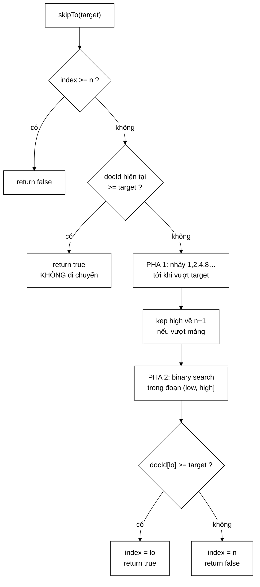

# ArrayPostingCursor — đọc từng dòng galloping search, kể cả dòng dễ sai nhất

**File nguồn:** `search-engine/src/main/java/com/vnsearch/index/ArrayPostingCursor.java` (108 dòng)
**Gói:** `com.vnsearch.index` · **Loại:** lớp `final` **package-private**, có trạng thái (một chỉ số) — cài đặt [`PostingCursor`](./PostingCursor.md)
**Vị trí trong luồng:** cài đặt duy nhất hiện có của cursor; tạo qua `PostingCursor.of(...)`
**Đọc kèm:** [`PostingCursor.md`](./PostingCursor.md) · [`Posting.md`](./Posting.md) · [`InvertedIndex.md`](./InvertedIndex.md)

---

## 📌 Hiểu trong 30 giây

Cả lớp chỉ có **hai trường**: danh sách posting và một chỉ số. Toàn bộ độ khó
nằm trong `skipTo` — 38 dòng cài đặt galloping search hai pha.

```java
private final List<Posting> postings;
private int index;
```



```
   VÍ DỤ CHẠY:  docIds = [1, 3, 5, 7, 9, …, 4001]   (n = 2001)
                index = 0,  skipTo(801)

   PHA 1 — nhảy theo cấp số nhân từ index = 0
        step=1     high=1     docId=3      < 801  → low=1,   step=2
        step=2     high=2     docId=5      < 801  → low=2,   step=4
        step=4     high=4     docId=9      < 801  → low=4,   step=8
        step=8     high=8     docId=17     < 801  → low=8,   step=16
        …
        step=256   high=256   docId=513    < 801  → low=256, step=512
        step=512   high=512   docId=1025  >= 801  → DỪNG

        Đã khoanh: mục tiêu nằm trong (256, 512]   ← 9 lần nhảy

   PHA 2 — binary search trên đoạn [256, 512], độ dài 256
        ⇒ 8 phép so sánh

   TỔNG: 17 phép so sánh
   (Quét tuyến tính sẽ tốn 400 bước để tới docId 801.)
```

---

## 1. Bản đồ lớp

```
ArrayPostingCursor  (final, package-private, implements PostingCursor)
├── postings : List<Posting> (final)  ── dữ liệu gốc, KHÔNG sao chép
├── index    : int                    ── trạng thái DUY NHẤT
├── EMPTY_POSITIONS : int[] (static)  ── mảng rỗng dùng chung
├── ArrayPostingCursor(List<Posting>) ── null → List.of()
├── docId()          O(1)
├── termFrequency()  O(1)
├── positions()      O(1)
├── next()           O(1)
├── size()           O(1)
└── skipTo(int)      O(log d)   ← 38 dòng, xem mục 2
```

### 1.1 Package-private — có chủ ý

```java
final class ArrayPostingCursor implements PostingCursor {     // KHÔNG có `public`
```

Không lớp nào ngoài gói `com.vnsearch.index` gọi được `new ArrayPostingCursor(...)`.
Mọi người dùng đi qua `PostingCursor.of(...)`.

```
   LỢI ÍCH: cài đặt đổi được mà không phá vỡ ai

   Khi cursor đọc thẳng từ CompressedPostings được viết ra,
   PostingCursor.of() chỉ cần trả về lớp mới — tầng truy vấn
   không biết và không cần biết.

   Nếu lớp này là public và ai đó lỡ viết
        new ArrayPostingCursor(...)
   thì mọi chỗ đó thành nợ kỹ thuật phải sửa tay.
```

Cùng lý do với `final`: không lớp con nào ghi đè được `skipTo` bằng một cài đặt
sai, và JIT có thể nội tuyến (inline) các phương thức nhỏ vì biết chắc không có
đa hình.

### 1.2 Không sao chép dữ liệu

```java
ArrayPostingCursor(List<Posting> postings) {
    this.postings = postings == null ? List.of() : postings;
    this.index = 0;
}
```

Cursor giữ **tham chiếu tới danh sách gốc** của chỉ mục, không sao chép. Đó là
toàn bộ ý nghĩa của "không cấp phát":

```
   Tạo cursor:  1 object (~24 byte: header 16 + ref 4 + int 4)
   Duyệt:       0 byte

   So với cách cũ (vật chất hoá List<Integer>):
   posting list 4.000 mục  →  ~80 KB rác
```

Hệ quả cần biết: nếu ai đó sửa `postings` **trong khi** một cursor đang duyệt,
hành vi không xác định. Trong dự án này an toàn vì chỉ mục được xây xong hoàn
chỉnh rồi mới gán bằng tham chiếu `volatile` (xem [`InvertedIndex`](./InvertedIndex.md)),
nên danh sách đang được duyệt không bao giờ thay đổi.

`index = 0` nghĩa là cursor **bắt đầu ngay trên phần tử đầu tiên**, không phải
trước nó — khác `java.util.Iterator`. Đây là quy ước của Lucene và là nguồn của
cạm bẫy `while (c.next())` ở [`PostingCursor`](./PostingCursor.md) mục 4.2.

### 1.3 Mẫu `index < size()` lặp lại ở bốn phương thức

```java
public int docId()          { return index < postings.size() ? postings.get(index).docId()         : NO_MORE; }
public int termFrequency()  { return index < postings.size() ? postings.get(index).termFrequency() : 0; }
public int[] positions()    { return index < postings.size() ? postings.get(index).positions()     : EMPTY_POSITIONS; }
public boolean next()       { if (index < postings.size()) index++; return index < postings.size(); }
```

Mỗi phương thức tự kiểm tra biên và trả một **giá trị trung tính** khi đã hết:

| Phương thức | Giá trị khi hết | Vì sao chọn giá trị đó |
|---|---|---|
| `docId()` | `NO_MORE` | Lính canh — mọi docId thật đều nhỏ hơn (xem [`PostingCursor`](./PostingCursor.md) mục 3.1) |
| `termFrequency()` | `0` | Tần suất 0 = "không xuất hiện" — đúng về ngữ nghĩa, và mọi công thức tính điểm nhân với 0 sẽ ra 0 |
| `positions()` | Mảng rỗng dùng chung | Không `null` ⇒ nơi gọi viết `for (int p : c.positions())` không cần phòng thủ |

```
   TRIẾT LÝ: CURSOR ĐÃ HẾT VẪN GỌI ĐƯỢC, KHÔNG NÉM

   Vòng lặp giao k cursor có thể gọi docId() trên một cursor đã hết
   nhiều lần trước khi phát hiện ra. Nếu ném IllegalStateException,
   mọi nơi gọi phải bọc kiểm tra — thêm nhánh, thêm cơ hội sai.

   Trả giá trị trung tính khiến trường hợp biên TỰ HOÀ vào trường
   hợp thường. Cùng triết lý với NO_MORE = Integer.MAX_VALUE.
```

`next()` cũng lưu ý: nó chỉ tăng `index` khi **chưa** hết, nên gọi `next()`
nhiều lần sau khi hết không làm `index` chạy quá `size()` và tràn số.

---

## 2. Đọc `skipTo` từng dòng

### 2.1 Ba lối thoát sớm

```java
public boolean skipTo(int targetDocId) {
    int n = postings.size();
    if (index >= n) {
        return false;                                   // ① đã hết
    }
    if (postings.get(index).docId() >= targetDocId) {
        return true;                                    // ② đã ở đúng chỗ hoặc vượt qua rồi
    }
```

Lối thoát ② là chỗ **hợp đồng "không lùi"** được cài đặt:

```
   cursor đang ở docId = 5,  gọi skipTo(2)
        5 >= 2  →  return true NGAY, index KHÔNG đổi

   Đây không phải tối ưu — nó là ĐÚNG ĐẮN. Cursor là con trỏ một
   chiều; cho phép lùi mở ra vòng lặp vô hạn trong thuật toán giao
   (hai cursor kéo nhau qua lại).

   Test canh giữ: skipToBackwardsIsNoOp
```

Lối thoát ② cũng là trường hợp **thường gặp nhất** khi hai posting list chồng
nhau nhiều — và nó tốn đúng một phép so sánh. Đây là lý do galloping "gần như
miễn phí" khi $d$ nhỏ.

### 2.2 Pha 1 — nhảy theo cấp số nhân

```java
    int step = 1;
    int low = index;
    int high = index + step;
    while (high < n && postings.get(high).docId() < targetDocId) {
        low = high;
        step <<= 1;                    // 1, 2, 4, 8, ...
        high = index + step;
    }
    if (high >= n) {
        high = n - 1;
    }
```

```
   BẤT BIẾN CỦA VÒNG LẶP

   Sau mỗi lượt:  docId[low] < target      (đã kiểm ở lượt trước)
   Khi thoát:     high >= n   HOẶC   docId[high] >= target

   ⇒ Mục tiêu, nếu có, nằm trong đoạn (low, high]
   ⇒ Độ dài đoạn = high − low = step/2, tức khoảng d

   Số lượt: ceil(log2 d)
```

Chú ý `high = index + step` chứ **không** phải `high = low + step`:

```
   ĐÚNG:  high = index + step   →  index+1, index+2, index+4, index+8, …
                                   khoảng cách TỪ ĐIỂM XUẤT PHÁT tăng gấp đôi

   SAI:   high = low + step     →  low tăng dần VÀ step tăng gấp đôi
                                   ⇒ nhảy nhanh hơn cấp số nhân
                                   ⇒ đoạn khoanh được RỘNG HƠN d nhiều
                                   ⇒ pha 2 tốn hơn O(log d)

   Vẫn ĐÚNG về kết quả, nhưng mất bảo đảm độ phức tạp.
```

Phép kẹp `if (high >= n) high = n - 1;` xử lý trường hợp bước nhảy vọt ra ngoài
mảng. Nó **không** có nghĩa "mục tiêu ở cuối mảng" — chỉ có nghĩa "đoạn tìm kiếm
kết thúc ở phần tử cuối". Kết luận cuối cùng vẫn do pha 2 và dòng cuối quyết
định.

### 2.3 Pha 2 — tìm nhị phân cận dưới

```java
    int lo = low;
    int hi = high;
    while (lo < hi) {
        int mid = (lo + hi) >>> 1;     // >>> chống tràn
        if (postings.get(mid).docId() < targetDocId) {
            lo = mid + 1;
        } else {
            hi = mid;
        }
    }
```

Đây là biến thể **cận dưới (lower bound)** của binary search — tìm vị trí **đầu
tiên** có `docId >= target`, không phải tìm phần tử bằng đúng target. Ba chi
tiết khiến nó đúng:

| Chi tiết | Nếu viết sai |
|---|---|
| `while (lo < hi)` (không phải `<=`) | Với `<=`, khi `lo == hi` vòng lặp vẫn chạy và `hi = mid` không thu hẹp ⇒ **vòng lặp vô hạn** |
| `lo = mid + 1` nhưng `hi = mid` (không `mid - 1`) | `hi = mid - 1` có thể nhảy qua mất đáp án, vì `mid` có thể **chính là** vị trí đầu tiên thoả mãn |
| Thoát khi `lo == hi` | Đó là vị trí cận dưới; không cần kiểm tra thêm trong vòng lặp |

**`(lo + hi) >>> 1` chứ không phải `(lo + hi) / 2`:**

```
   lo = 1.500.000.000,  hi = 2.000.000.000
   lo + hi = 3.500.000.000  >  Integer.MAX_VALUE (2.147.483.647)
        →  TRÀN thành số ÂM
        →  (âm) / 2  =  âm
        →  postings.get(âm)  →  IndexOutOfBoundsException

   >>> là dịch phải KHÔNG DẤU: bit dấu được coi là bit dữ liệu
        →  (âm) >>> 1  cho đúng giá trị (lo+hi)/2 không dấu
        →  luôn đúng, kể cả khi tổng tràn
```

Đây là lỗi nổi tiếng từng tồn tại **9 năm** trong `Arrays.binarySearch` của
chính JDK (được Joshua Bloch công bố năm 2006). Với chỉ mục hiện tại (vài nghìn
tài liệu) nó không thể xảy ra, nhưng viết đúng ngay từ đầu là chi phí bằng 0 —
và Javadoc dòng 97 còn ghi chú *"xem InvertedIndex"* để chỉ nơi giải thích đầy
đủ.

### 2.4 Dòng cuối — dòng dễ sai nhất của cả lớp

```java
    index = postings.get(lo).docId() >= targetDocId ? lo : n;
    return index < n;
}
```

```
   VÌ SAO PHẢI KIỂM TRA LẠI SAU BINARY SEARCH?

   Pha 2 tìm cận dưới TRONG ĐOẠN [low, high]. Nếu MỌI phần tử của
   đoạn đó đều nhỏ hơn target, binary search dồn lo về high và
   dừng — trả về high, nhưng docId[high] < target.

   Tình huống này xảy ra khi:
        pha 1 kết thúc vì high >= n (nhảy ra ngoài mảng)
        và phần tử cuối mảng vẫn < target

   VÍ DỤ:  docIds = [1, 3, 5],  skipTo(100)
        Pha 1: step=1 high=1 (docId 3 < 100) → low=1, step=2
               high=2 (docId 5 < 100)        → low=2, step=4
               high=4 >= n=3                 → THOÁT, high = 2
        Pha 2: lo=2, hi=2 → vòng lặp không chạy → lo=2
        Dòng cuối: docId[2]=5 >= 100?  KHÔNG  →  index = n = 3
                   return 3 < 3  →  FALSE   ✓ ĐÚNG

   Bỏ dòng kiểm tra này:
        index = 2, return true
        ⇒ cursor báo "đã nhảy tới >= 100" nhưng đang đứng ở docId 5
        ⇒ thuật toán giao coi 5 là ứng viên hợp lệ
        ⇒ KẾT QUẢ TRUY VẤN SAI, KHÔNG CÓ LỖI NÀO ĐƯỢC NÉM
```

Gán `index = n` (chứ không phải `n - 1`) khiến cursor rơi vào trạng thái "đã
hết" một cách nhất quán: `docId()` trả `NO_MORE`, `next()` trả `false`. Test
`skipToBeyondEndExhaustsCursor` canh giữ chính xác điều này.

---

## 3. Hướng dẫn thực hành

### 3.1 Kiểm chứng một cài đặt `skipTo` mới — kỹ thuật đối sánh

Nếu viết cursor thứ hai (ví dụ đọc thẳng từ [`CompressedPostings`](./CompressedPostings.md)),
đừng liệt kê trường hợp biên bằng tay. Dùng lại kỹ thuật của
`gallopingMatchesLinearScanOnEveryPosition`:

```java
@Test
void cursorMoiKhopVoiQuetTuyenTinh() {
    int[] docIds = {2, 4, 8, 16, 32, 64, 128, 256, 512, 1024};   // luỹ thừa 2:
                                                                 // đúng ranh giới bước nhảy
    for (int target = 0; target <= 1100; target++) {
        PostingCursor c = taoCursorMoi(docIds);
        boolean tim = c.skipTo(target);

        int mongDoi = PostingCursor.NO_MORE;                     // nguồn sự thật ngây thơ
        for (int d : docIds) { if (d >= target) { mongDoi = d; break; } }

        assertEquals(mongDoi != PostingCursor.NO_MORE, tim, "target=" + target);
        assertEquals(mongDoi, c.docId(), "target=" + target);
    }
}
```

```
   1.101 mục tiêu × 10 phần tử, chạy vài mili-giây,
   bao phủ MỌI trường hợp biên mà không cần nghĩ ra chúng.

   Chọn luỹ thừa 2 có chủ ý: đó là nơi lỗi lệch-một-đơn-vị
   của galloping hay xuất hiện nhất.
```

### 3.2 Đo lợi ích thật của `skipTo` trong dự án

```java
public static void main(String[] args) {
    int n = 4000;
    List<Posting> dai = new ArrayList<>(n);
    for (int i = 0; i < n; i++) dai.add(new Posting(i * 3, 1, new int[]{0}));

    int[] mucTieu = {2400, 5100, 7200, 9150, 11700};    // 5 mục tiêu rải rác

    // ── Đếm bước với skipTo ──
    PostingCursor c = PostingCursor.of(dai);
    int buocSkip = 0;
    for (int t : mucTieu) { c.skipTo(t); buocSkip++; }

    // ── Đếm bước với next() thuần ──
    PostingCursor c2 = PostingCursor.of(dai);
    int buocNext = 0;
    for (int t : mucTieu) {
        while (c2.docId() < t) { c2.next(); buocNext++; }
    }

    System.out.println("skipTo : " + buocSkip + " lời gọi");
    System.out.println("next() : " + buocNext + " bước");
}
```

Kết quả minh hoạ cho báo cáo: 5 lời gọi `skipTo` thay cho ~3.900 bước `next()`.

### 3.3 Cạm bẫy khi sửa lớp này

| Cạm bẫy | Hậu quả | Cách đúng |
|---|---|---|
| Bỏ dòng kiểm tra cuối (`docId[lo] >= target ? lo : n`) | Cursor báo nhảy thành công khi đã hết ⇒ **kết quả truy vấn sai, im lặng** | Giữ nguyên |
| Đổi `>>>` thành `/2` | Tràn số khi mảng rất lớn ⇒ chỉ số âm | Giữ `>>>` |
| `while (lo <= hi)` ở pha 2 | **Vòng lặp vô hạn** | Giữ `<` |
| `hi = mid - 1` ở pha 2 | Nhảy qua mất vị trí đúng | Giữ `hi = mid` |
| `high = low + step` ở pha 1 | Mất bảo đảm $O(\log d)$ (vẫn đúng kết quả) | Giữ `index + step` |
| Bỏ lối thoát ② (không lùi) | Vòng lặp vô hạn trong thuật toán giao | Giữ |
| Sao chép `postings` vào mảng riêng ở hàm dựng | Mất toàn bộ lợi ích không-cấp-phát | Giữ tham chiếu |
| Dùng một cursor từ nhiều luồng | `index` là trạng thái dùng chung ⇒ đua | Một cursor mỗi luồng |
| Cho lớp thành `public` | Khoá cứng cài đặt vào mã gọi | Giữ package-private |

---

## 4. Độ phức tạp & chi phí

| Phương thức | Chi phí | Cấp phát |
|---|---|---|
| `docId()`, `termFrequency()`, `positions()`, `size()` | $O(1)$ | 0 |
| `next()` | $O(1)$ | 0 |
| `skipTo` — đã ở đúng chỗ (lối thoát ②) | $O(1)$, 1 phép so sánh | 0 |
| `skipTo` — pha 1 | $O(\log d)$ | 0 |
| `skipTo` — pha 2 | $O(\log d)$ | 0 |
| Hàm dựng | $O(1)$ | 1 đối tượng ~24 byte |

```
   BỘ NHỚ MỘT CURSOR

   header đối tượng        16 byte
   tham chiếu postings      4 byte
   int index                4 byte
                          ─────────
                           24 byte

   Truy vấn 3 term = 3 cursor = 72 byte
   So với cách cũ (vật chất hoá List<Integer>): ~240 KB
   ⇒ giảm 3.400 lần
```

**Một điểm chưa tối ưu đáng lưu ý:** `postings.get(i)` trên một `List` là lời
gọi qua giao diện, không phải truy cập mảng trực tiếp.

```
   List<Posting>.get(i)   →  gọi ArrayList.get  →  kiểm tra biên  →  đọc mảng
                             (JIT thường nội tuyến được, nhưng
                              không bảo đảm nếu List có nhiều
                              cài đặt xuất hiện tại điểm gọi)

   Posting[].get(i)       →  đọc mảng trực tiếp

   Với ~17 phép so sánh mỗi skipTo, chênh lệch không đáng kể.
   Nhưng nó là lý do một cursor đọc thẳng từ CompressedPostings
   (mảng byte phẳng) sẽ nhanh hơn nữa. Xem đề xuất 3 ở mục 6.
```

---

## 5. Kiểm thử liên quan

`test/java/com/vnsearch/index/PostingCursorTest.java` (117 dòng, 9 ca) — test
viết cho giao diện nhưng thực chất kiểm tra chính lớp này (qua
`PostingCursor.of`). Ánh xạ ca test ↔ dòng mã:

| Ca kiểm thử | Canh giữ dòng nào |
|---|---|
| `emptyCursorIsImmediatelyExhausted` | `postings == null ? List.of()` + ba nhánh `index < size()` |
| `iteratesInAscendingOrder` | `index = 0` (bắt đầu **trên** phần tử đầu) + `next()` |
| `skipToLandsOnExactMatch` | Pha 2, nhánh `hi = mid` |
| `skipToLandsOnFirstGreaterWhenNoExactMatch` | Pha 2 là **cận dưới**, không phải tìm bằng đúng |
| `skipToBeyondEndExhaustsCursor` | **Dòng cuối** — `: n` (mục 2.4) |
| `skipToBackwardsIsNoOp` | **Lối thoát ②** (mục 2.1) |
| `gallopingFindsEveryTargetInLargeList` | Pha 1 với nhiều lần nhân đôi (10.000 mục) |
| `gallopingMatchesLinearScanOnEveryPosition` | **Toàn bộ** — kiểm chứng đối sánh trên 1.101 đầu vào |
| `exposesTermFrequencyAndPositions` | Ba hàm truy cập dữ liệu |

```powershell
cd search-engine
.\mvnw.cmd -q -Dtest='PostingCursorTest' test
```

Bao phủ rất tốt. Hai khoảng trống nhỏ còn lại:

```java
@Test
void mangMotPhanTu() {                    // n=1: pha 1 thoát ngay, pha 2 không chạy
    PostingCursor c = PostingCursor.of(postings(5));
    assertTrue(c.skipTo(5));
    assertEquals(5, c.docId());

    PostingCursor c2 = PostingCursor.of(postings(5));
    assertFalse(c2.skipTo(6));
    assertEquals(PostingCursor.NO_MORE, c2.docId());
}

@Test
void nhieuLanSkipLienTiepTienDan() {      // trạng thái tích luỹ đúng
    PostingCursor c = PostingCursor.of(postings(1, 10, 100, 1000));
    assertTrue(c.skipTo(10));   assertEquals(10, c.docId());
    assertTrue(c.skipTo(100));  assertEquals(100, c.docId());
    assertTrue(c.skipTo(1000)); assertEquals(1000, c.docId());
    assertFalse(c.skipTo(1001));
}
```

Ca `nhieuLanSkipLienTiepTienDan` mô phỏng đúng cách cursor được dùng thật trong
vòng lặp giao — nhiều lần `skipTo` liên tiếp, mỗi lần bắt đầu từ vị trí lần
trước. Đây là kịch bản mà lỗi tích luỹ trạng thái sẽ lộ ra.

---

## 6. Liên kết

- Hợp đồng mà lớp này cài đặt, và giải thích galloping ở mức khái niệm: [`PostingCursor.md`](./PostingCursor.md)
- Dữ liệu mà cursor duyệt: [`Posting.md`](./Posting.md)
- Nơi bất biến "sắp xếp tăng theo docId" được bảo đảm: [`InvertedIndex.md`](./InvertedIndex.md) · [`SearchIndex.md`](./SearchIndex.md)
- Đích đến của một cursor thứ hai: [`CompressedPostings.md`](./CompressedPostings.md) · [`VByteCodec.md`](./VByteCodec.md)
- Nơi cursor được dùng: [`../query/PostingListMerger.md`](../query/PostingListMerger.md) · [`../query/CandidateResolver.md`](../query/CandidateResolver.md)
