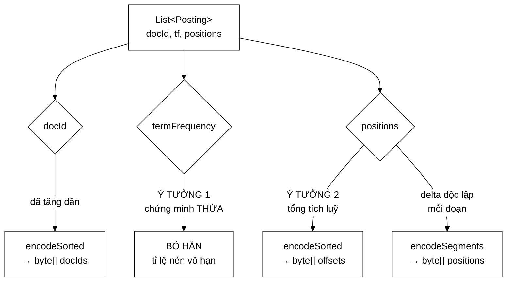

# CompressedPostings — cách nén tốt nhất một trường là chứng minh nó thừa

**File nguồn:** `search-engine/src/main/java/com/vnsearch/index/CompressedPostings.java` (152 dòng)
**Gói:** `com.vnsearch.index` · **Loại:** `record` bất biến với ba mảng `byte[]`
**Vị trí trong luồng:** cầu nối giữa [`Posting`](./Posting.md) (dạng bộ nhớ) và [`IndexPersistence`](./IndexPersistence.md) (dạng đĩa), dùng [`VByteCodec`](./VByteCodec.md) làm động cơ nén
**Đọc kèm:** [`VByteCodec.md`](./VByteCodec.md) · [`Posting.md`](./Posting.md) · [`IndexPersistence.md`](./IndexPersistence.md)

---

## 📌 Hiểu trong 30 giây

[`VByteCodec`](./VByteCodec.md) chỉ biết nén **một dãy số nguyên tăng dần**.
Nhưng một posting list là **ba loại dữ liệu trộn vào nhau, và chỉ một trong ba
là tăng dần**:

| Thành phần | Tăng dần? |
|---|---|
| `docId` qua các posting | **LUÔN** — bất biến của [`InvertedIndex`](./InvertedIndex.md) |
| `termFrequency` | **KHÔNG** — lung tung (3, 1, 2, 5…) |
| `positions` nối liền nhiều posting | **KHÔNG** — reset về 0 mỗi tài liệu |

Lớp này khử hai chỗ "KHÔNG" bằng hai ý tưởng khác nhau về bản chất.



```
   BA MẢNG BYTE, MỘT CODEC DUY NHẤT

   record CompressedPostings(int count, byte[] docIds,
                             byte[] offsets, byte[] positions)

   count      — số posting (VByte không tự mô tả độ dài)
   docIds     — encodeSorted   (vốn đã tăng dần)
   offsets    — encodeSorted   (tổng tích luỹ ⇒ luôn không giảm)
   positions  — encodeSegments (mỗi đoạn delta hoá độc lập)

   termFrequency: KHÔNG CÓ. Nó được SUY LẠI lúc giải nén.
```

---

## 1. Ý tưởng 1 — bỏ hẳn `termFrequency`

Javadoc dòng 22–27 phát biểu nguyên tắc:

> *"Cách rẻ nhất để nén một trường không phải là tìm thuật toán tốt hơn, mà là
> **chứng minh trường đó thừa** — tỉ lệ nén của việc bỏ hẳn là vô hạn."*

### 1.1 Chứng minh

```
   Mọi Posting do InvertedIndex.addDocument tạo ra đều thoả:

        termFrequency == positions.length

   VÌ SAO: addDocument GOM vị trí trước, rồi mới dựng Posting

        Map<String, List<Integer>> viTriTheoTerm = …;
        for (…) viTriTheoTerm.get(term).add(i);
        …
        new Posting(docId, viTri.size(), toIntArray(viTri));
                            └────┬────┘  └──────┬──────┘
                          CÙNG một danh sách

   ⇒ termFrequency KHÔNG mang thông tin nào mới.
   ⇒ Lưu nó là lưu cùng một sự thật hai lần.
```

```
   TIẾT KIỆM ĐƯỢC BAO NHIÊU

   1.594.938 posting × 1 byte VByte (tf hầu hết < 128)
        ≈ 1,6 MB trên tổng dung lượng chỉ mục nén

   Không lớn về tuyệt đối, nhưng nó là 100% của trường đó —
   không thuật toán nén nào đạt được.
```

### 1.2 Nhưng "thừa" là một bất biến, và bất biến phải được ép

Javadoc dòng 29–33 nói tiếp — đây là phần quan trọng hơn:

```java
if (posting.termFrequency() != size) {
    throw new IllegalArgumentException(
            "Bat bien 'termFrequency == positions.size()' bi vi pham tai docId "
                    + posting.docId() + ": termFrequency = " + posting.termFrequency()
                    + " nhung positions.size() = " + size
                    + ". Dang nen KHONG luu termFrequency ma suy lai tu so vi tri,"
                    + " nen mot Posting sai bat bien se bi giai nen SAI mot cach im lang.");
}
```

```
   NẾU KHÔNG CÓ HÀNG RÀO NÀY

   Ai đó về sau dựng Posting(docId=7, tf=5, positions=[1,2])
        → nén: bỏ tf, lưu 2 vị trí
        → giải nén: Posting(docId=7, tf=2, positions=[1,2])
        → tf từ 5 thành 2, KHÔNG LỖI NÀO ĐƯỢC NÉM

   Hậu quả lộ ra ở đâu?
        BM25 dùng tf để tính điểm
        → điểm lệch một chút
        → thứ hạng lệch một chút
        → "kết quả tìm kiếm hơi kỳ" — HÀNG THÁNG SAU
        → và không ai nghĩ tới việc mở file nén ra xem
```

Thông điệp lỗi đáng học: nó không chỉ nói **cái gì sai** (`tf = 5` nhưng có 2 vị
trí) mà còn nói **vì sao điều đó nguy hiểm** ("dạng nén không lưu tf mà suy lại,
nên một Posting sai bất biến sẽ bị giải nén sai một cách im lặng"). Người gặp
lỗi này lần đầu hiểu ngay vấn đề mà không phải đọc mã nguồn.

```
   NGUYÊN TẮC CHUNG

   Mỗi lần ta BỎ dữ liệu vì "suy lại được", ta đang biến một
   GIẢ ĐỊNH thành một PHỤ THUỘC CỨNG.

   Giả định sai ⇒ dữ liệu sai im lặng.
   ⇒ Phải ép giả định đó tại điểm nén, không phải hy vọng nó đúng.
```

---

## 2. Ý tưởng 2 — tổng tích luỹ biến dãy bất kỳ thành dãy đơn điệu

Bỏ được `tf` rồi, vẫn phải biết **mỗi posting có bao nhiêu vị trí**. Dãy số
lượng đó không tăng dần — nhưng tổng tích luỹ của nó thì luôn không giảm:

```
   tf mỗi posting  : [3, 1, 2, 5]         ← KHÔNG tăng dần
   offset tích luỹ : [0, 3, 4, 6, 11]     ← LUÔN không giảm ✓
                      ↑              ↑
                  canh biên      canh biên

   NGHỊCH ĐẢO:  tf[i] = offset[i+1] − offset[i]
                tf[0] = 3 − 0 = 3  ✓
                tf[1] = 4 − 3 = 1  ✓
                tf[2] = 6 − 4 = 2  ✓
                tf[3] = 11 − 6 = 5 ✓
```

```
   ⇒ ĐÚNG MỘT CODEC (VByteCodec.encodeSorted) DÙNG ĐƯỢC CHO CẢ BA MẢNG

   Không phải viết codec riêng cho dữ liệu "không đơn điệu".
   Thay vì làm công cụ phức tạp hơn, ta BIẾN ĐỔI dữ liệu cho vừa
   với công cụ đã có.
```

### 2.1 Đây là kỹ thuật `rowPtr` của định dạng CSR

Javadoc dòng 43–47 chỉ ra điều đáng chú ý nhất:

> *"Đây chính là kỹ thuật `rowPtr` của định dạng CSR mà
> `SparseMatrix.freeze()` dùng để nén ma trận thưa — **cùng một ý tưởng xuất
> hiện hai lần ở hai chỗ không liên quan** trong đồ án, dấu hiệu nó là kỹ thuật
> nền tảng chứ không phải thủ thuật riêng lẻ."*

```
   CSR (Compressed Sparse Row) — nén ma trận thưa

   values  : [5, 8, 3, 9, 2]      giá trị khác 0
   colIdx  : [0, 2, 1, 3, 0]      cột của từng giá trị
   rowPtr  : [0, 2, 4, 5]         hàng i chiếm values[rowPtr[i] .. rowPtr[i+1])

   CompressedPostings — nén posting list

   positions : [.....................]  vị trí, nối tiếp nhau
   offsets   : [0, 3, 4, 6, 11]        posting i chiếm positions[off[i] .. off[i+1])

   ⇒ HOÀN TOÀN CÙNG MỘT CẤU TRÚC.
     "Danh sách các danh sách có độ dài khác nhau" là bài toán
     chung, và tổng tích luỹ là lời giải chung.
```

Xem [`SparseMatrix`](../datastructure/SparseMatrix.md) — nó dùng cùng kỹ thuật
để nén ma trận liên kết cho [`PageRankService`](../ranking/PageRankService.md).

### 2.2 Vì sao mảng `offsets` có `count + 1` phần tử

Javadoc dòng 49–52:

```
   count = 4 posting  ⇒  offsets có 5 phần tử: [0, 3, 4, 6, 11]
                                                ↑            ↑
                                          canh biên đầu  canh biên cuối

   ── Có phần tử canh biên (hiện tại) ─────────────────────
   for (int i = 0; i < count; i++) {
       sizes[i] = cumulative[i + 1] - cumulative[i];    // MỌI i, không ngoại lệ
   }

   ── Không có (chỉ count phần tử) ────────────────────────
   for (int i = 0; i < count; i++) {
       sizes[i] = (i == count - 1)                       // ← NHÁNH RIÊNG
                ? tongSoViTri - cumulative[i]            //   cho phần tử cuối
                : cumulative[i + 1] - cumulative[i];
   }
   ⇒ phải lưu thêm tongSoViTri, và có một nhánh dễ sai
```

Javadoc so sánh với **nút canh biên (sentinel node)** của
[`LRUCache`](../datastructure/LRUCache.md) — cùng một ý tưởng: **thêm một phần
tử giả để trường hợp biên tự hoà vào trường hợp thường**, thay vì viết một
nhánh `if` riêng.

Giá phải trả: 1 số nguyên thêm cho mỗi term. Với 136.768 term × 1 byte VByte
(offset đầu luôn là 0 ⇒ delta 0 ⇒ 1 byte) ≈ 137 KB. Rẻ hơn nhiều so với một
nhánh `if` có thể viết sai.

---

## 3. Vì sao `positions` phải nén theo đoạn

Javadoc dòng 54–59, và cũng là lý do [`VByteCodec.encodeSegments`](./VByteCodec.md)
tồn tại:

```
   Vị trí là CHỈ SỐ TOKEN TRONG TÀI LIỆU ⇒ mỗi tài liệu bắt đầu lại từ 0

   posting docId=3:  positions [0, 5, 12]
   posting docId=7:  positions [2, 9]

   ── Nối rồi delta hoá một lần ────────────────────────────
   [0, 5, 12, 2, 9]  →  delta [0, 5, 7, −10, 7]
                                       ↑
                          ÂM tại ranh giới posting
                          VByte không mã hoá được số âm

   ── encodeSegments: reset mốc delta đầu mỗi đoạn ─────────
   đoạn 1: [0, 5, 12]  →  [0, 5, 7]
   đoạn 2: [2, 9]      →  [2, 7]
   ⇒ mọi delta không âm ✓
```

### 3.1 Chiều giải nén không cần lưu vị trí byte của từng đoạn

```
   byte[] positions:  [đoạn 0 ...][đoạn 1 ..][đoạn 2 .....]

   decodeSegments đọc TUẦN TỰ: đọc xong đoạn i, con trỏ byte tự
   đứng ở đầu đoạn i+1.

   ⇒ Chỉ cần biết SỐ PHẦN TỬ của từng đoạn.
   ⇒ Mà số đó đã suy được từ offsets: sizes[i] = off[i+1] − off[i]

   ⇒ KHÔNG lưu thêm byte nào cho việc định vị đoạn.
```

Ba mảnh ghép khớp nhau rất gọn: tổng tích luỹ cho `sizes`, `sizes` cho
`decodeSegments`, `decodeSegments` không cần vị trí byte. Không có dữ liệu thừa
nào ở bất kỳ đâu.

---

## 4. Vì sao không dùng GZIP cho xong

Javadoc dòng 61–65 — đây là lập luận kiến trúc quan trọng nhất của lớp:

> *"GZIP nén tốt hơn và tốn ba dòng code, nhưng phá vỡ một tính chất quan trọng
> hơn tỉ lệ nén: đọc **MỘT** term thì phải giải nén **TOÀN BỘ** file."*

```
   ── GZIP toàn file ──────────────────────────────────────
   Tỉ lệ nén:        TỐT HƠN (~70–80%)
   Đọc một term:     giải nén CẢ chỉ mục (hàng trăm MB)
   Khởi động:        BẮT BUỘC nạp hết vào RAM
   Nạp theo yêu cầu: KHÔNG THỂ

   ── Nén từng term độc lập (hiện tại) ────────────────────
   Tỉ lệ nén:        kém hơn một chút (~75%)
   Đọc một term:     giải nén ĐÚNG term đó
   Khởi động:        có thể nạp dần
   Nạp theo yêu cầu: MỞ ĐƯỜNG cho việc này

   ⇒ "Nén CỘNG truy cập ngẫu nhiên" là thứ nén tổng quát không cho.
```

```
   VÌ SAO ĐIỀU NÀY QUAN TRỌNG VỚI MỘT MÁY TÌM KIẾM

   Một truy vấn chạm 3 term trong số 136.768 term.
   Giải nén 136.768 để dùng 3 là tỉ lệ lãng phí 45.589 : 1.

   Với chỉ mục hiện tại (vừa RAM) thì chưa đau.
   Với chỉ mục lớn hơn RAM thì đây là ranh giới giữa
   "chạy được" và "không chạy được".
```

So sánh với lựa chọn **ngược lại** ở [`CompressedText`](./CompressedText.md):
lớp đó dùng Deflate tổng quát, vì văn bản thân bài **luôn đọc trọn vẹn một tài
liệu**. Hai bài toán trái ngược nhau, hai lựa chọn trái ngược nhau — và cả hai
đều đúng.

---

## 5. Bản đồ lớp

```
CompressedPostings  (record)
├── count     : int      ── số posting
├── docIds    : byte[]   ── encodeSorted
├── offsets   : byte[]   ── encodeSorted (count+1 phần tử)
├── positions : byte[]   ── encodeSegments
├── EMPTY (static)       ── thể hiện rỗng dùng chung
├── of(List<Posting>)  : CompressedPostings   ── nén, có ép bất biến
├── toPostings()       : List<Posting>        ── giải nén, khôi phục cả tf
└── totalBytes()       : int                  ── thống kê kích thước
```

### 5.1 `of` — một lượt, không cấu trúc trung gian

```java
int running = 0;
for (int i = 0; i < count; i++) {
    Posting posting = postings.get(i);
    int[] positions = posting.positions();
    int size = positions.length;

    if (posting.termFrequency() != size) { throw …; }     // ép bất biến

    docIds[i] = posting.docId();
    segments.add(positions);        // positions đã là int[] rồi — KHÔNG SAO CHÉP
    running += size;
    offsets[i + 1] = running;       // offsets[0] = 0 mặc định của mảng int
}
```

Hai chi tiết đáng chú ý:

```
   ① segments.add(positions) — KHÔNG sao chép

      positions đã là int[] (nhờ quyết định ở Posting.md).
      Nếu nó là List<Integer>, ở đây phải chuyển đổi
      ⇒ 1,59 triệu mảng tạm.

      Đây là lợi ích DÂY CHUYỀN của quyết định int[] ở tầng dưới.

   ② offsets[0] không cần gán

      Mảng int mới trong Java tự khởi tạo bằng 0.
      offsets[0] = 0 là đúng theo định nghĩa tổng tích luỹ.
```

### 5.2 `toPostings` — khôi phục cả `tf` vốn không được lưu

```java
int[] ids        = VByteCodec.decodeSorted(docIds, count);
int[] cumulative = VByteCodec.decodeSorted(offsets, count + 1);

int[] sizes = new int[count];
for (int i = 0; i < count; i++) {
    sizes[i] = cumulative[i + 1] - cumulative[i];    // nghịch đảo tổng tích luỹ
}
int[][] segments = VByteCodec.decodeSegments(positions, sizes);

List<Posting> result = new ArrayList<>(count);
for (int i = 0; i < count; i++) {
    int[] segment = segments[i];
    result.add(new Posting(ids[i], segment.length, segment));
    //                              └──────┬─────┘
    //                     tf được SUY LẠI, không phải đọc ra
}
```

```
   VÒNG TRÒN KHÉP KÍN

   of():         tf → bỏ đi (vì == positions.length)
   toPostings(): tf ← segment.length

   ⇒ toPostings(of(x)).equals(x)  cho mọi x thoả bất biến

   Và phép so sánh này CHỈ ĐÚNG nhờ equals tự viết của Posting
   (xem Posting.md mục 2.1) — nếu dùng equals sinh sẵn của record,
   nó so mảng theo tham chiếu và luôn trả false.
```

---

## 6. Hướng dẫn thực hành

### 6.1 Nén và kiểm chứng một posting list

```java
List<Posting> goc = index.getPostings("công_nghệ");

CompressedPostings nen = CompressedPostings.of(goc);
System.out.printf("Số posting  : %d%n", nen.count());
System.out.printf("docIds      : %d byte%n", nen.docIds().length);
System.out.printf("offsets     : %d byte%n", nen.offsets().length);
System.out.printf("positions   : %d byte%n", nen.positions().length);
System.out.printf("TỔNG NÉN    : %d byte%n", nen.totalBytes());

int tho = goc.size() * (4 + 4)                                  // docId + tf
        + goc.stream().mapToInt(Posting::positionCount).sum() * 4;  // vị trí
System.out.printf("Thô         : %d byte (%.1f%%)%n",
        tho, 100.0 * nen.totalBytes() / tho);

// KIỂM CHỨNG VÒNG TRÒN — bước quan trọng nhất
assert goc.equals(nen.toPostings()) : "Vòng nén/giải nén làm mất dữ liệu";
```

### 6.2 Đo tỉ lệ nén toàn chỉ mục cho báo cáo

```java
long thoTong = 0, nenTong = 0;
int soTerm = 0;
for (String term : index.allTerms()) {
    List<Posting> ps = index.getPostings(term);
    CompressedPostings nen = CompressedPostings.of(ps);
    nenTong += nen.totalBytes();
    thoTong += (long) ps.size() * 8
             + ps.stream().mapToLong(Posting::positionCount).sum() * 4;
    soTerm++;
}
System.out.printf("%,d term: %,d → %,d byte, còn %.1f%% (tiết kiệm %.1f%%)%n",
        soTerm, thoTong, nenTong,
        100.0 * nenTong / thoTong, 100.0 * (thoTong - nenTong) / thoTong);
```

### 6.3 Cạm bẫy

| Cạm bẫy | Hậu quả | Cách đúng |
|---|---|---|
| Dựng `Posting` với `tf != positions.length` rồi nén | Ném ở `of` (may) — nhưng nếu hàng rào bị gỡ thì **dữ liệu sai im lặng** | Giữ hàng rào; luôn dựng `Posting` từ chính danh sách vị trí |
| Gỡ kiểm tra bất biến "cho nhanh" | 1,59 triệu phép so sánh ≈ 2 ms; đổi lấy nguy cơ sai dữ liệu vĩnh viễn | Giữ |
| Truyền posting list **chưa sắp xếp** theo docId | `VByteCodec.encodeSorted` ném | Bảo đảm bất biến của [`SearchIndex`](./SearchIndex.md) |
| Sửa nội dung mảng `byte[]` sau khi nén | `record` bất biến ở mức tham chiếu, nội dung vẫn sửa được ⇒ hỏng dữ liệu | Coi là chỉ đọc |
| Dùng `equals` sinh sẵn của record này | So ba mảng theo **tham chiếu** ⇒ luôn `false` | Tự viết như [`Posting`](./Posting.md), hoặc so qua `toPostings()` |
| Thay bằng GZIP toàn file | Mất truy cập ngẫu nhiên theo term | Xem mục 4 |
| Giả định `positions` truy cập ngẫu nhiên được | `decodeSegments` chỉ đọc tuần tự | Xem đề xuất 3 |

---

## 7. Độ phức tạp & chi phí

| Thao tác | Chi phí | Cấp phát |
|---|---|---|
| `of(n posting, P vị trí)` | $O(n + P)$ một lượt | 2 mảng `int`, 1 `List<int[]>` (không sao chép nội dung), 3 `byte[]` |
| `toPostings()` | $O(n + P)$ một lượt | 3 mảng `int`, $n$ mảng vị trí, $n$ `Posting`, 1 `List` |
| `totalBytes()` | $O(1)$ | 0 |

**Không sắp xếp, không cấu trúc trung gian nào ngoài bộ đệm kết quả** — như
Javadoc dòng 67–69 nêu. Đây là tính chất đáng giá: nén một posting list 4.000
mục không đắt hơn việc duyệt nó một lần.

```
   TỈ LỆ NÉN ƯỚC LƯỢNG — corpus 5.011 tài liệu

   ── THÔ ──────────────────────────────────────────────
   docId       1.594.938 × 4 byte  =   6,4 MB
   tf          1.594.938 × 4 byte  =   6,4 MB
   positions   3.821.061 × 4 byte  =  15,3 MB
                                     ─────────
                                      28,1 MB
   (chưa kể 1,59 triệu header đối tượng Posting ≈ 51 MB
    và 1,59 triệu header mảng ≈ 25,5 MB)

   ── NÉN ──────────────────────────────────────────────
   docIds      ~1 byte/posting     =   1,6 MB   (delta ~3)
   tf                              =     0 MB   ← BỎ HẲN
   offsets     ~1 byte/posting     =   1,6 MB
   positions   ~1 byte/vị trí      =   3,8 MB   (vị trí sát nhau)
                                     ─────────
                                       7,0 MB

   ⇒ 28,1 MB → 7,0 MB   (còn 25%, tiết kiệm 75%)
   ⇒ So với dạng bộ nhớ đầy đủ (~105 MB): còn ~7%
```

Phần tiết kiệm lớn nhất thật ra không phải nén, mà là **xoá bỏ 1,59 triệu header
đối tượng** — ba mảng byte phẳng không có header nào cho từng phần tử.

---

## 8. Kiểm thử liên quan

`test/java/com/vnsearch/index/CompressedPostingsTest.java` (130 dòng) và
`IndexPersistenceTest.java` (90 dòng).

```powershell
cd search-engine
.\mvnw.cmd -q -Dtest='CompressedPostingsTest' test
```

Bốn nhóm ca mà lớp này cần:

```java
@Test
void vongNenGiaiNenGiuNguyenDuLieu() {          // tính chất cốt lõi
    List<Posting> goc = List.of(
            new Posting(3,  3, new int[]{0, 5, 12}),
            new Posting(7,  1, new int[]{2}),
            new Posting(19, 4, new int[]{1, 3, 8, 40}));
    assertEquals(goc, CompressedPostings.of(goc).toPostings());
    //           ↑ CHỈ ĐÚNG nhờ equals tự viết của Posting
}

@Test
void tuChoiPostingViPhamBatBien() {             // ý tưởng 1 được ép
    List<Posting> sai = List.of(new Posting(3, 5, new int[]{0, 1}));  // tf=5, 2 vị trí
    IllegalArgumentException e = assertThrows(IllegalArgumentException.class,
            () -> CompressedPostings.of(sai));
    assertTrue(e.getMessage().contains("termFrequency"));
    assertTrue(e.getMessage().contains("docId 3"), "thông điệp phải chỉ rõ posting nào");
}

@Test
void postingKhongCoViTri() {                    // biên: tf = 0
    List<Posting> goc = List.of(new Posting(3, 0, new int[0]),
                                new Posting(7, 0, new int[0]));
    assertEquals(goc, CompressedPostings.of(goc).toPostings());
}

@Test
void danhSachRong() {
    CompressedPostings nen = CompressedPostings.of(List.of());
    assertEquals(0, nen.count());
    assertEquals(0, nen.totalBytes());
    assertTrue(nen.toPostings().isEmpty());
}

@Test
void ngauNhienQuyMoLon() {                      // property-based
    Random r = new Random(42);
    for (int lan = 0; lan < 200; lan++) {
        int n = r.nextInt(100) + 1;
        List<Posting> goc = new ArrayList<>(n);
        int docId = 0;
        for (int i = 0; i < n; i++) {
            docId += r.nextInt(50) + 1;                     // tăng nghiêm ngặt
            int soViTri = r.nextInt(10);
            int[] vt = new int[soViTri];
            int p = 0;
            for (int j = 0; j < soViTri; j++) { p += r.nextInt(20); vt[j] = p; }
            goc.add(new Posting(docId, soViTri, vt));       // tf = |positions|
        }
        assertEquals(goc, CompressedPostings.of(goc).toPostings(), "lần " + lan);
    }
}
```

Ca `postingKhongCoViTri` đáng chú ý: nó kiểm tra đoạn rỗng trong
`encodeSegments`/`decodeSegments` — một trường hợp biên mà cả hai chiều phải xử
lý nhất quán (0 byte ghi ra, 0 phần tử đọc vào).

---

## 9. Liên kết

- Động cơ nén: [`VByteCodec.md`](./VByteCodec.md)
- Dữ liệu được nén, và bài học `equals` tự viết: [`Posting.md`](./Posting.md)
- Bất biến "sắp xếp tăng dần" mà lớp này phụ thuộc: [`SearchIndex.md`](./SearchIndex.md) · [`InvertedIndex.md`](./InvertedIndex.md)
- Nơi dạng nén được ghi ra đĩa: [`IndexPersistence.md`](./IndexPersistence.md)
- Lựa chọn nén **trái ngược** cho bài toán trái ngược: [`CompressedText.md`](./CompressedText.md)
- Cùng kỹ thuật `rowPtr` ở gói khác: [`../datastructure/SparseMatrix.md`](../datastructure/SparseMatrix.md)
- Cùng ý tưởng "phần tử canh biên": [`../datastructure/LRUCache.md`](../datastructure/LRUCache.md)
- Đích đến của một cursor đọc thẳng dạng nén: [`PostingCursor.md`](./PostingCursor.md)
