```mermaid
%%{init:{'theme':'base','themeVariables':{'background':'#ffffff','primaryColor':'#ffffff','primaryTextColor':'#000000','primaryBorderColor':'#000000','lineColor':'#000000','textColor':'#000000','mainBkg':'#ffffff','nodeBorder':'#000000','clusterBkg':'#ffffff','clusterBorder':'#000000','edgeLabelBackground':'#ffffff','fontFamily':'ui-monospace, SFMono-Regular, Consolas, monospace'}}}%%
flowchart LR
    A["thân bài<br/>~8 KB văn bản"] --> B["compress()<br/>Deflate mức 6"]
    B --> C["byte[]<br/>~2 KB"]
    C --> D["giữ trong bộ nhớ<br/>cùng chỉ mục"]
    D --> E["truy vấn xong,<br/>còn 10 kết quả"]
    E --> F["decompress()<br/>chỉ 10 tài liệu"]
    F --> G["SnippetBuilder<br/>sinh đoạn trích"]
```

# CompressedText — 88 dòng, và dòng quan trọng nhất nằm trong khối `finally`

**File nguồn:** `search-engine/src/main/java/com/vnsearch/index/CompressedText.java` (88 dòng)
**Gói:** `com.vnsearch.index` · **Loại:** lớp tiện ích `final`, hàm dựng riêng tư, chỉ hàm tĩnh — không trạng thái
**Vị trí trong luồng:** nén thân bài tài liệu trong [`InvertedIndex`](./InvertedIndex.md); giải nén khi [`SnippetBuilder`](../ranking/SnippetBuilder.md) cần sinh đoạn trích
**Đọc kèm:** [`SearchIndex.md`](./SearchIndex.md) (vì sao `getBodyText` tách riêng) · [`CompressedPostings.md`](./CompressedPostings.md) (lựa chọn ngược lại)

---

## 📌 Hiểu trong 30 giây

Hai hàm tĩnh bọc quanh `Deflater`/`Inflater` của JDK. Nhưng ba quyết định trong
88 dòng này đáng đọc kỹ, và một trong số đó là **dòng dễ quên nhất trong lập
trình Java**:

```java
} finally {
    deflater.end();     // ← quên dòng này = rò rỉ bộ nhớ NGOÀI heap
}
```



```
   VÌ SAO THÂN BÀI PHẢI Ở TRONG CHỈ MỤC

   Xếp hạng KHÔNG cần thân bài — điểm số tính từ posting list.
   Chỉ MỘT chỗ cần: sinh đoạn trích cho top-10 thật sự trả về.

   Nhưng "chỉ 10 tài liệu" là biết được SAU khi truy vấn chạy xong,
   còn văn bản thì phải có sẵn TỪ TRƯỚC đó.

   ⇒ Không thể "chỉ lưu 10 tài liệu cần".
```

---

## 1. Ba quyết định

### 1.1 Giữ trong bộ nhớ (đã nén), không đọc theo yêu cầu từ CSDL

Javadoc dòng 20–31 trình bày bảng đánh đổi:

| | Đọc theo yêu cầu từ CSDL | Giữ trong bộ nhớ, đã nén |
|---|---|---|
| Bộ nhớ | gần bằng 0 | ~1/4 bản gốc |
| Độ trễ mỗi truy vấn | thêm một vòng vào/ra | không |
| Chạy khi **không** có CSDL | **không sinh được đoạn trích** | bình thường |

> *"Ở cột cuối cùng nằm một tính chất mà dự án này cố ý giữ: người vừa clone về
> chạy được **NGAY**, không cần cài PostgreSQL. Buộc CSDL thành bắt buộc chỉ để
> tiết kiệm thêm một chút bộ nhớ là đánh đổi sai."*

```
   ĐÂY LÀ MỘT QUYẾT ĐỊNH VỀ TRẢI NGHIỆM NGƯỜI PHÁT TRIỂN,
   KHÔNG PHẢI VỀ HIỆU NĂNG.

   git clone → mvnw spring-boot:run → chạy
              (không cài PostgreSQL, không cấu hình gì)

   Với một đồ án phải demo trước hội đồng, tính chất này có giá
   trị thật: máy chấm không cài sẵn CSDL vẫn chạy được.

   Chi phí: ~2.518 tài liệu × ~2 KB nén ≈ 5 MB
   ⇒ Rẻ tới mức không cần cân nhắc.
```

Xem [`PostgresDocumentStore`](../storage/PostgresDocumentStore.md) và
[`JsonDocumentStore`](../storage/JsonDocumentStore.md) — cùng triết lý "chạy
được ngay, nâng cấp được sau".

### 1.2 `Deflater` thô, không phải GZIP

Javadoc dòng 33–36:

```
   CÙNG MỘT THUẬT TOÁN NÉN (DEFLATE), KHÁC Ở BAO BÌ

   GZIP  = deflate + 10 byte header + 8 byte trailer
                     └──────────┬──────────┘
                          18 byte MỖI LẦN GỌI

   2.518 tài liệu × 18 byte = 45 KB thuần phí
   (và con số này tăng tuyến tính khi corpus lớn lên)

   Header GZIP chứa: số magic, phương pháp nén, cờ, dấu thời gian,
   hệ điều hành. Trailer chứa: CRC32 và độ dài gốc.

   Ở đây KHÔNG CẦN gì trong số đó:
   ├─ độ dài đã biết từ chính mảng byte
   ├─ dấu thời gian vô nghĩa (và làm đầu ra không tất định!)
   └─ CRC32: dữ liệu nằm trong bộ nhớ cùng tiến trình, không qua mạng
```

Chi tiết "dấu thời gian" đáng chú ý thêm: GZIP nhúng thời điểm nén vào header,
nên nén **cùng một văn bản** ở hai thời điểm cho ra **hai mảng byte khác nhau**
— phá vỡ khả năng so sánh nhị phân hai lần build chỉ mục. Deflate thô không có
vấn đề đó.

### 1.3 Vì sao dùng nén tổng quát ở đây mà không dùng ở `CompressedPostings`

Javadoc dòng 38–41 — đây là điểm hay nhất của cả file:

```
   ── CompressedPostings ──────────────────────────────────
   Cố ý KHÔNG dùng nén tổng quát
   VÌ: posting list cần TRUY CẬP NGẪU NHIÊN theo từng term
       (truy vấn chạm 3 term trong 136.768)

   ── CompressedText ──────────────────────────────────────
   Dùng nén tổng quát (Deflate)
   VÌ: văn bản thân bài LUÔN đọc trọn vẹn một tài liệu
       (không ai cần "ký tự thứ 500 tới 800")

   ⇒ HAI LỰA CHỌN TRÁI NGƯỢC NHAU CHO HAI BÀI TOÁN TRÁI NGƯỢC NHAU.
     Và cả hai đều đúng.
```

```
   BÀI HỌC TỔNG QUÁT

   "Dự án dùng thuật toán nén gì?" là câu hỏi SAI.
   Câu hỏi đúng: "dữ liệu này được ĐỌC như thế nào?"

        Đọc ngẫu nhiên từng phần  →  nén từng phần độc lập
        Đọc trọn vẹn một lần      →  nén tổng quát, tỉ lệ tốt nhất

   Áp một lựa chọn cho cả hai là sai ở một trong hai chỗ.
```

---

## 2. Đọc `compress` từng dòng

```java
public static byte[] compress(String text) {
    if (text == null || text.isEmpty()) {
        return EMPTY;                                        // ① mảng rỗng dùng chung
    }
    byte[] raw = text.getBytes(StandardCharsets.UTF_8);      // ② UTF-8 tường minh
    ByteArrayOutputStream out = new ByteArrayOutputStream(raw.length / 3);   // ③ ước lượng
    Deflater deflater = new Deflater(LEVEL);
    try (DeflaterOutputStream stream = new DeflaterOutputStream(out, deflater)) {
        stream.write(raw);
    } catch (IOException e) {
        throw new UncheckedIOException("Không nén được văn bản", e);         // ④
    } finally {
        deflater.end();                                                       // ⑤ BẮT BUỘC
    }
    return out.toByteArray();
}
```

### 2.1 ⑤ `deflater.end()` — dòng quan trọng nhất

Chú thích trong mã nói thẳng:

> *"**BẮT BUỘC**: `Deflater` giữ bộ đệm **NGOÀI heap** của JVM, mà bộ thu gom
> rác không quản lý. Quên gọi `end()` là rò rỉ bộ nhớ native — thứ **không hiện
> ra trong bất kỳ phép đo heap nào**."*

```
   VÌ SAO ĐÂY LÀ LỖI KHÓ CHẨN ĐOÁN NHẤT

   Deflater là lớp bọc quanh thư viện zlib viết bằng C.
   Nó cấp phát ~256 KB bộ nhớ NATIVE (ngoài heap JVM).

   Quên end():
   ├─ jconsole / VisualVM: heap BÌNH THƯỜNG
   ├─ jmap -histo:         KHÔNG thấy gì bất thường
   ├─ Heap dump:           SẠCH
   └─ Nhưng RSS của tiến trình TĂNG ĐỀU cho tới khi OOM cấp hệ điều hành

   2.518 tài liệu × 256 KB  =  644 MB rò rỉ trong MỘT lần build chỉ mục.

   Triệu chứng: "JVM bị kernel giết mà heap chỉ dùng 200 MB" —
   một trong những lỗi khó lần ra nhất của Java.
```

```
   VÌ SAO try-with-resources KHÔNG ĐỦ

   try (DeflaterOutputStream stream = new DeflaterOutputStream(out, deflater)) { … }

   close() của DeflaterOutputStream có gọi deflater.finish() và
   ghi nốt dữ liệu — nhưng KHÔNG gọi deflater.end().

   Lý do: Deflater được TRUYỀN VÀO từ bên ngoài, nên stream không
   coi mình là chủ sở hữu nó.

   ⇒ finally { deflater.end(); } là BẮT BUỘC, không phải phòng thủ thừa.

   (Nếu dùng new DeflaterOutputStream(out) — không truyền deflater —
    thì stream TỰ tạo và TỰ end. Nhưng khi đó không đặt được mức nén.)
```

> ⚠️ `Deflater` có `finalize()` gọi `end()` trong các JDK cũ — nhưng
> `finalize` đã bị đánh dấu loại bỏ từ Java 9 và **bị gỡ hẳn** ở các phiên bản
> mới. Không được dựa vào nó.

`Inflater` trong `decompress` cũng cần `end()`, nhưng ở đó
`InflaterInputStream` **tự tạo** `Inflater` bên trong nên tự dọn — đó là lý do
`decompress` không có khối `finally`. Sự bất đối xứng này là đúng, không phải
thiếu sót.

### 2.2 ③ Ước lượng dung lượng `raw.length / 3`

```
   ByteArrayOutputStream mặc định: 32 byte, nhân đôi khi đầy.
   Mỗi lần nhân đôi = cấp phát mảng mới + SAO CHÉP toàn bộ.

   Văn bản 8 KB, nén còn ~2 KB:
        32 → 64 → 128 → … → 2048   =  7 lần mở rộng, 7 lần sao chép

   Ước lượng raw.length / 3 = 2.730 byte:
        ⇒ 0 lần mở rộng

   Vì sao chia 3? Deflate trên văn bản tiếng Việt UTF-8 thường
   nén còn 25–33%. Chia 3 là ước lượng hơi rộng — thà thừa một
   chút còn hơn phải sao chép.
```

### 2.3 ② `StandardCharsets.UTF_8` tường minh

```
   text.getBytes()                → dùng bảng mã MẶC ĐỊNH của JVM
   text.getBytes(UTF_8)           → luôn UTF-8

   Bảng mã mặc định phụ thuộc hệ điều hành và biến môi trường:
        Linux/CI:        UTF-8
        Windows tiếng Việt: windows-1258  (trước Java 18)

   ⇒ Nén trên Windows, giải nén trên Linux (hoặc ngược lại)
     = văn bản tiếng Việt HỎNG DẤU hoàn toàn.

   Với một dự án chạy trên Windows và triển khai bằng Docker Linux,
   đây không phải rủi ro lý thuyết.
```

Cùng bẫy họ hàng với `Locale.ROOT` ở [`UrlCanonicalizer`](../crawler/UrlCanonicalizer.md)
và [`JsonUserStore`](../auth/JsonUserStore.md): **không bao giờ dựa vào cấu hình
mặc định của môi trường.**

### 2.4 ④ `UncheckedIOException` — lập luận đúng

```java
} catch (IOException e) {
    // Ghi vào bộ nhớ thì không thể lỗi vì I/O; nếu xảy ra thì là lỗi lập
    // trình chứ không phải tình huống cần xử lý.
    throw new UncheckedIOException("Không nén được văn bản", e);
}
```

```
   ByteArrayOutputStream.write GHI VÀO MỘT MẢNG TRONG BỘ NHỚ.
   Không có đĩa, không có mạng, không có tệp.
   ⇒ IOException ở đây là BẤT KHẢ THI về mặt logic.

   Nó tồn tại chỉ vì chữ ký của OutputStream.write khai báo nó.

   Ép người gọi try/catch một ngoại lệ không thể xảy ra
        → mã gọi đầy khối catch rỗng
        → và khối catch rỗng thật sự nguy hiểm sẽ lẫn vào đó

   ⇒ Bọc thành ngoại lệ không kiểm tra là đúng, và giữ nguyên
     nguyên nhân gốc (e) để không mất dấu vết nếu điều bất khả
     thi thật sự xảy ra.
```

### 2.5 ① Khử `null` tại cửa vào

```java
if (text == null || text.isEmpty()) return EMPTY;      // compress
if (compressed == null || compressed.length == 0) return "";   // decompress
```

Đối xứng hoàn hảo: `compress(null)` → mảng rỗng, `decompress(mảng rỗng)` → `""`.
Vòng tròn khép kín kể cả ở trường hợp biên, và mảng rỗng dùng chung một thể hiện
tĩnh — cùng kỹ thuật với `NO_POSITIONS` của [`Posting`](./Posting.md).

---

## 3. Mức nén 6 — vì sao là mặc định

```java
private static final int LEVEL = Deflater.DEFAULT_COMPRESSION;   // = 6
```

```
   BẢNG ĐÁNH ĐỔI CỦA DEFLATE (số liệu điển hình trên văn bản)

   Mức   Tỉ lệ nén   Tốc độ nén    Tốc độ GIẢI nén
   ───   ─────────   ──────────    ───────────────
    1      ~40%      rất nhanh     như nhau
    6      ~28%      trung bình    như nhau      ← mặc định
    9      ~26%      CHẬM 3–5 lần  như nhau

   ⇒ Từ 6 lên 9: tốt hơn 2 điểm phần trăm, chậm hơn 3–5 lần
   ⇒ Từ 6 xuống 1: nhanh hơn nhiều, nhưng tốn thêm 43% dung lượng

   ĐIỂM MẤU CHỐT: tốc độ GIẢI nén gần như không đổi theo mức.
   Mà giải nén mới là thứ nằm trên đường người dùng chờ
   (nén chỉ chạy một lần lúc build).
```

Với dự án này (nén một lần khi build, giải nén 10 lần mỗi truy vấn), mức 6 là
lựa chọn hợp lý. Nếu build chỉ mục trở thành nút thắt, hạ xuống mức 1 đổi 43%
dung lượng lấy tốc độ build — nhưng dung lượng hiện chỉ 5 MB nên chưa cần.

---

## 4. Hướng dẫn thực hành

### 4.1 Đo tỉ lệ nén thật trên corpus

```java
long tho = 0, nen = 0;
int soTaiLieu = 0;
for (WebDocument doc : index.getAllDocuments().values()) {
    byte[] raw = doc.bodyText().getBytes(StandardCharsets.UTF_8);
    tho += raw.length;
    nen += CompressedText.compress(doc.bodyText()).length;
    soTaiLieu++;
}
System.out.printf("%,d tài liệu: %,d → %,d byte (còn %.1f%%, tiết kiệm %.1f%%)%n",
        soTaiLieu, tho, nen, 100.0 * nen / tho, 100.0 * (tho - nen) / tho);
System.out.printf("Trung bình: %,d → %,d byte/tài liệu%n", tho / soTaiLieu, nen / soTaiLieu);
```

### 4.2 So sánh các mức nén cho báo cáo

```java
String mau = index.getBodyText(0);
byte[] raw = mau.getBytes(StandardCharsets.UTF_8);
System.out.printf("Gốc: %,d byte%n", raw.length);

for (int muc : new int[]{1, 3, 6, 9}) {
    long batDau = System.nanoTime();
    byte[] ketQua = nenVoiMuc(mau, muc);          // bản sao compress() nhận mức
    long thoiGian = System.nanoTime() - batDau;
    System.out.printf("Mức %d: %,6d byte (%4.1f%%)  %,8d ns%n",
            muc, ketQua.length, 100.0 * ketQua.length / raw.length, thoiGian);
}
```

Bảng kết quả này là loại số liệu biện minh cho hằng số `LEVEL` — đúng cách mà
[`UrlCanonicalizer`](../crawler/UrlCanonicalizer.md) biện minh cho phép chuẩn
hoá của nó bằng "23 cặp trùng".

### 4.3 Cạm bẫy

| Cạm bẫy | Hậu quả | Cách đúng |
|---|---|---|
| Quên `deflater.end()` | **Rò rỉ bộ nhớ native** — không hiện trong heap dump, JVM bị hệ điều hành giết | Giữ khối `finally` |
| Dùng `text.getBytes()` không ghi bảng mã | Văn bản tiếng Việt hỏng dấu khi nén/giải nén ở hai môi trường khác nhau | Luôn `StandardCharsets.UTF_8` |
| Đổi sang GZIP | +18 byte/tài liệu, và đầu ra **không tất định** vì có dấu thời gian | Giữ Deflate thô |
| Đặt mức nén 9 | Chậm 3–5 lần lúc build, chỉ tốt hơn 2 điểm phần trăm | Giữ mức 6 |
| Gọi `decompress` trong vòng lặp xếp hạng | ~50 µs × 1.000 ứng viên = 50 ms/truy vấn | Chỉ giải nén cho top-K |
| Nén từng đoạn nhỏ (mỗi câu một lần) | Deflate cần đủ dữ liệu để xây từ điển; đoạn ngắn nén **phình ra** | Nén cả thân bài một lần |
| Dùng nén tổng quát cho posting list | Mất truy cập ngẫu nhiên theo term | Xem [`CompressedPostings`](./CompressedPostings.md) |
| Tái sử dụng một `Deflater` giữa nhiều luồng | `Deflater` **không** thread-safe | Mỗi lần gọi một thể hiện (hiện tại), hoặc `ThreadLocal` |

### 4.4 Nén đoạn ngắn thì phình ra — con số cụ thể

```
   Deflate xây từ điển động từ chính dữ liệu. Dữ liệu càng dài,
   từ điển càng hiệu quả.

   Chuỗi 20 byte  →  nén ra ~28 byte    (PHÌNH 40%)
   Chuỗi 500 byte →  nén ra ~320 byte   (giảm 36%)
   Chuỗi 8 KB     →  nén ra ~2,2 KB     (giảm 72%)

   ⇒ Thân bài một bài báo (~8 KB) là kích thước lý tưởng.
   ⇒ Nén tiêu đề (~60 byte) sẽ làm dữ liệu TO RA — đó là lý do
     WebDocument chỉ nén bodyText, không nén title.
```

---

## 5. Độ phức tạp & chi phí

| Thao tác | Chi phí | Ghi chú |
|---|---|---|
| `compress(n byte)` | $O(n)$, ~30 µs cho 8 KB | Chạy **một lần** lúc build |
| `decompress` | $O(n)$, ~10 µs cho 2 KB | Chạy **10 lần** mỗi truy vấn |
| Bộ nhớ tạm khi nén | ~256 KB native + bộ đệm kết quả | Được giải phóng bởi `end()` |

```
   NGÂN SÁCH

   ── LÚC BUILD (một lần) ─────────────────────────────
   2.518 tài liệu × 30 µs  =  0,08 giây     ← không đáng kể

   ── LÚC TRUY VẤN ────────────────────────────────────
   10 kết quả × 10 µs      =  0,1 ms
   Tổng ngân sách truy vấn ≈  1 ms
   ⇒ chiếm 10%              ← ĐÁNG KỂ nhưng chấp nhận được

   ⚠️ Nếu ai đó gọi getBodyText trong vòng lặp xếp hạng
     (1.000 ứng viên thay vì 10 kết quả):
        1.000 × 10 µs = 10 ms  ⇒  gấp 10 lần toàn bộ ngân sách

   ĐÂY CHÍNH LÀ LÝ DO SearchIndex tách getBodyText khỏi getDocument
   — xem SearchIndex.md mục 3.1.
```

**Bộ nhớ tiết kiệm được:**

```
   2.518 tài liệu × ~8 KB thân bài  =  20,1 MB thô
   Nén còn ~28%                     =   5,6 MB
                                      ─────────
   Tiết kiệm                        =  14,5 MB

   (Chuỗi Java lưu UTF-16 nên bản gốc trong bộ nhớ thật ra là
    ~40 MB — nén xuống 5,6 MB là giảm 86%.)
```

---

## 6. Kiểm thử liên quan

`test/java/com/vnsearch/index/CompressedTextTest.java` (69 dòng).

```powershell
cd search-engine
.\mvnw.cmd -q -Dtest='CompressedTextTest' test
```

Các ca mà một codec văn bản cần:

```java
@Test
void vongNenGiaiNenGiuNguyenVanBan() {
    String goc = "Công nghệ thông tin Việt Nam đang phát triển nhanh chóng.";
    assertEquals(goc, CompressedText.decompress(CompressedText.compress(goc)));
}

@Test
void giuNguyenDauTiengViet() {                    // rủi ro bảng mã
    String goc = "Đường phố Hà Nội: ăn, ắt, ấy, ệ, ữ, ỹ, ọ — 100% đúng dấu.";
    assertEquals(goc, CompressedText.decompress(CompressedText.compress(goc)));
}

@Test
void nullVaRongDoiXung() {
    assertEquals(0, CompressedText.compress(null).length);
    assertEquals(0, CompressedText.compress("").length);
    assertEquals("", CompressedText.decompress(null));
    assertEquals("", CompressedText.decompress(new byte[0]));
}

@Test
void tatDinh() {                                  // KHÔNG có dấu thời gian như GZIP
    String goc = "Văn bản mẫu để kiểm tra tính tất định.";
    assertArrayEquals(CompressedText.compress(goc), CompressedText.compress(goc));
}

@Test
void vanBanDaiNenTot() {
    String doan = "Công nghệ thông tin Việt Nam phát triển nhanh. ";
    String dai = doan.repeat(200);                // ~9 KB
    byte[] nen = CompressedText.compress(dai);
    int tho = dai.getBytes(StandardCharsets.UTF_8).length;
    assertTrue(nen.length < tho / 3, "Văn bản lặp lại phải nén còn dưới 1/3");
    assertEquals(dai, CompressedText.decompress(nen));
}

@Test
void ngauNhienQuyMoLon() {                        // property-based
    Random r = new Random(42);
    String[] tu = {"công", "nghệ", "thông", "tin", "việt", "nam", "máy", "tính", "dữ", "liệu"};
    for (int lan = 0; lan < 200; lan++) {
        StringBuilder sb = new StringBuilder();
        int n = r.nextInt(500);
        for (int i = 0; i < n; i++) sb.append(tu[r.nextInt(tu.length)]).append(' ');
        String goc = sb.toString();
        assertEquals(goc, CompressedText.decompress(CompressedText.compress(goc)), "lần " + lan);
    }
}
```

Ca `tatDinh` đáng giữ vì nó **khoá lại lợi ích của việc chọn Deflate thô thay vì
GZIP** (mục 1.2). Nếu ai đó đổi sang GZIP, ca này đỏ ngay và thông điệp nhắc
đúng lý do.

Ca không thể viết bằng test đơn vị: **rò rỉ bộ nhớ native** khi quên `end()`. Nó
chỉ lộ ra khi nén hàng nghìn tài liệu và theo dõi RSS của tiến trình:

```powershell
# Chạy build chỉ mục rồi theo dõi bộ nhớ thật của tiến trình (không phải heap)
Get-Process java | Select-Object Id, @{n='RSS_MB';e={[math]::Round($_.WorkingSet64/1MB)}}
```

---

## 7. Liên kết

- Vì sao `getBodyText` tách khỏi `getDocument`: [`SearchIndex.md`](./SearchIndex.md) mục 3.1
- Lựa chọn nén **trái ngược** cho bài toán trái ngược: [`CompressedPostings.md`](./CompressedPostings.md) · [`VByteCodec.md`](./VByteCodec.md)
- Nơi văn bản được nén: [`InvertedIndex.md`](./InvertedIndex.md)
- Người tiêu thụ duy nhất của `decompress`: [`../ranking/SnippetBuilder.md`](../ranking/SnippetBuilder.md)
- Cùng triết lý "chạy được ngay, không cần CSDL": [`../storage/JsonDocumentStore.md`](../storage/JsonDocumentStore.md) · [`../storage/PostgresDocumentStore.md`](../storage/PostgresDocumentStore.md)
- Cùng bẫy "đừng dựa vào mặc định môi trường": [`../crawler/UrlCanonicalizer.md`](../crawler/UrlCanonicalizer.md) · [`../auth/JsonUserStore.md`](../auth/JsonUserStore.md)
