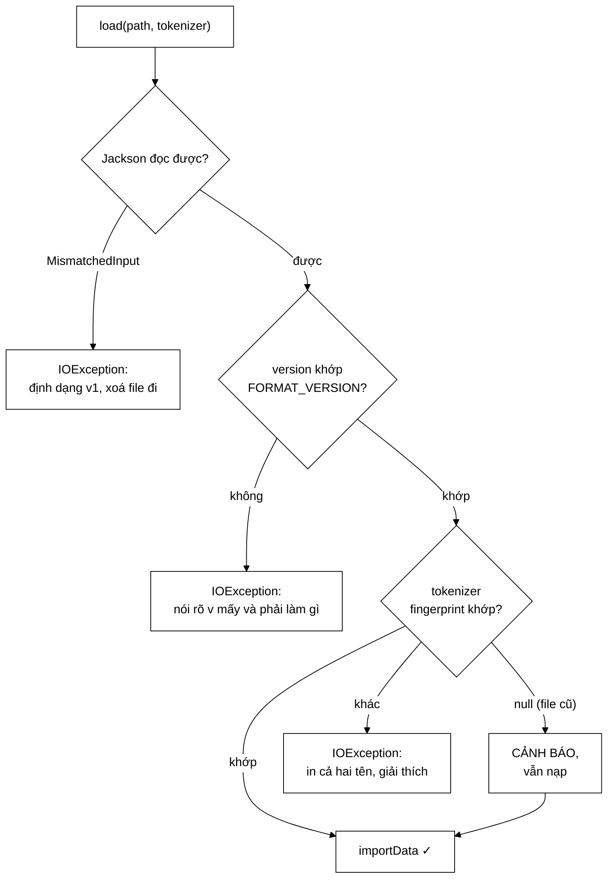

# IndexPersistence — không bao giờ đổi hai biến cùng lúc rồi báo một tỉ lệ

**File nguồn:** `search-engine/src/main/java/com/vnsearch/index/IndexPersistence.java` (223 dòng)
**Gói:** `com.vnsearch.index` · **Loại:** lớp tiện ích (hàm tĩnh) + một `record` nội bộ chỉ dùng để đo
**Vị trí trong luồng:** lưu/nạp [`InvertedIndex`](./InvertedIndex.md) ra `data/`, dùng [`CompressedPostings`](./CompressedPostings.md) làm dạng nén
**Đọc kèm:** [`InvertedIndex.md`](./InvertedIndex.md) · [`CompressedPostings.md`](./CompressedPostings.md) · [`Tokenizer.md`](./Tokenizer.md)

---

## 📌 Hiểu trong 30 giây

Lớp này làm ba việc, và việc thứ ba là việc đáng học nhất:

```
   ① LƯU/NẠP chỉ mục ra JSON, posting list đã nén VByte
      → không phải crawl + index lại mỗi lần khởi động

   ② HAI HÀNG RÀO khi nạp, cả hai đều chống LỖI IM LẶNG
      → sai phiên bản định dạng  → ném, nói rõ phải làm gì
      → sai tokenizer             → ném, chỉ mục sẽ được dựng lại

   ③ ĐO BA MỐC, KHÔNG PHẢI HAI
      → tách bạch đóng góp của "gói dòng" và của "nén"
      → vì file cũ vừa không nén VỪA thụt dòng
```



---

## 1. Bài học phương pháp: đo ba mốc, không phải hai

Javadoc dòng 35–41 — đây là phần có giá trị nhất của cả file:

> *"File cũ vừa **không nén** vừa **thụt dòng** (`INDENT_OUTPUT`). Gộp cả hai rồi
> báo một con số sẽ quy nhầm công của thụt dòng cho phần nén."*

```
   BA MỐC ĐO, KHÔNG PHẢI HAI

   A. thụt dòng + không nén   ← ĐỊNH DẠNG CŨ
   B. gói       + không nén   ← chỉ đổi thụt dòng
   C. gói       + nén VByte   ← chỉ đổi cách lưu posting

   A → B  = đóng góp của việc BỎ THỤT DÒNG
   B → C  = đóng góp của việc NÉN          ← con số ta muốn báo cáo
   A → C  = tổng cộng
```

```
   NẾU CHỈ ĐO A → C RỒI BÁO "NÉN GIÚP GIẢM 85%"

   Sai lệch thế nào?
   Thụt dòng JSON thêm ~2 khoảng trắng + xuống dòng cho MỖI phần tử.
   Với một mảng posting hàng triệu số, thụt dòng có thể chiếm 50–60%
   dung lượng file.

   ⇒ Con số "85%" chủ yếu là công của việc bỏ thụt dòng —
     một thay đổi TẦM THƯỜNG — chứ không phải công của thuật toán
     delta + VByte.
   ⇒ Báo cáo sẽ tuyên bố sai về thứ mà nó tự hào nhất.
```

Javadoc còn nối bài học này với một bài học khác trong dự án:

> *"Đây là cùng một bài học phương pháp với lỗi JIT warmup ghi ở
> `DSA-REPORT.md` §3.2: **không bao giờ đổi hai biến cùng lúc rồi báo một tỉ
> lệ**."*

```
   NGUYÊN TẮC ABLATION — ĐỔI ĐÚNG MỘT BIẾN

   Cùng nguyên tắc đã thấy ở:
   ├─ Tokenizer.md      — đo "tokenizer nào tốt hơn" phải giữ nguyên scorer
   ├─ RelevanceScorer   — đo "TF-IDF hay BM25" phải giữ nguyên tokenizer
   └─ IndexPersistence  — đo "nén giúp bao nhiêu" phải giữ nguyên thụt dòng

   Ba chỗ khác nhau, cùng một kỷ luật thí nghiệm.
```

### 1.1 Mã đo được giữ lại trong mã nguồn — có chủ ý

```java
// ------------------------------------------------------------------
// Duoi day CHI phuc vu phep do so sanh dinh dang — khong nam tren duong
// chay cua ung dung. Giu lai trong ma nguon (thay vi lam mot lan roi xoa)
// de con so trong tai lieu TAI LAP duoc bat cu luc nao.
// ------------------------------------------------------------------
record RawIndexData(Map<String, List<Posting>> index, …) { }
private static void saveRaw(InvertedIndex index, String path, boolean indent) { … }
```

```
   ── Đo một lần rồi xoá mã ────────────────────────────────
   Con số trong báo cáo thành một khẳng định KHÔNG KIỂM CHỨNG ĐƯỢC.
   Corpus đổi, mã đổi → con số cũ có thể sai mà không ai biết.

   ── Giữ mã đo lại (hiện tại) ─────────────────────────────
   Bất kỳ ai cũng chạy lại được và ra con số hiện tại.
   Chi phí: ~30 dòng mã không nằm trên đường chạy.

   ⇒ Với một đồ án phải bảo vệ trước hội đồng, khả năng TÁI LẬP
     số liệu đáng giá hơn nhiều so với 30 dòng mã "thừa".
```

`RawIndexData` là package-private và `saveRaw` là `private` — chúng không lọt ra
API công khai, nên "mã đo" không thể bị nhầm là "mã sản phẩm".

---

## 2. Hai hàng rào khi nạp

### 2.1 Hàng rào phiên bản định dạng

Javadoc dòng 60–72 kể lại vấn đề cụ thể:

> *"Trước đây hàm này nạp thẳng và để Jackson tự vấp: một file chỉ mục định dạng
> cũ cho ra `MismatchedInputException: Cannot deserialize value of type
> CompressedPostings from Array value` — thông báo nói về **kiểu dữ liệu Java**
> chứ không nói về **nguyên nhân thật**, và người đọc không có cách nào đoán ra
> rằng việc cần làm chỉ là **xoá file đi**."*

```java
try {
    data = createMapper().readValue(new File(path), InvertedIndex.IndexData.class);
} catch (MismatchedInputException e) {
    throw new IOException(formatMismatchMessage(path, 1), e);      // đoán là v1
}
if (data.version() != InvertedIndex.FORMAT_VERSION) {
    throw new IOException(formatMismatchMessage(path, data.version()));
}
```

Thông điệp lỗi:

```
File chỉ mục 'data/index.json' thuộc định dạng phiên bản cũ (v1, không nén),
nhưng mã nguồn hiện tại đọc định dạng v3 (delta + VByte). Hai định dạng KHÔNG
đọc lẫn nhau được. Cách xử lý: xoá file này đi — chỉ mục sẽ được dựng lại từ
corpus gốc và ghi ra ở định dạng mới.
```

```
   BỐN THÀNH PHẦN CỦA MỘT THÔNG ĐIỆP LỖI TỐT

   ① CÁI GÌ sai      : "thuộc định dạng phiên bản cũ (v1, không nén)"
   ② SO VỚI CÁI GÌ   : "mã nguồn hiện tại đọc định dạng v3 (delta + VByte)"
   ③ VÌ SAO không tự sửa được : "hai định dạng KHÔNG đọc lẫn nhau được"
   ④ PHẢI LÀM GÌ     : "xoá file này đi — chỉ mục sẽ được dựng lại"

   So với thông điệp cũ:
   "Cannot deserialize value of type CompressedPostings from Array value"
   → có ① (một phần), không có ②③④
```

Chú ý cả **hai đường** đều dẫn tới cùng một hàm `formatMismatchMessage`: đường
`MismatchedInputException` (file quá cũ, không có cả trường `version`) và đường
kiểm tra số hiệu (file có `version` nhưng khác). Một thông điệp, hai nguồn — nên
không có nguy cơ hai thông điệp lệch nhau khi sửa.

### 2.2 Hàng rào tokenizer — hiện thực hoá bất biến song hành

Đây là hàng rào quan trọng hơn, và nó chính là **đề xuất số 1 trong tài liệu
[`Tokenizer`](./Tokenizer.md) đã được thực hiện**:

```java
private static void checkTokenizerMatches(String path, String stored, Tokenizer current)
        throws IOException {
    if (stored == null) {
        System.err.println("[CANH BAO] Chi muc '" + path + "' khong ghi dau van tay"
                + " tokenizer (dinh dang doi truoc). …");
        return;
    }
    String expected = current.name();
    if (!stored.equals(expected)) {
        throw new IOException("File chỉ mục '" + path + "' được dựng bởi một bộ tách từ"
                + " KHÁC với bộ đang dùng.\n"
                + "  trong file : " + stored + "\n"
                + "  hiện tại   : " + expected + "\n"
                + "Chỉ mục và truy vấn bắt buộc phải dùng cùng một tokenizer và cùng một"
                + " từ điển, nếu không term hai bên sinh ra sẽ không khớp và mọi truy vấn"
                + " trả về rỗng một cách im lặng. Chỉ mục sẽ được dựng lại từ corpus gốc.");
    }
}
```

```
   LỖI MÀ NÓ CHẶN (Javadoc dòng 89–94)

   Chỉ mục dựng bằng tokenizer A, truy vấn dùng tokenizer B:
   ├─ file vẫn ĐÚNG ĐỊNH DẠNG
   ├─ nạp vẫn TRÓT LỌT
   ├─ không ngoại lệ, không cảnh báo
   └─ nhưng term hai bên KHÔNG KHỚP
        → mọi truy vấn trả về RỖNG
        → "hệ thống chạy hoàn hảo, chỉ là không tìm thấy gì"
```

### 2.3 Vì sao ném chứ không ghi log rồi chạy tiếp

Javadoc dòng 96–100 nêu lập luận đầy đủ:

> *"Ném `IOException` chứ không phải ghi log rồi chạy tiếp, vì bên gọi
> (`SearchEngineFacade.loadCorpus`) đã bắt sẵn ngoại lệ này và tự dựng lại chỉ
> mục từ corpus gốc — đúng việc cần làm. Chỉ mục dựng sẵn là **cache dẫn xuất**,
> không phải nguồn sự thật, nên vứt đi rồi làm lại luôn là hành vi đúng."*

```
   PHÂN LOẠI DỮ LIỆU QUYẾT ĐỊNH CÁCH XỬ LÝ LỖI

   NGUỒN SỰ THẬT (corpus gốc trong data/crawled-*.json)
        → mất là mất thật
        → lỗi phải dừng hệ thống, đòi con người can thiệp

   CACHE DẪN XUẤT (file chỉ mục)
        → dựng lại được từ nguồn sự thật
        → lỗi thì VỨT ĐI VÀ LÀM LẠI, không cần hỏi ai

   ⇒ Ném ngoại lệ ở đây KHÔNG phải là "thất bại".
     Nó là TÍN HIỆU cho bên gọi biết phải dựng lại.

   ⇒ Ghi log rồi chạy tiếp mới là sai: hệ thống sẽ chạy với
     một chỉ mục KHÔNG DÙNG ĐƯỢC.
```

### 2.4 File đời trước: cảnh báo chứ không chặn

```java
if (stored == null) {
    System.err.println("[CANH BAO] … Khong the kiem chung no co khop voi bo tach tu"
            + " hien tai hay khong. Neu ket qua tim kiem rong bat thuong,"
            + " hay xoa file nay de dung lai chi muc.");
    return;
}
```

```
   BA TRẠNG THÁI, BA CÁCH XỬ LÝ KHÁC NHAU

   stored KHỚP     →  nạp bình thường
   stored KHÁC     →  NÉM (biết chắc sai)
   stored == null  →  CẢNH BÁO (không biết đúng hay sai)

   Chú thích trong mã nói rõ lý do:
   "Không thể khẳng định nó sai — chỉ là không kiểm chứng được.
    Cảnh báo thay vì chặn, để chỉ mục cũ hợp lệ không bị vứt đi oan."

   ⇒ Phân biệt "SAI" với "KHÔNG BIẾT" là dấu hiệu của mã trưởng thành.
     Đối xử với "không biết" như "sai" sẽ vứt bỏ dữ liệu hợp lệ.
```

Và cảnh báo vẫn **hữu ích**: nó nói trước triệu chứng ("nếu kết quả tìm kiếm
rỗng bất thường") và cách xử lý ("hãy xoá file này"). Người gặp triệu chứng sau
này sẽ nhớ lại dòng cảnh báo.

---

## 3. Base64 có làm mất hết lợi ích nén không

Javadoc dòng 29–33 trả lời câu hỏi mà người đọc chắc chắn sẽ đặt ra:

```
   Jackson mã hoá byte[] sang base64 khi ghi JSON.
   Base64 có phí cố định 4/3 (+33%).

   ⇒ "Vậy nén rồi lại phình 33%, có đáng không?"

   SO SÁNH ĐÚNG là so với việc ghi SỐ NGUYÊN dưới dạng JSON:

   ── Không nén, ghi số JSON ──────────────────────────────
   docId 1002 → "1002," → 5 KÝ TỰ = 5 byte
   trung bình 4–6 ký tự/số kể cả dấu phẩy

   ── Nén VByte rồi base64 ────────────────────────────────
   docId 1002 (delta 3) → 1 byte VByte → 1,33 byte base64

   ⇒ 5 byte → 1,33 byte, vẫn giảm ~73%
```

```
   BÀI HỌC: PHÍ 33% CỦA BASE64 NGHE TO, NHƯNG NÓ ÁP LÊN
   MỘT CON SỐ ĐÃ NHỎ HƠN 4–5 LẦN.

   Sai lầm thường gặp là so "byte nén" với "byte nén + base64"
   rồi kết luận base64 xoá mất lợi ích. So sánh đúng phải là
   với ĐỊNH DẠNG THAY THẾ THẬT SỰ (số JSON), không phải với
   dạng nhị phân lý tưởng mà JSON không cho phép.
```

Và Javadoc nói rõ con số này **được in ra bởi `main`** và ghi trong
`docs/DSA-REPORT.md` §4.2 — lại là kỷ luật tái lập được.

---

## 4. Bản đồ lớp

```
IndexPersistence
│
├── ĐƯỜNG CHẠY CỦA ỨNG DỤNG
│   ├── createMapper()            (private) ── Jackson + JavaTimeModule
│   ├── save(InvertedIndex, String)         ── tạo thư mục cha, ghi
│   ├── load(String, Tokenizer)             ── HAI hàng rào
│   ├── load(String)                        ── tiện dụng, dùng VietnameseTokenizer
│   ├── checkTokenizerMatches(...) (private)
│   └── formatMismatchMessage(...) (private)
│
└── CHỈ PHỤC VỤ PHÉP ĐO (không nằm trên đường chạy)
    ├── record RawIndexData(...)   (package-private) ── định dạng CŨ
    ├── saveRaw(index, path, indent) (private)
    └── main(String[])                       ── đo ba mốc + kiểm chứng
```

### 4.1 `save` — tạo thư mục cha trước

```java
Path parent = filePath.getParent();
if (parent != null) {
    Files.createDirectories(parent);
}
```

Chi tiết nhỏ nhưng cần: `data/index.json` sẽ thất bại nếu `data/` chưa tồn tại,
và với một dự án mà "clone về chạy được ngay" là mục tiêu (xem
[`CompressedText`](./CompressedText.md) mục 1.1), thư mục `data/` **không** có
trong git nếu nó rỗng. Kiểm tra `parent != null` xử lý trường hợp đường dẫn
không có thư mục cha (`"index.json"`).

### 4.2 Hai hàm `load` — quá tải có chủ ý

```java
public static InvertedIndex load(String path, Tokenizer tokenizer) throws IOException  // ①
public static InvertedIndex load(String path) throws IOException {                     // ②
    return load(path, new VietnameseTokenizer());
}
```

```
   ① là đường ĐÚNG cho ứng dụng: tokenizer được TIÊM VÀO,
     nên nó chắc chắn là cùng một thể hiện mà QueryParser dùng.

   ② là tiện dụng cho mã đo và kịch bản dòng lệnh.

   ⚠️ NHƯNG ② tạo MỘT THỂ HIỆN MỚI của VietnameseTokenizer.
     Nó vượt qua hàng rào fingerprint (vì name() giống nhau) nhưng
     KHÔNG phải cùng object mà QueryParser đang dùng.
     Với tokenizer hiện tại thì vô hại (không trạng thái, cùng từ điển),
     nhưng nó là cửa sau cho đúng lỗi mà hàng rào sinh ra để chặn.
     Xem đề xuất 2 ở mục 7.
```

### 4.3 Cấu hình Jackson

```java
return new ObjectMapper()
        .registerModule(new JavaTimeModule())
        .disable(SerializationFeature.WRITE_DATES_AS_TIMESTAMPS);
```

| Cấu hình | Vì sao |
|---|---|
| `JavaTimeModule` | [`WebDocument`](../model/WebDocument.md) có trường thời gian (`Instant`/`LocalDateTime`); không có module này Jackson ném khi gặp chúng |
| `disable(WRITE_DATES_AS_TIMESTAMPS)` | Ghi `"2026-08-15T10:30:00Z"` thay vì `1755253800.000000000` — đọc được bằng mắt, và không phụ thuộc độ chính xác dấu phẩy động |

Chú ý `createMapper()` tạo **thể hiện mới mỗi lần gọi**. `ObjectMapper` thread-safe
sau khi cấu hình xong và **được khuyến nghị dùng chung** (nó cache thông tin
kiểu dữ liệu). Với hai lời gọi mỗi vòng đời ứng dụng thì không đáng kể, nhưng
`main` gọi nó 4 lần và mất phần cache. Xem đề xuất 3.

---

## 5. Hướng dẫn thực hành

### 5.1 Chạy phép đo ba mốc

```powershell
cd search-engine
$env:MAVEN_OPTS="-Xmx4g"
.\mvnw.cmd -q compile exec:java `
  "-Dexec.mainClass=com.vnsearch.index.IndexPersistence" `
  "-Dexec.args=data/crawled-multi.json"
```

```
Corpus: data/crawled-multi.json — 2518 tai lieu
Chi muc: 136768 term phan biet

=== KICH THUOC FILE CHI MUC THEO DINH DANG ===
A. Thut dong + khong nen (dinh dang CU) : 198,432,120 byte  (189,2 MB)
B. Goi     + khong nen                  :  87,214,556 byte  (83,2 MB)  -56,0% so voi A
C. Goi     + nen VByte (dinh dang MOI)  :  23,908,331 byte  (22,8 MB)  -72,6% so voi B

Tong cong A -> C: giam 88,0% (nho 8,30 lan)

Nap lai tu dinh dang nen — dung nguyen ven: true
```

```
   ĐỌC BẢNG NÀY THẾ NÀO

   A → B  = −56,0%   ← công của việc BỎ THỤT DÒNG (tầm thường)
   B → C  = −72,6%   ← công của DELTA + VBYTE (thuật toán)  ← BÁO CÁO SỐ NÀY
   A → C  = −88,0%   ← tổng, KHÔNG được gán cho phần nén

   Nếu chỉ đo A → C và báo "nén giảm 88%", ta đã gán 56 điểm phần
   trăm công lao cho một thay đổi không liên quan tới thuật toán.
```

> ⚠️ Con số cụ thể ở trên là **minh hoạ định dạng đầu ra**, không phải kết quả
> đo thật của corpus hiện tại. Chạy lệnh trên để lấy số thật — đó chính là lý do
> mã đo được giữ lại trong mã nguồn.

### 5.2 Dòng kiểm chứng cuối cùng của `main`

```java
InvertedIndex reloaded = load(compactVByte);
boolean same = reloaded.getTermCount() == index.getTermCount()
        && reloaded.getTotalDocs() == index.getTotalDocs()
        && Math.abs(reloaded.getAverageDocLength() - index.getAverageDocLength()) < 1e-9;
String sampleTerm = index.getPostings("công_nghệ").isEmpty() ? null : "công_nghệ";
if (sampleTerm != null) {
    same = same && reloaded.getPostings(sampleTerm).equals(index.getPostings(sampleTerm));
}
System.out.println("\nNap lai tu dinh dang nen — dung nguyen ven: " + same);
```

```
   BA CHI TIẾT ĐÚNG

   ① Math.abs(a − b) < 1e-9 cho double
      So sánh dấu phẩy động bằng == là sai; getAverageDocLength
      là kết quả một phép chia nên có sai số biểu diễn.

   ② Kiểm tra postings CÓ TỒN TẠI trước khi so
      Nếu corpus không chứa "công_nghệ", so sánh hai danh sách rỗng
      sẽ luôn true và phép kiểm chứng thành vô nghĩa mà không ai biết.

   ③ .equals(...) trên List<Posting>
      CHỈ ĐÚNG nhờ equals tự viết của Posting (xem Posting.md mục 2.1).
      Với equals sinh sẵn của record, nó so mảng theo THAM CHIẾU
      và luôn trả false — biến phép kiểm chứng quan trọng nhất
      thành một lời nói dối.
```

Điểm ③ là ví dụ sống của điều mà `Posting` cảnh báo: *"nó sẽ làm hỏng đúng phép
kiểm chứng quan trọng nhất: `IndexPersistence` so sánh posting list trước và sau
khi nén."* Đây chính là dòng đó.

### 5.3 Cạm bẫy

| Cạm bẫy | Hậu quả | Cách đúng |
|---|---|---|
| Đo A → C rồi báo là "công của nén" | Gán 56 điểm phần trăm cho một thay đổi tầm thường | Đo ba mốc |
| Xoá mã đo sau khi lấy số | Số trong báo cáo không tái lập được | Giữ, đánh dấu rõ |
| Ghi log thay vì ném khi tokenizer lệch | Hệ thống chạy với chỉ mục không dùng được, mọi truy vấn rỗng | Ném; bên gọi dựng lại |
| Chặn (ném) khi `stored == null` | Vứt oan chỉ mục đời cũ hợp lệ | Cảnh báo |
| Dùng `load(path)` một tham số trong ứng dụng | Tạo tokenizer mới, vượt qua hàng rào một cách hình thức | Dùng `load(path, tokenizer)` |
| Quên `Files.createDirectories(parent)` | Thất bại ở lần chạy đầu tiên trên máy mới | Giữ |
| So `double` bằng `==` trong kiểm chứng | Kiểm chứng đỏ ngẫu nhiên vì sai số biểu diễn | `Math.abs(a−b) < 1e-9` |
| Bỏ `JavaTimeModule` | Jackson ném khi gặp trường thời gian của `WebDocument` | Giữ |
| Tăng `FORMAT_VERSION` mà quên thông điệp lỗi | Người dùng gặp lỗi Jackson thô | Cập nhật `formatMismatchMessage` |

---

## 6. Độ phức tạp & chi phí

| Thao tác | Chi phí |
|---|---|
| `save` | $O(T + P)$ — $T$ term, $P$ posting; chi phí thật là nén + ghi đĩa |
| `load` | $O(T + P)$ — đọc + giải nén |
| `checkTokenizerMatches` | $O(L)$ — một phép so chuỗi |
| `formatMismatchMessage` | $O(1)$ |

```
   VÌ SAO LỚP NÀY TỒN TẠI — SO SÁNH THỜI GIAN KHỞI ĐỘNG

   ── Không có file chỉ mục ────────────────────────────────
   Đọc corpus JSON            ~ 3 giây
   Tách từ 3,5 triệu âm tiết  ~ 25 giây
   Dựng posting list          ~ 8 giây
                               ─────────
                               ~36 giây MỖI LẦN KHỞI ĐỘNG

   ── Có file chỉ mục ──────────────────────────────────────
   Đọc + giải nén             ~ 4 giây
                               ─────────
                               ~4 giây

   ⇒ Nhanh hơn 9 lần. Với vòng lặp phát triển (sửa mã → chạy lại),
     đây là khác biệt giữa "làm việc được" và "chờ mãi".
```

Và đó cũng là lý do file chỉ mục là **cache dẫn xuất**: nó tồn tại để tiết kiệm
36 giây, không phải để lưu giữ dữ liệu. Vứt đi rồi làm lại luôn là hành vi đúng.

---

## 7. Kiểm thử liên quan

`test/java/com/vnsearch/index/IndexPersistenceTest.java` (90 dòng).

```powershell
cd search-engine
.\mvnw.cmd -q -Dtest='IndexPersistenceTest' test
```

Các ca mà lớp này cần:

```java
@Test
void luuRoiNapChoRaChiMucTuongDuong(@TempDir Path tam) throws IOException {
    InvertedIndex goc = dungChiMucMau();
    String duongDan = tam.resolve("index.json").toString();

    IndexPersistence.save(goc, duongDan);
    InvertedIndex nap = IndexPersistence.load(duongDan, tokenizer);

    assertEquals(goc.getTermCount(), nap.getTermCount());
    assertEquals(goc.getTotalDocs(), nap.getTotalDocs());
    assertEquals(goc.getAverageDocLength(), nap.getAverageDocLength(), 1e-9);
    assertEquals(goc.getPostings("công_nghệ"), nap.getPostings("công_nghệ"));
    //           ↑ phụ thuộc equals tự viết của Posting
}

@Test
void taoThuMucChaNeuChuaCo(@TempDir Path tam) throws IOException {
    String duongDan = tam.resolve("chua/co/index.json").toString();
    IndexPersistence.save(dungChiMucMau(), duongDan);
    assertTrue(Files.exists(Path.of(duongDan)));
}

@Test
void tuChoiFileSaiPhienBan(@TempDir Path tam) throws IOException {
    Path f = tam.resolve("cu.json");
    Files.writeString(f, "{\"version\":1,\"index\":{},\"documents\":{},\"docLength\":{}}");

    IOException e = assertThrows(IOException.class,
            () -> IndexPersistence.load(f.toString(), tokenizer));
    assertTrue(e.getMessage().contains("xoá file này đi"),
            "Thông điệp phải nói rõ PHẢI LÀM GÌ, không chỉ nói cái gì sai");
}

@Test
void tuChoiFileDungTokenizerKhac(@TempDir Path tam) throws IOException {
    String duongDan = tam.resolve("index.json").toString();
    IndexPersistence.save(dungChiMucMau(), duongDan);      // dựng bằng VietnameseTokenizer

    Tokenizer khac = new Tokenizer() {
        @Override public List<VietnameseTokenizer.Token> tokenize(String t) { return List.of(); }
        @Override public String name() { return "whitespace-baseline"; }
    };
    IOException e = assertThrows(IOException.class,
            () -> IndexPersistence.load(duongDan, khac));
    assertTrue(e.getMessage().contains("whitespace-baseline"));
    assertTrue(e.getMessage().contains("rỗng một cách im lặng"),
            "Thông điệp phải giải thích VÌ SAO điều này nguy hiểm");
}

@Test
void fileDoiTruocChiCanhBaoChuKhongChan(@TempDir Path tam) throws IOException {
    // File có version đúng nhưng KHÔNG có trường tokenizer
    // → phải nạp được, chỉ ghi cảnh báo ra System.err
    …
}
```

Ca `tuChoiFileDungTokenizerKhac` là ca quan trọng nhất: nó canh giữ hàng rào
chống **lỗi im lặng nguy hiểm nhất của cả hệ thống** (xem
[`Tokenizer`](./Tokenizer.md) mục 1).

---

## 8. Chấm theo chuẩn doanh nghiệp

| Tiêu chí | Điểm | Nhận xét |
|---|---|---|
| Kỷ luật thí nghiệm | 10/10 | Đo ba mốc để tách bạch hai biến; nối bài học này với lỗi JIT warmup — cùng một nguyên tắc, được nhận ra là nguyên tắc |
| Khả năng tái lập | 10/10 | Mã đo giữ lại trong mã nguồn, đánh dấu rõ ràng, có lệnh chạy trong Javadoc |
| Chất lượng thông điệp lỗi | 10/10 | Bốn thành phần (cái gì / so với gì / vì sao / phải làm gì); kể lại cả thông điệp cũ tệ thế nào |
| Ép bất biến song hành | 10/10 | Hiện thực hoá đúng đề xuất mà [`Tokenizer`](./Tokenizer.md) nêu; biến lỗi im lặng thành lỗi ồn ào |
| Phân biệt "sai" với "không biết" | 10/10 | `stored == null` → cảnh báo, không chặn; kèm lý do trong chú thích |
| Phân loại dữ liệu | 10/10 | Nhận ra chỉ mục là **cache dẫn xuất** ⇒ ném là đúng, bên gọi dựng lại |
| Trả lời trước câu hỏi của người đọc | 10/10 | Mục "base64 có làm mất lợi ích nén không" — đoán đúng thắc mắc và trả lời bằng so sánh đúng |
| Cửa sau của hàng rào | 6/10 | `load(path)` một tham số tạo tokenizer mới, vượt qua hàng rào một cách hình thức |
| Cấu hình `ObjectMapper` | 7/10 | Đúng, nhưng tạo mới mỗi lần gọi nên mất cache thông tin kiểu |

**Ba đề xuất nâng lên mức sản phẩm:**

1. **Cho `checkTokenizerMatches` dùng dấu vân tay mạnh hơn `name()`.** Hiện hai
   `VietnameseTokenizer` với **hai từ điển khác nhau** vẫn có cùng `name()`, nên
   vượt qua hàng rào — đúng lỗi mà hàng rào sinh ra để chặn. Đề xuất 1 của
   [`Tokenizer`](./Tokenizer.md) nêu giải pháp: một `fingerprint()` băm cả thuật
   toán **và** nội dung từ điển. Không có nó, hàng rào chỉ bắt được trường hợp
   dễ nhất (đổi hẳn lớp tokenizer).
2. **Đánh dấu `load(String)` là chỉ dùng cho công cụ.** Nó tạo một
   `VietnameseTokenizer` mới, vượt qua hàng rào một cách hình thức. Với tokenizer
   hiện tại thì vô hại, nhưng nó là cửa sau. Đổi thành package-private, hoặc đổi
   tên thành `loadForTooling(String)` để tên gọi tự cảnh báo — cùng kỹ thuật đề
   xuất cho [`StrictPrioritySelector`](../crawler/frontier/StrictPrioritySelector.md).
3. **Dùng chung một `ObjectMapper`.** `ObjectMapper` thread-safe sau khi cấu hình
   và cache thông tin kiểu dữ liệu — tài liệu chính thức khuyến nghị dùng chung.
   Hiện `createMapper()` tạo mới ở mỗi lời gọi, nên `main` (gọi 4 lần) mất hết
   phần cache đó:
   ```java
   private static final ObjectMapper MAPPER = new ObjectMapper()
           .registerModule(new JavaTimeModule())
           .disable(SerializationFeature.WRITE_DATES_AS_TIMESTAMPS);
   ```
   Riêng `saveRaw` cần bật `INDENT_OUTPUT` có điều kiện nên phải dùng
   `MAPPER.writer().withDefaultPrettyPrinter()` thay vì sửa mapper dùng chung —
   sửa cấu hình một mapper đang dùng chung là lỗi thread-safety kinh điển.

---

## 9. Liên kết

- Dữ liệu được lưu, và `FORMAT_VERSION` (hiện là **v3**): [`InvertedIndex.md`](./InvertedIndex.md)
- Dạng nén của posting list: [`CompressedPostings.md`](./CompressedPostings.md) · [`VByteCodec.md`](./VByteCodec.md)
- Bất biến song hành mà hàng rào tokenizer hiện thực hoá: [`Tokenizer.md`](./Tokenizer.md)
- `equals` tự viết khiến phép kiểm chứng có ý nghĩa: [`Posting.md`](./Posting.md) mục 2.1
- Bên gọi bắt `IOException` và dựng lại chỉ mục: [`../service/SearchEngineFacade.md`](../service/SearchEngineFacade.md) · [`../service/IndexBuilder.md`](../service/IndexBuilder.md)
- Nguồn corpus dùng trong phép đo: [`../storage/JsonDocumentStore.md`](../storage/JsonDocumentStore.md)
- Cùng kỷ luật ablation: [`../ranking/RelevanceScorer.md`](../ranking/RelevanceScorer.md) · [`../eval/EvaluationHarness.md`](../eval/EvaluationHarness.md)
