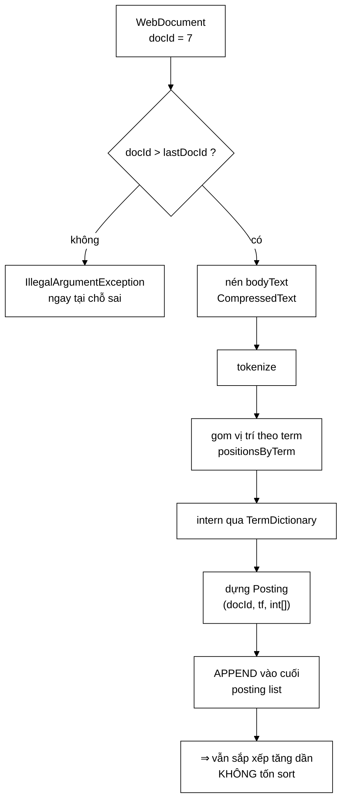
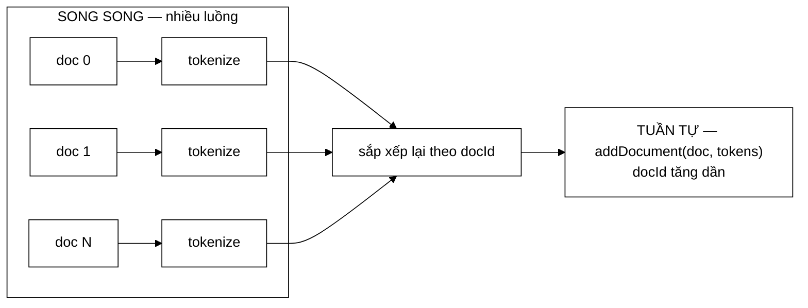

# InvertedIndex — bất biến được ép miễn phí, và một lỗi im lặng có thật đã xảy ra

**File nguồn:** `search-engine/src/main/java/com/vnsearch/index/InvertedIndex.java` (458 dòng)
**Gói:** `com.vnsearch.index` · **Loại:** cài đặt [`SearchIndex`](./SearchIndex.md); **không** thread-safe khi ghi, an toàn khi chỉ đọc
**Vị trí trong luồng:** trái tim của tầng chỉ mục — nơi mọi bất biến của hệ thống được sinh ra và được ép
**Đọc kèm:** [`SearchIndex.md`](./SearchIndex.md) · [`Posting.md`](./Posting.md) · [`TermDictionary.md`](./TermDictionary.md) · [`IndexPersistence.md`](./IndexPersistence.md)

---

## 📌 Hiểu trong 30 giây

Cấu trúc cốt lõi là `Map<String term, List<Posting>>`. Nhưng giá trị của lớp
nằm ở **bất biến trung tâm** và cách nó được giữ:

```
   BẤT BIẾN TRUNG TÂM
   Posting list của mọi term LUÔN sắp xếp TĂNG DẦN NGHIÊM NGẶT theo docId.

   Được bảo đảm MIỄN PHÍ — không tốn một phép sort nào — nhờ hai điều kiện:
   ① addDocument luôn được gọi theo thứ tự docId TĂNG DẦN
   ② mỗi lần chỉ APPEND vào cuối posting list

   Điều kiện ① trước đây phụ thuộc vào việc NGƯỜI GỌI nhớ sort trước.
   Nay lớp TỰ ÉP bằng lastDocId: gọi sai thì ném NGAY TẠI CHỖ SAI.
```



---

## 1. Ép bất biến — biến lỗi im lặng thành lỗi ồn ào

```java
private int lastDocId = Integer.MIN_VALUE;

public void addDocument(WebDocument doc, List<VietnameseTokenizer.Token> tokens) {
    int docId = doc.getDocId();
    if (docId <= lastDocId) {
        throw new IllegalArgumentException(
                "addDocument phai duoc goi theo docId TANG DAN de giu bat bien"
                        + " 'posting list sap xep theo docId'. docId truoc = " + lastDocId
                        + ", docId hien tai = " + docId
                        + ". Hay sap xep danh sach tai lieu truoc khi index.");
    }
    lastDocId = docId;
    …
}
```

Javadoc dòng 26–29 nêu lý do:

> *"Trước đây điều kiện (1) phụ thuộc vào việc **NGƯỜI GỌI** nhớ sort trước — một
> bất biến quan trọng mà lớp không tự bảo vệ. Nay lớp tự ép bằng `lastDocId`: gọi
> sai sẽ ném `IllegalArgumentException` **NGAY tại chỗ sai**, thay vì trả kết quả
> sai một cách im lặng ở tầng trên (binary search trên danh sách chưa sắp xếp cho
> kết quả tuỳ ý, **không ném ngoại lệ**)."*

```
   VÌ SAO "KHÔNG NÉM NGOẠI LỆ" LÀ PHẦN NGUY HIỂM NHẤT

   Binary search trên mảng chưa sắp xếp:
   ├─ KHÔNG ném gì
   ├─ KHÔNG treo
   ├─ Trả về MỘT chỉ số hợp lệ
   └─ Nhưng chỉ số đó SAI

   ⇒ getTermFrequency trả 0 cho tài liệu thật sự chứa term
   ⇒ BM25 chấm điểm 0
   ⇒ tài liệu biến mất khỏi kết quả
   ⇒ Không có lỗi nào để lần theo.

   Với 1.594.938 posting, "sai một chút" là không thể phát hiện
   bằng mắt.
```

```
   HAI CHỖ CÙNG DÙNG MỘT KỸ THUẬT

   ① lastDocId ở đây           — ép thứ tự docId
   ② CompressedPostings.of     — ép tf == |positions|

   Cả hai đều: BIẾN MỘT GIẢ ĐỊNH THÀNH MỘT PHÉP KIỂM TRA.
   Chi phí: một phép so sánh trên mỗi tài liệu / mỗi posting.
   Đổi lấy: không bao giờ có dữ liệu sai âm thầm.
```

Thông điệp lỗi nói cả **cái gì sai** (docId trước và hiện tại), **vì sao quan
trọng** (giữ bất biến nào), và **phải làm gì** ("hãy sắp xếp danh sách tài liệu
trước khi index") — cùng chuẩn với [`IndexPersistence`](./IndexPersistence.md).

---

## 2. Vì sao gom vị trí trước rồi mới dựng `Posting`

```java
// Gom vi tri theo term TRUOC, roi moi tao Posting: neu tao Posting ngay
// khi gap token thi mot term xuat hien 5 lan se sinh 5 Posting cho CUNG
// mot docId, pha vo gia dinh "moi (term, doc) mot posting" ma binary
// search dua vao.
Map<String, List<Integer>> positionsByTerm = new LinkedHashMap<>();
for (VietnameseTokenizer.Token token : tokens) {
    String term = termDictionary.intern(token.term());
    positionsByTerm.computeIfAbsent(term, k -> new ArrayList<>()).add(token.position());
    …
}
```

```
   NẾU DỰNG POSTING NGAY KHI GẶP TOKEN

   Tài liệu 7 chứa "máy_tính" 5 lần
        → 5 Posting, tất cả docId = 7
        → posting list: [.., (7,…), (7,…), (7,…), (7,…), (7,…), ..]

   Bất biến "tăng dần NGHIÊM NGẶT" bị phá.

   Hậu quả dây chuyền:
   ├─ binarySearchPosting trả về MỘT trong năm — không xác định cái nào
   ├─ getTermFrequency trả 1 thay vì 5  ⇒ BM25 chấm điểm sai
   ├─ getDocumentFrequency đếm 5 thay vì 1  ⇒ IDF sai cho MỌI truy vấn
   └─ CompressedPostings.of ném (may) hoặc nén sai
```

Điểm ② đáng chú ý: `getDocumentFrequency` được cài là `getPostings(term).size()`
— nó **giả định** mỗi tài liệu xuất hiện đúng một lần. IDF sai thì mọi điểm số
của mọi truy vấn đều lệch.

### 2.1 Chuyển `List<Integer>` sang `int[]` ngay tại chỗ

```java
// Chuyen sang int[] NGAY tai day: danh sach tam o tren chi song
// trong pham vi mot tai lieu, con mang ket qua thi nam lai trong chi
// muc suot vong doi ung dung. Xem Javadoc cua Posting ve so do.
List<Integer> positions = entry.getValue();
int[] packed = new int[positions.size()];
for (int i = 0; i < packed.length; i++) {
    packed[i] = positions.get(i);
}
```

```
   RANH GIỚI ĐÚNG GIỮA "TIỆN" VÀ "TIẾT KIỆM"

   List<Integer> — SỐNG NGẮN (trong một tài liệu)
        ├─ tiện: computeIfAbsent + add, không phải quản lý kích thước
        └─ chết ngay sau vòng lặp ⇒ GC thế hệ mới dọn gần như miễn phí

   int[] — SỐNG SUỐT VÒNG ĐỜI ỨNG DỤNG
        ├─ 3,8 triệu vị trí nằm trong chỉ mục mãi mãi
        └─ chênh lệch 87,5 MB vs 14,6 MB (xem Posting.md)

   ⇒ Dùng cấu trúc TIỆN cho dữ liệu SỐNG NGẮN,
     cấu trúc TIẾT KIỆM cho dữ liệu SỐNG LÂU.
```

---

## 3. Tìm không dấu — hai khoá trỏ tới cùng posting

```java
String term = termDictionary.intern(token.term());
positionsByTerm.computeIfAbsent(term, k -> new ArrayList<>()).add(token.position());
if (!token.noDiacriticTerm().equals(token.term())) {
    String noDiacritic = termDictionary.intern(token.noDiacriticTerm());
    positionsByTerm.computeIfAbsent(noDiacritic, k -> new ArrayList<>()).add(token.position());
}
```

```
   "máy_tính" ở vị trí 3 trong tài liệu 7 sinh HAI mục:

   index["máy_tính"] → Posting(7, …, [3, …])
   index["may_tinh"] → Posting(7, …, [3, …])

   ⇒ Truy vấn "may tinh" (gõ không dấu) vẫn tìm ra tài liệu chứa
     "máy tính".
```

**Điều kiện `!equals` là tối ưu quan trọng:**

```
   Với term vốn KHÔNG có dấu ("web", "internet", "123"):
        noDiacriticTerm == term
   ⇒ nếu không kiểm tra, ta thêm CÙNG một khoá hai lần
   ⇒ vị trí bị ghi ĐÔI ⇒ termFrequency GẤP ĐÔI ⇒ BM25 sai

   Điều kiện này không chỉ tiết kiệm — nó là ĐÚNG ĐẮN.
```

```
   CÁI GIÁ: SỐ KHOÁ TĂNG GẦN GẤP ĐÔI

   Tiếng Việt có dấu ⇒ hầu hết term sinh 2 khoá
   ⇒ ~136.768 khoá thay vì ~70.000

   Đây là đánh đổi có ý thức: gấp đôi bộ nhớ khoá để có tính năng
   tìm không dấu — thứ mà người dùng Việt Nam thật sự cần (gõ nhanh
   thường bỏ dấu).

   Lưu ý các Posting KHÔNG bị nhân đôi về nội dung mảng int[]:
   hai khoá trỏ tới HAI Posting khác nhau nhưng mỗi cái có mảng
   vị trí riêng. Xem đề xuất 3 ở mục 10.
```

---

## 4. Thân bài đi đường riêng, đã nén

```java
private final Map<Integer, byte[]> bodyTexts = new LinkedHashMap<>();
…
bodyTexts.put(docId, CompressedText.compress(doc.getBodyText()));
documents.put(docId, doc.withoutBodyText());
//                       └────────┬────────┘
//              Bản trong `documents` KHÔNG còn trường đó
```

```
   NẾU GIỮ CẢ HAI THÌ KHÔNG TIẾT KIỆM ĐƯỢC GÌ

   documents.put(docId, doc)                    ← còn nguyên bodyText
   bodyTexts.put(docId, compress(bodyText))     ← thêm bản nén
   ⇒ tốn 100% + 28% = 128%

   documents.put(docId, doc.withoutBodyText())  ← bỏ hẳn
   bodyTexts.put(docId, compress(bodyText))
   ⇒ tốn 28%
```

Xem [`CompressedText`](./CompressedText.md) về lựa chọn nén tại chỗ thay vì đọc
từ CSDL, và [`WebDocument.withoutBodyText`](../model/WebDocument.md).

`getBodyText` giải nén tại chỗ, và Javadoc cảnh báo rất rõ:

> *"**Gọi hàm này CHỈ cho những tài liệu thật sự được trả về.** Mỗi lần gọi là
> một lần giải nén; gọi cho toàn bộ ứng viên sẽ dùng hết phần tiết kiệm mà việc
> nén mang lại, lại thêm chi phí CPU. `ResultRanker` đã được chia hai giai đoạn
> đúng vì lý do này: chấm điểm trước cho mọi ứng viên, sinh đoạn trích sau chỉ
> cho top-K."*

---

## 5. `indexableText` là `public static` — để tách từ song song được

```java
public void addDocument(WebDocument doc) {
    addDocument(doc, tokenizer.tokenize(indexableText(doc)));
}

/**
 * Tach thanh ham cong khai de IndexBuilder tach tu SONG SONG tren nhieu nhan
 * roi moi nap tuan tu vao day. Neu ham nay chi la mot bieu thuc noi trong
 * addDocument, buoc tach tu — phan chiem gan nhu toan bo thoi gian dung chi
 * muc — bi khoa cung vao mot luong.
 */
public static String indexableText(WebDocument doc) {
    return String.join(" ",
            doc.getTitle() != null ? doc.getTitle() : "",
            doc.getMetaDescription() != null ? doc.getMetaDescription() : "",
            doc.getBodyText() != null ? doc.getBodyText() : "");
}
```



```
   VÌ SAO PHẢI TÁCH LÀM HAI GIAI ĐOẠN

   ── Tách từ ────────────────────────────────────────────
   Hàm THUẦN, không trạng thái, ~90% thời gian build
   ⇒ SONG SONG HOÁ ĐƯỢC

   ── Nạp vào chỉ mục ────────────────────────────────────
   Sửa nhiều Map dùng chung, và PHẢI theo thứ tự docId tăng dần
   ⇒ BẮT BUỘC TUẦN TỰ

   ⇒ Chia đôi cho phép song song hoá đúng phần đáng song song hoá.
     Với 8 nhân: ~36 giây xuống ~8 giây.
```

Chú ý ba phép kiểm tra `!= null` trong `String.join`: `String.join` chấp nhận
`null` nhưng biến nó thành chuỗi `"null"` — bốn ký tự đó sẽ thành một token
`"null"` trong chỉ mục, xuất hiện ở mọi tài liệu thiếu tiêu đề. Một lỗi nhỏ
nhưng làm bẩn chỉ mục vĩnh viễn.

---

## 6. `binarySearchPosting` — và lỗi 9 năm của JDK

```java
private static int binarySearchPosting(List<Posting> postings, int docId) {
    int low = 0;
    int high = postings.size() - 1;
    while (low <= high) {
        int mid = (low + high) >>> 1;          // ← KHÔNG phải / 2
        int midDocId = postings.get(mid).docId();
        if (midDocId == docId)      return mid;
        else if (midDocId < docId)  low = mid + 1;
        else                        high = mid - 1;
    }
    return -1;
}
```

Javadoc giải thích `>>>`:

> *"Với danh sách rất lớn, `low + high` có thể **TRÀN** int thành số âm, và `/2`
> giữ nguyên dấu âm → chỉ số âm. Dịch bit không dấu xử lý đúng cả khi tràn. Đây
> là lỗi kinh điển từng tồn tại **9 năm** trong `java.util.Arrays.binarySearch`
> của chính JDK."*

Cùng chi tiết đã gặp ở [`ArrayPostingCursor`](./ArrayPostingCursor.md) mục 2.3 —
và ở đó Javadoc còn ghi *"xem InvertedIndex"*, tức là hai chỗ trỏ về nhau. Đó là
cách đúng để không phải giải thích lại.

### 6.1 Gộp ba bản sao về một

```java
/**
 * Truoc day ham nay duoc SAO CHEP gan nhu y het o ba noi
 * (TfIdfScorer, BM25Scorer, va o day) — mot dang trung lap ma neu doi
 * cach luu tru (skip list, chi muc nen) se phai sua ba cho.
 * Nay gom ve dung mot cai dat.
 */
```

```
   BA BẢN SAO CỦA MỘT THUẬT TOÁN = BA CƠ HỘI VIẾT SAI `>>>` THÀNH `/2`
                                  = BA CHỖ PHẢI SỬA KHI ĐỔI CẤU TRÚC LƯU

   Và quan trọng hơn: ba bản sao gần như y hệt rất khó phát hiện
   là trùng lặp, vì mỗi bản nằm trong một lớp khác nhau với tên
   biến hơi khác nhau.
```

### 6.2 Tra bảng băm một lần thay vì hai

```java
// Lấy posting list MỘT lần rồi dùng lại. Trước đây dòng này gọi
// getPostings(term) hai lần, tức tra bảng băm hai lần cho cùng một khoá
// — mà đây là hàm nóng nhất của cả hệ thống: TF-IDF gọi nó cho MỖI ứng
// viên nhân MỖI term của truy vấn.
List<Posting> postings = getPostings(term);
int position = binarySearchPosting(postings, docId);
return position < 0 ? 0 : postings.get(position).termFrequency();
```

```
   3 term × 1.000 ứng viên = 3.000 lời gọi/truy vấn
   Tra bảng băm trên chuỗi ~8 ký tự  ≈ 20 ns
   ⇒ tiết kiệm 3.000 × 20 ns = 60 µs/truy vấn

   Nhỏ, nhưng miễn phí: chỉ là gán vào một biến cục bộ.
```

---

## 7. `FORMAT_VERSION = 3` và lỗi im lặng **đã thật sự xảy ra**

```java
/**
 * Lịch sử: v1 ghi posting list thẳng ra JSON, không nén.
 * v2 ghi ở dạng CompressedPostings (delta + VByte + base64).
 * v3 tách bodyText khỏi WebDocument sang một bản đồ riêng đã nén.
 * Các định dạng KHÔNG đọc lẫn nhau được.
 */
public static final int FORMAT_VERSION = 3;
```

Nhưng phần đáng đọc nhất là Javadoc của trường `tokenizer` trong `IndexData`:

> *"Vi phạm bất biến đó là một lỗi **hoàn toàn im lặng**. **Ví dụ thật đã xảy
> ra**: từ điển đổi từ 154 lên 49.793 mục, câu 'không trung thực' trước tách
> thành `[không_trung][thực]`, nay thành `[không][trung_thực]`. Chỉ mục cũ trên
> đĩa vẫn đúng định dạng v2, vẫn nạp trót lọt, và mọi truy vấn về chủ đề đó lặng
> lẽ trả về rỗng — **không ngoại lệ, không log, không test đỏ**."*

```
   ĐÂY LÀ TÀI LIỆU HÓA MỘT SỰ CỐ THẬT, KHÔNG PHẢI GIẢ ĐỊNH

   chỉ mục cũ (từ điển 154 mục):   khoá "không_trung", "thực"
   truy vấn mới (từ điển 49.793):  tìm  "không", "trung_thực"
                                        ────────────────────
                                        KHÔNG khoá nào khớp

   Ba tầng phòng thủ đều KHÔNG bắt được:
   ├─ version = 2 ✓ đúng định dạng
   ├─ Jackson    ✓ nạp trót lọt
   └─ test       ✓ xanh (test tự dựng cả hai phía cùng lúc)
```

```
   VÌ SAO version KHÔNG ĐỦ

   version canh ĐỊNH DẠNG NHỊ PHÂN — "file này đọc được không".
   Nó KHÔNG canh NỘI DUNG — "dữ liệu trong file này còn nghĩa không".

   ⇒ Cần một chiều canh gác thứ hai: dấu vân tay của thứ đã SINH RA
     dữ liệu, không chỉ của cách dữ liệu được GHI.
```

Trường `tokenizer` lưu [`Tokenizer.name()`](./Tokenizer.md), vốn đã chứa
**kích thước từ điển** (xem [`VietnameseTokenizer.name()`](./VietnameseTokenizer.md)),
nên đúng sự cố trên sẽ bị chặn: 154 ≠ 49.793 ⇒ tên khác ⇒
[`IndexPersistence`](./IndexPersistence.md) ném và dựng lại chỉ mục.

---

## 8. `importData` — hai cái bẫy khi nạp từ file

### 8.1 Phải `intern` lại khoá

```java
// intern lai khoa: nap tu file khong di qua addDocument, nen neu
// khong intern o day thi loi ich Flyweight bi mat sach sau moi lan
// khoi dong lai — Jackson tao mot String moi cho MOI khoa.
result.index.put(result.termDictionary.intern(entry.getKey()),
        entry.getValue().toPostings());
```

```
   Jackson đọc JSON và tạo MỘT String MỚI cho mỗi khoá.
   136.768 khoá ⇒ 136.768 chuỗi mới.

   Nếu không intern:
   ├─ kho Flyweight rỗng (không ai gọi intern)
   ├─ và mọi lợi ích của TermDictionary biến mất
   └─ SAU MỖI LẦN KHỞI ĐỘNG LẠI — tức là mọi lần chạy thật

   ⇒ Một tối ưu chỉ hoạt động ở đường build sẽ VÔ DỤNG trong
     sản phẩm, vì sản phẩm luôn đi đường nạp-từ-file.
```

Đây là bài học chung: **mọi tối ưu phải được kiểm tra trên đường đi thật của sản
phẩm**, không chỉ trên đường đi lúc phát triển.

### 8.2 Phải tính lại mọi trạng thái dẫn xuất

```java
// Nap lai tu file KHONG di qua addDocument, nen moi trang thai dan xuat
// phai duoc tinh lai o day. Quen mot cai la loi im lang: totalTokens = 0
// -> avgdl = 0 -> BM25 tra ve 0 cho MOI tai lieu.
result.recomputeDerivedState();
```

```java
private void recomputeDerivedState() {
    totalTokens = 0;
    for (int length : docLength.values()) totalTokens += length;
    lastDocId = documents.isEmpty()
            ? Integer.MIN_VALUE
            : documents.keySet().stream().mapToInt(Integer::intValue).max().orElse(Integer.MIN_VALUE);
}
```

```
   HAI TRẠNG THÁI DẪN XUẤT, HAI HẬU QUẢ NẾU QUÊN

   totalTokens = 0
        → getAverageDocLength() = 0
        → BM25 chia cho avgdl  ⇒  điểm 0 cho MỌI tài liệu
        → hệ thống trả về kết quả nhưng thứ hạng vô nghĩa

   lastDocId = Integer.MIN_VALUE
        → addDocument sau khi nạp file KHÔNG bị chặn
        → có thể thêm tài liệu docId nhỏ hơn ⇒ phá bất biến
```

Javadoc nêu lý do gom vào một hàm:

> *"Gom vào một chỗ để mọi đường vào cấu trúc (`addDocument`, `importData`) đều
> gọi đúng một hàm — thêm một trạng thái dẫn xuất mới chỉ phải sửa một nơi."*

```
   ⚠️ NHƯNG addDocument KHÔNG gọi recomputeDerivedState —
     nó cập nhật totalTokens và lastDocId TRỰC TIẾP.

   Lý do hợp lý (cập nhật tăng dần O(1) thay vì O(N) mỗi tài liệu),
   nhưng nó có nghĩa là "một nơi duy nhất" thật ra là HAI nơi:
   phép cập nhật tăng dần và phép tính lại toàn bộ phải luôn khớp nhau.
   Xem đề xuất 2 ở mục 10.
```

---

## 9. Bản đồ lớp

```
InvertedIndex  (implements SearchIndex)
│
├── TRẠNG THÁI CƠ BẢN
│   ├── index       : Map<String, List<Posting>>   ── chỉ mục ngược
│   ├── documents   : Map<Integer, WebDocument>    ── KHÔNG có bodyText
│   ├── docLength   : Map<Integer, Integer>
│   ├── bodyTexts   : Map<Integer, byte[]>         ── đã nén
│   ├── tokenizer   : Tokenizer
│   └── termDictionary : TermDictionary            ── Flyweight
│
├── TRẠNG THÁI DẪN XUẤT
│   ├── totalTokens : long        ── cho getAverageDocLength O(1)
│   └── lastDocId   : int         ── ÉP bất biến thứ tự
│
├── GHI
│   ├── addDocument(WebDocument)
│   ├── addDocument(WebDocument, List<Token>)      ── cho build song song
│   └── indexableText(WebDocument)  static public
│
├── ĐỌC — cài đặt SearchIndex
│   ├── getPostings / getDocumentFrequency / cursor      O(1)
│   ├── getTermFrequency / getPositions                  O(log n)
│   ├── getDocument / getBodyText / getAllDocuments
│   ├── getTermCount / getDocLength / getTotalDocs
│   └── getAverageDocLength                              O(1)
│
├── NGOÀI GIAO DIỆN
│   ├── getInternedTermCount() : int
│   └── getAllTerms() : Set<String>    ── khung nhìn unmodifiable
│
└── LƯU TRỮ
    ├── FORMAT_VERSION = 3
    ├── record IndexData(version, tokenizer, index, documents, bodyTexts, docLength)
    ├── exportData() / importData(...)
    └── recomputeDerivedState()
```

### 9.1 `LinkedHashMap` chứ không `HashMap` — có ý nghĩa

Cả bốn bản đồ đều là `LinkedHashMap`:

```
   LinkedHashMap giữ THỨ TỰ CHÈN khi duyệt.

   Hệ quả:
   ├─ exportData ghi ra file theo thứ tự ổn định
   │  ⇒ hai lần build cùng dữ liệu cho file GIỐNG NHAU
   │  ⇒ so sánh nhị phân hai lần build được (git diff có nghĩa)
   ├─ getAllTerms() trả về thứ tự tất định
   │  ⇒ công cụ thống kê cho kết quả lặp lại được
   └─ Chi phí: +8 byte/mục (hai con trỏ danh sách liên kết)

   Với 136.768 khoá: ~1 MB. Đổi lấy tính TẤT ĐỊNH — cùng giá trị
   mà WeightedRandomSelector trả bằng hạt giống cố định.
```

### 9.2 `getAllDocuments` và `getAllTerms` — bọc, không sao chép

```java
public Map<Integer, WebDocument> getAllDocuments() {
    return Collections.unmodifiableMap(documents);
}
public Set<String> getAllTerms() {
    return Collections.unmodifiableSet(index.keySet());
}
```

Javadoc của `getAllDocuments` kể lại vấn đề cụ thể:

> *"Trước đây hàm này trả về **thẳng** map nội bộ, nên người gọi có thể
> `index.getAllDocuments().clear()` và phá huỷ trạng thái chỉ mục."*

```
   unmodifiableMap là một LỚP BỌC MỎNG, không sao chép:
   ├─ get()    → uỷ quyền, chi phí ~0
   ├─ put()    → UnsupportedOperationException NGAY TẠI CHỖ SAI
   └─ bộ nhớ   → một object, không phải một bản sao 2.518 mục

   ⚠️ Nó KHÔNG bảo vệ nội dung: doc lấy ra vẫn có setter
     (WebDocument dùng setter, xem demo trong main).
     Bảo vệ đó phải nằm ở chính WebDocument.
```

> ⚠️ **Nhưng `getPostings` thì vẫn trả về danh sách thật, sửa được.** Đây là
> đúng đề xuất 2 của [`SearchIndex`](./SearchIndex.md) chưa được thực hiện: một
> lời gọi `sort()` hay `remove()` vô ý ở tầng truy vấn sẽ phá bất biến vĩnh viễn.

---

## 10. Hướng dẫn thực hành

### 10.1 Chạy demo

```powershell
cd search-engine
.\mvnw.cmd -q compile
java -cp target/classes com.vnsearch.index.InvertedIndex
```

```
Postings('trình_duyệt_web') = [Posting[docId=0, tf=1, positions=[0]], …]
Postings('may_tinh') (khong dau) = [Posting[docId=1, tf=1, positions=[…]]]
DF('trình_duyệt_web') = 2
TF('trình_duyệt_web', doc0) = 1
Tong so tai lieu = 2
Term phan biet (Flyweight) = …
Ep bat bien: addDocument phai duoc goi theo docId TANG DAN …
```

Ba dòng cuối của demo cố ý gọi sai thứ tự để **cho thấy hàng rào hoạt động** —
đúng kiểu demo có giá trị chứng minh, giống `new String(...)` ở
[`TermDictionary`](./TermDictionary.md).

### 10.2 Build chỉ mục đúng cách

```java
List<WebDocument> docs = store.loadAll();
docs.sort(Comparator.comparingInt(WebDocument::getDocId));   // ① BẮT BUỘC

Tokenizer tokenizer = new VietnameseTokenizer();             // ② MỘT thể hiện
InvertedIndex index = new InvertedIndex(tokenizer);

// ③ Tách từ SONG SONG, nạp TUẦN TỰ
List<List<Token>> tokensPerDoc = docs.parallelStream()
        .map(d -> tokenizer.tokenize(InvertedIndex.indexableText(d)))
        .toList();
for (int i = 0; i < docs.size(); i++) {
    index.addDocument(docs.get(i), tokensPerDoc.get(i));
}

QueryParser parser = new QueryParser(tokenizer);             // ② CÙNG thể hiện
```

```
   ⚠️ parallelStream().map(...).toList() GIỮ THỨ TỰ — đúng.
     Nhưng nó đòi tokenizer phải THREAD-SAFE.
     VietnameseTokenizer thoả (bất biến sau khi dựng, và
     MaxWeightSegmenter không có trạng thái) — xem
     MaxWeightSegmenter.md mục 3 về vì sao đó là BẮT BUỘC.
```

### 10.3 Cạm bẫy

| Cạm bẫy | Hậu quả | Cách đúng |
|---|---|---|
| Không sort tài liệu trước khi index | Ném `IllegalArgumentException` (may) — trước đây là dữ liệu sai im lặng | Sort theo `docId` |
| Dựng `Posting` ngay khi gặp token | Nhiều posting cùng docId ⇒ IDF sai cho **mọi** truy vấn | Gom vị trí trước |
| Bỏ điều kiện `!noDiacritic.equals(term)` | Term không dấu bị ghi đôi ⇒ `tf` gấp đôi | Giữ |
| Giữ `bodyText` trong cả `documents` lẫn `bodyTexts` | Tốn 128% thay vì 28% | `doc.withoutBodyText()` |
| Gọi `getBodyText` cho mọi ứng viên | Giải nén 1.000 lần thay vì 10 | Chỉ cho top-K |
| Quên `intern` trong `importData` | Flyweight vô dụng **trong sản phẩm** (đường nạp file) | Giữ |
| Quên `recomputeDerivedState` | `avgdl = 0` ⇒ BM25 trả 0 cho mọi tài liệu | Giữ |
| Đổi `>>>` thành `/2` | Chỉ số âm khi tràn | Giữ |
| Ghi vào chỉ mục từ nhiều luồng | Bốn `LinkedHashMap` không thread-safe | Build đơn luồng, gán bằng tham chiếu `volatile` |
| `String.join` với `null` | Token `"null"` vào chỉ mục vĩnh viễn | Giữ ba phép kiểm `!= null` |
| Đổi `LinkedHashMap` thành `HashMap` | Mất tính tất định của file chỉ mục | Giữ |

---

## 11. Độ phức tạp & chi phí

| Thao tác | Chi phí |
|---|---|
| `addDocument` | $O(L)$ với $L$ = số token; **không sort** |
| `getPostings`, `getDocumentFrequency`, `cursor` | $O(1)$ |
| `getTermFrequency`, `getPositions` | $O(\log n)$ |
| `getAverageDocLength`, `getTotalDocs`, `getTermCount` | $O(1)$ |
| `getBodyText` | Giải nén, ~10 µs — **đắt** |
| `exportData` | $O(T + P)$ + chi phí nén |
| `importData` | $O(T + P)$ + giải nén + `recomputeDerivedState` $O(N)$ |

```
   VÌ SAO "MIỄN PHÍ" LÀ TỪ ĐÚNG CHO BẤT BIẾN SẮP XẾP

   ── Cách thường thấy: sort sau khi build ────────────────
   136.768 posting list, tổng 1.594.938 posting
   sort mỗi list: O(k log k)
   ⇒ tổng ~O(P log k) ≈ vài giây + cấp phát mảng tạm

   ── Cách hiện tại: append theo thứ tự ───────────────────
   ⇒ 0 giây, 0 cấp phát thêm
   ⇒ chi phí duy nhất: MỘT phép so sánh int mỗi tài liệu
```

```
   BỘ NHỚ CHỈ MỤC (corpus 2.518 trang)

   Posting (1,59 triệu × 32 byte)         =  51 MB
   Mảng vị trí (1,59 triệu, ~25,6 byte)   =  41 MB
   Khoá term (136.768 × ~52 byte)         =   7 MB
   LinkedHashMap × 4 (cấu trúc)           =  ~15 MB
   bodyTexts đã nén                       =   5,6 MB
   documents (không bodyText)             =  ~3 MB
                                            ─────────
                                            ~123 MB

   Không có TermDictionary: +357 MB
   Không có int[] (dùng List<Integer>):    +73 MB
   Không nén bodyText:                     +34 MB
   ⇒ Ba tối ưu cộng lại tiết kiệm ~464 MB — gấp 3,8 lần
     kích thước chỉ mục hiện tại.
```

---

## 12. Kiểm thử liên quan

| Test | Bảo vệ điều gì |
|---|---|
| `test/java/com/vnsearch/index/InvertedIndexTest.java` (82 dòng) | Build, tra cứu, tìm không dấu |
| `test/java/com/vnsearch/index/IndexPersistenceTest.java` (90 dòng) | Vòng lưu–nạp |
| `test/java/com/vnsearch/index/PostingCursorTest.java` (117 dòng) | `cursor()` |
| `test/java/com/vnsearch/service/EmptyCorpusFallbackTest.java` | Corpus rỗng |

```powershell
cd search-engine
.\mvnw.cmd -q -Dtest='InvertedIndexTest' test
```

Các ca quan trọng nhất mà lớp này cần:

```java
@Test
void tuChoiDocIdKhongTangDan() {                    // hàng rào ở mục 1
    InvertedIndex idx = new InvertedIndex(tk);
    idx.addDocument(doc(5, "máy tính"));
    IllegalArgumentException e = assertThrows(IllegalArgumentException.class,
            () -> idx.addDocument(doc(3, "công nghệ")));
    assertTrue(e.getMessage().contains("TANG DAN"));
    assertThrows(IllegalArgumentException.class,
            () -> idx.addDocument(doc(5, "trùng")), "docId BẰNG NHAU cũng phải bị chặn");
}

@Test
void postingListLuonSapXepTangNghiemNgat() {        // bất biến trung tâm
    InvertedIndex idx = dungChiMuc50TaiLieu();
    for (String term : idx.getAllTerms()) {
        List<Posting> ps = idx.getPostings(term);
        for (int i = 1; i < ps.size(); i++) {
            assertTrue(ps.get(i - 1).docId() < ps.get(i).docId(), term);
        }
    }
}

@Test
void moiCapTermDocChiMotPosting() {                 // hệ quả của việc gom vị trí
    InvertedIndex idx = new InvertedIndex(tk);
    idx.addDocument(doc(0, "máy tính máy tính máy tính"));   // lặp 3 lần
    List<Posting> ps = idx.getPostings("máy_tính");
    assertEquals(1, ps.size(), "3 lần xuất hiện ⇒ MỘT posting");
    assertEquals(3, ps.get(0).termFrequency());
    assertEquals(3, ps.get(0).positionCount());
}

@Test
void timKhongDau() {
    InvertedIndex idx = new InvertedIndex(tk);
    idx.addDocument(doc(0, "máy tính"));
    assertFalse(idx.getPostings("may_tinh").isEmpty());
    assertEquals(idx.getPostings("máy_tính").get(0).docId(),
                 idx.getPostings("may_tinh").get(0).docId());
}

@Test
void termKhongDauKhongBiGhiDoi() {                  // điều kiện !equals
    InvertedIndex idx = new InvertedIndex(tk);
    idx.addDocument(doc(0, "web web"));             // "web" vốn không dấu
    assertEquals(2, idx.getTermFrequency("web", 0), "KHÔNG được gấp đôi thành 4");
}

@Test
void trangThaiDanXuatDuocTinhLaiKhiNap(@TempDir Path tam) throws IOException {
    InvertedIndex goc = dungChiMuc50TaiLieu();
    String f = tam.resolve("i.json").toString();
    IndexPersistence.save(goc, f);
    InvertedIndex nap = IndexPersistence.load(f, tk);

    assertEquals(goc.getAverageDocLength(), nap.getAverageDocLength(), 1e-9);
    assertTrue(nap.getAverageDocLength() > 0, "avgdl = 0 ⇒ BM25 trả 0 cho MỌI tài liệu");
    assertThrows(IllegalArgumentException.class,
            () -> nap.addDocument(doc(0, "x")), "lastDocId phải được khôi phục");
}

@Test
void flyweightVanHoatDongSauKhiNap(@TempDir Path tam) throws IOException {
    InvertedIndex goc = dungChiMuc50TaiLieu();
    String f = tam.resolve("i.json").toString();
    IndexPersistence.save(goc, f);
    InvertedIndex nap = IndexPersistence.load(f, tk);
    assertEquals(nap.getTermCount(), nap.getInternedTermCount(),
            "Mọi khoá phải đi qua intern lúc importData");
}

@Test
void getAllDocumentsKhongSuaDuoc() {
    assertThrows(UnsupportedOperationException.class,
            () -> dungChiMuc50TaiLieu().getAllDocuments().clear());
}
```

Ca `flyweightVanHoatDongSauKhiNap` đáng chú ý: nó canh giữ một tối ưu chỉ có tác
dụng **trên đường đi của sản phẩm** (nạp từ file), thứ mà test build-rồi-truy-vấn
thông thường không chạm tới.

---

## 13. Liên kết

- Hợp đồng và ba tối ưu mà bất biến mở khoá: [`SearchIndex.md`](./SearchIndex.md)
- Đơn vị dữ liệu, và quyết định `int[]`: [`Posting.md`](./Posting.md)
- Kho gộp chuỗi term: [`TermDictionary.md`](./TermDictionary.md)
- Tách từ: [`Tokenizer.md`](./Tokenizer.md) · [`VietnameseTokenizer.md`](./VietnameseTokenizer.md)
- Nén thân bài: [`CompressedText.md`](./CompressedText.md)
- Nén posting list khi ghi ra đĩa: [`CompressedPostings.md`](./CompressedPostings.md) · [`VByteCodec.md`](./VByteCodec.md)
- Hai hàng rào khi nạp (version + tokenizer): [`IndexPersistence.md`](./IndexPersistence.md)
- Duyệt không cấp phát: [`PostingCursor.md`](./PostingCursor.md) · [`ArrayPostingCursor.md`](./ArrayPostingCursor.md)
- Nơi build song song: [`../service/IndexBuilder.md`](../service/IndexBuilder.md)
- Người tiêu thụ: [`../query/CandidateResolver.md`](../query/CandidateResolver.md) · [`../ranking/BM25Scorer.md`](../ranking/BM25Scorer.md) · [`../ranking/ResultRanker.md`](../ranking/ResultRanker.md)
- Mô hình tài liệu: [`../model/WebDocument.md`](../model/WebDocument.md)
