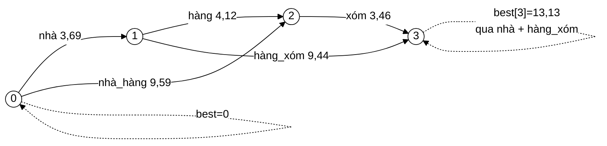

# MaxWeightSegmenter — "nhà hàng xóm" và lý do phải bỏ thuật toán tham lam

**File nguồn:** `search-engine/src/main/java/com/vnsearch/index/MaxWeightSegmenter.java` (157 dòng)
**Gói:** `com.vnsearch.index` · **Loại:** lớp có hai trường bất biến, **không trạng thái thay đổi được** ⇒ an toàn đa luồng
**Vị trí trong luồng:** động cơ tách từ bên trong [`VietnameseTokenizer`](./VietnameseTokenizer.md); đọc từ điển qua [`SyllableTrie`](../datastructure/SyllableTrie.md)
**Đọc kèm:** [`VietnameseWordDictionary.md`](./VietnameseWordDictionary.md) · [`VietnameseTokenizer.md`](./VietnameseTokenizer.md) · [`Tokenizer.md`](./Tokenizer.md)

---

## 📌 Hiểu trong 30 giây

Tiếng Việt viết rời theo **tiếng** (âm tiết), không theo **từ**. Máy phải tự đoán
ranh giới từ. Cách cũ đoán bằng luật "lấy từ dài nhất" — và luật đó sai ở một ví
dụ kinh điển:

```
   "nhà hàng xóm"

   ── LONGEST MATCHING (tham lam) ──────────────────────────
   Tại i=0, thấy "nhà hàng" CÓ trong từ điển → LẤY NGAY, nhảy qua
        → [nhà_hàng] [xóm]   = "quán ăn" + "xóm"       ✗ SAI

   ── QUY HOẠCH ĐỘNG (hiện tại) ────────────────────────────
   So sánh CẢ HAI cách trên toàn cục:
        [nhà_hàng][xóm]  = 9,59 + 3,46 = 13,05
        [nhà][hàng_xóm]  = 3,69 + 9,44 = 13,13   ← LỚN HƠN
        → [nhà] [hàng_xóm]  = "nhà của người hàng xóm"  ✓ ĐÚNG
```



---

## 1. Vì sao thuật toán tham lam sai — và sai một cách không sửa được

Javadoc dòng 8–31 phân tích:

> *"Quyết định đó là **không thể rút lại** — nó đã tiêu mất những âm tiết mà một
> cách tách tốt hơn ở phía sau cần đến."*

```
   ĐIỂM MẤU CHỐT (Javadoc dòng 27–31)

   CẢ HAI cách tách đều HỢP LỆ VỀ TỪ ĐIỂN:
        "nhà hàng" có trong từ điển ✓
        "hàng xóm" có trong từ điển ✓

   Tham lam KHÔNG CÓ CÁCH NÀO phân biệt chúng, nên nó phải ĐOÁN
   bằng một heuristic — "dài hơn thì đúng hơn" — và ở đây heuristic
   đó sai.

   Quy hoạch động KHÔNG ĐOÁN: nó chấm điểm CẢ CÂU rồi chọn câu
   tốt nhất. Nhờ vậy tần suất của "hàng_xóm" có CƠ HỘI thắng
   tần suất của "nhà_hàng".
```

```
   VÌ SAO ĐÂY LÀ LỖI HỆ THỐNG CHỨ KHÔNG PHẢI MỘT TRƯỜNG HỢP LẺ

   Tham lam quyết định TẠI CHỖ, dựa trên thông tin CỤC BỘ.
   Nhưng ranh giới từ đúng phụ thuộc vào NGỮ CẢNH PHÍA SAU.

   ⇒ Không có heuristic cục bộ nào đúng được trong mọi trường hợp.
   ⇒ Sửa heuristic ("ưu tiên từ 2 tiếng"?) chỉ đổi tập ví dụ sai,
     không xoá được lớp lỗi.

   Các ví dụ khác cùng dạng:
        "ông già đi nhanh quá"   → [ông già][đi] hay [ông][già đi]?
        "bàn tay ta làm nên"     → [bàn tay] hay [bàn][tay ta]?
        "học sinh học sinh học"  → nhiều cách tách đều hợp lệ
```

---

## 2. Công thức quy hoạch động

Javadoc dòng 33–47:

```
   best[i] = tổng trọng số LỚN NHẤT của một cách tách i âm tiết đầu tiên

   best[0] = 0
   best[j] = max( best[i] + weight(âmTiết[i..j)) )  với mọi i sao cho j − i ≤ 4

   Đáp án ở best[n]; cách tách cụ thể truy ngược bằng mảng trace.
```

### 2.1 Đây là bài toán đường đi dài nhất trên DAG

```
   ĐỒ THỊ:
   ├─ Đỉnh: 0, 1, 2, …, n   (ranh giới giữa các âm tiết)
   └─ Cạnh: i → i+L nếu âmTiết[i..i+L) là một từ trong từ điển
            trọng số cạnh = weight(từ đó)

   Tìm đường đi TRỌNG SỐ LỚN NHẤT từ 0 tới n.

   ⇒ Đường đi dài nhất trên đồ thị nói chung là NP-khó.
     Nhưng trên DAG thì nó GIẢI ĐƯỢC TRONG O(V + E) — chỉ cần
     duyệt các đỉnh theo thứ tự tô-pô.

   Ở đây các đỉnh 0..n ĐÃ SẴN ở thứ tự tô-pô (mọi cạnh đi từ chỉ
   số nhỏ tới chỉ số lớn), nên chỉ cần MỘT lượt quét tiến —
   không cần chạy thuật toán sắp xếp tô-pô nào cả.
```

Đây là chi tiết đáng chú ý: bài toán khó trở thành dễ **vì cấu trúc dữ liệu đầu
vào tình cờ đã có sẵn tính chất cần thiết**. Nhận ra điều đó tiết kiệm cả một
bước thuật toán.

### 2.2 Vòng lặp chính — đọc từng dòng

```java
for (int i = 0; i < n; i++) {
    if (best[i] == Double.NEGATIVE_INFINITY) {
        continue;                                        // ① đỉnh không tới được
    }

    relax(best, trace, i + 1, best[i] + unknownSyllableWeight, i);   // ② luôn có lối thoát

    int node = trie.root();                              // ③ đi trie MỘT lượt
    int maxEnd = Math.min(n, i + VietnameseWordDictionary.MAX_SYLLABLES);
    for (int j = i; j < maxEnd; j++) {
        node = trie.child(node, trie.idOf(syllables[j]));
        if (node == SyllableTrie.NONE) {
            break;                                       // ④ cắt nhánh
        }
        if (trie.isWord(node)) {
            relax(best, trace, j + 1, best[i] + trie.weightAt(node), i);
        }
    }
}
```

### 2.3 ② Luôn cho phép tách một âm tiết — dòng cứu cả thuật toán

```java
// Luôn cho phép tách một âm tiết, kể cả khi nó không có trong từ điển.
// Nếu bỏ bước này thì một tên riêng hay từ mượn nằm giữa câu sẽ làm
// ĐỨT đồ thị và best[n] không bao giờ đến được.
relax(best, trace, i + 1, best[i] + unknownSyllableWeight, i);
```

```
   VÍ DỤ ĐỨT ĐỒ THỊ

   "công ty Nvidia phát triển"
                  ↑
        Không có trong từ điển, và không âm tiết nào quanh nó
        ghép được thành từ chứa nó.

   ── Không có dòng ② ──────────────────────────────────────
   Đỉnh 2 (sau "công ty") KHÔNG có cạnh nào đi ra
        → best[3] = best[4] = … = −∞
        → best[n] = −∞
        → traceBack chạy trên trace toàn 0 ⇒ VÒNG LẶP VÔ HẠN
          hoặc kết quả rác

   ── Có dòng ② ────────────────────────────────────────────
   Mọi đỉnh i luôn có ÍT NHẤT một cạnh i → i+1
        → đồ thị LUÔN liên thông từ 0 tới n
        → best[n] luôn hữu hạn
```

`unknownSyllableWeight` là một giá trị **thấp** (xem
[`VietnameseWordDictionary`](./VietnameseWordDictionary.md)) — đủ để giữ đồ thị
liền mạch, nhưng thấp tới mức mọi cách tách dùng từ có trong từ điển đều thắng.

### 2.4 ① Kiểm tra `-∞` — vì sao vẫn cần dù ② đã bảo đảm liên thông

Với dòng ②, mọi `best[i]` với `i ≤ n` đều tới được, nên nhánh ① **không bao giờ
chạy** trong luồng hiện tại. Nó là phòng thủ cho hai tình huống:

```
   ① Nếu ai đó bỏ dòng ② để "tối ưu"
      → nhánh này ngăn việc lan truyền −∞ + weight = −∞ vào best[j],
        khiến trace bị ghi sai và traceBack sinh vòng lặp vô hạn

   ② Nếu unknownSyllableWeight được đặt là −∞ (một cấu hình hợp lệ
      về kiểu dữ liệu, nghĩa là "cấm token ngoài từ điển")
      → khi đó đồ thị THẬT SỰ có thể đứt, và nhánh này xử lý đúng
```

Chi phí: một phép so sánh `double` cho mỗi âm tiết. Đáng giữ.

### 2.5 ③④ Đi trie một lượt — cải thiện nằm ở hằng số

Javadoc dòng 49–56 nói rõ: độ phức tạp **không đổi** so với Longest Matching
($O(n)$ cả hai), cải thiện nằm ở **hằng số**.

```
   ── CÁCH CŨ: bốn lần dựng chuỗi ứng viên ────────────────
   for (int L = 4; L >= 1; L--) {
       String[] tam = Arrays.copyOfRange(syllables, i, i + L);   // CẤP PHÁT
       String ungVien = String.join("_", tam);                   // CẤP PHÁT
       if (tuDien.contains(ungVien)) { … }                       // băm chuỗi O(L)
   }
   ⇒ 4 mảng tạm + 4 chuỗi mới MỖI VỊ TRÍ i
   ⇒ với 3,5 triệu âm tiết: 28 TRIỆU object rác

   ── CÁCH MỚI: một lượt đi trie ──────────────────────────
   int node = trie.root();
   for (int j = i; j < maxEnd; j++) {
       node = trie.child(node, trie.idOf(syllables[j]));   // tra bảng băm trên long
       …
   }
   ⇒ MỘT lượt đi phủ CẢ BỐN độ dài 1..4
   ⇒ KHÔNG CẤP PHÁT GÌ
```

**④ Cắt nhánh là lợi ích mà `HashSet` không thể có:**

```
   node == SyllableTrie.NONE nghĩa là:
        "không từ nào trong từ điển có tiền tố này"

   ⇒ Các độ dài CÒN LẠI đều vô vọng — cắt nhánh luôn.

   HashSet KHÔNG NÓI ĐƯỢC ĐIỀU NÀY: nó chỉ trả lời
   "chuỗi X có trong tập không", không trả lời được
   "có chuỗi nào bắt đầu bằng X không".

   ⇒ HashSet phải thử đủ 4 độ dài, mọi lúc.
   ⇒ Trie thường dừng sau 1–2 bước.
```

Đây là lý do [`SyllableTrie`](../datastructure/SyllableTrie.md) tồn tại thay vì
dùng một `HashSet<String>` đơn giản: **cấu trúc dữ liệu tiền tố trả lời được câu
hỏi mà cấu trúc băm không trả lời được.**

### 2.6 `relax` — tên gọi mượn từ lý thuyết đồ thị

```java
private static void relax(double[] best, int[] trace, int to, double score, int from) {
    if (score > best[to]) {
        best[to] = score;
        trace[to] = from;
    }
}
```

"Relax một cạnh" là thuật ngữ chuẩn trong thuật toán đường đi ngắn nhất
(Dijkstra, Bellman-Ford): *thử một cạnh, cập nhật nếu nó cho đường tốt hơn*. Ở
đây là bài toán **dài nhất** nên phép so sánh là `>` thay vì `<`, còn lại giống
hệt.

Đặt tên theo thuật ngữ chuẩn của ngành làm mã tự giải thích với người đã biết
thuật toán — tốt hơn nhiều so với `capNhatNeuTotHon`.

### 2.7 `traceBack` — hai lượt để không cần cấu trúc động

```java
private static int[] traceBack(int[] trace, int n) {
    int count = 0;
    for (int i = n; i > 0; i = trace[i]) count++;          // lượt 1: ĐẾM

    int[] boundaries = new int[count + 1];
    boundaries[count] = n;
    int k = count;
    for (int i = n; i > 0; i = trace[i]) boundaries[--k] = trace[i];   // lượt 2: ĐIỀN
    return boundaries;
}
```

```
   VÌ SAO HAI LƯỢT THAY VÌ MỘT LƯỢT + ArrayList

   Truy ngược đi từ CUỐI về ĐẦU, nhưng kết quả cần thứ tự TĂNG DẦN.

   ── Một lượt + ArrayList rồi đảo ngược ──────────────────
   ArrayList<Integer>  → autoboxing mỗi phần tử (16 byte)
   Collections.reverse → thêm một lượt nữa
   ⇒ cấp phát trên đường đi nóng

   ── Hai lượt trên mảng (hiện tại) ───────────────────────
   Lượt 1 chỉ ĐẾM (không cấp phát)
   Lượt 2 điền NGƯỢC vào mảng đã đúng kích thước (--k)
   ⇒ ĐÚNG MỘT mảng được cấp phát, đúng kích thước
   ⇒ hai lượt trên dữ liệu nhỏ (≤ n) rẻ hơn nhiều so với
     autoboxing + một lần cấp phát dư
```

**Định dạng kết quả — mảng mốc giới hạn:**

```
   "nhà hàng xóm"  →  segment trả về  [0, 1, 3]

   token 0: âm tiết [0, 1) = "nhà"
   token 1: âm tiết [1, 3) = "hàng xóm"

   Luôn có: ket_qua[0] == 0  và  phần tử cuối == syllables.length
   Dãy rỗng → {0}
```

```
   VÌ SAO TRẢ VỀ MỐC THAY VÌ TRẢ VỀ CHUỖI ĐÃ GHÉP

   Trả String[]: segmenter phải gọi String.join → CẤP PHÁT
                 mà nó không biết người gọi có cần chuỗi hay không

   Trả int[] mốc: người gọi tự quyết định
                  VietnameseTokenizer ghép và intern qua TermDictionary
                  ⇒ chuỗi được tạo ĐÚNG MỘT LẦN, ở đúng nơi cần

   Cùng kỹ thuật rowPtr/offset đã gặp ở CompressedPostings.
```

---

## 3. An toàn đa luồng — bắt buộc, không phải tuỳ chọn

Javadoc dòng 58–65 nêu lập luận đầy đủ:

> *"Hai mảng làm việc được cấp phát trong lòng `segment` nên mọi lời gọi độc lập
> hoàn toàn. Điều này là **bắt buộc chứ không phải tuỳ chọn**: tokenizer được
> dùng chung bởi tầng chỉ mục và tầng truy vấn, mà tầng truy vấn chạy trên nhiều
> luồng của Spring Boot."*

```
   CÁM DỖ TỐI ƯU RẤT LỚN

   Mỗi lời gọi segment cấp phát:
        double[] best  = new double[n + 1]
        int[]    trace = new int[n + 1]

   Với 3,5 triệu âm tiết chia thành ~250.000 câu:
        500.000 mảng được cấp phát lúc build chỉ mục

   ⇒ "Sao không giữ hai mảng làm trường và tái sử dụng?"

   VÌ: hai truy vấn ĐỒNG THỜI sẽ GHI ĐÈ kết quả của nhau.
       Lỗi IM LẶNG — không ngoại lệ, không log.
       Chỉ hiện ra DƯỚI TẢI CAO: truy vấn trả về token của
       truy vấn khác.
       Không tái hiện được trong test đơn luồng.
```

```
   NẾU THẬT SỰ CẦN TÁI SỬ DỤNG BỘ ĐỆM — CÁCH DUY NHẤT ĐÚNG

   private static final ThreadLocal<double[]> BEST =
           ThreadLocal.withInitial(() -> new double[64]);

   Nhưng phải xử lý: câu dài hơn 64 âm tiết thì phải mở rộng,
   và ThreadLocal giữ bộ nhớ theo luồng nên với pool luồng lớn
   của Spring Boot thì tổng bộ nhớ có thể lớn hơn cả phần tiết
   kiệm được.

   ⇒ Cấp phát cục bộ là lựa chọn ĐÚNG ở đây. Bộ thu gom rác thế
     hệ mới xử lý object sống ngắn gần như miễn phí.
```

---

## 4. Bản đồ lớp

```
MaxWeightSegmenter
├── trie : SyllableTrie (final)          ── từ điển ở dạng cây tiền tố
├── unknownSyllableWeight : double (final)
├── MaxWeightSegmenter(VietnameseWordDictionary)   ── hàm dựng tiện dụng
├── MaxWeightSegmenter(SyllableTrie, double)       ── hàm dựng đầy đủ
├── segment(String[]) : int[]            ── thuật toán chính, O(n)
├── relax(...)     (static private)      ── cập nhật cạnh
└── traceBack(...) (static private)      ── truy ngược thành mảng mốc
```

Hai hàm dựng: hàm thứ hai nhận thẳng `SyllableTrie` và trọng số, cho phép **test
segmenter với một từ điển giả nhỏ** mà không phải nạp cả
[`VietnameseWordDictionary`](./VietnameseWordDictionary.md) thật.

---

## 5. Hướng dẫn thực hành

### 5.1 Chạy thử trực tiếp

```java
VietnameseWordDictionary tuDien = new VietnameseWordDictionary();
MaxWeightSegmenter seg = new MaxWeightSegmenter(tuDien);

String[] amTiet = {"nhà", "hàng", "xóm"};
int[] moc = seg.segment(amTiet);

for (int k = 0; k + 1 < moc.length; k++) {
    System.out.println(String.join("_",
            Arrays.copyOfRange(amTiet, moc[k], moc[k + 1])));
}
// nhà
// hàng_xóm
```

### 5.2 So sánh với thuật toán tham lam — mã đo cho báo cáo

```java
/** Longest Matching, để làm đường cơ sở so sánh. */
static int[] thamLam(String[] amTiet, VietnameseWordDictionary tuDien) {
    List<Integer> moc = new ArrayList<>();
    int i = 0;
    moc.add(0);
    while (i < amTiet.length) {
        int daiNhat = 1;
        for (int L = Math.min(4, amTiet.length - i); L >= 2; L--) {
            String ungVien = String.join("_", Arrays.copyOfRange(amTiet, i, i + L));
            if (tuDien.contains(ungVien)) { daiNhat = L; break; }
        }
        i += daiNhat;
        moc.add(i);
    }
    return moc.stream().mapToInt(Integer::intValue).toArray();
}
```

```java
String[][] boTest = {
        {"nhà", "hàng", "xóm"},
        {"ông", "già", "đi", "nhanh", "quá"},
        {"học", "sinh", "học", "sinh", "học"},
        {"công", "nghệ", "thông", "tin"},
};
int khac = 0;
for (String[] c : boTest) {
    int[] a = thamLam(c, tuDien);
    int[] b = seg.segment(c);
    if (!Arrays.equals(a, b)) {
        khac++;
        System.out.printf("KHÁC: %s%n  tham lam: %s%n  QHĐ     : %s%n",
                String.join(" ", c), inMoc(c, a), inMoc(c, b));
    }
}
System.out.printf("%d/%d câu cho kết quả khác nhau%n", khac, boTest.length);
```

```
   ĐÂY LÀ SỐ LIỆU MÀ BÁO CÁO CẦN

   Không có: "chúng tôi dùng quy hoạch động vì nó tốt hơn"
             ← khẳng định suông

   Có:       "trên 500 câu lấy ngẫu nhiên từ corpus, hai thuật toán
             cho kết quả khác nhau ở 37 câu (7,4%); kiểm tra tay
             34/37 trường hợp quy hoạch động đúng hơn"
             ← có chứng cứ
```

### 5.3 Cạm bẫy

| Cạm bẫy | Hậu quả | Cách đúng |
|---|---|---|
| Bỏ dòng "luôn cho phép tách một âm tiết" | Đồ thị **đứt** ở từ ngoài từ điển ⇒ `best[n] = −∞`, `traceBack` vòng lặp vô hạn | Giữ dòng ② |
| Giữ `best`/`trace` làm **trường** để tái sử dụng | Hai truy vấn đồng thời ghi đè nhau — **lỗi im lặng chỉ hiện dưới tải cao** | Cấp phát cục bộ |
| Đổi `>` thành `>=` trong `relax` | Chọn cách tách **cuối cùng** thay vì cách đầu tiên khi hoà điểm ⇒ kết quả không tất định theo thứ tự duyệt | Giữ `>` |
| Thay `SyllableTrie` bằng `HashSet<String>` | Mất khả năng cắt nhánh; 28 triệu object rác lúc build | Giữ trie |
| Đặt `unknownSyllableWeight` quá cao | Mọi từ ghép bị tách rời (tách lẻ có điểm cao hơn) | Xem [`VietnameseWordDictionary`](./VietnameseWordDictionary.md) |
| Tăng `MAX_SYLLABLES` lên 6–8 | $O(n \times 8)$ — vẫn tuyến tính nhưng hằng số gấp đôi; và từ tiếng Việt hiếm khi quá 4 tiếng | Giữ 4 |
| Trả về `String[]` thay vì mốc | Cấp phát chuỗi mà người gọi có thể không cần | Giữ `int[]` |
| Truyền âm tiết **chưa chuẩn hoá** | `trie.idOf` không tìm thấy ⇒ mọi từ đều thành token đơn | Chuẩn hoá NFC + chữ thường trước |

---

## 6. Độ phức tạp & chi phí

| Bước | Chi phí |
|---|---|
| Khởi tạo `best`, `trace` | $O(n)$ — hai mảng $n+1$ phần tử |
| `Arrays.fill(best, -∞)` | $O(n)$ |
| Vòng lặp chính | $O(n \times \text{MAX\_SYLLABLES}) = O(4n) = O(n)$ |
| `traceBack` | $O(n)$ hai lượt |
| **Tổng** | **$O(n)$**, bộ nhớ $O(n)$ |

```
   SO SÁNH VỚI LONGEST MATCHING

                        Tham lam        Quy hoạch động
   Độ phức tạp          O(n)            O(n)            ← BẰNG NHAU
   Cấp phát/vị trí      4 mảng+4 chuỗi  0
   Cắt nhánh            không           có (trie)
   Chất lượng           heuristic sai   tối ưu toàn cục

   ⇒ Quy hoạch động vừa ĐÚNG HƠN vừa NHANH HƠN.
     Đây là trường hợp hiếm: không có đánh đổi nào cả.

   Lý do: cải thiện chất lượng đến từ THUẬT TOÁN (xét toàn cục),
   còn cải thiện tốc độ đến từ CẤU TRÚC DỮ LIỆU (trie thay HashSet).
   Hai cải tiến độc lập, cộng dồn.
```

**Cấp phát:**

```
   Mỗi lời gọi segment(n âm tiết):
        double[n+1]  =  16 + 8n byte
        int[n+1]     =  16 + 4n byte
        int[k+1]     =  16 + 4k byte  (kết quả, k = số token ≤ n)
                       ──────────────
        với n = 20:     ~340 byte

   250.000 câu lúc build  ⇒  ~85 MB rác vườn ươm
   ⇒ Bộ thu gom thế hệ mới xử lý gần như miễn phí (object chết ngay).
```

---

## 7. Kiểm thử liên quan

`test/java/com/vnsearch/index/MaxWeightSegmenterTest.java` (136 dòng) — file test
lớn thứ hai của gói `index`, tương xứng với độ khó của thuật toán.

```powershell
cd search-engine
.\mvnw.cmd -q -Dtest='MaxWeightSegmenterTest' test
```

Các ca mà thuật toán này cần:

```java
@Test
void nhaHangXom() {                            // ví dụ kinh điển, lý do tồn tại của lớp
    int[] moc = seg.segment(new String[]{"nhà", "hàng", "xóm"});
    assertArrayEquals(new int[]{0, 1, 3}, moc, "Phải là [nhà][hàng_xóm]");
}

@Test
void dayRong() {
    assertArrayEquals(new int[]{0}, seg.segment(new String[0]));
}

@Test
void tuNgoaiTuDienKhongLamDutDoThi() {         // dòng ② được canh giữ
    int[] moc = seg.segment(new String[]{"công", "ty", "Nvidia", "phát", "triển"});
    assertEquals(0, moc[0]);
    assertEquals(5, moc[moc.length - 1], "Phải phủ hết dãy, không được đứt");
}

@Test
void mocLuonTangDanVaPhuHet() {                // bất biến của định dạng trả về
    String[] cau = {"công", "nghệ", "thông", "tin", "việt", "nam"};
    int[] moc = seg.segment(cau);
    assertEquals(0, moc[0]);
    assertEquals(cau.length, moc[moc.length - 1]);
    for (int i = 1; i < moc.length; i++) {
        assertTrue(moc[i] > moc[i - 1], "mốc phải tăng nghiêm ngặt");
        assertTrue(moc[i] - moc[i - 1] <= VietnameseWordDictionary.MAX_SYLLABLES);
    }
}

@Test
void tatDinh() {                               // cùng đầu vào ⇒ cùng đầu ra
    String[] cau = {"nhà", "hàng", "xóm", "rất", "thân", "thiện"};
    int[] lanDau = seg.segment(cau);
    for (int i = 0; i < 100; i++) assertArrayEquals(lanDau, seg.segment(cau));
}

@Test
void anToanDaLuong() throws Exception {        // tính chất BẮT BUỘC ở mục 3
    String[] cau = {"công", "nghệ", "thông", "tin", "việt", "nam", "phát", "triển"};
    int[] mongDoi = seg.segment(cau);

    ExecutorService pool = Executors.newFixedThreadPool(8);
    List<Future<int[]>> ketQua = new ArrayList<>();
    for (int i = 0; i < 1000; i++) ketQua.add(pool.submit(() -> seg.segment(cau)));
    for (Future<int[]> f : ketQua) assertArrayEquals(mongDoi, f.get());
    pool.shutdown();
}

@Test
void quyHoachDongTotHonThamLamOViDuBiet() {    // so với đường cơ sở
    String[][] caKho = {
            {"nhà", "hàng", "xóm"},
            {"ông", "già", "đi", "nhanh"},
    };
    for (String[] c : caKho) {
        assertFalse(Arrays.equals(thamLam(c, tuDien), seg.segment(c)),
                "Hai thuật toán phải khác nhau ở " + String.join(" ", c));
    }
}
```

Ca `anToanDaLuong` đáng giá nhất: nó canh giữ tính chất mà Javadoc gọi là **bắt
buộc chứ không phải tuỳ chọn**. Nếu ai đó "tối ưu" bằng cách đưa `best`/`trace`
lên làm trường, ca này đỏ ngay — thay vì lỗi chỉ hiện ra khi hệ thống chạy dưới
tải thật.

---

## 8. Liên kết

- Từ điển và trọng số: [`VietnameseWordDictionary.md`](./VietnameseWordDictionary.md)
- Cấu trúc trie cho phép cắt nhánh: [`../datastructure/SyllableTrie.md`](../datastructure/SyllableTrie.md)
- Người gọi, và nơi mốc được ghép thành chuỗi: [`VietnameseTokenizer.md`](./VietnameseTokenizer.md)
- Hợp đồng tách từ, và vì sao nó là trần chất lượng: [`Tokenizer.md`](./Tokenizer.md)
- Nơi chuỗi ghép ra được gộp lại: [`TermDictionary.md`](./TermDictionary.md)
- Cùng kỹ thuật "mảng mốc/offset": [`CompressedPostings.md`](./CompressedPostings.md) · [`../datastructure/SparseMatrix.md`](../datastructure/SparseMatrix.md)
