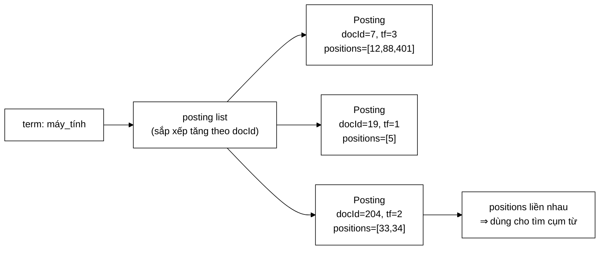

# Posting — đổi `List<Integer>` thành `int[]` và lấy lại 72,9 MB

**File nguồn:** `search-engine/src/main/java/com/vnsearch/index/Posting.java` (80 dòng)
**Gói:** `com.vnsearch.index` · **Loại:** `record` bất biến, **tự viết** `equals`/`hashCode`/`toString`
**Vị trí trong luồng:** đơn vị dữ liệu nhỏ nhất của [`InvertedIndex`](./InvertedIndex.md) — mỗi cặp (term, tài liệu) là một `Posting`
**Đọc kèm:** [`InvertedIndex.md`](./InvertedIndex.md) · [`PostingCursor.md`](./PostingCursor.md) · [`CompressedPostings.md`](./CompressedPostings.md)

---

## 📌 Hiểu trong 30 giây

Một `Posting` trả lời: *"term này xuất hiện trong tài liệu nào, mấy lần, và ở
những vị trí nào."*

```java
public record Posting(int docId, int termFrequency, int[] positions) { }
```

Ba trường, nhưng trường thứ ba là nơi toàn bộ bộ nhớ của chỉ mục nằm — và việc
chọn `int[]` thay vì `List<Integer>` là **thay đổi tiết kiệm bộ nhớ lớn nhất
của cả dự án**, được quyết định bằng số đo chứ không bằng cảm tính.



```
   SỐ ĐO THẬT — corpus 2.518 trang (Javadoc dòng 18–30)

   3.821.061 vị trí,  1.594.938 posting

   List<Integer>                        int[]
   ├─ Integer:      16 byte/phần tử     ├─ 4 byte/phần tử
   ├─ ô tham chiếu: 4–8 byte            ├─ (không có)
   ├─ ArrayList:    40 byte/danh sách   ├─ (không có)
   └─ Object[] header: 16 byte          └─ mảng header: 16 byte/mảng

   ĐO ĐƯỢC:  87,5 MB  ──────────────▶  14,6 MB
                        tiết kiệm 72,9 MB = 83,3%
```

---

## 1. Vì sao `int[]` chứ không phải `List<Integer>`

### 1.1 Ba nguồn phí chồng lên nhau

```
   MỘT VỊ TRÍ (số nguyên, ví dụ 401) TỐN BAO NHIÊU?

   ── Với List<Integer> ──────────────────────────────────
   Object Integer      16 byte  (header 12 + int 4, căn lên 16)
   ô trong Object[]     4 byte  (con trỏ nén)
                       ───────
                        20 byte  ← GẤP 5 LẦN dữ liệu thật

   ── Với int[] ──────────────────────────────────────────
   một ô mảng           4 byte
                       ───────
                         4 byte

   Nhân với 3.821.061 vị trí:
        List<Integer>:  76,4 MB
        int[]:          15,3 MB
```

Cộng thêm phí **theo danh sách** (không phải theo phần tử):

```
   1.594.938 posting, mỗi cái một danh sách vị trí riêng

   ArrayList: 40 byte/danh sách  ×  1.594.938  =  63,8 MB
   int[]:     16 byte/mảng       ×  1.594.938  =  25,5 MB
                                                  ────────
                                        chênh:    38,3 MB
```

Con số 40 byte cho một `ArrayList` rỗng-về-nội-dung là điều dễ bị bỏ qua nhất:
nó gồm header đối tượng, trường `size`, trường `modCount`, và một tham chiếu
tới mảng `Object[]` bên trong — **hai** đối tượng cho một danh sách.

### 1.2 Vì sao mất tiện ích của `List` không quan trọng

Javadoc dòng 32–34 nêu lập luận quyết định:

> *"Danh sách vị trí là thứ **chỉ đọc, duyệt tuần tự hoặc tìm nhị phân** —
> không bao giờ thêm/bớt phần tử sau khi tạo. Toàn bộ tiện ích của `List` vì
> vậy không được dùng tới, chỉ còn lại chi phí."*

| Tiện ích của `List` | Có dùng không |
|---|---|
| `add`, `remove` sau khi tạo | **Không** — posting bất biến; index lại thì tạo posting mới |
| Đa hình (đổi `ArrayList` ↔ `LinkedList`) | **Không** — chỉ có một cách lưu hợp lý |
| Generics an toàn kiểu | Không cần — kiểu luôn là `int` |
| `stream()`, `forEach` | Có thể dùng, nhưng `for (int p : positions)` đọc rõ hơn và không đóng hộp |
| Tìm nhị phân | `Arrays.binarySearch(int[], int)` có sẵn, **nhanh hơn** bản `List` vì không đóng hộp |

```
   NGUYÊN TẮC RÚT RA

   Trừu tượng hoá không miễn phí. Nó đáng giá khi ta THẬT SỰ DÙNG
   khả năng thay thế mà nó mở ra.

   Với 1,6 triệu thể hiện, một trừu tượng không dùng tới trở thành
   72,9 MB tiền thuê trả cho một căn phòng bỏ trống.
```

### 1.3 Ranh giới: chỗ nào **nên** giữ `List`

Chú ý là posting **list** (danh sách các `Posting`) vẫn là `List<Posting>`, xem
[`SearchIndex.getPostings`](./SearchIndex.md). Không mâu thuẫn:

```
   List<Posting>              — 1,59 triệu phần tử, nhưng
   ├─ phần tử là OBJECT thật    Posting vốn đã là object,
   │  (không phải số nguyên)    không có phí đóng hộp nào thêm
   ├─ ~136.768 danh sách        phí 40 byte/danh sách × 136.768
   │  (một cho mỗi term)        = 5,5 MB — chấp nhận được
   └─ CÓ dùng đa hình:          List.of(), unmodifiableList,
                                subList khi phân trang

   int[] positions            — 3,8 triệu phần tử SỐ NGUYÊN
   ├─ đóng hộp là phí thuần     16 byte cho 4 byte dữ liệu
   ├─ 1,59 triệu danh sách      phí 40 byte × 1,59 triệu = 63,8 MB
   └─ KHÔNG dùng đa hình        chỉ đọc, chỉ duyệt
```

Đây là ranh giới đúng: **đóng hộp số nguyên với số lượng hàng triệu thì phải
tránh; đóng gói đối tượng thật thì không sao.**

---

## 2. Bản đồ lớp

```
Posting  (record)
├── NO_POSITIONS : int[] (static final, rỗng)   ── dùng chung một mảng rỗng
├── docId()          : int
├── termFrequency()  : int
├── positions()      : int[]     ── CHỈ ĐỌC theo quy ước, xem mục 2.3
├── positionCount()  : int       ── thay cho positions().size()
├── hàm dựng rút gọn             ── null → NO_POSITIONS
├── equals(Object)   ── TỰ VIẾT, dùng Arrays.equals
├── hashCode()       ── TỰ VIẾT, dùng Arrays.hashCode
└── toString()       ── TỰ VIẾT, dùng Arrays.toString
```

### 2.1 Vì sao **phải** tự viết `equals`/`hashCode` — lỗi im lặng của `record`

Đây là chi tiết quan trọng nhất về mặt đúng đắn của cả file:

```
   record TỰ SINH equals() — nhưng với trường kiểu MẢNG, nó so sánh
   theo DANH TÍNH THAM CHIẾU (==), không theo NỘI DUNG.

   int[] a = {1, 2, 3};
   int[] b = {1, 2, 3};
   a == b            →  false      ← hai object khác nhau
   Arrays.equals(a,b) → true       ← cùng nội dung

   ⇒ Với equals sinh sẵn:
     new Posting(7, 3, new int[]{1,2,3})
        .equals(new Posting(7, 3, new int[]{1,2,3}))   →  FALSE

   Hai posting GIỐNG HỆT NHAU vẫn "khác nhau".
```

Javadoc dòng 36–41 chỉ đúng chỗ hậu quả nghiêm trọng nhất:

> *"…nó sẽ làm hỏng đúng phép kiểm chứng quan trọng nhất:
> [`IndexPersistence`](./IndexPersistence.md) so sánh posting list trước và sau
> khi nén để khẳng định vòng nén/giải nén không làm mất dữ liệu."*

```
   KỊCH BẢN HỎNG NẾU DÙNG equals SINH SẴN

   Test:  assertEquals(postingsGoc, postingsSauKhiGiaiNen)
          → LUÔN THẤT BẠI, dù nén hoàn toàn đúng
          → lập trình viên kết luận "codec sai", đi sửa codec đúng
          → hoặc tệ hơn: xoá test đi vì "test hỏng"

   Hoặc ngược lại, nếu ai đó viết test bằng cách so từng trường:
          → test PASS, nhưng equals vẫn sai ở mọi nơi khác
          → Set<Posting>, Map<Posting,?>, List.contains đều sai lặng lẽ
```

Ba hàm được viết lại nhất quán:

```java
@Override
public boolean equals(Object other) {
    if (this == other) return true;
    return other instanceof Posting that
            && docId == that.docId
            && termFrequency == that.termFrequency
            && Arrays.equals(positions, that.positions);      // ← NỘI DUNG
}

@Override
public int hashCode() {
    return 31 * (31 * docId + termFrequency) + Arrays.hashCode(positions);
}

@Override
public String toString() {
    return "Posting[docId=" + docId + ", tf=" + termFrequency
            + ", positions=" + Arrays.toString(positions) + "]";
}
```

> ⚠️ **`hashCode` phải sửa cùng `equals`, không được sửa một cái.** Hợp đồng của
> Java: hai đối tượng `equals` thì **bắt buộc** cùng `hashCode`. Nếu chỉ sửa
> `equals`, hai posting bằng nhau sẽ có hash khác nhau ⇒ `HashMap`/`HashSet` mất
> phần tử **một cách im lặng**. Đây là lý do cả ba hàm nằm cạnh nhau trong file.

`toString` cũng phải sửa vì mặc định của record in ra `[I@1b6d3586` (địa chỉ
mảng) thay vì nội dung — làm mọi thông điệp lỗi assert trở nên vô dụng.

### 2.2 `NO_POSITIONS` — một mảng rỗng dùng chung

```java
private static final int[] NO_POSITIONS = new int[0];

public Posting {
    if (positions == null) {
        positions = NO_POSITIONS;
    }
}
```

Hai lợi ích cộng lại:

```
   ① KHỬ null NGAY TẠI CỬA VÀO
      positions() không bao giờ trả null
      ⇒ mọi nơi dùng viết được for (int p : posting.positions())
        mà không cần kiểm tra null
      ⇒ khác hẳn kiểu "trả null rồi mỗi nơi tự phòng thủ"

   ② MỘT MẢNG RỖNG, KHÔNG PHẢI HÀNG TRIỆU
      new int[0] tốn 16 byte (header + trường length).
      Nếu mỗi posting không-vị-trí tự tạo một mảng rỗng riêng,
      đó là 16 byte × số posting đó. Dùng chung: 16 byte TỔNG.

      An toàn vì mảng rỗng không có phần tử nào để ai đó sửa —
      nó BẤT BIẾN một cách tự nhiên. (Mảng khác rỗng thì không,
      xem mục 2.3.)
```

Chú ý cú pháp: hàm dựng rút gọn của `record` cho phép **gán lại tham số**, và
giá trị sau khi gán mới là giá trị được lưu vào trường. Đây là cách chuẩn để
chuẩn hoá dữ liệu đầu vào của một record.

### 2.3 `positions()` trả về mảng **thật**, không phải bản sao

Đây là một đánh đổi có ý thức và cần được biết rõ:

```
   posting.positions()[0] = 999;      // ← HỢP LỆ VỀ CÚ PHÁP
                                      //   và nó SỬA CHỈ MỤC THẬT

   Posting là "record bất biến" — nhưng chỉ bất biến ở mức THAM CHIẾU.
   Nội dung mảng vẫn sửa được từ bên ngoài.
```

| Phương án | Chi phí | Đánh giá |
|---|---|---|
| Trả mảng thật (**hiện tại**) | 0 | Nhanh nhất; dựa vào quy ước "chỉ đọc" |
| Trả `positions.clone()` | 3,8 triệu lần sao chép mỗi lần truy vấn | Không chấp nhận được trên đường đi nóng |
| Bọc trong một lớp `IntList` bất biến | +16 byte/posting = 25 MB | Xoá gần hết phần tiết kiệm được |

Quy ước "chỉ đọc" được ghi ở [`PostingCursor.positions()`](./PostingCursor.md):
*"danh sách vị trí xuất hiện trong tài liệu hiện tại (**CHỈ ĐỌC**)"* — viết hoa
trong Javadoc. Đây là cách xử lý đúng cho một cấu trúc dữ liệu ở tầng thấp: chọn
tốc độ, và **ghi rõ ràng** hợp đồng thay vì ép buộc bằng chi phí.

### 2.4 `positionCount()` — hàm tiện ích thay cho `.size()`

```java
public int positionCount() {
    return positions.length;
}
```

Tồn tại để mã gọi không phải đổi từ `.size()` sang `.length` khắp nơi khi
chuyển từ `List<Integer>` sang `int[]`, và để nơi gọi không phải chạm vào mảng
(bớt cơ hội sửa nhầm).

Chú ý: `termFrequency` và `positionCount()` **về lý thuyết phải bằng nhau** —
tần suất là số lần xuất hiện, và mỗi lần xuất hiện có một vị trí. Nhưng chúng
là hai trường độc lập, không có gì ép buộc. Xem đề xuất 2 ở mục 6.

---

## 3. Hướng dẫn thực hành

### 3.1 Duyệt vị trí đúng cách

```java
Posting p = index.getPostings("máy_tính").get(0);

// ✓ ĐÚNG — không đóng hộp, không cấp phát
for (int viTri : p.positions()) {
    // …
}

// ✓ ĐÚNG — khi cần chỉ số
int[] vt = p.positions();
for (int i = 0; i < vt.length; i++) { … }

// ✗ SAI — Arrays.stream(...).boxed() đóng hộp lại đúng thứ vừa tránh được
p.positions().length;                    // dùng cái này
Arrays.stream(p.positions()).boxed().count();   // đừng
```

### 3.2 Tìm cụm từ — vì sao `positions` sắp xếp tăng dần lại quan trọng

Javadoc dòng 8–10 nêu bất biến: *"2 term 'cạnh nhau' khi position của term sau =
position của term trước + 1"*.

```java
/** Hai term có đứng liền nhau trong cùng tài liệu không? */
static boolean lienNhau(int[] viTriTruoc, int[] viTriSau) {
    int i = 0, j = 0;
    while (i < viTriTruoc.length && j < viTriSau.length) {
        int chenhLech = viTriSau[j] - viTriTruoc[i];
        if (chenhLech == 1) return true;        // đứng liền
        if (chenhLech <= 0) j++;                // vị trí sau còn nhỏ quá
        else                i++;                // vị trí trước còn nhỏ quá
    }
    return false;
}
```

Thuật toán hai con trỏ này chạy $O(m+n)$ và **chỉ đúng nếu cả hai mảng đã sắp
xếp tăng dần**. Nếu vị trí không sắp xếp, phải quét lồng $O(m \times n)$ —
với một term xuất hiện 500 lần, đó là 250.000 phép so sánh thay vì 1.000.

```
   BẤT BIẾN NÀY DO AI BẢO ĐẢM?

   InvertedIndex.addDocument duyệt token theo thứ tự từ đầu tài liệu
   ⇒ vị trí được thêm vào theo thứ tự tăng dần một cách tự nhiên.

   Nhưng KHÔNG CÓ GÌ KIỂM TRA. Một thay đổi làm token được xử lý
   song song (ví dụ chia tài liệu ra nhiều luồng) sẽ phá bất biến
   này mà không có lỗi nào được ném — chỉ là tìm cụm từ bắt đầu
   bỏ sót kết quả. Xem đề xuất 3 ở mục 6.
```

### 3.3 Cạm bẫy

| Cạm bẫy | Hậu quả | Cách đúng |
|---|---|---|
| Xoá `equals`/`hashCode` tự viết vì "record tự sinh rồi" | So sánh theo tham chiếu ⇒ test nén/giải nén luôn đỏ; `HashSet<Posting>` mất phần tử im lặng | Giữ cả ba hàm |
| Sửa `equals` mà quên `hashCode` | Vi phạm hợp đồng Java ⇒ `HashMap` mất phần tử | Sửa cả hai cùng lúc |
| Sửa nội dung mảng trả về từ `positions()` | Chỉ mục bị hỏng, mọi truy vấn sau đó sai | Coi mảng là chỉ đọc |
| Đổi lại thành `List<Integer>` cho "gọn" | +72,9 MB trên corpus 2.518 trang | Giữ `int[]` |
| Thêm trường mới vào record | Nhân với 1,59 triệu thể hiện — mỗi `int` là +6,4 MB | Cân nhắc rất kỹ |
| Cho `positions` chứa vị trí không sắp xếp | Tìm cụm từ bỏ sót kết quả, im lặng | Giữ thứ tự khi build chỉ mục |
| Trả `null` thay vì `NO_POSITIONS` | `NullPointerException` rải rác ở nơi gọi | Hàm dựng đã chuẩn hoá — đừng bỏ |

---

## 4. Độ phức tạp & chi phí

| Thao tác | Chi phí |
|---|---|
| `docId()`, `termFrequency()`, `positions()` | $O(1)$ — đọc trường |
| `positionCount()` | $O(1)$ — đọc `length` |
| `equals` | $O(k)$ với $k$ = số vị trí (do `Arrays.equals`) |
| `hashCode` | $O(k)$ |
| `toString` | $O(k)$ — chỉ dùng khi ghi log/báo lỗi |

Bộ nhớ một `Posting` trên JVM 64-bit có nén con trỏ:

```
   header đối tượng           16 byte
   int docId                   4 byte
   int termFrequency           4 byte
   tham chiếu positions        4 byte
   đệm căn hàng                4 byte
   ──────────────────────────────────
   BẢN THÂN Posting           32 byte

   Mảng positions:  16 (header) + 4 × k

   Với k trung bình = 3.821.061 / 1.594.938 ≈ 2,4 vị trí/posting:
        16 + 4 × 2,4 ≈ 25,6 byte

   TỔNG mỗi posting ≈ 57,6 byte
   × 1.594.938 posting  =  91,8 MB
```

```
   ĐÁNG CHÚ Ý: với k trung bình chỉ 2,4, phần HEADER MẢNG (16 byte)
   còn lớn hơn phần DỮ LIỆU (9,6 byte).

   ⇒ Đây là lý do CompressedPostings tồn tại: gộp cả posting list
     của một term vào MỘT mảng byte duy nhất, xoá bỏ 1,59 triệu
     header mảng (25,5 MB) và 1,59 triệu header đối tượng (51 MB).

   Xem CompressedPostings.md và VByteCodec.md.
```

---

## 5. Kiểm thử liên quan

| Test | Bảo vệ điều gì |
|---|---|
| `test/java/com/vnsearch/index/InvertedIndexTest.java` (82 dòng) | Posting được tạo đúng khi index tài liệu |
| `test/java/com/vnsearch/index/IndexPersistenceTest.java` (90 dòng) | **Dùng `equals` tự viết** để so posting trước/sau khi lưu–nạp |
| `test/java/com/vnsearch/index/CompressedPostingsTest.java` (130 dòng) | Vòng nén/giải nén giữ nguyên nội dung |
| `test/java/com/vnsearch/index/PostingCursorTest.java` (117 dòng) | Duyệt và nhảy cóc trên posting list |

Không có `PostingTest.java` riêng — và ba hàm tự viết ở mục 2.1 chính là thứ
đáng được test trực tiếp nhất, vì chúng tồn tại để **sửa một lỗi im lặng**:

```java
class PostingTest {

    @Test
    void haiPostingCungNoiDungThiBangNhau() {           // ← lý do tồn tại của equals tự viết
        Posting a = new Posting(7, 3, new int[]{1, 2, 3});
        Posting b = new Posting(7, 3, new int[]{1, 2, 3});
        assertEquals(a, b, "equals phải so NỘI DUNG mảng, không so tham chiếu");
        assertEquals(a.hashCode(), b.hashCode(), "hashCode phải nhất quán với equals");
    }

    @Test
    void dungTrongHashSet() {                          // hậu quả thật của hợp đồng equals/hashCode
        Set<Posting> tap = new HashSet<>();
        tap.add(new Posting(7, 3, new int[]{1, 2, 3}));
        assertTrue(tap.contains(new Posting(7, 3, new int[]{1, 2, 3})));
        assertEquals(1, tap.size());
        tap.add(new Posting(7, 3, new int[]{1, 2, 3}));
        assertEquals(1, tap.size(), "posting trùng không được thêm hai lần");
    }

    @Test
    void viTriKhacNhauThiKhacNhau() {
        assertNotEquals(new Posting(7, 3, new int[]{1, 2, 3}),
                        new Posting(7, 3, new int[]{1, 2, 4}));
    }

    @Test
    void nullTroThanhMangRong() {
        Posting p = new Posting(7, 0, null);
        assertNotNull(p.positions());
        assertEquals(0, p.positionCount());
    }

    @Test
    void toStringInNoiDungMang() {                     // không phải [I@1b6d3586
        assertTrue(new Posting(7, 2, new int[]{1, 2}).toString().contains("[1, 2]"));
    }
}
```

Ca `dungTrongHashSet` đáng giá nhất: nó kiểm tra **hậu quả** của hợp đồng
`equals`/`hashCode` chứ không chỉ kiểm tra hai hàm đó riêng lẻ — đúng chỗ mà lỗi
sẽ xuất hiện trong thực tế.

```powershell
cd search-engine
.\mvnw.cmd -q -Dtest='IndexPersistenceTest' test
```

---

## 6. Chấm theo chuẩn doanh nghiệp

| Tiêu chí | Điểm | Nhận xét |
|---|---|---|
| Chất lượng quyết định thiết kế | 10/10 | `int[]` thay `List<Integer>`: 87,5 MB → 14,6 MB, quyết định bằng **số đo** và có lập luận vì sao mất tiện ích `List` là không sao |
| Nhận ra cạm bẫy ngôn ngữ | 10/10 | Bắt được lỗi `equals` sinh sẵn của `record` với trường mảng — lỗi im lặng mà rất nhiều dự án bỏ sót |
| Nhất quán `equals`/`hashCode`/`toString` | 10/10 | Sửa cả ba, không sửa nửa vời |
| Xử lý `null` | 9/10 | Chuẩn hoá tại cửa vào; mảng rỗng dùng chung nên không tốn thêm |
| Tài liệu hoá | 10/10 | Javadoc có bảng số liệu thật và **chỉ đúng chỗ** lỗi sẽ gây hại (`IndexPersistence`) |
| Bất biến thật sự | 6/10 | Bất biến ở mức tham chiếu; nội dung `positions` vẫn sửa được từ bên ngoài — đánh đổi có ý thức nhưng chỉ được bảo vệ bằng quy ước |
| Ràng buộc nội tại | 5/10 | `termFrequency` và `positionCount()` phải bằng nhau nhưng không có gì kiểm tra |
| Khả năng kiểm thử | 5/10 | Không có test riêng; ba hàm tự viết — thứ tồn tại để sửa lỗi im lặng — không được canh giữ trực tiếp |

**Ba đề xuất nâng lên mức sản phẩm:**

1. **Thêm `PostingTest.java`** (mục 5). Đây là khoảng trống nghiêm trọng nhất:
   `equals`/`hashCode` tự viết là hàng rào chống một lỗi im lặng, và hàng rào
   không có test là hàng rào có thể bị gỡ trong một lần "dọn dẹp code thừa" mà
   CI không kêu. Ca `dungTrongHashSet` một mình đã đủ giá trị.
2. **Kiểm tra `termFrequency == positions.length` trong hàm dựng.** Hai trường
   này phải khớp theo định nghĩa, nhưng hiện chỉ khớp nhờ [`InvertedIndex`](./InvertedIndex.md)
   viết đúng:
   ```java
   public Posting {
       if (positions == null) positions = NO_POSITIONS;
       if (positions.length > 0 && termFrequency != positions.length) {
           throw new IllegalArgumentException(
                   "termFrequency=" + termFrequency + " nhưng có " + positions.length + " vị trí");
       }
   }
   ```
   Điều kiện `positions.length > 0` để vẫn cho phép posting không lưu vị trí
   (một chế độ chỉ mục tiết kiệm bộ nhớ hợp lệ). Chi phí: một phép so sánh trên
   1,59 triệu lần dựng ≈ 2 ms cho cả lần build chỉ mục.
3. **Ghi rõ bất biến "positions sắp xếp tăng dần" vào Javadoc và kiểm tra ở chế
   độ assert.** Bất biến này là điều kiện đúng đắn của thuật toán tìm cụm từ
   (mục 3.2) nhưng hiện không được phát biểu ở đâu cả — nó chỉ đúng nhờ tình cờ
   của thứ tự duyệt token. Dùng `assert` (tắt mặc định khi chạy thật, bật bằng
   `-ea` khi chạy test) là cách trả chi phí bằng 0 ở sản phẩm:
   ```java
   assert laTangDan(positions) : "positions phải sắp xếp tăng dần: " + Arrays.toString(positions);
   ```

---

## 7. Liên kết

- Nơi `Posting` được tạo ra: [`InvertedIndex.md`](./InvertedIndex.md)
- Hợp đồng chứa nó, và bất biến "sắp xếp tăng theo docId": [`SearchIndex.md`](./SearchIndex.md)
- Cách duyệt không cấp phát, kèm nhảy cóc: [`PostingCursor.md`](./PostingCursor.md) · [`ArrayPostingCursor.md`](./ArrayPostingCursor.md)
- Nơi 1,59 triệu header đối tượng bị xoá bỏ: [`CompressedPostings.md`](./CompressedPostings.md) · [`VByteCodec.md`](./VByteCodec.md)
- Nơi `equals` tự viết được dùng làm phép kiểm chứng: [`IndexPersistence.md`](./IndexPersistence.md)
- Nguồn số liệu bộ nhớ: [`../eval/MemoryBreakdown.md`](../eval/MemoryBreakdown.md)
