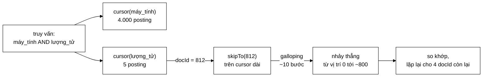

# PostingCursor — 4.005 bước xuống 48 bước, và 64 KB rác biến mất

**File nguồn:** `search-engine/src/main/java/com/vnsearch/index/PostingCursor.java` (72 dòng)
**Gói:** `com.vnsearch.index` · **Loại:** giao diện (6 phương thức + 1 hằng số + 1 hàm tĩnh) — Iterator pattern
**Cài đặt hiện có:** [`ArrayPostingCursor`](./ArrayPostingCursor.md) (package-private)
**Vị trí trong luồng:** cầu nối giữa [`SearchIndex`](./SearchIndex.md) và tầng truy vấn — [`PostingListMerger`](../query/PostingListMerger.md), [`CandidateResolver`](../query/CandidateResolver.md)
**Đọc kèm:** [`Posting.md`](./Posting.md) · [`ArrayPostingCursor.md`](./ArrayPostingCursor.md) · [`SearchIndex.md`](./SearchIndex.md)

---

## 📌 Hiểu trong 30 giây

Giao diện này giải **hai** bài toán cùng lúc, và bài toán thứ hai quan trọng
hơn bài toán thứ nhất:

```
   ① KHÔNG CẤP PHÁT
      Cách cũ vật chất hoá posting list thành List<Integer> trước khi giao.
      Posting list 4.000 mục ⇒ 4.000 object Integer 16 byte thay vì 4 byte
      ⇒ 64 KB rác GC mỗi lần gọi, × k lần cho truy vấn k term.
      Cursor duyệt thẳng trên dữ liệu gốc: KHÔNG CẤP PHÁT GÌ.

   ② NHẢY CÓC (quan trọng hơn)
      Giao một list RẤT NGẮN với một list RẤT DÀI:
           two-pointer thuần : O(m + n)        = 5 + 4000 = 4.005 bước
           galloping skipTo  : O(m·log(n/m))   = 5 × log(800) ≈ 48 bước
                                                  ─────────────────────
                                                  nhanh hơn 83 lần
```



---

## 1. Vấn đề ①: đóng hộp trên đường đi nóng

Cách cũ — `PostingListMerger.docIdsOf` — trả về `List<Integer>`:

```
   MỘT POSTING LIST 4.000 MỤC, VẬT CHẤT HOÁ THÀNH List<Integer>

   Integer:        16 byte × 4.000  =  64.000 byte
   ô Object[]:      4 byte × 4.000  =  16.000 byte
   ArrayList:                          40 byte
                                      ─────────
                                     ~80 KB rác cho MỘT posting list

   Truy vấn 3 term ⇒ ~240 KB rác.
   1.000 truy vấn/phút ⇒ 240 MB/phút chảy qua vườn ươm (young gen).
```

Hậu quả không phải là "tốn RAM" — rác vườn ươm được thu hồi rất rẻ. Hậu quả là
**độ trễ**:

```
   ── Không cấp phát ──────────────────────────────────
   Thời gian truy vấn ổn định, không có đỉnh nhọn

   ── Cấp phát 240 MB/phút ────────────────────────────
   Bộ thu gom rác chạy thường xuyên hơn
   ⇒ p99 độ trễ tăng vọt (mỗi lần GC là một khoảng dừng)
   ⇒ số liệu "truy vấn trung bình 12 ms" vẫn đẹp,
     nhưng 1% người dùng chờ 200 ms
```

Với một máy tìm kiếm, p99 là con số mà người dùng cảm nhận được. Cursor không
cấp phát gì trong lúc duyệt — nó chỉ giữ **một chỉ số nguyên**.

---

## 2. Vấn đề ②: giao hai danh sách lệch kích thước

Đây là tình huống **thường gặp nhất** trong tìm kiếm thật:

```
   TRUY VẤN:  "máy_tính lượng_tử"

   máy_tính    xuất hiện trong 4.000 tài liệu   ← từ phổ biến
   lượng_tử    xuất hiện trong     5 tài liệu   ← từ hiếm

   Kết quả giao tối đa 5 tài liệu.
   Nhưng two-pointer thuần vẫn phải BƯỚC QUA gần hết 4.000 mục
   của danh sách dài, mỗi bước một phép so sánh.
```

```
   TWO-POINTER THUẦN                    GALLOPING skipTo

   dài:  [1,2,3,…,812,…,4000]           dài:  [1,2,3,…,812,…,4000]
   ngắn: [812, 1900, 2100, 3050, 3900]  ngắn: [812, …]
          ↑                                    ↑
   i=0, j=0                             skipTo(812):
   so 1 vs 812 → i++                      nhảy 1,2,4,8,…,1024
   so 2 vs 812 → i++                      khoanh vào (512, 1024]
   … 810 lần nữa …                        binary search → tìm thấy
   so 812 vs 812 → KHỚP                   ≈ 10 + 9 = 19 phép so sánh
   ────────────────────────              ────────────────────────
   812 phép so sánh cho 1 khớp           19 phép so sánh cho 1 khớp
```

### 2.1 Galloping search — hai pha

Javadoc dòng 24–35 mô tả thuật toán (còn gọi là **exponential search**):

```
   PHA 1 — NHẢY THEO CẤP SỐ NHÂN
   bước = 1, 2, 4, 8, 16, … cho tới khi vượt qua mục tiêu
   Sau ceil(log2 d) lần nhảy, mục tiêu bị khoanh vào đoạn
        (index + bước/2,  index + bước]
   Chi phí: O(log d)

   PHA 2 — TÌM NHỊ PHÂN trong đoạn vừa khoanh
   Đoạn có độ dài ≤ bước/2 ≈ d, nên binary search tốn O(log d)

   TỔNG: O(log d)
```

**Điểm mạnh so với tìm nhị phân thuần trên cả mảng:**

```
   Binary search thuần:  O(log n)   n = KÍCH THƯỚC MẢNG
   Galloping:            O(log d)   d = KHOẢNG CÁCH THẬT PHẢI NHẢY

   ── Khi hai posting list CHỒNG NHAU NHIỀU (d nhỏ) ────────────
   d = 2  →  galloping:  log 2  = 1 bước    ← gần như miễn phí
             binary:     log 4000 = 12 bước

   ── Khi hai posting list LỆCH NHAU NHIỀU (d lớn) ─────────────
   d = 800 →  galloping:  log 800 ≈ 10 bước  ← vẫn nhảy xa được ngay
             binary:      log 4000 = 12 bước

   ⇒ Galloping KHÔNG BAO GIỜ tệ hơn binary quá một hằng số,
     và TỐT HƠN NHIỀU trong trường hợp thường gặp (d nhỏ).
```

Đây chính là lý do galloping được chọn thay vì binary search: nó **thích nghi**
với dữ liệu. Khi hai danh sách giống nhau (nhiều docId chung), nó gần như miễn
phí; khi chúng lệch nhau, nó vẫn nhảy xa được ngay.

### 2.2 Điều kiện tiên quyết: posting list sắp xếp tăng dần

Javadoc dòng 37–38: *"Kỹ thuật này dựa hoàn toàn vào bất biến 'posting list sắp
xếp tăng dần theo docId' mà `InvertedIndex` đảm bảo."*

```
   NẾU BẤT BIẾN BỊ PHÁ

   Galloping giả định: đi xa hơn ⇒ docId lớn hơn.
   Với mảng không sắp xếp, giả định đó sai
   ⇒ pha 1 dừng ở chỗ ngẫu nhiên
   ⇒ pha 2 binary search trên đoạn không sắp xếp
   ⇒ TRẢ VỀ KẾT QUẢ SAI, KHÔNG NÉM LỖI

   Cursor sẽ báo "không tìm thấy" cho những docId thật sự có.
   Triệu chứng: truy vấn thiếu kết quả, không giải thích được.
```

Bất biến này được phát biểu **ba lần** trong mã nguồn — ở `SearchIndex`
(blockquote), ở `PostingCursor` (dòng 37), và ở `ArrayPostingCursor` (dòng 6–7).
Lặp lại như vậy là đúng: nó là điều kiện đúng đắn của toàn tầng truy vấn.

---

## 3. Bản đồ giao diện

```
PostingCursor
├── NO_MORE = Integer.MAX_VALUE   ── hằng số báo hết
├── docId()          : int      O(1)
├── termFrequency()  : int      O(1)
├── positions()      : int[]    O(1)   ── CHỈ ĐỌC
├── next()           : boolean  O(1)
├── skipTo(int)      : boolean  O(log d)  ← trái tim của giao diện
├── size()           : int              ── để sắp xếp shortest-first
└── static of(List<Posting>) : PostingCursor   ── factory
```

### 3.1 `NO_MORE = Integer.MAX_VALUE` — vì sao chọn giá trị này

```java
int NO_MORE = Integer.MAX_VALUE;
```

Không phải `-1`, không phải `0`. Lý do là **nó làm phép so sánh trong vòng lặp
giao trở nên đúng một cách tự nhiên**:

```java
// Vòng lặp giao k danh sách — mẫu chuẩn
while (true) {
    int max = 0;
    for (PostingCursor c : cursors) {
        max = Math.max(max, c.docId());     // cursor hết → NO_MORE → max = NO_MORE
    }
    if (max == PostingCursor.NO_MORE) break;   // ← một cursor hết ⇒ dừng, ĐÚNG
    …
}
```

```
   NẾU NO_MORE = −1:
        max = Math.max(…, −1)  →  −1 KHÔNG lan ra
        ⇒ vòng lặp không biết cursor đã hết
        ⇒ phải kiểm tra riêng từng cursor  ⇒ thêm nhánh, thêm cơ hội sai

   VỚI NO_MORE = Integer.MAX_VALUE:
        Mọi docId thật đều < NO_MORE
        ⇒ "đã hết" TỰ ĐỘNG thắng trong mọi phép so sánh max
        ⇒ điều kiện dừng viết được thành MỘT dòng
```

Đây là mẫu **giá trị lính canh (sentinel)** dùng đúng chỗ: chọn giá trị sao cho
trường hợp biên tự hoà vào trường hợp thường, thay vì phải xử lý riêng.

> ⚠️ Hệ quả: `docId` thật **không được** bằng `Integer.MAX_VALUE`. Với chỉ mục
> hiện tại (vài nghìn tài liệu) thì xa vời, nhưng đó là một giới hạn nên biết.

### 3.2 `size()` — vì sao một giao diện duyệt lại cần biết kích thước

```java
/** Tổng số posting — dùng để sắp xếp shortest-first. */
int size();
```

```
   TỐI ƯU "NGẮN NHẤT TRƯỚC" (shortest-first)

   Giao 3 danh sách: A(4000), B(5), C(800)

   ── Thứ tự tuỳ tiện: A, B, C ────────────────────────
      Bắt đầu duyệt A → mỗi docId của A phải hỏi B và C
      ⇒ 4.000 lượt kiểm tra

   ── Sắp xếp ngắn nhất trước: B, C, A ────────────────
      Bắt đầu duyệt B (5 mục) → mỗi docId hỏi C và A
      ⇒ 5 lượt × 2 lần skipTo = 10 lần skipTo
      ⇒ ~10 × 12 = 120 phép so sánh

   Kết quả giao KHÔNG BAO GIỜ lớn hơn danh sách ngắn nhất,
   nên bắt đầu từ đó là tối ưu.
```

`size()` là thông tin duy nhất cần để làm phép sắp xếp này, và nó rẻ ($O(1)$
với mọi cài đặt hợp lý). Đưa nó vào giao diện duyệt trông có vẻ lệch trách
nhiệm, nhưng nó là **cái giá rất nhỏ để mở khoá một tối ưu rất lớn**.

### 3.3 Hàm tĩnh `of` — factory ẩn cài đặt

```java
static PostingCursor of(List<Posting> postings) {
    return new ArrayPostingCursor(postings);
}
```

[`ArrayPostingCursor`](./ArrayPostingCursor.md) là **package-private** — không
lớp nào ngoài gói `index` nhìn thấy nó. Người dùng chỉ biết `PostingCursor.of(…)`.

```
   LỢI ÍCH: đổi cài đặt mà không ai phải sửa gì

   Ví dụ khi CompressedPostings được dùng làm nguồn dữ liệu chính:
        static PostingCursor of(List<Posting> postings) { … }
        static PostingCursor of(CompressedPostings nen)  { … }   ← thêm nạp chồng

   Mã gọi vẫn viết PostingCursor.of(…) và nhận đúng cài đặt phù hợp.
```

### 3.4 Hợp đồng của `skipTo` — bốn tình huống

| Tình huống | Trả về | Vị trí cursor sau đó |
|---|---|---|
| Tìm thấy docId đúng bằng mục tiêu | `true` | Trỏ vào docId đó |
| Không có docId đúng bằng, có docId lớn hơn | `true` | Trỏ vào docId **đầu tiên ≥ mục tiêu** |
| Mọi docId còn lại đều nhỏ hơn mục tiêu | `false` | Đã hết (`docId() == NO_MORE`) |
| Mục tiêu **nhỏ hơn** vị trí hiện tại | `true` | **Giữ nguyên** — không lùi |

Tình huống thứ tư là hợp đồng dễ bị hiểu nhầm nhất, và có test riêng canh giữ:

```java
@Test
void skipToBackwardsIsNoOp() {
    PostingCursor cursor = PostingCursor.of(postings(1, 3, 5, 7));
    cursor.skipTo(5);
    assertTrue(cursor.skipTo(2), "Nhảy lui phải giữ nguyên vị trí, không lùi lại");
    assertEquals(5, cursor.docId());
}
```

```
   VÌ SAO KHÔNG LÙI

   Cursor là con trỏ MỘT CHIỀU. Thuật toán giao luôn tiến về phía
   trước, nên "nhảy lui" chỉ xảy ra khi một cursor khác đang ở phía
   sau — và khi đó câu trả lời đúng là "tôi đã ở vị trí >= mục tiêu
   của anh rồi", tức là true mà không di chuyển.

   Cho phép lùi sẽ mở ra khả năng vòng lặp vô hạn trong thuật toán
   giao: hai cursor kéo nhau qua lại mãi mãi.
```

---

## 4. Hướng dẫn thực hành

### 4.1 Mẫu giao k danh sách với `skipTo` — mã dán được

```java
/** Giao k posting list. Trả về danh sách docId có mặt trong TẤT CẢ. */
static List<Integer> giao(List<PostingCursor> cursors) {
    if (cursors.isEmpty()) return List.of();

    // ① Ngắn nhất trước — xem mục 3.2
    cursors.sort(Comparator.comparingInt(PostingCursor::size));

    List<Integer> ketQua = new ArrayList<>();
    PostingCursor dan = cursors.get(0);              // cursor DẪN, ngắn nhất

    while (dan.docId() != PostingCursor.NO_MORE) {
        int ungVien = dan.docId();
        boolean moiCursorDeuCo = true;

        // ② Hỏi các cursor còn lại bằng skipTo
        for (int i = 1; i < cursors.size(); i++) {
            PostingCursor c = cursors.get(i);
            if (!c.skipTo(ungVien) || c.docId() != ungVien) {
                moiCursorDeuCo = false;
                // ③ Nhảy cursor dẫn tới docId mà cursor này đang đứng
                //    — bỏ qua mọi ứng viên chắc chắn không khớp
                if (c.docId() != PostingCursor.NO_MORE) {
                    dan.skipTo(c.docId());
                } else {
                    return ketQua;                    // một cursor đã hết ⇒ xong
                }
                break;
            }
        }

        if (moiCursorDeuCo) {
            ketQua.add(ungVien);
            dan.next();
        }
    }
    return ketQua;
}
```

Bước ③ là chỗ galloping phát huy sức mạnh **hai chiều**: không chỉ cursor dài
nhảy tới ứng viên, mà cursor dẫn cũng nhảy vượt qua những ứng viên chắc chắn
hỏng. Bỏ bước này thì thuật toán vẫn đúng nhưng chậm hơn nhiều.

### 4.2 Duyệt tuần tự đơn giản (không giao)

```java
PostingCursor c = index.cursor("máy_tính");
while (c.docId() != PostingCursor.NO_MORE) {
    int doc = c.docId();
    int tf  = c.termFrequency();
    for (int viTri : c.positions()) {           // KHÔNG sửa mảng này
        // …
    }
    c.next();
}
```

Chú ý mẫu vòng lặp: điều kiện kiểm `docId() != NO_MORE` chứ **không** dùng
`while (c.next())`. Lý do: cursor bắt đầu ở phần tử **đầu tiên**, không phải
trước nó — nên `while (c.next())` sẽ bỏ qua phần tử đầu.

```
   BẪY DỄ MẮC NHẤT

   ✗  while (c.next()) { … }        ← BỎ QUA posting đầu tiên
   ✓  while (c.docId() != NO_MORE) { …; c.next(); }

   Khác với java.util.Iterator (hasNext/next), cursor này theo
   quy ước của Lucene: đã đứng sẵn trên phần tử đầu.
```

### 4.3 Cạm bẫy

| Cạm bẫy | Hậu quả | Cách đúng |
|---|---|---|
| `while (c.next())` | Bỏ qua posting đầu tiên — kết quả thiếu, im lặng | `while (c.docId() != NO_MORE)` |
| Sửa mảng từ `positions()` | Hỏng chỉ mục vĩnh viễn | Chỉ đọc |
| Dùng cursor từ nhiều luồng | Cursor **có trạng thái** (chỉ số hiện tại) | Một cursor mỗi luồng; `index.cursor(term)` rẻ |
| Giao mà không sắp xếp ngắn nhất trước | Mất phần lớn lợi ích của `skipTo` | `sort(comparingInt(PostingCursor::size))` |
| Quên bước ③ (nhảy cursor dẫn) | Vẫn đúng nhưng chậm — mỗi ứng viên hỏng vẫn tốn một lượt | Nhảy cả hai phía |
| Giả định `skipTo` lùi được | Vòng lặp vô hạn hoặc kết quả sai | Hợp đồng: không lùi |
| Cài đặt `skipTo` bằng quét tuyến tính "cho đơn giản" | Mất toàn bộ lợi ích $O(\log d)$ — quay về 4.005 bước | Dùng galloping |
| Dùng cursor trên list chưa sắp xếp | Kết quả sai, không có lỗi nào được ném | Bảo đảm bất biến ở `InvertedIndex` |

---

## 5. Độ phức tạp & chi phí

| Phương thức | Chi phí | Cấp phát |
|---|---|---|
| `docId()`, `termFrequency()`, `positions()` | $O(1)$ | 0 |
| `next()` | $O(1)$ | 0 |
| `skipTo(t)` | $O(\log d)$, $d$ = khoảng cách thật | 0 |
| `size()` | $O(1)$ | 0 |
| `of(list)` | $O(1)$ | 1 đối tượng cursor (~24 byte) |

**Giao hai danh sách $m$ và $n$ (giả sử $m \ll n$):**

```
   Two-pointer thuần:     O(m + n)
   Galloping:             O(m · log(n/m))

   m=5, n=4000:
        two-pointer:  4.005 bước
        galloping:    5 × log2(800) ≈ 5 × 9,6 ≈ 48 bước
        ───────────────────────────────────────────
        nhanh hơn 83 lần

   m=2000, n=4000  (hai danh sách gần bằng nhau):
        two-pointer:  6.000 bước
        galloping:    2000 × log2(2) = 2.000 bước
        ───────────────────────────────────────────
        vẫn nhanh hơn 3 lần

   ⇒ Galloping KHÔNG BAO GIỜ tệ hơn two-pointer về mặt tiệm cận.
     Chi phí duy nhất là hằng số lớn hơn một chút mỗi bước.
```

**Rác GC tiết kiệm được:**

```
   Truy vấn 3 term, posting list trung bình 1.500 mục

   Cách cũ (List<Integer>):  3 × 1.500 × 20 byte ≈ 90 KB/truy vấn
   Cursor:                                          0 byte

   Ở 1.000 truy vấn/phút:  90 MB/phút  →  0
```

---

## 6. Kiểm thử liên quan

`test/java/com/vnsearch/index/PostingCursorTest.java` (117 dòng, 9 ca) — file
test tốt, bao đủ mọi nhánh của hợp đồng:

| Ca kiểm thử | Bảo vệ điều gì |
|---|---|
| `emptyCursorIsImmediatelyExhausted` | Danh sách rỗng: `docId()` = `NO_MORE`, `next()`/`skipTo()` trả `false` |
| `iteratesInAscendingOrder` | Duyệt tuần tự; cursor bắt đầu **trên** phần tử đầu |
| `skipToLandsOnExactMatch` | Nhảy trúng đích |
| `skipToLandsOnFirstGreaterWhenNoExactMatch` | Nhảy tới phần tử **đầu tiên ≥ mục tiêu** |
| `skipToBeyondEndExhaustsCursor` | Nhảy quá cuối ⇒ `false` + `NO_MORE` |
| `skipToBackwardsIsNoOp` | **Không lùi** — hợp đồng ở mục 3.4 |
| `gallopingFindsEveryTargetInLargeList` | 10.000 mục, 5 mục tiêu rải rác |
| `gallopingMatchesLinearScanOnEveryPosition` | **Kiểm chứng đối sánh** — xem dưới |
| `exposesTermFrequencyAndPositions` | Truy cập dữ liệu của posting hiện tại |

Ca `gallopingMatchesLinearScanOnEveryPosition` là ca đáng học nhất:

```java
@Test
void gallopingMatchesLinearScanOnEveryPosition() {
    int[] docIds = {2, 4, 8, 16, 32, 64, 128, 256, 512, 1024};
    for (int target = 0; target <= 1100; target++) {
        PostingCursor cursor = PostingCursor.of(postings(docIds));
        boolean found = cursor.skipTo(target);

        // Đối chiếu với quét tuyến tính — nguồn sự thật đơn giản.
        int expected = PostingCursor.NO_MORE;
        for (int docId : docIds) {
            if (docId >= target) { expected = docId; break; }
        }
        assertEquals(expected != PostingCursor.NO_MORE, found, "target=" + target);
        assertEquals(expected, cursor.docId(), "target=" + target);
    }
}
```

```
   VÌ SAO KỸ THUẬT NÀY MẠNH

   Galloping có ~6 trường hợp biên (mục tiêu trước phần tử đầu,
   sau phần tử cuối, đúng ranh giới nhảy 2^k, giữa hai phần tử,
   trùng phần tử, mảng một phần tử…). Liệt kê tay thì chắc chắn
   sót một.

   Thay vào đó: viết một CÀI ĐẶT NGÂY THƠ HIỂN NHIÊN ĐÚNG (quét
   tuyến tính) và so kết quả trên MỌI đầu vào trong một dải.

   1.101 mục tiêu × 10 phần tử — chạy trong vài mili-giây, và
   nó bao phủ mọi trường hợp biên mà không cần nghĩ ra chúng.
```

Chú ý mảng `{2,4,8,16,…,1024}` được chọn có chủ ý: các luỹ thừa 2 nằm **đúng
trên ranh giới bước nhảy** của galloping — nơi lỗi lệch-một-đơn-vị hay xuất hiện
nhất.

```powershell
cd search-engine
.\mvnw.cmd -q -Dtest='PostingCursorTest' test
```

---

## 7. Liên kết

- Cài đặt duy nhất hiện có, và mã galloping chi tiết: [`ArrayPostingCursor.md`](./ArrayPostingCursor.md)
- Dữ liệu mà cursor duyệt: [`Posting.md`](./Posting.md)
- Nơi bất biến "sắp xếp tăng theo docId" được phát biểu: [`SearchIndex.md`](./SearchIndex.md)
- Nơi cursor được tạo ra: [`InvertedIndex.md`](./InvertedIndex.md)
- Nơi cursor được dùng để giao posting list: [`../query/PostingListMerger.md`](../query/PostingListMerger.md) · [`../query/CandidateResolver.md`](../query/CandidateResolver.md)
- Nguồn dữ liệu nén, đích đến tự nhiên của một cursor thứ hai: [`CompressedPostings.md`](./CompressedPostings.md)
