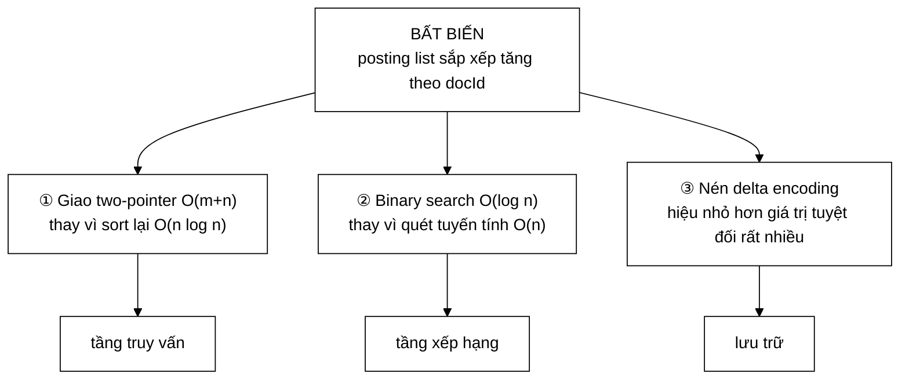

# SearchIndex — một bất biến mở khoá ba tối ưu

**File nguồn:** `search-engine/src/main/java/com/vnsearch/index/SearchIndex.java` (87 dòng)
**Gói:** `com.vnsearch.index` · **Loại:** giao diện (11 phương thức) — Strategy pattern
**Cài đặt hiện có:** [`InvertedIndex`](./InvertedIndex.md)
**Người dùng:** [`CandidateResolver`](../query/CandidateResolver.md) · [`TfIdfScorer`](../ranking/TfIdfScorer.md) · [`BM25Scorer`](../ranking/BM25Scorer.md) · [`ResultRanker`](../ranking/ResultRanker.md) · [`SnippetBuilder`](../ranking/SnippetBuilder.md)
**Đọc kèm:** [`InvertedIndex.md`](./InvertedIndex.md) · [`PostingCursor.md`](./PostingCursor.md) · [`Posting.md`](./Posting.md)

---

## 📌 Hiểu trong 30 giây

Giao diện này là **hợp đồng giữa tầng chỉ mục và mọi thứ ở trên nó**. Điều quan
trọng nhất trong hợp đồng không phải là danh sách phương thức, mà là một câu
duy nhất được đóng khung trong Javadoc:

> Với mọi term `t`, `getPostings(String)` trả về danh sách **sắp xếp tăng dần
> nghiêm ngặt theo `docId`**.



```
   BA TỐI ƯU, MỘT ĐIỀU KIỆN

   ① GIAO NHANH
      Có sắp xếp: two-pointer  O(m + n)
      Không:      phải sort lại O(n log n) MỖI TRUY VẤN
                  hoặc dựng HashSet  ⇒ cấp phát lớn

   ② TRA CỨU NHANH
      Có sắp xếp: binary search  O(log n)   → 4.000 mục = 12 bước
      Không:      quét tuyến tính O(n)      → 4.000 mục = 4.000 bước

   ③ NÉN ĐƯỢC
      Có sắp xếp: docId 1002, 1005, 1009  →  delta 1002, 3, 4
                  VByte mã hoá 3 và 4 bằng MỘT byte
      Không:      mỗi docId cần 2–3 byte, và delta có thể ÂM
```

---

## 1. Vì sao cần một giao diện ở đây

Javadoc dòng 11–22 liệt kê ba hậu quả của việc trước đây mọi lớp nhận thẳng
`InvertedIndex`:

```
   ① KHÔNG THAY ĐƯỢC CÀI ĐẶT
      Chỉ mục trên đĩa, chỉ mục nén, chỉ mục phân tán — mỗi cái
      đòi hỏi sửa MỌI nơi dùng.

   ② KHÔNG GIẢ LẬP ĐƯỢC TRONG TEST
      Muốn test BM25Scorer phải dựng chỉ mục THẬT với tokenizer THẬT.
      ⇒ test chậm, và khi nó đỏ thì không biết lỗi ở scorer hay ở
        tokenizer.

   ③ KHÔNG ĐO ĐƯỢC
      Không thể trả lời "chỉ mục nén có chậm hơn không" vì không có
      hai cài đặt để so.
```

Điểm ② là điểm có giá trị ngay lập tức. So sánh hai cách viết test cho một
scorer:

```java
// ── TRƯỚC: phải dựng chỉ mục thật ──────────────────────────
InvertedIndex index = new InvertedIndex(new VietnameseTokenizer());
index.addDocument(new WebDocument("https://a.vn/1", "tiêu đề", "nội dung dài…"));
index.addDocument(new WebDocument("https://a.vn/2", "…", "…"));
// Còn phải đoán xem tokenizer tách "nội dung dài" thành token gì
// để biết term nào tra được. Test phụ thuộc vào từ điển 154 mục.

// ── SAU: giả lập đúng thứ scorer cần ───────────────────────
SearchIndex gia = new SearchIndex() {
    @Override public int getDocumentFrequency(String term) { return 2; }
    @Override public int getTotalDocs()                    { return 100; }
    @Override public double getAverageDocLength()          { return 250.0; }
    @Override public int getDocLength(int docId)           { return 300; }
    @Override public int getTermFrequency(String t, int d) { return 5; }
    // … các phương thức còn lại trả giá trị trung tính
};
// Test BM25 với ĐÚNG bộ số muốn kiểm tra, không phụ thuộc gì khác.
```

Cách thứ hai kiểm tra **công thức BM25**, cách thứ nhất kiểm tra công thức BM25
**cộng với** tokenizer, cộng với từ điển, cộng với việc dựng chỉ mục. Khi test
đỏ, chỉ cách thứ hai cho biết lỗi ở đâu.

---

## 2. Bất biến trung tâm — đọc kỹ

```
   "Với mọi term t, getPostings(t) trả về danh sách
    SẮP XẾP TĂNG DẦN NGHIÊM NGẶT theo docId."
```

Từ **nghiêm ngặt** (strictly) có ý nghĩa: không chỉ không giảm, mà **không có
hai posting cùng `docId`**. Một tài liệu chứa một term xuất hiện đúng một lần
trong posting list của term đó, với `termFrequency` gộp mọi lần xuất hiện.

### 2.1 Tối ưu ① — giao hai posting list

```
   TRUY VẤN "máy_tính lượng_tử"  ⇒  giao hai posting list

   ── CÓ bất biến: two-pointer ───────────────────────────────
   A: [3, 17, 42, 88]        i→
   B: [17, 42, 91]           j→
   so A[i] với B[j], tiến con trỏ nhỏ hơn
   ⇒ O(m + n),  KHÔNG cấp phát

   ── KHÔNG có bất biến ──────────────────────────────────────
   Phương án a: sort lại   → O(n log n) MỖI TRUY VẤN
                             4.000 mục ⇒ ~48.000 phép so sánh
   Phương án b: HashSet    → O(m + n) nhưng CẤP PHÁT một
                             HashSet 4.000 mục ≈ 200 KB rác/truy vấn
```

Và với [`PostingCursor.skipTo`](./PostingCursor.md) thì còn tốt hơn: $O(m \log(n/m))$,
tức 48 bước thay vì 4.005 khi hai danh sách lệch kích thước.

### 2.2 Tối ưu ② — binary search cho `getTermFrequency`/`getPositions`

Chú ý hai phương thức này được ghi rõ độ phức tạp ngay trong Javadoc:

```java
/** O(log n) - tần suất của {@code term} trong đúng {@code docId} (0 nếu không có). */
int getTermFrequency(String term, int docId);

/** O(log n) - danh sách vị trí xuất hiện của {@code term} trong {@code docId}. */
int[] getPositions(String term, int docId);
```

```
   VÌ SAO O(log n) QUAN TRỌNG Ở ĐÂY

   BM25 gọi getTermFrequency MỘT LẦN CHO MỖI (term, tài liệu ứng viên).

   Truy vấn 3 term, 1.000 tài liệu ứng viên
        ⇒ 3.000 lời gọi

   O(log n) với n = 4.000:  3.000 × 12  =   36.000 bước
   O(n)     với n = 4.000:  3.000 × 4000 = 12.000.000 bước
                                            ─────────────
                                            chậm hơn 333 lần
```

### 2.3 Tối ưu ③ — nén delta

```
   docId trong posting list:   1002, 1005, 1009, 1010, 1023

   ── Lưu giá trị tuyệt đối ──────────────────────────────
   1002, 1005, 1009, 1010, 1023
   Mỗi số cần 2 byte VByte (vì > 127)
   ⇒ 10 byte

   ── Lưu delta (nhờ bất biến sắp xếp) ───────────────────
   1002, 3, 4, 1, 13
   Bốn số sau đều < 128 ⇒ 1 byte mỗi số
   ⇒ 2 + 1 + 1 + 1 + 1 = 6 byte     (tiết kiệm 40%)

   NẾU KHÔNG SẮP XẾP:
        delta có thể ÂM  ⇒  VByte không mã hoá số âm hiệu quả
        ⇒  phải dùng zigzag encoding, mất một bit
        ⇒  hoặc bỏ hẳn delta encoding
```

Chi tiết đầy đủ ở [`VByteCodec`](./VByteCodec.md) và [`CompressedPostings`](./CompressedPostings.md).

### 2.4 Bất biến này được ai bảo đảm, và ai kiểm tra

```
   BẢO ĐẢM:  InvertedIndex.addDocument gán docId TĂNG DẦN
             (0, 1, 2, …) và thêm posting theo đúng thứ tự đó
             ⇒ posting list sinh ra đã sắp xếp một cách tự nhiên

   KIỂM TRA: KHÔNG CÓ GÌ.

   ⇒ Một thay đổi làm tài liệu được index song song, hoặc cho
     phép index lại một tài liệu cũ với docId cũ, sẽ phá bất
     biến này mà KHÔNG có lỗi nào được ném.

   Triệu chứng: truy vấn nhiều term bắt đầu thiếu kết quả,
   không giải thích được, không tái hiện đều.
```

Đây là điểm yếu lớn nhất của giao diện. Xem đề xuất 1 ở mục 6.

---

## 3. Bản đồ giao diện — 11 phương thức, ba nhóm

```
SearchIndex
│
├── NHÓM 1 — TRUY CẬP POSTING (tầng truy vấn dùng)
│   ├── getPostings(String)        : List<Posting>    O(1)
│   ├── cursor(String)             : PostingCursor    O(1)
│   └── getDocumentFrequency(String): int             O(1)
│
├── NHÓM 2 — SỐ LIỆU CHO XẾP HẠNG (tầng ranking dùng)
│   ├── getTermFrequency(String,int): int             O(log n)
│   ├── getPositions(String,int)    : int[]           O(log n)
│   ├── getDocLength(int)           : int
│   ├── getAverageDocLength()       : double          O(1)
│   ├── getTotalDocs()              : int
│   └── getTermCount()              : int
│
└── NHÓM 3 — TRUY CẬP TÀI LIỆU (tầng hiển thị dùng)
    ├── getDocument(int)            : WebDocument
    ├── getBodyText(int)            : String
    └── getAllDocuments()           : Map<Integer,WebDocument>  ── KHÔNG SỬA ĐƯỢC
```

### 3.1 Vì sao `getBodyText` tách khỏi `getDocument`

Javadoc dòng 56–63 giải thích:

> *"Tách khỏi `getDocument(int)` vì hai thứ có chi phí rất khác nhau: lấy
> `WebDocument` là một phép tra bảng băm, còn lấy văn bản **có thể phải giải
> nén**. Gộp chung sẽ giấu mất chi phí đó sau một lời gọi trông vô vô hại."*

```
   getDocument(7)   →  HashMap.get       ~50 ns
   getBodyText(7)   →  giải nén Deflate  ~50.000 ns    ← GẤP 1.000 LẦN

   Nếu gộp:  doc.getBodyText()
        Người viết ResultRanker gọi nó trong vòng lặp 1.000 ứng viên
        ⇒ 50 ms chỉ để giải nén văn bản mà 990 tài liệu không cần

   Tách ra:  chỉ SnippetBuilder gọi getBodyText, và chỉ cho 10 kết
             quả cuối cùng
        ⇒ 0,5 ms
```

```
   NGUYÊN TẮC: ĐỘ ĐẮT PHẢI HIỆN RA TRONG TÊN GỌI

   Một API tốt không giấu chi phí. Khi hai thao tác chênh nhau
   1.000 lần, chúng phải là hai lời gọi khác nhau — để người viết
   mã gọi PHẢI ra quyết định có ý thức.
```

Xem [`CompressedText`](./CompressedText.md) về việc giải nén thân bài.

### 3.2 Vì sao có cả `getPostings` **và** `cursor`

Hai cách truy cập cùng một dữ liệu, phục vụ hai nhu cầu:

| | `getPostings(term)` | `cursor(term)` |
|---|---|---|
| Trả về | `List<Posting>` | [`PostingCursor`](./PostingCursor.md) |
| Cấp phát | 0 (trả danh sách có sẵn) | 1 đối tượng ~24 byte |
| Nhảy cóc | Không | **Có** — $O(\log d)$ |
| Dùng khi | Cần cả danh sách (thống kê, kiểm thử, lưu trữ) | Giao nhiều posting list — đường đi nóng |

`cursor` là đường đi được ưu tiên cho truy vấn. `getPostings` vẫn cần vì
[`IndexPersistence`](./IndexPersistence.md) và [`CompressedPostings`](./CompressedPostings.md)
cần toàn bộ danh sách một lúc.

### 3.3 `getAllDocuments` — "không sửa đổi được"

```java
/** Toàn bộ tài liệu, <b>không sửa đổi được</b> (bảo vệ đóng gói). */
Map<Integer, WebDocument> getAllDocuments();
```

Trả về bản đồ **thật** được bọc `Collections.unmodifiableMap`, không phải bản
sao:

```
   ── Bản sao (new HashMap<>(goc)) ────────────────────────
   An toàn tuyệt đối, nhưng sao chép 2.518 mục MỖI LẦN GỌI
   ⇒ ~200 KB rác mỗi lời gọi

   ── unmodifiableMap (hiện tại) ──────────────────────────
   0 cấp phát đáng kể; put/remove ném UnsupportedOperationException
   ⇒ bảo vệ đủ, chi phí bằng 0

   Lưu ý: nó KHÔNG bảo vệ được việc sửa nội dung một WebDocument
   lấy ra từ bản đồ. Bảo vệ đó phải nằm ở chính WebDocument
   (là một record bất biến — xem ../model/WebDocument.md).
```

### 3.4 `getAverageDocLength` — vì sao là phương thức riêng chứ không tính tại chỗ

BM25 chuẩn hoá độ dài tài liệu theo trung bình toàn corpus. Nếu tầng xếp hạng
tự tính:

```
   Tự tính:  duyệt 2.518 tài liệu  →  O(N)  mỗi truy vấn
   Chỉ mục giữ sẵn:  O(1)  — cập nhật tăng dần khi addDocument

   Với 1.000 truy vấn/phút:  2,5 triệu phép cộng thừa/phút
```

Javadoc ghi rõ `O(1)` và lý do *"BM25 cần để chuẩn hoá"* — đây là mẫu tốt: đưa
vào giao diện những **số liệu tổng hợp** mà tầng trên cần, thay vì để tầng trên
tự tính lại từ dữ liệu thô.

---

## 4. Hướng dẫn thực hành

### 4.1 Viết một cài đặt giả cho test — mẫu đầy đủ

```java
/** Chỉ mục giả tối giản: đủ để test scorer mà không cần tokenizer thật. */
class ChiMucGia implements SearchIndex {

    private final Map<String, List<Posting>> duLieu = new HashMap<>();
    private final Map<Integer, Integer> doDai = new HashMap<>();

    ChiMucGia them(String term, int docId, int tf, int... viTri) {
        duLieu.computeIfAbsent(term, k -> new ArrayList<>())
              .add(new Posting(docId, tf, viTri));
        // BẤT BIẾN: giữ sắp xếp tăng theo docId
        duLieu.get(term).sort(Comparator.comparingInt(Posting::docId));
        return this;
    }

    @Override public List<Posting> getPostings(String term) {
        return duLieu.getOrDefault(term, List.of());
    }
    @Override public int getDocumentFrequency(String term) {
        return getPostings(term).size();
    }
    @Override public int getTermFrequency(String term, int docId) {
        return getPostings(term).stream()
                .filter(p -> p.docId() == docId).mapToInt(Posting::termFrequency)
                .findFirst().orElse(0);
    }
    @Override public int[] getPositions(String term, int docId) {
        return getPostings(term).stream()
                .filter(p -> p.docId() == docId).map(Posting::positions)
                .findFirst().orElse(new int[0]);
    }
    @Override public PostingCursor cursor(String term)  { return PostingCursor.of(getPostings(term)); }
    @Override public int getDocLength(int docId)        { return doDai.getOrDefault(docId, 100); }
    @Override public double getAverageDocLength()       { return 100.0; }
    @Override public int getTotalDocs()                 { return 10; }
    @Override public int getTermCount()                 { return duLieu.size(); }
    @Override public String getBodyText(int docId)      { return ""; }
    @Override public WebDocument getDocument(int docId) { return null; }
    @Override public Map<Integer, WebDocument> getAllDocuments() { return Map.of(); }
}
```

Dùng:

```java
@Test
void bm25ChoDiemCaoHonKhiTanSuatCaoHon() {
    SearchIndex idx = new ChiMucGia()
            .them("máy_tính", 1, 10, 0,1,2,3,4,5,6,7,8,9)
            .them("máy_tính", 2,  1, 0);
    BM25Scorer scorer = new BM25Scorer(idx);
    assertTrue(scorer.score("máy_tính", 1) > scorer.score("máy_tính", 2));
}
```

Test này chạy trong micro-giây, không đọc đĩa, không phụ thuộc từ điển, và khi
nó đỏ thì chắc chắn lỗi nằm trong `BM25Scorer`.

> ⚠️ Chú ý dòng `sort(comparingInt(Posting::docId))` trong `them` — **cài đặt
> giả cũng phải giữ bất biến**. Một chỉ mục giả không sắp xếp sẽ làm test của
> `PostingListMerger` sai một cách khó hiểu.

### 4.2 Cạm bẫy khi cài đặt giao diện này

| Cạm bẫy | Hậu quả | Cách đúng |
|---|---|---|
| `getPostings` trả danh sách **không sắp xếp** | Giao two-pointer sai; `skipTo` sai; nén delta sinh số âm — **tất cả im lặng** | Bảo đảm bất biến, và test nó |
| Trả `null` thay vì danh sách rỗng | `NullPointerException` rải rác | Javadoc ghi *"rỗng nếu không có"* |
| `getPostings` trả danh sách **sửa được** | Tầng truy vấn lỡ tay `sort()` hoặc `remove()` ⇒ hỏng chỉ mục | `Collections.unmodifiableList` |
| Gộp `getBodyText` vào `getDocument` | Giấu chi phí giải nén gấp 1.000 lần | Giữ tách |
| `getAverageDocLength` tính lại mỗi lần gọi | $O(N)$ trên đường đi nóng | Duy trì tăng dần |
| `getTermFrequency` quét tuyến tính | 333 lần chậm hơn (mục 2.2) | Binary search |
| `getAllDocuments` trả bản đồ gốc sửa được | Người gọi xoá tài liệu khỏi chỉ mục | `unmodifiableMap` |
| Cài đặt mới không giữ `docId` **nghiêm ngặt** tăng | Hai posting cùng docId ⇒ tài liệu bị tính điểm hai lần | Gộp khi build |

---

## 5. Độ phức tạp & chi phí

| Phương thức | Chi phí (theo hợp đồng) | Tần suất gọi mỗi truy vấn |
|---|---|---|
| `getPostings` / `cursor` | $O(1)$ | $k$ (số term) |
| `getDocumentFrequency` | $O(1)$ | $k$ |
| `getTermFrequency` | $O(\log n)$ | $k \times$ số ứng viên |
| `getPositions` | $O(\log n)$ | $k \times$ số ứng viên (chỉ khi tìm cụm từ) |
| `getDocLength` | $O(1)$ | số ứng viên |
| `getAverageDocLength` | $O(1)$ | 1 |
| `getBodyText` | **Có thể tốn kém** (giải nén) | 10 (chỉ kết quả hiển thị) |
| `getDocument` | $O(1)$ | 10 |

```
   NGÂN SÁCH MỘT TRUY VẤN ĐIỂN HÌNH
   3 term, 1.000 ứng viên, 10 kết quả

   getPostings/cursor       3 ×  O(1)                 ~ 0,1 µs
   getDocumentFrequency     3 ×  O(1)                 ~ 0,1 µs
   giao (skipTo)                                      ~  50 µs
   getTermFrequency      3.000 ×  O(log 4000)         ~ 400 µs   ← ĐẮT NHẤT
   getDocLength          1.000 ×  O(1)                ~  10 µs
   getBodyText              10 ×  giải nén            ~ 500 µs   ← ĐẮT NHÌ
   ────────────────────────────────────────────────────────────
   TỔNG                                               ~  1 ms
```

Hai dòng đắt nhất chỉ ra hai hướng tối ưu rõ ràng: (a) cursor mang sẵn `tf` nên
`getTermFrequency` có thể bỏ hẳn trong vòng lặp chấm điểm; (b) `getBodyText`
chỉ nên gọi cho đúng số kết quả hiển thị.

---

## 6. Kiểm thử liên quan

| Test | Bảo vệ điều gì |
|---|---|
| `test/java/com/vnsearch/index/InvertedIndexTest.java` (82 dòng) | Cài đặt duy nhất giữ đúng hợp đồng |
| `test/java/com/vnsearch/index/PostingCursorTest.java` (117 dòng) | `cursor()` cho ra cursor đúng |
| `test/java/com/vnsearch/query/PostingListMergerTest.java` | Giao two-pointer — **phụ thuộc trực tiếp** vào bất biến sắp xếp |
| `test/java/com/vnsearch/ranking/BM25ScorerTest.java` | Các phương thức số liệu tổng hợp |

Giao diện không có test riêng — hợp lý. Nhưng **bất biến trung tâm thì có thể
và nên có**, dưới dạng một bộ test hợp đồng dùng chung:

```java
abstract class SearchIndexContractTest {

    /** Cài đặt cần trả về một chỉ mục đã nạp ít nhất 5 tài liệu tiếng Việt. */
    abstract SearchIndex taoChiMuc();

    @Test
    void postingListLuonSapXepTangNghiemNgat() {
        SearchIndex idx = taoChiMuc();
        // Lấy mẫu mọi term có trong chỉ mục qua getAllDocuments
        for (String term : mauTerm(idx)) {
            List<Posting> ps = idx.getPostings(term);
            for (int i = 1; i < ps.size(); i++) {
                assertTrue(ps.get(i - 1).docId() < ps.get(i).docId(),
                        "Term '" + term + "' có posting không tăng nghiêm ngặt tại " + i);
            }
        }
    }

    @Test
    void termKhongCoThiTraDanhSachRong() {
        SearchIndex idx = taoChiMuc();
        assertNotNull(idx.getPostings("term_khong_ton_tai_xyz"));
        assertTrue(idx.getPostings("term_khong_ton_tai_xyz").isEmpty());
        assertEquals(0, idx.getDocumentFrequency("term_khong_ton_tai_xyz"));
        assertEquals(0, idx.getTermFrequency("term_khong_ton_tai_xyz", 0));
        assertNotNull(idx.getPositions("term_khong_ton_tai_xyz", 0));
    }

    @Test
    void documentFrequencyKhopVoiKichThuocPostingList() {
        SearchIndex idx = taoChiMuc();
        for (String term : mauTerm(idx)) {
            assertEquals(idx.getPostings(term).size(), idx.getDocumentFrequency(term), term);
        }
    }

    @Test
    void getAllDocumentsKhongSuaDuoc() {
        assertThrows(UnsupportedOperationException.class,
                () -> taoChiMuc().getAllDocuments().clear());
    }
}
```

```powershell
cd search-engine
.\mvnw.cmd -q -Dtest='InvertedIndexTest' test
```

---

## 7. Chấm theo chuẩn doanh nghiệp

| Tiêu chí | Điểm | Nhận xét |
|---|---|---|
| Chất lượng trừu tượng hoá | 10/10 | Tách đúng ranh giới; ba lý do (thay cài đặt / giả lập / đo được) đều là lý do thật, không phải trừu tượng hoá cho vui |
| Phát biểu bất biến | 10/10 | Đóng khung riêng, giải thích **ba tối ưu** mà nó mở khoá — cách viết tài liệu hợp đồng chuẩn mực |
| Thiết kế API theo chi phí | 10/10 | `getBodyText` tách khỏi `getDocument`; độ phức tạp ghi trong Javadoc từng phương thức |
| Bảo vệ đóng gói | 9/10 | `getAllDocuments` không sửa được; nhưng `getPostings` và `getPositions` trả cấu trúc sửa được (đánh đổi hiệu năng có ý thức) |
| **Ép buộc bất biến** | **3/10** | **Không có gì kiểm tra**; vi phạm gây sai kết quả im lặng ở ba tầng khác nhau |
| Bề mặt API | 7/10 | 11 phương thức là nhiều; nhóm 3 (truy cập tài liệu) có thể tách thành giao diện riêng — xem đề xuất 3 |
| Khả năng kiểm thử | 6/10 | Giả lập được (lợi ích lớn nhất của giao diện), nhưng chưa có bộ test hợp đồng |
| Số cài đặt | 5/10 | Mới có **một** cài đặt — chưa chứng minh được trục trừu tượng đặt đúng chỗ |

**Ba đề xuất nâng lên mức sản phẩm:**

1. **Thêm bộ test hợp đồng, đặc biệt là ca kiểm tra bất biến sắp xếp** (mục 6).
   Đây là khoảng trống nghiêm trọng nhất của cả gói `index`: bất biến này là nền
   móng của ba tối ưu ở ba tầng khác nhau, và hiện nó chỉ đúng nhờ tình cờ của
   thứ tự gán `docId` trong [`InvertedIndex`](./InvertedIndex.md). Chi phí một
   ca test: 8 dòng.
2. **Trả `Collections.unmodifiableList` từ `getPostings`.** Hiện tầng truy vấn
   nhận được danh sách thật của chỉ mục; một lời gọi `sort()` hay `remove()` vô
   ý sẽ phá bất biến vĩnh viễn cho tới lần build lại. `unmodifiableList` là một
   lớp bọc mỏng, chi phí gần bằng 0, và biến một lỗi im lặng thành một ngoại lệ
   ngay tại dòng gây lỗi.
3. **Cân nhắc tách nhóm 3 thành `DocumentStore`.** `getDocument`, `getBodyText`,
   `getAllDocuments` không liên quan gì tới việc "chỉ mục ngược" — chúng là kho
   tài liệu. Tách ra sẽ khiến một cài đặt chỉ mục nén không phải cài lại ba
   phương thức không thuộc về nó, và khiến giả lập trong test còn gọn hơn nữa.
   Dự án **đã có** [`DocumentStore`](../storage/DocumentStore.md) ở gói
   `storage` — đây có thể là cùng một trách nhiệm đang bị cài đặt ở hai nơi.

---

## 8. Liên kết

- Cài đặt duy nhất hiện có: [`InvertedIndex.md`](./InvertedIndex.md)
- Dữ liệu mà `getPostings` trả về: [`Posting.md`](./Posting.md)
- Đường truy cập được ưu tiên cho truy vấn: [`PostingCursor.md`](./PostingCursor.md)
- Ba tối ưu mà bất biến mở khoá: [`../query/PostingListMerger.md`](../query/PostingListMerger.md) (①) · [`InvertedIndex.md`](./InvertedIndex.md) (②) · [`VByteCodec.md`](./VByteCodec.md) (③)
- Vì sao `getBodyText` đắt: [`CompressedText.md`](./CompressedText.md)
- Người dùng chính: [`../query/CandidateResolver.md`](../query/CandidateResolver.md) · [`../ranking/BM25Scorer.md`](../ranking/BM25Scorer.md) · [`../ranking/ResultRanker.md`](../ranking/ResultRanker.md)
- Trách nhiệm có thể trùng: [`../storage/DocumentStore.md`](../storage/DocumentStore.md)
