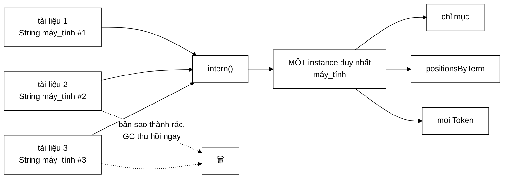

# TermDictionary — 7 triệu chuỗi cấp phát cho 136.768 giá trị phân biệt

**File nguồn:** `search-engine/src/main/java/com/vnsearch/index/TermDictionary.java` (100 dòng)
**Gói:** `com.vnsearch.index` · **Loại:** lớp `final`, có trạng thái (một `HashMap`), **không** thread-safe — Flyweight pattern
**Vị trí trong luồng:** dùng bên trong [`InvertedIndex.addDocument`](./InvertedIndex.md) — giai đoạn **xây** chỉ mục, không dùng lúc truy vấn
**Đọc kèm:** [`InvertedIndex.md`](./InvertedIndex.md) · [`VietnameseTokenizer.md`](./VietnameseTokenizer.md) · [`Posting.md`](./Posting.md)

---

## 📌 Hiểu trong 30 giây

Tokenizer tạo một **đối tượng `String` mới** mỗi lần gặp một term — kể cả khi
term đó đã gặp hàng nghìn lần. Lớp này giữ một kho ánh xạ nội dung chuỗi sang
**một thể hiện chuẩn tắc duy nhất**, để bộ nhớ chuỗi giảm từ *"số lần xuất
hiện"* xuống *"số term phân biệt"*.



```
   SỐ ĐO — Javadoc dòng 9–17

   Chỉ mục có 136.768 term PHÂN BIỆT
   Corpus 5.011 tài liệu × ~1.400 tiếng
        ⇒ ~7 TRIỆU object String được cấp phát

   Mỗi String tốn:  16 (header) + 8 (ref) + 4 (hash) + 16 + L
                    ≈ 44 + L byte

   7.000.000 × ~52 byte  ≈  364 MB   ← nếu giữ hết
     136.768 × ~52 byte  ≈    7 MB   ← nếu chỉ giữ bản phân biệt
```

---

## 1. Vấn đề: tokenizer buộc phải tạo chuỗi mới

Nguồn gốc nằm ở [`VietnameseTokenizer`](./VietnameseTokenizer.md), khi ghép các
tiếng thành một từ ghép:

```java
term = String.join("_", Arrays.copyOfRange(syllables, i, i + matchedLen));
```

```
   String.join LUÔN tạo một String MỚI. Nó KHÔNG THỂ biết rằng
   chuỗi "máy_tính" vừa dựng ra đã tồn tại ở đâu đó trong bộ nhớ.

   Mỗi lần gặp "máy_tính" trong bất kỳ tài liệu nào:
        → một object String mới, nội dung y hệt
        → một mảng byte[] mới bên trong nó

   Đây KHÔNG phải lỗi của tokenizer. Đó là hệ quả tất yếu của việc
   ghép chuỗi. Vấn đề chỉ xuất hiện khi các chuỗi đó được GIỮ LẠI
   trong chỉ mục — và chúng đúng là được giữ lại.
```

Chỗ giữ lại là ba nơi khác nhau, mỗi nơi giữ một tham chiếu tới cùng nội dung:

```
   ① Khoá của bảng chỉ mục ngược:     Map<String, List<Posting>>
   ② Khoá của positionsByTerm:        Map<String, …>
   ③ Trường term của mỗi Token

   Không có kho dùng chung: ba tham chiếu → BA object khác nhau
   Có kho dùng chung:       ba tham chiếu → MỘT object
```

---

## 2. Bản đồ lớp

```
TermDictionary  (final, Flyweight)
├── pool : Map<String,String> (final)  ── nội dung → thể hiện chuẩn tắc
├── TermDictionary()                   ── dung lượng 1<<18 = 262.144
├── TermDictionary(int expectedTerms)
├── intern(String) : String       O(L) ── trái tim của lớp
├── size()         : int               ── số term phân biệt
├── estimatedBytes(): long             ── ước lượng cho báo cáo
├── clear()                            ── giải phóng chủ động
└── main(String[])                     ── demo minh hoạ
```

### 2.1 `intern` — một lần băm, không phải hai

```java
public String intern(String term) {
    if (term == null) {
        return null;
    }
    String existing = pool.putIfAbsent(term, term);
    return existing != null ? existing : term;
}
```

Chi tiết quan trọng nằm ở `putIfAbsent`, được Javadoc dòng 57–60 giải thích:

```
   ── Cách viết ngây thơ ──────────────────────────────────
   if (pool.containsKey(term)) {      // BĂM lần 1 + duyệt bucket
       return pool.get(term);         // BĂM lần 2 + duyệt bucket
   }
   pool.put(term, term);              // BĂM lần 3
   return term;

   → 2–3 lần băm mỗi lời gọi

   ── putIfAbsent ─────────────────────────────────────────
   MỘT lần băm, MỘT lần duyệt bucket, chèn nếu chưa có

   Với 7 triệu lời gọi:
        băm một chuỗi ~8 ký tự  ≈  15 ns
        tiết kiệm 2 lần băm     ⇒  7.000.000 × 30 ns ≈ 0,21 giây
```

Ngữ nghĩa của `putIfAbsent`: trả về giá trị **cũ** nếu khoá đã tồn tại, trả
`null` nếu vừa chèn mới. Nên dòng cuối đọc là *"có bản cũ thì dùng bản cũ, không
thì bản vừa chèn chính là bản chuẩn tắc"*.

```
   ĐIỂM TINH TẾ: pool.put(term, term) — KHOÁ VÀ GIÁ TRỊ LÀ CÙNG MỘT OBJECT

   Bảng băm chỉ giữ MỘT tham chiếu tới chuỗi, không phải hai.
   Chi phí thêm cho mỗi mục: 32 byte (Node của HashMap) + 4 byte
   cho ô bảng — không phải 52 byte của một chuỗi thứ hai.
```

### 2.2 Vì sao không dùng `String.intern()` có sẵn của JDK

Javadoc dòng 28–32 nêu ba lý do, và cả ba đều đúng:

| Vấn đề của `String.intern()` | Kho tự quản |
|---|---|
| Dùng **bảng chuỗi nội bộ của JVM** — vùng nhớ có kích thước cấu hình cứng (`-XX:StringTableSize`) | Là một `HashMap` bình thường, tự co giãn |
| **Không giải phóng được** cho tới khi lớp bị gỡ | `clear()` giải phóng ngay |
| **Không đo được** — không có API hỏi "bảng đang giữ bao nhiêu" | `size()` và `estimatedBytes()` |

```
   HẬU QUẢ THỰC TẾ CỦA VIỆC DÙNG String.intern()

   Bảng chuỗi mặc định của JVM có ~60.013 bucket.
   Nhét 136.768 term vào ⇒ hệ số tải > 2
        → chuỗi bucket dài ra, mỗi lần intern chậm dần
        → và bảng này KHÔNG tự rehash trong nhiều phiên bản JVM

   Tệ hơn: xây chỉ mục lần hai (ví dụ crawl thêm rồi index lại)
   sẽ nhét thêm 136.768 term nữa vào cùng bảng đó — bản cũ KHÔNG
   được thu hồi vì bảng chuỗi giữ tham chiếu mạnh.
        → rò rỉ bộ nhớ tăng dần qua mỗi lần build
```

Điểm cuối là lý do quyết định trong một hệ thống có **xây lại chỉ mục định kỳ**
— đúng kiến trúc của dự án này (xem [`IndexBuilder`](../service/IndexBuilder.md)).

### 2.3 Dung lượng ban đầu `1 << 18` — tránh rehash

```java
public TermDictionary() {
    this(1 << 18); // 262.144 — đủ cho 136.768 term mà không phải rehash
}
```

```
   HashMap rehash khi  size > capacity × loadFactor (0,75)

   Với capacity mặc định 16:
        16 → 32 → 64 → … → 262.144
        = 15 LẦN rehash trên đường tới 136.768 term

   Mỗi lần rehash: cấp phát bảng mới + băm lại MỌI mục hiện có
        Lần cuối cùng: băm lại ~98.000 mục

   Tổng chi phí rehash ≈ 2 × số mục = ~270.000 phép băm thừa

   Với capacity 262.144:
        262.144 × 0,75 = 196.608 > 136.768  ⇒  KHÔNG rehash lần nào
```

Chọn luỹ thừa 2 là bắt buộc: `HashMap` làm tròn dung lượng lên luỹ thừa 2 gần
nhất, nên viết `1 << 18` thay vì `250000` khiến ý định rõ ràng và tránh nhầm lẫn
về dung lượng thật.

Giá phải trả: bảng chiếm `262.144 × 4 byte = 1 MB` ngay từ đầu, kể cả khi chỉ
mục nhỏ. Đó là lý do có hàm dựng nhận `expectedTerms` cho các trường hợp khác.

### 2.4 `estimatedBytes` — ước lượng, và nó ước lượng cái gì

```java
public long estimatedBytes() {
    long total = 0;
    for (String term : pool.keySet()) {
        total += 44L + term.length() * 2L; // header + hash + byte[] + nội dung
    }
    return total;
}
```

```
   ⚠️ CON SỐ NÀY ĐO KÍCH THƯỚC CỦA KHO, KHÔNG PHẢI PHẦN TIẾT KIỆM ĐƯỢC.

   Javadoc ghi "Ước lượng bộ nhớ tiết kiệm được so với việc giữ riêng
   mỗi lần xuất hiện" — nhưng công thức chỉ cộng kích thước các term
   ĐANG GIỮ.

   Phần tiết kiệm thật = (số lần xuất hiện − số term phân biệt) × ~52 byte
                       = (7.000.000 − 136.768) × 52
                       ≈ 357 MB

   Còn estimatedBytes() trả về ≈ 136.768 × 52 ≈ 7 MB.

   Hai con số khác nhau 51 lần. Xem đề xuất 1 ở mục 6.
```

Ngoài ra `term.length() * 2` giả định mỗi ký tự 2 byte (UTF-16). Từ Java 9,
**compact strings** lưu chuỗi thuần Latin-1 bằng 1 byte/ký tự — nhưng term
tiếng Việt có dấu (`á`, `ệ`, `ữ`) **không** thuộc Latin-1, nên chúng thật sự
dùng 2 byte. Với dự án này, giả định đúng; với một chỉ mục tiếng Anh thì ước
lượng cao gấp đôi.

### 2.5 Không thread-safe — và vì sao an toàn

Javadoc dòng 37–39:

> *"`InvertedIndex` chỉ dùng nó trong `addDocument`, mà việc dựng chỉ mục luôn
> đơn luồng (dựng xong một chỉ mục mới hoàn chỉnh rồi gán bằng tham chiếu
> `volatile`)."*

```
   MẪU "XÂY XONG RỒI HOÁN ĐỔI"  (copy-on-write ở mức toàn chỉ mục)

   luồng xây:   chỉ mục MỚI ←── addDocument ×N ←── TermDictionary
                     │                              (đơn luồng, không khoá)
                     ↓
                 gán volatile
                     │
   luồng truy vấn:   ↓
                 chỉ mục CŨ  →  chỉ mục MỚI      (đọc, không khoá)

   ⇒ TermDictionary KHÔNG BAO GIỜ bị chạm bởi luồng truy vấn.
   ⇒ Thêm ConcurrentHashMap chỉ tốn chi phí mà không mua được gì.
```

Đây là lập luận đúng, và nó minh hoạ một nguyên tắc: **an toàn đa luồng không
phải là thuộc tính của một lớp, mà là thuộc tính của cách lớp đó được dùng.**
Điều kiện là cách dùng phải được ghi rõ — và ở đây nó được ghi.

---

## 3. Hướng dẫn thực hành

### 3.1 Chạy demo có sẵn

```java
public static void main(String[] args) {
    TermDictionary dictionary = new TermDictionary();
    String a = dictionary.intern(new String("máy_tính"));
    String b = dictionary.intern(new String("máy_tính"));
    String c = dictionary.intern(new String("công_nghệ"));
    System.out.println("a == b (cùng instance)? " + (a == b));
    System.out.println("a == c ? " + (a == c));
    System.out.println("Số term phân biệt: " + dictionary.size());
}
```

```powershell
cd search-engine
.\mvnw.cmd -q compile
java -cp target/classes com.vnsearch.index.TermDictionary
```

```
a == b (cùng instance)? true
a == c ? false
Số term phân biệt: 2
```

```
   VÌ SAO PHẢI VIẾT new String("máy_tính") TRONG DEMO?

   Chuỗi hằng "máy_tính" viết thẳng trong mã đã được trình biên dịch
   gộp vào bảng chuỗi của JVM — hai lần viết cùng một hằng số cho
   CÙNG một object sẵn rồi.

   ⇒ Nếu không có new String(...), demo sẽ in "true" mà KHÔNG chứng
     minh được gì: đó là công của trình biên dịch, không phải của
     TermDictionary.

   new String(...) ép tạo object mới, mô phỏng đúng thứ String.join
   làm trong tokenizer thật.
```

Đây là chi tiết dễ bỏ qua nhưng làm demo trở nên **có giá trị chứng minh** thay
vì chỉ trang trí.

### 3.2 Dùng đúng trong một cài đặt chỉ mục mới

```java
public void addDocument(WebDocument doc) {
    int docId = nextDocId++;
    List<Token> tokens = tokenizer.tokenize(doc.bodyText());

    Map<String, List<Integer>> viTriTheoTerm = new HashMap<>();
    for (int i = 0; i < tokens.size(); i++) {
        String term = dictionary.intern(tokens.get(i).term());   // ← NỘI TRÚ NGAY
        viTriTheoTerm.computeIfAbsent(term, k -> new ArrayList<>()).add(i);
    }

    for (var e : viTriTheoTerm.entrySet()) {
        // e.getKey() đã là thể hiện chuẩn tắc — dùng lại làm khoá chỉ mục
        index.computeIfAbsent(e.getKey(), k -> new ArrayList<>())
             .add(new Posting(docId, e.getValue().size(), toIntArray(e.getValue())));
    }
}
```

```
   NGUYÊN TẮC: intern NGAY KHI NHẬN, MỘT LẦN DUY NHẤT

   ✓ Nội trú tại điểm chuỗi vào hệ thống
     ⇒ mọi cấu trúc phía sau tự động dùng chung thể hiện

   ✗ Nội trú ở nhiều nơi khác nhau
     ⇒ vẫn đúng (intern lũy đẳng) nhưng tốn thêm lần băm

   ✗ Quên nội trú ở MỘT nơi
     ⇒ nơi đó giữ bản sao riêng — rò rỉ âm thầm, không lỗi nào báo
```

### 3.3 Gọi `clear()` khi nào

```java
// Sau khi build xong chỉ mục và không còn addDocument nữa:
dictionary.clear();
```

```
   Kho chỉ cần thiết trong lúc XÂY. Xây xong, các chuỗi chuẩn tắc
   đã được chỉ mục giữ tham chiếu, nên bảng băm của kho chỉ còn là
   phí thuần: 136.768 × (32 byte Node + 4 byte ô bảng) ≈ 5 MB.

   clear() trả lại 5 MB đó mà không ảnh hưởng gì tới chỉ mục.

   ⚠️ Nhưng nếu chỉ mục hỗ trợ thêm tài liệu SAU khi build (index
   tăng dần), thì KHÔNG được clear — term của tài liệu mới sẽ không
   gộp được với term cũ nữa.
```

### 3.4 Cạm bẫy

| Cạm bẫy | Hậu quả | Cách đúng |
|---|---|---|
| Quên `intern` ở một nơi giữ term | Nơi đó giữ bản sao riêng — rò rỉ âm thầm, không có lỗi | Nội trú ngay tại điểm nhận |
| Dùng `String.intern()` của JDK | Vùng nhớ cố định, không giải phóng, rò rỉ qua mỗi lần build lại | Dùng kho tự quản |
| Dùng từ nhiều luồng | `HashMap` không thread-safe ⇒ vòng lặp vô hạn khi rehash đồng thời (lỗi kinh điển) | Giữ đơn luồng, hoặc `ConcurrentHashMap` nếu đổi kiến trúc |
| So term bằng `==` sau khi nội trú | "Hoạt động" nhưng phụ thuộc vào việc **mọi** chuỗi đều đã nội trú — một chỗ sót là sai lặng lẽ | Luôn dùng `equals` |
| `clear()` khi vẫn còn thêm tài liệu | Term mới không gộp được với term cũ ⇒ chỉ mục có hai khoá cùng nội dung | Chỉ `clear()` sau khi build xong hẳn |
| Giữ kho sống mãi cho chỉ mục tĩnh | Phí 5 MB bảng băm không cần thiết | `clear()` sau build |
| Bỏ dung lượng ban đầu `1 << 18` | 15 lần rehash, ~270.000 phép băm thừa | Giữ |

---

## 4. Độ phức tạp & chi phí

| Thao tác | Chi phí |
|---|---|
| `intern(term)` | $O(L)$ — băm chuỗi độ dài $L$, ~15 ns với $L \approx 8$ |
| `size()` | $O(1)$ |
| `estimatedBytes()` | $O(\text{số term})$ — duyệt toàn bộ khoá; **không** gọi trong vòng lặp |
| `clear()` | $O(\text{số term})$ |
| Bộ nhớ | $O(\text{tổng ký tự các term phân biệt})$ + bảng băm |

```
   NGÂN SÁCH BUILD CHỈ MỤC

   7.000.000 lời gọi intern × 15 ns  =  0,105 giây

   So với thời gian build chỉ mục toàn phần (đọc đĩa, tách từ,
   dựng posting): vài chục giây.
   ⇒ intern chiếm < 0,5%, đổi lấy ~357 MB.

   Đây là loại đánh đổi không cần cân nhắc.
```

**Bộ nhớ của chính kho:**

```
   Bảng băm 262.144 ô × 4 byte           =  1,0 MB
   136.768 Node × 32 byte                =  4,4 MB
   ──────────────────────────────────────────────
   PHÍ của kho                           =  5,4 MB

   Các chuỗi (136.768 × ~52 byte)        =  7,1 MB
   (nhưng chúng cần tồn tại dù có kho hay không)

   ⇒ Trả 5,4 MB để tiết kiệm ~357 MB.  Tỉ lệ 66:1.
```

---

## 5. Kiểm thử liên quan

| Test | Bảo vệ điều gì |
|---|---|
| `test/java/com/vnsearch/index/InvertedIndexTest.java` (82 dòng) | Gián tiếp — chỉ mục xây đúng khi có nội trú |

Lớp này **không có test riêng**, và tính chất cốt lõi của nó — *"hai lần gọi
với cùng nội dung trả về cùng một object"* — hiện không được canh giữ ở đâu cả:

```java
class TermDictionaryTest {

    @Test
    void cungNoiDungThiCungInstance() {                 // LÝ DO TỒN TẠI của lớp
        TermDictionary d = new TermDictionary();
        String a = d.intern(new String("máy_tính"));
        String b = d.intern(new String("máy_tính"));
        assertSame(a, b, "intern phải trả về CÙNG MỘT object");
    }

    @Test
    void noiDungKhacThiInstanceKhac() {
        TermDictionary d = new TermDictionary();
        assertNotSame(d.intern("máy_tính"), d.intern("công_nghệ"));
    }

    @Test
    void luyDang() {                                    // intern(intern(x)) == intern(x)
        TermDictionary d = new TermDictionary();
        String a = d.intern(new String("máy_tính"));
        assertSame(a, d.intern(a));
        assertEquals(1, d.size());
    }

    @Test
    void nullTraVeNull() {
        assertNull(new TermDictionary().intern(null));
        assertEquals(0, new TermDictionary().size());
    }

    @Test
    void sizeDemSoTermPhanBiet() {
        TermDictionary d = new TermDictionary();
        d.intern(new String("a")); d.intern(new String("a"));
        d.intern(new String("b"));
        assertEquals(2, d.size());
    }

    @Test
    void clearGiaiPhongKho() {
        TermDictionary d = new TermDictionary();
        d.intern("a");
        d.clear();
        assertEquals(0, d.size());
        // Sau clear, chuỗi mới trở thành thể hiện chuẩn tắc mới
        String sauClear = d.intern(new String("a"));
        assertEquals(1, d.size());
        assertEquals("a", sauClear);
    }

    @Test
    void giuDauTiengVietChinhXac() {                    // không chuẩn hoá Unicode ngầm
        TermDictionary d = new TermDictionary();
        assertEquals("máy_tính", d.intern(new String("máy_tính")));
        assertNotSame(d.intern("hoà"), d.intern("hòa")); // hai cách đặt dấu KHÁC nhau
        assertEquals(2, d.size());
    }
}
```

Ca cuối đáng chú ý: `hoà` và `hòa` là hai chuỗi Unicode **khác nhau** (khác vị
trí đặt dấu thanh), và kho này coi chúng là hai term riêng. Đó là hành vi hiện
tại — đúng hay sai tuỳ vào việc [`VietnameseTokenizer`](./VietnameseTokenizer.md)
có chuẩn hoá Unicode trước hay không. Test này khoá lại hành vi để mọi thay đổi
về sau đều là quyết định có ý thức.

```powershell
cd search-engine
.\mvnw.cmd -q -Dtest='InvertedIndexTest' test
```

---

## 6. Chấm theo chuẩn doanh nghiệp

| Tiêu chí | Điểm | Nhận xét |
|---|---|---|
| Chất lượng quyết định thiết kế | 10/10 | Flyweight đặt đúng chỗ; trả 5,4 MB lấy ~357 MB, tỉ lệ 66:1 |
| Lập luận từ chối giải pháp có sẵn | 10/10 | Ba lý do không dùng `String.intern()` đều đúng và cụ thể, kể cả lý do khó thấy nhất (rò rỉ qua mỗi lần build lại) |
| Chi tiết cài đặt | 10/10 | `putIfAbsent` một lần băm; `put(term, term)` không giữ hai tham chiếu; dung lượng `1<<18` tránh 15 lần rehash |
| Chất lượng demo | 10/10 | `new String(...)` khiến demo **chứng minh** được điều nó tuyên bố thay vì chỉ minh hoạ |
| Tài liệu hoá | 9/10 | Javadoc có số đo thật và giải thích rõ; lập luận đơn luồng được ghi kèm điều kiện |
| Vòng đời tài nguyên | 8/10 | `clear()` có sẵn, nhưng không có nơi nào trong dự án gọi nó — 5,4 MB nằm lại sau build |
| **Độ chính xác của `estimatedBytes`** | **4/10** | Javadoc nói "tiết kiệm được" nhưng công thức tính "đang giữ" — lệch 51 lần |
| Khả năng kiểm thử | 4/10 | Không có test riêng; tính chất `assertSame` — lý do tồn tại của lớp — không được canh giữ |

**Ba đề xuất nâng lên mức sản phẩm:**

1. **Sửa `estimatedBytes` cho khớp với Javadoc, hoặc sửa Javadoc cho khớp với
   mã.** Con số này có khả năng đi thẳng vào báo cáo, và hiện nó lệch 51 lần so
   với điều nó tuyên bố. Cách đúng là đếm cả số lần nội trú:
   ```java
   private long soLanGoiIntern;      // tăng trong intern()

   /** Kích thước các term đang giữ. */
   public long estimatedBytes() { … }               // giữ nguyên, đổi Javadoc

   /** Bộ nhớ tiết kiệm được so với việc giữ riêng mỗi lần xuất hiện. */
   public long estimatedSavedBytes() {
       long trungBinh = pool.isEmpty() ? 0 : estimatedBytes() / pool.size();
       return (soLanGoiIntern - pool.size()) * trungBinh;
   }
   ```
2. **Thêm `TermDictionaryTest.java`** (mục 5). Tính chất `assertSame` là **toàn
   bộ lý do** lớp này tồn tại, và nó hiện không có test nào. Một refactor đổi
   `putIfAbsent` thành `put` (trông vô hại) sẽ phá tính chất đó mà không test
   nào đỏ — hậu quả là 357 MB quay lại mà không ai biết.
3. **Gọi `clear()` sau khi build xong chỉ mục.** Phương thức đã có nhưng không
   nơi nào trong dự án gọi, nên 5,4 MB bảng băm nằm lại suốt vòng đời tiến
   trình. Nơi đúng để gọi là cuối [`IndexBuilder`](../service/IndexBuilder.md),
   **với điều kiện** chỉ mục không hỗ trợ thêm tài liệu sau đó — nếu có, phải
   ghi rõ vào Javadoc rằng kho cố ý sống lâu.

---

## 7. Liên kết

- Nơi kho được dùng: [`InvertedIndex.md`](./InvertedIndex.md)
- Nguồn của 7 triệu chuỗi: [`VietnameseTokenizer.md`](./VietnameseTokenizer.md) — `String.join` khi ghép từ
- Hợp đồng của tokenizer: [`Tokenizer.md`](./Tokenizer.md)
- Nơi nên gọi `clear()`: [`../service/IndexBuilder.md`](../service/IndexBuilder.md)
- Kỹ thuật tiết kiệm bộ nhớ tương tự ở tầng khác: [`Posting.md`](./Posting.md) (`int[]` thay `List<Integer>`) · [`CompressedText.md`](./CompressedText.md)
- Số liệu bộ nhớ toàn chỉ mục: [`../eval/MemoryBreakdown.md`](../eval/MemoryBreakdown.md)
