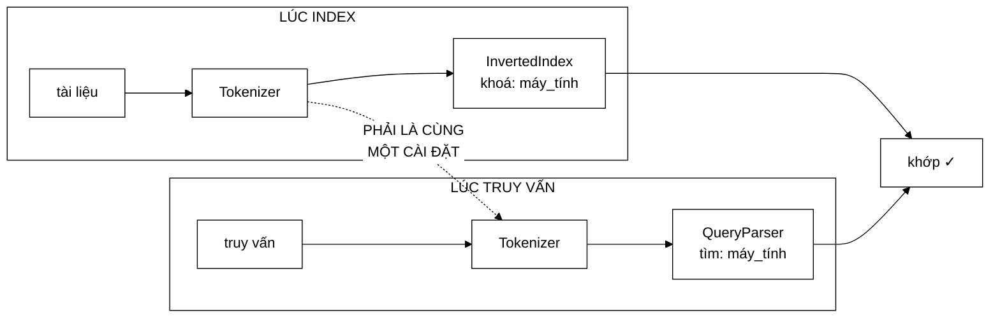

# Tokenizer — trần chất lượng của cả hệ thống, và bất đối xứng đã được sửa

**File nguồn:** `search-engine/src/main/java/com/vnsearch/index/Tokenizer.java` (38 dòng)
**Gói:** `com.vnsearch.index` · **Loại:** giao diện (2 phương thức) — Strategy pattern
**Cài đặt hiện có:** [`VietnameseTokenizer`](./VietnameseTokenizer.md)
**Người dùng:** [`InvertedIndex`](./InvertedIndex.md) (lúc index) · [`QueryParser`](../query/QueryParser.md) (lúc truy vấn)
**Đọc kèm:** [`VietnameseTokenizer.md`](./VietnameseTokenizer.md) · [`VietnameseWordDictionary.md`](./VietnameseWordDictionary.md) · [`MaxWeightSegmenter.md`](./MaxWeightSegmenter.md)

---

## 📌 Hiểu trong 30 giây

Hai phương thức, nhưng lý do tồn tại nằm trong một quan sát về **tính đối xứng
của việc đo đạc**:

```
   TRƯỚC KHI CÓ GIAO DIỆN NÀY

   RelevanceScorer là GIAO DIỆN
        ⇒ chạy được thí nghiệm ablation: "TF-IDF hay BM25 tốt hơn?"
        ⇒ đổi ĐÚNG MỘT biến số, đo, kết luận

   VietnameseTokenizer là LỚP CỤ THỂ
        ⇒ KHÔNG chạy được: "tokenizer nào tốt hơn?"

   Mà tokenizer mới là TRẦN CHẤT LƯỢNG của cả hệ thống:
   chất lượng tách từ chặn trên mọi thứ ở tầng trên nó.

   ⇒ Câu hỏi ÍT quan trọng hơn thì đo được,
     câu hỏi QUAN TRỌNG HƠN thì không.
     Giao diện này xoá bỏ sự bất đối xứng đó.
```



---

## 1. Bất biến song hành — điều nguy hiểm nhất trong file

Javadoc dòng 18–24 in đậm:

> *"**Bất biến song hành, bắt buộc phải giữ:** chỉ mục và truy vấn **PHẢI** dùng
> **CÙNG** một cài đặt tokenizer (cùng thuật toán **VÀ** cùng từ điển)."*

```
   NẾU VI PHẠM

   Lúc index:    "máy tính" → token  máy_tính        (từ điển có mục này)
   Lúc truy vấn: "máy tính" → token  máy  +  tính    (từ điển thiếu mục)

   Chỉ mục có khoá "máy_tính"
   Truy vấn tìm khoá "máy" và "tính"
        → KHÔNG BAO GIỜ KHỚP

   Không có ngoại lệ nào được ném.
   Không có cảnh báo nào trong log.
   Chỉ là: kết quả rỗng, một cách khó hiểu.
```

Đây là loại lỗi tệ nhất có thể có trong một máy tìm kiếm: **hệ thống chạy hoàn
hảo, chỉ là không tìm thấy gì.** Nó không lộ ra trong test đơn vị (test tự dựng
cả hai phía bằng cùng một đối tượng), chỉ lộ ra khi ai đó đổi từ điển ở một nơi.

### 1.1 Cách dự án chống lỗi này: tiêm phụ thuộc

```java
// InvertedIndex và QueryParser đều NHẬN tokenizer qua constructor
public InvertedIndex(Tokenizer tokenizer) { … }
public QueryParser(Tokenizer tokenizer)   { … }
```

```
   ── Nếu mỗi lớp TỰ TẠO tokenizer ────────────────────────
   new VietnameseTokenizer()   ở InvertedIndex
   new VietnameseTokenizer()   ở QueryParser
        → hai object khác nhau
        → nếu từ điển nạp từ tệp, hai bản có thể KHÁC NHAU
          (tệp bị sửa giữa hai lần khởi tạo, đường dẫn khác…)
        → và không có gì trong mã nói rằng chúng phải giống nhau

   ── Tiêm qua constructor (hiện tại) ──────────────────────
   Tokenizer t = new VietnameseTokenizer();
   new InvertedIndex(t);
   new QueryParser(t);
        → CÙNG MỘT object
        → không thể lệch nhau
```

Đây là lý do **thật** của tiêm phụ thuộc ở đây — không phải "để test dễ hơn"
(dù đó cũng là lợi ích), mà là **để một bất biến không thể bị vi phạm**.

> ⚠️ Nhưng nó chỉ là **quy ước**: không có gì ngăn ai đó viết
> `new QueryParser(new VietnameseTokenizer(tuDienKhac))`. Xem đề xuất 1 ở mục 6.

---

## 2. Bản đồ giao diện

```
Tokenizer
├── tokenize(String) : List<VietnameseTokenizer.Token>
└── name()           : String     ── nhãn trong bảng kết quả đánh giá
```

### 2.1 `tokenize` — ba việc trong một lời gọi

Javadoc dòng 28–30: *"Tách một đoạn văn bản thành danh sách token **đã chuẩn
hoá, đã ghép từ ghép và đã lọc từ dừng**."*

```
   BA GIAI ĐOẠN GỘP SAU MỘT LỜI GỌI

   ① CHUẨN HOÁ    hạ chữ thường, bỏ dấu câu, chuẩn hoá Unicode
   ② GHÉP TỪ      "máy" + "tính" → "máy_tính"   (cần TỪ ĐIỂN)
   ③ LỌC TỪ DỪNG  bỏ "của", "và", "là", …

   ⇒ Người gọi KHÔNG cần biết ba giai đoạn này tồn tại.
   ⇒ Nhưng cũng KHÔNG THỂ chỉ dùng một giai đoạn.
```

Đánh đổi này đúng cho mục đích hiện tại: cả `InvertedIndex` lẫn `QueryParser`
đều cần đủ ba giai đoạn, và gộp chúng bảo đảm hai phía **không thể** làm khác
nhau. Nhưng nó khoá lại khả năng chạy thí nghiệm nhỏ hơn ("bỏ lọc từ dừng thì
chất lượng đổi thế nào?") mà không viết cả một cài đặt mới.

`null` hoặc chuỗi rỗng trả về danh sách rỗng — khử `null` tại cửa vào, cùng
triết lý với [`Posting`](./Posting.md) và [`ArrayPostingCursor`](./ArrayPostingCursor.md).

### 2.2 Điểm gợn: phụ thuộc ngược vào lớp cụ thể

```java
List<VietnameseTokenizer.Token> tokenize(String text);
//   └──────────┬──────────┘
//   Giao diện TRỪU TƯỢNG trả về kiểu lồng trong một
//   CÀI ĐẶT CỤ THỂ của chính nó
```

```
   HẬU QUẢ

   Một cài đặt EnglishTokenizer sẽ phải viết:
        List<VietnameseTokenizer.Token> tokenize(String text)

   Nó phải import lớp "Vietnamese" dù không liên quan gì tới
   tiếng Việt. Về mặt biên dịch thì chạy; về mặt thiết kế thì
   trừu tượng hoá bị rò rỉ.

   Đây là dấu vết của lịch sử: Token vốn là lớp lồng trong
   VietnameseTokenizer TRƯỚC KHI giao diện được tách ra, và
   việc nâng nó lên thành lớp độc lập chưa được làm.
```

Sửa rất rẻ và không phá vỡ gì (xem đề xuất 2 ở mục 6), nhưng cần đụng vào mọi
nơi dùng `Token`.

### 2.3 `name()` — vì sao một giao diện xử lý văn bản lại cần tên

```java
/** Tên ngắn gọn của cài đặt, dùng làm nhãn trong bảng kết quả đánh giá. */
String name();
```

Đây không phải phương thức trang trí. Nó là **thành phần của cơ chế đo đạc** mà
cả giao diện sinh ra để phục vụ:

```
   BẢNG KẾT QUẢ ABLATION MÀ BÁO CÁO CẦN

   ┌─────────────────────┬────────┬────────┬────────┐
   │ Tokenizer           │ P@10   │ MAP    │ nDCG   │
   ├─────────────────────┼────────┼────────┼────────┤
   │ vietnamese-49644    │ 0,62   │ 0,48   │ 0,71   │   ← name() điền vào đây
   │ vietnamese-bigrams  │ 0,54   │ 0,41   │ 0,66   │
   │ whitespace-baseline │ 0,41   │ 0,29   │ 0,53   │
   └─────────────────────┴────────┴────────┴────────┘

   Không có name():
        EvaluationRunner phải dùng getClass().getSimpleName()
        → "VietnameseTokenizer" cho CẢ HAI dòng đầu
        → hai cấu hình từ điển khác nhau nhưng CÙNG một nhãn
        → bảng vô nghĩa
```

Chính vì vậy `name()` phải phản ánh **cấu hình**, không chỉ tên lớp. Xem
[`EvaluationRunner`](../eval/EvaluationRunner.md) về nơi nhãn này được dùng.

---

## 3. Vì sao tokenizer là "trần chất lượng"

Javadoc dòng 11–13 nói thẳng: *"thực tế nó là **trần chất lượng** của cả hệ
thống."*

> ⚠️ **Số liệu trong Javadoc đã lỗi thời.** Câu trên còn viết tiếp *"vì từ điển
> từ ghép hiện chỉ có 154 mục"* — con số đó đúng ở thời điểm giao diện được
> tách ra, khi từ điển duy nhất là `vietnamese-bigrams.txt`. Hiện dự án đã nạp
> thêm `vietnamese-words.txt` với **49.644 mục có trọng số** (xem
> [`VietnameseWordDictionary`](./VietnameseWordDictionary.md)), gấp hơn 300 lần.
> Kết luận "tokenizer là trần chất lượng" vẫn đúng; chỉ con số minh hoạ là sai.

```
   TIẾNG VIỆT VIẾT RỜI THEO TIẾNG (ÂM TIẾT), KHÔNG THEO TỪ

   "máy tính lượng tử"  =  4 tiếng,  2 TỪ

   ── Từ điển CÓ "máy_tính" và "lượng_tử" ─────────────────
   token: [máy_tính, lượng_tử]
   Tìm "máy tính" → khớp chính xác tài liệu về máy tính

   ── Từ điển THIẾU ───────────────────────────────────────
   token: [máy, tính, lượng, tử]
   Tìm "máy tính" → khớp mọi tài liệu có chữ "máy" HOẶC "tính"
        → "máy giặt", "tính cách", "máy bay", "tính toán"
        → độ chính xác sụp đổ
```

```
   VÌ SAO TRẦN NÀY CHẶN MỌI THỨ PHÍA TRÊN

   BM25 tinh vi tới đâu cũng chỉ xếp hạng những gì được ĐƯA CHO NÓ.
   Nếu tầng tách từ đã trả về tập ứng viên sai, không thuật toán
   xếp hạng nào cứu được.

        chất lượng cuối  ≤  chất lượng tách từ

   ⇒ Cải thiện scorer khi tầng tách từ còn yếu là tối ưu sai chỗ.
   ⇒ Và trước khi có giao diện này, ta thậm chí không ĐO ĐƯỢC
     điều đó — đó mới là vấn đề thật.
```

Từ điển hiện tại có 49.644 mục có trọng số cộng 154 mục thủ công theo miền —
đủ lớn để tách đúng phần lớn từ ghép thông dụng. Xem
[`VietnameseWordDictionary`](./VietnameseWordDictionary.md) về công thức trọng
số và vì sao "có trọng số" quan trọng hơn "có nhiều mục".

---

## 4. Hướng dẫn thực hành

### 4.1 Viết một cài đặt đường cơ sở — mẫu đầy đủ

Để đo được "từ điển đóng góp bao nhiêu", cần một đường cơ sở **không** ghép từ:

```java
package com.vnsearch.index;

import java.util.ArrayList;
import java.util.List;
import java.util.Locale;

/**
 * Đường cơ sở: chỉ tách theo khoảng trắng, KHÔNG ghép từ ghép, KHÔNG lọc từ dừng.
 *
 * <p>Không dùng cho sản phẩm. Nó tồn tại để trả lời bằng số:
 * "việc ghép từ ghép đóng góp bao nhiêu vào chất lượng tìm kiếm?"
 */
public final class WhitespaceTokenizer implements Tokenizer {

    @Override
    public List<VietnameseTokenizer.Token> tokenize(String text) {
        if (text == null || text.isBlank()) {
            return List.of();
        }
        String[] phan = text.toLowerCase(Locale.ROOT)
                            .replaceAll("[^\\p{L}\\p{N}\\s]", " ")
                            .split("\\s+");
        List<VietnameseTokenizer.Token> ketQua = new ArrayList<>(phan.length);
        int viTri = 0;
        for (String p : phan) {
            if (!p.isBlank()) {
                ketQua.add(new VietnameseTokenizer.Token(p, viTri++));
            }
        }
        return ketQua;
    }

    @Override
    public String name() {
        return "whitespace-baseline";      // nhãn trong bảng kết quả
    }
}
```

Chú ý `Locale.ROOT` — cùng bẫy "Turkish i" đã gặp ở
[`UrlCanonicalizer`](../crawler/UrlCanonicalizer.md) và
[`JsonUserStore`](../auth/JsonUserStore.md).

### 4.2 Chạy thí nghiệm ablation

```java
List<Tokenizer> ungVien = List.of(
        new WhitespaceTokenizer(),
        new VietnameseTokenizer(),                       // từ điển đầy đủ
        new VietnameseTokenizer(tuDienMoRong));          // giả sử có hàm dựng nhận từ điển

for (Tokenizer t : ungVien) {
    // ① Xây chỉ mục MỚI với tokenizer này
    InvertedIndex index = new InvertedIndex(t);
    for (WebDocument doc : corpus) index.addDocument(doc);

    // ② Truy vấn phải dùng CHÍNH tokenizer đó — bất biến song hành
    QueryParser parser = new QueryParser(t);

    // ③ Đo
    EvaluationMetrics m = harness.danhGia(index, parser, boTruyVanChuan);
    System.out.printf("%-22s P@10=%.3f  MAP=%.3f  nDCG=%.3f%n",
            t.name(), m.precisionAt(10), m.map(), m.ndcg());
}
```

```
   BA ĐIỂM BẮT BUỘC

   ① Xây LẠI chỉ mục cho mỗi tokenizer
      Dùng lại chỉ mục cũ = so sánh vô nghĩa.

   ② Cùng một object tokenizer cho index VÀ query
      Vi phạm = kết quả rỗng, và ta sẽ tưởng tokenizer đó tệ.

   ③ Chỉ đổi MỘT biến số
      Giữ nguyên scorer, cùng bộ truy vấn chuẩn, cùng corpus.
```

Xem [`EvaluationHarness`](../eval/EvaluationHarness.md) và
[`SignificanceTest`](../eval/SignificanceTest.md) — chênh lệch đo được cần kiểm
định ý nghĩa thống kê trước khi kết luận.

### 4.3 Cạm bẫy khi cài đặt giao diện này

| Cạm bẫy | Hậu quả | Cách đúng |
|---|---|---|
| Index và truy vấn dùng hai thể hiện khác nhau | **Kết quả rỗng, im lặng** — lỗi tệ nhất của cả hệ thống | Một object, tiêm vào cả hai |
| `name()` trả `getClass().getSimpleName()` | Hai cấu hình khác nhau cùng một nhãn ⇒ bảng đánh giá vô nghĩa | Nhãn phản ánh **cấu hình** |
| Vị trí token không liên tục | Tìm cụm từ hỏng (xem [`Posting`](./Posting.md) mục 3.2) | Đánh số 0,1,2,… trên token **đã lọc** |
| Cài đặt có trạng thái | Index đơn luồng nhưng truy vấn **đa luồng** ⇒ đua | Giữ thuần, hoặc tự đồng bộ |
| Trả `null` khi text rỗng | `NullPointerException` ở nơi gọi | Trả `List.of()` |
| `toLowerCase()` không `Locale.ROOT` | Bẫy Turkish i | Luôn ghi rõ locale |
| Đổi từ điển của một tokenizer đang dùng | Chỉ mục cũ và truy vấn mới lệch nhau | Xây lại chỉ mục |
| Tokenize chậm | Chạy ~7 triệu lần lúc build **và** mỗi truy vấn | Xem mục 5 |

### 4.4 Vị trí token — chi tiết dễ sai nhất

```
   VĂN BẢN:  "công nghệ của máy tính"
             (giả sử "của" là từ dừng, "công_nghệ" và "máy_tính" trong từ điển)

   ✓ ĐÚNG — đánh số trên token ĐÃ LỌC, liên tục
        công_nghệ  vị trí 0
        máy_tính   vị trí 1
        → tìm cụm từ "công nghệ máy tính": 1 − 0 = 1  ⇒ LIỀN NHAU ✓

   ✗ SAI — giữ vị trí gốc theo tiếng
        công_nghệ  vị trí 0
        máy_tính   vị trí 3
        → 3 − 0 = 3  ⇒ hệ thống kết luận KHÔNG liền nhau ✗
```

Cả hai cách đều "hợp lý" nếu chỉ nhìn riêng tokenizer. Chỉ khi nhìn tới thuật
toán tìm cụm từ mới thấy chỉ có một cách đúng — và quy ước đó hiện **không được
ghi ở đâu** trong giao diện. Xem đề xuất 3 ở mục 6.

---

## 5. Độ phức tạp & chi phí

Giao diện không quy định, nhưng vị trí đặt ra ngân sách ở **hai** nơi rất khác
nhau:

```
   ── LÚC BUILD CHỈ MỤC (một lần) ──────────────────────────
   2.518 tài liệu × ~1.400 tiếng  ≈  3,5 triệu tiếng
   Ngân sách rộng: vài chục giây là chấp nhận được.

   ── LÚC TRUY VẤN (mỗi lời gọi) ───────────────────────────
   Truy vấn ~5 tiếng
   Ngân sách CHẶT: < 1 ms, vì nó nằm trên đường người dùng chờ

        Tổng ngân sách một truy vấn  ≈  1 ms  (xem SearchIndex.md)
        Tokenize chiếm bao nhiêu?    ⇒  phải rất nhỏ
```

| Cài đặt | Chi phí mỗi tiếng | Ghi chú |
|---|---|---|
| `WhitespaceTokenizer` (mục 4.1) | ~50 ns | `replaceAll` biên dịch regex mỗi lần — nên đưa `Pattern` thành `static final` |
| [`VietnameseTokenizer`](./VietnameseTokenizer.md) | ~200 ns | Tra [`SyllableTrie`](../datastructure/SyllableTrie.md) + ghép từ tham lam |
| Cài đặt gọi mô hình học máy | ~1 ms/câu | **Không chấp nhận được** ở đường truy vấn; chỉ dùng được lúc build |

```
   ⚠️ ĐÂY LÀ RÀNG BUỘC ẨN CỦA GIAO DIỆN

   Một cài đặt tokenizer chất lượng cao (dùng mô hình học máy) sẽ
   cải thiện chỉ mục rất nhiều nhưng KHÔNG dùng được ở phía truy vấn.

   Mà bất biến song hành BẮT BUỘC hai phía dùng cùng cài đặt.

   ⇒ Ràng buộc "phải nhanh ở phía truy vấn" thực chất giới hạn
     luôn chất lượng ở phía index.

   Đây là hệ quả kiến trúc chưa được ghi ở đâu, và nó đáng biết
   trước khi ai đó bỏ công viết một tokenizer nặng.
```

---

## 6. Kiểm thử liên quan

| Test | Bảo vệ điều gì |
|---|---|
| `test/java/com/vnsearch/index/VietnameseTokenizerTest.java` (105 dòng) | Cài đặt duy nhất |
| `test/java/com/vnsearch/index/MaxWeightSegmenterTest.java` (136 dòng) | Thuật toán tách từ bên trong |
| `test/java/com/vnsearch/index/InvertedIndexTest.java` (82 dòng) | Tích hợp phía index |
| `test/java/com/vnsearch/query/QueryParserTest.java` | Tích hợp phía truy vấn |

Không có test nào canh giữ **bất biến song hành** — điều nguy hiểm nhất của cả
giao diện. Đây là ca test nên có, và nó rất rẻ:

```java
@Test
void chiMucVaTruyVanKhopNhauKhiDungCungTokenizer() {
    Tokenizer t = new VietnameseTokenizer();
    InvertedIndex index = new InvertedIndex(t);
    index.addDocument(new WebDocument("https://a.vn/1", "Máy tính", "Bài viết về máy tính"));

    QueryParser parser = new QueryParser(t);
    var nut = parser.parse("máy tính");

    assertFalse(new CandidateResolver(index).resolve(nut).isEmpty(),
            "Cùng tokenizer thì truy vấn PHẢI khớp được tài liệu đã index");
}

@Test
void tokenizerKhacNhauThiKHONGKhop() {          // ghi lại hành vi nguy hiểm
    InvertedIndex index = new InvertedIndex(new VietnameseTokenizer());
    index.addDocument(new WebDocument("https://a.vn/1", "Máy tính", "Bài viết về máy tính"));

    QueryParser parserSai = new QueryParser(new WhitespaceTokenizer());
    var nut = parserSai.parse("máy tính");

    assertTrue(new CandidateResolver(index).resolve(nut).isEmpty(),
            "Đây là hành vi HỎNG mà bất biến song hành sinh ra để ngăn — "
          + "test này ghi lại nó để không ai ngạc nhiên khi gặp");
}
```

Ca thứ hai đáng giá theo một cách khác thường: nó **không** kiểm tra hành vi
đúng, mà **ghi lại hành vi hỏng** kèm lời giải thích. Khi một lập trình viên
tương lai gặp "kết quả rỗng không hiểu vì sao", họ sẽ tìm thấy ca test này.

Bộ test hợp đồng chung cho mọi cài đặt:

```java
abstract class TokenizerContractTest {

    abstract Tokenizer taoDoiTuong();

    @Test
    void nullVaRongTraDanhSachRong() {
        Tokenizer t = taoDoiTuong();
        assertTrue(t.tokenize(null).isEmpty());
        assertTrue(t.tokenize("").isEmpty());
        assertTrue(t.tokenize("   ").isEmpty());
    }

    @Test
    void viTriLienTucTuKhong() {                     // điều kiện của tìm cụm từ
        var tokens = taoDoiTuong().tokenize("công nghệ thông tin việt nam");
        for (int i = 0; i < tokens.size(); i++) {
            assertEquals(i, tokens.get(i).position(),
                    "Vị trí phải liên tục từ 0 trên token ĐÃ LỌC");
        }
    }

    @Test
    void hamThuan() {
        Tokenizer t = taoDoiTuong();
        var lanDau = t.tokenize("máy tính lượng tử");
        for (int i = 0; i < 50; i++) {
            assertEquals(lanDau, t.tokenize("máy tính lượng tử"));
        }
    }

    @Test
    void nameKhongRong() {
        assertNotNull(taoDoiTuong().name());
        assertFalse(taoDoiTuong().name().isBlank());
    }
}
```

```powershell
cd search-engine
.\mvnw.cmd -q -Dtest='VietnameseTokenizerTest' test
```

---

## 7. Chấm theo chuẩn doanh nghiệp

| Tiêu chí | Điểm | Nhận xét |
|---|---|---|
| Lý do trừu tượng hoá | 10/10 | Lập luận "bất đối xứng trong khả năng đo đạc" là lý do sắc bén và cụ thể, không phải trừu tượng hoá theo thói quen |
| Nhận diện rủi ro | 10/10 | Bất biến song hành được in đậm, có ví dụ cụ thể, và **nói rõ rằng lỗi im lặng** |
| Thiết kế phục vụ đo đạc | 9/10 | `name()` trong giao diện là chi tiết nhỏ nhưng thể hiện đúng mục đích; đáng lẽ nên ghi rõ nó phải phản ánh cấu hình |
| Bề mặt API | 9/10 | Hai phương thức, không thừa |
| **Rò rỉ trừu tượng** | **5/10** | Trả về `VietnameseTokenizer.Token` — giao diện phụ thuộc vào một cài đặt cụ thể của chính nó |
| **Ép buộc bất biến** | **3/10** | Tiêm phụ thuộc chỉ là quy ước; không gì ngăn hai thể hiện khác nhau, và hậu quả là lỗi im lặng |
| Hợp đồng được ghi rõ | 6/10 | `null`/rỗng có ghi; nhưng **quy ước vị trí token** (mục 4.4) và **yêu cầu hàm thuần** thì không |
| Khả năng kiểm thử | 5/10 | Giả lập được, nhưng không có bộ test hợp đồng và **không có test nào canh giữ bất biến song hành** |
| Số cài đặt | 4/10 | Mới có **một** — giao diện sinh ra để chạy ablation nhưng ablation chưa chạy được vì thiếu đối chứng |

**Ba đề xuất nâng lên mức sản phẩm:**

1. **Ép buộc bất biến song hành bằng dấu vân tay cấu hình.** Đây là khoảng
   trống nghiêm trọng nhất: một lỗi im lặng làm hệ thống trả kết quả rỗng mà
   không dấu vết nào. Thêm một phương thức trả về mã băm của **thuật toán + từ
   điển**, ghi nó vào chỉ mục lúc build, và kiểm tra lúc truy vấn:
   ```java
   /** Dấu vân tay của thuật toán VÀ từ điển. Chỉ mục ghi lại giá trị này. */
   default String fingerprint() { return name(); }
   ```
   ```java
   // QueryParser hoặc SearchEngineFacade khi khởi động:
   if (!index.tokenizerFingerprint().equals(tokenizer.fingerprint())) {
       throw new IllegalStateException(
               "Tokenizer lệch: chỉ mục dựng bằng '" + index.tokenizerFingerprint()
             + "' nhưng truy vấn dùng '" + tokenizer.fingerprint() + "'");
   }
   ```
   Biến lỗi im lặng thành lỗi ồn ào ngay lúc khởi động — chi phí một lần so
   chuỗi.
2. **Nâng `Token` thành lớp độc lập trong gói `index`.** Giao diện trừu tượng
   hiện phụ thuộc vào một cài đặt cụ thể của chính nó, buộc mọi cài đặt tương
   lai import `VietnameseTokenizer` dù không liên quan. Tách ra là thao tác cơ
   học, không phá vỡ hành vi, và làm giao diện sạch hẳn.
3. **Ghi hai quy ước còn thiếu vào Javadoc của `tokenize`:** (a) vị trí token
   phải **liên tục từ 0 trên token đã lọc** — điều kiện đúng đắn của tìm cụm từ
   (mục 4.4); (b) cài đặt phải **thuần và an toàn đa luồng**, vì phía truy vấn
   gọi từ nhiều luồng đồng thời trong khi phía index gọi đơn luồng. Cả hai hiện
   chỉ suy ra được từ việc đọc mã của những lớp khác.

---

## 8. Liên kết

- Cài đặt duy nhất hiện có: [`VietnameseTokenizer.md`](./VietnameseTokenizer.md)
- Từ điển 49.644 mục có trọng số — trần chất lượng thật sự: [`VietnameseWordDictionary.md`](./VietnameseWordDictionary.md)
- Thuật toán tách từ bên trong: [`MaxWeightSegmenter.md`](./MaxWeightSegmenter.md) · [`../datastructure/SyllableTrie.md`](../datastructure/SyllableTrie.md)
- Hai nơi bắt buộc dùng cùng một thể hiện: [`InvertedIndex.md`](./InvertedIndex.md) · [`../query/QueryParser.md`](../query/QueryParser.md)
- Nơi `name()` được dùng làm nhãn: [`../eval/EvaluationRunner.md`](../eval/EvaluationRunner.md) · [`../eval/EvaluationHarness.md`](../eval/EvaluationHarness.md)
- Kho gộp chuỗi term do tokenizer sinh ra: [`TermDictionary.md`](./TermDictionary.md)
- Giao diện đối xứng đã đo được từ trước: [`../ranking/RelevanceScorer.md`](../ranking/RelevanceScorer.md)
