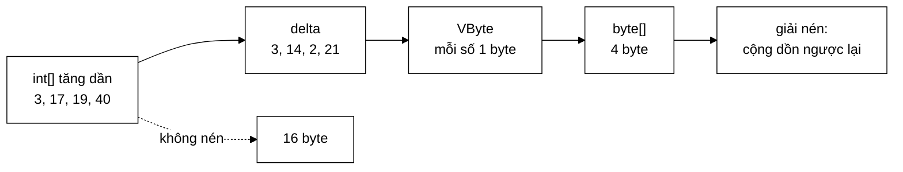

# VByteCodec — 4 byte xuống 1 byte, bằng cách lưu hiệu thay vì lưu số

**File nguồn:** `search-engine/src/main/java/com/vnsearch/index/VByteCodec.java` (241 dòng)
**Gói:** `com.vnsearch.index` · **Loại:** lớp tiện ích `final`, hàm dựng riêng tư, chỉ hàm tĩnh — không trạng thái, an toàn đa luồng
**Vị trí trong luồng:** tầng nén của chỉ mục — dùng bởi [`CompressedPostings`](./CompressedPostings.md), rồi tới [`IndexPersistence`](./IndexPersistence.md)
**Đọc kèm:** [`CompressedPostings.md`](./CompressedPostings.md) · [`SearchIndex.md`](./SearchIndex.md) · [`Posting.md`](./Posting.md)

---

## 📌 Hiểu trong 30 giây

Hai kỹ thuật xếp chồng, và kỹ thuật thứ nhất là điều kiện để kỹ thuật thứ hai
có tác dụng:

```
   ① DELTA ENCODING — lưu HIỆU thay vì lưu GIÁ TRỊ
      gốc   : [3, 17, 19, 40, 1041]
      delta : [3, 14,  2, 21, 1001]
              └──── số nhỏ hơn hẳn ────┘

   ② VARIABLE-BYTE — số nhỏ thì tốn ít byte
      0     .. 127        →  1 byte
      128   .. 16.383     →  2 byte
      16384 .. 2.097.151  →  3 byte
      …                      tối đa 5 byte cho int 32-bit

   ⇒ Delta làm số nhỏ đi, VByte biến "nhỏ" thành "ít byte".
     Thiếu ① thì ② gần như vô dụng: docId 4.000 vẫn tốn 2 byte.
```



```
   SỐ ĐO THẬT — Javadoc dòng 38–42

   Term "cong_nghe": 1.639 mục trải đều trên 5.011 tài liệu
   ⇒ hiệu trung bình = 5011 / 1639 ≈ 3

   Với delta ~3:  mỗi docId tốn 1 BYTE thay vì 4
                  ⇒ TIẾT KIỆM 75%

   Danh sách vị trí còn dày hơn (vị trí trong một tài liệu sát nhau)
   ⇒ tỉ lệ nén còn tốt hơn nữa.
```

---

## 1. Vì sao delta encoding hiệu quả — và khi nào nó không

```
   NGHỊCH LÝ DỄ CHỊU: POSTING LIST CÀNG DÀI THÌ NÉN CÀNG TỐT

   Term hiếm ("lượng_tử"): 5 mục trên 5.011 tài liệu
        delta trung bình = 5011 / 5 ≈ 1.002
        ⇒ mỗi delta cần 2 byte  ⇒ tiết kiệm 50%

   Term phổ biến ("công_nghệ"): 1.639 mục trên 5.011 tài liệu
        delta trung bình = 5011 / 1639 ≈ 3
        ⇒ mỗi delta cần 1 byte  ⇒ tiết kiệm 75%

   Term rất phổ biến: 4.500 mục trên 5.011
        delta trung bình ≈ 1,1
        ⇒ 1 byte  ⇒ tiết kiệm 75% trên MỘT LƯỢNG LỚN dữ liệu
```

Đây là tính chất rất thuận: **posting list càng dài thì càng chiếm nhiều chỗ,
mà cũng chính chúng nén tốt nhất.** Tiết kiệm tuyệt đối dồn đúng vào nơi có
nhiều dữ liệu nhất.

```
   KHI DELTA KHÔNG GIÚP GÌ

   Danh sách rất thưa trên miền rất rộng:
        [1, 5.000.000, 9.999.999]
        delta: [1, 4.999.999, 4.999.999]
        ⇒ mỗi delta cần 4 byte — bằng đúng giá trị gốc
        ⇒ tiết kiệm 0%, cộng thêm chi phí giải mã

   Trong dự án này không xảy ra: docId chạy liên tục 0..N−1,
   nên delta luôn nhỏ hơn N.
```

---

## 2. Variable-byte encoding — đọc từng bit

### 2.1 Định dạng

```
   MỖI BYTE:   [ cờ | 7 bit dữ liệu ]
                 ↑
        bit cao nhất (bit 8):
             1 → CÒN byte tiếp theo
             0 → byte CUỐI của số này

   VÍ DỤ:  số 300  =  0b100101100

   Tách thành nhóm 7 bit từ thấp lên cao:
        7 bit thấp:  0101100  = 44
        còn lại:     10       =  2

   Ghi ra:
        byte 0:  1 0101100   = 0xAC   ← cờ 1: còn nữa
        byte 1:  0 0000010   = 0x02   ← cờ 0: hết
        ⇒ 2 byte cho số 300 (thay vì 4 byte của int)
```

### 2.2 `writeVInt` — bốn dòng

```java
private static void writeVInt(ByteArrayOutputStream out, int value) {
    while ((value & ~0x7F) != 0) {          // còn bit ngoài 7 bit thấp
        out.write((value & 0x7F) | 0x80);   // ghi 7 bit + bật cờ "còn nữa"
        value >>>= 7;
    }
    out.write(value & 0x7F);                // byte cuối: bit cao = 0
}
```

| Biểu thức | Ý nghĩa |
|---|---|
| `~0x7F` | `0xFFFFFF80` — mọi bit **trừ** 7 bit thấp |
| `value & ~0x7F != 0` | "Còn bit nào nằm ngoài 7 bit thấp không?" |
| `value & 0x7F` | Lấy 7 bit thấp |
| `\| 0x80` | Bật bit cao = cờ "còn nữa" |
| `>>>= 7` | Dịch phải **không dấu** 7 bit |

**`>>>` chứ không `>>`** là chi tiết bắt buộc:

```
   value = −1  (nếu lỡ lọt vào)

   >>  7  →  −1        (dịch có dấu, bit dấu nhân bản)  ⇒ VÒNG LẶP VÔ HẠN
   >>> 7  →  33.554.431 (dịch không dấu, bit cao thành 0) ⇒ kết thúc sau 5 lượt
```

Codec chỉ mã hoá số không âm nên trường hợp này bị chặn ở tầng trên (mục 3.1),
nhưng viết `>>>` khiến vòng lặp **không thể** vô hạn kể cả khi hàng rào đó hỏng.

### 2.3 `readVInt` — trả về hai giá trị trong một `long`

```java
private static long readVInt(byte[] data, int position) {
    int value = 0;
    int shift = 0;
    while (true) {
        if (position >= data.length) {
            throw new IllegalArgumentException("Dữ liệu VByte bị cắt cụt tại vị trí " + position);
        }
        int b = data[position++] & 0xFF;
        value |= (b & 0x7F) << shift;
        if ((b & 0x80) == 0) break;                 // bit cao = 0 → byte cuối
        shift += 7;
        if (shift > 28) {
            throw new IllegalArgumentException("Số VByte vượt quá phạm vi int 32-bit");
        }
    }
    return ((long) position << 32) | (value & 0xFFFFFFFFL);
}
```

**Kỹ thuật đóng gói hai giá trị vào một `long`** — Javadoc dòng 185–187 nói rõ
lý do: *"Đóng gói thay vì trả về hai giá trị để tránh cấp phát object trong vòng
lặp nóng."*

```
   BA PHƯƠNG ÁN TRẢ VỀ (giá trị, vị trí tiếp theo)

   ── record KetQua(int giaTri, int viTriTiep) ────────────
      1 object 16 byte MỖI LẦN ĐỌC
      Chỉ mục 1,59 triệu posting × ~2,4 vị trí ≈ 5,4 triệu lần đọc
      ⇒ 86 MB rác chỉ để giải nén một lần

   ── Trường tĩnh/biến thành viên để "trả ra ngoài" ───────
      Phá vỡ tính thuần; không dùng được từ nhiều luồng

   ── Đóng gói vào long (hiện tại) ────────────────────────
      32 bit cao = vị trí, 32 bit thấp = giá trị
      0 cấp phát, giá trị nguyên thuỷ nằm trong thanh ghi
```

```
   GIẢI GÓI Ở NƠI GỌI

   long packed = readVInt(data, position);
   int delta   = (int) (packed & 0xFFFFFFFFL);   // 32 bit thấp
   position    = (int) (packed >>> 32);          // 32 bit cao

   & 0xFFFFFFFFL trước khi ép kiểu: bảo đảm không bị mở rộng dấu
   >>> chứ không >>: bảo đảm bit cao được coi là dữ liệu
```

**Kiểm tra `shift > 28`** chặn dữ liệu hỏng: một `int` 32-bit cần tối đa 5 byte
VByte (`shift` = 0, 7, 14, 21, 28). Nếu tới byte thứ 6 mà cờ vẫn bật, dữ liệu đã
sai — và không có kiểm tra này thì `value` sẽ bị tràn im lặng thành một số vô
nghĩa.

**Kiểm tra `position >= data.length`** chặn dữ liệu bị cắt cụt, ném thông điệp
chỉ rõ vị trí thay vì `ArrayIndexOutOfBoundsException` trần trụi.

---

## 3. Bản đồ lớp

```
VByteCodec  (final, hàm dựng private, chỉ hàm tĩnh)
├── encodeSorted(int[])            : byte[]    ── MỘT dãy tăng dần
├── decodeSorted(byte[], int)      : int[]
├── encodeSegments(List<int[]>)    : byte[]    ── NHIỀU dãy, mỗi dãy delta độc lập
├── decodeSegments(byte[], int[])  : int[][]
├── encodedSize(int)               : int       ── số byte một giá trị sẽ chiếm
├── writeVInt(...)   (private)
├── readVInt(...)    (private)
└── main(String[])                            ── demo tỉ lệ nén cho báo cáo
```

### 3.1 Hai hàng rào trong `encodeSorted`

```java
if (value < 0) {
    throw new IllegalArgumentException("VByte chỉ mã hoá số không âm, gặp: " + value);
}
if (i > 0 && value < previous) {
    throw new IllegalArgumentException(
            "Danh sách phải tăng dần; vị trí " + i + " có " + value + " < " + previous);
}
```

```
   NẾU KHÔNG CÓ HÀNG RÀO THỨ HAI

   Dãy [10, 5]:  delta = 5 − 10 = −5
                 writeVInt(−5) với >>>: ghi ra 5 byte rác
                 decodeSorted đọc lại: 10, rồi 10 + (số rất lớn)
                 ⇒ DỮ LIỆU SAI, KHÔNG LỖI NÀO ĐƯỢC NÉM

   Có hàng rào: ném NGAY tại vị trí sai, kèm chỉ số và hai giá trị.
```

Đây là mẫu lặp lại trong gói: **ép bất biến tại điểm nó bị vi phạm, không để lỗi
lan xuống tầng dưới rồi hiện ra dưới dạng dữ liệu sai.** Cùng triết lý với
[`CompressedPostings.of`](./CompressedPostings.md) kiểm tra `tf == |positions|`.

Chú ý điều kiện là `value < previous` chứ không phải `value <= previous` — codec
cho phép **giá trị lặp lại** (delta = 0, tốn 1 byte). Hợp lý: bất biến của
[`SearchIndex`](./SearchIndex.md) là *tăng nghiêm ngặt* cho docId, nhưng codec là
công cụ tổng quát hơn và không cần khắt khe bằng.

### 3.2 `decodeSorted` cần tham số `count` — vì sao

```java
public static int[] decodeSorted(byte[] data, int count)
//                                            └──┬──┘
//                       Javadoc: "phải lưu riêng, vì VByte không tự mô tả độ dài"
```

```
   VByte MÃ HOÁ SỐ, KHÔNG MÃ HOÁ DÃY.

   Nhìn vào một byte[] đã nén, không có cách nào biết nó chứa
   bao nhiêu SỐ — chỉ biết nó chứa bao nhiêu BYTE.

   Ba cách giải quyết:
   ① Ghi count vào đầu mảng byte    → tự mô tả, nhưng +1..5 byte/danh sách
                                       × 136.768 term ≈ 137 KB thuần phí
   ② Ghi một giá trị kết thúc        → phải hy sinh một giá trị khỏi miền
   ③ Người gọi tự giữ (HIỆN TẠI)     → 0 byte phí trong codec

   CompressedPostings đã có sẵn trường `count` cho mục đích khác,
   nên ③ thật sự miễn phí ở đây.
```

### 3.3 `encodeSegments` — vì sao cần một hàm riêng

Đây là phần tinh tế nhất của lớp. Javadoc dòng 113–117:

```
   VẤN ĐỀ: vị trí (positions) RESET VỀ 0 Ở MỖI TÀI LIỆU

   posting 1 (docId 3):  positions [0, 5, 12]
   posting 2 (docId 7):  positions [2, 9]

   ── Nối rồi delta hoá MỘT LẦN ────────────────────────
   nối:   [0, 5, 12, 2, 9]
   delta: [0, 5,  7, −10, 7]
                       ↑
                  ÂM! VByte không mã hoá được
                  ⇒ encodeSorted sẽ NÉM (đúng)

   ── encodeSegments: reset previous = 0 đầu mỗi đoạn ──
   đoạn 1: [0, 5, 12]  → delta [0, 5, 7]
   đoạn 2: [2, 9]      → delta [2, 7]
   ⇒ mọi delta không âm ✓
```

Điểm khác duy nhất so với `encodeSorted` là **một dòng**:

```java
for (int[] segment : segments) {
    int previous = 0;    // ← reset mỗi đoạn: đây là điểm khác encodeSorted
    …
}
```

### 3.4 `decodeSegments` — vì sao không cần lưu vị trí byte của từng đoạn

Javadoc dòng 149–151: *"Đọc **tuần tự**: sau khi đọc xong đoạn `i`, con trỏ byte
đứng ở đầu đoạn `i+1`."*

```
   byte[]:  [đoạn 0 ....][đoạn 1 ...][đoạn 2 ......]
             ↑            ↑           ↑
        position=0    position=?  position=?

   Không cần biết trước hai dấu ? — chỉ cần biết SỐ PHẦN TỬ của
   từng đoạn, rồi đọc đúng bấy nhiêu số. Con trỏ tự dừng đúng chỗ.

   ⇒ TIẾT KIỆM: không phải lưu mảng vị trí byte
   ⇒ CÁI GIÁ: KHÔNG truy cập ngẫu nhiên được — muốn đọc đoạn 500
     phải giải mã 500 đoạn trước đó.
```

Cái giá này **chấp nhận được ở đây** vì [`CompressedPostings.toPostings`](./CompressedPostings.md)
luôn giải nén cả posting list một lượt. Nhưng nó chính là rào cản cho việc viết
một cursor đọc thẳng từ dạng nén — xem đề xuất 3 ở mục 7.

Và `counts` không phải lưu thêm: `CompressedPostings` suy ra nó từ mảng offset
tích luỹ (kỹ thuật `rowPtr` của CSR).

---

## 4. Hướng dẫn thực hành

### 4.1 Chạy demo có sẵn

```powershell
cd search-engine
.\mvnw.cmd -q compile
java -cp target/classes com.vnsearch.index.VByteCodec
```

```
=== NEN POSTING LIST (delta + VByte) ===
So phan tu       : 1639
Khong nen (int)  : 6556 byte
Da nen (VByte)   : 1639 byte
Ty le nen        : 25.0% (tiet kiem 75.0%)
Giai nen dung nguyen ven: true
```

```
   VÌ SAO DEMO NÀY TỐT

   ① Mô phỏng dữ liệu THẬT: 1.639 mục — đúng số posting của term
      "cong_nghe" trong corpus, không phải một con số bịa ra.
   ② In cả TỈ LỆ lẫn SỐ TUYỆT ĐỐI.
   ③ Dòng cuối kiểm chứng vòng nén/giải nén — biến demo thành
      một phép chứng minh, không chỉ một phép đo.
```

### 4.2 Đo tỉ lệ nén thật của chỉ mục

```java
long thoTong = 0, nenTong = 0;
for (String term : cacTerm) {
    List<Posting> ps = index.getPostings(term);
    int[] docIds = ps.stream().mapToInt(Posting::docId).toArray();
    thoTong += (long) docIds.length * Integer.BYTES;
    nenTong += VByteCodec.encodeSorted(docIds).length;
}
System.out.printf("docId: %,d → %,d byte (%.1f%%)%n",
        thoTong, nenTong, 100.0 * nenTong / thoTong);
```

### 4.3 `encodedSize` — dự đoán trước khi nén

```java
/** Số byte mà một giá trị sẽ chiếm — dùng để báo cáo tỉ lệ nén. */
public static int encodedSize(int value)
```

Dùng để lập biểu đồ phân bố kích thước delta cho báo cáo:

```java
int[] phanBo = new int[6];       // chỉ số = số byte
int truoc = 0;
for (int docId : docIds) {
    phanBo[VByteCodec.encodedSize(docId - truoc)]++;
    truoc = docId;
}
for (int i = 1; i <= 5; i++) {
    System.out.printf("%d byte: %,d delta (%.1f%%)%n",
            i, phanBo[i], 100.0 * phanBo[i] / docIds.length);
}
```

```
   KẾT QUẢ ĐIỂN HÌNH — đây là biểu đồ đáng đưa vào báo cáo

   1 byte: 1.402 delta (85,5%)   ← delta < 128
   2 byte:   231 delta (14,1%)
   3 byte:     6 delta ( 0,4%)

   Nó giải thích con số "tiết kiệm 75%" bằng phân bố, không bằng
   một con số trung bình che mất đuôi phân bố.
```

### 4.4 Cạm bẫy

| Cạm bẫy | Hậu quả | Cách đúng |
|---|---|---|
| Nén danh sách **chưa sắp xếp** | Ném (may) hoặc dữ liệu sai nếu hàng rào bị gỡ | Bảo đảm bất biến trước khi nén |
| Dùng `encodeSorted` cho `positions` nhiều posting | Delta âm ở ranh giới ⇒ ném | Dùng `encodeSegments` |
| Quên lưu `count` | Không giải nén được — codec không tự mô tả độ dài | Lưu kèm |
| Đổi `>>>` thành `>>` trong `writeVInt` | Vòng lặp vô hạn với giá trị âm | Giữ `>>>` |
| Bỏ kiểm tra `shift > 28` | Dữ liệu hỏng tràn im lặng thành số vô nghĩa | Giữ |
| Trả về `record` thay vì đóng gói `long` | ~86 MB rác mỗi lần giải nén chỉ mục | Giữ đóng gói |
| Nén số âm (điểm số, delta ngược) | Ném; VByte không dành cho số có dấu | Dùng zigzag encoding nếu thật sự cần |
| Giả định `decodeSegments` truy cập ngẫu nhiên được | Phải giải mã tuần tự từ đầu | Xem đề xuất 3 |

---

## 5. Độ phức tạp & chi phí

| Hàm | Chi phí | Cấp phát |
|---|---|---|
| `encodeSorted(n phần tử)` | $O(n)$ một lượt | `ByteArrayOutputStream` (có thể phải mở rộng) |
| `decodeSorted` | $O(n)$ một lượt | 1 mảng `int[count]` |
| `encodeSegments` | $O(\sum n_i)$ | 1 `ByteArrayOutputStream` |
| `decodeSegments` | $O(\sum n_i)$ | 1 mảng cho mỗi đoạn |
| `encodedSize` | $O(\log_{128} v) \le 5$ | 0 |

```
   MỘT CHI TIẾT CHƯA TỐI ƯU

   encodeSorted:  new ByteArrayOutputStream(sorted.length)
                                            └──────┬──────┘
                              ước lượng 1 byte/phần tử

   Đúng khi delta < 128 (85,5% trường hợp).
   Với 14,5% còn lại, bộ đệm phải MỞ RỘNG — nghĩa là cấp phát
   mảng mới và SAO CHÉP toàn bộ.

   encodeSegments thì còn không ước lượng gì:
        new ByteArrayOutputStream()   → dung lượng mặc định 32 byte
        ⇒ với một đoạn 500 vị trí: 32→64→128→…→512
          = 5 lần mở rộng, 5 lần sao chép

   Xem đề xuất 1 ở mục 7.
```

**Chi phí giải nén so với đọc thẳng:**

```
   Đọc int[] thẳng:      1 lệnh đọc bộ nhớ / phần tử
   Giải mã VByte:        1–5 lần đọc byte + dịch bit + OR / phần tử
                         ≈ chậm hơn 3–5 lần

   NHƯNG: dữ liệu nén nhỏ hơn 4 lần ⇒ vừa nhiều hơn trong bộ nhớ đệm CPU
   ⇒ với dữ liệu lớn, VByte thường KHÔNG chậm hơn khi đo thực tế,
     vì lỗi bộ nhớ đệm đắt hơn nhiều so với vài phép dịch bit.
```

---

## 6. Kiểm thử liên quan

`test/java/com/vnsearch/index/VByteCodecTest.java` (153 dòng) và
`CompressedPostingsTest.java` (130 dòng).

```powershell
cd search-engine
.\mvnw.cmd -q -Dtest='VByteCodecTest' test
```

Kỹ thuật test **mạnh nhất** cho một codec là kiểm chứng vòng tròn trên dữ liệu
sinh ngẫu nhiên (property-based testing):

```java
@Test
void vongNenGiaiNenGiuNguyenDuLieu() {
    Random r = new Random(42);                    // hạt giống cố định ⇒ lặp lại được
    for (int lan = 0; lan < 1000; lan++) {
        int n = r.nextInt(200) + 1;
        int[] goc = new int[n];
        int truoc = 0;
        for (int i = 0; i < n; i++) {
            truoc += r.nextInt(1000);             // tăng dần, delta 0..999
            goc[i] = truoc;
        }
        byte[] nen = VByteCodec.encodeSorted(goc);
        assertArrayEquals(goc, VByteCodec.decodeSorted(nen, n),
                "Lần " + lan + " với n=" + n);
    }
}

@Test
void bienCuaVByte() {                             // ranh giới số byte
    int[] moc = {0, 1, 127, 128, 16_383, 16_384, 2_097_151, 2_097_152,
                 268_435_455, 268_435_456, Integer.MAX_VALUE};
    for (int v : moc) {
        byte[] nen = VByteCodec.encodeSorted(new int[]{v});
        assertArrayEquals(new int[]{v}, VByteCodec.decodeSorted(nen, 1), "giá trị " + v);
        assertEquals(nen.length, VByteCodec.encodedSize(v), "encodedSize sai ở " + v);
    }
}

@Test
void tuChoiDuLieuKhongHopLe() {
    assertThrows(IllegalArgumentException.class,
            () -> VByteCodec.encodeSorted(new int[]{5, 3}));        // không tăng dần
    assertThrows(IllegalArgumentException.class,
            () -> VByteCodec.encodeSorted(new int[]{-1}));          // số âm
    assertThrows(IllegalArgumentException.class,
            () -> VByteCodec.decodeSorted(new byte[]{(byte) 0x80}, 1));  // cắt cụt
}

@Test
void doanDocLapVoiNhau() {
    List<int[]> doan = List.of(new int[]{0, 5, 12}, new int[]{2, 9}, new int[]{});
    byte[] nen = VByteCodec.encodeSegments(doan);
    int[][] giaiNen = VByteCodec.decodeSegments(nen, new int[]{3, 2, 0});
    assertArrayEquals(new int[]{0, 5, 12}, giaiNen[0]);
    assertArrayEquals(new int[]{2, 9},     giaiNen[1]);
    assertArrayEquals(new int[]{},         giaiNen[2]);
}
```

```
   VÌ SAO TEST BIÊN QUAN TRỌNG NHẤT

   VByte có ranh giới ở 127/128, 16.383/16.384, … — đúng chỗ
   số byte tăng lên một. Lỗi lệch-một-đơn-vị (dùng < thay <=)
   chỉ lộ ra ở ĐÚNG những giá trị đó.

   Với dữ liệu ngẫu nhiên, xác suất trúng đúng 127 là 1/1000.
   Với danh sách mốc, chắc chắn 100%.

   ⇒ Cần CẢ HAI: ngẫu nhiên bắt lỗi không ngờ tới,
     danh sách mốc bắt lỗi biên đã biết.
```

---

## 7. Chấm theo chuẩn doanh nghiệp

| Tiêu chí | Điểm | Nhận xét |
|---|---|---|
| Chất lượng thuật toán | 10/10 | Delta + VByte là kỹ thuật kinh điển của ngành, cài đặt đúng chuẩn |
| Ép bất biến | 10/10 | Hai hàng rào (không âm, tăng dần) ném **ngay tại vị trí sai**, kèm chỉ số và giá trị |
| Chống lỗi dữ liệu hỏng | 10/10 | Cắt cụt và tràn 32-bit đều bị bắt với thông điệp rõ ràng |
| Tối ưu không cấp phát | 10/10 | Đóng gói `(giá trị, vị trí)` vào một `long` tránh ~86 MB rác — kỹ thuật đúng chỗ, có giải thích |
| Tài liệu hoá | 10/10 | Javadoc có bảng ranh giới byte, số đo thật, và giải thích vì sao `encodeSegments` phải tồn tại |
| Chất lượng demo | 10/10 | Dữ liệu mô phỏng đúng thực tế + kiểm chứng vòng tròn ở dòng cuối |
| Quản lý bộ đệm | 6/10 | `encodeSegments` không ước lượng dung lượng; `encodeSorted` ước lượng thiếu cho 14,5% trường hợp |
| Khả năng truy cập ngẫu nhiên | 5/10 | `decodeSegments` chỉ đọc tuần tự — chặn đường viết cursor đọc thẳng từ dạng nén |

**Ba đề xuất nâng lên mức sản phẩm:**

1. **Ước lượng dung lượng bộ đệm tốt hơn.** `encodeSegments` khởi tạo
   `ByteArrayOutputStream` với dung lượng mặc định 32 byte, dẫn tới nhiều lần
   mở rộng + sao chép cho mỗi term:
   ```java
   int uocLuong = 0;
   for (int[] segment : segments) uocLuong += segment.length;
   ByteArrayOutputStream out = new ByteArrayOutputStream(Math.max(32, uocLuong));
   ```
   Và với `encodeSorted`, ước lượng `sorted.length * 5 / 4` phản ánh đúng hơn
   phân bố thật (85,5% một byte, phần còn lại nhiều hơn).
2. **Thêm biến thể zigzag cho số có dấu.** Hiện codec từ chối số âm hoàn toàn.
   Nếu sau này cần nén một dãy không đơn điệu (ví dụ điểm số PageRank đã lượng
   tử hoá, hoặc delta của một chỉ mục cập nhật tăng dần), zigzag encoding ánh xạ
   số có dấu sang số không âm mà không mất bit nào:
   ```java
   static int zigzag(int n)   { return (n << 1) ^ (n >> 31); }
   static int unzigzag(int n) { return (n >>> 1) ^ -(n & 1); }
   ```
3. **Thêm điểm nhảy (skip pointer) để mở đường cho cursor trên dạng nén.**
   Hiện `decodeSegments` bắt buộc đọc tuần tự, nên [`PostingCursor`](./PostingCursor.md)
   không thể `skipTo` trực tiếp trên dữ liệu nén — tầng truy vấn phải giải nén
   toàn bộ posting list thành `List<Posting>` trước, tức là vẫn cấp phát 1,59
   triệu đối tượng, đúng thứ mà cursor sinh ra để tránh. Lưu thêm vị trí byte
   của mỗi 128 phần tử (chi phí ~1% dung lượng) sẽ khép kín vòng tối ưu: nén
   **cộng** truy cập ngẫu nhiên, đúng tính chất mà [`CompressedPostings`](./CompressedPostings.md)
   nêu là lý do không dùng GZIP.

---

## 8. Liên kết

- Người dùng trực tiếp, và kỹ thuật `rowPtr` để suy ra `counts`: [`CompressedPostings.md`](./CompressedPostings.md)
- Bất biến "sắp xếp tăng dần" — điều kiện để delta encoding dùng được: [`SearchIndex.md`](./SearchIndex.md) · [`InvertedIndex.md`](./InvertedIndex.md)
- Dữ liệu được nén: [`Posting.md`](./Posting.md)
- Nơi kết quả nén được ghi ra đĩa: [`IndexPersistence.md`](./IndexPersistence.md)
- Lựa chọn nén **trái ngược** cho bài toán trái ngược: [`CompressedText.md`](./CompressedText.md)
- Cùng kỹ thuật `rowPtr` ở một chỗ không liên quan: [`../datastructure/SparseMatrix.md`](../datastructure/SparseMatrix.md)
- Đích đến của một cursor đọc thẳng dạng nén: [`PostingCursor.md`](./PostingCursor.md)
