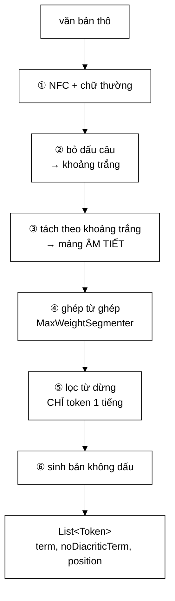

# VietnameseTokenizer — hai thay đổi phụ thuộc nhau, đổi một cái thì không ăn

**File nguồn:** `search-engine/src/main/java/com/vnsearch/index/VietnameseTokenizer.java` (314 dòng)
**Gói:** `com.vnsearch.index` · **Loại:** cài đặt [`Tokenizer`](./Tokenizer.md); bất biến sau khi dựng ⇒ an toàn đa luồng
**Tài nguyên:** `vietnamese-stopwords.txt` · từ điển qua [`VietnameseWordDictionary`](./VietnameseWordDictionary.md)
**Vị trí trong luồng:** cài đặt tách từ duy nhất; dùng bởi [`InvertedIndex`](./InvertedIndex.md) (lúc index) và [`QueryParser`](../query/QueryParser.md) (lúc truy vấn)
**Đọc kèm:** [`Tokenizer.md`](./Tokenizer.md) · [`MaxWeightSegmenter.md`](./MaxWeightSegmenter.md) · [`VietnameseWordDictionary.md`](./VietnameseWordDictionary.md)

---

## 📌 Hiểu trong 30 giây

Sáu bước cho mỗi đoạn văn bản, và bước 4 là nơi chất lượng được quyết định:



```
   HAI THAY ĐỔI PHỤ THUỘC NHAU (Javadoc dòng 60–63)

   ① TỪ ĐIỂN:   nhị phân  →  có trọng số
   ② THUẬT TOÁN: Longest Matching  →  quy hoạch động

   Chỉ đổi ①:  từ điển lớn LÀM THAM LAM TỆ HƠN
               (càng nhiều từ ghép, càng nhiều cơ hội chọn nhầm từ dài)

   Chỉ đổi ②:  quy hoạch động VÔ NGHĨA trên từ điển nhị phân
               (không có trọng số thì mọi cách tách hợp lệ đều bằng điểm)

   ⇒ Phải đổi CẢ HAI. Đây là loại phụ thuộc mà một kế hoạch
     refactor theo từng bước nhỏ sẽ đi vào ngõ cụt.
```

---

## 1. Bài học: hai thay đổi phải đi cùng nhau

Javadoc dòng 60–63 nêu một quan sát ít gặp trong tài liệu kỹ thuật:

> *"Hai thay đổi này **phụ thuộc nhau**: quy hoạch động **vô nghĩa** trên từ điển
> nhị phân (không có trọng số thì mọi cách tách hợp lệ đều đạt điểm bằng nhau),
> và từ điển lớn **làm tham lam tệ hơn** (càng nhiều từ ghép thì càng nhiều cơ
> hội chọn nhầm từ dài). **Chỉ đổi một trong hai đều không ăn.**"*

```
   MA TRẬN BỐN Ô — và ba ô đầu đều không dùng được

   ┌──────────────┬─────────────────────┬─────────────────────┐
   │              │ Từ điển NHỊ PHÂN    │ Từ điển CÓ TRỌNG SỐ │
   ├──────────────┼─────────────────────┼─────────────────────┤
   │ Tham lam     │ ⓪ BẢN CŨ            │ ① không dùng trọng  │
   │              │   sai ở câu nhập    │   số ⇒ y hệt ⓪,     │
   │              │   nhằng             │   chỉ TỆ HƠN vì từ  │
   │              │                     │   điển lớn hơn      │
   ├──────────────┼─────────────────────┼─────────────────────┤
   │ Quy hoạch    │ ② mọi cách tách     │ ③ BẢN MỚI ✓         │
   │ động         │   BẰNG ĐIỂM ⇒ chọn  │                     │
   │              │   tuỳ tiện          │                     │
   └──────────────┴─────────────────────┴─────────────────────┘

   Đi từ ⓪ tới ③ KHÔNG THỂ qua ① hay ②.
   Phải nhảy thẳng.
```

```
   VÌ SAO ĐIỀU NÀY ĐÁNG GHI LẠI

   Nguyên tắc thông thường: "chia thay đổi lớn thành các bước nhỏ,
   mỗi bước kiểm chứng được".

   Ở đây nguyên tắc đó KHÔNG ÁP DỤNG ĐƯỢC. Bước trung gian nào
   cũng cho kết quả TỆ HƠN điểm xuất phát, nên nếu đo sau mỗi
   bước nhỏ, ta sẽ kết luận "hướng này sai" và quay lại.

   Nhận ra khi nào hai thay đổi phải đi cùng nhau là một phần
   của việc lập kế hoạch refactor — và nó cần hiểu bản chất bài
   toán, không phải chỉ hiểu mã.
```

> ⚠️ **Số liệu trong Javadoc đã lỗi thời.** Javadoc viết *"154 → hơn 185.000 mục
> có tần suất"*. Thực tế `vietnamese-words.txt` có **49.644 dòng** (xem
> [`VietnameseWordDictionary`](./VietnameseWordDictionary.md)). Kết luận không
> đổi; chỉ con số cần sửa. Cùng con số này còn xuất hiện ở chú thích của
> `DictionaryHolder` (dòng 96).

---

## 2. Từ điển dùng chung — lazy holder idiom

```java
private static final class DictionaryHolder {
    static final VietnameseWordDictionary INSTANCE = new VietnameseWordDictionary();
}

public static VietnameseWordDictionary sharedDictionary() {
    return DictionaryHolder.INSTANCE;
}
```

Javadoc dòng 93–105 nêu vấn đề rất cụ thể:

```
   new VietnameseTokenizer() XUẤT HIỆN Ở BẢY CHỖ trong mã nguồn
   (InvertedIndex, QueryParser, IndexPersistence, EvaluationHarness…)

   Nạp từ điển: vài trăm mili-giây + hàng chục MB

   ⇒ Nếu mỗi lần đều nạp lại:
        7 × 300 ms  =  2,1 giây khởi động
        7 × ~30 MB  =  210 MB cho CÙNG MỘT dữ liệu bất biến
```

### 2.1 Vì sao lazy holder chứ không phải `synchronized` hay double-checked locking

```
   ── synchronized getInstance() ──────────────────────────
   public static synchronized VietnameseWordDictionary get() {
       if (instance == null) instance = new VietnameseWordDictionary();
       return instance;
   }
   ⇒ MỌI lần đọc đều lấy khoá, kể cả sau khi đã khởi tạo xong
   ⇒ tokenize() gọi rất nhiều ⇒ tranh chấp khoá vô ích

   ── Double-checked locking ──────────────────────────────
   Cần `volatile`, và viết sai một chữ là hỏng theo cách rất khó
   phát hiện (mô hình bộ nhớ Java). Đây là một trong những mẫu
   bị viết sai nhiều nhất trong lịch sử Java.

   ── Lazy holder (hiện tại) ──────────────────────────────
   JVM BẢO ĐẢM lớp lồng chỉ được khởi tạo một lần, đúng lúc lần
   đầu ai đó đọc INSTANCE, và bảo đảm này KHÔNG TỐN KHOÁ ở các
   lần đọc sau.
   ⇒ Đúng, nhanh, và ngắn hơn cả hai cách trên.
```

```
   CƠ CHẾ: đặc tả JVM (JLS §12.4) quy định lớp được khởi tạo
   LƯỜI (lazy) và AN TOÀN LUỒNG. Trình nạp lớp tự lo phần đồng bộ,
   và sau khi lớp đã khởi tạo thì việc đọc trường static không
   qua bất kỳ khoá nào.

   Lớp DictionaryHolder chỉ được nạp khi INSTANCE lần đầu được đọc
   — tức là khi ai đó gọi sharedDictionary().
```

### 2.2 Nhưng vẫn có hàm dựng nhận từ điển

```java
public VietnameseTokenizer() { this(sharedDictionary()); }

/**
 * @param dictionary tu dien muon dung — tach ra lam tham so de
 *                   EvaluationRunner do duoc anh huong cua tu dien
 *                   va cua bang tham so trong so len chat luong tim kiem
 */
public VietnameseTokenizer(VietnameseWordDictionary dictionary) { … }
```

Cùng tinh thần với `PARAM` ở [`VietnameseWordDictionary`](./VietnameseWordDictionary.md):
**thứ ảnh hưởng tới chất lượng thì phải đo được**. Hàm dựng không tham số dùng
thể hiện chung (đường chạy sản phẩm); hàm dựng có tham số cho phép ablation.

---

## 3. Hai tối ưu regex — cùng một bài học

### 3.1 Biên dịch sẵn `Pattern`

```java
private static final Pattern NON_WORD = Pattern.compile("[^\\p{L}\\p{N}\\s]");
private static final Pattern WHITESPACE_RUN = Pattern.compile("\\s+");
```

Javadoc dòng 75–84:

> *"`String.replaceAll`/`String.split` gọi `Pattern.compile` **MỖI LẦN** được gọi
> — mẫu regex bị phân tích và dịch lại từ đầu."*

```
   Pattern.compile phân tích cú pháp regex và dựng một máy trạng thái.
   Với mẫu "[^\p{L}\p{N}\s]" đó là ~2–5 µs.

   splitIntoSyllables gọi 2 mẫu, chạy cho MỖI đoạn văn bản.
   2.518 tài liệu + mỗi truy vấn:
        biên dịch lại ~5.000 lần lúc build  ≈  25 ms
   ⇒ Không lớn, nhưng miễn phí để tránh: một dòng `static final`.
```

### 3.2 `stripDiacritics` — thay `replaceAll` bằng một lượt quét

Đây là tối ưu lớn hơn nhiều, và chú thích trong mã giải thích đầy đủ:

```java
// Truoc day dong nay la `nfd.replaceAll("\\p{M}", "")`. Ham nay chay cho
// MOI token cua MOI tai lieu luc lap chi muc, roi lai chay cho tung tu
// cua tung ket qua luc boi sang snippet — tren corpus 5.011 trang la
// hang trieu lan goi. Moi lan, `replaceAll` bien dich lai mau regex,
// dung Matcher va cap phat chuoi ket qua. Mot luot quet ky tu lam dung
// viec do voi it cong hon, va truong hop pho bien nhat (chuoi von khong
// co dau: chu so, tu tieng Anh, tu Viet khong dau) khong cap phat gi.
int firstMark = indexOfMark(nfd);
if (firstMark < 0) {
    return nfd;                          // ← ĐƯỜNG NHANH: không cấp phát
}
StringBuilder stripped = new StringBuilder(nfd.length());
stripped.append(nfd, 0, firstMark);      // chép nguyên phần đầu, không kiểm tra lại
for (int i = firstMark + 1; i < nfd.length(); i++) {
    char c = nfd.charAt(i);
    if (!isCombiningMark(c)) stripped.append(c);
}
return stripped.toString();
```

```
   BA MỨC TỐI ƯU CHỒNG LÊN NHAU

   ① BỎ REGEX
      replaceAll → Pattern.compile + Matcher + chuỗi kết quả
      Quét tay   → một vòng for

   ② ĐƯỜNG NHANH KHÔNG CẤP PHÁT
      indexOfMark trả −1 ⇒ trả về nguyên chuỗi, KHÔNG dựng
      StringBuilder nào.
      Trường hợp này rất phổ biến: chữ số, từ tiếng Anh, từ Việt
      không dấu ("khong", "may"), và MỌI chuỗi đã qua stripDiacritics
      một lần.

   ③ KHÔNG KIỂM TRA LẠI PHẦN ĐẦU
      append(nfd, 0, firstMark) chép thẳng phần trước dấu đầu tiên
      ⇒ không gọi isCombiningMark cho những ký tự đã biết là sạch
```

```
   TẦN SUẤT GỌI — vì sao đáng tối ưu tới mức này

   Lúc index:   mỗi token của mỗi tài liệu
                ~3,5 triệu token
   Lúc truy vấn: mỗi từ của mỗi kết quả khi bôi sáng snippet
                10 kết quả × ~30 từ = 300 lần/truy vấn

   ⇒ Đây là một trong những hàm chạy nhiều nhất của cả hệ thống.
```

### 3.3 `isCombiningMark` — thay `\p{M}` bằng ba phép so sánh

```java
private static boolean isCombiningMark(char c) {
    int type = Character.getType(c);
    return type == Character.NON_SPACING_MARK
            || type == Character.COMBINING_SPACING_MARK
            || type == Character.ENCLOSING_MARK;
}
```

Ba loại này **đúng bằng** định nghĩa của `\p{M}` trong Unicode. Chú thích trong
mã ghi rõ điều đó ("Dùng một lớp ký tự với `\p{M}` của regex: ba loại dấu tổ hợp
Unicode") — quan trọng, vì nếu không ai sẽ tưởng đây là một xấp xỉ.

`Character.getType` là một phép tra bảng, không phải máy trạng thái regex.

---

## 4. Xử lý "đ" riêng — chi tiết đặc thù tiếng Việt

```java
public static String stripDiacritics(String s) {
    String withoutDd = s.replace('đ', 'd').replace('Đ', 'D');   // ← TRƯỚC khi NFD
    String nfd = Normalizer.normalize(withoutDd, Normalizer.Form.NFD);
    …
}
```

```
   VÌ SAO "đ" PHẢI XỬ LÝ TAY

   Hầu hết nguyên âm có dấu tiếng Việt là TỔ HỢP:
        "ế"  =  e + ◌̂ + ◌́       ⇒ NFD tách được, bỏ \p{M} là xong

   Nhưng "đ" là MỘT KÝ TỰ LATIN ĐỘC LẬP (U+0111 LATIN SMALL LETTER D
   WITH STROKE), KHÔNG phải "d + dấu gạch ngang".
        NFD("đ") = "đ"           ⇒ không tách được gì
        bỏ \p{M}                 ⇒ vẫn là "đ"

   ⇒ Không xử lý tay thì "đường" → "đương" (chữ đ còn nguyên)
     và tìm không dấu "duong" KHÔNG khớp.
```

```
   THỨ TỰ QUAN TRỌNG: replace TRƯỚC, NFD SAU

   Nếu NFD trước rồi replace: vẫn đúng, vì NFD không đụng tới "đ".
   Nhưng làm trước thì phần còn lại chỉ phải xử lý dấu tổ hợp
   thuần tuý — logic đơn giản hơn, và đọc rõ ý đồ hơn.
```

Đây là loại chi tiết chỉ người làm việc thật với tiếng Việt mới biết, và nó được
ghi lại đầy đủ trong Javadoc dòng 172–175 — đúng chỗ người sau cần đọc.

---

## 5. Từ ghép không bao giờ là từ dừng

```java
if (to - from > 1) {
    term = joinWithUnderscore(syllables, from, to);
    // Tu ghep khong bao gio bi coi la stopword: "co the" hay "cho nen"
    // la tu that mang nghia, du tung tieng deu nam trong danh sach
    // stopword. Bo chung se lam hong ca truy van chua cum tu do.
    isStopword = false;
} else {
    term = syllables[from];
    isStopword = stopwords.contains(term);
}
```

```
   VÍ DỤ CỤ THỂ

   Danh sách từ dừng có: "có", "thể", "cho", "nên"

   ── Nếu lọc từ dừng áp dụng cho cả từ ghép ──────────────
   "có_thể"  → chứa toàn từ dừng?  → bị bỏ
   "cho_nên" → bị bỏ

   Truy vấn "máy tính có thể làm gì"
        → token "có_thể" bị bỏ ở CẢ hai phía
        → mất một tín hiệu ngữ nghĩa thật

   ── Quy tắc hiện tại: chỉ lọc token MỘT TIẾNG ───────────
   "có_thể" được giữ  ✓
   "có" đứng lẻ bị bỏ ✓
```

```
   NGUYÊN TẮC RÚT RA

   Từ dừng là những tiếng KHÔNG MANG NGHĨA KHI ĐỨNG MỘT MÌNH.
   Khi chúng ghép thành một từ có trong từ điển, từ đó CÓ NGHĨA.

   ⇒ Điều kiện lọc phải áp dụng ở mức TOKEN SAU KHI GHÉP,
     không phải ở mức âm tiết trước khi ghép.
```

Và vị trí `position` chỉ tăng khi token **không** bị lọc:

```java
if (!isStopword) {
    tokens.add(new Token(term, stripDiacritics(term), position));
    position++;                          // ← chỉ tăng cho token GIỮ LẠI
}
```

Đây chính là quy ước mà [`Tokenizer`](./Tokenizer.md) mục 4.4 nêu: **vị trí phải
liên tục từ 0 trên token đã lọc**, để phép tìm cụm từ (`vị trí sau − vị trí
trước == 1`) hoạt động đúng.

---

## 6. `joinWithUnderscore` — một lần cấp phát duy nhất

```java
private static String joinWithUnderscore(String[] syllables, int from, int to) {
    int length = to - from - 1;                    // số dấu "_"
    for (int i = from; i < to; i++) length += syllables[i].length();
    StringBuilder joined = new StringBuilder(length);      // ← ĐÚNG kích thước
    joined.append(syllables[from]);
    for (int i = from + 1; i < to; i++) joined.append('_').append(syllables[i]);
    return joined.toString();
}
```

```
   ── String.join("_", Arrays.copyOfRange(syllables, from, to)) ──
   ① Arrays.copyOfRange  → cấp phát MỘT MẢNG tạm
   ② String.join         → cấp phát StringBuilder (dung lượng mặc định)
                            + có thể MỞ RỘNG vài lần
                            + chuỗi kết quả
   ⇒ 3–5 lần cấp phát

   ── joinWithUnderscore (hiện tại) ──────────────────────────
   ① Một lượt tính độ dài chính xác (không cấp phát)
   ② StringBuilder với ĐÚNG dung lượng → không mở rộng lần nào
   ③ toString()
   ⇒ 2 lần cấp phát, không có mảng tạm
```

Chú ý: chuỗi sinh ra ở đây chính là 7 triệu chuỗi mà
[`TermDictionary`](./TermDictionary.md) tồn tại để gộp lại. Hai tối ưu bổ sung
cho nhau — lớp này giảm **chi phí tạo**, `TermDictionary` giảm **chi phí giữ**.

---

## 7. Bản đồ lớp

```
VietnameseTokenizer  (implements Tokenizer)
│
├── HẰNG SỐ / TĨNH
│   ├── NON_WORD, WHITESPACE_RUN : Pattern   ── biên dịch sẵn
│   ├── record Token(term, noDiacriticTerm, position)
│   ├── DictionaryHolder (lớp lồng)          ── lazy holder
│   ├── sharedDictionary() : VietnameseWordDictionary
│   ├── stripDiacritics(String) : String     ── public, dùng cả ở SnippetBuilder
│   ├── indexOfMark, isCombiningMark (private)
│   ├── splitIntoSyllables (private)         ── bước ①②③
│   ├── joinWithUnderscore (private)
│   └── main(String[])                       ── demo có ca nhập nhằng
│
└── THỂ HIỆN (tất cả final ⇒ bất biến)
    ├── stopwords  : Set<String>
    ├── dictionary : VietnameseWordDictionary
    ├── segmenter  : MaxWeightSegmenter
    ├── tokenize(String) : List<Token>       ── bước ④⑤⑥
    └── name() : String                      ── nhãn ablation
```

### 7.1 `Token` mang **cả** bản có dấu và không dấu

```java
public record Token(String term, String noDiacriticTerm, int position) { }
```

```
   VÌ SAO MANG SẴN BẢN KHÔNG DẤU

   Nó cho phép tìm không dấu: gõ "may tinh" vẫn ra "máy tính".

   Nếu không mang sẵn, phía truy vấn phải gọi stripDiacritics lại
   cho mỗi term — mà hàm đó là một trong những hàm chạy nhiều nhất
   của hệ thống (mục 3.2).

   Cùng lý do với việc CrawlTask mang sẵn `host`
   (xem ../crawler/frontier/CrawlTask.md): tính một lần, dùng nhiều lần.
```

Giá phải trả: mỗi `Token` giữ **hai** chuỗi. Với 3,5 triệu token lúc build, đó
là 3,5 triệu chuỗi thêm — nhưng chúng cũng đi qua
[`TermDictionary`](./TermDictionary.md) nên số **phân biệt** mới là con số thật.

### 7.2 `name()` phản ánh cấu hình, không chỉ tên lớp

```java
@Override
public String name() {
    return "VietnameseTokenizer(MaxWeightDP, maxSyllables="
            + VietnameseWordDictionary.MAX_SYLLABLES
            + ", dict=" + dictionary.wordCount()
            + " (" + dictionary.compoundCount() + " tu ghep)"
            + ", stopwords=" + stopwords.size() + ")";
}
```

```
   VÍ DỤ ĐẦU RA
   VietnameseTokenizer(MaxWeightDP, maxSyllables=4, dict=49802
                       (38214 tu ghep), stopwords=178)

   ⇒ Hai tokenizer với TỪ ĐIỂN KHÁC NHAU cho ra TÊN KHÁC NHAU.
   ⇒ Đúng yêu cầu của Tokenizer.md mục 2.3: nhãn phải phản ánh
     CẤU HÌNH để bảng ablation có nghĩa.
```

Và nhờ vậy, hàng rào tokenizer của [`IndexPersistence`](./IndexPersistence.md)
**thật sự bắt được** trường hợp đổi từ điển — vì `name()` đổi theo `wordCount()`.
Đây là điều mà tài liệu `Tokenizer.md` từng nêu là thiếu sót; hoá ra nó đã được
xử lý một phần ở đây.

> ⚠️ Nhưng chỉ **một phần**: hai từ điển có **cùng số mục** nhưng **nội dung khác
> nhau** vẫn cho cùng `name()`. Muốn chặt chẽ thì cần băm nội dung. Xem đề xuất 2.

---

## 8. Hướng dẫn thực hành

### 8.1 Chạy demo — phần "ca nhập nhằng" là phần đáng xem

```powershell
cd search-engine
.\mvnw.cmd -q compile
java -cp target/classes com.vnsearch.index.VietnameseTokenizer
```

```
VietnameseTokenizer(MaxWeightDP, maxSyllables=4, dict=…, stopwords=…)

Van ban: Trình duyệt web và công cụ tìm kiếm là các sản phẩm công nghệ …
  [0] trình_duyệt  (khong dau: trinh_duyet)
  [1] web          (khong dau: web)
  [2] công_cụ_tìm_kiếm  (khong dau: cong_cu_tim_kiem)
  …

--- Cac ca nhap nhang ---
  nhà hàng xóm                       -> [nhà][hàng_xóm]
  ông già đi nhanh quá               -> …
  học sinh học sinh học              -> …
  tôi đi mua máy tính xách tay mới   -> …
  cải cách ruộng đất                 -> …
```

Chú thích trong mã gọi đây là *"phần đáng đọc nhất của demo"* — đúng, vì nó cho
thấy thuật toán xử lý được những câu mà bản cũ tách sai, bằng đầu ra thật chứ
không bằng lời khẳng định.

### 8.2 Chạy ablation từ điển

```java
List<Tokenizer> ungVien = List.of(
        new VietnameseTokenizer(),                                       // từ điển đầy đủ
        new VietnameseTokenizer(new VietnameseWordDictionary(bangKhac)), // đổi PARAM
        new WhitespaceTokenizer());                                      // đường cơ sở

for (Tokenizer t : ungVien) {
    InvertedIndex index = new InvertedIndex(t);          // xây LẠI chỉ mục
    for (WebDocument d : corpus) index.addDocument(d);
    QueryParser parser = new QueryParser(t);             // CÙNG thể hiện — bất biến song hành
    EvaluationMetrics m = harness.danhGia(index, parser, boTruyVanChuan);
    System.out.printf("%-70s P@10=%.3f MAP=%.3f%n", t.name(), m.precisionAt(10), m.map());
}
```

### 8.3 Thêm từ dừng

```
   Sửa: search-engine/src/main/resources/vietnamese-stopwords.txt
   (mỗi dòng một từ; dòng bắt đầu bằng # là chú thích)
```

```
   ⚠️ NHỚ: từ dừng CHỈ áp dụng cho token MỘT TIẾNG.
     Thêm "có thể" vào tệp này KHÔNG có tác dụng — token đó là
     "có_thể" (có gạch dưới) và nhánh từ ghép bỏ qua phép kiểm tra.

   ⚠️ Và: đổi từ dừng ⇒ name() đổi ⇒ chỉ mục cũ bị IndexPersistence
     TỪ CHỐI nạp và dựng lại. Đó là hành vi ĐÚNG (bất biến song hành),
     nhưng lần khởi động kế tiếp sẽ chậm ~36 giây.
```

### 8.4 Cạm bẫy

| Cạm bẫy | Hậu quả | Cách đúng |
|---|---|---|
| Index và truy vấn dùng hai thể hiện có từ điển khác | **Kết quả rỗng im lặng** | Tiêm cùng một object; [`IndexPersistence`](./IndexPersistence.md) canh phần lưu/nạp |
| Lọc từ dừng cho cả từ ghép | Mất "có_thể", "cho_nên" — từ thật mang nghĩa | Chỉ lọc token 1 tiếng |
| Tăng `position` cho cả token bị lọc | Tìm cụm từ hỏng (khoảng cách ≠ 1) | Chỉ tăng khi giữ lại |
| Bỏ xử lý riêng "đ" | "đường" → "đương"; tìm không dấu không khớp | Giữ `replace('đ','d')` |
| Dùng `replaceAll("\\p{M}","")` lại | Biên dịch regex hàng triệu lần + cấp phát | Giữ vòng quét |
| Bỏ `Pattern` biên dịch sẵn | Biên dịch lại mỗi lời gọi | Giữ `static final` |
| Nạp từ điển riêng cho mỗi tokenizer | 7 × 30 MB cho cùng dữ liệu bất biến | Dùng `sharedDictionary()` |
| Thay lazy holder bằng double-checked locking | Dài hơn, dễ sai hơn, không nhanh hơn | Giữ |
| `toLowerCase()` không ghi locale | Bẫy Turkish i | Giữ `Locale.forLanguageTag("vi")` |
| Chuẩn hoá NFC ở tokenizer nhưng không ở từ điển | **Không bao giờ khớp** — im lặng | Cả hai phía cùng dạng NFC |

---

## 9. Độ phức tạp & chi phí

| Bước | Chi phí |
|---|---|
| ① NFC + chữ thường | $O(L)$ với $L$ = số ký tự |
| ② bỏ dấu câu (2 regex) | $O(L)$ |
| ③ `split(" ")` | $O(L)$, **cấp phát** mảng + $n$ chuỗi con |
| ④ [`segment`](./MaxWeightSegmenter.md) | $O(n \times 4) = O(n)$ |
| ⑤ tra từ dừng | $O(1)$ mỗi token |
| ⑥ `stripDiacritics` | $O(L_t)$ mỗi token; **đường nhanh không cấp phát** nếu không có dấu |
| **Tổng** | **$O(L)$**, bộ nhớ $O(n)$ + từ điển cố định |

```
   NGÂN SÁCH Ở HAI NƠI RẤT KHÁC NHAU

   ── LÚC BUILD (một lần) ─────────────────────────────────
   2.518 tài liệu × ~1.400 tiếng  ≈ 3,5 triệu tiếng
   ~200 ns/tiếng                   ≈ 0,7 giây
   ⇒ nhỏ so với tổng thời gian build (~36 giây)

   ── LÚC TRUY VẤN ────────────────────────────────────────
   ~5 tiếng × 200 ns  =  1 µs
   Tổng ngân sách truy vấn ≈ 1 ms
   ⇒ chiếm 0,1% — không đáng kể

   ⚠️ NHƯNG stripDiacritics còn chạy ở khâu bôi sáng snippet:
     10 kết quả × ~30 từ = 300 lần/truy vấn
     ⇒ đây mới là nơi tối ưu ở mục 3.2 phát huy tác dụng
```

---

## 10. Kiểm thử liên quan

`test/java/com/vnsearch/index/VietnameseTokenizerTest.java` (105 dòng).

```powershell
cd search-engine
.\mvnw.cmd -q -Dtest='VietnameseTokenizerTest' test
```

Các ca mà lớp này cần:

```java
@Test
void ghepTuGhepDungOCauNhapNhang() {           // lý do đổi thuật toán
    assertEquals(List.of("nhà", "hàng_xóm"), termsOf(tk.tokenize("nhà hàng xóm")));
}

@Test
void sinhBanKhongDau() {
    Token t = tk.tokenize("máy tính").get(0);
    assertEquals("máy_tính", t.term());
    assertEquals("may_tinh", t.noDiacriticTerm());
}

@Test
void chuDBiChuyenThanhD() {                    // chi tiết đặc thù tiếng Việt
    assertEquals("duong", VietnameseTokenizer.stripDiacritics("đường"));
    assertEquals("Duong", VietnameseTokenizer.stripDiacritics("Đường"));
    assertEquals("dai_hoc", VietnameseTokenizer.stripDiacritics("đại_học"));
}

@Test
void chuoiKhongDauTraVeNguyenVan() {            // đường nhanh không cấp phát
    String s = "may tinh 123 abc";
    assertSame(s, VietnameseTokenizer.stripDiacritics(s),
            "Chuỗi vốn không dấu phải đi đường nhanh, không dựng chuỗi mới");
}

@Test
void tuGhepKhongBiCoiLaTuDung() {               // quy tắc ở mục 5
    List<String> terms = termsOf(tk.tokenize("máy tính có thể chạy"));
    assertTrue(terms.contains("có_thể"), "từ ghép 'có_thể' phải được giữ");
}

@Test
void tuDungMotTiengBiLoc() {
    assertFalse(termsOf(tk.tokenize("con mèo của tôi")).contains("của"));
}

@Test
void viTriLienTucSauKhiLocTuDung() {            // điều kiện của tìm cụm từ
    List<Token> ts = tk.tokenize("con mèo của tôi rất đẹp");
    for (int i = 0; i < ts.size(); i++) {
        assertEquals(i, ts.get(i).position(), "vị trí phải liên tục từ 0");
    }
}

@Test
void nfcVaNfdChoKetQuaGiongNhau() {             // chống lỗi im lặng
    String nfc = "máy tính";
    String nfd = Normalizer.normalize(nfc, Normalizer.Form.NFD);
    assertEquals(termsOf(tk.tokenize(nfc)), termsOf(tk.tokenize(nfd)));
}

@Test
void nullVaRong() {
    assertTrue(tk.tokenize(null).isEmpty());
    assertTrue(tk.tokenize("").isEmpty());
    assertTrue(tk.tokenize("   ").isEmpty());
    assertTrue(tk.tokenize("!!!???").isEmpty(), "chỉ dấu câu ⇒ không token nào");
}

@Test
void tuDienDungChungLaMotTheHien() {            // lazy holder
    assertSame(VietnameseTokenizer.sharedDictionary(),
               VietnameseTokenizer.sharedDictionary());
}

@Test
void anToanDaLuong() throws Exception {
    String text = "công nghệ thông tin việt nam phát triển nhanh";
    List<String> mongDoi = termsOf(tk.tokenize(text));
    ExecutorService pool = Executors.newFixedThreadPool(8);
    List<Future<List<String>>> fs = new ArrayList<>();
    for (int i = 0; i < 500; i++) fs.add(pool.submit(() -> termsOf(tk.tokenize(text))));
    for (var f : fs) assertEquals(mongDoi, f.get());
    pool.shutdown();
}
```

Ca `chuoiKhongDauTraVeNguyenVan` dùng `assertSame` (không phải `assertEquals`):
nó canh giữ **đường nhanh không cấp phát** ở mục 3.2. Nếu ai đó bỏ nhánh
`if (firstMark < 0) return nfd;`, kết quả vẫn `equals` nhưng không còn `same` —
và test đỏ đúng chỗ.

---

## 11. Liên kết

- Hợp đồng mà lớp này cài đặt: [`Tokenizer.md`](./Tokenizer.md)
- Thuật toán ghép từ: [`MaxWeightSegmenter.md`](./MaxWeightSegmenter.md)
- Từ điển và công thức trọng số: [`VietnameseWordDictionary.md`](./VietnameseWordDictionary.md)
- Cấu trúc tra từ điển: [`../datastructure/SyllableTrie.md`](../datastructure/SyllableTrie.md)
- Nơi gộp 7 triệu chuỗi do `joinWithUnderscore` sinh ra: [`TermDictionary.md`](./TermDictionary.md)
- Hàng rào chống dùng nhầm tokenizer: [`IndexPersistence.md`](./IndexPersistence.md)
- Hai nơi bắt buộc dùng cùng một thể hiện: [`InvertedIndex.md`](./InvertedIndex.md) · [`../query/QueryParser.md`](../query/QueryParser.md)
- Nơi `stripDiacritics` được gọi lại lúc bôi sáng: [`../ranking/SnippetBuilder.md`](../ranking/SnippetBuilder.md)
- Nơi chạy ablation: [`../eval/EvaluationRunner.md`](../eval/EvaluationRunner.md)
