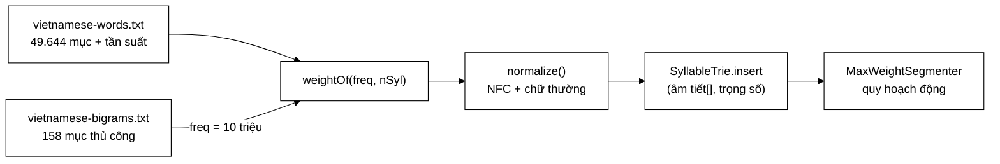

# VietnameseWordDictionary — từ điển trả lời "bao nhiêu" thay vì "có/không"

**File nguồn:** `search-engine/src/main/java/com/vnsearch/index/VietnameseWordDictionary.java` (266 dòng)
**Gói:** `com.vnsearch.index` · **Loại:** lớp có trạng thái đọc-một-lần; nạp từ tài nguyên lúc dựng
**Tài nguyên:** `vietnamese-words.txt` (**49.644 dòng**, có tần suất) · `vietnamese-bigrams.txt` (**158 dòng**, thủ công theo miền)
**Vị trí trong luồng:** nạp [`SyllableTrie`](../datastructure/SyllableTrie.md) cho [`MaxWeightSegmenter`](./MaxWeightSegmenter.md)
**Đọc kèm:** [`MaxWeightSegmenter.md`](./MaxWeightSegmenter.md) · [`VietnameseTokenizer.md`](./VietnameseTokenizer.md) · [`../datastructure/SyllableTrie.md`](../datastructure/SyllableTrie.md)

---

## 📌 Hiểu trong 30 giây

Từ điển cũ chỉ trả lời **có / không**. Với câu trả lời nhị phân, khi hai cách
tách đều hợp lệ thì thuật toán **không có cơ sở nào để chọn** — nó buộc phải
đoán. Từ điển có **trọng số** biến việc chọn thành một bài toán tối ưu có hàm
mục tiêu, giải chính xác được bằng quy hoạch động.



```
   CÔNG THỨC TRỌNG SỐ (nguyên văn từ Cốc Cốc)

   spaceCount = soAmTiet − 1
   freqPower  = PARAM[spaceCount × 2]
   lenPower   = PARAM[spaceCount × 2 + 1]
   weight     = pow(log2(freq + 3), freqPower) × pow(spaceCount + 1, lenPower)

   Hai chi tiết KHÔNG hiển nhiên, cả hai đều quan trọng:
   ├─ log2(freq) chứ không phải freq
   └─ +3 trước khi lấy log
```

---

## 1. Vì sao từ điển phải có trọng số

Javadoc dòng 17–24:

> *"Từ điển cũ (`vietnamese-bigrams.txt`, 154 mục) chỉ trả lời được *có / không*.
> Với câu trả lời nhị phân đó, khi hai cách tách đều hợp lệ thì **không có cơ sở
> nào để chọn** — thuật toán buộc phải đoán, và Longest Matching đoán bằng cách
> 'lấy cái dài nhất', một heuristic sai ở những câu nhập nhằng."*

```
   TỪ "CÓ/KHÔNG" SANG "BAO NHIÊU" ĐỔI BẢN CHẤT BÀI TOÁN

   ── Tập hợp nhị phân ────────────────────────────────────
   "nhà hàng" ∈ tuDien ?  → true
   "hàng xóm" ∈ tuDien ?  → true
   ⇒ HAI câu trả lời giống hệt nhau
   ⇒ không có gì để so sánh  ⇒  phải ĐOÁN

   ── Ánh xạ có trọng số ──────────────────────────────────
   weight("nhà hàng") = 9,59
   weight("hàng xóm") = 9,44
   weight("nhà")      = 3,69
   weight("xóm")      = 3,46
   ⇒ so sánh được TỔNG của cả câu
   ⇒ 13,05 vs 13,13  ⇒  CHỌN, không đoán
```

```
   BÀI HỌC TỔNG QUÁT

   Khi một thuật toán phải "đoán bằng heuristic", rất thường là
   vì CẤU TRÚC DỮ LIỆU không mang đủ thông tin để quyết định.

   Sửa heuristic → đổi tập ví dụ sai, không xoá được lớp lỗi.
   Làm giàu dữ liệu → bài toán trở thành tối ưu, giải chính xác được.

   Ở đây: Set<String> → Map<String, double> đã đủ để đổi
   Longest Matching thành quy hoạch động.
```

> ⚠️ **Con số "154 mục" trong Javadoc đã lỗi thời.** Nó mô tả tình trạng khi chỉ
> có `vietnamese-bigrams.txt`. Hiện lớp nạp **hai** tệp: `vietnamese-words.txt`
> (49.644 dòng, có tần suất) và `vietnamese-bigrams.txt` (158 dòng, thủ công).
> Javadoc của [`Tokenizer`](./Tokenizer.md) cũng còn giữ con số cũ này.

---

## 2. Công thức trọng số — hai chi tiết không hiển nhiên

```java
public double weightOf(int frequency, int syllables) {
    int spaceCount = syllables - 1;
    double freqPower = param[spaceCount << 1];
    double lenPower  = param[(spaceCount << 1) | 1];
    return Math.pow(log2(frequency + 3.0), freqPower)
            * Math.pow(spaceCount + 1, lenPower);
}
```

### 2.1 `log2(freq)` chứ không phải `freq`

Javadoc dòng 39–44:

```
   TẦN SUẤT TRẢI TỪ 10 TỚI 2.147.483.647 — HƠN TÁM MƯƠI LẦN
   (tính theo bậc độ lớn: 10^1 … 10^9)

   ── Dùng thẳng tuyến tính ────────────────────────────────
   Một từ phổ biến (freq = 2 tỉ) sẽ ÁP ĐẢO mọi tổ hợp khác.
   Quy hoạch động biến thành "luôn chọn từ phổ biến nhất",
   bất kể ngữ cảnh — tức là quay lại một heuristic khác,
   chỉ tệ hơn.

   ── Lấy logarit ──────────────────────────────────────────
   log2(10)         ≈  3,3
   log2(2.147.483.647) ≈ 31
   ⇒ tầm giá trị về khoảng 3..31, tức chỉ chênh nhau ~10 lần
   ⇒ ĐÚNG BẰNG tầm ảnh hưởng của thành phần độ dài
     (pow(spaceCount+1, lenPower) với lenPower tới 4,42
      cho 3 âm tiết: pow(3, 4,42) ≈ 130)
```

```
   NGUYÊN TẮC: KHI GỘP HAI TÍN HIỆU VÀO MỘT ĐIỂM SỐ,
   CHÚNG PHẢI CÓ TẦM GIÁ TRỊ SO SÁNH ĐƯỢC.

   Nếu một tín hiệu trải 9 bậc độ lớn còn tín hiệu kia trải 2 bậc,
   thì tín hiệu thứ hai KHÔNG BAO GIỜ ảnh hưởng được — dù trọng số
   danh nghĩa của nó là bao nhiêu.

   Cùng vấn đề đã gặp ở DefaultPrioritizer (crawler/frontier):
   "50 backlink = 25 điểm đủ để trang sâu 12 lớp vượt lên trên seed".
   Ở đó giải bằng "mỗi tín hiệu đúng một bậc"; ở đây giải bằng logarit.
```

### 2.2 `+3` trước khi lấy log — chặn dưới

Javadoc dòng 45–47:

```
   TỪ CÓ freq = 1:
        log2(1) = 0
        pow(0, freqPower) = 0
        ⇒ weight = 0

   Mà 0 ĐÚNG BẰNG giá trị dành cho "không phải từ".
   ⇒ Một từ THẬT trong từ điển bị đối xử như một chuỗi vô nghĩa.

   VỚI +3:
        log2(1 + 3) = log2(4) = 2
        pow(2, freqPower) > 0
   ⇒ mọi từ thật đều có trọng số DƯƠNG THẬT SỰ
```

Vì sao là `+3` chứ không phải `+1` hay `+2`?

```
   +1:  log2(1+1) = log2(2) = 1
        pow(1, bất kỳ) = 1  ← MỌI freqPower đều cho 1
        ⇒ thành phần tần suất VÔ HIỆU với từ hiếm nhất
        ⇒ chỉ còn thành phần độ dài quyết định

   +2:  log2(1+2) = log2(3) ≈ 1,58   ← đã tránh được điểm 1
   +3:  log2(1+3) = log2(4) = 2      ← tròn, và cách xa cả 0 lẫn 1

   ⇒ +3 đưa cận dưới lên 2, an toàn với mọi số mũ.
```

Đây là ví dụ của một hằng số nhỏ giải quyết **hai** trường hợp suy biến cùng
lúc (điểm 0 của log, và điểm bất động 1 của luỹ thừa) — loại chi tiết chỉ lộ ra
khi có người thật sự chạy công thức trên dữ liệu biên.

### 2.3 Bảng tham số **không đơn điệu** theo độ dài — và điều đó có ý nghĩa

```java
static final double[] PARAM = {
        0.38, 1.00,   // 1 âm tiết
        0.14, 2.59,   // 2 âm tiết
        1.42, 4.42,   // 3 âm tiết
        1.45, 0.23,   // 4 âm tiết
        0.10          // chặn trên của bảng
};
```

```
   lenPower theo số âm tiết:  1,00 → 2,59 → 4,42 → 0,23
                                              ↑       ↑
                                        ưu ái nhất   TỤT HẲN

   Từ 3 âm tiết được ưu ái hơn hẳn.
   Từ 4 âm tiết bị hạ xuống gần bằng từ 1 âm tiết.
```

Javadoc dòng 50–56 nói thẳng đây là **kết quả đo tham số**, không phải nguyên lý:

> *"Đó là kết quả đo tham số trên dữ liệu nội bộ của Cốc Cốc chứ không phải một
> nguyên lý ngôn ngữ học, nên **đừng coi là chân lý**: `PARAM` được tách ra thành
> tham số của constructor để `EvaluationRunner` chạy được thí nghiệm ablation
> trên chính nó."*

```
   ĐÂY LÀ THÁI ĐỘ ĐÚNG VỚI MỘT HẰNG SỐ MƯỢN

   ✗ "Cốc Cốc dùng thế thì chắc đúng"        ← sùng bái
   ✓ "Cốc Cốc đo trên dữ liệu CỦA HỌ.
      Dữ liệu của ta khác. Nên nó THAM SỐ HOÁ ĐƯỢC."

   Việc PARAM đi qua constructor biến một hằng số mượn thành
   một BIẾN SỐ THÍ NGHIỆM — đúng tinh thần của Tokenizer.md:
   thứ ảnh hưởng tới chất lượng thì phải đo được.
```

### 2.4 `PARAM` là package-private, không `public` — có lý do

```java
// Package-private chu khong public: mot mang `public static final` van SUA
// duoc tu ben ngoai (`PARAM[0] = 99`) — `final` chi khoa tham chieu, khong
// khoa noi dung. Bang nay chi duoc doc trong chinh goi nay.
static final double[] PARAM = { … };
```

```
   BẪY KINH ĐIỂN CỦA JAVA

   public static final double[] PARAM = {0.38, 1.00, …};

   PARAM = mangKhac;   →  LỖI BIÊN DỊCH ✓   (final khoá tham chiếu)
   PARAM[0] = 99;      →  HỢP LỆ ✗          (final KHÔNG khoá nội dung)

   Một mảng public static final là một biến TOÀN CỤC SỬA ĐƯỢC
   nguỵ trang thành hằng số.
```

Giải pháp ở đây (thu hẹp phạm vi xuống package) là giải pháp rẻ nhất và đủ dùng.
Nếu cần công khai thì phải trả về bản sao qua một hàm — nhưng lớp này không cần.

Chú ý hàm dựng cũng `clone()` tham số truyền vào:

```java
this.param = param.clone();
```

Nếu không `clone`, người gọi giữ tham chiếu tới mảng và có thể sửa nó **sau khi**
từ điển đã nạp xong — khiến `weightOf` trả về giá trị khác với trọng số đã nằm
trong trie. Bản sao phòng thủ ở đây là bắt buộc.

### 2.5 Giới hạn 4 âm tiết — không phải lựa chọn tuỳ ý

Javadoc dòng 58–60:

> *"**Giới hạn 4 âm tiết** không phải lựa chọn tuỳ ý mà là **chặn trên của bảng
> tham số**: `PARAM` có 9 phần tử, từ 5 âm tiết sẽ đọc tới chỉ số 9 và tràn
> mảng."*

```
   weightOf(freq, 5):
        spaceCount = 4
        param[4 << 1]       = param[8]  = 0,10   ✓ (phần tử cuối)
        param[(4 << 1) | 1] = param[9]  = ✗ TRÀN MẢNG

   ⇒ MAX_SYLLABLES = 4 KHÔNG phải là "chúng tôi nghĩ 4 là đủ".
     Nó là ràng buộc CỨNG của bảng tham số.

   Muốn hỗ trợ 5 âm tiết ⇒ phải có thêm cặp tham số cho nó,
   mà cặp đó chỉ có được bằng cách ĐO trên dữ liệu.
```

Phần tử thứ 9 (`0.10`) đứng lẻ, không thành cặp — nó là **giá trị canh biên** để
`param[8]` tồn tại. Cùng kỹ thuật với phần tử canh biên của mảng `offsets` ở
[`CompressedPostings`](./CompressedPostings.md).

---

## 3. `UNKNOWN_SYLLABLE_WEIGHT = 0.5` — hai ràng buộc, không phải một

```java
public static final double UNKNOWN_SYLLABLE_WEIGHT = 0.5;
```

Javadoc dòng 88–93 nêu **hai** điều kiện mà giá trị này phải thoả:

```
   ① PHẢI DƯƠNG
      Nếu = 0 thì quy hoạch động coi MỌI cách tách chứa từ ngoài
      từ điển là NHƯ NHAU — mà văn bản thật luôn có tên riêng và
      từ mượn không nằm trong từ điển nào.
      ⇒ Với 0, thuật toán mất khả năng phân biệt ở đúng chỗ nó
        cần nhất.

   ② PHẢI NHỎ HƠN trọng số của âm tiết CÓ trong từ điển
      (thấp nhất khoảng 1,5)
      ⇒ Khi đã biết một âm tiết thì dùng nó vẫn hơn là coi như
        không biết.
      ⇒ Nếu lớn hơn: thuật toán ưu tiên tách lẻ mọi thứ, từ điển
        thành vô dụng.
```

```
   0,5 nằm gọn giữa hai ràng buộc:   0  <  0,5  <  1,5
                                     ↑           ↑
                                 ràng buộc ①  ràng buộc ②
```

Giá trị lấy từ Cốc Cốc (`MultitermHashTrieNode` khởi tạo `weight = 0.5`), nhưng
điều quan trọng là **hai ràng buộc được phát biểu rõ** — nên nếu ai đó đổi giá
trị, họ biết ngay khoảng hợp lệ mà không phải suy luận lại.

Đây cũng là trọng số mà [`MaxWeightSegmenter`](./MaxWeightSegmenter.md) dùng ở
dòng "luôn cho phép tách một âm tiết" — dòng giữ cho đồ thị không bị đứt.

---

## 4. `CURATED_FREQUENCY = 10_000_000` — trộn hai nguồn không cùng đơn vị

```java
public static final int CURATED_FREQUENCY = 10_000_000;
```

```
   VẤN ĐỀ: HAI TỆP, MỘT CÓ TẦN SUẤT, MỘT KHÔNG

   vietnamese-words.txt    "máy tính\t45231"     ← có số liệu thật
   vietnamese-bigrams.txt  "công cụ tìm kiếm"    ← thủ công, không có số

   Không thể bỏ tệp thứ hai: nó chứa cụm từ đặc thù đề tài mà từ
   điển tổng quát không có ("công cụ tìm kiếm", "an toàn thông tin").

   ⇒ Phải GÁN cho chúng một tần suất.
```

```
   CHỌN GIÁ TRỊ NÀO?

   Quá thấp  →  mục thủ công thua mọi từ trong từ điển lớn
                ⇒ tệ như không có
   Quá cao   →  chúng áp đảo, mọi câu bị ép tách theo từ thủ công
                ⇒ tệ hơn không có

   10 triệu: "tương đương một cụm từ khá phổ biến, đủ để chúng cạnh
   tranh được với từ điển lớn nhưng không áp đảo nó" (Javadoc dòng 102–104)
```

```
   ⚠️ NHƯNG CON SỐ NÀY CHƯA ĐƯỢC ĐO.

   log2(10.000.000 + 3) ≈ 23,3
   log2(45.231 + 3)     ≈ 15,5
   ⇒ mục thủ công có phần tần suất cao hơn ~50% so với một từ
     khá phổ biến của từ điển lớn

   Đây là ước lượng hợp lý, nhưng nó là ước lượng.
   Xem đề xuất 2 ở mục 8.
```

---

## 5. `normalize` — hàm chống một lỗi im lặng

```java
static String normalize(String s) {
    return Normalizer.normalize(s.trim(), Normalizer.Form.NFC)
            .toLowerCase(Locale.forLanguageTag("vi"));
}
```

Javadoc dòng 241–245:

> *"Nếu từ điển lưu dạng NFD mà tokenizer tra bảng NFC (hoặc ngược lại) thì hai
> chuỗi **trông như nhau trên màn hình** nhưng khác nhau từng byte, và từ điển
> **không bao giờ khớp** — một lỗi im lặng, không ngoại lệ, chỉ là kết quả kém
> đi một cách khó hiểu. **Cả hai phía đều phải đi qua đúng một hàm này.**"*

```
   NFC vs NFD — CÙNG MỘT CHỮ, HAI CHUỖI KHÁC NHAU

   "ế"  dạng NFC:  U+1EBF                      → 1 ký tự
   "ế"  dạng NFD:  U+0065 U+0302 U+0301        → 3 ký tự
                   (e + dấu mũ + dấu sắc)

   Trên màn hình: GIỐNG HỆT
   equals():      FALSE
   hashCode():    KHÁC NHAU

   ⇒ Từ điển nạp NFD, truy vấn tra NFC ⇒ KHÔNG BAO GIỜ khớp
   ⇒ Mọi từ ghép bị tách lẻ ⇒ chất lượng sụp đổ
   ⇒ Không có lỗi nào được ném
```

```
   VÌ SAO TIẾNG VIỆT DỄ GẶP LỖI NÀY HƠN CÁC NGÔN NGỮ KHÁC

   Tiếng Việt có tới HAI dấu chồng lên một nguyên âm
   (dấu mũ/móc + dấu thanh) ⇒ nhiều tổ hợp NFD hơn.

   Và các nguồn dữ liệu khác nhau dùng chuẩn khác nhau:
   ├─ macOS lưu tên tệp theo NFD
   ├─ Hầu hết trang web dùng NFC
   └─ Một số bộ gõ sinh ra NFD

   ⇒ Từ điển tải từ nguồn khác có thể là NFD mà không ai để ý.
```

`Locale.forLanguageTag("vi")` thay vì `Locale.ROOT`: với tiếng Việt hai cái cho
kết quả giống nhau, nhưng ghi rõ locale là kỷ luật đúng — cùng bài học đã gặp ở
[`UrlCanonicalizer`](../crawler/UrlCanonicalizer.md) (bẫy Turkish i).

**Điểm mấu chốt là câu cuối:** "cả hai phía đều phải đi qua đúng một hàm này".
Hàm `normalize` là `static` package-private để [`VietnameseTokenizer`](./VietnameseTokenizer.md)
gọi được — chứ không phải mỗi bên tự chuẩn hoá theo cách riêng.

---

## 6. Hai tối ưu lúc nạp

### 6.1 `parsePositiveInt` — không cấp phát chuỗi tạm

```java
/**
 * Không dùng Integer.parseInt trên substring: hàm này chạy 185.000 lần lúc khởi
 * động, và mỗi lần substring cấp phát một chuỗi chỉ để đọc ra một số rồi vứt đi.
 * Quét trực tiếp trên chuỗi gốc thì không cấp phát gì. Trả về -1 nếu dòng không hợp lệ.
 */
private static int parsePositiveInt(String line, int from) {
    if (from >= line.length()) return -1;
    long value = 0;
    for (int i = from; i < line.length(); i++) {
        char c = line.charAt(i);
        if (c < '0' || c > '9') return -1;
        value = value * 10 + (c - '0');
        if (value > Integer.MAX_VALUE) return Integer.MAX_VALUE;
    }
    return (int) value;
}
```

```
   ── Cách thường thấy ────────────────────────────────────
   int freq = Integer.parseInt(line.substring(tab + 1));
                               └────────┬────────┘
                          CẤP PHÁT một String mới mỗi dòng
   49.644 dòng × ~40 byte  ≈  2 MB rác lúc khởi động

   ── Quét trực tiếp (hiện tại) ───────────────────────────
   0 cấp phát
```

Ba chi tiết đúng trong 15 dòng:

| Chi tiết | Vì sao |
|---|---|
| Dùng `long` cho biến tích luỹ | Phát hiện tràn **trước khi** nó xảy ra trên `int` |
| `value > Integer.MAX_VALUE` → kẹp | Tần suất lớn hơn `int` vẫn dùng được, không mất dòng |
| Trả `-1` cho dòng hỏng, người gọi `continue` | Một dòng lỗi không làm hỏng cả từ điển |

> ⚠️ **Con số "185.000 lần" trong chú thích không khớp thực tế.** `vietnamese-words.txt`
> có 49.644 dòng, và `parsePositiveInt` chỉ được gọi cho tệp có tần suất. Lập
> luận vẫn đúng (49.644 lần cấp phát cũng đáng tránh), nhưng con số nên được cập
> nhật.

### 6.2 Dung lượng trie `1 << 16` — chọn bằng phép đo, không bằng ước lượng

```java
// Tu dien hien tai sinh ra khoang 50.000 canh (do bang TokenizerBenchmark).
// Cap phat 1<<16 cho bang canh khoang 131.000 o — du cho, va neu tu dien lon
// len thi bang tu nhan doi, chi ton vai lan bam lai luc khoi dong.
// Ban dau cho la 1<<19: dung duoc nhung ton 14 MB cho 50.000 canh, gap bay lan
// muc can thiet. Phep do bat duoc, uoc luong bang mat thi khong.
this.trie = new SyllableTrie(1 << 16);
```

```
   CÂU CUỐI LÀ BÀI HỌC:
   "Phép đo bắt được, ước lượng bằng mắt thì không."

   1 << 19 = 524.288 ô  →  14 MB cho 50.000 cạnh  →  GẤP 7 LẦN mức cần
   1 << 16 =  65.536 ô  →   ~2 MB                 →  vừa đủ

   Cả hai đều CHẠY ĐÚNG. Chỉ khác nhau ở 12 MB lãng phí âm thầm —
   loại lãng phí không có triệu chứng nào ngoài một con số trong
   phép đo bộ nhớ.
```

Xem [`TokenizerBenchmark`](../eval/TokenizerBenchmark.md) — công cụ đã bắt được
điều này.

---

## 7. Hướng dẫn thực hành

### 7.1 Xem trọng số của một từ

```java
VietnameseWordDictionary tuDien = new VietnameseWordDictionary();
System.out.printf("Tổng số từ: %,d (trong đó %,d từ ghép)%n",
        tuDien.wordCount(), tuDien.compoundCount());

int[] tanSuat = {10, 1_000, 100_000, 10_000_000, Integer.MAX_VALUE};
System.out.printf("%-14s", "freq");
for (int n = 1; n <= VietnameseWordDictionary.MAX_SYLLABLES; n++) {
    System.out.printf("%10d âm tiết", n);
}
System.out.println();
for (int f : tanSuat) {
    System.out.printf("%-14d", f);
    for (int n = 1; n <= VietnameseWordDictionary.MAX_SYLLABLES; n++) {
        System.out.printf("%18.2f", tuDien.weightOf(f, n));
    }
    System.out.println();
}
```

```
   BẢNG NÀY ĐÁNG ĐƯA VÀO BÁO CÁO

   Nó cho thấy trực quan vì sao từ 3 âm tiết được ưu ái (lenPower
   = 4,42) và vì sao từ 4 âm tiết tụt hẳn (lenPower = 0,23) —
   một bất thường mà không đọc bảng số thì không ai tin.
```

### 7.2 Chạy ablation trên bảng tham số

Đây là lý do `PARAM` được tách thành tham số constructor:

```java
double[][] cacBang = {
        VietnameseWordDictionary.PARAM,                 // gốc Cốc Cốc
        {0.38,1.00, 0.14,2.59, 1.42,2.50, 1.45,2.00, 0.10},   // làm đơn điệu theo độ dài
        {0.50,1.00, 0.50,1.00, 0.50,1.00, 0.50,1.00, 0.50},   // đều nhau
};
String[] nhan = {"coccoc-goc", "don-dieu", "deu-nhau"};

for (int i = 0; i < cacBang.length; i++) {
    VietnameseWordDictionary td = new VietnameseWordDictionary(cacBang[i]);
    Tokenizer t = new VietnameseTokenizer(td);         // giả sử có hàm dựng này
    InvertedIndex index = new InvertedIndex(t);
    for (WebDocument d : corpus) index.addDocument(d);
    EvaluationMetrics m = harness.danhGia(index, new QueryParser(t), boTruyVanChuan);
    System.out.printf("%-12s P@10=%.3f MAP=%.3f%n", nhan[i], m.precisionAt(10), m.map());
}
```

```
   ĐÂY LÀ THÍ NGHIỆM MÀ JAVADOC MỜI GỌI ("đừng coi là chân lý")
   NHƯNG DỰ ÁN CHƯA CHẠY. Xem đề xuất 1 ở mục 9.
```

### 7.3 Thêm từ vào từ điển thủ công

```
   Sửa: search-engine/src/main/resources/vietnamese-bigrams.txt

   # dòng bắt đầu bằng # là chú thích
   công cụ tìm kiếm
   an toàn thông tin
   học máy
```

```
   BA QUY TẮC

   ① Viết THƯỜNG, có dấu đầy đủ, âm tiết cách nhau bằng KHOẢNG TRẮNG
      (normalize sẽ lo phần NFC + chữ thường, nhưng viết đúng ngay
       thì dễ đọc lại hơn)
   ② Tối đa 4 âm tiết — quá thì addWord bỏ qua LẶNG LẼ
   ③ Mọi mục nhận CURATED_FREQUENCY = 10 triệu, không phân biệt
      ⇒ thêm quá nhiều mục sẽ làm chúng áp đảo từ điển lớn
```

### 7.4 Cạm bẫy

| Cạm bẫy | Hậu quả | Cách đúng |
|---|---|---|
| Từ điển lưu NFD, tokenizer tra NFC | **Không bao giờ khớp** — mọi từ ghép bị tách lẻ, im lặng | Cả hai phía dùng `normalize()` |
| Bỏ `+3` trong công thức | Từ có `freq = 1` được trọng số 0 = "không phải từ" | Giữ |
| Đổi `log2(freq)` thành `freq` | Từ phổ biến áp đảo; quy hoạch động thành heuristic khác | Giữ logarit |
| Đặt `UNKNOWN_SYLLABLE_WEIGHT = 0` | Mất khả năng phân biệt ở văn bản có tên riêng | Giữ dương |
| Đặt nó lớn hơn ~1,5 | Tách lẻ mọi thứ; từ điển thành vô dụng | Giữ nhỏ hơn trọng số thấp nhất |
| Cho `PARAM` thành `public` | Mảng `public static final` vẫn **sửa được** từ ngoài | Giữ package-private |
| Bỏ `param.clone()` trong hàm dựng | Người gọi sửa mảng sau khi nạp ⇒ `weightOf` lệch với trie | Giữ |
| Tăng `MAX_SYLLABLES` lên 5 | **Tràn mảng** `PARAM` | Phải thêm cặp tham số đo được trước |
| Thêm hàng nghìn mục vào `bigrams.txt` | Tất cả nhận 10 triệu ⇒ áp đảo từ điển lớn | Chỉ thêm cụm đặc thù đề tài |
| Dùng `Integer.parseInt(substring)` | ~2 MB rác lúc khởi động | Giữ `parsePositiveInt` |

---

## 8. Độ phức tạp & chi phí

| Thao tác | Chi phí |
|---|---|
| Hàm dựng (nạp 2 tệp) | $O(W \times L)$ — $W$ = 49.802 dòng, $L$ = độ dài dòng |
| `weightOf` | $O(1)$ — hai `Math.pow` + một `Math.log` |
| `normalize` | $O(L)$ — chuẩn hoá Unicode + hạ chữ thường |
| `addWord` | $O(n)$ — `split` + chèn trie $n$ âm tiết |
| `trie()`, `wordCount()`, `compoundCount()` | $O(1)$ |

```
   CHI PHÍ KHỞI ĐỘNG

   Đọc 49.802 dòng                    ~ 80 ms
   normalize (NFC + lowercase) × 49.802 ~ 120 ms
   split(" ") × 49.802                ~  40 ms   ← CẤP PHÁT, xem dưới
   weightOf × 49.802 (2× Math.pow)    ~  25 ms
   trie.insert × 49.802               ~  60 ms
                                       ─────────
   TỔNG                                ~325 ms, MỘT LẦN duy nhất

   Bộ nhớ trie: ~50.000 cạnh, bảng 1<<16 ô  ≈  2 MB
```

```
   ⚠️ CHÚ Ý MỘT MÂU THUẪN NHỎ

   parsePositiveInt được tối ưu công phu để tránh 49.644 lần
   cấp phát chuỗi (~2 MB).

   Nhưng addWord gọi normalized.split(" ") — cũng 49.802 lần,
   mỗi lần cấp phát MỘT MẢNG cộng 1–4 CHUỖI con
   ⇒ ~200.000 object, nhiều hơn hẳn phần đã tối ưu.

   Không sai (chạy một lần lúc khởi động), nhưng nó cho thấy
   tối ưu đã được áp dụng không đều. Xem đề xuất 3.
```

---

## 9. Kiểm thử liên quan

| Test | Bảo vệ điều gì |
|---|---|
| `test/java/com/vnsearch/index/MaxWeightSegmenterTest.java` (136 dòng) | Gián tiếp — trọng số cho ra cách tách đúng |
| `test/java/com/vnsearch/index/VietnameseTokenizerTest.java` (105 dòng) | Gián tiếp — tích hợp toàn tầng tách từ |

Lớp này **không có test riêng**, dù nó chứa công thức trọng số — thứ quyết định
toàn bộ chất lượng tách từ. Các ca nên có:

```java
class VietnameseWordDictionaryTest {

    private final VietnameseWordDictionary td = new VietnameseWordDictionary();

    @Test
    void napDuHaiTuDien() {
        assertTrue(td.wordCount() > 45_000, "phải nạp được vietnamese-words.txt");
        assertTrue(td.compoundCount() > 0, "phải có từ ghép");
    }

    @Test
    void trongSoLuonDuong() {                     // ràng buộc của +3
        for (int freq : new int[]{0, 1, 2, 10, 1000, Integer.MAX_VALUE}) {
            for (int n = 1; n <= VietnameseWordDictionary.MAX_SYLLABLES; n++) {
                assertTrue(td.weightOf(freq, n) > 0,
                        "weight(" + freq + ", " + n + ") phải dương");
            }
        }
    }

    @Test
    void trongSoLonHonTrongSoAmTietLa() {          // ràng buộc ② của UNKNOWN
        double thapNhat = Double.MAX_VALUE;
        for (int n = 1; n <= VietnameseWordDictionary.MAX_SYLLABLES; n++) {
            thapNhat = Math.min(thapNhat, td.weightOf(1, n));
        }
        assertTrue(thapNhat > VietnameseWordDictionary.UNKNOWN_SYLLABLE_WEIGHT,
                "Từ thật (kể cả hiếm nhất) phải nặng hơn âm tiết không biết");
    }

    @Test
    void tanSuatCaoHonThiTrongSoCaoHon() {         // tính đơn điệu theo tần suất
        for (int n = 1; n <= VietnameseWordDictionary.MAX_SYLLABLES; n++) {
            assertTrue(td.weightOf(1_000_000, n) > td.weightOf(1_000, n), "n=" + n);
        }
    }

    @Test
    void namAmTietSeTranMang() {                   // ghi lại ràng buộc CỨNG
        assertThrows(ArrayIndexOutOfBoundsException.class,
                () -> td.weightOf(1000, 5),
                "MAX_SYLLABLES=4 là chặn trên của PARAM, không phải lựa chọn tuỳ ý");
    }

    @Test
    void chuanHoaNfcVaChuThuong() {                // chống lỗi im lặng NFC/NFD
        String nfd = "máy";                  // m + a + dấu sắc
        String nfc = "máy";
        assertEquals(VietnameseWordDictionary.normalize(nfc),
                     VietnameseWordDictionary.normalize(nfd),
                     "NFC và NFD phải chuẩn hoá về CÙNG một chuỗi");
        assertEquals("máy tính", VietnameseWordDictionary.normalize("  Máy Tính  "));
    }

    @Test
    void sualParamTuNgoaiKhongAnhHuong() {          // bản sao phòng thủ
        double[] bang = VietnameseWordDictionary.PARAM.clone();
        VietnameseWordDictionary d = new VietnameseWordDictionary(bang);
        double truoc = d.weightOf(1000, 2);
        bang[2] = 99.0;                             // sửa mảng gốc SAU khi dựng
        assertEquals(truoc, d.weightOf(1000, 2), 1e-12);
    }
}
```

Ca `chuanHoaNfcVaChuThuong` quan trọng nhất: nó canh giữ hàng rào chống lỗi im
lặng nguy hiểm nhất của lớp.

```powershell
cd search-engine
.\mvnw.cmd -q -Dtest='MaxWeightSegmenterTest' test
```

---

## 10. Liên kết

- Người tiêu thụ trọng số: [`MaxWeightSegmenter.md`](./MaxWeightSegmenter.md)
- Cấu trúc lưu từ điển: [`../datastructure/SyllableTrie.md`](../datastructure/SyllableTrie.md)
- Nơi `normalize` phải được gọi ở phía tra cứu: [`VietnameseTokenizer.md`](./VietnameseTokenizer.md)
- Hợp đồng tách từ, và con số "154 mục" cũng cần sửa: [`Tokenizer.md`](./Tokenizer.md)
- Công cụ đã bắt được lãng phí 14 MB: [`../eval/TokenizerBenchmark.md`](../eval/TokenizerBenchmark.md)
- Nơi chạy ablation trên `PARAM`: [`../eval/EvaluationRunner.md`](../eval/EvaluationRunner.md)
- Cùng vấn đề "hai tín hiệu lệch tầm giá trị": [`../crawler/frontier/DefaultPrioritizer.md`](../crawler/frontier/DefaultPrioritizer.md)
- Cùng bẫy "đừng dựa vào mặc định môi trường": [`../crawler/UrlCanonicalizer.md`](../crawler/UrlCanonicalizer.md)
