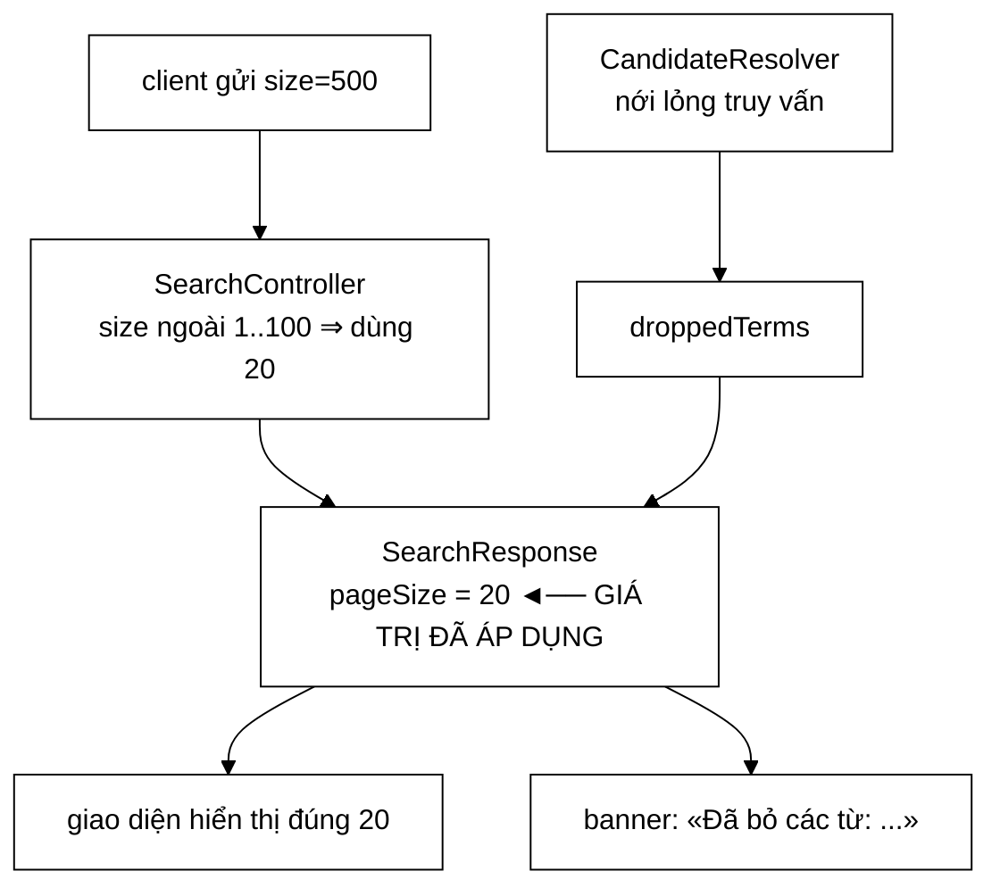

# SearchResponse — hợp đồng API nên trả về giá trị **đã được áp dụng**, không để bên gọi tự suy ra từ thứ mình vừa gửi

**File nguồn:** `search-engine/src/main/java/com/vnsearch/model/SearchResponse.java` (36 dòng)
**Gói:** `com.vnsearch.model` · **Loại:** `record` ⇒ bất biến, an toàn đa luồng
**Vị trí trong luồng:** vỏ ngoài của hợp đồng REST — toàn bộ phản hồi `GET /api/search`
**Đọc kèm:** [`SearchResult.md`](./SearchResult.md) · [`../controller/SearchController.md`](../controller/SearchController.md) · [`../query/CandidateResolver.md`](../query/CandidateResolver.md)

---

## 📌 Hiểu trong 30 giây

Bảy trường. Hai trong số đó — `pageSize` và `droppedTerms` — được **thêm vào để
sửa lỗi**, và mỗi cái ghi lại một bài học riêng.

```java
public record SearchResponse(String query, int totalResults, int page, int pageSize,
                              long timeTakenMs, List<SearchResult> results,
                              List<String> droppedTerms) {
}
```

```
   pageSize      → "hợp đồng API nên trả về GIÁ TRỊ ĐÃ ÁP DỤNG"
   droppedTerms  → "im lặng về việc bỏ term khiến người dùng kết luận sai"
```



---

## 1. `pageSize` — lỗi "thiếu một cách kín đáo"

Javadoc dòng 37–51:

> *"Trường này **từng thiếu**, và nó thiếu một cách **kín đáo**: `searchApi.ts`
> khai báo `pageSize` rồi đọc bằng `raw.pageSize ?? pageSize` — không thấy được
> trường thì **lặng lẽ thay bằng chính giá trị vừa gửi đi**. Đúng trong mọi trường
> hợp, cho tới khi máy chủ **KHÔNG dùng** giá trị client gửi: `SearchController`
> thay một `size` ngoài khoảng 1..100 bằng mặc định 20. Khi đó client hiện «20 kết
> quả mỗi trang» trong khi tin rằng nó đang xem 500 — và tính số trang sai theo."*

```
   CHUỖI SỰ KIỆN CỦA LỖI

   ① Client gửi:  GET /api/search?q=máy tính&size=500

   ② SearchController kẹp: size ngoài 1..100 ⇒ dùng 20

   ③ Server trả về 20 kết quả, KHÔNG có trường pageSize

   ④ searchApi.ts:  const pageSize = raw.pageSize ?? pageSize
                                     └─ undefined ─┘   └─ 500 ─┘
                    ⇒ pageSize = 500

   ⑤ Giao diện tính:  totalPages = Math.ceil(totalResults / 500)
                      ⇒ 4.000 kết quả ⇒ 8 trang
                      SỰ THẬT: 4.000 / 20 = 200 trang

   ⑥ Người dùng bấm "trang 9" ⇒ KHÔNG TỒN TẠI
      Và 192 trang kết quả không bao giờ xem được.
```

```
   ⭐ VÌ SAO GỌI LÀ "THIẾU MỘT CÁCH KÍN ĐÁO"

   Toán tử `??` (nullish coalescing) là một CƠ CHẾ DỰ PHÒNG.
   Nó được thiết kế để làm mã bền hơn.

   Nhưng ở đây nó BIẾN MỘT LỖI THÀNH IM LẶNG:
     - không có ngoại lệ
     - không có undefined lọt vào giao diện
     - và giá trị dự phòng TRÙNG với giá trị đúng
       trong 99 % trường hợp

   ⇒ Lỗi chỉ lộ ra ở đúng nhánh mà server ghi đè giá trị client.
   ⇒ Cơ chế phòng vệ đã CHE MẤT chính lỗi nó đáng lẽ phải báo.
```

```
   BÀI HỌC CHUNG (Javadoc dòng 49–51)

   "Hợp đồng API nên trả về GIÁ TRỊ ĐÃ ĐƯỢC ÁP DỤNG,
    không để bên gọi tự suy ra từ thứ mình vừa gửi."

   ⇒ Nguyên tắc này áp cho MỌI tham số mà server có quyền
     điều chỉnh:
       size  → kẹp về 1..100
       page  → kẹp về ≥ 0
       query → chuẩn hoá, cắt bớt
       sort  → giá trị lạ ⇒ mặc định

   ⇒ Với mỗi tham số như vậy, câu hỏi phải là:
     "Client có cách nào biết giá trị THẬT SỰ được dùng không?"
```

```
   ⚠️ ÁP DỤNG NGUYÊN TẮC NÀY, `page` CŨNG NÊN ĐƯỢC KIỂM

   SearchResponse CÓ trả `page`.
   ⇒ Tốt — nếu SearchController cũng kẹp `page`.

   Nhưng `query` thì sao? Nếu server chuẩn hoá truy vấn
   (cắt khoảng trắng thừa, giới hạn độ dài), client có
   biết truy vấn thật sự được xử lý là gì không?

   ⇒ Trường `query` CÓ trong response — nên nếu nó trả về
     giá trị ĐÃ CHUẨN HOÁ thì nguyên tắc được tuân thủ.
     Nếu nó chỉ vọng lại nguyên văn đầu vào thì không.
     Javadoc không nói rõ.
```

---

## 2. `droppedTerms` — nói ra thay vì giấu đi

Javadoc dòng 52–57:

> *"Các term hệ thống đã tự bỏ để tìm được kết quả (xem `CandidateResolver`).
> Rỗng trong trường hợp thường. **Báo ra thay vì giấu đi**: người dùng có quyền
> biết kết quả họ đang xem ứng với một truy vấn **HẸP HƠN** truy vấn họ vừa gõ —
> im lặng về chuyện đó là để họ kết luận sai rằng mọi từ khoá họ nhập đều có trong
> corpus."*

```
   TÌNH HUỐNG THẬT

   Người dùng gõ:  "máy tính khongtontai"

   CandidateResolver:
     giao rỗng ⇒ nới lỏng ⇒ bỏ "khongtontai" ⇒ có kết quả

   KHÔNG CÓ droppedTerms:
     người dùng thấy 200 kết quả về "máy tính"
     ⇒ kết luận: "à, «khongtontai» có trong corpus"
     ⇒ SAI HOÀN TOÀN

   CÓ droppedTerms = ["khongtontai"]:
     giao diện hiện: "Không tìm thấy kết quả nào chứa đủ mọi từ.
                      Đang hiển thị kết quả sau khi bỏ: khongtontai"
     ⇒ người dùng biết mình gõ sai chính tả, sửa lại
```

```
   ⭐ ĐÂY LÀ TRƯỜNG "TRUNG THỰC" — RẤT HIẾM Ở MỨC ĐỒ ÁN.

   Hệ thống ĐÃ trả lời một câu hỏi KHÁC câu hỏi được đặt ra.
   Nó có hai lựa chọn:
     ① im lặng ⇒ trông thông minh hơn, nhưng NÓI DỐI
     ② nói ra  ⇒ thừa nhận đã không tìm được kết quả đúng

   ⇒ Chọn ②, và Google cũng chọn ②
     ("Hiển thị kết quả cho ... / Tìm thay thế cho ...")

   ⇒ Cùng tinh thần với việc XOÁ tfidfScore ở SearchResult.md
     mục 2: không để người dùng kết luận sai từ dữ liệu đúng.
```

```
   ⚠️ NHƯNG TRƯỜNG NÀY CHỈ CÓ GIÁ TRỊ NẾU GIAO DIỆN DÙNG NÓ.

   Nếu searchApi.ts đọc `results` mà bỏ qua `droppedTerms`,
   thì toàn bộ công sức của CandidateResolver.relaxAndRetry
   trong việc theo dõi term bị bỏ trở thành vô ích.

   ⇒ Đây là hợp đồng HAI CHIỀU, và phía client
     không được nhắc tới trong Javadoc.
```

---

## 3. Năm trường còn lại

```
   ┌──────────────┬───────────────────────────────────────────────┐
   │ Trường       │ Vai trò                                       │
   ├──────────────┼───────────────────────────────────────────────┤
   │ query        │ vọng lại truy vấn — client đối chiếu được     │
   │ totalResults │ TỔNG số kết quả, không phải số trên trang này │
   │ page         │ trang hiện tại                                │
   │ timeTakenMs  │ thời gian xử lý — quan sát hiệu năng          │
   │ results      │ danh sách SearchResult của TRANG NÀY          │
   └──────────────┴───────────────────────────────────────────────┘
```

```
   totalResults VS results.size() — HAI SỐ KHÁC NHAU

   totalResults  = 4.000    ← tổng số tài liệu khớp
   results.size()=    20    ← số kết quả trên trang này

   ⇒ Client cần CẢ HAI:
     totalResults ⇒ tính tổng số trang
     results      ⇒ hiển thị

   ⇒ Và cùng với pageSize (mục 1), ba con số này
     đủ để tính phân trang ĐÚNG:
       totalPages = ceil(totalResults / pageSize)

   ⇒ Thiếu BẤT KỲ cái nào trong ba ⇒ phân trang sai.
     Đó chính là lý do pageSize phải có mặt.
```

```
   timeTakenMs — long, ĐO Ở ĐÂU?

   Nếu đo trong SearchEngineFacade: chỉ tính thời gian tìm kiếm
   Nếu đo trong SearchController:   tính cả tuần tự hoá JSON

   ⇒ Hai con số khác nhau đáng kể, và người đọc API
     không biết mình đang xem cái nào.
   ⇒ Không được ghi ở đâu.
```

```
   query — VỌNG LẠI NGUYÊN VĂN HAY ĐÃ CHUẨN HOÁ?

   Xem cảnh báo ở cuối mục 1. Với nguyên tắc "trả về giá trị
   đã áp dụng", nó PHẢI là bản đã chuẩn hoá.
```

---

## 4. Cùng lý do dùng `record` với `SearchResult`

Javadoc dòng 34–35: *"Cùng lý do làm `record` với `SearchResult`: bản trước là 65
dòng getter/setter không nơi nào trong mã nguồn gọi tới."*

```
   HAI LỚP, CÙNG MỘT CHẨN ĐOÁN, CÙNG MỘT CÁCH SỬA

   SearchResult   : 90 dòng → 1 dòng record
   SearchResponse : 65 dòng → 3 dòng record
   ─────────────────────────────────────────
   TỔNG: xoá 151 dòng mã chết

   ⇒ Và cả hai đều kiểm tra điều kiện "hợp đồng JSON không đổi"
     trước khi làm.
```

```
   ⚠️ MỘT KHÁC BIỆT QUAN TRỌNG VỚI record:

   results và droppedTerms là List — record KHÔNG sao chép
   phòng vệ chúng.

   new SearchResponse(..., danhSachCoTheSua, ...)
   ⇒ người gọi sửa danhSachCoTheSua SAU đó
   ⇒ SearchResponse "bất biến" bị thay đổi

   ⇒ record cho bất biến NÔNG, không phải bất biến SÂU.
   ⇒ Với vòng đời hiện tại (tạo → tuần tự hoá → bỏ)
     thì vô hại, nhưng đó là an toàn nhờ vòng đời,
     không nhờ kiểu dữ liệu.
```

---

## 5. Hướng dẫn thực hành

### 5.1 JSON sinh ra

```json
{
  "query": "máy tính khongtontai",
  "totalResults": 4000,
  "page": 0,
  "pageSize": 20,
  "timeTakenMs": 12,
  "results": [ { "title": "...", "url": "...", "snippet": "...",
                 "score": 0.2841, "pageRankScore": 0.00035,
                 "crawledAt": "2026-08-15T10:30:00Z" } ],
  "droppedTerms": ["khongtontai"]
}
```

### 5.2 Client dùng đúng cách

```typescript
const raw = await fetch(url).then(r => r.json());

// DUNG — dung gia tri MAY CHU tra ve
const totalPages = Math.ceil(raw.totalResults / raw.pageSize);

// SAI — dung gia tri MINH VUA GUI
const totalPages = Math.ceil(raw.totalResults / requestedSize);

// Hien thi canh bao noi long truy van
if (raw.droppedTerms?.length) {
  banner = `Không có kết quả chứa đủ mọi từ. Đã bỏ: ${raw.droppedTerms.join(", ")}`;
}
```

### 5.3 Cạm bẫy

```
   ① ĐỪNG dùng `?? giaTriMinhGui` làm dự phòng cho pageSize.
     Đó chính là lỗi mà trường này sinh ra để sửa.
     Nếu trường thiếu ⇒ đó là LỖI SERVER, phải báo,
     không phải che bằng giá trị dự phòng.

   ② totalResults ≠ results.size().
     Cái đầu là tổng, cái sau là số trên trang này.

   ③ droppedTerms rỗng trong trường hợp thường.
     Kiểm `.length > 0`, đừng kiểm `!= null` rồi hiện banner rỗng.

   ④ record KHÔNG sao chép phòng vệ List.
     Đừng giữ tham chiếu tới danh sách đã truyền vào.

   ⑤ page bắt đầu từ 0 hay 1? Không được ghi ở đâu.
     Client đoán sai ⇒ lệch một trang.

   ⑥ timeTakenMs đo phạm vi nào? Không được ghi ở đâu.

   ⑦ query là nguyên văn hay đã chuẩn hoá? Không được ghi ở đâu.
```

---

## 6. Độ phức tạp & chi phí

| Thao tác | Chi phí |
|---|---|
| Dựng | $O(1)$ |
| Tuần tự hoá JSON | $O(\sum \lvert results \rvert)$ |

```
   KÍCH THƯỚC PHẢN HỒI — 20 kết quả

   vỏ ngoài (query, các số)      ≈  200 B
   20 × SearchResult ≈ 856 B     ≈ 17,1 KB
   droppedTerms (thường rỗng)    ≈    2 B
   ────────────────────────────────────────
   ≈ 17,3 KB JSON

   Phần lớn là `snippet` (~440 B mỗi kết quả = 8,8 KB).

   ⇒ Muốn giảm băng thông, giảm windowSize của SnippetBuilder
     là đòn bẩy lớn nhất (xem ../ranking/SnippetBuilder.md mục 6.2).
```

---

## 7. Kiểm thử liên quan

| Test | Bảo vệ điều gì |
|---|---|
| `test/java/com/vnsearch/service/SearchEngineFacadeApiTest.java` | Hợp đồng API ở tầng dịch vụ |

```
   ⚠️ KHÔNG CÓ TEST NÀO CHO CHÍNH BÀI HỌC CỦA LỚP NÀY.

   Bài học: "trả về giá trị ĐÃ ÁP DỤNG, không phải giá trị
             client gửi"

   ⇒ Ca test cần có: gửi size = 500, khẳng định pageSize
     trả về là 20, KHÔNG phải 500.

   ⇒ Không có ca đó ⇒ nếu ai sửa SearchController thành
     `new SearchResponse(..., sizeClientGui, ...)`,
     lỗi cũ quay lại nguyên vẹn và không gì báo.
```

```
   CÒN THIẾU

   ✗ size ngoài khoảng ⇒ pageSize trả về là giá trị ĐÃ KẸP
   ✗ droppedTerms có mặt khi truy vấn bị nới lỏng
   ✗ droppedTerms RỖNG khi truy vấn khớp đầy đủ
   ✗ totalResults là TỔNG, không phải results.size()
   ✗ Tên khoá JSON không đổi (cùng vấn đề với SearchResult.md đề xuất 1)
```

```powershell
cd search-engine
.\mvnw.cmd -q -Dtest='SearchEngineFacadeApiTest' test
```

---

## 8. Liên kết

- Phần tử của `results`: [`SearchResult.md`](./SearchResult.md)
- Nơi `size` bị kẹp — nguồn của lỗi `pageSize`: [`../controller/SearchController.md`](../controller/SearchController.md)
- Nguồn `droppedTerms`: [`../query/CandidateResolver.md`](../query/CandidateResolver.md)
- Nơi phản hồi được dựng: [`../service/SearchEngineFacade.md`](../service/SearchEngineFacade.md)
- Nơi phản hồi được cache: [`../datastructure/LRUCache.md`](../datastructure/LRUCache.md)
- Đòn bẩy lớn nhất để giảm kích thước phản hồi: [`../ranking/SnippetBuilder.md`](../ranking/SnippetBuilder.md)
- Cùng tinh thần "không để người dùng kết luận sai từ dữ liệu đúng": [`SearchResult.md`](./SearchResult.md) mục 2
