```mermaid
%%{init:{'theme':'base','themeVariables':{'background':'#ffffff','primaryColor':'#ffffff','primaryTextColor':'#000000','primaryBorderColor':'#000000','lineColor':'#000000','textColor':'#000000','mainBkg':'#ffffff','nodeBorder':'#000000','clusterBkg':'#ffffff','clusterBorder':'#000000','edgeLabelBackground':'#ffffff','fontFamily':'ui-monospace, SFMono-Regular, Consolas, monospace'}}}%%
flowchart LR
    RR["ResultRanker.RankedResult"] --> SC["SearchController"]
    SC --> SR["SearchResult (record)"]
    SR --> J["Jackson → JSON"]
    J --> UI["giao diện trình duyệt"]
```

# SearchResult — báo một đại lượng hai lần dưới hai tên khác nhau là nói sai, không phải dư thông tin

**File nguồn:** `search-engine/src/main/java/com/vnsearch/model/SearchResult.java` (26 dòng)
**Gói:** `com.vnsearch.model` · **Loại:** `record` ⇒ bất biến, an toàn đa luồng
**Vị trí trong luồng:** hợp đồng REST API — một phần tử của `GET /api/search`
**Đọc kèm:** [`SearchResponse.md`](./SearchResponse.md) · [`../ranking/ResultRanker.md`](../ranking/ResultRanker.md) · [`../controller/SearchController.md`](../controller/SearchController.md)

---

## 📌 Hiểu trong 30 giây

Sáu trường, một dòng mã. Nhưng file này ghi lại **hai** quyết định: chuyển từ POJO
90 dòng sang `record`, và **xoá** một trường từng nói dối người dùng.

```java
public record SearchResult(String title, String url, String snippet,
                            double score, double pageRankScore, Instant crawledAt) {
}
```

```
   TRƯỚC: POJO 90 dòng
     - hàm dựng rỗng
     - hàm dựng đầy đủ
     - 7 getter
     - 7 setter
     - trường tfidfScore

   SAU: record 1 dòng, 6 trường
```



---

## 1. Vì sao là `record` — và lập luận đúng chỗ

Javadoc dòng 9–13:

> *"Bản trước là một POJO 90 dòng gồm constructor rỗng, constructor đầy đủ, bảy
> getter và bảy setter — trong đó **không một getter/setter nào được gọi từ mã
> nguồn**, chúng chỉ tồn tại cho Jackson, mà Jackson đọc `record` trực tiếp được
> từ 2.12. Tên khoá JSON sinh ra y hệt bản cũ nên **hợp đồng API không đổi**."*

```
   ⭐ LẬP LUẬN NÀY MẠNH VÌ NÓ DỰA TRÊN BẰNG CHỨNG,
     KHÔNG PHẢI SỞ THÍCH.

   Không nói "record hiện đại hơn nên ta dùng record".
   Mà nói: ① 14 phương thức, KHÔNG CÁI NÀO được gọi từ mã nguồn
          ② lý do duy nhất chúng tồn tại là Jackson
          ③ Jackson KHÔNG cần chúng nữa (từ 2.12)
          ④ ⇒ chúng là mã chết
          ⑤ VÀ hợp đồng API không đổi ⇒ xoá được an toàn

   ⇒ Bốn bước lập luận cho một quyết định xoá 89 dòng.
```

```
   ĐIỀU KIỆN ⑤ LÀ ĐIỀU KIỆN QUAN TRỌNG NHẤT

   record SearchResult(String title, ...)
   ⇒ Jackson sinh JSON: {"title": ..., "url": ...}

   POJO cũ với getTitle()
   ⇒ Jackson sinh JSON: {"title": ..., "url": ...}

   ⇒ GIỐNG HỆT. Client không phải sửa một dòng nào.

   ⇒ Nếu tên khoá đổi, đây sẽ là một thay đổi PHÁ VỠ,
     và 89 dòng mã chết không đáng để đánh đổi.
   ⇒ Javadoc kiểm tra điều này TRƯỚC khi quyết định — đúng thứ tự.
```

```
   LỢI ÍCH KÈM THEO CỦA record

   ① BẤT BIẾN — không có setter
     ⇒ không ai sửa được kết quả sau khi tạo
     ⇒ an toàn đa luồng miễn phí

   ② equals/hashCode/toString TỰ SINH và ĐÚNG
     ⇒ POJO cũ không có equals ⇒ so sánh trong test
       phải viết tay từng trường

   ③ Thêm/bớt trường ⇒ trình biên dịch chỉ ra MỌI nơi cần sửa
     ⇒ POJO với hàm dựng rỗng + setter thì không
```

---

## 2. Trường `tfidfScore` bị xoá — và vì sao đó là **sửa lỗi**

Javadoc dòng 15–19:

> *"Nó từng mang số điểm TF-IDF riêng, nhưng kể từ khi các tín hiệu được gom bằng
> Decorator thì nó nhận đúng **CÙNG MỘT** giá trị với `score` — giao diện trình
> duyệt in ra **cùng một con số hai lần dưới hai nhãn khác nhau**. **Báo một đại
> lượng hai lần dưới hai tên khác nhau là nói sai, không phải dư thông tin.**"*

```
   NGƯỜI DÙNG NHÌN THẤY GÌ

   ┌──────────────────────────────────────────┐
   │ Máy tính xách tay giá rẻ                 │
   │ vnexpress.net/may-tinh                   │
   │ ... giá <mark>máy tính</mark> xách tay...│
   │                                          │
   │ Điểm: 0,2841                             │
   │ TF-IDF: 0,2841        ← CÙNG MỘT SỐ      │
   │ PageRank: 0,00035                        │
   └──────────────────────────────────────────┘

   Người dùng suy ra: "điểm cuối cùng bằng đúng điểm TF-IDF,
                       vậy PageRank không đóng góp gì?"

   SỰ THẬT: điểm cuối = TF-IDF × (1+β·PR) × (1+γ·title)
            và nó KHÁC điểm TF-IDF thô.

   ⇒ Hai nhãn khiến người đọc kết luận SAI về cách hệ thống
     hoạt động — từ dữ liệu HOÀN TOÀN ĐÚNG.
```

```
   ⭐ CÂU JAVADOC ĐÁNG GHI NHỚ:

   "Báo một đại lượng hai lần dưới hai tên khác nhau
    là NÓI SAI, không phải DƯ THÔNG TIN."

   ⇒ Trực giác thông thường: "thừa thì thôi, có hại gì đâu".
   ⇒ Sự thật: dữ liệu dư TẠO RA thông tin sai,
     vì người đọc giả định hai nhãn khác nhau
     nghĩa là hai đại lượng khác nhau.
```

```
   ĐÂY LÀ CÙNG MỘT LỖI VỚI ResultRanker.RankedResult

   ../ranking/ResultRanker.md mục 2 ghi:
     "Trước đây record này có BA trường điểm... Cả ba trả về
      cùng một số... và EvaluationRunner đã THẬT SỰ nhầm."

   ⇒ CÙNG một nguyên nhân gốc: chuyển sang Decorator làm
     "điểm liên quan tách rời" KHÔNG CÒN TỒN TẠI như một
     khái niệm, nhưng các trường biểu diễn nó vẫn ở lại.

   ⇒ Lỗi lan ra HAI lớp:
     - RankedResult (nội bộ)  → EvaluationRunner đo sai
     - SearchResult (API)     → người dùng hiểu sai

   ⇒ Và cả hai được sửa cùng cách: XOÁ trường.
```

```
   BÀI HỌC TỔNG QUÁT

   Khi một KHÁI NIỆM biến mất khỏi mô hình,
   mọi TRƯỜNG biểu diễn nó phải biến mất theo.

   Giữ lại và gán "giá trị gần đúng nhất" là cách
   chắc chắn nhất để tạo ra một lỗi không ai tìm thấy —
   vì trình biên dịch không báo, test không đỏ,
   và dữ liệu vẫn "hợp lệ".
```

---

## 3. `pageRankScore` được **giữ** — vì nó thật sự khác

```java
/**
 * @param score         diem cuoi cung dung de xep hang (da gom moi tin hieu)
 * @param pageRankScore diem PageRank cua tai lieu, bao rieng de quan sat
 */
```

```
   VÌ SAO TRƯỜNG NÀY KHÔNG BỊ XOÁ CÙNG tfidfScore

   score         = 0,2841    ← điểm tổng đã gom mọi tín hiệu
   pageRankScore = 0,00035   ← đại lượng ĐỘC LẬP, giá trị KHÁC

   ⇒ Hai con số KHÁC NHAU ⇒ hai nhãn khác nhau là ĐÚNG
   ⇒ Và pageRankScore có giá trị quan sát thật:
     người vận hành thấy được trang nào uy tín cao

   ⇒ Phép thử để quyết định giữ hay xoá một trường:
     "Nó có bao giờ KHÁC giá trị của trường kia không?"
     KHÔNG ⇒ xoá
     CÓ    ⇒ giữ, và nói rõ vai trò
```

```
   ⚠️ NHƯNG VAI TRÒ CỦA NÓ RẤT DỄ BỊ HIỂU NHẦM

   Javadoc ghi: "báo riêng để quan sát"
   ⇒ Nó KHÔNG phải một thành phần cộng vào score
   ⇒ Nó đã được gộp vào score bởi PageRankBoostScorer

   Người đọc API rất dễ giả định:
     score = f(pageRankScore, ...)  và thử tự tính lại
   ⇒ Không tính lại được, vì công thức là phép NHÂN
     với giá trị đã CHUẨN HOÁ LOGARIT
     (xem ../ranking/decorator/PageRankBoostScorer.md mục 2.1)

   ⇒ Javadoc của record giải thích, nhưng tài liệu API
     (docs/api-examples.http) thì chưa chắc.
```

---

## 4. Sáu trường — mỗi trường một nguồn

```
   ┌──────────────────┬────────────────────────────────────────────┐
   │ Trường           │ Nguồn                                      │
   ├──────────────────┼────────────────────────────────────────────┤
   │ title            │ WebDocument.getTitle()                     │
   │ url              │ WebDocument.getUrl()                       │
   │ snippet          │ SnippetBuilder — HTML ĐÃ THOÁT, có <mark> │
   │ score            │ RelevanceScorer đã gom mọi tín hiệu        │
   │ pageRankScore    │ PageRankService — chỉ để quan sát          │
   │ crawledAt        │ WebDocument.getCrawledAt()                 │
   └──────────────────┴────────────────────────────────────────────┘
```

```
   ⚠️ snippet LÀ HTML, KHÔNG PHẢI VĂN BẢN THUẦN

   Nó chứa thẻ <mark> do hệ thống sinh, và nội dung tài liệu
   ĐÃ được thoát ký tự (xem ../ranking/SnippetBuilder.md mục 4).

   ⇒ Client PHẢI render bằng innerHTML, không phải textContent.
   ⇒ Ràng buộc này KHÔNG nằm trong kiểu dữ liệu:
     `String snippet` trông y hệt `String title`,
     nhưng một cái là HTML còn một cái là văn bản thuần.

   ⇒ Đây là chỗ dễ gây lỗi XSS nếu ai đó sau này
     đưa thêm một trường HTML mà quên thoát ký tự.
```

```
   crawledAt LÀ Instant, KHÔNG PHẢI String

   ⇒ Jackson tuần tự hoá thành ISO-8601: "2026-08-15T10:30:00Z"
   ⇒ Múi giờ tường minh (Z = UTC)
   ⇒ Client parse được bằng new Date(...) chuẩn

   ⇒ Dùng kiểu thời gian thật thay vì chuỗi tự định dạng
     là lựa chọn đúng — nó loại bỏ hẳn một lớp lỗi múi giờ.
```

---

## 5. Hướng dẫn thực hành

### 5.1 Dùng

```java
SearchResult kq = new SearchResult(
        doc.getTitle(),
        doc.getUrl(),
        ranked.snippet(),
        ranked.finalScore(),
        ranked.pageRankScore(),
        doc.getCrawledAt());

// Doc — dung ten TRUONG, khong co get-
String tieuDe = kq.title();
double diem   = kq.score();
```

### 5.2 JSON sinh ra

```json
{
  "title": "Máy tính xách tay giá rẻ 2026",
  "url": "https://vnexpress.net/may-tinh-xach-tay",
  "snippet": "... giá <mark>máy</mark> <mark>tính</mark> xách tay cho sinh viên ...",
  "score": 0.2841,
  "pageRankScore": 0.00035388,
  "crawledAt": "2026-08-15T10:30:00Z"
}
```

### 5.3 Cạm bẫy

```
   ① snippet là HTML. Render bằng textContent ⇒ người dùng
     thấy chữ "<mark>". Render bằng innerHTML ⇒ đúng.

   ② score KHÔNG so sánh được giữa hai truy vấn khác nhau.
     Nó không chuẩn hoá về [0,1]. Chỉ THỨ TỰ trong cùng
     một truy vấn mới có nghĩa.
     ⇒ Đừng hiển thị nó dưới dạng "độ liên quan 28 %".

   ③ pageRankScore KHÔNG cộng vào score.
     Nó đã được gộp bằng phép NHÂN có chuẩn hoá logarit.
     Không tự tính lại được từ hai con số này.

   ④ record KHÔNG kiểm tra null.
     new SearchResult(null, null, null, 0, 0, null) hợp lệ.
     Jackson sẽ sinh {"title": null, ...}.

   ⑤ Thêm một trường vào record là thay đổi hợp đồng API.
     Thêm thì tương thích ngược (client cũ bỏ qua),
     XOÁ hoặc ĐỔI TÊN thì không.

   ⑥ crawledAt có thể null (WebDocument không đảm bảo).
     JSON sẽ có "crawledAt": null.
```

---

## 6. Độ phức tạp & chi phí

| Thao tác | Chi phí |
|---|---|
| Dựng | $O(1)$ |
| Mọi accessor | $O(1)$ |
| `equals`/`hashCode` | $O(1)$ — sáu trường |
| Tuần tự hoá JSON | $O(\lvert snippet \rvert)$ — `snippet` chi phối |

```
   BỘ NHỚ MỘT SearchResult

   header + 6 trường        ≈  56 B
   title  ~60 ký tự         ≈ 160 B
   url    ~80 ký tự         ≈ 200 B
   snippet ~200 ký tự       ≈ 440 B   ← CHI PHỐI
   ────────────────────────────────────
   ≈ 856 B

   Một trang 20 kết quả ≈ 17 KB
   ⇒ Không đáng lo. Đây là đối tượng sống rất ngắn:
     tạo ra, tuần tự hoá thành JSON, rồi bỏ.
```

```
   SO SÁNH VỚI POJO CŨ

   Cùng dữ liệu, nhưng POJO cũ có THÊM trường tfidfScore (8 B)
   ⇒ 20 kết quả × 8 B = 160 B

   ⇒ Lợi ích bộ nhớ của việc xoá trường là KHÔNG ĐÁNG KỂ.
   ⇒ Lý do xoá nó hoàn toàn là về TÍNH ĐÚNG ĐẮN, không phải
     hiệu năng. Javadoc nói đúng điều đó.
```

---

## 7. Kiểm thử liên quan

```
   ⚠️ KHÔNG CÓ FILE TEST NÀO CHO LỚP NÀY.

   Nó được phủ gián tiếp qua:
     - SearchEngineFacadeApiTest (hợp đồng API)
     - ResultRankerTest          (nguồn dữ liệu)
```

```
   VỚI MỘT record 6 TRƯỜNG KHÔNG CÓ LOGIC,
   VIỆC THIẾU TEST ĐƠN VỊ LÀ HỢP LÝ.

   Nhưng có MỘT thứ đáng test, và nó không phải về record:

   ✗ TÊN KHOÁ JSON không đổi so với bản POJO cũ.
     Đây là điều kiện ⑤ ở mục 1 — điều kiện quan trọng nhất
     cho phép chuyển đổi diễn ra an toàn.
     Nếu một trường được đổi tên trong lần refactor sau,
     client sẽ vỡ mà không test nào đỏ.
```

Xem đề xuất 1.

---

## 8. Liên kết

- Vỏ bọc chứa danh sách kết quả: [`SearchResponse.md`](./SearchResponse.md)
- Nguồn dữ liệu, và cùng lỗi "ba tên một đại lượng": [`../ranking/ResultRanker.md`](../ranking/ResultRanker.md)
- Nguồn `snippet` và ràng buộc HTML: [`../ranking/SnippetBuilder.md`](../ranking/SnippetBuilder.md)
- Nguồn `score` — vì sao không so sánh được giữa các truy vấn: [`../ranking/BM25Scorer.md`](../ranking/BM25Scorer.md) · [`../ranking/TfIdfScorer.md`](../ranking/TfIdfScorer.md)
- Nguồn `pageRankScore` và cách nó thực sự được dùng: [`../ranking/PageRankService.md`](../ranking/PageRankService.md) · [`../ranking/decorator/PageRankBoostScorer.md`](../ranking/decorator/PageRankBoostScorer.md)
- Nguồn `title`, `url`, `crawledAt`: [`WebDocument.md`](./WebDocument.md)
- Nơi hợp đồng API được phục vụ: [`../controller/SearchController.md`](../controller/SearchController.md) · [`../service/SearchEngineFacade.md`](../service/SearchEngineFacade.md)
