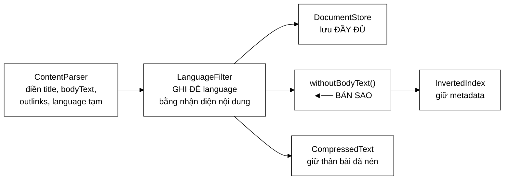

# WebDocument — bản sao thay vì gán `null` tại chỗ, vì sửa đối tượng của người gọi là tác dụng phụ từ xa

**File nguồn:** `search-engine/src/main/java/com/vnsearch/model/WebDocument.java` (139 dòng)
**Gói:** `com.vnsearch.model` · **Loại:** POJO thuần (**không** dùng Lombok), có thể thay đổi ⇒ **không** an toàn đa luồng
**Vị trí trong luồng:** đơn vị dữ liệu đi xuyên toàn hệ thống — crawler sinh ra, chỉ mục và kho tài liệu tiêu thụ
**Đọc kèm:** [`../crawler/ContentParser.md`](../crawler/ContentParser.md) · [`../index/CompressedText.md`](../index/CompressedText.md) · [`../storage/DocumentStore.md`](../storage/DocumentStore.md)

---

## 📌 Hiểu trong 30 giây

Bảy trường mô tả một trang web đã crawl. Nhưng file này có **hai** quyết định
thiết kế đáng nói, và cả hai đều được ghi lại rõ ràng.

```
   docId            int      — khoá trong chỉ mục
   url              String   — khoá trong đồ thị PageRank
   title            String   — tín hiệu xếp hạng mạnh nhất
   metaDescription  String
   bodyText         String   — bị BỎ khi vào chỉ mục (lưu nén riêng)
   outlinks         List     — đầu vào của PageRank
   crawledAt        Instant
   language         String   — "vi" / "en" / "und"
```



---

## 1. `withoutBodyText()` — vì sao là **bản sao**

```java
public WebDocument withoutBodyText() {
    WebDocument copy = new WebDocument(docId, url, title, metaDescription, null,
            outlinks, crawledAt);
    copy.setLanguage(language);
    return copy;
}
```

Javadoc dòng 120–125:

> *"**Vì sao là BẢN SAO chứ không phải gán `bodyText = null` tại chỗ.** Danh sách
> tài liệu đi vào chỉ mục thuộc về **NGƯỜI GỌI**, và người gọi còn dùng nó sau đó
> — `MultiDomainCrawlRunner` ghi corpus ra tệp, `EvaluationRunner` sinh truy vấn
> từ thân bài. Sửa đối tượng của họ là một **tác dụng phụ từ xa**: nó sẽ làm mất
> dữ liệu ở một nơi hoàn toàn khác, và không ai đọc mã ở đây đoán được điều đó."*

```
   ⭐ "TÁC DỤNG PHỤ TỪ XA" LÀ TÊN GỌI CHÍNH XÁC CHO LỚP LỖI NÀY.

   KỊCH BẢN NẾU GÁN NULL TẠI CHỖ:

   List<WebDocument> docs = crawler.crawl();

   indexBuilder.build(docs);          // ← BÊN TRONG gán bodyText = null
   runner.ghiCorpusRaTep(docs);       // ← thân bài đã BIẾN MẤT
   evaluator.sinhTruyVan(docs);       // ← không còn gì để sinh truy vấn

   ⇒ Lỗi biểu hiện ở dòng 2 và 3
   ⇒ Nguyên nhân nằm sâu trong dòng 1
   ⇒ Không có gì trong chữ ký `build(List<WebDocument>)`
     gợi ý rằng nó SỬA đối số

   ⇒ Và tệ nhất: corpus ghi ra tệp bị RỖNG THÂN BÀI,
     nhưng chương trình chạy không lỗi. Chỉ phát hiện được
     khi mở tệp ra xem.
```

```
   CHI PHÍ CỦA BẢN SAO — RẤT NHỎ

   Một WebDocument mới: 16 B header + 7 trường ≈ 64 B
   Các trường String/List được CHIA SẺ (chỉ sao chép tham chiếu)
   ⇒ 5.011 tài liệu × 64 B ≈ 320 KB

   ⇒ Đổi 320 KB lấy việc loại bỏ hẳn một lớp lỗi.
```

```
   ⚠️ NHƯNG ĐÂY LÀ SAO CHÉP NÔNG (shallow copy).

   copy.outlinks TRỎ VÀO CÙNG danh sách với bản gốc.

   ⇒ Sửa copy.getOutlinks().add(...) VẪN sửa bản gốc.
   ⇒ Bản sao chỉ bảo vệ trường bodyText, không bảo vệ outlinks.

   Với cách dùng hiện tại (không ai sửa outlinks sau khi crawl)
   thì an toàn — nhưng đó là an toàn nhờ quy ước, không nhờ
   cấu trúc. Xem đề xuất 2.
```

### 1.1 Vì sao thân bài bị bỏ khỏi chỉ mục

Javadoc dòng 115–118:

> *"Chỉ mục cần mọi trường khác (`url`, `title`, `outlinks` cho PageRank) nhưng
> không cần giữ văn bản đầy đủ — phần đó được lưu riêng ở dạng **đã nén** (xem
> `CompressedText`)."*

```
   PHÉP TÍNH

   5.011 tài liệu × ~1.043 từ × ~6 ký tự = ~31 triệu ký tự
   Java String: 2 byte/ký tự (hoặc 1 với nén chuỗi từ Java 9)
   ⇒ ~31–62 MB thân bài trong bộ nhớ

   Giữ trong chỉ mục:  ~62 MB
   Nén riêng:          ~15 MB (xem ../index/CompressedText.md)

   ⇒ Và chỉ giải nén khi THỰC SỰ cần — tức chỉ cho
     top-K kết quả (xem ../ranking/ResultRanker.md mục 5.1).
```

---

## 2. Trường `language` — hai lần ghi, hai nguồn tin cậy khác nhau

```java
/**
 * Mã ngôn ngữ: "vi", "en", hoặc "und" khi trang quá ngắn để kết luận.
 * Do ContentParser điền tạm giá trị khai báo trong <html lang>, rồi
 * LanguageFilter GHI ĐÈ bằng kết quả nhận diện theo NỘI DUNG —
 * thứ đáng tin hơn nhiều.
 */
private String language = "";
```

```
   HAI NGUỒN, HAI ĐỘ TIN CẬY

   ① <html lang="vi">     — TÁC GIẢ KHAI BÁO
      ⇒ nhanh, miễn phí
      ⇒ nhưng thường SAI: bản mẫu website đặt lang="en"
        cho toàn site, nội dung lại tiếng Việt

   ② Nhận diện theo NỘI DUNG (LanguageFilter)
      ⇒ đắt hơn (phải phân tích văn bản)
      ⇒ nhưng ĐÁNG TIN

   ⇒ Điền tạm bằng ① rồi GHI ĐÈ bằng ② là thứ tự đúng:
     ② luôn thắng, còn ① là giá trị dự phòng nếu ② không chạy.
```

```
   VÌ SAO GIỮ LẠI TRONG CORPUS THAY VÌ VỨT SAU KHI LỌC

   Javadoc dòng 28–30: "khâu đánh chỉ mục cần biết để chọn
   bộ tách từ đúng cho tiếng Anh và tiếng Việt, và giao diện
   có thể lọc kết quả theo ngôn ngữ."

   ⇒ Ngôn ngữ KHÔNG chỉ là tiêu chí lọc lúc crawl.
     Nó là siêu dữ liệu có ích ở hai khâu sau nữa.
   ⇒ Đây là lý do nó là TRƯỜNG của WebDocument
     chứ không phải biến cục bộ trong LanguageFilter.
```

```
   "und" — MÃ NGÔN NGỮ CHUẨN ISO 639-2 CHO "UNDETERMINED"

   Không phải "" (rỗng), không phải null, không phải "unknown".
   ⇒ Dùng mã chuẩn nghĩa là dữ liệu này trao đổi được
     với hệ thống khác mà không cần giải thích.
```

### 2.1 `setLanguage` chuẩn hoá `null` thành `""`

```java
public void setLanguage(String language) {
    this.language = language == null ? "" : language;
}
```

```
   ⇒ Sau khi dựng, language KHÔNG BAO GIỜ null.
   ⇒ Người gọi không phải kiểm null trước mỗi lần dùng.

   ⚠️ NHƯNG chỉ MỘT setter làm điều này.
     setUrl, setTitle, setBodyText đều nhận null tự nhiên.

   ⇒ Không nhất quán: một trường được bảo vệ, sáu trường không.
   ⇒ Và withoutBodyText() cố ý truyền null cho bodyText,
     nên bodyText BẮT BUỘC phải nhận null được.

   ⇒ Sự thiếu nhất quán này có lý do, nhưng lý do đó
     không được ghi ở đâu.
```

---

## 3. POJO thuần, không Lombok — lựa chọn có chủ đích

Javadoc dòng 8–9: *"Đây là POJO thuần (không dùng Lombok) để mọi trường đều hiện
rõ trong báo cáo."*

```
   LÝ DO SƯ PHẠM, VÀ NÓ HỢP LỆ

   @Data
   public class WebDocument { ... }        ← 10 dòng

   vs 139 dòng getter/setter tường minh

   ⇒ Với một đồ án cần trình bày mã trong báo cáo,
     Lombok làm biến mất chính thứ cần cho thấy.
   ⇒ Và nó thêm một phụ thuộc + một plugin IDE
     cho lợi ích thuần tuý là gõ ít hơn.
```

```
   ⚠️ NHƯNG SO SÁNH VỚI SearchResult / SearchResponse

   Hai lớp đó ĐÃ chuyển sang `record` (xem SearchResult.md),
   với lý do: "không một getter/setter nào được gọi từ mã nguồn".

   WebDocument thì KHÁC: nó BẮT BUỘC phải thay đổi được,
   vì ContentParser điền dần từng trường, rồi LanguageFilter
   ghi đè language.

   ⇒ Lựa chọn khác nhau cho hai lớp, và cả hai đều đúng
     vì hai lớp có vòng đời khác nhau.
   ⇒ Đáng tiếc là Javadoc chỉ nêu lý do sư phạm,
     không nêu lý do KỸ THUẬT này — vốn mạnh hơn.
```

---

## 4. Hàm dựng đầy đủ — một lá chắn `null`

```java
public WebDocument(int docId, String url, String title, String metaDescription,
                    String bodyText, List<String> outlinks, Instant crawledAt) {
    ...
    this.outlinks = outlinks != null ? outlinks : new ArrayList<>();
    ...
}
```

```
   VÌ SAO CHỈ outlinks ĐƯỢC BẢO VỆ

   outlinks được duyệt bằng for-each ở nhiều nơi:
     - PageRankService.computePageRank
     - LinkExtractor
     - toString() ngay trong lớp này (outlinks.size())

   ⇒ null ⇒ NullPointerException ở XA nơi gây lỗi

   Còn url/title/bodyText: người gọi vốn phải kiểm null
   trước khi dùng chuỗi.

   ⇒ Lựa chọn hợp lý: bảo vệ cái được duyệt vô điều kiện.
```

```
   ⚠️ NHƯNG setOutlinks KHÔNG có lá chắn tương ứng:

   public void setOutlinks(List<String> outlinks) {
       this.outlinks = outlinks;              ← nhận null tự nhiên
   }

   ⇒ new WebDocument(...) an toàn
   ⇒ doc.setOutlinks(null) thì KHÔNG
   ⇒ Hai đường vào cùng một trường, hai mức bảo vệ khác nhau.

   Và toString() gọi outlinks.size() vô điều kiện
   ⇒ setOutlinks(null) rồi log tài liệu ⇒ NullPointerException
     trong chính câu lệnh ghi log.
```

---

## 5. Hướng dẫn thực hành

### 5.1 Dùng

```java
// Crawler dung dan tung truong
WebDocument doc = new WebDocument();
doc.setDocId(id);
doc.setUrl(url);
doc.setTitle(title);
doc.setBodyText(bodyText);
doc.setOutlinks(outlinks);
doc.setLanguage("vi");

// Dua vao chi muc — KHONG mang theo than bai
index.addDocument(doc.withoutBodyText());

// Nhung van luu ban DAY DU vao kho
documentStore.save(doc);
```

### 5.2 Cạm bẫy

```
   ① withoutBodyText() là SAO CHÉP NÔNG.
     outlinks vẫn dùng chung với bản gốc.

   ② setOutlinks(null) hợp lệ về mã nhưng làm toString() nổ.

   ③ language mặc định là "" (không phải null, không phải "und").
     Ba giá trị "chưa biết" khác nhau: "", "und", null.
     Chỉ "und" có nghĩa chuẩn.

   ④ Lớp CÓ THỂ THAY ĐỔI và KHÔNG an toàn đa luồng.
     Crawler nhiều luồng phải đảm bảo mỗi WebDocument
     chỉ được một luồng chạm vào cho tới khi hoàn tất.

   ⑤ Không có equals/hashCode.
     ⇒ Hai WebDocument cùng docId là HAI đối tượng khác nhau
       với HashSet/HashMap.
     ⇒ Dùng docId hoặc url làm khoá, đừng dùng chính đối tượng.

   ⑥ bodyText có thể null (sau withoutBodyText).
     Mọi nơi đọc getBodyText() phải kiểm null —
     và không có gì trong kiểu dữ liệu cảnh báo điều đó.

   ⑦ crawledAt có thể null (hàm dựng rỗng không đặt).
```

---

## 6. Độ phức tạp & chi phí

| Thao tác | Chi phí |
|---|---|
| Mọi getter/setter | $O(1)$ |
| `withoutBodyText()` | $O(1)$ — sao chép nông |
| `toString()` | $O(1)$ — chỉ đọc `outlinks.size()` |

```
   BỘ NHỚ MỘT WebDocument (corpus thật)

   header + 7 trường tham chiếu     ≈  72 B
   url    ~80 ký tự                 ≈ 200 B
   title  ~60 ký tự                 ≈ 160 B
   metaDescription ~150 ký tự       ≈ 340 B
   bodyText ~6.000 ký tự            ≈ 6,1 KB   ← CHI PHỐI
   outlinks ~48 URL × 200 B         ≈ 9,6 KB   ← CHI PHỐI
   ─────────────────────────────────────────────
   ≈ 16,5 KB/tài liệu

   5.011 tài liệu ≈ 83 MB nếu giữ TẤT CẢ trong bộ nhớ

   Sau withoutBodyText(): ~10,4 KB ⇒ 52 MB
   ⇒ Tiết kiệm 31 MB, và đó chính là lý do phương thức này tồn tại.
```

```
   ⚠️ outlinks CHIẾM NHIỀU HƠN CẢ bodyText

   9,6 KB vs 6,1 KB

   Và outlinks CHỈ cần cho PageRank — chạy MỘT LẦN sau crawl.
   Sau đó nó vô dụng, nhưng vẫn nằm trong chỉ mục mãi mãi.

   ⇒ withoutBodyText() bỏ thân bài nhưng GIỮ outlinks.
   ⇒ Một withoutOutlinks() sẽ tiết kiệm nhiều hơn.
     Xem đề xuất 3.
```

---

## 7. Kiểm thử liên quan

```
   ⚠️ KHÔNG CÓ FILE TEST NÀO CHO LỚP NÀY.

   Nó được phủ GIÁN TIẾP qua gần như mọi test khác
   (mọi test dựng WebDocument làm dữ liệu mẫu).
```

```
   NHỮNG THỨ KHÔNG ĐƯỢC CANH GIỮ

   ① withoutBodyText() KHÔNG SỬA bản gốc.
     Đây là toàn bộ lý do phương thức tồn tại,
     và Javadoc dành 6 dòng giải thích.
     Một lần "tối ưu" đổi nó thành `this.bodyText = null; return this;`
     sẽ gây mất dữ liệu ở MultiDomainCrawlRunner và EvaluationRunner
     — mà MỌI test hiện có vẫn xanh.

   ② withoutBodyText() giữ NGUYÊN mọi trường khác,
     kể cả language (được sao bằng setter riêng, dễ quên).

   ③ setLanguage(null) → ""

   ④ Hàm dựng với outlinks = null → danh sách rỗng

   ⑤ toString() không nổ với outlinks rỗng

   ⇒ Năm tính chất, không một test nào.
     Và ① là tính chất mà cả lớp xoay quanh.
```

Xem đề xuất 1.

---

## 8. Chấm theo chuẩn doanh nghiệp

| Tiêu chí | Điểm | Nhận xét |
|---|---|---|
| **Nhận diện "tác dụng phụ từ xa"** | 10/10 | Gọi đúng tên lớp lỗi, và **chỉ đích danh hai người gọi** sẽ mất dữ liệu — không phải rủi ro giả định |
| **Ghi lại lý do của một quyết định trông tầm thường** | 10/10 | "Sao chép thay vì gán null" là một dòng mã, nhưng lý do dài 6 dòng và xứng đáng |
| Ghi lại vòng đời của `language` | 10/10 | Hai nguồn, hai độ tin cậy, và vì sao giữ lại thay vì vứt sau khi lọc |
| Dùng mã chuẩn ISO cho "chưa xác định" | 9/10 | `"und"` trao đổi được với hệ thống khác |
| Lá chắn `null` cho `outlinks` ở hàm dựng | 8/10 | Bảo vệ đúng trường được duyệt vô điều kiện |
| Lý do không dùng Lombok | 7/10 | Hợp lệ về sư phạm, nhưng bỏ qua lý do **kỹ thuật** mạnh hơn (lớp bắt buộc phải thay đổi được) |
| **Kiểm thử** | **0/10** | **Không một test nào**, kể cả cho bất biến trung tâm "`withoutBodyText` không sửa bản gốc" |
| **Sao chép nông** | **4/10** | `outlinks` vẫn dùng chung ⇒ bản sao chỉ bảo vệ **một** trong bảy trường |
| Nhất quán lá chắn `null` | 4/10 | Hàm dựng bảo vệ `outlinks`, `setOutlinks` thì không; `setLanguage` bảo vệ, các setter khác không |
| `equals`/`hashCode` | 4/10 | Không có ⇒ không dùng làm khoá tập hợp được, và không có gì cảnh báo |
| Giữ `outlinks` sau khi PageRank xong | 4/10 | Chiếm nhiều bộ nhớ hơn cả `bodyText`, nhưng chỉ cần dùng **một lần** |
| Ba giá trị "chưa biết" của `language` | 5/10 | `""`, `"und"`, `null` — chỉ một cái có nghĩa chuẩn |

**Ba đề xuất nâng lên mức sản phẩm:**

1. **Viết test cho bất biến trung tâm — `withoutBodyText()` không được sửa bản
   gốc.** Javadoc dành sáu dòng giải thích vì sao đây là bản sao, nêu đích danh
   hai lớp sẽ mất dữ liệu nếu làm sai — nhưng không có gì ngăn ai đó "tối ưu" nó
   thành `this.bodyText = null; return this;`. Thay đổi đó tiết kiệm 320 KB, trông
   hoàn toàn hợp lý, và **mọi test hiện có vẫn xanh** trong khi corpus ghi ra tệp
   bị rỗng thân bài:
   ```java
   class WebDocumentTest {
       @Test
       @DisplayName("withoutBodyText KHÔNG được sửa đối tượng gốc")
       void banSaoKhongSuaBanGoc() {
           WebDocument goc = new WebDocument(1, "http://x.vn", "Tiêu đề", "mô tả",
                   "thân bài đầy đủ", new ArrayList<>(List.of("http://y.vn")), Instant.now());
           goc.setLanguage("vi");

           WebDocument banSao = goc.withoutBodyText();

           assertNull(banSao.getBodyText());
           assertEquals("thân bài đầy đủ", goc.getBodyText(), "BẢN GỐC phải còn nguyên thân bài");
           assertEquals("vi", banSao.getLanguage(), "language dễ bị quên vì sao bằng setter riêng");
           assertEquals(goc.getTitle(), banSao.getTitle());
           assertEquals(goc.getOutlinks(), banSao.getOutlinks());
       }
   }
   ```
   Phép khẳng định về `language` đáng giá riêng: nó là trường duy nhất **không**
   đi qua hàm dựng, nên là trường dễ bị quên nhất khi ai đó thêm trường mới.

2. **Làm rõ mức độ của bản sao, hoặc sao chép sâu `outlinks`.** Hiện `copy` dùng
   **chung** danh sách `outlinks` với bản gốc, nên `banSao.getOutlinks().add(...)`
   vẫn sửa bản gốc — tức chính lớp lỗi mà phương thức này sinh ra để tránh, chỉ
   dịch sang một trường khác. Rẻ nhất là làm danh sách bất biến ngay khi sao:
   ```java
   public WebDocument withoutBodyText() {
       WebDocument copy = new WebDocument(docId, url, title, metaDescription, null,
               List.copyOf(outlinks), crawledAt);
       copy.setLanguage(language);
       return copy;
   }
   ```
   `List.copyOf` vừa cắt liên kết với bản gốc vừa làm mọi ý định sửa đổi **thất
   bại ngay** thay vì âm thầm lan sang nơi khác. Chi phí: 5.011 × 48 tham chiếu
   ≈ 1,9 MB — đáng, vì đây là đường đi một chiều vào chỉ mục.

3. **Thêm `withoutOutlinks()` — `outlinks` tốn bộ nhớ hơn cả `bodyText`.** Mục 6
   cho thấy `outlinks` chiếm ~9,6 KB/tài liệu so với ~6,1 KB của `bodyText`, nhưng
   nó chỉ được dùng **một lần** bởi [`PageRankService`](../ranking/PageRankService.md)
   sau khi crawl xong; sau đó nó nằm lại trong chỉ mục vĩnh viễn mà không ai đọc:
   ```java
   /**
    * Ban sao khong kem {@code outlinks}. Dung sau khi PageRank da tinh xong:
    * do thi lien ket khong con can thiet o khau phuc vu truy van, va no chiem
    * ~9,6 KB moi tai lieu — nhieu hon ca than bai.
    */
   public WebDocument withoutLinkGraph() { ... }
   ```
   Với 5.011 tài liệu, đó là 48 MB — nhiều hơn cả phần
   [`CompressedText`](../index/CompressedText.md) tiết kiệm được. Và nó ăn khớp tự
   nhiên với đề xuất tách `LinkGraph` ở
   [`../ranking/PageRankService.md`](../ranking/PageRankService.md) đề xuất 3: khi
   PageRank chỉ nhận đồ thị liên kết thay vì cả corpus, `outlinks` không còn lý do
   nào để sống trong chỉ mục.

---

## 9. Liên kết

- Nơi các trường được điền: [`../crawler/ContentParser.md`](../crawler/ContentParser.md) · [`../crawler/LinkExtractor.md`](../crawler/LinkExtractor.md)
- Nơi `language` bị ghi đè bằng nhận diện nội dung: [`../crawler/LanguageFilter.md`](../crawler/LanguageFilter.md) · [`../service/LanguageDetector.md`](../service/LanguageDetector.md)
- Nơi thân bài được lưu riêng ở dạng nén: [`../index/CompressedText.md`](../index/CompressedText.md)
- Nơi bản rút gọn đi vào: [`../index/InvertedIndex.md`](../index/InvertedIndex.md) · [`../service/IndexBuilder.md`](../service/IndexBuilder.md)
- Nơi bản đầy đủ được lưu: [`../storage/DocumentStore.md`](../storage/DocumentStore.md) · [`../storage/JsonDocumentStore.md`](../storage/JsonDocumentStore.md)
- Hai người gọi sẽ mất dữ liệu nếu sửa tại chỗ: [`../crawler/MultiDomainCrawlRunner.md`](../crawler/MultiDomainCrawlRunner.md) · [`../eval/EvaluationRunner.md`](../eval/EvaluationRunner.md)
- Người tiêu thụ `outlinks`: [`../ranking/PageRankService.md`](../ranking/PageRankService.md)
- Hai lớp cùng gói đã chuyển sang `record`: [`SearchResult.md`](./SearchResult.md) · [`SearchResponse.md`](./SearchResponse.md)
