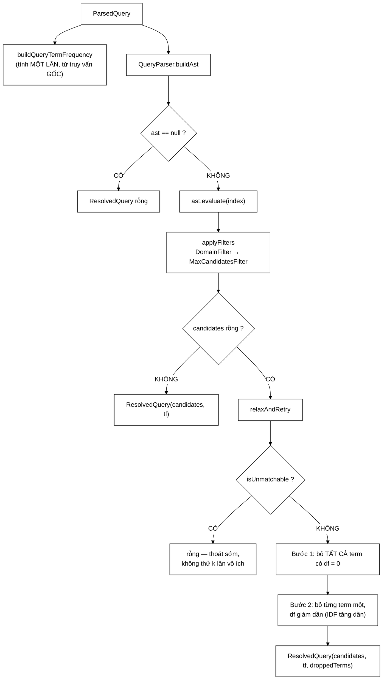
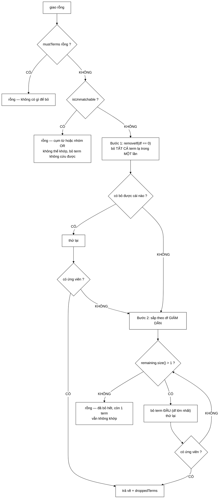

# CandidateResolver — nơi hai mẫu thiết kế gặp nhau, và nơi "không có kết quả" được cứu

**File nguồn:** `search-engine/src/main/java/com/vnsearch/query/CandidateResolver.java` (282 dòng)
**Gói:** `com.vnsearch.query` · **Loại:** lớp `final`, hàm dựng `private`, toàn bộ API là `static` ⇒ lớp tiện ích không trạng thái, an toàn đa luồng
**Vị trí trong luồng:** cầu nối giữa **phân tích truy vấn** ([`QueryParser`](./QueryParser.md)) và **chấm điểm** ([`../ranking/ResultRanker.md`](../ranking/ResultRanker.md))
**Đọc kèm:** [`QueryParser.md`](./QueryParser.md) · [`ast/QueryNode.md`](./ast/QueryNode.md) · [`filter/CandidateFilter.md`](./filter/CandidateFilter.md)

---

## 📌 Hiểu trong 30 giây

Lớp này trả lời đúng một câu hỏi: **"những tài liệu nào đáng được chấm điểm?"**
Nó làm việc đó qua hai giai đoạn tách bạch, và nếu giai đoạn một trả về rỗng thì
có một giai đoạn ba mà hầu hết máy tìm kiếm sinh viên không có — **nới lỏng truy
vấn**.

```
   ParsedQuery  ──①──▶  cây biểu thức (Composite)  ──▶  posting list
                            AND / OR / NOT / cụm từ

                ──②──▶  đường ống lọc (Chain of Responsibility)
                            DomainFilter → MaxCandidatesFilter

                ──③──▶  RỖNG?  ⇒  bỏ dần term ít thông tin, thử lại
                                   (relaxAndRetry)
```



---

## 1. Ranh giới giữa hai mẫu thiết kế — và vì sao nó không tuỳ tiện

Javadoc dòng 18–28 đặt ra một quy tắc phân loại rất gọn:

> *"Ranh giới này không tuỳ tiện: một ràng buộc **có posting list** thì thuộc về
> cây; một ràng buộc **trên siêu dữ liệu của tài liệu** thì thuộc về đường ống
> lọc."*

```
   ┌──────────────────────────────────────────────────────────────┐
   │  COMPOSITE — com.vnsearch.query.ast                          │
   │                                                              │
   │  Câu hỏi: "term này xuất hiện ở những tài liệu nào?"          │
   │  Dữ liệu: posting list, đã sắp xếp theo docId                 │
   │  Phép toán: giao (AND), hợp (OR), hiệu (NOT), kề nhau (cụm)   │
   │  Chi phí: O(tổng độ dài posting list)                         │
   │                                                              │
   │  ⇒ AndNode, OrNode, NotNode, TermNode, PhraseNode            │
   └──────────────────────────────────────────────────────────────┘
                                │
                                ▼  List<Integer> tăng dần
   ┌──────────────────────────────────────────────────────────────┐
   │  CHAIN OF RESPONSIBILITY — com.vnsearch.query.filter          │
   │                                                              │
   │  Câu hỏi: "trong số này, cái nào thoả ràng buộc NGOÀI chỉ mục?"│
   │  Dữ liệu: siêu dữ liệu tài liệu (URL, domain), chính sách hệ  │
   │  Phép toán: lọc tuyến tính, cắt ngưỡng                        │
   │  Chi phí: O(n) trên số ứng viên                               │
   │                                                              │
   │  ⇒ DomainFilter, MaxCandidatesFilter                          │
   └──────────────────────────────────────────────────────────────┘
```

**Vì sao `site:vnexpress.net` không nằm trong cây?** Vì không có posting list nào
tên `site:vnexpress.net`. Muốn nhét nó vào cây, phải dựng một chỉ mục phụ ánh xạ
domain → danh sách docId. Điều đó **làm được** (và là cách các máy tìm kiếm sản
phẩm thực sự làm), nhưng nó biến một ràng buộc chính sách thành một cấu trúc dữ
liệu phải duy trì đồng bộ. Xem đề xuất 2 ở mục 9.

```
   PHÉP THỬ ĐỂ PHÂN LOẠI MỘT RÀNG BUỘC MỚI

   "Nếu tôi phải trả lời ràng buộc này cho MỘT tài liệu bất kỳ,
    tôi có tra được trong InvertedIndex không?"

   CÓ   ⇒ Composite (thêm một QueryNode)
   KHÔNG ⇒ Chain of Responsibility (thêm một CandidateFilter)

   Ví dụ:
     "term xuất hiện"        → CÓ    → TermNode
     "hai term kề nhau"      → CÓ    → PhraseNode (dùng vị trí)
     "domain = vnexpress.net"→ KHÔNG → DomainFilter
     "ngôn ngữ = tiếng Việt" → KHÔNG → filter mới
     "crawl sau 2026-01-01"  → KHÔNG → filter mới
     "PageRank > 0,001"      → KHÔNG → filter mới
```

---

## 2. Vì sao lớp này tồn tại: hai bản sao chắc chắn sẽ trôi lệch

Javadoc dòng 30–35 ghi lại một bài học thực tế đáng giá hơn cả phần kỹ thuật:

> *"Logic này trước đây nằm trong `SearchEngineFacade` dưới dạng phương thức
> `private`, nên bộ đánh giá chất lượng **không gọi lại được** và buộc phải viết
> lại một bản sao. Hai bản sao chắc chắn sẽ trôi lệch nhau theo thời gian, và khi
> đó **MỌI con số** trong báo cáo đánh giá đều mất giá trị vì chúng đo một đường
> đi khác với đường đi mà hệ thống thực sự phục vụ người dùng."*

```
   TRƯỚC KHI TÁCH LỚP

   SearchEngineFacade
     └─ private resolveCandidates(...)   ← đường đi THẬT
                                            người dùng đi qua đây

   EvaluationHarness
     └─ private buildCandidates(...)     ← BẢN SAO
                                            báo cáo đo đường này

   ⇒ Sửa một bên, quên bên kia
   ⇒ Báo cáo "P@10 = 0,72" đo một hệ thống KHÔNG TỒN TẠI
   ⇒ Không ai phát hiện, vì cả hai đều "chạy đúng"
```

```
   SAU KHI TÁCH LỚP

   SearchEngineFacade ──┐
                        ├──▶ CandidateResolver.resolve(index, parsed)
   EvaluationHarness  ──┘

   ⇒ Một đường đi duy nhất
   ⇒ Con số trong báo cáo đo đúng thứ người dùng nhận
```

Đây là dạng lỗi tệ nhất trong một đồ án: **không phải lỗi làm chương trình sai,
mà là lỗi làm bằng chứng về chương trình sai.** Xem
[`../eval/EvaluationHarness.md`](../eval/EvaluationHarness.md) để thấy phía bên
kia của cây cầu này.

---

## 3. `ResolvedQuery` — vì sao trả về ba thứ chứ không phải một

```java
public record ResolvedQuery(List<Integer> candidateDocIds,
                            Map<String, Integer> queryTermFrequency,
                            List<String> droppedTerms) {

    public ResolvedQuery(List<Integer> candidateDocIds, Map<String, Integer> queryTermFrequency) {
        this(candidateDocIds, queryTermFrequency, List.of());
    }

    public boolean wasRelaxed() {
        return !droppedTerms.isEmpty();
    }
}
```

| Trường | Vì sao nằm ở đây |
|---|---|
| `candidateDocIds` | Kết quả chính — danh sách docId, luôn tăng dần |
| `queryTermFrequency` | **Tránh tính hai lần, và quan trọng hơn: tránh HAI CÁCH TÍNH khác nhau** (Javadoc dòng 67–69) |
| `droppedTerms` | **Trả ra ngoài thay vì bỏ qua âm thầm** — người dùng có quyền biết họ đang xem kết quả của một truy vấn hẹp hơn truy vấn họ gõ |

```
   VÌ SAO queryTermFrequency PHẢI ĐI CÙNG ỨNG VIÊN

   Nếu để khâu chấm điểm tự tính lại tần suất term:

   CandidateResolver:  gộp mustTerms + phrases + orGroups
   ResultRanker:       chỉ gộp mustTerms          ← QUÊN cụm từ

   ⇒ Truy vấn: "học máy" ứng dụng
      Truy hồi: coi "học", "máy", "ứng dụng" đều là term
      Chấm điểm: chỉ tính "ứng dụng"
   ⇒ Tài liệu về "học máy" bị chấm điểm như thể truy vấn
      chỉ có mỗi từ "ứng dụng"

   Lỗi này KHÔNG làm chương trình chạy sai. Nó chỉ làm
   thứ tự kết quả sai. Rất khó phát hiện.
```

`droppedTerms` là phần dễ bị bỏ qua nhất nhưng là phần chuyên nghiệp nhất: giao
diện có thể hiển thị *"Không tìm thấy kết quả cho «khongtontai» — đang hiển thị
kết quả cho «sách»"*, đúng như Google làm. Không có trường này, hệ thống **nói
dối một cách im lặng**.

---

## 4. Giai đoạn 1 & 2: truy hồi rồi lọc

```java
public static ResolvedQuery resolve(SearchIndex index, QueryParser.ParsedQuery parsed) {
    Map<String, Integer> queryTermFrequency = buildQueryTermFrequency(parsed);

    QueryNode ast = AST_BUILDER.buildAst(parsed);
    if (ast == null) {
        return new ResolvedQuery(List.of(), queryTermFrequency);
    }

    List<Integer> candidates = applyFilters(ast.evaluate(index), index, parsed);
    if (!candidates.isEmpty()) {
        return new ResolvedQuery(candidates, queryTermFrequency);
    }

    return relaxAndRetry(index, parsed, queryTermFrequency);
}
```

Bốn điều đáng chú ý trong 12 dòng này:

```
   ① queryTermFrequency tính TRƯỚC mọi thứ khác
     ⇒ mọi nhánh thoát đều trả về nó, kể cả nhánh rỗng
     ⇒ khâu chấm điểm không bao giờ nhận null

   ② ast == null là trường hợp HỢP LỆ, không phải lỗi
     ⇒ truy vấn "-quảng cáo" (chỉ có mệnh đề phủ định)
     ⇒ hoặc truy vấn rỗng
     ⇒ không có gì để KHẲNG ĐỊNH ⇒ không có ứng viên

   ③ Lọc chạy TRƯỚC khi kiểm tra rỗng
     ⇒ "site:abc.vn xyz" mà không tài liệu nào của abc.vn chứa "xyz"
       vẫn kích hoạt nới lỏng
     ⇒ đúng: nới lỏng bỏ term, không bỏ ràng buộc site

   ④ relaxAndRetry là nhánh CUỐI, không phải nhánh mặc định
     ⇒ truy vấn khớp bình thường không trả thêm một xu nào
```

### 4.1 `applyFilters` — rỗng là phần tử hấp thụ

```java
private static List<Integer> applyFilters(List<Integer> candidates, SearchIndex index,
                                           QueryParser.ParsedQuery parsed) {
    CandidateFilter.FilterContext context = new CandidateFilter.FilterContext(index, parsed);
    for (CandidateFilter filter : FILTERS) {
        if (candidates.isEmpty()) {
            break;
        }
        if (!filter.isApplicable(context)) {
            continue;
        }
        candidates = filter.apply(candidates, context);
    }
    return candidates;
}
```

```
   HAI PHÉP TỐI ƯU, MỖI PHÉP MỘT DÒNG

   break khi rỗng   — rỗng là PHẦN TỬ HẤP THỤ của mọi phép lọc:
                      filter(∅) = ∅ với MỌI filter.
                      Chạy tiếp là lãng phí thuần tuý.

   continue khi     — DomainFilter.isApplicable trả false khi truy vấn
   không áp dụng      không có site:. Bỏ qua rẻ hơn gọi apply rồi
                      trả về nguyên danh sách.
```

```
   THÊM MỘT BỘ LỌC MỚI = THÊM MỘT DÒNG

   private static final List<CandidateFilter> FILTERS = List.of(
           new DomainFilter(),
           new LanguageFilter(),      ← chỉ cần thêm dòng này
           new MaxCandidatesFilter());

   KHÔNG sửa resolve(). KHÔNG sửa applyFilters().
   Đổi thứ tự lọc = đổi thứ tự trong danh sách.

   ⇒ Đây chính là giá trị của Chain of Responsibility.
```

⚠️ **Nhưng có một ràng buộc ngầm:** `MaxCandidatesFilter` **phải** đứng cuối —
xem [`filter/MaxCandidatesFilter.md`](./filter/MaxCandidatesFilter.md) mục 5.3.
Danh sách `FILTERS` không có gì cưỡng chế điều đó. Xem đề xuất 3.

---

## 5. Giai đoạn 3: nới lỏng truy vấn — phần đáng giá nhất của lớp

Javadoc dòng 37–45:

> *"AND ngầm định giữa các term là ngữ nghĩa đúng cho truy vấn ngắn, nhưng với
> truy vấn dài nó biến một kết quả tốt thành **KHÔNG CÓ** kết quả nào: chỉ cần
> một tiếng vắng mặt khỏi corpus là giao của mọi posting list bằng rỗng."*

```
   VẤN ĐỀ CỦA AND-CỦA-TẬP-CON

   Truy vấn:  "máy tính xách tay giá rẻ cho sinh viên"
   Term:      máy, tính, xách, tay, giá, rẻ, cho, sinh, viên  (9 tiếng)

   AND ngầm định ⇒ tài liệu phải chứa CẢ 9 TIẾNG

   P(một tài liệu chứa cả 9 tiếng) ≈ tích 9 xác suất
   ⇒ với corpus 5.011 tài liệu, gần như chắc chắn = 0

   Người dùng thấy: "Không tìm thấy kết quả nào"
   Sự thật:         corpus có hàng trăm tài liệu về máy tính xách tay
```



### 5.1 Bỏ theo thứ tự nào — và vì sao đó là câu hỏi quan trọng nhất

```java
remaining.sort(Comparator.comparingInt(index::getDocumentFrequency).reversed());
while (remaining.size() > 1) {
    dropped.add(remaining.remove(0));
    ...
}
```

Javadoc dòng 131–137:

> *"Thứ tự ở đây là **IDF tăng dần**, tức bỏ term **PHỔ BIẾN** nhất trước, giữ
> lại term hiếm nhất — vì term hiếm mang nhiều thông tin phân biệt hơn. Dùng
> đúng một đại lượng mà `BM25Scorer.idf` dùng để chấm điểm, nên khâu nới lỏng và
> khâu xếp hạng **không nói hai thứ khác nhau** về «term nào quan trọng»."*

```
   VÌ SAO BỎ TERM PHỔ BIẾN TRƯỚC

   Truy vấn: "các thuật toán nén posting list"

   term        df      IDF ≈ log(N/df)     thông tin
   ────────────────────────────────────────────────────
   các        4.812        0,04             ~không
   thuật        410        2,50             vừa
   toán         395        2,54             vừa
   nén           38        4,88             CAO
   posting       12        6,03             RẤT CAO
   list          89        4,03             cao

   Bỏ "các"     ⇒ mất gần như không gì
   Bỏ "posting" ⇒ mất chính thứ người dùng muốn tìm

   ⇒ Sắp xếp df GIẢM DẦN, bỏ từ đầu = bỏ "các" trước.
```

```
   ĐIỂM CHUYÊN NGHIỆP: DÙNG CHUNG MỘT ĐẠI LƯỢNG

   relaxAndRetry:  sắp theo index.getDocumentFrequency(term)
   BM25Scorer.idf: log((N − df + 0,5) / (df + 0,5) + 1)

   Cả hai đều đơn điệu theo df.

   ⇒ Term mà bộ xếp hạng coi là ÍT quan trọng nhất
     chính là term mà bộ nới lỏng bỏ TRƯỚC nhất.

   Nếu dùng hai tiêu chí khác nhau (ví dụ: bỏ theo thứ tự
   người dùng gõ), hệ thống sẽ tự mâu thuẫn: bỏ đi term mà
   chính nó sắp chấm điểm cao nhất.
```

### 5.2 Bỏ tất cả term `df = 0` trong **một** bước

```java
remaining.removeIf(term -> {
    if (index.getDocumentFrequency(term) == 0) {
        dropped.add(term);
        return true;
    }
    return false;
});
```

```
   VÌ SAO GỘP THÀNH MỘT BƯỚC

   Truy vấn: "sách khongtontai lalala hehe"
             (3 term lạ, 1 term thật)

   BỎ TỪNG CÁI:
     bỏ "khongtontai" → thử lại → vẫn rỗng (còn "lalala")
     bỏ "lalala"      → thử lại → vẫn rỗng (còn "hehe")
     bỏ "hehe"        → thử lại → CÓ kết quả
     ⇒ 3 lần đánh giá lại cây, 2 lần chắc chắn vô ích

   GỘP MỘT BƯỚC:
     bỏ cả 3         → thử lại → CÓ kết quả
     ⇒ 1 lần đánh giá lại cây

   Lý do toán học: term có df = 0 KHÔNG THỂ khớp tài liệu nào.
   Giữ lại dù chỉ MỘT cái là giao rỗng vĩnh viễn.
   ⇒ Bỏ chúng không phải "thử", mà là SUY LUẬN CHẮC CHẮN.
```

Và Javadoc chỉ đúng nguyên nhân thực tế: *"đây cũng là nguyên nhân phổ biến nhất:
người dùng gõ sai chính tả, hoặc dùng một từ không có trong corpus."*

### 5.3 Thoát sớm: `isUnmatchable`

```java
private static boolean isUnmatchable(SearchIndex index, QueryParser.ParsedQuery parsed) {
    for (List<String> phrase : parsed.phrases()) {
        for (String term : phrase) {
            if (index.getDocumentFrequency(term) == 0) return true;
        }
    }
    for (List<String> group : parsed.orGroups()) {
        boolean anyExists = false;
        for (String alternative : group) {
            if (index.getDocumentFrequency(alternative) > 0) { anyExists = true; break; }
        }
        if (!anyExists) return true;
    }
    return false;
}
```

```
   HAI ĐIỀU KIỆN, HAI LƯỢNG TỪ KHÁC NHAU

   Cụm từ "học sâu"    khớp ⟺ MỌI tiếng tồn tại      (∀)
                       ⇒ một tiếng df=0 ⇒ hỏng

   Nhóm OR (a | b | c) khớp ⟺ ÍT NHẤT MỘT vế tồn tại  (∃)
                       ⇒ tất cả df=0 ⇒ hỏng

   Nhầm hai lượng từ này là lỗi kinh điển. Mã ở đây đúng.
```

```
   GIÁ TRỊ CỦA VIỆC THOÁT SỚM

   Truy vấn: "trí tuệ nhân tạo" ứng dụng y tế giáo dục việt nam
             └── cụm từ chứa tiếng lạ ──┘

   KHÔNG thoát sớm:
     bỏ "ứng" → thử → rỗng (cụm từ vẫn hỏng)
     bỏ "dụng"→ thử → rỗng
     ... 7 lần đánh giá lại cây, TẤT CẢ đều rỗng

   CÓ thoát sớm:
     0 lần đánh giá lại. Trả rỗng ngay.

   Mỗi lần đánh giá lại cây = O(tổng độ dài posting list)
   ⇒ tiết kiệm thật, không phải tối ưu hình thức.
```

### 5.4 Cái gì **không bao giờ** bị bỏ

Javadoc dòng 145–150 — đây là phần thể hiện tư duy sản phẩm rõ nhất:

> *"Cụm từ trong ngoặc kép và nhóm `OR` là **ý định TƯỜNG MINH** của người dùng,
> không phải suy diễn của hệ thống; term bị loại trừ (`-từ`) lại càng không — bỏ
> một mệnh đề NOT sẽ **THÊM** vào kết quả đúng những thứ người dùng nói rõ là
> không muốn."*

```
   ┌───────────────────────┬──────────────┬───────────────────────────┐
   │ Thành phần            │ Bỏ được ?    │ Vì sao                    │
   ├───────────────────────┼──────────────┼───────────────────────────┤
   │ mustTerms (term đơn)  │ ✓ CÓ         │ AND ngầm định là SUY DIỄN │
   │                       │              │ của hệ thống ⇒ hệ thống   │
   │                       │              │ có quyền rút lại          │
   ├───────────────────────┼──────────────┼───────────────────────────┤
   │ phrases ("...")       │ ✗ KHÔNG      │ người dùng GÕ dấu ngoặc   │
   │                       │              │ ⇒ ý định tường minh       │
   ├───────────────────────┼──────────────┼───────────────────────────┤
   │ orGroups (a | b)      │ ✗ KHÔNG      │ người dùng GÕ dấu |       │
   ├───────────────────────┼──────────────┼───────────────────────────┤
   │ excludedTerms (-từ)   │ ✗ TUYỆT ĐỐI  │ bỏ NOT làm kết quả RỘNG   │
   │                       │   KHÔNG      │ ra theo hướng người dùng  │
   │                       │              │ đã nói rõ là không muốn   │
   └───────────────────────┴──────────────┴───────────────────────────┘

   NGUYÊN TẮC: hệ thống chỉ được rút lại thứ CHÍNH NÓ tự thêm vào.
```

Điều này được cưỡng chế bằng cách dựng `ParsedQuery` mới chỉ thay `mustTerms`:

```java
QueryParser.ParsedQuery relaxed = new QueryParser.ParsedQuery(
        List.copyOf(remainingTerms), parsed.phrases(), parsed.excludedTerms(),
        parsed.orGroups(), parsed.siteFilter());
```

Bốn trường còn lại được **chuyển nguyên**. Không có đường nào để nới lỏng chạm
vào chúng.

### 5.5 Điểm tĩnh không đổi — chi tiết tinh tế nhất

```java
// Diem van tinh theo truy van GOC: tai lieu khop nhieu term hon van tren.
return new ResolvedQuery(candidates, queryTermFrequency, List.copyOf(dropped));
```

```
   VÌ SAO CHẤM ĐIỂM THEO TRUY VẤN GỐC

   Truy vấn: "sách hoa"  (giao rỗng, "sách" bị bỏ)
   Truy hồi lại với:  {hoa}
   Ứng viên:  doc A chứa "hoa"
              doc B chứa "hoa" VÀ "sách"

   NẾU chấm điểm theo truy vấn ĐÃ NỚI LỎNG {hoa}:
     A và B có điểm NHƯ NHAU
     ⇒ mất thông tin: B khớp 2/2 term gốc, A chỉ khớp 1/2

   NẾU chấm điểm theo truy vấn GỐC {sách, hoa}:
     B được cộng thêm đóng góp của "sách"
     ⇒ B xếp TRÊN A  ✓ ĐÚNG

   ⇒ Nới lỏng chỉ động vào khâu TRUY HỒI.
     Khâu XẾP HẠNG không hề biết có nới lỏng xảy ra.
```

Đây chính là lý do `buildQueryTermFrequency` được tính **một lần, ở đầu
`resolve`**, và không bao giờ tính lại trong `attempt`.

---

## 6. `buildQueryTermFrequency` — gộp cả ba nguồn

```java
private static Map<String, Integer> buildQueryTermFrequency(QueryParser.ParsedQuery parsed) {
    Map<String, Integer> frequency = new HashMap<>();
    for (String term : parsed.mustTerms())            frequency.merge(term, 1, Integer::sum);
    for (List<String> phrase : parsed.phrases())
        for (String term : phrase)                    frequency.merge(term, 1, Integer::sum);
    for (List<String> group : parsed.orGroups())
        for (String term : group)                     frequency.merge(term, 1, Integer::sum);
    return frequency;
}
```

```
   BA NGUỒN — BỎ SÓT MỘT LÀ CHẤM ĐIỂM LỆCH

   "học máy" ứng dụng (thống kê | xác suất)
    └─phrase─┘ └must┘  └─────orGroup─────┘

   Kết quả đúng:
     học=1, máy=1, ứng=1, dụng=1, thống=1, kê=1, xác=1, suất=1

   Nếu quên orGroups:
     tài liệu về "thống kê" bị chấm như không liên quan gì
     đến truy vấn — dù chính người dùng nêu nó ra
```

`merge(term, 1, Integer::sum)` xử lý đúng trường hợp term lặp: truy vấn
`"máy học" máy` cho `máy = 2`, phản ánh đúng rằng người dùng nhấn mạnh từ đó.

---

## 7. Hướng dẫn thực hành

### 7.1 Dùng

```java
QueryParser parser = new QueryParser();
QueryParser.ParsedQuery parsed = parser.parse("sách khongtontai");

CandidateResolver.ResolvedQuery resolved = CandidateResolver.resolve(index, parsed);

if (resolved.wasRelaxed()) {
    System.out.println("Đã bỏ các từ: " + resolved.droppedTerms());
}
List<Integer> ids = resolved.candidateDocIds();       // [0, 1, 2]
Map<String, Integer> tf = resolved.queryTermFrequency(); // chứa CẢ "khongtontai"
```

### 7.2 Hiển thị `droppedTerms` cho người dùng — mẫu chuẩn

```java
if (resolved.wasRelaxed()) {
    String bo = String.join(", ", resolved.droppedTerms());
    banner = "Không có kết quả nào chứa đủ mọi từ. "
           + "Đang hiển thị kết quả sau khi bỏ: " + bo;
}
```

```
   ĐỪNG BỎ QUA BƯỚC NÀY.

   Không hiển thị droppedTerms ⇒ người dùng tưởng hệ thống
   hiểu đúng truy vấn của họ, trong khi nó đã âm thầm
   trả lời một câu hỏi KHÁC.

   Đây là khác biệt giữa "gần đúng có thông báo"
   và "sai một cách im lặng".
```

### 7.3 Thêm một bộ lọc mới

```java
// 1. Cài CandidateFilter
public final class LanguageFilter implements CandidateFilter {
    @Override public String name() { return "language"; }
    @Override public boolean isApplicable(FilterContext ctx) { ... }
    @Override public List<Integer> apply(List<Integer> c, FilterContext ctx) { ... }
}

// 2. Thêm MỘT dòng vào FILTERS, TRƯỚC MaxCandidatesFilter
private static final List<CandidateFilter> FILTERS = List.of(
        new DomainFilter(),
        new LanguageFilter(),
        new MaxCandidatesFilter());   // ⚠️ luôn để CUỐI
```

### 7.4 Cạm bẫy

```
   ① FILTERS là static final ⇒ mọi bộ lọc phải KHÔNG TRẠNG THÁI
     Một bộ lọc có trường mutable sẽ bị chia sẻ giữa mọi truy vấn
     của mọi người dùng, đồng thời. Lỗi này chỉ lộ ra khi có tải.

   ② resolve KHÔNG kiểm tra index != null
     NullPointerException sẽ ném từ sâu trong ast.evaluate,
     với stack trace khó lần.

   ③ droppedTerms có thể chứa term của MỘT truy vấn dài
     UI phải cắt bớt, nếu không banner dài hơn cả kết quả.

   ④ Bước 2 dừng khi remaining.size() == 1
     ⇒ KHÔNG BAO GIỜ bỏ term cuối cùng.
     Đúng: bỏ hết term = trả về toàn bộ corpus, vô nghĩa.

   ⑤ Thứ tự sắp xếp gọi index.getDocumentFrequency k·log k lần
     Với k nhỏ (truy vấn thật) thì không sao. Nhưng nếu
     getDocumentFrequency đắt (tra đĩa), đây là điểm nóng ẩn.
     Xem đề xuất 1.
```

---

## 8. Độ phức tạp & chi phí

Ký hiệu: $k$ = số term đơn, $L$ = tổng độ dài posting list liên quan, $n$ = số ứng viên.

| Bước | Chi phí | Khi nào chạy |
|---|---|---|
| `buildQueryTermFrequency` | $O(k)$ | **Luôn luôn** |
| `buildAst` | $O(k)$ | Luôn luôn |
| `ast.evaluate` | $O(L)$ | Luôn luôn |
| `applyFilters` | $O(n)$ | Luôn luôn |
| `isUnmatchable` | $O(\text{số tiếng trong cụm} + \text{số vế OR})$ | Chỉ khi rỗng |
| Bước 1 (bỏ `df = 0`) | $O(k) + O(L)$ | Chỉ khi rỗng |
| Bước 2 (bỏ dần) | $O(k \log k) + O(k \cdot L)$ **tệ nhất** | Chỉ khi rỗng |

```
   ĐƯỜNG ĐI PHỔ BIẾN (truy vấn khớp): O(k + L + n)
   ⇒ nới lỏng KHÔNG tốn gì cho truy vấn bình thường

   ĐƯỜNG ĐI TỆ NHẤT: O(k · L)
   với k = 9 term, L ≈ 20.000 posting
   ⇒ 180.000 thao tác ≈ 2 ms

   Chấp nhận được, VÌ nó chỉ chạy khi giải pháp thay thế là
   trả về một trang trắng vô dụng.
```

```
   MỘT ĐIỂM CẦN THẤY RÕ

   Mỗi lần attempt() dựng LẠI cây từ đầu và đánh giá LẠI
   toàn bộ, kể cả những nhánh KHÔNG đổi.

   Truy vấn 9 term, bỏ 1 term:
     8 nhánh TermNode cũ được đánh giá lại y hệt lần trước.

   Có thể nhớ đệm posting list theo term trong một lần resolve.
   Xem đề xuất 1.
```

---

## 9. Kiểm thử liên quan

| Test | Bảo vệ điều gì |
|---|---|
| `test/java/com/vnsearch/query/CandidateResolverTest.java` | Toàn bộ hành vi nới lỏng — 12 ca |

```java
@BeforeEach
void setUp() {
    index = new InvertedIndex();
    index.addDocument(document(0, "sách xe"));
    index.addDocument(document(1, "sách"));
    index.addDocument(document(2, "sách"));
    index.addDocument(document(3, "hoa"));
}
```

```
   CORPUS TÍ HON NHƯNG ĐƯỢC THIẾT KẾ RẤT KỸ

   df(sách) = 3   ← phổ biến  ⇒ bị bỏ TRƯỚC
   df(xe)   = 1
   df(hoa)  = 1   ← hiếm      ⇒ được GIỮ
   df(khongtontai) = 0

   "sách" và "hoa" KHÔNG cùng xuất hiện ở tài liệu nào
   ⇒ truy vấn "sách hoa" cho giao RỖNG một cách chắc chắn
   ⇒ ép đúng nhánh relaxAndRetry, không cần corpus lớn
```

Điểm đáng học nhất của bộ test này là ca `corpusAssumptions`:

```java
@Test
@DisplayName("Corpus dựng đúng như giả định của các test bên dưới")
void corpusAssumptions() {
    assertEquals(3, index.getDocumentFrequency("sách"));
    assertEquals(1, index.getDocumentFrequency("xe"));
    assertEquals(1, index.getDocumentFrequency("hoa"));
    assertEquals(0, index.getDocumentFrequency("khongtontai"));
}
```

```
   VÌ SAO CA NÀY QUAN TRỌNG

   Mọi test khác đều dựa vào giả định "df(sách) > df(hoa)".
   Nếu tokenizer đổi cách tách từ, giả định đó vỡ.

   KHÔNG có ca này: 5 test khác cùng đỏ, thông báo lỗi
                    nói về "thứ tự nới lỏng sai"
                    ⇒ đi tìm bug ở CandidateResolver (sai chỗ)

   CÓ ca này:       corpusAssumptions đỏ TRƯỚC
                    ⇒ chỉ thẳng vào tokenizer

   Đây là kỹ thuật "test giả định", rất ít đồ án có.
```

Các ca còn lại phủ đúng từng nhánh quyết định:

| Ca test | Nhánh được phủ |
|---|---|
| `fullMatchIsNotRelaxed` | Đường đi phổ biến — không chạy nới lỏng |
| `unknownTermIsDropped` | Bước 1, một term `df = 0` |
| `allUnknownTermsDroppedAtOnce` | Bước 1 gộp — kiểm đúng `droppedTerms().size() == 2` |
| `dropsMostCommonTermFirst` | Bước 2, thứ tự IDF |
| `scoringKeepsOriginalQueryTerms` | `queryTermFrequency` giữ term đã bỏ |
| `singleUnmatchedTermStaysEmpty` | `remaining.size() > 1` chặn bỏ term cuối |
| `quotedPhraseIsNeverDropped` | Bất biến mục 5.4 |
| `exclusionSurvivesRelaxation` | `excludedTerms` chuyển nguyên |
| `unmatchableOrGroupBailsOut` | `isUnmatchable`, nhánh `∃` |
| `relaxedCandidatesStaySorted` | Hậu điều kiện thứ tự docId |
| `emptyQuery` | `ast == null` |

```powershell
cd search-engine
.\mvnw.cmd -q -Dtest='CandidateResolverTest' test
```

**Còn thiếu:** không có ca nào phủ `applyFilters` với `site:` **kết hợp** nới
lỏng — tức trường hợp giao khác rỗng nhưng `DomainFilter` làm nó rỗng, rồi nới
lỏng chạy trên cùng ràng buộc `site:`. Đó là tổ hợp dễ sai nhất và không được
canh giữ.

---

## 10. Liên kết

- Nguồn `ParsedQuery` và `buildAst`: [`QueryParser.md`](./QueryParser.md)
- Cây biểu thức được đánh giá ở giai đoạn 1: [`ast/QueryNode.md`](./ast/QueryNode.md) · [`ast/AndNode.md`](./ast/AndNode.md) · [`ast/OrNode.md`](./ast/OrNode.md) · [`ast/NotNode.md`](./ast/NotNode.md) · [`ast/PhraseNode.md`](./ast/PhraseNode.md) · [`ast/TermNode.md`](./ast/TermNode.md)
- Hợp đồng đường ống lọc: [`filter/CandidateFilter.md`](./filter/CandidateFilter.md)
- Hai tầng lọc hiện có: [`filter/DomainFilter.md`](./filter/DomainFilter.md) · [`filter/MaxCandidatesFilter.md`](./filter/MaxCandidatesFilter.md)
- Nguồn `getDocumentFrequency`: [`../index/SearchIndex.md`](../index/SearchIndex.md) · [`../index/InvertedIndex.md`](../index/InvertedIndex.md)
- Nơi `queryTermFrequency` được tiêu thụ: [`../ranking/ResultRanker.md`](../ranking/ResultRanker.md) · [`../ranking/BM25Scorer.md`](../ranking/BM25Scorer.md)
- Người gọi phía sản phẩm: [`../service/SearchEngineFacade.md`](../service/SearchEngineFacade.md)
- Người gọi phía đánh giá — lý do lớp này tồn tại: [`../eval/EvaluationHarness.md`](../eval/EvaluationHarness.md)
