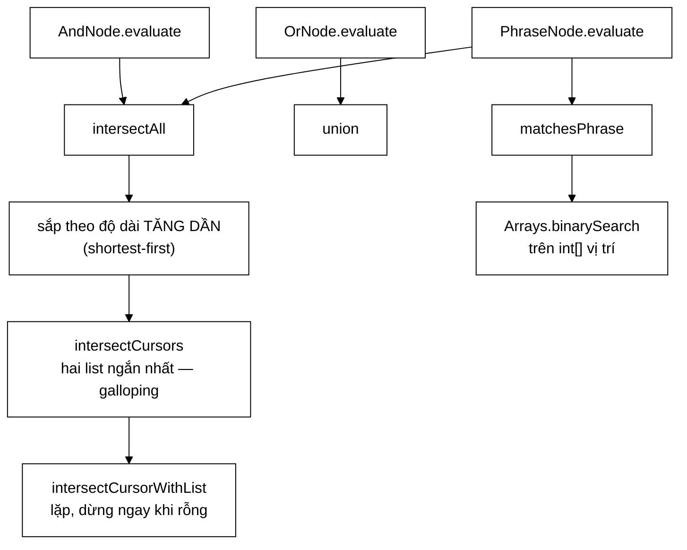
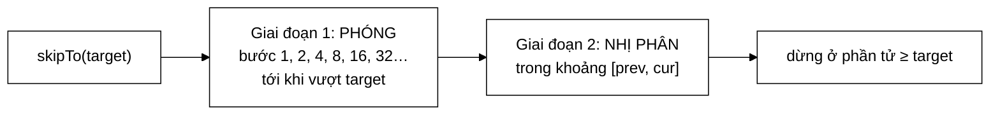

# PostingListMerger — phần cấu trúc dữ liệu đắt giá nhất của module truy vấn

**File nguồn:** `search-engine/src/main/java/com/vnsearch/query/PostingListMerger.java` (259 dòng)
**Gói:** `com.vnsearch.query` · **Loại:** lớp `final`, hàm dựng `private`, toàn bộ API `static` ⇒ lớp tiện ích thuần hàm, an toàn đa luồng
**Vị trí trong luồng:** động cơ tính toán nằm dưới mọi nút của cây biểu thức — [`ast/AndNode`](./ast/AndNode.md), [`ast/OrNode`](./ast/OrNode.md), [`ast/PhraseNode`](./ast/PhraseNode.md) đều gọi xuống đây
**Đọc kèm:** [`../index/PostingCursor.md`](../index/PostingCursor.md) · [`../index/Posting.md`](../index/Posting.md) · [`ast/QueryNode.md`](./ast/QueryNode.md)

---

## 📌 Hiểu trong 30 giây

Mọi phép toán Boolean trên chỉ mục ngược đều quy về **trộn hai dãy đã sắp xếp**.
Lớp này cài đúng bốn thứ, và mỗi thứ đều có một quyết định thiết kế được đo bằng
số chứ không bằng cảm giác.

```
   ┌─────────────────────┬──────────────────┬────────────────────────────┐
   │ Hàm                 │ Độ phức tạp      │ Dùng cho                   │
   ├─────────────────────┼──────────────────┼────────────────────────────┤
   │ intersect(a, b)     │ O(m + n)         │ AND hai danh sách docId    │
   │ union(a, b)         │ O(m + n)         │ OR                         │
   │ intersectCursors    │ O(m log(n/m))    │ AND khi kích thước lệch    │
   │ intersectAll        │ shortest-first   │ AND nhiều term             │
   │ matchesPhrase       │ O(p₀ · k log p)  │ cụm từ trong ngoặc kép     │
   └─────────────────────┴──────────────────┴────────────────────────────┘
```



> **Bất biến nền tảng của cả lớp:** *posting list luôn sắp xếp tăng dần theo
> `docId`* — bất biến do [`SearchIndex`](../index/SearchIndex.md) đảm bảo. Mọi
> thuật toán ở đây sụp đổ nếu bất biến đó bị vi phạm, và **không có phép kiểm tra
> nào** canh giữ nó. Xem đề xuất 3.

---

## 1. Two-pointer, và vì sao **không** dùng `HashSet.retainAll`

Đây là phần Javadoc đáng giá nhất của cả module — vì nó bác bỏ phản xạ đầu tiên
của hầu hết lập trình viên bằng số đo, chứ không bằng lý thuyết.

Javadoc dòng 20–26, đo trên hai danh sách 500.000 phần tử:

```
   two-pointer                              ~10,0 ms
   HashSet.retainAll (không tính dựng set)  ~15,5 ms   (+55%)
   HashSet.retainAll (tính cả dựng 2 set)   ~27,0 ms   (2,7 lần)
```

```
   VÌ SAO DÒNG THỨ BA MỚI LÀ SO SÁNH CÔNG BẰNG

   Posting list được lấy THẲNG từ chỉ mục — nó vốn đã là List.
   Muốn dùng retainAll, phải DỰNG HashSet trước.

   Chi phí dựng đó KHÔNG phải "chuẩn bị dữ liệu", nó là
   MỘT PHẦN của giải pháp. Bỏ nó ra khỏi phép đo là gian lận
   với chính mình.

   ⇒ 27,0 ms vs 10,0 ms. Two-pointer nhanh hơn 2,7 lần.
```

Ba lý do Javadoc đưa ra, giải thích rõ hơn:

```
   ① KHÔNG TỐN CHI PHÍ DỰNG CẤU TRÚC TRUNG GIAN

     HashSet 500.000 Integer:
       - 500.000 lần băm
       - 500.000 node Node<Integer> (32 byte/node) ≈ 16 MB
       - bảng băm resize log₂(500.000/16) ≈ 15 lần,
         mỗi lần rehash TOÀN BỘ phần tử đã có

     two-pointer: 0 byte cấu trúc phụ.

   ② CỤC BỘ CACHE

     two-pointer:  a[0], a[1], a[2], …   ← tuần tự
                   ⇒ prefetcher của CPU đoán đúng
                   ⇒ mỗi cache line 64 byte phục vụ ~16 phần tử

     HashSet:      nhảy ngẫu nhiên trong bảng băm
                   ⇒ gần như MỖI truy cập là một cache miss
                   ⇒ cache miss ≈ 100 chu kỳ, phép so sánh ≈ 1 chu kỳ

     Khác biệt này KHÔNG xuất hiện trong ký hiệu O lớn.
     Cả hai đều O(m+n). Nhưng hằng số chênh nhau hàng chục lần.

   ③ KHÔNG CÓ HẰNG SỐ ẨN CỦA VIỆC BĂM

     Integer.hashCode() + trộn bit + lấy modulo bảng
     ⇒ mỗi phần tử vài chục chu kỳ

     so với một phép so sánh int: 1 chu kỳ
```

```
   BÀI HỌC TỔNG QUÁT

   "O(1) tra cứu" của bảng băm là O(1) VỚI HẰNG SỐ LỚN.
   "O(n) duyệt tuần tự" là O(n) VỚI HẰNG SỐ RẤT NHỎ.

   Khi dữ liệu ĐÃ SẮP XẾP SẴN, đừng vứt bỏ tính chất đó
   để đổi lấy một cấu trúc phải dựng lại từ đầu.
```

### 1.1 `intersect` — dòng chú thích quan trọng nhất

```java
} else if (docA < docB) {
    // Vì b tăng dần, mọi B[j'] với j' >= j đều >= B[j] > A[i],
    // nên A[i] KHÔNG THỂ có trong phần còn lại của b. Bỏ đi là an toàn.
    i++;
}
```

Đây là **chứng minh tính đúng đắn** viết gọn thành ba dòng bình luận. Nó trả lời
câu hỏi duy nhất mà một người đọc mã có quyền hỏi: *"sao dám bỏ `A[i]` mà không
xét nốt phần còn lại của `b`?"*

```
   BẤT BIẾN VÒNG LẶP

   Tại mọi thời điểm:
     result chứa ĐÚNG {A[0..i) ∩ B[0..j)}
     và mọi phần tử của A[0..i) đã bị loại hoặc đã vào result
     và mọi phần tử của B[0..j) đã bị loại hoặc đã vào result

   Bước tiến:
     a[i] == b[j]  ⇒ thuộc giao, thêm, tiến CẢ HAI
     a[i] <  b[j]  ⇒ a[i] ∉ B[j..)  vì B tăng dần, tiến i
     a[i] >  b[j]  ⇒ b[j] ∉ A[i..)  vì A tăng dần, tiến j

   Mỗi bước tiến ít nhất một con trỏ ⇒ dừng sau ≤ m+n bước.
```

```
   MINH HOẠ

   a = [1, 3, 5, 7]
   b = [2, 3, 5, 8]

   i j  a[i] b[j]  hành động        result
   ───────────────────────────────────────────
   0 0   1    2    1<2 ⇒ i++        []
   1 0   3    2    3>2 ⇒ j++        []
   1 1   3    3    == ⇒ thêm, i,j++ [3]
   2 2   5    5    == ⇒ thêm, i,j++ [3,5]
   3 3   7    8    7<8 ⇒ i++        [3,5]
   4 3   — hết a ⇒ dừng             [3,5]

   7 bước cho m=n=4. Chặn trên m+n=8. ✓
```

### 1.2 `union` — ba vòng lặp, không phải một

```java
while (i < a.size() && j < b.size()) { ... }
while (i < a.size()) result.add(a.get(i++));
while (j < b.size()) result.add(b.get(j++));
```

```
   VÌ SAO PHẢI CÓ HAI VÒNG "VÉT"

   Giao: khi một danh sách hết ⇒ KHÔNG còn phần tử chung nào
         ⇒ dừng, không cần vét

   Hợp: khi một danh sách hết ⇒ phần còn lại của danh sách kia
        VẪN thuộc hợp
        ⇒ BẮT BUỘC phải vét

   Quên hai vòng này là lỗi kinh điển, và nó chỉ lộ ra khi
   hai danh sách có độ dài khác nhau — test với hai danh sách
   cùng độ dài sẽ PASS.
```

Kết quả `union` vẫn tăng dần và **không trùng lặp** — bất biến này bắt buộc, vì
kết quả của `OrNode` sẽ được đưa tiếp vào `AndNode` phía trên trong cây.

---

## 2. Galloping search — khi $O(m+n)$ vẫn là quá chậm

Javadoc dòng 32–39:

```
   two-pointer thuần : O(m + n)        = 5 + 4000 = 4005 bước
   galloping         : O(m log(n/m))   ≈ 48 bước
```

```java
public static List<Integer> intersectCursors(PostingCursor a, PostingCursor b) {
    List<Integer> result = new ArrayList<>();
    while (a.docId() != PostingCursor.NO_MORE && b.docId() != PostingCursor.NO_MORE) {
        int docA = a.docId();
        int docB = b.docId();
        if (docA == docB) {
            result.add(docA);
            a.next();
            b.next();
        } else if (docA < docB) {
            a.skipTo(docB); // nhay coc thay vi next() tung buoc
        } else {
            b.skipTo(docA);
        }
    }
    return result;
}
```

**Khác biệt duy nhất với `intersect`:** thay `i++` bằng `a.skipTo(docB)`.

```
   TÌNH HUỐNG MÀ TWO-POINTER THUẦN TỆ

   Truy vấn: "vector hoá" ứng dụng
     term "vector hoá"  → 5 tài liệu     (rất hiếm)
     term "ứng dụng"    → 4.000 tài liệu (rất phổ biến)

   a = [12, 847, 2103, 3891, 4002]         (m = 5)
   b = [1, 2, 3, …, 4000]                  (n = 4000)

   TWO-POINTER THUẦN:
     để tới a[0]=12, phải chạy j từ 0 tới 12   → 12 bước
     để tới a[1]=847, chạy j từ 13 tới 847     → 834 bước
     …
     TỔNG ≈ 4005 bước — duyệt gần hết b

   GALLOPING (skipTo):
     b.skipTo(12)    → nhảy 1, 2, 4, 8, 16 rồi nhị phân trong [8,16]
                       → ~7 bước
     b.skipTo(847)   → ~10 bước
     b.skipTo(2103)  → ~11 bước
     …
     TỔNG ≈ 48 bước

   ⇒ NHANH HƠN 83 LẦN
```



```
   VÌ SAO KHÔNG NHỊ PHÂN THẲNG TRÊN CẢ DANH SÁCH?

   Nhị phân thẳng: O(log n) = log₂(4000) ≈ 12 bước MỖI LẦN
   Galloping:      O(log(khoảng cách thực tế))

   Khi hai con trỏ GẦN nhau (trường hợp phổ biến khi hai
   danh sách cùng cỡ), khoảng cách nhỏ ⇒ galloping chỉ
   vài bước, trong khi nhị phân vẫn tốn đủ 12.

   ⇒ Galloping THÍCH NGHI: nhanh khi gần, vẫn tốt khi xa.
     Đó là lý do nó là lựa chọn chuẩn trong Lucene.
```

### 2.1 Lợi ích thứ hai: không autoboxing

Javadoc dòng 40–41: *"Đồng thời nó KHÔNG cấp phát `List<Integer>` trung gian nên
tránh được autoboxing (16 byte/phần tử thay vì 4)."*

```
   CHI PHÍ CỦA List<Integer> SO VỚI int[]

   int[] 4.000 phần tử:
     4.000 × 4 byte = 16 KB, LIỀN KHỐI

   List<Integer> 4.000 phần tử:
     mảng con trỏ:  4.000 × 8 byte  = 32 KB
     4.000 đối tượng Integer × 16 byte = 64 KB
     TỔNG ≈ 96 KB, NẰM RẢI RÁC

   ⇒ 6 lần bộ nhớ
   ⇒ và mỗi lần đọc giá trị phải theo một con trỏ
     tới chỗ khác trong heap ⇒ cache miss

   (Integer.valueOf có cache cho -128..127, nhưng docId
    của corpus 5.011 tài liệu thì phần lớn nằm NGOÀI cache đó.)
```

`PostingCursor` đọc thẳng trên `int[]` bên trong `Posting` — xem
[`../index/PostingCursor.md`](../index/PostingCursor.md).

---

## 3. Shortest-first — thứ tự giao quyết định chi phí

```java
List<List<Posting>> sorted = new ArrayList<>(postingLists);
sorted.sort(Comparator.comparingInt(List::size)); // shortest-first
```

Javadoc dòng 43–46: *"luôn có $|A \cap B| \le \min(|A|, |B|)$, nên bắt đầu từ
danh sách NGẮN NHẤT giúp kết quả trung gian nhỏ ngay từ đầu."*

```
   TRUY VẤN: "các" AND "ứng dụng" AND "vector hoá"

     df(các)        = 4.812
     df(ứng dụng)   = 4.000
     df(vector hoá) =     5

   THỨ TỰ NGƯỜI DÙNG GÕ (dài trước):
     các ∩ ứng dụng      → ~3.900 phần tử   (duyệt 8.812)
     kết quả ∩ vector hoá→ ~3 phần tử       (duyệt 3.905)
     TỔNG duyệt ≈ 12.717

   SHORTEST-FIRST:
     vector hoá ∩ ứng dụng → ~4 phần tử     (galloping: ~48)
     kết quả ∩ các         → ~3 phần tử     (galloping: ~40)
     TỔNG duyệt ≈ 88

   ⇒ NHANH HƠN ~145 LẦN, chỉ nhờ một dòng sort.
```

```
   ĐỊNH LÝ NHỎ ĐỨNG SAU

   |A ∩ B| ≤ min(|A|, |B|)

   ⇒ Kết quả trung gian KHÔNG BAO GIỜ lớn hơn danh sách nhỏ nhất
     đã tham gia.
   ⇒ Đưa danh sách nhỏ nhất vào TRƯỚC ⇒ mọi bước sau đều làm việc
     trên tập đã bị chặn trên bởi con số nhỏ đó.

   Đây là phép giao HOÁN VỊ ĐƯỢC (giao có tính giao hoán và kết hợp),
   nên đổi thứ tự KHÔNG đổi kết quả — chỉ đổi chi phí.
   Đó là điều làm tối ưu này AN TOÀN TUYỆT ĐỐI.
```

### 3.1 Dừng ngay khi rỗng

```java
for (int i = 2; i < sorted.size() && !result.isEmpty(); i++) {
    // Giao rong thi DUNG NGAY: rong la phan tu hap thu cua phep giao.
    result = intersectCursorWithList(PostingCursor.of(sorted.get(i)), result);
}
```

```
   ∅ ∩ X = ∅  với MỌI X

   Truy vấn 8 term, hai term đầu đã không giao nhau
   ⇒ 6 phép giao còn lại chắc chắn cho ∅
   ⇒ !result.isEmpty() cắt cả 6

   Cùng nguyên tắc với break trong CandidateResolver.applyFilters.
   Xem ../query/CandidateResolver.md mục 4.1.
```

### 3.2 Vì sao chỉ bước **đầu** dùng `intersectCursors`

```
   sorted[0] ∩ sorted[1]          ← intersectCursors (cursor × cursor)
   ((…) ∩ sorted[2])              ← intersectCursorWithList (cursor × list)
   ((…) ∩ sorted[3])              ← intersectCursorWithList
   …

   LÝ DO: sau bước đầu, kết quả đã là List<Integer>, không còn
   là posting list nữa. Nhưng nó VẪN sắp xếp tăng dần, nên vẫn
   dùng được skipTo trên phía cursor.

   Javadoc dòng 145–146 nói đúng chỗ đắt nhất: bước đầu là nơi
   HAI POSTING LIST GỐC chênh lệch kích thước nhiều nhất
   ⇒ galloping lợi nhất ở đó.
```

⚠️ Nhưng để ý sự bất đối xứng: `intersectCursorWithList` chỉ nhảy cóc được ở
**một** phía. Phía `docIds` vẫn `j++` từng bước. Với kết quả trung gian đã nhỏ
thì không sao — nhưng đó là một giả định chưa được nói ra.

---

## 4. `matchesPhrase` — khớp cụm từ bằng số học vị trí

```java
for (int start : positionsByTerm[0]) {
    boolean allMatch = true;
    for (int i = 1; i < phraseTerms.size(); i++) {
        if (Arrays.binarySearch(positionsByTerm[i], start + i) < 0) {
            allMatch = false;
            break;
        }
    }
    if (allMatch) return true;
}
```

```
   Ý TƯỞNG CỐT LÕI: CỤM TỪ = VỊ TRÍ LIÊN TIẾP

   Cụm "học máy ứng dụng"  (4 tiếng)

   Nếu "học" ở vị trí p, thì để thành cụm phải có:
     "máy"  ở p+1
     "ứng"  ở p+2
     "dụng" ở p+3

   ⇒ term thứ i phải ở vị trí  start + i

   Kiểm tra "có ở vị trí đó không" = tra trong danh sách vị trí
   của term i, mà danh sách đó ĐÃ SẮP XẾP ⇒ nhị phân.
```

```
   VÍ DỤ CỤ THỂ

   Tài liệu: "ứng dụng học máy trong học máy y tế"
              0    1   2   3   4     5   6   7 8

   positions["học"] = [2, 5]
   positions["máy"] = [3, 6]

   Cụm "học máy":
     start = 2 → cần "máy" ở 3 → binarySearch([3,6], 3) = 0 ≥ 0 ✓ KHỚP
     ⇒ trả về true ngay, không xét start = 5
```

### 4.1 Tối ưu 1 — lấy `positions` **một** lần

Javadoc dòng 196–200:

```
   BẢN CŨ (sai về vị trí đặt lệnh gọi):

   for (int start : positionsCuaTermDau) {
       for (int i = 1; i < n; i++) {
           int[] pos = index.getPositions(term[i], docId);   ← TRONG vòng lặp
           if (!contains(pos, start + i)) { … }
       }
   }

   getPositions(term[i], docId) KHÔNG phụ thuộc `start`.
   Gọi nó trong vòng lặp là tính đi tính lại cùng một kết quả.

   Term đầu xuất hiện 20 lần, cụm 3 từ:
     BẢN CŨ: 20 × 2 = 40 lần tìm kiếm nhị phân trong chỉ mục
     BẢN MỚI:      2 lần

   ⇒ Giảm 20 lần. Và mỗi lần getPositions là một tìm kiếm nhị
     phân trong posting list — không hề rẻ.
```

```
   ĐÂY LÀ MỘT PHÉP TỐI ƯU KINH ĐIỂN:
   "loop-invariant code motion" — đưa biểu thức không đổi
   trong vòng lặp ra ngoài vòng lặp.

   Trình biên dịch JIT KHÔNG làm được ở đây, vì nó không
   chứng minh được getPositions không có tác dụng phụ.
   ⇒ Phải làm bằng tay.
```

Thêm một lợi ích: vòng lấy `positions` cũng là chỗ **thoát sớm** khi một tiếng
vắng mặt:

```java
if (positions.length == 0) {
    return false; // mot term khong xuat hien -> khong the co cum
}
```

### 4.2 Tối ưu 2 — `Arrays.binarySearch` chứ không `Collections.binarySearch`

Javadoc dòng 224–228:

> *"`Arrays.binarySearch` thay cho `Collections.binarySearch`: cùng thuật toán,
> nhưng chạy thẳng trên `int[]` nên không phải mở hộp một `Integer` ở mỗi bước so
> sánh — mà vòng này là chỗ **nóng nhất** của tìm kiếm theo cụm."*

```
   List.contains  →  O(p)      quét tuyến tính, MỞ HỘP mỗi phần tử
   Collections
     .binarySearch→  O(log p)  nhưng vẫn MỞ HỘP ở mỗi bước so sánh
   Arrays
     .binarySearch→  O(log p)  so sánh int thuần, KHÔNG mở hộp

   Với p = 100 vị trí:
     contains              ≈ 50 phép so sánh + 50 lần mở hộp
     Collections.binary    ≈  7 phép so sánh +  7 lần mở hộp
     Arrays.binary         ≈  7 phép so sánh +  0 lần mở hộp

   Vòng này chạy p₀ × (k−1) lần với p₀ = số lần xuất hiện của
   tiếng đầu. Trong một tài liệu dài, p₀ có thể là hàng chục.
```

---

## 5. Hướng dẫn thực hành

### 5.1 Dùng

```java
List<Posting> pa = index.getPostings("máy");
List<Posting> pb = index.getPostings("học");

List<Integer> and = PostingListMerger.intersect(
        PostingListMerger.docIdsOf(pa), PostingListMerger.docIdsOf(pb));

List<Integer> or = PostingListMerger.union(
        PostingListMerger.docIdsOf(pa), PostingListMerger.docIdsOf(pb));

// AND nhieu term — TU DONG shortest-first + galloping
List<Integer> all = PostingListMerger.intersectAll(
        List.of(index.getPostings("máy"),
                index.getPostings("học"),
                index.getPostings("sâu")));

// Cum tu
boolean có = PostingListMerger.matchesPhrase(index, List.of("học", "máy"), docId);
```

### 5.2 Chạy demo để chụp màn hình báo cáo

```java
public static void main(String[] args) { ... }
```

```powershell
cd search-engine
.\mvnw.cmd -q compile exec:java "-Dexec.mainClass=com.vnsearch.query.PostingListMerger"
```

```
   Kết quả mong đợi:

   intersect(a,b)        = [3, 5]
   union(a,b)            = [1, 2, 3, 5, 7, 8]
   intersectCursors(a,b) = [3, 5]

   Hai dòng 1 và 3 PHẢI giống hệt nhau — đó chính là bất biến
   "galloping cho cùng kết quả với two-pointer thuần".
```

### 5.3 Chọn hàm nào

```
   Bạn đang có 2 List<Integer> đã sắp xếp   → intersect / union
   Bạn đang có 2 List<Posting>              → intersectCursors
                                              (tránh docIdsOf, tránh boxing)
   Bạn đang có N ≥ 2 List<Posting>          → intersectAll
   Bạn cần kiểm tra cụm từ trên 1 tài liệu  → matchesPhrase

   ⚠️ ĐỪNG gọi docIdsOf rồi intersect khi bạn có sẵn List<Posting>:
      docIdsOf cấp phát m đối tượng Integer mà intersectCursors
      không cần cái nào.
```

### 5.4 Cạm bẫy

```
   ① MỌI HÀM ĐỀU GIẢ ĐỊNH ĐẦU VÀO ĐÃ SẮP XẾP.
     Truyền danh sách chưa sắp xếp ⇒ kết quả SAI, KHÔNG có ngoại lệ,
     KHÔNG có cảnh báo. Đây là dạng lỗi tệ nhất: im lặng và sai.

   ② intersectCursors LÀM THAY ĐỔI TRẠNG THÁI CURSOR.
     Gọi lại lần hai với cùng cursor cho kết quả rỗng.
     Cursor là đối tượng dùng MỘT LẦN.

   ③ union KHÔNG loại trùng TRONG một danh sách.
     Nếu a = [1,1,2], kết quả sẽ chứa 1 hai lần.
     Nó chỉ loại trùng GIỮA hai danh sách. Bất biến "posting list
     không có docId lặp" phải do SearchIndex đảm bảo.

   ④ matchesPhrase(index, List.of(), docId) trả về TRUE.
     Cụm rỗng khớp mọi tài liệu. Hợp lý về mặt toán học (tích rỗng),
     nhưng người gọi phải biết.

   ⑤ intersectAll SỬA thứ tự bằng cách sao chép — không sửa
     danh sách gốc của người gọi (new ArrayList<>(postingLists)).
     Đây là điểm ĐÚNG, dễ làm sai nếu sort thẳng.
```

---

## 6. Độ phức tạp & chi phí

Ký hiệu: $m, n$ = độ dài hai danh sách ($m \le n$), $k$ = số term, $p$ = số vị trí trong một tài liệu.

| Hàm | Thời gian | Bộ nhớ thêm | Ghi chú |
|---|---|---|---|
| `docIdsOf` | $O(m)$ | $O(m)$ đối tượng `Integer` | Nên tránh nếu dùng được cursor |
| `intersect` | $O(m + n)$ | $O(\lvert A \cap B \rvert)$ | Không phụ thuộc phân bố |
| `union` | $O(m + n)$ | $O(m + n)$ | Kết quả luôn cỡ $m+n$ tệ nhất |
| `intersectCursors` | $O(m \log \frac{n}{m})$ | $O(\lvert A \cap B \rvert)$ | Tốt nhất khi $m \ll n$ |
| `intersectAll` | $O(k \log k)$ sắp + $\sum$ giao | $O(k)$ + kết quả | Shortest-first + dừng sớm |
| `matchesPhrase` | $O(p_0 \cdot k \log p)$ | $O(k)$ con trỏ mảng | $p_0$ = số vị trí của tiếng đầu |

```
   SO SÁNH THỰC TẾ TRÊN CORPUS 5.011 TÀI LIỆU

   Truy vấn 3 term, df = 4.812 / 4.000 / 5

   Cách ngây thơ (HashSet, thứ tự người dùng gõ):
     dựng 2 set 4.812 + 4.000 phần tử  ≈ 8.812 lần băm
     retainAll                          ≈ 4.812 lần tra
     dựng set kết quả 3.900 + retainAll ≈ 3.905
     ⇒ ~17.500 thao tác đắt + ~2 MB rác

   Cách của lớp này:
     sort 3 phần tử                       ≈ 3
     intersectCursors(5, 4.000) galloping ≈ 48
     intersectCursorWithList(4.812, ~4)   ≈ 40
     ⇒ ~91 thao tác rẻ + ~vài chục byte

   ⇒ Chênh lệch gần 200 lần, trên một truy vấn RẤT bình thường.
```

---

## 7. Kiểm thử liên quan

| Test | Bảo vệ điều gì |
|---|---|
| `test/java/com/vnsearch/query/PostingListMergerTest.java` | 9 ca — đại số tập hợp và dừng sớm |

| Ca test | Bất biến được canh giữ |
|---|---|
| `intersectWithEmptyListsIsEmpty` | $\emptyset$ là phần tử hấp thụ của giao |
| `intersectFindsCommonDocIds` | Đường đi cơ bản |
| `intersectWithNoOverlapIsEmpty` | Hai dãy đan xen mà không giao — ép cả hai nhánh `<` và `>` |
| `unionCombinesAndDeduplicates` | Loại trùng giữa hai danh sách |
| `unionWithEmptyListReturnsTheOther` | $\emptyset$ là phần tử **đơn vị** của hợp |
| `docIdsOfExtractsInOrder` | Bảo toàn thứ tự |
| `intersectAllOfThreeTermsFindsCommonDocs` | Đường đi shortest-first + `intersectCursorWithList` |
| `intersectAllWithEmptyInputReturnsEmpty` | Trường hợp biên `postingLists.isEmpty()` |
| `intersectAllShortCircuitsWhenOneListIsEmpty` | Nhánh `!result.isEmpty()` |

```
   ĐIỂM MẠNH: bộ test này kiểm ĐẠI SỐ, không kiểm ví dụ.

   ∅ hấp thụ với giao, ∅ đơn vị với hợp — đó là hai tính chất
   toán học, đúng với MỌI đầu vào, chứ không phải "chạy thử một ca".
```

**Ba lỗ hổng đáng kể:**

```
   ① KHÔNG có test nào cho intersectCursors trực tiếp.
     Nó chỉ được phủ GIÁN TIẾP qua intersectAll.
     ⇒ Nếu galloping sai ở biên (skipTo tới đúng NO_MORE),
       chỉ lộ ra khi intersectAll tình cờ đi qua nhánh đó.

   ② KHÔNG có test nào cho matchesPhrase.
     Đây là hàm PHỨC TẠP NHẤT lớp (số học vị trí, hai vòng lồng,
     nhị phân) mà lại KHÔNG được kiểm trực tiếp.

   ③ KHÔNG có test đối chiếu (differential test):
       với dữ liệu ngẫu nhiên, intersect và intersectCursors
       PHẢI cho kết quả giống hệt nhau.
     Đây là loại test rẻ nhất và bắt được nhiều lỗi nhất
     cho một cặp "cài đặt chậm nhưng chắc" / "cài đặt nhanh".
```

```powershell
cd search-engine
.\mvnw.cmd -q -Dtest='PostingListMergerTest' test
```

---

## 8. Chấm theo chuẩn doanh nghiệp

| Tiêu chí | Điểm | Nhận xét |
|---|---|---|
| **Quyết định dựa trên số đo** | 10/10 | Bác bỏ `HashSet.retainAll` bằng ba dòng số đo, và **nói rõ dòng nào là so sánh công bằng** — rất hiếm |
| **Chứng minh tính đúng đắn tại chỗ** | 10/10 | Bình luận dòng 75–76 chứng minh đúng chỗ người đọc nghi ngờ nhất |
| Chọn thuật toán đúng bài toán | 10/10 | Galloping cho danh sách lệch cỡ, two-pointer cho cùng cỡ — đúng như Lucene |
| Shortest-first | 10/10 | Một dòng `sort`, lợi ~145 lần, và **an toàn tuyệt đối** vì giao có tính giao hoán |
| Hiểu chi phí thật của JVM | 10/10 | Autoboxing 16 vs 4 byte, `Arrays` vs `Collections.binarySearch` — mức hiểu biết vượt đồ án |
| Tối ưu bất biến vòng lặp | 9/10 | `getPositions` đưa ra ngoài vòng — giảm 20 lần, có ghi rõ bản cũ sai ở đâu |
| Dừng sớm | 9/10 | `!result.isEmpty()`, `positions.length == 0` — đúng chỗ |
| Không tác dụng phụ lên đầu vào | 9/10 | `intersectAll` sao chép trước khi `sort` |
| **Kiểm thử hàm phức tạp nhất** | **2/10** | `matchesPhrase` — hàm khó nhất lớp — **không có một test nào** |
| Kiểm thử `intersectCursors` | 3/10 | Chỉ phủ gián tiếp; biên `NO_MORE` không được canh giữ |
| **Cưỡng chế tiền điều kiện** | **2/10** | Toàn bộ lớp sụp đổ nếu đầu vào chưa sắp xếp, mà **không có phép kiểm nào**, kể cả ở chế độ assert |
| `main` trong lớp sản phẩm | 5/10 | Tiện cho báo cáo, nhưng lẫn mã trình diễn vào lớp thư viện |

**Ba đề xuất nâng lên mức sản phẩm:**

1. **Viết test đối chiếu ngẫu nhiên cho `intersect` ↔ `intersectCursors`.** Đây
   là cặp hoàn hảo cho kỹ thuật này: một bản chậm-nhưng-hiển-nhiên-đúng và một
   bản nhanh-nhưng-tinh-vi. Một test 15 dòng phủ được hàng nghìn trường hợp biên
   mà không ai nghĩ ra bằng tay:
   ```java
   @RepeatedTest(200)
   void gallopingChoKetQuaGiongHetTwoPointer() {
       Random r = new Random();
       List<Posting> a = randomPostings(r, r.nextInt(1, 200));
       List<Posting> b = randomPostings(r, r.nextInt(1, 5_000));  // lech co
       assertEquals(
               PostingListMerger.intersect(docIdsOf(a), docIdsOf(b)),
               PostingListMerger.intersectCursors(PostingCursor.of(a), PostingCursor.of(b)),
               "galloping phai cho ket qua giong het two-pointer thuan");
   }
   ```
   Áp dụng đúng kỹ thuật đó cho `matchesPhrase` bằng cách so với một bản quét
   tuyến tính trên chuỗi token gốc.

2. **Cưỡng chế tiền điều kiện "đã sắp xếp" bằng `assert`.** Bất biến này là nền
   móng của cả lớp mà hiện chỉ tồn tại trong Javadoc. `assert` không tốn gì khi
   chạy sản phẩm (mặc định tắt) nhưng bắt lỗi ngay trong test và lúc phát triển:
   ```java
   private static boolean tangDan(List<Integer> xs) {
       for (int i = 1; i < xs.size(); i++) if (xs.get(i - 1) >= xs.get(i)) return false;
       return true;
   }

   public static List<Integer> intersect(List<Integer> a, List<Integer> b) {
       assert tangDan(a) && tangDan(b) : "posting list phai tang dan theo docId";
       ...
   }
   ```
   Chạy test với `-ea` (Maven Surefire bật sẵn) là đủ để bất biến được canh giữ
   trên **mọi** ca test hiện có, không cần viết thêm ca nào.

3. **Tách `main` ra khỏi lớp thư viện.** Đoạn demo hữu ích cho báo cáo, nhưng để
   trong lớp sản phẩm thì nó là mã chết trong bản đóng gói và làm lẫn hai mục
   đích. Chuyển sang `src/test/java/.../PostingListMergerDemo.java` hoặc một lớp
   `demo/` riêng, giữ nguyên chức năng chụp màn hình mà không làm bẩn thư viện.
   Nhân tiện, demo nên **khẳng định** thay vì chỉ in — `intersect` và
   `intersectCursors` phải cho cùng kết quả, và một `if` ba dòng biến bản demo
   thành bản kiểm chứng.

---

## 9. Liên kết

- Kiểu dữ liệu đầu vào: [`../index/Posting.md`](../index/Posting.md)
- Con trỏ có `skipTo` — nơi galloping thực sự được cài: [`../index/PostingCursor.md`](../index/PostingCursor.md) · [`../index/ArrayPostingCursor.md`](../index/ArrayPostingCursor.md)
- Nguồn bất biến "sắp xếp tăng dần theo docId": [`../index/SearchIndex.md`](../index/SearchIndex.md) · [`../index/InvertedIndex.md`](../index/InvertedIndex.md)
- Các nút gọi xuống lớp này: [`ast/AndNode.md`](./ast/AndNode.md) · [`ast/OrNode.md`](./ast/OrNode.md) · [`ast/NotNode.md`](./ast/NotNode.md) · [`ast/PhraseNode.md`](./ast/PhraseNode.md)
- Nơi cây được lắp và đánh giá: [`CandidateResolver.md`](./CandidateResolver.md)
- Kỹ thuật nén posting list — nền cho `skipTo` hiệu quả: [`../index/CompressedPostings.md`](../index/CompressedPostings.md) · [`../index/VByteCodec.md`](../index/VByteCodec.md)
