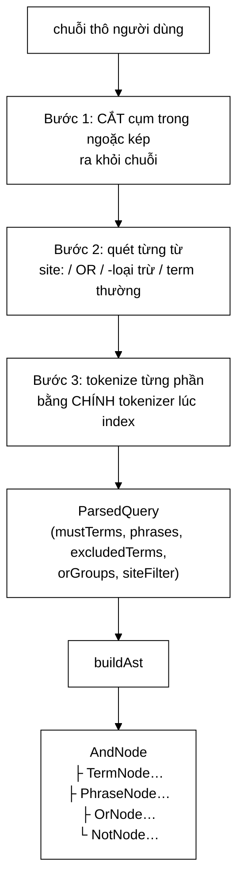
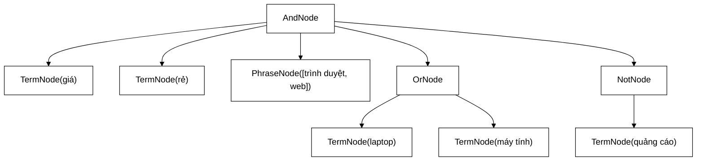

# QueryParser — bất biến quyết định: cùng một tokenizer, hoặc không bao giờ khớp

**File nguồn:** `search-engine/src/main/java/com/vnsearch/query/QueryParser.java` (248 dòng)
**Gói:** `com.vnsearch.query` · **Loại:** lớp thường (không `final`), trạng thái duy nhất là `tokenizer` bất biến ⇒ an toàn đa luồng nếu tokenizer an toàn
**Vị trí trong luồng:** cửa vào của toàn bộ module truy vấn — chuỗi thô của người dùng → `ParsedQuery` → cây biểu thức
**Đọc kèm:** [`../index/VietnameseTokenizer.md`](../index/VietnameseTokenizer.md) · [`ast/QueryNode.md`](./ast/QueryNode.md) · [`CandidateResolver.md`](./CandidateResolver.md)

---

## 📌 Hiểu trong 30 giây

Lớp này làm hai việc rất khác nhau, và chúng được tách bạch rõ:

```
   parse(String)     : chuỗi thô  →  ParsedQuery   (cấu trúc dữ liệu phẳng)
   buildAst(Parsed)  : ParsedQuery →  QueryNode     (cây biểu thức)
```



Cú pháp hỗ trợ:

| Cú pháp | Ý nghĩa | Đi vào trường |
|---|---|---|
| `máy tính` | AND ngầm định | `mustTerms` |
| `"trình duyệt web"` | Cụm phải xuất hiện **liên tiếp** | `phrases` |
| `-giá` | Loại trừ | `excludedTerms` |
| `laptop OR máy tính` | Hợp | `orGroups` |
| `site:vnexpress.net` | Giới hạn domain | `siteFilter` |

---

## 1. Bất biến quyết định — và vì sao nó đáng một khối Javadoc riêng

Javadoc dòng 32–36:

> *"Truy vấn phải được tokenize bằng **CHÍNH** `Tokenizer` đã dùng lúc index. Nếu
> lúc index tạo ra `máy_tính` mà lúc truy vấn tạo ra `máy` + `tính` thì **không
> bao giờ khớp** — và lỗi này **IM LẶNG**, không ném ngoại lệ nào, chỉ là kết quả
> rỗng một cách khó hiểu. Vì vậy lớp này nhận tokenizer qua constructor thay vì
> tự tạo."*

```
   VÌ SAO ĐÂY LÀ LỖI TỆ NHẤT CÓ THỂ XẢY RA

   Lúc index:  "máy tính xách tay"
               VietnameseTokenizer + Longest Matching
               → ["máy tính", "xách tay"]       (2 từ ghép)

   Lúc truy vấn (nếu dùng tokenizer KHÁC):
               → ["máy", "tính", "xách", "tay"] (4 tiếng)

   Tra chỉ mục:
     getPostings("máy")   → []   ← term này KHÔNG TỒN TẠI trong chỉ mục
     getPostings("tính")  → []
     ⇒ giao = ∅

   Người dùng thấy: "Không tìm thấy kết quả nào"
   Log:             sạch sẽ, không lỗi
   Test đơn vị:     PASS (mỗi lớp riêng đều đúng)

   ⇒ Hệ thống HỎNG HOÀN TOÀN mà mọi tín hiệu đều báo BÌNH THƯỜNG.
```

```
   CÁCH LỚP NÀY PHÒNG VỆ

   private final Tokenizer tokenizer;

   public QueryParser(Tokenizer tokenizer) {   ← TIÊM VÀO
       this.tokenizer = tokenizer;
   }

   public QueryParser() {                       ← mặc định tiện dụng
       this(new VietnameseTokenizer());
   }

   ⇒ Nơi lắp ráp hệ thống có thể truyền ĐÚNG đối tượng tokenizer
     mà IndexBuilder đã dùng ⇒ không thể lệch.
```

⚠️ **Nhưng phòng vệ này chưa đủ.** Hàm dựng không tham số vẫn tồn tại và tự tạo
một `VietnameseTokenizer` mới. Nếu tokenizer đó có **trạng thái** (ví dụ: từ điển
được nạp khác đi, xem [`../index/VietnameseWordDictionary.md`](../index/VietnameseWordDictionary.md)),
hai đối tượng "cùng lớp" vẫn có thể tách từ khác nhau. Xem đề xuất 1.

```
   AI ĐANG DÙNG HÀM DỰNG KHÔNG THAM SỐ?

   CandidateResolver:
     private static final QueryParser AST_BUILDER = new QueryParser();
                                                    └── không tham số

   ⇒ Ngay trong lõi hệ thống. May mắn là AST_BUILDER chỉ gọi
     buildAst (không tokenize), nên bất biến không bị vi phạm
     ở đó — nhưng đó là sự may mắn, không phải thiết kế.
```

---

## 2. Bước 1: cắt cụm trong ngoặc kép **ra khỏi** chuỗi

```java
List<String> phrasesRaw = new ArrayList<>();
Matcher matcher = PHRASE_PATTERN.matcher(rawQuery);   // "([^"]*)"
StringBuilder remaining = new StringBuilder();
int lastEnd = 0;
while (matcher.find()) {
    remaining.append(rawQuery, lastEnd, matcher.start());
    if (!matcher.group(1).isBlank()) {
        phrasesRaw.add(matcher.group(1));
    }
    lastEnd = matcher.end();
}
remaining.append(rawQuery.substring(lastEnd));
```

Bình luận dòng 85–87 giải thích chính xác vì sao phải **cắt ra** chứ không chỉ
**sao chép ra**:

> *"Giữ lại phần NGOÀI ngoặc vào `remaining`; nếu không, các tiếng của cụm sẽ VỪA
> là phrase VỪA là mustTerm, bị đếm hai lần trong `queryTermFrequency` và làm sai
> trọng số truy vấn."*

```
   NẾU KHÔNG CẮT RA

   Truy vấn: "học máy" ứng dụng

   phrases   = [[học, máy]]
   mustTerms = [học, máy, ứng, dụng]   ← "học", "máy" LỌT VÀO ĐÂY

   buildQueryTermFrequency (CandidateResolver mục 6):
     gộp mustTerms + phrases
     ⇒ học = 2, máy = 2, ứng = 1, dụng = 1

   ⇒ Trọng số của "học" và "máy" bị THỔI PHỒNG GẤP ĐÔI
   ⇒ Xếp hạng lệch, không có lỗi nào được ném ra

   VÀ TỆ HƠN: AndNode sẽ có CẢ TermNode("học") lẫn
   PhraseNode([học, máy]) — hai ràng buộc trùng lặp,
   tốn một phép giao thừa.
```

```
   MINH HOẠ PHÉP CẮT

   rawQuery = |"học máy" ứng dụng "học sâu" AI|
              0123456789…

   find() lần 1:  match [0, 10)   group(1) = "học máy"
     remaining += rawQuery[0, 0)   → ""
     phrasesRaw = ["học máy"]
     lastEnd = 10

   find() lần 2:  match [21, 31)  group(1) = "học sâu"
     remaining += rawQuery[10, 21) → " ứng dụng "
     phrasesRaw = ["học máy", "học sâu"]
     lastEnd = 31

   hết vòng:
     remaining += rawQuery[31, …)  → " AI"

   ⇒ remaining = " ứng dụng  AI"   ← không còn tiếng nào của cụm
   ⇒ phrasesRaw = ["học máy", "học sâu"]
```

```
   CHI TIẾT NHỎ: if (!matcher.group(1).isBlank())

   Truy vấn:  máy "" tính
   ⇒ cụm rỗng bị BỎ QUA, không tạo PhraseNode rỗng

   Vì sao quan trọng: PhraseNode([]) sẽ khớp MỌI tài liệu
   (matchesPhrase trả true cho danh sách rỗng — xem
    PostingListMerger.md mục 5.4 cạm bẫy ④).
   Một cụm rỗng lọt vào cây sẽ thêm một nút vô nghĩa
   nhưng vô hại — vẫn nên chặn từ đầu.
```

⚠️ **Hạn chế:** biểu thức chính quy `"([^"]*)"` không xử lý ngoặc kép **lẻ**.
Truy vấn `máy "tính` có một dấu ngoặc mở không đóng — `find()` không khớp gì,
nên dấu `"` đi thẳng vào `remaining` rồi vào tokenizer. Hành vi phụ thuộc hoàn
toàn vào tokenizer, không được định nghĩa ở đây.

---

## 3. Bước 2: quét từ — nơi tập trung mọi độ phức tạp

```java
String[] words = remaining.toString().trim().split("\\s+");
for (int i = 0; i < words.length; i++) { ... }
```

Vòng lặp này xử lý bốn loại từ, theo **thứ tự ưu tiên** cố định:

```
   ① site:xxx        → siteFilter, continue
   ② OR              → gom nhóm, continue
   ③ -xxx            → excludedTerms
   ④ còn lại         → mustTerms

   THỨ TỰ NÀY CÓ Ý NGHĨA:
     "site:abc.vn" kiểm TRƯỚC "-" nên "-site:abc.vn"
     sẽ rơi vào nhánh ④? Không — nó không bắt đầu bằng
     "site:" (bắt đầu bằng "-"), nên rơi vào ③ với
     excludedTerm = "site:abc.vn".
     ⇒ Hành vi kỳ lạ nhưng vô hại: tokenizer sẽ tách nó
       thành các tiếng vô nghĩa, khớp 0 tài liệu.
```

### 3.1 `site:` — chuẩn hoá chữ thường hai lần

```java
if (word.toLowerCase(Locale.ROOT).startsWith(SITE_PREFIX)) {
    String host = word.substring(SITE_PREFIX.length()).trim().toLowerCase(Locale.ROOT);
    if (!host.isEmpty()) {
        siteFilter = host;
    }
    continue;
}
```

```
   HAI LẦN toLowerCase, HAI MỤC ĐÍCH KHÁC NHAU

   ① trên `word`  → để "SITE:abc.vn" và "Site:abc.vn" đều nhận ra
   ② trên `host`  → để "ABC.VN" và "abc.vn" so sánh được với
                     host trong URL (DNS không phân biệt hoa thường)

   Locale.ROOT KHÔNG PHẢI thừa:
     "I".toLowerCase() trong locale Thổ Nhĩ Kỳ → "ı" (i không chấm)
     ⇒ "SITE:" thành "sıte:" ⇒ KHÔNG khớp "site:"
     ⇒ tính năng site: hỏng với người dùng đặt locale tr-TR

   Đây là lỗi kinh điển, và mã ở đây phòng đúng.
```

```
   ⚠️ ĐIỂM YẾU: siteFilter bị GHI ĐÈ, không tích luỹ

   "site:a.vn site:b.vn tin tức"
   ⇒ siteFilter = "b.vn"    (a.vn bị nuốt im lặng)

   Người dùng có lý do chính đáng để muốn "a.vn HOẶC b.vn".
   Xem đề xuất 2.
```

### 3.2 `OR` — thuật toán gom dãy liên tiếp

```java
if (OR_KEYWORD.equals(word) && !mustRaw.isEmpty() && i + 1 < words.length) {
    String left = mustRaw.remove(mustRaw.size() - 1);
    List<String> group = new ArrayList<>();
    group.add(left);
    while (i + 1 < words.length) {
        group.add(words[i + 1]);
        i++;
        if (i + 1 < words.length && OR_KEYWORD.equals(words[i + 1])) {
            i++; // bo qua tu khoa OR tiep theo
        } else {
            break;
        }
    }
    orGroupsRaw.add(group);
    continue;
}
```

Đây là đoạn khó nhất của lớp. Ý tưởng: `OR` là **toán tử trung tố**, nhưng vòng
lặp quét **một chiều** — nên khi gặp `OR`, vế trái **đã** nằm trong `mustRaw` và
phải được **lấy ngược ra**.

```
   MINH HOẠ: "giá rẻ laptop OR máy OR tính tốt"

   words = [giá, rẻ, laptop, OR, máy, OR, tính, tốt]
            0    1   2       3   4    5   6     7

   i=0  "giá"    → mustRaw = [giá]
   i=1  "rẻ"     → mustRaw = [giá, rẻ]
   i=2  "laptop" → mustRaw = [giá, rẻ, laptop]
   i=3  "OR"     → LẤY NGƯỢC "laptop" ra khỏi mustRaw
                    mustRaw = [giá, rẻ]
                    group   = [laptop]
                  vòng gom:
                    thêm words[4]="máy"  → group=[laptop, máy], i=4
                    words[5]=="OR" ⇒ i=5, tiếp
                    thêm words[6]="tính" → group=[laptop,máy,tính], i=6
                    words[7]="tốt" ≠ OR ⇒ break
                    orGroupsRaw = [[laptop, máy, tính]]
                  continue (vòng for i++ → i=7)
   i=7  "tốt"    → mustRaw = [giá, rẻ, tốt]

   KẾT QUẢ:
     mustRaw    = [giá, rẻ, tốt]
     orGroupsRaw= [[laptop, máy, tính]]

   Ngữ nghĩa: giá AND rẻ AND tốt AND (laptop OR máy OR tính) ✓
```

```
   BA ĐIỀU KIỆN BẢO VỆ Ở ĐẦU

   OR_KEYWORD.equals(word)   ← PHÂN BIỆT HOA THƯỜNG
                               "or" thường KHÔNG được coi là toán tử
                               ⇒ tìm chữ "or" trong văn bản vẫn được
                               ⇒ đây là lựa chọn ĐÚNG, giống Google

   !mustRaw.isEmpty()        ← "OR máy tính" (OR đứng đầu)
                               không có vế trái ⇒ coi OR là term thường

   i + 1 < words.length      ← "máy OR" (OR đứng cuối)
                               không có vế phải ⇒ coi OR là term thường
```

```
   ⚠️ NHƯNG: khi ba điều kiện thất bại, "OR" rơi xuống nhánh ④
     và trở thành một MUST TERM.

     Truy vấn "OR"  ⇒ mustTerms = tokenize("OR") = ["or"]
     ⇒ tìm tài liệu chứa chữ "or"

     Hành vi này KHÔNG được ghi ở đâu và không có test nào phủ.
```

```
   ⚠️ HẠN CHẾ NGỮ NGHĨA LỚN HƠN: OR KHÔNG NHẬN CỤM TỪ

   "học máy" OR "học sâu"

   Bước 1 đã cắt CẢ HAI cụm ra khỏi chuỗi.
   remaining = " OR "
   ⇒ mustRaw rỗng khi gặp OR ⇒ điều kiện !mustRaw.isEmpty() FALSE
   ⇒ "OR" thành một mustTerm

   KẾT QUẢ: phrases = [[học,máy],[học,sâu]]  ← AND với nhau!
            mustTerms = [or]

   Người dùng gõ HOẶC, hệ thống hiểu VÀ. Đây là lỗi ngữ nghĩa
   thật sự, không phải chi tiết nhỏ. Xem đề xuất 2.
```

### 3.3 Loại trừ `-`

```java
if (word.startsWith("-") && word.length() > 1) {
    excludedRaw.add(word.substring(1));
} else if (!word.equals("-")) {
    mustRaw.add(word);
}
```

```
   BA TRƯỜNG HỢP, XỬ LÝ ĐÚNG CẢ BA

   "-giá"  → length > 1  ⇒ excluded = "giá"        ✓
   "-"     → length == 1 ⇒ rơi xuống else-if
             !"-".equals("-") = false ⇒ BỎ QUA HOÀN TOÀN  ✓
   "a-b"   → không startsWith("-") ⇒ mustTerm "a-b"  ✓
             (tokenizer sẽ tách tiếp)

   Trường hợp "-" đơn độc dễ bị bỏ sót: nếu không có
   `!word.equals("-")`, một dấu gạch lạc sẽ thành mustTerm
   và tokenize thành rỗng — vô hại nhưng bẩn.
```

Test `dashOnlyExcludesTheSingleFollowingSyllable` canh giữ đúng ngữ nghĩa quan
trọng: `-` chỉ loại **một tiếng** ngay sau nó, không loại cả cụm.

```
   "máy tính -giá rẻ"
   ⇒ excluded = [giá]        ← CHỈ "giá"
   ⇒ must     = [máy, tính, rẻ]  ← "rẻ" VẪN là must

   Đây là ngữ nghĩa của Google, và người dùng quen với nó.
   Muốn loại cụm phải gõ: -"giá rẻ" — mà cú pháp này
   KHÔNG được hỗ trợ (xem mục 2, ngoặc kép được cắt trước).
```

---

## 4. Bước 3: tokenize — nơi ngữ cảnh quyết định

```java
List<String> mustTerms = tokenizeToTerms(String.join(" ", mustRaw));
List<String> excludedTerms = tokenizeToTerms(String.join(" ", excludedRaw));

for (String phraseRaw : phrasesRaw) {
    List<String> phraseTerms = tokenizeToTerms(phraseRaw);   // MỖI CỤM RIÊNG
    ...
}
```

Bình luận dòng 149–151:

> *"Cụm trong ngoặc kép được tokenize **RIÊNG** (mỗi cụm là một đơn vị độc lập);
> phần ngoài ngoặc được **nối lại rồi tokenize CHUNG** để Longest Matching có đủ
> ngữ cảnh ghép từ ghép."*

```
   VÌ SAO PHẢI NỐI LẠI RỒI TOKENIZE CHUNG

   mustRaw = [máy, tính, xách, tay]

   TOKENIZE TỪNG TỪ MỘT:
     tokenize("máy")  → [máy]
     tokenize("tính") → [tính]
     tokenize("xách") → [xách]
     tokenize("tay")  → [tay]
     ⇒ [máy, tính, xách, tay]   — MẤT HẾT từ ghép

   NỐI LẠI RỒI TOKENIZE:
     tokenize("máy tính xách tay")
     → Longest Matching thấy "máy tính" trong từ điển
     → rồi thấy "xách tay" trong từ điển
     ⇒ [máy tính, xách tay]     — ĐÚNG

   Chỉ mục lưu "máy tính" như MỘT term.
   Tokenize sai ở đây ⇒ vi phạm bất biến mục 1 ⇒ rỗng im lặng.
```

```
   VÌ SAO CỤM TỪ THÌ TOKENIZE RIÊNG

   phrasesRaw = ["học máy", "xách tay"]

   NẾU NỐI CHUNG: tokenize("học máy xách tay")
     ⇒ Longest Matching có thể ghép qua RANH GIỚI hai cụm
     ⇒ "máy xách" (nếu có trong từ điển) thành một term
     ⇒ SAI: hai cụm là hai đơn vị độc lập, người dùng
       đã dùng dấu ngoặc để nói rõ điều đó

   ⇒ Mỗi cụm là một ngữ cảnh KÍN.
```

### 4.1 Nhóm OR một vế thoái hoá thành AND

```java
if (alternatives.size() > 1) {
    orGroups.add(alternatives);
} else if (alternatives.size() == 1) {
    mustTerms = new ArrayList<>(mustTerms);
    mustTerms.add(alternatives.get(0)); // OR mot ve thi thanh AND
}
```

```
   KHI NÀO XẢY RA

   "laptop OR laptop"  → group = [laptop, laptop]
                       → tokenize cả hai → [laptop, laptop]
                       → size = 2 ⇒ vẫn là OR (dư thừa nhưng đúng)

   Trường hợp thật: một vế tokenize ra RỖNG
   "laptop OR !!!"     → tokenize("!!!") → []
                       → alternatives = [laptop]
                       → size == 1 ⇒ thành mustTerm  ✓ ĐÚNG

   OR một vế = không có lựa chọn = ràng buộc bắt buộc.
   Ngữ nghĩa đúng, và tránh dựng OrNode một con vô nghĩa.
```

```
   ⚠️ CHI TIẾT TINH VI: mustTerms = new ArrayList<>(mustTerms)

   tokenizeToTerms trả về ArrayList (đã mutable), nên dòng
   sao chép này về mặt kỹ thuật là THỪA.

   Nhưng nó phòng vệ cho tương lai: nếu tokenizeToTerms
   đổi sang trả List.of(...) bất biến, dòng này giữ mã
   không vỡ. Chi phí: một lần sao chép mảng nhỏ,
   chỉ khi có nhóm OR một vế.

   ⇒ Phòng vệ rẻ, chấp nhận được. Nhưng nó nằm TRONG vòng lặp
     nên với k nhóm OR một vế sẽ sao chép k lần.
     Với k thực tế ≤ 2 thì không đáng lo.
```

---

## 5. `buildAst` — dựng cây, và một thứ tự **có ý nghĩa**

```java
public QueryNode buildAst(ParsedQuery parsed) {
    List<QueryNode> children = new ArrayList<>();
    for (String term : parsed.mustTerms())   children.add(new TermNode(term));
    for (List<String> phrase : parsed.phrases()) children.add(new PhraseNode(phrase));
    for (List<String> group : parsed.orGroups()) {
        List<QueryNode> alternatives = new ArrayList<>(group.size());
        for (String alternative : group) alternatives.add(new TermNode(alternative));
        children.add(new OrNode(alternatives));
    }
    if (children.isEmpty()) {
        return null; // khong co menh de khang dinh -> khong truy hoi duoc
    }
    for (String excluded : parsed.excludedTerms()) {
        children.add(new NotNode(new TermNode(excluded)));
    }
    return new AndNode(children);
}
```

```
   VỊ TRÍ CỦA `if (children.isEmpty())` LÀ MẤU CHỐT

   Nó nằm SAU khi thêm must/phrase/or,
   nhưng TRƯỚC khi thêm NOT.

   ⇒ NotNode KHÔNG được tính là "mệnh đề khẳng định"

   Truy vấn "-quảng cáo":
     mustTerms = [], phrases = [], orGroups = []
     ⇒ children rỗng tại điểm kiểm tra
     ⇒ trả về null

   VÌ SAO ĐÚNG: "tất cả tài liệu KHÔNG chứa quảng cáo"
   là ~5.000 tài liệu không xếp hạng được — vô nghĩa
   với người dùng, và tốn kém với hệ thống.

   NẾU đặt kiểm tra SAU vòng NOT:
     children = [NotNode(quảng cáo)]  ⇒ không rỗng
     ⇒ AndNode(NotNode(...))
     ⇒ NotNode.evaluate phải liệt kê TOÀN BỘ corpus rồi trừ đi
     ⇒ trả về gần 5.000 ứng viên với điểm gần như nhau
```



```
   CÂY LUÔN PHẲNG — CHỈ HAI TẦNG

   AndNode ở gốc, mọi thứ khác là con trực tiếp
   (trừ OrNode và NotNode có con riêng).

   ⇒ KHÔNG hỗ trợ ngoặc lồng nhau: (a OR b) AND (c OR d) được,
     nhưng ((a AND b) OR c) thì KHÔNG.

   Đây là giới hạn của PARSER (không có ngữ pháp đệ quy),
   không phải giới hạn của cây. Cấu trúc Composite hoàn toàn
   biểu diễn được biểu thức lồng nhau tuỳ ý — chỉ là parser
   chưa sinh ra chúng. Xem đề xuất 3.
```

---

## 6. Hướng dẫn thực hành

### 6.1 Dùng

```java
// CÁCH ĐÚNG: tiêm đúng tokenizer đã dùng lúc index
QueryParser parser = new QueryParser(indexBuilder.tokenizer());

QueryParser.ParsedQuery parsed = parser.parse("\"trình duyệt web\" máy tính -giá");
// mustTerms     = [máy tính]
// phrases       = [[trình duyệt, web]]
// excludedTerms = [giá]
// orGroups      = []
// siteFilter    = null

QueryNode ast = parser.buildAst(parsed);
if (ast == null) {
    // khong co menh de khang dinh — tra ket qua rong
}
```

### 6.2 Chạy demo để chụp màn hình báo cáo

```powershell
cd search-engine
.\mvnw.cmd -q compile exec:java "-Dexec.mainClass=com.vnsearch.query.QueryParser"
```

```
   Kết quả in ra ba truy vấn mẫu, mỗi truy vấn 6 dòng:
   mustTerms / phrases / excludedTerms / orGroups / siteFilter / AST

   Dòng AST dùng ast.describe() — rất hợp để đưa vào báo cáo
   làm bằng chứng "cây được dựng đúng".
```

### 6.3 Cạm bẫy

```
   ① new QueryParser() KHÔNG đảm bảo cùng tokenizer với chỉ mục.
     Luôn tiêm tường minh ở nơi lắp ráp hệ thống.

   ② "OR" phân biệt hoa thường. "or" thường là term bình thường.
     Đây là thiết kế đúng — nhưng phải nói với người dùng.

   ③ Cụm từ KHÔNG dùng được với OR.
     "a" OR "b" cho ra AND của hai cụm. Lỗi ngữ nghĩa thật.

   ④ site: chỉ giữ giá trị CUỐI CÙNG.
     "site:a.vn site:b.vn" ⇒ chỉ b.vn.

   ⑤ parse(null) và parse("  ") đều trả ParsedQuery rỗng,
     KHÔNG ném ngoại lệ. Người gọi phải kiểm isEmpty().

   ⑥ buildAst trả về NULL, không phải Optional.
     Mọi người gọi phải kiểm null. CandidateResolver có kiểm;
     mã mới thì chưa chắc.

   ⑦ Ngoặc kép lẻ ("máy "tính) có hành vi KHÔNG ĐỊNH NGHĨA.
     Dấu " đi thẳng vào tokenizer.
```

---

## 7. Độ phức tạp & chi phí

Ký hiệu: $L$ = độ dài chuỗi truy vấn, $w$ = số từ, $k$ = số term sau tokenize.

| Bước | Thời gian | Ghi chú |
|---|---|---|
| Bước 1 — regex cụm từ | $O(L)$ | `[^"]*` không quay lui ⇒ tuyến tính, không có nguy cơ ReDoS |
| Bước 2 — quét từ | $O(w)$ | Vòng `while` bên trong **không** làm chi phí thành bậc hai: `i` chỉ tăng |
| Bước 3 — tokenize | $O(L)$ | Chi phối bởi Longest Matching, xem `VietnameseTokenizer` |
| `buildAst` | $O(k)$ | Cấp phát $k$ nút |

```
   XÁC NHẬN VÒNG OR KHÔNG PHẢI O(w²)

   Vòng while bên trong CHỈ tăng i, không bao giờ giảm.
   Vòng for bên ngoài cũng chỉ tăng i.
   ⇒ i đi từ 0 tới w đúng MỘT lần
   ⇒ tổng chi phí O(w), không phải O(w²)

   Đây là dạng "hai con trỏ trá hình" — nhìn như hai vòng lồng
   nhưng thực chất là một lần quét. Nếu bên trong dùng biến
   riêng thay vì i, nó SẼ thành O(w²).
```

```
   CHI PHÍ THỰC TẾ

   Truy vấn dài 60 ký tự, 10 từ:
     regex        ≈ 2 µs
     quét từ      ≈ 0,5 µs
     tokenize     ≈ 20 µs   ← CHI PHỐI (Longest Matching + từ điển)
     buildAst     ≈ 1 µs
     ─────────────────────
     TỔNG         ≈ 24 µs

   So với toàn bộ một truy vấn (~5 ms), phân tích chiếm 0,5%.
   ⇒ Không phải điểm nóng. Tối ưu ở đây là lãng phí công sức.
```

---

## 8. Kiểm thử liên quan

| Test | Bảo vệ điều gì |
|---|---|
| `test/java/com/vnsearch/query/QueryParserTest.java` | 8 ca — cú pháp cơ bản |

| Ca test | Nhánh được phủ |
|---|---|
| `emptyQueryReturnsAllEmpty` | `rawQuery == null \|\| isBlank()` |
| `simpleQueryProducesMustTermsOnly` | Đường đi cơ bản |
| `quotedPhraseIsExtractedSeparately` | Bước 1 — **và bất biến "không đếm hai lần"** |
| `dashExcludesSingleWord` | Nhánh `-xxx` |
| `combinedQueryWithPhraseMustAndExclusion` | Ba loại cùng lúc |
| `dashOnlyExcludesTheSingleFollowingSyllable` | Ngữ nghĩa `-` chỉ ảnh hưởng một tiếng |
| `multipleQuotedPhrasesAreAllExtracted` | Nhiều cụm, `lastEnd` cập nhật đúng |
| `blankPhraseIsIgnored` | `!matcher.group(1).isBlank()` |

```
   ĐÁNH GIÁ ĐỘ PHỦ

   ĐƯỢC PHỦ:  cụm từ (4/8 ca), loại trừ (2/8), truy vấn rỗng

   KHÔNG PHỦ MỘT CA NÀO:
     ✗ OR — toàn bộ đoạn phức tạp nhất lớp (dòng 122–139)
     ✗ site: — kể cả Locale.ROOT và việc ghi đè
     ✗ buildAst — KHÔNG có ca nào gọi tới nó
     ✗ Bất biến tokenizer (mục 1) — điều quan trọng nhất

   ⇒ Hai tính năng được Javadoc đánh dấu "MỚI" (OR và site:)
     là hai tính năng KHÔNG có test.
```

```powershell
cd search-engine
.\mvnw.cmd -q -Dtest='QueryParserTest' test
```

Các ca `OR` và `site:` được phủ **gián tiếp** ở
`CandidateResolverTest.unmatchableOrGroupBailsOut` và
`filter/DomainFilterTest` — nhưng phủ gián tiếp qua một lớp khác nghĩa là khi test
đỏ, thông báo lỗi chỉ sai chỗ.

---

## 9. Chấm theo chuẩn doanh nghiệp

| Tiêu chí | Điểm | Nhận xét |
|---|---|---|
| **Nhận diện bất biến then chốt** | 10/10 | Bất biến "cùng tokenizer" được nêu rõ, giải thích vì sao lỗi **im lặng**, và dẫn tới quyết định thiết kế (tiêm phụ thuộc) |
| **Tránh đếm hai lần** | 10/10 | Cắt cụm **ra khỏi** chuỗi thay vì sao chép — bình luận nói đúng hệ quả trên trọng số truy vấn |
| Ngữ cảnh tokenize | 10/10 | Nối chung phần ngoài ngoặc, tách riêng từng cụm — hiểu đúng Longest Matching cần gì |
| Vị trí kiểm tra `children.isEmpty()` | 10/10 | Đặt trước vòng NOT — quyết định nhỏ, hệ quả lớn |
| Chuẩn hoá locale | 9/10 | `Locale.ROOT` ở cả hai chỗ — phòng đúng bẫy Thổ Nhĩ Kỳ |
| Xử lý biên của `-` và `OR` | 9/10 | Ba điều kiện bảo vệ cho `OR`, ba trường hợp của `-`, đúng cả |
| Chi phí tuyến tính | 9/10 | Vòng `OR` lồng nhau vẫn $O(w)$ vì dùng chung biến `i` |
| **Độ phủ kiểm thử** | **3/10** | `OR`, `site:`, `buildAst` — ba phần phức tạp nhất — **không có ca nào** |
| **Ngữ nghĩa OR với cụm từ** | **2/10** | `"a" OR "b"` cho ra **AND**, ngược hẳn ý người dùng, không có cảnh báo |
| `site:` nhiều giá trị | 4/10 | Ghi đè im lặng, không báo lỗi cũng không gộp |
| Sức mạnh biểu đạt | 5/10 | Không có ngoặc lồng nhau; cây Composite thừa sức nhưng parser không sinh ra |
| Báo lỗi cú pháp | 3/10 | Ngoặc kép lẻ, `OR` lạc chỗ — đều **im lặng** thoái hoá thành term thường |
| `main` trong lớp sản phẩm | 5/10 | Tiện cho báo cáo, nhưng lẫn mã trình diễn vào lớp thư viện |

**Ba đề xuất nâng lên mức sản phẩm:**

1. **Biến bất biến tokenizer từ lời văn thành phép kiểm chạy được.** Javadoc gọi
   đây là "BẤT BIẾN QUYẾT ĐỊNH" nhưng không có gì cưỡng chế. Một test tích hợp ba
   dòng bắt đúng lớp lỗi mà Javadoc mô tả, và nó là test **duy nhất** thực sự bảo
   vệ điều quan trọng nhất của lớp này:
   ```java
   @Test
   void truyVanVaChiMucPhaiTachTuGiongHetNhau() {
       String van = "máy tính xách tay";
       List<String> lucIndex = termsOf(indexBuilder.tokenizer().tokenize(van));
       List<String> lucTruyVan = new QueryParser(indexBuilder.tokenizer()).parse(van).mustTerms();
       assertEquals(lucIndex, lucTruyVan,
               "Tokenizer luc index va luc truy van PHAI cho cung ket qua");
   }
   ```
   Kèm theo: cân nhắc **bỏ hàm dựng không tham số** khỏi mã sản phẩm, hoặc đánh
   dấu `@VisibleForTesting`. Hàm dựng tiện dụng chính là cánh cửa để bất biến bị
   phá.

2. **Sửa ngữ nghĩa `OR` với cụm từ — đây là lỗi, không phải giới hạn.** Hiện tại
   `"học máy" OR "học sâu"` cho ra AND của hai cụm, tức **ngược hẳn** điều người
   dùng gõ. Nguyên nhân: bước 1 cắt cụm ra trước khi bước 2 nhìn thấy `OR`. Cách
   sửa ít xâm lấn nhất là thay cụm bằng **chỗ giữ** trong `remaining` để bước 2
   vẫn thấy cấu trúc:
   ```java
   // Buoc 1: thay cum bang mot the giu cho, GIU NGUYEN vi tri trong chuoi
   remaining.append("P").append(phrasesRaw.size() - 1).append(' ');
   // Buoc 2: khi gap the giu cho trong mot nhom OR, dua PhraseNode vao nhom
   ```
   Nếu chưa muốn sửa, **tối thiểu phải ghi vào Javadoc** rằng OR không dùng được
   với cụm từ — im lặng làm ngược ý người dùng là điều tệ nhất trong ba lựa chọn.
   Đồng thời gộp nhiều `site:` thành danh sách thay vì ghi đè, và cho
   [`filter/DomainFilter`](./filter/DomainFilter.md) chấp nhận tập host.

3. **Trả về chẩn đoán cú pháp thay vì thoái hoá im lặng.** Ngoặc kép lẻ, `OR`
   đứng đầu/cuối, `site:` trùng — cả ba hiện đều biến thành term thường mà người
   dùng không hề biết. Thêm một trường vào `ParsedQuery` là đủ, và nó dùng lại
   đúng cơ chế hiển thị mà `droppedTerms` của
   [`CandidateResolver`](./CandidateResolver.md) đã có:
   ```java
   public record ParsedQuery(List<String> mustTerms, List<List<String>> phrases,
                              List<String> excludedTerms, List<List<String>> orGroups,
                              String siteFilter,
                              List<String> canhBao) {   // "Dau ngoac kep khong dong",
                                                        // "Toan tu OR thieu ve phai", …
   }
   ```
   Giao diện hiển thị được *"Truy vấn có dấu ngoặc kép chưa đóng — đã bỏ qua"*,
   và người dùng sửa được ngay thay vì ngồi đoán vì sao không ra kết quả.

---

## 10. Liên kết

- Tokenizer bắt buộc phải trùng với lúc index: [`../index/Tokenizer.md`](../index/Tokenizer.md) · [`../index/VietnameseTokenizer.md`](../index/VietnameseTokenizer.md) · [`../index/VietnameseWordDictionary.md`](../index/VietnameseWordDictionary.md)
- Các nút của cây được dựng ở đây: [`ast/QueryNode.md`](./ast/QueryNode.md) · [`ast/AndNode.md`](./ast/AndNode.md) · [`ast/OrNode.md`](./ast/OrNode.md) · [`ast/NotNode.md`](./ast/NotNode.md) · [`ast/PhraseNode.md`](./ast/PhraseNode.md) · [`ast/TermNode.md`](./ast/TermNode.md)
- Người tiêu thụ `ParsedQuery` và `buildAst`: [`CandidateResolver.md`](./CandidateResolver.md)
- Nơi `siteFilter` được dùng: [`filter/DomainFilter.md`](./filter/DomainFilter.md)
- Nơi chỉ mục được dựng bằng cùng tokenizer: [`../service/IndexBuilder.md`](../service/IndexBuilder.md)
- Người gọi phía sản phẩm: [`../service/SearchEngineFacade.md`](../service/SearchEngineFacade.md)
