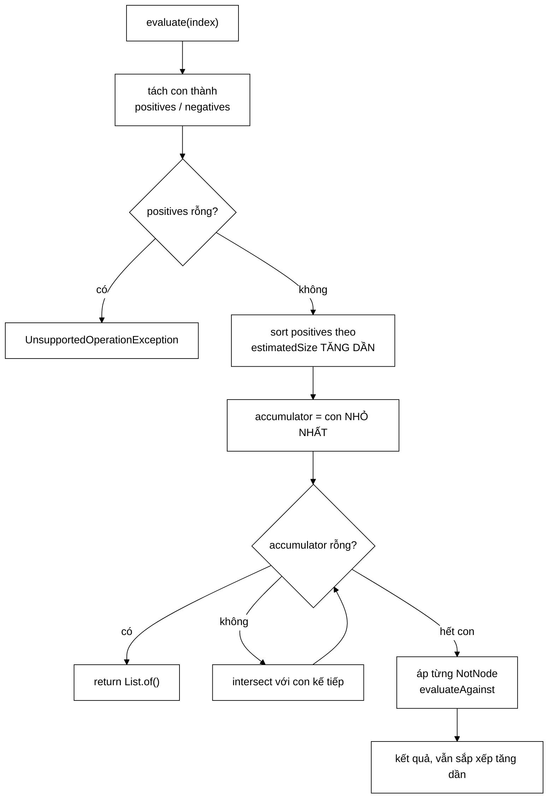

# AndNode — |A ∩ B| ≤ min(|A|,|B|), và cả một tối ưu dựng trên bất đẳng thức đó

**File nguồn:** `search-engine/src/main/java/com/vnsearch/query/ast/AndNode.java` (89 dòng)
**Gói:** `com.vnsearch.query.ast` · **Loại:** `record` bất biến — nút **TRONG** của cây truy vấn
**Vị trí trong luồng:** nút phổ biến nhất — mọi truy vấn nhiều từ đều sinh ra một `AndNode`
**Đọc kèm:** [`QueryNode.md`](./QueryNode.md) · [`NotNode.md`](./NotNode.md) · [`../PostingListMerger.md`](../PostingListMerger.md)

---

## 📌 Hiểu trong 30 giây

Nút này giao kết quả của mọi con. Ba quyết định làm nên giá trị của nó:

```
   ① SHORTEST-FIRST — sắp xếp con theo estimatedSize trước khi giao
      Cơ sở: |A ∩ B| ≤ min(|A|, |B|)

   ② THOÁT SỚM KHI RỖNG — rỗng là PHẦN TỬ HẤP THỤ của phép giao
      accumulator rỗng ⇒ trả về ngay, không đánh giá con còn lại

   ③ TÁCH NOT RA, ÁP SAU CÙNG — phủ định không đánh giá độc lập được
```



---

## 1. Shortest-first — tối ưu dựng trên một bất đẳng thức

Javadoc dòng 13–17:

> *"Cơ sở là bất đẳng thức $|A \cap B| \le \min(|A|, |B|)$: giao không bao giờ
> lớn hơn tập nhỏ hơn. Nên nếu bắt đầu từ con cho **ÍT** kết quả nhất, kết quả
> trung gian nhỏ ngay từ đầu và các bước giao sau — mỗi bước tốn $O(|A| +
> |\text{list kế tiếp}|)$ — rẻ hơn đáng kể."*

```
   VÍ DỤ:  A(4.000)  ∩  B(5)  ∩  C(800)

   ── THỨ TỰ TUỲ TIỆN: A, B, C ────────────────────────────
   bước 1: A ∩ B   → O(4000 + 5)   = 4.005,  kết quả ≤ 5
   bước 2: kq ∩ C  → O(5 + 800)    =   805
                                     ──────
                                     4.810 bước

   ── SHORTEST-FIRST: B, C, A ─────────────────────────────
   bước 1: B ∩ C   → O(5 + 800)    =   805,  kết quả ≤ 5
   bước 2: kq ∩ A  → O(5 + 4000)   = 4.005
                                     ──────
                                     4.810 bước

   ⇒ VỚI HAI BƯỚC THÌ BẰNG NHAU?!
```

```
   LỢI ÍCH THẬT SỰ LỘ RA KHI CÓ NHIỀU CON

   A(4.000) ∩ B(5) ∩ C(800) ∩ D(3.000) ∩ E(2.500)

   ── Thứ tự tuỳ tiện A,B,C,D,E ──────────────────────────
   A∩B  = 4.005   → ≤5
   ∩C   =   805
   ∩D   = 3.005
   ∩E   = 2.505
          ──────
          10.320 bước

   ── Shortest-first B,C,E,D,A ───────────────────────────
   B∩C  =   805   → ≤5
   ∩E   = 2.505
   ∩D   = 3.005
   ∩A   = 4.005
          ──────
          10.320 bước

   ⇒ VẪN BẰNG NHAU với two-pointer thuần!
```

### 1.1 Vì sao shortest-first "gần như không giúp gì" với two-pointer thuần

```
   Chi phí two-pointer:  O(|accumulator| + |list mới|)

   Tổng qua mọi bước:  Σ |list_i|  +  Σ |accumulator_i|
                        └────┬────┘     └──────┬──────┘
                      CỐ ĐỊNH, không     phần shortest-first
                      phụ thuộc thứ tự    làm nhỏ đi

   Mà Σ|list_i| thường ÁP ĐẢO (4.000 + 3.000 + 2.500 + 800 + 5),
   còn Σ|accumulator| bị chặn bởi min ban đầu (≤ 5 × số bước).

   ⇒ Shortest-first tiết kiệm phần NHỎ HƠN NHIỀU của tổng.
```

```
   ⚠️ ĐÂY LÀ ĐIỂM YẾU KIẾN TRÚC, KHÔNG PHẢI LỖI CỦA AndNode.

   Shortest-first CHỈ phát huy hết sức mạnh khi kết hợp với
   NHẢY CÓC (skipTo):

   ── two-pointer thuần ──────────────────────────────────
   accumulator(5) ∩ A(4000):  vẫn phải BƯỚC QUA gần hết A
                              O(5 + 4000) = 4.005

   ── skipTo (galloping) ─────────────────────────────────
   accumulator(5) ∩ A(4000):  5 lần skipTo × ~10 bước
                              = 50 bước
                              ⇒ NHANH HƠN 80 LẦN

   Mà PostingCursor.skipTo ĐÃ TỒN TẠI (xem ../../index/PostingCursor.md).
   Tầng AST dùng List<Integer> nên KHÔNG gọi được.
```

Nói cách khác: `AndNode` đã làm đúng **một nửa** của tối ưu (sắp xếp), nhưng nửa
còn lại (nhảy cóc) bị chặn bởi việc [`QueryNode.evaluate`](./QueryNode.md) trả
về `List<Integer>`. Xem đề xuất 1 ở mục 8.

### 1.2 Sắp xếp mà **không phải đánh giá thật**

```java
positives.sort(Comparator.comparingInt(node -> node.estimatedSize(index))); // shortest-first
```

Javadoc dòng 19–21:

> *"Ước lượng kích thước dùng `QueryNode.estimatedSize` nên **KHÔNG phải đánh
> giá thật** để biết nên sắp xếp thế nào: với `TermNode` đó chỉ là một phép tra
> document frequency $O(1)$."*

```
   NGHỊCH LÝ CỦA MỌI TỐI ƯU THỨ TỰ:
   "muốn biết cái nào rẻ thì phải làm thử — mà làm thử là hết rẻ"

   GIẢI: một hàm ước lượng RẺ, được phép SAI.
        estimatedSize chỉ ảnh hưởng HIỆU NĂNG, không ảnh hưởng KẾT QUẢ
        ⇒ sai một chút ⇒ thứ tự hơi không tối ưu ⇒ chậm hơn một chút
        ⇒ KHÔNG BAO GIỜ cho kết quả sai

   Chi phí sắp xếp: O(c log c) với c = số con (thường 2–5)
   ⇒ vài chục nano-giây. Miễn phí so với việc đọc posting list.
```

---

## 2. Rỗng là phần tử hấp thụ

```java
for (int i = 1; i < positives.size(); i++) {
    if (accumulator.isEmpty()) {
        return List.of(); // rong la phan tu HAP THU cua phep giao
    }
    accumulator = PostingListMerger.intersect(accumulator, positives.get(i).evaluate(index));
}
```

```
   ∅ ∩ X = ∅  với MỌI X

   ⇒ Khi accumulator rỗng, mọi con còn lại đều KHÔNG ĐƯỢC ĐÁNH GIÁ.
   ⇒ Và đánh giá một con là đọc cả posting list của nó (đắt).
```

```
   TÁC DỤNG CỘNG HƯỞNG VỚI SHORTEST-FIRST

   Truy vấn: "máy tính lượng tử phọt phẹt"
        "phọt_phẹt" không có trong corpus ⇒ df = 0
        ⇒ shortest-first xếp nó ĐẦU TIÊN
        ⇒ accumulator = List.of() ngay lượt đầu
        ⇒ THOÁT NGAY, không đọc posting list của "máy_tính" (4.000 mục)
          cũng không đọc "lượng_tử"

   ⇒ Truy vấn chứa một term không tồn tại tốn gần như 0 công.
     Hai tối ưu ① và ② phối hợp cho ra kết quả này — không cái nào
     một mình làm được.
```

Chú ý phép kiểm tra nằm ở **đầu vòng lặp**, không phải cuối: nhờ vậy nó bắt được
cả trường hợp con đầu tiên đã rỗng.

---

## 3. Xử lý NOT — tách ra, áp sau cùng

```java
List<QueryNode> positives = new ArrayList<>(children.size());
List<NotNode> negatives = new ArrayList<>();
for (QueryNode child : children) {
    if (child instanceof NotNode not) negatives.add(not);
    else                              positives.add(child);
}
if (positives.isEmpty()) {
    throw new UnsupportedOperationException(
            "AND chi gom cac menh de NOT thi khong danh gia duoc; "
                    + "can it nhat mot menh de khang dinh.");
}
…
for (NotNode negative : negatives) {
    if (accumulator.isEmpty()) break;
    accumulator = negative.evaluateAgainst(accumulator, index);
}
```

Javadoc dòng 23–25:

> *"`NotNode` không đánh giá độc lập được (phủ định thuần tuý cho ra gần như cả
> corpus), nên nút này tách riêng các con NOT ra và áp chúng **SAU CÙNG**, dạng
> phép trừ trên tập kết quả khẳng định."*

```
   VÌ SAO PHẢI ÁP SAU CÙNG

   Truy vấn: "máy tính AND NOT quảng cáo"
   corpus 5.011 tài liệu, "máy_tính" có 4.000, "quảng_cáo" có 300

   ── Nếu coi NOT như một con bình thường ─────────────────
   NOT quảng_cáo → phải liệt kê 5.011 − 300 = 4.711 docId
        ├─ phải duyệt TOÀN BỘ corpus
        ├─ cấp phát danh sách 4.711 phần tử
        └─ rồi giao với 4.000 ⇒ mọi công đó gần như vô ích

   ── Áp sau cùng, dạng phép trừ ──────────────────────────
   accumulator = 4.000 (từ "máy_tính")
   trừ đi 300 (từ "quảng_cáo") bằng two-pointer O(4300)
        ⇒ KHÔNG BAO GIỜ liệt kê tập bù
```

```
   VÀ ÁP SAU CÙNG CÒN CÓ LỢI THÊM:
   accumulator đã NHỎ NHẤT có thể tại thời điểm đó
   ⇒ phép trừ chạy trên tập nhỏ nhất
   ⇒ và nếu accumulator đã rỗng thì `break` bỏ qua luôn
```

### 3.1 Ném khi chỉ có NOT — thông điệp nói rõ phải làm gì

```
   "AND chi gom cac menh de NOT thi khong danh gia duoc;
    can it nhat mot menh de khang dinh."

   Truy vấn gây ra: "-quảng cáo -khuyến mãi"  (chỉ có loại trừ)

   ⇒ Ném ở đây là ĐÚNG: kết quả đúng về mặt toán học là
     "gần như toàn bộ corpus" — vừa vô nghĩa với người dùng,
     vừa đắt.

   ⇒ Mọi máy tìm kiếm thực tế đều yêu cầu điều này.
```

Nhưng ném `UnsupportedOperationException` từ tầng sâu có nghĩa là tầng
controller phải bắt và biến thành thông báo cho người dùng. Xem đề xuất 3.

---

## 4. `estimatedSize` — bỏ qua NOT

```java
public int estimatedSize(SearchIndex index) {
    int min = Integer.MAX_VALUE;
    for (QueryNode child : children) {
        if (child instanceof NotNode) continue;    // NOT khong thu hep uoc luong
        min = Math.min(min, child.estimatedSize(index));
    }
    return min == Integer.MAX_VALUE ? 0 : min;
}
```

```
   VÌ SAO BỎ QUA NOT

   NotNode.estimatedSize = getTotalDocs() (chặn trên thô, ~5.011)
   Nếu tính nó vào Math.min:
        min(4.000, 5.011) = 4.000  ← không đổi gì
   Nhưng nếu một AndNode CHỈ có NOT:
        min = 5.011  ← ước lượng SAI HOÀN TOÀN
              (nút đó sẽ ném, không trả 5.011 kết quả)

   ⇒ Bỏ qua là đúng: NOT chỉ THU HẸP kết quả, không bao giờ
     quyết định chặn trên của phép giao.
```

```
   TRẢ VỀ 0 KHI KHÔNG CÓ CON KHẲNG ĐỊNH NÀO

   min == Integer.MAX_VALUE ⇒ trả 0, không trả MAX_VALUE.

   Vì sao? Nút này sẽ NÉM khi đánh giá, nên "ước lượng" của nó
   không có nghĩa. Trả 0 khiến nút cha xếp nó ĐẦU TIÊN
   ⇒ lỗi lộ ra SỚM thay vì sau khi đã đánh giá các nhánh khác.

   Trả MAX_VALUE thì ngược lại: xếp cuối, và ta đã tốn công
   đánh giá mọi nhánh khác trước khi biết truy vấn không hợp lệ.
```

---

## 5. Hướng dẫn thực hành

### 5.1 Dựng và đánh giá

```java
QueryNode cay = new AndNode(List.of(
        new TermNode("máy_tính"),
        new TermNode("giá_rẻ"),
        new NotNode(new TermNode("quảng_cáo"))));

System.out.println(cay.describe());
// (máy_tính AND giá_rẻ AND NOT quảng_cáo)

List<Integer> docs = cay.evaluate(index);   // sắp xếp tăng dần
```

### 5.2 Xem thứ tự shortest-first có hoạt động không

```java
AndNode nut = new AndNode(List.of(
        new TermNode("máy_tính"),      // df lớn
        new TermNode("lượng_tử"),      // df nhỏ
        new TermNode("công_nghệ")));   // df vừa

for (QueryNode con : nut.children()) {
    System.out.printf("%-14s df=%,d%n", con.describe(), con.estimatedSize(index));
}
// máy_tính      df=4,000
// lượng_tử      df=5
// công_nghệ     df=1,639
//
// ⇒ evaluate() sẽ giao theo thứ tự: lượng_tử, công_nghệ, máy_tính
```

### 5.3 Cây rỗng

```java
new AndNode(List.of()).evaluate(index);   // → List.of(), KHÔNG ném
```

```
   AND của tập rỗng, về mặt toán học, là "toàn bộ vũ trụ"
   (phần tử trung hoà của phép giao).

   Nhưng ở đây nó trả về RỖNG, không phải toàn corpus.

   ⇒ Lựa chọn thực dụng: truy vấn rỗng không nên trả về mọi thứ.
     Nhưng nó KHÔNG khớp với ngữ nghĩa toán học, và điều đó
     không được ghi trong Javadoc. Xem đề xuất 3.
```

### 5.4 Cạm bẫy

| Cạm bẫy | Hậu quả | Cách đúng |
|---|---|---|
| Con trả về danh sách **không sắp xếp** | `intersect` two-pointer bỏ sót kết quả, im lặng | Mọi nút giữ bất biến sắp xếp |
| `AndNode` chỉ chứa `NotNode` | `UnsupportedOperationException` | Bảo đảm có ≥ 1 mệnh đề khẳng định ở [`QueryParser`](../QueryParser.md) |
| Cho `estimatedSize` gọi `evaluate` | Đánh giá hai lần; mất hết ý nghĩa của việc sắp xếp | Giữ rẻ |
| Bỏ phép kiểm tra rỗng trong vòng lặp | Đọc posting list của mọi con dù kết quả chắc chắn rỗng | Giữ |
| Áp NOT **trước** các phép giao | Phải liệt kê tập bù ~5.000 phần tử | Giữ thứ tự: khẳng định trước, phủ định sau |
| Tính `NotNode` vào `estimatedSize` | Ước lượng sai khi nút chỉ có NOT | Giữ `continue` |
| Sửa danh sách `children` sau khi dựng | `record` chỉ bất biến ở mức tham chiếu — `List` bên trong vẫn sửa được | Truyền `List.of(...)` |

Dòng cuối đáng lưu ý: `record AndNode(List<QueryNode> children)` **không** sao
chép danh sách. Truyền một `ArrayList` rồi sửa nó sau sẽ đổi cả cây.

---

## 6. Độ phức tạp & chi phí

Gọi $c$ = số con, $m_i$ = kích thước kết quả con thứ $i$.

| Bước | Chi phí |
|---|---|
| Tách positives/negatives | $O(c)$ |
| Sắp xếp shortest-first | $O(c \log c)$ + $c$ lần `estimatedSize` |
| Chuỗi phép giao | $O(\sum m_i)$ với two-pointer |
| Áp các NOT | $O(\sum (|acc| + m_j))$ |
| **Tổng** | **$O(\sum m_i)$** — chi phối bởi việc đọc posting list |

```
   PHÂN TÍCH MỘT TRUY VẤN THẬT
   "máy tính giá rẻ"  →  3 term, df = 4.000 / 900 / 1.200

   estimatedSize × 3          ~     60 ns
   sort 3 phần tử             ~     50 ns
   evaluate 3 con (docIdsOf)  ~ 61.000 ns   ← ĐÂY LÀ TOÀN BỘ CHI PHÍ
        (6.100 docId × ~10 ns đóng hộp + cấp phát)
   intersect ×2               ~  6.000 ns
                                ─────────
                                ~67 µs

   ⇒ 91% chi phí nằm ở việc VẬT CHẤT HOÁ posting list thành
     List<Integer> — đúng thứ PostingCursor sinh ra để tránh.
```

---

## 7. Kiểm thử liên quan

| Test | Bảo vệ điều gì |
|---|---|
| `test/java/com/vnsearch/query/ast/QueryAstTest.java` | Đánh giá cây, tổ hợp AND/OR/NOT |
| `test/java/com/vnsearch/query/PostingListMergerTest.java` | `intersect` two-pointer |

```java
class AndNodeTest {

    private final SearchIndex index = dungChiMucMau();

    @Test
    void giaoDungKetQua() {
        List<Integer> r = new AndNode(List.of(
                new TermNode("máy_tính"), new TermNode("công_nghệ"))).evaluate(index);
        Set<Integer> a = new HashSet<>(new TermNode("máy_tính").evaluate(index));
        Set<Integer> b = new HashSet<>(new TermNode("công_nghệ").evaluate(index));
        a.retainAll(b);
        assertEquals(new ArrayList<>(new TreeSet<>(a)), r);
    }

    @Test
    void ketQuaVanSapXepTangDan() {
        List<Integer> r = new AndNode(List.of(
                new TermNode("máy_tính"), new TermNode("công_nghệ"))).evaluate(index);
        for (int i = 1; i < r.size(); i++) assertTrue(r.get(i - 1) < r.get(i));
    }

    @Test
    void termKhongTonTaiChoKetQuaRong() {
        assertTrue(new AndNode(List.of(
                new TermNode("máy_tính"), new TermNode("khong_co"))).evaluate(index).isEmpty());
    }

    @Test
    void thoatSomKhiRong() {                       // ② phần tử hấp thụ
        AtomicInteger soLanDanhGia = new AtomicInteger();
        QueryNode dem = new QueryNode() {          // ⚠️ sealed — xem ghi chú dưới
            public List<Integer> evaluate(SearchIndex i) {
                soLanDanhGia.incrementAndGet(); return List.of(1, 2, 3);
            }
            public int estimatedSize(SearchIndex i) { return 999; }
            public String describe() { return "đếm"; }
        };
        new AndNode(List.of(new TermNode("khong_co"), dem)).evaluate(index);
        assertEquals(0, soLanDanhGia.get(), "Con sau nút rỗng KHÔNG được đánh giá");
    }

    @Test
    void chiCoNotThiNem() {
        UnsupportedOperationException e = assertThrows(UnsupportedOperationException.class,
                () -> new AndNode(List.of(new NotNode(new TermNode("quảng_cáo")))).evaluate(index));
        assertTrue(e.getMessage().contains("khang dinh"));
    }

    @Test
    void notDuocApSauCung() {
        List<Integer> coNot = new AndNode(List.of(
                new TermNode("máy_tính"), new NotNode(new TermNode("quảng_cáo")))).evaluate(index);
        List<Integer> khongNot = new TermNode("máy_tính").evaluate(index);
        assertTrue(khongNot.containsAll(coNot), "NOT chỉ được THU HẸP");
    }

    @Test
    void conRongTraVeRong() {
        assertTrue(new AndNode(List.of()).evaluate(index).isEmpty());
    }
}
```

> ⚠️ Ca `thoatSomKhiRong` **không biên dịch được như viết ở trên**: `QueryNode`
> là `sealed` nên không tạo lớp ẩn danh được. Đây là cái giá thật của `sealed` —
> phải thêm một nút đếm vào `permits` chỉ để test, hoặc kiểm tra gián tiếp qua
> một `SearchIndex` giả có đếm số lần `getPostings`. Cách thứ hai đúng hơn.

```powershell
cd search-engine
.\mvnw.cmd -q -Dtest='QueryAstTest' test
```

---

## 8. Chấm theo chuẩn doanh nghiệp

| Tiêu chí | Điểm | Nhận xét |
|---|---|---|
| Cơ sở lý thuyết | 10/10 | Tối ưu dựng trên một bất đẳng thức phát biểu rõ, không phải trực giác |
| Tách "ước lượng" khỏi "đánh giá" | 10/10 | Giải đúng nghịch lý "muốn biết cái nào rẻ phải làm thử" |
| Xử lý NOT | 10/10 | Nhận ra phủ định không đánh giá độc lập được; áp sau cùng khi tập đã nhỏ nhất |
| Thoát sớm | 10/10 | Rỗng là phần tử hấp thụ; kiểm tra ở đầu vòng nên bắt cả con đầu tiên |
| Phối hợp các tối ưu | 10/10 | ① và ② cộng hưởng: truy vấn có term không tồn tại tốn gần 0 công |
| Thông điệp lỗi | 8/10 | Nói rõ vì sao và cần gì; nhưng `UnsupportedOperationException` từ tầng sâu khó xử lý ở tầng trên |
| **Hiệu năng thực tế** | **5/10** | Shortest-first chỉ phát huy một nửa vì thiếu `skipTo`; 91% chi phí nằm ở đóng hộp |
| Ngữ nghĩa trường hợp biên | 6/10 | `AndNode` rỗng trả rỗng (không khớp ngữ nghĩa toán học) mà không ghi rõ |
| Bất biến của `children` | 6/10 | `record` không sao chép danh sách — sửa được từ ngoài |

**Ba đề xuất nâng lên mức sản phẩm:**

1. **Chuyển sang [`PostingCursor`](../../index/PostingCursor.md) để mở khoá
   `skipTo`.** Đây là nút hưởng lợi nhiều nhất trong cả cây: nó đã sắp xếp
   shortest-first (nửa đầu của tối ưu) nhưng không dùng được nhảy cóc (nửa sau).
   Với `accumulator(5) ∩ A(4000)`, two-pointer tốn 4.005 bước còn galloping tốn
   ~50 — **nhanh hơn 80 lần**, đúng ở tình huống mà shortest-first vừa tạo ra.
   Hai tối ưu này được thiết kế để đi cùng nhau; hiện chỉ có một.
2. **Sao chép phòng thủ danh sách `children`.** `record` chỉ bất biến ở mức tham
   chiếu; truyền một `ArrayList` rồi sửa nó sau sẽ đổi cả cây đã dựng — và cây
   có thể đang được đánh giá:
   ```java
   public AndNode {
       children = List.copyOf(children);   // bất biến thật, và từ chối null
   }
   ```
   Cùng bài học với `param.clone()` ở [`VietnameseWordDictionary`](../../index/VietnameseWordDictionary.md).
3. **Ghi rõ ngữ nghĩa `AndNode` rỗng, và cân nhắc kiểu ngoại lệ.** Trả `List.of()`
   cho AND rỗng là lựa chọn thực dụng nhưng ngược với ngữ nghĩa toán học (phần tử
   trung hoà của phép giao là toàn tập) — nên nó phải được ghi. Về ngoại lệ,
   `UnsupportedOperationException` báo hiệu "thao tác không được hỗ trợ" trong khi
   đây là "truy vấn của người dùng không hợp lệ"; một
   `IllegalArgumentException` (hoặc một ngoại lệ riêng của tầng truy vấn) sẽ giúp
   [`GlobalExceptionHandler`](../../config/GlobalExceptionHandler.md) trả về
   HTTP 400 kèm thông điệp thay vì 500.

---

## 9. Liên kết

- Giao diện và bất biến sắp xếp: [`QueryNode.md`](./QueryNode.md)
- Nút được tách ra và áp sau cùng: [`NotNode.md`](./NotNode.md)
- Nút cung cấp `estimatedSize` chính xác: [`TermNode.md`](./TermNode.md)
- Nút dùng `AndNode` bên trong làm bộ lọc thô: [`PhraseNode.md`](./PhraseNode.md)
- Phép giao two-pointer: [`../PostingListMerger.md`](../PostingListMerger.md)
- Tối ưu `skipTo` đang bị bỏ qua: [`../../index/PostingCursor.md`](../../index/PostingCursor.md)
- Nơi cây được dựng: [`../QueryParser.md`](../QueryParser.md)
- Nơi ngoại lệ nên được chuyển thành HTTP 400: [`../../config/GlobalExceptionHandler.md`](../../config/GlobalExceptionHandler.md)
