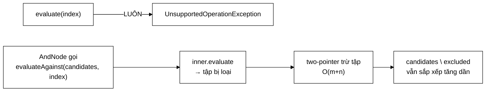

# NotNode — nút duy nhất mà `evaluate` ném, và đó là thiết kế đúng

**File nguồn:** `search-engine/src/main/java/com/vnsearch/query/ast/NotNode.java` (69 dòng)
**Gói:** `com.vnsearch.query.ast` · **Loại:** `record` bất biến — nút **TRONG**, chỉ hợp lệ trong ngữ cảnh [`AndNode`](./AndNode.md)
**Vị trí trong luồng:** hiện thực hoá toán tử loại trừ (`-quảng cáo`)
**Đọc kèm:** [`QueryNode.md`](./QueryNode.md) · [`AndNode.md`](./AndNode.md) · [`../../index/SearchIndex.md`](../../index/SearchIndex.md)

---

## 📌 Hiểu trong 30 giây

Nút này cài đặt `QueryNode` nhưng phương thức chính của giao diện — `evaluate` —
**luôn ném ngoại lệ**. Đường dùng đúng là `evaluateAgainst`.

```java
@Override
public List<Integer> evaluate(SearchIndex index) {
    throw new UnsupportedOperationException(
            "NOT chi hop le trong ngu canh AND (vi du 'A AND NOT B'); "
                    + "phu dinh doc lap se tra ve gan nhu toan bo corpus.");
}

public List<Integer> evaluateAgainst(List<Integer> candidates, SearchIndex index) { … }
```



```
   VÌ SAO KHÔNG ĐÁNH GIÁ ĐỘC LẬP ĐƯỢC

   "NOT quảng_cáo" trên corpus 5.011 tài liệu
        kết quả đúng về toán học = 5.011 − 300 = 4.711 tài liệu

   ├─ VÔ NGHĨA với người dùng: ai muốn xem 4.711 trang
   │  chỉ vì chúng không chứa chữ "quảng cáo"?
   └─ ĐẮT: phải liệt kê toàn bộ corpus rồi trừ đi

   ⇒ Mọi hệ thống tìm kiếm thực tế đều yêu cầu phủ định gắn với
     một mệnh đề khẳng định: A AND NOT B, không phải NOT B đơn độc.
```

---

## 1. Cài đặt một giao diện rồi từ chối một phương thức — có ổn không

Đây là điểm gây tranh cãi nhất của lớp, và đáng phân tích kỹ.

```
   VI PHẠM NGUYÊN TẮC THAY THẾ LISKOV?

   LSP: một đối tượng con phải dùng được ở mọi nơi mà kiểu cha dùng được.
   NotNode là QueryNode, nhưng gọi evaluate() thì ném.
        ⇒ CÓ, về hình thức là vi phạm.

   NHƯNG: Java chuẩn cũng làm vậy — List.of().add() ném
   UnsupportedOperationException, và đó là thiết kế được chấp nhận
   rộng rãi. Đây là mẫu "giao diện rộng hơn một số cài đặt".
```

Ba phương án khả dĩ, và vì sao phương án hiện tại được chọn:

```
   ── PHƯƠNG ÁN A: NotNode KHÔNG cài QueryNode ────────────
   AndNode nhận riêng List<QueryNode> positives + List<NotNode> negatives
        ✓ kiểu dữ liệu ép được ràng buộc lúc BIÊN DỊCH
        ✗ QueryParser phải phân loại NGAY lúc phân tích cú pháp
        ✗ "NOT (a OR b)" thành trường hợp đặc biệt ở nhiều chỗ
        ✗ mọi hàm duyệt cây phải xử lý HAI kiểu nút

   ── PHƯƠNG ÁN B: evaluate trả tập bù thật ───────────────
   NOT quảng_cáo → 4.711 docId
        ✓ đúng ngữ nghĩa toán học, LSP không vi phạm
        ✗ đắt: liệt kê toàn corpus mỗi lần
        ✗ vô nghĩa với người dùng
        ✗ AndNode vẫn phải xử lý riêng để tránh chi phí đó

   ── PHƯƠNG ÁN C (HIỆN TẠI): cài đặt + ném ───────────────
   ✓ NotNode là QueryNode ⇒ cây đồng nhất, sealed switch đầy đủ
   ✓ chi phí đúng bằng phép trừ, không liệt kê tập bù
   ✗ vi phạm LSP hình thức
   ✗ lỗi lộ ra lúc CHẠY, không phải lúc biên dịch
```

```
   ĐÁNH GIÁ: PHƯƠNG ÁN C ĐÚNG, VÌ

   ① Ràng buộc "NOT phải nằm trong AND" là ràng buộc NGỮ NGHĨA
     của ngôn ngữ truy vấn, không phải của hệ thống kiểu.
     Ép nó bằng kiểu (phương án A) làm hỏng tính đồng nhất của cây.

   ② Thông điệp ngoại lệ nói RÕ vì sao và phải làm gì —
     nó là tài liệu chạy được, không phải một `throw` cụt ngủn.

   ③ Chỉ có MỘT nơi tạo ra NotNode (QueryParser) và MỘT nơi
     tiêu thụ nó (AndNode). Bề mặt sai sót rất hẹp.
```

---

## 2. `evaluateAgainst` — phép trừ two-pointer

```java
public List<Integer> evaluateAgainst(List<Integer> candidates, SearchIndex index) {
    List<Integer> excluded = inner.evaluate(index);
    if (excluded.isEmpty()) {
        return candidates;                              // ① thoát sớm
    }
    List<Integer> result = new ArrayList<>(candidates.size());
    int j = 0;
    for (int candidate : candidates) {
        // Vi ca hai sap xep tang dan, con tro j chi tien mot chieu:
        // tong chi phi la O(m+n), khong phai O(m*n).
        while (j < excluded.size() && excluded.get(j) < candidate) {
            j++;
        }
        if (j >= excluded.size() || excluded.get(j) != candidate) {
            result.add(candidate);
        }
    }
    return result;
}
```

```
   VÍ DỤ:  candidates = [3, 17, 42, 88]
           excluded   = [17, 50, 88]

   candidate=3 :  j=0, excluded[0]=17 không < 3 → dừng
                  17 ≠ 3  ⇒ GIỮ 3
   candidate=17:  j=0, 17 không < 17 → dừng
                  17 == 17 ⇒ BỎ
   candidate=42:  j=0, 17 < 42 → j=1; 50 không < 42 → dừng
                  50 ≠ 42  ⇒ GIỮ 42
   candidate=88:  j=1, 50 < 88 → j=2; 88 không < 88 → dừng
                  88 == 88 ⇒ BỎ

   → [3, 42]      ← vẫn sắp xếp tăng dần
```

### 2.1 Vì sao con trỏ `j` chỉ tiến một chiều

```
   ĐIỂM MẤU CHỐT: j nằm NGOÀI vòng lặp for.

   for (int candidate : candidates) {
       while (…) j++;        ← j KHÔNG reset ở mỗi candidate
   }

   Vì candidates cũng sắp xếp tăng dần, mỗi candidate mới lớn hơn
   candidate trước ⇒ vị trí cần tìm trong `excluded` cũng chỉ
   TIẾN VỀ PHÍA TRƯỚC.

   ⇒ Tổng số lần j++ qua TOÀN BỘ vòng lặp ngoài là ≤ |excluded|
   ⇒ O(m + n), KHÔNG PHẢI O(m × n)
```

```
   NẾU j ĐƯỢC RESET (hoặc dùng excluded.contains(candidate))

   candidates 4.000 × excluded 300
        = 1.200.000 phép so sánh
   thay vì 4.300.

   ⇒ CHẬM HƠN 280 LẦN, mà kết quả vẫn ĐÚNG
   ⇒ không có test nào bắt được, chỉ có phép đo
```

Javadoc dòng 33–36 nói rõ điều kiện:

> *"Dùng được two-pointer vì **CẢ HAI** danh sách đều sắp xếp tăng dần — lại một
> lần nữa bất biến của `SearchIndex` trả cổ tức."*

Đây là lần thứ **năm** bất biến sắp xếp được tận dụng trong dự án, sau
two-pointer merge, binary search, nén delta, và galloping search.

### 2.2 Thoát sớm khi tập loại trừ rỗng

```java
if (excluded.isEmpty()) return candidates;
```

```
   Trả về CHÍNH đối tượng `candidates`, không phải bản sao.

   ✓ Tiết kiệm: không cấp phát ArrayList 4.000 phần tử
   ⚠️ Nhưng nó tạo ra hành vi KHÔNG NHẤT QUÁN:
        - excluded rỗng   → trả về đối tượng GỐC
        - excluded có gì  → trả về đối tượng MỚI

   AndNode gán lại `accumulator = negative.evaluateAgainst(...)`
   nên hiện tại vô hại. Nhưng nếu ai đó sửa danh sách trả về,
   hành vi khác nhau tuỳ dữ liệu — loại lỗi rất khó tái hiện.
```

`inner.evaluate(index)` rỗng xảy ra khi term bị loại trừ **không có trong
corpus** — trường hợp rất thường gặp (người dùng gõ `-spam` mà corpus không có
từ đó).

---

## 3. `estimatedSize` — chặn trên thô nhất trong cây

```java
public int estimatedSize(SearchIndex index) {
    return index.getTotalDocs(); // chan tren tho
}
```

```
   |NOT B| = |corpus| − |B|  ≤  |corpus|

   Đúng về mặt chặn trên, nhưng thô tới mức gần như vô dụng.

   ⇒ Và đó KHÔNG QUAN TRỌNG, vì AndNode BỎ QUA NotNode
     khi tính estimatedSize:

        if (child instanceof NotNode) continue;

   ⇒ Giá trị này thực tế KHÔNG BAO GIỜ được dùng tới.
```

```
   VẬY VÌ SAO VẪN CÀI ĐẶT?

   Vì giao diện QueryNode yêu cầu. Trả getTotalDocs() là giá trị
   "đúng và vô hại" — an toàn hơn nhiều so với ném hay trả 0.

   Trả 0 sẽ nguy hiểm: nếu ai đó về sau bỏ dòng `continue` ở
   AndNode, NotNode sẽ được xếp ĐẦU TIÊN (nhỏ nhất) và evaluate()
   được gọi ⇒ ném ngay.
```

---

## 4. Bản đồ lớp

```
NotNode  (record, implements QueryNode)
├── inner : QueryNode                    ── cây con bị phủ định
├── evaluate(index)          → NÉM       ── đường SAI
├── evaluateAgainst(cands, index)        ── đường ĐÚNG, O(m+n)
├── estimatedSize(index)     → getTotalDocs()   ── không bao giờ dùng tới
└── describe()               → "NOT " + inner.describe()
```

### 4.1 `inner` là `QueryNode`, không phải `String`

```java
public record NotNode(QueryNode inner) implements QueryNode { }
```

```
   ⇒ NOT (quảng_cáo OR khuyến_mãi)   DIỄN ĐẠT ĐƯỢC

   new NotNode(new OrNode(List.of(
           new TermNode("quảng_cáo"), new TermNode("khuyến_mãi"))))

   Đây chính là một trong hai ví dụ mà QueryNode.md nêu là
   "cấu trúc phẳng không biểu diễn được".

   Với ParsedQuery cũ (List<String> excludedTerms), loại trừ chỉ
   là một danh sách term đơn — không có chỗ cho biểu thức.
```

Và `inner.evaluate(index)` được gọi bình thường bên trong `evaluateAgainst` —
cây con bị phủ định là một cây khẳng định, nên nó đánh giá được.

---

## 5. Hướng dẫn thực hành

### 5.1 Dùng đúng — luôn trong `AndNode`

```java
// ✓ ĐÚNG
QueryNode cay = new AndNode(List.of(
        new TermNode("máy_tính"),
        new NotNode(new TermNode("quảng_cáo"))));
cay.evaluate(index);        // AndNode tự gọi evaluateAgainst

// ✓ ĐÚNG — phủ định một biểu thức
QueryNode cay2 = new AndNode(List.of(
        new TermNode("máy_tính"),
        new NotNode(new OrNode(List.of(
                new TermNode("quảng_cáo"), new TermNode("khuyến_mãi"))))));

// ✗ SAI — ném UnsupportedOperationException
new NotNode(new TermNode("quảng_cáo")).evaluate(index);

// ✗ SAI — AndNode chỉ có NOT, cũng ném
new AndNode(List.of(new NotNode(new TermNode("quảng_cáo")))).evaluate(index);
```

### 5.2 Gọi `evaluateAgainst` trực tiếp

```java
List<Integer> ungVien = new TermNode("máy_tính").evaluate(index);   // sắp xếp tăng dần
List<Integer> loc = new NotNode(new TermNode("quảng_cáo"))
        .evaluateAgainst(ungVien, index);
```

```
   ⚠️ ĐIỀU KIỆN BẮT BUỘC: `ungVien` PHẢI sắp xếp tăng dần.

   Truyền danh sách không sắp xếp:
        → two-pointer j tiến quá đà rồi không lùi được
        → GIỮ LẠI những docId ĐÁNG LẼ bị loại
        → kết quả sai, KHÔNG ném lỗi

   Và không có gì kiểm tra điều này. Xem đề xuất 2 ở mục 8.
```

### 5.3 Cạm bẫy

| Cạm bẫy | Hậu quả | Cách đúng |
|---|---|---|
| Gọi `evaluate` trên `NotNode` | `UnsupportedOperationException` | Dùng `evaluateAgainst`, hoặc bọc trong `AndNode` |
| Truy vấn chỉ có mệnh đề loại trừ | [`AndNode`](./AndNode.md) ném | [`QueryParser`](../QueryParser.md) phải bảo đảm có ≥ 1 mệnh đề khẳng định |
| Truyền `candidates` **không sắp xếp** | Kết quả sai, im lặng | Bảo đảm bất biến |
| Reset `j` trong vòng lặp (hoặc dùng `contains`) | $O(m \times n)$ — chậm 280 lần, kết quả vẫn đúng | Giữ `j` ngoài vòng lặp |
| Sửa danh sách trả về khi `excluded` rỗng | Đó là đối tượng **gốc**, sửa nó đổi cả `candidates` | Coi kết quả là chỉ đọc |
| Áp NOT **trước** các phép giao | Phải liệt kê tập bù ~5.000 phần tử | [`AndNode`](./AndNode.md) đã áp sau cùng |
| Cho `estimatedSize` trả 0 | Nếu ai đó bỏ `continue` ở `AndNode`, NOT bị xếp đầu ⇒ ném | Giữ `getTotalDocs()` |

---

## 6. Độ phức tạp & chi phí

| Phương thức | Chi phí | Cấp phát |
|---|---|---|
| `evaluate` | $O(1)$ — ném ngay | 1 ngoại lệ |
| `evaluateAgainst($m$ ứng viên, $n$ bị loại)` | $O(m + n)$ + chi phí `inner.evaluate` | 1 `ArrayList` $m$ phần tử |
| `estimatedSize` | $O(1)$ | 0 |
| `describe` | $O(\text{kích thước cây con})$ | chuỗi |

```
   VÍ DỤ THẬT: "máy tính -quảng cáo"
   candidates = 4.000,  excluded = 300

   inner.evaluate (docIdsOf 300 posting)   ~  3.000 ns
   two-pointer 4.300 bước                  ~  4.300 ns
   cấp phát ArrayList 4.000 ô              ~ 16 KB
                                             ─────────
                                             ~7 µs

   So với phương án B (liệt kê tập bù 4.711 docId):
        ~47.000 ns + 75 KB
   ⇒ nhanh hơn 6,7 lần, ít rác hơn 4,7 lần
```

```
   ⚠️ CHI TIẾT CHƯA TỐI ƯU

   new ArrayList<>(candidates.size())

   Cấp phát đúng bằng số ứng viên VÀO, nhưng kết quả luôn NHỎ HƠN
   HOẶC BẰNG. Với truy vấn loại trừ nhiều, mảng thừa khá nhiều ô.

   Ngược lại nếu ước lượng thấp thì phải mở rộng + sao chép.
   ⇒ Ước lượng cao là lựa chọn đúng ở đây — thà thừa vài KB
     còn hơn sao chép cả mảng.
```

---

## 7. Kiểm thử liên quan

| Test | Bảo vệ điều gì |
|---|---|
| `test/java/com/vnsearch/query/ast/QueryAstTest.java` | NOT trong ngữ cảnh AND |
| `test/java/com/vnsearch/query/QueryParserTest.java` | Cú pháp `-term` sinh ra `NotNode` |

```java
class NotNodeTest {

    private final SearchIndex index = dungChiMucMau();

    @Test
    void evaluateDocLapThiNem() {
        UnsupportedOperationException e = assertThrows(UnsupportedOperationException.class,
                () -> new NotNode(new TermNode("quảng_cáo")).evaluate(index));
        assertTrue(e.getMessage().contains("AND"), "thông điệp phải chỉ ra cách dùng đúng");
    }

    @Test
    void truDungTapHop() {
        List<Integer> ungVien = List.of(3, 17, 42, 88);
        // giả sử "x" có posting ở docId 17 và 88
        List<Integer> r = new NotNode(new TermNode("x")).evaluateAgainst(ungVien, index);
        assertEquals(List.of(3, 42), r);
    }

    @Test
    void ketQuaVanSapXepTangDan() {
        List<Integer> ungVien = new TermNode("máy_tính").evaluate(index);
        List<Integer> r = new NotNode(new TermNode("quảng_cáo"))
                .evaluateAgainst(ungVien, index);
        for (int i = 1; i < r.size(); i++) assertTrue(r.get(i - 1) < r.get(i));
    }

    @Test
    void ketQuaLaTapCON_cuaUngVien() {              // NOT chỉ THU HẸP
        List<Integer> ungVien = new TermNode("máy_tính").evaluate(index);
        List<Integer> r = new NotNode(new TermNode("quảng_cáo"))
                .evaluateAgainst(ungVien, index);
        assertTrue(ungVien.containsAll(r));
    }

    @Test
    void tapLoaiTruRongThiGiuNguyen() {
        List<Integer> ungVien = List.of(3, 17, 42);
        assertEquals(ungVien,
                new NotNode(new TermNode("khong_co_term_nay")).evaluateAgainst(ungVien, index));
    }

    @Test
    void loaiTruMotBieuThuc() {                     // inner là QueryNode, không phải String
        QueryNode cay = new AndNode(List.of(
                new TermNode("máy_tính"),
                new NotNode(new OrNode(List.of(
                        new TermNode("quảng_cáo"), new TermNode("khuyến_mãi"))))));
        List<Integer> r = cay.evaluate(index);
        Set<Integer> bo = new HashSet<>(new TermNode("quảng_cáo").evaluate(index));
        bo.addAll(new TermNode("khuyến_mãi").evaluate(index));
        for (int d : r) assertFalse(bo.contains(d));
    }

    @Test
    void hieuNangTuyenTinhChuKhongBinhPhuong() {    // canh giữ con trỏ một chiều
        List<Integer> ungVien = IntStream.range(0, 20_000).boxed().toList();
        long batDau = System.nanoTime();
        new NotNode(new TermNode("quảng_cáo")).evaluateAgainst(ungVien, index);
        long thoiGian = System.nanoTime() - batDau;
        assertTrue(thoiGian < 50_000_000L,
                "20.000 ứng viên phải xong dưới 50 ms — nếu chậm hơn, con trỏ j "
              + "đang bị reset và độ phức tạp thành O(m×n)");
    }

    @Test
    void describe() {
        assertEquals("NOT a", new NotNode(new TermNode("a")).describe());
    }
}
```

Ca `hieuNangTuyenTinhChuKhongBinhPhuong` là ca hiếm hoi mà một **test hiệu năng**
đáng giá: lỗi nó bắt (reset `j`, hoặc dùng `contains`) cho kết quả **hoàn toàn
đúng**, nên không test đúng-đắn nào phát hiện được.

```powershell
cd search-engine
.\mvnw.cmd -q -Dtest='QueryAstTest' test
```

---

## 8. Liên kết

- Giao diện và bất biến sắp xếp: [`QueryNode.md`](./QueryNode.md)
- Nút duy nhất tiêu thụ `evaluateAgainst`: [`AndNode.md`](./AndNode.md)
- Cây con bị phủ định thường là: [`TermNode.md`](./TermNode.md) · [`OrNode.md`](./OrNode.md)
- Nơi cú pháp `-term` được phân tích: [`../QueryParser.md`](../QueryParser.md)
- Nguồn của bất biến sắp xếp: [`../../index/SearchIndex.md`](../../index/SearchIndex.md)
- Các phép ghép two-pointer khác: [`../PostingListMerger.md`](../PostingListMerger.md)
