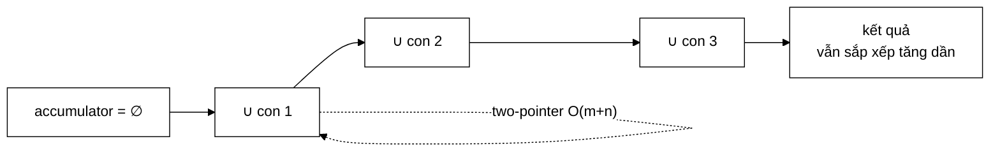

# OrNode — nơi một hàm "đúng, có test, không ai gọi" cuối cùng được dùng

**File nguồn:** `search-engine/src/main/java/com/vnsearch/query/ast/OrNode.java` (50 dòng)
**Gói:** `com.vnsearch.query.ast` · **Loại:** `record` bất biến — nút **TRONG** của cây truy vấn
**Vị trí trong luồng:** hiện thực hoá toán tử OR — tính năng mà cấu trúc phẳng cũ không biểu diễn được
**Đọc kèm:** [`QueryNode.md`](./QueryNode.md) · [`AndNode.md`](./AndNode.md) · [`../PostingListMerger.md`](../PostingListMerger.md)

---

## 📌 Hiểu trong 30 giây

Hợp của mọi con. Ngắn hơn [`AndNode`](./AndNode.md) 39 dòng, và ngắn hơn **vì
phép hợp không có tối ưu nào để làm**.

```java
public List<Integer> evaluate(SearchIndex index) {
    List<Integer> accumulator = List.of();
    for (QueryNode child : children) {
        accumulator = PostingListMerger.union(accumulator, child.evaluate(index));
    }
    return accumulator;
}
```



---

## 1. `union` — hàm đã tồn tại mà không ai gọi

Javadoc dòng 12–15 nhắc lại điều mà [`QueryNode`](./QueryNode.md) đã nêu:

> *"Đây chính là chỗ `PostingListMerger.union` được dùng. Trước khi có cây biểu
> thức, hàm đó đã tồn tại và đã có test nhưng **không có đường nào gọi tới nó**
> từ tầng truy vấn — một cấu trúc dữ liệu bị bỏ phí hoàn toàn vì ngôn ngữ truy
> vấn không hỗ trợ OR."*

```
   CHUỖI NGUYÊN NHÂN — ĐỌC TỪ DƯỚI LÊN

   union() không được gọi
        ↑ vì
   ngôn ngữ truy vấn không có toán tử OR
        ↑ vì
   ParsedQuery lưu ba danh sách PHẲNG (mustTerms/phrases/excludedTerms)
        ↑ vì
   cấu trúc phẳng không biểu diễn được sự LỒNG NHAU

   ⇒ Một quyết định về CẤU TRÚC DỮ LIỆU đã chặn một TÍNH NĂNG
     mà người dùng nhìn thấy, và để lại dấu vết là một hàm
     "đúng, có test, không ai gọi".
```

`OrNode` là 50 dòng đã gỡ bỏ toàn bộ chuỗi đó.

---

## 2. Vì sao không có shortest-first ở đây

[`AndNode`](./AndNode.md) sắp xếp con theo `estimatedSize` trước khi giao.
`OrNode` **không** làm vậy — và đó là đúng:

```
   PHÉP GIAO:   |A ∩ B| ≤ min(|A|, |B|)
        ⇒ kết quả trung gian NHỎ DẦN
        ⇒ thứ tự QUAN TRỌNG: bắt đầu từ nhỏ nhất thì mọi bước sau rẻ hơn

   PHÉP HỢP:    |A ∪ B| = |A| + |B| − |A ∩ B|
        ⇒ kết quả trung gian LỚN DẦN, và
        ⇒ kích thước cuối cùng KHÔNG PHỤ THUỘC thứ tự
        ⇒ tổng chi phí two-pointer cũng gần như không đổi
```

```
   VÍ DỤ: hợp A(4.000), B(5), C(800)

   ── Thứ tự A, B, C ──────────────────────────────────────
   ∅ ∪ A   = O(0 + 4000)     = 4.000  → 4.000
   ∪ B     = O(4000 + 5)     = 4.005  → ~4.005
   ∪ C     = O(4005 + 800)   = 4.805
                               ──────
                               12.810

   ── Thứ tự B, C, A ──────────────────────────────────────
   ∅ ∪ B   = O(0 + 5)        =     5  → 5
   ∪ C     = O(5 + 800)      =   805  → ~805
   ∪ A     = O(805 + 4000)   = 4.805
                               ──────
                                5.615

   ⇒ THỰC RA THỨ TỰ CÓ ẢNH HƯỞNG — nhỏ trước vẫn tốt hơn!
```

```
   VẬY VÌ SAO KHÔNG SẮP XẾP?

   Chênh lệch 12.810 vs 5.615 bước là thật, nhưng:

   ① Kết quả CUỐI CÙNG luôn ~4.805 phần tử dù thứ tự nào
      ⇒ phần lớn chi phí là ĐỌC posting list các con
        (4.000 + 5 + 800 = 4.805), không thể tránh
      ⇒ phần tiết kiệm được là chi phí GHÉP TRUNG GIAN

   ② OR hiếm khi có nhiều con: thường 2, hiếm khi quá 3
      ⇒ với 2 con, thứ tự KHÔNG ảnh hưởng gì cả

   ③ Sắp xếp cần gọi estimatedSize cho mỗi con — rẻ, nhưng
     không miễn phí

   ⇒ Không sắp xếp là lựa chọn hợp lý, nhưng nó KHÔNG được
     ghi lại. Xem đề xuất 1 ở mục 7.
```

---

## 3. `estimatedSize` — chặn trên thô nhất trong cây

```java
public int estimatedSize(SearchIndex index) {
    // Chan tren: tong cac con. Thuc te nho hon neu chung chong lan, nhung
    // chan tren la du de sap xep shortest-first o nut AND cha.
    long sum = 0;
    for (QueryNode child : children) sum += child.estimatedSize(index);
    return (int) Math.min(sum, Integer.MAX_VALUE);
}
```

```
   |A ∪ B| = |A| + |B| − |A ∩ B|   ≤   |A| + |B|

   Ước lượng bỏ qua phần chồng lấn ⇒ luôn LỚN HƠN HOẶC BẰNG thực tế.

   Ví dụ: "máy tính OR laptop"
        df(máy_tính) = 4.000, df(laptop) = 3.000
        ước lượng: 7.000
        thực tế:   ~5.000 (nhiều tài liệu chứa cả hai)
        ⇒ cao hơn 40%
```

```
   VÌ SAO CHẶN TRÊN THÔ VẪN ĐỦ DÙNG

   estimatedSize chỉ phục vụ shortest-first ở AndNode cha.
   Nó cần THỨ TỰ đúng, không cần con số đúng.

   (máy tính OR laptop) AND lượng_tử
        OrNode:  ước lượng 7.000 (thực 5.000)
        TermNode lượng_tử: 5
        ⇒ dù ước lượng cao 40%, thứ tự vẫn ĐÚNG: lượng_tử trước

   ⇒ Sai số chỉ gây hại khi nó ĐẢO NGƯỢC thứ tự — tức khi hai
     nhánh có kích thước gần nhau. Mà khi đó thứ tự cũng gần
     như không quan trọng.
```

### 3.1 Dùng `long` rồi kẹp — phòng tràn số

```java
long sum = 0;                                   // ← long, không phải int
…
return (int) Math.min(sum, Integer.MAX_VALUE);  // ← kẹp trước khi ép kiểu
```

```
   VỚI int:
        4 con, mỗi con estimatedSize = 1.000.000.000
        sum = 4 tỉ  >  Integer.MAX_VALUE (2,147 tỉ)
        ⇒ TRÀN thành SỐ ÂM
        ⇒ AndNode cha sắp xếp nút này ĐẦU TIÊN (âm là nhỏ nhất)
        ⇒ tối ưu shortest-first hoạt động NGƯỢC HOÀN TOÀN

   VỚI long + kẹp:
        sum = 4 tỉ  →  Integer.MAX_VALUE
        ⇒ xếp CUỐI CÙNG, đúng ý nghĩa "rất lớn"
```

Với corpus hiện tại (5.011 tài liệu) tràn số không thể xảy ra. Nhưng chi phí
phòng là **một chữ** (`long` thay `int`), và hậu quả nếu thiếu là một tối ưu chạy
ngược mà không có triệu chứng nào ngoài "truy vấn chậm bất thường".

Cùng loại phòng thủ với `>>>` ở [`InvertedIndex`](../../index/InvertedIndex.md)
và `value > Integer.MAX_VALUE` ở [`VietnameseWordDictionary`](../../index/VietnameseWordDictionary.md).

---

## 4. Bất biến sắp xếp được giữ nguyên

Javadoc dòng 17–18:

> *"Hợp bằng two-pointer $O(m+n)$ giữ nguyên bất biến 'sắp xếp tăng dần', nên nút
> cha vẫn ghép tiếp được mà không phải sort."*

```
   union two-pointer trên hai danh sách ĐÃ SẮP XẾP:

   A: [3, 17, 42]      i→
   B: [17, 30, 99]     j→

   so A[i] với B[j], lấy cái NHỎ HƠN, tiến con trỏ tương ứng
   (bằng nhau thì lấy một, tiến CẢ HAI ⇒ khử trùng)

   → [3, 17, 30, 42, 99]   ← VẪN sắp xếp tăng dần

   ⇒ O(m+n), không sort, và khử trùng miễn phí.
```

```
   NẾU DÙNG TreeSet<Integer> CHO "TIỆN"

   new TreeSet<>(a); addAll(b)
        ├─ O((m+n) log(m+n))  thay vì O(m+n)
        ├─ cấp phát một node đỏ-đen cho MỖI phần tử (~40 byte)
        └─ với 4.805 phần tử: ~190 KB rác + 4.805 × log ≈ 60.000 phép so sánh

   two-pointer: 4.805 phép so sánh, một ArrayList
```

---

## 5. Bắt đầu từ `List.of()` — phần tử trung hoà

```java
List<Integer> accumulator = List.of();
for (QueryNode child : children) {
    accumulator = PostingListMerger.union(accumulator, child.evaluate(index));
}
```

```
   ∅ ∪ X = X   (rỗng là phần tử TRUNG HOÀ của phép hợp)

   ⇒ Không cần nhánh đặc biệt cho con đầu tiên.
   ⇒ Không cần kiểm tra children.isEmpty() — vòng lặp không chạy,
     trả về List.of(), đúng ngữ nghĩa "OR của tập rỗng là rỗng".

   So sánh với AndNode:
        AND phải kiểm children.isEmpty() riêng, vì phần tử trung hoà
        của phép GIAO là "toàn tập" — không biểu diễn được bằng
        một List.
```

```
   ĐỐI XỨNG ĐẸP GIỮA HAI NÚT

              phần tử TRUNG HOÀ    phần tử HẤP THỤ
   Giao (AND)   toàn tập (✗)         ∅  (✓ dùng để thoát sớm)
   Hợp  (OR)    ∅       (✓ dùng làm  toàn tập (✗)
                         giá trị đầu)

   ⇒ AndNode tận dụng phần tử HẤP THỤ (thoát sớm khi rỗng)
   ⇒ OrNode  tận dụng phần tử TRUNG HOÀ (khởi tạo bằng rỗng)

   Mỗi phép toán tận dụng đúng tính chất mà nó có.
```

> ⚠️ Hệ quả: `OrNode` **không** có cơ chế thoát sớm. Nếu một con cho ra gần cả
> corpus, mọi con còn lại vẫn được đánh giá đầy đủ dù kết quả gần như không đổi.
> Đây là bản chất của phép hợp, không phải thiếu sót.

---

## 6. Hướng dẫn thực hành

### 6.1 Dựng và đánh giá

```java
QueryNode cay = new AndNode(List.of(
        new OrNode(List.of(new TermNode("máy_tính"), new TermNode("laptop"))),
        new TermNode("giá_rẻ")));

System.out.println(cay.describe());
// ((máy_tính OR laptop) AND giá_rẻ)

List<Integer> docs = cay.evaluate(index);
```

### 6.2 Dùng OR cho từ đồng nghĩa — trường hợp dùng thật

```java
/** Mở rộng một term thành OR của nó và các từ đồng nghĩa. */
static QueryNode moRong(String term, Map<String, List<String>> dongNghia) {
    List<String> ds = dongNghia.get(term);
    if (ds == null || ds.isEmpty()) return new TermNode(term);

    List<QueryNode> con = new ArrayList<>(ds.size() + 1);
    con.add(new TermNode(term));
    for (String d : ds) con.add(new TermNode(d));
    return new OrNode(con);
}
```

```
   "máy_tính"  →  (máy_tính OR laptop OR máy_vi_tính OR computer)

   ⇒ Đây là ứng dụng thực tế quan trọng nhất của OrNode, và nó
     không thể làm được với cấu trúc phẳng cũ.
```

### 6.3 Cạm bẫy

| Cạm bẫy | Hậu quả | Cách đúng |
|---|---|---|
| Con trả danh sách **không sắp xếp** | `union` two-pointer sinh kết quả sai/trùng, im lặng | Mọi nút giữ bất biến |
| Đổi `long sum` thành `int sum` | Tràn thành âm ⇒ shortest-first ở nút cha chạy **ngược** | Giữ `long` + kẹp |
| Dùng `TreeSet` hoặc `HashSet` cho "tiện" | $O(n \log n)$ + ~190 KB rác thay vì $O(m+n)$ | Giữ `union` |
| Mong đợi `OrNode` thoát sớm | Không có — mọi con luôn được đánh giá | Đặt OR ở nhánh có ít con |
| Nhiều con OR với df lớn | Kết quả gần cả corpus ⇒ [`MaxCandidatesFilter`](../filter/MaxCandidatesFilter.md) cắt bớt | Cân nhắc số nhánh OR |
| Sửa danh sách `children` sau khi dựng | `record` không sao chép — đổi cả cây | Truyền `List.of(...)` |
| Nghĩ `estimatedSize` là số kết quả thật | Nó là chặn trên, có thể cao 40% | Chỉ dùng để so sánh thứ tự |

---

## 7. Độ phức tạp & chi phí

| Bước | Chi phí |
|---|---|
| Đánh giá $c$ con | $O(\sum m_i)$ |
| Chuỗi phép hợp | $O(\sum_{i} |acc_i| + m_i)$, tệ nhất $O(c \cdot M)$ với $M$ = kích thước kết quả cuối |
| `estimatedSize` | $O(c)$ lần gọi `estimatedSize` của con |

```
   VÍ DỤ THẬT: (máy_tính OR laptop OR computer)
   df = 4.000 / 3.000 / 1.200,  chồng lấn ~30%

   evaluate 3 con (docIdsOf)   ~ 82.000 ns    ← 8.200 docId đóng hộp
   union ×2                    ~ 12.000 ns
                                 ─────────
                                 ~94 µs

   Kết quả: ~5.700 docId  ⇒  ~91 KB rác

   ⚠️ Truy vấn OR nhiều nhánh là trường hợp TỆ NHẤT về cấp phát
     của cả tầng truy vấn: kết quả lớn dần thay vì nhỏ dần.
```

---

## 8. Kiểm thử liên quan

| Test | Bảo vệ điều gì |
|---|---|
| `test/java/com/vnsearch/query/ast/QueryAstTest.java` | Đánh giá OR trong cây |
| `test/java/com/vnsearch/query/PostingListMergerTest.java` | `union` two-pointer — **đã có từ trước khi `OrNode` tồn tại** |

```java
class OrNodeTest {

    private final SearchIndex index = dungChiMucMau();

    @Test
    void hopDungKetQua() {
        List<Integer> r = new OrNode(List.of(
                new TermNode("máy_tính"), new TermNode("laptop"))).evaluate(index);
        Set<Integer> mongDoi = new TreeSet<>(new TermNode("máy_tính").evaluate(index));
        mongDoi.addAll(new TermNode("laptop").evaluate(index));
        assertEquals(new ArrayList<>(mongDoi), r);
    }

    @Test
    void ketQuaSapXepTangDanVaKhongTrung() {
        List<Integer> r = new OrNode(List.of(
                new TermNode("máy_tính"), new TermNode("công_nghệ"))).evaluate(index);
        for (int i = 1; i < r.size(); i++) {
            assertTrue(r.get(i - 1) < r.get(i), "phải tăng NGHIÊM NGẶT — không trùng");
        }
    }

    @Test
    void conRongTraVeRong() {                       // phần tử trung hoà
        assertTrue(new OrNode(List.of()).evaluate(index).isEmpty());
    }

    @Test
    void motConKhongTonTaiVanTraKetQuaConKia() {
        List<Integer> r = new OrNode(List.of(
                new TermNode("máy_tính"), new TermNode("khong_co"))).evaluate(index);
        assertEquals(new TermNode("máy_tính").evaluate(index), r);
    }

    @Test
    void uocLuongLaChanTren() {
        OrNode n = new OrNode(List.of(new TermNode("máy_tính"), new TermNode("công_nghệ")));
        assertTrue(n.estimatedSize(index) >= n.evaluate(index).size(),
                "estimatedSize phải là CHẶN TRÊN của số kết quả thật");
    }

    @Test
    void khongTranSoVoiUocLuongLon() {               // phòng thủ `long`
        // Cần một nút giả có estimatedSize = Integer.MAX_VALUE.
        // ⚠️ QueryNode là sealed nên phải dùng SearchIndex giả trả df rất lớn.
        SearchIndex gia = chiMucGiaVoiDf(Integer.MAX_VALUE);
        OrNode n = new OrNode(List.of(new TermNode("a"), new TermNode("b"), new TermNode("c")));
        assertTrue(n.estimatedSize(gia) > 0, "KHÔNG được tràn thành số âm");
        assertEquals(Integer.MAX_VALUE, n.estimatedSize(gia));
    }

    @Test
    void describeGhepBangOR() {
        assertEquals("(a OR b)",
                new OrNode(List.of(new TermNode("a"), new TermNode("b"))).describe());
    }
}
```

Ca `khongTranSoVoiUocLuongLon` là ca duy nhất canh giữ phòng thủ `long` — mà đó
là phòng thủ chống một lỗi làm tối ưu chạy **ngược** mà không có triệu chứng nào
ngoài "chậm bất thường".

```powershell
cd search-engine
.\mvnw.cmd -q -Dtest='QueryAstTest' test
```

---

## 9. Liên kết

- Giao diện và bất biến sắp xếp: [`QueryNode.md`](./QueryNode.md)
- Nút đối xứng, có shortest-first và thoát sớm: [`AndNode.md`](./AndNode.md)
- Nút lá cung cấp `estimatedSize`: [`TermNode.md`](./TermNode.md)
- Hàm `union` mà nút này cuối cùng đã dùng tới: [`../PostingListMerger.md`](../PostingListMerger.md)
- Nơi cây được dựng, và nơi OR được phân tích cú pháp: [`../QueryParser.md`](../QueryParser.md)
- Bộ lọc chặn kết quả OR quá lớn: [`../filter/MaxCandidatesFilter.md`](../filter/MaxCandidatesFilter.md)
- Cùng loại phòng thủ tràn số: [`../../index/InvertedIndex.md`](../../index/InvertedIndex.md)
