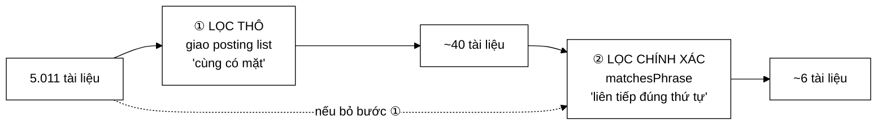

# PhraseNode — lọc bằng điều kiện yếu nhưng rẻ, rồi mới kiểm điều kiện mạnh nhưng đắt

**File nguồn:** `search-engine/src/main/java/com/vnsearch/query/ast/PhraseNode.java` (55 dòng)
**Gói:** `com.vnsearch.query.ast` · **Loại:** `record` bất biến — nút **LÁ** (nhưng dùng [`AndNode`](./AndNode.md) bên trong)
**Vị trí trong luồng:** hiện thực hoá tìm cụm từ chính xác (`"máy tính xách tay"`)
**Đọc kèm:** [`QueryNode.md`](./QueryNode.md) · [`AndNode.md`](./AndNode.md) · [`../PostingListMerger.md`](../PostingListMerger.md)

---

## 📌 Hiểu trong 30 giây

Tìm cụm từ đòi hỏi các term xuất hiện **liên tiếp đúng thứ tự** — điều kiện đắt
để kiểm tra. Lớp này dùng mẫu **filter-and-refine**: lọc thô bằng một điều kiện
yếu hơn nhưng rẻ, rồi mới kiểm tra chính xác trên tập nhỏ còn lại.

```java
List<Integer> rough = new AndNode(asTerms).evaluate(index);        // ① lọc thô
List<Integer> exact = new ArrayList<>(rough.size());
for (int docId : rough) {
    if (PostingListMerger.matchesPhrase(index, terms, docId)) {    // ② lọc chính xác
        exact.add(docId);
    }
}
```



```
   CƠ SỞ LOGIC (Javadoc dòng 12–14)

   "liên tiếp"  ⟹  "cùng có mặt"

   Điều kiện MẠNH kéo theo điều kiện YẾU.
   ⇒ Mọi tài liệu thoả điều kiện mạnh đều nằm trong tập thoả
     điều kiện yếu.
   ⇒ Lọc bằng điều kiện yếu KHÔNG BAO GIỜ bỏ sót kết quả đúng.
```

---

## 1. Filter-and-refine — vì sao hai bước rẻ hơn một bước

Javadoc dòng 16–18:

> *"Nếu bỏ bước lọc thô, phải chạy `matchesPhrase` trên toàn bộ 5.011 tài liệu
> thay vì vài chục — **chậm hơn khoảng 100 lần**."*

```
   BÀI TOÁN: tìm "máy tính xách tay"

   ── MỘT BƯỚC: kiểm cụm từ trên mọi tài liệu ─────────────
   5.011 tài liệu × matchesPhrase
        matchesPhrase phải:
        ├─ getPositions("máy_tính", docId)    O(log n) binary search
        ├─ getPositions("xách_tay", docId)    O(log n)
        └─ so hai mảng vị trí                 O(p)
        ≈ 500 ns mỗi tài liệu
   ⇒ 5.011 × 500 ns  =  2.500 µs

   ── HAI BƯỚC: giao trước, kiểm sau ──────────────────────
   ① giao posting list "máy_tính"(4.000) ∩ "xách_tay"(90)
        two-pointer O(4.090)  ≈  41 µs
        → ~40 tài liệu
   ② matchesPhrase trên 40 tài liệu
        40 × 500 ns  =  20 µs
                        ───────
                        61 µs

   ⇒ NHANH HƠN 41 LẦN
```

```
   ĐIỀU KIỆN ĐỂ FILTER-AND-REFINE CÓ LỢI

   ① Điều kiện thô phải KHÔNG BỎ SÓT (không có âm tính giả)
        "liên tiếp ⟹ cùng có mặt"  ✓ đúng về logic

   ② Điều kiện thô phải RẺ HƠN NHIỀU điều kiện chính xác
        giao posting list: O(m+n) một lần cho CẢ TẬP
        matchesPhrase: O(log n) cho MỖI tài liệu           ✓

   ③ Điều kiện thô phải LỌC ĐƯỢC NHIỀU
        5.011 → 40 (giảm 99,2%)                            ✓

   Thiếu ① thì SAI. Thiếu ② hoặc ③ thì CHẬM HƠN cách một bước.
```

```
   KHI NÀO FILTER-AND-REFINE PHẢN TÁC DỤNG

   Cụm từ toàn từ rất phổ biến: "của một người"
        giao 3 posting list, mỗi cái ~4.500 mục
        → tập thô còn ~4.000 tài liệu (lọc được rất ít)
        → vẫn phải matchesPhrase 4.000 lần
        ⇒ hai bước tốn HƠN một bước (thêm chi phí giao)

   May mắn: từ dừng đã bị lọc ở tokenizer, nên cụm từ toàn từ
   siêu phổ biến hiếm khi tới được đây.
```

---

## 2. Nút lá dùng nút trong bên trong

```java
List<QueryNode> asTerms = new ArrayList<>(terms.size());
for (String term : terms) asTerms.add(new TermNode(term));
List<Integer> rough = new AndNode(asTerms).evaluate(index);   // ← dựng cây con TẠM
```

```
   PhraseNode là nút LÁ về mặt cấu trúc cây (nó không có con
   QueryNode), nhưng bên trong nó DỰNG MỘT CÂY CON TẠM để tái
   sử dụng thuật toán của AndNode.

   ⇒ Nó thừa hưởng MIỄN PHÍ hai tối ưu của AndNode:
        ① shortest-first (sắp xếp term theo df)
        ② thoát sớm khi rỗng
```

```
   VÍ DỤ:  "máy tính lượng tử"
        df(máy_tính) = 4.000,  df(lượng_tử) = 5

   AndNode sắp xếp:  lượng_tử trước
        → accumulator ≤ 5 ngay từ đầu
        → giao với máy_tính: O(5 + 4000)

   Nếu PhraseNode tự viết phép giao mà không sắp xếp,
   nó sẽ mất tối ưu này.
```

```
   CÁI GIÁ: CẤP PHÁT MỘT CÂY CON MỖI LẦN evaluate

   terms.size() đối tượng TermNode  (~24 byte mỗi cái)
   + 1 ArrayList
   + 1 AndNode
   + AndNode lại cấp phát positives/negatives bên trong

   Với cụm từ 3 tiếng: ~7 object mỗi lần đánh giá.

   Không lớn, nhưng nó nhắc rằng "tái sử dụng qua composition"
   không phải luôn miễn phí. Xem đề xuất 2 ở mục 7.
```

---

## 3. `estimatedSize` — chặn trên rất rộng

```java
public int estimatedSize(SearchIndex index) {
    int min = Integer.MAX_VALUE;
    for (String term : terms) min = Math.min(min, index.getDocumentFrequency(term));
    return min == Integer.MAX_VALUE ? 0 : min;
}
```

```
   Trả về min(df) — CHÍNH LÀ ước lượng của AndNode với cùng tập term.

   Nhưng số kết quả THẬT của PhraseNode nhỏ hơn nhiều:
        min df               = 90    ("xách_tay")
        sau khi giao (thô)   = 40
        sau matchesPhrase    =  6    ← kết quả thật

   ⇒ ước lượng cao gấp 15 lần
```

```
   VÌ SAO CHẤP NHẬN ĐƯỢC

   estimatedSize chỉ dùng để sắp xếp shortest-first ở AndNode cha.
   Ước lượng cao ⇒ PhraseNode bị xếp SAU hơn mức đáng ra
                 ⇒ hơi kém tối ưu, KHÔNG BAO GIỜ sai kết quả

   VÀ THỰC RA XẾP SAU LÀ AN TOÀN: PhraseNode đắt hơn TermNode
   cùng kích thước (còn phải matchesPhrase), nên đánh giá nó
   muộn — khi accumulator đã nhỏ — không phải là điều xấu.

   ⇒ Ước lượng sai theo hướng "thận trọng", tình cờ lại đúng hướng.
```

Chú ý mẫu `min == Integer.MAX_VALUE ? 0 : min` — cùng cách viết với
[`AndNode`](./AndNode.md), xử lý trường hợp `terms` rỗng.

---

## 4. `describe()` — dán lại vào ô tìm kiếm được

```java
public String describe() {
    return "\"" + String.join(" ", terms) + "\"";
}
```

```
   PhraseNode(["máy_tính", "xách_tay"]).describe()
        →  "máy_tính xách_tay"   (có dấu ngoặc kép)

   ⇒ Đúng cú pháp truy vấn đầu vào — người dùng dán lại được.

   So sánh với các nút khác:
   TermNode  →  máy_tính
   AndNode   →  (a AND b)
   OrNode    →  (a OR b)
   NotNode   →  NOT a

   Chỉ describe() của PhraseNode là CÚ PHÁP THẬT của ngôn ngữ
   truy vấn; ba cái kia là ký hiệu logic để đọc.
```

Đây là điểm không nhất quán nhỏ: `describe()` của cả cây trộn hai loại ký hiệu.
Với mục đích gỡ lỗi thì vẫn tốt, nhưng nó không phải một truy vấn dán lại được
hoàn chỉnh.

---

## 5. Hướng dẫn thực hành

### 5.1 Dựng và đánh giá

```java
QueryNode cay = new PhraseNode(List.of("máy_tính", "xách_tay"));
System.out.println(cay.describe());          // "máy_tính xách_tay"
List<Integer> docs = cay.evaluate(index);    // sắp xếp tăng dần
```

Kết hợp với các nút khác:

```java
// "máy tính xách tay" AND giá rẻ AND NOT cũ
QueryNode cay = new AndNode(List.of(
        new PhraseNode(List.of("máy_tính", "xách_tay")),
        new TermNode("giá_rẻ"),
        new NotNode(new TermNode("cũ"))));
```

### 5.2 Cụm từ một tiếng — hoạt động nhưng lãng phí

```java
new PhraseNode(List.of("máy_tính")).evaluate(index);
```

```
   Kết quả ĐÚNG (bằng TermNode), nhưng đường đi thừa:
   ├─ dựng 1 TermNode + 1 AndNode
   ├─ AndNode với một con: sắp xếp 1 phần tử, giao 0 lần
   └─ matchesPhrase với 1 term: luôn true (không có gì để so liền nhau)

   ⇒ QueryParser nên rút gọn PhraseNode một tiếng thành TermNode.
     Xem đề xuất 3 ở mục 7.
```

### 5.3 Cụm từ rỗng

```java
new PhraseNode(List.of()).evaluate(index);        // → List.of()
new PhraseNode(List.of()).estimatedSize(index);   // → 0
```

Cả hai đều xử lý đúng, và trả 0 khiến [`AndNode`](./AndNode.md) cha xếp nó đầu
tiên ⇒ thoát sớm ngay.

### 5.4 Cạm bẫy

| Cạm bẫy | Hậu quả | Cách đúng |
|---|---|---|
| Bỏ bước lọc thô "cho đơn giản" | Chậm ~41 lần; và với corpus lớn thì chậm tuyến tính theo số tài liệu | Giữ hai bước |
| Term chưa qua tokenizer | Kết quả rỗng, im lặng — xem [`TermNode`](./TermNode.md) | Dựng qua [`QueryParser`](../QueryParser.md) |
| Vị trí token **không liên tục** sau khi lọc từ dừng | `matchesPhrase` sai vì khoảng cách ≠ 1 | Xem [`VietnameseTokenizer`](../../index/VietnameseTokenizer.md) mục 5 |
| Vị trí trong `Posting` **không sắp xếp** | `matchesPhrase` two-pointer bỏ sót | Xem [`Posting`](../../index/Posting.md) mục 3.2 |
| Dùng `PhraseNode` cho một tiếng | Đúng nhưng thừa ~7 object | Rút gọn thành `TermNode` |
| Sửa danh sách `terms` sau khi dựng | `record` không sao chép | Truyền `List.of(...)` |
| Mong `estimatedSize` gần đúng | Nó cao gấp ~15 lần thực tế | Chỉ dùng để so thứ tự |

### 5.5 Phụ thuộc ẩn: cụm từ chỉ đúng nếu vị trí token liên tục

```
   "công nghệ của máy tính"  →  tìm cụm "công nghệ máy tính"

   Tokenizer lọc "của" (từ dừng) và đánh số lại:
        công_nghệ  vị trí 0
        máy_tính   vị trí 1
   ⇒ 1 − 0 = 1  ⇒  matchesPhrase kết luận LIỀN NHAU  ✓

   Nếu tokenizer giữ vị trí gốc theo tiếng:
        công_nghệ  vị trí 0
        máy_tính   vị trí 3
   ⇒ 3 − 0 = 3  ⇒  KHÔNG liền nhau  ✗

   ⇒ Tính đúng đắn của PhraseNode phụ thuộc vào một quy ước
     nằm ở tầng TOKENIZER, cách xa ba lớp.
```

Đây là chuỗi phụ thuộc dài nhất trong dự án: `PhraseNode` → `matchesPhrase` →
`Posting.positions` → `InvertedIndex.addDocument` → `VietnameseTokenizer.tokenize`.
Quy ước "vị trí liên tục từ 0 trên token đã lọc" hiện chỉ được ghi ở một chỗ.

---

## 6. Độ phức tạp & chi phí

Gọi $k$ = số term trong cụm, $m_i$ = df của term thứ $i$, $r$ = kích thước tập
thô.

| Bước | Chi phí |
|---|---|
| Dựng cây con tạm | $O(k)$ + ~$k+2$ đối tượng |
| Lọc thô ([`AndNode`](./AndNode.md)) | $O(\sum m_i)$ |
| Lọc chính xác | $O(r \times k \log n)$ |
| **Tổng** | **$O(\sum m_i + r k \log n)$** |

```
   VÍ DỤ THẬT: "máy tính xách tay"
   df: máy_tính=4.000, xách_tay=90

   dựng cây con tạm            ~     200 ns
   AndNode.evaluate            ~  41.000 ns   ← chi phối
        (docIdsOf 4.090 + giao)
   matchesPhrase × 40          ~  20.000 ns
                                 ─────────
                                 ~61 µs

   ⇒ 67% chi phí nằm ở việc VẬT CHẤT HOÁ posting list
     (docIdsOf đóng hộp 4.090 docId ⇒ ~82 KB rác)
```

```
   NẾU DÙNG PostingCursor + skipTo

   giao 90 ∩ 4.000 bằng galloping:
        90 lần skipTo × ~12 bước = ~1.080 bước
        thay vì 4.090
   ⇒ ~10 µs thay vì 41 µs, và 0 byte rác

   ⇒ Tổng: 61 µs → 30 µs, giảm một nửa
```

---

## 7. Kiểm thử liên quan

| Test | Bảo vệ điều gì |
|---|---|
| `test/java/com/vnsearch/query/ast/QueryAstTest.java` | Đánh giá cụm từ trong cây |
| `test/java/com/vnsearch/query/PostingListMergerTest.java` | `matchesPhrase` |
| `test/java/com/vnsearch/index/VietnameseTokenizerTest.java` | Vị trí token liên tục — điều kiện tiên quyết |

```java
class PhraseNodeTest {

    private final SearchIndex index = dungChiMucMau();

    @Test
    void chiKhopKhiLienTiepDungThuTu() {
        // doc 1: "máy tính xách tay mới"       → CÓ cụm
        // doc 2: "xách tay máy tính"            → có cả hai term, SAI thứ tự
        // doc 3: "máy tính rất tốt, xách tay"   → có cả hai, KHÔNG liền nhau
        List<Integer> r = new PhraseNode(List.of("máy_tính", "xách_tay")).evaluate(index);
        assertEquals(List.of(1), r);
    }

    @Test
    void ketQuaLaTapCON_cuaLocTho() {           // filter-and-refine không bỏ sót
        List<String> terms = List.of("máy_tính", "xách_tay");
        List<Integer> chinhXac = new PhraseNode(terms).evaluate(index);
        List<Integer> tho = new AndNode(terms.stream()
                .map(TermNode::new).map(n -> (QueryNode) n).toList()).evaluate(index);
        assertTrue(tho.containsAll(chinhXac),
                "Tập chính xác PHẢI nằm trong tập thô — nếu không, lọc thô đã bỏ sót");
    }

    @Test
    void ketQuaSapXepTangDan() {
        List<Integer> r = new PhraseNode(List.of("máy_tính", "xách_tay")).evaluate(index);
        for (int i = 1; i < r.size(); i++) assertTrue(r.get(i - 1) < r.get(i));
    }

    @Test
    void cumTuRong() {
        assertTrue(new PhraseNode(List.of()).evaluate(index).isEmpty());
        assertEquals(0, new PhraseNode(List.of()).estimatedSize(index));
    }

    @Test
    void cumTuMotTiengBangTermNode() {
        assertEquals(new TermNode("máy_tính").evaluate(index),
                     new PhraseNode(List.of("máy_tính")).evaluate(index));
    }

    @Test
    void motTermKhongTonTaiChoKetQuaRong() {
        assertTrue(new PhraseNode(List.of("máy_tính", "khong_co")).evaluate(index).isEmpty());
    }

    @Test
    void uocLuongLaChanTren() {
        PhraseNode n = new PhraseNode(List.of("máy_tính", "xách_tay"));
        assertTrue(n.estimatedSize(index) >= n.evaluate(index).size());
    }

    @Test
    void viTriLienTucSauKhiLocTuDung() {         // phụ thuộc ẩn ở mục 5.5
        // Index một tài liệu chứa "công nghệ CỦA máy tính" ("của" là từ dừng)
        // rồi tìm cụm "công nghệ máy tính" → PHẢI khớp
        assertFalse(new PhraseNode(List.of("công_nghệ", "máy_tính"))
                .evaluate(chiMucCoTuDung()).isEmpty(),
                "Từ dừng bị lọc phải làm vị trí LIỀN NHAU, không để lại khoảng trống");
    }

    @Test
    void describeDungCuPhapTruyVan() {
        assertEquals("\"máy_tính xách_tay\"",
                new PhraseNode(List.of("máy_tính", "xách_tay")).describe());
    }
}
```

Hai ca đáng giá nhất:

- `ketQuaLaTapCON_cuaLocTho` — canh giữ **tiền đề logic** của filter-and-refine.
  Nếu ai đó đổi bộ lọc thô (ví dụ dùng OR thay AND "cho nhanh"), tiền đề vỡ và
  kết quả bắt đầu bỏ sót; ca này bắt được.
- `viTriLienTucSauKhiLocTuDung` — canh giữ phụ thuộc ẩn xuyên ba tầng ở mục 5.5.

```powershell
cd search-engine
.\mvnw.cmd -q -Dtest='QueryAstTest' test
```

---

## 8. Chấm theo chuẩn doanh nghiệp

| Tiêu chí | Điểm | Nhận xét |
|---|---|---|
| Chọn mẫu thuật toán | 10/10 | Filter-and-refine đúng chỗ; tiền đề logic ("liên tiếp ⟹ cùng có mặt") được phát biểu rõ |
| Chứng minh bằng số | 9/10 | "chậm hơn khoảng 100 lần" nếu bỏ lọc thô — có con số, dù chưa nói cách đo |
| Tái sử dụng | 10/10 | Dựng cây con `AndNode` để thừa hưởng shortest-first + thoát sớm, thay vì tự viết phép giao |
| Giữ bất biến | 10/10 | Lọc giữ nguyên thứ tự của tập thô ⇒ kết quả vẫn sắp xếp |
| Xử lý biên | 9/10 | Cụm rỗng, term không tồn tại đều đúng |
| **Phụ thuộc ẩn** | **4/10** | Đúng đắn phụ thuộc quy ước "vị trí token liên tục" ở tầng tokenizer, cách ba lớp, không ghi ở đây |
| Hiệu năng | 5/10 | 67% chi phí ở đóng hộp; cấp phát cây con tạm mỗi lần đánh giá |
| Nhất quán `describe` | 7/10 | Dùng cú pháp truy vấn thật, khác ký hiệu logic của các nút kia |
| Khả năng kiểm thử | 6/10 | Có test gián tiếp; thiếu ca riêng, đặc biệt ca canh tiền đề filter-and-refine |

**Ba đề xuất nâng lên mức sản phẩm:**

1. **Ghi phụ thuộc ẩn vào Javadoc.** Tính đúng đắn của lớp này phụ thuộc vào một
   quy ước ở [`VietnameseTokenizer`](../../index/VietnameseTokenizer.md) cách ba
   tầng, và không có gì ở đây nhắc tới:
   > *"**Điều kiện tiên quyết:** vị trí token phải liên tục từ 0 **trên token đã
   > lọc từ dừng**. Nếu tokenizer giữ vị trí gốc theo âm tiết, hai token cạnh
   > nhau sau khi lọc sẽ có khoảng cách > 1 và mọi cụm từ chứa từ dừng đều không
   > khớp — im lặng."*
2. **Cân nhắc lưu sẵn cây con thay vì dựng lại mỗi lần.** `record` bất biến nên
   có thể tính một lần trong hàm dựng rút gọn:
   ```java
   public record PhraseNode(List<String> terms, AndNode rough) implements QueryNode {
       public PhraseNode(List<String> terms) {
           this(List.copyOf(terms),
                new AndNode(terms.stream().map(TermNode::new).map(n -> (QueryNode) n).toList()));
       }
   }
   ```
   Tiết kiệm ~7 object mỗi lần đánh giá — nhỏ, nhưng `PhraseNode` có thể được
   đánh giá nhiều lần nếu cây được tái sử dụng, và nó cũng cho `List.copyOf`
   miễn phí (bất biến thật).
3. **Rút gọn cụm từ một tiếng thành `TermNode` ở [`QueryParser`](../QueryParser.md).**
   Truy vấn `"máy tính"` với dấu ngoặc kép nhưng chỉ ra một token sau khi tách từ
   là trường hợp **rất** thường gặp trong tiếng Việt (vì tokenizer đã ghép "máy
   tính" thành một token). Hiện nó đi qua toàn bộ đường filter-and-refine để cho
   ra đúng kết quả của một `TermNode`.

---

## 9. Liên kết

- Giao diện và bất biến sắp xếp: [`QueryNode.md`](./QueryNode.md)
- Nút được dùng làm bộ lọc thô: [`AndNode.md`](./AndNode.md) · [`TermNode.md`](./TermNode.md)
- Hàm kiểm tra liền nhau: [`../PostingListMerger.md`](../PostingListMerger.md)
- Nguồn của mảng vị trí: [`../../index/Posting.md`](../../index/Posting.md)
- Quy ước "vị trí liên tục" mà lớp này phụ thuộc: [`../../index/VietnameseTokenizer.md`](../../index/VietnameseTokenizer.md) mục 5
- Nơi cú pháp `"…"` được phân tích: [`../QueryParser.md`](../QueryParser.md)
- Tối ưu `skipTo` chưa dùng: [`../../index/PostingCursor.md`](../../index/PostingCursor.md)
