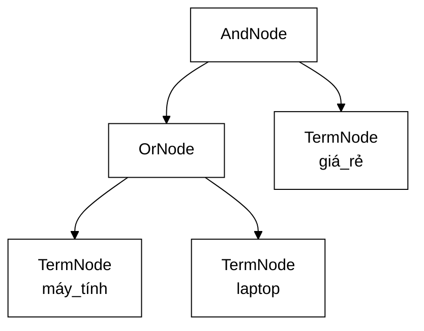

# QueryNode — cấu trúc phẳng mã hoá sẵn một giả định, và cái giá của nó

**File nguồn:** `search-engine/src/main/java/com/vnsearch/query/ast/QueryNode.java` (59 dòng)
**Gói:** `com.vnsearch.query.ast` · **Loại:** `sealed interface` (Java 17) — Composite pattern
**Cài đặt:** [`TermNode`](./TermNode.md) · [`PhraseNode`](./PhraseNode.md) · [`AndNode`](./AndNode.md) · [`OrNode`](./OrNode.md) · [`NotNode`](./NotNode.md)
**Vị trí trong luồng:** kết quả của [`QueryParser`](../QueryParser.md), đầu vào của [`CandidateResolver`](../CandidateResolver.md)
**Đọc kèm:** [`../PostingListMerger.md`](../PostingListMerger.md) · [`../../index/SearchIndex.md`](../../index/SearchIndex.md)

---

## 📌 Hiểu trong 30 giây

Cấu trúc cũ (`ParsedQuery`) lưu **ba danh sách phẳng** — `mustTerms`,
`phrases`, `excludedTerms`. Nghe vô hại, nhưng nó **mã hoá sẵn** một giả định:
*"mọi mustTerm nối với nhau bằng AND"*.

```
   NHỮNG THỨ CẤU TRÚC PHẲNG KHÔNG BIỂU DIỄN ĐƯỢC

   (máy tính OR laptop) AND giá rẻ
   NOT (quảng cáo OR khuyến mãi)

   Không phải "khó viết" — là KHÔNG CÓ CHỖ ĐỂ ĐẶT.
   Ba danh sách phẳng không có khái niệm "lồng nhau".
```



```
   CÂY CHO:  (máy tính OR laptop) AND giá rẻ

               AndNode
              /       \
         OrNode      TermNode(giá_rẻ)
         /     \
   TermNode   TermNode
  (máy_tính)  (laptop)
```

---

## 1. Chứng cứ rằng cấu trúc phẳng đã gây thiệt hại thật

Javadoc dòng 18–20 nêu một chi tiết rất cụ thể:

> *"Đáng chú ý: `PostingListMerger.union` **ĐÃ TỒN TẠI** và đã có test, nhưng
> trước đây **không có đường nào gọi tới nó** từ tầng truy vấn — một cấu trúc dữ
> liệu bị bỏ phí hoàn toàn."*

```
   ĐÂY LÀ MỘT TRIỆU CHỨNG, KHÔNG PHẢI MỘT SỰ TRÙNG HỢP

   Ai đó đã viết union(), đã viết test cho nó, đã kiểm chứng nó đúng.
   Nhưng không dòng nào trong ứng dụng gọi nó.

   Vì sao? Vì NGÔN NGỮ TRUY VẤN không có OR.
   Vì sao ngôn ngữ không có OR? Vì CẤU TRÚC DỮ LIỆU không biểu diễn được.

   ⇒ Một hạn chế của cấu trúc dữ liệu đã lan ngược lên tận
     TÍNH NĂNG mà người dùng nhìn thấy.
```

```
   CÁCH PHÁT HIỆN LOẠI VẤN ĐỀ NÀY TRONG DỰ ÁN CỦA BẠN

   Tìm mã "đúng, có test, nhưng không ai gọi".
   Đó thường KHÔNG phải mã thừa cần xoá — nó là dấu vết của một
   khả năng mà kiến trúc đang chặn lại.

   Xoá nó đi là bỏ lỡ tín hiệu; giữ nguyên mà không hỏi vì sao
   cũng vậy.
```

---

## 2. Composite pattern — vì sao đúng ở đây

```java
public sealed interface QueryNode
        permits TermNode, PhraseNode, AndNode, OrNode, NotNode {
    List<Integer> evaluate(SearchIndex index);
    int estimatedSize(SearchIndex index);
    String describe();
}
```

```
   COMPOSITE: nút LÁ và nút TRONG cùng một giao diện

   LÁ    — TermNode, PhraseNode        (tự cho ra kết quả)
   TRONG — AndNode, OrNode, NotNode    (ghép kết quả của con)

   ⇒ AndNode KHÔNG CẦN BIẾT con nó là lá hay là cây con.
     Nó gọi child.evaluate(index) và nhận về một List<Integer>.
   ⇒ Độ sâu lồng nhau BẤT KỲ, không cần mã đặc biệt cho từng độ sâu.
```

Đệ quy tự nhiên: `evaluate` của nút trong gọi `evaluate` của con, và điều kiện
dừng là nút lá đọc thẳng posting list.

---

## 3. Bất biến trung tâm: mọi `evaluate` trả danh sách **sắp xếp tăng dần**

Javadoc dòng 37–38:

> *"**Bất biến:** mọi `evaluate` đều trả về danh sách docId **sắp xếp tăng dần**,
> để các nút cha ghép lại được bằng two-pointer."*

```
   ĐÂY LÀ BẤT BIẾN CỦA SearchIndex, ĐƯỢC KẾ THỪA LÊN TOÀN BỘ CÂY

   SearchIndex.getPostings  → sắp xếp tăng dần  (nguồn)
        ↓
   TermNode.evaluate        → sắp xếp tăng dần  (chỉ chuyển tiếp)
        ↓
   AndNode / OrNode         → two-pointer GIỮ NGUYÊN tính sắp xếp
        ↓
   NotNode.evaluateAgainst  → phép trừ GIỮ NGUYÊN tính sắp xếp
        ↓
   nút gốc                  → sắp xếp tăng dần

   ⇒ KHÔNG một phép sort nào trong toàn bộ cây.
```

```
   NẾU MỘT NÚT PHÁ BẤT BIẾN

   Ví dụ ai đó viết một nút mới trả về kết quả theo thứ tự điểm số:
        → nút cha gọi PostingListMerger.intersect
        → two-pointer trên danh sách không sắp xếp
        → BỎ SÓT kết quả, KHÔNG ném lỗi
        → truy vấn thiếu tài liệu, không giải thích được

   Cùng lớp lỗi với bất biến của SearchIndex — và cùng cách chữa:
   ép nó, đừng hy vọng.
```

Đây là chuỗi phụ thuộc thứ **tư** của bất biến sắp xếp trong dự án, sau
two-pointer merge, binary search, và nén delta (xem
[`SearchIndex`](../../index/SearchIndex.md)).

---

## 4. `sealed` — vì sao không phải `interface` thường

```java
public sealed interface QueryNode permits TermNode, PhraseNode, AndNode, OrNode, NotNode
```

Javadoc dòng 33–35:

> *"Java 17 cho phép khai báo kín tập cài đặt, nên `switch` trên `QueryNode` có
> **kiểm tra ĐẦY ĐỦ** nhánh — thêm một loại nút mới thì trình biên dịch nhắc mọi
> chỗ cần sửa."*

```java
// Nhờ sealed, switch này được trình biên dịch kiểm tra ĐẦY ĐỦ:
String moTa = switch (node) {
    case TermNode t    -> "term " + t.term();
    case PhraseNode p  -> "cụm " + p.terms();
    case AndNode a     -> "giao " + a.children().size() + " nhánh";
    case OrNode o      -> "hợp " + o.children().size() + " nhánh";
    case NotNode n     -> "phủ định";
    // KHÔNG cần `default` — trình biên dịch biết đã hết
};
```

```
   ── interface thường ────────────────────────────────────
   switch PHẢI có default (hoặc không biên dịch được)
   Thêm loại nút mới:
        → default nuốt nó
        → chạy sai LẶNG LẼ ở mọi chỗ switch
        → phải tự nhớ tìm hết các switch

   ── sealed interface ────────────────────────────────────
   switch KHÔNG cần default
   Thêm loại nút mới:
        → MỌI switch thiếu nhánh đó thành LỖI BIÊN DỊCH
        → trình biên dịch liệt kê chính xác các chỗ cần sửa
```

```
   NGUYÊN TẮC: KHI TẬP KHẢ NĂNG LÀ HỮU HẠN VÀ ĐÃ BIẾT,
   HÃY NÓI VỚI TRÌNH BIÊN DỊCH.

   Đổi lại: mọi cài đặt phải nằm cùng module (và thường cùng gói).
   Với một cây AST thì đó không phải hạn chế — thêm loại nút là
   việc của chính tác giả ngôn ngữ truy vấn, không phải của người
   dùng thư viện.
```

`record` cho mỗi nút bổ sung phần còn lại: bất biến, `equals`/`hashCode` theo
giá trị (dùng được trong test), và **khớp mẫu phân rã** (`case TermNode(String
t)`).

---

## 5. Ba phương thức — và vì sao `estimatedSize` tồn tại

| Phương thức | Ai gọi | Chi phí |
|---|---|---|
| `evaluate(index)` | Nút cha, và [`CandidateResolver`](../CandidateResolver.md) | Đắt — đọc posting list thật |
| `estimatedSize(index)` | [`AndNode`](./AndNode.md) để sắp xếp shortest-first | **Rẻ** — với `TermNode` là $O(1)$ |
| `describe()` | Gỡ lỗi, nhãn trong báo cáo | $O(\text{kích thước cây})$ |

### 5.1 `estimatedSize` — biết trước để tối ưu, mà không phải làm thật

```
   BÀI TOÁN: AndNode muốn giao con NHỎ NHẤT trước
             (vì |A ∩ B| ≤ min(|A|, |B|))

   Nhưng muốn biết con nào nhỏ nhất thì… phải đánh giá nó?
        → đánh giá xong rồi thì sắp xếp còn ý nghĩa gì

   GIẢI: một hàm ước lượng RẺ.
        TermNode.estimatedSize = index.getDocumentFrequency(term)
                                = posting list size = O(1)
```

```
   VÌ SAO "ƯỚC LƯỢNG" LÀ ĐỦ

   Không cần con số chính xác — chỉ cần THỨ TỰ đúng.
   OrNode trả về TỔNG các con (chặn trên, thực tế nhỏ hơn nếu
   chúng chồng lấn), nhưng chặn trên đủ để sắp xếp.

   Ước lượng sai một chút ⇒ thứ tự giao hơi không tối ưu
                          ⇒ chậm hơn một chút
                          ⇒ KHÔNG BAO GIỜ SAI KẾT QUẢ
```

Đây là ranh giới đúng: hàm ước lượng chỉ ảnh hưởng tới **hiệu năng**, không ảnh
hưởng tới **tính đúng đắn** — nên nó được phép sai.

### 5.2 `describe()` — không phải `toString()`

`record` đã sinh sẵn `toString()`, nhưng nó in ra dạng Java:

```
   toString() sinh sẵn:
   AndNode[children=[OrNode[children=[TermNode[term=máy_tính],
   TermNode[term=laptop]]], TermNode[term=giá_rẻ]]]

   describe():
   ((máy_tính OR laptop) AND giá_rẻ)
```

Bản `describe()` đọc được bởi người dùng, và **dán lại vào ô tìm kiếm được**.
Nó dùng để: gỡ lỗi ("truy vấn của tôi được hiểu thành gì?"), làm nhãn trong bảng
đánh giá, và có thể hiển thị cho người dùng ("bạn đang tìm: …").

---

## 6. Hướng dẫn thực hành

### 6.1 Dựng cây bằng tay

```java
// (máy tính OR laptop) AND giá rẻ AND NOT quảng cáo
QueryNode cay = new AndNode(List.of(
        new OrNode(List.of(new TermNode("máy_tính"), new TermNode("laptop"))),
        new TermNode("giá_rẻ"),
        new NotNode(new TermNode("quảng_cáo"))));

System.out.println(cay.describe());
// ((máy_tính OR laptop) AND giá_rẻ AND NOT quảng_cáo)

List<Integer> ketQua = cay.evaluate(index);   // đã sắp xếp tăng dần
```

### 6.2 Duyệt cây bằng `switch` khớp mẫu

```java
/** Đếm số term lá trong một cây truy vấn. */
static int demTerm(QueryNode node) {
    return switch (node) {
        case TermNode t   -> 1;
        case PhraseNode p -> p.terms().size();
        case AndNode a    -> a.children().stream().mapToInt(QueryNode::describe).sum();
        case OrNode o     -> o.children().stream().mapToInt(Main::demTerm).sum();
        case NotNode n    -> demTerm(n.inner());
        // không cần default — sealed bảo đảm đã hết
    };
}
```

```java
/** Thu thập mọi term trong cây — dùng để bôi sáng snippet. */
static void thuThapTerm(QueryNode node, Set<String> ra) {
    switch (node) {
        case TermNode t   -> ra.add(t.term());
        case PhraseNode p -> ra.addAll(p.terms());
        case AndNode a    -> a.children().forEach(c -> thuThapTerm(c, ra));
        case OrNode o     -> o.children().forEach(c -> thuThapTerm(c, ra));
        case NotNode n    -> { /* term bị loại trừ thì KHÔNG bôi sáng */ }
    }
}
```

Nhánh `NotNode` bỏ trống là một quyết định có ý nghĩa: term bị loại trừ không
xuất hiện trong kết quả nên không có gì để bôi sáng. Với `sealed`, nhánh này
**bắt buộc** phải viết ra — nên quyết định đó trở nên hiển nhiên thay vì bị bỏ
sót.

### 6.3 Thêm một loại nút mới — danh sách kiểm tra

Ví dụ `NearNode` (hai term cách nhau tối đa $k$ vị trí):

```java
// ① Thêm vào danh sách permits của QueryNode
public sealed interface QueryNode
        permits TermNode, PhraseNode, AndNode, OrNode, NotNode, NearNode { … }

// ② Cài đặt ba phương thức
public record NearNode(String left, String right, int maxDistance) implements QueryNode {
    @Override public List<Integer> evaluate(SearchIndex index) {
        // filter-and-refine như PhraseNode: giao trước, kiểm khoảng cách sau
        // ⚠️ PHẢI trả về danh sách SẮP XẾP TĂNG DẦN
    }
    @Override public int estimatedSize(SearchIndex index) {
        return Math.min(index.getDocumentFrequency(left),
                        index.getDocumentFrequency(right));
    }
    @Override public String describe() {
        return left + " NEAR/" + maxDistance + " " + right;
    }
}

// ③ Biên dịch → trình biên dịch liệt kê MỌI switch cần bổ sung nhánh
// ④ Cho QueryParser sinh ra nút này
```

Bước ③ là lợi ích cụ thể của `sealed`: không phải tự đi tìm.

### 6.4 Cạm bẫy

| Cạm bẫy | Hậu quả | Cách đúng |
|---|---|---|
| Nút mới trả danh sách **không sắp xếp** | Two-pointer ở nút cha bỏ sót kết quả, im lặng | Luôn giữ bất biến sắp xếp tăng dần |
| `estimatedSize` gọi `evaluate` để cho chính xác | Đánh giá hai lần; mất toàn bộ ý nghĩa của việc ước lượng | Giữ rẻ, chấp nhận sai số |
| Dùng `default` trong `switch` trên `QueryNode` | Mất kiểm tra đầy đủ của `sealed` — loại nút mới bị nuốt lặng lẽ | Bỏ `default`, liệt kê đủ nhánh |
| Đặt cài đặt ở gói/module khác | `sealed` không cho phép | Giữ cùng gói `ast` |
| Cho nút mang trạng thái thay đổi được | Cây có thể được đánh giá nhiều lần (ví dụ `PhraseNode` gọi lại `AndNode`) | Giữ `record` bất biến |
| Gọi `NotNode.evaluate` trực tiếp | Ném `UnsupportedOperationException` | Dùng `evaluateAgainst`, xem [`NotNode`](./NotNode.md) |
| Đánh giá cây trong vòng lặp | `evaluate` đọc posting list — đắt | Đánh giá một lần, dùng lại kết quả |

---

## 7. Độ phức tạp

Chi phí phụ thuộc hình dạng cây; gọi $n$ = số nút lá, $m$ = kích thước posting
list trung bình.

| Nút | `evaluate` | `estimatedSize` |
|---|---|---|
| [`TermNode`](./TermNode.md) | $O(m)$ — vật chất hoá posting list | $O(1)$ |
| [`PhraseNode`](./PhraseNode.md) | $O(km)$ giao + $O(r \log m)$ kiểm cụm từ | $O(k)$ |
| [`AndNode`](./AndNode.md) | $O(\sum m_i)$ + chi phí sắp xếp con | $O(c)$ |
| [`OrNode`](./OrNode.md) | $O(\sum m_i)$ | $O(c)$ |
| [`NotNode`](./NotNode.md) | Ném | $O(1)$ |

```
   ĐIỂM YẾU CHUNG: List<Integer> Ở KHẮP NƠI

   Mọi evaluate trả về List<Integer> ⇒ ĐÓNG HỘP mỗi docId
        16 byte thay vì 4 byte

   Posting list 4.000 mục → ~80 KB rác mỗi nút lá.
   Cây 3 nút lá → ~240 KB rác mỗi truy vấn.

   ⚠️ Đây ĐÚNG LÀ vấn đề mà PostingCursor sinh ra để giải
     (xem ../../index/PostingCursor.md mục 1), nhưng tầng AST
     KHÔNG dùng cursor. Xem đề xuất 2 ở mục 9.
```

---

## 8. Kiểm thử liên quan

| Test | Bảo vệ điều gì |
|---|---|
| `test/java/com/vnsearch/query/ast/QueryAstTest.java` | Đánh giá cây, các tổ hợp AND/OR/NOT |
| `test/java/com/vnsearch/query/QueryParserTest.java` | Cây được dựng đúng từ chuỗi truy vấn |
| `test/java/com/vnsearch/query/PostingListMergerTest.java` | Các phép ghép mà nút trong dùng |

Bộ test hợp đồng cho **mọi** loại nút — đây là thứ một `sealed interface` với 5
cài đặt nên có:

```java
abstract class QueryNodeContractTest {

    abstract QueryNode taoNut();               // nút không tầm thường
    SearchIndex index = dungChiMucMau();

    @Test
    void ketQuaLuonSapXepTangDan() {           // BẤT BIẾN TRUNG TÂM
        List<Integer> r = taoNut().evaluate(index);
        for (int i = 1; i < r.size(); i++) {
            assertTrue(r.get(i - 1) < r.get(i),
                    "docId phải tăng NGHIÊM NGẶT tại vị trí " + i);
        }
    }

    @Test
    void danhGiaHaiLanChoKetQuaGiongNhau() {   // nút phải THUẦN
        QueryNode n = taoNut();
        assertEquals(n.evaluate(index), n.evaluate(index));
    }

    @Test
    void uocLuongKhongDatHonDanhGiaThat() {    // estimatedSize phải RẺ
        QueryNode n = taoNut();
        long batDau = System.nanoTime();
        n.estimatedSize(index);
        long tUocLuong = System.nanoTime() - batDau;

        batDau = System.nanoTime();
        n.evaluate(index);
        long tDanhGia = System.nanoTime() - batDau;

        assertTrue(tUocLuong <= tDanhGia,
                "estimatedSize phải rẻ hơn evaluate, nếu không nó vô nghĩa");
    }

    @Test
    void describeKhongRong() {
        assertFalse(taoNut().describe().isBlank());
    }
}
```

Ca `ketQuaLuonSapXepTangDan` là ca quan trọng nhất: nó canh giữ bất biến mà toàn
bộ tầng truy vấn phụ thuộc, và nó áp dụng cho **mọi** loại nút hiện có lẫn tương
lai.

```powershell
cd search-engine
.\mvnw.cmd -q -Dtest='QueryAstTest' test
```

---

## 9. Liên kết

- Nút lá: [`TermNode.md`](./TermNode.md) · [`PhraseNode.md`](./PhraseNode.md)
- Nút trong: [`AndNode.md`](./AndNode.md) · [`OrNode.md`](./OrNode.md) · [`NotNode.md`](./NotNode.md)
- Nơi cây được dựng từ chuỗi: [`../QueryParser.md`](../QueryParser.md)
- Nơi cây được đánh giá và lọc: [`../CandidateResolver.md`](../CandidateResolver.md)
- Các phép ghép mà nút trong dùng: [`../PostingListMerger.md`](../PostingListMerger.md)
- Nguồn của bất biến sắp xếp: [`../../index/SearchIndex.md`](../../index/SearchIndex.md)
- Tối ưu đang bị bỏ qua ở tầng này: [`../../index/PostingCursor.md`](../../index/PostingCursor.md)
