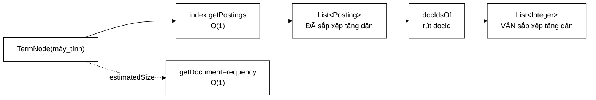

# TermNode — 31 dòng, và cả ba đều dựa vào bất biến của tầng dưới

**File nguồn:** `search-engine/src/main/java/com/vnsearch/query/ast/TermNode.java` (31 dòng)
**Gói:** `com.vnsearch.query.ast` · **Loại:** `record` bất biến — nút **LÁ** của cây truy vấn
**Vị trí trong luồng:** điểm tiếp xúc duy nhất giữa cây truy vấn và [`SearchIndex`](../../index/SearchIndex.md)
**Đọc kèm:** [`QueryNode.md`](./QueryNode.md) · [`../PostingListMerger.md`](../PostingListMerger.md) · [`../../index/SearchIndex.md`](../../index/SearchIndex.md)

---

## 📌 Hiểu trong 30 giây

Nút đơn giản nhất của cây: một term. Cả ba phương thức đều là **một dòng**, và
cả ba đều rẻ **chỉ vì** tầng chỉ mục đã làm phần khó.

```java
public record TermNode(String term) implements QueryNode {
    public List<Integer> evaluate(SearchIndex index) {
        return PostingListMerger.docIdsOf(index.getPostings(term));
    }
    public int estimatedSize(SearchIndex index) {
        return index.getDocumentFrequency(term);      // df CHÍNH LÀ số kết quả, O(1)
    }
    public String describe() {
        return term;
    }
}
```



---

## 1. `evaluate` — chỉ chuyển tiếp, không sắp xếp

```java
return PostingListMerger.docIdsOf(index.getPostings(term));
```

Javadoc dòng 11–13:

> *"Kết quả chính là posting list của term đó — **đã sắp xếp tăng dần theo
> docId** nhờ bất biến của `SearchIndex`, nên các nút cha ghép lại được bằng
> two-pointer **mà không phải sort**."*

```
   CHUỖI PHỤ THUỘC

   InvertedIndex.addDocument  ép docId tăng dần, chỉ APPEND
        ↓  (bất biến được sinh ra MIỄN PHÍ)
   SearchIndex.getPostings    trả danh sách sắp xếp tăng dần
        ↓  (TermNode chỉ RÚT docId, không đụng thứ tự)
   TermNode.evaluate          trả danh sách sắp xếp tăng dần
        ↓
   AndNode / OrNode           two-pointer O(m+n), không sort

   ⇒ TermNode KHÔNG LÀM GÌ để giữ bất biến — nó chỉ KHÔNG PHÁ nó.
```

```
   NẾU TERMNODE PHẢI TỰ SORT

   Truy vấn 3 term, posting list trung bình 1.500 mục:
        3 × O(1500 × log 1500) ≈ 3 × 16.000 = 48.000 phép so sánh
        cộng 3 lần cấp phát mảng tạm

   MỖI TRUY VẤN. Với 1.000 truy vấn/phút: 48 triệu phép so sánh/phút
   cho một công việc mà tầng dưới đã làm sẵn.
```

### 1.1 `docIdsOf` — nơi rác GC được sinh ra

```java
// trong PostingListMerger
public static List<Integer> docIdsOf(List<Posting> postings) { … }
```

```
   Posting chứa (docId, tf, positions).
   Nút cây chỉ cần docId.

   docIdsOf rút ra một List<Integer> mới:
   ├─ mỗi docId bị ĐÓNG HỘP thành Integer 16 byte (thay vì 4)
   ├─ posting list 4.000 mục ⇒ ~80 KB rác
   └─ và thông tin tf/positions BỊ VỨT ĐI

   ⚠️ Đây CHÍNH LÀ vấn đề mà PostingCursor sinh ra để giải
     (xem ../../index/PostingCursor.md mục 1: "cách cũ
      PostingListMerger.docIdsOf vật chất hoá…").

   Cursor đã tồn tại. Tầng AST không dùng.
```

```
   VÌ SAO VỨT tf/positions LÀ MỘT VẤN ĐỀ RIÊNG

   Sau khi cây trả về danh sách docId, tầng xếp hạng phải HỎI LẠI
   chỉ mục để lấy tf:
        getTermFrequency(term, docId)  →  O(log n) binary search
        × 3 term × 1.000 ứng viên     =  3.000 lần tra

   Mà tf ĐÃ NẰM TRONG Posting mà TermNode vừa đọc và vứt đi.

   Một cursor giữ nguyên Posting sẽ cho tầng xếp hạng đọc tf
   trực tiếp — bỏ hẳn 3.000 lần binary search.
```

---

## 2. `estimatedSize` — vì sao `df` là con số **chính xác**, không phải ước lượng

```java
public int estimatedSize(SearchIndex index) {
    return index.getDocumentFrequency(term); // df chinh la so ket qua, O(1)
}
```

```
   ĐỊNH NGHĨA:
   document frequency = số tài liệu chứa term
                      = số posting trong posting list
                      = số phần tử mà evaluate() sẽ trả về

   ⇒ Với TermNode, "ước lượng" là CHÍNH XÁC TUYỆT ĐỐI.
   ⇒ Và nó tốn O(1) (chỉ là getPostings(term).size()).
```

```
   SO SÁNH ĐỘ CHÍNH XÁC CỦA estimatedSize QUA CÁC NÚT

   TermNode    — CHÍNH XÁC        (df = |kết quả|)
   PhraseNode  — chặn trên        (min df; thực tế nhỏ hơn nhiều
                                   vì còn phải liền nhau)
   AndNode     — chặn trên        (min của các con)
   OrNode      — chặn trên        (tổng các con, bỏ qua chồng lấn)
   NotNode     — chặn trên thô    (toàn corpus)

   ⇒ Càng gần lá càng chính xác. Đủ dùng, vì [`AndNode`](./AndNode.md)
     chỉ cần THỨ TỰ đúng chứ không cần con số đúng.
```

Điểm mấu chốt: `getDocumentFrequency` là $O(1)$ **nhờ** [`SearchIndex`](../../index/SearchIndex.md)
cài nó là `getPostings(term).size()` — một phép tra bảng băm cộng đọc trường
`size`. Nếu nó phải đếm thì tối ưu shortest-first sẽ đắt hơn phần nó tiết kiệm.

---

## 3. `describe()` — trả về chính term

```java
public String describe() { return term; }
```

```
   TermNode("máy_tính").describe()  →  "máy_tính"

   Nút cha ghép lại:
   AndNode.describe()  →  "(máy_tính AND giá_rẻ)"
   OrNode.describe()   →  "(máy_tính OR laptop)"

   ⇒ Đệ quy Composite: nút lá cho chuỗi cơ sở, nút trong ghép.
```

Chú ý term ở đây là term **sau khi tách từ** (`máy_tính` có gạch dưới), không
phải chuỗi người dùng gõ (`máy tính`). Đó là dạng đúng để hiển thị khi gỡ lỗi —
nó cho thấy tokenizer đã hiểu truy vấn thế nào.

---

## 4. `record` một trường — vì sao vẫn đáng có một lớp

```java
public record TermNode(String term) implements QueryNode { }
```

Cám dỗ: *"chỉ có một `String`, sao không dùng thẳng `String` trong cây?"*

```
   ── Nếu cây chứa Object và ta ép kiểu ────────────────────
   Object con = children.get(0);
   if (con instanceof String s)          → term
   else if (con instanceof QueryNode n)  → cây con
   ⇒ mất hoàn toàn kiểm tra kiểu, mất sealed, mất switch đầy đủ

   ── Có TermNode ──────────────────────────────────────────
   Mọi con đều là QueryNode
   ⇒ AndNode không cần biết con nó là lá hay cây
   ⇒ switch có kiểm tra đầy đủ
   ⇒ thêm phương thức (estimatedSize, describe) không phá gì
```

Đây là bản chất của Composite: **lá và cây trong phải cùng kiểu**, kể cả khi lá
chỉ bọc một giá trị nguyên thuỷ.

---

## 5. Hướng dẫn thực hành

### 5.1 Dùng trực tiếp

```java
QueryNode n = new TermNode("máy_tính");

System.out.println(n.describe());              // máy_tính
System.out.println(n.estimatedSize(index));    // ví dụ 1639
List<Integer> docs = n.evaluate(index);        // [3, 17, 42, …] tăng dần
```

### 5.2 Bẫy phổ biến nhất: term chưa qua tokenizer

```java
// ✗ SAI — chuỗi người dùng gõ
new TermNode("máy tính")        // có KHOẢNG TRẮNG
    .evaluate(index);           // → List.of() vì chỉ mục không có khoá này

// ✗ SAI — chưa hạ chữ thường / chưa chuẩn hoá NFC
new TermNode("Máy_Tính").evaluate(index);      // → rỗng

// ✓ ĐÚNG — đi qua tokenizer
Tokenizer tk = /* CÙNG thể hiện mà chỉ mục dùng */;
List<Token> tokens = tk.tokenize("máy tính");
QueryNode n = new TermNode(tokens.get(0).term());   // "máy_tính"
```

```
   ĐÂY LÀ BẤT BIẾN SONG HÀNH (xem ../../index/Tokenizer.md mục 1)
   Ở MỨC MỘT NÚT LÁ.

   TermNode KHÔNG kiểm tra gì. Nó chỉ tra khoá.
   Khoá sai ⇒ danh sách rỗng ⇒ KHÔNG có lỗi nào được ném.

   Đây là lý do QueryParser phải dựng cây, không phải người dùng
   API — vì chỉ QueryParser mới cầm đúng tokenizer.
```

### 5.3 Term không tồn tại — hành vi đúng là im lặng

```java
new TermNode("term_khong_ton_tai").evaluate(index);       // → List.of()
new TermNode("term_khong_ton_tai").estimatedSize(index);  // → 0
```

```
   VÀ ĐIỀU NÀY LÀM AndNode HOẠT ĐỘNG ĐÚNG:

   estimatedSize = 0  ⇒  được sắp xếp ĐẦU TIÊN (shortest-first)
                     ⇒  accumulator = List.of() ngay lượt đầu
                     ⇒  AndNode thoát sớm, KHÔNG đánh giá con nào khác

   ⇒ Truy vấn chứa một term không tồn tại tốn gần như 0 công.
     Rỗng là PHẦN TỬ HẤP THỤ của phép giao, và cây tận dụng đúng
     tính chất đó.
```

### 5.4 Cạm bẫy

| Cạm bẫy | Hậu quả | Cách đúng |
|---|---|---|
| Truyền term chưa qua tokenizer | Kết quả rỗng, **không lỗi nào được ném** | Luôn dựng cây qua [`QueryParser`](../QueryParser.md) |
| Dùng tokenizer khác với tokenizer của chỉ mục | Kết quả rỗng im lặng | Bất biến song hành |
| Cho `estimatedSize` gọi `evaluate` "cho chính xác" | Không cần — với `TermNode` `df` đã chính xác tuyệt đối | Giữ `getDocumentFrequency` |
| Sắp xếp lại kết quả của `evaluate` | Thừa; và nếu sort sai chiều thì phá bất biến của cả cây | Không đụng thứ tự |
| Sửa danh sách trả về | `docIdsOf` trả danh sách mới nên "an toàn", nhưng đừng dựa vào | Coi là chỉ đọc |
| Tạo `TermNode` cho một cụm từ | Cụm từ cần [`PhraseNode`](./PhraseNode.md) (kiểm tra liền nhau) | Dùng đúng loại nút |

---

## 6. Độ phức tạp & chi phí

| Phương thức | Chi phí | Cấp phát |
|---|---|---|
| `evaluate` | $O(m)$ với $m$ = độ dài posting list | **$m$ đối tượng `Integer` + 1 `ArrayList`** |
| `estimatedSize` | $O(1)$ | 0 |
| `describe` | $O(1)$ | 0 |

```
   CHI PHÍ THẬT CỦA evaluate

   Posting list 1.639 mục (term "công_nghệ"):
        1.639 × 16 byte (Integer)  =  26 KB
        + ArrayList (Object[] 1.639 ô × 4 byte)  =  6,5 KB
        ────────────────────────────────────────────
        ~33 KB rác cho MỘT nút lá

   Truy vấn 3 term ⇒ ~100 KB rác
   1.000 truy vấn/phút ⇒ 100 MB/phút chảy qua vườn ươm

   Hậu quả không phải "tốn RAM" (rác vườn ươm dọn rẻ)
   mà là ĐỘ TRỄ p99: mỗi lần GC là một khoảng dừng.
```

```
   SO SÁNH: NẾU DÙNG PostingCursor

   evaluate → cursor: 1 object 24 byte, KHÔNG phụ thuộc m
   ⇒ 33 KB  →  24 byte   (giảm 1.400 lần)
   ⇒ và giữ được tf/positions cho tầng xếp hạng
   ⇒ và mở khoá skipTo cho AndNode
```

---

## 7. Kiểm thử liên quan

| Test | Bảo vệ điều gì |
|---|---|
| `test/java/com/vnsearch/query/ast/QueryAstTest.java` | Đánh giá nút lá trong ngữ cảnh cây |
| `test/java/com/vnsearch/query/PostingListMergerTest.java` | `docIdsOf` |
| `test/java/com/vnsearch/index/InvertedIndexTest.java` | Bất biến sắp xếp mà nút này dựa vào |

```java
class TermNodeTest {

    private final SearchIndex index = dungChiMucMau();   // docId 0..9

    @Test
    void traVeDocIdSapXepTangDan() {
        List<Integer> r = new TermNode("máy_tính").evaluate(index);
        for (int i = 1; i < r.size(); i++) {
            assertTrue(r.get(i - 1) < r.get(i));
        }
    }

    @Test
    void khopVoiPostingListCuaChiMuc() {
        List<Integer> quaNut = new TermNode("máy_tính").evaluate(index);
        List<Integer> truc = index.getPostings("máy_tính").stream()
                .map(Posting::docId).toList();
        assertEquals(truc, quaNut, "TermNode chỉ được RÚT docId, không đổi gì");
    }

    @Test
    void uocLuongChinhXacTuyetDoi() {              // df == |kết quả|
        TermNode n = new TermNode("máy_tính");
        assertEquals(n.evaluate(index).size(), n.estimatedSize(index),
                "Với TermNode, df PHẢI bằng đúng số kết quả");
    }

    @Test
    void termKhongTonTai() {
        TermNode n = new TermNode("khong_co_term_nay");
        assertTrue(n.evaluate(index).isEmpty());
        assertEquals(0, n.estimatedSize(index));
    }

    @Test
    void describeTraVeChinhTerm() {
        assertEquals("máy_tính", new TermNode("máy_tính").describe());
    }

    @Test
    void haiNutCungTermThiBangNhau() {             // record equals
        assertEquals(new TermNode("a"), new TermNode("a"));
        assertNotEquals(new TermNode("a"), new TermNode("b"));
    }
}
```

Ca `uocLuongChinhXacTuyetDoi` đáng giữ: nó khoá lại tính chất *"với `TermNode`,
ước lượng không phải ước lượng"* — nếu ai đó đổi cách cài
`getDocumentFrequency` (ví dụ thành một xấp xỉ để tiết kiệm bộ nhớ), test này
đỏ và buộc họ cân nhắc hậu quả với shortest-first.

```powershell
cd search-engine
.\mvnw.cmd -q -Dtest='QueryAstTest' test
```

---

## 8. Chấm theo chuẩn doanh nghiệp

| Tiêu chí | Điểm | Nhận xét |
|---|---|---|
| Đơn giản | 10/10 | Ba phương thức, mỗi cái một dòng; không thể gọn hơn |
| Tận dụng bất biến tầng dưới | 10/10 | Không sort, không kiểm tra lại — chỉ chuyển tiếp; và Javadoc nói rõ vì sao được phép |
| Chọn hàm ước lượng | 10/10 | `df` vừa $O(1)$ vừa chính xác tuyệt đối — không có lựa chọn nào tốt hơn |
| Đúng mẫu Composite | 10/10 | Bọc một `String` thành nút là đúng, dù nghe thừa |
| Bất biến (record) | 10/10 | An toàn khi cây được đánh giá nhiều lần (`PhraseNode` làm vậy) |
| **Hiệu năng** | **4/10** | `docIdsOf` đóng hộp mọi docId **và** vứt bỏ `tf`/`positions` — hai thiệt hại từ một dòng |
| Bảo vệ khỏi dùng sai | 3/10 | Term chưa tokenize cho kết quả rỗng im lặng; không có cách nào phát hiện |
| Khả năng kiểm thử | 6/10 | Được test gián tiếp qua `QueryAstTest`; chưa có ca riêng |

**Ba đề xuất nâng lên mức sản phẩm:**

1. **Trả về [`PostingCursor`](../../index/PostingCursor.md) thay vì `List<Integer>`.**
   Một dòng `docIdsOf` gây **hai** thiệt hại: đóng hộp 33 KB rác mỗi nút, và vứt
   bỏ `tf`/`positions` khiến tầng xếp hạng phải hỏi lại chỉ mục 3.000 lần
   ($O(\log n)$ mỗi lần). `index.cursor(term)` đã có sẵn, đúng chữ ký, chỉ chờ
   được dùng. Đây là đề xuất ở mức giao diện [`QueryNode`](./QueryNode.md) nhưng
   `TermNode` là nơi lợi ích lớn nhất.
2. **Cảnh báo khi term trông như chưa qua tokenizer.** Kết quả rỗng im lặng là
   chế độ hỏng khó chẩn đoán nhất của cả tầng truy vấn. Một phép kiểm tra rẻ ở
   hàm dựng bắt được lỗi phổ biến nhất:
   ```java
   public TermNode {
       if (term == null || term.isBlank()) {
           throw new IllegalArgumentException("term không được rỗng");
       }
       if (term.indexOf(' ') >= 0) {
           throw new IllegalArgumentException(
                   "TermNode nhận term ĐÃ TÁCH TỪ (dùng '_' nối), nhận được: '" + term
                   + "'. Cụm từ nhiều tiếng phải dùng PhraseNode hoặc đi qua QueryParser.");
       }
   }
   ```
3. **Thêm `TermNodeTest.java`** (mục 7). Ca `khopVoiPostingListCuaChiMuc` khoá
   lại tính chất "chỉ chuyển tiếp, không đổi gì" — nếu ai đó thêm bất kỳ xử lý
   nào vào `evaluate` (lọc, sắp xếp lại, khử trùng), test đỏ ngay và buộc họ giải
   thích.

---

## 9. Liên kết

- Giao diện và Composite pattern: [`QueryNode.md`](./QueryNode.md)
- Nút lá còn lại, dùng nút này bên trong: [`PhraseNode.md`](./PhraseNode.md)
- Nút cha tiêu thụ `estimatedSize` để sắp xếp: [`AndNode.md`](./AndNode.md)
- Nơi `docIdsOf` được cài: [`../PostingListMerger.md`](../PostingListMerger.md)
- Nguồn của bất biến sắp xếp: [`../../index/SearchIndex.md`](../../index/SearchIndex.md) · [`../../index/InvertedIndex.md`](../../index/InvertedIndex.md)
- Tối ưu đang bị bỏ qua: [`../../index/PostingCursor.md`](../../index/PostingCursor.md)
- Nơi term được sinh ra đúng dạng: [`../QueryParser.md`](../QueryParser.md) · [`../../index/Tokenizer.md`](../../index/Tokenizer.md)
