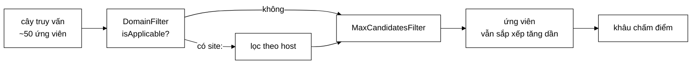

# CandidateFilter — thân hàm 104 dòng chia thành các lớp đo được riêng

**File nguồn:** `search-engine/src/main/java/com/vnsearch/query/filter/CandidateFilter.java` (54 dòng)
**Gói:** `com.vnsearch.query.filter` · **Loại:** giao diện (2 phương thức + 1 `default` + 1 `record` lồng) — Chain of Responsibility
**Cài đặt hiện có:** [`DomainFilter`](./DomainFilter.md) · [`MaxCandidatesFilter`](./MaxCandidatesFilter.md)
**Vị trí trong luồng:** chạy **sau** cây truy vấn ([`QueryNode`](../ast/QueryNode.md)), **trước** khâu chấm điểm
**Đọc kèm:** [`../CandidateResolver.md`](../CandidateResolver.md) · [`../ast/QueryNode.md`](../ast/QueryNode.md)

---

## 📌 Hiểu trong 30 giây

`CandidateResolver.resolve` từng có ba tầng lọc **chôn cứng** trong một thân hàm
104 dòng. Giao diện này tách mỗi tầng thành một lớp.

```
   BA HẬU QUẢ CỦA THÂN HÀM 104 DÒNG (Javadoc dòng 12–16)

   ① THÊM BỘ LỌC = SỬA THÂN HÀM
      (theo domain, theo ngày đăng, theo ngôn ngữ, theo độ dài…)
      ⇒ vi phạm nguyên tắc Mở/Đóng

   ② KHÔNG TEST RIÊNG ĐƯỢC TỪNG TẦNG
      muốn test lọc domain phải dựng cả chỉ mục + cả truy vấn

   ③ KHÔNG ĐO ĐƯỢC
      "tầng nào loại bao nhiêu ứng viên, tốn bao nhiêu ms?"
      ⇒ không trả lời được ⇒ không biết tối ưu chỗ nào
```



---

## 1. Thứ tự lọc — "rẻ và loại nhiều trước"

Javadoc dòng 21–28 nêu nguyên tắc và con số:

```
   1. Giao posting list   5011 → ~50   (rẻ nhất, loại nhiều nhất)
   2. Khớp cụm từ          ~50 → ~20   (đắt: binary search mỗi tài liệu)
   3. Loại trừ             ~20 → ~19   (rẻ: tra HashSet)

   Nếu đảo thứ tự — kiểm tra cụm từ TRƯỚC khi giao — phải chạy
   matchesPhrase trên 5.011 tài liệu thay vì 50
   ⇒ CHẬM HƠN 100 LẦN.
```

```
   HAI CHIỀU CỦA "TỐT" KHI XẾP THỨ TỰ BỘ LỌC

              RẺ              LOẠI NHIỀU
   Tầng 1     ✓✓✓             ✓✓✓        ← rõ ràng phải đứng đầu
   Tầng 2     ✗ (đắt)         ✓✓
   Tầng 3     ✓✓              ✗ (loại ít)

   Khi hai chiều mâu thuẫn (tầng 2 vs tầng 3), quy tắc là:
   ĐẶT TẦNG LOẠI NHIỀU TRƯỚC, vì nó làm tầng sau chạy trên
   tập nhỏ hơn.

   ⇒ Tầng 2 (đắt nhưng loại 60%) đứng trước tầng 3 (rẻ nhưng
     loại 5%) — dù tầng 3 rẻ hơn.
```

```
   CÁCH SUY RA: TỔNG CHI PHÍ

   Gọi c_i = chi phí/phần tử của tầng i, s_i = tỉ lệ giữ lại

   Thứ tự 2→3:  50·c₂ + 20·c₃
   Thứ tự 3→2:  50·c₃ + 47·c₂        (tầng 3 chỉ loại 5%)

   Với c₂ ≫ c₃:  50c₂ + 20c₃  <  47c₂ + 50c₃  chỉ khi 3c₂ > 30c₃
                 ⇒ tức khi c₂ > 10·c₃

   matchesPhrase (~500 ns) vs tra HashSet (~20 ns) ⇒ tỉ lệ 25:1
   ⇒ Thứ tự 2→3 ĐÚNG, nhưng biên độ không lớn.
```

> ⚠️ **Chú ý:** ba tầng mô tả trong Javadoc là ba tầng của **bản cũ**. Hai cài
> đặt hiện có ([`DomainFilter`](./DomainFilter.md), [`MaxCandidatesFilter`](./MaxCandidatesFilter.md))
> là bộ lọc **khác** — tầng 1 và 2 nay đã chuyển vào cây truy vấn
> ([`AndNode`](../ast/AndNode.md), [`PhraseNode`](../ast/PhraseNode.md)), tầng 3
> vào [`NotNode`](../ast/NotNode.md). Javadoc chưa cập nhật theo. Xem đề xuất 1.

---

## 2. Ba thành phần của giao diện

```java
public interface CandidateFilter {
    List<Integer> apply(List<Integer> candidates, FilterContext context);
    String name();
    default boolean isApplicable(FilterContext context) { return true; }
    record FilterContext(SearchIndex index, QueryParser.ParsedQuery parsed) { }
}
```

### 2.1 `isApplicable` — bỏ qua hẳn một tầng

Javadoc dòng 41–45:

> *"Cho phép bỏ qua hẳn một tầng thay vì chạy nó rồi phát hiện không có gì để
> lọc — ví dụ `PhraseFilter` khi truy vấn không có dấu ngoặc kép."*

```
   KHÔNG CÓ isApplicable:
        for (CandidateFilter f : filters) {
            candidates = f.apply(candidates, ctx);
        }
        → DomainFilter chạy dù không có "site:"
        → nó duyệt 50 ứng viên, gọi getDocument 50 lần,
          phân tích 50 URL… rồi trả về đúng danh sách cũ

   CÓ isApplicable:
        for (CandidateFilter f : filters) {
            if (!f.isApplicable(ctx)) continue;      // ← MỘT phép so sánh
            candidates = f.apply(candidates, ctx);
        }
        → DomainFilter bị bỏ qua bằng `siteFilter() != null`
```

```
   VÌ SAO `default` TRẢ true

   Phần lớn bộ lọc luôn áp dụng (MaxCandidatesFilter chẳng hạn).
   Cho mặc định là true nghĩa là:
   ├─ cài đặt đơn giản chỉ cần viết apply() + name()
   └─ cài đặt có điều kiện thì GHI ĐÈ — và việc ghi đè đó
      trở thành một tuyên bố rõ ràng trong mã

   ⇒ Chi phí mặc định bằng 0, lợi ích chỉ hiện khi cần.
```

### 2.2 `name()` — để đo được từng tầng

```java
/** Ten ngan gon, dung lam nhan khi do chi phi tung tang. */
String name();
```

Đây là câu trả lời trực tiếp cho hậu quả ③ ở mục 1:

```
   BẢNG ĐO MÀ name() CHO PHÉP DỰNG

   ┌────────────────┬──────────┬──────────┬─────────┐
   │ Tầng lọc       │ Vào      │ Ra       │ Thời gian│
   ├────────────────┼──────────┼──────────┼─────────┤
   │ site           │    4.812 │      142 │  1,2 ms │
   │ max-candidates │      142 │      142 │  0,0 ms │
   └────────────────┴──────────┴──────────┴─────────┘

   Không có name(): phải dùng getClass().getSimpleName()
        → "DomainFilter" thay vì "site"
        → và hai thể hiện MaxCandidatesFilter với ngưỡng khác nhau
          sẽ có cùng nhãn

   Cùng lý do với Tokenizer.name() — xem ../../index/Tokenizer.md mục 2.3.
```

### 2.3 `FilterContext` — gói dữ liệu dùng chung

```java
record FilterContext(SearchIndex index, QueryParser.ParsedQuery parsed) { }
```

```
   VÌ SAO GÓI THAY VÌ HAI THAM SỐ

   apply(candidates, index, parsed)          ← hai tham số
   apply(candidates, context)                ← một gói

   Thêm dữ liệu dùng chung (ví dụ ngày hiện tại cho một
   DateFilter, hay ngôn ngữ ưu tiên):
   ├─ hai tham số → đổi CHỮ KÝ ⇒ sửa MỌI cài đặt
   └─ một gói     → thêm trường vào record ⇒ cài đặt cũ không đụng

   ⇒ Cùng lý do với CrawlTask mang sẵn `host`
     (xem ../../crawler/frontier/CrawlTask.md).
```

> ⚠️ Nhưng `record` là bất biến về hình thức: thêm một trường vẫn phá vỡ mọi nơi
> **tạo** `FilterContext` (dù không phá nơi **dùng** nó). Với một điểm tạo duy
> nhất ở [`CandidateResolver`](../CandidateResolver.md), đó là chi phí chấp nhận
> được.

---

## 3. Bất biến: vào sắp xếp, ra cũng sắp xếp

```java
/**
 * Loc danh sach ung vien. Danh sach dau vao va dau ra deu SAP XEP TANG DAN
 * theo docId — bat bien nay phai duoc moi cai dat giu.
 */
```

```
   ĐÂY LÀ LẦN THỨ SÁU BẤT BIẾN SẮP XẾP XUẤT HIỆN TRONG DỰ ÁN

   ① SearchIndex.getPostings          — nguồn
   ② PostingListMerger.intersect/union — two-pointer
   ③ InvertedIndex binary search
   ④ VByteCodec delta encoding
   ⑤ QueryNode.evaluate               — toàn bộ cây
   ⑥ CandidateFilter.apply            — ở đây

   ⇒ Nó không còn là một chi tiết cài đặt; nó là MỘT GIAO ƯỚC
     XUYÊN SUỐT của cả hệ thống.
```

```
   VÌ SAO BỘ LỌC PHẢI GIỮ NÓ

   ① Các tầng lọc NỐI TIẾP nhau — đầu ra tầng này là đầu vào tầng sau
   ② Khâu chấm điểm phía sau có thể dùng two-pointer/binary search
   ③ Kết quả cuối trả về theo docId tăng dần ⇒ tất định, lặp lại được

   Cách giữ RẤT DỄ: cả hai cài đặt hiện có đều chỉ LỌC BỚT
   (duyệt theo thứ tự, giữ hoặc bỏ) — không sắp xếp lại gì.

   ⇒ Bất biến được giữ MIỄN PHÍ, miễn là không ai dùng Set
     hoặc sắp xếp lại theo tiêu chí khác.
```

Cạm bẫy dễ mắc nhất: một bộ lọc "ưu tiên tài liệu mới" sắp xếp lại theo ngày
đăng — nó vẫn "lọc" đúng nhưng phá bất biến cho mọi tầng sau.

---

## 4. Ranh giới với cây truy vấn — vì sao có hai mẫu thiết kế

Đây là điểm kiến trúc quan trọng nhất, được [`DomainFilter`](./DomainFilter.md)
giải thích rõ:

```
   COMPOSITE (QueryNode)          CHAIN OF RESPONSIBILITY (CandidateFilter)
   ──────────────────────         ──────────────────────────────────────────
   Quan hệ BOOLEAN giữa term      Ràng buộc trên SIÊU DỮ LIỆU
   Làm việc trên posting list     Làm việc trên tài liệu đã có
   Có cấu trúc CÂY (lồng nhau)    Là một DANH SÁCH tuyến tính
   AND / OR / NOT / cụm từ        site: / giới hạn số lượng / ngày / ngôn ngữ

   ⇒ "site:vnexpress.net" KHÔNG phải một term:
     nó không có posting list nào tương ứng.
     Đưa nó vào cây sẽ buộc phải dựng một chỉ mục phụ host → docIds.
```

```
   QUY TẮC PHÂN CÔNG

   Có posting list?  →  nút trong CÂY
   Không có?         →  tầng trong CHUỖI LỌC

   Và chuỗi lọc chạy SAU cây, khi tập đã nhỏ (~50 ứng viên)
   ⇒ kiểm tra trực tiếp từng tài liệu là đủ nhanh
   ⇒ không cần chỉ mục phụ nào
```

---

## 5. Hướng dẫn thực hành

### 5.1 Viết một bộ lọc mới — mẫu đầy đủ

```java
package com.vnsearch.query.filter;

import com.vnsearch.model.WebDocument;
import java.time.Instant;
import java.util.ArrayList;
import java.util.List;

/** Chỉ giữ tài liệu crawl trong N ngày gần đây (toán tử {@code recent:7}). */
public final class RecentFilter implements CandidateFilter {

    private final int soNgay;

    public RecentFilter(int soNgay) {
        if (soNgay <= 0) throw new IllegalArgumentException("soNgay phải > 0");
        this.soNgay = soNgay;
    }

    @Override
    public boolean isApplicable(FilterContext context) {
        return context.parsed().recentDays() != null;      // cần thêm trường vào ParsedQuery
    }

    @Override
    public List<Integer> apply(List<Integer> candidates, FilterContext context) {
        Instant moc = Instant.now().minusSeconds(soNgay * 86_400L);
        List<Integer> giu = new ArrayList<>(candidates.size());
        for (int docId : candidates) {                     // ← DUYỆT THEO THỨ TỰ
            WebDocument doc = context.index().getDocument(docId);
            if (doc != null && doc.getCrawledAt() != null && doc.getCrawledAt().isAfter(moc)) {
                giu.add(docId);                            // ⇒ bất biến sắp xếp GIỮ NGUYÊN
            }
        }
        return giu;
    }

    @Override
    public String name() { return "recent"; }
}
```

```
   BA ĐIỂM BẮT BUỘC

   ① Duyệt candidates THEO THỨ TỰ, chỉ giữ/bỏ
      ⇒ bất biến sắp xếp tự được giữ
   ② isApplicable trả false khi không có gì để lọc
      ⇒ không tốn công duyệt vô ích
   ③ name() ngắn, phản ánh CẤU HÌNH nếu bộ lọc có tham số
      ⇒ "recent" hay "recent-7"? Xem đề xuất 3.
```

Cắm vào chuỗi:

```java
List<CandidateFilter> filters = List.of(
        new DomainFilter(),
        new RecentFilter(7),           // ← thêm MỘT dòng
        new MaxCandidatesFilter());
```

### 5.2 Đo chi phí từng tầng — thứ mà `name()` cho phép

```java
List<Integer> ungVien = cay.evaluate(index);
FilterContext ctx = new FilterContext(index, parsed);

System.out.printf("%-16s %8s %8s %10s%n", "Tầng", "Vào", "Ra", "Thời gian");
for (CandidateFilter f : filters) {
    if (!f.isApplicable(ctx)) {
        System.out.printf("%-16s %8s%n", f.name(), "(bỏ qua)");
        continue;
    }
    int vao = ungVien.size();
    long batDau = System.nanoTime();
    ungVien = f.apply(ungVien, ctx);
    long ns = System.nanoTime() - batDau;
    System.out.printf("%-16s %8d %8d %8.2f ms%n", f.name(), vao, ungVien.size(), ns / 1e6);
}
```

```
   Tầng                  Vào       Ra  Thời gian
   site                 4812      142     1.24 ms
   max-candidates        142      142     0.00 ms

   ⇒ Bảng này TRẢ LỜI ĐƯỢC câu hỏi mà bản cũ không trả lời được:
     "tầng nào loại bao nhiêu, tốn bao nhiêu".
   ⇒ Và nó chỉ ra ngay chỗ đáng tối ưu: `site` loại 97% ứng viên
     nhưng chạy SAU cây — nếu có chỉ mục host thì lọc được sớm hơn.
```

### 5.3 Cạm bẫy khi cài đặt giao diện này

| Cạm bẫy | Hậu quả | Cách đúng |
|---|---|---|
| Sắp xếp lại kết quả (theo ngày, theo điểm…) | Phá bất biến cho **mọi** tầng sau và cả khâu chấm điểm | Chỉ lọc bớt, giữ thứ tự docId |
| Dùng `HashSet` rồi trả `new ArrayList<>(set)` | Mất thứ tự — cùng hậu quả trên | Duyệt tuần tự |
| Quên ghi đè `isApplicable` khi bộ lọc có điều kiện | Duyệt vô ích mỗi truy vấn | Ghi đè |
| Sửa danh sách `candidates` đầu vào | Tầng trước có thể còn giữ tham chiếu | Tạo danh sách mới |
| Bộ lọc **thêm** phần tử | Vi phạm ngữ nghĩa "lọc"; và có thể phá thứ tự | Chỉ được bớt |
| `name()` không phản ánh cấu hình | Hai thể hiện cùng lớp, khác tham số ⇒ cùng nhãn | Đưa tham số vào tên |
| Bộ lọc đắt đặt trước bộ lọc loại nhiều | Chạy trên tập lớn không cần thiết | "Rẻ và loại nhiều trước" |
| Giữ trạng thái trong bộ lọc | Truy vấn chạy đa luồng ở Spring Boot ⇒ đua | Giữ thuần, hoặc bất biến |

---

## 6. Độ phức tạp

Giao diện không quy định, nhưng vị trí đặt ra ngân sách rất khác cây truy vấn:

```
   CÂY TRUY VẤN chạy trên 5.011 tài liệu → cho ra ~50
   CHUỖI LỌC   chạy trên ~50 ứng viên

   ⇒ Ngân sách RỘNG: một bộ lọc O(n) với n = 50 và chi phí
     ~1 µs/phần tử vẫn chỉ tốn 50 µs.

   ⇒ Đây là lý do "kiểm tra trực tiếp là đủ" (mục 4): không cần
     chỉ mục phụ, không cần cấu trúc dữ liệu tinh vi.
```

| Cài đặt | Chi phí | Ghi chú |
|---|---|---|
| [`MaxCandidatesFilter`](./MaxCandidatesFilter.md) | $O(1)$ nếu dưới ngưỡng | Không cấp phát ở trường hợp phổ biến |
| [`DomainFilter`](./DomainFilter.md) | $O(n \times L)$ | `URI.create` ~1,5 µs mỗi tài liệu |

```
   ⚠️ DomainFilter LÀ NGOẠI LỆ CỦA "NGÂN SÁCH RỘNG"

   Với truy vấn `site:` trên một term phổ biến:
        4.812 ứng viên × 1,5 µs (URI.create) = 7,2 ms
   ⇒ vượt xa ngân sách ~1 ms của cả truy vấn

   Nguyên nhân: site: LOẠI 97% nhưng chạy SAU cây.
   Xem đề xuất 2 ở mục 8.
```

---

## 7. Kiểm thử liên quan

Giao diện không có test riêng. Bộ test hợp đồng dùng chung — đây là thứ một
Chain of Responsibility với nhiều cài đặt nên có:

```java
abstract class CandidateFilterContractTest {

    abstract CandidateFilter taoBoLoc();
    abstract FilterContext taoNgucCanh();          // ngữ cảnh mà bộ lọc CÓ việc làm

    @Test
    void ketQuaLuonSapXepTangDan() {               // BẤT BIẾN
        List<Integer> vao = List.of(3, 17, 42, 88, 204);
        List<Integer> ra = taoBoLoc().apply(vao, taoNgucCanh());
        for (int i = 1; i < ra.size(); i++) {
            assertTrue(ra.get(i - 1) < ra.get(i), "docId phải tăng nghiêm ngặt");
        }
    }

    @Test
    void ketQuaLaTapCON_cuaDauVao() {              // chỉ được BỚT
        List<Integer> vao = List.of(3, 17, 42, 88, 204);
        assertTrue(vao.containsAll(taoBoLoc().apply(vao, taoNgucCanh())),
                "Bộ lọc chỉ được BỚT, không được thêm hay đổi phần tử");
    }

    @Test
    void khongSuaDanhSachDauVao() {
        List<Integer> vao = new ArrayList<>(List.of(3, 17, 42, 88));
        List<Integer> banSao = List.copyOf(vao);
        taoBoLoc().apply(vao, taoNgucCanh());
        assertEquals(banSao, vao, "Không được sửa danh sách đầu vào");
    }

    @Test
    void danhSachRong() {
        assertTrue(taoBoLoc().apply(List.of(), taoNgucCanh()).isEmpty());
    }

    @Test
    void thuan() {                                  // đa luồng an toàn
        CandidateFilter f = taoBoLoc();
        FilterContext ctx = taoNgucCanh();
        List<Integer> vao = List.of(3, 17, 42, 88);
        List<Integer> lanDau = f.apply(vao, ctx);
        for (int i = 0; i < 50; i++) assertEquals(lanDau, f.apply(vao, ctx));
    }

    @Test
    void nameKhongRong() {
        assertFalse(taoBoLoc().name().isBlank());
    }
}

class DomainFilterContractTest extends CandidateFilterContractTest { … }
class MaxCandidatesFilterContractTest extends CandidateFilterContractTest { … }
```

Ca `ketQuaLuonSapXepTangDan` và `ketQuaLaTapCON_cuaDauVao` cùng nhau khoá lại
toàn bộ hợp đồng ngữ nghĩa của giao diện.

```powershell
cd search-engine
.\mvnw.cmd -q -Dtest='CandidateResolverTest' test
```

---

## 8. Chấm theo chuẩn doanh nghiệp

| Tiêu chí | Điểm | Nhận xét |
|---|---|---|
| Chẩn đoán vấn đề gốc | 10/10 | Nêu **ba** hậu quả cụ thể của thân hàm 104 dòng, trong đó "không đo được" là hậu quả ít người nghĩ tới nhất |
| Đúng mẫu thiết kế | 10/10 | Chain of Responsibility đúng chỗ; và ranh giới với Composite được phân định rõ bằng tiêu chí "có posting list hay không" |
| Thiết kế phục vụ đo đạc | 10/10 | `name()` biến "không đo được" thành một bảng số liệu |
| `isApplicable` với `default` | 10/10 | Cài đặt đơn giản không phải viết gì; cài đặt có điều kiện thì việc ghi đè trở thành tuyên bố rõ ràng |
| Chọn `FilterContext` | 9/10 | Gói dữ liệu dùng chung nên thêm trường không phá cài đặt cũ |
| Phát biểu bất biến | 9/10 | Nêu rõ "vào và ra đều sắp xếp tăng dần, mọi cài đặt phải giữ" |
| Ép bất biến | 3/10 | Không gì kiểm tra; một bộ lọc sắp xếp lại sẽ phá mọi tầng sau, im lặng |
| **Javadoc lỗi thời** | **4/10** | Ba tầng mô tả trong Javadoc **không còn tồn tại** ở dạng bộ lọc — chúng đã chuyển vào cây truy vấn |
| Khả năng kiểm thử | 5/10 | Cài đặt test riêng được (đúng mục tiêu), nhưng chưa có bộ test hợp đồng |

**Ba đề xuất nâng lên mức sản phẩm:**

1. **Cập nhật Javadoc cho khớp thực tế.** Bảng "1. Giao posting list / 2. Khớp
   cụm từ / 3. Loại trừ" mô tả kiến trúc **trước khi** cây truy vấn ra đời — cả
   ba tầng đó nay là [`AndNode`](../ast/AndNode.md), [`PhraseNode`](../ast/PhraseNode.md),
   [`NotNode`](../ast/NotNode.md). Người đọc Javadoc hiện tại sẽ đi tìm ba lớp
   không tồn tại. Nguyên tắc "rẻ và loại nhiều trước" vẫn đúng và đáng giữ, chỉ
   cần thay ví dụ bằng các bộ lọc thật.
2. **Cân nhắc chỉ mục `host → docIds` cho [`DomainFilter`](./DomainFilter.md).**
   Đo ở mục 5.2 cho thấy `site:` loại 97% ứng viên nhưng chạy **sau** cây — đúng
   ngược với nguyên tắc "loại nhiều trước" mà chính Javadoc nêu. Một `Map<String,
   List<Integer>>` host → docIds (vài nghìn mục, ~1 MB) sẽ biến nó thành một
   `TermNode` giả trong cây, giao two-pointer $O(m+n)$ thay vì 4.812 lần
   `URI.create`. Đây là ngoại lệ đáng cân nhắc đối với quy tắc phân công ở mục 4.
3. **Thêm bộ test hợp đồng** (mục 7), đặc biệt hai ca canh bất biến sắp xếp và
   "chỉ được bớt". Đây là hai ràng buộc mà giao diện tuyên bố nhưng không ép
   được, và vi phạm chúng gây hỏng im lặng ở các tầng phía sau.

---

## 9. Liên kết

- Hai cài đặt hiện có: [`DomainFilter.md`](./DomainFilter.md) · [`MaxCandidatesFilter.md`](./MaxCandidatesFilter.md)
- Nơi chuỗi lọc được chạy: [`../CandidateResolver.md`](../CandidateResolver.md)
- Mẫu thiết kế đối tác, lo phần boolean: [`../ast/QueryNode.md`](../ast/QueryNode.md)
- Ba tầng lọc cũ nay nằm ở đâu: [`../ast/AndNode.md`](../ast/AndNode.md) · [`../ast/PhraseNode.md`](../ast/PhraseNode.md) · [`../ast/NotNode.md`](../ast/NotNode.md)
- Nguồn `ParsedQuery` trong `FilterContext`: [`../QueryParser.md`](../QueryParser.md)
- Nguồn của bất biến sắp xếp: [`../../index/SearchIndex.md`](../../index/SearchIndex.md)
- Cùng kỹ thuật `name()` phục vụ đo đạc: [`../../index/Tokenizer.md`](../../index/Tokenizer.md)
