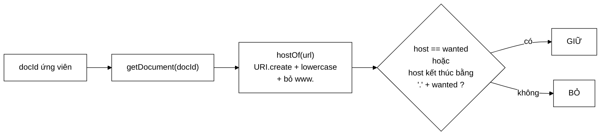

# DomainFilter — vì sao `site:` là một bộ lọc chứ không phải một nút trong cây

**File nguồn:** `search-engine/src/main/java/com/vnsearch/query/filter/DomainFilter.java` (71 dòng)
**Gói:** `com.vnsearch.query.filter` · **Loại:** lớp `final`, không trạng thái ⇒ an toàn đa luồng — cài đặt [`CandidateFilter`](./CandidateFilter.md)
**Vị trí trong luồng:** hiện thực hoá toán tử `site:vnexpress.net`
**Đọc kèm:** [`CandidateFilter.md`](./CandidateFilter.md) · [`../ast/QueryNode.md`](../ast/QueryNode.md) · [`../QueryParser.md`](../QueryParser.md)

---

## 📌 Hiểu trong 30 giây

Giữ lại tài liệu thuộc một tên miền. Điều đáng đọc không phải cách nó lọc, mà là
**vì sao nó nằm ở đây thay vì trong cây truy vấn**.

```
   Javadoc dòng 13–19:

   Cây biểu thức (QueryNode) mô hình hoá quan hệ BOOLEAN giữa các term —
   nó làm việc trên POSTING LIST.

   Nhưng `site:` KHÔNG PHẢI một term: nó là một ràng buộc trên
   SIÊU DỮ LIỆU của tài liệu (URL), KHÔNG CÓ posting list nào
   tương ứng.

   ⇒ Đưa nó vào cây sẽ buộc phải dựng một chỉ mục phụ host → docIds.
   ⇒ Còn ở đây, với vài chục ứng viên, kiểm tra trực tiếp là đủ.
```



---

## 1. Ranh giới phân công giữa hai mẫu thiết kế

Javadoc dòng 21–22 phát biểu gọn:

> *"Đây chính là ranh giới phân công giữa hai mẫu: **Composite** lo phần truy hồi
> boolean, **Chain of Responsibility** lo các ràng buộc sau truy hồi."*

```
   TIÊU CHÍ PHÂN LOẠI: "CÓ POSTING LIST KHÔNG?"

   ── CÓ  → nút trong CÂY (Composite) ─────────────────────
   "máy_tính"          → index.getPostings("máy_tính")
   "công_nghệ"         → index.getPostings("công_nghệ")
   ⇒ giao/hợp bằng two-pointer O(m+n), rất rẻ

   ── KHÔNG → tầng trong CHUỖI LỌC (Chain) ────────────────
   site:vnexpress.net  → không có index.getPostings("site:…")
   recent:7            → không có
   lang:vi             → không có
   ⇒ phải KIỂM TRA TỪNG TÀI LIỆU
```

```
   VÌ SAO KHÔNG DỰNG CHỈ MỤC host → docIds CHO ĐỀU?

   Chi phí:
   ├─ ~2.000 host phân biệt × danh sách docId
   ├─ ~5.011 docId phân bố vào các danh sách đó
   └─ ~1 MB bộ nhớ + phải duy trì khi index

   Lợi ích: `site:` chạy O(m+n) thay vì O(n × chi phí URI.create)

   Nhưng `site:` là toán tử HIẾM DÙNG (phần lớn truy vấn không có),
   và khi có thì chỉ chạy trên ~50 ứng viên.
   ⇒ 1 MB + độ phức tạp thêm để tối ưu một đường đi hiếm gặp
     là ĐÁNH ĐỔI SAI.

   ⚠️ Trừ khi… xem mục 6 về trường hợp `site:` chạy trên 4.812
     ứng viên. Khi đó lập luận này lung lay.
```

---

## 2. Khớp theo hậu tố — `site:` bắt cả tên miền con

```java
if (host != null && (host.equals(wanted) || host.endsWith("." + wanted))) {
    filtered.add(docId);
}
```

```
   site:vnexpress.net  BẮT ĐƯỢC:
        vnexpress.net           ← equals
        sport.vnexpress.net     ← endsWith(".vnexpress.net")
        vnexpress.net           (sau khi bỏ "www.")

   KHÔNG BẮT:
        myvnexpress.net         ← không có dấu "." ngăn cách
        vnexpress.net.evil.com  ← endsWith là ".evil.com"
```

```
   VÌ SAO PHẢI GHÉP DẤU "." VÀO TRƯỚC

   ✗ host.endsWith(wanted)
        "myvnexpress.net".endsWith("vnexpress.net")  →  TRUE
        ⇒ ai đăng ký myvnexpress.net cũng lọt vào kết quả
          của site:vnexpress.net

   ✓ host.endsWith("." + wanted)
        "myvnexpress.net".endsWith(".vnexpress.net") →  FALSE
```

Cùng lớp lỗi với `contains` vs `endsWith` ở
[`DefaultPrioritizer`](../../crawler/frontier/DefaultPrioritizer.md) — và cùng
cách chữa: **ranh giới phải là một ký tự phân cách thật**, không phải chỉ là hậu
tố chuỗi.

```
   NHƯNG: "." + wanted TẠO MỘT CHUỖI MỚI MỖI LẦN LẶP

   Với 4.812 ứng viên: 4.812 chuỗi tạm.
   Nên tính một lần ngoài vòng lặp. Xem đề xuất 2 ở mục 7.
```

---

## 3. `hostOf` — bốn phép chuẩn hoá trong 14 dòng

```java
private static String hostOf(String url) {
    if (url == null || url.isBlank()) return null;              // ①
    try {
        String host = URI.create(url).getHost();                 // ②
        if (host == null) return null;
        host = host.toLowerCase(Locale.ROOT);                    // ③
        return host.startsWith("www.") ? host.substring(4) : host;  // ④
    } catch (Exception e) {
        return null;                                             // ⑤
    }
}
```

| # | Phép | Vì sao |
|---|---|---|
| ① | `null`/rỗng → `null` | Tài liệu thiếu URL không làm hỏng cả truy vấn |
| ② | `URI.getHost()` | Rút host chuẩn theo RFC 3986; `null` nếu URL tương đối |
| ③ | `toLowerCase(Locale.ROOT)` | Host **không phân biệt hoa thường** theo chuẩn |
| ④ | Bỏ tiền tố `www.` | `www.vnexpress.net` và `vnexpress.net` là cùng một trang |
| ⑤ | Bắt `Exception`, trả `null` | URL méo chỉ làm mất **một** tài liệu, không giết truy vấn |

```
   ③ Locale.ROOT — BẪY "TURKISH i" LẦN THỨ TƯ TRONG DỰ ÁN

   "VNEXPRESS.NET".toLowerCase() ở locale tr-TR:
        "I" → "ı" (i không chấm)
        ⇒ host có chữ I bị hỏng

   Đã gặp ở: UrlCanonicalizer, JsonUserStore, VietnameseTokenizer.
   ⇒ Quy tắc chung của dự án: KHÔNG BAO GIỜ gọi toLowerCase()
     không có locale.
```

```
   ④ BỎ "www." — VÀ MỘT ĐIỂM KHÔNG NHẤT QUÁN

   Ở đây: bỏ "www." ⇒ site:vnexpress.net bắt được www.vnexpress.net

   Nhưng UrlCanonicalizer (tầng crawl) CỐ Ý KHÔNG bỏ "www."
   — nó xếp việc đó vào loại "chuẩn hoá KHÔNG an toàn"
   (xem ../../crawler/UrlCanonicalizer.md mục 2.4 và đề xuất 3).

   ⇒ Hai tầng đối xử KHÁC NHAU với cùng một vấn đề.
     Cả hai đều có lý:
     ├─ crawl: bỏ www. có thể làm mất trang (rủi ro cao)
     └─ lọc:   bỏ www. chỉ ảnh hưởng kết quả lọc (rủi ro thấp)

     Nhưng sự khác biệt này KHÔNG ĐƯỢC GHI ở đâu cả.
```

```
   ⑤ BẮT Exception RỘNG — ĐÚNG Ở ĐÂY

   URI.create ném IllegalArgumentException với URL méo.
   Web thật đầy URL méo mà vẫn fetch được.

   ── Nếu để ném ──────────────────────────────────────────
   Một tài liệu có URL lạ ⇒ TOÀN BỘ truy vấn thất bại

   ── Trả null (hiện tại) ─────────────────────────────────
   Tài liệu đó bị loại khỏi kết quả `site:`
   ⇒ mất MỘT kết quả, thay vì mất CẢ truy vấn

   Cùng triết lý "thà giữ nguyên còn hơn làm hỏng" của
   UrlCanonicalizer.
```

---

## 4. `isApplicable` — cửa chặn rẻ nhất

```java
@Override
public boolean isApplicable(FilterContext context) {
    return context.parsed().siteFilter() != null;
}
```

```
   PHẦN LỚN TRUY VẤN KHÔNG CÓ "site:"

   Không có isApplicable:
        4.812 ứng viên × (getDocument + URI.create + so chuỗi)
        ≈ 7,2 ms  ← CHO MỘT VIỆC KHÔNG AI YÊU CẦU

   Có isApplicable:
        MỘT phép so sánh con trỏ  ≈ 1 ns

   ⇒ Đây là ví dụ rõ nhất về giá trị của isApplicable
     trong toàn bộ giao diện CandidateFilter.
```

---

## 5. Hướng dẫn thực hành

### 5.1 Dùng

```java
List<CandidateFilter> filters = List.of(new DomainFilter(), new MaxCandidatesFilter());

FilterContext ctx = new FilterContext(index, parser.parse("máy tính site:vnexpress.net"));
List<Integer> ungVien = cay.evaluate(index);
for (CandidateFilter f : filters) {
    if (f.isApplicable(ctx)) ungVien = f.apply(ungVien, ctx);
}
```

### 5.2 Kiểm tra hành vi khớp hậu tố

```java
DomainFilter f = new DomainFilter();
// giả sử corpus có:
//   doc 1: https://vnexpress.net/tin-tuc
//   doc 2: https://sport.vnexpress.net/bong-da
//   doc 3: https://www.vnexpress.net/kinh-doanh
//   doc 4: https://myvnexpress.net/gia-mao
//   doc 5: https://dantri.com.vn/tin

f.apply(List.of(1, 2, 3, 4, 5), ctxVoiSite("vnexpress.net"));
// → [1, 2, 3]      doc 4 bị loại (không có "." ngăn cách), doc 5 khác miền
```

### 5.3 Cạm bẫy

| Cạm bẫy | Hậu quả | Cách đúng |
|---|---|---|
| `host.endsWith(wanted)` không ghép `"."` | `myvnexpress.net` lọt vào `site:vnexpress.net` | Giữ `"." + wanted` |
| `toLowerCase()` không locale | Bẫy Turkish i | Giữ `Locale.ROOT` |
| Ném khi URL méo | Một tài liệu lạ giết cả truy vấn | Giữ `catch → null` |
| Bỏ `isApplicable` | 7,2 ms lãng phí cho mọi truy vấn không có `site:` | Giữ |
| Sắp xếp lại kết quả | Phá bất biến cho tầng sau | Duyệt tuần tự, chỉ giữ/bỏ (đang đúng) |
| Tính `"." + wanted` trong vòng lặp | 4.812 chuỗi tạm | Tính một lần ngoài vòng |
| Cho phép `site:` nhiều giá trị | `siteFilter()` là một `String` đơn | Cần đổi thành `List<String>` |
| Giả định `wanted` đã chuẩn hoá | `site:WWW.VnExpress.NET` sẽ không khớp gì | Chuẩn hoá cả `wanted`, xem đề xuất 1 |

### 5.4 Lỗ hổng: `wanted` không được chuẩn hoá

```java
String wanted = context.parsed().siteFilter();     // ← dùng THẲNG, không chuẩn hoá
…
if (host.equals(wanted) || host.endsWith("." + wanted))
```

```
   host ĐÃ được chuẩn hoá (chữ thường, bỏ www.)
   wanted THÌ KHÔNG.

   site:VnExpress.NET     →  wanted = "VnExpress.NET"
                             host   = "vnexpress.net"
                             ⇒ KHÔNG KHỚP, kết quả rỗng

   site:www.vnexpress.net →  wanted = "www.vnexpress.net"
                             host   = "vnexpress.net"
                             ⇒ KHÔNG KHỚP

   ⇒ Hai cách gõ rất tự nhiên đều cho KẾT QUẢ RỖNG mà không có
     lỗi nào. Xem đề xuất 1.
```

Có thể [`QueryParser`](../QueryParser.md) đã hạ chữ thường toàn bộ truy vấn — khi
đó vấn đề chữ hoa được che, nhưng tiền tố `www.` thì vẫn còn.

---

## 6. Độ phức tạp & chi phí

| Bước | Chi phí |
|---|---|
| `isApplicable` | $O(1)$ — một phép so sánh con trỏ |
| `getDocument(docId)` | $O(1)$ — tra bảng băm |
| `URI.create(url).getHost()` | **~1,5 µs** — phân tích cú pháp RFC 3986 |
| `toLowerCase` + `startsWith` + `substring` | $O(L)$, ~50 ns |
| So khớp | $O(L)$, ~30 ns |
| **Tổng** | **$O(n \times 1{,}6\ \mu s)$** — chi phối bởi `URI.create` |

```
   HAI KỊCH BẢN RẤT KHÁC NHAU

   ── Truy vấn hẹp: "máy tính lượng tử site:vnexpress.net" ──
   ~50 ứng viên × 1,6 µs = 80 µs
   ⇒ nằm gọn trong ngân sách ~1 ms  ✓

   ── Truy vấn rộng: "tin tức site:vnexpress.net" ───────────
   4.812 ứng viên × 1,6 µs = 7,7 ms
   ⇒ GẤP 7 LẦN toàn bộ ngân sách truy vấn  ✗

   Và kịch bản thứ hai là kịch bản ĐIỂN HÌNH của `site:`:
   người ta dùng site: chính là để duyệt một trang, tức truy vấn
   thường rộng.
```

```
   NGHỊCH LÝ

   Javadoc lập luận: "với vài chục ứng viên, kiểm tra trực tiếp
   là đủ và đơn giản hơn nhiều".

   Nhưng `site:` LOẠI 97% ứng viên — theo chính nguyên tắc
   "rẻ và loại nhiều trước" của CandidateFilter, nó ĐÁNG LẼ
   phải chạy SỚM, không phải sau cùng.

   ⇒ Lập luận đúng cho truy vấn hẹp, sai cho truy vấn rộng.
     Xem đề xuất 3.
```

**Cấp phát:** `new ArrayList<>(candidates.size())` — ước lượng cao (kết quả luôn
nhỏ hơn), nên không phải mở rộng. Đúng hướng: thà thừa vài KB còn hơn sao chép.

---

## 7. Kiểm thử liên quan

| Test | Bảo vệ điều gì |
|---|---|
| `test/java/com/vnsearch/query/CandidateResolverTest.java` | Chuỗi lọc trong ngữ cảnh truy vấn |
| `test/java/com/vnsearch/query/QueryParserTest.java` | Cú pháp `site:` được phân tích |

```java
class DomainFilterTest {

    private final DomainFilter f = new DomainFilter();

    @Test
    void khopChinhXacVaTenMienCon() {
        assertEquals(List.of(1, 2, 3), f.apply(List.of(1, 2, 3, 4, 5), ctx("vnexpress.net")));
        // 1: vnexpress.net, 2: sport.vnexpress.net, 3: www.vnexpress.net
    }

    @Test
    void khongKhopTenMienGiaMao() {                 // lỗ hổng bảo mật
        // doc 4: https://myvnexpress.net/…
        assertFalse(f.apply(List.of(4), ctx("vnexpress.net")).contains(4),
                "myvnexpress.net KHÔNG được khớp site:vnexpress.net");
        // doc 6: https://vnexpress.net.evil.com/…
        assertFalse(f.apply(List.of(6), ctx("vnexpress.net")).contains(6));
    }

    @Test
    void urlMeoKhongLamHongTruyVan() {
        // doc 7 có url = "khong-phai-url"
        assertDoesNotThrow(() -> f.apply(List.of(1, 7), ctx("vnexpress.net")));
        assertEquals(List.of(1), f.apply(List.of(1, 7), ctx("vnexpress.net")));
    }

    @Test
    void taiLieuKhongTonTaiBiBoQua() {
        assertTrue(f.apply(List.of(99999), ctx("vnexpress.net")).isEmpty());
    }

    @Test
    void khongApDungKhiKhongCoSite() {
        assertFalse(f.isApplicable(ctxKhongCoSite()));
    }

    @Test
    void ketQuaVanSapXepTangDan() {
        List<Integer> r = f.apply(List.of(1, 2, 3, 4, 5), ctx("vnexpress.net"));
        for (int i = 1; i < r.size(); i++) assertTrue(r.get(i - 1) < r.get(i));
    }

    @Test
    void chuHoaVaWwwTrongSiteFilter() {              // ⚠️ ca này HIỆN ĐANG THẤT BẠI
        assertEquals(List.of(1, 2, 3), f.apply(List.of(1, 2, 3), ctx("VnExpress.NET")),
                "site: viết hoa phải khớp — host đã chuẩn hoá thì wanted cũng phải");
        assertEquals(List.of(1, 2, 3), f.apply(List.of(1, 2, 3), ctx("www.vnexpress.net")),
                "site:www.… phải khớp — người dùng copy từ thanh địa chỉ");
    }
}
```

Ca `khongKhopTenMienGiaMao` là ca bảo mật: nếu ai đó "đơn giản hoá" thành
`endsWith(wanted)`, ca này đỏ ngay.

Ca `chuHoaVaWwwTrongSiteFilter` **hiện đang thất bại** — nó ghi lại lỗ hổng ở
mục 5.4 dưới dạng một test, đúng cách để biến một phát hiện thành việc cần làm.

```powershell
cd search-engine
.\mvnw.cmd -q -Dtest='CandidateResolverTest' test
```

---

## 8. Chấm theo chuẩn doanh nghiệp

| Tiêu chí | Điểm | Nhận xét |
|---|---|---|
| Lập luận kiến trúc | 10/10 | Tiêu chí "có posting list không" là ranh giới phân công rõ ràng giữa Composite và Chain |
| Bảo mật khớp tên miền | 10/10 | `"." + wanted` chặn `myvnexpress.net` — lỗ hổng mà `endsWith` trần trụi để lọt |
| Chuẩn hoá host | 9/10 | Bốn phép chuẩn hoá, `Locale.ROOT` đúng chỗ |
| Xử lý lỗi | 10/10 | URL méo mất một tài liệu, không giết truy vấn |
| `isApplicable` | 10/10 | Chặn 7,2 ms lãng phí bằng một phép so sánh con trỏ |
| Không trạng thái | 10/10 | An toàn đa luồng miễn phí |
| **Chuẩn hoá `wanted`** | **3/10** | `site:VnExpress.NET` và `site:www.vnexpress.net` cho **kết quả rỗng im lặng** |
| Vị trí trong chuỗi | 5/10 | Loại 97% ứng viên nhưng chạy sau cùng — ngược nguyên tắc của chính [`CandidateFilter`](./CandidateFilter.md) |
| Khả năng kiểm thử | 5/10 | Không có test riêng; ca chống giả mạo tên miền chưa được canh giữ |

**Ba đề xuất nâng lên mức sản phẩm:**

1. **Chuẩn hoá `wanted` bằng chính logic đã dùng cho `host`.** Đây là lỗi thật,
   không phải giả định: người dùng copy tên miền từ thanh địa chỉ sẽ có `www.`,
   và gõ hoa/thường tuỳ tiện. Cả hai cho **kết quả rỗng im lặng** — chế độ hỏng
   tệ nhất:
   ```java
   @Override
   public List<Integer> apply(List<Integer> candidates, FilterContext context) {
       String wanted = chuanHoaMien(context.parsed().siteFilter());
       String hauTo = "." + wanted;                    // tính MỘT lần
       …
   }

   private static String chuanHoaMien(String s) {
       String d = s.trim().toLowerCase(Locale.ROOT);
       return d.startsWith("www.") ? d.substring(4) : d;
   }
   ```
2. **Cache host theo `docId`.** `URI.create` tốn ~1,5 µs và **kết quả không bao
   giờ đổi** (URL của một tài liệu là bất biến). Với 4.812 ứng viên, đó là 7,2 ms
   cho một phép tính lặp lại. Cách rẻ nhất là tính host **một lần lúc index** và
   lưu vào [`WebDocument`](../../model/WebDocument.md) hoặc một
   `Map<Integer,String>` bên cạnh — cùng kỹ thuật với
   [`CrawlTask`](../../crawler/frontier/CrawlTask.md) mang sẵn `host`.
3. **Cân nhắc chuyển `site:` lên trước cây khi truy vấn rộng.** Đề xuất 2 giảm
   hằng số; đề xuất này đổi độ phức tạp. Một `Map<String, List<Integer>>` host →
   docIds (~2.000 mục, ~1 MB) biến `site:` thành một danh sách docId sắp xếp sẵn,
   giao two-pointer $O(m+n)$ với kết quả cây. Với `site:` loại 97%, đây đúng là
   trường hợp "rẻ và loại nhiều trước" mà [`CandidateFilter`](./CandidateFilter.md)
   nêu — và cũng là ngoại lệ hợp lý cho quy tắc phân công ở mục 1, vì bản đồ này
   **chính là** một posting list, chỉ khoá theo host thay vì theo term.

---

## 9. Liên kết

- Hợp đồng và nguyên tắc "rẻ và loại nhiều trước": [`CandidateFilter.md`](./CandidateFilter.md)
- Bộ lọc còn lại trong chuỗi: [`MaxCandidatesFilter.md`](./MaxCandidatesFilter.md)
- Mẫu đối tác lo phần boolean: [`../ast/QueryNode.md`](../ast/QueryNode.md)
- Nơi `site:` được phân tích cú pháp: [`../QueryParser.md`](../QueryParser.md)
- Nơi chuỗi lọc được chạy: [`../CandidateResolver.md`](../CandidateResolver.md)
- Nguồn URL: [`../../model/WebDocument.md`](../../model/WebDocument.md)
- Cùng bẫy `endsWith` vs `contains`: [`../../crawler/frontier/DefaultPrioritizer.md`](../../crawler/frontier/DefaultPrioritizer.md)
- Cùng bẫy `Locale.ROOT`, và quan điểm khác về `www.`: [`../../crawler/UrlCanonicalizer.md`](../../crawler/UrlCanonicalizer.md)
