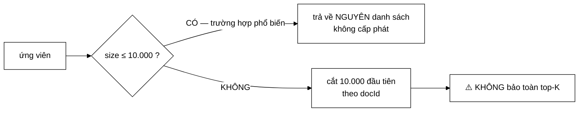

# MaxCandidatesFilter — nói rõ hạn chế quan trọng hơn việc giấu nó

**File nguồn:** `search-engine/src/main/java/com/vnsearch/query/filter/MaxCandidatesFilter.java` (61 dòng)
**Gói:** `com.vnsearch.query.filter` · **Loại:** lớp `final`, bất biến ⇒ an toàn đa luồng — cài đặt [`CandidateFilter`](./CandidateFilter.md)
**Vị trí trong luồng:** tầng cuối của chuỗi lọc — chặn trên số ứng viên đưa sang khâu chấm điểm
**Đọc kèm:** [`CandidateFilter.md`](./CandidateFilter.md) · [`../../ranking/ResultRanker.md`](../../ranking/ResultRanker.md)

---

## 📌 Hiểu trong 30 giây

Giữ lại tối đa `maxCandidates` ứng viên đầu tiên. Nghe tầm thường — nhưng
Javadoc dành **một nửa độ dài** để nói rõ nó **không** làm được gì.

```
   Javadoc dòng 23–24:

   "NÓI RÕ HẠN CHẾ NÀY quan trọng hơn việc giấu nó: bộ lọc bảo vệ
    hệ thống khỏi truy vấn bất thường, KHÔNG PHẢI một tối ưu xếp hạng."
```



---

## 1. Vấn đề: mọi ứng viên đều được chấm điểm

Javadoc dòng 8–11:

> *"Truy vấn một term rất phổ biến có thể cho hàng nghìn ứng viên, và **TẤT CẢ**
> đều được chấm điểm ở tầng sau: mỗi ứng viên tốn $O(q \log d)$ cho scorer. Với
> 4.000 ứng viên và 3 term, đó là khoảng **132.000 phép so sánh** — trong khi
> người dùng chỉ xem 10 kết quả đầu."*

```
   PHÉP TÍNH:  4.000 ứng viên × 3 term × log₂(4.000) ≈ 12
               = 4.000 × 3 × 11 ≈ 132.000

   Mỗi phép là một bước binary search trong
   InvertedIndex.getTermFrequency (xem ../../index/InvertedIndex.md mục 6).

   ⇒ Người dùng xem 10 kết quả, hệ thống chấm điểm 4.000.
     Tỉ lệ lãng phí 400:1.
```

---

## 2. Cách chuẩn của ngành — và vì sao dự án không dùng

Javadoc dòng 13–15:

> *"**Cách chuẩn của ngành** là **WAND** hoặc **MaxScore**: ước lượng chặn trên
> điểm của từng tài liệu và bỏ qua sớm những tài liệu không thể lọt top-K. Chúng
> phức tạp và đòi hỏi lưu chặn trên điểm theo term."*

```
   WAND (Weak AND) — ý tưởng cốt lõi

   ① Với mỗi term, lưu sẵn maxScore = điểm CAO NHẤT mà term đó
     có thể đóng góp cho bất kỳ tài liệu nào
   ② Duy trì ngưỡng θ = điểm thấp nhất trong top-K hiện tại
   ③ Với một tài liệu ứng viên, tính CHẶN TRÊN điểm của nó
     = tổng maxScore của các term nó chứa
   ④ Nếu chặn trên < θ  ⇒  BỎ QUA, không cần tính điểm thật

   ⇒ Thường bỏ qua được 80–95% ứng viên
   ⇒ VÀ BẢO TOÀN TOP-K CHÍNH XÁC (không mất kết quả nào)
```

```
   CHI PHÍ CỦA WAND

   ① Phải lưu maxScore cho MỖI term (136.768 term × 8 byte ≈ 1 MB)
   ② maxScore phụ thuộc CÔNG THỨC chấm điểm
      ⇒ đổi từ TF-IDF sang BM25 phải tính lại toàn bộ
      ⇒ phá vỡ tính "cắm được" của RelevanceScorer
   ③ Cần posting list DUYỆT ĐƯỢC theo thứ tự với skipTo
      ⇒ mà tầng truy vấn hiện dùng List<Integer>, không dùng cursor
   ④ Thuật toán phức tạp, dễ sai ở phần cập nhật ngưỡng

   ⇒ Với corpus 5.011 tài liệu, WAND là dùng dao mổ trâu.
```

---

## 3. Đánh đổi có ý thức: cắt theo `docId`, không theo điểm

```java
return List.copyOf(candidates.subList(0, maxCandidates));
```

Javadoc dòng 17–21:

> *"Vì posting list sắp xếp theo `docId` **chứ không theo điểm**, phép cắt này
> **KHÔNG bảo toàn top-K một cách chính xác** — đó là đánh đổi có ý thức, và nó
> chỉ kích hoạt ở ngưỡng rất cao (mặc định 10.000) nên thực tế không ảnh hưởng
> đến các truy vấn bình thường."*

```
   ĐIỀU GÌ THỰC SỰ XẢY RA KHI CẮT

   ứng viên (sắp xếp theo docId):  [0, 1, 2, …, 9999, 10000, …, 15000]
                                    └────── giữ ──────┘ └── VỨT ──┘

   docId phản ánh THỨ TỰ CRAWL, không phản ánh chất lượng.
   ⇒ Tài liệu tốt nhất có thể có docId = 14.723
   ⇒ Nó bị vứt TRƯỚC KHI được chấm điểm

   ⇒ Kết quả trả về có thể THIẾU tài liệu đáng lẽ đứng đầu.
```

```
   VÌ SAO VẪN CHẤP NHẬN ĐƯỢC

   ① Ngưỡng 10.000 trên corpus 5.011 tài liệu
      ⇒ KHÔNG BAO GIỜ kích hoạt với corpus hiện tại
      ⇒ nó là "cầu chì", không phải "van điều tiết"

   ② Truy vấn cho > 10.000 ứng viên là truy vấn BẤT THƯỜNG
      (một term siêu phổ biến, hoặc OR nhiều nhánh rộng)
      ⇒ với truy vấn như vậy, "kết quả gần đúng nhanh" tốt hơn
        "kết quả chính xác nhưng treo"

   ③ Bảo vệ hệ thống > chất lượng xếp hạng, KHI VÀ CHỈ KHI
      hệ thống đang bị đe doạ
```

```
   ⚠️ NHƯNG PHẢI THẤY RÕ: đây là một CẦU CHÌ CHƯA BAO GIỜ NỔ.

   corpus  = 5.011 tài liệu
   ngưỡng  = 10.000

   ⇒ candidates.size() ≤ 5.011 < 10.000 LUÔN LUÔN
   ⇒ nhánh cắt là MÃ CHẾT với corpus hiện tại

   Nó chỉ có nghĩa khi corpus vượt 10.000 tài liệu.
   Xem đề xuất 1 ở mục 7.
```

---

## 4. Ba chi tiết cài đặt

### 4.1 Trường hợp phổ biến không cấp phát

```java
if (candidates.size() <= maxCandidates) {
    return candidates; // truong hop pho bien: khong lam gi, khong cap phat
}
```

```
   Trả về CHÍNH đối tượng đầu vào.
   ⇒ 0 byte cấp phát, ~2 ns

   Với corpus hiện tại đây là đường đi DUY NHẤT được chạy.

   ⚠️ Cùng vấn đề nhất quán như NotNode.evaluateAgainst:
     - dưới ngưỡng → trả đối tượng GỐC
     - trên ngưỡng → trả danh sách MỚI (bất biến, do List.copyOf)
     ⇒ "kết quả có sửa được không" phụ thuộc DỮ LIỆU
```

### 4.2 `List.copyOf` chứ không phải `subList`

```java
return List.copyOf(candidates.subList(0, maxCandidates));
//     └────┬────┘
//   sao chép THẬT, không giữ tham chiếu
```

```
   VÌ SAO KHÔNG TRẢ THẲNG subList

   subList trả về một KHUNG NHÌN (view) lên danh sách gốc:
   ├─ giữ tham chiếu tới TOÀN BỘ danh sách 15.000 phần tử
   │  ⇒ bộ thu gom rác KHÔNG thu hồi được 5.000 phần tử đã vứt
   │  ⇒ rò rỉ bộ nhớ kiểu "giữ cả tảng băng vì một mẩu"
   └─ và nếu danh sách gốc bị sửa ⇒ ConcurrentModificationException

   List.copyOf:
   ├─ mảng mới đúng 10.000 phần tử, danh sách gốc thu hồi được
   └─ BẤT BIẾN — sửa nó ném UnsupportedOperationException
```

Đây là một trong những bẫy `subList` kinh điển của Java, và lớp này tránh đúng.

### 4.3 Hàm dựng từ chối ngưỡng không hợp lệ

```java
public MaxCandidatesFilter(int maxCandidates) {
    if (maxCandidates <= 0) {
        throw new IllegalArgumentException("maxCandidates phai > 0, nhan duoc: " + maxCandidates);
    }
    this.maxCandidates = maxCandidates;
}
```

```
   maxCandidates = 0  ⇒  MỌI truy vấn trả về rỗng
   maxCandidates < 0  ⇒  subList(0, -5) ném IndexOutOfBounds
                         ở TẦNG SÂU, xa nguyên nhân

   ⇒ Ném ở hàm dựng: lỗi lộ ra lúc CẤU HÌNH, không phải lúc
     một truy vấn cụ thể chạy tới đó.
```

### 4.4 `isApplicable` ghi đè để trả `true` — thừa nhưng có ý nghĩa

```java
@Override
public boolean isApplicable(FilterContext context) {
    return true;
}
```

```
   `default` của CandidateFilter ĐÃ trả true.
   Ghi đè để trả cùng giá trị là mã thừa về mặt hành vi.

   Nhưng nó là một TUYÊN BỐ: "tôi đã cân nhắc, và bộ lọc này
   luôn áp dụng" — thay vì "tôi quên ghi đè".

   ⇒ Đánh đổi giữa "ít mã hơn" và "ý định rõ hơn".
     Ở đây chọn ý định rõ hơn. Hợp lý, nhưng không phải quy ước
     nhất quán: DomainFilter cũng ghi đè (vì cần), còn một bộ lọc
     tương lai luôn-áp-dụng thì nên theo cách nào?
```

---

## 5. Hướng dẫn thực hành

### 5.1 Dùng

```java
List<CandidateFilter> filters = List.of(
        new DomainFilter(),
        new MaxCandidatesFilter());          // ngưỡng mặc định 10.000

// Hoặc ngưỡng riêng cho một môi trường tài nguyên hẹp:
new MaxCandidatesFilter(2_000);
```

### 5.2 Chọn ngưỡng — cách tính

```
   NGÂN SÁCH: chấm điểm phải xong trong ~500 µs

   Chi phí mỗi ứng viên = q × log₂(d) × ~10 ns
        q = số term truy vấn (~3)
        d = df trung bình  (~1.500 ⇒ log₂ ≈ 10,5)
        ⇒ ~315 ns/ứng viên

   Ngưỡng = 500 µs / 315 ns  ≈  1.600 ứng viên

   ⇒ Với corpus 5.011, ngưỡng ~1.600 mới thực sự bảo vệ được
     ngân sách. Ngưỡng 10.000 không bao giờ chạm tới.
```

```
   NHƯNG HẠ NGƯỠNG XUỐNG 1.600 CÓ CÁI GIÁ:

   truy vấn "tin tức" cho ~4.500 ứng viên
        → cắt còn 1.600 theo docId
        → có thể mất tài liệu tốt nhất

   ⇒ Hạ ngưỡng chỉ đúng nếu ĐỒNG THỜI đổi cách cắt (theo điểm
     ước lượng thay vì theo docId). Xem đề xuất 2.
```

### 5.3 Cạm bẫy

| Cạm bẫy | Hậu quả | Cách đúng |
|---|---|---|
| Coi đây là "tối ưu xếp hạng" | Nó **không** bảo toàn top-K; hạ ngưỡng làm giảm chất lượng | Đọc Javadoc — nó là cầu chì |
| Trả thẳng `subList` | Giữ tham chiếu cả danh sách gốc ⇒ rò rỉ | Giữ `List.copyOf` |
| Hạ ngưỡng để "tăng tốc" | Mất kết quả tốt, im lặng | Dùng WAND/MaxScore nếu cần tốc độ thật |
| `maxCandidates = 0` | Mọi truy vấn rỗng | Hàm dựng đã chặn |
| Đặt bộ lọc này **trước** [`DomainFilter`](./DomainFilter.md) | Cắt 10.000 ứng viên rồi mới lọc domain ⇒ có thể mất hết kết quả của domain đó | Đặt **cuối** chuỗi |
| Sửa danh sách trả về ở nhánh dưới ngưỡng | Đó là đối tượng gốc | Coi kết quả là chỉ đọc |

Dòng thứ năm đáng nhấn mạnh:

```
   THỨ TỰ SAI:  MaxCandidates → Domain
        4.812 ứng viên → cắt 10.000 (không cắt) → lọc domain → 142
        (may mắn không hại, vì ngưỡng chưa chạm)

   VỚI NGƯỠNG 1.000:
        4.812 → cắt còn 1.000 (docId 0..999) → lọc domain → 12
        Trong khi thứ tự đúng cho 142.
        ⇒ MẤT 92% kết quả

   ⇒ MaxCandidatesFilter PHẢI đứng CUỐI. Điều này không được ghi
     ở đâu cả. Xem đề xuất 3.
```

---

## 6. Độ phức tạp & chi phí

| Trường hợp | Chi phí | Cấp phát |
|---|---|---|
| Dưới ngưỡng (**luôn luôn**, với corpus hiện tại) | $O(1)$ — một phép so sánh | **0** |
| Trên ngưỡng | $O(k)$ với $k$ = `maxCandidates` | 1 mảng $k$ phần tử |
| `isApplicable` | $O(1)$ | 0 |

```
   ĐÂY LÀ BỘ LỌC RẺ NHẤT TRONG CHUỖI

   Với corpus 5.011:  ~2 ns, 0 byte.

   So với DomainFilter: 7,2 ms, 19 KB.

   ⇒ Đặt nó cuối chuỗi không tốn gì, và đó cũng là vị trí ĐÚNG
     về mặt ngữ nghĩa (mục 5.3).
```

---

## 7. Kiểm thử liên quan

| Test | Bảo vệ điều gì |
|---|---|
| `test/java/com/vnsearch/query/CandidateResolverTest.java` | Chuỗi lọc trong ngữ cảnh |

```java
class MaxCandidatesFilterTest {

    @Test
    void duoiNguongTraNguyenVan() {
        List<Integer> vao = List.of(1, 2, 3);
        assertSame(vao, new MaxCandidatesFilter(10).apply(vao, ctx()),
                "Dưới ngưỡng phải trả về CHÍNH đối tượng — không cấp phát");
    }

    @Test
    void trenNguongCatDungSoLuong() {
        List<Integer> vao = IntStream.range(0, 100).boxed().toList();
        List<Integer> ra = new MaxCandidatesFilter(10).apply(vao, ctx());
        assertEquals(10, ra.size());
        assertEquals(List.of(0,1,2,3,4,5,6,7,8,9), ra);
    }

    @Test
    void ketQuaKhongGiuThamChieuDanhSachGoc() {          // bẫy subList
        List<Integer> vao = new ArrayList<>(IntStream.range(0, 100).boxed().toList());
        List<Integer> ra = new MaxCandidatesFilter(10).apply(vao, ctx());
        vao.clear();                                      // sửa danh sách gốc
        assertEquals(10, ra.size(), "Kết quả KHÔNG được là khung nhìn lên danh sách gốc");
    }

    @Test
    void ketQuaBatBien() {
        List<Integer> ra = new MaxCandidatesFilter(10)
                .apply(IntStream.range(0, 100).boxed().toList(), ctx());
        assertThrows(UnsupportedOperationException.class, () -> ra.add(999));
    }

    @Test
    void tuChoiNguongKhongHopLe() {
        assertThrows(IllegalArgumentException.class, () -> new MaxCandidatesFilter(0));
        assertThrows(IllegalArgumentException.class, () -> new MaxCandidatesFilter(-1));
    }

    @Test
    void ketQuaVanSapXepTangDan() {
        List<Integer> ra = new MaxCandidatesFilter(10)
                .apply(IntStream.range(0, 100).boxed().toList(), ctx());
        for (int i = 1; i < ra.size(); i++) assertTrue(ra.get(i - 1) < ra.get(i));
    }

    @Test
    void luonApDung() {
        assertTrue(new MaxCandidatesFilter().isApplicable(ctx()));
    }
}
```

Ca `ketQuaKhongGiuThamChieuDanhSachGoc` canh giữ đúng bẫy `subList` — và nó là
loại lỗi mà kết quả vẫn "đúng" trong test thông thường, chỉ lộ ra dưới dạng bộ
nhớ không được thu hồi.

```powershell
cd search-engine
.\mvnw.cmd -q -Dtest='CandidateResolverTest' test
```

---

## 8. Chấm theo chuẩn doanh nghiệp

| Tiêu chí | Điểm | Nhận xét |
|---|---|---|
| **Trung thực về hạn chế** | 10/10 | Nói thẳng "KHÔNG bảo toàn top-K", và nêu rõ nó là **cầu chì** chứ không phải tối ưu — hiếm và rất đáng giá |
| Đặt trong bối cảnh ngành | 10/10 | Nêu WAND/MaxScore là cách chuẩn, và giải thích vì sao không dùng — không giả vờ đây là giải pháp tốt nhất |
| Tránh bẫy ngôn ngữ | 10/10 | `List.copyOf` thay `subList` — tránh giữ tham chiếu cả danh sách gốc |
| Đường đi nhanh | 10/10 | Trường hợp phổ biến: 0 cấp phát, một phép so sánh |
| Kiểm tra cấu hình | 10/10 | Ném ở hàm dựng, lỗi lộ ra lúc cấu hình |
| Chứng minh bằng số | 9/10 | "132.000 phép so sánh" có cách tính rõ ràng |
| **Giá trị thực tế hiện tại** | **4/10** | Ngưỡng 10.000 > corpus 5.011 ⇒ nhánh cắt là **mã chết**; cầu chì chưa bao giờ nổ |
| Ràng buộc thứ tự | 3/10 | **Phải** đứng cuối chuỗi, nhưng điều này không được ghi ở đâu — đặt sai gây mất 92% kết quả |
| Nhất quán giá trị trả về | 6/10 | Đối tượng gốc vs bản sao bất biến, tuỳ dữ liệu |
| Khả năng kiểm thử | 5/10 | Không có test riêng; bẫy `subList` không được canh giữ |

**Ba đề xuất nâng lên mức sản phẩm:**

1. **Đặt ngưỡng theo ngân sách thời gian, không theo một số tròn.** Ngưỡng
   10.000 lớn hơn cả corpus nên nhánh cắt chưa từng chạy — cầu chì không nổ thì
   cũng không chứng minh được nó hoạt động. Cách tính ở mục 5.2 cho ~1.600 ứng
   viên với ngân sách 500 µs. Ít nhất hãy **ghi lại cách chọn**:
   ```java
   /**
    * Ngưỡng mặc định. Suy từ ngân sách chấm điểm 500 µs với chi phí
    * ~315 ns/ứng viên (3 term × log₂(1.500) × 10 ns) ⇒ ~1.600.
    * Đặt 10.000 để chừa biên rộng: với corpus < 10.000 tài liệu,
    * bộ lọc này không bao giờ kích hoạt và chỉ tồn tại như một cầu chì.
    */
   ```
2. **Nếu hạ ngưỡng, phải đổi cách cắt.** Cắt theo `docId` chỉ vô hại vì ngưỡng
   cao. Hạ xuống 1.600 mà vẫn cắt theo `docId` sẽ làm mất kết quả tốt một cách
   có hệ thống. Bước trung gian rẻ giữa "cắt bừa" và WAND đầy đủ: sắp xếp ứng
   viên theo một **tín hiệu tĩnh** đã có sẵn (điểm PageRank từ
   [`PageRankService`](../../ranking/PageRankService.md)) rồi mới cắt — vẫn
   không chính xác, nhưng sai lệch theo hướng có ý nghĩa thay vì theo thứ tự
   crawl.
3. **Ghi ràng buộc "phải đứng cuối chuỗi" vào Javadoc.** Đây là ràng buộc thật:
   đặt nó trước [`DomainFilter`](./DomainFilter.md) với ngưỡng thấp sẽ mất 92%
   kết quả (mục 5.3), và không có gì cảnh báo. Một dòng Javadoc, và có thể thêm
   một phép kiểm tra ở nơi lắp chuỗi:
   ```java
   // trong CandidateResolver
   if (!(filters.get(filters.size() - 1) instanceof MaxCandidatesFilter)) {
       throw new IllegalStateException(
               "MaxCandidatesFilter phải là tầng CUỐI: cắt trước khi lọc "
             + "sẽ vứt bỏ ứng viên mà các tầng sau đáng lẽ giữ lại.");
   }
   ```

---

## 9. Liên kết

- Hợp đồng và nguyên tắc thứ tự lọc: [`CandidateFilter.md`](./CandidateFilter.md)
- Bộ lọc phải chạy **trước** bộ lọc này: [`DomainFilter.md`](./DomainFilter.md)
- Nơi chuỗi lọc được lắp: [`../CandidateResolver.md`](../CandidateResolver.md)
- Khâu chấm điểm mà bộ lọc bảo vệ: [`../../ranking/ResultRanker.md`](../../ranking/ResultRanker.md) · [`../../ranking/BM25Scorer.md`](../../ranking/BM25Scorer.md)
- Nguồn chi phí $O(q \log d)$: [`../../index/InvertedIndex.md`](../../index/InvertedIndex.md) mục 6
- Tín hiệu tĩnh dùng được để cắt có ý nghĩa: [`../../ranking/PageRankService.md`](../../ranking/PageRankService.md)
