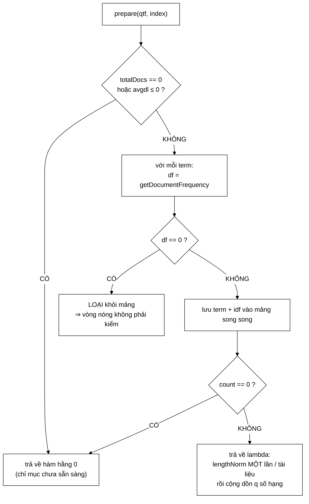

# BM25Scorer — mô hình xếp hạng chuẩn công nghiệp, và ba lý do nó thắng TF-IDF

**File nguồn:** `search-engine/src/main/java/com/vnsearch/ranking/BM25Scorer.java` (145 dòng)
**Gói:** `com.vnsearch.ranking` · **Loại:** lớp thường, hai trường `final` (`k1`, `b`) ⇒ bất biến, an toàn đa luồng
**Vị trí trong luồng:** mô hình chấm điểm **mặc định** của hệ thống — cài đặt [`RelevanceScorer`](./RelevanceScorer.md)
**Đọc kèm:** [`TfIdfScorer.md`](./TfIdfScorer.md) · [`RelevanceScorer.md`](./RelevanceScorer.md) · [`ScorerFactory.md`](./ScorerFactory.md)

---

## 📌 Hiểu trong 30 giây

BM25 (Okapi BM25) là công thức mà **Lucene, Elasticsearch và Solr** đều dùng làm
mặc định. Ở dự án này nó là baseline đối chiếu với TF-IDF cosine — và nó thắng.

$$\text{score}(D,Q) = \sum_{q \in Q} \text{IDF}(q) \cdot \frac{f(q,D) \cdot (k_1 + 1)}{f(q,D) + k_1 \cdot \left(1 - b + b \cdot \frac{|D|}{\text{avgdl}}\right)}$$

$$\text{IDF}(q) = \ln\left(1 + \frac{N - df + 0{,}5}{df + 0{,}5}\right)$$

```
   BA THÀNH PHẦN, BA VAI TRÒ

   IDF(q)          → "term này HIẾM tới mức nào?"      (phụ thuộc TRUY VẤN)
   f(q,D)          → "term này xuất hiện bao nhiêu?"    (phụ thuộc TÀI LIỆU)
   |D| / avgdl     → "tài liệu này DÀI bất thường?"     (chuẩn hoá)

   k₁ = 1,2   điều khiển mức BÃO HOÀ tần suất
   b  = 0,75  điều khiển mức PHẠT theo độ dài
```



---

## 1. Ba điểm BM25 hơn TF-IDF cosine

### 1.1 Tần suất bão hoà có **trần**

Javadoc dòng 23–27:

> *"Ở TF-IDF, `tf = 1 + log10(f)` vẫn tăng **vô hạn** theo số lần lặp. Ở BM25,
> phần thức tiến tới tiệm cận ngang `k1 + 1 = 2,2`: từ khoá xuất hiện 50 lần gần
> như không hơn gì 20 lần."*

```
   SO SÁNH ĐƯỜNG CONG

   f      TF-IDF: 1+log₁₀(f)     BM25: f(k₁+1)/(f+K), K=1,2
   ────────────────────────────────────────────────────────
     1        1,00                    1,00
     2        1,30                    1,38
     5        1,70                    1,77
    10        2,00                    1,96
    20        2,30                    2,08
    50        2,70                    2,15
   100        3,00                    2,18
  1000        4,00                    2,20   ← TIỆM CẬN k₁+1
  ∞           ∞ (VÔ HẠN)              2,20

   TF-IDF:  f = 1000 được chấm GẤP BỐN f = 1
   BM25:    f = 1000 được chấm gấp 2,2 lần f = 1
```

```
              điểm
                │
           2,20 ┤ ─ ─ ─ ─ ─ ─ ─ ─ ─ ─ ─ ─ ─ ─ ─  tiệm cận k₁+1
                │           ╭──────────────────
           1,10 ┤      ╭────╯  ← nửa bão hoà tại f = K = 1,2
                │   ╭──╯
                │ ╭─╯
              0 ┼─┴────────────────────────────▶ f
                0  1,2      10        50      100

   NỬA BÃO HOÀ TẠI f = K:
     f = K  ⇒  K(k₁+1)/(K+K) = (k₁+1)/2 = 1,10
   Với tài liệu độ dài trung bình (|D| = avgdl):
     K = k₁(1 − b + b·1) = k₁ = 1,2
   ⇒ CHỈ CẦN xuất hiện 1,2 lần đã đạt MỘT NỬA mức tối đa.
```

```
   VÌ SAO TRẦN LÀ ĐÚNG VỀ NGỮ NGHĨA

   Tài liệu chứa "máy tính" 5 lần   → chắc chắn nói về máy tính
   Tài liệu chứa "máy tính" 500 lần → vẫn chỉ là nói về máy tính,
                                       KHÔNG "nói về máy tính gấp 100 lần"

   TF-IDF không có trần ⇒ dễ bị TẤN CÔNG bằng nhồi từ khoá
   (keyword stuffing): chép một từ 10.000 lần là leo lên top.

   BM25 có trần ⇒ nhồi từ khoá gần như vô tác dụng.
   ⇒ Đây không chỉ là "chính xác hơn", mà là "khó thao túng hơn".
```

### 1.2 Chuẩn hoá độ dài có **tham số**

Javadoc dòng 29–33:

> *"TF-IDF ở đây chia cứng cho `sqrt(docLength)`. BM25 dùng `b` để chỉnh mức phạt:
> `b = 0` không phạt gì, `b = 1` chuẩn hoá hoàn toàn theo `|D|/avgdl`. Mặc định
> `b = 0.75` là dung hoà đã được kiểm chứng qua nhiều thập kỷ thực nghiệm TREC."*

```
   Ý NGHĨA CỦA b

   lengthNorm = k₁ · (1 − b + b · |D|/avgdl)

   b = 0    ⇒ lengthNorm = k₁            KHÔNG phụ thuộc độ dài
              ⇒ tài liệu dài không bị phạt
              ⇒ một bài 10.000 từ chứa "máy tính" 3 lần được
                chấm bằng một bài 100 từ chứa 3 lần

   b = 1    ⇒ lengthNorm = k₁ · |D|/avgdl   phạt TỐI ĐA
              ⇒ tài liệu dài gấp đôi trung bình bị chia gần đôi
              ⇒ nhưng bài dài THẬT SỰ có nhiều nội dung hơn
                cũng bị phạt oan

   b = 0,75 ⇒ dung hoà: phạt 75% mức tối đa
```

```
   VÌ SAO CẦN PHẠT ĐỘ DÀI

   Hai tài liệu, cùng chứa "máy tính" 3 lần:
     A: 100 từ   ⇒ mật độ 3 %
     B: 10.000 từ⇒ mật độ 0,03 %

   A thực sự NÓI VỀ máy tính.
   B chỉ NHẮC TỚI máy tính trong một bài về chuyện khác.

   Không chuẩn hoá ⇒ A và B bằng điểm ⇒ SAI.
```

```
   VÌ SAO KHÔNG PHẠT TỐI ĐA

   Nhưng tài liệu dài cũng có lý do chính đáng để dài:
   một bài tổng quan 5.000 từ về máy tính TỐT HƠN
   một đoạn 50 từ.

   b = 1 phạt cả hai loại như nhau ⇒ đẩy các bài đầy đủ xuống.

   ⇒ b = 0,75 là con số THỰC NGHIỆM, không phải suy luận.
     Nó đến từ hàng chục năm TREC, không phải từ một chứng minh.
```

### 1.3 IDF **không bao giờ âm** — điểm sửa lỗi thật sự

Javadoc dòng 35–40:

> *"Dạng `ln(1 + (N − df + 0.5)/(df + 0.5))` xuất phát từ mô hình xác suất
> **Robertson–Sparck Jones**. Các số hạng `+0.5` là làm trơn tránh chia 0 và
> tránh `ln 0`; bọc trong `ln(1 + ...)` đảm bảo kết quả **luôn dương** — khác với
> biến thể `log(N/df)` vốn hoá **ÂM** khi term xuất hiện ở hơn một nửa số tài
> liệu, khiến tài liệu chứa nó bị **TRỪ** điểm một cách vô lý."*

```java
public static double idf(int totalDocs, int documentFrequency) {
    if (documentFrequency <= 0 || totalDocs <= 0) {
        return 0.0;
    }
    return Math.log(1 + ((double) totalDocs - documentFrequency + 0.5) / (documentFrequency + 0.5));
}
```

```
   VẤN ĐỀ CỦA BIẾN THỂ CỔ ĐIỂN

   idf_cũ = log( (N − df + 0,5) / (df + 0,5) )      KHÔNG bọc ln(1+…)

   N = 5.011, term "các" có df = 4.812:

     (5011 − 4812 + 0,5) / (4812 + 0,5) = 199,5 / 4812,5 = 0,04145
     log(0,04145) = −3,18                     ← ÂM!

   Hệ quả: mỗi lần "các" xuất hiện trong tài liệu,
           điểm bị TRỪ ĐI.
   ⇒ Tài liệu chứa nhiều từ phổ biến bị đẩy xuống dưới
     tài liệu KHÔNG chứa chúng.
   ⇒ Nghịch lý: thêm một từ khoá của truy vấn vào tài liệu
     làm nó TỤT HẠNG.
```

```
   CÁCH BỌC ln(1 + x) SỬA ĐIỀU ĐÓ

   idf = ln(1 + 0,04145) = ln(1,04145) = 0,0406   ← DƯƠNG, rất nhỏ

   Tính chất: x > 0 ⇒ 1 + x > 1 ⇒ ln(1+x) > 0    LUÔN LUÔN

   ⇒ Term cực phổ biến đóng góp gần 0, nhưng KHÔNG BAO GIỜ âm.
   ⇒ Đúng ngữ nghĩa: "không mang thông tin" ≠ "mang thông tin ngược".
```

```
   BẢNG IDF THỰC TẾ (N = 5.011)

   term        df       idf
   ─────────────────────────────
   các      4.812     0,0406   ← gần 0, không âm
   và       3.900     0,2540
   ứng dụng 4.000     0,2306
   thuật      410     2,4972
   nén         38     4,8809
   posting     12     6,0246   ← rất cao

   Tỉ lệ giữa term hiếm nhất và phổ biến nhất: 148 lần.
   ⇒ IDF thực sự làm việc phân biệt.
```

**Hai lá chắn ở đầu hàm:**

```
   df <= 0        → trả 0
     Term không có trong corpus. Không phải lỗi — CandidateResolver
     đã nới lỏng truy vấn, nhưng queryTermFrequency VẪN GIỮ term đó
     (xem ../query/CandidateResolver.md mục 5.5).
     ⇒ Nó PHẢI đóng góp 0, không được ném ngoại lệ.

   totalDocs <= 0 → trả 0
     Chỉ mục rỗng. Chia cho 0 hoặc ln(số âm) đều cho NaN,
     và NaN lan ra làm HỎNG TOÀN BỘ thứ tự xếp hạng
     (mọi phép so sánh với NaN đều false ⇒ sort có hành vi
      không xác định).
```

---

## 2. `prepare` — nơi tối ưu thật sự nằm

```java
@Override
public DocumentScorer prepare(Map<String, Integer> queryTermFrequency, SearchIndex index) {
    int totalDocs = index.getTotalDocs();
    double avgDocLength = index.getAverageDocLength();
    if (totalDocs == 0 || avgDocLength <= 0) {
        return docId -> 0.0;
    }

    int size = queryTermFrequency.size();
    String[] terms = new String[size];
    double[] idfValues = new double[size];
    int kept = 0;
    for (String term : queryTermFrequency.keySet()) {
        int df = index.getDocumentFrequency(term);
        if (df == 0) continue;
        terms[kept] = term;
        idfValues[kept] = idf(totalDocs, df);
        kept++;
    }

    final int count = kept;
    if (count == 0) return docId -> 0.0;

    return docId -> {
        double lengthNorm = k1 * (1 - b + b * (index.getDocLength(docId) / avgDocLength));
        double total = 0.0;
        for (int i = 0; i < count; i++) {
            int termFrequency = index.getTermFrequency(terms[i], docId);
            if (termFrequency == 0) continue;
            total += idfValues[i] * (termFrequency * (k1 + 1)) / (termFrequency + lengthNorm);
        }
        return total;
    };
}
```

### 2.1 Bốn phép tối ưu, mỗi phép một dòng

```
   ① idf tính MỘT LẦN mỗi term, không phải mỗi (term, ứng viên)
     5.000 ứng viên × 3 term = 15.000 Math.log  →  3 Math.log
     ⇒ tiết kiệm ~450 µs

   ② term có df = 0 bị LOẠI ngay ở bước chuẩn bị
     Javadoc dòng 92–93: "vòng lặp nóng không còn phải kiểm tra chúng"
     ⇒ với truy vấn đã nới lỏng, qtf chứa cả term không tồn tại
     ⇒ loại chúng ở đây thay vì kiểm 5.000 lần

   ③ lengthNorm tính MỘT LẦN mỗi tài liệu, không phải mỗi term
     Bình luận dòng 126–127: "hệ số chuẩn hoá độ dài không phụ thuộc
     term nên vẫn tính MỘT lần cho cả tài liệu, thay vì q lần"
     ⇒ 5.000 phép chia thay vì 15.000

   ④ MẢNG SONG SONG thay vì Map trong vòng nóng
     terms[] và idfValues[] duyệt tuần tự, không cấp phát Iterator,
     không tra bảng băm
```

```
   TỔNG HỢP: 5.000 ứng viên, 3 term

                         KHÔNG prepare    CÓ prepare
   Math.log                  15.000            3
   phép chia (lengthNorm)    15.000        5.000
   tra bảng băm (Map)        15.000            0
   cấp phát Iterator          5.000            0
   ─────────────────────────────────────────────────
   thời gian ước tính        ~1.100 µs     ~420 µs

   ⇒ NHANH HƠN ~2,6 LẦN, kết quả GIỐNG HỆT.
```

### 2.2 Hai lối thoát trả về hàm hằng `0`

```java
if (totalDocs == 0 || avgDocLength <= 0) return docId -> 0.0;
...
if (count == 0) return docId -> 0.0;
```

Bình luận dòng 100–102 chỉ đúng nguyên nhân thực tế của trường hợp thứ nhất:

> *"`avgDocLength = 0` xảy ra khi trạng thái dẫn xuất `totalTokens` chưa được
> tính lại sau khi nạp chỉ mục từ file — xem `InvertedIndex.recomputeDerivedState`."*

```
   ĐÂY LÀ MỘT BÌNH LUẬN RẤT ĐÁNG GIÁ

   Nó không nói "phòng thủ cho chắc". Nó nói ĐÚNG kịch bản
   sinh ra trường hợp đó:

     nạp chỉ mục từ đĩa (IndexPersistence)
       → postings, termDictionary được khôi phục
       → NHƯNG totalTokens là trạng thái DẪN XUẤT,
         phải tính lại thủ công
       → nếu quên gọi recomputeDerivedState
         ⇒ avgDocLength = 0
         ⇒ lengthNorm = k₁(1 − b + b·∞) = ∞ hoặc NaN
         ⇒ MỌI điểm thành NaN
         ⇒ thứ tự kết quả HOÀN TOÀN ngẫu nhiên

   ⇒ Trả 0 là hạ cánh MỀM: kết quả vô dụng nhưng
     hệ thống không hỏng, và lỗi lộ ra dưới dạng
     "mọi điểm bằng 0" — dễ chẩn đoán hơn NaN nhiều.
```

⚠️ **Nhưng:** hạ cánh mềm ở đây **im lặng**. Không log, không cảnh báo. Một chỉ
mục nạp sai sẽ phục vụ kết quả rác mà không ai biết. Xem đề xuất 2.

---

## 3. Kiểm tra tham số ở hàm dựng

```java
public BM25Scorer(double k1, double b) {
    if (k1 < 0) throw new IllegalArgumentException("k1 phai >= 0, nhan duoc: " + k1);
    if (b < 0 || b > 1) throw new IllegalArgumentException("b phai trong [0, 1], nhan duoc: " + b);
    this.k1 = k1;
    this.b = b;
}
```

```
   VÌ SAO NÉM Ở HÀM DỰNG, KHÔNG PHẢI KHI CHẤM ĐIỂM

   Ném ở hàm dựng ⇒ lỗi lộ ra LÚC CẤU HÌNH, ngay dòng gây lỗi
   Ném khi chấm điểm ⇒ lỗi lộ ra giữa lúc phục vụ người dùng,
                       stack trace chỉ vào vòng lặp nóng

   Và quan trọng hơn: đối tượng BM25Scorer sau khi dựng
   luôn ở TRẠNG THÁI HỢP LỆ. Không có "scorer nửa hỏng".
```

```
   MIỀN GIÁ TRỊ CÓ CƠ SỞ

   k₁ ≥ 0      k₁ = 0 ⇒ số hạng thành idf · f/f = idf
                       ⇒ BM25 thoái hoá thành "có/không có term"
                       ⇒ hợp lệ về toán học, dùng được để so sánh
   b ∈ [0, 1]  ngoài khoảng này lengthNorm có thể ÂM
                       ⇒ mẫu số âm ⇒ điểm âm ⇒ vô nghĩa

   Javadoc dòng 47: "Chuẩn thực nghiệm: 1.2 – 2.0" cho k₁.
   ⇒ Mã cho phép rộng hơn chuẩn (k₁ ≥ 0) — đúng, vì cần
     chạy được thí nghiệm ở biên.
```

---

## 4. Hướng dẫn thực hành

### 4.1 Dùng

```java
RelevanceScorer scorer = new BM25Scorer();               // k1=1.2, b=0.75
RelevanceScorer thuNghiem = new BM25Scorer(1.5, 0.4);    // cau hinh khac

// CACH DUNG DUNG trong vong cham diem
var daChuanBi = scorer.prepare(queryTermFrequency, index);
for (int docId : candidates) {
    double diem = daChuanBi.score(docId);
}

// CACH DUNG SAI — cham 2,6 lan
for (int docId : candidates) {
    double diem = scorer.score(queryTermFrequency, docId, index);  // prepare LAI moi lan
}
```

### 4.2 Chỉnh tham số — hiểu mình đang đổi gì

```
   ĐANG GẶP VẤN ĐỀ GÌ?              CHỈNH GÌ?

   Tài liệu nhồi từ khoá leo top     → GIẢM k₁ (bão hoà sớm hơn)
                                       k₁ = 0,5

   Bài ngắn thắng bài đầy đủ         → GIẢM b  (phạt độ dài nhẹ hơn)
                                       b = 0,4

   Bài dài lê thê thắng bài súc tích → TĂNG b
                                       b = 0,9

   Muốn "có/không có term" thuần     → k₁ = 0

   ⚠️ ĐỪNG chỉnh theo cảm giác. Chỉnh xong PHẢI chạy lại
     EvaluationRunner và so MRR/Success@1. Đó chính là lý do
     RelevanceScorer tồn tại (xem RelevanceScorer.md mục 1).
```

### 4.3 Cạm bẫy

```
   ① idf() là static PUBLIC — dùng được độc lập, nhưng phải
     truyền totalDocs và df ĐÚNG. Nhầm thứ tự hai tham số
     cho ra số hợp lệ nhưng SAI.

   ② Điểm BM25 KHÔNG so sánh được giữa hai truy vấn khác nhau.
     Nó không chuẩn hoá về [0,1]. Chỉ có THỨ TỰ trong cùng
     một truy vấn là có nghĩa.

   ③ prepare CAPTURE index. DocumentScorer trả về giữ tham chiếu
     tới chỉ mục ⇒ đừng lưu nó lâu dài.

   ④ Mảng terms[] cấp phát theo qtf.size() nhưng chỉ dùng `count`
     phần tử đầu. Phần đuôi là null — vòng lặp dùng `count`
     nên an toàn, nhưng đừng duyệt terms.length.

   ⑤ Trả 0 khi chỉ mục chưa sẵn sàng là IM LẶNG.
     Mọi tài liệu điểm 0 ⇒ thứ tự kết quả do sort ổn định quyết định
     ⇒ trông như "hệ thống chạy" nhưng kết quả vô nghĩa.
```

---

## 5. Độ phức tạp & chi phí

Ký hiệu: $q$ = số term, $c$ = số ứng viên, $d$ = độ dài posting list.

| Bước | Chi phí | Ghi chú |
|---|---|---|
| `prepare` | $O(q \log d)$ | $q$ lần `getDocumentFrequency` + $q$ lần `Math.log` |
| Mỗi lần `score(docId)` | $O(q \log d)$ | Chi phối bởi `getTermFrequency` — tìm nhị phân trên posting list |
| Toàn bộ một truy vấn | $O(q \log d + c \cdot q \log d)$ | |
| Bộ nhớ thêm | $O(q)$ | Hai mảng độ dài `qtf.size()` |

```
   VÌ SAO log d

   getTermFrequency(term, docId) phải tìm docId trong posting list
   của term. Posting list ĐÃ SẮP XẾP theo docId ⇒ tìm nhị phân.

   df("ứng dụng") = 4.000 ⇒ log₂(4.000) ≈ 12 bước

   ⇒ Mỗi (term, ứng viên) tốn ~12 phép so sánh
   ⇒ 5.000 × 3 × 12 = 180.000 phép so sánh cho một truy vấn

   Đây chính là con số 132.000 mà MaxCandidatesFilter nêu ra
   (xem ../query/filter/MaxCandidatesFilter.md mục 1).
```

```
   ĐỘ PHỨC TẠP GIỐNG HỆT TF-IDF

   Javadoc dòng 42–43 nói đúng: cùng O(q log d), vì cùng dùng
   tìm nhị phân trên posting list.

   ⇒ BM25 tốt hơn TF-IDF về CHẤT LƯỢNG mà KHÔNG tốn thêm
     một xu nào về tốc độ.
   ⇒ Đây là lý do nó thắng tuyệt đối trong công nghiệp:
     không có đánh đổi nào để cân nhắc.
```

---

## 6. Kiểm thử liên quan

| Test | Bảo vệ điều gì |
|---|---|
| `test/java/com/vnsearch/ranking/BM25ScorerTest.java` | 11 ca — công thức, tính chất toán học, biên |

| Ca test | Tính chất được canh giữ |
|---|---|
| `idfMatchesHandComputedValue` | Công thức khớp giá trị **tính tay** — chống lỗi gõ nhầm |
| `idfStaysPositiveEvenForTermInEveryDocument` | **IDF không bao giờ âm** (mục 1.3) |
| `rarerTermsGetHigherIdf` | Tính đơn điệu giảm theo `df` |
| `idfIsZeroForUnknownTerm` | Lá chắn `df <= 0` |
| `termFrequencySaturates` | **Bão hoà có trần** (mục 1.1) |
| `scoreIsZeroWhenTermAbsentFromDocument` | Nhánh `termFrequency == 0` |
| `emptyIndexScoresZero` | Lá chắn `totalDocs == 0` |
| `shorterDocumentWinsWhenTermFrequencyIsEqual` | **Chuẩn hoá độ dài có tác dụng** (mục 1.2) |
| `bParameterZeroDisablesLengthNormalisation` | `b = 0` tắt chuẩn hoá — kiểm đúng vai trò của `b` |
| `isUsableAsRelevanceScorerAlongsideTfIdf` | Hợp đồng Strategy — thay được cho nhau |
| `averageDocLengthIsTrackedCorrectly` | `avgdl` — đại lượng dẫn xuất dễ sai nhất |

```
   ĐÁNH GIÁ: ĐÂY LÀ BỘ TEST TỐT NHẤT TRONG DỰ ÁN.

   Nó không kiểm "chạy không lỗi". Nó kiểm ĐÚNG BA TÍNH CHẤT
   mà Javadoc tuyên bố là lý do BM25 hơn TF-IDF:

     tuyên bố 1 (bão hoà)     → termFrequencySaturates
     tuyên bố 2 (chuẩn hoá b) → shorterDocumentWins… + bParameterZero…
     tuyên bố 3 (idf dương)   → idfStaysPositiveEvenForTermInEvery…

   ⇒ Mỗi lời tuyên bố trong tài liệu có một test canh giữ.
     Tài liệu không thể trôi lệch khỏi mã.
```

**Còn thiếu:**

```
   ✗ Bất biến prepare ≡ score (xem RelevanceScorer.md mục 6)
   ✗ Hàm dựng ném khi k₁ < 0 hoặc b ∉ [0,1]
   ✗ Nhánh avgDocLength <= 0 (khác với totalDocs == 0)
   ✗ name() cho ra đúng định dạng — mà nó là khoá trong bảng kết quả
```

```powershell
cd search-engine
.\mvnw.cmd -q -Dtest='BM25ScorerTest' test
```

---

## 7. Liên kết

- Giao diện và cơ chế `prepare`: [`RelevanceScorer.md`](./RelevanceScorer.md)
- Mô hình được đối chiếu: [`TfIdfScorer.md`](./TfIdfScorer.md)
- Hai lớp bọc thêm tín hiệu lên điểm BM25: [`decorator/PageRankBoostScorer.md`](./decorator/PageRankBoostScorer.md) · [`decorator/TitleBoostScorer.md`](./decorator/TitleBoostScorer.md)
- Nơi chọn và lắp scorer: [`ScorerFactory.md`](./ScorerFactory.md) · [`ResultRanker.md`](./ResultRanker.md)
- Nguồn `df`, `tf`, `docLength`, `avgdl`: [`../index/SearchIndex.md`](../index/SearchIndex.md) · [`../index/InvertedIndex.md`](../index/InvertedIndex.md)
- Nguyên nhân `avgdl = 0`: [`../index/IndexPersistence.md`](../index/IndexPersistence.md)
- Nguồn `queryTermFrequency` (giữ cả term đã bị bỏ): [`../query/CandidateResolver.md`](../query/CandidateResolver.md)
- Nơi các con số MRR/Success@1 được đo: [`../eval/EvaluationHarness.md`](../eval/EvaluationHarness.md) · [`../eval/SignificanceTest.md`](../eval/SignificanceTest.md)
