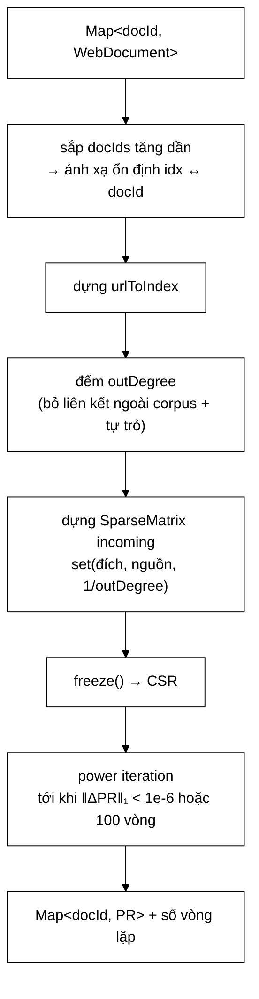

# PageRankService — chọn "chiều lưu" của ma trận từ đầu để khỏi phải chuyển vị

**File nguồn:** `search-engine/src/main/java/com/vnsearch/ranking/PageRankService.java` (188 dòng)
**Gói:** `com.vnsearch.ranking` · **Loại:** lớp thường, không trạng thái giữa các lần gọi ⇒ an toàn đa luồng
**Vị trí trong luồng:** chạy **ngoài** chu kỳ truy vấn — tính một lần sau khi crawl, kết quả nạp vào [`decorator/PageRankBoostScorer`](./decorator/PageRankBoostScorer.md)
**Đọc kèm:** [`../datastructure/SparseMatrix.md`](../datastructure/SparseMatrix.md) · [`decorator/PageRankBoostScorer.md`](./decorator/PageRankBoostScorer.md)

---

## 📌 Hiểu trong 30 giây

PageRank tự cài bằng **power iteration** trên ma trận thưa.

$$PR(j) = \frac{1-d}{N} + d \left[ \sum_{i \to j} \frac{PR(i)}{\text{outDegree}(i)} + \frac{\text{danglingMass}}{N} \right], \qquad d = 0{,}85$$

```
   BA SỐ HẠNG, BA Ý NGHĨA

   (1−d)/N              → "teleport": người lướt web gõ URL ngẫu nhiên
   d · Σ PR(i)/out(i)   → uy tín chảy từ các trang trỏ tới j
   d · dangling/N       → khối lượng của trang cụt, chia đều cho mọi trang

   d = 0,85: 85 % thời gian người lướt bấm link,
             15 % thời gian nhảy tới trang bất kỳ
```



---

## 1. Quyết định hay nhất: chọn "chiều lưu" thay vì chuyển vị

Javadoc dòng 19–25:

> *"Khác với định nghĩa toán học «$M[i][j] = 1/\text{outDegree}(i)$ nếu $i$ liên
> kết tới $j$» (rồi phải nhân $M^T \cdot PR$), ta lưu **TRỰC TIẾP** ma trận ở dạng
> «hàng $j$ = danh sách các nguồn $i$ trỏ tới $j$, kèm trọng số
> $1/\text{outDegree}(i)$» — tức `SparseMatrix.set(j, i, 1/outDegree(i))`. Nhờ vậy
> `SparseMatrix.multiply` tính đúng `result[j] = Σᵢ M[j][i]·PR[i]` chính là
> $M^T \cdot PR$ mà **KHÔNG cần** thao tác transpose riêng — chỉ là cách ta chọn
> «chiều lưu» của ma trận từ đầu."*

```java
incoming.set(targetIdx, idx, weight);
//           └─ đích ─┘  └nguồn┘
```

```
   HAI CÁCH LƯU CÙNG MỘT ĐỒ THỊ

   Đồ thị:  A → B,  A → C,  B → C

   CÁCH TOÁN HỌC (M[nguồn][đích]):
     hàng A: [B: 1/2, C: 1/2]
     hàng B: [C: 1]
     hàng C: []
     ⇒ Muốn tính PR phải nhân Mᵀ · PR
     ⇒ Phải CHUYỂN VỊ: duyệt lại toàn bộ nnz, dựng lại cấu trúc

   CÁCH Ở ĐÂY (M[đích][nguồn]):
     hàng A: []
     hàng B: [A: 1/2]
     hàng C: [A: 1/2, B: 1]
     ⇒ multiply(pr) cho ngay result[j] = Σ M[j][i]·pr[i]
     ⇒ ĐÚNG công thức PageRank, KHÔNG chuyển vị
```

```
   ⭐ VÌ SAO ĐÂY LÀ QUYẾT ĐỊNH ĐÁNG HỌC

   Chuyển vị một ma trận thưa n×n với nnz phần tử tốn:
     - O(nnz) thời gian
     - O(nnz) bộ nhớ cho bản sao
     - và mã chuyển vị là mã DỄ SAI (nhầm chỉ số)

   Nhưng nó KHÔNG CẦN THIẾT nếu ngay từ đầu ta lưu theo
   chiều mà thuật toán cần đọc.

   ⇒ Bài học tổng quát: cấu trúc dữ liệu nên được chọn
     theo CÁCH NÓ SẼ ĐƯỢC ĐỌC, không theo cách nó được
     định nghĩa trong sách.

   ⇒ Và Javadoc nói rõ đây KHÔNG phải mẹo — chỉ là chọn
     chiều lưu. Sự khiêm tốn đó làm lời giải thích dễ tin hơn.
```

---

## 2. Dangling node — bảo toàn tổng $PR = 1$

Javadoc dòng 27–30:

> *"Dangling node (trang không có outlink **NÀO** trỏ về một trang khác **TRONG
> CORPUS đã crawl**): toàn bộ «khối lượng» PR của nó được phân phối **ĐỀU** cho
> tất cả $N$ trang (thay vì biến mất khỏi hệ thống, vi phạm tính chất tổng
> $PR = 1$)."*

```java
double danglingSum = 0.0;
for (int i = 0; i < n; i++) {
    if (dangling[i]) danglingSum += pr[i];
}
double danglingContribution = DAMPING * danglingSum / n;
```

```
   VẤN ĐỀ NẾU BỎ QUA DANGLING NODE

   Trang E không trỏ đi đâu ⇒ hàng của nó trong ma trận RỖNG
   ⇒ PR(E) không được phân phối cho ai
   ⇒ Mỗi vòng lặp, tổng PR GIẢM ĐI đúng d·PR(E)

   Với 20 % trang là dangling:
     vòng 1: Σ PR = 1,000
     vòng 2: Σ PR = 1 − 0,85×0,20 = 0,830
     vòng 3: Σ PR = 0,830 − ...   ≈ 0,689
     …
     vòng 30: Σ PR ≈ 0,004

   ⇒ MỌI điểm PageRank tiến về 0
   ⇒ Điều kiện dừng ‖ΔPR‖₁ < 1e-6 vẫn ĐẠT (vì mọi số đều bé)
   ⇒ Thuật toán "hội tụ" về một kết quả VÔ NGHĨA
   ⇒ Và KHÔNG có gì báo lỗi
```

```
   VÌ SAO PHÂN PHỐI ĐỀU LÀ ĐÚNG

   Diễn giải xác suất: người lướt web tới một trang cụt.
   Họ không thể bấm link nào nữa ⇒ họ gõ một URL ngẫu nhiên.

   ⇒ Xác suất tới trang bất kỳ = 1/N
   ⇒ Chia đều là mô hình hoá đúng hành vi đó

   Đây là cách xử lý chuẩn trong bài báo gốc của Brin & Page.
```

```
   ĐỊNH NGHĨA "DANGLING" Ở ĐÂY HẸP HƠN THÔNG THƯỜNG

   Trang có outlink NHƯNG mọi outlink đều trỏ RA NGOÀI corpus
   ⇒ outDegree = 0 ⇒ VẪN là dangling

   Điều này ĐÚNG: PageRank chỉ định nghĩa trên đồ thị đã crawl.
   Một liên kết tới trang chưa crawl không truyền uy tín được
   cho ai trong tập đang xét.

   ⇒ Với corpus 5.011 trang crawl từ web thật, tỉ lệ dangling
     có thể RẤT CAO — phần lớn liên kết trỏ ra ngoài.
   ⇒ Con số này đáng được log ra. Xem đề xuất 2.
```

---

## 3. Hai phép lọc liên kết

```java
Integer targetIdx = urlToIndex.get(outlink);
if (targetIdx != null && targetIdx != idx) {
    outDegree[idx]++;
}
```

```
   ① targetIdx != null  → liên kết trỏ RA NGOÀI corpus
     Không có node đích ⇒ không truyền uy tín cho ai
     ⇒ không tính vào outDegree

   ② targetIdx != idx   → TỰ TRỎ (self-link)
     Trang trỏ về chính nó ⇒ nếu tính, nó tự bơm uy tín
     cho mình ⇒ lỗ hổng thao túng cơ bản nhất
     ⇒ loại bỏ
```

```
   ⚠️ CẠM BẪY JAVA Ở `targetIdx != idx`

   targetIdx là Integer (đối tượng), idx là int (nguyên thuỷ)
   ⇒ Java TỰ MỞ HỘP targetIdx rồi so sánh int với int  ✓ ĐÚNG

   NHƯNG nếu ai đó đổi idx thành Integer:
     targetIdx != idx  ⇒ so sánh THAM CHIẾU
     ⇒ với giá trị > 127 (ngoài cache Integer), luôn TRUE
     ⇒ tự trỏ KHÔNG bị loại nữa
     ⇒ lỗi im lặng, chỉ lộ ra ở giá trị lớn

   Mã hiện tại đúng, nhưng nó đúng NHỜ MAY MẮN về kiểu,
   không nhờ một phép so sánh tường minh.
```

### 3.1 Hai vòng lặp riêng — không gộp được

```
   VÒNG 1: đếm outDegree[idx]
   VÒNG 2: dựng ma trận với weight = 1/outDegree[idx]

   KHÔNG GỘP ĐƯỢC vì weight cần outDegree ĐÃ ĐẦY ĐỦ,
   mà outDegree chỉ đầy đủ sau khi duyệt hết outlink của idx.

   ⇒ Hai lần duyệt là BẮT BUỘC, không phải thiếu tối ưu.
   ⇒ Chi phí: 2 × tổng số outlink — vẫn tuyến tính.
```

---

## 4. `freeze()` — trả chi phí một lần cho hàng chục vòng lặp

```java
incoming.freeze();
```

Bình luận dòng 101–103:

> *"«Đông băng» sang CSR trước khi lặp: power iteration chạy hàng chục vòng trên
> **CÙNG** một ma trận, nên trả chi phí chuyển đổi **MỘT** lần để đổi lấy cục bộ
> cache tốt hơn và ít bộ nhớ hơn cho tất cả các vòng sau."*

```
   PHÂN TÍCH ĐÁNH ĐỔI

   Chi phí freeze()     : O(nnz) MỘT lần
   Lợi ích mỗi multiply : cục bộ cache tốt hơn + ít bộ nhớ

   Số vòng lặp ~30–50
   ⇒ Chi phí chia đều cho 30–50 lần dùng
   ⇒ Gần như miễn phí

   ⇒ Đây là mẫu chuẩn: cấu trúc dựng-một-lần-đọc-nhiều-lần
     nên có hai dạng — dạng DỰNG (linh hoạt, chậm) và
     dạng ĐỌC (cứng, nhanh).
   ⇒ Cùng ý tưởng với "heapify rồi freeze" ở
     ../datastructure/MinHeap.md.
```

```
   CSR (Compressed Sparse Row) LÀ GÌ

   Dạng Map<Integer, Map<Integer, Double>> (lúc dựng):
     - mỗi phần tử là một đối tượng, nằm rải rác trong heap
     - mỗi lần đọc: hai lần tra bảng băm + theo con trỏ

   Dạng CSR (sau freeze):
     rowPtr[] : chỉ số bắt đầu của mỗi hàng
     colIdx[] : cột của từng phần tử khác 0
     values[] : giá trị
     ⇒ ba mảng PHẲNG, duyệt tuần tự
     ⇒ prefetcher của CPU đoán đúng

   Xem ../datastructure/SparseMatrix.md.
```

---

## 5. Vòng lặp và điều kiện dừng

```java
do {
    ...
    double[] linkContribution = incoming.multiply(pr);
    double[] newPr = new double[n];
    diff = 0.0;
    for (int j = 0; j < n; j++) {
        newPr[j] = teleport + DAMPING * linkContribution[j] + danglingContribution;
        diff += Math.abs(newPr[j] - pr[j]);
    }
    pr = newPr;
    iteration++;
} while (diff >= EPSILON && iteration < MAX_ITERATIONS);
```

```
   BA CHI TIẾT ĐÚNG

   ① MẢNG MỚI newPr, không sửa tại chỗ
     Sửa tại chỗ ⇒ vòng lặp j dùng lẫn giá trị cũ và mới
     ⇒ trở thành Gauss–Seidel thay vì Jacobi
     ⇒ hội tụ khác, kết quả khác, và KHÔNG có gì báo

   ② diff tính TRONG cùng vòng lặp j
     Không cần một vòng duyệt thứ hai. Tiết kiệm O(N).

   ③ do-while, không while
     Đảm bảo chạy ÍT NHẤT một vòng.
     Với while, diff khởi tạo là 0 sẽ thoát ngay lập tức.
```

```
   ĐIỀU KIỆN DỪNG: ‖ΔPR‖₁ < 1e-6 HOẶC 100 vòng

   Chuẩn L1 (tổng trị tuyệt đối) chứ không phải L2 hay L∞.
   ⇒ Hợp lý vì PR là phân phối xác suất: ‖·‖₁ đo đúng
     "tổng khối lượng đã dịch chuyển".

   MAX_ITERATIONS = 100 là LƯỚI AN TOÀN:
     - đồ thị bệnh lý có thể không hội tụ
     - lỗi số học có thể làm diff dao động
     ⇒ Không bao giờ treo vô hạn

   ⚠️ NHƯNG: nếu chạm 100 vòng mà chưa hội tụ,
     hàm vẫn trả kết quả BÌNH THƯỜNG. Chỉ có dòng log
     ghi số vòng — không có cảnh báo. Xem đề xuất 2.
```

### 5.1 Ghi log bằng `Logger`, không `System.out`

Bình luận dòng 134–137:

> *"Logger chứ không phải `System.out`: dòng này chạy trong tiến trình máy chủ,
> nên nó cần dấu thời gian, mức độ và **lọc được** như mọi dòng log khác. In thẳng
> ra stdout thì nó không có gì cả, và ở profile prod (log dạng JSON) nó **lọt ra
> ngoài định dạng**."*

```
   BA LÝ DO, MỖI LÝ DO MỘT HẬU QUẢ CỤ THỂ

   ① Dấu thời gian + mức độ → tra cứu được khi có sự cố
   ② Lọc được              → tắt/bật theo cấu hình, không sửa mã
   ③ Định dạng JSON ở prod → System.out phá vỡ cấu trúc log
                              ⇒ hệ thống thu thập log không parse được
                              ⇒ dòng đó BIẾN MẤT khỏi hệ thống giám sát

   ⇒ Hậu quả ③ là thứ ít ai nghĩ tới, và nó nghiêm trọng nhất:
     dòng log quan trọng nhất lại là dòng bị mất.
```

Nội dung dòng log cũng được chọn kỹ:

```java
log.info("PageRank hoi tu sau {} vong lap (diff cuoi = {}, nnz = {}, do thua = {}%)",
        iteration, String.format("%.2e", diff), incoming.nnz(),
        String.format("%.4f", incoming.density() * 100));
```

```
   BỐN CON SỐ, MỖI CON SỐ TRẢ LỜI MỘT CÂU HỎI

   iteration → "có hội tụ không, hay chạm trần 100?"
   diff      → "hội tụ tới mức nào?"
   nnz       → "đồ thị có bao nhiêu liên kết trong corpus?"
   density   → "ma trận thưa tới mức nào?" (biện minh cho SparseMatrix)

   ⇒ Đủ để đưa thẳng vào báo cáo mà không cần đo lại.
```

---

## 6. Bình luận về `UC_USELESS_OBJECT` — ghi lại một điều bất ngờ

Bình luận dòng 59–66:

> *"CHỈ cần một bảng tra: `url -> chỉ số`. Trước đây ở đây còn một bảng thứ hai
> (`docId -> chỉ số`) được dựng đầy đủ nhưng **KHÔNG BAO GIỜ đọc** — phép ánh xạ
> ngược lại chỉ là `docIds.get(idx)`, và đó là một `ArrayList` nên tra cứu đã là
> $O(1)$ sẵn.*
> *SpotBugs bắt được nó (`UC_USELESS_OBJECT`), nhưng **chỉ trên CI**: máy phát
> triển chạy JDK 21 còn CI chạy JDK 17, và hai bản phân tích cho kết quả **khác
> nhau trên cùng một mã nguồn**."*

```
   ⭐ ĐÂY LÀ MỘT GHI CHÚ RẤT HIẾM VÀ RẤT ĐÁNG GIÁ

   Nó không nói về mã. Nó nói về CÔNG CỤ và MÔI TRƯỜNG.

   Thông tin thực tế: "công cụ phân tích tĩnh cho kết quả
   khác nhau giữa JDK 17 và JDK 21".

   ⇒ Người đọc sau này gặp tình huống "CI đỏ mà máy mình xanh"
     sẽ biết ngay nguyên nhân, thay vì mất nửa ngày.

   ⇒ Loại kiến thức này thường chỉ tồn tại trong đầu một người,
     hoặc trong một tin nhắn chat đã trôi mất.
```

```
   VÀ NÓ CŨNG NÓI VỀ MỘT LOẠI MÃ CHẾT KHÓ THẤY

   Map<Integer,Integer> docIdToIndex = new HashMap<>();
   for (...) docIdToIndex.put(docId, idx);      ← ĐƯỢC GHI ĐẦY ĐỦ
   // ... nhưng KHÔNG BAO GIỜ được đọc

   Mã này trông hoàn toàn "đang làm việc": có vòng lặp,
   có put, có dữ liệu.
   Chỉ khi tìm chỗ .get() mới thấy KHÔNG CÓ CHỖ NÀO.

   ⇒ Con người rất khó thấy. Công cụ thì thấy ngay.
   ⇒ Lý do nên chạy phân tích tĩnh trong CI.
```

---

## 7. Hướng dẫn thực hành

### 7.1 Chạy demo kiểm chứng bằng tay

```powershell
cd search-engine
.\mvnw.cmd -q compile exec:java "-Dexec.mainClass=com.vnsearch.ranking.PageRankService"
```

```
   Đồ thị 6 node:
     A → B, C     B → C     C → A     D → C
     E, F: không có outlink ⇒ dangling

   Kết quả mong đợi:
     PR(C) cao nhất  — được A, B, D trỏ tới
     PR(A) cao thứ hai — được C trỏ tới, mà C có PR cao
     PR(E) = PR(F) — cùng là dangling, không ai trỏ tới
     Tổng PR ≈ 1,000

   ⇒ Đồ thị đủ nhỏ để tính tay và đưa vào báo cáo.
   ⇒ "Tổng PR phải xấp xỉ 1.0" in ra trực tiếp — người đọc
     báo cáo tự kiểm chứng được tính chất quan trọng nhất.
```

### 7.2 Dùng

```java
PageRankService service = new PageRankService();
PageRankResult result = service.computePageRank(documentsByDocId);

System.out.println("Hội tụ sau " + result.iterations() + " vòng");
Map<Integer, Double> scores = result.scores();

// Nap vao chuoi cham diem
RelevanceScorer scorer = scorerFactory.create(scores);
```

### 7.3 Cạm bẫy

```
   ① computePageRank nhận Map<Integer, WebDocument> — TOÀN BỘ
     corpus trong bộ nhớ. Với 5.011 tài liệu thì được;
     với 1 triệu thì không.

   ② Nó dùng doc.getOutlinks() và doc.getUrl().
     Nếu WebDocument nạp từ kho mà outlinks không được nạp
     ⇒ MỌI trang thành dangling ⇒ PR đều nhau ⇒ tín hiệu vô dụng,
     KHÔNG có cảnh báo.

   ③ Khớp liên kết theo URL CHÍNH XÁC (chuỗi).
     "http://a.vn/x" và "http://a.vn/x/" là hai URL khác nhau
     ⇒ liên kết bị mất. Phụ thuộc hoàn toàn vào
     UrlCanonicalizer đã chuẩn hoá nhất quán ở cả hai phía.

   ④ Chạm MAX_ITERATIONS = 100 mà chưa hội tụ vẫn trả kết quả
     bình thường. Chỉ có số vòng trong log và trong
     PageRankResult.iterations() — người gọi phải TỰ kiểm.

   ⑤ Kết quả là Map<Integer, Double> với docId làm khoá.
     Chỉ mục đổi (thêm/bớt tài liệu) ⇒ phải tính lại toàn bộ.
     Không có cơ chế cập nhật tăng dần.

   ⑥ Tổng PR ≈ 1 nghĩa là mọi giá trị ~1/N.
     ĐỪNG cộng nó vào điểm liên quan — xem
     decorator/PageRankBoostScorer.md mục 1.
```

---

## 8. Độ phức tạp & chi phí

Ký hiệu: $N$ = số tài liệu, $nnz$ = số liên kết trong corpus, $T$ = số vòng lặp.

| Bước | Chi phí | Ghi chú |
|---|---|---|
| Dựng `urlToIndex` | $O(N)$ | |
| Đếm `outDegree` | $O(\text{tổng outlink})$ | Duyệt lần 1 |
| Dựng ma trận | $O(\text{tổng outlink})$ | Duyệt lần 2 |
| `freeze()` | $O(nnz)$ | Một lần |
| Mỗi vòng lặp | $O(nnz + N)$ | `multiply` + dangling/teleport |
| **Tổng** | $O(T \cdot (nnz + N))$ | |
| Bộ nhớ | $O(N + nnz)$ | Cộng `Map` tài liệu do người gọi giữ |

```
   ƯỚC TÍNH THỰC TẾ — N = 5.011, giả sử nnz ≈ 20.000, T ≈ 40

   mỗi vòng : 20.000 + 5.011 ≈ 25.000 thao tác
   40 vòng  : 1.000.000 thao tác
   ⇒ ~5–15 ms

   ⇒ RẤT RẺ. Và nó chạy MỘT LẦN sau crawl, không phải
     mỗi truy vấn.

   ⇒ Chi phí không phải vấn đề của PageRank ở đây.
     Vấn đề là GIÁ TRỊ của nó (ΔMRR = +0,0088) —
     xem decorator/PageRankBoostScorer.md.
```

---

## 9. Kiểm thử liên quan

| Test | Bảo vệ điều gì |
|---|---|
| `test/java/com/vnsearch/ranking/PageRankServiceTest.java` | 6 ca — tính chất toán học |

| Ca test | Tính chất được canh giữ |
|---|---|
| `emptyCorpusReturnsEmptyResult` | `n == 0` |
| `symmetricCycleConvergesToUniformDistribution` | **Đồ thị đối xứng ⇒ phân phối đều** — kiểm chứng bằng đối xứng |
| **`scoresSumToApproximatelyOne`** | **Bất biến $\sum PR = 1$ — tính chất quan trọng nhất** |
| `danglingNodesGetEqualLowScore` | Xử lý dangling (mục 2) |
| `moreIncomingLinksGivesHigherPageRank` | Tính đơn điệu theo số liên kết vào |
| `convergesWithinMaxIterations` | Không treo vô hạn |

```
   ⭐ ĐÂY LÀ BỘ TEST KIỂM TÍNH CHẤT, KHÔNG KIỂM GIÁ TRỊ.

   scoresSumToApproximatelyOne canh giữ chính bất biến
   mà việc xử lý dangling sinh ra để bảo vệ (mục 2).
   ⇒ Bỏ đoạn dangling đi ⇒ test này ĐỎ NGAY.

   symmetricCycleConvergesToUniformDistribution dùng ĐỐI XỨNG:
   trên một chu trình đối xứng, mọi node PHẢI có PR bằng nhau
   theo lý thuyết.
   ⇒ Không cần biết đáp số, chỉ cần biết tính chất.
   ⇒ Kỹ thuật này bắt được nhiều lỗi hơn hẳn việc so với
     một giá trị tính tay.
```

**Còn thiếu:**

```
   ✗ Tự trỏ (self-link) bị loại — lỗ hổng thao túng cơ bản nhất
   ✗ Liên kết ra NGOÀI corpus bị bỏ qua
   ✗ Chạm MAX_ITERATIONS ⇒ iterations() == 100
   ✗ Ma trận lưu theo chiều ĐÍCH — tức quyết định thiết kế
     chính của lớp (mục 1). Nếu ai đó "sửa cho đúng định nghĩa
     toán học" thành set(idx, targetIdx, w), kết quả sẽ SAI
     nhưng vẫn hội tụ và vẫn có tổng = 1.
     ⇒ scoresSumToApproximatelyOne VẪN XANH.
     ⇒ moreIncomingLinksGivesHigherPageRank sẽ đỏ — may mắn.
```

```powershell
cd search-engine
.\mvnw.cmd -q -Dtest='PageRankServiceTest' test
```

---

## 10. Chấm theo chuẩn doanh nghiệp

| Tiêu chí | Điểm | Nhận xét |
|---|---|---|
| **Chọn chiều lưu thay vì chuyển vị** | 10/10 | Tránh hẳn một thao tác $O(nnz)$ dễ sai, và giải thích rõ đây chỉ là lựa chọn biểu diễn |
| **Xử lý dangling node** | 10/10 | Bảo toàn $\sum PR = 1$; không có nó, thuật toán "hội tụ" về kết quả vô nghĩa mà không báo lỗi |
| **Test kiểm tính chất** | 10/10 | Tổng bằng 1, đối xứng cho phân phối đều, đơn điệu theo liên kết vào — bắt lỗi tốt hơn so giá trị |
| Ghi lại kiến thức về công cụ | 10/10 | Ghi chú JDK 17 vs 21 làm SpotBugs khác nhau — loại thông tin thường bị mất |
| Lý do dùng `Logger` | 10/10 | Ba lý do, kể cả hậu quả ít ai nghĩ tới: `System.out` lọt ra ngoài định dạng JSON ở prod |
| `freeze()` đúng chỗ | 9/10 | Trả chi phí một lần cho hàng chục vòng lặp |
| Nội dung dòng log | 9/10 | Bốn con số đủ đưa thẳng vào báo cáo |
| Lọc tự trỏ và liên kết ngoài | 9/10 | Hai phép lọc đúng, chặn lỗ hổng thao túng cơ bản |
| Demo kiểm chứng tay | 9/10 | Đồ thị 6 node, in luôn "tổng phải xấp xỉ 1,0" để người đọc tự kiểm |
| **Cảnh báo khi không hội tụ** | **4/10** | Chạm 100 vòng vẫn trả kết quả bình thường; chỉ có số vòng trong log |
| Phát hiện "outlinks không được nạp" | 3/10 | Mọi trang thành dangling ⇒ PR đều nhau ⇒ tín hiệu vô dụng **im lặng** |
| Kiểm thử chiều lưu ma trận | 5/10 | Quyết định thiết kế chính của lớp chỉ được phủ **gián tiếp** |
| Khả năng mở rộng | 4/10 | Yêu cầu toàn bộ corpus trong bộ nhớ; không có cập nhật tăng dần |

**Ba đề xuất nâng lên mức sản phẩm:**

1. **Đừng để "không hội tụ" và "mọi trang là dangling" trôi qua trong im lặng.**
   Hai tình huống này đều cho ra kết quả **trông hợp lệ** (tổng vẫn bằng 1, mọi
   giá trị vẫn dương) nhưng vô dụng — và cả hai đều dẫn tới việc
   [`PageRankBoostScorer`](./decorator/PageRankBoostScorer.md) chấm mọi tài liệu
   như nhau mà không ai biết. Kiểm ngay tại chỗ tính:
   ```java
   long soDangling = IntStream.range(0, n).filter(i -> dangling[i]).count();
   if (soDangling == n) {
       log.error("MOI trang deu la dangling: khong co lien ket NAO trong corpus. "
               + "outlinks co duoc nap tu kho tai lieu khong? PageRank se vo dung.");
   } else if (soDangling > 0.9 * n) {
       log.warn("{}/{} trang la dangling ({}%) — tin hieu PageRank rat yeu.",
                soDangling, n, 100 * soDangling / n);
   }
   if (iteration >= MAX_ITERATIONS && diff >= EPSILON) {
       log.warn("PageRank CHUA hoi tu sau {} vong (diff = {}). Ket qua chi la xap xi.",
                MAX_ITERATIONS, diff);
   }
   ```
   Tỉ lệ dangling còn là một con số đáng đưa thẳng vào báo cáo: nó nói corpus đã
   crawl "kín" tới đâu, và nó giải thích tại sao $\Delta$MRR của PageRank chỉ
   +0,0088.

2. **Viết test khoá lại chiều lưu ma trận.** Đây là quyết định thiết kế trung tâm
   của lớp, và nó **trái với định nghĩa trong sách** — nên khả năng ai đó "sửa cho
   đúng" thành `set(idx, targetIdx, weight)` là rất thật. Điều nguy hiểm là kết
   quả sai vẫn hội tụ và vẫn có tổng bằng 1, nên phần lớn test hiện có vẫn xanh.
   Một đồ thị **bất đối xứng** phân biệt hai chiều lưu ngay lập tức:
   ```java
   @Test
   @DisplayName("Ma trận lưu theo chiều ĐÍCH: trang được trỏ tới nhiều PR cao, không phải trang trỏ đi nhiều")
   void maTranLuuTheoChieuDich() {
       // A → B, A → C, A → D   (A tro di NHIEU, khong ai tro toi A)
       // ⇒ PR(A) phai THAP hon PR(B), PR(C), PR(D)
       var pr = service.computePageRank(doThi("A→B", "A→C", "A→D")).scores();
       assertTrue(pr.get(idA) < pr.get(idB),
               "Tro di nhieu KHONG lam tang PR — chi tro TOI moi lam tang");
   }

   @Test
   void tuTroKhongLamTangPageRank() {
       var khongTuTro = service.computePageRank(doThi("A→B", "B→A")).scores();
       var coTuTro    = service.computePageRank(doThi("A→B", "B→A", "A→A")).scores();
       assertEquals(khongTuTro.get(idA), coTuTro.get(idA), 1e-9,
               "Lien ket tu tro phai bi loai bo hoan toan");
   }
   ```

3. **Tách khâu dựng đồ thị khỏi khâu tính toán.** Hiện `computePageRank` nhận
   `Map<Integer, WebDocument>` — tức **toàn bộ corpus trong bộ nhớ** kèm cả thân
   bài, trong khi thuật toán chỉ cần URL và danh sách outlink. Với 5.011 tài liệu
   thì được; nhưng ràng buộc này chặn hẳn đường mở rộng, và nó cũng làm lớp khó
   test hơn cần thiết (mỗi test phải dựng `WebDocument` đầy đủ):
   ```java
   /** Do thi lien ket — thu DUY NHAT thuat toan can. */
   public record LinkGraph(List<Integer> docIds, int[][] outlinksByIndex) { }

   public PageRankResult computePageRank(LinkGraph graph) { ... }
   ```
   Tách xong, khâu dựng `LinkGraph` có thể đọc **theo luồng** từ
   [`DocumentRepository`](../storage/DocumentRepository.md) mà không giữ tài liệu
   nào trong bộ nhớ, và test chỉ cần một mảng số nguyên thay vì một corpus giả.

---

## 11. Liên kết

- Cấu trúc ma trận thưa và `freeze()`: [`../datastructure/SparseMatrix.md`](../datastructure/SparseMatrix.md)
- Nơi điểm PageRank được dùng để xếp hạng: [`decorator/PageRankBoostScorer.md`](./decorator/PageRankBoostScorer.md)
- Nơi điểm được nạp vào chuỗi chấm điểm: [`ScorerFactory.md`](./ScorerFactory.md) · [`ResultRanker.md`](./ResultRanker.md)
- Nguồn `outlinks`: [`../crawler/LinkExtractor.md`](../crawler/LinkExtractor.md) · [`../model/WebDocument.md`](../model/WebDocument.md)
- Chuẩn hoá URL — điều kiện để khớp liên kết đúng: [`../crawler/UrlCanonicalizer.md`](../crawler/UrlCanonicalizer.md)
- Nguồn tài liệu: [`../storage/DocumentRepository.md`](../storage/DocumentRepository.md) · [`../storage/DocumentStore.md`](../storage/DocumentStore.md)
- Cùng mẫu "dựng rồi đông băng": [`../datastructure/MinHeap.md`](../datastructure/MinHeap.md) · [`../index/CompressedPostings.md`](../index/CompressedPostings.md)
