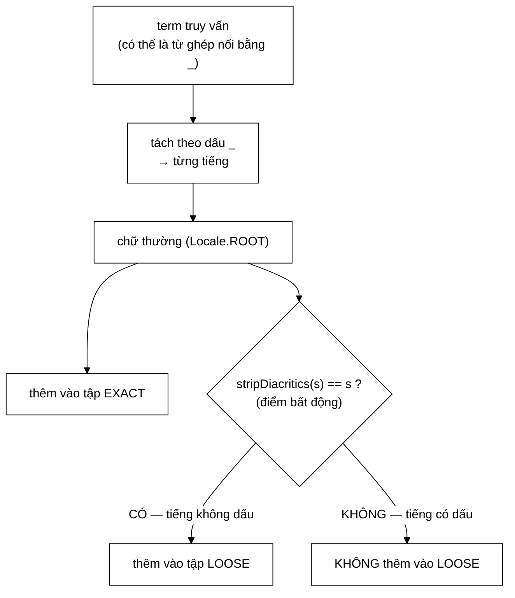

# QuerySyllables — bỏ dấu là ánh xạ nhiều-một, và so khớp trên ảnh thì mất khả năng phân biệt

**File nguồn:** `search-engine/src/main/java/com/vnsearch/ranking/QuerySyllables.java` (121 dòng)
**Gói:** `com.vnsearch.ranking` · **Loại:** `record` với hai `Set<String>` ⇒ bất biến nông, an toàn đa luồng nếu không ai sửa hai tập truyền vào
**Vị trí trong luồng:** dùng ở **hai khâu hiển thị** — bôi sáng snippet ([`SnippetBuilder`](./SnippetBuilder.md)) và chấm điểm khớp tiêu đề ([`decorator/TitleBoostScorer`](./decorator/TitleBoostScorer.md))
**Đọc kèm:** [`../index/VietnameseTokenizer.md`](../index/VietnameseTokenizer.md) · [`SnippetBuilder.md`](./SnippetBuilder.md)

---

## 📌 Hiểu trong 30 giây

Một `record` hai trường, nhưng nó ghi lại một **lỗi thật đã được sửa** — và lời
giải thích nguyên nhân gốc là phần đáng giá nhất của cả file.

```
   LỖI CŨ

   Người dùng gõ:  "ngân hàng"
   Snippet bôi sáng: "cắt giảm cả ngàn nhân sự"
                                 ^^^^  ← SAI

   Vì sao: bỏ dấu cả hai bên trước khi so khớp
     ngân → ngan
     ngàn → ngan          ⇒ khớp!
```

```
   QUY TẮC MỚI

   ┌──────────────────────┬────────────────────┬──────────────────────┐
   │ Người dùng gõ        │ Chế độ khớp        │ Ví dụ                │
   ├──────────────────────┼────────────────────┼──────────────────────┤
   │ ngân   (CÓ dấu)      │ chỉ khớp CHÍNH XÁC │ chỉ sáng "ngân"      │
   │ ngan   (KHÔNG dấu)   │ khớp LỎNG (bỏ dấu) │ sáng cả ngân, ngàn   │
   └──────────────────────┴────────────────────┴──────────────────────┘

   Người dùng gõ dấu = họ BIẾT mình muốn gì ⇒ tôn trọng.
   Người dùng không gõ dấu = họ chưa nói rõ ⇒ nới ra.
```



---

## 1. Nguyên nhân gốc: bỏ dấu là ánh xạ **nhiều-một**

Javadoc dòng 19–25:

> *"Bỏ dấu là một ánh xạ **NHIỀU-MỘT**:*
> ```
> ngân → ngan
> ngàn → ngan
> ngắn → ngan
> ```
> *So khớp trên **ẢNH** của ánh xạ này thì mất khả năng phân biệt các nghịch ảnh."*

```
   PHÁT BIỂU TOÁN HỌC

   Gọi φ: tiếng → tiếng-không-dấu  là phép bỏ dấu.

   φ KHÔNG đơn ánh:  φ(ngân) = φ(ngàn) = φ(ngắn) = "ngan"

   So khớp "φ(a) == φ(b)" tức là hỏi:
     "a và b có CÙNG NGHỊCH ẢNH không?"
   chứ KHÔNG phải:
     "a và b có bằng nhau không?"

   ⇒ Mọi phần tử trong cùng lớp tương đương bị coi là như nhau.
   ⇒ Lớp tương đương của "ngan" có ÍT NHẤT 5 phần tử:
     ngan, ngàn, ngán, ngản, ngãn, ngạn, ngăn, ngằn, …, ngân, …
```

```
   MỘT SỐ LỚP TƯƠNG ĐƯƠNG LỚN TRONG TIẾNG VIỆT

   "ban"  ← ban, bàn, bán, bản, bãn, bạn, băn, bắn, bằn,
             bân, bấn, bần, bẩn, bẫn, bận       (~15 tiếng)

   "co"   ← co, cò, có, cỏ, cõ, cọ, cô, cồ, cố, cổ, cỗ, cộ,
             cơ, cờ, cớ, cở, cỡ, cợ             (~18 tiếng)

   ⇒ Với những tiếng như "co", bỏ dấu làm MẤT gần hết thông tin.
   ⇒ Bôi sáng theo dạng bỏ dấu là bôi sáng gần như NGẪU NHIÊN.
```

### 1.1 Vì sao **vẫn** cần bỏ dấu ở khâu tra cứu

Javadoc dòng 27–30 — đây là chỗ phân biệt tinh tế nhất:

> *"Ở đó ta **KHÔNG BIẾT** người dùng sẽ gõ kiểu nào, nên phải index cả hai dạng
> để bắt được cả hai. Bỏ dấu là **CẦN THIẾT** ở tra cứu — nhưng ở khâu *hiển thị*
> thì **thừa và gây sai**, vì lúc này đã biết chính xác người dùng gõ gì."*

```
   HAI KHÂU, HAI YÊU CẦU NGƯỢC NHAU

   ┌─────────────┬──────────────────┬───────────────────────────┐
   │             │ TRA CỨU          │ HIỂN THỊ                  │
   ├─────────────┼──────────────────┼───────────────────────────┤
   │ Mục tiêu    │ ĐỪNG BỎ SÓT      │ ĐỪNG BÁO NHẦM             │
   │ Ưu tiên     │ recall           │ precision                 │
   │ Biết gì?    │ chưa biết người  │ ĐÃ BIẾT chính xác chuỗi   │
   │             │ dùng gõ kiểu nào │ người dùng gõ             │
   │ Bỏ dấu?     │ CÓ — cần thiết   │ KHÔNG — thừa và gây sai   │
   └─────────────┴──────────────────┴───────────────────────────┘

   ⇒ Cùng một phép biến đổi, ĐÚNG ở chỗ này và SAI ở chỗ kia.
     Đây là loại hiểu biết chỉ có được sau khi lỗi đã xảy ra thật.
```

```
   VÌ SAO LỖI NÀY KHÓ PHÁT HIỆN

   Nó KHÔNG làm kết quả sai — tài liệu trả về vẫn đúng.
   Nó chỉ làm SNIPPET bôi sáng sai chỗ.

   ⇒ Không test đơn vị nào bắt được (kết quả tìm kiếm vẫn đúng)
   ⇒ Không ngoại lệ nào được ném
   ⇒ Chỉ lộ ra khi CON NGƯỜI nhìn vào màn hình và thấy kỳ

   Đây là lý do file này đáng có, và lý do Javadoc ghi lại
   nguyên nhân gốc thay vì chỉ sửa im lặng.
```

---

## 2. Kỹ thuật **điểm bất động** để phát hiện tiếng có dấu

```java
if (VietnameseTokenizer.stripDiacritics(lower).equalsIgnoreCase(lower)) {
    loose.add(lower);
}
```

Javadoc dòng 41–42:

> *"Cách kiểm tra «tiếng này có dấu không» dùng **điểm bất động** của phép bỏ
> dấu: `stripDiacritics(s) == s` khi và chỉ khi `s` không có dấu."*

```
   ĐIỂM BẤT ĐỘNG (fixed point)

   x là điểm bất động của φ  ⟺  φ(x) = x

   φ = stripDiacritics
   φ("ngan") = "ngan"  ⇒ "ngan" LÀ điểm bất động ⇒ KHÔNG có dấu
   φ("ngân") = "ngan"  ⇒ "ngân" KHÔNG bất động  ⇒ CÓ dấu

   ⇒ Kiểm tra "có dấu không" quy về MỘT phép so sánh chuỗi.
```

```
   VÌ SAO CÁCH NÀY HƠN CÁC CÁCH KHÁC

   CÁCH A — liệt kê ký tự có dấu:
     if (s.matches(".*[àáảãạăằắẳẵặâầấẩẫậèéẻẽẹ…].*"))
     ⇒ ~134 ký tự phải liệt kê
     ⇒ SÓT một ký tự là sai âm thầm
     ⇒ phải sửa nếu Unicode thêm ký tự

   CÁCH B — kiểm mã Unicode:
     if (s.chars().anyMatch(c -> c > 127))
     ⇒ SAI: chữ "đ" (U+0111) không có dấu thanh
       nhưng > 127 ⇒ bị coi là "có dấu"

   CÁCH C — điểm bất động (mã dùng cách này):
     stripDiacritics(s).equals(s)
     ⇒ ĐỊNH NGHĨA "có dấu" = "bị stripDiacritics làm đổi"
     ⇒ LUÔN nhất quán với chính hàm bỏ dấu đang dùng
     ⇒ stripDiacritics đổi ⇒ phép kiểm TỰ ĐỘNG đổi theo
```

```
   ⭐ TÍNH CHẤT QUAN TRỌNG NHẤT:
     Phép kiểm và phép biến đổi KHÔNG THỂ TRÔI LỆCH NHAU,
     vì phép kiểm ĐỊNH NGHĨA BẰNG chính phép biến đổi.

   Đây là cùng một tinh thần với "một công thức, một chỗ"
   ở TfIdfScorer.md mục 5.1.
```

⚠️ `equalsIgnoreCase` ở đây hơi thừa — `lower` đã là chữ thường và
`stripDiacritics` không đổi hoa/thường. Nhưng nó vô hại và phòng vệ nếu
`stripDiacritics` sau này trả về dạng khác.

---

## 3. `matches` — hai tầng, ngắn mạch đúng thứ tự

```java
public boolean matches(String word) {
    if (word == null || word.isEmpty()) return false;
    String lower = word.toLowerCase(Locale.ROOT);
    if (exact.contains(lower)) return true;
    return !loose.isEmpty()
            && loose.contains(VietnameseTokenizer.stripDiacritics(lower).toLowerCase(Locale.ROOT));
}
```

```
   THỨ TỰ HAI TẦNG CÓ Ý NGHĨA VỀ CHI PHÍ

   ① exact.contains(lower)
      → một phép băm, KHÔNG biến đổi chuỗi
      → trường hợp phổ biến nhất (người Việt gõ có dấu)

   ② stripDiacritics rồi tra loose
      → phải chuẩn hoá Unicode + duyệt từng ký tự
      → ĐẮT hơn nhiều
      → chỉ chạy khi tầng ① trượt

   ⇒ Đường đi phổ biến chỉ tốn một phép băm.
```

```
   VÌ SAO CẦN !loose.isEmpty()

   Truy vấn "ngân hàng" (mọi tiếng ĐỀU có dấu)
   ⇒ loose = ∅

   Không có phép kiểm này:
     mỗi từ của tiêu đề vẫn phải chạy stripDiacritics
     rồi tra vào một tập RỖNG — chắc chắn trượt.

   Tiêu đề trung bình 10 từ × 5.000 ứng viên = 50.000 lần
   stripDiacritics VÔ ÍCH.

   ⇒ Một phép kiểm isEmpty() cắt sạch.
```

```
   BẢNG QUYẾT ĐỊNH ĐẦY ĐỦ

   truy vấn   từ trong văn bản   exact?   loose?   KẾT QUẢ
   ─────────────────────────────────────────────────────────
   ngân       ngân               ✓        —        KHỚP
   ngân       ngàn               ✗        loose=∅  không khớp ✓
   ngan       ngan               ✓        —        KHỚP
   ngan       ngân               ✗        ✓        KHỚP        ✓ (cố ý)
   ngan       ngàn               ✗        ✓        KHỚP        ✓ (cố ý)
   ngân hàng  ngàn               ✗        loose=∅  không khớp ✓ ← LỖI ĐÃ SỬA
```

---

## 4. `titleMatchRatio` — vì sao **bắt buộc** phải kẹp trong `[0,1]`

```java
public double titleMatchRatio(String title) {
    if (title == null || title.isBlank() || exact.isEmpty()) return 0.0;
    String[] words = WHITESPACE_RUN.split(title.toLowerCase(Locale.ROOT));
    int matched = 0;
    for (String word : words) {
        if (matches(stripPunctuation(word))) matched++;
    }
    return Math.min(1.0, (double) matched / exact.size());
}
```

Javadoc dòng 98–101:

> *"Phải kẹp vì **tử số đếm SỐ LẦN xuất hiện** còn **mẫu số là số tiếng PHÂN
> BIỆT** của truy vấn: một tiêu đề nhồi từ khoá («Máy tính và máy tính bảng» với
> truy vấn «máy tính») cho tỉ số `4/2 = 2`. Không kẹp thì tiêu đề nhồi từ khoá
> được thưởng tuỳ ý."*

```
   TỬ SỐ VÀ MẪU SỐ ĐẾM HAI THỨ KHÁC NHAU

   truy vấn "máy tính"  ⇒ exact = {máy, tính}  ⇒ mẫu số = 2

   tiêu đề "Máy tính và máy tính bảng"
     máy   ✓
     tính  ✓
     và    ✗
     máy   ✓   ← ĐẾM LẠI
     tính  ✓   ← ĐẾM LẠI
     bảng  ✗
   ⇒ matched = 4

   tỉ số = 4/2 = 2,0        ← VƯỢT 1

   Không kẹp:
     bonus = 2,0
     điểm = base × (1 + 0,10 × 2,0) = base × 1,20

   Nhồi 10 lần:
     tỉ số = 20/2 = 10
     điểm = base × (1 + 0,10 × 10) = base × 2,00   ← GẤP ĐÔI

   ⇒ Nhồi từ khoá vào tiêu đề trở thành chiến lược SEO hiệu quả.
```

```
   Math.min(1.0, …) BIẾN TÍN HIỆU THÀNH CÓ TRẦN

   ⇒ Cùng một tinh thần với bão hoà tần suất của BM25
     (xem BM25Scorer.md mục 1.1): tín hiệu tốt phải có TRẦN,
     nếu không nó thành lỗ hổng thao túng.

   ⇒ Và trần = 1 làm bonus nằm gọn trong [0,1], nên
     TitleBoostScorer nhân thẳng mà không cần chuẩn hoá
     (xem TitleBoostScorer Javadoc dòng 26–27).
```

⚠️ **Nhưng cách sửa này che triệu chứng chứ không sửa mẫu số.** Đếm **tiếng phân
biệt đã khớp** thay vì **số lần khớp** sẽ cho tỉ số tự nhiên nằm trong `[0,1]` mà
không cần kẹp. Xem đề xuất 2.

---

## 5. Hai `Pattern` biên dịch sẵn — chi tiết hiệu năng thật

```java
private static final Pattern PUNCTUATION = Pattern.compile("[^\\p{L}\\p{N}]");
private static final Pattern WHITESPACE_RUN = Pattern.compile("\\s+");
```

Javadoc dòng 50–53:

> *"Hai mẫu này chạy cho **TỪNG TỪ** của **TỪNG tiêu đề** và **TỪNG từ** của từng
> snippet, nên để `replaceAll`/`split` biên dịch lại mỗi lần là một khoản phí trả
> vô ích **hàng chục nghìn lần mỗi truy vấn**."*

```
   PHÉP TÍNH

   5.000 ứng viên × 10 từ trong tiêu đề = 50.000 lần stripPunctuation
   + snippet: 5.000 × ~40 từ            = 200.000 lần nữa
   ─────────────────────────────────────────────────────────────
   ~250.000 lần mỗi truy vấn

   String.replaceAll(regex, …) BIÊN DỊCH LẠI regex MỖI LẦN GỌI:
     Pattern.compile ≈ 1–3 µs

   250.000 × 2 µs = 0,5 GIÂY  ← chỉ để biên dịch cùng một regex

   Với Pattern static final: biên dịch MỘT lần khi nạp lớp.
```

```
   ⚠️ ĐÂY LÀ MỘT TRONG NHỮNG BẪY HIỆU NĂNG PHỔ BIẾN NHẤT CỦA JAVA

   String.replaceAll / String.split / String.matches
   đều gọi Pattern.compile bên trong.

   Chúng TIỆN nhưng ĐẮT. Trong vòng nóng, luôn dùng
   Pattern static final + matcher().
```

```
   \p{L} VÀ \p{N} — LỚP UNICODE, KHÔNG PHẢI [a-zA-Z0-9]

   Javadoc dòng 117: "dùng lớp Unicode nên KHÔNG xoá dấu tiếng Việt"

   [^a-zA-Z0-9]  ⇒ "ngân" → "ngn"     ← XOÁ MẤT chữ â
   [^\p{L}\p{N}] ⇒ "ngân" → "ngân"    ← GIỮ NGUYÊN ✓

   \p{L} = mọi ký tự CHỮ của mọi ngôn ngữ
   \p{N} = mọi ký tự SỐ

   ⇒ Chọn sai lớp ký tự ở đây sẽ phá huỷ toàn bộ mục đích
     của cả file: nó sẽ bỏ dấu một cách âm thầm.
```

---

## 6. Hướng dẫn thực hành

### 6.1 Dùng

```java
// Dung MOT LAN cho ca truy van — xem TitleBoostScorer.md muc 2
QuerySyllables syllables = QuerySyllables.from(queryTermFrequency.keySet());

// Cham diem khop tieu de
double bonus = syllables.titleMatchRatio(document.getTitle());   // [0, 1]

// Boi sang snippet
boolean sang = syllables.matches(QuerySyllables.stripPunctuation(word));
```

### 6.2 Cạm bẫy

```
   ① from() nhan TERM (co the co dau _), khong phai TIENG.
     Truyen Set<String> tieng roi thi "máy_tính" khong duoc tach.
     Ngược lại, truyen chuoi truy van THO thi cung sai.
     Nguon dung: queryTermFrequency.keySet().

   ② isEmpty() chi kiem `exact`, khong kiem `loose`.
     Dung — vi loose luon la tap con cua exact.
     Nhung neu ai do dung ham dung record truc tiep
     voi loose ⊄ exact thi bat bien nay VO.

   ③ record co ham dung mac dinh CONG KHAI:
     new QuerySyllables(setA, setB) — khong kiem tra gi.
     Hai tap truyen vao KHONG duoc sao chep ⇒ nguoi goi
     sua chung sau do se sua ca doi tuong "bat bien".

   ④ titleMatchRatio tach tieu de theo KHOANG TRANG,
     khong theo tokenizer. Nen tu ghep "máy tính" trong
     tieu de thanh HAI tu — dung, vi exact cung chua
     hai tieng rieng.

   ⑤ stripPunctuation tra "" cho null — khong nem.
     matches("") tra false. An toan, nhung im lang.
```

---

## 7. Độ phức tạp & chi phí

Ký hiệu: $q$ = số tiếng truy vấn, $w$ = số từ của tiêu đề.

| Thao tác | Chi phí | Ghi chú |
|---|---|---|
| `from(terms)` | $O(q)$ + $q$ lần `stripDiacritics` | Gọi **một lần** mỗi truy vấn |
| `matches(word)` | $O(1)$ nếu trúng `exact` | Ngược lại thêm một `stripDiacritics` |
| `titleMatchRatio` | $O(w)$ | Mỗi từ: một `stripPunctuation` + một `matches` |
| Bộ nhớ | $O(q)$ | Hai `HashSet`, `loose ⊆ exact` |

```
   CHI PHÍ NẾU GỌI from() TRONG VÒNG LẶP (LỖI CŨ)

   5.000 ứng viên × (2 HashSet + q lần stripDiacritics)
   = 10.000 HashSet bị vứt đi ngay sau khi tạo
   ≈ 10.000 × 48 byte = 480 KB rác mỗi truy vấn

   ⇒ Áp lực GC thật. Xem TitleBoostScorer.md mục 2.
```

---

## 8. Kiểm thử liên quan

```
   ⚠️ KHÔNG CÓ FILE TEST NÀO CHO LỚP NÀY.

   Tìm trong toàn bộ src/test: 0 kết quả cho "QuerySyllables".

   Nó chỉ được phủ GIÁN TIẾP qua:
     - ResultRankerTest       (dùng qua ResultRanker dòng 115)
     - ScorerDecoratorTest    (dùng qua TitleBoostScorer)

   NGHĨA LÀ: chính cái lỗi mà file này được viết ra để sửa
   — "ngân hàng" bôi sáng nhầm "ngàn" — KHÔNG CÓ TEST NÀO
   ngăn nó quay lại.
```

```
   ĐÂY LÀ LỖ HỔNG NGHIÊM TRỌNG NHẤT, VÌ:

   ① Lỗi cũ là lỗi IM LẶNG (kết quả đúng, chỉ hiển thị sai)
   ② Không ai để ý trừ khi nhìn màn hình
   ③ Sửa nó cần một hiểu biết tinh tế (ánh xạ nhiều-một)
   ④ Một lần refactor "gọn lại" rất dễ vô tình khôi phục
     hành vi cũ — ví dụ đổi matches() thành so sánh
     dạng bỏ dấu ở cả hai vế "cho đơn giản"

   ⇒ Chính xác loại hồi quy mà test hồi quy sinh ra để chặn.
```

Xem đề xuất 1 — đây là việc cần làm trước tiên với file này.

---

## 9. Liên kết

- Nguồn `stripDiacritics` — phép biến đổi mà cả lớp này xoay quanh: [`../index/VietnameseTokenizer.md`](../index/VietnameseTokenizer.md)
- Hai nơi tiêu thụ: [`decorator/TitleBoostScorer.md`](./decorator/TitleBoostScorer.md) · [`SnippetBuilder.md`](./SnippetBuilder.md)
- Nơi đối tượng được dựng một lần cho cả truy vấn: [`ResultRanker.md`](./ResultRanker.md) · [`RelevanceScorer.md`](./RelevanceScorer.md) (mục `prepare`)
- Nguồn `queryTermFrequency.keySet()`: [`../query/CandidateResolver.md`](../query/CandidateResolver.md)
- Cùng nguyên tắc "tín hiệu phải có trần": [`BM25Scorer.md`](./BM25Scorer.md) mục 1.1
- Dạng term có dấu `_` mà `from()` phải tách: [`../index/VietnameseTokenizer.md`](../index/VietnameseTokenizer.md) · [`../index/MaxWeightSegmenter.md`](../index/MaxWeightSegmenter.md)
