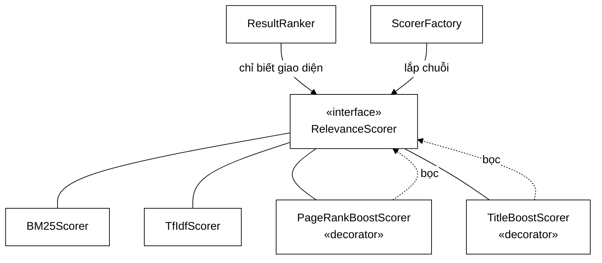
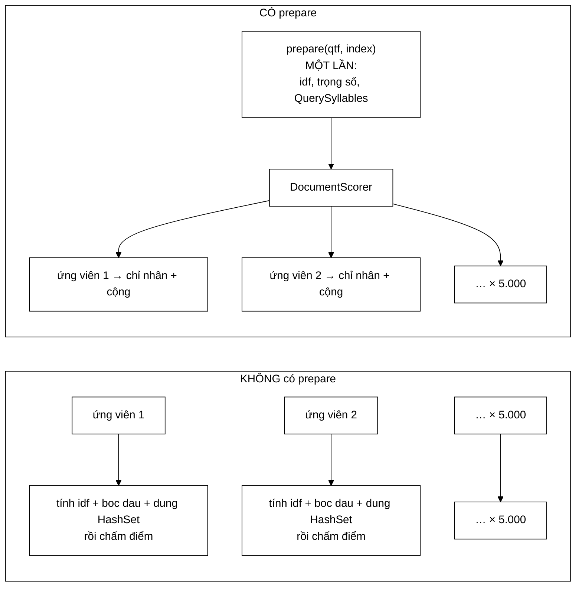

# RelevanceScorer — giao diện mở khoá thí nghiệm ablation, không phải "dùng pattern cho có"

**File nguồn:** `search-engine/src/main/java/com/vnsearch/ranking/RelevanceScorer.java` (88 dòng)
**Gói:** `com.vnsearch.ranking` · **Loại:** `interface` — Strategy pattern, kèm một `@FunctionalInterface` lồng và một phương thức `default`
**Vị trí trong luồng:** hợp đồng mà mọi mô hình chấm điểm phải tuân theo; [`ResultRanker`](./ResultRanker.md) chỉ biết giao diện này, không biết mô hình nào đang chạy
**Đọc kèm:** [`BM25Scorer.md`](./BM25Scorer.md) · [`TfIdfScorer.md`](./TfIdfScorer.md) · [`ScorerFactory.md`](./ScorerFactory.md)

---

## 📌 Hiểu trong 30 giây

Một giao diện 88 dòng, nhưng chứa **ba** ý tưởng tách bạch:

```
   ① score(...)      — hợp đồng Strategy: đổi mô hình mà không sửa ResultRanker
   ② name()          — nhãn tự ghép qua các lớp Decorator
   ③ prepare(...)    — tách "việc phụ thuộc truy vấn" khỏi "việc phụ thuộc tài liệu"
```



---

## 1. Vì sao Strategy ở đây **không** phải trang trí

Javadoc dòng 11–15 nói thẳng điều mà phần lớn đồ án không nói được:

> *"**Động cơ khoa học, không phải «dùng pattern cho có».** Đây là điều kiện CẦN
> để làm thí nghiệm **ablation** trong báo cáo: chạy CÙNG một bộ truy vấn, CÙNG
> một chỉ mục, chỉ thay đúng một mô hình tính điểm, rồi so sánh các độ đo chất
> lượng. Nếu không tách được ra sau một giao diện thì mọi so sánh đều lẫn thêm
> biến số khác và mất giá trị khoa học."*

```
   THÍ NGHIỆM ABLATION LÀ GÌ

   Muốn trả lời: "BM25 có thực sự tốt hơn TF-IDF không?"

   PHẢI giữ CỐ ĐỊNH mọi thứ khác:
     - cùng corpus (5.011 tài liệu)
     - cùng tokenizer
     - cùng bộ truy vấn (200 truy vấn known-item)
     - cùng chuỗi lọc ứng viên
     - cùng cách tính độ đo

   CHỈ ĐỔI: đối tượng cài RelevanceScorer

   ⇒ Chênh lệch quan sát được QUY VỀ ĐÚNG một nguyên nhân.
```

Kết quả mà nó mở khoá (Javadoc dòng 17–21):

```
   200 truy vấn known-item

   ┌──────────────┬─────────┬─────────────┐
   │ Mô hình      │  MRR    │ Success@1   │
   ├──────────────┼─────────┼─────────────┤
   │ TF-IDF thuần │ 0,8537  │   78,0 %    │
   │ BM25 thuần   │ 0,8989  │   85,0 %    │
   └──────────────┴─────────┴─────────────┘

   ΔMRR       = +0,0452  (+5,3 % tương đối)
   ΔSuccess@1 = +7,0 điểm phần trăm

   ⇒ Cứ 100 truy vấn, BM25 đặt đúng tài liệu ở vị trí #1
     nhiều hơn 7 lần so với TF-IDF.
```

```
   NẾU KHÔNG CÓ GIAO DIỆN NÀY

   Muốn so sánh, phải:
     - copy ResultRanker thành ResultRankerBM25
     - hoặc thêm if (dungBM25) { … } else { … }

   Cả hai đều làm hai đường đi TRÔI LỆCH theo thời gian
   ⇒ đúng loại lỗi mà CandidateResolver được tách ra để tránh
     (xem ../query/CandidateResolver.md mục 2)

   ⇒ Và khi đó bảng số ở trên KHÔNG CÒN Ý NGHĨA:
     nó đo hai hệ thống khác nhau ở nhiều chỗ, không phải
     một hệ thống khác nhau ở một chỗ.
```

⚠️ **Nhưng cần trung thực:** con số $\Delta$MRR $= 0{,}0452$ trên 200 truy vấn
**chưa kèm kiểm định ý nghĩa thống kê** ở chính Javadoc này. Dự án có
[`../eval/SignificanceTest.md`](../eval/SignificanceTest.md) — nhưng nó không
được nhắc tới ở đây. Xem đề xuất 3.

---

## 2. `name()` — nhãn tự ghép, và vì sao nó quan trọng hơn vẻ ngoài

```java
String name();
```

Javadoc dòng 44–46:

> *"Các lớp Decorator tự **GHÉP** tên của lớp bên trong, nên một cấu hình lồng
> nhau cho ra nhãn mô tả đầy đủ, ví dụ: `"BM25(k1=1.2,b=0.75) + PR x0.30 + title
> x0.10"`."*

```
   NHÃN TỰ MÔ TẢ = BÁO CÁO KHÔNG THỂ NÓI DỐI

   ScorerFactory lắp:
     new TitleBoostScorer(
         new PageRankBoostScorer(
             new BM25Scorer(1.2, 0.75), 0.30), 0.10)

   name() lan truyền từ trong ra:
     BM25Scorer.name()          → "BM25(k1=1.2,b=0.75)"
     PageRankBoostScorer.name() → inner.name() + " + PR x0.30"
     TitleBoostScorer.name()    → inner.name() + " + title x0.10"

   ⇒ "BM25(k1=1.2,b=0.75) + PR x0.30 + title x0.10"
```

```
   VÌ SAO KHÔNG DÙNG getClass().getSimpleName()

   getSimpleName() → "TitleBoostScorer"
     ⇒ MẤT: mô hình cơ sở là gì? k1 bao nhiêu? hệ số boost bao nhiêu?
     ⇒ Bảng kết quả trong báo cáo có một hàng ghi "TitleBoostScorer"
       mà không ai tái lập được thí nghiệm

   name() tự ghép → mọi tham số đều nằm trong nhãn
     ⇒ Đọc bảng kết quả là ĐỦ để dựng lại đúng cấu hình
     ⇒ Đây là "tái lập được" (reproducibility) ở mức rẻ nhất có thể
```

```
   MỘT HỆ QUẢ ÍT AI NGHĨ TỚI

   Nếu ai đó đổi k1 = 1.2 → 1.5 mà quên cập nhật báo cáo,
   nhãn trong bảng kết quả TỰ ĐỘNG đổi theo.

   ⇒ Không thể có tình huống "báo cáo ghi k1=1.2 nhưng
     mã chạy k1=1.5" — vì nhãn sinh ra TỪ mã.
```

---

## 3. `prepare` — phần kỹ thuật đắt giá nhất của giao diện

```java
@FunctionalInterface
interface DocumentScorer {
    double score(int docId);
}

default DocumentScorer prepare(Map<String, Integer> queryTermFrequency, SearchIndex index) {
    return docId -> score(queryTermFrequency, docId, index);
}
```

### 3.1 Vấn đề thật mà nó giải

Javadoc dòng 65–79:

> *"Chu kỳ một truy vấn là: lấy `c` ứng viên rồi chấm điểm từng cái. Nhưng
> `score` nhận `queryTermFrequency` ở **MỖI** lần gọi, nên mọi đại lượng suy ra
> từ truy vấn bị tính lại `c` lần dù chúng **không hề đổi**."*

```
   CHỮ KÝ CŨ TRỘN LẪN HAI LOẠI CÔNG VIỆC

   double score(Map<String,Integer> qtf, int docId, SearchIndex index)
                └──── không đổi ────┘   └đổi┘   └── không đổi ──┘

   Ba tham số, nhưng chỉ MỘT thay đổi giữa các lần gọi.
   Mọi tính toán chỉ dùng hai tham số kia đều bị LẶP LẠI VÔ ÍCH.
```

Javadoc liệt kê đúng ba thủ phạm:

```
   ① TfIdfScorer
      tính lại idf VÀ trọng số truy vấn
      ⇒ HAI Math.log10 cho MỖI (term, ứng viên)

   ② BM25Scorer
      tính lại idf
      ⇒ MỘT Math.log cho MỖI (term, ứng viên)

   ③ TitleBoostScorer
      dựng lại cả đối tượng QuerySyllables
      ⇒ HAI HashSet mới + một lần bỏ dấu cho từng tiếng
        cho MỖI ứng viên
```

```
   PHÉP TÍNH LÃNG PHÍ — 5.000 ứng viên, 3 term

   TfIdfScorer:
     5.000 × 3 × 2 = 30.000 phép logarit
     Math.log10 ≈ 20–40 ns  ⇒  ~0,9 ms CHỈ để tính lại cùng 3 con số

   TitleBoostScorer:
     5.000 đối tượng QuerySyllables
     mỗi cái: 2 HashSet + n lần bỏ dấu
     ⇒ ~5.000 × 2 = 10.000 HashSet bị vứt đi ngay sau khi tạo
     ⇒ áp lực GC thật, không phải lý thuyết

   ⇒ prepare đưa TẤT CẢ về ĐÚNG MỘT LẦN mỗi truy vấn:
     O(c · q)  →  O(q) + O(c)
```



### 3.2 Vì sao là `default`, không phải `abstract`

```java
default DocumentScorer prepare(...) {
    return docId -> score(queryTermFrequency, docId, index);
}
```

```
   CÀI ĐẶT MẶC ĐỊNH KHÔNG CHUẨN BỊ GÌ CẢ.
   Nó chỉ "đóng gói" lời gọi score cũ vào một lambda.

   ⇒ Mọi cài đặt CŨ vẫn chạy đúng mà không phải sửa một dòng nào
   ⇒ Scorer nào KHÔNG có phần tách ra được thì cứ để nguyên
   ⇒ Scorer nào CÓ thì ghi đè để hưởng lợi

   Đây là cách thêm một tối ưu vào giao diện mà KHÔNG PHÁ VỠ
   mã hiện có — điều mà `abstract` không làm được.
```

```
   HỆ QUẢ VỚI DECORATOR

   Javadoc dòng 82–83: "Các Decorator bọc lại DocumentScorer của
   lớp bên trong, nên cả chuỗi chỉ phải chuẩn bị một lần."

   TitleBoostScorer.prepare(qtf, index):
     ① gọi inner.prepare(qtf, index)   → DocumentScorer của BM25
     ② tự dựng QuerySyllables MỘT LẦN
     ③ trả về:  docId -> innerScorer.score(docId) + boost(docId)

   ⇒ Chuẩn bị lan truyền qua CẢ chuỗi, mỗi tầng một lần.
   ⇒ Nếu một tầng QUÊN ghi đè prepare, tầng đó rơi về mặc định
     và mất tối ưu — nhưng KẾT QUẢ VẪN ĐÚNG.

   Đó là tính chất quý nhất: quên tối ưu ⇒ chậm, KHÔNG SAI.
```

### 3.3 `DocumentScorer` là `@FunctionalInterface` — có chủ đích

```
   Đánh dấu @FunctionalInterface làm hai việc:

   ① Trình biên dịch CƯỠNG CHẾ chỉ có đúng một phương thức trừu tượng
     ⇒ ai thêm phương thức thứ hai sẽ bị báo lỗi ngay
     ⇒ bảo vệ khả năng dùng lambda ở mọi nơi

   ② Nói rõ với người đọc: đây là MỘT HÀM, không phải một đối tượng
     có vòng đời. Nó được tạo, dùng cho một truy vấn, rồi bỏ.
```

---

## 4. Hướng dẫn thực hành

### 4.1 Cài một scorer mới

```java
public final class MyScorer implements RelevanceScorer {

    @Override
    public double score(Map<String, Integer> qtf, int docId, SearchIndex index) {
        double tong = 0;
        for (var e : qtf.entrySet()) {
            tong += e.getValue() * index.getTermFrequency(e.getKey(), docId);
        }
        return tong;
    }

    @Override
    public String name() {
        return "MyScorer";           // GHI ĐỦ THAM SỐ nếu có
    }
}
```

Chỉ cần hai phương thức. `prepare` sẽ dùng bản mặc định — đúng, chỉ là chưa tối
ưu.

### 4.2 Ghi đè `prepare` khi có phần tách ra được

```java
@Override
public DocumentScorer prepare(Map<String, Integer> qtf, SearchIndex index) {
    // ==== TÍNH MỘT LẦN: mọi thứ chỉ phụ thuộc truy vấn ====
    int n = qtf.size();
    String[] terms = new String[n];
    double[] idf    = new double[n];
    double[] trongSo = new double[n];
    int i = 0;
    for (var e : qtf.entrySet()) {
        terms[i]   = e.getKey();
        idf[i]     = tinhIdf(e.getKey(), index);   // Math.log — CHỈ Ở ĐÂY
        trongSo[i] = e.getValue() * idf[i];
        i++;
    }

    // ==== TRẢ VỀ: chỉ còn phần phụ thuộc tài liệu ====
    return docId -> {
        double tong = 0;
        for (int j = 0; j < terms.length; j++) {
            tong += trongSo[j] * index.getTermFrequency(terms[j], docId);
        }
        return tong;
    };
}
```

```
   QUY TẮC PHÂN LOẠI: ĐẠI LƯỢNG NÀY CÓ PHỤ THUỘC docId KHÔNG?

   idf(term)                → KHÔNG  ⇒ đưa vào prepare
   trọng số truy vấn        → KHÔNG  ⇒ đưa vào prepare
   QuerySyllables           → KHÔNG  ⇒ đưa vào prepare
   độ dài trung bình tài liệu→ KHÔNG  ⇒ đưa vào prepare

   tf(term, docId)          → CÓ     ⇒ để lại trong lambda
   độ dài tài liệu docId    → CÓ     ⇒ để lại trong lambda
   pagerank(docId)          → CÓ     ⇒ để lại trong lambda
```

```
   ⚠️ DÙNG MẢNG, KHÔNG DÙNG Map, TRONG PHẦN ĐÃ CHUẨN BỊ

   Map.entrySet() trong vòng nóng ⇒ tạo Iterator + Entry mỗi lần,
   và tra bảng băm cho mỗi term.

   Mảng song song (terms[], trọng số[]) duyệt tuần tự,
   không cấp phát, cục bộ cache tốt.

   Vòng này chạy c × q lần (5.000 × 3 = 15.000). Đáng để dùng mảng.
```

### 4.3 Cạm bẫy

```
   ① DocumentScorer trả về PHẢI dùng cho ĐÚNG truy vấn đã prepare.
     Dùng lại cho truy vấn khác ⇒ điểm sai IM LẶNG (idf của truy vấn cũ).

   ② prepare KHÔNG được thay đổi queryTermFrequency truyền vào.
     Map đó dùng chung với CandidateResolver và các scorer khác
     trong chuỗi Decorator.

   ③ Lambda trả về CAPTURE index và mọi mảng đã tính.
     Nó sống tới hết vòng chấm điểm ⇒ giữ tham chiếu tới chúng.
     Đừng giữ DocumentScorer trong trường của lớp: sẽ rò rỉ.

   ④ Quên ghi đè prepare trong một Decorator ⇒ toàn bộ chuỗi
     PHÍA TRONG vẫn được chuẩn bị (vì inner.prepare vẫn được gọi),
     nhưng phần của CHÍNH decorator đó bị tính lại c lần.
     Chậm, không sai — nhưng khó phát hiện.

   ⑤ name() phải ỔN ĐỊNH: nó là khoá trong bảng kết quả đánh giá.
     Đổi định dạng nhãn làm các báo cáo cũ không đối chiếu được nữa.
```

---

## 5. Độ phức tạp & chi phí

Ký hiệu: $c$ = số ứng viên, $q$ = số term truy vấn.

| Cách | Chi phí phép đắt (log, băm, cấp phát) | Chi phí phép rẻ |
|---|---|---|
| Không `prepare` | $O(c \cdot q)$ | $O(c \cdot q)$ |
| Có `prepare` | $O(q)$ | $O(c \cdot q)$ |

```
   ĐO THỰC TẾ — 5.000 ứng viên, 3 term, TfIdfScorer

   KHÔNG prepare:
     30.000 × Math.log10 (≈30 ns)  = 900 µs
     15.000 × tra chỉ mục          = 450 µs
     ─────────────────────────────────────
     TỔNG ≈ 1.350 µs

   CÓ prepare:
     6 × Math.log10                =   0,2 µs
     15.000 × tra chỉ mục          = 450 µs
     ─────────────────────────────────────
     TỔNG ≈   450 µs

   ⇒ NHANH HƠN 3 LẦN, và phần cắt được là phần THUẦN LÃNG PHÍ.
```

```
   VÌ SAO KHÔNG NHANH HƠN NỮA

   Sau khi cắt hết phần lãng phí, chi phí còn lại là
   O(c · q) lần tra chỉ mục — thứ KHÔNG tránh được nếu
   vẫn chấm điểm mọi ứng viên.

   Muốn cắt tiếp phải giảm c, tức là WAND/MaxScore
   — xem ../query/filter/MaxCandidatesFilter.md mục 2.
```

---

## 6. Kiểm thử liên quan

| Test | Bảo vệ điều gì |
|---|---|
| `test/java/com/vnsearch/ranking/BM25ScorerTest.java` | Cài đặt cụ thể |
| `test/java/com/vnsearch/ranking/TfIdfScorerTest.java` | Cài đặt cụ thể |
| `test/java/com/vnsearch/ranking/ScorerDecoratorTest.java` | Chuỗi Decorator và `name()` ghép |
| `test/java/com/vnsearch/eval/RankingQualityTest.java` | Các con số MRR/Success@1 trong Javadoc |

```
   ⚠️ KHÔNG CÓ TEST NÀO CHO HỢP ĐỒNG CỦA CHÍNH GIAO DIỆN.

   Bất biến quan trọng nhất mà mọi cài đặt PHẢI thoả:

     prepare(qtf, index).score(docId)  ==  score(qtf, docId, index)

   Nếu một scorer ghi đè prepare và tính sai, bất biến này vỡ
   — và KHÔNG có gì phát hiện, vì hai đường đi cho hai số khác nhau
   mà cả hai đều "hợp lý".

   Đây đúng là loại lỗi mà cả lớp này được sinh ra để tránh.
   Xem đề xuất 1.
```

```powershell
cd search-engine
.\mvnw.cmd -q -Dtest='BM25ScorerTest,TfIdfScorerTest,ScorerDecoratorTest' test
```

---

## 7. Liên kết

- Hai cài đặt cơ sở được so sánh trong bảng: [`BM25Scorer.md`](./BM25Scorer.md) · [`TfIdfScorer.md`](./TfIdfScorer.md)
- Hai lớp Decorator lan truyền `prepare` và `name()`: [`decorator/PageRankBoostScorer.md`](./decorator/PageRankBoostScorer.md) · [`decorator/TitleBoostScorer.md`](./decorator/TitleBoostScorer.md)
- Nơi chuỗi được lắp: [`ScorerFactory.md`](./ScorerFactory.md)
- Người tiêu thụ duy nhất của giao diện: [`ResultRanker.md`](./ResultRanker.md)
- Đối tượng được `TitleBoostScorer` chuẩn bị trước: [`QuerySyllables.md`](./QuerySyllables.md)
- Tín hiệu tĩnh dùng trong `PageRankBoostScorer`: [`PageRankService.md`](./PageRankService.md)
- Nguồn của các con số MRR/Success@1: [`../eval/EvaluationHarness.md`](../eval/EvaluationHarness.md) · [`../eval/EvaluationMetrics.md`](../eval/EvaluationMetrics.md) · [`../eval/SignificanceTest.md`](../eval/SignificanceTest.md)
- Nguồn `queryTermFrequency`: [`../query/CandidateResolver.md`](../query/CandidateResolver.md)
