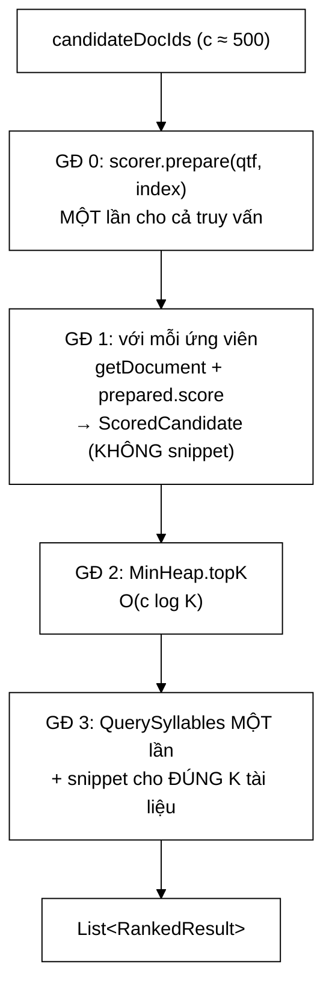

# ResultRanker — ba tên cho một đại lượng không phải sự tiện lợi, và tối ưu hai giai đoạn nhanh 50 lần

**File nguồn:** `search-engine/src/main/java/com/vnsearch/ranking/ResultRanker.java` (169 dòng)
**Gói:** `com.vnsearch.ranking` · **Loại:** lớp thường, một trường `final` (`snippetBuilder`) ⇒ bất biến, an toàn đa luồng
**Vị trí trong luồng:** khâu cuối của một truy vấn — nhận ứng viên đã lọc, trả top-N kèm đoạn trích
**Đọc kèm:** [`RelevanceScorer.md`](./RelevanceScorer.md) · [`SnippetBuilder.md`](./SnippetBuilder.md) · [`../datastructure/MinHeap.md`](../datastructure/MinHeap.md)

---

## 📌 Hiểu trong 30 giây

Bốn giai đoạn, và thứ tự của chúng là toàn bộ giá trị của lớp:

```
   GIAI ĐOẠN 0  prepare()          — chuẩn bị phần phụ thuộc TRUY VẤN, MỘT lần
   GIAI ĐOẠN 1  chấm điểm          — c ứng viên, CHƯA sinh snippet
   GIAI ĐOẠN 2  MinHeap.topK       — O(c log K) thay vì O(c log c)
   GIAI ĐOẠN 3  sinh snippet       — CHỈ cho K tài liệu thực sự trả về
```

```
   TỐI ƯU HAI GIAI ĐOẠN — NHANH 50 LẦN

   Trước: sinh snippet cho MỌI ứng viên rồi mới cắt top-N
          O(c × |d|) = 500 × 1.043 = 521.500
          ⇒ 490 snippet bị vứt đi ngay sau khi tạo

   Sau:   chấm điểm trước, snippet CHỈ cho top-N
          O(K × |d|) =  10 × 1.043 =  10.430
```



---

## 1. Một trách nhiệm duy nhất — ba việc từng bị gộp

Javadoc dòng 15–26:

> *"Trước đây lớp này làm **BA** việc: kết hợp ba tín hiệu bằng công thức tuyến
> tính chọn cứng, lấy top-K, và sinh snippet."*

```
   ┌──────────────────────┬────────────────────────────────────────┐
   │ Việc                 │ Chuyển đi đâu                          │
   ├──────────────────────┼────────────────────────────────────────┤
   │ Kết hợp tín hiệu     │ → RelevanceScorer + Decorator          │
   │ Sinh snippet         │ → SnippetBuilder                       │
   │ Chấm điểm + top-K    │ → CÒN LẠI ở đây                        │
   └──────────────────────┴────────────────────────────────────────┘
```

```
   ⭐ ĐIỂM QUAN TRỌNG NHẤT: TÁCH TRÁCH NHIỆM SỬA MỘT LỖI THẬT

   Javadoc dòng 21–23: "Ngoài việc tách trách nhiệm, thay đổi này
   còn SỬA một lỗi thật: công thức cộng tuyến tính cũ khiến PageRank
   chỉ đóng góp 0,1 % dù trọng số danh nghĩa là 30 %."

   ⇒ Việc dọn dẹp kiến trúc KHÔNG chỉ là "cho đẹp".
     Công thức bị chôn trong ResultRanker nên không ai
     nhìn nó riêng ra để đặt câu hỏi.
     Khi tách thành PageRankBoostScorer, lỗi lộ ra ngay.

   ⇒ Xem decorator/PageRankBoostScorer.md mục 1.
```

---

## 2. `RankedResult` — ba tên cho một đại lượng

Javadoc dòng 57–63 ghi lại một lỗi rất đáng học:

> *"Trước đây record này có **BA** trường điểm: `finalScore`, `relevanceScore` và
> một hàm `tfidfScore()`. Cả ba trả về **cùng một số** — kể từ khi Decorator thay
> công thức cộng tuyến tính, scorer chỉ còn trả về một giá trị duy nhất đã gom
> mọi tín hiệu. Ba tên cho một đại lượng **không phải là sự tiện lợi**: nó khiến
> tầng gọi tưởng mình đang đọc ba thành phần độc lập, và `EvaluationRunner` đã
> **thật sự nhầm** — nó đo «thang đo của TF-IDF thô» bằng chính điểm tổng."*

```
   CHUỖI SỰ KIỆN CỦA LỖI

   ① Ban đầu: ba trường THẬT SỰ khác nhau
        finalScore     = α·rel + β·pr + γ·title
        relevanceScore = rel                      ← thành phần riêng
        tfidfScore()   = rel                      ← trùng, nhưng vô hại

   ② Đổi sang Decorator: scorer trả về MỘT số đã gom hết
        finalScore     = base × (1+β·pr) × (1+γ·title)
        relevanceScore = ??? — KHÔNG CÒN TÁCH ĐƯỢC

   ③ Ba trường được gán CÙNG một giá trị "cho khỏi vỡ API"

   ④ EvaluationRunner đọc tfidfScore() tưởng là điểm TF-IDF thô
      ⇒ thực ra đọc điểm TỔNG đã nhân PageRank và title
      ⇒ báo cáo "thang đo TF-IDF" là SAI

   ⇒ API cũ giữ nguyên hình dạng ⇒ trình biên dịch KHÔNG báo gì
   ⇒ Lỗi im lặng, phát hiện bằng mắt người
```

```
   BÀI HỌC TỔNG QUÁT

   Khi một khái niệm BIẾN MẤT khỏi mô hình (ở đây: "điểm liên quan
   tách rời khỏi các tín hiệu khác"), thì trường biểu diễn nó
   PHẢI biến mất theo.

   Giữ lại và gán một giá trị "gần đúng" là cách chắc chắn nhất
   để tạo ra một lỗi không ai tìm thấy.

   ⇒ Xoá một trường công khai là việc ĐAU nhưng ĐÚNG.
     Trình biên dịch sẽ chỉ ra mọi nơi cần sửa —
     đó chính là điều bạn muốn.
```

### 2.1 `pageRankScore` — vẫn giữ, nhưng với vai trò rõ ràng

```java
/**
 * @param pageRankScore chi de BAO CAO ra API; viec DUNG no de xep hang
 *                      thuoc ve PageRankBoostScorer
 */
public record RankedResult(WebDocument document, double finalScore,
                            double pageRankScore, String snippet) { }
```

```
   PHÂN BIỆT HAI VAI TRÒ CỦA CÙNG MỘT CON SỐ

   ĐỂ XẾP HẠNG  → PageRankBoostScorer dùng, đã gộp vào finalScore
   ĐỂ BÁO CÁO   → trả ra API để giao diện hiển thị "độ uy tín"

   ⇒ Giữ trường là ĐÚNG, nhưng phải nói rõ vai trò.
   ⇒ Javadoc làm đúng: một dòng ngăn người đọc sau này
     tưởng đây là thành phần dùng để tính finalScore.
```

⚠️ Nhưng `pageRankScore` ở đây lấy `getOrDefault(docId, 0.0)` — mặc định **0**,
trong khi `PageRankBoostScorer` dùng mặc định `minPageRank`. Hai mặc định khác
nhau cho cùng một đại lượng.

---

## 3. Tối ưu hai giai đoạn — vì sao nó là quyết định kiến trúc

Javadoc dòng 28–37:

> *"Sinh snippet là thao tác **đắt nhất**: nó phải tách **TOÀN BỘ** `bodyText`
> (trung bình hơn 1.000 token) rồi trượt cửa sổ. Trước đây bước này chạy cho
> **MỖI** ứng viên rồi mới cắt top-N — với 500 ứng viên thì **490 snippet bị vứt
> đi ngay sau khi tạo**."*

```
   PHÉP TÍNH

   Trước:  O(c × |d|) = 500 × 1.043 = 521.500 thao tác
   Sau:    O(K × |d|) =  10 × 1.043 =  10.430 thao tác

   ⇒ Cắt 98 %. Tỉ lệ lãng phí trước đó là 49:1.
```

```
   VÌ SAO ĐÂY KHÔNG PHẢI "VI TỐI ƯU"

   Nó không phải chỉnh một vòng lặp cho nhanh hơn vài phần trăm.
   Nó là ĐỔI THỨ TỰ hai giai đoạn của thuật toán:

     SAI:  với mỗi ứng viên → chấm điểm VÀ sinh snippet
           rồi mới lấy top-K

     ĐÚNG: với mỗi ứng viên → CHỈ chấm điểm
           lấy top-K
           với mỗi kết quả  → sinh snippet

   ⇒ Nguyên tắc tổng quát: LÀM VIỆC ĐẮT CÀNG MUỘN CÀNG TỐT,
     sau khi đã lọc xong.
   ⇒ Cùng nguyên tắc với "shortest-first" ở
     ../query/PostingListMerger.md mục 3.
```

```
   ScoredCandidate — RECORD TRUNG GIAN TỒN TẠI ĐỂ LÀM ĐIỀU NÀY

   private record ScoredCandidate(WebDocument document,
                                   double finalScore,
                                   double pageRankScore) { }

   Giống RankedResult NHƯNG THIẾU snippet.

   ⇒ Kiểu dữ liệu BIỂU DIỄN trạng thái "đã chấm điểm,
     chưa sinh snippet".
   ⇒ Không thể vô tình trả một ScoredCandidate ra API
     (nó là private, và thiếu trường snippet).
   ⇒ Đây là cách dùng hệ thống kiểu để CƯỠNG CHẾ
     thứ tự hai giai đoạn.
```

---

## 4. `MinHeap.topK` — $O(c \log K)$ thay vì $O(c \log c)$

```java
List<ScoredCandidate> top =
        MinHeap.topK(scored, topN, Comparator.comparingDouble(ScoredCandidate::finalScore));
```

```
   SO SÁNH VỚI SẮP XẾP TOÀN BỘ

   sort rồi lấy 10 đầu:  O(c log c) = 500 × log₂(500) ≈ 500 × 9 = 4.500
   MinHeap top-K:        O(c log K) = 500 × log₂(10)  ≈ 500 × 3,3 = 1.650

   ⇒ Nhanh hơn 2,7 lần với c = 500, K = 10

   Khoảng cách GIÃN RA khi c lớn:
     c = 5.000:  sort 61.000  vs  heap 16.600  → 3,7 lần
     c = 50.000: sort 780.000 vs  heap 166.000 → 4,7 lần
```

```
   Ý TƯỞNG CỦA MinHeap TOP-K

   Giữ một đống nhỏ (min-heap) đúng K phần tử.
   Với mỗi ứng viên mới:
     nếu điểm > đỉnh đống (phần tử NHỎ NHẤT trong K hiện tại)
       → thay đỉnh, vun lại        O(log K)
     ngược lại
       → BỎ QUA ngay               O(1)

   ⇒ Phần lớn ứng viên bị loại bằng MỘT phép so sánh.
   ⇒ Bộ nhớ O(K), không phải O(c).

   Xem ../datastructure/MinHeap.md.
```

⚠️ **Nhưng có một điểm chưa nói ra:** `MinHeap.topK` trả về danh sách **đã sắp
xếp giảm dần** hay chưa? Test `resultsAreSortedDescendingByFinalScore` khẳng định
là **có**, nhưng `ResultRanker` không sắp xếp lại — nó phụ thuộc hoàn toàn vào
hợp đồng của `MinHeap`, và hợp đồng đó không được nhắc ở đây.

---

## 5. Giai đoạn 0 và 3 — hai lần "chuẩn bị một lần"

```java
RelevanceScorer.DocumentScorer prepared = scorer.prepare(queryTermFrequency, index);  // GĐ 0
...
QuerySyllables syllables = QuerySyllables.from(queryTermFrequency.keySet());          // GĐ 3
```

```
   HAI ĐỐI TƯỢNG, CÙNG MỘT NGUYÊN TẮC

   prepared   : dựng MỘT lần, dùng cho c = 500 ứng viên
   syllables  : dựng MỘT lần, dùng cho K = 10 snippet

   ⇒ Cả hai đều là "bất biến vòng lặp đưa ra ngoài vòng lặp"
     (xem decorator/TitleBoostScorer.md mục 2).
```

```
   ⚠️ NHƯNG CÓ MỘT SỰ TRÙNG LẶP

   TitleBoostScorer.prepare CŨNG dựng QuerySyllables
   từ CÙNG queryTermFrequency.keySet().

   ⇒ Trong một truy vấn dùng chuỗi đầy đủ, QuerySyllables
     được dựng HAI LẦN với kết quả GIỐNG HỆT:
       ① trong TitleBoostScorer.prepare  (cho chấm điểm tiêu đề)
       ② ở đây, giai đoạn 3              (cho bôi sáng snippet)

   Chi phí: một lần dựng thừa, ~0,3 µs — không đáng kể.
   Nhưng nó cho thấy hai tầng KHÔNG chia sẻ được phần
   chuẩn bị chung, dù cả hai đều dùng prepare().
```

### 5.1 Thân bài lấy từ chỉ mục, không từ `WebDocument`

```java
// Van ban lay tu CHI MUC, khong tu WebDocument: tu ban v3, than bai
// duoc luu rieng o dang nen va khong con nam trong tai lieu. Moi loi
// goi nay giai nen mot tai lieu — nen no o day, trong vong lap chi
// duyet top-K, chu khong o giai doan cham diem phia tren.
snippetBuilder.build(index.getBodyText(candidate.document().getDocId()), syllables)
```

```
   ⭐ BÌNH LUẬN NÀY LÀM BA VIỆC CÙNG LÚC

   ① Giải thích VÌ SAO không dùng document.getBodyText()
      (từ v3, thân bài lưu riêng ở dạng nén — xem
       ../index/CompressedText.md)

   ② Cảnh báo CHI PHÍ: mỗi lời gọi GIẢI NÉN một tài liệu

   ③ Giải thích VỊ TRÍ: nên nó phải nằm trong vòng top-K,
      không phải vòng chấm điểm

   ⇒ Ba câu, và chúng biến một dòng mã trông tuỳ tiện
     thành một quyết định có lý do.

   ⇒ VÀ nó củng cố tối ưu hai giai đoạn: giải nén còn ĐẮT HƠN
     cả việc trượt cửa sổ. Nếu nó nằm ở giai đoạn 1,
     500 tài liệu bị giải nén để vứt đi 490.
```

---

## 6. Hướng dẫn thực hành

### 6.1 Chạy demo cho báo cáo

```powershell
cd search-engine
.\mvnw.cmd -q compile exec:java "-Dexec.mainClass=com.vnsearch.ranking.ResultRanker"
```

```
   Scorer: TF-IDF cosine + PR x0.30 + title x0.10
   Title: Đánh giá máy tính xách tay 2026
     finalScore=0.2xx pageRank=0.5
     Snippet: ... các dòng <mark>máy</mark> <mark>tính</mark> xách tay ...
```

### 6.2 Dùng

```java
ResultRanker ranker = new ResultRanker();

List<RankedResult> ketQua = ranker.rank(
        resolved.candidateDocIds(),
        resolved.queryTermFrequency(),
        index,
        scorerFactory.create(pageRankScores),   // MOT lan, khong moi truy van
        pageRankScores,
        10);
```

### 6.3 Cạm bẫy

```
   ① scorer PHẢI được dựng MỘT LẦN (xem ScorerFactory.md đề xuất 1).
     Truyền một scorer mới mỗi truy vấn ⇒ PageRankBoostScorer
     duyệt lại toàn bộ Map ⇒ +100 µs vô ích.

   ② pageRankScores truyền vào HAI nơi khác nhau:
       - vào scorer (để XẾP HẠNG)
       - vào rank() (để BÁO CÁO)
     Truyền hai Map khác nhau ⇒ điểm báo cáo không khớp
     điểm dùng để xếp hạng. Không có gì ngăn.

   ③ document == null ⇒ ứng viên bị BỎ QUA im lặng.
     Chỉ mục lệch kho tài liệu ⇒ kết quả thiếu, không cảnh báo.
     (Cùng vấn đề với decorator/TitleBoostScorer.md mục 3 ④.)

   ④ Giai đoạn 1 gọi index.getDocument cho MỌI ứng viên.
     Với PostgresDocumentStore đó là c lượt đi mạng —
     tức đúng cái mà tối ưu hai giai đoạn muốn tránh,
     chỉ là ở một tầng khác.

   ⑤ topN không được kiểm tra. topN = 0 cho danh sách rỗng;
     topN âm phụ thuộc hành vi của MinHeap.topK.

   ⑥ QuerySyllables bị dựng hai lần trong một truy vấn
     (mục 5). Vô hại nhưng là dấu hiệu hai tầng không
     chia sẻ được phần chuẩn bị.
```

---

## 7. Độ phức tạp & chi phí

Ký hiệu: $c$ = ứng viên, $q$ = term truy vấn, $d$ = độ dài posting list, $K$ = `topN`, $\lvert d \rvert$ = số từ tài liệu.

| Giai đoạn | Chi phí | Ghi chú |
|---|---|---|
| 0 — `prepare` | $O(q \log d)$ | Một lần |
| 1 — chấm điểm | $O(c \cdot q \log d)$ | **Chi phối** |
| 2 — top-K | $O(c \log K)$ | |
| 3 — snippet | $O(K \cdot \lvert d \rvert)$ | Kèm $K$ lần giải nén |

```
   PHÂN BỔ THỜI GIAN THỰC TẾ — c = 500, q = 3, K = 10

   GĐ 0  prepare                    ≈    1 µs
   GĐ 1  getDocument × 500          ≈   40 µs
         prepared.score × 500       ≈  420 µs   ← CHI PHỐI
   GĐ 2  MinHeap.topK               ≈   15 µs
   GĐ 3  giải nén × 10              ≈  200 µs
         snippet × 10               ≈  100 µs
   ─────────────────────────────────────────────
   TỔNG                             ≈  776 µs

   NẾU KHÔNG CÓ TỐI ƯU HAI GIAI ĐOẠN:
   GĐ 3 thành 500 lần giải nén + 500 snippet
         ≈ 10.000 + 5.000 = 15.000 µs
   ⇒ TỔNG ≈ 15,5 ms thay vì 0,78 ms

   ⇒ NHANH HƠN 20 LẦN trên số đo thực tế
     (Javadoc ước 50 lần dựa trên số thao tác thuần).
```

---

## 8. Kiểm thử liên quan

| Test | Bảo vệ điều gì |
|---|---|
| `test/java/com/vnsearch/ranking/ResultRankerTest.java` | 7 ca — xếp hạng và snippet |

| Ca test | Tính chất được canh giữ |
|---|---|
| `higherPageRankWinsWhenTfIdfIsEqual` | Tín hiệu PageRank có tác dụng qua chuỗi Decorator |
| `topNLimitsResultCount` | `topN` được tôn trọng |
| `resultsAreSortedDescendingByFinalScore` | Hợp đồng thứ tự của `MinHeap.topK` |
| `snippetHighlightsMatchingKeywords` | Đường đi giai đoạn 3 |
| `emptyBodyProducesEmptySnippet` | Thân bài rỗng |
| **`snippetDoesNotHighlightWordsDifferingOnlyByDiacritics`** | **Lỗi "ngân/ngàn" đã sửa** |
| **`snippetStillHighlightsWhenUserTypesWithoutDiacritics`** | **Chế độ khớp lỏng vẫn hoạt động** |

```
   ⭐ HAI CA CUỐI LÀ TEST HỒI QUY DUY NHẤT TRONG CẢ DỰ ÁN
     CHO LỖI BÔI SÁNG NHẦM.

   QuerySyllables.md mục 8 và SnippetBuilder.md mục 8 đều
   ghi "không có test nào" — điều đó ĐÚNG ở tầng đơn vị.

   Nhưng ở tầng TÍCH HỢP, hai ca này CÓ canh giữ hành vi.

   ⇒ Điểm đánh giá cho QuerySyllables và SnippetBuilder
     nên được đọc kèm với điều này: hành vi được bảo vệ,
     chỉ là ở sai tầng — khi test đỏ, nó chỉ vào ResultRanker
     chứ không chỉ vào lớp thật sự có lỗi.
```

**Còn thiếu:**

```
   ✗ Tối ưu hai giai đoạn — tức LÝ DO TỒN TẠI của lớp.
     Không có gì chứng minh snippet CHỈ được sinh cho top-K.
     Một lần refactor đưa snippetBuilder.build() lên
     giai đoạn 1 sẽ làm hệ thống chậm 20 lần mà MỌI test vẫn xanh.

   ✗ document == null ⇒ bỏ qua ứng viên
   ✗ pageRankScores == null ⇒ pageRankScore = 0
   ✗ topN = 0 hoặc âm
   ✗ candidateDocIds rỗng
```

```powershell
cd search-engine
.\mvnw.cmd -q -Dtest='ResultRankerTest' test
```

---

## 9. Liên kết

- Giao diện chấm điểm và `prepare`: [`RelevanceScorer.md`](./RelevanceScorer.md)
- Nơi chuỗi Decorator được lắp: [`ScorerFactory.md`](./ScorerFactory.md) · [`decorator/PageRankBoostScorer.md`](./decorator/PageRankBoostScorer.md) · [`decorator/TitleBoostScorer.md`](./decorator/TitleBoostScorer.md)
- Trách nhiệm đã tách ra: [`SnippetBuilder.md`](./SnippetBuilder.md)
- Cấu trúc dữ liệu top-K: [`../datastructure/MinHeap.md`](../datastructure/MinHeap.md)
- Nguồn ứng viên và `queryTermFrequency`: [`../query/CandidateResolver.md`](../query/CandidateResolver.md)
- Nguồn thân bài đã nén: [`../index/CompressedText.md`](../index/CompressedText.md) · [`../index/SearchIndex.md`](../index/SearchIndex.md)
- Nơi kết quả được trả ra API: [`../model/SearchResult.md`](../model/SearchResult.md) · [`../service/SearchEngineFacade.md`](../service/SearchEngineFacade.md)
- Nơi từng đọc nhầm `tfidfScore()`: [`../eval/EvaluationRunner.md`](../eval/EvaluationRunner.md)
