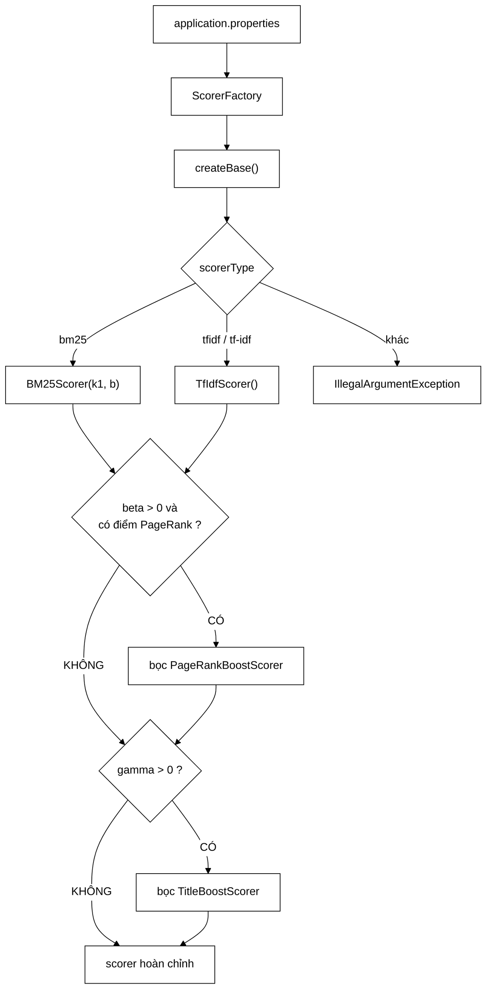

# ScorerFactory — Strategy chỉ được bộ đánh giá khai thác; sản phẩm thì không

**File nguồn:** `search-engine/src/main/java/com/vnsearch/ranking/ScorerFactory.java` (94 dòng)
**Gói:** `com.vnsearch.ranking` · **Loại:** `@Component` Spring, năm trường cấu hình `@Value` ⇒ **không** `final`, xem cạm bẫy ở mục 5
**Vị trí trong luồng:** nơi duy nhất quyết định mô hình chấm điểm nào thực sự phục vụ người dùng
**Đọc kèm:** [`RelevanceScorer.md`](./RelevanceScorer.md) · [`decorator/PageRankBoostScorer.md`](./decorator/PageRankBoostScorer.md) · [`decorator/TitleBoostScorer.md`](./decorator/TitleBoostScorer.md)

---

## 📌 Hiểu trong 30 giây

Lớp này sửa một nghịch lý rất cụ thể: hệ thống **đã có** Strategy pattern, **đã
đo** được BM25 tốt hơn 5,3 %, nhưng **người dùng thật vẫn nhận TF-IDF**.

```
   TRƯỚC (SearchEngineFacade)

     private final TfIdfScorer tfIdfScorer = new TfIdfScorer();
                               └─────── CHỌN CỨNG ───────┘

   ⇒ Strategy pattern tồn tại, nhưng chỉ EvaluationRunner dùng được nó.
   ⇒ Muốn người dùng thật nhận BM25: phải SỬA MÃ NGUỒN và BIÊN DỊCH LẠI.
```

```
   SAU — một dòng trong application.properties

     app.ranking.scorer=bm25
     app.ranking.bm25.k1=1.2
     app.ranking.bm25.b=0.75
     app.ranking.beta=0.30      # trọng số PageRank
     app.ranking.gamma=0.10     # trọng số khớp tiêu đề
```



---

## 1. Vấn đề thật: "pattern có mà không dùng được"

Javadoc dòng 15–21:

> *"Giao diện `RelevanceScorer` **đã tồn tại và hoạt động tốt**, nhưng
> `SearchEngineFacade` lại **CHỌN CỨNG** cài đặt:
> `private final TfIdfScorer tfIdfScorer = new TfIdfScorer();`. Hậu quả: đo đạc
> cho thấy BM25 đạt MRR 0,8989 so với 0,8537 của TF-IDF — **hơn 5,3 %** — nhưng
> **không có cách nào** để người dùng thật nhận được kết quả BM25 mà không sửa mã
> nguồn và biên dịch lại. **Strategy chỉ được bộ đánh giá khai thác; sản phẩm thì
> không.**"*

```
   ⭐ ĐÂY LÀ MỘT DẠNG "NỢ KỸ THUẬT VÔ HÌNH"

   Nhìn vào mã: có interface, có nhiều cài đặt, có test so sánh.
   ⇒ Trông như đã áp dụng Strategy pattern đúng chuẩn.

   Nhưng: đường đi tới NGƯỜI DÙNG THẬT vẫn chọn cứng.
   ⇒ Toàn bộ lợi ích của pattern chỉ tồn tại TRONG BÁO CÁO,
     không tồn tại trong sản phẩm.

   ⇒ Báo cáo ghi "BM25 tốt hơn 5,3 %" là ĐÚNG,
     nhưng hệ thống đang chạy KHÔNG hưởng lợi ích đó.
   ⇒ Khoảng cách giữa "điều đã chứng minh" và "điều đang chạy"
     là loại nợ nguy hiểm nhất: không ai thấy nó trong mã.
```

```
   PHÉP THỬ ĐỂ PHÁT HIỆN DẠNG NỢ NÀY

   Với mỗi kết luận trong báo cáo, hỏi:
     "Người dùng thật có đang nhận được điều này không?"

   BM25 tốt hơn 5,3 %      → người dùng có nhận BM25 không?
   Nới lỏng truy vấn tốt   → SearchEngineFacade có gọi nó không?
   Nén posting tiết kiệm   → chỉ mục sản phẩm có nén không?

   Mỗi câu trả lời "không" là một nợ kỹ thuật vô hình.
```

---

## 2. `createBase` — `switch` biểu thức, và cách xử lý giá trị lạ

```java
public RelevanceScorer createBase() {
    String type = scorerType == null ? "tfidf" : scorerType.trim().toLowerCase(Locale.ROOT);
    return switch (type) {
        case "bm25" -> new BM25Scorer(k1, b);
        case "tfidf", "tf-idf" -> new TfIdfScorer();
        default -> throw new IllegalArgumentException(
                "app.ranking.scorer phai la 'tfidf' hoac 'bm25', nhan duoc: " + scorerType);
    };
}
```

```
   BỐN CHI TIẾT ĐÚNG TRONG BẢY DÒNG

   ① null → "tfidf"
     Cấu hình thiếu không làm hệ thống sập.

   ② .trim().toLowerCase(Locale.ROOT)
     "  BM25  " và "bm25" và "Bm25" đều nhận ra.
     Locale.ROOT: tránh bẫy locale Thổ Nhĩ Kỳ
     ("I".toLowerCase() → "ı") — cùng lý do với
     ../query/QueryParser.md mục 3.1.

   ③ "tfidf", "tf-idf" — chấp nhận cả hai cách gõ
     Người viết cấu hình không phải nhớ dấu gạch.

   ④ default → NÉM, không im lặng dùng mặc định
     Đây là quyết định QUAN TRỌNG NHẤT, xem dưới.
```

```
   VÌ SAO NÉM CHỨ KHÔNG QUAY VỀ MẶC ĐỊNH

   Cấu hình gõ nhầm: app.ranking.scorer=bm52

   NẾU im lặng dùng TF-IDF:
     - Hệ thống khởi động bình thường
     - Người vận hành TIN rằng đang chạy BM25
     - Chất lượng tệ hơn 5,3 % mà không ai biết vì sao
     - Báo cáo ghi "cấu hình bm25" nhưng thực tế chạy TF-IDF

   NẾU ném:
     - Ứng dụng KHÔNG khởi động
     - Thông báo nói rõ: giá trị hợp lệ là gì, nhận được gì
     - Sửa mất 10 giây

   ⇒ Lỗi lộ ra LÚC KHỞI ĐỘNG, không phải lúc phục vụ.
   ⇒ Cùng nguyên tắc với kiểm tham số ở hàm dựng BM25Scorer
     (xem BM25Scorer.md mục 3).
```

```
   ⚠️ NHƯNG: createBase() KHÔNG ĐƯỢC GỌI LÚC KHỞI ĐỘNG.

   Nó chỉ chạy khi create() được gọi — tức khi có truy vấn đầu tiên.
   ⇒ Cấu hình sai KHÔNG chặn ứng dụng khởi động
   ⇒ Nó làm truy vấn đầu tiên thất bại với HTTP 500

   Xem đề xuất 2.
```

---

## 3. `create` — thứ tự bọc và hai điều kiện bỏ tầng

```java
public RelevanceScorer create(Map<Integer, Double> pageRankScores) {
    RelevanceScorer scorer = createBase();
    if (pageRankWeight > 0 && pageRankScores != null && !pageRankScores.isEmpty()) {
        scorer = new PageRankBoostScorer(scorer, pageRankScores, pageRankWeight);
    }
    if (titleWeight > 0) {
        scorer = new TitleBoostScorer(scorer, titleWeight);
    }
    return scorer;
}
```

```
   THỨ TỰ BỌC: CƠ SỞ TRONG CÙNG, TÍN HIỆU BỌC DẦN RA

        ┌─────────────────────────────────┐
        │ TitleBoostScorer  (w = 0,10)    │
        │  ┌───────────────────────────┐  │
        │  │ PageRankBoostScorer (0,30)│  │
        │  │  ┌─────────────────────┐  │  │
        │  │  │ BM25Scorer(1.2,0.75)│  │  │
        │  │  └─────────────────────┘  │  │
        │  └───────────────────────────┘  │
        └─────────────────────────────────┘

   name() lan truyền từ trong ra:
     "BM25(k1=1.2,b=0.75) + PR x0.30 + title x0.10"
```

```
   THỨ TỰ CÓ ĐỔI KẾT QUẢ KHÔNG?

   KHÔNG — vì cả hai Decorator dùng phép NHÂN:

     base × (1 + β·pr) × (1 + γ·title)
   = base × (1 + γ·title) × (1 + β·pr)      ← nhân có tính giao hoán

   ⇒ Thứ tự chỉ đổi NHÃN, không đổi ĐIỂM.

   ⇒ Đây là hệ quả trực tiếp của quyết định "nhân, không cộng"
     (xem decorator/PageRankBoostScorer.md mục 2.2).
     Nếu dùng phép cộng, thứ tự cũng không đổi kết quả —
     nhưng nếu trộn cộng và nhân thì CÓ.
```

### 3.1 Ba điều kiện bỏ tầng PageRank

```
   pageRankWeight > 0          → tín hiệu bị tắt qua cấu hình
   pageRankScores != null      → PageRankService chưa chạy
   !pageRankScores.isEmpty()   → chạy rồi nhưng không có kết quả

   ⇒ Bất kỳ điều nào sai ⇒ KHÔNG bọc tầng đó
   ⇒ Javadoc dòng 81–82: "không trả chi phí cho một tín hiệu bị tắt"
```

```
   ⭐ ĐIỀU KIỆN isEmpty() Ở ĐÂY KHÉP MỘT LỖ HỔNG THẬT

   decorator/PageRankBoostScorer.md cạm bẫy ② nêu:
     Map rỗng ⇒ mọi tài liệu cùng normalized ⇒ tín hiệu
     vô tác dụng, IM LẶNG.

   Kiểm ở đây ngăn chuyện đó xảy ra: Map rỗng thì tầng
   không được lắp, và name() cũng KHÔNG ghi "+ PR x0.30".

   ⇒ Nhãn phản ánh đúng cái đang chạy.
   ⇒ Nếu bảng kết quả thiếu "+ PR", đó là dấu hiệu thấy được
     rằng PageRank chưa sẵn sàng.
```

⚠️ Nhưng `titleWeight > 0` **không** có điều kiện tương ứng. Nếu kho tài liệu
lệch chỉ mục, `TitleBoostScorer` vẫn được lắp và vẫn ghi `+ title x0.10` trong
khi mọi `getDocument` trả `null` (xem
[`decorator/TitleBoostScorer.md`](./decorator/TitleBoostScorer.md) mục 3, lối
tắt ④).

---

## 4. `@Value` trên trường — mẫu Spring và cái giá của nó

```java
@Value("${app.ranking.scorer:tfidf}")
private String scorerType = "tfidf";
```

```
   CÚ PHÁP ${khoa:macDinh}

   app.ranking.scorer có trong properties → dùng giá trị đó
   không có                               → dùng "tfidf"

   ⇒ Mặc định nằm ở HAI CHỖ:
     ① trong chuỗi @Value          (Spring dùng)
     ② trong phép gán trường       (dùng khi KHÔNG qua Spring)

   Lặp lại là CỐ Ý: hàm dựng không tham số cho phép
   dùng lớp này ngoài Spring (EvaluationRunner, test).
```

```
   ⚠️ CÁI GIÁ: TRƯỜNG KHÔNG THỂ final

   @Value trên trường ⇒ Spring tiêm bằng phản chiếu SAU khi dựng
   ⇒ trường KHÔNG được final
   ⇒ ScorerFactory là đối tượng CÓ THỂ THAY ĐỔI
   ⇒ Về lý thuyết, không an toàn đa luồng

   Thực tế an toàn vì: Spring tiêm xong trước khi bean được
   công bố, và không ai sửa sau đó. Nhưng đó là an toàn
   NHỜ QUY ƯỚC, không phải nhờ kiểu dữ liệu.

   ⇒ Tiêm qua HÀM DỰNG (constructor injection) cho phép
     final, và là khuyến nghị chính thức của Spring từ 4.3.
     Xem đề xuất 3.
```

```
   HÀM DỰNG TƯỜNG MINH — ĐIỂM ĐÚNG

   public ScorerFactory(String scorerType, double k1, double b,
                         double pageRankWeight, double titleWeight)

   Javadoc dòng 57: "Constructor tường minh cho test và cho các
   runner chạy ngoài Spring."

   ⇒ Lớp dùng được KHÔNG CẦN Spring
   ⇒ Test không phải khởi động ApplicationContext
   ⇒ EvaluationRunner (chạy từ dòng lệnh) dùng trực tiếp

   Đây là điểm rất đáng khen: nó giữ cho phần lõi
   KHÔNG PHỤ THUỘC khung.
```

---

## 5. Hướng dẫn thực hành

### 5.1 Đổi mô hình chấm điểm không cần biên dịch lại

```properties
# search-engine/src/main/resources/application.properties

app.ranking.scorer=bm25
app.ranking.bm25.k1=1.2
app.ranking.bm25.b=0.75
app.ranking.beta=0.30
app.ranking.gamma=0.10
```

Hoặc ghi đè khi chạy, không sửa file:

```powershell
cd search-engine
.\mvnw.cmd spring-boot:run "-Dspring-boot.run.arguments=--app.ranking.scorer=bm25 --app.ranking.beta=0"
```

### 5.2 Chạy thí nghiệm ablation bằng cấu hình

```
   CẤU HÌNH                                    CHUỖI ĐƯỢC LẮP
   ──────────────────────────────────────────────────────────────────
   scorer=tfidf  beta=0     gamma=0     → TF-IDF cosine
   scorer=bm25   beta=0     gamma=0     → BM25(k1=1.2,b=0.75)
   scorer=bm25   beta=0.30  gamma=0     → BM25… + PR x0.30
   scorer=bm25   beta=0     gamma=0.10  → BM25… + title x0.10
   scorer=bm25   beta=0.30  gamma=0.10  → BM25… + PR x0.30 + title x0.10

   ⇒ Năm dòng cấu hình = năm hàng của bảng ablation,
     KHÔNG sửa một dòng mã nào.

   ⇒ Đây chính là điều mà RelevanceScorer.md mục 1 gọi là
     "điều kiện CẦN để làm thí nghiệm ablation" —
     và ScorerFactory là thứ biến điều kiện cần thành đủ.
```

### 5.3 Dùng ngoài Spring

```java
ScorerFactory factory = new ScorerFactory("bm25", 1.2, 0.75, 0.30, 0.10);
RelevanceScorer scorer = factory.create(pageRankService.getScores());
System.out.println(scorer.name());
```

### 5.4 Cạm bẫy

```
   ① createBase() KHÔNG chạy lúc khởi động.
     Cấu hình sai chỉ lộ ra ở truy vấn ĐẦU TIÊN, dưới dạng
     HTTP 500 — chứ không phải "ứng dụng từ chối khởi động".

   ② beta = 0 và Map PageRank rỗng cho CÙNG kết quả
     nhưng KHÁC nguyên nhân. Nhãn name() giống hệt
     ("không có + PR"), nên không phân biệt được
     "cố ý tắt" với "PageRank chưa chạy".

   ③ create() dựng đối tượng MỚI mỗi lần gọi.
     Nếu SearchEngineFacade gọi nó cho MỖI truy vấn,
     PageRankBoostScorer sẽ duyệt lại toàn bộ Map
     để tính min/max — O(N) mỗi truy vấn.
     ⇒ Phải gọi MỘT LẦN và giữ lại. Xem đề xuất 1.

   ④ Trường không final ⇒ về nguyên tắc có thể bị sửa
     sau khi tiêm. Không ai làm, nhưng kiểu dữ liệu
     không ngăn được.

   ⑤ k1 và b được đọc kể cả khi scorer=tfidf.
     Chúng bị bỏ qua im lặng — cấu hình sai
     (tưởng đang chỉnh BM25) không có cảnh báo.
```

---

## 6. Độ phức tạp & chi phí

| Thao tác | Chi phí | Ghi chú |
|---|---|---|
| `createBase()` | $O(1)$ | Một `switch` + một `new` |
| `create(prMap)` | $O(N)$ | **`PageRankBoostScorer` duyệt Map hai lần để tính min/max** |
| Bộ nhớ | $O(1)$ | Ba đối tượng nhỏ; Map là tham chiếu |

```
   ⚠️ CHI PHÍ O(N) TRONG create() LÀ ĐIỂM CẦN CHÚ Ý

   PageRankBoostScorer ở hàm dựng chạy hai stream trên
   toàn bộ pageRankScores (5.011 phần tử).

   Gọi create() một lần lúc khởi động  → 5.011 × 2 = không đáng kể
   Gọi create() mỗi truy vấn           → 10.022 phép/truy vấn
                                          ≈ 100 µs LÃNG PHÍ THUẦN

   ⇒ Vị trí gọi create() quyết định chi phí này,
     và không có gì trong lớp nói ra điều đó.
```

---

## 7. Kiểm thử liên quan

| Test | Bảo vệ điều gì |
|---|---|
| `test/java/com/vnsearch/ranking/ScorerDecoratorTest.java` | Hai ca dành riêng cho factory |

| Ca test | Tính chất được canh giữ |
|---|---|
| `factoryBuildsConfiguredChain` | Chuỗi lắp đúng theo cấu hình, `name()` ghép đúng |
| `factoryRejectsUnknownScorerType` | `default -> throw` (mục 2) |

**Còn thiếu:**

```
   ✗ beta = 0 ⇒ KHÔNG bọc PageRankBoostScorer
   ✗ gamma = 0 ⇒ KHÔNG bọc TitleBoostScorer
   ✗ Map PageRank rỗng ⇒ KHÔNG bọc (điều kiện isEmpty)
   ✗ Map PageRank null ⇒ KHÔNG bọc
   ✗ scorerType = null ⇒ mặc định "tfidf"
   ✗ scorerType = "  BM25  " ⇒ trim + lowercase nhận ra
   ✗ "tf-idf" (có gạch) ⇒ cùng kết quả với "tfidf"

   ⇒ Bảy nhánh quyết định, hai ca test.
     Mà đây là lớp quyết định NGƯỜI DÙNG THẬT nhận mô hình nào —
     sai ở đây làm mọi số đo trong báo cáo mất giá trị.
```

```powershell
cd search-engine
.\mvnw.cmd -q -Dtest='ScorerDecoratorTest' test
```

---

## 8. Liên kết

- Giao diện được tạo ra: [`RelevanceScorer.md`](./RelevanceScorer.md)
- Hai cài đặt cơ sở: [`BM25Scorer.md`](./BM25Scorer.md) · [`TfIdfScorer.md`](./TfIdfScorer.md)
- Hai lớp bọc được lắp thêm: [`decorator/PageRankBoostScorer.md`](./decorator/PageRankBoostScorer.md) · [`decorator/TitleBoostScorer.md`](./decorator/TitleBoostScorer.md)
- Nguồn `pageRankScores`: [`PageRankService.md`](./PageRankService.md)
- Người tiêu thụ scorer: [`ResultRanker.md`](./ResultRanker.md) · [`../service/SearchEngineFacade.md`](../service/SearchEngineFacade.md)
- Nơi từng chọn cứng `TfIdfScorer`: [`../service/SearchEngineFacade.md`](../service/SearchEngineFacade.md)
- Nơi chạy thí nghiệm ablation: [`../eval/EvaluationRunner.md`](../eval/EvaluationRunner.md) · [`../eval/EvaluationHarness.md`](../eval/EvaluationHarness.md)
- Cấu hình Spring khác của hệ thống: [`../config/SearchConfig.md`](../config/SearchConfig.md)
