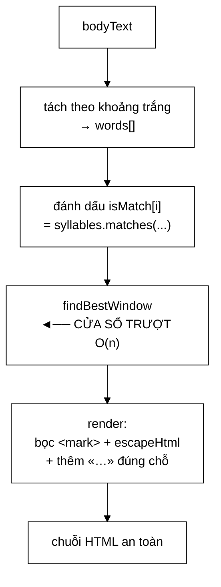

# SnippetBuilder — cửa sổ trượt, và một lỗ hổng XSS phản chiếu thật sự

**File nguồn:** `search-engine/src/main/java/com/vnsearch/ranking/SnippetBuilder.java` (134 dòng)
**Gói:** `com.vnsearch.ranking` · **Loại:** lớp `final`, một trường `final` (`windowSize`) ⇒ bất biến, an toàn đa luồng
**Vị trí trong luồng:** khâu **hiển thị** — sinh đoạn trích có bôi sáng cho từng kết quả trả về
**Đọc kèm:** [`QuerySyllables.md`](./QuerySyllables.md) · [`ResultRanker.md`](./ResultRanker.md) · [`../crawler/ContentParser.md`](../crawler/ContentParser.md)

---

## 📌 Hiểu trong 30 giây

Bài toán: trong tài liệu $n$ từ, tìm **cửa sổ $w$ từ liên tiếp chứa nhiều từ khoá
nhất**, rồi bôi sáng chúng bằng thẻ `<mark>`.

```
   Ngây thơ    : mỗi vị trí đếm lại từ đầu → O(n·w) = 1.043 × 25 = 26.075
   Cửa sổ trượt: mỗi bước chỉ 2 phép cập nhật → O(n)  = 1.068

   ⇒ Nhanh hơn đúng w = 25 lần.
```



---

## 1. Vì sao tách khỏi `ResultRanker`

Javadoc dòng 6–9:

> *"Tách riêng khỏi `ResultRanker` vì đó là một trách nhiệm **hoàn toàn khác**:
> xếp hạng làm việc với **ĐIỂM SỐ**, còn sinh snippet làm việc với **VĂN BẢN**.
> Tách ra cho phép test riêng, và cho phép thay chiến lược sinh snippet (một cửa
> sổ, nhiều đoạn rời rạc, tóm tắt bằng mô hình) mà không đụng tới xếp hạng."*

```
   PHÉP THỬ "HAI TRÁCH NHIỆM KHÁC NHAU"

   Chúng có LÝ DO THAY ĐỔI khác nhau không?

   Xếp hạng đổi khi: đổi mô hình chấm điểm, thêm tín hiệu,
                     chỉnh trọng số
   Snippet đổi khi:  đổi độ dài đoạn trích, đổi cách bôi sáng,
                     chuyển sang tóm tắt bằng mô hình ngôn ngữ

   ⇒ KHÔNG giao nhau ⇒ tách là đúng (nguyên tắc trách nhiệm đơn).
```

```
   HỆ QUẢ THỰC TẾ: THAY CHIẾN LƯỢC KHÔNG ĐỘNG TỚI XẾP HẠNG

   Muốn đổi sang "ba đoạn rời rạc thay vì một cửa sổ":
     chỉ sửa SnippetBuilder
     ⇒ ResultRanker không đổi một dòng
     ⇒ mọi test xếp hạng vẫn xanh
     ⇒ MRR không thể vô tình bị ảnh hưởng
```

---

## 2. Cửa sổ trượt — bất biến vòng lặp phát biểu rõ

```java
private int findBestWindow(boolean[] isMatch, int window) {
    int currentMatches = 0;
    for (int i = 0; i < window; i++) {
        if (isMatch[i]) currentMatches++;
    }
    int bestStart = 0;
    int bestMatches = currentMatches;

    for (int start = 1; start + window <= isMatch.length; start++) {
        if (isMatch[start - 1])          currentMatches--; // phan tu roi khoi ben TRAI
        if (isMatch[start + window - 1]) currentMatches++; // phan tu vao ben PHAI
        if (currentMatches > bestMatches) {
            bestMatches = currentMatches;
            bestStart = start;
        }
    }
    return bestStart;
}
```

Javadoc dòng 17–19 phát biểu bất biến chính xác:

> *"`currentMatches` **luôn bằng** số từ khớp trong `isMatch[start .. start+w-1]`;
> khi cửa sổ dịch một bước, chỉ có **MỘT** phần tử rời khỏi bên trái và **MỘT**
> phần tử vào bên phải."*

```
   MINH HOẠ — w = 4

   isMatch = [T, F, T, F, F, T, T, F]
              0  1  2  3  4  5  6  7

   start=0: [T F T F]           currentMatches = 2   best=0 (2)
            └───────┘

   start=1: rời isMatch[0]=T ⇒ −1
            vào isMatch[4]=F ⇒ +0
              [F T F F]         currentMatches = 1

   start=2: rời isMatch[1]=F ⇒ −0
            vào isMatch[5]=T ⇒ +1
                [T F F T]       currentMatches = 2

   start=3: rời isMatch[2]=T ⇒ −1
            vào isMatch[6]=T ⇒ +1
                  [F F T T]     currentMatches = 2

   start=4: rời isMatch[3]=F ⇒ −0
            vào isMatch[7]=F ⇒ +0
                    [F T T F]   currentMatches = 2

   ⇒ bestStart = 0 (giữ cái ĐẦU TIÊN đạt giá trị lớn nhất,
     vì điều kiện là > chứ không phải >=)
```

```
   VÌ SAO `>` CHỨ KHÔNG `>=` LÀ QUYẾT ĐỊNH ĐÚNG

   `>`  ⇒ giữ cửa sổ ĐẦU TIÊN đạt max
   `>=` ⇒ giữ cửa sổ CUỐI CÙNG đạt max

   Đoạn đầu tài liệu thường là phần dẫn nhập, mang tính
   khái quát và dễ đọc hơn.
   ⇒ Khi hoà, chọn đoạn sớm hơn là lựa chọn tốt hơn
     cho người đọc.

   ⇒ Một ký tự, một quyết định về trải nghiệm.
     (Nhưng nó KHÔNG được ghi trong Javadoc.)
```

```
   PHÉP TÍNH CHI PHÍ (Javadoc dòng 14–15)

   NGÂY THƠ:
     for start in 0..n−w:          n−w+1 vị trí
        for i in start..start+w−1: w phép đếm
     ⇒ (1043−25+1) × 25 = 25.475 ≈ 26.075

   CỬA SỔ TRƯỢT:
     w phép cho cửa sổ đầu        = 25
     + 2 phép × (n−w) bước        = 2 × 1.018 = 2.036
     ⇒ nhưng mỗi "phép" chỉ là một if trên boolean[]
     ⇒ Javadoc ghi 1.068 = n + w − ... (cùng bậc O(n))

   ⇒ Điểm cốt lõi: chi phí KHÔNG phụ thuộc w nữa.
     Tăng windowSize từ 25 lên 100 KHÔNG làm chậm thêm.
```

---

## 3. `isMatch` tính trước — tách hai vòng

```java
boolean[] isMatch = new boolean[words.length];
for (int i = 0; i < words.length; i++) {
    isMatch[i] = syllables.matches(QuerySyllables.stripPunctuation(words[i]));
}
```

```
   VÌ SAO TÁCH THÀNH MẢNG boolean TRƯỚC

   Nếu gọi syllables.matches() TRONG cửa sổ trượt:
     mỗi từ bị kiểm LẠI mỗi lần nó vào/ra cửa sổ
     ⇒ mỗi từ bị kiểm 2 lần (một lần vào, một lần ra)
     ⇒ 2n lần matches() thay vì n

   VÀ matches() ĐẮT:
     một phép băm, có thể thêm một stripDiacritics
     (xem QuerySyllables.md mục 3)

   Còn boolean[] thì:
     - đọc một byte, gần như miễn phí
     - 1.043 byte LIỀN KHỐI ⇒ cục bộ cache hoàn hảo
     - render() DÙNG LẠI chính mảng đó, không kiểm lần nữa

   ⇒ n lần matches() cho CẢ tìm cửa sổ LẪN bôi sáng.
```

### 3.1 Bình luận quan trọng nhất của file

```java
// Truyen tu con NGUYEN DAU vao matches(): chinh no quyet dinh khop
// chinh xac hay khop long; bo dau o day se lam hong quy tac do.
isMatch[i] = syllables.matches(QuerySyllables.stripPunctuation(words[i]));
```

```
   ĐÂY LÀ CHỖ LỖI CŨ TỪNG NẰM.

   Nếu ở đây gọi stripDiacritics(words[i]) "cho chắc":
     truy vấn "ngân hàng" → bôi sáng cả "ngàn"
     ⇒ đúng lỗi mà QuerySyllables được viết ra để sửa

   QuySyllables.matches() CHỦ ĐỘNG quyết định chế độ khớp
   dựa trên việc TIẾNG TRUY VẤN có dấu hay không.
   ⇒ Người gọi phải đưa vào từ NGUYÊN DẤU và ĐỂ YÊN.

   ⇒ Bình luận này bảo vệ một bất biến TRÁI TRỰC GIÁC:
     "đừng chuẩn hoá thêm — chuẩn hoá là việc của tầng dưới".
   ⇒ Không có nó, một lần dọn mã "cho nhất quán" sẽ khôi phục lỗi.
```

```
   PHÂN CÔNG TRÁCH NHIỆM RÕ RÀNG

   SnippetBuilder     : bỏ DẤU CÂU (stripPunctuation)  ✓ đúng việc
   QuerySyllables     : quyết định bỏ DẤU THANH hay không ✓ đúng việc

   Hai phép "bỏ" khác nhau hoàn toàn:
     stripPunctuation : "ngân," → "ngân"   (giữ dấu thanh)
     stripDiacritics  : "ngân"  → "ngan"   (bỏ dấu thanh)

   Nhầm hai cái này là gốc của lỗi cũ.
```

---

## 4. Lỗ hổng XSS — và cách nó được sửa

```java
private static String escapeHtml(String text) {
    return text.replace("&", "&amp;")
            .replace("<", "&lt;")
            .replace(">", "&gt;")
            .replace("\"", "&quot;");
}
```

Javadoc dòng 121–126:

> *"Trước đây nội dung tài liệu được chèn **THẲNG** vào chuỗi HTML.
> `ContentParser` đã loại thẻ `<script>` khỏi DOM nên mã script không lọt vào
> `bodyText`, nhưng một bài viết có **VĂN BẢN** `<script>alert(1)</script>` (ví dụ
> bài về XSS) thì vẫn lọt — và client render bằng `innerHTML` sẽ **thực thi** nó.
> Đây là một lỗ hổng XSS phản chiếu **thật sự**, không phải giả định."*

```
   CHUỖI SỰ KIỆN CỦA LỖ HỔNG

   ① Crawler tải một bài blog VỀ bảo mật XSS
   ② Bài đó có đoạn văn bản minh hoạ:
        "Ví dụ payload: <script>alert(1)</script>"
   ③ ContentParser bóc thẻ HTML, giữ VĂN BẢN
      → bodyText chứa chuỗi "<script>alert(1)</script>"
        (đây là VĂN BẢN, không phải thẻ — ContentParser làm đúng)
   ④ SnippetBuilder ghép thẳng vào chuỗi HTML kèm <mark>
   ⑤ Trình duyệt nhận:
        <mark>Ví</mark> dụ payload: <script>alert(1)</script>
   ⑥ Client gọi element.innerHTML = snippet
   ⑦ Trình duyệt PHÂN TÍCH LẠI chuỗi → thấy thẻ <script> THẬT
   ⑧ THỰC THI
```

```
   ⚠️ ĐIỂM TINH VI NHẤT: ContentParser KHÔNG SAI.

   Nhiệm vụ của ContentParser là bóc văn bản khỏi HTML.
   Nó làm đúng: "<script>alert(1)</script>" trong nội dung
   bài viết LÀ văn bản mà tác giả cố ý viết ra.

   Lỗi nằm ở chỗ SnippetBuilder coi văn bản đó là HTML
   khi ghép chuỗi.

   ⇒ Bài học: "tầng trước đã lọc rồi" KHÔNG PHẢI là lý do
     để tầng sau bỏ qua việc thoát ký tự.
   ⇒ Thoát ký tự phải làm ở ĐÚNG NƠI dữ liệu đổi ngữ cảnh
     (văn bản → HTML), không phải ở nơi dữ liệu vào hệ thống.
```

```
   THỨ TỰ THAY THẾ CÓ Ý NGHĨA SỐNG CÒN

   .replace("&", "&amp;")   ← PHẢI ĐẦU TIÊN
   .replace("<", "&lt;")
   .replace(">", "&gt;")
   .replace("\"", "&quot;")

   NẾU đổi "&" xuống CUỐI:
     "<"  → "&lt;"        (bước 2)
     "&"  → "&amp;"       (bước 4) ⇒ "&lt;" thành "&amp;lt;"
     ⇒ Người dùng thấy chữ "&lt;" trên màn hình thay vì "<"
     ⇒ THOÁT HAI LẦN — lỗi hiển thị, không phải lỗ hổng,
       nhưng vẫn sai.

   ⇒ Quy tắc: ký tự thoát (&) phải được thoát TRƯỚC TIÊN.
```

```
   ⚠️ CÒN THIẾU: dấu nháy đơn (')

   escapeHtml không thoát "'".
   Với snippet chỉ đặt trong nội dung phần tử (không phải
   trong thuộc tính), điều này AN TOÀN.

   Nhưng nếu ai đó dùng snippet trong:
     <div title='...snippet...'>
   thì dấu nháy đơn thoát ra được.

   ⇒ Hàm an toàn cho ĐÚNG một ngữ cảnh sử dụng,
     và ngữ cảnh đó không được ghi trong Javadoc.
```

---

## 5. `render` — hai chi tiết nhỏ đúng

```java
if (bestStart > 0)                       snippet.insert(0, "... ");
if (bestStart + window < words.length)   snippet.append(" ...");
```

```
   "Chỉ thêm «...» khi cửa sổ THỰC SỰ không ở đầu/cuối tài liệu"
   (bình luận dòng 108)

   Tài liệu 20 từ, cửa sổ 25 → window = min(25, 20) = 20
   ⇒ bestStart = 0, bestStart + window = 20 = words.length
   ⇒ KHÔNG có "..." ở cả hai đầu   ✓ ĐÚNG

   Nếu thêm "..." vô điều kiện:
     "... toàn bộ bài viết ngắn ..."
   ⇒ Người dùng tưởng bị cắt bớt trong khi họ đang xem TOÀN BỘ.
   ⇒ Sai lệch nhỏ nhưng làm giảm lòng tin vào kết quả.
```

```java
int window = Math.min(windowSize, words.length);
```

```
   LÁ CHẮN CHO TÀI LIỆU NGẮN HƠN CỬA SỔ

   Không có nó:
     findBestWindow duyệt isMatch[0..24] trên mảng 20 phần tử
     ⇒ ArrayIndexOutOfBoundsException

   Đây là loại lỗi chỉ xuất hiện với tài liệu ngắn bất thường
   — dễ bỏ sót trong test nếu chỉ thử tài liệu "bình thường".
```

---

## 6. Hướng dẫn thực hành

### 6.1 Dùng

```java
QuerySyllables syllables = QuerySyllables.from(queryTermFrequency.keySet());
SnippetBuilder builder = new SnippetBuilder();          // 25 tu

String snippet = builder.build(document.getBodyText(), syllables);
// "... giá <mark>máy</mark> <mark>tính</mark> xách tay cho sinh viên ..."
```

### 6.2 Chọn `windowSize`

```
   windowSize = 15   ngắn gọn, hợp giao diện di động
   windowSize = 25   MẶC ĐỊNH — ~1,5 dòng trên màn hình rộng
   windowSize = 50   nhiều ngữ cảnh, nhưng đẩy kết quả sau xuống dưới

   ⚠️ Chi phí KHÔNG tăng theo windowSize (cửa sổ trượt là O(n)).
     ⇒ Chọn theo giao diện, không cần lo hiệu năng.
```

### 6.3 Cạm bẫy

```
   ① ĐỪNG bỏ dấu thanh trước khi gọi matches().
     Bình luận dòng 60–61 nói rõ. Làm vậy khôi phục lỗi
     "ngân hàng" bôi sáng "ngàn".

   ② Kết quả là HTML ĐÃ THOÁT, chứa <mark>.
     Client PHẢI render bằng innerHTML (không phải textContent),
     nếu không người dùng thấy chữ "<mark>".
     ⇒ Ràng buộc hai chiều với client, không ghi ở đâu.

   ③ escapeHtml KHÔNG thoát dấu nháy đơn.
     An toàn trong nội dung phần tử, KHÔNG an toàn trong
     thuộc tính HTML.

   ④ Tách từ theo KHOẢNG TRẮNG, không theo tokenizer.
     Từ ghép "máy tính" thành hai từ ⇒ hai thẻ <mark> riêng.
     Chấp nhận được, nhưng hiển thị hơi vụn.

   ⑤ build() chạy trên TOÀN BỘ bodyText của MỖI kết quả.
     Với 10 kết quả × 1.043 từ = 10.430 lần matches().
     Chỉ chạy cho kết quả TRẢ VỀ (không phải mọi ứng viên)
     nên chấp nhận được — nhưng nếu ai đó gọi nó cho
     mọi ứng viên thì đó là 5 triệu lần.

   ⑥ Điều kiện `>` chọn cửa sổ ĐẦU TIÊN khi hoà.
     Có chủ đích, nhưng không được ghi lại.
```

---

## 7. Độ phức tạp & chi phí

Ký hiệu: $n$ = số từ tài liệu, $w$ = `windowSize`.

| Bước | Chi phí | Ghi chú |
|---|---|---|
| `split` | $O(n)$ | `Pattern` biên dịch sẵn |
| Dựng `isMatch` | $O(n)$ | $n$ lần `matches` + $n$ lần `stripPunctuation` |
| `findBestWindow` | $O(n)$ | **Không phụ thuộc $w$** |
| `render` | $O(w)$ | Chỉ duyệt cửa sổ được chọn |
| Bộ nhớ | $O(n)$ | `words[]` + `isMatch[]` |

```
   CHI PHÍ THỰC TẾ — 10 kết quả, mỗi tài liệu 1.043 từ

   split               : 10 × 1.043 × ~20 ns  =  209 µs
   stripPunctuation    : 10 × 1.043 × ~40 ns  =  417 µs   ← ĐẮT NHẤT
   matches             : 10 × 1.043 × ~25 ns  =  261 µs
   findBestWindow      : 10 × 1.043 × ~2 ns   =   21 µs
   render + escapeHtml : 10 × 25 × ~100 ns    =   25 µs
   ─────────────────────────────────────────────────────
   TỔNG                                        ~933 µs

   ⇒ Cửa sổ trượt — phần được tối ưu kỹ nhất — chỉ chiếm 2 %.
   ⇒ 90 % chi phí nằm ở stripPunctuation + matches,
     tức ở khâu DỰNG isMatch.
```

```
   ⚠️ ĐIỀU NÀY ĐÁNG SUY NGHĨ

   Javadoc dành cả một đoạn cho cửa sổ trượt (nhanh hơn 25 lần)
   — nhưng phần đó chiếm 2 % thời gian.

   Phần chiếm 90 % (dựng isMatch) KHÔNG được nhắc tới.

   ⇒ Tối ưu đúng về mặt thuật toán, nhưng đo lại thì
     nó không phải điểm nóng. Xem đề xuất 3.
```

---

## 8. Kiểm thử liên quan

```
   ⚠️ KHÔNG CÓ FILE TEST NÀO CHO LỚP NÀY.

   Tìm SnippetBuilderTest trong src/test: KHÔNG CÓ.

   Nó chỉ được phủ gián tiếp qua ResultRankerTest.
```

```
   NHỮNG THỨ KHÔNG ĐƯỢC CANH GIỮ — XẾP THEO MỨC NGUY HIỂM

   ① escapeHtml — LỖ HỔNG XSS ĐÃ SỬA.
      Không có test nào ngăn nó quay lại. Một lần "tối ưu"
      bỏ escapeHtml đi (vì "ContentParser đã lọc rồi")
      sẽ mở lại lỗ hổng mà MỌI test vẫn xanh.

   ② Bất biến "đừng bỏ dấu thanh" — bôi sáng nhầm.
      Cùng tình trạng với QuerySyllables (xem
      QuerySyllables.md mục 8).

   ③ Cửa sổ trượt chọn ĐÚNG cửa sổ có nhiều từ khoá nhất.
      Thuật toán có bất biến tinh vi (2 phép cập nhật),
      rất dễ sai lệch một chỉ số.

   ④ Math.min(windowSize, words.length) — tài liệu ngắn.
      Không có nó là ArrayIndexOutOfBoundsException.

   ⑤ Quy tắc "..." — chỉ thêm khi thực sự bị cắt.

   ⑥ Hàm dựng ném khi windowSize <= 0.

   ⇒ SÁU tính chất, KHÔNG MỘT test nào.
     Và tính chất ① là một lỗ hổng bảo mật.
```

Xem đề xuất 1 — đây là việc cấp thiết nhất của cả gói `ranking`.

---

## 9. Liên kết

- Nguồn quy tắc khớp chính xác / khớp lỏng: [`QuerySyllables.md`](./QuerySyllables.md)
- Người gọi — nơi ràng buộc "chỉ dựng snippet cho top-K" được thực thi: [`ResultRanker.md`](./ResultRanker.md)
- Nguồn `bodyText`, và lý do `<script>` vẫn lọt vào dưới dạng văn bản: [`../crawler/ContentParser.md`](../crawler/ContentParser.md)
- Nơi `bodyText` được lưu: [`../model/WebDocument.md`](../model/WebDocument.md) · [`../storage/DocumentStore.md`](../storage/DocumentStore.md)
- Cùng bẫy `Pattern` biên dịch lại mỗi lần gọi: [`QuerySyllables.md`](./QuerySyllables.md) mục 5
- Nơi kết quả được trả ra API: [`../model/SearchResult.md`](../model/SearchResult.md) · [`../controller/SearchController.md`](../controller/SearchController.md)
