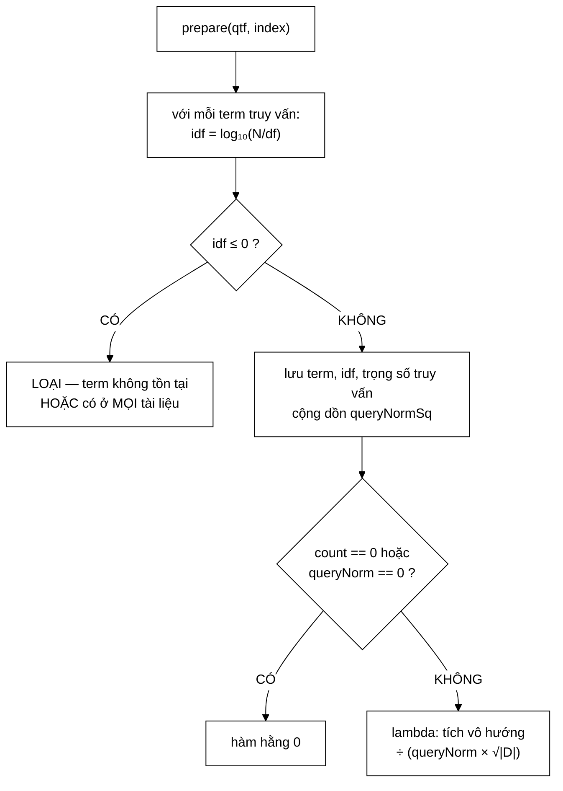

# TfIdfScorer — mô hình vector cổ điển, và một xấp xỉ được thừa nhận sòng phẳng

**File nguồn:** `search-engine/src/main/java/com/vnsearch/ranking/TfIdfScorer.java` (156 dòng)
**Gói:** `com.vnsearch.ranking` · **Loại:** lớp thường, **không có trường nào** ⇒ hoàn toàn không trạng thái, an toàn đa luồng tuyệt đối
**Vị trí trong luồng:** mô hình chấm điểm **đối chứng** — cài đặt [`RelevanceScorer`](./RelevanceScorer.md)
**Đọc kèm:** [`BM25Scorer.md`](./BM25Scorer.md) · [`RelevanceScorer.md`](./RelevanceScorer.md) · [`../datastructure/SparseMatrix.md`](../datastructure/SparseMatrix.md)

---

## 📌 Hiểu trong 30 giây

Mô hình không gian vector: truy vấn và tài liệu đều là vector trong không gian
136.768 chiều (mỗi term một chiều), điểm liên quan là **cosin góc** giữa chúng.

$$\text{score}(D,Q) = \frac{\sum_{t} w(t,Q) \cdot w(t,D)}{\lVert Q \rVert \cdot \lVert D \rVert}, \qquad w(t,X) = tf(t,X) \cdot idf(t)$$

$$tf(f) = 1 + \log_{10} f, \qquad idf(t) = \log_{10}\frac{N}{df(t)}$$

```
   BA PHẦN, BA VAI TRÒ

   tích vô hướng (dot)  →  "hai vector cùng hướng tới mức nào?"
   ‖Q‖                  →  chuẩn hoá truy vấn (hằng số trong một truy vấn)
   ‖D‖ ≈ √|D|           →  chuẩn hoá tài liệu — XẤP XỈ, xem mục 3
```



---

## 1. `tf` — nén phi tuyến chống nhồi từ khoá

```java
public static double tf(int termFrequency) {
    return termFrequency > 0 ? 1 + Math.log10(termFrequency) : 0.0;
}
```

Javadoc dòng 11–12: *"nén phi tuyến để một tài liệu nhồi từ khoá không thắng quá
dễ: lặp gấp 10 lần chỉ được thêm 1 điểm."*

```
   f        tf = 1 + log₁₀(f)      thêm được bao nhiêu?
   ─────────────────────────────────────────────────────
     1          1,00
    10          2,00               +1,00 (gấp 10 lần f)
   100          3,00               +1,00 (gấp 10 lần nữa)
 1.000          4,00               +1,00
10.000          5,00               +1,00

   ⇒ Mỗi lần muốn thêm 1 điểm phải NHÂN TẦN SUẤT VỚI 10.
   ⇒ Chi phí nhồi từ khoá tăng theo cấp số nhân,
     lợi ích tăng theo cấp số cộng.
```

```
   ⚠️ NHƯNG KHÔNG CÓ TRẦN.

   f = 10⁶ ⇒ tf = 7,0
   f = 10⁹ ⇒ tf = 10,0

   Nó chỉ TĂNG CHẬM, không DỪNG.
   BM25 thì thực sự dừng ở k₁+1 = 2,2 (xem BM25Scorer.md mục 1.1).

   ⇒ Đây là điểm khác biệt cơ bản đầu tiên giữa hai mô hình.
```

```
   TẠI SAO CHECK f > 0 LÀ BẮT BUỘC

   log₁₀(0) = −∞

   Không có lá chắn:
     tf(0) = 1 + (−∞) = −∞
     dot  += w · (−∞) · idf = −∞ hoặc NaN
     ⇒ toàn bộ thứ tự xếp hạng HỎNG

   Đây cùng loại lỗi với NaN ở BM25 (xem BM25Scorer.md mục 2.2).
```

---

## 2. `idf` — lượng thông tin, hiểu theo nghĩa đen

```java
public static double idf(int totalDocs, int documentFrequency) {
    if (documentFrequency <= 0 || totalDocs <= 0) return 0.0;
    return Math.log10((double) totalDocs / documentFrequency);
}
```

Javadoc dòng 13–15 nói một điều mà rất ít tài liệu nói:

> *"`idf = log10(totalDocs / documentFrequency)` — chính là **lượng thông tin**
> (self-information) của biến cố «tài liệu chứa term này»: từ hiếm mang nhiều
> thông tin phân biệt hơn."*

```
   ĐÂY KHÔNG PHẢI PHÉP SO SÁNH BÓNG BẨY — NÓ LÀ ĐỊNH NGHĨA.

   Lý thuyết thông tin (Shannon):
     lượng thông tin của biến cố có xác suất p  =  −log(p)

   Ở đây:
     P("tài liệu ngẫu nhiên chứa term t")  =  df(t) / N

     I(t) = −log₁₀( df/N )  =  log₁₀( N/df )  =  idf(t)   ✓

   ⇒ IDF KHÔNG phải một trọng số tuỳ ý ai đó nghĩ ra.
     Nó là lượng thông tin, đo bằng đơn vị "hartley"
     (bit nếu dùng log₂).
```

```
   Ý NGHĨA TRỰC QUAN

   term "các":  P = 4.812/5.011 = 0,96
                biết tài liệu chứa "các" → hầu như KHÔNG biết thêm gì
                I = log₁₀(1,041) = 0,018 hartley

   term "posting": P = 12/5.011 = 0,0024
                biết tài liệu chứa "posting" → thu hẹp từ 5.011 xuống 12
                I = log₁₀(417,6) = 2,62 hartley

   ⇒ "posting" mang thông tin gấp 146 lần "các".
```

### 2.1 Khác biệt then chốt với IDF của BM25

```
                 TF-IDF                    BM25
   ──────────────────────────────────────────────────────────────
   công thức   log₁₀(N/df)          ln(1 + (N−df+0,5)/(df+0,5))

   df = N      log₁₀(1) = 0         ln(1 + 0,5/(N+0,5)) ≈ 0⁺
               ĐÚNG BẰNG 0                   DƯƠNG, rất nhỏ

   df > N/2    DƯƠNG (vì N/df > 1)  DƯƠNG
               KHÔNG âm ✓

   ⇒ Dạng log₁₀(N/df) này KHÔNG BAO GIỜ ÂM (vì df ≤ N ⇒ N/df ≥ 1).
     Vấn đề "IDF âm" mà BM25Scorer.md mục 1.3 nêu ra thuộc về
     biến thể log((N−df+0,5)/(df+0,5)) KHÔNG bọc ln(1+…),
     KHÔNG phải về công thức ở đây.
```

```
   NHƯNG idf = 0 KHI df = N VẪN LÀ MỘT KHÁC BIỆT THẬT

   TF-IDF: term có ở MỌI tài liệu ⇒ idf = 0 ⇒ LOẠI HẲN
   BM25:   term có ở MỌI tài liệu ⇒ idf ≈ 0⁺ ⇒ vẫn đóng góp chút ít

   Trên corpus nhỏ, "loại hẳn" có thể mất thông tin:
   nếu truy vấn CHỈ gồm các term phổ biến, TF-IDF trả về
   ĐIỂM 0 CHO TẤT CẢ (count == 0 ⇒ hàm hằng 0),
   còn BM25 vẫn xếp hạng được theo tần suất.
```

---

## 3. Xấp xỉ chuẩn hoá độ dài — và lời thú nhận sòng phẳng

```java
double docNorm = Math.sqrt(Math.max(index.getDocLength(docId), 1)); // max(.,1) chong chia 0
```

Javadoc dòng 17–21:

> *"Cosin chuẩn cần chia cho $\lVert$vector tài liệu$\rVert$, mà norm này về lý
> thuyết phải tính trên **TẤT CẢ** term của tài liệu — tốn $O(\lvert$từ
> vựng$\rvert)$ cho MỖI tài liệu, và phải tính lại mỗi lần thêm tài liệu (vì
> `idf` đổi khi $N$ đổi). Thay vào đó dùng xấp xỉ kinh điển của Lucene classic
> Similarity: `docNorm ≈ sqrt(docLength)`."*

```
   VÌ SAO NORM THẬT KHÔNG TÍNH ĐƯỢC

   ‖D‖ = √( Σ  w(t,D)² )     tổng trên MỌI term của tài liệu
                t∈D

   Chi phí: O(số term phân biệt của D) cho mỗi tài liệu
            ⇒ 5.011 tài liệu × ~300 term = 1,5 triệu phép tính

   TỆ HƠN NHIỀU: w(t,D) chứa idf(t) = log(N/df)
                 ⇒ N đổi khi thêm tài liệu
                 ⇒ MỌI norm của MỌI tài liệu phải tính lại
                 ⇒ thêm 1 tài liệu = O(N × |từ vựng|)

   ⇒ Không dùng được với chỉ mục tăng dần.
```

### 3.1 Phần đáng khen nhất: nói rõ sai số

Javadoc dòng 23–27:

> *"**Sai số của xấp xỉ, nói cho công bằng.** Theo **định luật Heaps**, số term
> phân biệt của tài liệu tăng theo $\lvert d \rvert^\beta$ với $\beta \approx
> 0{,}5$, nên norm thật tỉ lệ $\lvert d \rvert^{0{,}25}$ trong khi xấp xỉ dùng
> $\lvert d \rvert^{0{,}5}$ — tức nó **PHẠT tài liệu dài mạnh hơn thực tế**. Đây
> đúng là điểm mà BM25 hơn, vì BM25 có tham số `b` để điều chỉnh mức phạt thay vì
> chọn cứng."*

```
   SUY LUẬN TỪNG BƯỚC

   ① Định luật Heaps: V(d) ≈ K·|d|^β,  β ≈ 0,5
      (số term PHÂN BIỆT trong văn bản dài |d|)

   ② ‖D‖ = √(Σ w²) — tổng có V(d) số hạng
      Nếu các w cỡ như nhau: ‖D‖ ~ √(V(d)) ~ √(|d|^0,5) = |d|^0,25

   ③ Xấp xỉ dùng: √|d| = |d|^0,5

   ⇒ Xấp xỉ chia cho một số LỚN HƠN thực tế
   ⇒ PHẠT tài liệu dài MẠNH HƠN đáng phạt
```

```
   ĐỊNH LƯỢNG SAI LỆCH

   |d|      |d|^0,25   |d|^0,5   tỉ lệ phạt thừa
   ──────────────────────────────────────────────
    100        3,16      10,0        3,2 ×
    500        4,73      22,4        4,7 ×
  1.000        5,62      31,6        5,6 ×
  5.000        8,41      70,7        8,4 ×

   ⇒ Tài liệu 5.000 từ bị phạt gấp 8,4 lần mức đáng phạt
     so với tài liệu 100 từ.
   ⇒ Bài viết đầy đủ, chất lượng cao bị đẩy xuống
     dưới đoạn ngắn chứa đúng từ khoá.
```

```
   ĐÂY LÀ LÝ DO THẬT SỰ BM25 THẮNG 7 ĐIỂM PHẦN TRĂM Success@1

   BM25:  lengthNorm = k₁(1 − b + b·|D|/avgdl)
          b = 0,75 ⇒ phạt 75% mức tuyến tính
          VÀ b CHỈNH ĐƯỢC

   TF-IDF ở đây: √|d| — CHỌN CỨNG, phạt quá tay

   ⇒ Không phải "BM25 có công thức đẹp hơn".
     Là "BM25 có một nút vặn ở đúng chỗ mà TF-IDF hàn chết".
```

```
   ⭐ ĐIỂM ĐÁNG HỌC NHẤT CỦA CẢ FILE

   Javadoc này TỰ CHỈ RA điểm yếu của chính mô hình mình cài,
   dẫn định luật (Heaps) để định lượng nó, và nói rõ đối thủ
   (BM25) hơn ở chỗ nào.

   Một đồ án bình thường sẽ viết "TF-IDF chuẩn hoá độ dài bằng
   căn bậc hai" rồi dừng. Đây là chuẩn của một báo cáo kỹ thuật.
```

### 3.2 `Math.max(docLength, 1)`

```
   Tài liệu rỗng (docLength = 0):
     √0 = 0 ⇒ dot / (queryNorm × 0) = ±∞ hoặc NaN

   Math.max(…, 1) ⇒ docNorm ≥ 1 ⇒ không bao giờ chia 0.

   Tài liệu rỗng vẫn có thể lọt vào ứng viên nếu title
   chứa term nhưng bodyText rỗng — trường hợp thật,
   không phải giả thuyết.
```

---

## 4. Vector thưa — lý do toàn bộ mô hình khả thi

Javadoc dòng 56–59:

> *"Chỉ duyệt qua term của **TRUY VẤN** chứ không phải 136.768 chiều của không
> gian vector: với term không thuộc truy vấn, $w(t,q) = 0$ nên số hạng
> $w(t,q) \cdot w(t,d) = 0$. Bỏ qua chúng là **CHÍNH XÁC, không phải xấp xỉ** —
> đây là toàn bộ lý do vector thưa làm việc được."*

```
   KHÔNG GIAN VECTOR THẬT

   số chiều = số term phân biệt trong corpus = 136.768

   vector truy vấn "máy tính":
     [0, 0, …, 0, w(máy tính), 0, …, 0]
      └────── 136.767 số 0 ──────┘

   Tích vô hướng đầy đủ:
     Σ  w(t,q)·w(t,d)   →  136.768 phép nhân
     t
     trong đó 136.767 số hạng là 0 × cái gì đó = 0

   Chỉ duyệt term truy vấn:
     1 phép nhân

   ⇒ Giảm 136.768 lần, KẾT QUẢ GIỐNG HỆT.
```

```
   PHÂN BIỆT HAI LOẠI "BỎ QUA"

   Bỏ qua chiều có w(t,q) = 0     → CHÍNH XÁC (0 × x = 0)
   Xấp xỉ ‖D‖ ≈ √|d|              → XẤP XỈ (có sai số, mục 3)

   Javadoc phân biệt rõ hai loại này. Rất nhiều tài liệu
   gộp chung chúng thành "tối ưu", làm người đọc không biết
   chỗ nào mất chính xác.
```

Xem [`../datastructure/SparseMatrix.md`](../datastructure/SparseMatrix.md) để
thấy cùng nguyên lý áp dụng cho ma trận liên kết của PageRank.

---

## 5. `prepare` — bốn phép tối ưu

```java
@Override
public DocumentScorer prepare(Map<String, Integer> queryTermFrequency, SearchIndex index) {
    int totalDocs = index.getTotalDocs();
    int size = queryTermFrequency.size();

    String[] terms = new String[size];
    double[] idfValues = new double[size];
    double[] queryWeights = new double[size];
    int kept = 0;
    double queryNormSq = 0.0;

    for (Map.Entry<String, Integer> entry : queryTermFrequency.entrySet()) {
        double idfValue = idf(totalDocs, index.getDocumentFrequency(entry.getKey()));
        if (idfValue <= 0.0) continue;
        double queryWeight = tf(entry.getValue()) * idfValue;
        terms[kept] = entry.getKey();
        idfValues[kept] = idfValue;
        queryWeights[kept] = queryWeight;
        kept++;
        queryNormSq += queryWeight * queryWeight;
    }

    final int count = kept;
    final double queryNorm = Math.sqrt(queryNormSq);
    if (count == 0 || queryNorm == 0.0) return docId -> 0.0;

    return docId -> {
        double dot = 0.0;
        for (int i = 0; i < count; i++) {
            int docTermFrequency = index.getTermFrequency(terms[i], docId);
            if (docTermFrequency > 0) {
                dot += queryWeights[i] * tf(docTermFrequency) * idfValues[i];
            }
        }
        if (dot == 0.0) return 0.0;
        double docNorm = Math.sqrt(Math.max(index.getDocLength(docId), 1));
        return dot / (queryNorm * docNorm);
    };
}
```

```
   ① idf VÀ tf CỦA VẾ TRUY VẤN TÍNH MỘT LẦN
     Javadoc dòng 75–78: "trước đây chúng bị tính lại cho MỖI ứng viên,
     tức HAI Math.log10 nhân với số ứng viên nhân với số term"

     5.000 × 3 × 2 = 30.000 Math.log10  →  6
     ⇒ tiết kiệm ~900 µs

   ② queryNorm tính MỘT LẦN
     Trước đây: một Math.sqrt cho mỗi ứng viên
     ⇒ 5.000 → 1

   ③ TERM idf ≤ 0 BỊ LOẠI Ở BƯỚC CHUẨN BỊ
     Javadoc dòng 80–82 nêu ĐÚNG HAI nguyên nhân:
       - term không tồn tại        (df = 0 ⇒ idf trả 0)
       - term có ở MỌI tài liệu    (df = N ⇒ log₁₀(1) = 0)
     Cả hai đều không phân biệt được gì ⇒ loại là ĐÚNG NGỮ NGHĨA,
     không chỉ là tối ưu.

   ④ MẢNG SONG SONG, KHÔNG PHẢI MẢNG ĐỐI TƯỢNG
     Javadoc dòng 84–87: "vòng lặp trong chạy c*q lần, và mảng
     double PHẲNG cho cục bộ cache tốt hơn hẳn một mảng tham chiếu
     trỏ tới các đối tượng nằm rải rác trong heap"
```

```
   SO SÁNH BỐ CỤC BỘ NHỚ

   MẢNG ĐỐI TƯỢNG (Term[] với các trường):
     terms → [ptr, ptr, ptr]
              ↓    ↓    ↓
            {obj}{obj}{obj}   ← nằm RẢI RÁC trong heap
     ⇒ mỗi lần đọc idf: theo con trỏ tới chỗ khác ⇒ cache miss

   MẢNG SONG SONG:
     terms[]        = [ptr, ptr, ptr]
     idfValues[]    = [1,2, 3,4, 5,6]   ← 24 byte LIỀN KHỐI
     queryWeights[] = [0,5, 1,1, 2,0]   ← 24 byte LIỀN KHỐI
     ⇒ cả hai mảng double lọt trong MỘT cache line 64 byte
     ⇒ 0 cache miss sau lần nạp đầu

   Vòng chạy c×q = 15.000 lần. Chênh lệch này đo được.
```

### 5.1 `score` uỷ quyền cho `prepare` — một công thức, một chỗ

```java
@Override
public double score(Map<String, Integer> queryTermFrequency, int docId, SearchIndex index) {
    // Uy quyen cho prepare() thay vi lap lai cong thuc: mot cong thuc, mot cho.
    return prepare(queryTermFrequency, index).score(docId);
}
```

```
   ĐÂY LÀ GIẢI PHÁP CHO ĐÚNG VẤN ĐỀ MÀ RelevanceScorer.md MỤC 6 NÊU RA:
   bất biến "prepare ≡ score" có nguy cơ vỡ nếu hai đường đi
   cài công thức riêng.

   Ở đây bất biến đó ĐÚNG THEO CẤU TRÚC: chỉ có MỘT cài đặt,
   score chỉ là vỏ bọc.

   ⇒ Không thể trôi lệch. Cách phòng vệ tốt nhất luôn là
     làm cho lỗi KHÔNG BIỂU DIỄN ĐƯỢC, chứ không phải
     thêm test bắt lỗi.

   BM25Scorer cũng làm y hệt (dòng 82), và bình luận ở đó
   trỏ ngược về đây: "một công thức, một chỗ — xem ghi chú
   cùng tên ở TfIdfScorer".
```

⚠️ **Đánh đổi:** `score` lẻ giờ tốn chi phí `prepare` đầy đủ. Javadoc dòng 66–68
thừa nhận và biện minh đúng: *"đường nóng (`ResultRanker`) gọi thẳng `prepare()`
nên không trả phí chuẩn bị lại; đường này chỉ phục vụ các lần chấm điểm lẻ."*

---

## 6. Hướng dẫn thực hành

### 6.1 Chạy demo cho báo cáo

```powershell
cd search-engine
.\mvnw.cmd -q compile exec:java "-Dexec.mainClass=com.vnsearch.ranking.TfIdfScorer"
```

```
   score(query='máy tính', doc0) = 0,2xx    ← tài liệu VỀ máy tính
   score(query='máy tính', doc1) = 0,0      ← tài liệu về nấu ăn

   ⚠️ Demo dùng khoá "máy_tính" (có gạch dưới) trong Map.
     Đó là dạng term mà VietnameseTokenizer sinh ra cho từ ghép.
     Gõ "máy tính" (dấu cách) sẽ KHÔNG khớp — đúng bất biến
     tokenizer ở ../query/QueryParser.md mục 1.
```

### 6.2 So sánh với BM25

```java
List<RelevanceScorer> models = List.of(new TfIdfScorer(), new BM25Scorer());
for (RelevanceScorer m : models) {
    var kq = evaluationHarness.run(m, truyVanKnownItem);
    System.out.printf("%-24s MRR %.4f  Success@1 %.1f%%%n",
            m.name(), kq.mrr(), kq.successAt1() * 100);
}
```

```
   TF-IDF cosine            MRR 0,8537  Success@1 78,0%
   BM25(k1=1.2,b=0.75)      MRR 0,8989  Success@1 85,0%
```

### 6.3 Cạm bẫy

```
   ① Điểm cosin nằm trong [0, 1] — NHƯNG chỉ khi norm ĐÚNG.
     Vì docNorm là XẤP XỈ, điểm có thể VƯỢT 1.
     Đừng coi nó là xác suất hay tỉ lệ phần trăm.

   ② Term có ở MỌI tài liệu bị LOẠI HẲN (idf = 0).
     Truy vấn chỉ gồm term như vậy ⇒ MỌI tài liệu điểm 0.
     BM25 không có vấn đề này.

   ③ tf() và idf() là static public — dùng độc lập được,
     nhưng idf(df, N) sai thứ tự tham số cho ra số hợp lệ mà SAI.

   ④ Xấp xỉ √|d| phạt tài liệu dài quá tay ~8 lần ở |d|=5.000.
     Nếu corpus có nhiều bài dài, TF-IDF sẽ tệ hơn BM25
     nhiều hơn con số 7 điểm phần trăm gợi ý.

   ⑤ Lớp KHÔNG có trường nào ⇒ một đối tượng dùng chung
     cho toàn hệ thống là an toàn. Đừng tạo mới mỗi truy vấn.
```

---

## 7. Độ phức tạp & chi phí

| Bước | Chi phí | Ghi chú |
|---|---|---|
| `prepare` | $O(q \log d)$ | $q$ lần `getDocumentFrequency` + $2q$ lần `Math.log10` |
| Mỗi `score(docId)` | $O(q \log d)$ | Chi phối bởi `getTermFrequency` (tìm nhị phân) |
| Bộ nhớ thêm | $O(q)$ | Ba mảng độ dài `qtf.size()` |

```
   SO VỚI BM25 — CÙNG ĐỘ PHỨC TẠP, KHÁC HẰNG SỐ

                        TF-IDF        BM25
   Math.log mỗi term      2 (log10)    1 (log)
   Math.sqrt mỗi tài liệu 1            0
   phép chia mỗi tài liệu 1            0 (chỉ 1 cho lengthNorm)
   phép chia mỗi term     0            1

   ⇒ TF-IDF tốn thêm một Math.sqrt mỗi tài liệu.
     5.000 × ~20 ns = 100 µs. Không đáng kể.

   ⇒ HAI MÔ HÌNH GẦN NHƯ CÙNG GIÁ.
     Nên việc BM25 cho MRR cao hơn là LỢI THUẦN,
     không có đánh đổi nào phải cân nhắc.
```

---

## 8. Kiểm thử liên quan

| Test | Bảo vệ điều gì |
|---|---|
| `test/java/com/vnsearch/ranking/TfIdfScorerTest.java` | 8 ca — hai hàm thành phần và hành vi tổng thể |

| Ca test | Tính chất được canh giữ |
|---|---|
| `tfIsZeroForZeroFrequency` | Lá chắn `log₁₀(0) = −∞` |
| `tfIsLogNormalized` | Công thức `1 + log₁₀ f` |
| `idfIsZeroWhenTermInEveryDocument` | `df = N ⇒ log₁₀(1) = 0` |
| `idfIsHigherForRarerTerms` | Tính đơn điệu giảm theo `df` |
| `idfWithZeroDocumentFrequencyIsZero` | Lá chắn `df = 0` |
| `docContainingTermScoresHigherThanDocWithout` | Hành vi cơ bản |
| `nonExistentTermProducesZeroScore` | Nhánh `count == 0` |
| `higherTermFrequencyInDocGivesHigherScore` | Tính đơn điệu tăng theo `tf` |

```
   ĐÁNH GIÁ ĐỘ PHỦ

   TỐT:   hai hàm static (tf, idf) được phủ kỹ — 5/8 ca

   THIẾU HẲN — và đều là những phần Javadoc nói nhiều nhất:

   ✗ CHUẨN HOÁ ĐỘ DÀI.
     Toàn bộ mục 3 của tài liệu này — phần quan trọng nhất,
     phần giải thích VÌ SAO BM25 thắng — KHÔNG có test nào.
     So sánh: BM25ScorerTest CÓ shorterDocumentWinsWhenTermFrequencyIsEqual.

   ✗ Math.max(docLength, 1) — tài liệu rỗng.

   ✗ Bất biến prepare ≡ score.
     (Ở lớp này bất biến đúng theo cấu trúc, nên rủi ro thấp —
      nhưng một test vẫn khoá được cấu trúc đó lại.)

   ✗ name() trả "TF-IDF cosine" — khoá trong bảng kết quả.
```

```powershell
cd search-engine
.\mvnw.cmd -q -Dtest='TfIdfScorerTest' test
```

---

## 9. Chấm theo chuẩn doanh nghiệp

| Tiêu chí | Điểm | Nhận xét |
|---|---|---|
| **Trung thực về sai số của xấp xỉ** | 10/10 | Dẫn **định luật Heaps** để định lượng "phạt tài liệu dài mạnh hơn thực tế", rồi chỉ thẳng BM25 hơn ở đâu |
| **Phân biệt "chính xác" và "xấp xỉ"** | 10/10 | Nói rõ bỏ chiều $w(t,q)=0$ là chính xác, còn $\lVert D \rVert \approx \sqrt{\lvert d \rvert}$ là xấp xỉ |
| **Nền tảng lý thuyết** | 10/10 | IDF = lượng thông tin Shannon, không phải trọng số tuỳ ý |
| Một công thức một chỗ | 10/10 | `score` uỷ quyền `prepare` ⇒ bất biến đúng **theo cấu trúc**, không cần test canh |
| Tối ưu `prepare` | 10/10 | Bốn phép độc lập, kể cả lý do dùng mảng song song vì cục bộ cache |
| Loại term đúng ngữ nghĩa | 10/10 | `idf ≤ 0` gộp đúng hai trường hợp: không tồn tại, và có ở mọi tài liệu |
| Chống chia 0 và $-\infty$ | 9/10 | `tf(0)`, `idf(0)`, `max(docLength,1)`, `queryNorm == 0` — bốn lá chắn |
| Không trạng thái | 9/10 | Không có trường nào ⇒ dùng chung tuyệt đối an toàn |
| **Kiểm thử chuẩn hoá độ dài** | **1/10** | Phần trọng tâm của cả Javadoc, và là điểm yếu đã biết của mô hình — **không một ca test** |
| Kiểm thử biên | 3/10 | Tài liệu rỗng, `queryNorm == 0` không được phủ |
| Miền giá trị của điểm | 5/10 | Gọi là "cosine" nhưng vì xấp xỉ nên có thể vượt 1; không nói ra |
| `main` trong lớp sản phẩm | 4/10 | Dùng tên lớp đầy đủ (`com.vnsearch.index.InvertedIndex`) thay vì `import` — làm mã khó đọc |

**Ba đề xuất nâng lên mức sản phẩm:**

1. **Viết test cho chính điểm yếu mà Javadoc đã tự thú nhận.** Mục 3 dành ba đoạn
   giải thích rằng $\sqrt{\lvert d \rvert}$ phạt tài liệu dài quá tay — nhưng
   không có gì đo mức phạt đó, nên nếu ai đó đổi `Math.sqrt` thành
   `Math.pow(len, 0.25)` (tức **sửa** đúng theo phân tích Heaps), mọi test vẫn
   xanh và không ai biết chất lượng đã đổi. Test này vừa khoá hành vi vừa biến
   phân tích thành số:
   ```java
   @Test
   void taiLieuDaiBiPhatTheoCanBacHaiDoDai() {
       // hai tai lieu cung tan suat term, do dai chenh 4 lan
       index.addDocument(doc(0, lapLai("máy tính", 3) + " " + dem(97)));    // |d| = 100
       index.addDocument(doc(1, lapLai("máy tính", 3) + " " + dem(397)));   // |d| = 400

       var s = new TfIdfScorer().prepare(Map.of("máy_tính", 1), index);
       double tiLe = s.score(0) / s.score(1);
       assertEquals(2.0, tiLe, 0.05,
               "docNorm = sqrt(|d|) ⇒ |d| gap 4 lan thi diem giam 2 lan");
   }
   ```
   Kèm ca `taiLieuRongKhongChia0` để phủ `Math.max(docLength, 1)`.

2. **Đo thử xấp xỉ $\lvert d \rvert^{0{,}25}$ và đưa kết quả vào Javadoc.** Phân
   tích Heaps ở mục 3 dẫn tới một dự đoán kiểm chứng được: nếu đổi số mũ từ 0,5
   xuống 0,25, TF-IDF sẽ **thu hẹp khoảng cách với BM25**. Đó là một thí nghiệm
   ablation dài ba dòng, và kết quả của nó — dù xác nhận hay bác bỏ — đều đáng
   giá hơn phần lớn nội dung một chương báo cáo:
   ```java
   // docNorm co tham so, de chay thi nghiem
   public TfIdfScorer(double lengthExponent) { … }
   double docNorm = Math.pow(Math.max(index.getDocLength(docId), 1), lengthExponent);
   ```
   ```
   TF-IDF cosine (exp=0,50) : MRR 0,8537   ← hien tai
   TF-IDF cosine (exp=0,25) : MRR ?,????   ← Heaps du doan TOT HON
   BM25(k1=1.2,b=0.75)      : MRR 0,8989
   ```
   Nếu con số xác nhận dự đoán, đó là bằng chứng rằng phân tích lý thuyết trong
   Javadoc **đúng và có ích** — mức thuyết phục cao nhất mà một đồ án đạt được.

3. **Dọn `main` và nói rõ miền giá trị của điểm.** Đoạn demo dùng tên lớp đầy đủ
   `com.vnsearch.index.InvertedIndex` ở năm chỗ, làm 20 dòng cuối khó đọc hơn hẳn
   phần còn lại của file — chuyển sang `import` hoặc tách hẳn sang lớp demo
   riêng (cùng khuyến nghị đã nêu cho
   [`../query/PostingListMerger.md`](../query/PostingListMerger.md)). Đồng thời
   thêm một dòng Javadoc cho `prepare`: điểm trả về **không** đảm bảo nằm trong
   $[0,1]$ dù mang tên "cosine", vì mẫu số là xấp xỉ — người đọc API rất dễ giả
   định ngược lại và đem nhân 100 để hiển thị "độ liên quan %".

---

## 10. Liên kết

- Giao diện và cơ chế `prepare`: [`RelevanceScorer.md`](./RelevanceScorer.md)
- Mô hình thắng nó trong thí nghiệm ablation: [`BM25Scorer.md`](./BM25Scorer.md)
- Cùng nguyên lý vector thưa, áp cho ma trận liên kết: [`../datastructure/SparseMatrix.md`](../datastructure/SparseMatrix.md) · [`PageRankService.md`](./PageRankService.md)
- Nguồn `tf`, `df`, `docLength`, `N`: [`../index/SearchIndex.md`](../index/SearchIndex.md) · [`../index/InvertedIndex.md`](../index/InvertedIndex.md)
- Nơi chọn và lắp scorer: [`ScorerFactory.md`](./ScorerFactory.md) · [`ResultRanker.md`](./ResultRanker.md)
- Bất biến tokenizer mà demo minh hoạ: [`../query/QueryParser.md`](../query/QueryParser.md) · [`../index/VietnameseTokenizer.md`](../index/VietnameseTokenizer.md)
- Nơi đo MRR/Success@1: [`../eval/EvaluationHarness.md`](../eval/EvaluationHarness.md) · [`../eval/EvaluationMetrics.md`](../eval/EvaluationMetrics.md)
