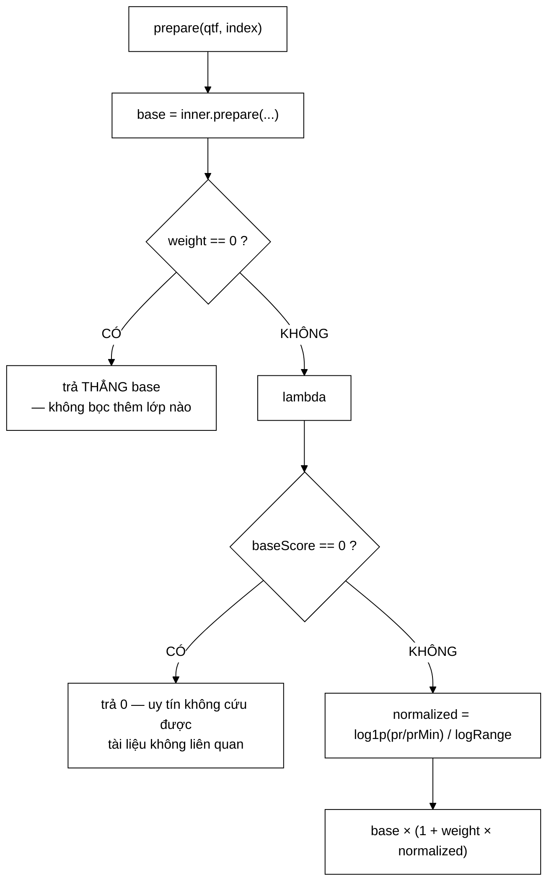

# PageRankBoostScorer — cộng một độ tương tự với một phân phối xác suất là phép toán không có ý nghĩa

**File nguồn:** `search-engine/src/main/java/com/vnsearch/ranking/decorator/PageRankBoostScorer.java` (116 dòng)
**Gói:** `com.vnsearch.ranking.decorator` · **Loại:** lớp `final`, năm trường `final` ⇒ bất biến, an toàn đa luồng
**Vị trí trong luồng:** lớp bọc — Decorator pattern trên [`RelevanceScorer`](../RelevanceScorer.md)
**Đọc kèm:** [`TitleBoostScorer.md`](./TitleBoostScorer.md) · [`../PageRankService.md`](../PageRankService.md) · [`../ScorerFactory.md`](../ScorerFactory.md)

---

## 📌 Hiểu trong 30 giây

Lớp này ra đời để sửa một **lỗi thiết kế đã được đo bằng số**: công thức cũ cộng
tuyến tính điểm liên quan với PageRank, và PageRank đóng góp **0,1 %** dù trọng
số danh nghĩa là **30 %**.

```
   CÔNG THỨC CŨ (chọn cứng trong ResultRanker)

     final = α·relevance + β·pageRank + γ·titleBonus
                           └─ β = 0,30 ─┘

   ĐO THỰC TẾ trên corpus 5.011 trang:

     TF-IDF cosine : trung bình 0,177687   → ×0,6 = 0,106612
     PageRank      : trung bình 0,00035388 → ×0,3 = 0,00010616

     tỉ lệ đóng góp = 0,00010616 / 0,106612 ≈ 0,1 %

   ⇒ Trọng số ghi 30 %. Đóng góp thật 0,1 %. Chênh 300 lần.
```

```
   CÔNG THỨC MỚI

     final = base × (1 + weight × normalized)
     normalized = log1p(pr / prMin) / log1p(prMax / prMin)   ∈ [0, 1]
```



---

## 1. Vì sao **không** phải "chọn β chưa tối ưu"

Đây là lập luận sắc nhất trong toàn bộ gói `ranking`. Javadoc dòng 28–33:

> *"PageRank là một **PHÂN PHỐI XÁC SUẤT**: $\sum PR = 1$, nên với $N = 5011$
> trang, giá trị trung bình **buộc phải** là $1/5011 = 0{,}0002$. Và nó **CÒN
> LẠI** khi corpus lớn hơn — với 1 triệu trang, PageRank trung bình là $10^{-6}$,
> đóng góp giảm thêm 200 lần nữa. **Cộng một độ tương tự với một phân phối xác
> suất là phép toán không có ý nghĩa**, bất kỳ β nào cũng không sửa được."*

```
   LẬP LUẬN TỪNG BƯỚC

   ① PageRank thoả:  Σ PR(v) = 1   (nó là phân phối xác suất
                     v            dừng của bước ngẫu nhiên)

   ② ⇒ trung bình PR = 1/N       BẮT BUỘC, không phải ngẫu nhiên

   ③ Điểm liên quan (TF-IDF cosine) KHÔNG có ràng buộc tổng.
     Trung bình của nó ~0,18 và KHÔNG phụ thuộc N.

   ④ ⇒ Tỉ lệ giữa hai đại lượng tỉ lệ NGHỊCH với N.

      N =     5.011  ⇒ PR/rel ≈ 0,002 / 1
      N = 1.000.000  ⇒ PR/rel ≈ 0,00001 / 1   ← tệ hơn 200 lần

   ⇒ Vấn đề KHÔNG PHẢI β nhỏ. Vấn đề là hai đại lượng
     KHÁC ĐƠN VỊ và tỉ lệ giữa chúng THAY ĐỔI THEO N.
```

```
   BẰNG CHỨNG THỰC NGHIỆM (Javadoc dòng 25–26)

   Quét β từ 0,05 đến 0,80 — GẤP 16 LẦN
   ⇒ MRR chỉ đổi 0,0040, tức 0,4 %

   Nếu vấn đề là "β chưa tối ưu", quét 16 lần phải thấy
   một đỉnh rõ ràng. Không có đỉnh nào.

   ⇒ Bằng chứng bác bỏ giả thuyết "chọn sai tham số".
   ⇒ Đây là cách làm khoa học ĐÚNG: nêu giả thuyết cạnh tranh,
     rồi thiết kế phép đo để loại nó.
```

```
   ⭐ SO SÁNH VỚI CÁCH LÀM THÔNG THƯỜNG

   Cách thường gặp trong đồ án:
     "Chúng tôi thử β = 0,3 và thấy kết quả tốt."
     ⇒ Không ai biết β có ý nghĩa gì

   Cách ở đây:
     ① Đo đóng góp THỰC TẾ (0,1 % vs 30 % danh nghĩa)
     ② Giải thích NGUYÊN NHÂN (phân phối xác suất, Σ = 1)
     ③ Dự đoán KIỂM CHỨNG ĐƯỢC (corpus lớn hơn sẽ tệ hơn)
     ④ Bác bỏ giả thuyết cạnh tranh bằng quét tham số
     ⑤ Đề xuất và cài giải pháp khác về BẢN CHẤT

   Đây là mức của một báo cáo kỹ thuật, không phải đồ án môn học.
```

---

## 2. Giải pháp: **nhân**, không **cộng**

### 2.1 Lý do thứ nhất — logarit nén dải động

```java
double normalized = Math.log1p(pageRank / minPageRank) / logRange;
```

```
   PAGERANK TRẢI TRÊN NHIỀU BẬC ĐỘ LỚN

   Javadoc dòng 43: "từ 10⁻⁴ đến 7,7×10⁻³"
   ⇒ tỉ lệ max/min ≈ 77 lần

   THANG TUYẾN TÍNH:
     pr = 1,0×10⁻⁴  → 0,00 (đáy)
     pr = 3,9×10⁻³  → 0,50 (giữa)
     pr = 7,7×10⁻³  → 1,00 (đỉnh)

     ⇒ 90 % số trang nằm dưới 5×10⁻⁴
     ⇒ 90 % số trang bị dồn vào 5 % đầu thang
     ⇒ tín hiệu gần như KHÔNG PHÂN BIỆT được gì

   THANG LOGARIT:
     normalized = log1p(pr/prMin) / log1p(prMax/prMin)

     pr/prMin =  1  → log1p(1)/log1p(77)  = 0,693/4,357 = 0,159
     pr/prMin =  9  → log1p(9)/4,357      = 2,303/4,357 = 0,529
     pr/prMin = 77  → log1p(77)/4,357     = 4,357/4,357 = 1,000

     ⇒ Trải đều hơn hẳn: mỗi lần PR nhân đôi, normalized
       tăng một lượng gần như cố định.
```

```
   VÌ SAO log1p CHỨ KHÔNG log

   log1p(x) = ln(1 + x)   — chính xác hơn khi x nhỏ

   Với pr = prMin:  pr/prMin = 1
     log(1) = 0            ⇒ normalized = 0
     log1p(1) = 0,693      ⇒ normalized = 0,159

   ⇒ Dùng log1p, trang có PageRank THẤP NHẤT vẫn được
     một chút bonus (0,159 × weight), không bị về 0 tuyệt đối.

   ⇒ Và log1p tránh được ln(0) = −∞ nếu pr = 0.
```

### 2.2 Lý do thứ hai — phép nhân **bất biến với thang đo**

Javadoc dòng 46–51:

> *"Đổi scorer từ TF-IDF sang BM25 (thang điểm khác hẳn: 0,18 so với 12,1)
> **KHÔNG cần chỉnh lại trọng số**. Đây chính là lý do bảng đánh giá cũ cho thấy
> «BM25 + PR + title» (MRR 0,9089) **thua** «TF-IDF + PR + title» (0,9229): bộ
> trọng số được tinh chỉnh cho thang TF-IDF, không dùng lại được cho BM25."*

```
   PHÉP CỘNG PHỤ THUỘC THANG ĐO

     final = base + β·pr

     base ~ 0,18  (TF-IDF)  ⇒ β·pr phải cỡ 0,01 để có ảnh hưởng
     base ~ 12,1  (BM25)    ⇒ β·pr phải cỡ 0,6  để có ảnh hưởng

     ⇒ CÙNG một β cho hai kết quả HOÀN TOÀN khác
     ⇒ Tinh chỉnh cho TF-IDF ⇒ vô tác dụng với BM25

   PHÉP NHÂN BẤT BIẾN VỚI THANG ĐO

     final = base × (1 + w·norm)

     base ~ 0,18 ⇒ final ~ 0,18 × 1,3 = 0,234   (+30 %)
     base ~ 12,1 ⇒ final ~ 12,1 × 1,3 = 15,73   (+30 %)

     ⇒ w = 0,3 nghĩa là "tăng tối đa 30 %" — BẤT KỂ base là gì
     ⇒ w có Ý NGHĨA VẬT LÝ, không phải một con số phép thử
```

```
   NGHỊCH LÝ MÀ NÓ GIẢI THÍCH

   Bảng đánh giá CŨ:
     TF-IDF + PR + title : MRR 0,9229
     BM25   + PR + title : MRR 0,9089   ← THUA, dù BM25 tốt hơn TF-IDF!

   Nghịch lý: mô hình cơ sở TỐT HƠN cho kết quả TỆ HƠN.

   Giải thích: bộ trọng số (α, β, γ) được tinh chỉnh cho thang
   TF-IDF. Áp lên BM25 (thang lớn gấp 67 lần), tỉ lệ đóng góp
   của mọi tín hiệu phụ bị bóp về gần 0.

   ⇒ Nghịch lý KHÔNG PHẢI do BM25 tệ.
     Nó là TRIỆU CHỨNG của việc dùng phép cộng.

   ⭐ Nhận ra điều này — rằng một con số bất thường trong bảng
     kết quả là dấu hiệu của lỗi THIẾT KẾ chứ không phải
     đặc tính của mô hình — là phần khó nhất.
```

---

## 3. Chuẩn hoá tính **một lần** ở hàm dựng

```java
double min = this.pageRankScores.values().stream()
        .mapToDouble(Double::doubleValue).filter(v -> v > 0).min().orElse(1e-9);
double max = this.pageRankScores.values().stream()
        .mapToDouble(Double::doubleValue).max().orElse(min);
this.minPageRank = min;
this.logRange = Math.max(Math.log1p(max / min), 1e-9);
```

```
   BỐN LÁ CHẮN TRONG BỐN DÒNG

   ① .filter(v -> v > 0)
      PageRank = 0 (trang cô lập) sẽ làm pr/prMin = ∞
      ⇒ chỉ lấy min trong các giá trị DƯƠNG

   ② .orElse(1e-9) cho min
      Map rỗng ⇒ không có min ⇒ dùng số dương rất nhỏ
      ⇒ tránh chia 0

   ③ .orElse(min) cho max
      Map rỗng ⇒ max = min ⇒ tỉ lệ = 1 ⇒ log1p(1) = 0,693
      ⇒ mọi tài liệu cùng normalized, không ai được ưu ái

   ④ Math.max(…, 1e-9) cho logRange
      max == min ⇒ log1p(1) = 0,693 ≠ 0, nên không cần thiết
      trong thực tế — nhưng nếu công thức đổi sang log thuần
      thì log(1) = 0 ⇒ CHIA 0. Lá chắn phòng cho tương lai.
```

```
   VÌ SAO TÍNH Ở HÀM DỰNG, KHÔNG PHẢI TRONG prepare

   min và max phụ thuộc CHỈ vào pageRankScores — một Map
   được truyền vào một lần và không đổi.

   ⇒ Tính ở hàm dựng: MỘT LẦN cho cả vòng đời đối tượng
   ⇒ Tính trong prepare: một lần mỗi TRUY VẤN
   ⇒ Tính trong lambda: một lần mỗi ỨNG VIÊN — hai lần duyệt
     toàn bộ 5.011 phần tử, cho MỖI tài liệu

   Với 5.000 ứng viên: 50 triệu phép so sánh bị cắt sạch.
```

⚠️ **Nhưng `pageRankScores` không được sao chép phòng vệ.** Nếu người gọi sửa
`Map` sau khi dựng, `minPageRank` và `logRange` trở nên **lỗi thời** mà không có
gì phát hiện — chuẩn hoá sẽ vượt `[0,1]`. Xem đề xuất 3.

---

## 4. Hai lối tắt trong `prepare`

### 4.1 `weight == 0` ⇒ trả thẳng `base`

```java
if (weight == 0.0) {
    return base; // tin hieu bi tat: khong boc them lop nao
}
```

```
   TẮT TÍN HIỆU = KHÔNG BỌC LỚP NÀO

   Không có lối tắt này:
     mỗi lần chấm điểm vẫn gọi qua một lambda,
     vẫn tra Map, vẫn tính log1p — rồi nhân với 1,0

   ⇒ 5.000 lần tra Map + 5.000 log1p HOÀN TOÀN vô ích

   Có lối tắt:
     chuỗi Decorator TỰ RÚT NGẮN.
     weight = 0 ⇒ lớp này biến mất khỏi đường đi nóng.
```

```
   ⚠️ NHƯNG name() VẪN GHI " + PR x0.00"

   ⇒ Nhãn nói có PageRank, hành vi thì không.
     Đúng về mặt "cấu hình là gì", nhưng dễ gây nhầm
     khi đọc bảng kết quả: hai dòng có nhãn khác nhau
     mà điểm giống hệt.
```

### 4.2 `baseScore == 0` ⇒ trả `0`

Javadoc dòng 54–55: *"Tài liệu có điểm cơ sở bằng 0 vẫn được giữ bằng 0
(`0 × bất kỳ = 0`) — đúng ý muốn: uy tín cao không cứu được một tài liệu hoàn
toàn không liên quan."*

```
   PHÉP NHÂN TỰ CÓ TÍNH CHẤT NÀY

   0 × (1 + w·norm) = 0    LUÔN LUÔN

   ⇒ Lối tắt `if (baseScore == 0) return 0` KHÔNG đổi kết quả,
     chỉ cắt một phép tra Map + một log1p.

   ⇒ Đây là tối ưu THUẦN, không có rủi ro ngữ nghĩa.

   SO SÁNH VỚI PHÉP CỘNG:
     0 + β·pr = β·pr ≠ 0
     ⇒ Trang uy tín cao nhưng KHÔNG chứa từ khoá nào
       vẫn có điểm dương ⇒ có thể lọt vào kết quả
     ⇒ Trang chủ vnexpress.net xuất hiện cho MỌI truy vấn

   ⇒ Đây là lý do THỨ BA để dùng nhân thay cộng,
     và Javadoc nêu nó ra.
```

---

## 5. Hướng dẫn thực hành

### 5.1 Dùng

```java
Map<Integer, Double> pr = pageRankService.getScores();

RelevanceScorer scorer = new TitleBoostScorer(
        new PageRankBoostScorer(new BM25Scorer(), pr, 0.30),
        0.10);

System.out.println(scorer.name());
// BM25(k1=1.2,b=0.75) + PR x0.30 + title x0.10
```

### 5.2 Chọn `weight` — nó có ý nghĩa vật lý

```
   weight = 0,0   tắt hoàn toàn
   weight = 0,1   trang uy tín nhất được +10 % điểm
   weight = 0,3   trang uy tín nhất được +30 %
   weight = 1,0   trang uy tín nhất được NHÂN ĐÔI điểm

   ⇒ Đọc weight là đọc thẳng "mức tăng tối đa".
     Không cần biết thang điểm của scorer bên trong.

   ⇒ Đây chính là thứ mà phép cộng KHÔNG cho được.
```

### 5.3 Cạm bẫy

```
   ① pageRankScores KHÔNG được sao chép.
     Sửa Map sau khi dựng ⇒ minPageRank/logRange lỗi thời
     ⇒ normalized có thể VƯỢT 1 mà không ai biết.

   ② getOrDefault(docId, minPageRank) — tài liệu KHÔNG có
     trong Map được coi như có PageRank THẤP NHẤT.
     Hợp lý, nhưng nó che giấu lỗi "PageRank chưa chạy":
     nếu Map rỗng, MỌI tài liệu đều dùng 1e-9 và
     normalized giống hệt nhau ⇒ tín hiệu vô tác dụng, IM LẶNG.

   ③ Thứ tự bọc KHÔNG quan trọng về kết quả (phép nhân
     có tính giao hoán), nhưng name() ghép theo thứ tự bọc
     ⇒ hai chuỗi cho cùng điểm mà nhãn khác nhau.

   ④ weight < 0 bị chặn ở hàm dựng, nhưng weight > 1
     thì KHÔNG. weight = 100 cho phép PageRank nhân điểm
     lên 101 lần — hợp lệ về mã, vô nghĩa về ngữ nghĩa.

   ⑤ normalized ∈ [0,1] chỉ ĐÚNG nếu mọi pr đều nằm trong
     [min, max] đã tính. Với ② ở trên (getOrDefault),
     điều đó luôn đúng — nhưng chỉ vì trùng hợp.
```

---

## 6. Độ phức tạp & chi phí

| Bước | Chi phí | Khi nào |
|---|---|---|
| Hàm dựng | $O(N)$ — hai lần duyệt `pageRankScores` | **Một lần** cho cả vòng đời |
| `prepare` | $O(1)$ + chi phí của `inner.prepare` | Một lần mỗi truy vấn |
| Mỗi `score(docId)` | 1 tra `HashMap` + 1 `log1p` + 2 phép nhân | Một lần mỗi ứng viên |
| Bộ nhớ thêm | $O(1)$ (Map là tham chiếu, không sao chép) | |

```
   CHI PHÍ THỰC TẾ — 5.000 ứng viên

   tra HashMap  : 5.000 × ~15 ns  =  75 µs
   Math.log1p   : 5.000 × ~25 ns  = 125 µs
   nhân/cộng    : 5.000 × ~2 ns   =  10 µs
   ────────────────────────────────────────
   TỔNG                            ~210 µs

   So với BM25 chấm điểm (~420 µs): thêm 50 %.

   ⇒ KHÔNG rẻ. Với tín hiệu chỉ đổi MRR 0,4 %
     (theo chính phép quét β), đây là câu hỏi
     đáng đặt ra. Xem đề xuất 1.
```

```
   TỐI ƯU KHẢ THI: TÍNH TRƯỚC normalized

   normalized chỉ phụ thuộc docId, KHÔNG phụ thuộc truy vấn.

   ⇒ Tính sẵn một double[] normalized theo docId ở hàm dựng
   ⇒ Vòng nóng chỉ còn MỘT phép truy cập mảng
   ⇒ Cắt cả log1p lẫn tra HashMap: 210 µs → ~15 µs
```

---

## 7. Kiểm thử liên quan

| Test | Bảo vệ điều gì |
|---|---|
| `test/java/com/vnsearch/ranking/ScorerDecoratorTest.java` | 9 ca cho cả hai Decorator + `ScorerFactory` |

| Ca test | Tính chất được canh giữ |
|---|---|
| `pageRankBoostRaisesScoreOfMoreAuthoritativeDoc` | Tín hiệu có tác dụng đúng hướng |
| **`pageRankBoostIsInvariantToBaseScorerScale`** | **Bất biến thang đo — lý do tồn tại của cả lớp** |
| `zeroBaseScoreStaysZero` | `0 × bất kỳ = 0` (mục 4.2) |
| `zeroWeightIsIdentity` | Lối tắt `weight == 0` (mục 4.1) |
| `decoratorsComposeAndNamesChain` | `name()` ghép qua nhiều tầng |
| `rejectsInvalidArguments` | Hai lệnh `throw` ở hàm dựng |

```
   ⭐ pageRankBoostIsInvariantToBaseScorerScale LÀ CA TEST
     QUAN TRỌNG NHẤT CỦA CẢ GÓI ranking.

   Nó canh giữ ĐÚNG tính chất mà toàn bộ Javadoc dùng để
   biện minh cho việc đổi từ cộng sang nhân.

   Nếu ai đó "đơn giản hoá" công thức về phép cộng,
   test này đỏ NGAY — kèm một tên nói rõ vì sao.

   ⇒ Đây là mẫu mực: mỗi quyết định thiết kế lớn
     có một test mang tên chính quyết định đó.
```

**Còn thiếu:**

```
   ✗ normalized ∈ [0,1] cho MỌI docId trong Map
   ✗ Map rỗng ⇒ hành vi hợp lý (lá chắn orElse)
   ✗ docId không có trong Map ⇒ getOrDefault
   ✗ Bất biến prepare ≡ score qua chuỗi Decorator
   ✗ weight > 1 — không bị chặn, không được kiểm
```

```powershell
cd search-engine
.\mvnw.cmd -q -Dtest='ScorerDecoratorTest' test
```

---

## 8. Chấm theo chuẩn doanh nghiệp

| Tiêu chí | Điểm | Nhận xét |
|---|---|---|
| **Chẩn đoán nguyên nhân gốc** | 10/10 | "PageRank là phân phối xác suất ⇒ trung bình buộc phải là $1/N$" — lập luận đúng bản chất, không phải chỉnh tham số |
| **Bác bỏ giả thuyết cạnh tranh bằng số đo** | 10/10 | Quét β gấp 16 lần chỉ đổi MRR 0,4 % ⇒ loại giả thuyết "chọn sai β" |
| **Dự đoán kiểm chứng được** | 10/10 | "Corpus 1 triệu trang ⇒ tệ thêm 200 lần" — phát biểu có thể sai, tức có giá trị khoa học |
| **Giải thích được một nghịch lý trong dữ liệu** | 10/10 | Nhận ra "BM25 thua TF-IDF" là **triệu chứng của lỗi thiết kế**, không phải đặc tính mô hình |
| Trọng số có ý nghĩa vật lý | 10/10 | `weight = 0,3` ⇔ "tăng tối đa 30 %", bất kể thang điểm bên trong |
| Test canh giữ đúng quyết định | 10/10 | `pageRankBoostIsInvariantToBaseScorerScale` mang tên chính lý do tồn tại của lớp |
| Chuẩn hoá logarit | 9/10 | `log1p` nén dải động 77 lần, tránh `ln(0)`, cho trang thấp nhất vẫn có bonus |
| Lá chắn ở hàm dựng | 9/10 | Bốn lá chắn (`filter > 0`, hai `orElse`, `Math.max`) — mỗi cái một tình huống thật |
| **Sao chép phòng vệ `Map`** | **3/10** | `pageRankScores` giữ tham chiếu; sửa từ ngoài làm `minPageRank`/`logRange` lỗi thời **im lặng** |
| Chi phí trên đường nóng | 5/10 | +50 % thời gian chấm điểm cho một tín hiệu đổi MRR 0,4 %; `normalized` **tính trước được** |
| Miền `weight` | 5/10 | Chặn `< 0` nhưng không chặn `> 1`; `weight = 100` hợp lệ về mã |
| Phát hiện "PageRank chưa chạy" | 4/10 | `Map` rỗng ⇒ mọi tài liệu cùng `normalized` ⇒ tín hiệu vô tác dụng **không cảnh báo** |

**Ba đề xuất nâng lên mức sản phẩm:**

1. **Tính trước `normalized` thành một mảng — và cân lại xem tín hiệu có đáng
   không.** `normalized` chỉ phụ thuộc `docId`, hoàn toàn không phụ thuộc truy
   vấn, nên nó thuộc về hàm dựng chứ không phải vòng nóng. Đây là đúng loại "bất
   biến vòng lặp bị kẹt bên trong vòng lặp" mà
   [`TitleBoostScorer`](./TitleBoostScorer.md) đã sửa cho `QuerySyllables`:
   ```java
   private final double[] normalizedByDoc;   // tinh MOT lan o ham dung
   ...
   this.normalizedByDoc = new double[maxDocId + 1];
   Arrays.fill(normalizedByDoc, Math.log1p(1) / logRange);   // mac dinh = prMin
   pageRankScores.forEach((d, pr) ->
           normalizedByDoc[d] = Math.log1p(pr / min) / logRange);
   ```
   Vòng nóng còn một phép truy cập mảng: 210 µs → ~15 µs. Và khi chi phí đã gần
   bằng 0, câu hỏi "tín hiệu chỉ đổi MRR 0,4 % có đáng giữ không" mới trả lời
   được một cách công bằng — hiện tại nó **không** đáng ở giá 50 % thời gian chấm
   điểm.

2. **Ghi lại bảng ablation MỚI vào Javadoc.** Toàn bộ lập luận của file dựa trên
   các con số của công thức **cũ** (cộng tuyến tính). Nhưng sau khi đổi sang nhân,
   không có số nào chứng minh cách mới **tốt hơn** — chỉ có lập luận rằng nó
   **đúng hơn về nguyên tắc**. Với một hội đồng chấm đồ án tốt nghiệp, đó là chỗ
   bị hỏi đầu tiên:
   ```
   * <p>Sau khi doi sang phep nhan, do lai tren 200 truy van known-item:
   * <pre>
   *   BM25(k1=1.2,b=0.75)                        : MRR 0,8989
   *   BM25 + PR x0.30                            : MRR ?,????
   *   BM25 + PR x0.30 + title x0.10              : MRR ?,????
   *   BM25 + title x0.10  (khong PR)             : MRR ?,????   <- doi chung
   * </pre>
   ```
   Dòng cuối là dòng quan trọng nhất: nó tách riêng đóng góp của PageRank khỏi
   đóng góp của tiêu đề, và trả lời thẳng câu hỏi "PageRank có đáng giữ không".

3. **Sao chép phòng vệ `Map` và cảnh báo khi PageRank chưa sẵn sàng.** Hai lỗ
   hổng này khép chung bằng vài dòng ở hàm dựng. Lỗ thứ nhất làm hai hằng số
   chuẩn hoá lệch khỏi dữ liệu thật; lỗ thứ hai làm cả tín hiệu tắt ngóm mà bảng
   kết quả vẫn ghi "+ PR x0.30":
   ```java
   this.pageRankScores = pageRankScores == null ? Map.of() : Map.copyOf(pageRankScores);
   if (weight > 0 && this.pageRankScores.isEmpty()) {
       log.warn("PageRankBoostScorer duoc bat (weight={}) nhung khong co diem PageRank nao. "
              + "Tin hieu se KHONG co tac dung. PageRankService da chay chua?", weight);
   }
   ```
   Cân nhắc thêm chặn `weight > 1` với thông báo nói rõ ý nghĩa: `weight = 1` đã
   là "nhân đôi điểm", vượt qua đó gần như chắc chắn là lỗi cấu hình chứ không
   phải chủ đích.

---

## 9. Liên kết

- Decorator anh em, cùng dùng phép nhân: [`TitleBoostScorer.md`](./TitleBoostScorer.md)
- Giao diện và cơ chế `prepare` lan truyền qua chuỗi: [`../RelevanceScorer.md`](../RelevanceScorer.md)
- Nguồn điểm PageRank: [`../PageRankService.md`](../PageRankService.md) · [`../../datastructure/SparseMatrix.md`](../../datastructure/SparseMatrix.md)
- Hai mô hình cơ sở có thang điểm khác nhau 67 lần: [`../BM25Scorer.md`](../BM25Scorer.md) · [`../TfIdfScorer.md`](../TfIdfScorer.md)
- Nơi chuỗi được lắp: [`../ScorerFactory.md`](../ScorerFactory.md) · [`../ResultRanker.md`](../ResultRanker.md)
- Nơi các con số MRR được đo: [`../../eval/EvaluationHarness.md`](../../eval/EvaluationHarness.md) · [`../../eval/SignificanceTest.md`](../../eval/SignificanceTest.md)
