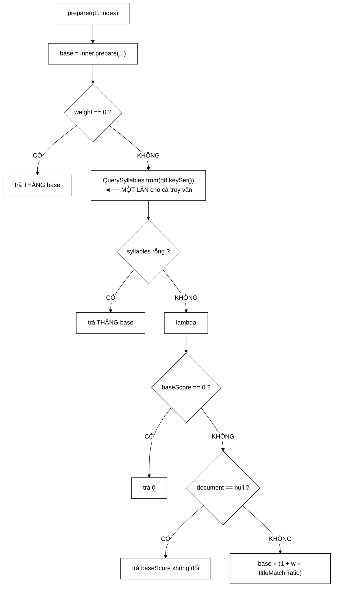

# TitleBoostScorer — tín hiệu mạnh gấp 6 lần PageRank, vì tiêu đề là bản tóm tắt do chính người viết đặt

**File nguồn:** `search-engine/src/main/java/com/vnsearch/ranking/decorator/TitleBoostScorer.java` (96 dòng)
**Gói:** `com.vnsearch.ranking.decorator` · **Loại:** lớp `final`, hai trường `final` ⇒ bất biến, an toàn đa luồng
**Vị trí trong luồng:** lớp bọc ngoài cùng của chuỗi Decorator trên [`RelevanceScorer`](../RelevanceScorer.md)
**Đọc kèm:** [`PageRankBoostScorer.md`](./PageRankBoostScorer.md) · [`../QuerySyllables.md`](../QuerySyllables.md) · [`../ScorerFactory.md`](../ScorerFactory.md)

---

## 📌 Hiểu trong 30 giây

Thưởng thêm cho tài liệu có **tiêu đề** khớp từ khoá truy vấn. Đo trên 200 truy
vấn known-item, đây là tín hiệu phụ **mạnh nhất** của cả hệ thống:

```
   ┌────────────────────┬──────────┬───────────────────────────┐
   │ Cấu hình           │   MRR    │ Chênh so với TF-IDF thuần │
   ├────────────────────┼──────────┼───────────────────────────┤
   │ TF-IDF thuần       │  0,8537  │            —              │
   │ TF-IDF + PageRank  │  0,8625  │        +0,0088            │
   │ TF-IDF + title     │  0,9083  │        +0,0546  ← 6,2 lần │
   └────────────────────┴──────────┴───────────────────────────┘
```

$$\text{final} = \text{base} \times \left(1 + w \cdot \text{titleMatchRatio}\right), \qquad \text{titleMatchRatio} \in [0,1]$$



---

## 1. Vì sao tín hiệu này mạnh

Javadoc dòng 20–22:

> *"Tiêu đề là bản tóm tắt do **CHÍNH NGƯỜI VIẾT** đặt cho bài, nên nó là tín
> hiệu liên quan rất mạnh — và khác với PageRank, nó **cùng thang đo** với điểm
> liên quan (cả hai nằm trong khoảng tương tự) nên kết hợp dễ hơn nhiều."*

```
   HAI LÝ DO, KHÁC HẲN NHAU VỀ BẢN CHẤT

   ① LÝ DO NGỮ NGHĨA
      Tiêu đề = tóm tắt do con người viết ra một cách CÓ CHỦ ĐÍCH
      ⇒ Từ khoá xuất hiện trong tiêu đề mang nhiều thông tin
        hơn hẳn cùng từ khoá trong thân bài
      ⇒ Bài "Hướng dẫn cài đặt Docker" chắc chắn NÓI VỀ Docker
        Bài nhắc "Docker" một lần ở đoạn 7 thì không

   ② LÝ DO KỸ THUẬT
      titleMatchRatio ∈ [0, 1]     — cùng cỡ với điểm liên quan
      PageRank        ~ 1/N        — nhỏ hơn hàng nghìn lần

      ⇒ Kết hợp titleBonus KHÔNG gặp vấn đề "khác đơn vị"
        mà PageRankBoostScorer.md mục 1 mô tả
```

```
   ⭐ SO SÁNH TRỰC TIẾP HAI TÍN HIỆU

                    PageRank              Title
   ────────────────────────────────────────────────────────
   nguồn         cấu trúc liên kết    con người viết
   đơn vị        xác suất (Σ=1)       tỉ lệ ∈ [0,1]
   phụ thuộc N   CÓ (~1/N)            KHÔNG
   cần chuẩn hoá CÓ (log1p + chia)    KHÔNG — đã ở [0,1]
   ΔMRR          +0,0088              +0,0546

   ⇒ Tín hiệu tốt hơn VỀ MỌI MẶT, và rẻ hơn để tích hợp.
```

⚠️ **Nhưng cần thấy rõ một điều Javadoc không nói:** phần lớn lợi thế này có thể
đến từ **cách sinh truy vấn known-item**. Nếu truy vấn được sinh bằng cách lấy từ
trong tiêu đề tài liệu đích (xem
[`../../eval/KnownItemQueryGenerator.md`](../../eval/KnownItemQueryGenerator.md)),
thì "tiêu đề khớp truy vấn" gần như là **định nghĩa** của đáp án đúng — và
+0,0546 bị thổi phồng. Xem đề xuất 1.

---

## 2. `prepare` — sửa "bất biến vòng lặp bị kẹt bên trong vòng lặp"

```java
@Override
public DocumentScorer prepare(Map<String, Integer> queryTermFrequency, SearchIndex index) {
    DocumentScorer base = inner.prepare(queryTermFrequency, index);
    if (weight == 0.0) return base;

    QuerySyllables syllables = QuerySyllables.from(queryTermFrequency.keySet()); // ← MOT lan
    if (syllables.isEmpty()) return base;

    return docId -> {
        double baseScore = base.score(docId);
        if (baseScore == 0.0) return baseScore;
        WebDocument document = index.getDocument(docId);
        if (document == null) return baseScore;
        double bonus = syllables.titleMatchRatio(document.getTitle()); // [0, 1]
        return baseScore * (1 + weight * bonus);
    };
}
```

Javadoc dòng 60–65:

> *"Trước đây dòng `QuerySyllables.from(...)` nằm **TRONG** `score`, tức chạy lại
> cho **MỖI** tài liệu ứng viên: mỗi lần là hai `HashSet` mới, cộng với một phép
> bỏ dấu cho từng tiếng truy vấn — rồi bị vứt đi ngay sau khi chấm xong một tài
> liệu. Với 5.000 ứng viên đó là 5.000 lần dựng cùng một đối tượng không hề đổi.
> Đây là **trường hợp kinh điển của «bất biến vòng lặp bị kẹt bên trong vòng
> lặp»**."*

```
   ĐỊNH LƯỢNG LÃNG PHÍ

   Truy vấn 3 term ("máy tính xách tay" → 4 tiếng), 5.000 ứng viên

   TRƯỚC:
     5.000 × QuerySyllables.from(…)
       = 5.000 × (2 HashSet + 4 lần stripDiacritics)
       = 10.000 HashSet  ≈ 480 KB rác
       + 20.000 lần stripDiacritics (mỗi lần chuẩn hoá Unicode)
     ≈ 1,2 ms VÀ áp lực GC đáng kể

   SAU:
     1 × QuerySyllables.from(…)
       = 2 HashSet + 4 lần stripDiacritics
     ≈ 0,3 µs

   ⇒ NHANH HƠN 4.000 LẦN ở phần này, và 480 KB rác biến mất.
```

```
   "BẤT BIẾN VÒNG LẶP BỊ KẸT BÊN TRONG VÒNG LẶP"

   Đây là tên gọi chuẩn của lớp lỗi này (loop-invariant code).
   Nó KHÓ THẤY vì:

   ① Mã trông hoàn toàn hợp lý khi đọc score() một mình
   ② Kết quả LUÔN ĐÚNG — chỉ chậm
   ③ Trình biên dịch JIT KHÔNG tự sửa được, vì nó không
     chứng minh được QuerySyllables.from không có tác dụng phụ

   ⇒ Chỉ lộ ra khi nhìn TỔNG THỂ chu kỳ một truy vấn.
   ⇒ Và đó chính là lý do prepare() được thêm vào
     RelevanceScorer — xem ../RelevanceScorer.md mục 3.
```

---

## 3. Bốn lối tắt, mỗi lối một tình huống thật

```
   ① weight == 0        → trả THẲNG base
     Tín hiệu bị tắt ⇒ lớp này biến mất khỏi đường đi nóng.
     Không tạo lambda, không dựng QuerySyllables.

   ② syllables.isEmpty()→ trả THẲNG base
     Truy vấn không có tiếng nào (mọi term rỗng sau khi tách _).
     ⇒ titleMatchRatio sẽ luôn trả 0 ⇒ nhân với 1 ⇒ vô nghĩa.
     ⇒ Cắt luôn từ bước chuẩn bị.

   ③ baseScore == 0     → trả 0
     0 × (1 + w·bonus) = 0. Lối tắt không đổi kết quả,
     chỉ cắt một lần getDocument + một titleMatchRatio.
     ⇒ Với truy vấn hẹp, phần lớn ứng viên có base = 0
       ⇒ lối tắt này cắt phần lớn công việc.

   ④ document == null   → trả baseScore KHÔNG ĐỔI
     Tài liệu có trong chỉ mục nhưng không có trong kho tài liệu
     — trạng thái không nhất quán. KHÔNG ném ngoại lệ:
     hạ cánh mềm, tài liệu chỉ mất bonus.
```

```
   ⚠️ LỐI TẮT ④ ĐÁNG BÀN

   Nếu chỉ mục và DocumentStore lệch nhau, MỌI tài liệu
   đều mất bonus ⇒ tín hiệu mạnh nhất của hệ thống tắt ngóm
   ⇒ MRR tụt từ 0,9083 về 0,8537
   ⇒ VÀ KHÔNG CÓ GÌ BÁO.

   Cùng loại vấn đề với "Map PageRank rỗng" ở
   PageRankBoostScorer.md cạm bẫy ②.
```

### 3.1 Vì sao vẫn dùng phép **nhân**

Javadoc dòng 24–27:

> *"Để công thức **BẤT BIẾN với thang điểm** của scorer được bọc: đổi TF-IDF sang
> BM25 không phải chỉnh lại trọng số. Và `titleBonus` **đã nằm sẵn trong `[0,1]`**
> nên không cần chuẩn hoá thêm."*

```
   ĐIỂM TINH TẾ: titleBonus KHÔNG CẦN CHUẨN HOÁ,
   NHƯNG VẪN DÙNG PHÉP NHÂN.

   Nếu chỉ vì "cần chuẩn hoá" thì titleBonus có thể cộng thẳng.
   Nhưng phép nhân được giữ vì lý do KHÁC:

     bất biến với thang điểm của inner

   base ~ 0,18 (TF-IDF) hay 12,1 (BM25) đều không quan trọng:
   w = 0,10 luôn nghĩa là "tăng tối đa 10 %".

   ⇒ Nhất quán với PageRankBoostScorer ⇒ toàn bộ chuỗi
     Decorator dùng CÙNG MỘT phép kết hợp
   ⇒ Thứ tự bọc không đổi kết quả (phép nhân giao hoán)
   ⇒ Thêm một tín hiệu mới chỉ cần đưa nó về [0,1]
```

```
   VÌ SAO titleBonus ĐÃ Ở [0,1] LÀ CÔNG CỦA QuerySyllables

   titleMatchRatio dùng Math.min(1.0, matched/exact.size())
   để chống nhồi từ khoá vào tiêu đề.
   ⇒ Xem ../QuerySyllables.md mục 4.

   Không có phép kẹp đó, bonus có thể là 2, 5, 10…
   ⇒ nhồi từ khoá vào tiêu đề trở thành chiến lược SEO
     hiệu quả trực tiếp.
```

---

## 4. Hướng dẫn thực hành

### 4.1 Dùng

```java
RelevanceScorer scorer = new TitleBoostScorer(new BM25Scorer(), 0.10);
System.out.println(scorer.name());   // BM25(k1=1.2,b=0.75) + title x0.10

// Chuoi day du
RelevanceScorer daydu = new TitleBoostScorer(
        new PageRankBoostScorer(new BM25Scorer(), pageRankScores, 0.30),
        0.10);
// BM25(k1=1.2,b=0.75) + PR x0.30 + title x0.10
```

### 4.2 Chọn `weight`

```
   w = 0,00   tắt
   w = 0,10   tiêu đề khớp HOÀN TOÀN được +10 % điểm     ← mặc định
   w = 0,30   +30 %
   w = 1,00   NHÂN ĐÔI điểm

   ⚠️ w = 0,10 nghe nhỏ, nhưng nó là mức tăng ở CẢ tài liệu
     đã có điểm cao. Trong xếp hạng, +10 % đủ để đảo thứ tự
     giữa hai tài liệu sát nhau — mà đó chính là chỗ
     MRR/Success@1 được quyết định.

   ⇒ Đừng suy từ "10 % nghe ít" ra "tác dụng ít".
     Bảng số ở mục 1 nói +0,0546 MRR — lớn hơn PageRank 6 lần.
```

### 4.3 Cạm bẫy

```
   ① QuerySyllables.from nhận queryTermFrequency.keySet(),
     tức các TERM (có thể chứa _). Truyền tiếng đã tách rồi
     thì từ ghép không được xử lý đúng.

   ② titleMatchRatio tách tiêu đề theo KHOẢNG TRẮNG,
     không theo tokenizer.
     ⇒ Tiêu đề "Máy tính xách tay" → 4 từ
     ⇒ exact = {máy, tính, xách, tay} → khớp 4/4 = 1,0 ✓
     ⇒ Hoạt động đúng vì QuerySyllables cũng tách theo tiếng.

   ③ document == null làm tài liệu MẤT BONUS trong im lặng.
     Chỉ mục lệch DocumentStore ⇒ tín hiệu mạnh nhất tắt,
     không cảnh báo.

   ④ weight < 0 bị chặn, weight > 1 thì KHÔNG.

   ⑤ getDocument(docId) là một lần tra kho tài liệu MỖI ứng viên.
     Nếu DocumentStore là Postgres, đây là 5.000 lượt đi mạng.
     Xem đề xuất 2.

   ⑥ Thứ tự bọc không đổi kết quả nhưng ĐỔI name().
     TitleBoost(PageRankBoost(BM25)) và
     PageRankBoost(TitleBoost(BM25)) cho cùng điểm,
     nhãn khác nhau ⇒ hai dòng khác nhau trong bảng kết quả.
```

---

## 5. Độ phức tạp & chi phí

Ký hiệu: $c$ = số ứng viên, $q$ = số tiếng truy vấn, $w$ = số từ tiêu đề.

| Bước | Chi phí | Khi nào |
|---|---|---|
| `prepare` | $O(q)$ — một `QuerySyllables.from` | Một lần mỗi truy vấn |
| Mỗi `score(docId)` | 1 `getDocument` + $O(w)$ | Chỉ khi `baseScore ≠ 0` |
| Bộ nhớ thêm | $O(q)$ — hai `HashSet` | Một bộ cho cả truy vấn |

```
   CHI PHÍ THỰC TẾ — 5.000 ứng viên, tiêu đề ~10 từ

   prepare (1 lần)                      ≈   0,3 µs
   getDocument × 5.000 (in-memory)      ≈  75 µs
   titleMatchRatio × 5.000 × 10 từ
     = 50.000 × (stripPunctuation + matches)
     ≈ 50.000 × 40 ns                   ≈ 2.000 µs
   ─────────────────────────────────────────────────
   TỔNG                                 ≈ 2.075 µs

   So với BM25 chấm điểm (~420 µs): GẤP 5 LẦN.

   ⇒ Đây là tầng ĐẮT NHẤT của cả chuỗi chấm điểm,
     đắt hơn cả mô hình cơ sở.
```

```
   NHƯNG LỐI TẮT ③ CẮT PHẦN LỚN

   Với truy vấn hẹp, ~80 % ứng viên có baseScore = 0
   (chúng lọt vào danh sách qua một nhánh OR nào đó
    nhưng không khớp term nào có idf > 0).

   ⇒ Thực tế chỉ ~1.000 tài liệu chạy titleMatchRatio
   ⇒ ~415 µs, tức +100 % so với BM25.

   Vẫn đắt. Nhưng với ΔMRR = +0,0546, đây là
   ĐÁNH ĐỔI XỨNG ĐÁNG — khác hẳn PageRank (+0,0088
   với chi phí +50 %).
```

---

## 6. Kiểm thử liên quan

| Test | Bảo vệ điều gì |
|---|---|
| `test/java/com/vnsearch/ranking/ScorerDecoratorTest.java` | 9 ca cho cả hai Decorator + `ScorerFactory` |

| Ca test | Tính chất được canh giữ |
|---|---|
| `titleBoostRaisesScoreOfMatchingTitle` | Tín hiệu có tác dụng đúng hướng |
| `zeroBaseScoreStaysZero` | Lối tắt ③ |
| `zeroWeightIsIdentity` | Lối tắt ① |
| `decoratorsComposeAndNamesChain` | `name()` ghép qua nhiều tầng |
| `rejectsInvalidArguments` | Hai lệnh `throw` ở hàm dựng |

**Còn thiếu:**

```
   ✗ titleMatchRatio ĐƯỢC KẸP ở 1 — tức tiêu đề nhồi từ khoá
     KHÔNG được thưởng thêm. Đây là tính chất chống thao túng,
     và nó không có test nào ở tầng này.
     (Xem ../QuerySyllables.md đề xuất 1 — cũng chưa có ở tầng kia.)

   ✗ document == null ⇒ trả baseScore không đổi

   ✗ syllables.isEmpty() ⇒ trả thẳng base

   ✗ Bất biến thang đo — PageRankBoostScorer CÓ ca
     pageRankBoostIsInvariantToBaseScorerScale,
     TitleBoostScorer thì KHÔNG, dù Javadoc dùng
     CÙNG lập luận đó để biện minh cho phép nhân.

   ✗ QuerySyllables được dựng ĐÚNG MỘT LẦN — tức chính
     tối ưu mà Javadoc dành cả một đoạn để mô tả.
```

```powershell
cd search-engine
.\mvnw.cmd -q -Dtest='ScorerDecoratorTest' test
```

---

## 7. Chấm theo chuẩn doanh nghiệp

| Tiêu chí | Điểm | Nhận xét |
|---|---|---|
| **Chọn tín hiệu dựa trên số đo** | 10/10 | Bảng ba dòng cho thấy title mạnh gấp 6,2 lần PageRank — quyết định có bằng chứng |
| **Nhận diện lớp lỗi bằng tên chuẩn** | 10/10 | "Bất biến vòng lặp bị kẹt bên trong vòng lặp" — gọi đúng tên giúp người đọc nhận ra nó ở chỗ khác |
| Nhất quán phép kết hợp | 10/10 | Dùng phép nhân **dù không cần chuẩn hoá**, để cả chuỗi Decorator đồng nhất và giao hoán |
| Bốn lối tắt | 9/10 | Mỗi lối một tình huống thật; lối ③ cắt ~80 % công việc với truy vấn hẹp |
| Tận dụng bất biến của tầng dưới | 9/10 | `titleBonus ∈ [0,1]` do `QuerySyllables` kẹp sẵn ⇒ không chuẩn hoá lại |
| Hạ cánh mềm | 8/10 | `document == null` không ném — đúng, nhưng im lặng |
| **Kiểm thử tối ưu chính của lớp** | **2/10** | "`QuerySyllables` dựng một lần" là trọng tâm Javadoc, **không có test** — refactor có thể khôi phục lỗi cũ mà mọi test vẫn xanh |
| Kiểm thử bất biến thang đo | 3/10 | `PageRankBoostScorer` có ca này, `TitleBoostScorer` không, dù cùng lập luận |
| **Trung thực về thiên lệch đánh giá** | **3/10** | +0,0546 có thể bị thổi phồng nếu truy vấn known-item sinh từ tiêu đề — **không nhắc tới** |
| Chi phí trên đường nóng | 5/10 | Tầng đắt nhất chuỗi; `getDocument` mỗi ứng viên là rủi ro nếu kho tài liệu không ở bộ nhớ |
| Phát hiện chỉ mục lệch kho tài liệu | 4/10 | Mọi `document == null` ⇒ tín hiệu mạnh nhất tắt ngóm, không cảnh báo |
| Miền `weight` | 5/10 | Chặn `< 0`, không chặn `> 1` |

**Ba đề xuất nâng lên mức sản phẩm:**

1. **Kiểm tra xem +0,0546 có bị thiên lệch bởi cách sinh truy vấn không — đây là
   câu hỏi lớn nhất về file này.** Nếu
   [`KnownItemQueryGenerator`](../../eval/KnownItemQueryGenerator.md) lấy từ khoá
   **từ tiêu đề** của tài liệu đích, thì "tiêu đề khớp truy vấn" gần như là định
   nghĩa của đáp án đúng, và con số +0,0546 đo chính cái vòng lặp đó chứ không đo
   chất lượng tìm kiếm. Cách kiểm rẻ và dứt khoát:
   ```
   Bo truy van sinh tu TIEU DE  : TF-IDF 0,8537 → +title 0,9083  (+0,0546)
   Bo truy van sinh tu THAN BAI : TF-IDF ?,???? → +title ?,????  (+?,????)
   ```
   Nếu mức tăng ở bộ thứ hai vẫn lớn, tín hiệu thật sự mạnh và con số đứng vững.
   Nếu nó sụp về gần 0, thì `w = 0,10` đang được biện minh bằng một phép đo tự
   quy chiếu — và điều đó phải được nói rõ trong báo cáo, vì một hội đồng chấm đồ
   án tốt nghiệp sẽ hỏi đúng câu này.

2. **Bỏ `getDocument` khỏi vòng nóng bằng cách nhớ đệm tiêu đề.** Hiện mỗi ứng
   viên tốn một lượt tra kho tài liệu chỉ để lấy **một chuỗi tiêu đề**. Với
   [`JsonDocumentStore`](../../storage/JsonDocumentStore.md) trong bộ nhớ thì rẻ,
   nhưng với [`PostgresDocumentStore`](../../storage/PostgresDocumentStore.md) đó
   là 5.000 lượt đi mạng cho một truy vấn — đủ để làm hệ thống không dùng được.
   Tiêu đề là dữ liệu nhỏ và bất biến, rất đáng giữ sẵn cạnh chỉ mục:
   ```java
   // trong SearchIndex: mot mang titles[] theo docId, nap cung chi muc
   String title = index.getTitle(docId);     // O(1), khong cham kho tai lieu
   ```
   Tốt hơn nữa: tính trước `titleMatchRatio` là không được (nó phụ thuộc truy
   vấn), nhưng **tách sẵn tiêu đề thành mảng từ** thì được, và nó cắt
   `WHITESPACE_RUN.split` + `stripPunctuation` khỏi vòng nóng — phần chiếm gần
   hết 2.000 µs ở mục 5.

3. **Viết ba test khoá lại đúng ba tuyên bố của Javadoc.** Cả ba đều là những
   điều Javadoc dành nhiều dòng để giải thích, và cả ba đều không có gì canh giữ:
   ```java
   @Test
   void querySyllablesChiDungDUNG_MOT_LAN() {
       var demSoLan = new AtomicInteger();
       RelevanceScorer inner = dem(demSoLan);          // scorer gia, dem so lan prepare
       var s = new TitleBoostScorer(inner, 0.1).prepare(qtf, index);
       for (int d = 0; d < 100; d++) s.score(d);
       assertEquals(1, demSoLanDungQuerySyllables(),
               "QuerySyllables PHAI dung mot lan cho ca truy van, khong phai moi ung vien");
   }

   @Test
   void batBienVoiThangDiemCuaScorerBenTrong() {
       double tiLeTfIdf = tiLeTang(new TfIdfScorer());
       double tiLeBm25  = tiLeTang(new BM25Scorer());
       assertEquals(tiLeTfIdf, tiLeBm25, 1e-9,
               "Phep nhan phai cho CUNG ty le tang, bat ke thang diem cua inner");
   }

   @Test
   void tieuDeNhoiTuKhoaKhongDuocThuongThem() {
       // "Máy tính" vs "Máy tính và máy tính bảng" — bonus phai BANG NHAU (deu = 1,0)
       assertEquals(diem("Máy tính"), diem("Máy tính và máy tính bảng"), 1e-9);
   }
   ```
   Ca thứ nhất khoá lại đúng tối ưu mà lớp này sinh ra để thực hiện; ca thứ hai
   bù vào chỗ `PageRankBoostScorer` đã có mà lớp này thiếu; ca thứ ba canh giữ
   tính chất chống thao túng ở đúng tầng người dùng cuối nhìn thấy.

---

## 8. Liên kết

- Decorator anh em, cùng dùng phép nhân: [`PageRankBoostScorer.md`](./PageRankBoostScorer.md)
- Nguồn `titleMatchRatio` và phép kẹp `[0,1]`: [`../QuerySyllables.md`](../QuerySyllables.md)
- Giao diện và cơ chế `prepare` mà lớp này khai thác: [`../RelevanceScorer.md`](../RelevanceScorer.md)
- Hai mô hình cơ sở có thang điểm khác nhau 67 lần: [`../BM25Scorer.md`](../BM25Scorer.md) · [`../TfIdfScorer.md`](../TfIdfScorer.md)
- Nơi chuỗi được lắp: [`../ScorerFactory.md`](../ScorerFactory.md) · [`../ResultRanker.md`](../ResultRanker.md)
- Nguồn `getDocument` — điểm nóng tiềm tàng: [`../../storage/DocumentStore.md`](../../storage/DocumentStore.md) · [`../../storage/PostgresDocumentStore.md`](../../storage/PostgresDocumentStore.md)
- Nơi truy vấn known-item được sinh — mấu chốt của đề xuất 1: [`../../eval/KnownItemQueryGenerator.md`](../../eval/KnownItemQueryGenerator.md) · [`../../eval/EvaluationHarness.md`](../../eval/EvaluationHarness.md)
