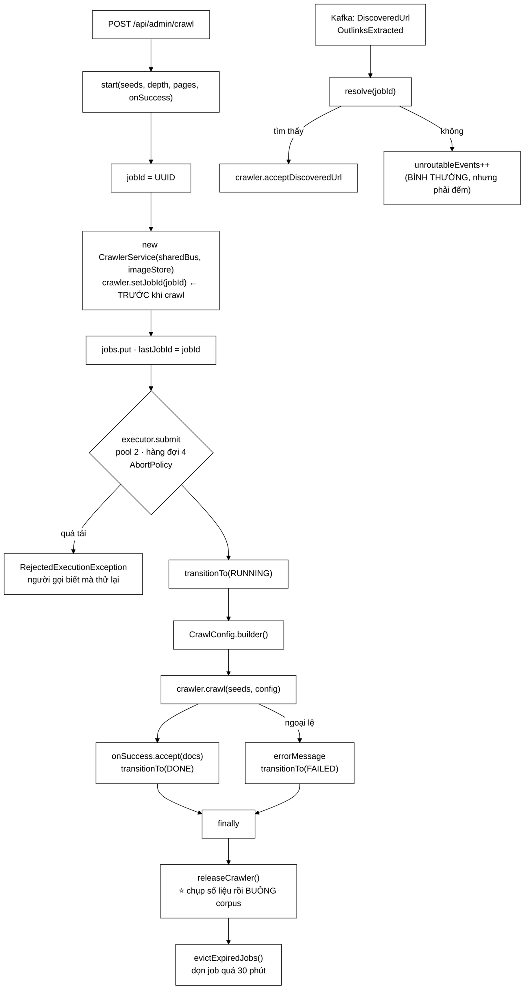

# CrawlJobManager — một endpoint không xác thực và 367 MB không bao giờ được thu hồi

**File nguồn:** `search-engine/src/main/java/com/vnsearch/service/CrawlJobManager.java` (371 dòng)
**Gói:** `com.vnsearch.service` · **Loại:** `@Component`, có lớp lồng `CrawlJob`
**Vị trí trong sơ đồ:** điều phối vòng đời **phiên crawl**, và là **đường về** của URL từ Kafka
**Đọc kèm:** [`CrawlStatus.md`](./CrawlStatus.md) · [`../crawler/CrawlerService.md`](../crawler/CrawlerService.md) · [`../crawler/bus/DiscoveredUrl.md`](../crawler/bus/DiscoveredUrl.md)

---

## 📌 Hiểu trong 30 giây

Lớp này quản lý các job crawl chạy nền. Nhưng điều làm nó đáng đọc kỹ là **bốn
lỗi rò rỉ tài nguyên đã được vá**, và một trong số đó là lỗ hổng bảo mật thật:

```
   ┌──────────────────────────────────────────────────────────────┐
   │  LỖ HỔNG TỪ CHỐI DỊCH VỤ CHỈ TỐN VÀI REQUEST                 │
   │                                                              │
   │  ① Tham chiếu CrawlerService là `final`                      │
   │     → mỗi job giữ TOÀN BỘ corpus của phiên đó                │
   │  ② Bảng jobs KHÔNG BAO GIỜ được dọn                          │
   │     → job sống mãi ⇒ corpus sống mãi                         │
   │  ③ newCachedThreadPool() — KHÔNG giới hạn số job             │
   │  ④ Endpoint bắt đầu crawl trước đây KHÔNG CẦN XÁC THỰC       │
   │                                                              │
   │  Corpus 30.000 trang = 367 MB.                               │
   │  Vài request → hết bộ nhớ → sập.                             │
   └──────────────────────────────────────────────────────────────┘
```



---

## 1. Bốn lỗ rò tài nguyên đã vá

### 1.1 Tham chiếu crawler `final` — Javadoc dòng 122–131

```
   TRƯỚC:
        private final CrawlerService crawler;      ← final
        và bảng jobs sống mãi

   ⇒ mỗi CrawlerService — KÈM ContentStorage chứa TOÀN BỘ tài liệu
     của phiên đó — nằm lại trong bộ nhớ VĨNH VIỄN.

   ┌──────────────────────────────────────────────────────────────┐
   │  Corpus 30.000 trang  =  367 MB                              │
   │                                                              │
   │  Heap 2 GB:                                                  │
   │       job 1  →  367 MB                                       │
   │       job 2  →  734 MB                                       │
   │       job 3  → 1.101 MB                                      │
   │       job 4  → 1.468 MB                                      │
   │       job 5  → OutOfMemoryError                              │
   │                                                              │
   │  VÀI REQUEST là sập.                                         │
   │  Và endpoint đó TRƯỚC ĐÂY KHÔNG CẦN XÁC THỰC.                │
   └──────────────────────────────────────────────────────────────┘
```

**Cách vá — chụp số liệu rồi buông:**

```java
void releaseCrawler() {
    CrawlerService c = crawler;
    if (c == null) return;
    finalPagesCrawled   = c.getPagesCrawledCount();     // ① chụp
    finalQueueSize      = c.getQueueSize();
    finalBloomFilterBits = c.getBloomFilterBits();
    crawler = null;                                      // ② buông
    finishedAtMillis = System.currentTimeMillis();
}
```

```
   Ba con số int (12 byte) thay cho 367 MB.
   Tỷ lệ: giữ lại 0,000003% dữ liệu, mà API trạng thái vẫn trả lời được đủ.

   ⇒ NGUYÊN TẮC: khi một đối tượng nặng chỉ còn cần để TRẢ LỜI VÀI CON SỐ,
     hãy chụp con số rồi buông đối tượng.
```

**Và mẫu đọc kép** ở các getter:

```java
int pagesCrawled() {
    CrawlerService c = crawler;                          // đọc MỘT lần vào biến cục bộ
    return c != null ? c.getPagesCrawledCount() : finalPagesCrawled;
}
```

```
   VÌ SAO PHẢI GÁN VÀO BIẾN CỤC BỘ TRƯỚC:

        return crawler != null ? crawler.getPagesCrawledCount() : finalPagesCrawled;
                ↑ đọc lần 1              ↑ đọc lần 2

        Giữa hai lần đọc, releaseCrawler() có thể chạy trên luồng khác
        → lần 1 thấy != null, lần 2 thấy null
        → NullPointerException

   ⇒ Đây là lỗi TOCTOU (time-of-check to time-of-use) kinh điển với
     trường `volatile`. Gán vào biến cục bộ là cách sửa chuẩn.
     Cả BA getter đều tuân đúng khuôn này.
```

### 1.2 Bảng `jobs` không bao giờ được dọn — Javadoc dòng 249–259

```java
private void evictExpiredJobs() {
    long cutoff = System.currentTimeMillis() - JOB_RETENTION_MINUTES * 60_000L;
    jobs.entrySet().removeIf(entry -> {
        CrawlJob job = entry.getValue();
        return job.status().isTerminal()
                && job.finishedAtMillis > 0
                && job.finishedAtMillis < cutoff;
    });
}
```

```
   Ngay cả SAU KHI crawler đã được buông, mỗi mục còn lại vẫn:
        - tốn bộ nhớ (~200 byte/job)
        - làm getStatus() chậm dần
        - và bảng lớn lên VĨNH VIỄN theo số lần gọi API

   GIỮ 30 PHÚT:
        đủ lâu để người gọi kịp hỏi kết quả của job vừa chạy
        đủ ngắn để bảng không phình
```

**Dọn theo kiểu cơ hội** (Javadoc dòng 257–259) là chi tiết thiết kế đáng chú
ý:

```
   Gọi evictExpiredJobs() MỖI LẦN một job kết thúc,
   thay vì chạy một luồng hẹn giờ riêng.

   LẬP LUẬN: "không có job mới thì cũng không có gì để dọn."

        ✔ không thêm một luồng nền phải quản lý vòng đời
        ✔ không tốn CPU khi hệ thống rảnh
        ✔ dọn đúng lúc bảng vừa lớn thêm

        ✘ nếu KHÔNG có job nào nữa, các job cũ nằm lại mãi
          → nhưng chúng đã buông crawler rồi, chỉ còn ~200 byte
          → vô hại

   ⇒ Đánh đổi đúng: chấp nhận dọn không hoàn hảo để bỏ được
     cả một luồng nền.
```

Ba điều kiện trong `removeIf` đều cần thiết:

| Điều kiện | Chặn ca gì |
|---|---|
| `isTerminal()` | Không xoá job **đang chạy** |
| `finishedAtMillis > 0` | Không xoá job vừa chuyển trạng thái nhưng chưa kịp `releaseCrawler()` |
| `< cutoff` | Chưa quá hạn thì giữ |

### 1.3 Pool không giới hạn — Javadoc dòng 56–63

```
   TRƯỚC:  newCachedThreadPool()  — KHÔNG giới hạn số luồng

   Mà mỗi job crawl TỰ NÓ đã mở một pool 4 luồng riêng
   và giữ cả corpus trong bộ nhớ.

   ⇒ "Không giới hạn số job" = không giới hạn BỘ NHỚ lẫn SỐ LUỒNG.

   10 job đồng thời  →  10 × 4 = 40 luồng crawl
                     →  10 × 367 MB corpus
                     →  và 10 phiên cùng gõ cửa các site đích
                        (phá luôn chính sách lịch sự — xem mục 1.5)
```

```java
private static final int MAX_CONCURRENT_JOBS = 2;
```

> *"Hai job cùng lúc là đủ cho một hệ thống một máy."*

### 1.4 Hàng đợi không giới hạn — Javadoc dòng 68–74

Đây là chi tiết tinh tế nhất, và là lỗi mà **`newFixedThreadPool` mắc phải**:

```java
private final ExecutorService executor = new ThreadPoolExecutor(
        MAX_CONCURRENT_JOBS, MAX_CONCURRENT_JOBS,
        0L, TimeUnit.MILLISECONDS,
        new ArrayBlockingQueue<>(MAX_CONCURRENT_JOBS * 2),   // ← hàng đợi CÓ TRẦN
        new ThreadPoolExecutor.AbortPolicy());               // ← từ chối NGAY
```

```
   ┌──────────────────────────────────────────────────────────────┐
   │  newFixedThreadPool(2) dùng LinkedBlockingQueue KHÔNG GIỚI HẠN│
   │                                                              │
   │  → chỉ 2 job CHẠY cùng lúc  ✓                                │
   │  → nhưng job thứ 1.000 VẪN ĐƯỢC NHẬN và nằm chờ  ✗           │
   │  → "đổi lại một dạng TÍCH LUỸ KHÁC"                          │
   │                                                              │
   │  Ta đã chặn được tích luỹ BỘ NHỚ CRAWLER,                    │
   │  nhưng lại mở ra tích luỹ HÀNG ĐỢI.                          │
   │                                                              │
   │  Và tệ hơn: người gọi nhận HTTP 200 + jobId,                 │
   │  tưởng job sẽ chạy, rồi chờ mãi.                             │
   └──────────────────────────────────────────────────────────────┘

   HÀNG ĐỢI CÓ TRẦN (4 chỗ) + AbortPolicy:
        job thứ 7 → RejectedExecutionException NGAY
        → người gọi BIẾT mà thử lại sau
        → phản hồi TRUNG THỰC thay vì hứa hão
```

```
   BỐN CHÍNH SÁCH TỪ CHỐI CỦA ThreadPoolExecutor:

   AbortPolicy          ném ngoại lệ            ← ĐANG DÙNG
                        ⇒ người gọi biết ngay
   CallerRunsPolicy     luồng gọi tự chạy
                        ⇒ ✘ luồng HTTP của Tomcat sẽ chạy crawl 8 tiếng!
   DiscardPolicy        vứt lặng lẽ
                        ⇒ ✘ người gọi có jobId nhưng job không bao giờ chạy
   DiscardOldestPolicy  vứt job cũ nhất
                        ⇒ ✘ job đã xếp hàng lâu bị huỷ, cũng lặng lẽ

   ⇒ Chỉ AbortPolicy cho người gọi thông tin THẬT.
     Ba cái kia đều hỏng theo kiểu im lặng.
```

### 1.5 Vì sao trần 2 job cũng là vấn đề **lịch sự**, không chỉ bộ nhớ

```
   Mỗi job có UrlFrontier RIÊNG, với bộ hoãn 1 giây/host RIÊNG.

        Job A crawl vnexpress.net  →  1 req/s
        Job B crawl vnexpress.net  →  1 req/s
        ────────────────────────────────────
        Site đích nhận              →  2 req/s

   ⇒ N job = N lần vi phạm cam kết.
   ⇒ Trần 2 job giới hạn mức vi phạm tối đa ở 2×.

   Đây là cùng lớp vấn đề với chống trùng đa tiến trình ở
   DiscoveredUrl.md mục 3 — trạng thái cục bộ gặp môi trường nhiều bản sao.
   Ở chế độ Kafka nó được giải bằng phân hoạch theo host;
   ở đây nó chỉ được GIỚI HẠN, không được giải.
```

---

## 2. `ObjectProvider<CrawlEventBus>` — bean có thể vắng mặt

Javadoc dòng 93–101.

```java
public CrawlJobManager(ObjectProvider<CrawlEventBus> busProvider, ImageStore imageStore) {
    this.sharedBus = busProvider.getIfAvailable();       // null nếu không có
    ...
}
```

```
   Bean CrawlEventBus CHỈ TỒN TẠI khi app.crawler.bus=kafka
   (xem KafkaCrawlConfig).

   TIÊM THẲNG:
        public CrawlJobManager(CrawlEventBus bus, ...) { ... }

        → ở cấu hình MẶC ĐỊNH, Spring không tìm thấy bean
        → NoSuchBeanDefinitionException
        → ỨNG DỤNG KHÔNG KHỞI ĐỘNG ĐƯỢC

        ⇒ "Đúng thứ mà cả thiết kế này cố tránh."
          (xem CrawlEventBus.md mục 1.2 — lý do #2)

   ObjectProvider.getIfAvailable():
        → trả bean nếu có, null nếu không
        → không ném, không cần @Autowired(required=false)
        → và KHÔNG cần @ConditionalOnBean rải rác
```

**Và `null` được xử lý bằng cách không xử lý** — chú thích dòng 205–207:

```java
CrawlerService crawler = new CrawlerService(sharedBus, imageStore);
// sharedBus null ở chế độ mặc định -> CrawlerService tự dựng bus
// in-process và tự đăng ký ba Modular Service. Không có nhánh if nào
// cần thiết ở đây: constructor đã nhận null làm "về mặc định".
```

```
   ⇒ KHÔNG có `if (sharedBus == null) { ... } else { ... }`

   Trách nhiệm chọn bản cài nằm ở CrawlerService, một chỗ duy nhất.
   Lớp này chỉ truyền qua.

   Đây là cách áp dụng đúng của "đẩy quyết định xuống một tầng":
   nếu xử lý null ở đây, sẽ có HAI chỗ biết về hai chế độ —
   và hai chỗ đó sẽ lệch nhau.
```

---

## 3. Đường về từ Kafka — `resolve` và `unroutableEvents`

Javadoc dòng 271–323. Đây là phần liên quan trực tiếp tới kiến trúc phân tán.

### 3.1 Chặng cuối của vòng lặp

```
   Chế độ nhiều tiến trình:

   CrawlerService ──▶ Kafka ──▶ URL Extractor ──▶ Kafka ──▶ QUAY LẠI ĐÂY
                                                              │
                                                    feedDiscoveredUrl
                                                              │
                                                              ▼
                                                        UrlFrontier
```

```java
public boolean feedDiscoveredUrl(DiscoveredUrl url) {
    CrawlerService crawler = resolve(url == null ? null : url.jobId());
    return crawler != null && crawler.acceptDiscoveredUrl(url);
}
```

Đây chính là chỗ `jobId` — trường tồn tại vì một lỗi định tuyến im lặng, xem
[`PageEvent.md`](../crawler/bus/PageEvent.md) mục 4 — được **dùng thật**.

### 3.2 `null` là chuyện bình thường, nhưng phải đếm

Javadoc dòng 296–306 là phần đáng đọc nhất:

```
   TRẢ null LÀ BÌNH THƯỜNG, KHÔNG PHẢI LỖI:

        Một sự kiện có thể quay về SAU KHI job đã kết thúc
        và crawler đã được buông (mục 1.1).

        Với Kafka thì điều này CHẮC CHẮN xảy ra:
             - thông điệp nằm trên topic LÂU HƠN vòng đời job
             - khởi động lại ứng dụng = ĐỌC LẠI chúng từ đầu
             - và lúc đó bảng jobs hoàn toàn rỗng
```

```
   NHƯNG PHẢI ĐẾM:

   ┌──────────────────────────────────────────────────────────────┐
   │  "Nếu con số này BẰNG ĐÚNG tổng số sự kiện thì nghĩa là       │
   │   ĐỊNH TUYẾN HỎNG HOÀN TOÀN — frontier không bao giờ được    │
   │   nạp và mọi phiên crawl dừng ngay sau các seed."            │
   │                                                              │
   │  "Một hệ thống hỏng theo kiểu 'IM LẶNG KHÔNG LÀM GÌ'         │
   │   cần có ĐÚNG MỘT CON SỐ để lộ ra."                          │
   └──────────────────────────────────────────────────────────────┘

   TRIỆU CHỨNG NẾU KHÔNG CÓ BỘ ĐẾM:
        - crawl xong 5 trang (đúng số seed) rồi dừng
        - status = DONE, không lỗi
        - không có gì trong log
        - và người ta sẽ đi tìm lỗi ở UrlFrontier, ở UrlFilter,
          ở HtmlDownloader — mọi nơi trừ đúng chỗ
```

Đây là ví dụ mẫu mực cho việc **thiết kế khả năng quan sát**: một giá trị trả về
`null` hợp lệ vẫn cần một bộ đếm, vì tỷ lệ của nó mới là thông tin.

### 3.3 Ba đường thoát đều đếm

```java
private CrawlerService resolve(String jobId) {
    if (jobId == null || jobId.isBlank()) { unroutableEvents.incrementAndGet(); return null; }
    CrawlJob job = jobs.get(jobId);
    if (job == null)                      { unroutableEvents.incrementAndGet(); return null; }
    CrawlerService crawler = job.crawler;
    if (crawler == null)                  { unroutableEvents.incrementAndGet(); }
    return crawler;
}
```

```
   BA NGUYÊN NHÂN KHÁC NHAU, CÙNG MỘT BỘ ĐẾM:

        ① jobId rỗng          → thông điệp thiếu trường (LỖI THẬT)
        ② job không có trong bảng → job đã bị dọn (BÌNH THƯỜNG)
        ③ crawler đã buông    → job đã kết thúc (BÌNH THƯỜNG)

   ⇒ Gộp ba nguyên nhân làm một là ĐIỂM YẾU: ca ① là lỗi cần sửa,
     ca ②③ là hành vi bình thường. Không phân biệt được nghĩa là
     không cảnh báo được cho ca ①. Xem đề xuất 2.
```

---

## 4. Hướng dẫn về code

### 4.1 `setJobId` **trước** khi crawl — dòng 209

```java
crawler.setJobId(jobId); // TRƯỚC khi crawl, để mọi sự kiện mang đúng id
```

```
   Nếu đặt SAU khi gọi crawl():
        → các trang đầu tiên phát PageEvent với jobId = null
        → URL bóc từ chúng có DiscoveredUrl.jobId = null
        → resolve(null) → unroutableEvents++, URL bị vứt
        → và những URL đó là URL ở ĐỘ SÂU 1 — quan trọng nhất

   Chú thích một dòng này ngăn được một lỗi khởi đầu im lặng.
```

### 4.2 `lastJobId` — thay cho một phép rút gọn sai, dòng 82–90

```java
private volatile String lastJobId;
```

Javadoc chỉ rõ mã cũ sai ở đâu:

```
   TRƯỚC:  jobs.values().stream().reduce((a, b) -> b)

   Ý ĐỊNH:  "lấy phần tử cuối cùng"
   THỰC TẾ: ConcurrentHashMap.values() KHÔNG CÓ THỨ TỰ XÁC ĐỊNH

   ⇒ reduce((a,b) -> b) trả về một job TUỲ Ý, không phải job cuối.
   ⇒ Con số bloomFilterBits trong /api/admin/stats KHÔNG ĐÁNG TIN.

   ┌──────────────────────────────────────────────────────────────┐
   │  CẠM BẪY CHUNG: reduce((a,b) -> b) trên một Stream KHÔNG      │
   │  CÓ THỨ TỰ là một phép "lấy phần tử bất kỳ", không phải       │
   │  "lấy phần tử cuối".                                         │
   │                                                              │
   │  Và nó KHÔNG BÁO LỖI — chỉ trả về sai, đôi khi đúng,          │
   │  tuỳ thứ tự băm.                                             │
   └──────────────────────────────────────────────────────────────┘
```

Chú thích dòng 213 giải thích vì sao đặt `lastJobId` **ngay** chứ không đợi job
chạy: *"để job đang chạy cũng báo cáo được số liệu"* — nếu đặt sau khi
`transitionTo(RUNNING)`, sẽ có một cửa sổ mà `/api/admin/stats` trả về số của
job trước đó.

### 4.3 `releaseCrawler()` trong `finally` — dòng 238–243

```java
} finally {
    // BẮT BUỘC trong finally: job thất bại cũng phải buông corpus,
    // nếu không thì một job lỗi còn giữ bộ nhớ lâu hơn job thành công.
    job.releaseCrawler();
    evictExpiredJobs();
}
```

```
   NẾU ĐẶT TRONG NHÁNH THÀNH CÔNG:

        job DONE    →  buông corpus  ✓
        job FAILED  →  GIỮ 367 MB    ✗

   ⇒ Một job LỖI còn tốn bộ nhớ lâu hơn job THÀNH CÔNG.
   ⇒ Và job lỗi là thứ dễ tạo ra hàng loạt nhất (seed URL sai,
     domain không tồn tại) — tức là đường tấn công dễ nhất
     lại là đường bị bỏ sót.
```

### 4.4 Nuốt `IllegalStateException` khi chuyển sang `FAILED` — dòng 233–237

```java
try {
    job.transitionTo(CrawlStatus.FAILED);
} catch (IllegalStateException ignored) {
    // Da o trang thai cuoi roi — khong ghi de.
}
```

```
   KỊCH BẢN: onSuccess.accept(docs) ném ngoại lệ SAU KHI
             transitionTo(DONE) đã chạy?

        Không — thứ tự trong mã là crawl → onSuccess → DONE.
        Nhưng nếu onSuccess ném, ta vào catch với status vẫn RUNNING
        → RUNNING → FAILED hợp lệ ✓

   VẬY KHI NÀO ISE XẢY RA?
        Khi transitionTo(DONE) đã chạy rồi mà vẫn có ngoại lệ sau đó —
        ví dụ evictExpiredJobs ném, hoặc một lần refactor tương lai
        đảo thứ tự.

   ⇒ Đây là PHÒNG THỦ, và nó ĐÚNG:
     một job đã DONE không được biến thành FAILED.
     Nhưng nuốt lặng lẽ là điểm yếu — xem đề xuất 4.
```

### 4.5 `extractDomains` — suy phạm vi crawl từ seed, dòng 357–370

```java
for (String url : seedUrls) {
    try {
        String host = URI.create(url).getHost();
        if (host != null) domains.add(host);
    } catch (Exception ignored) { }
}
```

```
   Domain cho phép = tập host của các URL hạt giống.

   ⇒ Crawl vnexpress.net thì KHÔNG đi ra tuoitre.vn.
   ⇒ Người gọi không phải khai báo phạm vi riêng.

   ⚠ HAI ĐIỂM YẾU THẬT:

   ① SUBDOMAIN bị loại
        seed = https://vnexpress.net/...
        → domains = {"vnexpress.net"}
        → https://the-thao.vnexpress.net/... KHÔNG được crawl
        (tuỳ cách UrlFilter so khớp — xem UrlFilter.md)

   ② SEED SAI bị bỏ qua LẶNG LẼ
        Nếu MỌI seed đều dị dạng → domains rỗng
        → UrlFilter cho phép... không domain nào? hay mọi domain?
        → và job vẫn chạy, chỉ crawl được 0 trang
        → không có lỗi nào
```

### 4.6 Cạm bẫy khi sửa lớp này

| Ý định | Hậu quả |
|---|---|
| Đổi `crawler` về `final` | Rò rỉ 367 MB mỗi job — lỗ hổng DoS |
| Chuyển `releaseCrawler()` ra khỏi `finally` | Job **lỗi** giữ bộ nhớ lâu hơn job thành công |
| Dùng `newFixedThreadPool` | Hàng đợi không giới hạn — tích luỹ ở chỗ khác |
| Đổi sang `CallerRunsPolicy` | Luồng HTTP của Tomcat chạy crawl 8 tiếng |
| Đổi sang `DiscardPolicy` | Người gọi có `jobId` nhưng job không bao giờ chạy |
| Bỏ `evictExpiredJobs()` | Bảng phình vĩnh viễn theo số lần gọi API |
| `jobs.values().reduce((a,b) -> b)` | Trả về job **tuỳ ý**, không phải job cuối |
| Đọc `crawler` hai lần trong một biểu thức | NPE do TOCTOU |
| Tiêm thẳng `CrawlEventBus` | Ứng dụng không khởi động được ở cấu hình mặc định |
| `setJobId` sau `crawl()` | URL độ sâu 1 mất `jobId`, bị vứt |
| Bỏ `unroutableEvents` | Định tuyến hỏng hoàn toàn mà không có dấu hiệu nào |

---

## 5. Độ phức tạp & chi phí

| Đại lượng | Giá trị |
|---|---|
| Job chạy đồng thời | **2** (`MAX_CONCURRENT_JOBS`) |
| Hàng đợi chờ | **4** (`MAX_CONCURRENT_JOBS * 2`) |
| Job thứ 7 trở đi | `RejectedExecutionException` |
| Luồng crawl mỗi job | 4 (`threadCount(4)`) |
| Bộ nhớ mỗi job **đang chạy** | ~367 MB (corpus 30.000 trang) |
| Bộ nhớ mỗi job **đã xong** | ~200 byte (3 `int` + trạng thái) |
| Thời gian giữ job đã xong | 30 phút |
| `evictExpiredJobs` | O(số job) — chạy khi một job kết thúc |

```
   BỘ NHỚ TỐI ĐA SAU KHI VÁ

        2 job đang chạy   × 367 MB  =  734 MB
        4 job xếp hàng    × ~0 MB   =  0     (chưa tạo corpus)
        N job đã xong     × 200 B   ≈  không đáng kể

        ⇒ TRẦN CỨNG ~734 MB, bất kể có bao nhiêu request.

   TRƯỚC KHI VÁ:  không có trần nào.
        ⇒ Vài request → OOM.

   ┌──────────────────────────────────────────────────────────┐
   │  KHÔNG CÓ TRẦN  ████████████████████████████▶ ∞          │
   │  CÓ TRẦN        ████████                     734 MB      │
   └──────────────────────────────────────────────────────────┘
```

Điểm đáng chú ý: `MAX_CONCURRENT_JOBS = 2` là con số **suy ra từ bộ nhớ**, không
phải từ CPU. Với heap 2 GB và corpus 367 MB/job, 2 job dùng 37% heap — chừa đủ
cho chỉ mục, `ImageStore`, và bộ đệm HTTP. Nếu corpus lớn lên, con số này phải
giảm — xem đề xuất 1.

---

## 6. Kiểm thử liên quan

| Bộ test | Kiểm gì |
|---|---|
| [`CrawlStatusTest`](../../../../test/java/com/vnsearch/service/CrawlStatusTest.md) | Máy trạng thái |
| [`CrawlerServiceBusWiringTest`](../../../../test/java/com/vnsearch/crawler/CrawlerServiceBusWiringTest.md) | Đấu nối bus |
| [`AnalyticsAuthorizationTest`](../../../../test/java/com/vnsearch/analytics/AnalyticsAuthorizationTest.md) | Xác thực endpoint quản trị |

**Lớp này không có bộ test riêng** — khoảng trống lớn nhất, vì bốn lỗ rò ở mục 1
đều có thể tái phát.

```
   ĐẦU VÀO                                        KẾT QUẢ MONG ĐỢI
   ────────────────────────────────────────────   ──────────────────────────
   start(...) 1 job                               trả jobId, status STARTED→RUNNING
   getStatus(jobId không tồn tại)                 null
   job xong                                       terminal=true, crawler == null
   job xong, đọc pagesCrawled                     vẫn ra số ĐÚNG (từ ảnh chụp)
   job lỗi                                        FAILED + error, crawler VẪN buông
   nộp 7 job liên tiếp                            job thứ 7 → RejectedExecutionException
   job xong 31 phút trước                         bị dọn khỏi bảng
   job xong 29 phút trước                         CÒN trong bảng
   feedDiscoveredUrl(jobId lạ)                    false, unroutableEvents++
   feedDiscoveredUrl(null)                        false, unroutableEvents++
   feedDiscoveredUrl khi job đã xong              false, unroutableEvents++
   sharedBus == null                              vẫn chạy (chế độ in-process)
```

Bốn bài test còn thiếu, và cả bốn bảo vệ trực tiếp các lỗ rò:

```java
// 1. LỖ RÒ #1 — crawler PHẢI được buông sau khi job kết thúc
@Test
void jobKetThucThiBuongCrawler() throws Exception {
    var id = manager.start(List.of("https://a.vn"), 1, 5, docs -> { });
    doiJobKetThuc(id);
    // số liệu vẫn đọc được từ ảnh chụp
    assertNotNull(manager.getStatus(id).get("pagesCrawled"));
    // nhưng crawler đã null → kiểm bằng WeakReference tới CrawlerService
    assertTrue(crawlerDaBiThuHoi(), "corpus 367 MB không được thu hồi");
}

// 2. LỖ RÒ #1 kể cả khi job LỖI
@Test
void jobLoiCungBuongCrawler() throws Exception {
    var id = manager.start(List.of("ht!tp://sai"), 1, 5, docs -> { throw new RuntimeException(); });
    doiJobKetThuc(id);
    assertTrue(crawlerDaBiThuHoi());
}

// 3. Quá tải bị từ chối NGAY, không xếp hàng vô hạn
@Test
void quaTaiThiTuChoiNgay() {
    for (int i = 0; i < 6; i++) manager.start(seedCham(), 5, 10_000, d -> { });
    assertThrows(RejectedExecutionException.class,
            () -> manager.start(seedCham(), 5, 10_000, d -> { }));
}

// 4. Sự kiện không định tuyến được PHẢI được đếm
@Test
void sukienKhongDinhTuyenDuocDemLai() {
    long truoc = manager.getUnroutableEventCount();
    manager.feedDiscoveredUrl(new DiscoveredUrl("https://a.vn/x", "a.vn", 1, null, "job-ma"));
    assertEquals(truoc + 1, manager.getUnroutableEventCount());
}
```

---

## 7. Liên kết

- Máy trạng thái: [`CrawlStatus.md`](./CrawlStatus.md)
- Đối tượng nặng được quản lý vòng đời: [`../crawler/CrawlerService.md`](../crawler/CrawlerService.md)
- Cấu hình phiên crawl: [`../crawler/CrawlConfig.md`](../crawler/CrawlConfig.md) · [`../crawler/UrlFilter.md`](../crawler/UrlFilter.md)
- Thông điệp đường về: [`../crawler/bus/DiscoveredUrl.md`](../crawler/bus/DiscoveredUrl.md) · [`../crawler/bus/OutlinksExtracted.md`](../crawler/bus/OutlinksExtracted.md)
- Vì sao có `jobId`: [`../crawler/bus/PageEvent.md`](../crawler/bus/PageEvent.md) mục 4
- Nơi bean bus được tạo có điều kiện: [`../config/KafkaCrawlConfig.md`](../config/KafkaCrawlConfig.md)
- Bên gọi `feedDiscoveredUrl`: [`../config/CrawlKafkaListeners.md`](../config/CrawlKafkaListeners.md)
- Bên gọi `start`: [`../controller/AdminController.md`](../controller/AdminController.md) · [`./SearchEngineFacade.md`](./SearchEngineFacade.md)
- Kho ảnh dùng chung: [`../crawler/modular/ImageStore.md`](../crawler/modular/ImageStore.md)
- Observer theo dõi tiến độ: [`../crawler/ConsoleCrawlListener.md`](../crawler/ConsoleCrawlListener.md) · [`../crawler/CrawlListener.md`](../crawler/CrawlListener.md)
- Tổng quan: `docs/ARCHITECTURE.md`
